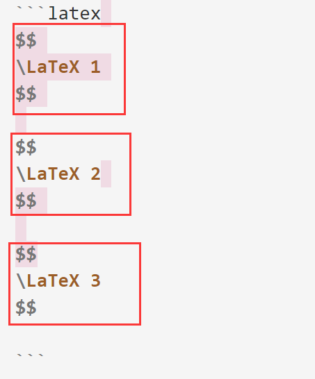

# 博客搭建 TODOList

## 格式显示bug
- [ ] 配置到action中
### 高亮
- 编写一个脚本, 将`==text==`语法修改为 html`<mark>text</mark>`, 并配置 github action
  - 原因: 高亮语法(`==text==`)在 PyMdown 中存在 bug

### LaTeX显示
- 修复类似`$ ax+b $`中因为`$`前后有空格导致的 latex 渲染出错
- 修复方式: `\$(.*?)\$`匹配 latex, 用`${$1}$`替换
  - mark: $$会被上面的匹配, 记得排除掉
- note: 问题发现: latex框格渲染有些问题
  ```
    # 渲染错误
    text
    $$
      \LaTeX
    $$
    text
  
    # 渲染正确, 需要换行来间隔
    text
  
    $$
      \LaTeX
    $$
  
    text
  ```
- note1: 暂时还不能处理 text$$text$$text 中有换行符的情况, 但是这种不应该出现, 手动修复吧
  - 但是修复了LaTeX段中的换行符, 将`\n+`替换为`\n`

```latex
LaTeX段内部有换行
$$
\LaTeX 4

\LaTeX 5
$$
```

- note2: 当出现如下情况, 不能正确匹配

  - 原因在于正则匹配时, 第一个`$$`段将末尾的`\n`都吞掉了, 第二个`$$`不能匹配到`\n`, 错误识别
  - plan1: 添加一步: 将`$$\n\n$$`替换为`$$\n\n\n$$`, 让后面的`$$`能匹配到`\n`
  - plan2: `(\n\n?)(\$\$([\s\S]*?)\$\$)(\n\n?)`修改为`(\n\n?)(\$\$([\s\S]*?)\$\$)(\n)`, 即末尾只匹配一次
    - 否决: 这样多次运行transfer后, 会让换行越来越多!

```latex
$$
\LaTeX 1
$$

$$
\LaTeX 2
$$

$$
\LaTeX 3
$$

```



### 跳转失效
问题: 类似`[泳道图](# 2.1.3 泳道图 ※)`的跳转语法失效

问题原因: 标准markdown语法会转换标题中的符号, 而mkdocs(或者说Python Markdown 渲染引擎)似乎更极端(直接删掉了中文, 只保留英文), 因此标题跳转不可用

解决方案: 暂无

- 或许这个应该算渲染引擎的bug, 毕竟改我heading又不该引用
