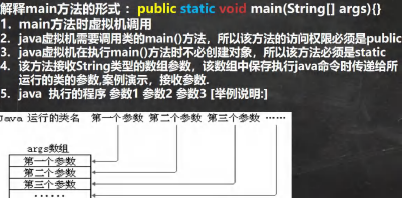

# 10.1类变量和类方法(static)

2022年5月25日

16:31

## 一、类变量

1.  什么是类变量：也叫静态变量、静态属性，是该类所有对象公有的变量。
2. 如何定义类变量：

​		访问修饰符 ==static== 数据类型 变量名；

如何使用类变量：

​		类名.类变量名 / 对象名.类变量名 (使用类名.类变量名更清晰)

3. 注意点:

   1. 类变量在==类加载时==就初始化了(只要类加载了,就能使用类变量)	

   2. 类变量的生命周期与类相同

      

## 二、类方法

1.  类方法：==只能访问类变量的方法==
2.  定义：访问修饰符 ==static== 返回数据类型 方法名(){}
3.  调用: 类名.类方法名 / 对象名.类方法名
4.  注意点:
    1.  当方法中不涉及任何和对象相关的成员,可将方法定义为类方法,提高效率
    2.  类方法不可使用和对象有关的关键字, 如this和super
    3.  静态方法只能访问静态变量; 非静态方法可以访问静态成员和非静态成员

## 类的加载时机

1.  创建对象实例时(new)
2.  创建子类对象实例时,父类也会被加载
3.  使用类的静态成员时

# 10.2main方法



1. 在main()方法中，我们可以直接调用main 方法所在类的静态方法或静态属性。

2. 但是，不能直接访问该类中的非静态成员，必须创建该类的一个实例对象后，才能通过这个对象去访问类中的非静态成员

   

# 10.3代码块

1.  什么是代码块:

    又叫<font color='#66ccff'>初始化块</font>, 属于类的一部分, 类似于一个方法, 将逻辑语句封装在方法体中, 用{}包围起来

    但和方法不同, 没有方法名、返回、参数，只有方法体，而且不用通过对象或类显式调用，而是在加载类时，或者创建对象时显式调用

2.  定义：

    ```
    [修饰符(static)] {
    
    代码
    
    };
    ```

    注意:

    1.  加上static修饰的是静态代码块; 没有static的是普通代码块/非静态代码块
    2.  尾部';'可加可不加

3.  作用: 对构造器的补充, 用于初始化 (如果多个构造器中都有重复的语句,可以移到初始化块中,提高代码的重用性)

4.  代码块的注意事项
    1.  static代码块随着类的[**加载**](##类的加载时机)而执行,并且==只会执行一次==

        如果是普通代码块,==每创建一个对象就会执行==

    1.  创建一个对象时, 在一个类调用顺序:
        1.  调用静态属性和静态代码块的初始化(多个静态就按定义顺序调用)
        2.  调用普通属性和普通代码块的初始化(多个普通就按定义顺序调用)
        3.  调用构造方法
    2.  创建一个子类对象, 各种构造调用顺序:
        1.  调用**父类**静态属性和静态代码块的初始化(多个静态就按定义顺序调用)
        2.  调用**子类**静态属性和静态代码块的初始化(多个静态就按定义顺序调用)
        3.  调用**父类**普通属性和普通代码块的初始化(多个普通就按定义顺序调用)
        4.  调用**父类**构造方法
        5.  调用**子类**普通属性和普通代码块的初始化(多个普通就按定义顺序调用)
        6.  调用**子类**构造方法
    3.  与静态方法相似, 静态代码块只能调用静态成员; 普通代码块可以调用任意成员

# 10.4单例设计模式

2022年6月4日

21:48

1.  设计模式
    1.  什么是设计模式：静态方法和属性的经典使用。 设计模式是在大量地实践中总结和理论化后优选的代码结构、编程风格、以及解决问题的思考方式
    2.  分类：单例模式、观察者模式、工厂模式、适配器模式、装饰者模式、代理模式、模板模式、职责链模式、其他（组合模式、桥接模式、原型模式······）

2.  单例模式<font color='orange'>（单个的实例）</font>
    1.  什么是单例模式：采取一定的方法保证在整个的软件系统中，对于某一个类只能存在一个对象实例，并且该类只能提供一个取得其对象实例的方法
    2.  分类：

        饿汉式：在类加载时就创建一个对象，在调用getInstance时返回这个对象

        ​	（多线程安全）

        懒汉式：只有在调用getInstance时才创建对象

        ​	（多线程不安全，不要使用）

3.  单例模式实例

    1. 饿汉式实现步骤：

       1.  构造器私有化（防止直接new）
       2.  在类的内部创建一个private static对象
       3.  向外暴露一个static的公共方法（常命名为getInstance）


```java
public class SingletonEH {

    /**
    *是否 Lazy 初始化：否
    *是否多线程安全：是
    *实现难度：易
    *描述：这种方式比较常用，但容易产生垃圾对象。
    *优点：没有加锁，执行效率会提高。
    *缺点：类加载时就初始化，浪费内存。
    *它基于 classloder 机制避免了多线程的同步问题，
    * 不过，instance 在类装载时就实例化，虽然导致类装载的原因有很多种，
    * 在单例模式中大多数都是调用 getInstance 方法，
    * 但是也不能确定有其他的方式（或者其他的静态方法）导致类装载，
    * 这时候初始化 instance 显然没有达到 lazy loading 的效果。
    */

    private static SingletonEH instance = new SingletonEH();
    private SingletonEH (){}
    public static SingletonEH getInstance() {

        System.out.println("instance:"+instance);
        System.out.println("加载饿汉式....");
        return instance;

    }

}
```

（2）懒汉式

```java
public class SingletonLH {

    /**
    *是否 Lazy 初始化：是
    *是否多线程安全：否
    *实现难度：易
    *描述：这种方式是最基本的实现方式，这种实现最大的问题就是不支持多线程。因为没有加锁 synchronized，所以严格意义上它并不算单例模式。
    *这种方式 lazy loading 很明显，不要求线程安全，在多线程不能正常工作。
    */

    private static SingletonLH instance;
    private SingletonLH (){}
    public static SingletonLH getInstance() {

        if (instance == null) {
            instance = new SingletonLH();
        }

        return instance;

    }
}
```


​       


# 10.5final关键字

2022年6月5日

0:47

1.  final基本介绍：可以修饰类、属性、方法和局部变量

2.  作用：
    1.  修饰==类==时，类不会被==继承==
    2.  修饰==方法==时，方法不会被==覆盖/重写(override)==
    3.  修饰类的==某个属性==时，这个属性只会被==赋值一次==<font color='orange'>（与const必须在初始化时不同）</font>
    4.  修饰某个==局部变量==时，它==不能被修改==

3.  注意点
    1.  final修饰的属性又叫<font color='#66ccff'>常量</font>，一般用<font color='#66ccff'>XX_XX_XX(大写)</font>命名
    2.  final修饰的属性在定义时必须赋初值，且以后不能再修改，赋初值位置任意

        （定义时/构造器中/代码块中）

    1.  final修饰的属性如果是静态的，则初始化的位置只能在定义/静态代码块，不能在构造器中赋值
    2.  final类不能继承，但是可以实例化对象<font color='orange'>（废话）</font>
    3.  final方法不能被重写，但是可以继承
    4.  如果已经声明了final类，这个类的方法没必要再声明final
    5.  final不能修饰构造方法（构造器）
    6.  final常和static搭配使用，效率更高，不会导致类加载（因为底层编译器做了优化处理）
    7.  包装类（Integer、Double、Float、Boolean等）都是final类，String也是final类

# 10.6抽象类

2022年6月5日

1:19

1.  抽象类：当父类的某些方法需要声明，但又不确定如何实现时，可以声明为==抽象方法==，那么这个类就是==抽象类==

2.  声明：

    ```java
    访问修饰符 abstract 类名{
    	访问修饰符 abstract 返回类型 方法名（参数列表）；
    }
    ```
    
3.  注意点
    1. 抽象类==不能被实例化==

    2. 抽象类不一定要包含abstract方法，但是有abstract方法的类必须声明为abstract类

    3. abstract只能修饰==类和方法==

    4. 抽象类可以有任意成员，比如非抽象方法、构造器、静态成员等等

    5. 抽象方法不能有主体，即不能实现

       ​	如：`abstract void f（）{······}；`

    6. 如果一个类继承了抽象类，那么它必须实现抽象方法，除非它将自己也声明为abstract类

    7. 抽象方法不能用private、final和static修饰，因为这几个关键词与重写相违背

# 10.7模板设计模式

2022年6月5日

12:34

1.  基本介绍：抽象类作为多个子类的通用模板，子类在抽象类的基础上进行扩展和改造，但子类总体上会保留抽象类的行为模式。
2.  模板设计模式能解决的问题：
    1.  当功能内部一部分实现是确定的，另一部分实现是不确定的，这时可以将不确定的部分暴露出来（声明为抽象方法），让子类来实现
    2.  实际：编写一个抽象父类，父类提供了多个子类的通用方法，并将一个或多个方法留给子类实现，这就是一种模板模式
3.  <font color='orange'>将类中的方法拆解，使用方法来调用方法，然后将共有部分设计成抽象父类来继承</font>

# 10.8接口

2022年6月6日

0:45

1.  什么是接口：将一些没有实现的方法封装到一起，在某个类要使用时，再根据实际情况把这些方法写出来

2.  语法：

    ```
    interface 接口名 {
    
    //属性
    
    //抽象方法
    
    }
    ```

    ```
    class 类名 implements 接口1(,接口2,接口3…) {
    
    自己的属性;
    
    自己的方法;
    
    必须实现的接口的抽象方法
    
    }
    ```

3.  接口是更加抽象的抽象类，抽象类的方法可以有方法体，但接口里的所有方法都没有方法体。（JDK7.0）

    接口体现了多态和高内聚低耦合的思想。

    JDK8.0后接口类可以有静态方法，默认方法，也就是接口中可以有方法的具体实现

4.  <font color='orange'>接口就相当于提出的需求，类实现接口就是实现接口定义的方法；此外接口也能规范接口所声明的方法名，便于识别和调用</font>

5.  接口的注意事项
    1.  接口不能被实例化
    2.  接口中所有的方法是==public方法==，接口中的方法可以==省略abstract==
    3.  类实现接口需要实现接口的所有方法 （可以使用alt+enter快速实现）

        特例：==抽象类==实现接口，可以不用实现接口的方法

    4.  接口中的属性必须是(默认是)==public static final==

        ->接口中的属性通过 接口名.属性名 调用

    5.  接口不能继承其他类，但可以继承接口（可以继承多个）

    6.  接口修饰符只能为public / 默认（类也是）

6.  接口与继承
    1.  接口与继承解决的问题不同：

        继承解决代码的复用性与可维护性；接口用于设计各种规范，让其他类实现这些方法

    2.  继承需要满足is-a关系，而接口只需要满足like-a关系

    3.  接口在一定程度上实现代码解耦合 （接口规范性 + 动态绑定）

7.  接口的多态性
    1.  接口引用可以指向实现了接口的类的对象（与向上转型相似）
    2.  利用接口可以实现多态数组
    3.  利用接口可以实现多态传递

        例：如果有一个接口IB继承了接口IA，类CA只实现了接口IA，那么IB引用 也可以指向类CA的对象

# 10.9内部类

2022年6月7日

16:44

1.  基本介绍：

    一个类的内部又完整嵌套了另一个类结构，被嵌套的类成为内部类（Inner class），嵌套其他类的类成为外部类（outer class）

    内部类的最大特点就是可以直接访问私有属性，并且可以体现类与类之间的==包含==关系

* 类的五大成员：属性、方法、构造器、代码块、内部类
2. 基本语法：

```java
class Outer { //外部类

    class Inner { //内部类

    }

}

class Other { //外部的其他类

}
```

3. 内部类的分类：

* 定义在外部类的==局部位置==上（比如方法内）

| 1）[局部内部类](#局部内部类) | 2）[匿名内部类](#匿名内部类) |
| ---------------------------- | ---------------------------- |

-   定义在外部类的==成员位置==上

| 1）成员内部类（非static） | 2）静态内部类（static） |
|---------------------------|-------------------------|


### <font color='#66ccff'>局部内部类</font>

1. **定义**: 局部内部类是 定义在==外部类的局部位置==（比如方法）的类，且==有类名==

2. **特点**: 

   1.  局部内部类可以直接访问外部类的所有成员（包括私有成员）


   2. 局部内部类不能添加访问修饰符（public、private、protect），但可以使用final

      <font color='orange'>（因为他的地位就是一个局部变量，而局部变量不能用访问修饰符（成员变量才有），且局部变量可以使用final）</font>

   3. 作用域：仅在<font color='red'>定义</font>局部内部类的方法/代码块中

   4. 局部内部类<font color='red'>同样是类</font>,也可以继承（不过要在作用域中进行继承）

   5. 局部内部类直接访问外部类成员；

      外部类需要创建对象，然后通过对象调用 定义内部类的那个方法 来间接访问局部内部类

   6. 外部类成员和局部内部类成员重名时，想使用外部类成员的话，使用`外部类名.this.成员`

​    

### <font color='#66ccff'>匿名内部类</font>

1. 定义: 匿名内部类是 定义在==外部类的局部位置==的类，==没有类名==

2. 对于某个类,如果只使用一次，可以改为定义成匿名内部类
3. 基本语法：

```java
（类或接口 对象名 =） new 类或接口（参数列表）{

	类体

}；
```

>  ​	编译类型为 接口/类，
>
> ​	运行类型为 ==系统分配的匿名内部类名==（<font color='red'>外部类名$序号</font>）

* <font color='#66ccff'>例:</font>

* **接口**:

    ```java
    IA tiger = new IA() { //IA为外部一个普通的接口
    
        @Override
    
        public void cry() {
    
            System.out.println("老虎叫唤...");
    
        }
    
    };
    ```
    
    * 本质为 - >
    
      ```java
      class Outer04$1 implements IA {
      
      @Override
      
      public void cry() {
      
      System.out.println("老虎叫唤...");	
      
      }
      
      }
      ```

* **类**:

    ```java
    Father father = new Father("jack"){ //Father为外部一个普通的类
    
        @Override
    
        public void test() {
    
            System.out.println("匿名内部类重写了test 方法");
    
        }
    
    };
	```
	
	* 本质为 - >
	
	  ```java
	  class Outer04$2 extends Father{
	  
	      @Override
	      
	      public void test() {
	      
	      	System.out.println("匿名内部类重写了test 方法");
	      
	      }
	  
	  }
	  ```
	
	  

4. 特点:

   1. 匿名内部既是一个类的定义, 同时它本身也是一个对象, 因此可以直接调用类方法(只调用方法, 不用接收匿名内部类)

      ```java
      new Father("jack"){
      
          @Override
      
          public void test() {
      
          	System.out.println("匿名内部类重写了test 方法");
      
          }
      
      }.test();
      ```

   
   
   2. 其他性质和局部内部类一样 [局部内部类](#局部内部类)
   
5. 匿名内部类的应用: 可以将匿名内部类作为==**方法实参**==来传递

例:

```java
public class AnonymousInnerClass {

    public static void main(String[] args) {//使用匿名内部类作为实参, new一个实现接口的匿名类, 调用f()方法

        f(new IA {

            @Override

            public void show() {

                System.out.println("使用匿名内部类作为实参");

            }

    	});

        //传统方法

        f(new CA());

	}

    //静态方法f(), 形参为接口类型

    public static void f(IA ia) {

    	ia.show();

    }

}

interface IA {

	void show();

}

//不使用匿名内部类,则需要写一个实现了IA接口的类,然后创建类对象作为实参

//称为硬编码

class CA implements IA {

    @Override

    public void show() {

    	System.out.println("使用外部类的对象作为实参");

    }

}
```


### <font color='#66ccff'>成员内部类</font>

1. 定义: 成员内部类是定义在外部类的==成员位置== ,并且没有static修饰

2. 特点: 

   1.  可以直接访问外部类的所有成员, 包含私有成员

   2.  可以添加任意访问修饰符(public、protected、默认、private), <font color='orange'>(因为他的地位就是一个类成员)</font>

   3.  作用域: 与外部类的其他成员一样, 为整个类体

   4.  成员内部类==直接访问==外部类成员

      外部类需要==先创建对象==, 再访问成员内部类

      外部类其他类访问成员内部类

      ```java
        // 方式1:
      
        // outer08.new Inner08(); 相当于把new Inner08()当做是outer08 成员
      
        Outer08.Inner08 inner08 = outer08.new Inner08();
      
        // 方式2: 在外部类中，编写一个方法，可以返回Inner08 对象实例
      
        Outer08.Inner08 inner08Instance = outer08.getInner08Instance();
      ```
   
   5.  外部类成员和局部内部类成员重名时，想使用外部类成员的话，使用外部类名.this.成员


### <font color='#66ccff'>静态内部类</font>

1. 定义: 静态内部类是定义在==外部类的成员位置==, 并且是==static修饰==

2. 特点: 

   1.  可以直接访问外部类的所有静态成员, 包含私有的, ==但不能直接访问非静态成员==
   1.  可以添加任意访问修饰符(public、protected、默认、private), <font color='orange'>因为他的地位就是一个类成员</font>
   1.  作用域: 与外部类的其他成员一样, 为整个类体

   4. 成员内部类直接访问外部类静态成员

      外部类先创建对象, 再访问成员内部类

      外部类其他类访问成员内部类

      ```java
      //方式1: 因为静态内部类，是可以通过类名直接访问(前提是满足访问权限)
      
      Outer10.Inner10 inner10 = new Outer10.Inner10();
      
      //方式2: 编写一个方法，可以返回静态内部类的对象实例.
      
      Outer10.Inner10 inner101 = outer10.getInner10Instance();
      ```

      

   
