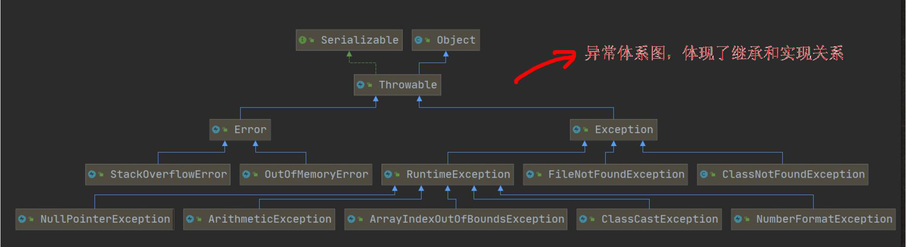
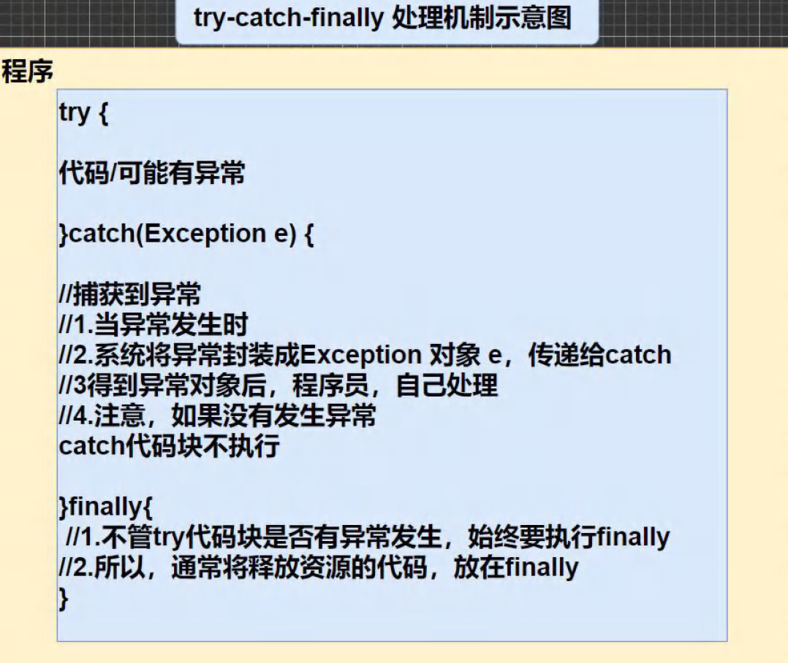
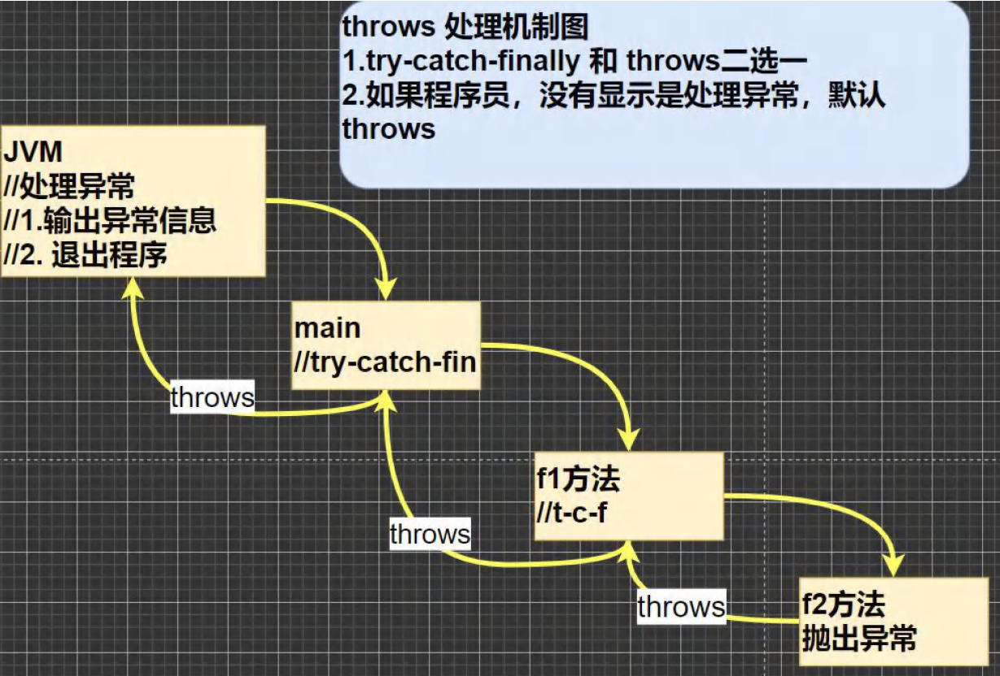

# 异常Exception

2022年6月14日

20:17

### 1. 异常

1.  基本概念: 程序执行中发生的不正常情况 (开发过程中的语法错误和逻辑错误不是异常)

2.  分类

    1. Error(错误): JVM==无法解决的严重问题==。

       <font color='#66ccff'>如:</font> JVM系统内部错误, 资源耗尽等严重情况(StackOverflowError栈溢出, OOM out of memory)

       Error是严重错误， 程序会崩溃

    2. Exception: 其它==因编程错误或偶然的外在因素导致的一般性问题==，可以使用针对性的代码进行处理。

       <font color='#66ccff'>如: </font>空指针访问，试图读取不存在的文件，网络连接中断等

3.  `Exception`:

    1.  Exception 分为两大类:<font color='#66ccff'>运行时异常</font>[程序运行时，发生的异常]和<font color='#66ccff'>编译时异常</font>[编程时，编译器检查出的异常]。

    2.  运行时异常: 编译器无法检查。

        一般指编程时的逻辑错误， 是程序员应该避免的异常。

        像java.lang.RunTimeException类以及其子类都是运行时异常

        对于运行时异常可以不做处理,因为这类异常很普遍, 如果全处理可能会对程序的可读性和运行效率产生影响

    3. 编译时异常:编译器要求必须处理

4.  异常体系图

### 2. 常见的运行时异常

1.  `NullPointerException` 空指针异常:

    当应用程序试图在需要对象的地方使用null时,抛出该异常

2.  `ArithmeticException` 数学运算异常:

    当出现异常的运算条件时(如除以0), 抛出此类的一个实例

3.  `ArrayIndexOutOfBoundsException`: 数组下标越界异常:

    用非法索引访问数组时抛出的异常(数组越界)

4.  `ClassCastException` 类型转换异常:

    试图将对象强制转换为不是实例的子类时, 抛出该异常

5.  `NumberFormatException` 数字格式不正确异常[]:

    应用程序试图将字符串转换成一种数值类型, 但该字符串不能转换为适当格式时, 抛出该异常 (可以使用异常来判断输入的是否是满足条件的数字)

### 3. 编译异常

1.  介绍: 编译异常指在编译期间就需要处理的异常, 否则代码无法通过编译
2.  常见的编译异常:
    1.  SQLException//操作数据库时，查询表可能发生异常
    2.  IOException//操作文件时，发生的异常
    3.  FileNotFoundException//当操作一个不存在的文件时，发生异常
    4.  ClassNotFoundException//加载类,而该类不存在时，异常EOFException//操作文件，到文件末尾,发生异常
    5.  IllegalArguementException //参数异常


# 异常处理

2022年6月16日

18:44

### 1.  异常处理概述: 当异常发生时, 对异常处理的方式

### 2.  异常处理方式:
1.  try-catch-finally 程序员在代码中捕获发生的异常, 自行处理
2.  throws 将发生的异常抛出, 交给调用者(方法)来处理 **最顶级的调用者是JVM**

### 3.  结构:





### 4.  try-catch异常处理
1. Java提供try和catch块来处理异常

   * try用于包含可能出错的代码, catch块用于处理try块中发生的异常

   * 可以根据需要在程序中有多个try-catch块

2. 语法:

```java
try {

//可疑代码

//将异常生成一个对应的异常对象, 传递给catch块

} catch(异常) {

..对异常的处理

} finally{….} //可以没有finally
```

3. 注意事项

1. 如果异常发生, 异常后面的代码不会执行, 直接进入到catch块

2. 如果没有异常发生, 跳过catch块

3. ==不论什么情况, 都会执行finally块== (就算return了依然会执行finally)

​		->因此关闭连接, 释放资源等必须执行的代码可以放到finally中

4. 一个try可以对应==多个==catch, 捕获不同的异常, 但只会匹配一个异常

​		->因此父类异常在后, 子类异常在前

5. 可以进行try-finally配合使用, 这种用法相当于没有捕获异常, 因此程序会直接崩溃 / 退出

应用场景:执行一段代码, 不论是否发生异常, 都必须执行某个业务逻辑

### 5.  throws异常处理
1. 如果一个方法可能生成某种异常, 但是不能确定如何处理这种异常, 则此方法应该显式地声明抛出异常, 表明此方法不对异常进行处理, 而是让==该方法的调用者来处理==

2. 在方法声明中用throws语句可以声明抛出异常的列表, throws后面的异常类型可以是方法中产生的异常类型, 也可以是它的父类

3.  格式:

```java
returnType method_name(paramList) throws Exception 1,Exception2,…{…}
```


​        

# 自定义异常

### 1. 基本概念: 

   当程序中出现了某种"错误", 但该错误信息并没有在[Throwable](media/d208007479dc95aa008ba6a3936b9463.png)子类中描述处理. 此时可以自己设计一个异常类用于描述该错误信息

### 2.  自定义异常的步骤
1.  定义类: 自定义异常类名, 并==继承==Exception或RunTimeException
2.  如果继承Exception, 这个自定义异常为编译异常
3.  如果继承RunTimeException, 这个自定义异常属于运行异常 (通常自定义异常都是运行异常)

### 3.  例

* 接收一个Person对象, 要求年龄在18-120之间, 否则抛出一个异常

```java
import java.util.Scanner;

public class CustomException {

    public static void main(String[] args) {

        int age;
        Scanner scanner = new Scanner(System.in);
        age = scanner.nextInt();

        if(age < 18 || age > 120) {
        	throw new AgeException("年龄需要在18~120之间");
        } else System.out.println("年龄输入正确");
    }

	class AgeException extends RuntimeException {
        public AgeException(String message) { //构造器
            super(message);
        }
    }

}
```

  

### 4. throws和throw的区别

* `throws`: 一种异常处理的方式, 在方法==声明==位置使用, 后面加上异常==类型==

* `throw`: 手动生成异常的关键字, 在方法体中使用, 后面加上异常==对象==
