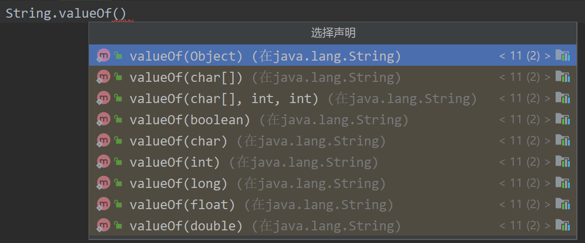
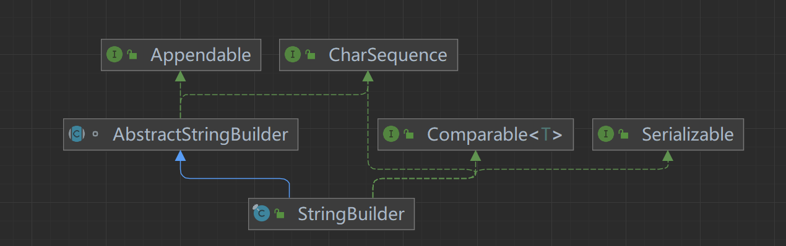

# 13.1 包装类

2022年6月17日

16:07

### 1.  包装类概述

* 什么是包装类: 包装类针对8种基本数据类型, 设置了相对应的引用类型

### 2.  基本数据类型和其对应的包装类

| 基本数据类型 | 包装类    |
|--------------|-----------|
| boolean      | Boolean   |
| char         | Character |
| byte         | Byte      |
| short        | Short     |
| int          | Integer   |
| long         | Long      |
| float        | Float     |
| double       | Double    |


### 3. 包装类与基本数据类型的相互转化

   1.  <font color = "green">手动 jdk5前使用, jdk5后==废弃==</font>

       <font color='green'>手动装箱: Integer integer1 = new Integer(250);</font>

       ​		<font color='green'>或者用Integer.valueOf()方法</font>

       <font color='green'>手动拆箱: int i1 = integer1.intValues();</font>


      2. 自动装箱: Integer integer2 = i; //底层使用的是`valueOf(i)`
       
         自动拆箱: int i2 = integer2; //底层使用的是`intValue()`

### 4. 包装类和String类的相互转化
   1. 包装类(Integer integer = 250) -\> String

      ```java
      String str1 = integer  +  "";
      String str2 = integer.toString();
      String str3 = String.valueOf(Integer);
      ```

      * [String.valueOf()](#String.valueOf)

   2. String(String str4 = "12345") -\> 包装类(Integer)

   ```java
    Integer i2 = Integer.parseInt(str4); //自动装箱
    Integer i3 = new Integer(str4);
   ```

​    

### 5. Integer类和Character类的常用方法

| Integer.MIN_VALUE           | 返回int最小值  |
| --------------------------- | -------------- |
| Integer.MAX_VALUE           | 返回int最大值  |
| Character.isDigit('a')      | 判断是不是数字 |
| Character.isLetter('a')     | 判断是不是字母 |
| Character.isUpperCase('a')  | 判断是不是大写 |
| Character.isLowerCase('a')  | 判断是不是小写 |
| Character.isWhitespace('a') | 判断是不是空格 |
| Character.toUpperCase('a')  | 转成大写       |
| Character.toLowerCase('A')  | 转成小写       |

### 6. IntegerCache

   1. 引入:

        Integer integer1 = n; Integer integer2 = n;

        当-128\<= n \<= 127 时, integer1 == integer2 true;

        当n\<-128 \|\| n\>127 时, integer1 == integer2 false;

        为什么?

   2. 自动装箱调用valueOf方法, 会使用到IntegerCache类
   
        ```java
        public static Integer valueOf(int i) {
            if (i \>= IntegerCache.low && i \<= IntegerCache.high)
            	return IntegerCache.cache[i  +  (-IntegerCache.low)];
        
            return new Integer(i);
        }
        ```
        
   3. IntegerCache是Integer类中的静态内部类，用于缓存数据便于节省内存、提高性能。
   
        IntegerCache内部的cache数组 在static块部分 初始化了值为IntegerCache.low 到 IntegerCache.high 的Integer对象
   
        `IntegerCache.low = -128`
   
        `IntegerCache.high = 127`
   
        除了Integer之外，在其他包装类(例如：Byte，Short，Long等)中也存在类似的设计。


### String.valueOf()

重载了很多类型



在这里, 使用的是参数列表为Object的方法

```java
public static String valueOf(Object obj) {

return (obj == null) ? "null" : obj.toString();

}
```


# 13.2 String类

2022年6月18日

12:59

### 一、String类

1.  String类介绍 \<java.lang.String\>
    -   String类用于保存字符串
    -   字符串常量对象是用双引号("")括起的字符串序列,如"hello world"
    -   String的字符使用Unicode字符编码, 一个字符(不论是字母还是汉字)占2Byte
    -   String常用构造器:
        1.  String str = new String(); //空字符串
        2.  String str = new String(String otherString);
        3.  String str = new String(char[] other);
        4.  String str = new String(char[] other, int startIndex, int count);
    
2.  创建String对象的两种方式
    
    1. 直接赋值 String s1 = "哈哈哈";
    
       先从常量池中查看有没有"哈哈哈"数据空间, 如果有, 则s1直接指向;
    
       否则创建一个"哈哈哈", 然后s1再指向"哈哈哈"
    
       s1最终指向的是==常量池=="哈哈哈"的空间地址
	
       <font color='#66ccff'>e.g.</font> `String a = "abc", b = "abc";`
	
       `System.out.println(a == b);` <font color='red'>//true</font>
    
    2. 调用构造器 String s2 = new String("哈哈哈");
    
       先在堆中创建空间, 里面维护了==value属性==, 指向常量池的"哈哈哈"空间
    
       如果堆中没有"哈哈哈", 创建再指向"哈哈哈"
    
       s2最终指向的是==堆中==的value的空间地址
    
       
       
       * <font color='#66ccff'>e.g. </font>`String s1 = new String("abc")``
       
       * ``String s2 = new String("abc");`
       
       * System.out.println(s1 == s2);`<font color='red'> //false</font>
       
           3. intern方法
           
              在调用"ab".intern()方法的时候会返回"ab"，但是这个方法会首先检查字符串池中是否有"ab"这个字符串，如果==存在则返回这个字符串的引用==，否则就将这个字符串==添加到字符串池==中，然后返回这个字符串的引用。

3. 字符串的特性

   1.  String是一个final类, 代表不可变的字符序列

   2. 字符串是不可变的, 一个字符串对象一旦被分配, 其内容就不可变

      <font color='#66ccff'>e.g.1</font> `String str = "abc"  +  "def"; //创建了1个对象`

      <font color='#66ccff'>e.g.2</font> `String str1 = "abc";`

      `String str2 = "def";`

      `String str3 = "abcdef";`

      `String str4 = str1  +  str2; //创建了3个对象`

   因此在对String进行修改时，会产生大量地副本对象残留在内存中，降低效率

   ==如果要对String做大量修改，就不要使用String==

4. [String类的常用方法](https://www.runoob.com/java/java-string.html)

   1.  说明:

       String类是用于保存字符串常量的。所以每次更新都需要重新开辟空间来存储， 效率较低， 因此提供StringBuilder和StringBuffer来增强String的功能，提高效率

   2.  常用方法一览：

| equals                  | 区分大小写, 判断内容是否相等                                 |
| ----------------------- | ------------------------------------------------------------ |
| equalsIgnoreCase        | 不区分大小写, 判断内容是否相等                               |
| length                  | 获取字符个数(即字符串长度)                                   |
| indexOf                 | 获取字符在字符串中第一次出现的索引(从0开始), 未找到则返回-1  |
| lastIndexOf             | 获取字符在字符串中最后一次出现的索引(从0开始), 未找到则返回-1 |
| substring               | 截取指定索引范围的子串 substring(4) 从4开始截取后面都有内容 substring(0, 5) [0, 5), 长度为4 |
| trim                    | 去除前后空格                                                 |
| charAt                  | 获取某索引处的字符(用来替代str[index])                       |
|                         | 接下来的方法均是返回一个操作后的对象, 而非对调用方法的对象进行操作 |
| toUpperCase toLowerCase | 转换大小写                                                   |
| concat                  | 拼接字符串                                                   |
| replace                 | 替换字符串中的字符                                           |
| split                   | 分割字符串 注意： . 、 \$、 \| 和 \ 等转义字符，必须得加 \\\\。 注意：多个分隔符，可以用 \| 作为连字符。 |
| compareTo               | 比较两个字符串大小                                           |
| toCharArray             | 转换成字符串数组                                             |
| format                  | 格式字符串 (和c的printf相似)                                 |

### 二、StringBuffer类

1.  StringBuffer类介绍
    -   java.lang.StringBuffer代表可变字符序列, 可以对字符串内容进行增减
    -   很多方法与String相同, 但StringBuffer是可变长度的
    -   StringBuffer是一个容器
    
2.  StringBuffer类本质

    
    
    -   StringBuffer 的直接父类是AbstractStringBuilder
    
        \-\>在父类中AbstractStringBuilder 有属性char[] value,不是final, 该value数组存放字符串内容, 因此==存放在堆中==
    
        \-\>因为StringBuffer 字符内容是存在char[] value, 所以变化(增加/删除)不用每次都更新地址(即不是每次创建新对象)， 所以效率高于String
    
    -   StringBuffer 实现了==Serializable接口==, 即StringBuffer 的对象可以<font color='#66ccff'>串行化</font>(对象可以网络传输,可以保存到文件)
    
    - StringBuffer 是一个final 类，==不能被继承==
    
      

3. StringBuffer与String的区别

   -   String保存的是==字符串常量(存放在常量池)==, 里面的值不能更改, 每次String类的更新实际上是更改地址, 效率较低

   -   StringBuffer保存的是==字符串变量(存放在堆中)==, 里面的值可以更改, 每次StringBuffer的更新实际上可以更新内容, 不用每次都更新地址, 效率较高

4. String和StringBuffer的转化

   1.  String-\>StringBuffer
       1. 构造器

          `StringBuffer stringBuffer = new StringBuffer(str);`
       
       2. 使用`StringBuffer.append`方法
       
          `StringBuffer stringBuffer = new StringBuffer(str);`

   2. StringBuffer-\>String

      1. 构造器

         `String str = new String(stringBuffer);`

      2. toString方法

         `String str = new stringBuffer.toString();`

5. StringBuffer常用方法 

   ```java
   StringBuffer stringBuffer = new StringBuffer("0123456789");
   ```

| 方法    | 说明                                                         |
| ------- | ------------------------------------------------------------ |
| append  | 在对象==后面增加==字符/字符串 `stringBuffer.append("0xxx"); //01234567890xxx` |
| delete  | ==删除==索引为[left, right)的字符 right可以越界 `stringBuffer.delete(10,1000); //0123456789` |
| replace | ==替换==索引为[left, right)的字符 `stringBuffer.replace(1,3,"0"); //003456789` |
| indexOf | ==查找==指定的子串在字符串第一次出现的索引, 如果找不到则返回-1 ==stringBuffer.indexOf("8")); //7== |
| insert  | ==插入==在索引处插入指定字符串(这个索引处的元素向后移) `stringBuffer.insert(2,"12"); //00123456789` |
| length  | 返回字符串==长度==                                           |

6. 注意点

   `String str = null;`

   `StringBuffer sb1 = new StringBuffer(); sb.append(str);`

   这里, 内部调用了AbstractStringBuilder的appendNull()方法, 在增加了"null",从而避免异常

   `StringBuffer sb2 = new StringBuffer(str);`

   错误 抛出NullpointerException

### 三、StringBuilder类

1. StringBuilder类介绍

   1. 是一个可变的字符序列

   2. 此类提供一个与StringBuffer兼容的API, 但不能保证同步(StringBuilder 不是线程安全)。该类被设计用作 StringBuffer的一个简易替换，用于字符串缓冲区被单个线程使用的时候。如果可能，建议优先采用该类因为在大多数实现中，它比 StringBuffer 要快

   3. 在 StringBuilder上的主要操作是 append和 insert 方法，可重载这些方法,以接受任意类型的数据。

2. StringBuilder本质



-   StringBuilder 继承AbstractStringBuilder 类
-   实现了Serializable接口 ,说明StringBuilder 对象是可以串行化( 对象可以网络传输,可以保存到文件)
-   StringBuilder 是final 类, 不能被继承
-   StringBuilder 对象字符序列仍然是存放在其父类AbstractStringBuilder 的char[] value;
-   因此，字符序列是堆中
-   StringBuilder 的方法, 没有做互斥的处理, 即没有synchronized 关键字, 因此只能在单线程的情况下使用

### 四、String、StringBuffer和StringBuilder的选择和比较

1. String、StringBuffer和StringBuilder的选择

   1.  StringBuilder和StringBuffer很相似， 均为可变的字符序列， 且方法也一样

   2. String：不可变字符序列，效率低，但复用率高
   3. StringBuffer：可变字符序列， 效率较高，线程安全
   4. StringBuilder：可变字符序列，效率最高，但线程不安全

2. String、StringBuffer和StringBuilder 的选择
   1. 如果字符串存在大量的修改操作，一般使用StringBuffer 或StringBuilder
   2. 如果字符串存在大量的修改操作，并在单线程的情况,使用 StringBuilder
   3. 如果字符串存在大量的修改操作，并在多线程的情况,使用 StringBuffer
   4. 如果我们字符串很少修改，被多个对象引用，使用String,比如配置信息等

* ##### StringBuilder 的方法使用和StringBuffer一样,不再说.


# 13.3 Math方法

2022年6月18日

16:38

1.  Math类介绍 \<java.lang.Math\>

    Math类包含用于执行基本数学运算的方法，如初等指数、对数、平方根和三角函数

2.  常用方法

| abs        | 求绝对值(重载了很多类型)                         |
|------------|--------------------------------------------------|
| pow        | 求幂                                             |
| ceil/floor | 向上取整/向下取整                                |
| round      | 四舍五入                                         |
| sqrt       | 开平方                                           |
| random     | 求随机数(返回一个[0,1)的随机小数,然后再加以处理) |
| max/min    | 返回最大值/最小值                                |


# 13.4Arrays类

2022年6月20日

12:04

### 1.  Arrays类介绍

​	Arrays包含了一系列静态方法, 用于管理和操作数组(如排序和搜索)<font color='#66ccff'><java.util.Arrays></font>

### 2.  常用方法

1.  `toString` ：返回数组的字符串形式 `Arrays.toString(arr);`

2. `sort`：排序

<font color='red'>自定义排序</font>：传入①待排数组 ②实现了==Comparator接口==（实现compare方法）的匿名内部类<font color='#66ccff'>\<接口编程\></font>

```java
Arrays.sort(integers, new Comparator<Integer>(){
    @Override
    public int compare(Integero1, Integero2){
    	return o1 - o2;
    }
});
```

-   <font color='red'>注意</font>：compare返回值为int， 而比较（\</\>）的返回值为boolean， 所以应该使用减法

​	==升序：o1 - o2 / o1.compareTo(o2)， 降序o2 - o1 / o2.compareTo(o1)==

原因: 底层binarySort调用了compare方法, 将compare返回值与0比较

```java
while(left < right){
    int mid = (left + right)>>>1;
    if(c.compare(pivot,a[mid]) < 0)
    	right = mid;
    else
    	left = mid  +  1;
}
```


3. `binarySearch`: 二分法查找目标值, 要求数组已排序

```java
int index = Arrays.binarySearch(arr(, fromIndex: 0, toIndex: 4), 3);
```

* 如果数组中[fromIndex, toIndex),找到,返回该元素在数组中的索引; 未找到该元素, 返回 ==-==(low  +  1) -<font color='orange'>(第一个大于该元素的位置 + 1)</font>

4. `copyOf`: 数组元素复制

```java
Integer[] newArr = Arrays.copyOf(arr, arr.length);
```

-   从arr数组中, 拷贝arr.length的元素到newArr中去

​		如果拷贝长度 \> arr.length 就在后面补==null==

​		如果拷贝长度 \< 0 抛出异常 `NegativeArraySizeException`

-   方法底层使用的是System.arraycopy()


5. `fill`: 数组元素填充

```java
Integer[] new(arr, 250);
```

6. `equals`: 比较两个数组元素内容是否完全一致

```java
boolean equals = Arrays.equals(arr1, arr2);
```

7. `asList`: 将一组值转换为list(集合)

```java
List asList = Arrays.asList(1,2,4,5,6,4);
```


​       

# 13.5System类

2022年6月21日

11:43

1.  System类介绍 <font color='#66ccff'>\<java.lang.System\></font>

    System 类位于 java.lang 包，代表当前Java程序的运行平台，系统级的很多属性和控制方法都放置在该类的内部。由于该类的构造方法是 private 的，所以无法创建该类的对象，也就是无法实例化该类。

2.  System类常见方法
    1. exit: 退出当前程序

    2.  arraycopy: 复制数组元素, 比较适合底层调用, 一般使用的是Arrays.copyOf来复制数组

        ```java
        int[] src = {1,2,3};
        int[] dest;
        System.arraycopy(src, 0, dest, 0, src.length);
        ```

        `src`: the source array源数组

        `srcPos`: 从源数组的哪个位置开始拷贝

        `dest`: the destination srray目标数组

        `destPos`: 将源数组的数据拷贝到目标数组的哪个索引
        
        `length`: 从源数组拷贝多少个数据到目标数组

    1. currentTimeMillens: 返回当前时间距离1970-1-1(<font color='#66ccff'>格林威治时间（GMT）</font>)的毫秒数

       `System.currentTimeMillens();`

    2. gc: 运行垃圾回收机制

       `System.gc();`

# 13.6BigInteger和BigDecimal类

2022年6月21日

12:22

1.  BigInteger和BigDecimal介绍 \<java.math.BigInteger/BigDecimal\>

    BigInteger适合保存比较大的整型(高精度整数)

    BigDdecimal适合保存精度更高的浮点型(高精度小数)

2.  常用方法
    1.  add 加
    2.  subtract 减
    3.  multiply 乘
    4.  divide 除

# 13.7日期类

2022年6月21日

18:59

### 1. 第一代日期类-Date类 

1.  <font color='#66ccff'>Date</font>: 精确到毫秒, 代表特定的瞬间, 但只能按照固定格式输出 <font color='#66ccff'><java.util.Date></font>
2.  <font color='#66ccff'>SimpleDateFormat</font>: 格式和解析日期的类 <font color='#66ccff'>\<java.text.SimpleDateFormat></font>

    它允许进行格式化(日期-\>文本), 解析(文本-\>日期)和规范化

| 字母 | 日期或时间元素           | 表示                                                         | 示例                                  |
| ---- | ------------------------ | ------------------------------------------------------------ | ------------------------------------- |
| G    | Era 标志符               | [Text](https://tool.oschina.net/uploads/apidocs/jdk-zh/java/text/SimpleDateFormat.html#text) | AD                                    |
| y    | 年                       | [Year](https://tool.oschina.net/uploads/apidocs/jdk-zh/java/text/SimpleDateFormat.html#year) | 1996; 96                              |
| M    | 年中的月份               | [Month](https://tool.oschina.net/uploads/apidocs/jdk-zh/java/text/SimpleDateFormat.html#month) | July; Jul; 07                         |
| w    | 年中的周数               | [Number](https://tool.oschina.net/uploads/apidocs/jdk-zh/java/text/SimpleDateFormat.html#number) | 27                                    |
| W    | 月份中的周数             | [Number](https://tool.oschina.net/uploads/apidocs/jdk-zh/java/text/SimpleDateFormat.html#number) | 2                                     |
| D    | 年中的天数               | [Number](https://tool.oschina.net/uploads/apidocs/jdk-zh/java/text/SimpleDateFormat.html#number) | 189                                   |
| d    | 月份中的天数             | [Number](https://tool.oschina.net/uploads/apidocs/jdk-zh/java/text/SimpleDateFormat.html#number) | 10                                    |
| F    | 月份中的星期             | [Number](https://tool.oschina.net/uploads/apidocs/jdk-zh/java/text/SimpleDateFormat.html#number) | 2                                     |
| E    | 星期中的天数             | [Text](https://tool.oschina.net/uploads/apidocs/jdk-zh/java/text/SimpleDateFormat.html#text) | Tuesday; Tue                          |
| a    | Am/pm 标记               | [Text](https://tool.oschina.net/uploads/apidocs/jdk-zh/java/text/SimpleDateFormat.html#text) | PM                                    |
| H    | 一天中的小时数（0-23）   | [Number](https://tool.oschina.net/uploads/apidocs/jdk-zh/java/text/SimpleDateFormat.html#number) | 0                                     |
| k    | 一天中的小时数（1-24）   | [Number](https://tool.oschina.net/uploads/apidocs/jdk-zh/java/text/SimpleDateFormat.html#number) | 24                                    |
| K    | am/pm 中的小时数（0-11） | [Number](https://tool.oschina.net/uploads/apidocs/jdk-zh/java/text/SimpleDateFormat.html#number) | 0                                     |
| h    | am/pm 中的小时数（1-12） | [Number](https://tool.oschina.net/uploads/apidocs/jdk-zh/java/text/SimpleDateFormat.html#number) | 12                                    |
| m    | 小时中的分钟数           | [Number](https://tool.oschina.net/uploads/apidocs/jdk-zh/java/text/SimpleDateFormat.html#number) | 30                                    |
| s    | 分钟中的秒数             | [Number](https://tool.oschina.net/uploads/apidocs/jdk-zh/java/text/SimpleDateFormat.html#number) | 55                                    |
| S    | 毫秒数                   | [Number](https://tool.oschina.net/uploads/apidocs/jdk-zh/java/text/SimpleDateFormat.html#number) | 978                                   |
| z    | 时区                     | [General time zone](https://tool.oschina.net/uploads/apidocs/jdk-zh/java/text/SimpleDateFormat.html#timezone) | Pacific Standard Time; PST; GMT-08:00 |
| Z    | 时区                     | [RFC 822 time zone](https://tool.oschina.net/uploads/apidocs/jdk-zh/java/text/SimpleDateFormat.html#rfc822timezone) | -0800                                 |

```java
Date date1 = new Date(); //获取当前系统时间

Date date2 = new Date(1003939200000L); //按指定毫秒数得到时间

System.out.println(date2); //Thu Oct 25 00:00:00 CST 2001

//格式化日期

SimpleDateFormat sdf = new SimpleDateFormat("yyyy年MM月dd日 HH:mm:ss EEEE");

System.out.println(sdf.format(date1)); //2022年06月21日 20:58:49 星期二

//解析文本

SimpleDateFormat sdf2 = new SimpleDateFormat("yyyy年MM月dd日");

String str = "2001年10月25日 我也不知道具体时间";

try{ //必须对可能抛出的java.txt.ParseException异常进行处理

    Date parse = sdf2.parse(str);

    System.out.println(parse.getTime()); //1003939200000

} catch (ParseException parseException) {

    System.out.println("日期格式错误");

}
```


### 2. 第二代日期类-Calendar类（）

1.  源码:

```java
public abstract class Calendar implements Serializable, Cloneable, Comparable<Calendar>
```

2. <font color='#66ccff'>Calendar</font>类是一个==抽象类== <font color='#66ccff'><java.util.Calendar></font>

   它为特定瞬间与一组诸如 YEAR、MONTH、DAY_OF_MONTH、HOUR等日历字段之间的转换提供了一些方法并为操作日历字段(例如获得下星期的日期)提供了一些方法

-   常用: `get(Calendar.YEAR);…`

    ```java
    Calendarc=Calendar.getInstance();//创建日历对象
    
    //获取日历对象的某个日历字段
    
    System.out.println("年:"  +  c.get(Calendar.YEAR));
    
    System.out.println("月:"  +  (c.get(Calendar.MONTH) + 1));
    
    System.out.println("日:"  +  c.get(Calendar.DAY_OF_MONTH));
    
    System.out.println("小时:"  +  c.get(Calendar.HOUR));
    
    System.out.println("分钟:"  +  c.get(Calendar.MINUTE));
    
    System.out.println("秒:"  +  c.get(Calendar.SECOND));
    
    //Calendar没有专门的格式化,需要自己手动组合
    
    System.out.println(
        c.get(Calendar.YEAR)
         +  "-"  +  (c.get(Calendar.MONTH) + 1)
         +  "-"  +  c.get(Calendar.DAY_OF_MONTH)
         +  " "  +  c.get(Calendar.HOUR_OF_DAY)
         +  ":"  +  c.get(Calendar.MINUTE)
         +  ":"  +  c.get(Calendar.SECOND)); //24小时制 12小时用HOUR
    ```
    
    

### 3. 第三代日期类-LocalDate、LocalTime、LocalDateTime

1. 前两代日期类的不足

   JDK 1.0中包含了java.util.Date类，但是它的大多数方法已经在JDK 1.1引入Calendar类之后被弃用了。

   而Calendar也存在问题:

   1.  可变性: 像日期和时间这样的类应该是不可变的。
   2.  偏移性: Date中的年份是从1900开始的,而月份都从0开始
   3.  格式化:格式化只对Date有用，Calendar则不行。
   4.  此外，它们也不是线程安全的;不能处理闰秒等(每隔2天，多出1s).

2. <font color='#66ccff'>LocalDate</font>：日期(年月日) 只包含日期，可以获得日期字段

   <font color='#66ccff'>LocalTime</font>: 时间(时分秒) 只包含时间, 可以获得时间字段

   <font color='#66ccff'>LocalDateTime</font>: 日期 + 时间(年月日 时分秒) 可以获得时期和时间字段

   <font color='#66ccff'>\<java.time></font>

   ```java
   //用now()方法返回当前日期/时间的对象
   
   LocalDateTime ldt = LocalDateTime.now();
   
   System.out.println(ldt); //2022-06-22T16:31:43.232888500
   
   
   //使用DateTimeFormatter对象来格式化
   
   DateTimeFormatter dateTimeFormatter=DateTimeFormatter.ofPattern("yyyy年MM月dd日HH:mm:ss");
   
   System.out.println(dateTimeFormatter.format(ldt));
   
   //也可以自己组合
   
   System.out.println("年" + ldt.getYear());
   
   System.out.println("月" + ldt.getMonth());
   
   System.out.println("日" + ldt.getDayOfMonth());
   
   System.out.println(ldt.getDayOfWeek());
   
   System.out.println(ldt.getDayOfYear());
   
   //还提供了plus和minus方法对时间进行加减
   
   LocalDateTime ldt2 = ldt.plusDays(890);
   
   System.out.println("890天后=" + dateTimeFormatter.format(ldt2));
   
   System.out.println("12345678分钟前=" + dateTimeFormatter.format(ldt.minusMinutes(12345678)));
   ```

3. <font color='#66ccff'>DateTimeFormatter</font> 格式日期类 \<java.time.format\>

   1. 类似于SimpleDateFormat

   2. 使用:

      ```java
      DateTimeFormatter dtf = DateTimeFormatter.ofPattern(格式);
      
      String format = dtf.format(日期对象);
      ```

4. <font color='#66ccff'>Instant</font> 时间戳 <font color='#66ccff'>\<java.time.Instant\></font>

   1.  类似于Date, 并提供了一系列与Date转换的方式

   * Instant -\> Date

     `Date date = Date.from(instant);`

   * Date -\> Instant

     `Instant instant = date.toInstant();`

5. 一些其他的常用方法
   1.  MonthDay类: 检查重复事件
   1.  是否是闰年
   1.  增加日期的某个部分

