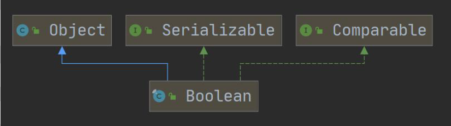
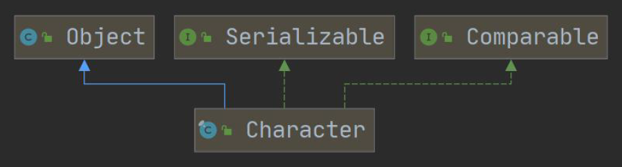
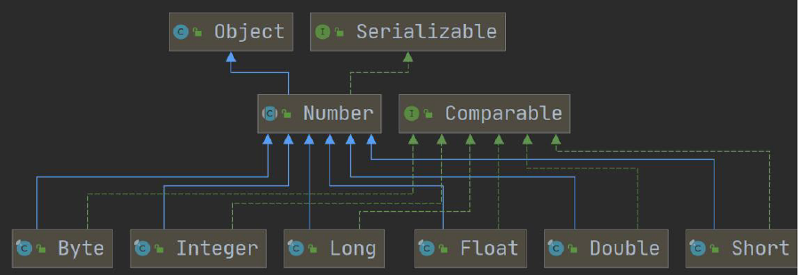
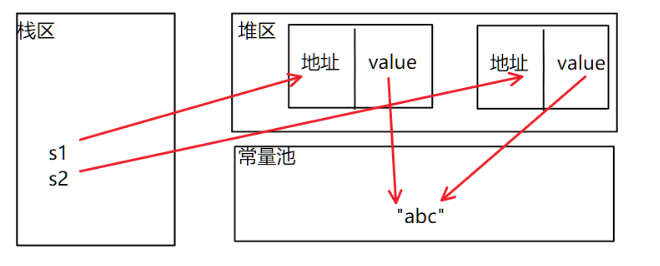
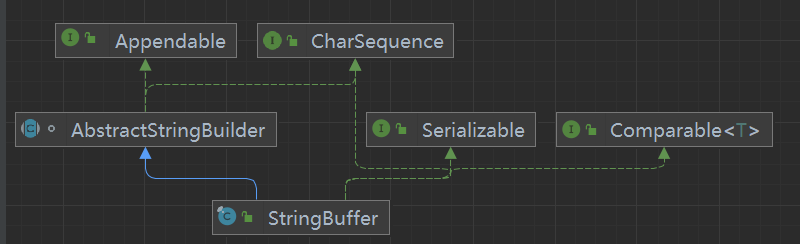

# 13.1 包装类

2022 年 6 月 17 日

16:07

### 1. 包装类概述

- 什么是包装类: 包装类针对 8 种基本数据类型, 设置了相对应的引用类型

### 2. 基本数据类型和其对应的包装类

| 基本数据类型 | 包装类    |
| ------------ | --------- |
| boolean      | Boolean   |
| char         | Character |
| byte         | Byte      |
| short        | Short     |
| int          | Integer   |
| long         | Long      |
| float        | Float     |
| double       | Double    |







### 3. 包装类与基本数据类型的相互转化

1.  <font color = "green">手动 jdk5 前使用, jdk5 后==废弃==</font>

    <font color='green'>手动装箱: Integer integer1 = new Integer(250);</font>

    ​ <font color='green'>或者用 Integer.valueOf()方法</font>

    <font color='green'>手动拆箱: int i1 = integer1.intValues();</font>

2.  自动装箱: Integer integer2 = i; //底层使用的是`valueOf(i)`

    自动拆箱: int i2 = integer2; //底层使用的是`intValue()`

### 4. 包装类和 String 类的相互转化

1.  包装类(Integer integer = 250) -\> String

    ```java
    String str1 = integer  +  "";
    String str2 = integer.toString();
    String str3 = String.valueOf(Integer);
    ```

    - [String.valueOf()](#String.valueOf)

2.  String(String str4 = "12345") -\> 包装类(Integer)

```java
 Integer i2 = Integer.parseInt(str4); //自动装箱
 Integer i3 = new Integer(str4);
```

​

### 5. Integer 类和 Character 类的常用方法

| Integer.MIN_VALUE           | 返回 int 最小值 |
| --------------------------- | --------------- |
| Integer.MAX_VALUE           | 返回 int 最大值 |
| Character.isDigit('a')      | 判断是不是数字  |
| Character.isLetter('a')     | 判断是不是字母  |
| Character.isUpperCase('a')  | 判断是不是大写  |
| Character.isLowerCase('a')  | 判断是不是小写  |
| Character.isWhitespace('a') | 判断是不是空格  |
| Character.toUpperCase('a')  | 转成大写        |
| Character.toLowerCase('A')  | 转成小写        |

### 6. IntegerCache

1.  引入:

    Integer integer1 = n; Integer integer2 = n;

    当-128\<= n \<= 127 时, integer1 == integer2 true;

    当 n\<-128 \|\| n\>127 时, integer1 == integer2 false;

    为什么?

2.  自动装箱调用 valueOf 方法, 会使用到 IntegerCache 类

    ```java
    public static Integer valueOf(int i) {
        if (i \>= IntegerCache.low && i \<= IntegerCache.high)
        	return IntegerCache.cache[i  +  (-IntegerCache.low)];

        return new Integer(i);
    }
    ```

3.  IntegerCache 是 Integer 类中的静态内部类，用于缓存数据便于节省内存、提高性能。

    IntegerCache 内部的 cache 数组 在 static 块部分 初始化了值为 IntegerCache.low 到 IntegerCache.high 的 Integer 对象

    `IntegerCache.low = -128`

    `IntegerCache.high = 127`

    除了 Integer 之外，在其他包装类(例如：Byte，Short，Long 等)中也存在类似的设计。

### String.valueOf()

重载了很多类型


在这里, 使用的是参数列表为 Object 的方法

```java
public static String valueOf(Object obj) {

return (obj == null) ? "null" : obj.toString();

}
```

# 13.2 String 类

2022 年 6 月 18 日

12:59

### 一、String 类

1.  String 类介绍 \<java.lang.String\>
    - String 类用于保存字符串
    - 字符串常量对象是用双引号("")括起的字符串序列,如"hello world"
    - String 的字符使用 Unicode 字符编码, 一个字符(不论是字母还是汉字)占 2Byte
    - String 常用构造器:
      1.  String str = new String(); //空字符串
      2.  String str = new String(String otherString);
      3.  String str = new String(char[] other);
      4.  String str = new String(char[] other, int startIndex, int count);
2.  创建 String 对象的两种方式

    1. 直接赋值 String s1 = "哈哈哈";

       先从常量池中查看有没有"哈哈哈"数据空间, 如果有, 则 s1 直接指向;

       否则创建一个"哈哈哈", 然后 s1 再指向"哈哈哈"

       s1 最终指向的是==常量池=="哈哈哈"的空间地址

       <font color='#66ccff'>e.g.</font> `String a = "abc", b = "abc";`

       `System.out.println(a == b);` <font color='red'>//true</font>

    2. 调用构造器 String s2 = new String("哈哈哈");

       先在堆中创建空间, 里面维护了==value 属性==, 指向常量池的"哈哈哈"空间

       如果堆中没有"哈哈哈", 创建再指向"哈哈哈"

       s2 最终指向的是==堆中==的 value 的空间地址

       

       - <font color='#66ccff'>e.g. </font>`String s1 = new String("abc")``

       - ``String s2 = new String("abc");`

       - System.out.println(s1 == s2);`<font color='red'> //false</font>

         3. intern 方法

            在调用"ab".intern()方法的时候会返回"ab"，但是这个方法会首先检查字符串池中是否有"ab"这个字符串，如果==存在则返回这个字符串的引用==，否则就将这个字符串==添加到字符串池==中，然后返回这个字符串的引用。

3.  字符串的特性

    1.  String 是一个 final 类, 代表不可变的字符序列

    2.  字符串是不可变的, 一个字符串对象一旦被分配, 其内容就不可变

        <font color='#66ccff'>e.g.1</font> `String str = "abc"  +  "def"; //创建了1个对象`

        <font color='#66ccff'>e.g.2</font> `String str1 = "abc";`

        `String str2 = "def";`

        `String str3 = "abcdef";`

        `String str4 = str1  +  str2; //创建了3个对象`

    因此在对 String 进行修改时，会产生大量地副本对象残留在内存中，降低效率

    ==如果要对 String 做大量修改，就不要使用 String==

4.  [String 类的常用方法](https://www.runoob.com/java/java-string.html)

    1.  说明:

        String 类是用于保存字符串常量的。所以每次更新都需要重新开辟空间来存储， 效率较低， 因此提供 StringBuilder 和 StringBuffer 来增强 String 的功能，提高效率

    2.  常用方法一览：

| equals                  | 区分大小写, 判断内容是否相等                                                                             |
| ----------------------- | -------------------------------------------------------------------------------------------------------- |
| equalsIgnoreCase        | 不区分大小写, 判断内容是否相等                                                                           |
| length                  | 获取字符个数(即字符串长度)                                                                               |
| indexOf                 | 获取字符在字符串中第一次出现的索引(从 0 开始), 未找到则返回-1                                            |
| lastIndexOf             | 获取字符在字符串中最后一次出现的索引(从 0 开始), 未找到则返回-1                                          |
| substring               | 截取指定索引范围的子串 substring(4) 从 4 开始截取后面都有内容 substring(0, 5) [0, 5), 长度为 4           |
| trim                    | 去除前后空格                                                                                             |
| charAt                  | 获取某索引处的字符(用来替代 str[index])                                                                  |
|                         | 接下来的方法均是返回一个操作后的对象, 而非对调用方法的对象进行操作                                       |
| toUpperCase toLowerCase | 转换大小写                                                                                               |
| concat                  | 拼接字符串                                                                                               |
| replace                 | 替换字符串中的字符                                                                                       |
| split                   | 分割字符串 注意： . 、 \$、 \| 和 \ 等转义字符，必须得加 \\\\。 注意：多个分隔符，可以用 \| 作为连字符。 |
| compareTo               | 比较两个字符串大小                                                                                       |
| toCharArray             | 转换成字符串数组                                                                                         |
| format                  | 格式字符串 (和 c 的 printf 相似)                                                                         |

### 二、StringBuffer 类

1.  StringBuffer 类介绍
    - java.lang.StringBuffer 代表可变字符序列, 可以对字符串内容进行增减
    - 很多方法与 String 相同, 但 StringBuffer 是可变长度的
    - StringBuffer 是一个容器
2.  StringBuffer 类本质

    

    - StringBuffer 的直接父类是 AbstractStringBuilder

      \-\>在父类中 AbstractStringBuilder 有属性 char[] value,不是 final, 该 value 数组存放字符串内容, 因此==存放在堆中==

      \-\>因为 StringBuffer 字符内容是存在 char[] value, 所以变化(增加/删除)不用每次都更新地址(即不是每次创建新对象)， 所以效率高于 String

    - StringBuffer 实现了==Serializable 接口==, 即 StringBuffer 的对象可以<font color='#66ccff'>串行化</font>(对象可以网络传输,可以保存到文件)

    - StringBuffer 是一个 final 类，==不能被继承==

3.  StringBuffer 与 String 的区别

    - String 保存的是==字符串常量(存放在常量池)==, 里面的值不能更改, 每次 String 类的更新实际上是更改地址, 效率较低

    - StringBuffer 保存的是==字符串变量(存放在堆中)==, 里面的值可以更改, 每次 StringBuffer 的更新实际上可以更新内容, 不用每次都更新地址, 效率较高

4.  String 和 StringBuffer 的转化

    1.  String-\>StringBuffer

        1.  构造器

            `StringBuffer stringBuffer = new StringBuffer(str);`

        2.  使用`StringBuffer.append`方法

            `StringBuffer stringBuffer = new StringBuffer(str);`

    2.  StringBuffer-\>String

        1. 构造器

           `String str = new String(stringBuffer);`

        2. toString 方法

           `String str = new stringBuffer.toString();`

5.  StringBuffer 常用方法

    ```java
    StringBuffer stringBuffer = new StringBuffer("0123456789");
    ```

| 方法    | 说明                                                                                                |
| ------- | --------------------------------------------------------------------------------------------------- |
| append  | 在对象==后面增加==字符/字符串 `stringBuffer.append("0xxx"); //01234567890xxx`                       |
| delete  | ==删除==索引为[left, right)的字符 right 可以越界 `stringBuffer.delete(10,1000); //0123456789`       |
| replace | ==替换==索引为[left, right)的字符 `stringBuffer.replace(1,3,"0"); //003456789`                      |
| indexOf | ==查找==指定的子串在字符串第一次出现的索引, 如果找不到则返回-1 ==stringBuffer.indexOf("8")); //7==  |
| insert  | ==插入==在索引处插入指定字符串(这个索引处的元素向后移) `stringBuffer.insert(2,"12"); //00123456789` |
| length  | 返回字符串==长度==                                                                                  |

6. 注意点

   `String str = null;`

   `StringBuffer sb1 = new StringBuffer(); sb.append(str);`

   这里, 内部调用了 AbstractStringBuilder 的 appendNull()方法, 在增加了"null",从而避免异常

   `StringBuffer sb2 = new StringBuffer(str);`

   错误 抛出 NullpointerException

### 三、StringBuilder 类

1. StringBuilder 类介绍

   1. 是一个可变的字符序列

   2. 此类提供一个与 StringBuffer 兼容的 API, 但不能保证同步(StringBuilder 不是线程安全)。该类被设计用作 StringBuffer 的一个简易替换，用于字符串缓冲区被单个线程使用的时候。如果可能，建议优先采用该类因为在大多数实现中，它比 StringBuffer 要快

   3. 在 StringBuilder 上的主要操作是 append 和 insert 方法，可重载这些方法,以接受任意类型的数据。

2. StringBuilder 本质


- StringBuilder 继承 AbstractStringBuilder 类
- 实现了 Serializable 接口 ,说明 StringBuilder 对象是可以串行化( 对象可以网络传输,可以保存到文件)
- StringBuilder 是 final 类, 不能被继承
- StringBuilder 对象字符序列仍然是存放在其父类 AbstractStringBuilder 的 char[] value;
- 因此，字符序列是堆中
- StringBuilder 的方法, 没有做互斥的处理, 即没有 synchronized 关键字, 因此只能在单线程的情况下使用

### 四、String、StringBuffer 和 StringBuilder 的选择和比较

1. String、StringBuffer 和 StringBuilder 的选择

   1. StringBuilder 和 StringBuffer 很相似， 均为可变的字符序列， 且方法也一样

   2. String：不可变字符序列，效率低，但复用率高
   3. StringBuffer：可变字符序列， 效率较高，线程安全
   4. StringBuilder：可变字符序列，效率最高，但线程不安全

2. String、StringBuffer 和 StringBuilder 的选择
   1. 如果字符串存在大量的修改操作，一般使用 StringBuffer 或 StringBuilder
   2. 如果字符串存在大量的修改操作，并在单线程的情况,使用 StringBuilder
   3. 如果字符串存在大量的修改操作，并在多线程的情况,使用 StringBuffer
   4. 如果我们字符串很少修改，被多个对象引用，使用 String,比如配置信息等

- ##### StringBuilder 的方法使用和 StringBuffer 一样,不再说.

# 13.3 Math 方法

2022 年 6 月 18 日

16:38

1.  Math 类介绍 \<java.lang.Math\>

    Math 类包含用于执行基本数学运算的方法，如初等指数、对数、平方根和三角函数

2.  常用方法

| abs        | 求绝对值(重载了很多类型)                         |
| ---------- | ------------------------------------------------ |
| pow        | 求幂                                             |
| ceil/floor | 向上取整/向下取整                                |
| round      | 四舍五入                                         |
| sqrt       | 开平方                                           |
| random     | 求随机数(返回一个[0,1)的随机小数,然后再加以处理) |
| max/min    | 返回最大值/最小值                                |

# 13.4Arrays 类

2022 年 6 月 20 日

12:04

### 1. Arrays 类介绍

​ Arrays 包含了一系列静态方法, 用于管理和操作数组(如排序和搜索)<font color='#66ccff'><java.util.Arrays></font>

### 2. 常用方法

1.  `toString` ：返回数组的字符串形式 `Arrays.toString(arr);`

2.  `sort`：排序

<font color='red'>自定义排序</font>：传入 ① 待排数组 ② 实现了==Comparator 接口==（实现 compare 方法）的匿名内部类<font color='#66ccff'>\<接口编程\></font>

```java
Arrays.sort(integers, new Comparator<Integer>(){
    @Override
    public int compare(Integero1, Integero2){
    	return o1 - o2;
    }
});
```

- <font color='red'>注意</font>：compare 返回值为 int， 而比较（\</\>）的返回值为 boolean， 所以应该使用减法

​ ==升序：o1 - o2 / o1.compareTo(o2)， 降序 o2 - o1 / o2.compareTo(o1)==

原因: 底层 binarySort 调用了 compare 方法, 将 compare 返回值与 0 比较

```java
while(left < right){
    int mid = (left + right)>>>1;
    if(c.compare(pivot,a[mid]) < 0)
    	right = mid;
    else
    	left = mid  +  1;
}
```

3. `binarySearch`: 二分法查找目标值, 要求数组已排序

```java
int index = Arrays.binarySearch(arr(, fromIndex: 0, toIndex: 4), 3);
```

- 如果数组中[fromIndex, toIndex),找到,返回该元素在数组中的索引; 未找到该元素, 返回 ==-==(low + 1) -<font color='orange'>(第一个大于该元素的位置 + 1)</font>

4. `copyOf`: 数组元素复制

```java
Integer[] newArr = Arrays.copyOf(arr, arr.length);
```

- 从 arr 数组中, 拷贝 arr.length 的元素到 newArr 中去

​ 如果拷贝长度 \> arr.length 就在后面补==null==

​ 如果拷贝长度 \< 0 抛出异常 `NegativeArraySizeException`

- 方法底层使用的是 System.arraycopy()

5. `fill`: 数组元素填充

```java
Integer[] new(arr, 250);
```

6. `equals`: 比较两个数组元素内容是否完全一致

```java
boolean equals = Arrays.equals(arr1, arr2);
```

7. `asList`: 将一组值转换为 list(集合)

```java
List asList = Arrays.asList(1,2,4,5,6,4);
```

​

# 13.5System 类

2022 年 6 月 21 日

11:43

1.  System 类介绍 <font color='#66ccff'>\<java.lang.System\></font>

    System 类位于 java.lang 包，代表当前 Java 程序的运行平台，系统级的很多属性和控制方法都放置在该类的内部。由于该类的构造方法是 private 的，所以无法创建该类的对象，也就是无法实例化该类。

2.  System 类常见方法

    1. exit: 退出当前程序

    2. arraycopy: 复制数组元素, 比较适合底层调用, 一般使用的是 Arrays.copyOf 来复制数组

       ```java
       int[] src = {1,2,3};
       int[] dest;
       System.arraycopy(src, 0, dest, 0, src.length);
       ```

       `src`: the source array 源数组

       `srcPos`: 从源数组的哪个位置开始拷贝

       `dest`: the destination srray 目标数组

       `destPos`: 将源数组的数据拷贝到目标数组的哪个索引

       `length`: 从源数组拷贝多少个数据到目标数组

    3. currentTimeMillens: 返回当前时间距离 1970-1-1(<font color='#66ccff'>格林威治时间（GMT）</font>)的毫秒数

       `System.currentTimeMillens();`

    4. gc: 运行垃圾回收机制

       `System.gc();`

# 13.6BigInteger 和 BigDecimal 类

2022 年 6 月 21 日

12:22

1.  BigInteger 和 BigDecimal 介绍 \<java.math.BigInteger/BigDecimal\>

    BigInteger 适合保存比较大的整型(高精度整数)

    BigDdecimal 适合保存精度更高的浮点型(高精度小数)

2.  常用方法
    1.  add 加
    2.  subtract 减
    3.  multiply 乘
    4.  divide 除

# 13.7 日期类

2022 年 6 月 21 日

18:59

### 1. 第一代日期类-Date 类

1.  <font color='#66ccff'>Date</font>: 精确到毫秒, 代表特定的瞬间, 但只能按照固定格式输出 <font color='#66ccff'><java.util.Date></font>
2.  <font color='#66ccff'>SimpleDateFormat</font>: 格式和解析日期的类 <font color='#66ccff'>\<java.text.SimpleDateFormat></font>

    它允许进行格式化(日期-\>文本), 解析(文本-\>日期)和规范化

| 字母 | 日期或时间元素           | 表示                                                                                                                | 示例                                  |
| ---- | ------------------------ | ------------------------------------------------------------------------------------------------------------------- | ------------------------------------- |
| G    | Era 标志符               | [Text](https://tool.oschina.net/uploads/apidocs/jdk-zh/java/text/SimpleDateFormat.html#text)                        | AD                                    |
| y    | 年                       | [Year](https://tool.oschina.net/uploads/apidocs/jdk-zh/java/text/SimpleDateFormat.html#year)                        | 1996; 96                              |
| M    | 年中的月份               | [Month](https://tool.oschina.net/uploads/apidocs/jdk-zh/java/text/SimpleDateFormat.html#month)                      | July; Jul; 07                         |
| w    | 年中的周数               | [Number](https://tool.oschina.net/uploads/apidocs/jdk-zh/java/text/SimpleDateFormat.html#number)                    | 27                                    |
| W    | 月份中的周数             | [Number](https://tool.oschina.net/uploads/apidocs/jdk-zh/java/text/SimpleDateFormat.html#number)                    | 2                                     |
| D    | 年中的天数               | [Number](https://tool.oschina.net/uploads/apidocs/jdk-zh/java/text/SimpleDateFormat.html#number)                    | 189                                   |
| d    | 月份中的天数             | [Number](https://tool.oschina.net/uploads/apidocs/jdk-zh/java/text/SimpleDateFormat.html#number)                    | 10                                    |
| F    | 月份中的星期             | [Number](https://tool.oschina.net/uploads/apidocs/jdk-zh/java/text/SimpleDateFormat.html#number)                    | 2                                     |
| E    | 星期中的天数             | [Text](https://tool.oschina.net/uploads/apidocs/jdk-zh/java/text/SimpleDateFormat.html#text)                        | Tuesday; Tue                          |
| a    | Am/pm 标记               | [Text](https://tool.oschina.net/uploads/apidocs/jdk-zh/java/text/SimpleDateFormat.html#text)                        | PM                                    |
| H    | 一天中的小时数（0-23）   | [Number](https://tool.oschina.net/uploads/apidocs/jdk-zh/java/text/SimpleDateFormat.html#number)                    | 0                                     |
| k    | 一天中的小时数（1-24）   | [Number](https://tool.oschina.net/uploads/apidocs/jdk-zh/java/text/SimpleDateFormat.html#number)                    | 24                                    |
| K    | am/pm 中的小时数（0-11） | [Number](https://tool.oschina.net/uploads/apidocs/jdk-zh/java/text/SimpleDateFormat.html#number)                    | 0                                     |
| h    | am/pm 中的小时数（1-12） | [Number](https://tool.oschina.net/uploads/apidocs/jdk-zh/java/text/SimpleDateFormat.html#number)                    | 12                                    |
| m    | 小时中的分钟数           | [Number](https://tool.oschina.net/uploads/apidocs/jdk-zh/java/text/SimpleDateFormat.html#number)                    | 30                                    |
| s    | 分钟中的秒数             | [Number](https://tool.oschina.net/uploads/apidocs/jdk-zh/java/text/SimpleDateFormat.html#number)                    | 55                                    |
| S    | 毫秒数                   | [Number](https://tool.oschina.net/uploads/apidocs/jdk-zh/java/text/SimpleDateFormat.html#number)                    | 978                                   |
| z    | 时区                     | [General time zone](https://tool.oschina.net/uploads/apidocs/jdk-zh/java/text/SimpleDateFormat.html#timezone)       | Pacific Standard Time; PST; GMT-08:00 |
| Z    | 时区                     | [RFC 822 time zone](https://tool.oschina.net/uploads/apidocs/jdk-zh/java/text/SimpleDateFormat.html#rfc822timezone) | -0800                                 |

```java
Date date1 = new Date(); //获取当前系统时间

Date date2 = new Date(1003939200000L); //按指定毫秒数得到时间

System.out.println(date2); //Thu Oct 25 00:00:00 CST 2001

//格式化日期

SimpleDateFormat sdf = new SimpleDateFormat("yyyy年MM月dd日 HH:mm:ss EEEE");

System.out.println(sdf.format(date1)); //2022年06月21日 20:58:49 星期二

//解析文本

SimpleDateFormat sdf2 = new SimpleDateFormat("yyyy年MM月dd日");

String str = "2001年10月25日 我也不知道具体时间";

try{ //必须对可能抛出的java.txt.ParseException异常进行处理

    Date parse = sdf2.parse(str);

    System.out.println(parse.getTime()); //1003939200000

} catch (ParseException parseException) {

    System.out.println("日期格式错误");

}
```

### 2. 第二代日期类-Calendar 类（）

1.  源码:

```java
public abstract class Calendar implements Serializable, Cloneable, Comparable<Calendar>
```

2. <font color='#66ccff'>Calendar</font>类是一个==抽象类== <font color='#66ccff'><java.util.Calendar></font>

   它为特定瞬间与一组诸如 YEAR、MONTH、DAY_OF_MONTH、HOUR 等日历字段之间的转换提供了一些方法并为操作日历字段(例如获得下星期的日期)提供了一些方法

- 常用: `get(Calendar.YEAR);…`

  ```java
  Calendarc=Calendar.getInstance();//创建日历对象

  //获取日历对象的某个日历字段

  System.out.println("年:"  +  c.get(Calendar.YEAR));

  System.out.println("月:"  +  (c.get(Calendar.MONTH) + 1));

  System.out.println("日:"  +  c.get(Calendar.DAY_OF_MONTH));

  System.out.println("小时:"  +  c.get(Calendar.HOUR));

  System.out.println("分钟:"  +  c.get(Calendar.MINUTE));

  System.out.println("秒:"  +  c.get(Calendar.SECOND));

  //Calendar没有专门的格式化,需要自己手动组合

  System.out.println(
      c.get(Calendar.YEAR)
       +  "-"  +  (c.get(Calendar.MONTH) + 1)
       +  "-"  +  c.get(Calendar.DAY_OF_MONTH)
       +  " "  +  c.get(Calendar.HOUR_OF_DAY)
       +  ":"  +  c.get(Calendar.MINUTE)
       +  ":"  +  c.get(Calendar.SECOND)); //24小时制 12小时用HOUR
  ```

### 3. 第三代日期类-LocalDate、LocalTime、LocalDateTime

1. 前两代日期类的不足

   JDK 1.0 中包含了 java.util.Date 类，但是它的大多数方法已经在 JDK 1.1 引入 Calendar 类之后被弃用了。

   而 Calendar 也存在问题:

   1. 可变性: 像日期和时间这样的类应该是不可变的。
   2. 偏移性: Date 中的年份是从 1900 开始的,而月份都从 0 开始
   3. 格式化:格式化只对 Date 有用，Calendar 则不行。
   4. 此外，它们也不是线程安全的;不能处理闰秒等(每隔 2 天，多出 1s).

2. <font color='#66ccff'>LocalDate</font>：日期(年月日) 只包含日期，可以获得日期字段

   <font color='#66ccff'>LocalTime</font>: 时间(时分秒) 只包含时间, 可以获得时间字段

   <font color='#66ccff'>LocalDateTime</font>: 日期 + 时间(年月日 时分秒) 可以获得时期和时间字段

   <font color='#66ccff'>\<java.time></font>

   ```java
   //用now()方法返回当前日期/时间的对象

   LocalDateTime ldt = LocalDateTime.now();

   System.out.println(ldt); //2022-06-22T16:31:43.232888500


   //使用DateTimeFormatter对象来格式化

   DateTimeFormatter dateTimeFormatter=DateTimeFormatter.ofPattern("yyyy年MM月dd日HH:mm:ss");

   System.out.println(dateTimeFormatter.format(ldt));

   //也可以自己组合

   System.out.println("年" + ldt.getYear());

   System.out.println("月" + ldt.getMonth());

   System.out.println("日" + ldt.getDayOfMonth());

   System.out.println(ldt.getDayOfWeek());

   System.out.println(ldt.getDayOfYear());

   //还提供了plus和minus方法对时间进行加减

   LocalDateTime ldt2 = ldt.plusDays(890);

   System.out.println("890天后=" + dateTimeFormatter.format(ldt2));

   System.out.println("12345678分钟前=" + dateTimeFormatter.format(ldt.minusMinutes(12345678)));
   ```

3. <font color='#66ccff'>DateTimeFormatter</font> 格式日期类 \<java.time.format\>

   1. 类似于 SimpleDateFormat

   2. 使用:

      ```java
      DateTimeFormatter dtf = DateTimeFormatter.ofPattern(格式);

      String format = dtf.format(日期对象);
      ```

4. <font color='#66ccff'>Instant</font> 时间戳 <font color='#66ccff'>\<java.time.Instant\></font>

   1. 类似于 Date, 并提供了一系列与 Date 转换的方式

   - Instant -\> Date

     `Date date = Date.from(instant);`

   - Date -\> Instant

     `Instant instant = date.toInstant();`

5. 一些其他的常用方法
   1. MonthDay 类: 检查重复事件
   1. 是否是闰年
   1. 增加日期的某个部分
