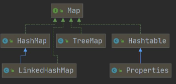

# 1. 集合介绍

2022年6月23日

19:54

1.  数组(的不足)
    1.  长度在开始时必须指定, 并且一旦指定就不能再更改
    2.  保存的必须是同一类型的元素
    3.  使用数组进行增加/删除比较麻烦(扩容需要重新建立一个数组)
2.  集合
    1.  可以==动态保存==任意多个对象, 使用较为方便
    2.  提供了一系列便于操作对象的方法: add、remove、set、get等
    3.  使用集合添加、删除新元素比较简单

##### 集合的分类

3. 集合的分类

Java的集合类很多, 主要分为两大类

 



1.  集合主要是两组(单列集合, 双列集合)

2.  Collection 接口有两个重要的子接口List Set , 他们的实现子类都是单列集合

3.  Map 接口的实现子类是双列集合，存放的K-V<font color='orange'>(key-value)</font>

    ```java
    //Collection
    
    ArrayList arrayList = new ArrayList();
    arrayList.add("jack");
    arrayList.add("tom");
    
    //Map
    
    HashMap hashMap = new HashMap();
    hashMap.put("NO1", "北京");
    hashMap.put("NO2", "上海");
    ```

    

# 2. Collection接口和常用方法

1.  Collection接口实现类的特点

    `public interface Collection<E> extends Iterable<E>`

    1.  Collection实现子类可以存放多个元素, 每个元素可以是Object
    2.  有些Collection的实现类可以存放重复的元素, 有些不可以
    3.  Collection的子接口: List有序, Set可以不是有序
    4.  Collection接口没有直接的实现子类, 而是通过它的子接口List和Set来实现

2.  Collection接口常用方法, (以子类ArrayList演示)

    ```java
    List list = new ArrayList();
    
    //add:添加单个元素
    
    list.add("test");list.add(250);list.add(true);
    
    System.out.println("list="+list);
    
    //remove:删除指定元素
    list.remove(true);//删除指定元素
    list.remove(0);//删除第一个元素
    
    //contains:查找指定元素是否存在
    System.out.println(list.contains(250));
    
    //size:获取元素个数
    System.out.println(list.size());
    
    //isEmpty
    System.out.println(list.isEmpty());
    
    //clear:清空
    list.clear();
    System.out.println("list="+list);
    
    //addAll:添加多个元素
    ArrayListlist2=newArrayList();list2.add("abandon");list2.add("delight");
    list.addAll(list2);
    System.out.println("list="+list);
    
    //containsAll:查找多个元素是否都存在
    System.out.println(list.containsAll(list2));
    
    //removeAll:删除多个元素
    list.add("digital");
    list.removeAll(list2);
    
    System.out.println("list="+list);
    ```
    
3.  Iterator-(Collection接口遍历元素方式1)

    1.  基本介绍
    * Iterator对象成为迭代器, 主要用于遍历Collection集合中的元素
    
    * 所有实现了Collection接口的集合类都有一个iterator()方法, 用于返回一个实现了Iterator接口的对象, 即可以返回一个迭代器
    
    * Iterator的结构
    
      
    
    * Iterator仅用于遍历集合,     Iterator本身并不存放对象
    
    2. 关于Iterator主要有三个方法：hasNext()、next()、remove()
    
    - <font color='#66ccff'>hasNext</font>：没有指针下移操作，只是判断是否存在下一个元素
    
    - <font color='#66ccff'>next</font>：指针下移，返回该指针所指向的元素 (最开始迭代器指向的是空位置)
    
    - <font color='#66ccff'>remove</font>：删除当前指针所指向的元素，一般和next方法一起用，这时候的作用就是删除next方法返回的元素
    
    - 快速生成while遍历快捷键: itit 
    
4. for循环-（Collection接口遍历元素方式2）

   1. 增强for循环, 可以代替iterator迭代器(本质上就是简化版iterator, 本质一样, 只能遍历集合或者数组)


   2. 基本语法

   ```
   for(元素类型 元素名:集合或数组名){
   	访问元素
   }
   ```


## 2.1 List接口

### 2.1.1 List接口和常用方法

1.  List接口介绍
    1. List接口是 Collection 接口的子接口
    
    2. List集合类中元素有顺序, 且可重复<font color='orange'>(双向链表)</font>
    
    3. List集合中的每个元素都有其对应的顺序索引, 即支持索引

    4. List容器中的每个元素都对应一个下标, 可根据下标存取

    5.  List接口的实现类:

        

        ==常用:ArrayList, LinkedList, Stack, Vector==

        * ArrayList实现为可调整大小的数组。

          随着更多的元素被添加到ArrayList中，它的大小会动态增加。

          它的元素可以通过使用get和set方法直接访问，因为ArrayList本质上是一个数组。

        * LinkedList实现为一个双链表。

          它在添加和删除上的性能优于ArrayList，但在get和set方法上的性能则较差。
    
        * Vector与ArrayList类似，但它是同步的。
    
2.  List接口常用方法

```java
List list = new ArrayList();
list.add("张三丰");
list.add("贾宝玉");

//void add(int index, Object ele): 在index位置插入ele元素
//在index = 1 的位置插入一个对象

list.add(1, "韩顺平");
System.out.println("list=" + list);

//boolean addAll(int index, Collection eles):从index 位置开始将eles中的所有元素添加进来

List list2 = new ArrayList();
list2.add("jack");
list2.add("tom");
list.addAll(1, list2);
System.out.println("list=" + list);

//Object get(int index):获取指定index 位置的元素
//int indexOf(Object obj):返回obj 在集合中首次出现的位置
System.out.println(list.indexOf("tom"));//2

//int lastIndexOf(Object obj):返回obj 在当前集合中末次出现的位置
list.add("韩顺平");
System.out.println("list=" + list);
System.out.println(list.lastIndexOf("韩顺平"));

//Object remove(int index):移除指定index 位置的元素，并返回此元素
list.remove(0);
System.out.println("list=" + list);

//Object set(int index, Object ele):设置指定index 位置的元素为ele , 相当于是替换.
list.set(1, "玛丽");
System.out.println("list=" + list);

//List subList(int fromIndex, int toIndex):返回从fromIndex 到toIndex 位置的子集合
// 注意返回的子集合fromIndex <= subList < toIndex
List returnlist = list.subList(0, 2);
System.out.println("returnlist=" + returnlist);
```

3. List的三种遍历方式[ArrayList, LinkedList, Vector]

   1.  使用iterator

       `Iterator iter = list.iterator();`

   2.  使用增强for

       `for(Object o:list) {}`

   3. 使用普通for和get访问
   
      ```java
      for(int i=0; i < list.size(); i++) {
          Object object = list.get(i);
          System.out.println(object);
      }
      ```
   
      

### 2.1.2 ArrayList类

#### ArrayList底层结构和源码分析

1.  ArrayList的注意事项
    1.  `permits all elements, including {@code null}.`  ArrayList可以加入null, 并且可以是多个
    
    2.  ArrayList使用==数组==存储数据
    
        ```java
        transient Object[] elementData;//non-private to simplify nested class access
        ```
    
    3.  ArrayList基本等同于Vector, 区别在于:
    
        ArrayList==线程不安全==, 但执行效率高, 多线程情况下不建议使用ArrayList
    
2. ArrayList底层操作机制 源码分析
   1.  ArrayList维护了一个Object类型的数组elementData

       ```java
       transient Object[] elementData;//non-private to simplify nested class access
       ```
       
       ​	<font color='green'>[transient](https://www.runoob.com/w3cnote/java-transient-keywords.html): 瞬间的, 短暂的, 表示该属性不会被序列化</font>

3. 当创建ArrayList对象时,

   如果使用<font color='#EE0000'>无参</font>构造器, 初始elementData容量为0, 第一次添加扩容至10, 之后扩容为1.5倍

   使用<font color='#EE0000'>指定大小</font>的构造器, 初始elementData容量为制定大小, 之后如果需要, 扩容为1.5

   ```java
   int newCapacity = oldCapacity + (oldCapacity >> 1);
   ```
   ArrayList.add()方法源码
   ```java
   public boolean add(E e){
       modCount++; //修改次数, 与线程有关
       add(e,elementData,size);
       
       return true;
   }
   
   private void add(E e, Object[] elementData,int s){
   
       if(s == elementData.length) //判断是否需要扩容
           elementData = grow();
           elementData[s] = e;
           size = s + 1;
   }
   
   private Object[] grow(){
       return grow(size+1);
   }
   
   private Object[] grow(int minCapacity){
       return elementData = Arrays.copyOf(elementData, newCapacity(minCapacity));
   }
   
   private int new Capacity(int minCapacity){
   
       //overflow-consciouscode
       int oldCapacity = elementData.length;
       int newCapacity = oldCapacity + (oldCapacity >> 1);
   
       if (newCapacity - minCapacity <= 0){
           if(elementData == DEFAULTCAPACITY_EMPTY_ELEMENTDATA)
           	return Math.max(DEFAULT_CAPACITY,minCapacity);
           if(minCapacity < 0) //overflow
           	throw new OutOfMemoryError();
           return minCapacity;
       }
   
       return (newCapacity - MAX_ARRAY_SIZE <= 0) ? newCapacity : hugeCapacity(minCapacity);
   }
   ```
   
   

### 2.1.3 Vector类

2022年6月27日

19:36

#### Vector底层结构和源码分析

1.  vector基本介绍
    1.  Vector类定义

        ```java
        public class Vector<E> 
            extends AbstractList<E> 
            implements List<E>, RandomAccess, Cloneable, java.io.Serializable
        ```

    2.  Vector底层同样是一个对象数组
    
    ```java
    protected Object[] elementData;
    ```
    
    3. Vector是线程同步的, 即线程安全 Vector类的操作方法带有**<font color='#66ccff'>synchronized</font>**
    
       开发中, 需要线程同步安全时, 使用Vector
    
    ```java
    public synchronized E get(int index){
    
        if(index>=elementCount)
    
        	throw new ArrayIndexOutOfBoundsException(index);
    
        return elementData(index);
    
    }
    ```
    
2. ArrayList vs Vector

|           | 底层结构 | 版本   | 线程安全/(同步)效率 | 扩容方式                                                     |
|-----------|----------|--------|---------------------|--------------------------------------------------------------|
| ArrayList | 可变数组 | JDK1.2 | 线程不安全, 效率高  | 无参构造默认0,第一次扩容至10,之后1.5倍扩容 有参构造1.5倍扩容 |
| Vector    | 可变数组 | JDK1.0 | 线程安全, 效率不高  | 无参构造默认10, 之后2倍扩容 有参构造2倍扩容                  |

1.  Vector底层实现									 [一些小插曲]()
    1.  无参构造器: 直接调用容量为10的有参构造器

        ```java
        public Vector(){
        	this(10);
        }
        ```

    2.  有参构造器
    
    
    ```java
    public Vector(int initialCapacity){
    	this(initialCapacity,0);
    }
    ```
    ```java
    public Vector(int initialCapacity, int capacityIncrement){ }
    ```
    
    3. add (jdk8)
    
    ```java
    public synchronized booleanadd(E e){
    
        modCount++;
    
        ensureCapacityHelper(elementCount+1);
    
        elementData[elementCount++] = e;
    
        return true;
    
    }
    ```
    
    ```java
    private void ensureCapacityHelper(int minCapacity){
    
    	//overflow-consciouscode
    
        if(minCapacity-elementData.length>0) //判断是否需要扩容
    
        grow(minCapacity);
    
    }
    ```
    
    

### 2.1.4 LinkedList类

2022年6月27日

19:37

#### LinkedList底层结构

1.  LinkedList基本介绍
    1.  LinkedList底层实现了==双向链表==和==双端队列==
    2.  可以添加任意元素(元素可以重复), 包括null
    3.  ==线程不安全==, 没有实现同步
2.  LinkedList的底层操作机制
    1.  LinkedList==底层==维护了一个==双向链表==
    2.  维护了两个属性first(头指针)指向首节点, 和last(尾指针), 指向尾结点
    3.  每个节点为Node对象, 其中维护prev, next, item三个属性
    4.  通过链表的添加和删除效率更高
3.  ArrayList和LinkedList的比较

|            | 底层结构 | 增删的效率           | 改查的效率       |
|------------|----------|----------------------|------------------|
| ArrayList  | 可变数组 | 低(因为需要数组扩容) | 高(可以随机存取) |
| LinkedList | 双向链表 | 高                   | 低(必须顺序查找) |

​		如何选择:

-   一般来说, 一个项目中80%-90%都是查询, 大部分情况会选择ArrayList
-   在一个项目中, 可以根据业务灵活选择, 可以在一个模块中使用ArrayList, 另一个模块使用LinkedList

## 2.2 Set接口

2022年6月27日

19:33

### 2.2.1 Set接口和常用方法

1.  set接口基本介绍
    1.  无序(按照固定顺序,与存取顺序不一致), 没有索引(index)
    2.  不允许重复元素 (只能包含一个null)
    3.  Set接口实现类:

        

2.  set接口常用方法

    因为Set接口是Collection子接口, 常用方法与Collection接口一样

3.  set接口遍历方式
    1.  Iterator
    2.  增强for
    3.  ==不能使用==fori, 因为没有索引

### 2.2.2 HashSet类

1.  HashSet说明
    1.  HashSet实现了Set接口

    2.  HashSet本质上是[HashMap](), 构造器中建立了一个map

        ```java
        public HashSet(){
        	map = new HashMap<>();
        }
        ```

    3.  不能有重复元素/对象, 可以存放null值, 但是只能有一个null

    4.  HashSet不保证元素的存取顺序有序, 而是取决于hash之后的索引顺序

        

2.  HashSet**底层机制**-putVal

    1. 执行 HashSet()

       ```java
       public HashSet() {  
       	map = new HashMap<>();  
       }
       ```

    2. 执行 add()

       ```java
       public boolean add(E e) {//e = "java"  
       	return map.put(e, PRESENT)==null; //(static) PRESENT = new Object();  
       }
       ```
    
    
    3. 执行 ==HashMap的put()== , 该方法会执行 hash(key) 得到key对应的hash值
    
       算法 : `h = key.hashCode()) ^ (h >>> 16)`
    
       ```java
       public V put(K key, V value) { //key = "java" value = PRESENT 共享  
       	return putVal(hash(key), key, value, false, true); 
       }
       ```
       ```java
       static final int hash(Object key) {  
           int h;  
           return (key == null) ? 0 : (h = key.hashCode()) ^ (h >>> 16);
       }
       ```
    
    4. 执行 putVal

-   ```java
    final V putVal(int hash, K key, V value, boolean onlyIfAbsent, boolean evict) {
    
        Node<K,V>[] tab; Node<K,V> p; int n, i; //定义了辅助变量
    
        //table 是 HashMap 的一个数组，类型是 Node[]
        if ((tab = table) == null || (n = tab.length) == 0)
    	//如果当前table 是null, 或者 大小=0，就是第一次扩容，扩容到16个空间.
            n = (tab = resize()).length;
        
    
        if ((p = tab[i = (n - 1) & hash]) == null)
    	//根据key得到的hash 去计算该key应该存放到table表的哪个索引位置，并把这个位置的对象赋给p
    	//判然后判断p 是否为null
            tab[i] = newNode(hash, key, value, null);
    
        //(如果p为null, 表示这个位置还没有存放元素, 就创建一个Node (key="java",value=PRESENT),
        //就放在该位置 tab[i] = newNode(hash, key, value, null)
    
        else {
    
            Node<K,V> e; K k; //临时变量
    
            //如果当前索引位置对应的链表的第一个元素 和 准备添加的key的hash值一样
            //且满足 下面两个条件之一:
            //① 准备加入的key 和 p 指向的Node 结点的 key 是同一个对象
            //② p 指向的Node 结点的 key 的equals() 和准备加入的key比较后相同, 就不能加入
    
            if (p.hash == hash && ((k = p.key) == key || (key != null && key.equals(k))))
                e = p;
            else if (p instanceof TreeNode) //再判断 p 是不是一颗红黑树,
                e = ((TreeNode<K,V>)p).putTreeVal(this, tab, hash, key, value);
            	//如果是一颗红黑树，就调用 putTreeVal , 来进行添加
            else {
                //如果table对应的索引位置已经是一个链表, 就使用for循环比较
                for (int binCount = 0; ; ++binCount) {
                    if ((e = p.next) == null) { //都不相同,则将该元素加入到链表的最后
                        p.next = newNode(hash, key, value, null);
                        if (binCount >= TREEIFY_THRESHOLD(8) - 1) // 判断是否达到8个节点
                            treeifyBin(tab, hash); //树化, 将链表转化为红黑树
    						//  注意，在treeifyBin时，会进行判断, 判断条件
                            //if (tab == null || (n = tab.length) < MIN_TREEIFY_CAPACITY(64))
                            //	resize();
                            // 如果上面条件成立，先table扩容.
                            // 只有上面条件不成立时，才进行转成红黑树
                        break;
                    }
                    if (e.hash == hash &&
                        ((k = e.key) == key || (key != null && key.equals(k))))
                        break; //如果已存在相同与key相同的元素, 退出循环
                    p = e;
                }
            }
    
            if (e != null) { // existing mapping for key
                V oldValue = e.value;
                if (!onlyIfAbsent || oldValue == null)
                    e.value = value;
                afterNodeAccess(e);
                return oldValue;
            }
        }
    
        ++modCount;
    
        //size 就是我们每加入一个结点Node(k,v,h,next), size++
    
        if (++size > threshold)
            resize();
        afterNodeInsertion(evict); //空方法,留给HashSet子类实现
        return null;
      }
    ```
    
    
    
    3. HashSet底层机制<本质[HashMap]()>-扩容与树化
    
       1.  HashSet底层是key为set的存储值， value为HashSet内部static对象PRESENT 的HashMap
    
       2. 第一次添加时, table数组扩容到16, <font color='#66ccff'>临界值(threshold)</font>为 16<font color='#66ccff'>加载因子(loadFactor)</font> <font color='orange'>(default为0.75)</font> = 16 * 0.75 = 12
    
          <font color='green'>threshould: The next size value at which to resize(capacity  load factor).</font>
    
       3. 如果table数组使用到了临界值12, 就会扩容至16 * 2 = 32, 新的临界值也会提升 31 * 0.75 = 24
    
       4. 在Java8中, 如果<font color='#EE0000'>①</font>==一个链表的元素个数到达TREEIFY_THRESHOLD(default为8)==, 且<font color='#EE0000'>②</font>==table的大小>=MIN_TREEIFY_CAPACITY(default为64)==, 就会对链表进行树化, 否则仍然采用数组扩容机制
    
    4. 总结:
    
       1.  HashSet的比较是基于==hashCode()==和==equals()==方法判断的,二者均相同时判定为重复
    
           >  想要自定义重复判断, 就重写这两个方法(Alt + Insert可以快捷构造)

#### Node结构 (源码)

```java
static class Node<K,V> implements Map.Entry<K,V> {

  final int hash;
  final K key;
  V value;
  Node<K,V> next;

  Node(int hash, K key, V value, Node<K,V> next) {
      this.hash = hash;
      this.key = key;
      this.value = value;
      this.next = next;
  }

  public final K getKey()    { return key; }
  public final V getValue()   { return value; }
  public final String toString() { return key + "=" + value; }

  public final int hashCode() {
	return Objects.hashCode(key) ^ Objects.hashCode(value);
  }

  public final V setValue(V newValue) {
    V oldValue = value;
    value = newValue;
    return oldValue;
  }

  public final boolean equals(Object o) {
	if (o == this)
      return true;
   	if (o instanceof Map.Entry) {
		Map.Entry<?,?> e = (Map.Entry<?,?>)o;
		if (Objects.equals(key, e.getKey()) &&
		Objects.equals(value, e.getValue()))
		return true;
	}
	return false;
  }
}
```

### 2.2.3 LinkedHashSet

1.  <font color='#66ccff'>LinkedHashSet类</font>介绍
    1.  LinkedHashSet类是HashSet类的子类
    2.  LinkedHashSet类底层是==LinkedHashMap==, 底层维护了一个==数组+双向链表==
    3.  LinkedHashSet根据元素的hashCode值来决定元素的存储位置, 同时使用链表来维护元素的次序, 这就使得元素看起来是以==插入顺序保存==的
    4.  LinkedHashSet同样==不允许添加重复元素==
2.  LinkedHashSet底层结构
    1.  LinkedHashSet中维护了一个==hash表和双向链表== <font color='orange'>(LinkedHashSet有head和tail)</font>
    2.  每一个节点有before和after属性,这样可以形成双向链表
    3.  在添加一个元素时,先求hash值,在求索引,确定该元素在table的位置，然后将添加的元素加入到双向链表(如果已经存在,不添加[原则和hashSet一样])
    4.  这样的话,我们遍历LinkedHashSet 也能确保插入顺序和遍历顺序一致

# 3. Map接口和常用方法

2022年6月29日

22:23

1.  Map接口实现类的特点 <JDK8>
    1.  Map和Collection[并列存在](#集合的分类), Map用于保存具有映射关系的数据: <Key - Value>
    2.  Map的key和value可以是任何引用类型的数据, 会将它们封装到`HashMap$Node`(内部类)对象中`static class Node<K,V> implements Map.Entry<K,V>`

        由于Node实现Entry接口, 也称一对k-v为一个<font color='#66ccff'>**Entry**</font>

        1.  ==key不允许重复==(原因与HashSet一样), value可以重复
        2.  常用String类作为key
        3.  可以通过key查找value
    
    3.  Map的常用实现类: <font color='#66ccff'>HashMap</font>、 <font color='#66ccff'>Hashtable</font> 和 <font color='#66ccff'>Properties</font>。
    
2. Map接口常用方法

   ```java
   remove:根据键删除映射关系
   get：根据key获取value
   size:获取map中的元素个数
   isEmpty:判断是否为空
   clear:清除k-v(清空)
   containsKey:查找键是否存在
   ```

   ```java
   public class MapMethod {
   
       public static void main(String[] args) {
           //演示map接口常用方法
           Map map = new HashMap();
   
           map.put("邓超", new Book("", 100));//OK
           map.put("邓超", "孙俪");//替换-> 一会分析源码
           map.put("王宝强", "马蓉");//OK
           map.put("宋喆", "马蓉");//OK
           map.put("刘令博", null);//OK
           map.put(null, "刘亦菲");//OK
           map.put("鹿晗", "关晓彤");//OK
           map.put("hsp", "hsp的老婆");
           System.out.println("map=" + map);
   
           // remove:根据键删除映射关系
           map.remove(null);					System.out.println("map=" + map);
   
           // get：根据key获取value
           Object val = map.get("鹿晗");			System.out.println("val=" + val);
   
           // size:获取map中的元素个数
           System.out.println("k-v=" + map.size());
   
           // isEmpty:判断是否为空
           System.out.println(map.isEmpty());//F
   
           // clear:清除k-v(清空)
           map.clear();						System.out.println("map=" + map);
   
           // containsKey:查找键是否存在
           System.out.println("结果=" + map.containsKey("hsp"));//T
   
       }
   }
   ```

   

3. Map接口遍历

   1. ==key==: 用keySet()方法, 将所有的key用Set存储, 对key进行遍历

      ​	`Set keyset = map.keySet();`

      1. 强化for

         ```java
         for (Object key : keyset) {
         	System.out.println(key + "-" + map.get(key));
         }
         ```

      2. 迭代(Iterator)

         ```java
         Iterator iterator = keyset.iterator();
         
         while (iterator.hasNext()) {
             Object key = iterator.next();
             System.out.println(key + "-" + map.get(key));
         }
         ```

   2. ==value==: 用values()方法, 将所有的value用Collection存储, 对value进行遍历

      ​	`Collection values = map.values();`

      ​	这里可以使用所有的Collections使用的遍历方法

      1. 强化for

         ```java
         for (Object value : values) {
         	System.out.println(value);
         }
         ```

      2. 迭代器

         ```java
         Iterator iterator2 = values.iterator();
         
         while (iterator2.hasNext()) {
             Object value = iterator2.next();
             System.out.println(value);
         }
         ```

   3. ==k-v==: 用entrySet()方法, 将所有的key-value用Set存储, 对k-v进行遍历

      `Set entrySet = map.entrySet();// EntrySet<Map.Entry<K,V>>`

      1. 强化for

         ```java
         for (Object entry : entrySet) {
         	//将entry 转成 Map.Entry
             Map.Entry m = (Map.Entry) entry;
             System.out.println(m.getKey() + "-" + m.getValue());
         }
         ```

      2. 迭代器

         ```java
         Iterator iterator3 = entrySet.iterator();
         
         while (iterator3.hasNext()) {
             Object entry = iterator3.next();
             System.out.println(entry.getClass()); //class java.util.HashMap$Node
             //map未使用泛型, 需要向下转型 Map.Entry
             Map.Entry m = (Map.Entry) entry;
             System.out.println(m.getKey() + "-" + m.getValue());
         
         }
         ```

      - <font color='#EE0000'>注意 </font>: 没有用泛型的话, getValue和getKey返回的是Object, 要记得向下转型

        

## 3.1HashMap类

2022年7月1日

21:18

1.  HashMap介绍

    1.  HashMap是 Map 接口==使用频率最高==的实现类
    2.  HashMap 是以key-val对的方式来存储数据([HashMap$Node](#Node结构 (源码)))[案例Entry]
    3.  key 不能重复,但是==值可以重复==,允许使用null键和null值。
    4.  如果添加相同的key，则会==覆盖==原来的key-val ,等同于修改.(key不会替换，val会替换)
    5.  与HashSet一样，不保证映射的顺序，因为底层是以hash表的方式来存储的.

        (jdk8的hashMap底层数组+链表+红黑树)

    6.  HashMap没有实现同步, ==线程不安全==，方法没有做同步互斥的操作,没有synchronized

2.  HashMap底层机制

    * 扩容机制[和[HashSet](#4.1HashSet类)相同]

    1. HashMap底层维护了Node类型的数组table, 默认为null

    2. 当创建对象时，将加载因子(<font color='#66ccff'>loadfactor</font>，判断何时应该扩容)初始化为0.75.

    3. 当添加key-val时，通过key的哈希值<font color='orange'>(hash方法)</font>得到key在table中的索引。

    5.  判断该索引处是否有元素：
        1. 如果没有元素直接添加；
        
        2.  如果该索引处有元素，继续判断该元素的key和准备加入的key相是否等
            1. 如果相等，则直接==替换==val;
            
            2. 如果不相等需要判断是树结构还是链表结构，做出相应处理。
              * 如果添加时发现容量不够，则需要扩容。
        
    5. 第1次添加，则需要==扩容table容量为16==，临界值(threshold)为12 (160.75)

    6. 以后再扩容，则需要扩容table容量为原来的==2倍==(32)，临界值为原来的2倍,即24,依次类推

    8.  在Java8中,如果<font color='#66ccff'>一个链表</font>

        <font color='#EE0000'>①</font>元素个数达到TREEIFY_THRESHOLD(==默认是8==)
        
        <font color='#EE0000'>②</font>table的大小 >= MIN TREEIFY_CAPACITY(默认64)
        
        就会将该链表树化(红黑树)

## 3.2HashTable类

2022年7月2日

15:08

1.  HashTable介绍
    1.  存放的元素是键值对，即K-V
    2.  HashTable的键和值==都不能==为null，否则会抛出<font color='#66ccff'>NullPointerException</font>异常<font color='orange'>（HashMap的key可以有一个null）</font>
    3.  HashTable使用方法基本上和HashMap一样
    4.  HashTable是==线程安全==的(synchronized), HashMap是线程不安全的
2.  HashTable和HashMap对比

|           | JDK版本 | 线程安全（同步）    | 效率 | 是否允许有null键/null值 |
| --------- | ------- | ------------------- | ---- | ----------------------- |
| HashMap   | 1.2     | 线程不安全, 未同步  | 高   | 可以                    |
| HashTable | 1.0     | 线程安全,有同步互斥 | 较低 | 不可以                  |

## 3.3Properties类

1.  Properties类介绍
    1.  Properties类==继承自Hashtable类==并且==实现了Map接口==，也是使用一种键值对的形

        式来保存数据。

    2.  Properties使用特点和Hashtable类似
    3.  Properties 还可以用于从 xxx.properties==文件==中，加载数据到Properties类对象,

        并进行读取和修改

        工作后 <font color='#66ccff'>.properties</font> 文件通常作为配置文件，这个知识点在IO流举例,有兴趣可先看文章

# 4. 总结

在开发中，选择什么集合实现类，主要==取决于业务操作特点==，然后根据集合实现类特性进行选择,分析如下:

1.  先判断存储的类型 : 一组==对象==[单列] / 一组==键值对==[双列]
    
    * 一组对象[单列]:Collection接口
    
      * 允许重复: List接口
        * 增删多:LinkedList [底层维护了一个双向链表]
        * 改查多: ArrayList [底层维护 Object类型的可变数组]
    
      * 不允许重复: Set接口
        * 无序:HashSet[底层是HashMap，维护了一个哈希表即(数组+链表+红黑树)
        * 排序:TreeSet[老韩举例说明]
        * 插入和取出顺序一致:LinkedHashSet，维护数组+双向链表
    
    * 一组键值对[双列]: Map接口
      * 键无序:HashMap[底层是:哈希表 jdk7:数组+链表, jdk8:数组+链表+==红黑树==]
      * 键排序:TreeMap[老韩举例说明]
      * 键插入和取出顺序一致:LinkedHashMap
      * 读取文件Properties

## TreeSet和TreeMap类

1.  TreeSet和TreeMap的关系
    1.  与HashSet完全类似，TreeSet里面绝大部分方法都市直接调用TreeMap方法来实现的。

    2.  相同点：

        * TreeMap和TreeSet都是有序的集合，也就是说他们存储的值都是排好序的。

        * TreeMap和TreeSet都是非同步集合，因此他们不能在多线程之间共享，不过可以使用方法`Collections.synchroinzedMap()`来实现同步

        * 运行速度都要比Hash集合慢，他们内部对元素的操作时间复杂度为O(logN)，而HashMap/HashSet则为O(1)。

    3.  不同点：

        -   最主要的区别就是TreeSet和TreeMap分别实现Set和Map接口
        -   TreeSet只存储一个对象，而TreeMap存储两个对象Key和Value（仅仅key对象有序）
        -   TreeSet中==不能有重复对象==，而TreeMap中可以存在

            理解了这些之后我们发现其实两者底层的实现方法还是一致的，所以下面我们只需要分析TreeMap,基本上就弄懂了TreeSet。

2.  TreeMap的底层逻辑

    1. TreeMap的构造器

       1. ```java
          private final Comparator<? super K> comparator;
          ```

       2. 使用无参构造器时, 排序默认升序 `comparator = null`;

       3. 使用有参构造器时, 传入一个Comparator接口实现类 作为内部属性

          (通常使用匿名内部类来创建比较器)`this.comparator = comparator;`

    2. TreeMap的put方法

       ```java
       if (cpr != null) { //cpr = compator, 是传入的匿名内部类
       
           do {
       
               parent = t;
       
               cmp = cpr.compare(key, t.key); //动态绑定到我们的匿名内部类(对象)compare
       
               if (cmp < 0)
       
               	t = t.left;
       
               else if (cmp > 0)
       
               	t = t.right;
       
               else //如果相等，即返回0,这个Key 就没有加入
       
               	return t.setValue(value);
       
           } while (t != null);
       
       }
       ```

       

# 5. Collections工具类

1.  Collections工具类介绍
    1.  Collections是一个操作Set, List和Map等集合的==工具类==
    2.  Collections中提供了一系列==静态方法==对集合元素进行排序, 查询和修改等操作

2.  排序操作: (均为static)
    1. `reverse(List)`: 反转List中元素的顺序

    2. `shuffle(List)`: 对List集合元素进行==随机==排序

    3. `sort(List)`: 根据元素的自然顺序对指定List集合元素按升序排序

    4. `sort(List, Comparator)`: 根据指定的==Comparator==产生的顺序对List集合元素进行

       ​	<font color='orange'>排序(o1-o2 升序, o2-o1 降序)</font>

    5. `swap(List, int, int)`: 将指定list集合中的i处元素和j处元素进行交换

3.  查找/替换
    1.  `Object max(Collection)`: 根据元素的自然顺序，返回给定集合中的最大元素
    2.  `Object max(Collection,Comparator)`: 根据Comparator 指定的顺序，返回给定集合中的最大元素
    3.  `Object min(Collection)`
    4.  `Object min(Collection,Comparator)`
    5.  `int frequency(Collection,Object)`: 返回指定集合中指定元素的出现次数
    6.  `void copy(List dest,List src)`: 将src中的内容复制到dest中
    7.  `boolean replaceAll(List list, Object oldVal, Object newVal)`: 使用新值替换List对象的==所有==旧值

# 6. 补充

## 6.1 包装类与集合

1. 背景

   ```java
   Vector<Integer> integers = new Vector<>();
   Integer integer = 1000;
   integers.add(integer);
   System.out.println(integers); //结果: [1000]
   integer = 500;
   System.out.println(integers); //结果: [1000]
   //并不像普通的引用数据类型一样, 存储的是引用
   ```

2. 解释 - 包装类作为集合的元素
   //包装类作为集合元素

   ```java
   List list = new ArrayList();
   list.add(1);
   list.add(new Object());
   Iterator it = list.iterator();
   while (it.hasNext()) {
   	System.out.println(it.next());
   }
   ```

   反编译结果为

   ```java
   ArrayList arraylist = new ArrayList();
   arraylist.add(Integer.valueOf(1));
   arraylist.add(new Object());
   for(Iterator iterator = arraylist.iterator(); iterator.hasNext(); System.out.println(iterator.next()));
   ```

   可以发现，虽然集合元素要求是对象，add()方法的形参也是对象（public boolean add(E e)），但由于自动装箱，基本数据类型也可以直接加入集合中。

   ```java
   List<Integer> list = new ArrayList<>();
   for (int i=0; i<5; i++) {
   	list.add(i);
   }
   Iterator it = list.iterator();
   while (it.hasNext()) {
   	System.out.println(it.next());
   }
   ```
   反编译结果为
   
   ```java
   ArrayList arraylist = new ArrayList();
   for(int i = 0; i < 5; i++)
       arraylist.add(Integer.valueOf(i));
   
   for(Iterator iterator = arraylist.iterator(); iterator.hasNext(); System.out.
   ```

​		原文链接：https://blog.csdn.net/sinat_30973431/article/details/89332443
