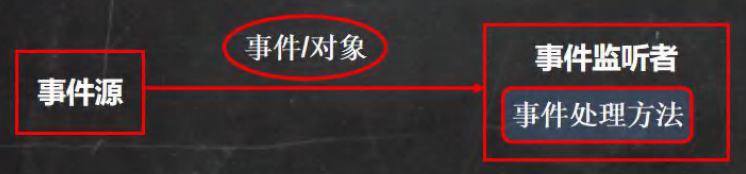

# 前言

2022年7月14日

23:13

大部分内容都在代码里，笔记量不多

# 16.1java绘图体系

2022年7月13日

17:38

1.  java坐标体系: 水平向右为x正方向, 竖直向下为y正方向, 单位为像素

2.  坐标体系-像素: 由屏幕分辨率决定, 本质上是一个密度单位

3.  绘图原理

    * Component类提供了两个和绘图相关最重要的方法:

      1.  `paint(Graphics g)`绘制组件的外观

      2. `repaint()`刷新组件的外观。

    * 当组件==第一次在屏幕==显示的时候,程序会自动的调用paint()方法来绘制组件。

    * 在以下情况==paint()将会被调用==:
      1.  窗口最小化再最大化
      1.  窗口的大小发生变化
      3.  <font color='#EE0000'>repaint()方法被调用</font>
          * 思考题:如何证明上面的三种情况,会调用paint()方法

4.  <font color='#66ccff'>Graphics类</font>: Graphics类可以理解为画笔, 为我们==提供了各种绘制图形的方法==

    1.  方法介绍

     ```java
       1.  画直线 drawLine(int x1,int y1,int x2,int y2)
       2.  画矩形边框 drawRect(int x, int y, int width, int height)
       3.  画椭圆边框 drawOval(int x, int y, int width, int height)
       4.  填充矩形 fillRect(int x, int y, int width, int height)
       5.  填充椭圆 fillOval(int x, int y, int width, int height)
       6.  画图片 drawlmage(lmage img, int x, int y, ..)
       7.  画字符串 drawString(String str, int x, int y)
       8.  设置画笔的字体 setFont(Font font)
       9.  设置画笔的颜色 setColor(Color c)
     ```

    2. <font color='#EE0000'>注意事项</font>
       1. 画图形的xy都为左上角坐标
       2. 当drawRect()方法的width / length为负数时, 所画图形会变成实心

    3. `drawImage`的使用

       1.  获取图片资源

           获取图片资源, /mio.png表示在项目的根目录

           `(D:\Java\idea_workspace\books\JavaSe_hsp\out\production\Chap16_TankBattle)`

           获取mio.png图片资源

           ```java
           Image image = Toolkit.getDefaultToolkit().getImage(Panel.class.getResource("/mio.png"));
           ```

       2.  绘制

           ```java
           g.drawImage(image, x: 500, y: 500, weight: 143, height: 135, observer: this);
           ```

    -   `drawString`的使用
        
        1.  设置字体
        
            ```java
            g.setFont(new Font("微软雅黑", Font.BOLD, 50));
            ```
        
        2.  写字:
        
            ```java
            g.drawString("Hello World!"+ '\\n' + "你好, 世界", x: 100, y: 500);
            ```
        
            ​	注意 : x,y为字符串==左下角==坐标

5.  <font color='#66ccff'>JFrame</font>: 框架 顶层的框架类 \<画框>

    <font color='#66ccff'>JPanel</font>: 面板 Java图形用户界面 (GUI)工具包swing中的面板容器类 \<画板>

    <font color='#66ccff'>Graphics</font>:绘图 所有图形上下文的抽象基类 \<画笔\>

    -   `setVisible(boolean)` 方法用于显示/隐藏GUI组件

# 16.2java事件处理机制

2022年7月14日

16:12

1.  基本说明

    java事件处理采取"<font color='#66ccff'>委派事件模型</font>"

    当事件发生时，产生事件的对象，然后把此“信息”传递给“事件的监听者”处理

    信息：实际上是java.awt.event事件类库中, 某个类创建的对象, 将它称为“事件的对象”

    

    1.  深入理解事件处理机制
        1.  <font color='#66ccff'>事件源</font>： 事件源是一个产生事件的对象， 如按钮，窗口等
        2.  <font color='#66ccff'>事件</font>： 事件就是承载事件源改变使得对象， 包括键盘事件、鼠标事件、窗口事件等，会生成一个事件对象。该对象保存当前事件的信息，如KeyEvent对象包含被按下键的Code值，

            [<font color='#66ccff'>java.awt.event</font>](https://www.matools.com/file/manual/jdk_api_1.8_google/java/awt/event/package-summary.html)包 和 <font color='#66ccff'>javax.swing.event</font>包中定义了各种事件类型

    2.  事件类型:

| 事件类          | 说明                                                         |
|-----------------|--------------------------------------------------------------|
| ActionEvente    | 通常在按下按钮.或双击一个列表项或选中某个菜单时发生          |
| AdjustmentEvent | 当操作一个滚动条时发生                                       |
| ContainerEvent  | 当一个组件从容器中加入或者删除时发生                         |
| FocusEvent      | 当一个组件获得或是失去焦点时发生                             |
| ltemEvente      | 当一个复选框或是列表项被选中时，当一个选择榧或选择菜单被选中 |
| KeyEvente       | 当从键盘的按键被按下，松开时发生。                           |
| MouseEvent      | 当鼠标被拖动，移动，点击，按下…                              |
| TextEvent       | 当文本区和文本域的文本发生改变时发生                         |
| WindowEvent     | 当一个窗口激活，关闭，失效，恢复，最小化…                    |

1.  事件监听器接口:
    1.  当事件源产生一个事件,可以传送给事件监听器处理
    
    2.  事件监听器实际上就是一个类,该类实现了某个事件监听器接口。
    
        比如前面我们案例中的MyPanle就是一个类,它实现了KeyListener接口,就可以作为一个事件监听者,对接受到的事件进行处理
    
    3.  事件监听器接口有多种，不同的事件监听器接口可以监听不同的事件,一个类可以实现多个监听接口
    4.  这些接口在java.awt.event包和javax.swing.event包中定义。

| **接口**                                                                                                                          | **描述**                                                                           |
|-----------------------------------------------------------------------------------------------------------------------------------|------------------------------------------------------------------------------------|
| [**ActionListener**](https://www.matools.com/file/manual/jdk_api_1.8_google/java/awt/event/ActionListener.html)                   | 用于接收动作事件的侦听器界面。                                                     |
| [**AdjustmentListener**](https://www.matools.com/file/manual/jdk_api_1.8_google/java/awt/event/AdjustmentListener.html)           | 用于接收调整事件的侦听器接口。                                                     |
| [**AWTEventListener**](https://www.matools.com/file/manual/jdk_api_1.8_google/java/awt/event/AWTEventListener.html)               | 用于接收分派到作为Component或MenuComponent或其子类的实例的对象的事件的侦听器接口。 |
| [**ComponentListener**](https://www.matools.com/file/manual/jdk_api_1.8_google/java/awt/event/ComponentListener.html)             | 用于接收组件事件的侦听器接口。                                                     |
| [**ContainerListener**](https://www.matools.com/file/manual/jdk_api_1.8_google/java/awt/event/ContainerListener.html)             | 用于接收容器事件的侦听器接口。                                                     |
| [**FocusListener**](https://www.matools.com/file/manual/jdk_api_1.8_google/java/awt/event/FocusListener.html)                     | 用于在组件上接收键盘焦点事件的侦听器界面。                                         |
| [**HierarchyBoundsListener**](https://www.matools.com/file/manual/jdk_api_1.8_google/java/awt/event/HierarchyBoundsListener.html) | 用于接收祖先移动和调整大小的事件的侦听器接口。                                     |
| [**HierarchyListener**](https://www.matools.com/file/manual/jdk_api_1.8_google/java/awt/event/HierarchyListener.html)             | 用于接收层次结构的侦听器界面更改事件。                                             |
| [**InputMethodListener**](https://www.matools.com/file/manual/jdk_api_1.8_google/java/awt/event/InputMethodListener.html)         | 用于接收输入法事件的侦听器接口。                                                   |
| [**ItemListener**](https://www.matools.com/file/manual/jdk_api_1.8_google/java/awt/event/ItemListener.html)                       | 用于接收项目事件的侦听器接口。                                                     |
| [**KeyListener**](https://www.matools.com/file/manual/jdk_api_1.8_google/java/awt/event/KeyListener.html)                         | 用于接收键盘事件（按键）的侦听器界面。                                             |
| [**MouseListener**](https://www.matools.com/file/manual/jdk_api_1.8_google/java/awt/event/MouseListener.html)                     | 用于在组件上接收“有趣”鼠标事件（按，释放，单击，输入和退出）的侦听器界面。         |
| [**MouseMotionListener**](https://www.matools.com/file/manual/jdk_api_1.8_google/java/awt/event/MouseMotionListener.html)         | 用于在组件上接收鼠标运动事件的侦听器界面。                                         |
| [**MouseWheelListener**](https://www.matools.com/file/manual/jdk_api_1.8_google/java/awt/event/MouseWheelListener.html)           | 用于在组件上接收鼠标滚轮事件的侦听器界面。                                         |
| [**TextListener**](https://www.matools.com/file/manual/jdk_api_1.8_google/java/awt/event/TextListener.html)                       | 用于接收文本事件的侦听器界面。                                                     |
| [**WindowFocusListener**](https://www.matools.com/file/manual/jdk_api_1.8_google/java/awt/event/WindowFocusListener.html)         | 听众界面接收 WindowEvents ，其中包括 WINDOW_GAINED_FOCUS和 WINDOW_LOST_FOCUS事件。 |
| [**WindowListener**](https://www.matools.com/file/manual/jdk_api_1.8_google/java/awt/event/WindowListener.html)                   | 用于接收窗口事件的侦听器界面。                                                     |
| [**WindowStateListener**](https://www.matools.com/file/manual/jdk_api_1.8_google/java/awt/event/WindowStateListener.html)         | 用于接收窗口状态事件的侦听器接口。                                                 |

 例 \<D:\\Java\\idea_workspace\\books\\JavaSe_hsp\\Chap16_TankBattle\\src\\com\\hsp\\event_\\BallMove.java\>

```java
package com.hsp.event_;

import javax.swing.*;
import java.awt.*;
import java.awt.event.KeyEvent;
import java.awt.event.KeyListener;

/**

 \* @Author yJade

 \* @Date 2022-07-14 16:21

 \* @Package com.hsp.event_

 \* 通过控制小球移动来学习Java的事件控制

 */

public class BallMove extends JFrame {

  MyPanel mp = null;

 

  public static void main(String[] args) {

    BallMove ballMove = new BallMove();

  }

 

  public BallMove() {

    mp = new MyPanel();

    this.add(mp);

    this.setSize(1600, 900);

    //添加KeyListener监听器

    //窗口JFrame对象可以监听键盘事件, 及可以监听到面板发生的键盘事件

    this.addKeyListener(mp);

    this.setDefaultCloseOperation(JFrame.EXIT_ON_CLOSE);

    this.setVisible(true);

  }

}

 

//面板, 画出小球

//KeyListener 监听器, 用于监听键盘事件

class MyPanel extends JPanel implements KeyListener {

  //为了让小球能够移动, 将坐标值设置为变量

  int x = 100;

  int y = 100;

  @Override

  public void paint(Graphics g) {

    super.paint(g);

    g.fillOval(x, y, 20, 20);

  }

 

  //当字符输出时, 触发该方法

  @Override

  public void keyTyped(KeyEvent e) {}

 

  //当某个键按下时, 触发该方法

  @Override

  public void keyPressed(KeyEvent e) {

    //System.out.println((char)e.getKeyCode() + "被按下");

    //根据键盘输入, 处理小球的移动

    //在java中, 会为每一个键分配一个值

    if (e.getKeyCode() == KeyEvent.VK_DOWN) y++;

    if (e.getKeyCode() == KeyEvent.VK_UP) y--;

    if (e.getKeyCode() == KeyEvent.VK_LEFT) x--;

    if (e.getKeyCode() == KeyEvent.VK_RIGHT) x++;

    //重绘, 会调用paint

    this.repaint();

  }

 

  //当某个键松开时, 触发该方法

  @Override

  public void keyReleased(KeyEvent e) {

    //System.out.println((char)e.getKeyCode() + "已松开");

  }

}
```

