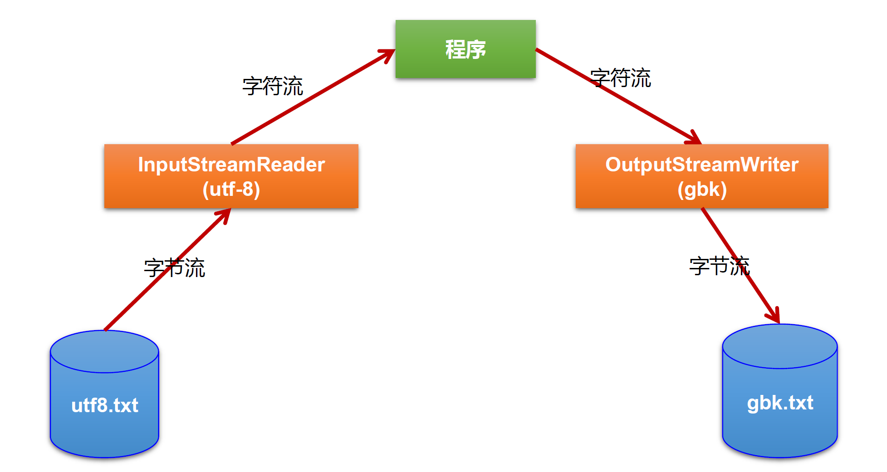

# 一、File 类的使用

### 1. File 类的理解

1. File 类的一个对象，代表==一个文件或一个文件目录==( 俗称：文件夹)。(<font color='orange'>目录也是一种特殊的文件</font>)
2. File 类声明在 java.io 包下。`<java.io.File>`
3. File 类中涉及到关于<font color='#EE0000'>文件或文件目录</font>的==创建==、==删除==、==重命名==、==修改时间==、==文件大小==等方法，并未涉及到写入或读取文件内容的操作。如果需要读取或写入文件内容必须使用<font color='#66ccff'>IO 流</font>来完成。
4. 想要在 Java 程序中表示一个真实存在的文件或目录，那么必须有一个 File 对象，但是 Java 程序中的一个 File 对象，可能没有一个真实存在的文件或目录。
5. 后续 File 类的对象常会作为==参数传递到流的构造器==中，指明读取或写入的" 终点"。

### 2. File 的实例化

1. 常用构造器

   ```java
   File(String filePath)
   File(String parentPath,String childPath)
   File(File parentFile,String childPath)
   ```

2. 路径

   1. 路径的分类

      1. <font color='#66ccff'>相对路径</font>(Path)：相较于某个路径下，指明的路径。
      2. <font color='#66ccff'>绝对路径</font>(AbsolutePath)：包含盘符在内的文件或文件目录的路径。

      **说明**：

      1. IDEA 中：

         - 如果使用==JUnit==中的单元测试方法测试，相对路径即为当前的==Module(模块)==下。

         - 如果使用==main()==测试，相对路径即为当前的==Project(项目)==下。

      2. Eclipse 中：

         - 不管使用单元测试方法还是使用 main()测试，相对路径都是当前的 Project 下。

3. 路径分隔符

   1. Windows 和 DOS 系统默认使用`"\"`来表示

   2. UNIX 和 URL 使用`"/"`来表示

   3. Java 程序支持跨平台运行，因此路径分隔符要慎用。

      为了解决这个隐患，File 类提供了一个常量： `public static final String separator`。这个常量会根据操作系统，动态的提供分隔符。

### 3. File 类的常用方法

1. File 类的获取功能

   ```java
   public String getAbsolutePath() ：获取绝对路径
   public String getPath() ：获取路径 (是构造参数中的路径)
   public String getName() ：获取文件名
   public String getParent() ：获取上层文件目录路径。若无，返回 null
   public long length() ：获取文件长度（即：字节数）。不能获取目录的长度。
   public long lastModified() ：获取最后一次的修改时间，毫秒值
   ```

   如下的两个方法适用于文件目录：

   ```java
   public String[] list() ：获取指定目录下的所有文件或者文件目录的名称数组
   public File[] listFiles() ：获取指定目录下的所有文件或者文件目录的File数组
   ```

2. File 类的重命名功能

   ```java
   public boolean renameTo(File dest) : 把文件重命名为指定的文件路径
   ```

   - <font color='#EE0000'>注意</font>：`oldFile.renameTo(newFile)`为例：要想保证返回 `true`需要 oldFile 在硬盘中是存在的，且 newFile 不能在硬盘中存在。

   - 可以做到移动文件, 并重命名
   - 当文件夹空时, 可以重命名文件夹

3. File 类的判断功能

   ```java
   public boolean isDirectory() ：判断是否是文件目录
   public boolean isFile() ：判断是否是文件
   public boolean exists() ：判断是否存在
   public boolean canRead() ：判断是否可读
   public boolean canWrite() ：判断是否可写
   public boolean isHidden() ：判断是否隐藏
   ```

4. File 类的创建功能 (创建硬盘中对应的文件或文件目录)

   ```java
   public boolean createNewFile()：创建文件。若文件存在，则不创建，返回false
   public boolean mkdir()：创建文件目录。如果此文件目录存在，就不创建。如果此文件目录的上层目录不存在，也不创建。
   public boolean mkdirs()：创建文件目录。如果此文件目录存在，就不创建。如果上层文件目录不存在，一并创建
   ```

5. File 类的删除功能 (删除磁盘中的文件或文件目录)

   ```java
   public boolean delete() ：删除文件或者文件夹
   ```

   ​ <font color='#EE0000'>删除注意事项</font>：Java 中的删除不走回收站。

### 4.内存解析


# 二、 IO 流概述

### 1. 简述

- IO 是 Input/Output 的缩写，I/O 技术是非常实用的技术，用于处理设备之间的数据传输。如读/写文件，网络通讯等。
- Java 程序中，对于数据的输入输出操作以 “==流(stream)==” 的方式进行。
- `Java.IO` 包下提供了各种“流”类和接口，用以获取不同种类的数据，并通过<font color='#EE0000'>标准的方法</font>输入或输出数据。

### 2. 流的分类

1. **数据的流向：输入流、输出流**

   - 输入 input:读取外部数据（磁盘、光盘等存储设备的数据）到程序（内存）中。

   - 输出 output:将程序（内存）数据输出到磁盘、光盘等存储设备中。

2. **操作数据单位：字节流(8 bit)、字符流(16 bit)**

   - 对于非文本文件(`.jpg,.mp3,.mp4,.avi,.doc,.ppt,...`)，使用字节流处理

   * 对于文本文件(`.txt,.java,.c,.cpp`)，使用字符流<font color='orange'>(char)</font>处理

3. **流的角色：节点流、处理流**

   - 节点流：直接从数据源或目的地读写数据。

     

   - 处理流：不直接连接到数据源或目的地，而是==“连接”在已存在的流==（节点流或处理流）之上，通过对数据的处理为程序提供更为强大的读写功能。

     

4. **图示：**


### 3. IO 流体系分类

1. 总体分类

   

2. 常用的几个 IO 流结构

| <font color='#66ccff'>抽象基类</font> | 节点流（或文件流）                           | 缓冲流（处理流的一种）                                     |
| :------------------------------------ | -------------------------------------------- | ---------------------------------------------------------- |
| InputStream                           | FileInputStream (read(byte[] buffer))        | BufferedInputStream (read(byte[] buffer))                  |
| OutputStream                          | FileOutputStream (write(byte[] buffer,0,len) | BufferedOutputStream (write(byte[] buffer,0,len) / flush() |
| Reader                                | FileReader (read(char[] cbuf))               | BufferedReader (read(char[] cbuf) / readLine()             |
| Writer                                | FileWriter (write(char[] cbuf,0,len)         | BufferedWriter (write(char[] cbuf,0,len) / flush()         |

3. 对抽象基类的说明

   | 抽象基类 | 字节流       | 字符流 |
   | -------- | ------------ | ------ |
   | 输入流   | InputStream  | Reader |
   | 输出流   | OutputStream | Writer |

   - 说明: Java 的 IO 流共涉及 40 多个类, 实际上非常规则, 都是从这个四个抽象基类派生的
   - 由这四个类派生出的子类名称都是以其父类名称作为后缀

#### **<font color='#66ccff'>InputStream & Reader</font>**

1. 总: InputStream 和 Reader 是所有输入流的基类

2. InputStream : 典型实现类: FileInputStream

```java
int read()
从输入流中读取数据的下一个字节。返回0到255范围内的int字节值。如果因为已经到达流末尾而没有可用的字节，则返回值-1

int read(byte[] b)
从此输入流中将最多b.length个字节的数据读入一个byte数组中。
返回实际读取的字节数。如果因为已经到达流末尾而没有可用的字节，则返回值-1

int read(byte[] b,int off,int len)
将输入流中最多len个数据字节读入byte数组。尝试读取len个字节，但读取的字节也可能小于该值。
返回实际读取的字节数。如果因为流位于文件末尾而没有可用的字节，则返回值-1
```

3. Reader : 典型实现类: FileReader

```java
int read()
读取单个字符。作为整数读取的字符，范围在0到65535之间（0x00-0xffff）(2个字节的 Unicode码)，如果已到达流的末尾，则返回-1。

int read(byte[] b)
将字符读入数组。
返回实际读取的字节数。如果因为流位于文件末尾而没有可用的字节，则返回值-1

int read(byte[] b,int off,int len)
将字符读入数组的某一部分。存到数组cbuf中，从off处开始存储，最多读len个字符。
返回实际读取的字节数。如果因为流位于文件末尾而没有可用的字节，则返回值-1

public void close throws IOException{}
关闭此输入流, 并释放与该关联的所有系统资源
```

- 程序中打开的文件 IO 资源不属于内存里的资源，<font color='#EE0000'>垃圾回收机制无法回收该资源</font>，所以==应该显式关闭文件 IO 资源==。

- FileInputStream 从文件系统中的某个文件中获得输入字节。

  FileInputStream 用于读取非文本数据之类的原始字节流。要读取字符流，需要使用 FileReader。

#### **<font color='#66ccff'>OutputSteam & Writer</font>**

1. 总述

   1. OutputStream 和 Writer 也非常相似

   ```java
   void write(int b/int c);
   void write(byte[] b/char[] cbuf);
   void write(byte[] b/char[] buff,int off,int len);
   void flush();
   void close();
   ```

   2. 因为字符流直接以字符作为操作单位，所以 Writer 可以用==字符串来替换字符数组==，即以 String 对象作为参数

   ```java
   void write(String str);
   void write(String str,int off,int len);
   ```

   3. FileOutputStream 从文件系统中的某个文件中获得输出字节。FileOutputstream 用于写出非文本数据之类的原始字节流。要写出字符流，需要使用 FileWriter

2. OutputStream

   ```java
   void write(int b)
   将指定的字节写入此输出流。 write的常规协定是：向输出流写入一个字节。要写入的字节是参数b的八个低位。b的24个高位将被忽略。即写入0~255范围的数据

   void write(byte[] b)
   将b.length个字节从指定的byte数组写入此输出流。
   write(b)的常规协定是：应该与调用wite(b,0,b.length)的效果完全相同。

   void write(byte[] b,int off,int len)
   将指定byte数组中从偏移量off开始的len个字节写入此输出流。

   public void flush()throws IOException
   刷新此输出流并强制写出所有缓冲的输出字节，调用此方法指示应将这些字节立即写入它们预期的目标。

   public void close() throws IOException
   关闭此输岀流并释放与该流关联的所有系统资源。
   ```

3. Write

   ```java
   void write(int c)
   写入单个字符。要写入的字符包含在给定整数值的16个低位中，16高位被忽略。即写入0到65535之间的 Unicode码。

   void write(char[] cbuf)
   写入字符数组

   void write(char[] cbuf,int off,int len)
   写入字符数组的某一部分。从off开始，写入len个字符

   void write(String str)
   写入字符串。

   void write(String str,int off,int len)
   写入字符串的某一部分。

   void flush()
   刷新该流的缓冲，则立即将它们写入预期目标。

   public void close throws IOException{}
   关闭此输出流并释放与该流关联的所有系统资源
   ```

### 4. 输入、输出标准化过程

1. 输入过程

   ① 创建 File 类的对象，指明读取的数据的来源。（要求此文件一定要存在）

   ② 创建相应的输入流，将 File 类的对象作为参数，传入流的构造器中

   ③ 具体的读入过程：创建相应的 `byte[]` 或 `char[]`。

   ④ 关闭流资源

2. ① 创建 File 类的对象，指明写出的数据的位置。（不要求此文件一定要存在）

   ② 创建相应的输出流，将 File 类的对象作为参数，传入流的构造器中

   ③ 具体的写出过程：`write(char[]/byte[] buffer,0,len)`

   ④ 关闭流资源

<font color='#EE0000'>注意</font>：程序中出现的异常需要使用 `try-catch-finally` 处理。<font color='orange'>(这是为了保证发生异常时, 也能调用 close 关闭流资源)</font>

# 三、 节点流(文件流)

### 1. 文件字符流 FileReader 和 FileWriter 的使用

1. 文件的输入: 从文件读入到内存(程序)中

   1. 步骤:

      1. 建立一个流对象，将已存在的一个文件加载进流 `FileReader fr = new FileReader(new File("hello. txt"));`
      2. 创建一个临时存放数据的数组 `char[] charBuffer = new char[1024];`
      3. 调用流对象的读取方法将流中的数据读入到数组中。 `fr.read(charBuffer);` (返回读入的长度)
      4. 关闭资源。 `fr.close();`

   2. ```java
      @Test
      public void testFileReader1() {
          FileReader fr = null;
          try {
              File file = new File("hello.txt");

              fr = new FileReader(file);

              //每一次返回charBuffer数组中字符的个数, 如果达到文件末尾, 返回-1
              char[] charBuffer = new char[5];
              int len;
              while ((len = fr.read(charBuffer)) != -1) {
                  //方式1 数组直接输出
      //            for (int i = 0; i < len; i++) {
      //                System.out.print(charBuffer[i]);
      //            }
                  //方式2 转化为String
                  String str = new String(charBuffer, 0, len);
                  System.out.print(str);
              }
          } catch (IOException e) {
              throw new RuntimeException(e);
          } finally {
              if (fr != null) {
                  try {
                      fr.close();
                  } catch (IOException e) {
                      throw new RuntimeException(e);
                  }
              }
          }
      }
      ```

   3. 注意:

      1. [read](#InputStream & Reader)的理解

      2. 异常的处理: 为保证流资源一定可以执行关闭操作, 采用 `try-catch-finally` 处理异常

      3. 读入的文件一定要存在，否则就会报 `FileNotFoundException`。

2. 文件的输出: 从内存（程序）到硬盘文件中

   1. 步骤

      1. 创建流对象，建立数据存放文件 `File Writer fw = new File Writer(new File("Test.txt"))`
      2. 调用流对象的写入方法，将数据写入流 `fw.write("HelloWord")`
      3. 关闭流资源，并将流中的数据清空到文件中。 `fw.close();`

   2. ```java
      @Test
      public void testFileWriter() throws IOException {
          //1. 提供File类的对象, 指名写出到的文件
          File file = new File("FileWriterTest.txt");

          //2. 提供FileWriter的对象, 用于数据的写出
          FileWriter fw = new FileWriter(file);
          FileWriter fw = new FileWriter(file,(append:) false);
          //append default false, 意为覆盖文件
          //append为true, 则是在文件后面添加

          fw.write("Hello\n");
          fw.write("world");

          fw.close();
      }
      ```

   3. 注意:

      输出操作, 对应的 File 可以不存在, 不会报异常

      - FIle 对应的硬盘中的文件如果不存在, 在输出过程中, 会自动创建此文件
      - FIle 对应的硬盘中的文件如果存在
        - 如果流使用的构造器为 `FileWriter(file, false)` / `File(file)`, 则会对文件进行覆盖
        - 如果流使用的构造器为`FileWriter(file, true)`, 则在原文件末尾进行流输出

3. 使用例: 使用 FIleReader 和 FileWriter 进行文件的复制

### 2. 文件字节流 FileInputStream 和 FileOutputStream 的使用

- 文件字节流的操作与字符流类似, 区别在于实例化对象操作和数据类型不同

- [使用例](D:\Java\idea_workspace\books\JavaSe\Chap19_IOStream\src\byteStream)

### 3. 注意点

1. 定义路径时，可以用 `/` 或 `\\`<font color='orange'>(转义字符的'\\')</font>。

2. 输出操作，对应的 File 可以不存在的。并不会报异常。

   File 对应的硬盘中的文件如果不存在，在输出的过程中，会自动创建此文件。

   File 对应的硬盘中的文件如果存在：

   - 如果流使用的构造器是：`FileWriter(file,false)` / `FileWriter(file)`:对原有文件的覆盖。
   - 如果流使用的构造器是：`FileWriter(file,true)`:不会对原有文件覆盖，而是在原有文件基础上追加内容。

3. 读取文件(Reader / InputStream)时，必须保证==文件存在==，否则会报异常。

   输出文件(Writer / OutputStream) 是, 文件可以不存在, 但是文件==路径上的文件夹必须存在==, 否则报异常

4. 对于文本文件(`.txt,.java,.c,.cpp`)，使用字符流处理

   对于非文本文件(`.jpg,.mp3,.mp4,.avi,.doc,.ppt,...`)，使用字节流处理

# 四、 缓冲流

### 1. 缓冲流中使用的类

- 字节流: `BufferedInputStream` &`BufferedOutputStream`

* 字符流: `BufferedReader` & `BufferedWriter`

### 2. 引入缓冲流的目的

1. 作用：提供流的读取、写入的速度

2. 能够提高读写速度的原因：内部提供了一个缓冲区。(默认情况下是 8kb 1024\*8)

   

- 

### 3.缓冲流的使用

1. 当读取数据时，数据按块读入缓冲区，其后的读操作则直接访问缓冲区。

2. 当使用 `BufferedInputStream` 读取字节文件时，`BufferedInputStream` 会一次性从文件中读取 8192 个(8Kb)，存在缓冲区中，直到缓冲区装满了，才重新从文件中读取下一个 8192 个字节数组。

3. 向流中写入字节时，不会直接写到文件，先写到缓冲区中直到缓冲区写满，`BufferedOutputStream` 才会把缓冲区中的数据一次性写到文件里。<font color='orange'>(使用方法 `flush()` 可以强制将缓冲区的内容全部写入输出流。)</font>

4. 关闭流的顺序和打开流的顺序相反。==只要关闭最外层流即可==，关闭最外层流也会相应关闭内层节点流。

5. `flush()` 方法的使用：手动将 buffer 中内容写入文件。

6. 如果是带缓冲区的流对象的 `close()` 方法，不但会关闭流，还会在关闭流之前刷新缓冲区，关闭后不能再写出。

   ```java
   public void close() throws IOException {
       try (OutputStream ostream = out) {
           flush();
       }
   }
   ```

### 4.使用例:

- [使用 BufferInputStream 和 BufferOutputStream 实现非文本文件的复制](D:\Java\idea_workspace\books\JavaSe\Chap19_IOStream\src\bufferedStream\BufferedStreamTest.java)

  ```java
  public class BufferedStreamTest {
      public static void main(String[] args) throws IOException {
          //1. 文件
          File srcFile = new File("Chap19_IOStream\\testFile\\mio.png");
          File desFile = new File("Chap19_IOStream\\testFile\\mio_copy2.png");

          //2. 流
          //节点流
          FileInputStream fis = new FileInputStream(srcFile);
          FileOutputStream fos = new FileOutputStream(desFile);
          //缓冲流
          BufferedInputStream bis = new BufferedInputStream(fis);
          BufferedOutputStream bos = new BufferedOutputStream(fos);
          //缓冲流套在节点流上, 这也说明缓冲流是一种处理流

          //复制
          byte[] buffer = new byte[10];
          int len;
          while ((len = bis.read(buffer)) != -1) {
              bos.write(buffer, 0, len);
          }

          //先关闭外层的流, 再关闭内层的流
          //关闭外层流, 内层流会自动关闭
          bis.close(); bos.close();
          //fis.close(); fos.close();
      }
  }
  ```

- [使用 BufferedReader 和 BufferWriter 实现文本文件的复制](D:\Java\idea_workspace\books\JavaSe\Chap19_IOStream\src\bufferedStream\BufferedReaderWriterTest.java)

  ```java
  public class BufferedReaderWriterTest {
      public static void main(String[] args) {
          BufferedReader br = null;
          BufferedWriter bw = null;
          try {
              br = new BufferedReader(new FileReader(
                  new File("Chap19_IOStream\\testFile\\copyTest_src.txt")));
              bw = new BufferedWriter(new FileWriter(
                  new File("Chap19_IOStream\\testFile\\copyTest_des2.txt")));

              //复制方式一 使用char数组
              char[] buffer = new char[10];
              int len;
              while ((len = br.read(buffer)) != -1) {
                  bw.write(buffer, 0, len);
              }
              //复制方式二 使用String
              String data;
              while ((data = br.readLine()) != null) {
                  bw.write(data);
              }

          } catch (IOException e) {
              throw new RuntimeException(e);
          } finally {
              try {
                  if (br != null) br.close();
                  if (bw != null) bw.close();
              } catch (IOException e) {
                  throw new RuntimeException(e);
              }
          }
      }
  }
  ```

# 五、 转换流

### 1. 简介

- 转换流提供了在字节流和字符流之间的转换
- Java API 提供了<font color='#EE0000'>两个</font>转换流：
  - `InputstreamReader`：将 `Inputstream` 转换为 `Reader`
  - `OutputStreamWriter`：将 `Writer` 转换为 `OutputStream`
- 字节流中的数据都是字符时，转成字符流操作更高效。
- 很多时候我们使用转换流来处理==文件乱码==问题。实现==编码==和==解码==的功能。

---

#### 1.1InputStreamReader

1. `InputStreamReader` : 将一个字节的输入流转换为字符的输入流

2. 解码：字节、字节数组 --->字符数组、字符串

3. 构造器：

   - `public InputStreamReader(InputStream in)`

   - `public InputStreamReader(Inputstream in,String charsetName)//可以指定编码集`

---

#### 1.2 OutputStreamWriter

1. `OutputStreamWriter` : 将一个字符的输出流转换为字节的输出流

2. 编码：字符数组、字符串 ---> 字节、字节数组

3. 构造器：

   - `public OutputStreamWriter(OutputStream out)`

   - `public OutputStreamWriter(Outputstream out,String charsetName)//可以指定编码集`

- **图示**

  

### 2. 使用例

[使用例](D:\Java\idea_workspace\books\JavaSe\Chap19_IOStream\src\transfromIO\InputStreamReaderTest.java)

```java
//综合使用InputStreamReader和OutputStreamWriter
@Test
public void test() {
    InputStreamReader isr = null;
    OutputStreamWriter osw = null;

    try {
        FileInputStream fis = new FileInputStream("testFile\\dbcp_UTF-8.txt"); //使用参数为String的构造器
        FileOutputStream fos = new FileOutputStream("testFile\\dbcp_gbk.txt"); //使用参数为String的构造器
        isr = new InputStreamReader(fis, "UTF-8");
        osw = new OutputStreamWriter(fos, "gbk");

        char[] charBuffer = new char[10];
        int len;
        while ((len = isr.read(charBuffer)) != -1) {
            osw.write(charBuffer, 0, len);
        }
    } catch (IOException e) {
        throw new RuntimeException(e);
    } finally {
        try {
            if (isr != null) {
                isr.close();
            }
        } catch (IOException e) {
            throw new RuntimeException(e);
        }
        try {
            if (osw != null) {
                osw.close();
            }
        } catch (IOException e) {
            throw new RuntimeException(e);
        }
    }
}
```

### 3. 编码集

1. 常见编码表

   - `ASCII`：美国标准信息交换码。

     ​ 用一个字节的 7 位可以表示。

   - `ISO8859-1`：拉丁码表。

     ​ 欧洲码表用一个字节的 8 位表示。

   - `GB2312`：中国的中文编码表。==最多==两个字节编码所有字符

   - `GBK`：中国的中文编码表升级，融合了更多的中文文字符号。最多两个字节编码

   - `Unicode`：国际标准码，融合目前人类使用的所字符。为每个字符分配唯一的字符码。所有的文字都用两个字节来表示。

     - `UTF-8`：变长的编码方式，可用==1-4 个字节==来表示一个字符。

2. 编码表说明

   1. 编码表历史

      

      - ANSI: [美国国家标准学会](https://baike.baidu.com/item/美国国家标准学会/1351184)（AMERICAN NATIONAL STANDARDS INSTITUTE）

   2. Unicode 的缺陷

      1. 英文字母用一个字节表示就足够了, 全都用两个字节会浪费空间

      2. 如何区分 Unicode 和 ASCII (计算机如何识别两个字节是表示一个符号还是两个符号)

         -> 如果使用最高位 0/1 来判断一个字节/两个字节, 表达数从 2^16^降为 2^15^, 不够表示所有字符

   3. UTF(UCS Transfer Format) 标准

      - UTF-8:每次 8 个位传输数据，而 UTF-16 就是每次 16 个位。这是为传输而设计的编码，并使编码无国界，这样就可以显示全世界上所有文化的字符了。

      - 具体实现方式(以 UTF-8 为例)

        

        将 Unicode 编码值的二进制形式, 按照 UTF-8 编码方式, 填到'x'位置存储

        

   - Unicode 只是定义了一个庞大的、全球通用的字符集，并为每个字符规定了唯确定的编号，具体存储成什么样的字节流，取决于字符编码方案。推荐的 Unicode 编码是 UTF-8 和 UTF-16。

3. 编码应用

   1. 编码：字符串-->字节数组

      解码：字节数组-->字符串

   2. 转换流的编码应用

      - 可以将字符按指定编码格式存储

      - 可以对文本数据按指定编码格式来解读

      - 指定编码表的动作由构造器完成

   3. **使用要求：**

      客户端/浏览器端 <----> 后台(java,GO,Python,Node.js,php) <----> 数据库

      要求前前后后使用的字符集都要统一：UTF-8

# 六、输出流<了解>

1. 简介

   `System.in`:标准的输入流，默认从键盘输入

   ​ `public final static InputStream in = null;`, 为 InputStream

   `System.out`:标准的输出流，默认从控制台输出

   ​ `public final static PrintStream out = null;`, 为[PrintStream](# 七、打印流<了解>)

2. 主要方法

`System` 类的 `setIn(InputStream is)` 方式重新指定输入的流

`System` 类的 `setOut(PrintStream ps)` 方式重新指定输出的流。

3. 使用例

- 从键盘输入字符串，要求将读取到的整行字符串转成大写输出。然后继续进行输入操作，直至当输入 `e` 或者 `exit` 时，退出程序。

- 方法一: Scanner 实现。用 next 获取一个字符串, 然后用 toUpperCase()方法转换

  ```java
  public class toUpperWithScanner {
      public static void main(String[] args) {
          Scanner scanner = new Scanner(System.in);

          String str;
          while ((!(str = scanner.next()).equalsIgnoreCase("e"))
                 && !str.equalsIgnoreCase("exit")) {
              //比较时忽略大小写
              System.out.println(str.toUpperCase());
          }
          System.out.println("已退出");
      }
  }
  //写法不是很好, 建议看方法二的比较的写法
  ```

- 方法二: System.in 实现。System.in ---> 转换流 ---> BufferedReader 的 readLine()

  ```java
  public class toUpperWithSystemIn {
      public static void main(String[] args) {
          BufferedReader br = null;
          try {
              InputStreamReader isr = new InputStreamReader(System.in); //转化为字符流
              br = new BufferedReader(isr);


              while (true) {
                  System.out.println("请输入字符串");
                  String data = br.readLine();
                  if ("e".equalsIgnoreCase(data) || "exit".equalsIgnoreCase(data)) {
                      System.out.println("程序结束");
                      break;
                  }
                  System.out.println(data.toUpperCase());
              }
          } catch (IOException e) {
              throw new RuntimeException(e);
          } finally {
              if (br != null) {
                  try {
                      br.close();
                  } catch (IOException e) {
                      throw new RuntimeException(e);
                  }
              }
          }
      }
  }
  ```

4. 练习

- Create a program named MyInput.java: Contain the methods for reading int, double, float, boolean, short, byte and String values from the keyboard.

- 相当于手动实现 Scanner(System.in)

# 七、打印流<了解>

1. 作用: 实现将 <font color='#EE0000'>基本数据类型</font> 的数据格式转化为 <font color='#EE0000'>字符串</font> 输出<font color='orange'> (只有输出类型的流)</font>
2. 打印流分类： `PrintStream` 和 `PrintWriter`

   - 提供了一系列重载 的 print() 和 println() 方法 ，用于多种数据类型的输出

3. 注意点

   1. PrintStream 和 PrintWriter 的输出不会抛出 `IOException` 异常
   2. PrintStream 和 PrintWriter 有自动 flush 功能
   3. PrintStream 打印的所有字符都使用平台的默认字符编码==转换为字节==。
      在需要写入字符而不是写入字节的情况下，应该使用 PrintWriter 类 。
   4. System.out 返回的是 PrintStream 的实例

4. 使用例

   ```java
   public class printStreamTest {
       public static void main(String[] args) {
           PrintStream ps = null;
           try {
               FileOutputStream fos = new FileOutputStream("Chap19_IOStream\\testFile\\dbcp_UTF-8.txt");

               // 创建打印输出流,设置为自动刷新模式(写入换行符或字节 '\n' 时都会刷新输出缓冲区)
               ps = new PrintStream(fos, true);
               if (ps != null) { // 把标准输出流(控制台输出)改成输出到文件
                   System.setOut(ps); //将System.out改为自定义的PrintStream
               }

               for (int i = 0; i <= 255; i++) { // 输出ASCII字符
                   System.out.print((char) i);
                   if (i % 50 == 0) { // 每50个数据一行
                       System.out.println(); // 换行
                   }
               }

           } catch (FileNotFoundException e) {
               e.printStackTrace();
           } finally {
               if (ps != null) {
                   ps.close();
               }
           }

       }
   }
   ```

# 八、 数据流<了解>

1. 作用:用于==读取==或==写出==基本数据类型的变量/字符串

   - FileWrite 的 write 只能输出字符串 / 字符数组

     |  |  |
     | -------------------------------------------------------------------------------------------------- | -------------------------------------------------------------------------------------------------------------------------------------------------- |

   - FileOutput 的 write 只能输出字节

     |  |  |
     | --------------------------------------------------------------------------------------------------- | ----------------------------------------------------------------------------------------------- |

2. 数据流分类: `DataInputStream` 和 `DataOutputStream`

   - DataInputStream 中的方法

     ```java
     boolean readBoolean()
     byte readByte()
     char readChar()
     float readFloat()
     double readDouble()
     short readShort()
     long readLong()
     int readInt()
     String readUTF()
     void readFully(byte[])
     ```

   - DataOutputStream 的方法: 将 DataInputStream 的`readxxx()`改为`writexxx()`

# 九、 对象流

### 1. 简介

1. 对象流主要分为`ObjectInputStream` 和 `ObjectOutputStream`

   用于存储和读取 基本数据类型 数据或 对象 的处理流。

   它的强大之处就是可以把 Java 中的对象写入到数据源中，也能把对象从数据源中还原回来。

2. 作用
   - `ObjectOutputStream`: 内存中的对象--->存储中的文件、通过网络传输出去 (<font color='#66ccff'>序列化过程</font>)
   - `ObjectInputStream`: 存储中的文件、通过网络接收过来 --->内存中的对象 (<font color='#66ccff'>反序列化过程</font>)

### 2. <font color='#66ccff'>对象的序列化</font>

1. **总述**: <font color='#66ccff'>对象序列化机制</font>允许把内存中的==Java 对象==转换成平台无关的==二进制流==，从而允许把这种二进制流持久地保存在磁盘上，或通过网络将这种二进制流传输到另一个网络节点。(当其它程序获取了这种二进制流，就可以恢复成原来的 Java 对象)

2. **序列化的好处**:

   ​ 可将任何实现了 Serializable 接口的对象转化为==字节数据==，使其在保存和传输时可被还原。

3. **序列化的重要性**:

   ​ 序列化是 RMI (Remote Method Invoke-远程方法调用) 过的参数和返回值都必须实现的机制，RMI 是 JavaEE 的基础。因此序列化机制是 JavaEE 平台的基础。

4. **如何实现序列化机制**:

   1. 如果需要让某个对象支持序列化机制，则必须让对象所属的类及其属性是可序列化的，为了让某个类是可序列化的，该类必须实现如下两个接口之一。否则，会抛出 `NotserializableEXception` 异常

      - <font color='#EE0000'>`Serializable`</font>
      - `Externalizable`

   2. 凡是实现 Serializable 接口的类都有一个表示序列化版本标识符的静态变量：

      - `private static final long serialVersionUID;`

      - `serialVersionUID` 用来表明类的不同版本间的兼容性。简言之，其目的是以序列化对象进行版本控制，有关各版本反序列化时是否兼容

      * 如果类没有显示定义这个静态常量，它的值是 Java 运行时环境根据类的内部细节自动生成的。==若类的实例变量做了修改，serialVersionUID 可能发生变化==。故建议显式声明

5. 简单来说，Java 的序列化机制是通过在运行时判断类的 `serialversionUID` 来验证版本一致性的。在进行反序列化时，JVM 会把传来的字节流中的 `serialversionUID` 与本地相应实体类的 `serialversionUID` 进行比较，如果相同就认为是一致的，可以进行反序列化，否则就会出现序列化版本不一致的异常。(`InvalidCastException`)

### 3. 自定义可序列化类的对象

1. 可序列化类的要求
   1. 需要实现接口: `Serializable`（<font color='#66ccff'>标识接口</font>）
   2. 当前类需要提供一个全局常量: `serialVersionUID`（<font color='#66ccff'>序列版本号</font>）
   3. 除了当前 `Person` 类需要实现 `Serializable` 接口之外，还必须保证其==内部所有属性也必须是可序列化==的。（默认情况下，基本数据类型可序列化）
2. 例: [](D:\Java\idea_workspace\books\JavaSe\Chap19_IOStream\src\objectStream)
3. <font color='#EE0000'>补充</font>：`ObjectOutputStream` 和 `ObjectInputStream` ==不能序列化== `static` 和 `transient` 修饰的成员变量

### 4. 对象流的使用

1. 序列化代码实现

   序列化: 将对象写入磁盘或进行网络传输

   要求被序列化对象必须实现序列化

   ```java
   @Test
   public void testObjectOutputStream(){
       ObjectOutputStream oos = null;

       try {
           //1.创建对象，创建流
           oos = new ObjectOutputStream(new FileOutputStream("object.dat"));
           //2.操作流
           oos.writeObject(new String("我爱北京天安门"));
           oos.flush(); //刷新操作

           oos.writeObject(new Person("王铭",23));
           oos.flush();

           oos.writeObject(new Person("张学良",23,1001,new Account(5000)));
           oos.flush();

       } catch (IOException e) {
           e.printStackTrace();
       } finally {
           if(oos != null){
               //3.关闭流
               try {
                   oos.close();
               } catch (IOException e) {
                   e.printStackTrace();
               }
           }
       }
   }
   ```

2. 反序列化代码实现

   反序列化: 将磁盘的对象数据源读出

   ```java
   @Test
   public void testObjectInputStream(){
       ObjectInputStream ois = null;
       try {
           ois = new ObjectInputStream(new FileInputStream("object.dat"));

           Object obj = ois.readObject();
           String str = (String) obj;

           Person p = (Person) ois.readObject();
           Person p1 = (Person) ois.readObject();

           System.out.println(str);
           System.out.println(p);
           System.out.println(p1);

       } catch (IOException e) {
           e.printStackTrace();
       } catch (ClassNotFoundException e) {
           e.printStackTrace();
       } finally {
           if(ois != null){
               try {
                   ois.close();
               } catch (IOException e) {
                   e.printStackTrace();
               }
           }
       }
   }

   ```

# 十、 任意存取文件流

**`RandomAccessFile` 的使用**

### 1. 简介

1. `RandomAccessFile` ==直接继承==于 `java.lang.Object` 类，实现了 `DataInput` `和DataOutput` 接口(与之前讲的四个抽象基类无关)

   --> `RandomAccessFile` 既可以作为一个输入流，又可以作为一个输出流

2. `RandomAccessFile` 类支持“随机访问”的方式，程序可以直接跳到文件的任意地方来读、写文件

   - 支持只访问文件的部分内容

   - 可以向已存在的文件后追加内容

3. `RandomAccessFile` 对象包含一个==记录指针==，用以标示当前读写处的位置

   `RandomaccessFile` 类对象可以自由移动记录指针：

   - `long getFilePointer()`：获取文件记录指针的当前位置

   - ` void seek(long pos)`：将文件记录指针定位到 `pos` 位置

4. **构造器**

   - `public RandomAccessFile(File file,String mode)`

   - ` public RandomAccessFile(String name,String mode)`

### 2. 使用说明

1. 如果 `RandomAccessFile` 作为输出流时，写出到的文件如果不存在，则在执行过程中==自动创建==。

   如果写出到的文件存在，则会对原文件==内容进行覆盖==<font color='orange'>(不是对文件整体覆盖)</font>。（默认情况下，==从头覆盖==）

2. 可以通过相关的操作，实现 `RandomAccessFile` **“插入”**数据的效果。借助 `seek(int pos)` 方法<font color='orange'>(移动记录指针)</font>

3. <font color='#66ccff'>`mode`参数</font>

   1. 创建 `RandomAccessFile` 类实例需要指定一个 `mode` 参数，`该参数指定RandomAccessFile` 的访问模式:

      - r：以只读方式打开

      - rw：打开以便读取和写入

      - rwd：打开以便读取和写入；同步文件内容的更新

      - rws：打开以便读取和写入；同步文件内容和元数据的更新

   2. 如果模式为只读 r ,则不会创建文件，而是会去读取一个已经存在的文件,读取的文件不存在则会出现异常。如果模式为 rw 读写,文件不存在则会去创建文件，存在则不会创建。

### 3. 作用

- 可以用 RandomAccessFile 这个类，来实现一个 <font color='#EE0000'>多线程断点下载</font> 的功能
- 建立两个临时文件 ，一个是与被下载文件大小相同的空文件，另一个是记录文件指针的位置文件，每次暂停的时候，都会保存上一次的指针，然后断点下载的时候，会继续从上一次的地方下载，从而实现断点下载或上传的功能

# 流的基本应用总结

- 流是用来处理数据的。

- 处理数据时，一定要先明确==数据源==，与数据目的地数据源可以是文件，可以是键盘数据; 目的地可以是文件、显示器或者其他设备

- 而流只是在帮助数据进行传输，并对传输的数据进行处理，比如==过滤==处理、==转换==处理等

- 除去`RandomAccessFile类`外所有的流都继承于四个基本数据流抽象类`InputSteam`、`OutputSteam`、`Reader`、`Writer`, 不同的操作流对应的后缀均为四个抽象基类中的某一个

  

- 不同处理流的使用方式都是标准操作：

  - 创建文件对象，创建相应的流

  - 处理流数据

  - 关闭流

  - 用 try-catch-finally 处理异常

# 十一、NIO

### 1. Java NIO 概述

1. **什么是 NIO**

   1. Java <font color='#66ccff'>NIO (New IO, Non-Blocking IO)</font> 是 从 Java 1.4 版本开始引入的一套新的 IO API ，可以替代标准的 Java IO API 。

   2. NIO 与原来的 IO 有同样的作用和目的，但是使用的方式完全不同， NIO 支持==面向缓冲区==的 (IO 是面向流的) 、基于通道的 IO 操作。
   3. ==NIO 将以更加高效的方式进行文件的读写操作==。
   4. JDK 7.0 对 NIO 进行了极大的扩展，增强了对文件处理和文件系统特性的支持，称他为 <font color='#66ccff'>NIO.2</font>。<常用>

2. **NIO 分类**:

   Java API 中提供了两套 NIO: 一套是针对标准输入输出 NIO; 另一套就是网络编程 NIO 。

   - `java.nio.channels.Channel`

     - `FileChannel`: 处理本地文件

     - `SocketChannel`: TCP 网络编程的客户端的 Channel
     - `ServerSocketChannel`:TCP 网络编程的服务器端的 Channel
     - `DatagramChannel`: UDP 网络编程中发送端和接收端的 Channel

### 2.Path 接口 <JDK 7.0 提供>

```java
public interface Path extends Comparable<Path>, Iterable<Path>, Watchable
```

#### 2.0 为什么使用 Path

- 早期的 Java 只提供了一个 `File` 类来访问文件系统，但 `File` 类的功能比较有限，所提供的方法性能也不高。而且，大多数方法在出错时仅返回失败，并不会提供异常信息。
- NIO.2 为了弥补这种不足，引入了 `Path` 接口，代表一个平台无关的平台路径，描述了目录结构中文件的位置。`Path` 可以看成是 `File` 类的==升级版本==，实际引用的资源也可以不存在。

#### 2.1Path 的说明

- Path 可以替换原有的 File 类。

* 在以前 IO 操作都是这样写的：
  - `import java.io.File`
  - `File file = new File("index.html");`
* 但在 Java7 中，我们可以这样写：
  - `import java.nio.file.Path;`
  - `import java.nio.file.Paths;`
  - `Path path = Paths.get("index. html");`

#### 2.2 Paths

1. Paths 说明: 此类仅由静态方法组成，通过转换路径字符串返回[`Path`](https://www.matools.com/file/manual/jdk_api_1.8_google/java/nio/file/Path.html)或[`URI`](https://www.matools.com/file/manual/jdk_api_1.8_google/java/net/URI.html) 。

2. Paths 的使用

   - `Paths` 类提供的静态 `get()` 方法用来获取 `Path` 对象：

   - `static Path get(String first， String….more)`：用于将多个字符串==串连成路径==

   - `static Path get(URI uri)`：返回指定 uri 对应的 Path 路径

3. **代码示例**

```java
@Test
public void test1(){
    Path path1 = Paths.get("hello.txt");//new File(String filepath)

    Path path2 = Paths.get("E:\\", "test\\test1\\haha.txt");//new File(String parent,String filename);

    Path path3 = Paths.get("E:\\", "test");

    System.out.println(path1);
    System.out.println(path2);
    System.out.println(path3);

}


```

#### 2.3 常用方法

- `String toString()` ： 返回调用 `Path` 对象的字符串表示形式
- `boolean startsWith(String path)` : 判断是否以 `path` 路径开始
- `boolean endsWith(String path)` : 判断是否以 `path` 路径结束
- `boolean isAbsolute()` : 判断是否是绝对路径
- `Path getParent()` ：返回 `Path` 对象包含整个路径，不包含 `Path` 对象指定的文件路径
- `Path getRoot()` ：返回调用 `Path` 对象的根路径
- `Path getFileName()` : 返回与调用 `Path` 对象关联的文件名
- `int getNameCount()` : 返回 `Path` 根目录后面元素的数量
- `Path getName(int idx)` : 返回指定索引位置 `idx` 的路径名称
- `Path toAbsolutePath()` : 作为绝对路径返回调用 `Path` 对象
- `Path resolve(Path p)` :合并两个路径，返回合并后的路径对应的 `Path` 对象
- `File toFile()`: 将 `Path` 转化为 `File` 类的对象

**代码示例**

```java
@Test
public void test2() {
    Path path1 = Paths.get("d:\\", "nio\\nio1\\nio2\\hello.txt");
    Path path2 = Paths.get("hello.txt");

    //		String toString() ： 返回调用 Path 对象的字符串表示形式
    System.out.println(path1);

    //		boolean startsWith(String path) : 判断是否以 path 路径开始
    System.out.println(path1.startsWith("d:\\nio"));
    //		boolean endsWith(String path) : 判断是否以 path 路径结束
    System.out.println(path1.endsWith("hello.txt"));
    //		boolean isAbsolute() : 判断是否是绝对路径
    System.out.println(path1.isAbsolute() + "~");
    System.out.println(path2.isAbsolute() + "~");
    //		Path getParent() ：返回Path对象包含整个路径，不包含 Path 对象指定的文件路径
    System.out.println(path1.getParent());
    System.out.println(path2.getParent());
    //		Path getRoot() ：返回调用 Path 对象的根路径
    System.out.println(path1.getRoot());
    System.out.println(path2.getRoot());
    //		Path getFileName() : 返回与调用 Path 对象关联的文件名
    System.out.println(path1.getFileName() + "~");
    System.out.println(path2.getFileName() + "~");
    //		int getNameCount() : 返回Path 根目录后面元素的数量
    //		Path getName(int idx) : 返回指定索引位置 idx 的路径名称
    for (int i = 0; i < path1.getNameCount(); i++) {
        System.out.println(path1.getName(i) + "*****");
    }

    //		Path toAbsolutePath() : 作为绝对路径返回调用 Path 对象
    System.out.println(path1.toAbsolutePath());
    System.out.println(path2.toAbsolutePath());
    //		Path resolve(Path p) :合并两个路径，返回合并后的路径对应的Path对象
    Path path3 = Paths.get("d:\\", "nio");
    Path path4 = Paths.get("nioo\\hi.txt");
    path3 = path3.resolve(path4);
    System.out.println(path3);

    //		File toFile(): 将Path转化为File类的对象
    File file = path1.toFile();//Path--->File的转换

    Path newPath = file.toPath();//File--->Path的转换

}


```

### 3.Files 类

`java.nio.file.Files` 用于操作文件或目录的==工具类==

#### 3.1 Files 类常用方法

- `Path copy(Path src, Path dest, CopyOption … how)` : 文件的复制

  要想复制成功，要求 `path1` 对应的物理上的文件存在。`path1` 对应的文件没有要求。

- `Files.copy(path1, path2, StandardCopyOption.REPLACE_EXISTING);`

- `Path createDirectory(Path path, FileAttribute<?> … attr)` : 创建一个目录

  要想执行成功，要求 `path` 对应的物理上的文件目录不存在。一旦存在，抛出异常。

- `Path createFile(Path path, FileAttribute<?> … arr)` : 创建一个文件

- 要想执行成功，要求 `path` 对应的物理上的文件不存在。一旦存在，抛出异常。

- `void delete(Path path)` : 删除一个文件/目录，如果不存在，执行报错

- `void deleteIfExists(Path path)` : `Path` 对应的文件/目录如果存在，执行删除.如果不存在，正常执行结束

- `Path move(Path src, Path dest, CopyOption…how)` : 将 `src` 移动到 `dest` 位置

  要想执行成功，`src` 对应的物理上的文件需要存在，`dest` 对应的文件没有要求。

- `long size(Path path)` : 返回 `path` 指定文件的大小

**代码示例**

```java
@Test
public void test1() throws IOException{
    Path path1 = Paths.get("d:\\nio", "hello.txt");
    Path path2 = Paths.get("atguigu.txt");

    //		Path copy(Path src, Path dest, CopyOption … how) : 文件的复制
    //要想复制成功，要求path1对应的物理上的文件存在。path1对应的文件没有要求。
    //		Files.copy(path1, path2, StandardCopyOption.REPLACE_EXISTING);

    //		Path createDirectory(Path path, FileAttribute<?> … attr) : 创建一个目录
    //要想执行成功，要求path对应的物理上的文件目录不存在。一旦存在，抛出异常。
    Path path3 = Paths.get("d:\\nio\\nio1");
    //		Files.createDirectory(path3);

    //		Path createFile(Path path, FileAttribute<?> … arr) : 创建一个文件
    //要想执行成功，要求path对应的物理上的文件不存在。一旦存在，抛出异常。
    Path path4 = Paths.get("d:\\nio\\hi.txt");
    //		Files.createFile(path4);

    //		void delete(Path path) : 删除一个文件/目录，如果不存在，执行报错
    //		Files.delete(path4);

    //		void deleteIfExists(Path path) : Path对应的文件/目录如果存在，执行删除.如果不存在，正常执行结束
    Files.deleteIfExists(path3);

    //		Path move(Path src, Path dest, CopyOption…how) : 将 src 移动到 dest 位置
    //要想执行成功，src对应的物理上的文件需要存在，dest对应的文件没有要求。
    //		Files.move(path1, path2, StandardCopyOption.ATOMIC_MOVE);

    //		long size(Path path) : 返回 path 指定文件的大小
    long size = Files.size(path2);
    System.out.println(size);

}


```

#### 3.2 Files 类常用方法：用于判断

- `boolean exists(Path path, LinkOption … opts)` : 判断文件是否存在

- `boolean isDirectory(Path path, LinkOption … opts) `: 判断是否是目录

  不要求此 `path` 对应的物理文件存在。

- `boolean isRegularFile(Path path, LinkOption … opts) `: 判断是否是文件

- `boolean isHidden(Path path)` : 判断是否是隐藏文件

  要求此 `path` 对应的物理上的文件需要存在。才可判断是否隐藏。否则，抛异常。

- `boolean isReadable(Path path)` : 判断文件是否可读

- `boolean isWritable(Path path)` : 判断文件是否可写

- `boolean notExists(Path path, LinkOption … opts)` : 判断文件是否不存在

**代码示例**

```java
@Test
public void test2() throws IOException{
    Path path1 = Paths.get("d:\\nio", "hello.txt");
    Path path2 = Paths.get("atguigu.txt");
    //		boolean exists(Path path, LinkOption … opts) : 判断文件是否存在
    System.out.println(Files.exists(path2, LinkOption.NOFOLLOW_LINKS));

    //		boolean isDirectory(Path path, LinkOption … opts) : 判断是否是目录
    //不要求此path对应的物理文件存在。
    System.out.println(Files.isDirectory(path1, LinkOption.NOFOLLOW_LINKS));

    //		boolean isRegularFile(Path path, LinkOption … opts) : 判断是否是文件

    //		boolean isHidden(Path path) : 判断是否是隐藏文件
    //要求此path对应的物理上的文件需要存在。才可判断是否隐藏。否则，抛异常。
    //		System.out.println(Files.isHidden(path1));

    //		boolean isReadable(Path path) : 判断文件是否可读
    System.out.println(Files.isReadable(path1));
    //		boolean isWritable(Path path) : 判断文件是否可写
    System.out.println(Files.isWritable(path1));
    //		boolean notExists(Path path, LinkOption … opts) : 判断文件是否不存在
    System.out.println(Files.notExists(path1, LinkOption.NOFOLLOW_LINKS));
}


```

**补充：**

- `StandardOpenOption.READ`:表示对应的 `Channel` 是可读的。
- `StandardOpenOption.WRITE`：表示对应的 `Channel` 是可写的。
- `StandardOpenOption.CREATE`：如果要写出的文件不存在，则创建。如果存在，忽略
- `StandardOpenOption.CREATE_NEW`：如果要写出的文件不存在，则创建。如果存在，抛异常

#### 3.3 Files 类常用方法：用于操作内容

- `InputStream newInputStream(Path path, OpenOption…how)`:获取 `InputStream` 对象
- `OutputStream newOutputStream(Path path, OpenOption…how)` : 获取 `OutputStream` 对象
- `SeekableByteChannel newByteChannel(Path path, OpenOption…how)` : 获取与指定文件的连接，`how` 指定打开方式。
- `DirectoryStream<Path> newDirectoryStream(Path path)` : 打开 `path` 指定的目录

**代码示例**

```java
@Test
public void test3() throws IOException{
    Path path1 = Paths.get("d:\\nio", "hello.txt");

    //		InputStream newInputStream(Path path, OpenOption…how):获取 InputStream 对象
    InputStream inputStream = Files.newInputStream(path1, StandardOpenOption.READ);

    //		OutputStream newOutputStream(Path path, OpenOption…how) : 获取 OutputStream 对象
    OutputStream outputStream = Files.newOutputStream(path1, StandardOpenOption.WRITE,StandardOpenOption.CREATE);


    //		SeekableByteChannel newByteChannel(Path path, OpenOption…how) : 获取与指定文件的连接，how 指定打开方式。
    SeekableByteChannel channel = Files.newByteChannel(path1, StandardOpenOption.READ,StandardOpenOption.WRITE,StandardOpenOption.CREATE);

    //		DirectoryStream<Path>  newDirectoryStream(Path path) : 打开 path 指定的目录
    Path path2 = Paths.get("e:\\teach");
    DirectoryStream<Path> directoryStream = Files.newDirectoryStream(path2);
    Iterator<Path> iterator = directoryStream.iterator();
    while(iterator.hasNext()){
        System.out.println(iterator.next());
    }
}
```
