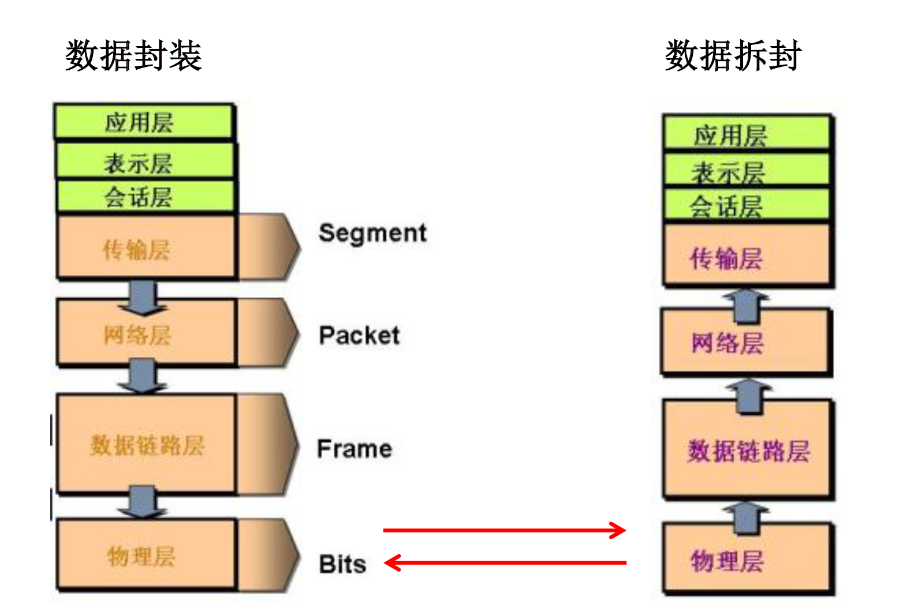
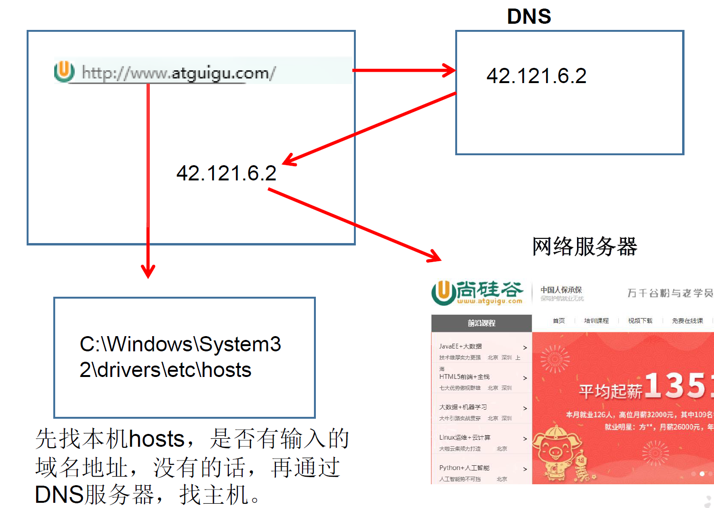
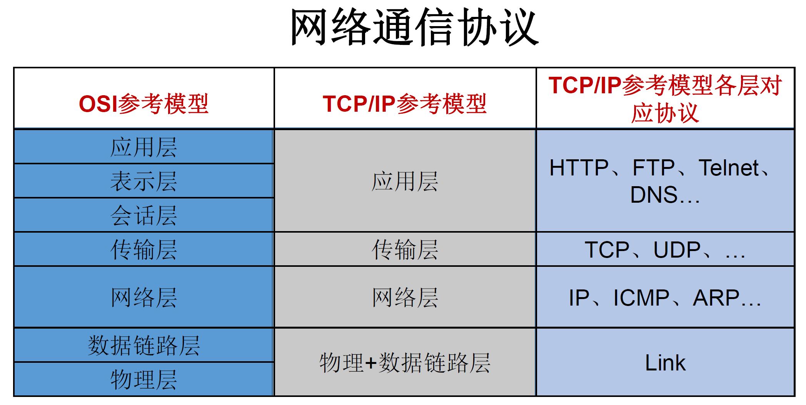
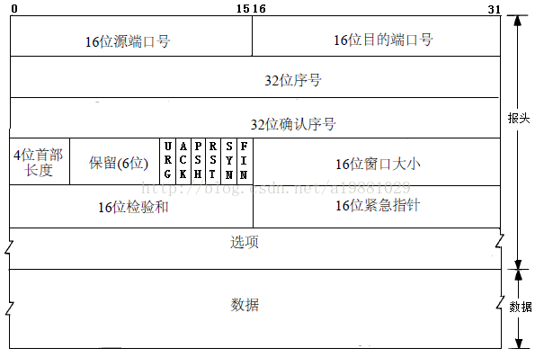
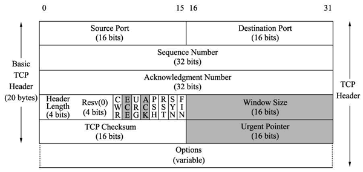
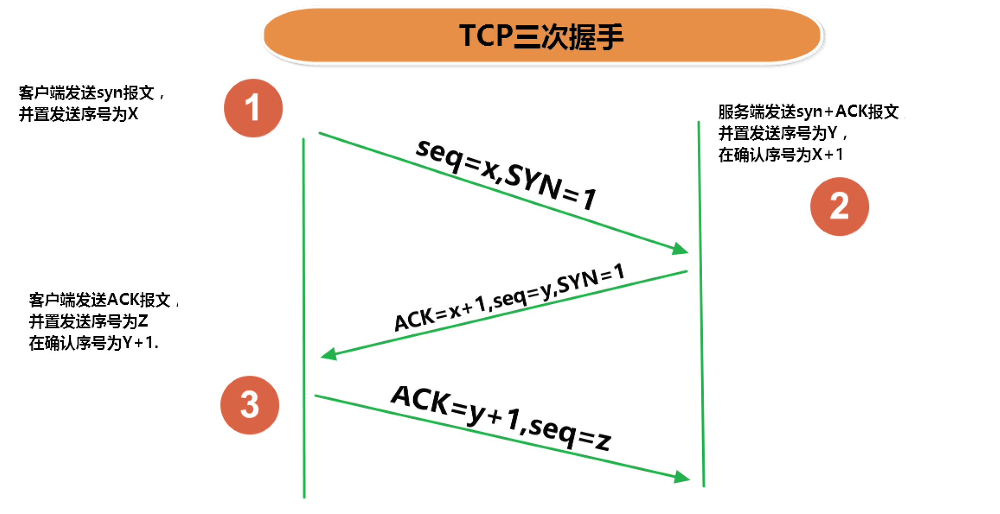
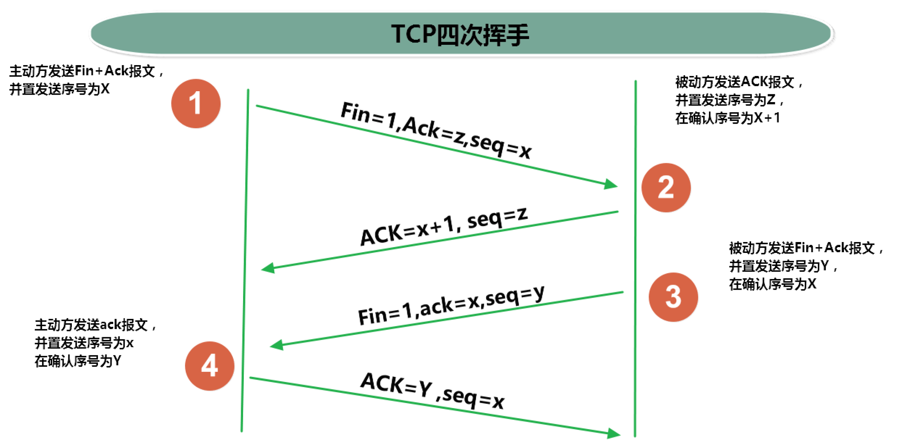
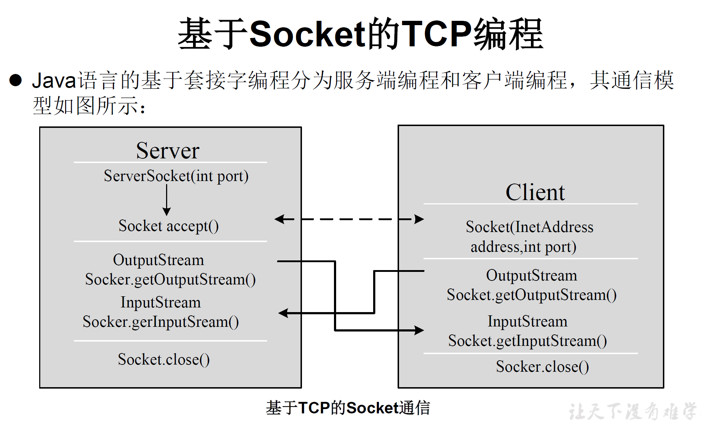

# 一、网络编程概述

1. 计算机网络：
   - 把分布在不同地理区域的计算机与专门的外部设备用通信线路互连成一个规模大、功能强的网络系统，从而使众多的计算机可以方便地互相传递信息共享硬件、软件、数据信息等资源。
2. 网络编程的目的: 
   * 直接或间接地通过网络协议与其它计算机实现数据交换，进行通讯
3. 实现网络通信需要解决的两个问题:
   - 如何准确地==定位==网络上一台或多台主机；定位主机上的特定的应用
   - 找到主机后如何可靠高效地进行==数据传输==

# 二、网络通信要素概述

* #### 如何实现网络中的主机相互通信

  * 通信双方<font color='#66ccff'>地址</font>
    * IP <定位主机>
    * 端口号 <定位应用程序>

  * 一定的规则 (即: <font color='#66ccff'>网络通信协议</font>), 有两套参考模型
    * OSI参考模型: 模型过于理想化, 未能推广
      * TCP/IP参考模型(TCP/IP参考协议): 国际标准


* 网络通讯协议


* 通讯过程



# 三、通信要素1: IP和端口号

### 1. IP

1. <font color='#66ccff'>IP(Internet Protocol Address)地址</font>：互联网协议地址。IP地址是IP协议提供的一种统一的地址格式，它为互联网上的每一个网络和每一台主机分配一个==逻辑地址==，以此来屏蔽物理地址的差异。

2. 在Java中使用`InetAddress类`代表IP

3. IP地址分类

   1. <font color='#66ccff'>**IPV4**</font>和<font color='#66ccff'>**IPV6**</font>

      * IPV4：4个字节组成，4个0~255。大概 42 亿，30亿都在北美，亚洲4亿，2011年初已经用尽。以点分十进制表示，如 192.168.0.1
      * IPV6：128位（16 个字节 ）写成8个无符号整数，每个整数用四个十六进制位表示，数之间用冒号(:)分开，如： 3ffe:3201:1401:1280:c8ff:fe4d:db39:1984

   2. <font color='#66ccff'>**公网地址(万维网使用)**</font>和<font color='#66ccff'>**私有地址(局域网使用)**</font>
      * 192.168.开头的就是私有址址 ，范围即为 192.168.0.0 192.168.255.255 ，专门为组织机构内部使用

4. IP的特点: 不易记忆

   ↓

5. <font color='#66ccff'>**域名**</font>: 通过域名解析服务器将域名解析为IP地址(==便于记忆==)，如： [www.baidu.com](https://www.baidu.com) [www.mi.com](https://www.mi.com) [www.jd.com](https://www.jd.com) 

   **域名解析**：域名容易记忆，当在连接网络时输入一个主机的域名后，<font color='#66ccff'>域名服务器(DNS, Domain Name System)</font>负责将域名转化成IP地址，这样才能和主机建立连接。

   

6. **本地回路地址**：`127.0.0.1` 对应着：`localhost`

   

### 2. 端口号

1. <font color='#66ccff'>端口号</font>: 用于标识正在计算机上运行的进程。

2. 要求：不同的进程有不同的端口号

3. 范围：被规定为一个 16 位的整数 0~65535。

4. 分类：

   - **公认端口**：0~1023.被预先定义的服务通信占用（如：HTTP占用端口80，FTP占用端口21，TeInet占用端口23）。
   - **注册端口**：1024~49151.分配给用户进程或应用程序。（如：Tomcat占用端口8080，MSQL占用端口3306，Oracle占用端口1521等）。
   - **动态/私有端口**：49152~65535。

5. 端口号与IP地址的组合得出一个网络套接字: Socket

   所以网络编程也称为`Socket编程`

### 3. InetAddress类

此类的一个对象就代表着一个具体的IP地址

1. 实例化

`getByName(String host)` /`getLocalHost()`,  返回一个`InetAddress`对象

2. 常用方法

   `getHostName()` / `getHostAddress()`

```java
public class InetAddressTest {
    public static void main(String[] args) {
        try {
            //File file = new File("hello.txt");
            InetAddress inet1 = InetAddress.getByName("192.168.10.14");

            System.out.println(inet1);

            InetAddress inet2 = InetAddress.getByName("www.baidu.com");
            System.out.println(inet2);

            InetAddress inet3 = InetAddress.getByName("127.0.0.1");
            System.out.println(inet3);

            //获取本地ip
            InetAddress inet4 = InetAddress.getLocalHost();
            System.out.println(inet4);

            //getHostName()
            System.out.println(inet2.getHostName());
            //getHostAddress()
            System.out.println(inet2.getHostAddress());

        } catch (UnknownHostException e) {
            e.printStackTrace();
        }
	}
```


# 四、通信要素2: 网络通信协议

### 1. 分层模型

   

### 2. TCP和UDP的区别

   1. **<font color='#66ccff'>TCP协议</font>**：

      - 使用TCP协议前，须先建立TCP连接，形成传输数据通道

      - 传输前(建立TCP连接)，采用“**==三次握手==**”方式，点对点通信，是==可靠的==

        

      - TCP协议进行通信的两个应用进程：客户端、服务端。

      - 在连接中可进行==大数据量的传输==

      - 传输完毕，需==释放已建立的连接==，==效率低==

2. **<font color='#66ccff'>UDP协议</font>：**

- 将数据、源、目的封装成数据包，==不需要建立连接==
- 每个数据报的大小限制在64K内
- 发送不管对方是否准备好，接收方收到也不确认，故是不可靠的
- 可以广播发送
- 发送数据结束时==无需释放资源，开销小，速度快==

### 3. TCP三次握手和四次挥手

#### 3.1 TCP报文格式

##### 3.1.1 TCP报文格式图解

|  |  |
| ------------------------------------------------------------ | --------------------------------------------------------- |

##### 3.1.2各个字段解释

1. **源端口和目的端口字段**

   - TCP源端口（Source Port）：源计算机上的应用程序的端口号，占 16 位。
   - TCP目的端口（Destination Port）：目标计算机的应用程序端口号，占 16 位。

2. **序列号字段`seq`**

   * CP序列号（Sequence Number）：占 32 位。它表示==本报文段所发送数据的第一个字节的编号==。在 TCP 连接中，所传送的字节流的每一个字节都会按顺序编号。当SYN标记不为1时，这是当前数据分段第一个字母的序列号；如果SYN的值是1时，这个字段的值就是初始序列值（ISN），用于对序列号进行同步。这时，第一个字节的序列号比这个字段的值大1，也就是ISN加1。

3. **确认号字段 `ack`**

   * TCP 确认号（Acknowledgment Number，ACK Number）：占 32 位。它表示接收方期望收到发送方下一个报文段的第一个字节数据的编号。其值是接收计算机即将接收到的下一个序列号，也就是下一个接收到的字节的序列号加1。

4. **数据偏移字段**

   * TCP 首部长度（Header Length）：数据偏移是指数据段中的“数据”部分起始处距离 TCP 数据段起始处的字节偏移量，占 4 位。其实这里的“数据偏移”也是在确定 TCP 数据段头部分的长度，告诉接收端的应用程序，数据从何处开始。

5. **保留字段**

   * 保留（Reserved）：占 4 位。为 TCP 将来的发展预留空间，目前必须全部为 0。

6. **标志位字段**

   - `CWR`（Congestion Window Reduce）：拥塞窗口减少标志，用来表明它接收到了设置 ECE 标志的 TCP 包。并且，发送方收到消息之后，通过减小发送窗口的大小来降低发送速率。

   - `ECE`（ECN Echo）：用来在 TCP 三次握手时表明一个 TCP 端是具备 ECN 功能的。在数据传输过程中，它也用来表明接收到的 TCP 包的 IP 头部的 ECN 被设置为 11，即网络线路拥堵。

   - `URG`（Urgent）：表示本报文段中发送的数据是否包含紧急数据。URG=1 时表示有紧急数据。当 URG=1 时，后面的紧急指针字段才有效。

   - `ACK`：表示前面的确认号字段是否有效。ACK=1 时表示有效。只有当 ACK=1 时，前面的确认号字段才有效。TCP 规定，连接建立后，ACK 必须为 1。

   - `PSH`（Push）：告诉对方收到该报文段后是否立即把数据推送给上层。如果值为 1，表示应当立即把数据提交给上层，而不是缓存起来。

   - `RST`：表示是否重置连接。如果 RST=1，说明 TCP 连接出现了严重错误（如主机崩溃），必须释放连接，然后再重新建立连接。

   - `SYN`：在==建立连接时使用==，用来同步序号。

     * SYN=1 时，说明这是一个请求建立连接或同意建立连接的报文。

       当 `SYN=1，ACK=0` 时，表示这是一个==请求建立连接==的报文段；

       当 `SYN=1，ACK=1` 时，表示对方==同意建立连接==。

     * 只有在前两次握手中 SYN 才为 1。

   - `FIN`：标记数据是否发送完毕。如果 FIN=1，表示数据已经发送完成，可以==释放连接==。

7. **窗口大小字段**

   * 窗口大小（Window Size）：占 16 位。它表示从 Ack Number 开始还可以接收多少字节的数据量，也表示当前接收端的接收窗口还有多少剩余空间。该字段可以用于 TCP 的流量控制。<font color='orange'>(因为只有16位, 所以窗口最大值为655355)</font>

8. **TCP 校验和字段**

   * 校验位（TCP Checksum）：占 16 位。它用于确认传输的数据是否有损坏。发送端基于数据内容校验生成一个数值，接收端根据接收的数据校验生成一个值。两个值必须相同，才能证明数据是有效的。如果两个值不同，则丢掉这个数据包。Checksum 是根据伪头 + TCP 头 + TCP 数据三部分进行计算的。

9. **紧急指针字段**

   * 紧急指针（Urgent Pointer）：仅当前面的 URG 控制位为 1 时才有意义。它指出本数据段中为紧急数据的字节数，占 16 位。当所有紧急数据处理完后，TCP 就会告诉应用程序恢复到正常操作。即使当前窗口大小为 0，也是可以发送紧急数据的，因为紧急数据无须缓存。

10. **可选项字段**

    * 选项（Option）：长度不定，但长度必须是 32bits 的整数倍。

#### 3.2 **三次握手**

   

1. 第一次握手: **客户端--->服务端**, **申请建立连接**
* 客户端发送`SYN=1, ACK=0`报文,  同时 发送初始化的随机序列号`seq( = x)`
2. 第二次握手: **客户端<---服务端**, **同意建立连接**, 确认了服务端能接收到客户端的消息 (服务端在线)
* 服务端发送`SYN=1, ACK=1`报文, 此外 发送确认序列号`ack( = x+1)`和 发送初始化的随机序列号`seq( = y)`
3. 第三次握手: **客户端--->服务端**, 确认了客户端能接收到服务端的消息 (客户端在线)
* 客户端发送`ACK=1`, 此外发送`ack( = y+1)`和 `seq( = x+1)`<font color='orange'>(是1中的seq+1)</font>

#### 3.3 **四次挥手**



* 在断开连接之前客户端和服务器都处于**ESTABLISHED状态**，双方都可以主动断开连接，以==客户端主动断开连接为优==。

1. 第一次挥手: **客户端--->服务端**, **客户端申请断开连接**

   * 客户端发送`FIN=1`报文, 同时 因传输字节数增长而增大的序列号`seq( = x)`

2. 第二次挥手: **客户端<---服务端**, **服务端同意断开连接**

   * 服务端发送`ACK=1`报文, 此外 发送确认序列号`ack( = x+1)`

3. 第三次挥手: **客户端<---服务端**, **服务端确认能够断开连接**

   * 服务端发送`FIN=1, ACK=1`报文, ===, 此外 发送序列号`seq( = y)`

4. 第四次挥手: **客户端--->服务端**, 

   * 客户端发送`ACK=1`, 此外发送`ack( = y+1)` 和 `seq( = x+1)`<font color='orange'>(是1中的seq+1)</font>

     

### 4.套接字Socket

1. 套接字:  [IP 地址](#1. IP) 与 [端口号](#2. 端口号)的组合得出一个网络套接字`Socket`

2. 利用套接字(`Socket`)开发网络应用程序早已被广泛的采用，以至于成为事实上的标准。

3. 网络上具有唯一标识的 IP 地址和端口号组合在一起才能构成唯一能识别的标识符套接字。

4. 通信的两端都要有 `Socket`，是两台机器间通信的端点。

5. 网络通信其实就是 `Socket` 间的通信。一般主动发起通信的应用程序属客户端，等待通信请求的为服务端

6. `Socket` 允许程序把网络连接当成一个流，数据在两个 `Socket` 间通过 <font color='#EE0000'>`IO` 传输</font>。

7. `Socket` 分类

   - 流套接字(`stream socket`)：使用TCP提供可依赖的字节流服务

   - 数据报套接字(`datagram socket`)：使用UDP提供“尽力而为”的数据报服务

```java
"Socket 类的常用构造器"
public Socket(InetAddress address,int port) 创建一个流套接字并将其连接到指定IP地址的指定端口号
public Socket(String host,int port) 创建一个流套接字并将其连接到指定主机上的指定端口号

"Socket 类的常用方法"

public InputStream getInputStream() 返回此套接字的"输入流"。可以用于接收网络消息
public OutputStream getOutputStream() 返回此套接字的"输出流"。可以用于发送网络消息
    
public InetAddress getInetAddress() 此套接字连接到的"远程IP地址"；如果套接字是未连接的, 则返回 null
public InetAddress getLocalAddress() 获取套接字绑定的"本地地址"。即本端的 IP地址
public int getPort() 此套接字连接到的"远程端口号"；如果尚未连接套接字 则返回 0。
public int getLocalPort() 返回此套接字绑定到的"本地端口"。如果尚未绑定套接字则返回 1, 即本端的端口号
    
public void close() 关闭此套接字。套接字被关闭后 便不可在以后的网络连接中使用 即无法重新连接
或重新绑定。需要创建新的套接字对象。关闭此套接字也将会关闭该套接字的 InputStream 和 OutputStream
    
public void shutdownInput() 如果在套接字上调用 shutdownInput() 后从套接字输入流读取内容, 则流将返回 EOF 文件结束符。即不能在从此套接字的输入流中接收任何数据。
public void shutdownOutput() 禁用此套接字的输出流。对于 TCP 套接字 任何以前写入的数据都将被发送并且后跟 TCP 的正常连接终止序列。如果在套接字上调用 shutdownOutput()后写入套接字输出流则该流将抛出 IOException。即不能通过此套接字的输出流发送任何数据。
```


# 五、TCP网络编程(Socket编程)

#### 基于TCP的Socket通信模型

Java语言的 **基于套接字Socket编程** 分为客户端和服务端



### 1. 客户端Socket

#### 1.1 客户端Socket的工作过程

1. 创建 `Socket`：根据指定服务端的 IP地址或端口号构造 `Sσcket` 类对象。若服务器端响应，则建立客户端到服务器的通信线路。若连接失败，会出现异常。

2. 打开连接到 `Socket` 的输入出流：使用 `getInputstream()` 方法获得输入流，使用`getOutputStream()` 方法获得输出流，进行数据传输

3. 按照一定的协议对 `Socket` 进行读/写操作：通过输入流读取服务器放入线路的信息（但不能读取自己放入线路的信息），通过输出流将信息写入线程

4. 关闭 `Socket`：断开客户端到服务器的连接，释放线路

#### 1.2 说明

1. 客户端程序可以使用 `Socket` 类创建对象，创建的同时会自动向服务器方发起连接。

2. `Socket` 的构造器是：

   1. ```java
          Socket(String host，int port) throws UnknownHostException
      ```

     - `EXCeption`：向服务器（域名是 `host`,端口号为 `port` ）发起 `TCP` 连接，若成功，则创建 `Socket` 对象，否则抛出异常。

   2. ```java
      Socket(InetAddress address，int port)throws IOException
      ```

     * 根据 `InetAddress` 对象所表示的 `IP` 地址以及端口号 `port` 发起连接

3. 客户端建立 `socketAtClient`对象的过程就是向服务器发出套接字连接请求

### 2. 服务器端Socket

#### 2.1 服务器端Socket的工作过程

1. 调用 `ServerSocket(int port)`：创建一个服务器端套接字，并绑定到指定端口上。用于监听客户端的请求。
2. 调用 `accept0()`：监听连接请求，如果客户端请求连接，则接受连接，返回通信套接字对象。
3. 调用该 `Socket` 类对象的 `getOutputStream()` 和 `getInputStream()`：获取输出流和输入流，开始网络数据的发送和接收。
4. 关闭 `ServerSocket` 和 `Socket` 对象：客户端访问结束，关闭通信套接字。

#### 2.2 说明

1. `ServerSocket` 对象负责等待客户端请求建立套接字连接，类似邮局某个窗口中的业务员。也就是说，服务器必须事先建立一个等待客户请求建立套接字连接的 `Server Socket` 对象。

2. 所谓“接收”客户的套接字请求，就是使用 `accept()` 方法, 返回一个 `Socket` 对象

### 3. 使用例

#### 3.1 例1

* 客户端发送信息给服务端，服务端将数据显示在控制台上
* [TCPTest1.java](D:\Java\idea_workspace\books\JavaSe\Chap20_NetworkProgramming\src\inetAddress\TCPTest1.java)

```java
//客户端
@Test
public void client()  {
    Socket socket = null;//端口号8899
    OutputStream os = null;
    try {
        //1.创建Socket对象，指明服务器端的ip和端口号
        InetAddress inet = InetAddress.getByName("127.0.0.1");
        socket = new Socket(inet, 8899);

        //2. 获取一个输出流, 用于输出数据
        os = socket.getOutputStream();
        //3. 写出数据的操作
        os.write("你好, 我是客户端:)".getBytes(StandardCharsets.UTF_8));
    } catch (IOException e) {
        throw new RuntimeException(e);
    } finally {
        //4. 资源的关闭
        if (os != null) {
            try {
                os.close();
            } catch (IOException e) {
                throw new RuntimeException(e);
            }
        }
        if (socket != null) {
            try {
                socket.close(); //socket也不会被gc回收, 需要手动关闭
            } catch (IOException e) {
                throw new RuntimeException(e);
            }
        }
    }
}

//服务端
@Test
public void server() {
    ServerSocket serverSocket = null;
    Socket socket = null;
    InputStream is = null;
    ByteArrayOutputStream byteArrayOutputStream = null;
    try {
        //1. 创建服务器端的ServerSocket, 指名自己的端口号
        serverSocket = new ServerSocket(8899);
        System.out.println("服务端" + serverSocket.getInetAddress().getHostAddress() + "已启动");
        //2. 调用accept(方法, 接收来自于客户端的Socket
        socket = serverSocket.accept();
        System.out.println("已连接" + socket.getLocalAddress().getHostAddress());
        //3. 获取输入流
        is = socket.getInputStream();

        //因为buffer数组大小的问题, 会截断字节码, 可能会出现乱码
        //        byte[] buffer = new byte[20];
        //        int len;
        //        while ((len = is.read(buffer)) != -1) {
        //            String str = new String(buffer, 0, len);
        //            System.out.println(str);
        //        }
        //4. 获取流内的数据
        //使用ByteArrayOutputStream, 暂存数据, 等全部输入后再进行转换
        byteArrayOutputStream = new ByteArrayOutputStream();
        byte[] buffer = new byte[20];
        int len;
        while ((len = is.read(buffer)) != -1) {
            byteArrayOutputStream.write(buffer, 0, len);
        }

        System.out.println(byteArrayOutputStream.toString());

        System.out.println("收到来自" + socket.getInetAddress().getHostAddress() + "的数据");
        System.out.println(serverSocket.getInetAddress().getHostAddress() + "即将关闭");
    } catch (IOException e) {
        throw new RuntimeException(e);
    } finally {
        //5. 关闭资源
        if (byteArrayOutputStream != null) {
            try {
                byteArrayOutputStream.close();
            } catch (IOException e) {
                throw new RuntimeException(e);
            }
        }
        if (is != null) {
            try {
                is.close();
            } catch (IOException e) {
                throw new RuntimeException(e);
            }
        }
        if (socket != null) {
            try {
                socket.close();
            } catch (IOException e) {
                throw new RuntimeException(e);
            }
        }
        if (serverSocket != null) {
            try {
                serverSocket.close();
            } catch (IOException e) {
                throw new RuntimeException(e);
            }
        }
    }
}
```

#### 3.2例2

* 客户端发送文件给服务端，服务端将文件保存在本地。
* [TCPTest2.java](D:\Java\idea_workspace\books\JavaSe\Chap20_NetworkProgramming\src\inetAddress\TCPTest2.java)

```java
"备注: 实际使用时应该使用try-catch-finally处理异常"
//客户端
@Test
public void client() throws IOException {

    InetAddress inet = InetAddress.getByName("127.0.0.1");
    Socket socket = new Socket(inet, 8899);
    OutputStream os = socket.getOutputStream();
    FileInputStream fis = new FileInputStream(new File("testFile\\mio.png"));

    byte[] buffer = new byte[1024];
    int len;
    while ((len = fis.read(buffer)) != -1) {
        os.write(buffer, 0, len);
    }
    fis.close();
    os.close();
    socket.close();
}

//服务端
@Test
public void server() throws IOException {
    ServerSocket serverSocket = new ServerSocket(8899);
    Socket socket = serverSocket.accept();
    InputStream is = socket.getInputStream();
    FileOutputStream fos = new FileOutputStream("testFile\\mio_TCP.png");

    byte[] buffer = new byte[20];
    int len;
    while ((len = is.read(buffer)) != -1) {
        fos.write(buffer, 0, len);
    }
    System.out.println("收到来自" + socket.getInetAddress().getHostAddress() + "的数据");

    fos.close();
    is.close();
    socket.close();
    serverSocket.close();

}
```

#### 3.3 例3

* 从客户端发送文件给服务端，服务端保存到本地。并返回“发送成功”给客户端。
* [TCPTest3.java](D:\Java\idea_workspace\books\JavaSe\Chap20_NetworkProgramming\src\inetAddress\TCPTest3.java)
* <font color='#EE0000'>注意点</font>: 在第一次传输完图片后, 需要使用`socket.shutdownOutput();`来结束客户端的输出; 否则服务器端就会一直等待客户端的输出, 导致阻塞

```java
//客户端
@Test
public void client() throws IOException {
    Socket socket = new Socket(InetAddress.getByName("127.0.0.1"), 8899);
    OutputStream os = socket.getOutputStream();
    FileInputStream fis = new FileInputStream(new File("testFile\\mio.png"));

    byte[] buffer1 = new byte[1024];
    int len;
    while ((len = fis.read(buffer1)) != -1) {
    os.write(buffer1, 0, len);
    }
    //关闭数据的输入
    socket.shutdownOutput();

    //接收反馈
    InputStream is = socket.getInputStream();
    ByteArrayOutputStream baos = new ByteArrayOutputStream();
    byte[] buffer2 = new byte[20];
    while ((len = is.read(buffer2)) != -1) {
    baos.write(buffer2, 0, len);
    }
    System.out.println(baos);

    socket.close();
    os.close();
    fis.close();
    is.close();
    baos.close();
}

//服务端
@Test
public void server() throws IOException {
    ServerSocket serverSocket = new ServerSocket(8899);
    Socket socket = serverSocket.accept();
    InputStream is = socket.getInputStream();
    File file = new File("testFile\\mio_TCP2.png");
    FileOutputStream fos = new FileOutputStream(file);

    byte[] buffer = new byte[20];
    int len;
    while ((len = is.read(buffer)) != -1) {
    fos.write(buffer, 0, len);
    }

    System.out.println("收到来自" + socket.getInetAddress().getHostAddress() + "的数据");

    //服务器端向客户端反馈
    OutputStream os = socket.getOutputStream();
    os.write(("已存储到" + file).getBytes());

    serverSocket.close();
    socket.close();
    is.close();
    fos.close();
    os.close();
}
```

### 4. 客户端-服务端

1. **客户端**：自定义 / 浏览器

2. **服务端**：自定义 / Tomcat 服务器

* Javaweb会详细介绍

# 六、UDP网络编程

### 1. 简述

1. 类 `DatagramSocket` 和 `DatagramPacket` 实现了基于 `UDP` 协议网络程序。

   - `UDP` 数据报通过数据报套接字 `DatagramSocket` 发送和接收，系统不保证 `UDP` 数据报一定能够安全送到目的地，也不能确定什么时候可以抵达。

   - `DatagramPacket` 对象封装了 `UDP` 数据报，在数据报中包含了发送端的 `IP` 地址和端口号以及接收端的 `IP` 地址和端口号

2. `UDP` 协议中每个数据报都给出了完整的地址信息，因此无须建立发送方和接收方的连接。如同发快递包裹一样。

### 2. DatagramSocket类常用方法

```java
public DatagramSocket(int port) 创建数据报套接字, 并将其绑定到本地主机上的指定端口。套接字将被绑定到通配符地址, IP 地址由内核来选择。

public DatagramSocket(int port,InetAddress laddr) 创建数据报套接字, 将其绑定到指定的本地地址。
	本地端口必须在 0 到 65535 之间(包括两者)。
    如果IP 地址为 0.0.0.0 套接字将被绑定到通配符地址, IP地址由内核选择。

public void close() 关闭此数据报套接字。

public void send(DatagramPacket p) 从此套接字发送数据报包。
    DatagramPacket 包含的信息指示：将要发送的数据、 其长度、 远程主机的IP地址和远程主机的端口号。

public void receive(DatagramPacket p) 从此套接字接收数据报包。
    当此方法返回时 DatagramPacket的缓冲区填充了接收的数据。数据报包也包含发送方的IP地址和发送方机器上的端口号。
    此方法在接收到数据报前一直阻塞。数据报包对象的length 字段包含所接收信息的长度。
    如果信息比包的长度长, 该信息将被截短。

public InetAddress getLocalAddress() 获取套接字"绑定的本地地址"。
public int getLocalPort() 返回此套接字"绑定的本地主机上的端口号"。
public InetAddress getInetAddress() 返回此套接字"连接的地址"。如果套接字未连接, 则返回 null。
public int getPort() 返回此套接字的"端口"。如果套接字未连接, 则返回 1。
```

### 3. DatagramPacket类常用方法

```java
public DatagramPacket(byte[] buf,int length) 构造 DatagramPacket, 用来接收长度为length的数据包。
    length 参数必须小于等于 buf.length 。

public DatagramPacket(byte[] buf,int length,InetAddress address,int port) 构造数据报包, 用来将长度为 length 的包发送到指定主机上的指定端口号
    length参数必须小于等于 buf.length

public InetAddress getAddress() 返回某台机器的 IP 地址, 此数据报将要发往该机器或者是从该机器接收到的 。

public int getPort() 返回某台远程主机的端口号, 此数据报将要发往该主机或者是从该主机接收到的

public byte[] getData() 返回数据缓冲区。
    接收到的或将要发送的数据从缓冲区中的偏移量offset处开始持续lengt长度 。

public int getLength() 返回将要发送或接收到的数据的长度。
```

### 4. DatagramPacket类的使用

* 流程：

    1. `DatagramSocket` 与 `DatagramPacket`
    2. 建立发送端，接收端
    3. 建立数据包
    4. 调用 `Socket` 的发送、接收方法
    5. 关闭 `Socket`

* 注意：发送端与接收端是两个独立的运行程序

```java
public class UDPTest {
    //发送端
    @Test
    public void sender() throws IOException {
        DatagramSocket socket = new DatagramSocket();

        String str = "我是UDP方式发送的一段数据";
        byte[] data = str.getBytes();
        InetAddress inet = InetAddress.getLocalHost();
        DatagramPacket packet = new DatagramPacket(data, 0, data.length, inet, 9090);

        socket.send(packet);

        socket.close();
    }

    //接收端
    @Test
    public void receiver() throws IOException {
        DatagramSocket socket = new DatagramSocket(9090);

        byte[] buffer = new byte[10];
        DatagramPacket packet = new DatagramPacket(buffer, 0, buffer.length);

        socket.receive(packet);

        System.out.println(new String(buffer, 0, packet.getLength()));

        socket.close();
    }
}
```

# 七、URL编程

### 1. URL介绍

1. 什么是URL

   * `URI(Uniform Resource Identifier)`: 统一资源标识符, 用于标识某一互联网资源==名称==的字符串

   * `URL(Uniform Resource Locator)`：统一资源定位符，它表示 Internet 上某一资源的==地址==。

   * `URL`是一种具体的 `URI`，即 `URL` 不仅可以用来标识一个资源，而且还指明了如何 locate 这个资源。

2. URL作用:
   * 通过 `URL` 我们可以访问 Internet 上的各种网络资源，比如最常见的 www，ftp站点。浏览器通过解析给定的 `URL` 可以在网络上查找相应的文件或其他资源

3. URL结构

   * URL的基本结构由5部分组成: <font color='#EE0000'>`<传输协议>：//<主机名>：<端口号>/<文件名>#片段名？参数列表`</font>
   * 例如： `http://192.168.1.100:8080/helloworld/indexjsp#a?username=shkstart&password=123`

   * **片段名**：即锚点，例如看小说，直接定位到章节

   * **参数列表格式**：参数名=参数值&参数名=参数值...

### 2. URL类

#### 2.1 构造器

* 为了表示 `URL`，`java.net`中实现了类 `URL`。我们可以通过下面的构造器来初始化一个 `URL` 对象

  - **`public URL(String spec)`**：通过一个表示 `URL` 地址的字符串可以构造一个 `URL` 对象。 
    - 例如：<font color='green'>`URL url = new URL（"http://www.baidu.com/);`</font>

  - **`public URL(URL context,String spec)`**：通过基URL和相对URL构造一个URL对象
    - 例如： <font color='green'>`URL downloadeUrl = new URL(url,"download.html");`</font>

  - **`public URL(String protocol,String host,String file)`** `协议, 主机名, 文件名`
    -  例如：<font color='green'>`new URL("http","[www.baidu.com](http://www.baidu.com)","download.html");`</font>

  - **`public URL(String protocol, String host,int port, String file)`**`协议, 主机名, 端口号, 文件名`
    - 例如：<font color='green'>`new URL("http","[www.baidu.com](http://www.baidu.com)",80,"download.html");`</font>

* <font color='#EE0000'>注意</font>：`URL` 类的构造器都声明抛出非运行时异常，必须要对这一异常进行处理，通常是用 `try-catch` 语句进行捕获。

#### 2.2 方法

- `public String getProtocol()` 获取该 `URL` 的协议名
- `public String getHost()` 获取该 `URL` 的主机名
- `public String getPort()` 获取该 `URL` 的端口号
- `public String getPath()` 获取该 `URL` 的文件路径
- `public String getFile()` 获取该 `URL` 的文件名
- `public String getQuery()` 获取该 `URL` 的查询名

#### 2.3 使用例

```java
public class URLTest {

    public static void main(String[] args) {

        try {

            URL url = new URL("http://localhost:8080/examples/beauty.jpg?username=Tom");

//            public String getProtocol(  )     获取该URL的协议名
            System.out.println(url.getProtocol());
//            public String getHost(  )           获取该URL的主机名
            System.out.println(url.getHost());
//            public String getPort(  )            获取该URL的端口号
            System.out.println(url.getPort());
//            public String getPath(  )           获取该URL的文件路径
            System.out.println(url.getPath());
//            public String getFile(  )             获取该URL的文件名
            System.out.println(url.getFile());
//            public String getQuery(   )        获取该URL的查询名
            System.out.println(url.getQuery());
        } catch (MalformedURLException e) {
            e.printStackTrace();
        }
    }
}

```

* ##### 例子：通过URL下载

```java
public class URLTest1 {

    public static void main(String[] args) {

        HttpURLConnection urlConnection = null;
        InputStream is = null;
        FileOutputStream fos = null;
        try {
            URL url = new URL("http://localhost:8080/examples/beauty.jpg");

            urlConnection = (HttpURLConnection) url.openConnection();

            urlConnection.connect(); //获取连接

            is = urlConnection.getInputStream();
            fos = new FileOutputStream("beauty3.jpg");

            byte[] buffer = new byte[1024];
            int len;
            while((len = is.read(buffer)) != -1){
                fos.write(buffer,0,len);
            }

            System.out.println("下载完成");
        } catch (IOException e) {
            e.printStackTrace();
        } finally {
            //关闭资源
            if(is != null){
                try {
                    is.close();
                } catch (IOException e) {
                    e.printStackTrace();
                }
            }
            if(fos != null){
                try {
                    fos.close();
                } catch (IOException e) {
                    e.printStackTrace();
                }
            }
            if(urlConnection != null){
                urlConnection.disconnect();
            }
        }
    }
}
```
