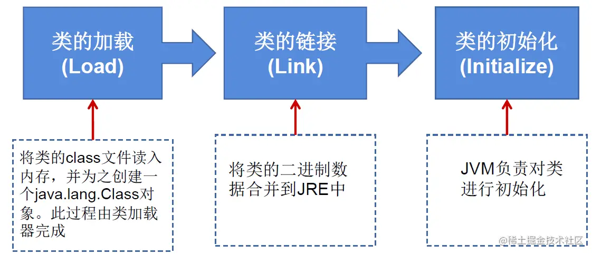

# 一、反射的概述

### 1. 反射的简介

1. **什么是反射**

   - <font color='#66ccff'>**Reflection(反射)**</font> 被视为<font color='#66ccff'>动态语言</font>的关键，反射机制允许程序在执行期借助于 `Reflection API` 取得任何类的内部信息，并能直接操作任意对象的内部属性及方法。

   - 加载完类之后，在堆内存的方法区中就产生了一个 `Class` 类型的对象(一个类只有一个 `Class` 对象)，这个对象就包含了完整的类的结构信息。我们可以通过这个对象看到类的结构。这个对象就像一面镜子，透过这个镜子看到类的结构，所以，我们形象的称之为：反射。

2. **反射的特点**
* 通常方式：引入需要的“包类”名称---->通过 `new` 实例化---->获得实例化对象
  
* 反射方式：实例化对象----> `getClass()` 方法---->得到完整的“包类”名称

* ==框架 = 注解 + 反射 + 设计模式==

##### 动态语言与静态语言

1. 动态语言: 是一类在运行时可以改变其结构的语言

   * 例如新的函数、对象、甚至代码可以被引进，已有的函数可以被删除或是其他结构上的变化。通俗点说就是 ==在运==
     ==行时代码可以根据某些条件改变自身结构== 。
   * 主要动态语言： Object C 、 C# 、 JavaScript 、 PHP 、 Python 、 Erlang 。

2. 静态语言: 与动态语言相对应的，运行时结构不可变的语言就是静态语言。

   * 如 Java 、 C 、C++ 。

* Java不是动态语言 但 Java 可以称之为 ==准动态语言== 。 即 Java 有一定的动态性 我们可以利用反射机制 、 字节码操作获得类似动态语言的特性 。Java的动态性让编程的时候更加灵活

### 2. 反射动态性体现

只有当程序运行时我们才能知道调用的类

```java
@Test
public void test2(){

    for(int i = 0;i < 100;i++){
        int num = new Random().nextInt(3);//0,1,2
        String classPath = "";
        switch(num){
            case 0:
                classPath = "java.util.Date";
                break;
            case 1:
                classPath = "java.lang.Object";
                break;
            case 2:
                classPath = "com.atguigu.java.Person";
                break;
        }

        try {
            Object obj = getInstance(classPath);
            System.out.println(obj.getClass());
        } catch (Exception e) {
            e.printStackTrace();
        }
    }
}

/**
 * 创建一个指定类的对象。
 * classPath:指定类的全类名
*/
public Object getInstance(String classPath) throws Exception {
    Class clazz =  Class.forName(classPath);
    return clazz.newInstance();
}
```

### 3. 反射机制提供的功能

- 在运行时判断任意一个对象**所属的类**
- 在运行时构造任意一个类的**对象**
- 在运行时判断任意一个类所具有的**成员变量和方法**
- 在运行时获取**泛型**信息
- 在运行时**调用**任意一个对象的成员变量和方法
- 在运行时**处理注解**
- 生成**动态代理**

##### 代码示例

```java
@Test
public void test1() throws Exception {
    Class<Person> clazz = Person.class;
    //1.通过反射，创建Person类对象
    Constructor<Person> cons = clazz.getConstructor(String.class, int.class);
    Person person = cons.newInstance("Tom", 12);
    System.out.println(person);//Person{name='Tom', age=12}

    //2.通过反射，调用对象指定的属性、方法
    //调用属性
    Field age = clazz.getDeclaredField("age");
    age.setAccessible(true);
    age.set(person, 10);
    System.out.println(person.toString());//Person{name='Tom', age=10}

    //调用方法
    Method show = clazz.getDeclaredMethod("show");
    show.invoke(person);//my name is Tom and age is 10

    System.out.println("===================================");
    //通过反射，可以调用Person类的私有结构的。比如：私有的构造器、方法、属性
    //调用私有的构造器
    Constructor<Person> cons1 = clazz.getDeclaredConstructor(String.class);
    cons1.setAccessible(true);
    Person p1 = cons1.newInstance("Bruce");
    System.out.println(p1);//Person{name='Bruce', age=0}

    //调用私有的属性
    Field name = clazz.getDeclaredField("name");
    name.setAccessible(true);
    name.set(p1, "Jarry");
    System.out.println(p1);

    //调用私有的方法
    Method nation = clazz.getDeclaredMethod("nation", String.class);
    nation.setAccessible(true);
    Object nation1 = (String) nation.invoke(p1, "China");//相当于String nation = p1.showNation("China")
    System.out.println(nation1);//I come from China
}
```

### 4. 相关API

- `java.lang.Class`：反射的源头， 代表一个类
- `java.lang.reflect.Method`：反射方法， 代表类的方法
- `java.lang.reflect.Field`：反射参数， 代表类的成员变量
- `java.lang.reflect.Constructor`：反射构造器， 代表类的构造器
- ....

# 二、Class类

### 1. Class简述

1. `getClass()`方法

    * 在 `Object` 类中定义了以下的方法，此方法将被所有子类继承：
    
        ```java
         public final Class getClass()
        ```
    
    - 以上的方法返回值的类型是一个 `Class` 类，此类是Java反射的源头，实际上所谓反射从程序的运行结果来看也很好理解，即可以通过对象反射求出类的名称。
    
3. 对象使用反射后可以得到的信息：某个类的属性、方法和构造器、某个类到底实现了哪些接口。对于每个类而言，JRE都为其保留一个不变的Class类型的对象。一个Class对象包含了特定某个结构( <font color='green'>`class / interface / enum / annotation / primitive type / void / []`</font>)的有关信息。

   - `Class` 本身也是一个类

   - `Class` 对象只能由系统建立对象

   - 一个加载的类在 JVM 中只会有一个 `Class` 实例

   - 一个 `Class` 对象对应的是一个加载到 JVM 中的一个 `.class` 文件

   - 每个类的实例都会记得自己是由哪个 `Class` 实例所生成

   - 通过 `Class` 可以完整地得到一个类中的所有被加载的结构

   - `Class` 类是 Reflection 的根源，针对任何你想动态加载、运行的类，唯有先获得相应的 `Class` 对象

##### 类的加载过程

- <font color='#66ccff'>**类的加载**</font>: 程序经过 `javac.exe` 命令以后，会生成一个或多个字节码文件(`.class` 结尾)。接着我们使用 `java.exe` 命令对某个字节码文件进行解释运行(相当于将某个字节码文件加载到内存中) 。此过程就称为<font color='#66ccff'>类的加载</font>。
- 加载到内存中的类，我们就称为<font color='#66ccff'>**运行时类**</font>，此运行时类，就作为 `Class` 的一个实例。换句话说，`Class` 的实例就对应着一个运行时类。
- 加载到内存中的运行时类，会缓存一定的时间。在此时间之内，我们可以通过不同的方式来获取此运行时类。<font color='orange'>(获取到的都是同一个类)</font>

### 2. Class类的常用方法

```java
static Class forName (String name): 返回指定类名"name" 的 Class 对象
Object newInstance(): 调用缺省构造函数，返回该Class对象的一个实例
    
getName(): 返回此Class对象所表示的实体(类、接口、数组类、基本类型或 void)名称
Class getSuperClass(): 返回当前Class对象的父类的Class对象
Class[] getInterfaces(): 获取当前Class对象的接口
ClassLoader getClassLoader(): 返回该类的类加载器
Class getSuperclass () 返回表示此 Class 所表示的实体的超类的Class
Constructor[] getConstructors() 返回一个包含某些Constructor对象的数组
Field[] getDeclaredFields() 返回Field对象的一个数组
Method getMethod (String name, Class … paramTypes)返回一个Method 对象，此对象的形参类型为 paramType
```

**代码示例：**

```java
//创建Class的实例
String str = "test1.Person";
Class clazz = Class.forName(str);
//调用Class的空参构造器创建对象
Object obj = clazz.newInstance;
//获取clazz的name属性
Field field = clazz.getField("name");
field.set(obj,"Jarry");

Object name = filed.get(obj);
System.out.println(name);
//test1.Person为test1包下的Person类

```

### *3. 获取Class实例的几种方式

1. 已知==具体的类==，通过类的 `class` 属性获取，该方法最为安全可靠，程序性能最高 
   * 例：`Class clazz = String.class;`

2. 已知某个==类的实例(对象)==，调用该实例的 `getclass()` 方法获取 `Class` 对象
   * 例：`Class clazz = person.getclass(); `

3. 已知一个类的==全类名==，且该类在类路径下，可通过 `Class` 类的**静态方法** `forName()` 获取，可能抛出`ClassNotFoundException`<font color='orange'>(比较常用)</font>
   * 例：`Class clazz = Class.forName(String classPath)`

4. 通过==类加载器== `ClassLoader cl = this.getclass().getClassLoader();` `Class clazz = cl.loadClass("类的全类名");` <font color='orange'>(了解)</font>

**代码示例**

```java
//获取Class的实例的方式
    @Test
    public void test3() throws ClassNotFoundException {
        //方式1. 调用一个运行时类的属性.class
        Class clazz1 = Person.class;
        System.out.println("方式1. 调用一个运行时类的属性: Person.class : " + clazz1); //basis.Person
        
        //方式2. 通过运行时类的对象
        Person person = new Person();
        Class clazz2 = person.getClass();
        System.out.println("方式2. 通过运行时类的对象: person.getClass(): " + clazz2); //basis.Person

        //方式3. 调用Class的静态方法: forName(String classPath)
        Class clazz3 = Class.forName("basis.Person");
        System.out.println("方式3. 调用Class的静态方法: forName(String classPath): " + clazz3); //basis.Person

        System.out.println(clazz1 == clazz2); //true
        System.out.println(clazz1 == clazz3); //true

        //方式4. 使用类的加载器: ClassLoader() (仅了解)
        ClassLoader classLoader = ReflectionTest.class.getClassLoader();
        Class<?> clazz4 = classLoader.loadClass("basis.Person");
        System.out.println(clazz4); //basis.Person
        System.out.println(clazz4 == clazz1); //true
    }
```

##### 总结：创建类的对象的方式

* 方式一：new + 构造器

* 方式二：要创建Xxx类的对象，可以考虑：`Xxx`、`Xxxs`、`XxxFactory`、`XxxBuilder`类中查看是否有==静态方法==的存在。可以调用其静态方法，创建Xxx对象。

* 方式三：通过==反射==

### 4. Class实例可以代表的结构

(1)`class`：外部类，成员(成员内部类，静态内部类)，局部内部类，匿名内部类

(2)`interface`：接口

(3)`[]`：数组

(4)`enum`：枚举

(5)`annotation`：注解@interface

(6)`primitive type`：基本数据类型

(7)`void`：无返回值

> 在Java中万事万物皆对象

##### 代码示例

```java
@Test
public void test(){
    Class<Object> c1 = Object.class;
    Class<Comparable> c2 = Comparable.class;
    Class<String[]> c3 = String[].class;
    Class<int[][]> c4 = int[][].class;
    Class<ElementType> c5 = ElementType.class;
    Class<Override> c6 = Override.class;
    Class<Integer> c7 = int.class;
    Class<Void> c8 = void.class;
    Class<Class> c9 = Class.class;

    int[] i1 = new int[10];
    int[] i2 = new int[100];
    Class<? extends int[]> c10 = i1.getClass();
    Class<? extends int[]> c11 = i2.getClass();
    // 只要数组的元素类型与维度一样，就是同一个Class
    System.out.println(c10 == c11);//true
}
```

# 三、类的加载

### 1. 类的加载过程

* 当程序主动使用某个类时，如果该类还未被加载到内存中，则系统会通过以下三个步骤对该类进行初始化。



1. 加载：

   * 将 `class` 文件字节码内容加载到内存中，并将这些静态数据转换成方法区的运行时数据结构，然后生成一个代表这个类的 `java.lang.Class` 对象，作为方法区中类数据的访问入口(即引用地址)。
   * 所有需要访问和使用类数据只能通过这个 `Class` 对象。这个加载的过程需要==类加载器==参与。

2. 链接：将 Java类的二进制代码合并到JVM的运行状态之中的过程。

     - 验证：确保加载的类信息符合JVM规范，例如：以 `cafe` 开头，没有安全方面的问题。

     - 准备：正式为类变量(`static`)分配内存并设置==类变量默认初始值==的阶段，这些内存都将在方法区中进行分配。

     - 解析：虚拟机常量池内的符号引用(常量名)替换为直接引用(地址)的过程。


3. 初始化：

     - 执行类构造器 `<clinit>()` 方法的过程。类构造器 `<clinit>()` 方法是由编译期自动收集类中所有类变量的赋值动作和静态代码块中的语句合并产生的。(类构造器是构造类信息的，<font color='#EE0000'>不是</font>构造该类对象的构造器)。

     - 当初始化一个类的时候，如果发现其父类还没有进行初始化，则需要先触发其父类的初始化。

     - 虚拟机会保证一个类的 `<clinit>()` 方法在多线程环境中被正确==加锁和同步==。


**代码示例：**

```java
public class ClassLoadingTest{
    public static void main (String [] args){
        System.out.println(test.m);
    }
}

class test{
    static {
        m = 300;
    }
    static int m = 100;
}
//第一步：加载
//第二步：链接结束后m=0
//第三步：初始化结束后，m的值由<clinit>()方法执行决定
/*
这个test构造器<clinit>()方法由类变量的赋值和静态代码块中的语句按照顺序合并产生，类似于
<clinit>(){
m = 300;
m = 100;
}
*/
```

### 2. Java类编译、运行的执行的流程


### 3. 类的加载器的作用

- 将 `class` 文件字节码内容加载到内存中，并将这些静态数据转换成方法区的运行时数据结构，然后在堆中生成一个代表这个类的 `java.lang.Class` 对象，作为方法区中类数据的访问入口。
- 类缓存：标准的 `JavaSE` 类加载器可以按要求查找类，但一旦某个类被加载到类加载器中，它将维持加载(缓存)一段时间。不过JVM垃圾回收机制可以回收这些 `Class` 对象

### 4. 类的加载器的分类


```java
@Test
public void test1(){
    //对于自定义类，使用系统类加载器进行加载
    ClassLoader classLoader = ClassLoaderTest.class.getClassLoader();
    System.out.println(classLoader);
    //调用系统类加载器的getParent()：获取扩展类加载器
    ClassLoader classLoader1 = classLoader.getParent();
    System.out.println(classLoader1);
    //调用扩展类加载器的getParent()：无法获取引导类加载器
    //引导类加载器主要负责加载java的核心类库，无法加载自定义类的。
    ClassLoader classLoader2 = classLoader1.getParent();
    System.out.println(classLoader2);

    ClassLoader classLoader3 = String.class.getClassLoader();
    System.out.println(classLoader3);

}
```

### 5. 使用Classloader加载src目录下的配置文件

```java
@Test
public void test3(){
    Properties pros1 = new Properties();
    //读取配置文件的方式一：
    //此时的文件默认在当前的module下。
    FileInputStream fis = null;
    try {
        //            fis = new FileInputStream("jdbc.properties");
        fis = new FileInputStream("src\\jdbc1.properties");
        pros1.load(fis);
    } catch (IOException e) {
        e.printStackTrace();
    } finally {
        if (fis != null) {
            try {
                fis.close();
            } catch (IOException e) {
                e.printStackTrace();
            }
        }
    }
    String user1 = pros1.getProperty("user");
    String password1 = pros1.getProperty("password");
    System.out.println("user = " + user1 + ", password = " + password1);

    //读取配置文件的方式二：使用ClassLoader
    //配置文件默认识别为：当前module的 src下
    Properties pros2 = new Properties();
    ClassLoader classLoader = ClassLoaderTest.class.getClassLoader();
    InputStream is = classLoader.getResourceAsStream("jdbc1.properties");
    try {
        pros2.load(is);
    } catch (IOException e) {
        e.printStackTrace();
    }

    String user2 = pros2.getProperty("user");
    String password2 = pros2.getProperty("password");
    System.out.println("user = " + user2 + ", password = " + password2);
}
```

# 四、反射的应用

### *1. 创建运行时类的对象

#### 1.1代码举例

```java
@Test
public void test1() throws Exception {
    //方式一
    Class<Person> clazz1 = Person.class;
    //方式二
    Class<Person> clazz2 = (Class<Person>) Class.forName("cn.bruce.java.Person");

    Person person1 = clazz1.newInstance();
    Person person2 = clazz2.newInstance();
    System.out.println(person1);
    System.out.println(person2);

}
```

#### 1.2 说明

1. `newInstance()`: 调用此方法，创建对应的运行时类的对象。内部调用了运行时类的空参的构造器。

   * 要想此方法正常的创建运行时类的对象，要求：

     1. 运行时类必须提供==空参的构造器==

     2. 空参的构造器的访问权限得够。通常，设置为 `public`。

2. 在 `javabean` 中要求提供一个 `public` 的空参构造器。原因：

   - 便于通过反射，创建运行时类的对象

   - 便于子类继承此运行时类时，默认调用 `super()` 时，保证父类有此构造器

###### <font color='#66ccff'>JavaBean</font>

* 所谓JavaBean，是指符合如下标准的Java类：

  * 类是公共的

  * 一个无参的公共的构造器

  * 属性，且对应的get、set方法

* <font color='orange'>备注: 面向对象的构造器提到</font>

### 2. 获取运行时类的完整结构

我们可以通过反射，获取对应的运行时类中所有的**属性、方法、构造器、父类、接口、父类的泛型、包、注解、异常等**......

#### 2.1 使用反射可以取得

1. 实现的全部**接口**

   * `public Class<?>[] getInterfaces()`:  确定此对象所声明的类或接口实现的接口。

2. 所继承的**父类**： 

   * `public Class<? Super T> getSuperclass()` : 返回声明此 `Class` 所声明的实体(类、接口、基本类型)的父类的 `Class`。

3. 全部的**构造器**：

   * `public Constructor<T>[] getConstructors()`: 返回此 `Class` 对象所声明的类的**所有 `public` 构造方法**。

   * `public Constructor<T>[] getDeclaredConstructors()`: 返回此Class对象声明的**类声明的所有构造方法**。

   * 在Constructor类中:

     - 取得**修饰符**：`public int getModifiers();`

     - 取得**方法名称**： `public String getName();`

     - 取得**参数的类型**： `public Class<?> getParameterTypes();`

4. 全部的**方法**：

   * `public Method[] getDeclaredMethods()`: 返回此Class对象所声明的类或接口的**全部方法**

   * `public Method[] getMethods()`: 返回此 `Class` 对象所声明的类或接口及其父类的 **`public` 的方法**

   * `Method` 类中：

     - `public Class<?> getReturnType()`：取得全部的返回值

     - `public Class<?>[] getParameterTypes()`：取得全部的参数

     - `public int getModifiers()`：取得修饰符

     - `public Class<?> [] getEXceptionTypes()`：取得异常信息

5. 全部的 `Field`: [使用例](D:\Java\idea_workspace\books\JavaSe\Chap21_Reflection\src\reflectionApplication\FieldTest.java)

   * `public Field[] getFields()`: 返回此 `Class` 对象所声明的类或接口的 **`public` 的 `Field`**。

   * `public Field[] getDeclaredFields()`: 返回此 `Class` 对象所声明的类或接口的**全部 `Field`**(不 包含父类中的属性)

   * `Field` 方法中
   - `public int getModifiers()`：以整数形式返回此 `Field` 的修饰符 
       -  <font color='green'>Modifiers : 修饰词</font>
     - `Modifier类`中有许多静态方法, 用于处理<font color='#EE0000'>int类型</font>的modifiers
     - `public Class<?> getType()`：得到 `Field` 的属性类型
   - `public String getName()`：返回 `Field` 的名称。

6. `Annotation` 相关

   * `get Annotation(Class<T> annotationClass)`

   * `getDeclaredAnnotations()`

7. 泛型相关

   * 获取父类泛型类型：`Type getGenericSuperclass()`
     * <font color='green'>Generic: 通用的；一般的</font>

   * 泛型类型：<font color='#66ccff'>`ParameterizedType`</font>

   * 获取实际的泛型类型参数数组<font color='orange'>(因为可以有不止一个泛型)</font>：`getActualTypeArguments()`


8. 类所在的包 `Package getPackage()`

#### 2.2 代码示例

**获取属性 Fieled**

```java
public class FieldTest {
    @Test
    public void test1() {
        Class<Person> personClass = Person.class;

        //获取属性结构
        //getFields(): 获取当前运行时类及其父类中声明为public访问权限的属性
        Field[] fields = personClass.getFields();
        for (Field f : fields) {
            System.out.println(f);
        }
        /*
          public int reflectionApplication.Person.id
          public double reflectionApplication.Creature.weight
          只有这两个属性是public
         */

        //getDeclaredFields(): 获取当前运行时类的所有属性(不包括父类的属性)
        Field[] declaredFields = personClass.getDeclaredFields();
        for (Field f : declaredFields) {
            System.out.println(f);
        }
        /*
        private java.lang.String reflectionApplication.Person.name
        int reflectionApplication.Person.age
        public int reflectionApplication.Person.id
        获取到
         */
    }

    //获取属性的 权限修饰符 数据类型 变量名 静态属性的变量值
    @Test
    public void test2() {
        Class<Person> personClass = Person.class;
        Field[] declaredFields = personClass.getDeclaredFields();
        for (Field f : declaredFields) {
            System.out.println("---------------------");
            System.out.println(f);
            //1. 权限修饰符
            int modifiers = f.getModifiers();
            System.out.println(Modifier.toString(modifiers));
            //default类型toString后为空

            //2. 数据类型
            Class<?> type = f.getType();
            System.out.println(type);

            //3. 变量名
            String name = f.getName();
            System.out.println(name);
        }
    }
}
```

**获取方法 Method**

```java
public class MethodTest {
    @Test
    public void test1() {
        Class<Person> personClass = Person.class;

        //getMethods() : 获取当前运行时类及其所有父类中声明为public权限的方法
        Method[] methods = personClass.getMethods();
        for (Method m : methods) {
            System.out.println(m.toString());
        }

        System.out.println("--------------");

        //getDeclaredMethods() :
        Method[] declaredMethods = personClass.getDeclaredMethods();
        for (Method m : declaredMethods) {
            System.out.println(m.toString());
        }
    }

    /*
    @Xxx
    权限修饰符 返回值类型 方法名(参数类型1 形参名1, ....) throws XxxException{}
     */
    @Test
    public void test2() {
        Class<Person> personClass = Person.class;
        Method[] declaredMethods = personClass.getDeclaredMethods();

        for (Method m : declaredMethods) {
            System.out.println("-------------\n" + m);
            //1. 获取方法声明的注解
            Annotation[] annotations = m.getAnnotations();
            for (Annotation a:
                 annotations) {
                System.out.println("注解: " + a);
            }

            //2. 权限修饰符
            System.out.println("权限: " + Modifier.toString(m.getModifiers())); //返回的也是int

            //3. 返回值类型
            System.out.println("返回值类型: " + m.getReturnType().getName()); //没有getName的话,返回的类型名是带包名的

            //4.方法名
            System.out.println("方法名: " + m.getName());

            //5. 形参列表
            Class[] parameterTypes = m.getParameterTypes();
            System.out.print("形参列表: (");
            if (parameterTypes.length != 0) {
                for (int i = 0; i < parameterTypes.length; i++) {
                    if (i != 0) System.out.printf(", ");
                    System.out.printf(parameterTypes[i].getName() + " args_" + i);
                }
            }
            System.out.println(")");

            //6. 抛出的异常
            Class[] exceptionTypes = m.getExceptionTypes();
            System.out.printf("异常列表: {");
            if (exceptionTypes.length != 0) {
                for (int i = 0; i < exceptionTypes.length; i++) {
                    if (i != 0) System.out.printf(", ");
                    System.out.printf(exceptionTypes[i].getName() + " args_" + i);
                }
            }
            System.out.println("}");
        }
    }
}
```

**获取其他结构**

```java
public class OtherTest {
    Class<Person> personClass = Person.class;
    /*
    获取运行时类的构造器结构
     */
    @Test
    public void test1() {
        Class clazz = Person.class;
        //getConstructors():获取当前运行时类中声明为public的构造器
        Constructor[] constructors = clazz.getConstructors();
        for(Constructor c : constructors){
            System.out.println(c);
        }

        System.out.println();
        //getDeclaredConstructors():获取当前运行时类中声明的所有的构造器
        Constructor[] declaredConstructors = clazz.getDeclaredConstructors();
        for(Constructor c : declaredConstructors){
            System.out.println(c);
        }
    }

    /*
    获取运行时类的父类
     */
    @Test
    public void test2(){

        Class superclass = personClass.getSuperclass();
        System.out.println(superclass);
    }

    /*
   获取运行时类的带泛型的父类
    */
    @Test
    public void test3(){
        Type genericSuperclass = personClass.getGenericSuperclass();
        System.out.println(genericSuperclass);
    }

    /*
    获取运行时类的 带泛型的父类 的泛型
    代码：逻辑性代码  vs 功能性代码
     */
    @Test
    public void test4(){
        Type genericSuperclass = personClass.getGenericSuperclass();
        ParameterizedType paramType = (ParameterizedType) genericSuperclass;
        //获取泛型类型
        Type[] actualTypeArguments = paramType.getActualTypeArguments();
        System.out.println(actualTypeArguments[0].getTypeName());
        System.out.println(((Class)actualTypeArguments[0]).getName());
    }

    /*
    获取运行时类所在的包
     */
    @Test
    public void test6(){
        Package pack = personClass.getPackage();
        System.out.println(pack);
    }

    /*
    获取运行时类声明的注解
     */
    @Test
    public void test7(){
        Annotation[] annotations = personClass.getAnnotations();
        for(Annotation a : annotations){
            System.out.println(a);
        }
    }
}

```


### *3. 调用运行时类的指定结构

#### 3.1 调用指定的属性

在反射机制中，可以直接通过 `Field` 类操作类中的属性，通过 `Field` 类提供的 `set()` 和`get()` 方法就可以完成设置和取得属性内容的操作。

- `public Field getField(String name)` 返回此 `Class` 对象声明的类或接口的指定的 `public` 的 `Field`。

- `public Field getDeclaredField(String name)` 返回此 `Class` 对象声明的类或接口的指定的 `Field`。

  在 `Field` 中:

- `public Object get(object obj)` 取得指定对象 `obj` 上此 `Field` 的属性内容

- `public void set(Object obj,Object value)` 设置指定对象 `obj` 上此 `Field` 的属性内容

**代码示例**

```java
@Test
public void testField() throws Exception {
    Class clazz = Person.class;

    //创建运行时类的对象
    Person p = (Person) clazz.newInstance();

    //1. getDeclaredField(String fieldName):获取运行时类中指定变量名的属性
    Field name = clazz.getDeclaredField("name");

    //2.保证当前属性是可访问的
    name.setAccessible(true);
//        否则抛异常:
//        java.lang.IllegalAccessException: Class reflectionApplication.
//        ReflectionTest can not access a member of class reflectionApplication.
//        Person with modifiers "private"
    
    //3.获取、设置指定对象的此属性值
    //set(): 参数1: 指名设置的是那应该对象的属性; 参数2: 将此属性设置为多少
    name.set(p,"Tom");

    System.out.println(name.get(p));
}


复制代码
```

#### 3.2调用指定的方法(常用)

1. 通过反射，调用类中的方法，通过 `Method` 类完成。步骤:

   1. 通过 `Class` 类的 `getMethod(String name,Class… parameterTypes)` 方法取得一个 `Method` 对象，并设置此方法操作时所需要的参数类型。
      * `getDeclaredMethod(`) : 参数1: 指名获取的方法的名称; 参数2: 指名获取的方法的形参列表
   2. 使用`setAccessible()`方法, 保证当前方法可访问

   3. 使用 `Object invoke(Object obj， Object[] args)` 进行调用，并向方法中传递要设置的 `obj` 对象的参数信息。
      * `invoke()` : 参数1: 方法的调用者(对象); 参数2: 给方法形参赋值的实参
      * <font color='green'>invoke: 援引, 提及</font>


##### Object invoke(object obj, Object... args)方法

1. `Object` 对应原方法的==返回值==，若原方法无返回值，此时返回 `null`
2. 若原方法若为==静态方法==，此时形参 `Object obj` 可为 `null` / 运行时类本身 / 运行时类的对象
3. 若原方法形参列表为空，则 `Object[] args` 为 `null`
4. 若原方法声明为 `private`，则需要在调用此 `invoke()` 方法前，显式调用方法对象的 `setAccessible(true)` 方法，将可访问 `private` 的方法。

##### setAccessible 方法的使用

- `Method` 和 `Field`、`Constructor` 对象都有 `setAccessible()` 方法。
- `setAccessible` 是启动和禁用访问安全检查的开关
- 参数值为 `true` 则指示反射的对象在使用时应该取消 Java 语言访问检査。
- 提高反射的效率。如果代码中必须用反射，而该句代码需要频繁的被调用，那么请设置为true. 使得原本无法访问的私有成员也可以访问
- 参数值为 `false` 则指示反射的对象应该实施 Java 语言访问检査。

**代码示例**

```java
//如何操作运行时类中的指定的方法
@Test
public void testMethod() throws InstantiationException, IllegalAccessException, NoSuchMethodException, InvocationTargetException {
    Class<Person> personClass = Person.class;

    //获取运行时类对象
    Person person = personClass.newInstance();

    //1. 获取指定的某个方法
    //getDeclaredMethod() : 参数1: 指名获取的方法的名称; 参数2: 指名获取的方法的形参列表
    Method showNation = personClass.getDeclaredMethod("showNation", String.class);

    //2. 保证方法可访问
    showNation.setAccessible(true);

    //调用方法的invoke方法
    //invoke() : 参数1: 方法的调用者(对象); 参数2: 给方法形参赋值的实参
    Object returnValue = showNation.invoke(person, "CHN");
    System.out.println(returnValue);

    System.out.println("******如何调用静态方法*******");
    Method showDesc = personClass.getDeclaredMethod("showDesc");
    showDesc.setAccessible(true);
    //无返回值的运行时类的方法, invoke返回null
    Object returnValue1 = showDesc.invoke(Person.class);
    System.out.println(returnValue1);
    Object returnValue2 = showDesc.invoke(person);
    System.out.println(returnValue2);
    Object returnValue3 = showDesc.invoke(null);
    System.out.println(returnValue3);
}
```

#### 3.3 调用指定的构造器

不常用, 通常使用`newInstance()`来获取对象

原因:  由于反射的动态性, 实际应用时常常需要写一些通用的方法和功能, 而不同的类的构造器可能并不相通

**代码示例**

```java
//通过反射, 获取运行时类的指定构造器
@Test
public void testConstructor() throws NoSuchMethodException, InvocationTargetException, InstantiationException, IllegalAccessException {
    Class<Person> personClass = Person.class;

    //1. 获取指定的构造器 : private Person(String name)
    //getDeclaredConstructor() : 参数: 指明构造器的参数列表
    Constructor<Person> declaredConstructor = personClass.getDeclaredConstructor(String.class);

    //2. 可访问
    declaredConstructor.setAccessible(true);

    //3. 调用构造器的newInstance()方法, 获取对象
    Person person = declaredConstructor.newInstance("mona");
    System.out.println(person);
}
```

# 五、反射的应用-动态代理

### 1. 代理设计模式的原理

使用一个代理将对象包装起来，然后用该代理对象取代原始对象。任何对原始对象的调用都要通过代理。代理对象决定是否以及何时将方法调用转到原始对象上。 

### 2. 静态代理

**代码示例：**

```java
interface ClothFactory{
    void productCloth();
}

//代理类
class ProxyClothFactory  implements ClothFactory{

    private ClothFactory factory; //用被代理类对象进行实例化

    public ProxyClothFactory(ClothFactory factory) {
        this.factory = factory;
    }

    @Override
    public void productCloth() {
        System.out.println("代理工厂做一些准备工作");
        factory.productCloth();
        System.out.println("代理工厂做一些收尾工作");
    }
}

//被代理类
class NikeClothFactory implements ClothFactory {

    @Override
    public void productCloth() {
        System.out.println("Nike工厂生产一批运动服");
    }


}
//测试
public class StaticProxyTest {
    public static void main(String[] args) {
        //创建被代理类的对象
        NikeClothFactory nikeClothFactory = new NikeClothFactory();
        //创建代理类的对象
        ProxyClothFactory proxyClothFactory = new ProxyClothFactory(nikeClothFactory);

        proxyClothFactory.productCloth();
    }
}
```

**静态代理的缺点：**

① 代理类和目标对象的类都是在编译期间确定下来，不利于程序的扩展。

② 每一个代理类只能为一个接口服务，这样一来程序开发中必然产生过多的代理。

### 3. 动态代理的特点

动态代理是指客户通过代理类来调用其它对象的方法，并且是在程序运行时根据需要动态创建目标类的代理对象。

**相比于静态代理的优点：**

抽象角色中(接口)声明的所有方法都被转移到调用处理器一个集中的方法中处理，这样，我们可以更加灵活和统一的处理众多的方法。

### 4. 动态代理的实现

#### 4.1 需要解决的两个主要问题：

问题一：如何根据加载到内存中的被代理类，动态的创建一个代理类及其对象。

(通过 `Proxy.newProxyInstance()` 实现)

问题二：当通过代理类的对象调用方法a时，如何动态的去调用被代理类中的同名方法。

(通过 `InvocationHandler` 接口的实现类及其方法 `invoke()` )

#### 4.2 动态代理相关的API：

Proxy：专门完成代理的操作类，是所有动态代理类的父类。通过此类为一个或多个接口动态地生成实现类。提供用于创建动态代理类和动态代理对象的静态方法。

- `static Class<?> getProxyClass(ClassLoader loader, Class<?>...interface)` 创建一个动态代理类所对应的  `Class` 对象
- `static Object newProxyInstance(ClassLoader loader, Class<?>...interface, InvocationHandler h)` 直接创建一个动态代理对象

#### 4.3 动态代理实现步骤：

1. 创建一个实现接口 `InvocationHandler` 的类，它必须实现invoke方法，以完成代理的具体操作。
2. 创建被代理类以及接口
3. 通过Proxy的静态方法 `newProxyInstance(ClassLoader loader, Class<?>...interface, InvocationHandler h)` 创建一个接口代理
4. 通过代理类的实例调用被代理类的方法

#### 4.2 代码实现：

```java
interface Human{
    String getBelief();
    void eat(String food);
}
//被代理类
class SuperMan implements Human {

    @Override
    public String getBelief() {
        return "I believe I can fly!";
    }

    @Override
    public void eat(String food) {
        System.out.println("我喜欢吃" + food);
    }
}

/*
想要实现动态代理, 需要解决的问题
1. 如何根据加载到内存中的被代理类, 动态的创建一个代理类及其对象
2. 当通过代理类的对象调用方法时, 如何动态的去调用被代理类中的同名方法
 */

class ProxyFactory {
    public static Object getProxyInstance(Object obj) { //obj: 被代理的对象
        MyInvocationHandler handler = new MyInvocationHandler();
        handler.bind(obj);
        return Proxy.newProxyInstance(obj.getClass().getClassLoader(), obj.getClass().getInterfaces(), handler);
    }
}

class MyInvocationHandler implements InvocationHandler {//每一个动态代理类都必须要实现InvocationHandler这个接口

    private Object obj; //需要使用被代理类的对象进行复制

    public void bind(Object obj) {
        this.obj = obj;
    }

    //当我们通过代理类的对象, 调用方法a时, 会自动调用invoke()
    //将被代理类需要执行的方法a的功能就声明在invoke()中
    @Override
    public Object invoke(Object proxy, Method method, Object[] args) throws Throwable {

        //method: 即为代理类对象调用的方法, 此方法也就作为了被代理类对象要调用的方法
        //obj: 被代理类的对象
        Object returnValue = method.invoke(obj, args);
        //上述方法的返回值即为当前类中的invoke()的返回值
        return returnValue;
    }
}

public class ProxyTest {
    public static void main(String[] args) {
        SuperMan superMan = new SuperMan();
        //proxyInstance:代理类的对象
        Human proxyInstance = (Human) ProxyFactory.getProxyInstance(superMan);
        //当通过代理类对象调用方法是, 会自动地调用被代理类中同名的方法
        String belief = proxyInstance.getBelief();
        System.out.println(belief);
        proxyInstance.eat("薯条");

        System.out.println("--------------------");
        NikeClothFactory nikeClothFactory = new NikeClothFactory();

        ClothFactory proxyClothFactory = (ClothFactory) ProxyFactory.getProxyInstance(nikeClothFactory);

        proxyClothFactory.productCloth();
    }
}

```

### 5. 动态代理与AOP

- 使用 `Proxy` 生成一个动态代理时，往往并不会凭空产生一个动态代理，这样没有太大的意义。通常都是为指定的目标对象生成动态代理。
- 这种动态代理在 `AOP` 中被称为 `AOP` 代理，`AOP` 代理可代替目标对象，`AOP` 代理包含了目标对象的全部方法。但 `AOP` 代理中的方法与目标对象的方法存在差异：
- `AOP` 代理里的方法可以在执行目标方法之前、之后插入一些通用处理


**代码示例**

```java
//公共接口
interface Dog {
    void info();

    void run();
}

//被代理类
class HuntingDog implements Dog {

    @Override
    public void info() {
        System.out.println("我是一只猎狗");
    }

    @Override
    public void run() {
        System.out.println("我跑的很快");
    }
}

//通用方法
class DogUtils {
    public void method1() {
        System.out.println("=======通用方法一=======");
    }

    public void method2() {
        System.out.println("=======通用方法二=======");
    }
}

//动态代理实现
class MyInvocationHandler1 implements InvocationHandler {
    //需要被代理的对象
    private Object target;

    public void SetTarget(Object target) {
        this.target = target;
    }

    //当我们通过代理类的对象，调用方法a时，就会自动的调用如下的方法：invoke()
    //将被代理类要执行的方法a的功能就声明在invoke()中
    @Override
    public Object invoke(Object proxy, Method method, Object[] args) throws Throwable {
        DogUtils dogUtils = new DogUtils();
        //执行DogUtils对象中的method1
        dogUtils.method1();
        //通过obj对象来调用执行method方法
        Object result = method.invoke(target, args);
        //执行DogUtils对象中的method2
        dogUtils.method2();
        return result;
    }
}

//动态代理类
class MyProxyFactory1 {
    //为target生成动态代理对象
    public static Object getProxy(Object target) {
        //创建一个MyInvocationHandler对象
        MyInvocationHandler1 handler = new MyInvocationHandler1();
        //为MyInvocationHandler设置target对象
        handler.SetTarget(target);
        //创建返回一个动态代理对象
        return Proxy.newProxyInstance(target.getClass().getClassLoader(), target.getClass().getInterfaces(), handler);
    }
}

public class AOPTest {
    public static void main(String[] args) {
        Dog target = new HuntingDog();
        Dog dog = (Dog) MyProxyFactory1.getProxy(target);
        dog.info();
        dog.run();
    }
}
```

#### AOP

在软件业，AOP为<font color='#66ccff'>Aspect Oriented Programming</font>的缩写，意为：<font color='#66ccff'>面向切面编程</font>，通过预编译方式和运行期动态代理实现程序功能的统一维护的一种技术。AOP是OOP的延续，是软件开发中的一个热点，也是Spring框架中的一个重要内容，是函数式编程的一种衍生范型。利用AOP可以对业务逻辑的各个部分进行隔离，从而使得业务逻辑各部分之间的耦合度降低，提高程序的可重用性，同时提高了开发的效率。

https://www.jianshu.com/p/5837230e10d5
