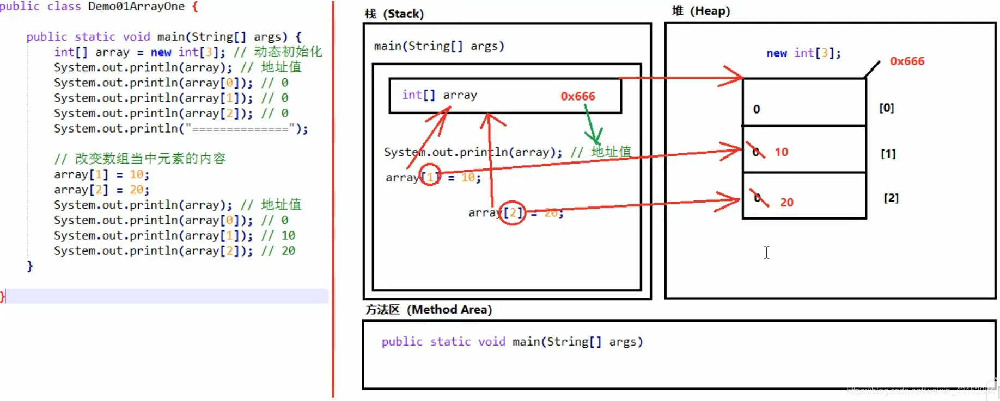

# hashCode方法

1.  hash表: 存储hash函数的结果-hash值的表(减少重复计算)
    1.  hashCode: 将对象的内部地址(物理地址/内存地址)转化为一个整数
    2.  equals和hashCode: equals方法比较值, hashCode比较地址
    3.  Integer.hashCode被覆盖, 输出的是值而非内存地址

------

# java内存机制

Java的内存需要划分成为5个部分：

1.  栈（stack）

    存放的都是方法中的局部变量。

    方法的运行一定要在栈当中。

    局部变量： 方法中的参数，或者方法{}内部的变量。

    作用域： 一旦超出作用域，立刻从栈内存当中消失。

2.  堆（heap）

    凡是new出来的东西，都在堆当中。

    堆内存里面的东西都有一个地址值：16进制

    堆内存里面的数据，都有默认值。规则：

    如果是整数 默认为0

    如果是浮点数 默认为0.0

    如果是字符 默认为’\\u0000’

    如果是布尔 默认为false

    如果是引用类型 默认为null

    在方法中创建一个对象,本质是在一个堆中开辟了一个对象的空间,再创建一个存放该对象地址的临时变量

3.  方法区（method area）

    存储.class相关信息，包含方法的信息。

4.  本地方法栈（native method stack）

    与操作系统相关。

5.  寄存器（pc register）

    与CPU相关。

    一个数组的内存图

    

    俩个数组的内存图

    

    俩个引用指向同一个数组的内存图

    

    一个对象的内存图

    

    this和super存图

    

------

# 快捷键

## 输入型快捷键

1.  `Ctrl + j` 显示所有快捷键
2.  `main` 构建main函数
3.  `for / fori` 循环
4.  `.var` 建立一个对象
5.  `itit` 快速构建while循环

## 组合型快捷键

1.  `Ctrl+alt+t`, 对选中的语句添加环绕(if, try-catch等)
2.  `Ctrl + D` 复制当前行到下一行
2.  `Ctrl+Alt+V` 自动引入局部变量，自动创建对象类型和对象名

------

# 红黑树

1.  [红黑树图解](https://www.cs.usfca.edu/~galles/visualization/RedBlack.html)
