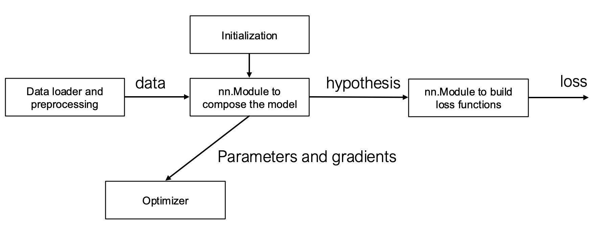
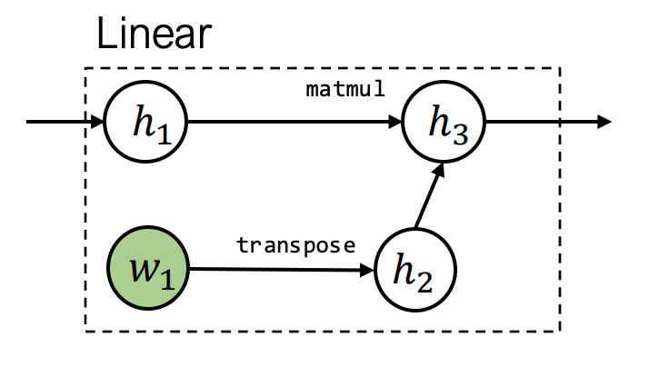
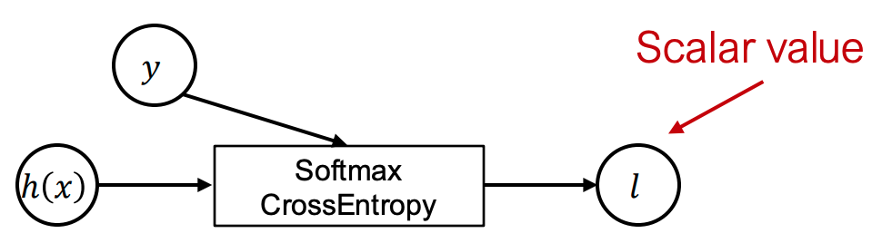
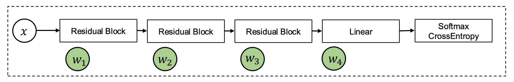
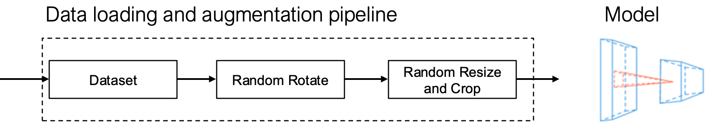
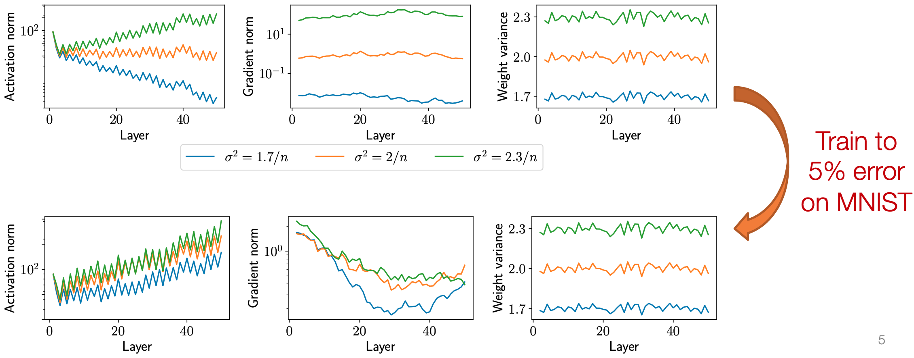
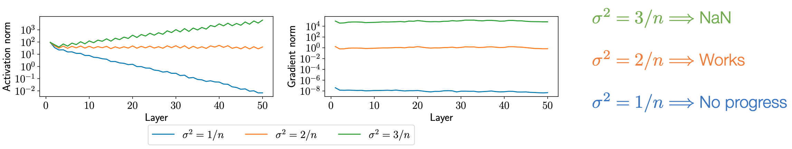
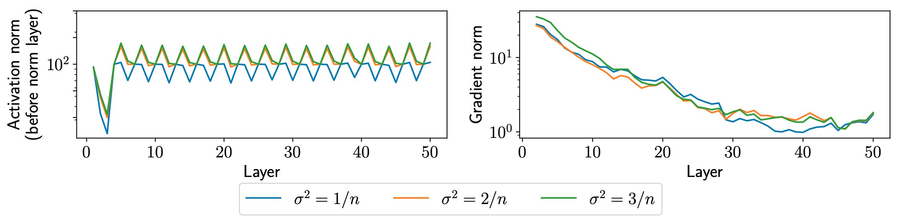
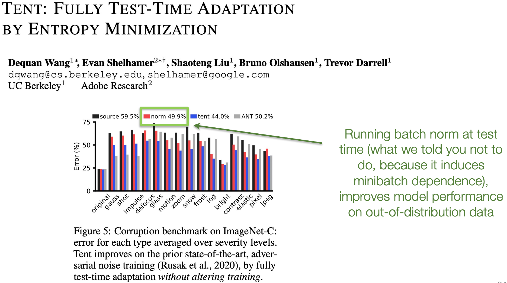

笔记内容由课程ppt+llm生成, 并进行一定修改

# Lec2 机器学习回顾/Softmax回归

## 2.1 机器学习基础
### 数据驱动编程范式
- **传统编程困境**：手工编写分类逻辑困难（如手写数字识别）
- **监督学习解决方案**：
  1. 收集带标签的训练集 ${(x^{(i)}, y^{(i)})}_{i=1}^m$
  2. 通过机器学习算法自动生成分类程序

### 机器学习三要素
1. **假设类 (Hypothesis Class)** : 参数化映射函数 $h_\theta: \mathbb{R}^n \rightarrow \mathbb{R}^k$，描述输入到输出的关系
2. **损失函数 (Loss Function)** : 量化模型预测效果：$\ell(h(x), y) \rightarrow \mathbb{R}^+$
3. **​优化方法 (Optimization Method) ​**: 最小化经验风险$\min_\theta \frac{1}{m}\sum_{i=1}^m \ell(h_\theta(x^{(i)}), y^{(i)})$ 
---
## 2.2 Softmax回归示例
### 多类分类问题设定
- **输入空间**: $x^{(i)} \in \mathbb{R}^n$（如MNIST图像 $n=784$）
- **输出空间**: $y^{(i)} \in \{1,...,k\}$ （如MNIST有 $k=10$ 类）
- **训练集规模**: $m$ 个样本（如MNIST $m=60,000$）

### 线性假设函数
$h_\theta(x) = \theta^T x$
其中
- 参数矩阵 $\theta \in \mathbb{R}^{n \times k}$, 输入参数x为n维列向量(n×1)
- 将输入的n维列向量映射为k维输出(如每个类别的概率)

**批量计算形式**：

$$
\mathbf X \in \mathbb{R}^{m \times n} = \begin{bmatrix} -x^{(1)T}- \\ \vdots \\ -x^{(m)T}- \end{bmatrix}, \quad
y\in\{1,\dots,k\}^m=\begin{bmatrix}y^{(1)}\\ \vdots \\ y^{(m)}
\end{bmatrix}
$$

- $-x^{(1)T}-$意为**强调**这个向量占一行
这样, 线性假设可以用批量计算形式写成: 

$$
h_\theta(X) = \mathbf X\theta 
  =\begin{bmatrix} -x^{(1)T}\theta- \\ \vdots \\ -x^{(m)T}\theta- \end{bmatrix}
  =\begin{bmatrix} -h_{\theta}(x^{(1)})^{T}- \\ \vdots \\ -h_{\theta}(x^{(m)})^T- \end{bmatrix}
$$

### 损失函数设计
1. **分类错误率**​（不可导，不适于优化）：
   $$\ell_{err}(h(x),y) = \begin{cases} 
   0 & \text{if } \arg\max_i h_i(x) = y \\
   1 & \text{otherwise}
   \end{cases}$$
2. **交叉熵损失**​（Softmax损失）：
	$$
	\begin{aligned}
	   z_i &= p(label=i) = \frac{\exp(h_i(x))}{\sum_{j=1}^k \exp(h_j(x))} \\
	   \ell_{ce}(h(x),y) &= -\log z_y = -h_y(x) + \log\sum_{j=1}^k \exp\left(h_j(x)\right)
	\end{aligned}
	$$
	- 注: 这里的log默认为e为底, 即ln

## 2.3 优化方法
### 梯度下降算法

对于函数$f: \mathbb R^{n\times k}\rightarrow \mathbb R$, 梯度定义为

$$
\nabla_\theta f(\theta)\in \mathbb R^{n\times k}=
\begin{bmatrix} 
\frac{\partial f(\theta)}{\partial \theta_{11}} & \dots & \frac{\partial f(\theta)}{\partial \theta_{1k}} \\ 
\vdots &  & \vdots \\
\frac{\partial f(\theta)}{\partial \theta_{n1}} & \dots & \frac{\partial f(\theta)}{\partial \theta_{nk}} 
\end{bmatrix}
$$

- 
- 在θ点处的梯度表示在局部上, 哪个方向能使函数增长最快
为了最小化函数(如损失函数), 梯度下降算法使用负梯度方向, 逐步逼近最小值
$\theta := \theta -\alpha \nabla_{\theta}f(\theta)$
- α为步长/学习率, α的大小对收敛性/收敛速度有很大影响 

参数更新规则：
$\theta := \theta - \alpha \nabla_\theta \left( \frac{1}{m}\sum_{i=1}^m \ell_{ce}(\theta^T x^{(i)}, y^{(i)}) \right)$

### 随机梯度下降 (SGD)

每次都使用所有数据来计算梯度开销过大, 可以使用采样构成一个minibatch, 将这个minibatch计算的结果作为真实梯度的**近似**

$$
\begin{array}{l}{{\mathrm{Repeat}:~~}}\\ {{\text{Samplea~a~minibatch~of~data~}X\in\mathbb{R}^{B\times n},y\in\{1,\dots,k\}^{B}}}\\ {{\text{更新参数 }\theta:=\theta-{\frac{\alpha}{B}}\sum_{i=1}^{B}\nabla_{\theta}\ell{\big(}h_{\theta}(x^{(i)}),y^{(i)}{\big)}}}\end{array}
$$

- 这个近似操作可以理解为引入一些"噪声", 这在某些情况下甚至能带来一些优势
### softmax的梯度

对向量$h \in \mathbb R^k$: 

$$
\begin{aligned}
\frac{\partial\ell_{ce}(h,y)}{\partial h_{i}}&=\frac{\partial}{\partial h_{i}}\left(-h_{y}+\log\sum_{j=1}^{k}\exp h_{j}\right)\\
&=-1\{i=y\}+\frac{\exp h_{i}}{\sum_{j=1}^{k}\exp h_{j}}
\end{aligned}
$$

- log实际上是ln
- 用向量形式表示: $\nabla_{h}\ell(h, y)=z-e_{y}, z=normalize(exp(h))$ 

回到softmax: $\nabla_{\theta}\ell_{ce}(\theta^Tx, y)$ , θ是n×k的**矩阵**, $\theta^Tx$是k维列**向量**, 如何计算矩阵/向量的导数和链式法则?
- 假装一切都是标量(无视转置), 使用链式法则, 然后重新排列 / 转置矩阵or向量, 让计算结果的维度大小正确

$\nabla_\theta\ell_{ce}(\theta^Tx,y)\in\mathbb{R}^{n\times k}=x(z-e_y)^T$
用**批量计算**形式$\nabla_\theta\ell_{ce}(\mathbf X\theta,y)\in\mathbb{R}^{n\times k}=\mathbf X^T(Z-I_y),\quad Z=\mathrm{normalize}(\exp(\mathbf X\Theta))$
重复, 直到参数/loss收敛
1. Iterative over minibatches $X\in\mathbb{R}^{B\times n},y\in\{1,...,k\}^B$ of training set
2. Update the parameters $\theta:=\theta-\frac{\alpha}{B}X^T(Z-I_y)$

# Lec3 手动构建神经网络

## 3.1 从线性到非线性假设类

### 线性分类器的局限性
- 线性假设类基本形式：
  $h_{\theta}(x)=\theta^{T} x,\quad\theta\in \mathbb{R}^{n\times k}$
  - 通过k个线性函数划分输入空间
  - 无法处理非线性分类边界（如螺旋形数据）
<figure style="display: flex; justify-content: space-around; align-items: center;">
	
	


</figure>

### 非线性特征
#### 核心思想
- 通过特征映射提升维度：
  $$
  \begin{array}{c}
  h_{\theta}(x)=\theta^{T}\phi(x) \\
  \phi:\mathbb{R}^{n}\rightarrow\mathbb{R}^{d},\ \theta\in\mathbb{R}^{d\times k}
  \end{array}
  $$
#### 特征构造方法对比
| 方法 | 描述 | 数学形式 | 局限性 |
|------|------|---------|--------|
| 线性特征 | 简单线性组合 | $\phi(x)=W^T x$ | 等价于单层线性分类器 |
| ​**非线性特征**​ | 激活函数变换 | $\phi(x)=\sigma(W^T x)$ | 可表达复杂边界 |
#### 关键非线性变换示例
- **随机傅里叶特征**：
  $W\sim\mathcal{N}(0,1)\text{(随机高斯采样)},\ \sigma=\cos(\cdot)$
- **可学习非线性特征**：（需通过反向传播训练$W$）
  $\phi(x)=\text{ReLU}(W^T x)$

---
## 3.2 神经网络

### 基本定义
- **神经网络**：由多个可微参数化函数（层）组成的假设类
- **深度网络**：多层级联的非线性变换（现代网络通常>3层）

### 神经网络结构
#### 两层神经网络
> 也称为单隐藏层网络
<div style="text-align: center;">
    
</div>

$$
\begin{aligned}
h_{\theta}(x) &= W_{2}^{T}\sigma\left(W_{1}^{T} x\right) \\
\theta &= \{W_{1}\in \mathbb{R}^{n\times d}, W_{2}\in \mathbb{R}^{d\times k}\}
\end{aligned}
$$

- 批量矩阵形式：$h_\theta(\mathbf X)=\sigma\left(\mathbf X \mathbf W_1\right) \mathbf W_2$
	- $\mathbf X\in \mathbb R^{m\times n}, W_{1}\in \mathbb{R}^{n\times d}, W_{2}\in \mathbb{R}^{d\times k}$ 
#### 多层感知机（MLP）

<div style="text-align: center;">
	
</div>
- L层通用结构：

$$
\begin{aligned}
\mathbf Z_{i+1} &= \sigma_{i}\left(\mathbf Z_{i} \mathbf W_{i}\right),\quad i=1,\ldots,L \\
\mathbf Z_{1} &= \mathbf X \\
h_{\theta}(\mathbf X) &= \mathbf Z_{L+1}
\end{aligned}
$$

  - 维度关系：$\mathbf Z_i\in\mathbb{R}^{m\times n_i},\ \mathbf W_i\in\mathbb{R}^{n_i\times n_{i+1}}$
	  - Z被称为layer, activation, neuron, 是网络在不同阶段生成的中间特征
  - 典型激活函数：ReLU, Sigmoid, Tanh

### 深度网络优势分析
| 观点    | 支持/反对 | 说明            |
| ----- | ----- | ------------- |
| 生物相似性 | ❌     | 实际与大脑工作机制差异显著 |
| 电路效率  | ⚠️    | 理论优势难以实际验证    |
| 经验有效性 | ✅     | 固定参数量下表现更优    |

---
## 3.3 反向传播

### 梯度计算框架
- 优化目标：  $\min_{\theta} \frac{1}{m}\sum_{i=1}^{m}\ell_{ce}\left(h_{\theta}(x^{(i)}), y^{(i)}\right)$
  - 核心需求：计算$\nabla_\theta\ell_{ce}(h_{\theta}(x^{(i)}), y^{(i)})$ 

### 两层网络梯度推导
> 批量矩阵形式：$h_\theta(\mathbf X)=\sigma\left(\mathbf X \mathbf W_1\right) \mathbf W_2$
	- $\mathbf X\in \mathbb R^{m\times n}, W_{1}\in \mathbb{R}^{n\times d}, W_{2}\in \mathbb{R}^{d\times k}$ 

对于简单的两层网络, 梯度用批量矩阵形式写为: $\nabla_{W_{1}, W_{2}}\ell_{ce}(h_{\theta}(XW_1)W_{2}, y^{(i)})$ 

$$
\begin{aligned}
  \frac{\partial\ell_{ce}(\sigma(XW_1)W_2,y)}{\partial W_2} & =\frac{\partial\ell_{ce}(\sigma(XW_1)W_2,y)}{\partial\sigma(XW_1)W_2}\cdot\frac{\partial\sigma(XW_1)W_2}{\partial W_2} \\
 &  =(S-I_y)\cdot\sigma(XW_1),\quad[S=\mathrm{~softmax}(\sigma(XW_1)W_2)] \\ \\
 \frac{\partial\ell_{ce}(\sigma(XW_1)W_2,y)}{\partial W_1} &
 =\frac{\partial\ell_{ce}(\sigma(XW_1)W_2,y)}{\partial\sigma(XW_1)W_2} \cdot \frac{\partial\sigma(XW_1)W_2}{\partial \sigma(XW_{1})} \cdot \frac{\partial \sigma(XW_{1})}{\partial XW_{1}} \cdot \frac{{\partial XW_{1}}}{\partial W_{1}}\\
 & = 
 \underbrace{(S-I_{y})}_{m \times k}\cdot \underbrace{W_{2}}_{d\times k}\cdot \underbrace{\sigma'(XW_{1})}_{m\times d} \cdot \underbrace{X}_{m\times n}
\end{aligned}
$$


对$W_2$的梯度

$$
\nabla_{W_2}\ell = \sigma(XW_1)^T(S-I_y)
$$

- $S=\text{softmax}(\sigma(XW_1)W_2)$
- $I_y$为one-hot标签矩阵

对$W_1$的梯度

$$
\nabla_{W_1}\ell = \underbrace{X^T}_{n\times m}\left[ \underbrace{(S-I_y)W_2^T}_{m\times d} \circ \underbrace{\sigma'(XW_1)}_{m\times d} \right] \in \mathbb{R}^{n\times d}
$$

- $\circ$表示逐元素乘法(标量乘法)
- $\sigma'$为激活函数导数

### 通用反向传播算法

> 尽管用了简化, 但是计算梯度还是有些麻烦

#### 推导过程

前向传播递推式: $Z_{i+1} = \sigma_i(Z_iW_i) \in \mathbb R^{m\times n_{i+1}}\quad (i=1,...,L)$
- 注意: 前面个的两层网络的最后一层没有激活函数, 和此处不相同

前向传播最终输出$Z_{L+1}$损失函数对于$W_{i}$的梯度, 由链式法则可得: 


- $G_{i}$为损失对中间输出$Z_{i}$的导数
可得

$$
\begin{aligned}
G_i
  &=G_{i+1}\cdot\frac{\partial Z_{i+1}}{\partial Z_i}=G_{i+1}\cdot\frac{\partial\sigma_i(Z_iW_i)}{\partial Z_iW_i}\cdot\frac{\partial Z_iW_i}{\partial Z_i}\\
  &= \underbrace{G_{i+1}}_{m\times n_{i+1}}\cdot\underbrace{\sigma^{\prime}(Z_iW_i)}_{m\times n_{i+1}}\cdot \underbrace{W_i}_{n_{i}\times n_{i+1}}\\
G_{i}&=\frac{{\partial \ell(Z_{L+1}, y)}}{\partial Z_{i}}= \nabla_{Z_{i}}\ell(Z_{L+1}, y)\in \mathbb R^{m\times n_{i}}\\
\text{整理得:}\\
  G_i &= (G_{i+1} \circ \sigma_i'(Z_iW_i)) W_i^T \\
\end{aligned}
$$

回到参数$W_{i}$的梯度更新: 

$$
\begin{aligned}
\frac{\partial\ell(Z_{L+1},y)}{\partial W_i}&=G_{i+1}\cdot \frac{\partial Z_{i+1}}{\partial W_{i}}=G_{i+1}\cdot\frac{\partial\sigma_i(Z_iW_i)}{\partial Z_iW_i}\cdot\frac{\partial Z_iW_i}{\partial W_i}\\
&=\underbrace{G_{i+1}}_{m\times n_{i+1}}\cdot\underbrace{\sigma^{\prime}(Z_iW_i)}_{m\times n_{i+1}}\cdot \underbrace {Z_i}_{m\times n_{i}}\\
\Longrightarrow &\nabla_{W_i}\ell(Z_{L+1},y)=Z_i^T\left(G_{i+1}\circ\sigma^{\prime}(Z_iW_i)\right) \in \mathbb R^{n_i\times n_{i+1}}
\end{aligned}
$$

#### 前向传播

$$
\begin{aligned}
Z_1 &= X \in \mathbb R^{m\times n} \\
Z_{i+1} &= \sigma_i(Z_iW_i) \in \mathbb R^{m\times n_{i+1}}\quad (i=1,...,L)
\end{aligned}
$$

#### 反向传播
1. 初始化梯度：   $G_{L+1} = \nabla_{Z_{L+1}}\ell = S-I_y$
2. 反向迭代：$G_i = (G_{i+1} \circ \sigma_i'(Z_iW_i)) W_i^T$
3. 参数梯度计算： $\nabla_{W_i}\ell = Z_i^T(G_{i+1} \circ \sigma_i'(Z_iW_i))$ 

### 计算图视角

- **向量-雅可比积**vector Jacobian product：核心计算单元
  $\frac{\partial Z_{i+1}}{\partial W_i} = \sigma_i'(Z_iW_i) \cdot Z_i$
- 内存优化：缓存前向传播结果$Z_i, W_i$


## 关键公式总结
| 公式类型 | 表达式 |
|---------|--------|
| 前向传播 | $Z_{i+1} = \sigma_i(Z_iW_i)$ |
| 损失梯度 | $G_{L+1} = S - I_y$ |
| 反向梯度 | $G_i = (G_{i+1} \circ \sigma_i') W_i^T$ |
| 权重梯度 | $\nabla_{W_i} = Z_i^T(G_{i+1} \circ \sigma_i')$ |


# Lec4 自动微分

本讲内容分为两个主要部分：
1. 不同微分方法的总体介绍
2. 反向模式自动微分

## 4.0 微分在机器学习中的应用

每个机器学习算法都由三个不同的元素组成：
1. **假设类**：$h_\theta(x)$
2. **损失函数**：$l(h_\theta(x), y) = -h_y(x) + \log \sum_{j=1}^{k} \exp h_j(x)$
3. **优化方法**：$\theta := \theta - \frac{\alpha}{B} \sum_{i=1}^{B} \nabla_\theta \ell(h_\theta(x_i), y_i)$

计算损失函数对假设类参数的梯度是机器学习中最常见的操作。

## 4.1 手动微分
### 数值微分

**基于定义的直接计算**: 
$\frac{\partial f(\theta)}{\partial \theta_i} = \lim_{\epsilon \to 0} \frac{f(\theta + \epsilon e_i) - f(\theta)}{\epsilon}$
**更准确的数值近似方法**: 

$\frac{\partial f(\theta)}{\partial \theta_i} = \frac{f(\theta + \epsilon e_i) - f(\theta - \epsilon e_i)}{2\epsilon} + o(\epsilon^2)$

- 数值微分存在数值误差，计算效率较低(要计算两次f())。
- 但它是检验自动微分算法实现的有力工具，特别是在单元测试中。
**数值梯度检查**: 
从单位球中选取 $\delta$，检验以下不变性：

$\delta^T \nabla_\theta f(\theta) = \frac{f(\theta + \epsilon\delta) - f(\theta - \epsilon\delta)}{2\epsilon} + o(\epsilon^2)$

### 符号微分

通过写下公式，利用 和规则、积规则和链式法则推导梯度。
- 和规则：$\frac{\partial(f(\theta) + g(\theta))}{\partial \theta} = \frac{\partial f(\theta)}{\partial \theta} + \frac{\partial g(\theta)}{\partial \theta}$
- 积规则：$\frac{\partial(f(\theta)g(\theta))}{\partial \theta} = g(\theta)\frac{\partial f(\theta)}{\partial \theta} + f(\theta)\frac{\partial g(\theta)}{\partial \theta}$
- 链式法则：$\frac{\partial f(g(\theta))}{\partial \theta} = \frac{\partial f(g(\theta))}{\partial g(\theta)}\frac{\partial g(\theta)}{\partial \theta}$
但简单地这样做可能导致计算浪费。对于函数 $f(\theta) = \prod_{i=1}^{n} \theta_i$，计算所有偏导数需要 $n(n-2)$ 次乘法操作，效率较低。

## 4.2 自动微分
### 计算图
> 
> 以函数 $y = f(x_1, x_2) = \ln(x_1) + x_1 x_2 - \sin(x_2)$ 为例：

**前向计算轨迹**
- $v_1 = x_1 = 2$
- $v_2 = x_2 = 5$
- $v_3 = \ln(v_1) = \ln(2) = 0.693$
- $v_4 = v_1 \times v_2 = 10$
- $v_5 = \sin(v_2) = \sin(5) = -0.959$
- $v_6 = v_3 + v_4 = 10.693$
- $v_7 = v_6 - v_5 = 10.693 + 0.959 = 11.652$
- $y = v_7 = 11.652$

### 前向模式自动微分 (Forward AD)

定义 $\dot{v}_i = \frac{\partial v_i}{\partial x_1}$，然后按照计算图的前向拓扑顺序迭代计算 $\dot{v}_i$：

前向 AD 轨迹: 
- $\dot{v}_1 =\frac{\partial v_1}{\partial x_1}=\frac{\partial x_1}{\partial x_1}= 1 \quad (v_{1}=x_{1})$ 
- $\dot{v}_2 = 0$ 
- $\dot{v}_3 =\frac{\partial v_{3}}{\partial x_{1}}=\frac{\partial \ln(v_{1})}{\partial x_{1}}=\frac{1}{v_{1}}\frac{\partial v_1}{\partial x_1}= \frac{\dot{v}_1}{v_1} = 0.5$ 
- $\dot{v}_4 = \dot{v}_1 v_2 + \dot{v}_2 v_1 = 1 \times 5 + 0 \times 2 = 5$
- $\dot{v}_5 = \dot{v}_2 \cos(v_2) = 0 \times \cos(5) = 0$
- $\dot{v}_6 = \dot{v}_3 + \dot{v}_4 = 0.5 + 5 = 5.5$
- $\dot{v}_7 = \dot{v}_6 - \dot{v}_5 = 5.5 - 0 = 5.5$
最终得到 $\frac{\partial y}{\partial x_1} = \dot{v}_7 = 5.5$
- 本质上就是计算链式法则过程的中间结果
#### 前向模式 AD 的局限性

对于函数 $f: \mathbb{R}^n \to \mathbb{R}^k$，我们需要 $n$ 次前向 AD 传递来获取相对于每个输入的梯度。在机器学习中，我们通常关注 $k = 1$ 但 $n$ 很大的情况，这使得前向模式 AD 效率低下。

### 反向模式自动微分 (Reverse AD)

定义伴随值adjoint $\bar{v}_i = \frac{\partial y}{\partial v_i}$，然后按照计算图的反向拓扑顺序迭代计算 $\bar{v}_i$：
- 伴随值就可以用来更新参数权重$\omega \leftarrow \omega - \eta \cdot \overline{\omega}$

**反向 AD 评估轨迹**
- $\bar{v}_7 = \frac{\partial y}{\partial v_7} = 1$
- $\bar{v}_6 = \frac{\partial y}{\partial v_7} \cdot \frac{\partial v_7}{\partial v_6}= \bar{v}_7  \frac{\partial v_6-v_{5}}{\partial v_6} = \bar{v}_7 \times 1 = 1$
- $\bar{v}_5 = \bar{v}_7 \frac{\partial v_7}{\partial v_5} = \bar{v}_7 \times -1 = -1$ 
- $\bar{v}_4 = \bar{v}_6 \frac{\partial v_6}{\partial v_4} = \bar{v}_6 \times 1 = 1$
- $\bar{v}_3 = \bar{v}_6 \frac{\partial v_6}{\partial v_3} = \bar{v}_6 \times 1 = 1$
- $\bar{v}_2 = \bar{v}_5 \frac{\partial v_5}{\partial v_2} + \bar{v}_4 \frac{\partial v_4}{\partial v_2} = \bar{v}_5 \times \cos(v_2) + \bar{v}_4 \times v_1 = -0.284 + 2 = 1.716$
- $\bar{v}_1 = \bar{v}_4 \frac{\partial v_4}{\partial v_1} + \bar{v}_3 \frac{\partial v_3}{\partial v_1} = \bar{v}_4 \times v_2 + \bar{v}_3 \frac{1}{v_1} = 5 + \frac{1}{2} = 5.5$

#### **多路径情况的推导**

当节点在多个路径中使用时（如 $v_1$ 在 $v_2$ 和 $v_3$ 路径中使用）：

$\bar{v}_1 = \frac{\partial y}{\partial v_1} = \frac{\partial f(v_2, v_3)}{\partial v_2}\frac{\partial v_2}{\partial v_1} + \frac{\partial f(v_2, v_3)}{\partial v_3}\frac{\partial v_3}{\partial v_1} = \bar{v}_2\frac{\partial v_2}{\partial v_1} + \bar{v}_3\frac{\partial v_3}{\partial v_1}$

定义"部分伴随值" $\overline{v_{i \to j}} = \bar{v}_j \frac{\partial v_j}{\partial v_i}$ 用于每对输入-输出节点，则：

$\bar{v}_i = \sum_{j \in next(i)} \overline{{v}_{i \to j}}$
- $\bar{v}_{1}=\overline{v_{1\rightarrow 2}}+\overline{v_{1\rightarrow 3}}$
so, 我们可以分别计算下游节点->上游节点的多有部分伴随值，然后将它们**相加**, 然后得到上游变量的伴随值。

#### 反向 AD 算法


#### 通过扩展计算图实现反向模式 AD

反向模式 AD 可以通过构建一个计算图来计算伴随值实现。这个过程中，我们扩展原始计算图(算法中的`append Vktoj to node_to_grad[k]`)，添加用于计算伴随值的节点。

#### 反向模式 AD 与反向传播的比较


**反向传播**：
- 在相同的前向图上运行反向操作
- 用于第一代深度学习框架（如 caffe, cuda-convnet）

**扩展计算图的反向模式 AD**：
- 为**伴随值**构造单独的图节点, 可以对反向传播过程进行专门的优化
- 用于现代深度学习框架

#### 张量上的反向模式 AD

对于张量值，定义**伴随张量** $\bar{Z}=\begin{bmatrix}\frac{\partial y}{\partial Z_{1,1}}&...&\frac{\partial y}{\partial Z_{1,n}}\\...&...&...\\\frac{\partial y}{\partial Z_{m,1}}&...&\frac{\partial y}{\partial Z_{m,n}}\end{bmatrix}$

例如，对于矩阵乘法 $Z = XW$，$v = f(Z)$：

**标量形式的反向评估**：
$\overline{X_{i,k}} = \sum_j \frac{\partial Z_{i,j}}{\partial X_{i,k}} \bar{Z}_{i,j} = \sum_j W_{k,j} \bar{Z}_{i,j}$

**矩阵形式**：
$\bar{X} = \bar{Z}W^T$

#### 梯度的梯度

反向模式 AD 的结果仍然是计算图。我们可以通过组合更多操作来进一步扩展该图，并在梯度上再次运行反向模式 AD。

#### 数据结构上的反向模式 AD

对于数据结构，我们也可以定义相应的伴随数据结构。

例如，对于字典定义$\hat{d}=\left\{ \text{"cat"}: \frac{\partial{y}}{\partial a_{0}}, \text{"dog"}: \frac{\partial{y}}{\partial a_{1}}  \right\}$：


**关键思想**：定义与前向值相同数据类型的"伴随值"和伴随传播规则，然后应用相同的算法。

# Lec6 全连接网络、优化与初始化
## 6.1 全连接网络（Fully Connected Networks）

### 多层感知机（MLP）的数学定义
**L 层**全连接网络（又称 MLP）的迭代公式：
  $z_{i+1} = \sigma_i(W_i^T z_i + b_i),\quad i = 1,\dots,L$
 $h_\theta(x) \equiv z_{L+1},\quad z_1 \equiv x$

  - 参数集：$\theta = \{W_{1:L}, b_{1:L}\}$
  - $\sigma_i(x)$：非线性激活函数，通常最后一层 $\sigma_L(x)=x$。

### 矩阵形式与广播（Broadcasting）

考虑到 batch 大小 $m$ 时的矩阵形式：
$Z_{i+1} = \sigma_i(Z_i W_i + \mathbf{1}b_i^T)$

- 其中 $Z_i \in \mathbb{R}^{m\times n}$，$\mathbf{1}b_i^T \in \mathbb{R}^{m\times n}$。
- 实践中不真正构造 $\mathbf{1}b_i^T$，而是利用「广播」机制：
  - 将 $n\times 1$ 向量$b_i$按列复制 $p$ 次，**不额外复制数据**。
  - 这样, 这个式子可以简写为$Z_{i+1} = \sigma_i(Z_i W_i + b_i^T)$  (在矩阵加法时自动应用广播)

### 训练前必须回答的关键问题

1. 如何选网络的宽度和深度？
2. 如何优化目标函数？（SGD 是答案之一，但实践中常用改进版本）
3. 如何初始化权重？
4. 如何确保网络在多次迭代后仍易于训练？

这些问题会相互影响, 且没有特定的回答

但对于dl,  他们最终服务于场景, 之后会介绍一些基本原则

## 6.2 优化算法（Optimization）

### 梯度下降（Gradient Descent）
通用更新规则：

$\theta_{t+1} := \theta_t - \alpha \nabla_\theta f(\theta_t)$

- $\alpha>0$：步长（学习率）, t: 迭代次数
- 局部最快下降方向，但大尺度可能出现震荡。

### 牛顿法（Newton’s Method）
利用 Hessian 矩阵 $H_t=\nabla_\theta^2 f(\theta_t) = \begin{bmatrix} \dfrac{\partial^2 f}{\partial \theta_1^2} & \dfrac{\partial^2 f}{\partial \theta_1 \partial \theta_2} & \cdots & \dfrac{\partial^2 f}{\partial \theta_1 \partial \theta_n} \\[1em] \dfrac{\partial^2 f}{\partial \theta_2 \partial \theta_1} & \dfrac{\partial^2 f}{\partial \theta_2^2} & \cdots & \dfrac{\partial^2 f}{\partial \theta_2 \partial \theta_n} \\[1em] \vdots & \vdots & \ddots & \vdots \\[1em] \dfrac{\partial^2 f}{\partial \theta_n \partial \theta_1} & \dfrac{\partial^2 f}{\partial \theta_n \partial \theta_2} & \cdots & \dfrac{\partial^2 f}{\partial \theta_n^2} \end{bmatrix}$：

$$
\theta_{t+1} = \theta_t - \alpha H_t^{-1}\nabla_\theta f(\theta_t) 
$$

**特点**：

- 对二次函数一次迭代即可收敛（$\alpha=1$）。
- 深度学习中**不实用**：① 求逆 Hessian 代价高；② 非凸时不一定好。

### 动量法（Momentum）
在梯度基础上引入动量：

$$
\begin{aligned}
u_{t+1} &= \beta u_t + (1-\beta)\nabla_\theta f(\theta_t) \\ \theta_{t+1} &= \theta_t - \alpha u_{t+1}
\end{aligned}
$$

- $\beta$：动量系数, 通常$0\leq \beta <1$，平滑更新方向，减少震荡。

$$
\begin{aligned}
u_{t+1} &= \beta u_t + (1-\beta)\nabla_\theta f(\theta_t) \\&= \beta u_{t} +\beta(1-\beta)\nabla_\theta f(\theta_{t-1}) + \beta^2(1-\beta)\nabla_\theta f(\theta_{t-2})+\dots
\end{aligned}
$$

- **无偏修正**（unbiased）：$\theta_{t+1} = \theta_t - \alpha \frac{u_{t+1}}{1-\beta^{t+1}}$
  
  - 在训练的初期, 历史梯度不够大, 导致动量不够有效, 加上修正能够提高收敛速度
  - (左: 修正前, 右: 修正后), 随着t增加, 分母趋近于1, 去除偏差
  
  


### Nesterov 动量

「未来点」计算梯度：

$$
\begin{aligned}
u_{t+1} &= \beta u_t + (1-\beta)\nabla_\theta f(\theta_t - \alpha u_t)\\ \theta_{t+1} &= \theta_t - \alpha u_{t+1} 
\end{aligned} 
$$

### Adam 优化器

结合动量 + 自适应学习率：

$$
\begin{aligned}
u_{t+1} &= \beta_1 u_t + (1-\beta_1)\nabla_\theta f(\theta_t)\\
v_{t+1} &= \beta_2 v_t + (1-\beta_2)(\nabla_\theta f(\theta_t))^{2(逐元素平方)} \\
\theta_{t+1} &= \theta_t - \alpha \frac{\hat u_{t+1}}{\sqrt{\hat v_{t+1}}+\varepsilon}
\end{aligned}
$$

- $\hat u, \hat v$：偏差修正后的动量
- 实践中 Adam 几乎成为默认选择，但仍存在争议

### 随机梯度下降（SGD）
**核心思想**：用 mini-batch 估计梯度：

$\theta_{t+1} = \theta_t - \alpha \frac{1}{|B|}\sum_{i\in B}\nabla_\theta \ell(h_\theta(x_i),y_i)$

- 优点：计算快，噪声大但收敛好
- **重要提醒**：
  - 所有前述算法（Momentum、Adam、Newton 等）在实际中都使用**随机版本**
  - 简单凸二次实验带来的直觉有限，必须在真实网络上大量实验


## 6.3 权重初始化（Initialization）

### 为什么不能初始化为 0？

$$
\begin{aligned}
&Z_{i+1}=\sigma_i(Z_iW_i)\\
&G_i=\left(G_{i+1}\circ\sigma_i^{\prime}\left(Z_iW_i\right)\right)W_i^T\end{aligned}
$$

若 $W_i=0$，则：
- 前向：$Z_{i+1}=0$；
- 反向：$G_i=0$，导致 $\nabla_{W_i}\ell=0$。

- 结果：所有层陷入鞍点，无法学习。

### 随机初始化的影响
随机初始化, 以 $W_i \sim \mathcal{N}(0,\sigma^2 I)$ 为例：
- **方差 $\sigma^2$ 决定**：
  1. 前向激活的范数 $\|Z_i\|$；
  2. 反向梯度的范数 $\|\nabla_{W_i}\ell\|$。

$$
L_{2}范数: ||X||_{2}=\sqrt{ x_{1}^2+x_{2}^2\dots x_{n}^2 }
$$

- **实验现象**（50 层 ReLU，隐藏层 100 单元）：
  - $\sigma^2=\frac{1}{n}$：梯度指数级消失；
  - $\sigma^2=\frac{2}{n}$：近乎常数；
  - $\sigma^2=\frac{3}{n}$：梯度爆炸。
  - 

### 权重移动并不大
- 经验观察：训练后权重距离初始点很近，不同初始化收敛到不同区域。
- **结论**：初始化对最终性能影响巨大。

### 方差推导与 Kaiming 初始化
假设 $x\sim\mathcal{N}(0,1)$，$w\sim\mathcal{N}(0,\frac{1}{n})$，则：
- $\begin{aligned}\mathbf{E}[x_iw_i]=\mathbf{E}[x_i]\mathbf{E}[w_i]=0,\quad&\mathrm{Var}[x_iw_i]=\mathbf{Var}[x_i]\mathbf{Var}[w_i]=1/n\end{aligned}$
- $\mathbf{E}[w^T x]=0,\quad \mathbf{Var}(w^T x)=1$。
- 如果使用了线性激活层, $z_i \sim\mathcal{N}(0,1), W_i\sim\mathcal{N}(0,\frac{1}{n}I)$, 则$z_{i+1}=W_i^Tz_i\sim N(0,I)$

对 ReLU（约一半神经元置 0），需将方差放大 2 倍：
- **Kaiming 正态初始化**：$W_i\sim\mathcal{N}(0,\frac{2}{n}I)$。
### Kaiming 初始化的推导

在深度学习中，He 初始化（Kaiming 初始化）是一种针对 **ReLU 激活函数** 的权重初始化方法。它的核心目标是保持每一层的输出方差一致，从而避免梯度消失或爆炸问题。以下是推导过程的详细解释：

---

#### **1. 基本设定**
假设我们有一个全连接层（或卷积层），其输入为 $x^{(l-1)}$，权重矩阵为 $W \in \mathbb{R}^{n_{\text{out}} \times n_{\text{in}}}$，输出为：

$$
y^{(l)} = x^{(l-1)} W^T
$$

然后通过 ReLU 激活函数：

$$
x^{(l)} = \max(y^{(l)}, 0)
$$

我们的目标是初始化权重 $W$，使得每一层的输出方差 $\text{Var}[y^{(l)}]$ 与前一层的输入方差 $\text{Var}[y^{(l-1)}]$ 保持一致。

#### **2. 方差推导**
假设权重 $W_{i,j}$ 独立同分布，且输入 $x_j$ 的均值为 0，方差为 $\text{Var}[x_j] = \frac{1}{2} \text{Var}[y^{(l-1)}]$（这是 ReLU 的特性）。  
对于输出$y_i$：

$$
y_i = \sum_{j=1}^{n_{\text{in}}} x_j W_{i,j}
$$

由于$x_j$和$W_{i,j}$独立，方差为：

$$
\text{Var}[y_i] = \sum_{j=1}^{n_{\text{in}}} \text{Var}[x_j] \cdot \text{Var}[W_{i,j}] = n_{\text{in}} \cdot \text{Var}[x_j] \cdot \sigma^2
$$

其中$\sigma^2 = \text{Var}[W_{i,j}]$是权重的方差。

#### **3. ReLU 对输入分布的影响**
由于$x^{(l-1)}$是 ReLU 的输出，即$x^{(l-1)} = \max(y^{(l-2)}, 0)$ ，因此$x_j$的分布是对称的（一半为 0，另一半为正数）。  
此时，$x_j$的平方期望为：

$$
\mathbb{E}[x_j^2] = \mathbb{E}[\text{ReLU}(y^{(l-1)})^2] = \frac{1}{2} \text{Var}[y^{(l-1)}]
$$

（因为 ReLU 将负值设为 0，正值保留，导致平方期望变为原方差的一半。）

#### **4. 保持方差一致的条件**
为了使输出方差$\text{Var}[y^{(l)}]$与输入方差$\text{Var}[y^{(l-1)}]$一致，代入上式：

$$
\text{Var}[y^{(l)}] = n_{\text{in}} \cdot \left( \frac{1}{2} \text{Var}[y^{(l-1)}] \right) \cdot \sigma^2
$$

要求：

$$
\text{Var}[y^{(l)}] = \text{Var}[y^{(l-1)}]
$$

解得：

$$
n_{\text{in}} \cdot \frac{1}{2} \sigma^2 = 1 \quad \Rightarrow \quad \sigma^2 = \frac{2}{n_{\text{in}}}
$$

因此，权重$W$应初始化为均值为 0、方差为$\sigma^2 = \frac{2}{n_{\text{in}}}$的分布。


## 6.4 小结与后续
- 本节课覆盖：
  - MLP 的数学与广播实现；
  - 从 GD → Newton → Momentum → Nesterov → Adam 的优化演进；
  - 随机梯度下降的核心地位；
  - 初始化如何影响信号传播与最终解。
- 下节课将深入更多实践技巧与实验分析。


# Lec7 神经网络库抽象

## 7.1 编程抽象（Programming Abstractions）
框架的编程抽象定义了实现、扩展和执行模型计算的通用方式。理解设计背后的思考过程有助于：
- 理解抽象设计的原因
- 学习设计新抽象的经验

### 案例研究（Case Studies）
因时间有限未深入研究的框架：Theano, Torch7, MXNet, Caffe2, Chainer, JAX...

### 三种核心抽象模式
#### 1. 前向与反向层接口（Forward and backward layer interface）
> *代表框架：Caffe 1.0*
```python
class Layer:
    def forward(bottom, top):  # 前向计算
        pass
    def backward(top, propagate_down, bottom):  # 反向传播梯度
        pass
````

- **​特点​**​：显式定义前向计算和梯度计算操作
- **​早期先驱​**​：cuda-convnet（AlexNet框架）

#### 2. 计算图与声明式编程（Computational graph and declarative programming）

> *代表框架：TensorFlow 1.0*
```python
import tensorflow as tf

v1 = tf.Variable()
v2 = tf.exp(v1)
v3 = v2 + 1
v4 = v2 * v3

sess = tf.Session()
value4 = sess.run(v4, feed_dict={v1: numpy.array([1])})
```

- **​特点​**​：先声明计算图 → 通过输入数据(`sess.run`)执行图
- **​早期先驱​**​：Theano
计算图定义和计算操作分离, 可以有更多的优化机会
- 假如计算的不是v4, 而是v3, `v4 = v2 * v3`j计算可以直接skip
#### 3. 命令式自动微分（Imperative automatic differentiation）

> *代表框架：PyTorch (Needle)*
```python
import needle as ndl

v1 = ndl.Tensor([1])
v2 = ndl.exp(v1)
v3 = v2 + 1
v4 = v2 * v3

if v4.numpy() > 0.5: 
    v5 = v4 * 2 
else: 
    v5 = v4
v5.backward()  # 即时反向传播
```

- **​特点​**​：**动态构建**计算图 + 支持Python控制流
- **​早期先驱​**​：Chainer

### 讨论（Discussions）

**​不同编程抽象的优缺点分析​**​：

| 抽象类型              | 优点            | 缺点              |
| ----------------- | ------------- | --------------- |
| 前向/反向接口 (Caffe)   | 接口简单，控制明确     | 模块间耦合度高，扩展性受限   |
| 计算图 (TensorFlow)  | 支持跨设备优化，部署效率高 | 调试困难，控制流实现复杂    |
| 命令式自动微分 (PyTorch) | 开发调试便捷，支持动态图  | 运行时计算, 导致优化机会较少 |

## 7.2 高级模块化库组件（High Level Modular Library Components）

### 机器学习核心元素（Elements of Machine Learning）

1. **假设类（Hypothesis Class）**：$h_θ(x)$
2. **​损失函数（Loss Function）​**​：  $l(h_θ(x),y)=−h_y(x)+log∑_{j=1}^k exp(h_j(x))$
3. **优化方法（Optimization Method）**：  $θ:=θ−\fracαB∑_{i=1}^B ∇_θ \ell(h_θ(x(i)),y(i))$ 

**​关键问题​**​：如何将上述元素转化为代码中的模块化组件？

### 深度学习的模块化本质

深度学习模型本质是模块的组合（如多层残差网络）：


_残差连接结构示意图（摘自ResNet论文）_

- 上图的每一个方框都可以视为一个模块

### 模块化组件设计



#### 1. `nn.Module`：组合模块




- **​核心功能​**​：tensor in → tensor out
- **​关键要素​**​：
    - 给定输入计算输出
    - 获取（可训练）参数列表
    - 参数初始化方法
- **​代码示例​**​：
  
```python
class Linear(Module):
	def __init__(self, in_features, out_features):
		self.weight = Parameter(...)  # 可训练参数
		self.bias = Parameter(...)
	def forward(self, X):
		return X @ self.weight + self.bias
```

#### 2. 损失函数：特殊模块



- **​特性​**​：张量输入 → 标量输出  
    - 例如交叉熵损失：  $l(h_\theta(x),y)=−h_y(x)+log∑_{j=1}^k exp(h_j(x))$
    
- **​扩展问题​**​：
    - 如何组合多目标函数？
    - 训练完成后推理阶段的行为？

#### 3. 优化器（Optimizer）



- **​功能​**​：根据模型权重执行优化步骤
- **​状态管理​**​：跟踪辅助状态（如动量）
- **​常见优化器​**​：
    - **​SGD​**​：$w_i←w_i−αg_i$
    - **​SGD with momentum​**​：  $\begin{aligned}u_i​&←βu_i​+(1−β)g_i\\​w_i​&←w_i​−αu_i​​\end{aligned}$
    - **​Adam​**​：$\begin{aligned}u_i&←β_1u_i+(1−β_1)g_i\\v_i&←β_2v_i+(1−β_2)g_i^2\\w_i&←w_i−αu_i/(v_i^{1/2}+ϵ)\end{aligned}$

#### 4. 正则化与优化器

- **​实现方式​**​：
    - 作为损失函数的一部分（如L2正则项）
    - 直接整合到优化器更新中
    - _例：带权重衰减的SGD_  $w_i←(1−αλ)w_i−αg_i$

#### 5. 参数初始化（Initialization）

- **​策略依赖​**​：模块类型和参数种类
- **​常见方法​**​：
    - 权重（weights）：均匀分布（幅度取决于输入/输出维度）
    - 偏置（bias）：零初始化
    - 方差累加项：初始化为1
- **​执行时机​**​：在`nn.Module`构建阶段完成

#### 6. 数据加载与预处理（Data Loader and Preprocessing）

- **流程**：
  - 经常通过混洗(shuffle)和变化进行输入的预处理
  
- **​重要性​**​：数据增强对深度学习模型预测精度提升有显著贡献
- **​特性​**​：数据管道本身具有组合性

### 讨论（Discussions）

**​其他可能的模块化组件示例​**​：

- 学习率调度器（Learning Rate Scheduler）
- 梯度裁剪模块（Gradient Clipping）
- 自定义激活函数（如Swish, GELU）
- 分布式训练通信原语

---

### Revisit Programming Abstraction

**分层抽象设计**

以PyTorch（Needle）为例：

1. **​底层​**​：张量计算图抽象（处理自动微分） 
2. **​高层​**​：模块化组合抽象（如`nn.Module`）

**对比早期框架（Caffe 1.0）**

```python
class Layer:
    def forward(bottom, top): ... 
    def backward(top, propagate_down, bottom): ...
```

- **​局限​**​：将梯度计算与模块组合紧密耦合


# Lec9 深度学习系统：归一化与正则化

## 9.1 引言

本讲主要讨论深度学习中的两个关键技术：**归一化（Normalization）** 和 **正则化（Regularization）**，以及它们与优化、初始化之间的相互作用。

- **归一化**：用于稳定和加速训练过程，通过调整层间激活值的分布。
- **正则化**：用于防止过拟合，提升模型在测试集上的泛化能力。
- 三者（优化、初始化、归一化、正则化）之间存在复杂而深刻的交互关系。

---

## 9.2 初始化与优化的交互

**问题提出**：
假设我们初始化权重为 $W_i \sim \mathcal{N}(0, \frac{c}{n})$，其中对于 ReLU 网络通常选择 $c = 2$。那么是否在几次优化迭代后，权重的尺度就会“自动修正”？

**答案：不会！**

- 如果初始化不当，深层网络即使使用标准 SGD 也无法成功训练。
- 更根本的问题是：**即使训练成功，初始化时的尺度效应在整个训练过程中仍然持续存在**
  
	- 图中, 训练后不同方差的激活值和梯度趋近, 但是权重的分布与训练前变化相差不大

**实验观察**：

**图1：不同初始化方差对激活值和梯度的影响（50层网络）**

| 初始化方差               | 激活值范数（Activation Norm） | 梯度范数（Gradient Norm） | 训练结果    |
| ------------------------ | ----------------------------- | ------------------------- | ----------- |
| $\sigma^2 = \frac{3}{n}$ | 随层数指数增长（>10³）        | 极小（~10⁻⁸）             | 溢出（NaN） |
| $\sigma^2 = \frac{2}{n}$ | 稳定在 ~1                     | 保持稳定                  | ✅ 成功训练  |
| $\sigma^2 = \frac{1}{n}$ | 指数衰减（<10⁻²）             | 快速消失                  | ❌ 无进展    |

> **结论**：初始化严重影响训练动态，且其影响贯穿整个训练过程。

---

## 9.3 归一化（Normalization）

### 动机：
- 初始化的影响难以在训练中“自我修复”。
- 深度网络中每一“层”可以是任意计算操作。
- 解决方案：**引入额外的层，显式地“修复”每层激活值的分布**。

---

### 9.3.1 层归一化（Layer Normalization）

**定义**：
对每一层的激活值进行归一化，使其均值为 0，方差为 1。
设第 $i$ 层输出为：

$$
\hat{z}_{i+1} = \sigma_i(W_i^T z_i + b_i)
$$

- hat表示这是归一化前的值
则层归一化定义为：

$$
z_{i+1} = \frac{\hat{z}_{i+1} - \mathbb{E}[\hat{z}_{i+1}]}{\sqrt{\mathrm{Var}[\hat{z}_{i+1}] + \varepsilon}}
$$

- $\mathbb E$是均值, $\mathbb E[\hat{z}_{i+1}]=\frac{1}{n}\sum_{j=1}^n(\hat{z}_{i+1})_{j}$ 
- $\varepsilon$ 是一个小常数，防止除零

常见扩展：
通常还会加入可学习的缩放和平移参数：

$$
z_{i+1} = \gamma \cdot \frac{\hat{z}_{i+1} - \mu}{\sqrt{\sigma^2 + \varepsilon}} + \beta
$$

其中 $\gamma, \beta$ 是可学习的标量参数。

---

### 9.3.2 层归一化效果

**图2：层归一化前后对比**


| 指标       | 归一化前（$\sigma^2 = 1.7/n, 2/n, 2.3/n$） | 归一化后  |
| ---------- | ------------------------------------------ | --------- |
| 激活值范数 | 随层数变化剧烈（1.7 → 2.3）                | 统一为 ~1 |
| 梯度范数   | 差异明显                                   | 更加稳定  |
| 权重方差   | 初始差异保留                               | 影响减弱  |

> **结论**：层归一化有效“修复”了激活值的范数问题。

**实际表现**：
- 在标准全连接网络（FCN, 或者多层感知机MLP）中，**较难训练到较低损失**。
- 原因：不同样本之间的相对激活范数可能包含有用的判别信息，而 LayerNorm 抹平了这些差异。

---

### 9.3.3 批归一化（Batch Normalization）

核心思想：
从“按行归一化”（LayerNorm）转向“按列归一化”——即在**小批量（minibatch）维度上**对每个特征进行归一化。

设激活矩阵为：

$$
\hat{Z}_{i+1} = \sigma_i(Z_i W_i + b_i)
$$

其中每行对应一个样本，每列对应一个特征。


批归一化对每一列（即每个特征）在 minibatch 上计算均值和方差，并进行归一化：

$$
(\hat{z}_{i+1})_j = \frac{(z_{i+1})_j - \mu_j}{\sqrt{\sigma_j^2 + \varepsilon}}, \quad \text{其中 } \mu_j = \frac{1}{m}\sum_{k=1}^m (z_{i+1}^{(k)})_j, \quad \sigma_j^2 = \frac{1}{m}\sum_{k=1}^m ((z_{i+1}^{(k)})_j - \mu_j)^2
$$

- m为每个batch的样本数
同样可加入可学习参数 $\gamma, \beta$。

---

### 9.3.4 小批量依赖性（Minibatch Dependence）

- **问题**：BatchNorm 使得每个样本的输出依赖于整个 minibatch，这在测试(推理)时不可接受, 因为batch size可能为1
- **解决方案**：
	- 在训练时维护每个特征的**运行平均（running average）** 的均值 $\hat{\mu}_{i+1}$ 和方差 $\hat{\sigma}^2_{i+1}$。
	- 测试时使用这些统计量进行归一化：

$$
(z_{i+1})_j = \frac{(\hat{z}_{i+1})_j - (\hat{\mu}_{i+1})_j}{\sqrt{(\hat{\sigma}^2_{i+1})_j + \varepsilon}}
$$

---

## 9.4 正则化（Regularization）

### 背景：
- 深度网络通常是**过参数化（overparameterized）** 的：参数数量远超训练样本数。
- 传统机器学习理论认为这会导致严重**过拟合overfit**。
- 然而实践中，许多深度网络**泛化良好**，但并非总是如此（大模型仍可能过拟合）。

### 9.4.1 正则化的定义与分类

**正则化**：限制函数类的复杂度，以提升泛化能力。

分为两类：

1. **隐式正则化（Implicit Regularization）**：
   - 来自优化算法（如 SGD）或网络结构本身。
   - 例如：我们并非在“所有神经网络”空间中搜索，而是在 SGD + 初始化所能到达的子空间中搜索。

2. **显式正则化（Explicit Regularization）**：
   - 显式修改网络或训练过程以限制复杂度。
   - 例如：$\ell_2$ 正则化、Dropout。

---

### 9.4.2 $\ell_2$ 正则化（Weight Decay）

使用 $\ell_2$ 正则化的目标函数：

$$
\min_{W_{1:L}} \frac{1}{m} \sum_{i=1}^m \ell(h_{W_{1:L}}(x_i), y_i) + \frac{\lambda}{2} \sum_{i=1}^L \|W_i\|_F^2
$$

- F-范数: $||W||_{F} = \sqrt{ \sum_{i=1}^m\sum_{j=1}^nw_{ij}^2 }$, 类似向量的L2范数
梯度下降更新规则：

$$
W_i \leftarrow W_i - \alpha \nabla_{W_i} \ell - \alpha \lambda W_i = (1 - \alpha \lambda) W_i - \alpha \nabla_{W_i} \ell
$$

即：每步先将权重乘以 $(1 - \alpha \lambda)$（衰减），再进行梯度更新。

### 9.4.3 $\ell_2$ 正则化的局限性

- 尽管 $\ell_2$ 正则化在深度学习中广泛使用（常称为“weight decay”），但其有效性存疑。
- **问题**：在深度网络中，**参数大小可能不是复杂度的良好代理**。
- 如前所示，不同初始化导致的参数尺度差异在整个训练中持续存在，而 $\ell_2$ 正则化可能无法有效控制真正的“复杂度”。

---

### 9.4.4 Dropout

**Dropout方法**：在训练时，以概率 $p$ 随机将某些激活值置零。

设：

$$
\hat{z}_{i+1} = \sigma_i(W_i^T z_i + b_i)
$$

Dropout 操作：

$$
z_{i+1,j} = 
\begin{cases}
\frac{\hat{z}_{i+1,j}}{1 - p}, & \text{以概率 } 1 - p \\
0, & \text{以概率 } p
\end{cases}
$$

> **注意**：训练时除以 $1-p$ 以保持期望值不变；测试时**不使用 Dropout**，直接使用原始激活值。

直观解释：
- 常被解释为“增强鲁棒性”或“防止共适应”。
- 但为何有效？为何测试时不使用？

### 9.4.5 Dropout 作为随机近似

Dropout 可类比于 SGD 的随机性：

- SGD：从完整损失中采样 minibatch 近似梯度：
  $$
  \frac{1}{m}\sum_{i=1}^m \ell(h(x_i), y_i) \Rightarrow \frac{1}{|B|}\sum_{i \in B} \ell(h(x_i), y_i)
  $$

- Dropout：对输入特征进行随机子集采样：
  $$
  z_{i+1} = \sigma_i\left( \sum_{j=1}^n W_{:,j} z_i^{(j)} \right) \Rightarrow z_{i+1} = \sigma_i\left( \sum_{j \in P} \frac{W_{:,j} z_i^{(j)}}{1 - p} \right)
  $$
  其中 $P$ 是以概率 $1-p$ 采样的特征子集。

> **类比**：Dropout 在特征空间引入随机性，类似 SGD 在数据空间引入随机性。

---

## 9.5 各因素的交互作用

设计选择众多：
- 优化器选择（学习率、动量等）
- 权重初始化
- 归一化层（BatchNorm, LayerNorm 等）
- 正则化方法（Dropout, weight decay）
- 其他技巧：残差连接、学习率调度等

> **感受**：深度学习实践看似像是“在大量 GPU 上随机试错”。

### BatchNorm 的反思（Ali Rahimi 演讲引用）

> “我们对 BatchNorm 的理解是：它有效，因为它减少了‘内部协变量偏移（internal covariate shift）’。  
> 但你难道不想知道：  
> - 为什么减少内部协变量偏移能加速梯度下降？  
> - 有没有定理或实验证据？  
> - 什么是内部协变量偏移？  
> - 有没有明确定义？”  
> —— Ali Rahimi（NeurIPS 2017 时间检验奖演讲）

**启示**：当前许多深度学习技术仍缺乏坚实的理论基础，更多依赖经验。

---

### BatchNorm 的其他观察


- **反常现象**：在**测试时**使用当前 minibatch 的统计量（即“运行 BatchNorm”），反而能提升模型在**分布外（out-of-distribution）数据**上的性能。
- 这与我们“应使用运行平均”的常规做法相悖，说明 BatchNorm 的机制仍不完全清楚。


## 9.8 总结与启示

1. **不要误解**：深度学习并非全是“随机黑科技”，已有大量优秀的实验研究。
2. **现实**：我们尚未完全理解各种经验技巧（如 BatchNorm、Dropout、初始化等）**如何工作以及如何相互作用**。
3. **好消息**：在许多情况下，**不同的架构和方法组合往往能达到相似的良好性能**。
4. 因此，设计模型时可尝试多种路径，不必拘泥于单一“最佳实践”。
