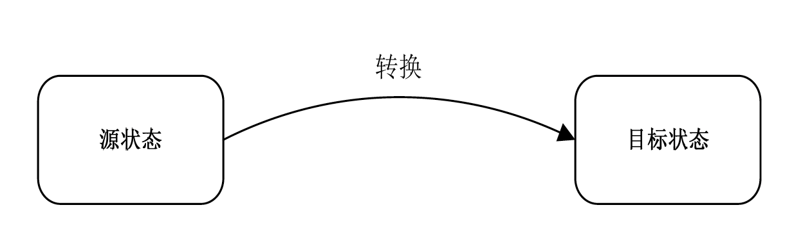

1. 填空 2×5 = 10
2. 名词 5x4 = 20
3. 简答 10x3 = 30
4. 论述 20×2 = 40

# 第1章 概述

让人类做:

- 感知低层刺激
- 模式识别
- 归纳推理
- 多种策略
- 适应、调节
- 创造、创新

让计算机做:

- 计算和测量
- 准确的存储和检索/回忆
- 快速且一致的响应
- 数据处理
- 计算
- 重复动作

### **定义–HCI** 

人机交互是一门研究人类所使用的交互式计算系统的设计、实施、评估及相关主要现象的学科

人机交互是关于**设计、评价和实现**供人们使用的**交互式计算机系统**，且围绕这些方面的主要现象进行研究的科学 

### **HCI的发展历史**

人机交互的发展过程，也是人适应计算机到计算机不断地适应人的发展过程。它经历了几个阶段：
命令行→图形用户界面→自然和谐的交互

### **计算与HCI的革命**

| 时间 | 30年前                                                       | 30年来                                                       | 近10年来                                                     |
| ---- | ------------------------------------------------------------ | ------------------------------------------------------------ | ------------------------------------------------------------ |
| 时代 | 主机时代                                                     | PC时代                                                       | 普适时代                                                     |
| 终端 | 字符终端                                                     | 图形终端                                                     | 触控图形终端                                                 |
| 工具 | 键盘                                                         | 鼠标，键盘                                                   | 笔，手，身体                                                 |
| 界面 | 字符用户界面                                                 | 图形用户界面                                                 | 触控用户界面                                                 |
| 实例 |  |   |  ipad, 手机 |

 

### Ivan Sutherland & SketchPad 1963 

**生平简介** 

- 信息论先驱Shannon的学生 
- 1963 PhD thesis at MIT 
- 1988 Turing Award 
- 计算机图形学之父，CAD先驱，后期致力于设计头盔式3D显示器（1967年开始） 

**SketchPad “编程”系统** 

- 可以通过使用手持物体（如光笔）直接在显示屏幕上创建图形图像。可视的图样随即被存入计算机内存，它们可以被重新调用，并同其他数据一样可以进行后期的处理。
- Sketchpad是第一个可以在显示屏幕上直接构造图形图像的系统，不用再通过键盘向计算机输入代码和公式 
- 更具革命性的是，它考虑到了**在显示屏幕上**作某些改动后，存储在计算机中的信息可以被**改变和更新——交互** 
- Sketchpad开创了计算机辅助设计这一新领域，即我们所熟知的CAD，所以Sutherland也被称为计算机图形学之父

### P4: Douglas Engelbart 

道格拉斯·恩格尔巴特——“人机交互”大师 

因发明鼠标而闻名，鼠标最初的名字：显示系统的X-Y位置指示器

- 鼠标器只不过是他所有成果中的一个小发明，但他提出的那些气势恢宏的计算机理论却远远不及他发明的鼠标器广为世人所知晓 

发明涉及**视窗、文字处理系统、在线呼叫集成系统**、共享屏幕的**远程会议、超媒体**、电脑交互输入设备、群件、层次超文本、多媒体、鼠标… 

20世纪60年代初，发表了题为《放大人类智力》 (Augmenting the Human Intellect)的文章，提出了把计算机作为人类智慧放大器的观点 

- 1997年，ACM图灵奖

Internet先驱人物之一 

- 积极推动和参与了美国国防部的ARPAnet计划(Internet的前身) 

开放的超文档系统——Hypertext的前身 

- OHS(Open Hyperdocument System)：集成的、无缝的、多厂商的体系结构，在其中人们可以在共享屏幕上共享由各种多媒体文件组成的超文档 
- ACM的超文本会议以他的名字命名其最佳论文奖 

与其女儿一起创建Bootstrap研究所 

- 依靠自己的力量
- 通过从战略上改进基础设施以提高整个组织机构的“集体智商”(Collective IQ) 
  - 屏幕多窗口、互连超媒体、远程会议、在线出版

# 第2章 感知和认知基础

## 2.1 人的感知

### 五种感知

五种基本感知通道的绝对阈限: 
**视觉**: 在黑暗而空气清新的夜晚, 人们可以看到30 英里( 48 千米) 外的一只烛光( 1 英里≈1.6 千米) ; 
**听觉**: 在安静的环境中, 人能够听到20英尺(6米)远处的手表滴答声( 1 英尺= 0.3 米) ; 
**嗅觉**:人能嗅到1 公升空气中散布的1/10 万毫克的人造麝香的气味; 
**味觉**: 人可尝出9 升水中放一茶匙糖的甜味; 
**触觉**: 人可感到蜜蜂翅膀距脸颊1 厘米处落下。

### 视觉感知

视觉是人与周围世界发生联系的最重要的感觉通道。

外界**80%**的信息都是通过视觉得到的，因此视觉显示是人机交互系统中用的最多的人机界面。

#### 1️⃣ 感知物体大小、相对距离和深度

##### **图画线索** 

艺术家在2D画布上创作三维立体感图画 

##### 单眼线索 

- 线条透视线索 

  - **近大远小** 

    - 同样大小的物体，离我们近，在视角上所占的比例大，视像也大；离我们远，在视角上所占的比例小，视像也小 

    **消失点/灭点** 

    - 平行线，如火车轨道，会在远处汇聚于一点
    -  

- 空气透视线索 

  - 空气散射光线，导致远处模糊 

- 浓淡远近法 

  - 绘画时，体现空气透视可以采用浓淡远近法法，近的内容着色浓，远的内容着色淡

- 纹理梯度线索 

  - 纹理变化带来的深度感 
  - 单元密度小→单元密度大：近→远
    

- 遮挡线索 

  - 近处目标挡住远处目标 
  - 如果一个物体被另一个物体遮挡，遮挡物看起来近些，而被遮挡物则觉得远些
  -  

- 阴影线索 

  - 在绘画艺术中，运用**明暗**色调，把远的部分画得灰暗些，把近的部分画得色调鲜明些，以造成远近的立体感
    

- 大小线索 

  - **相同尺寸**的对象，遵循**近大远小** 
  - 对于**不同尺寸**得对象，根据**熟悉的尺寸**判定。 
    - 高矮不同的两个熟人，如果现在你看到那个本来矮小的人显得高大些，而那个本来高大的人看起来矮小，那么，你便会觉察到前者离你近些，后者则离你远些。

- 图像模糊(模糊线索)

  - 由于空气的散射，当我们观看远处物体时都会感受到：**能看到的细节就越少；物体的边缘越来越不清楚，越来越模糊**

- 运动视差 

  - 由于头和身体的活动所引起的视网膜物像上物体关系的变化，称为运动视差 
  - 坐在火车盯着远处看, **快速运动的目标显得更近一些**

##### 双眼线索

双眼视差——立体视觉 

- 立体电影 & 立体眼镜

双眼动眼线索 

- 视物体由远及近时 
  - 视轴会聚convergence →物像落在两视网膜对称点 
  - 晶状体曲度增加→折光能力增强

##### 多线索融合

- 实际中，深度知觉是多种线索的融合 

- 可能的融合方法 

  - 累加additivity 
  - 单选Selection 
  - 相乘multiplication 

- Bruno & Cutting, 1988年，实验表明: 更支持多线索累加的观点，但可能是较为复杂的**加权累加**

  

##### 大小恒常性

**定义**

- 对于给定目标，不管其在视网膜上的成像变大或变小，其知觉大小都有维持不变的倾向 
- 例如 一个从远处朝你走来的人，在视网膜上的成像越来越大，但你不会这样觉得

**大小恒常性受诸多因素影响** 

- 知觉距离 熟知大小 地平线 

**至今还没有统一理论说明如何综合这些信息**

### 2️⃣ 感知亮度 

- 亮度是光线明亮程度的主观反映 
- 增强亮度可以**提高视敏度** 
- **随着亮度的增加，闪烁感也会增强**。在高亮度时，光线变化低于50Hz，视觉系统就会感到闪烁 在设计交互界面时，要考虑使用者对亮度和闪烁的感知，
- 尽量避免使人疲劳的因素，创造一个舒适的交互环境。

### 3️⃣ 感知色彩 

人能感觉到不同的颜色，这是**眼睛接受不同波长的光**的结果。 

颜色模型是指某个颜色空间的一个**可见光子集**，它包含某个颜色域的所有颜色 

- RGB颜色模型 
- CMYK颜色模型
- HSV颜色模型

#### RGB颜色模型（加色模型） 

- 通常用于彩色阴极射线管等彩色光栅显示设备中 采用三维直角坐标系 以红、绿、蓝为三原色，各个颜色混合在一起可以产生复合色
-  

#### CMYK颜色模型（减性原色系统） 

- 以红、绿、蓝的补色**青(Cyan)、品红(Magenta)、黄(Yellow) 以及黑色**为原色
- 常用于从白光中滤去某种颜色，又称为**减色原色系统** 

- CMYK颜色模型对应的直角坐标系原点为白色，RGB的为黑色 
  - **CMYK是在定义在白色中减去某种颜色来定义一种颜色，而 RGB是通过从黑色中加入颜色来定义一种颜色** 

- 印刷行业中，基本上都是使用这种颜色模型

  - 颜色是如何画到纸上的？ 
    

  - 在纸面上涂青色颜料时，该纸面就不反射红光，青色颜料从白光中滤去红光。也就是说，青色是白色减去红色。
    - 品红颜料吸收绿色，黄色颜料吸收蓝色。

  - 假设在纸面上涂了**黄色和品红色**颜料，那么纸面上将呈现红色，因为白光被吸收了蓝光和绿光，只能反射红光了
  - 如果在纸面上涂了**黄色、品红和青色**颜料，那么所有的红、绿、蓝色光都被吸收，表面将呈现黑色。

- 加入黑色的原因 

  - 因为大多数人的书写习惯，一般的油墨打印机使用黑色的频率最高，所以在更换墨盒时只需要更换黑色墨盒就能大大的降低成本，帮助环保

**RGB到CMYK的转换** 

$$
K=min((255-R),(255-G),(255-B))\\
 C=255-R-K\\
 M=255-G-K\\
 Y=255-B-K\\
$$

#### HSV颜色模型 

> RGB和CMYK颜色模型都是面向设备的，HSV是面向用户的 

HSV是指Hue(色相)、Saturation(饱和度)和Value(值或明度)。

- 设想从RGB沿立方体对角线的白色顶点向黑色顶点观察，就可以看到立方体的六边形外形。**六边形边界表示色彩，水平轴表示纯度，明度沿垂直轴测量。**
  - 
- 色相H表示色彩信息，即所处的光谱颜色的位置。该参数用一**角度**来表示，红、绿、蓝分别相隔度。**互补色分别相差度**。
- 纯度S为一**比例值**，范围从0到1，它表示成所选颜色的纯度和该颜色最大的纯度之间的比率。S=0时，**只有灰度**。
- 明度V表示色彩的明亮程度，范围从0到1。有一点要注意：它和光强度之间并没有直接的联系。

## 2.2 认知过程与交互设计原则

认知涉及到多个特定类型的过程，包括：

- 注意
- 感知和识别
- 记忆
- 学习
- 阅读
- 说话和聆听
- 解题、规划、推理和决策

许多认知过程是**相互依赖**的，一个活动可同时涉及多个不同的过程，只涉及一个过程的情况非常罕见，例如人们在选购商品时就涉及关注、感知、识别、说话、思考、决策等过程。

### 感知和识别

- 在结合不同的媒体时，应确保用户能够理解它们表示的复合信息。在结合使用声音和动画时，需要仔细协调，合理安排它们的调用次序
  - 在设计虚拟人物时，就应该使其唇形与所说的话同步。
- 用户应能区别图标或其他图形表示的不同含义。
- 声音应足够响亮而且可辨识，以便用户理解。 
- 文字应清晰易读，且不受背景干扰
- 在虚拟环境中使用触觉反馈时，用户应能识别各种触觉表示的含义

### 格式塔心理学(完形心理学)

格式塔心理学是一个最早的进行知觉组织研究的学派。 
格式塔学派（德语：Gestalt theorie）是心理学重要流派之一，兴起于20世纪初的德国，又称为**完形心理学**。 
格式塔是德文Gestalt的译音，意即“模式、形状、形式”等，意思是指“**动态的整体**（dynamic wholes）”。 

格式塔学派主张人脑的运作原理是整体的，“整体不同于其部件的总和”。 

- 例如，我们对一朵花的感知，并非纯粹单单从对花的形状、颜色、大小等感官资讯而来，还包括我们对花过去的经验和印象，加起来才是我们对一朵花的感知。

#### 格式塔知觉组织原理

- 完形律（最重要）
  - 具有最好、最简单和最稳定特征的结构最有可能被知觉为一个目标
- 接近律
  - 空间距离接近者容易被知觉为一个整体
- 相似律
  - 相似（颜色、形状、纹理）的图形会被认为是一个整体
- 连续律
  - 倾向于把经历最小变化或最少阻断的直线或者圆滑曲线知觉为一个整体
- 闭合律
  - 把不完全图形补充为一个完全图形的倾向
- 协变律
  - 以某一整体而运动的目标有被知觉为一个整体的倾向

#### 影响认知的因素

##### 情感

**情感因素会影响人的感知和认知能力**

- 一个人处于放松状态时，推理、判断能力会比较强，而当 他紧张、受到挫折或感到害怕时，正常的推理、判断能力就 会受到影响。
- 当一个人处于积极的情感状态时，对系统中的交互设计缺陷可能不会太在意，但这决不能成为可以设计一个较差的交互系统的理由。一个差的交互系统，会反过来影响一个人的情 绪，从而影响他解决问题的能力。一个好的交互系统，应该 能够充分考虑人在各种情感状态下的认知特点，有针对性地 进行交互的设计

##### 个体差异

进行交互系统设计时不应该忘记人是存在个性差异的。

- 长期的，如性别、体力和智力水平
- 短期的，如压力和情感因素对人的影响
- 随时间变化的，如人的年龄等

人的个性的差异应该在进行人机交互设计时被充分考虑。明确地排除某类人作为系统的用户是极端的，如现有的强调图形界面的交互设计实际上排除了那些有视力缺陷的人，因此系统应考虑提供其他的感知通道。

# 第3章交互设备

给出一个实际应用中交互设备整合应用的实例，并说明各交互设备的功能。 

- 图示说明各个输入设备及其对应的感知通道，以及各设备的输入信号等信息
- 图示说明各个输出信号，及其对应的输出设备

## 例题

虚拟现实博物馆

- 输入
  - 数据手套➡️手势
  - 跟踪器➡️人体位置
  - 麦克风➡️语音命令
  - 鼠标键盘➡️传统命令
- 输出
  - 立体图像➡️立体眼镜/头盔
  - 三维音效➡️音箱

# 第4章人机交互技术

> 内容提要
>
> 命令行和文本菜单
>
> 图形用户界面
>
> 多通道用户界面
>
> 汉字信息处理

## 4.2 命令行和文本菜单技术

### 4.2.1 命令行 

- 在计算机硬件技术发展的早期阶段，图形显示器、鼠标等设备还没有出现，人机交互方式只能是**命令和询问方式**。
- 用户输入文本命令，系统也以文本的形式表示对命令的响应 。这种人机界面称为命令行界面，是第一代人机界面。

#### 命令行界面概念模型

- 人： 操作员
  - 使用手通过键盘输入数据或者命令信息，通过视觉通道获取信 息
- 机器：被动反应
- 界面输出：静态文本字符

#### 缺点

- 界面和应用没有分开；
- 用户需要**记忆**很多命令，且输入命令需严格遵守**语法规则**；
- 界面不友好，**难于学习**，错误处理能力弱，**交互自然性差**；

#### 优点

- 适合熟练专业用户使用，**工作效率高**。目前大多数OS依然保留了命令行方式。

### 4.2.2文本菜单 

- **字符界面下的菜单方式**：在菜单方式下用户必须在有限的一组选项中进行识别和选择，更多的是**响应**而不是发出命令
- 在这种界面中，人还是被看成操作员，机器做出被动的反应，人只能使用手这一交互通道用键盘输入选择信息，通过视觉通道获取信息， **界面输出只能为静态的文本字符**。

#### 缺点

- **用户不必记忆功能命令**，缩短了用户的培训时间，减少用户的击键次数，错误处理能力也有了显著提高。

#### 优点

- 菜单层次过多，选项过于复杂，用户须逐级选择，不能一步到位 ，交互过程太慢。

## 4.3 图形用户界面（GUI） 

图形用户界面又称为WIMP界面，由窗口(Windows)、图标 (Icons)、菜单(Menus)、指点设备(Pointing Device)四位一体，形成桌面(Desktop)。

WIMP界面概念模型: 

- 

### GUI特点 

- 是以**窗口管理系统**为核心， 使用键盘和鼠标器作为输入设备。
- 除了基于**可重叠多窗口管理技术**，另一核心技术是**事件驱动技术**。
- 能同时输出不同种类的信息，用户也可以在几个工作环境中切换而不丢失它们之间的联系，通过菜单可以执行控制型和对话型任务。
- 引入了图标、按钮和滚动条技术，大大减少键盘输入，提高了交互效率。

- WIMP界面可看作是**第二代人机界面**，是基于图形方式的人机界面。
- 在WIMP界面中，人被称为用户，人机通过对话进行工作。
- 用户只能使用手这一种交互通道输入信息，通过视觉 通道获取信息。
- 在WIMP界面中，界**面的输出可以为静态或动态的二维图形或图像等信息**。

### 4.3.1 GUI的主要思想

图形用户界面的三个重要思想 

- 桌面隐喻(desktop metaphor) 
- 所见即所得（What You See Is What You Get，WYSIWYG） 
- 直接操纵(Direct manipulation) 

#### 桌面隐喻

桌面隐喻是指在**用户界面中**用人们熟悉的桌面上的**图例**清楚地表示计算机可以处理的**能力**

- 图形具有一定的文化和语言独立性，可以提高搜索目标的效
- 图形用户界面中的图例可以代表对象、动作、属性或其他概念
- 表达方式：图例和文字
  - 文字适用于表达某些**抽象概念**
  - 图例更**易于识别**，占用**较少屏幕空间**，可**独立于语言**

##### 隐喻分类

- **直接隐喻**：隐喻本身就带有操纵的对象
  - 如Word中的表格、图表等图标，图标分别代表了操纵对象
- **工具隐喻**：代表所使用的工具
  - 如用磁盘图标隐喻存盘操作、用打印机图标隐喻打印操作等
- **过程隐喻**：通过描述操作的过程来暗示该操作
  - 如Word中的撤销和恢复图标

#### 所见即所得(WYSIWYG)

- 在WYSIWYG交互界面中显示的**用户交互行为**与应用程序最终**产生的结果**是一致的(word, ppt)
- 非WYSIWYG的编辑器，用户只能看到文本的控制代码， 对于最后的输出结果缺乏直观的认识。（latex编辑器, markdown）

#### 直接操作

- 以把操作的对象、属性、关系显式地表示出来，用光笔、鼠标、触摸屏或数据手套等指点设备直接从屏幕上**获取形象化命令与数据**的过程

#####  特性

- 直接操纵的对象是**动作或数据的形象隐喻**
  - 形象隐喻应该与其实际内容相近
- 用**指点和选择**代替键盘输入
  - 优点：操作简便，速度快捷
- 操作结果立即可见
  - 用户可以及时修正操作
- 支持**逆向操作**
  - 通过逆向操作，用户可以很方便地恢复到出现错误之前的状态

##### 优点

- 借助物理的、空间的或形象的表示，而不是单纯的文字或数字 的表示。**依赖于视觉和手动控制的参与**，可以直接操作，有利 于解决问题和进行学习。

##### 缺点

- 不具备命令语言界面的某些优点
- **表示复杂语义、抽象语义比较困难**。

### 4.3.2 人机交互输入模式

> 由于输入设备是多种多样的，而且对一个应用程序而言，可以有多个输入设备，同一个设备又可能为多个任务服务，这就要求对输入过程的处理要有合理的模式。 

目前常用的三种基本模式 

- 请求模式 ( Request Mode ) 
- 采样模式（Sample Mode） 
- 事件模式（Event Mode）

#### 请求模式 

在请求模式下，**输入设备的启动是在应用程序中设置的**。应用程序执行过程中需要输入数据时，**暂停程序的执行**，直到从输入设备接受到请求的输入数据后，才继续执行程序。

图4-1 请求模式的工作过程

#### 采样模式

> *缓冲有上限的生产者&消费者* 

**输入设备和应用程序独立地工作**。输入设备连续不断地把信息输入进来，信息的输入和应用程序中的输入命令无关。应用程序在处理其它数据的同时，输入设备也在工作，新的输入数据替换以前的输入数据。**当应用程序遇到取样命令时，读取当前保存的输入设备数据**。 

- 优点：这种模式对连续的信息流输入比较方便，也可同时处理多个输入设备的输入信息。 
- 缺点：**当应用程序的处理时间较长时，可能会失掉某些输入信息**。

#### 事件模式 

> 消息队列

**输入设备和程序并行工作**。输入设备把数据保存到一个输入队列，也称为事件队列，所有的输入数据都保存起来，**不会遗失**。应用程序随时可以检查这个事件队列，处理队列中的事件，或删除队列中的事件。 

图4‐3事件模式

### 4.3.4 图形交互技术

> - 几何约束
> - 引力场
> - 拖动
> - 橡皮筋技术
> - 操作柄技术
> - 三维交互技术

#### 橡皮筋技术

被拖动对象的形状和位置随着光标位置的不同而变化

- 本质: 不断地进行画图－擦除－画图的过程 
  - 如直线的橡皮筋技术就是在起点确定后，光标移动确定终点时，在屏幕上始终显示一条连接起点和光标中心的直线，这条直线随着光标中心位置的变动而变动，它就像在起点和光标中心之间紧紧地拉着一根橡皮筋一样 

#### 操作柄技术 

可以用来对**图形对象**进行缩放、旋转、错切等几何变换。先选择要处理的图形对象，该图形对象的周围会出现操作柄，移动或旋转操作柄就可以实现相应的变换。

## 4.4 多通道用户界面 

为适应目前和未来的计算机系统要求，人机界面应能支持**时变媒体**（time-varing media），**实现三维、非精确及隐含的人机交互**，而多通道人机界面是达到这一目的的重要途径。 
80年代后期以来，**多通道用户界面** (Multimodal User Interface)成为人机交互技术研究的崭新领域，在国内外受到高度重视。

多通道用户界面综合采用**视线、语音、手势**等新的交互通道、设备和交互技术，使用户利用多个通道以**自然、并行、协作**的方式进行人机对话，通过整合来自多个通道的、精确的和不精确的输入来捕捉用户的交互意图，提高人机交互的**自然性和高效性**。 

- 多通道人机界面主要解决科学计算可视化、虚拟现实对计算机系统提出的**高效、三维和非精确**的人机交互要求
- 在多通道人机界面中，用户可以使用**自然的交互方式**， 如**语音、手势、眼神、表情**等与计算机系统进行协同工作
- 交互通道之间有串行/并行、互补/独立等多种关系，因此人机交互方式**向人与人的交互方式靠拢**，交互的自然性 和高效性得到极大的提高。

> 多通道用户界面主要关注人机界面中用户向计算机输入信息以及计算机对用户意图的理解

所要达到的目标可归纳为如下方面：

- 交互的自然性
  - 使用户尽可能多地利用已有的日常技能与计算机交互，降低认识负荷
- 交互的高效性
  - 使人机通讯信息交换吞吐量更大、形式更丰富，发挥人机彼此不同的认知潜力
- 与传统的用户界面特别是广泛流行的WIMP/GUI兼容

**多通道用户界面内容**

多通道用户界面基本特点 
多媒体技术
虚拟现实技术
眼动跟踪
手势识别
语音识别
表情识别
手写识别
数字墨水

### 多通道用户界面特点

- 使用多个感觉和效应通道
- 允许非精确的交互
- 三维和直接操纵
- 交互的双向性 
- 交互的隐含性

#### 使用多个感觉和效应通道

- 感觉通道侧重于多媒体信息的**接受**，**效应通道**侧重于交互过程中控制与信息的**输入**，两者密不可分、相互配合
- 一种通道(如语音)不能充分表达用户的意图时，需辅以其它通道(如手势指点)的信息；有时使用辅助通道以增强表达力。
- 交替而独立地使用不同的通道不是真正意义上的多通道技术，必须允许充分地**并行、协作的通道配合关系**。

#### 允许非精确的交互

- 人类语言本身就具有**高度模糊性**, 人类在日常生活中习惯于并大量使用非精确的信息交流
- 可以避免不必要的认识负荷，有利于提高交互活动的自然性和高效性
- 多通道人机交互技术主张以**充分性代替精确性**

#### 三维和直接操纵

- 人生活在三维空间，习惯于看、听和操纵三维的客观对象，并希望及时看到这种控制的结果;
- 多通道人机交互的自然性反应了这种本质特点。

#### 交互的双向性

- 人的感觉和效应通道通常具有**双向性**的特点，如视觉可看、可注视，手可控制、可感触等

- 视线跟踪系统可促成视觉交互双向性:
  - 视觉通道交互双向性表现在眼睛既可以接收视觉信息，又可以通过注视输入信息，形成视觉交互。

#### 交互的隐含性

- 追求交互自然性的多通道用户界面并不需要用户显式地说明每个交互成分，反之是在自然的交互过程中**隐含地说明**。
  - 例如，用户的视线自然地落在所感兴趣的对象之上；又如，用户的手自然地握住被操纵的目标

### 虚拟现实技术 

**虚拟现实**（Virtual Reality） 又称**虚拟环境**（Virtual Environment）。 

虚拟现实系统向用户提供沉浸（immerse）和多感觉通道（ multi-sensory）体验。 

在虚拟现实中，人是主动参与者，复杂系统中可能有许多参与者共同在以计算机网络系统为基础的虚拟环境中协同工作。

虚拟现实系统具有三个重要特点： 

- 沉浸感（Immersion） 
- 交互性（Interaction） 
- 构想性（Imagination）

#### 虚拟现实中的基本要素

计算机生成的虚拟世界（环境）必须是一个能给人提供视觉、听觉、触觉、嗅觉以及味觉等多种感官刺激的世界。目前虚拟现实通常由**视觉、听觉和触觉**三种刺激构成。 

虚拟现实系统实质上是一种高级的人机交互系统。这里的交互操作是对多通道信息进行的，并且对沉浸式系统要求采用自然方式的交互操作，对于非沉浸式系统也可使用常规交互设备进行交互操作。

#### 虚拟世界的概念模型 

虚拟现实是人们可以通过视、听、触等信息通道感受到**设计者思想的用户界面**, 由两部分组成：一部分是创建的虚拟世界（环境），另一部分是为介入者（人）； 

虚拟世界的核心是强调两者之间的**交互操作**，即反映出人在虚拟世界（环境）中的体验； 

**人机交互**是虚拟现实的核心。

**理解虚拟现实的概念模型** 

- 从虚拟环境对人的作用来看，虚拟现实的概念模型可以看作为“显示/检测”模型。 
- 从人对虚拟环境的作用来看，也就是从用户的角度看，上述概念模型可以看作“输入/输出”模型。 
  - 输入是指用户感知系统接受虚拟环境提供的各种感官刺激信号；
  - 输出是指用户对虚拟环境系统做出的反映动作。

#### 虚拟现实与多媒体及多通道 

虚拟现实技术正是一种以集成为主的技术，其人机界面可以分解为多媒体、多通道界面。 
从本质上说，<mark>多媒体用户界面技术</mark>侧重解决计算机**信息表现**及**输出**的自然性和多样性问题，而<mark>多通道技术</mark>侧重解决计算机**信息输入**及**理解**的自然性和多样性问题。

# 第5章 界面设计

> - 界面设计原则
> - 理解用户
> - 设计流程
> - 任务分析
> - 以用户为中心的界面设计

## 5.1 设计GUI的原则

> 1. 一般性原则
> 2. 窗口的设计
> 3. 颜色的使用
> 4. 图标的设计
> 5. 按钮的设计
> 6. 屏幕布局的设计
> 7. 菜单界面的设计
> 8. 填表输入界面的设计

### ① 一般性原则

- 界面要具有**一致性**
  - 最容易被违反，同时也最容易实现和修改
    - 在菜单和帮助中使用**相同的术语**
    - 同一用户界面中，菜单选择、命令输入、数据显示和其他应保持**风格的一致性**
- 常用操作要有**快捷方式**(Ctrl+CV)
  - 提高用户的工作效率，在功能实现上简洁而高效
- 提供必要的的**错误处理能力**
  - 系统应该能检测出错误，并且提供简单的错误处理功能
  - 对所有可能造成损害的动作，坚持要求用户确认
- 对操作人员的重要操作要有**信息反馈**(已保存, 已删除...)
  - 对常用操作和简单操作的反馈可以不作要求
- 允许操作**可逆**
  - 对大多数动作应允许恢复(UNDO)
- 设计良好的联机帮助
  - 提供**上下文敏感的求助系统**，让用户及时获得帮助，用简短的动词和动词短语提示命令。
- 合理划分并高效地使用显示屏
  - 只显示与上下文有关的信息，允许用户对可视环境进行维护
  - 用窗口分隔不同种类的信息，只显示有意义的出错信息
  - 隐藏当前状态下不可用的命令

### ② 窗口(Windows)的设计

GUIs是窗口界面：使用称为**窗口**的矩形框来显示一个**应用程序的组件**或者一个**文件夹**的内容

- 窗口这个概念最早是由Xerox Alto提出的，后来被纳入苹果操作系统和微软 Windows操作系统

有两种类型的**窗口管理器**: 

- 操作系统软件 
- 用户:最小化,最大化,调整大小,访问和组织窗口 

#### 窗口状态

窗口状态: 一旦一个窗口实例被创建 

- 最大化 —窗口占据整个屏幕 
- 最小化 —窗口减小到一个按钮或图标 
- 还原 –窗口恢复到原来的尺寸。

- 平铺窗口: 
  - 将多个窗口缩放, 所有程序均可以看到
  - 由窗口管理器定位窗口
  - 每个窗口变小, 限制了视觉内容
- 重叠窗口: 
  - 位置大小由用户定义
  - 活跃窗口覆盖其他窗口
- 层叠窗口: 
  - 窗口放置由系统管理器决定(自动层叠上去)

**窗口状态--优缺点**

- 平铺的窗口提供拖放方法。
- 重叠的窗口可以高效利用有限的屏幕资源，但是窗口数量可能太多
- 层叠的窗口有效地利用屏幕空间，还可以创建视觉良好的窗口组织
- 最大化窗口视觉上不太复杂，但从窗口到窗口的切换需要使用简单的导航方法

#### 窗口界面

> 大多数窗口系统使用标准化的窗口，它们看起来彼此相似而且行为一致 

分为: 多文档界面; 单文档界面; 选项卡式界面

##### 多文档界面(MDI)

- 多文档界面 (MDI)以**应用程序**为中心

- 启动一个主窗口,充当所有打开的文档的工作空间
  

  
例: 编辑多个图片PhotoShop界面

- 优点:

  - 节约系统资源——只有一个应用程序的实例
  - 创建最小的视觉上的混乱——对所有文件只有一个菜单和工具栏
  - 提供了一个协作工作空间——所有文件可以同时进行最大化,最小化, 调整和关闭
  - 允许同时可见多个文档——主窗口内的文档可以最小化,最大化,平铺, 级联或重叠

- 缺点:

  - 菜单根据活跃文档的状态而改变
  - 文档窗口必须保持在MDI的主窗口内
  - 父窗口的子窗口可以被最小化: 屏幕视觉复杂度的增加

##### 单文档界面(SDI)

单文档界面(SDIs)以**文档**为中心, 他们为每个应用程序文档实例打开一个新的主窗口

例: 古早IE

- 特点：
  - 将多个图形用户界面应用程序组织成若干单个窗口的方法
  - 每个窗口都包含自己的菜单或工具栏，没有“父”窗口
  - 允许同时编辑多个文档的应用程序
- 优点：
  - 它们是以文档为中心的，符合了用户的观点
  - 它们有更小的视觉复杂度
- 缺点：
  - 不提供将不同但相关的文档窗口分组的方法
  - 很难区分开来
  - 当打开**太多文件**时任务栏拥挤
  - 窗口间的切换困难

##### 选项卡式文档界面(TDI) 

> 如今浏览器的形式

MDI的版本之一，也称为工作簿 

- 结合使用tab键进行文档间的切换 

一些TDIs将所有文档以最大化的状态放在一起，因此，无法进行平铺或者重叠 

另一些允许文档窗口进行大小重设与最小化,这些TDIs删除了选项卡(成为 MDI) 

### ③ 颜色的使用 

颜色是一种有效的强化手段，同时具有美学价值。

使用颜色时应注意如下几点： 

- 限制同时显示的颜色数
- 活动对象的颜色应鲜明，而非活动对象应暗淡
- 尽量避免不相容的颜色放在一起，除非作对比时
- 用颜色表示某种信息或对象属性要使用户理解这种表示

### ④ 图标的设计 

- 图标是可视地表示实体信息的简洁、抽象的符号
- 需要在很小的范围内表现出图标的内涵
- 应该着重考虑视觉冲击力，要使用简单的颜色

#### 图标设计原则

- 应该和目标的**外形相似**。尽量避免过于抽象
- 可在图标中附加上**简要的文本标注**，使用户明确图标的含义
- 设计图标应尽可能简单，符合常规的表达习惯

### ⑤ 按钮的设计

- 按钮应该具有**交互性**，应该有3到6种状态效果
  - 点击时的状态
  - 放在上面但未点击的状态
  - 点击前鼠标未放在上面时的状态
  - 点击后鼠标未放在上面时的状态
  - 不能点击时的状态
  - 独立自动变化的状态
- 按钮应具备简洁的图示效果，属于一个群组的按钮应该风格统一

### ⑥ 布局设计

设计屏幕布局(Layout)时应该使各功能区重点突出

- 平衡原则
  - 注意屏幕上下左右平衡，不要堆挤数据
- 预期原则
  - 对屏幕上所有对象，如窗口、按钮、菜单等处理应一致化，使对象的操作结果可以预期
- 经济原则
  - 简明、清晰
- 顺序原则
  - 对象显示的顺序应按需要排列
- 规则化
  - 画面应对称，统一规范

### ⑦ 菜单设计

菜单描述了一个软件的大致功能

菜单中的选项在功能上与按钮相当，一般具有下列一种或几种类型的选项：**命令项、菜单项和窗口项**

- **命令项**用来执行一条命令。
- **菜单项**将以一个子菜单的形式出现。
- **窗口项**弹出一个相关联的弹出式窗口。

#### 菜单结构

> 树状结构菜单是最常见的

- 单一菜单
  - 是在几个选项中做出选择，可以有两个或多个选项
    
- 线状序列菜单
  - 把一组相关联的菜单组合在一起，并且可以重返以前所作的选择
    
- 树状结构菜单
  - 选项划分为若干类，类似的选项组成一组，形成一个树状结构
    
- 网状结构菜单
  - 允许用户在父辈菜单与子菜单之间切换
  - 超文本链接

#### 菜单设计原则

- **按功能组织菜单**，合理分类
- **广而浅的菜单效果好**
- **常选菜单放前面**
- 求文字简短、含义明确
- 常用选项要设置**快捷键**
- 充分利用菜单选项的**使能与禁止、可见与隐藏属性**
- 弹出菜单一般不再包含下级菜单

## 5.2 理解用户 

### 5.2.1 用户

用户是使用某种产品的人，其包含两层含义

1. 用户是人类的一部分
2. 用户是产品的使用者

衡量一个以用户为中心的设计的好坏，强调产品的最终使用者与产品之间的交互质量, 包括一下三方面特性: 

- 有效性 （ Effectiveness ）
- 效率（ Efficiency ）
- 用户主观满意度（ Satisfaction）

以用户为中心的设计，就是在软件开发过程中要有用户的参与，根据用户的需求和反馈不断改进设计

### 5.2.2 用户体验 

<mark>用户体验</mark>（User Experience，UX）通常是指用户在使用产品或系统时的全面体验和满意度。 

**用户体验主要有下列四个元素组成**

- 品牌（Branding） 
- 使用性（Usability） 
- 功能性（Functionality） 
- 内容（Content）

用户体验是一个迭代过程，影响的因素有：

- 现有技术(UI框架)上的限制
- **设计的创新**，在用户的接受程度上也存在一定的风险
- **开发进度表**，会给这样一种具有艺术性的工作带来压力
- 设计人员很容易认为他们了解用户需要

### 5.2.3 用户的区别

#### ① 用户的分类 

- **偶然型用户**：没有计算机专业知识，没有计算机系统基本知识的用户
- **生疏型用户**：对计算机的性能及操作使用，有一定程度的理解，对新使用的计算机系统缺乏了解
- **熟练型用户**：对需要计算机完成的工作任务有清楚地了解，对计算机系统也有的知识和经验
- **专家型用户**：对需要计算机完成的工作任务和计算机系统都很精通

**不同的用户会有不同的经验、能力和要求。** 

- 例如，偶然型和生疏型用户要求系统给出更多的支持和帮助；熟练型和专家型用户要求系统运行效率高，能灵活使用。

#### ② 计算机领域经验和问题领域经验的区别 

用户界面还必须至少从两个维度 (**计算机经验和领域经验**) 迎合潜在的广泛经验。 

- 由左至右,领域经验由少到多; 
- 右下至上,计算机经验由少到多;
- 矩形低代表倾向于侧重于易于学习,高代表侧重于易于使用

### 5.2.4 用户交互分析

在理解用户的基础上, 需要针对软件的功能和目标用户，全面分析用户的交互内容

主要包括: 

- 产品策略分析
  - 确定产品的设计方向和预期目标
  - 用户对设计产品的期望
  - 同类型产品的竞争特点
  - 用户使用同类型产品时的交互体验
- 用户分析
  - 深入而明确的了解产品的目标用户
  - 找到典型用户
- 用户交互特性分析
  - 通过对目标用户群的交互挖掘得出准确、具体的用户特征，从而可以进行有的放矢地设计

## 5.3 设计流程

### 5.3.1 用户的观察和分析 

- 情境访谈: 走进用户的现实环境
- 焦点小组: 组织一组用户进行讨论
- 单独访谈: 一对一的用户讨论

### 5.3.2 设计 

用户的观察和分析为设计提供了丰富的背景**素材**，应对这些素材进行系统的分析，常用的分析方法是对象模型化。 

**<mark>对象模型化</mark>: 将用户分析的结果按照讨论的对象进行分类整理，并且以各种图示的方法描述其属性、行为和关系。** 

- 比较抽象的视图有利于进行逻辑分析，称为低真视图
- 比较具体的视图更接近于人机界面的最终表达，称为高真视图

### 5.3.3 实施 

随着产品进入实施阶段，设计师对高真设计原型进行最后的调整，并且撰写产品的设计风格标准（Style Guide），产品各个部分风格的一致性由该标准保证。 
产品实施或投入市场后，面向用户的设计并没有结束，而是要进一步的搜集用户的评价和建议，以利于下一代产品的开发和研制。

## 5.4 任务分析 

在以用户为中心的设计中，关心的是如何从用户那里理解和获取用户的思维模式，进行充分、直观的表达，并用于交互设计。 

- 描述用户行为的工具有很多，目前经常提到的是<mark>统一建模语言</mark>（ Unified Modeling Language，UML）。 
- UML 2.0共有10种图示，分别为组合结构图、用例图、类图、序列图、对象图、协作图、状态图、活动图、组件图和部署图 
- 在任务分析中使用UML工具，可以清晰地表达一个交互任务诸多方面的内容，包括交互中的使用行为、交互顺序、协作关系、工序约束等等

以下是转换为 Markdown 表格的结果：

| 名称       | 视图                          | 主要符号                       |
| ---------- | ----------------------------- | ------------------------------ |
| 组合结构图 | (composite structure diagram) | Part、Port、接口和链接(Link)   |
| **用例图** | (use case diagram)            | 用例、参与者、关联关系         |
| 类图       | (class diagram)               | 类、关联关系、泛化关系         |
| **序列图** | (sequence diagram)            | 对象、消息、活动期             |
| 对象图     | (object diagram)              | 对象、链接、消息               |
| **协作图** | (collaboration diagram)       | 对象、链接                     |
| 状态图     | (statechart diagram)          | 状态、事件、转换、动作         |
| 活动图     | (activity diagram)            | 活动、转换、分叉、接合         |
| 组件图     | (component diagram)           | 组件、接口、依赖关系、实现关系 |
| 部署图     | (deployment diagram)          | 节点、组件、依赖关系           |

### 举例

图书馆管理系统

1. 系统提供**查询**功能，读者可以在系统界面中输入查询图书
2. 系统通过交互界面**列出**可借用的图书供读者选择
3. 如果读者**选定**了图书，系统提示读者**输入**借书证号和密码
4. 读者**确定**借阅关系，系统处理并通知读者借书成功 ，并给读者一个**确认**
5. 交互过程就结束了

### 5.4.1使用行为分析

使用行为分析的目的: 理解系统中每个**参与者**及其所需完成的任务，

- 分析使用该系统主要功能部分的是哪些人，谁将需要该系统的支持以完成其工作

一般使用**用例图**描述

一般使用用例图描述使用行为分析一般使用用例图描述，它从参与者的角度出发来描述一个系统的功能，主要目的是帮助开发团队以一种可视化的方式理解系统的功能需求。 

#### 例: 图书管理系统

以图书馆管理系统为例，其参与者主要包括： 

- **读者**（借阅者）； 图书管理员； 图书馆管理系统的系统管理员。

读者使用图书馆管理系统的用例

图书管理员处理借书、还书的用例

系统管理员进行系统维护的用例

### 5.4.2 顺序分析

- 每个使用行为都是由若干步骤组成的，**顺序图**描述了完成一个任务的典型步骤
- 它可以按照交互任务发生的时间顺序，转化为进一步、更加正式层次的精细表达(时序图)
- 用例常常被细化为一个或更多的顺序图。

**读者借书时序图**

### 5.4.3 协作关系分析 

协作图着重显示了某个用户行为中**各个系统元素之间的关系**，而不再重点强调各个步骤的时间顺序。 
读者借书过程中，几个交互对象之间的协作关系: 

### 5.4.4 工序约束陈述

用户完成任务的步骤又被称为工序，**工序约束陈述**是工序分析的最直接的方法

图书管理系统的工序约束

- 系统管理员必须先增加借阅者信息，读者才能登陆。
- 系统管理员必须先增加书籍信息，读者才能查阅。
- 读者借阅信息生成后，图书管理员才能去书库取书。
- 读者必须先在系统中办理借阅，才能取书。
- 读者必须先借书才能还书。

### 5.4.5 用户任务一览表

所有任务分析完毕，就可以用一览表的形式描述系统中的**所有用户及其可能需要完成的所有任务**: 可以一目了然的展示所有用户的交互任务信息

| 任务                         | 读者 | 图书管理员 | 系统管理员 |
| ---------------------------- | ---- | ---------- | ---------- |
| 书籍信息查询, 读者信息查询   | ✓    | ✓          |            |
| 借书                         | ✓    | ✓          |            |
| 还书                         | ✓    | ✓          |            |
| 书籍预订                     | ✓    | ✓          |            |
| 增加、删除、更新书目         |      |            | ✓          |
| 增加、删除书籍               |      |            | ✓          |
| 增加、删除、更新读者账户信息 |      |            | ✓          |

### 5.4.6 任务金字塔

任务金字塔描述了**不同层次的任务之间的关系**。任何一个任务都可能包括若干子任务，从而构成金字塔状的结构。

### 5.4.7 故事讲述和情节分析

通过描述实际的任务场景可以非常直观的进行任务描述

- 故事讲述（story telling）可以是真实的案例，能够典型的反映交互任务
- 情节分析（scenario analysis）是对故事所反映的交互任务的理性分析

#### 例子

> 学生借书的过程描述图书馆里系统的交互故事 

​	刘凡是某大学的一名学生,这一天他来到学校图书馆,想使用电子借阅系统借阅两本最近出版的关于Java编程和XML的书 
​	在图书馆的借阅大厅里,有几台自助查询电脑供读者使用,刘凡走到其中的一台电脑前,点击鼠标进入图书查询借阅系统进入查询界面,他打开”书目查询”菜单项,根据界面提示选择了文献类型、查询类型、查询模式、结果排序方式、结果显示的方式等选项，其中从查询类型的提示中选择“题名”方式；之后，他在检索输入框中输入“Java程序设计”，并单击“检索”按钮。

​	在接下来的页面中，系统返回了条查询结果，每一条为一本书的信息，书名带有超级链接，由于要借一本新近出版的书，刘凡选择按照“出版日期”将查询结果进行降序排列，从图书列表中，刘凡选中一本清华大学出版社的《 Java程序设计》，单击书名进入书目的详细介绍。 

​	在书目的详细介绍里，有这本书的基本信息，包括作者、出版社、摘要等。另外，还有此书的馆藏信息：目前有两本书已经借出，还有一本在馆。刘凡决定借阅这本书，单击“借阅”按钮，系统提示刘凡登录，经过填入借阅卡号、密码，并单击“确认”按钮，系统查阅刘凡的借阅记录以及借阅权限等，确认无误后弹出提示页面，显示“是否确认借阅《Java程序设计》？“，刘凡单击”确认”按钮，系统在后台生成借阅信息，并在页面显示“借阅已成功，请10分钟后到借书处领取！”。

​	刘凡的借阅信息被传输到书库系统，图书管理员在书库中找到刘凡要借阅的那本书并将书籍通过传送系统传输到借书处。 

​	在这段时间里，刘凡再次打开“书目查询”菜单项，查询 “XML”，这次他从查询结果列表中选中有一本《XML实践教程》，单击书名进入书目详细介绍，馆藏信息显示本书已经全部借出；于是刘凡单击“读者预约”按钮，预定本书，并留下了个人的联系方式。 

​	约10分钟后，刘凡来到借书处，图书管理员核对他的借阅卡，确认无误后，将那本《Java程序设计》交给刘凡。

- 角色：刘凡，图书馆读者；图书管理员。 
- 目标：完成书籍的借阅或预定。 
- 环境：图书馆借阅大厅，有查询电脑可供查询使用；借书处，取到借阅的书籍。 
- 步骤：查询书籍，浏览图书信息，确定要借阅的书籍；然后在系统中办理借阅，并等待从借书处取书。 
- 策略：如果图书在馆，则借阅；否则，可以预定图书。 
- 情感：交互系统的交互过程简洁、顺畅，信息提示充分、清晰，用户对完成任务的过程感到满意。

## 5.5 以用户为中心的界面设计 

### 四个重要原则

- **及早以用户为中心**：设计人员应当在设计过程的早期就致力 于了解用户的需要。
- **综合设计**：设计的所有方面应当齐头并进发展，而不是顺次 发展，使产品的内部设计与用户界面的需要始终保持一致。
- **及早并持续性地进行测试**: 在开发的全过程引入可用性测试，可以使用户有机会在产品推出之前就设计提供反馈意见。
- **反复式设计**：大问题往往会掩盖小问题的存在。设计人员和开发人员应当在整个测试过程中反复对设计进行修改

### OVID方法 

OVID（Object, View, Interaction, and Diagram）方法是一种系统化的人机交互界面设计方法，通过对用户、目标和任务的分析，以达到用户满意的设计要求。该方法包括以下几个关键模型：

- **设计者模型**：使用对象、对象间的关系等概念来表达目标用户意图的概念模型。设计者通过分析用户需求，创建反映用户目标的对象模型，确保设计的界面能够准确反映用户的意图。
- **编程者模型**：广泛应用于面向对象的开发方法中，用于表示和实现构成系统的类。这个模型关注的是系统的实现细节，确保系统功能的实现符合设计者模型的要求。
- **用户概念模型**：表示用户对系统的理解，它依赖于用户的交互经验。用户概念模型通过用户与系统的交互，形成对系统功能和结构的理解，是用户在使用系统时的心理模型。

#### OVID方法的关键

OVID方法的关键是: 确定交互中涉及的对象，并把这些对象组织到交互视图中

- **对象**来自用户的概念模型
- **视图**是支持特定用户任务的对象的有机组合
- **交互**就是那些在交互界面中对对象执行的操作

#### OVID中的活动循环

- 对象从用户概念模型的任务分析中获得，并被转化到设计者的对象模型中。 
- 交互就是那些界面中执行对象操作的必须动作。 
- 如果该模型能够有效地设计和实现，用户就可以通过与系统的交互理解设计者模型所要表达的信息；这些模型可以使用面向对象概念去表达，如统一建模语言（ Unified Modeling Language，UML）等。

下面以一个网上机票订购系统的界面开发为例，简单说明OVID方法的过程

### 5.5.1 对象建模分析

建模是将系统任务的某些概念及其关系用图的方式直观综合地表达出来；分析则是将系统的对象抽象为类，列出对象或类的属性、行为、以及对象间的关系。 

- 对象：乘客会员、航空代理、航班、机票、会员账户、航班列表等； 
- 操作（交互过程）：用户注册、登陆、查询航班信息、填写预定信息、支付、出票等

**对象&操作** 

### 5.5.2 视图抽象设计

仔细研究系统的对象模型，列出其系统状态，对每个视图抽象出其中涉及的对象， 以及对象的属性和行为

**用户查询航班视图** 

- 对象：航班对象
- 属性：出发城市、到达城市、航空公司、起飞日期时间、机票类别以及出票城市等
- 操作：主要是查询，即要从后台数据库中查出符合条件的航班信息，以及重置查询条件等操作。

### 5.5.3 概要设计 

针对特定的操作系统或交互方式，对抽象的视图设计做进一步的具体设计，产生视图的概要设计。

### 5.5.4 视图的关联设计

很多交互任务需要从一个状态转化为另一个状态，这 就要考虑用户完成任务所需的信息和功能，并将不同 交互视图之间的联系和状态转换关系整理清楚

对一个具体的交互视图进行关联性设计一般就要考虑以下因素： 

- 该视图的前一个或几个视图是什么？用户怎样由前面的视图到达该视图？ 
- 该视图后面的视图是什么？也就是用户下一步可以进入哪些视图？ 
- 如何从一个视图转移到另一个视图，即转移的条件或操作是什么？

**订票业务网站**的桌面交互实现中，用户可能在整个业务相关的多个交互视图中进行转换

### 5.5.5 视图的全面设计

确定各个视图的具体内容和大致布局，并在每个视图上明确体现与其他视图的关系

# 第6章人机交互界面的表示模型

> 本章主要内容
>
> - 人机交互界面的表示模型
> - 界面描述语言
> - 窗口系统
> - 用户界面管理系统

**目的**

在界面设计的早期阶段，人们需要有一种<mark>用户界面表示模型</mark>和利用形式化的设计语言

- 来分析和表达**用户任务**以及用户和系统之间的交互情况； 
- 并且使界面表示模型能方便地**映射到实际的设计实现**。

## 6.1人机交互界面的表示模型

三种模型： 

- [行为模型](# 6.1.1 行为模型): 主要从用户和任务的角度考虑如何来描述人机交互界面，
  - GOMS，UAN及LOTOS模型 
- [结构模型](# 6.1.2 结构模型): 主要从系统的角度来表示人机交互界面。
  - 状态转换网络（STN-State Transition Network）和产生式规则 (Production Rule )。 
  - 从用户角度看，**行为模型**强调做什么，**结构模型**强调怎么做
- 表现模型: 描述用户界面的表现形式，由层次性的交互对象组成。 

如何由界面的行为表示模型转换到系统的结构模型。

###  6.1.1 行为模型

主要从**用户和任务**的角度考虑如何来描述人机交互界面 

- GOMS模型 
- LOTOS模型 
- UAN模型 
- G-U-L模型

#### ①GOMS 

通过目标 (**G**oal)、操作 (**O**perator)、方法 (**M**ethod) 以及选择规则 (**S**election) 四个元素来描述用户的行为。 

GOMS是在交互系统中用来分析建立用户行为的模型。它采用“**分而治之**”的思想，将一个任务进行多层次的细化。

##### 目标 Goals

目标就是用户执行任务最终想要得到的结果,它可以在不同的层次中进行定义

“编辑一篇文章”-“编辑文章”（高层）； “删除字符”（低层）

##### 操作 Operators

操作是任务分析到**最低层**时的行为，是用户为了完成任务所必须执行的**基本动作**。 操作不能被分解， 在GOMS模型中是**原子动作**。

#####  方法 Methods

方法是描述如何完成目标的过程，用来确定子目标序列及完成目标所需要的操作的算法

##### 选择 Selection

选择是用户要遵守的判定规则，以确定在特定环境下所要使用的方法

当有多个方法可供选择时，GOMS会预**测会使用哪个方法**,这需要根据特定用户、系统的状态、目标的细节来预测要选择哪种方法

##### 局限性

- 没有清楚的描述错误处理的过程
- 对于任务之间的关系描述过于简单,只有**顺序和选择**.
- 把所有的任务都看作是面向操作目标的，而忽略了一些任务所要解决的问题本质以及用户间的个体差异

##### 任务Editing的GOMS描述实例

#### ②LOTOS 

LOTOS -Language Of Temporal Ordering Specification，**时序关系说明语言**

 国际标准形式描述语言，无二义性，适于描述具有**并发、交互、反馈和不确定性**等特点的**并发系统**中的行为。 
开始作为一种描述网络协议的语言，由于交互系统、特别是多通道交互系统有并发系统的特点，因此成为用来描述交互系统的行为模型。

##### LOTOS基本思想

- 系统的外部可见行为可以看作是由一个有**时序关系**的交互序列组成。 
- 系统由一系列进程组成，进程同环境之间通过称为“关口”（gates）的交互点进行交互。 
- 两个以上的进程在执行同一个外部可见的行为时会发生交互操作，进行数据交换、信息传递、协调同步等操作。 
- 进程行为用“**行为表达式**”来描述，复杂的行为由简单的行为表达式通过**表示时序关系的LOTOS算符**组合而成。 
- 在将LOTOS思想用于人机交互的行为模型时，用**进程之间的约束关系**来描述交互子任务之间的关系。

##### LOTOS算符 

- ` T1 ||| T2 `（交替Interleaving) 
  - T1和T2两个任务相互独立执行,可按任意顺序执行,但永远不会同步
- `T1 [] T2` （选择Choice) 
  - 需要在T1和T2中选择一个执行,一旦选择某一个后,必须执行它直到结束
- `T1 | [a1,...,an] | T2` （同步Synchronization) 
  - 动作T1和T2 必须在动作a1,...,an处保持同步
- `T1 [> T2`  （禁止Deactivation) 
  - 一旦T2任务被执行,T1便无效(不活动)
- `T1 >> T2` （允许Enabling)
  - 当T1成功结束后才允许T2执行

中国象棋的LOTOS任务分解实例

##### LOTOS与GOMS的结合 

LOTOS模型很好的描述了任务之间的**时序约束关系**

用GOMS模型描述任务的**分解过程**，而用LOTOS给出子任务之间的**约束关系**，这样就可以增加两种表示 模型的表示能力。

**结合GOMS和LOTOS的中国象棋程序的行为描述**

ACTION/行为要描述的是用户希望在完成一个目标的时候想要做的事情 ,在实际的系统开发中它将对应一个业务处理过程在行为模型这一个级别,并不考虑它的具体的实现,而只需要对所要完成的行为进行一下简单描述即可

##### 总结 

- LOTOS与GOMS结合，可以清楚地了解整个目标层次及各目标之间的约束关系。但与GOMS同样存在**无法描述目标异常结束的缺陷**，同时当任务进行选择时用什么规则进行选择并未涉及。 
- LOTOS最大的优越性在于可以构造一套现成的自动化工具，利用这些工具，可自动进行错误检测，但它过于形式化的记法比较晦涩难懂。 
- GOMS和LOTOS的结合可以很好地描述人机交互的较高级的任务，对于原子任务的形式化描述，上述模型并没有给出一个比较清晰的描述，下面讨论的**UAN模型主要用于原子目标的描述**。

总结 
LOTOS与GOMS结合，可以清楚地了解整个目标层次及各目标之间的约束关系。但与GOMS同样存在无法描述目标异常结束的缺陷，同时当任务进行选择时用什么规则进行选择并未涉及。 
LOTOS最大的优越性在于可以构造一套现成的自动化工具，利用这些工具，可自动进行错误检测，但它过于形式化的记法比较晦涩难懂。 
GOMS和LOTOS的结合可以很好地描述人机交互的较高级的任务，对于原子任务的形式化描述，上述模型并没有给出一个比较清晰的描述，下面讨论的UAN模型主要用于原子目标的描述。

#### ③UAN模型 

UAN---User Action Notation, **用户行为标注**

UAN是一种简单的符号语言，主要描述**用户的行为序列**以及在**执行任务时所用的界面物理对象**。 

- 尽管UAN属于一种行为模型，但作为一种任务描述语言，它又涉及一定程度的系统行为的描述，因而它兼有行为模型和结构模型的一些特点。

##### UAN模型的基本思想

- 预定义一些标志符
  - 用户动作标志符
  - 条件标志符
- 采用一种**表格结构**来表示任务
  
- 界面被分解成一些类似层次结构的异步任务，每个任务的实 现都用表格来描述，用户动作的关联性和时序关系由表格的 行列对齐关系和**从上到下、从左到右**的阅读顺序来确定。

##### UAN预定义的动作标志符（部分）

鼠标: 

- `move_mouse(x,y)`: 移动鼠标至(x,y)
- `release_button(x,y)` : 在(x,y)位置释放鼠标按钮；

icon高亮

- `highlight(icon)`: 使icon高亮显示；
- `de_highlight(icon)`: 取消icon的高亮显示。

- `while(condition)TASK ` : 当条件condition为真时，循环执行任务TASK
- `if(condition) then TASK`: 如果条件condition满足，则执行任务TASK
- `iteration A* or A+` : 表示迭代操作
- `waiting`: 表示等待，可以等待一个条件满足，也可以等待任务中的一个操作执行

##### UAN实例-单通道交互

##### UAN实例-多通道

通过鼠标操作mouse_down(x,y)**选定一个文件图标**后，有两种选择，可以直接通过鼠标将文件拖入回收站，也可以通过语音 move to recycle bin将选定的文件移到回收站。

**作业: 写出用鼠标或语音将文件A拖入文件夹B的UAN模型** 

##### UAN总结

更接近于实现，实现起来比较方便，需要一定的编程基础

在精确刻画各成分之间的各种平行和串行的**时序关系方面尚显不足**

 

#### ④G-U-L 层次化的界面描述方法

可以考虑将GOMS、UAN 、LOTOS中模型结合为一个预测行为模型：G-U-L模型

G-U-L运用GOMS原理为基础进行任务分解，建立基本的行为模型，原子操作由UAN模型描述，在此基础上，运用LOTOS算符来表示**任务目标之间的时序关系**

在G-U-L模型中没有加入规则，在表示目标之间的关系中也未考虑同步。

### 6.1.2 结构模型

结构模型从**系统组成**角度，描述如何通过交互序列完成交互任务。**着重描述系统的反应和行为**

#### 产生式规则

又称为**上下文无关文法**

产生式集合定义了用户与计算机交互所运用的语言

系统不断用产生式规则来检测用户的输入是否与这些条件相匹配。若匹配则激活**相应的动作**，这些动作可以是执行应用程序的一个过程，也可以是直接改变某些系统状态的值。

组成界面描述的产生式规则很多，所有的规则都是有效的，规则定义的**顺序并不重要**，只要与规则中的条件相匹配，就可以激活相应的动作

##### 事件引导

规则的条件和动作部分都以事件的方式进行表示, 有三种类型

- 用户事件
  - Sel-line表示从菜单中选择line命令，C-point和D-point表示用户在绘图平面上单击和双击鼠标

- 内部事件: 用于保持对话状态
  - 如start-line表示开始画线后的状态，rest- line表示选择了第一个点之后的状态。

- 系统响应事件: 以尖括号表示可见或可听的系统响应
  - 如 `<highlight 'line'>`，把菜单项 `'line'` 高亮度显示，`<draw line>` 表示在屏幕上显示直线，`<rubber band on>` 表示橡皮筋绘制方式打开，`<rubber band off>` 表示橡皮筋绘制方式关闭。

**例子**

**事件引导实现方式**

- 保存内部事件序列
- 构造一个对话控制器，主要**负责事件的产生和规则的匹配**
- 规则的匹配算法影响系统的性能

##### 状态引导

在系统内存保存的不再是动态的随时进出的事件，而是一些表示系统的当前**状态的属性**， 这些属性在不同的时刻有不同的值

**状态定义**: 

- 例: 为了实现画线操作, 定义五个属性: 
  - Mouse:﹛mouse-null, select-line, click-point, double-click﹜
  - Line-state:﹛menu, start-line, rest-line﹜
  - Rubber-band:﹛rubber-band-on, rubber-band-off﹜
  - Menu:﹛highlight-null, highlight-line, highlight-circle﹜
  - Draw:﹛draw-nothing, draw-line﹜

**产生式规则----一条线段**

- `Select-line`→`mouse-null` `start-line` `highlight-line`
  - 选择线段, 设置鼠标&线段&菜单状态
- `Click-point` `start-line`→`mouse-null` `rest-line` `rubberband-on`
  - 点击起点(状态: 鼠标点击&线段开始) → 鼠标
- `Click-point` `rest-line`→`mouse-null` `draw-line` `rubberband-off`
  - 点击终点(状态: 鼠标点击&线段未完成)→

**产生式规则----多条折线**

当产生式规则的条件和状态匹配时将激活该产生式规则

对于某一特定的属性，如果**前面的状态需要改变成新的状态时才需要在产生式规则的后面标注** 

- 例如，在第二条规则中，规则指定Line-state属性应设置成 rest-line，因为原来的start-line值将丢失 
- 而在第三条规则中，没有提及rest-line值，因为它已默认， line-state属性的值继续保留为rest-line 

**属性的永久特征有时会引起一些奇怪的错误**，因此在上述的规则集中，每一条产生式规则都要求将鼠标的状态设置为mouse-null，否则当用户单击时将激活了第二条规则，如果不立即将鼠标的属性设置为mouse-null，则会立即激活第三条规则，此时系统的状态和第三条规则的条件是匹配的，并且会反复一直执行下去。

##### 混合引导的系统 

- 可以将事件和状态结合起来，采用下面的形式`event`: `condition`→ `action` 
- 事件用来激活产生式规则
- 当状态改变时，产生式规则中的action本身也可以产生新的事件

例子

1. 系统有三个属性： 
   - 加粗Bold: ﹛off, on﹜ 
   - 斜体Italic: ﹛off, on﹜ 
   - 下划线Underline: ﹛off, on﹜ 

2. 混合引导系统的产生式 

   - select-bold:Bold = off → Bold = on 

   - select-bold:Bold = on → Bold = off 

   - select-italic: Italic = off → Italic = on 

   - select-italic: Italic = on → Italic = off 

   - select-under:Underline = off → Underline = on 

   - select-under:Underline = on → Underline = off 

##### 产生式规则总结 

- **无法描述误操作**
- 界面复杂时，状态、事件复杂，产生式过多，要求产生式匹配算法性能高

#### 状态转换网络

状态转换网络（STN， state transition network  ）

- 定义一个具有一定数量状态的转换机，称之为有限状态机FSM
- FSM从外部世界中接收到事件，并能使FSM从一 个状态转换到另一个状态

#####  传统的状态转换网络

发生一个外部或内部事件时，系统从一个状态转换到另外一个状态，这称为**状态转换**

- 外部事件主要由用户操作外部输入设备来产生。
- 内部事件可以是系统产生的事件，如时钟事件

一个状态转换与一对状态相关联

- 

设系统由n个状态组成，状态之间的转换最多可能有`n*(n-1)`个。

**带条件和动作的状态转换**

- 选项条件(conditions)，表示导致状态的改变的条件；
- 选项动作(actions)，表示系统在改变状态时将执行什么动作。
- 

- 可以将条件合并到状态中(`状态|条件`二元组), 将状态分割, 得到基本的状态转换网络

**基于鼠标的画图工具**

###### 优点

- 比相应的文本解决方案更易于设计、理解、修改和文档化
- 它给出了**对行为的精确的、甚至是格式化的定义** 

###### 缺点

- **需要定义出系统的所有状态**
- **状态的数目是呈指数级增长的**

一般的系统具有很多个状态，假设系统由n个状态组成，状态之间的转换最多可能有n*(n-1)个。 
简单的三状态FSM 
选项条件(conditions)，表示导致状态的改变的条件； 
选项动作(actions)，表示系统在改变状态时将执行什么动作。

最多可能有6个状态转换

带条件和动作的状态转换

带条件和动作的状态转换网络
带条件的状态转换实例

##### 拓展状态转换网络

为了解决**状态爆炸**的问题，可以采用**面向对象**方法来为**每个类定义单独的状态转换网络**。

- 每个类都有一个简单的、易于理解的状态转换网络

**一些例子**

- 拓展状态转换网络: 
- 带有取消功能的状态转换网络: 

- 带有帮助功能的状态转换网络: 

###### 优点

- 具有良好的描述串行和顺序行为的能力
- 比相应的文本解决方案更易于设计、理解、修改和文档化
- 它给出了对行为的精确，格式化的定义

###### 缺点

- 状态的爆发式增长问题
- **并发及其他行为的描述能力差**
- 虽然是一个结构模型，但难以实现

### 6.1.3 行为模型和结构模型的转换

> 如何由界面的行为表示模型转换到系统的结构模型

整个框架分为三个部分： 

- **行为模型使用G-U-L模型**，在这一层将产生一个基本的预测性的行为模型。 
- **结构模型采用层次状态转换网络**，它涉及到的元素有状态、转换、事件、层次结构。不考虑状态转换网络在转换中条件和同步，可以简化转换工作。 
- **用户包含两种用户，领域专家和设计者**。G-U-L模型的创建主要是由领域专家和设计者合作来完成的，然后通过模型转换算法转换成为结构模型，最后提供给设计者使用。

#### 转换算法

##### ① 基本思想

- 以层次化结构对任务进行建模
- 表示的是状态之间的转换，也采用层次化表示，涉及到的主要是状态、转换、事件、行为
- G-U-L中的每个目标**都对应一个状态转换网络**
- 如果一个目标下层有子目标，对子目标来说，它所对应的状态网络应该**嵌套**在上层目标对应的状态网络中。
- 在产生的状态转换网络中，有两类事件起作用
  - 一类是**外部由用户激活**的事件: 如"按下鼠标", "点击键盘"
  - 另一类是**内部由目标产生的内部事件**: 如"目标正常结束"

##### ② <mark>转化方法</mark>

> 算法略

关系网络的节点: 状态

- 有一个初始状态S

关系网络的边: 外部事件

**选择`[]` 关系网络 ** 

考虑目标存在循环: 即``  

- `*`表示重复

**允许`>>`关系网络**

`>>(G0,G1)`: G0成功结束后才允许G1执行, 是一个顺序执行过程

- 可以是更长的循环

- 从状态`S0`在**外部事件**激发转换至`S1`，在`S1`状态等待“**G0正常结束事件**”发生后转换至`S2`；然后在`S2`处等待“**G1正常结束事件**”转换至 `S0`，这样表示目标G执行完毕，同时发生动作“**产生G正常结束事件**”，处理转换过程中存储所有的弧。  

行为模型转LOTOS

- `>>(G0, G1, *G2)`

**交替 `|||`** 

设目标G下的子目标关系为`|||(G0,G1)`，表示两个目标之间一种**任意的组合**来执行完成。

在转换到状态网络后，如图6-23所示，有`S0`->`S1`->`S4`->`S0`(先G0, 后G1)和`S0`->`S2`->`S3`->`S0`(先G1, 后G0)两条途径可以完成目标G的一次执行。

- 从`S0`状态，如果产生“外部事件0”，依次等待“G0正常结束事件”、“G1正常结束事件”并最终回到`S0`状态，同理，若产生“外部事件1”，则会沿着另一条路径回到`S0`。记录下所有状态转换的弧。

**禁止`[>`关系网络**

设目标G下的子目标关系为`[>(G0,G1)`，一旦G1任务被执行，G0便无效（不活动）。

这个关系在转换到状态网络以后与前面不同的是，在状态`S2`被“G1正常结束事件”激活以后，不会再回到`S0`,而是转到了一个新的状态`F`(结束状态)。

- 一个典型的例子是G0=”运行”，G1=”退出”。在执行退出以后整个程序结束，也就无法再回到运行状态了。

##### ③ <mark>实例应用</mark>

根据上面的转换算法，在图6-20a-c中给出了中国象棋的最高层目标、运行、走棋三个目标的状态转换网络，它们之间通过事件的产生和激活完成其层次间的通信。其他目标的状态网络表示与这三个图类似，在这里没有列出。

1. 最高层目标状态网络 (禁止: `运行[>退出`)
2. **运行**目标状态网络 (交替: `走棋 ||| *打谱`)
   
3. **走棋**目标状态转换网络: (顺序: `当前方走>>对弈方走`)
   

#### 思考和作业

##### ① 设计一个GOMS模型

> 设计一个“在图书馆借阅图书”任务的GOMS模型。要求：结合任务设计的背景知识，熟练运用GOMS原理，从GOMS的四个方面完成任务模型的创建。

参考: 

- **目标 (GOAL): 借阅图书 (BORROW-BOOK)**
  - 目标 (GOAL): 搜索图书 (SEARCH-BOOK)
    - 目标 (GOAL): 获取搜索信息 (ACQUIRE-SEARCH-INFO)
      - 操作 (OPERATOR): 走到计算机终端 (GO-TO-COMPUTER-TERMINAL)
      - 操作 (OPERATOR): 输入搜索关键字 (ENTER-SEARCH-KEYWORD)
      - 操作 (OPERATOR): 浏览搜索结果 (BROWSE-SEARCH-RESULTS)
      - 操作 (OPERATOR): 选择图书 (SELECT-BOOK)
      - 操作 (OPERATOR): 检查图书的可借状态 (CHECK-AVAILABILITY)
    - 目标 (GOAL): 找到图书 (FIND-BOOK)
      - [选择 (SELECTION): 使用计算机搜索结果的方法 (USE-COMPUTER-RESULTS-METHOD)
        - 操作 (OPERATOR): 走到书架 (GO-TO-BOOK-SHELF)
        - 操作 (OPERATOR): 定位图书 (LOCATE-BOOK)]
      - [选择 (SELECTION): 请求图书管理员帮助的方法 (ASK-LIBRARIAN-METHOD)
        - 操作 (OPERATOR): 走到图书管理员柜台 (GO-TO-LIBRARIAN-DESK)
        - 操作 (OPERATOR): 请求帮助 (ASK-FOR-HELP)]
  - 目标 (GOAL): 借出图书 (BORROW-BOOK)
    - 操作 (OPERATOR): 走到借书柜台 (GO-TO-CHECKOUT-DESK)
    - 操作 (OPERATOR): 出示借书证 (PRESENT-LIBRARY-CARD)
    - 操作 (OPERATOR): 完成借书过程 (COMPLETE-CHECKOUT-PROCESS)

##### ② 状态转换图

> 请用状态转换图描述一个**绘制折线**的对话过程。 

##### ② LOTOS转状态转换网络

> 画出``的状态转换网络。  (选择)

##### ③ 设计LOTOS, 并转换为状态转换网络

> 设计一个“用户使用自动取款机”任务的LOTOS模型，并转换为状态转换网络。

1. 最高层目标 状态转换网络
   - `开始使用[>结束使用`
   - 
2. “开始使用”目标状态转换网络
   - `现金业务|||查询信息`
   - 
3. “现金业务”目标状态转换网络 
   - `取款[]存款`
   - 
4. “取款”目标状态转换网络
   - `选择取款功能 >> 显示可取金额 >> 选择取款金额 >> 出钞`
   - 

# 第7章 Web界面设计

> 本章内容简介
>
> - Web界面及相关概念 
> - Web界面设计原则 
> - Web界面要素设计 
> - Web界面基本设计技术
> - Web3D界面设计技术

## 7.1 Web界面及相关概念

万维网（World Wide Web，WWW） 

Web是一个由许多相互链接的**超文本文档**组成的系统。 

### 超文本与超媒体

**超文本**

- 是一种使用于文本信息的组织形式，是一种**非线性的信息组织形式**。
- 单一的信息元素之间可以**相互交叉引用**，通过指向对方的**地址字符串**来指引用户获取相应的信息。

**超媒体**

- 利用超文本形式组织起来的文件不仅仅是文本，也可以是图 、文、声、像以及视频等多媒体形式的文件。
- 这些多媒体信息就构成了所谓的超媒体 。

## 7.2 Web界面设计基本原则

1. 以用户为中心
   - 不同类别的Web网站，面向的**访问群体**不同
   - 兼顾用户习惯: 不同系统的图标位置不同, 需要配置
   - 针对用户特点
2. 一致性
   - 内容一致：Web网站显示的信息、数据等
   - 形式一致：Web界面设计的版式、构图、布局、色彩以及它 们所呈现出的风格特点
   - 自身的风格也要一致性
     - 各页面使用相同的**页边距**；文本、图形间保持相同的间距
     - 各页面上都放上公司或网站的**统一标志(Logo)**
     - 各页面应当使用相同的**导航图标**
     - 页面中的每个元素与整个页面以及站点的**色彩和风格**上保持一 致性；
     - 文字的颜色要同图像的颜色保持一致并注意色彩搭配的和谐
3. 简洁与明确
   - 使用**醒目的标题**
   - 限制所用的字体和颜色的数目
   - 界面上所有的元素都应当有明确的含义和用途
   - 限制浏览层次(层级?)
4. 体现特色
   - 体现主题和服务对象的基本情况
5. 兼顾不同的浏览器(手机端/pad端/网页端)
6. 明确导航设计
   - 网站首页导航应尽量展现整个网站的**架构和内容**
   - 导航要能让浏览者确切地知道自己在整个网站中的**位置**，可以确定下一步的浏览去向。

## 7.3 Web界面设计技术基础 

1. 超文本标记语言HTML
   - HTML是用来表示网上信息的**符号标记语言**，是一个**跨平台语言**
   - HTML标准定义了构成语言的每一个独立元素，这些元素是说明**如何在浏览器中显示HTML文档的指令或标记符。**
   - HTML文件由各种标记元素组成，用于组织文件的内容和指导文件的输出格式。
   - 
2. JavaScript
3. JavaApplet
4. 服务器端脚本语言

## 7.4 Web站点的可用性 

可用性是指对用户来说软件或Web站点是否易用、高效和使人感到满意

- 易学性：用户第一次使用设计时完成基本任务的难易；
- 有效性：用户学习了这个设计，执行任务的快慢；
- 易记性：用户一段时间不用后再使用，熟练的难易；
- 错误：用户会犯多少错误，有多大的影响，恢复的难易；
- 满意程度：使用这个设计让人感到何种程度的愉快

# 第8章 移动界面设计

> 主要内容提要
>
> - 移动设备及交互方式 
> - 移动界面的设计原则 
> - 移动界面要素设计 
> - 移动界面设计技术与工具 
> - 移动界面的设计实例

相比于PC，Mobile带来的想象空间更大(通道更多)

## 8.1 新型移动设备的感知设计

1. **多点触控** 
2. **地理定位** 
   - GPS：定位到10m精度，耗时2-10分钟，户外使用，耗电大 
   - Wifi：定位到50m精度，耗时、耗电忽略不计
   - 基站：定位到-2500m精度，耗时耗电忽略不计 
3. **运动方向**: 通过手机内置的加速器侦测 
4. **手持定向** : 通过手机内置的数字罗盘实现，智能手机可识别用户是横向，还是竖向握机，从而自动调整页面
5. **语音输入** : 输入到手机，输出到用户，Google Voice可识别用户发出的声音，进行搜索，解决了手机输入不便的难题 
6. **视频/图片** : 利用照相机捕捉或输入图片，新浪微博的手机客户端已经实现拍照上传功能 
7. **实时通知** : 应用程序可实时通知到用户，如手机报发送过到手机时的提醒 
8. **设备连接** : 通过蓝牙连接两个设备
9. **靠近识别** : 手机靠近其他物体，比如可实现刷卡购物 
10. **环境识别** : 感知周围环境光线的强弱 
11. 电子标签（ Apple专利） : 通过射频信号自动识别目标对象并获取相关数据，图书馆借书、超市购物、物流管理时都可以见到 
12. 触觉反馈（ Apple专利） : 手机屏幕各个部分提供不同的触觉，可以用来为盲人做设计，比如为音乐播放器设计时，可以把“播放”按钮做出凸出的触觉
13. 生理识别（ Apple专利） 
    - 视网膜、指纹识别，可以通过指纹实现锁定手机 
14. 陀螺仪（ iPhone4） : 360度运动感知，iPhone 4已经实现，对游戏爱好者是个好消息 
15. 双面摄像（ iPhone4） : 感知用户持手机的正面还是反面，自动启用背面或前置摄像头

### 8.1.3 交互方式

输入方式

- 键盘输入
- 笔输入
- 多点触控
  - 单击, 双击, 拖拽, 轻弹, 捏, 展开, 按压, 按压并单击, 按压并拖拽, 旋转
- 语音识别

## 8.2 移动界面的设计原则 

### 界面设计的新问题

- **资源相对匮乏**
  - 手机的显示分辨率低, 尺寸小
  - 与桌面系统的用户界面不一样
  - 采用顺序展示，每屏中元素较少
- **移动设备的种类繁多**
  - 设备的差异是移动应用开发过程中最需要关注的一个环节
  - 移动界面具有一定的**自适应性**是解决问题的一种思路
- **连接方式复杂**
  - 数据接入方式形式繁杂，多种标准并存，很难完全统一
- **最大问题**：界面的定制

### 设计原则

- 简单直观
- 个性化设计
- 易于检索
- 界面风格一致
- 避免不必要的文本输入
- 根据用户的要求使服务个性化
- 最大限度地避免用户出错
- 文本信息应当本地化

### 移动设备操作系统 

- Palm OS
- 微软的系列移动操作系统 Win Phone
- 嵌入式LINUX
- Symbian OS/EPOC OS (塞班)
- iPhone
- Android
- ~~Harmony OS~~ 

## 移动设备用户体验

- 多点触摸
  - 改善地图导航以及网页浏览等功能的使用
- 多任务
  - 用户可无需关闭当前正在玩的游戏直接进行短消息回复
- 一贯性
  - 用户只需学会如何使用应用软件， 无需再重新学习使用的每一个软件。
- 响应性
  - 硬件&操作系统共同决定 (~~澎湃OS~~)
- 易用性
  - 新用户上手速度

# 第9章 可用性分析与评估

> 内容提要
>
> - 可用性与可用性工程 
> - 支持可用性的设计原则 
>   - 可学习性
>   - 灵活性
>   - 鲁棒性 
> - 可用性评估方法 
>   - 用户模型法、启发式评估、认知性遍历、用户测试、问卷调查、放声思考法等 
> - 可用性评估案例

## 9.1 可用性与可用性工程

### 可用性

#### 可用性定义

**可用性定义**: 

- 可用性是指特定的用户在特定的环境下使用产品并达到特定目标的效力、效率和满意的程度。 

**其他定义** 

- 可用性意味着使用产品的人能够快速而方便的完成任务。 

可用性定义基于以下四点： 

- 可用性是以用户为中心； 
- 人们使用产品的目的是创造价值； 
- 所谓用户就是那些为了完成任务而忙碌工作的人；
-  产品是否易用由用户判定。

#### 可用性的五个方面

1. **有效性**（Effective）
   - 怎样准确、完整地完成工作或达到目标。
2. **效率**（Efficient）
   - 怎样快速地完成工作
3. **吸引力**（Engaging）
   - 用户界面如何吸引用户进行交互并在使用中得到满意和满足。
4. **容错能力**（Error Tolerant）
   - 产品避免错误的发生并帮助用户修正错误的能力
5. **易于学习**（Easy to Learn)
   - 支持用户对产品的入门使用和在以后使用过程中的持续学习

#### 增加可用性的好处

- 提高生产率
- 增加销售和利润
- 降低培训和产品支持的成本
- 减少开发时间和开发成本
- 减少维护成本
- 增加用户的满意度

### 可用性工程

#### 可用性工程定义

- 所谓可用性工程就是**改善系统可用性的迭代过程**。它是一个完整的过程，贯穿于产品设计之前的准备、设计实现、一直 到产品投入使用。
- 其目的就是保证最终产品具有完善的用户界面

#### 可用性工程的生命周期

1. 了解用户 
2. 竞争性分析 
3. 设定可用性目标 
4. 用户参与的设计
   - 以上的四步称为: **调研** 
5. 迭代设计
6. 产品发布后的工作

**为什么需要用户调研**

1. 不了解项目所在的领域。 
2. 项目基于不同的文化背景。 
3. 不知道谁是目标用户。 
4. 从来没使用过的产品。 
5. 产品包含了特殊的类型的用户。 
6. 需要灵感。 
7. 没有足够的专家意见。 

##### 生命周期详细描述

1. **了解用户**

   - **在工作环境中观察用户**
     - 通过实地访问，观察、了解用户的使用情况
   - **了解用户的个体特征**
     - 按照用户的使用经验、受教育程度、年龄、先前接受过的相关培训等对用户进行分类
   - **任务分析**
     - 了解用户的所有目标任务 ，以及用户为达到目标通常使用的方法

     - **功能分析**
       - 分析这些用户任务的功能性原因，弄清楚为了完成任务，什 么是必须要做的

2. **竞争性分析**(竞品分析)
     - 启发式地分析竞争产品或其交互界面，并结合使用经验，了解**对手系统的优缺点**，针对其缺点进行改进， 并借鉴其优点。

3. 设定可用性目标

     - 预先确定可用性的评价尺度和可以量化的可用性目标水平，也就是可用性目标

     - 衡量可用性工程花费的经济模型

4. 用户参与的设计

     - 什么样的用户会使用我们的系统，他们的行为方式

     - 确定与软件相关的用户角色，定义这些角色的目标，设定到达这些目标的特定场景

     - 让用户参与到设计过程中来，认识到那些自己不可能想到的用户需求

5. 迭代设计

   - 所谓迭代设计就是“设计、测试、再设计”，持 续不断的改进设计
   - 开发原型系统，并对原型交互界面进行评估
     1. 对发现的可用性问题进行严重程度评级
     2. 动手解决新版本交互界面中的问题
     3. 记录为什么做出改变的原因
     4. 评估新版本的交互界面

     - 瀑布模型，迭代模型
     - 迭代模型风险曲线: 

6. 产品发布后的工作

     - 继续收集重要的可用性数据，继续收集重要的可用性数据，为后续版本的开发作准备

     - 途径
       - 通过与用户座谈、调查、观察
       - 进行标准化的市场调研
       - 使用软件日志记录，记录用户遇到的问题
       - 认真分析用户在在产品服务热线、修改要求、缺陷报告中的意见

## 9.2 支持可用性的设计原则 

- 可学习性 
  - 新用户能否很容易地学会交互和达到最佳交互性能 
- 灵活性 
  - 用户和系统之间信息交流的方式是否灵活多样 
- 鲁棒性 
  - 体现为用户能不能成功达到交互目标和能不能对达到的目标进行评估

## 9.3 可用性评估 

可用性评估是检验软件系统的可用性**是否达到了用户的要求**

**软件可用性评估原则**：

- 不针对专业技术人员 ，而针对产品的用户
- 在产品开发的初期阶段就应该开始
- 在用户的实际工作任务和操作环境下进行
- 选择有代表性的用户。

### 可用性评估常用方法

> - 用户模型（User Model） 
> - 启发式评估 (Heuristic Evaluation) 
> - 认知性遍历 (Cognitive Walkthrough) 
> - 用户测试 (User Testing) 
> - 用户问卷调查 (Questionnaire) 
> - 放声思考法(Thinking Aloud) 

#### ①用户模型法 

用户模型法是**用数学模型来模拟人机交互的过程**。这种方法把人机交互的过程看做是解决问题的过程。

- 常用GOMS模型, 是描述任务和用户执行该任务所需知识的方法

#### ②启发式评估 

- 使用一套相对简单、通用、有启发性的可用性原则来进行可用性评估。
- 专家使用一组称为“启发式原则”的 可用性规则做为指导，评价用户界面元素

**可用性启发原则**

1. 系统状态可见性
2. 系统与用户现实世界相互匹配
3. 用户控制与自由
4. 一致性与标准
5. 错误预防
6. 识别而不是回忆
7. 使用的灵活性与效率
8. 美观而精炼的设计
9. 帮助用户认识、诊断和修正错误
10. 帮助和文档

#### ③认知性遍历

在认知性遍历中，**专家测评者**从一个说明书或早期的原型出发构建任务场景，然后让用户使用此界面来完成任务，即“遍历”界面

- 用户(称为典型用户)就像使用真正的界面那样对界面进行遍 历，使用它们来完成任务
- 仔细观察用户使用界面的每一步骤：
  - 如果界面中存在妨碍用 户完成任务的地方，就表明界面中缺少某些必要的内容
  - 完成任务的功能顺序如果繁杂反复，就表明界面需要新的功能 以简化任务并修改功能的顺序。

##### 步骤

- 用户完成一个任务的过程有三步
  1. 用户在交互界面上寻找能帮助完成任务的行动方案
  2. 用户选择并采用看起来最能帮助完成任务的行动
  3. 用户评估系统作出的反馈，判断在完成任务上的进展。
- 评审人员可以对用户的每个交互过程模拟这三个步骤去评 价，并以回答下列三个问题为基础：
  - 界面上执行正确动作的控件（按钮、菜单、选项等）是否可见
  - 用户是否知道正确动作可以到达希望的结果
  - 根据系统对动作的反馈信息，用户是否能够知道他的动作是否正 确

##### 条件

1. 对系统原型的详尽描述要相当详尽
2. 对用户在系统中要完成任务应当是大多数用户将要执行的有代表性的任务
3. 一个完整书面操作清单，列出使用给定原型完成任务所需执行的操作
4. 评估人员能够确定这些用户已具有哪一类别的知识和经验。

##### Eg：网上书店买书 

1. 任务：找到某本书 
2. 方法1：网站上的图书分类一步一步找书， 
   - 记录:用户是否能够方便的使用网站的分类系统 
3. 方法2：网站的查询系统尝试使用查询规则 
   - 系统是否支持方便的查询，以及在查询过程中及时的反馈信息都会影响用户交互任务的完成。

#### ④用户测试

用户测试就是让用户真正去使用软件系统，由试验人员对实验过程进行观察、记录和测量。

- 用户测试可分为实验室测试和现场测试。 
  - 实验室测试在可用性测试实验室进行
  - 现场测试由可用性测试人员到用户的实际使用现场进行观察和实验 
- 一次用户测试包括前期准备、测试阶段和测试评价三部分

##### 实验室测试步骤

1. 前期准备工作
   1. 明确测试的目的
      - 帮助改进交互设计
      - 评估交互的整体质量
   2. 准备测试环境
      - 要确保测试环境的舒适。选一个安静的房间
      - 选取是大多数用户使用这款产品时的正常环境
      - 减少测试人员对测试用户的影响
   3. 准备测试设备
      - 包括记录测试过程需要的一堆乱七八糟的
2. 测试执行
   1. 制定测试计划
      - 测试目标、问题陈述、目标用户特征、 测试方法、测试任务列表、需要收集的数据、测试报告内容等
   2. 选择测试者
      - 根据目标用户特征选择有代表性的用户，测试用户来源应该广泛
   3. 准备测试材料
      - 测试指导书
      - 背景问卷
      - 训练脚本
      - 任务场景描述
      - 数据采集表格和测试后问卷
      - 最后将要做的事情按时间顺序列成表格备查
   4. 执行引导测试
      - 对整个测试程序执行引导测试，发现那些对测试的含糊描述和 容易出错的地方
   5. 执行正式测试
      - 测试过程中不要给用户任何提示
   6. 分析最终报告
      - 汇编和总结测试中获得的数据
      - 分析数据，找出那些发生错误的或使用比较困难的交互，根据问题的严重程度和紧急程度排序，写报告
3. 可用性测试的评价
   1. 通过搜集一些客观、量化的数据进行性能评价
      - 完成特定任务的时间
      - 发生的错误数目
      - 恢复错误交互所消耗的时间
      - 等等
   2. 对两个交互界面 A 和 B，根据某一准则做一个客观的测试决定哪个更好
      - 选择两个同等规模的测试用户群
      - 将用户随机分配到两个组中
      - 在每个组内执行同样的任务
      - 规定第一组只使用系统 A，第二组只使用系统 B，分别进行测试
   3. 统计分析
      - 使用统计学原理和手段对得到的测试数据进行进一步的统计分析

##### 用户问卷调查

执行过程

1. 问卷设计
   - 根据用户的需求分析进行问卷的设计
   - 问题要精确、概括
   - 可以采用的问卷类型包括事实陈述，用户填写意见，用户对事 物的态度等
   - 问题形式可以采用单项选择、多项选择、李克特量表
   - 问卷尽量减少测试人员对测试用户的影响
2. 问卷实施及结果分析
   - 问卷调查采用抽样调查、针对性调查、广泛调查
   - 可以采用发放调查表、电子邮件、网页等方式
   - 结果分析主要是对调查收集到的数据运用统计方法进行分析、 归纳，得到有用的信息

##### 问卷分析

- 首先要对问卷作检查，剔除那些明显不符合要求的反馈问卷
- 对不同类型的问题，分析方法也不同
  - 对于选择题，统计不同选项所占的百分比
  - 对于李克特量表问题需要统计每个问题的**平均得分和标准差等**
  - 对开放式问题则需要对答案进行归纳、分类和总结
- 分析问卷的时候需要用到很多的数理统计知识，如参数估计 、假设检验、方差分析与回归分析等

#### ⑥放声思考法

也被称为**边做边说法**，是一种非常有价 值的可用性工程方法

在进行这种测试时用户一边执行任务一边大声地 说出自己的想法

实验人员在测试过程中一边观察用户一边记录用 户的言行举止，使得实验人员能够发现用户的真 实想法。