> 本文为FZU庄一新老师的图形学(2023)课程笔记, 原文内容参考Games 101课程
>
> Author: [亦瑾](https://1jin.top); 凌风
> Note: 实验挺有意思的, 不要抄答案哦(虽然这篇笔记里没有实验note)


# 数字绘图（Digital Drawing）

## Lec02 Digital Drawing

### 2.1 Drawing Machines

1. 绘图器件

   1. 手写机器人
   2. 示波器
   3. 电子射线管
   4. 电视-光栅显示器 CRT
   5. 帧缓冲区：光栅显示的内存

2. 不同的光栅显示器的采样方式
   - 平面显示器
     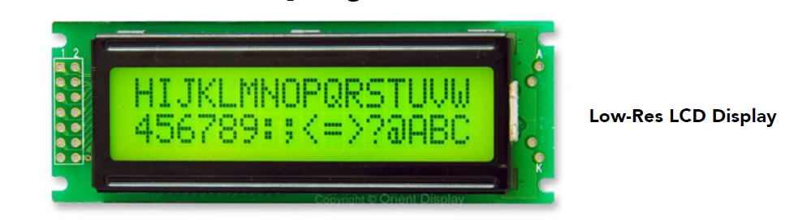
   - LCD（Liquid Crystal Display, 液晶显示器）像素
   - LED 阵列显示器
   - 电泳（电子墨水）显示器
   - 智能手机屏幕像素（特写）
     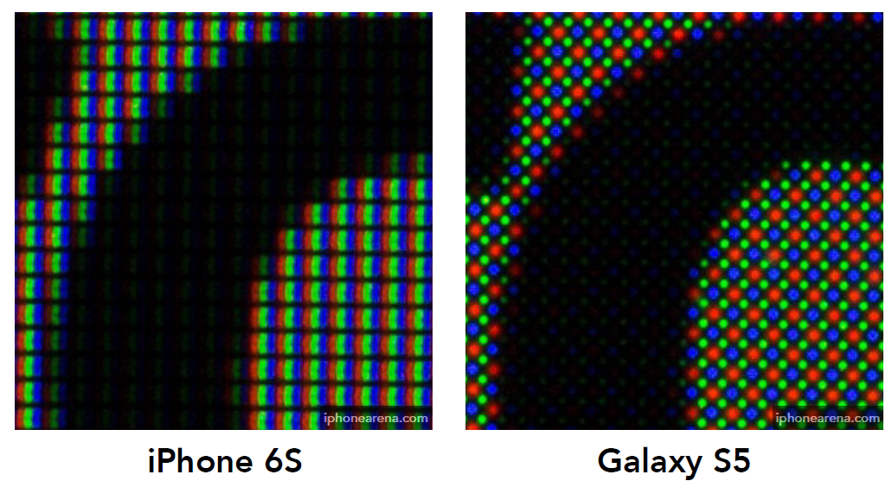

### 2.2 图形 → 光栅显示(光栅化)

1. 多边形网格
2. 三角形网格
3. 外形基元(Shape Primitives)
   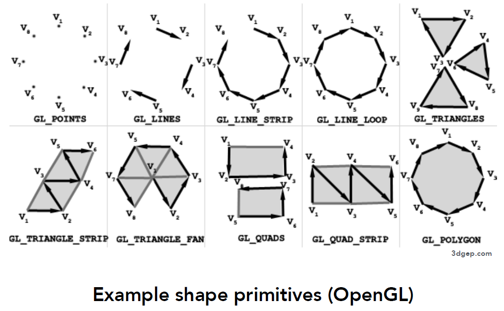
4. 渲染管线 = 抽象的绘图机器
   - 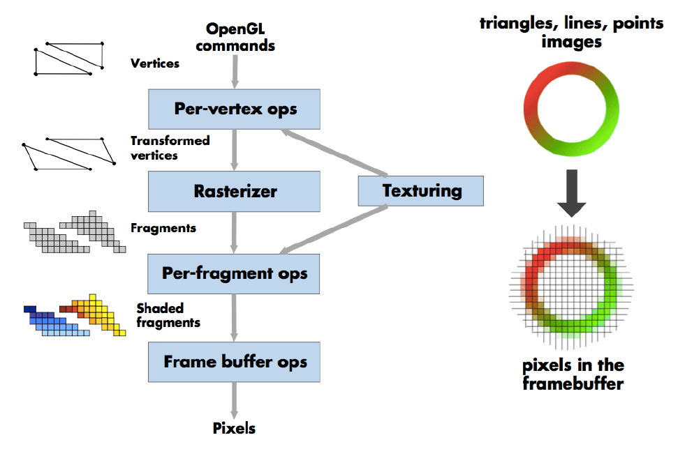
5. 三角形是基础图元
   - 为什么是三角形？
     - 最基本的多边形
     - 可以分解其他多边形
     - 优化易于实现
   - 三角形具有独特的特性
     - 能够确定一个平面
     - 有明确的内外
     - 有优秀的三角形顶点插值方法（==重心插值== ）
6. 如何用像素点绘制三角形
   - 判断像素点中心位置是否在三角形内部, 是则上色
   - 判断点在三角形内部的方法, 点 P, 三角形 p0, p1, p2
     1. 叉乘[简单]: 计算$(\vec{p_0p}\times\vec{p_0p_1}), (\vec{p_1p}\times\vec{p_1p_2}), (\vec{p_2p}\times\vec{p_2p_0}), 若三个叉乘结果\textcolor{#ee0000}{同号}, 证明点在三角形内部$
     2. 点乘
        - 判断点 P 是否在向量 P0P1 的左侧
          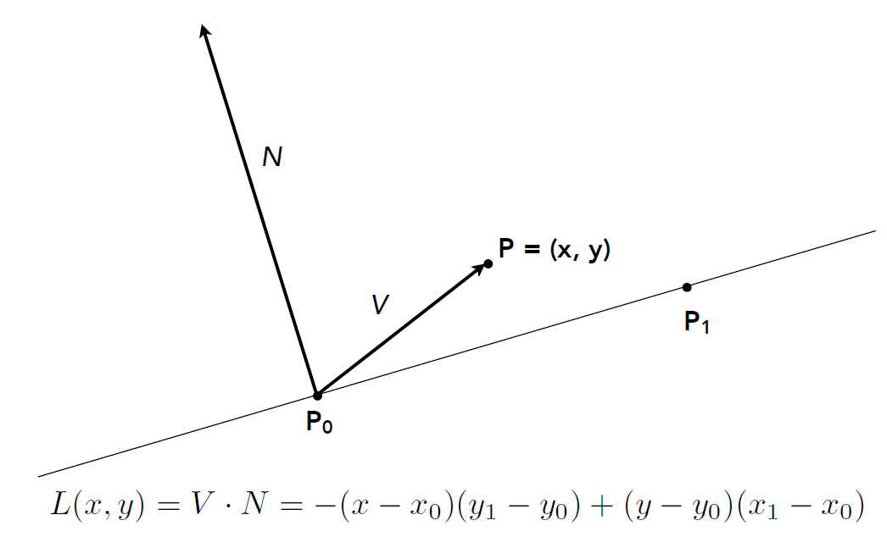
        - $V = P-P_0=(x-x_0, y-y_o); N=Perp(\vec{P_0P_1})=(-(y_1-y_0), x_1-x_0)$
          $L(x, y) = V · N = -(x - x_0)(y_1 - yo) +(y - y_0)(x_1- x_0)$
        - $L(x,y)>0, P与N同向,P在向量左侧; L(x,y)<0, P与N反向向,P在向量右侧$
          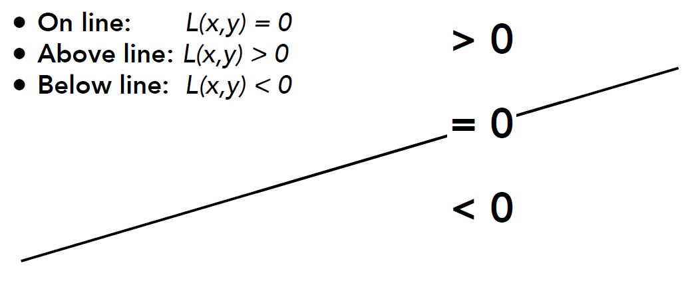
        - 以下图三角形为例, 当$L_0, L_1, L_2均>0(都在左侧), 说明P在三角形内部$
          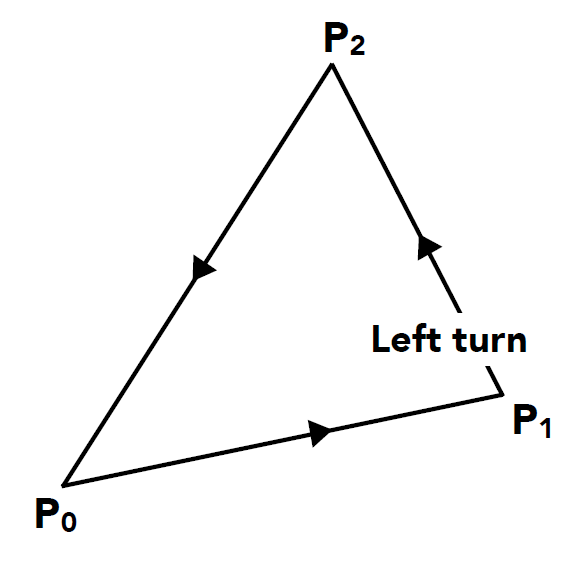

## Lec03 采样&抗锯齿

### 3.1 采样失真

> 图形和成像中的采样失真出现的原因: 采样时出现==“混叠”(aliasing)==

#### 常见的采样失真

- Jaggies – 空间采样失真: 由于对连续信号进行空间采样而引起的图像边缘呈现为锯齿状的伪影。
  - 这种现象通常发生在图像中存在**斜线或曲线**等斜率比较大的边缘区域
  - 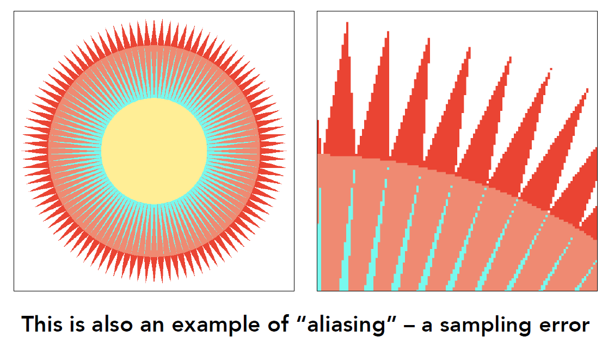
- Wagon wheel effect – 时间采样失真: 由于对连续信号进行时间采样而引起的旋转物体出现不自然停顿或者倒转的伪影。
  - 这种现象通常发生在**旋转速度较快**的物体上，由于时间采样频率不够高，导致物体的旋转周期被错误地还原成了更短的周期，从而产生了不自然的效果。
  - 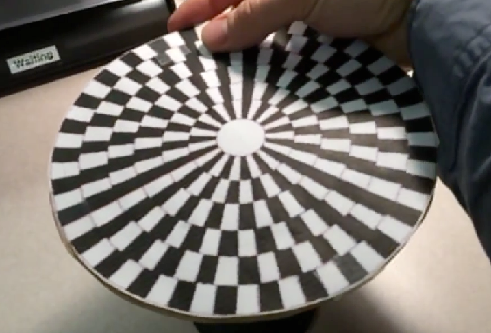
- Moire – 图像或纹理图案的欠采样: 由于对图像或者纹理图案进行欠采样而导致的伪影。
  - 当图像或者纹理图案的频率高于采样率时，就会出现 Moire 现象，这种现象表现为图案中出现了非期望的条纹或者网格状图案。
  - 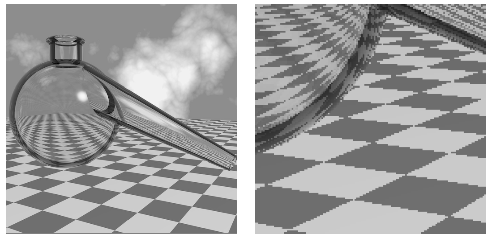

### 3.2 抗锯齿 ① 滤高频

> 思路: 在进行采样之前, 先对图形进行预处理, 滤除高频信号

- 直接采样
  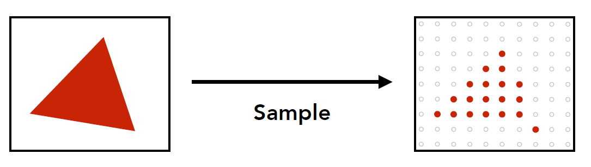
- 过滤
  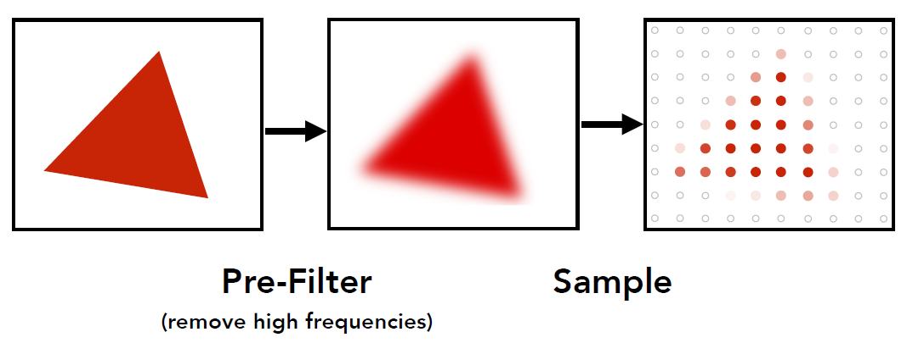

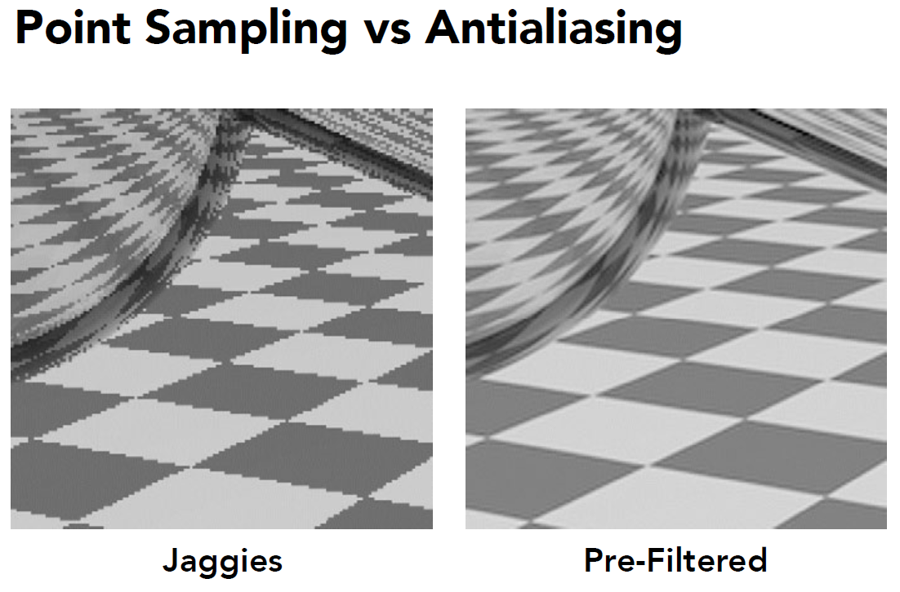

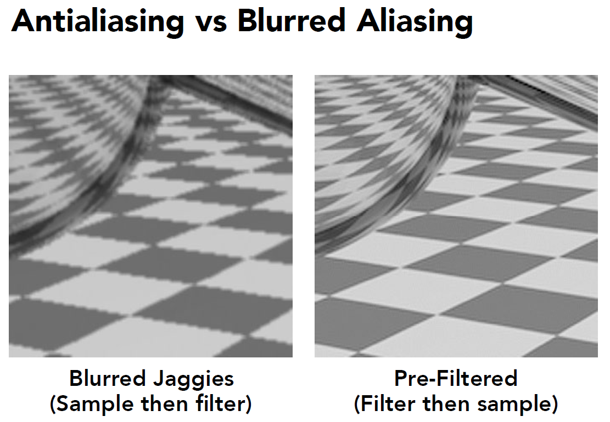

> 那么, 什么是混叠(aliases), 为什么对高频进行过滤就能解决混叠, 如何进行 pre-filter

#### 3.2.1 频率空间(频域)

1. 傅立叶级数展开: 任意一个复杂的波, 都能分解为一系列正弦/余弦函数+常数项的线性组合
   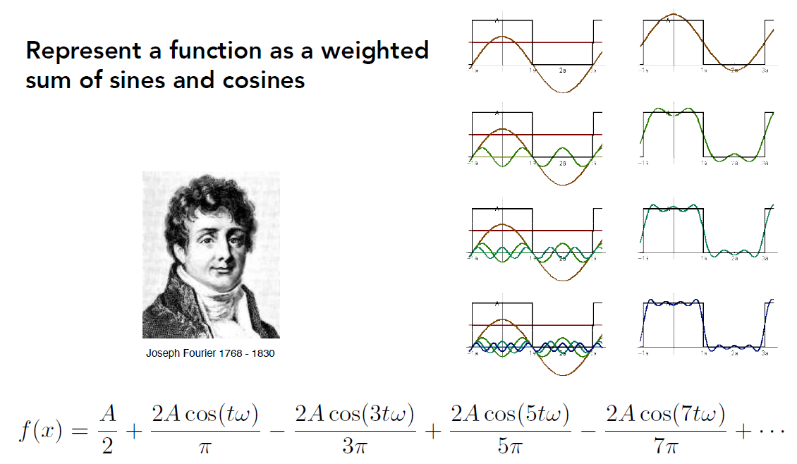

2. 傅立叶变换: 将信号(spatial domain 图片)转换为频率(frequency domain)

   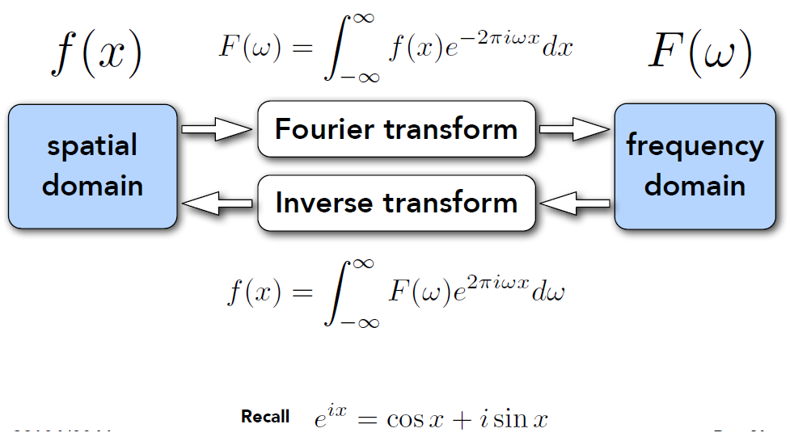

   - 傅立叶变换通常的形容是 时域(坐标轴为 time)↔ 频域(坐标轴的频率)之间的变换
     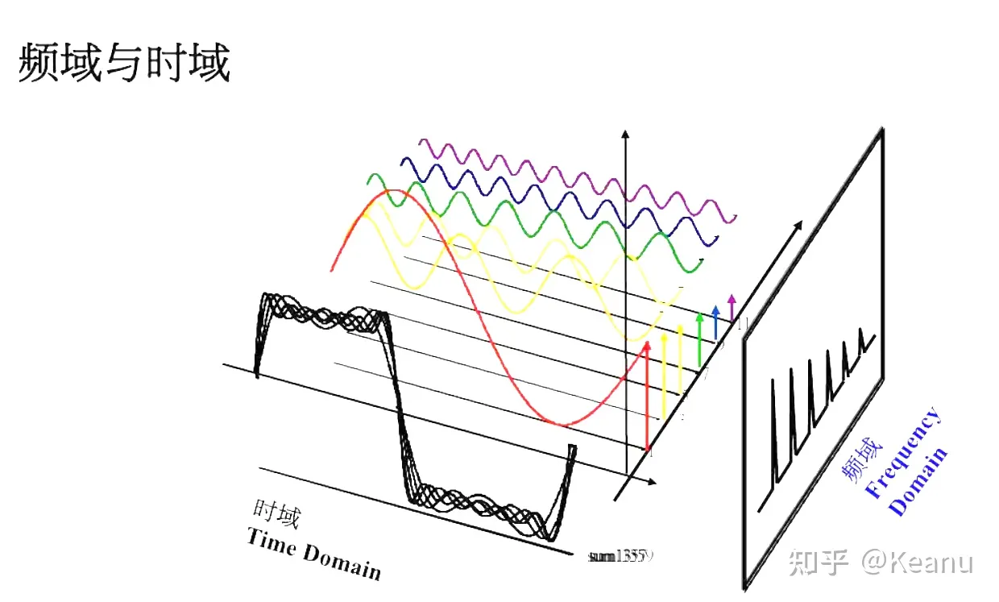
     从上图中可看出，时域和频域其实就是观察函数变换的不同角度，时域的自变量是时间，表示函数随时间的变化关系，**频域的自变量（x 轴）是频率 y 轴是振幅，表示振幅随频率变化的关系。从图中可以看到，刚刚那个可以被展开的函数 f(x)的特性：频率越大的振幅就越小，即不同频率满足不同函数关系。**

3. 如图, 按照频率分解成多个余弦函数

   - 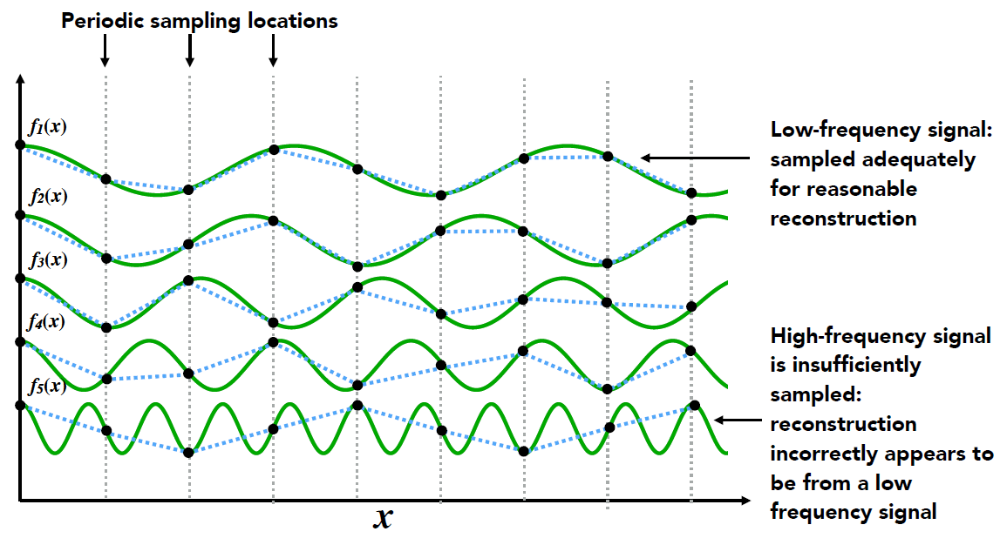图上的竖线即为我们的采样点, 当采样频率低了, 高频部分(f5)就会有损失

4. 欠采样(undersampling)造成**频率的混叠**

   - 如图, 采样频率不够时, 会将高频信息错误的采集成低频信息
     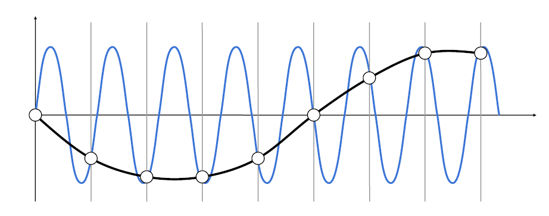
   - 时域上的采集走样, 变换到频域上就是频谱的混叠
   - 而图形学上的渲染, 实际上是对连续函数(图像中的几何关系，着色参数，以及着色方程等) 在空间内进行离散的采样，而这个函数包含的**频率范围是无限的**，意味着不论用多大的采样频率都无法完美恢复原始信号(图形分辨率有限)，所以会造成频谱的混叠，形成走样，这个无法避免，所以在图形渲染中能做的是利用各种技术去减轻走样。

#### 3.2.2 Filtering 的实现

> $Filtering = ①图片\stackrel{傅立叶变换}\Longrightarrow 频域 ②去除某些频率内容$

1. 如下图, 左边就是图片(空间域), 右图是傅立叶变换, 得到的频域
   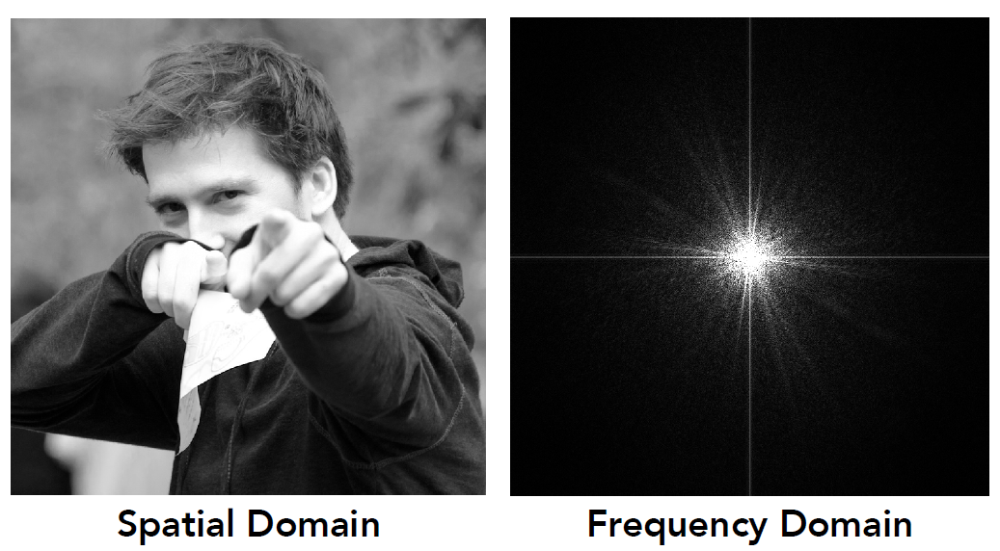
2. 我们现在观察一下高频部分(把低频滤掉)
   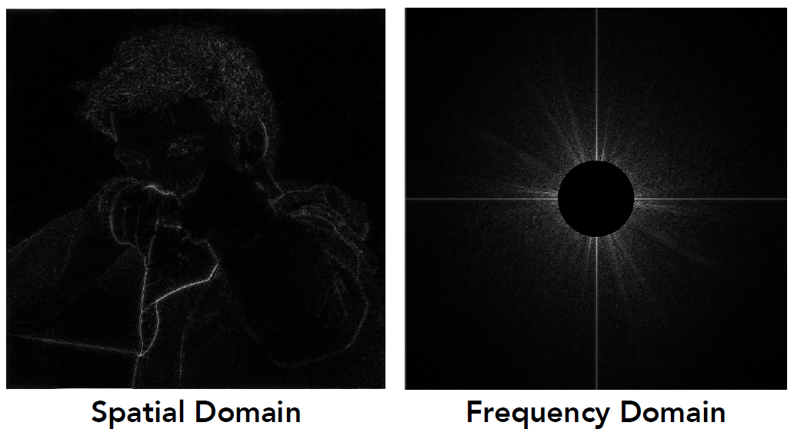
   - 在右图中可以更直观的看到高频部分, 也中心黑色圆之外的剩余部分
   - 而到了左图, 留下的高频就是边界(因为边界色差大, 变化幅度大, 相应的频率也大)
3. 这次滤掉高频
   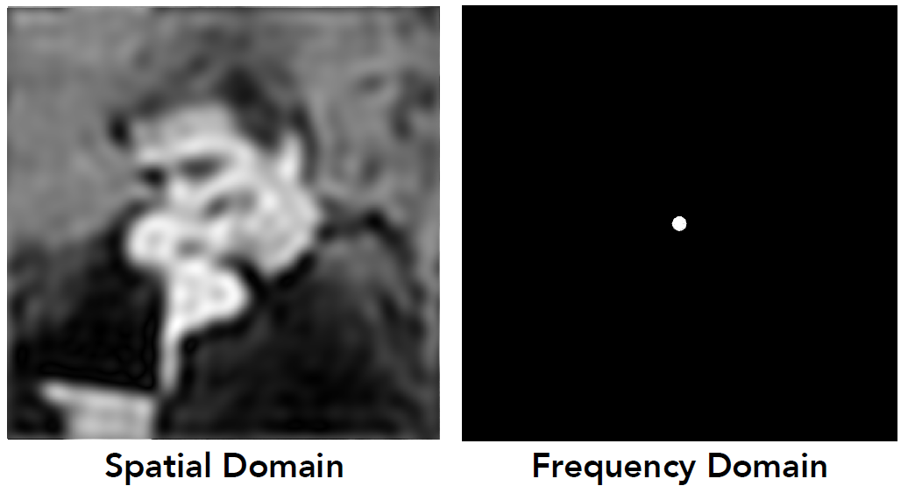
   - 在左图中, 此时看到的就是边界消失(模糊)了
4. 滤掉高频和低频, 观察剩余部分
   1. 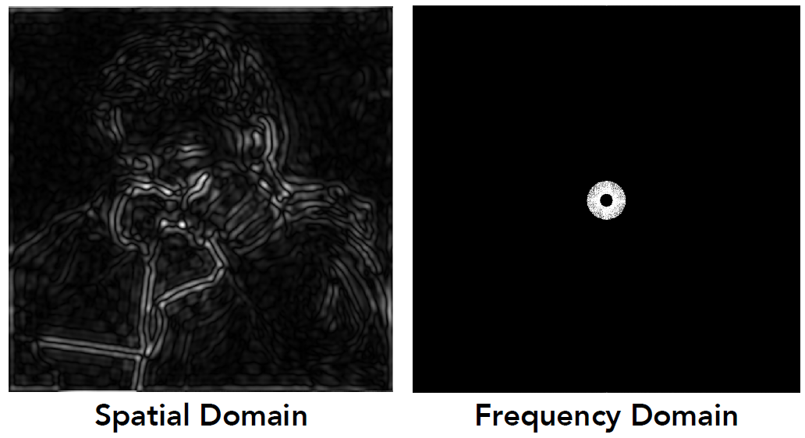
   2. 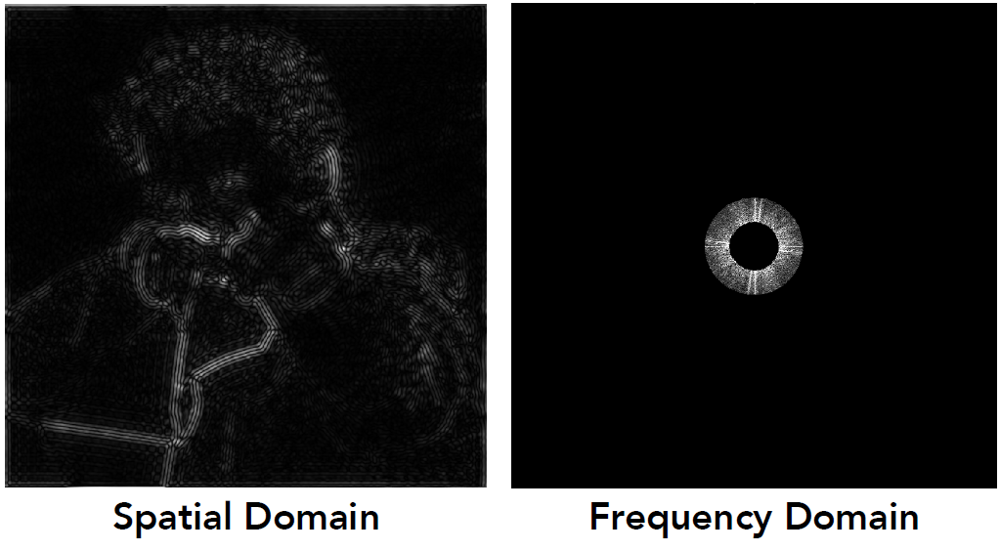

##### Filtering-卷积(Convulsion)

> 正如前面提到的, 高频部分在图像中的具体体现就是**边界部分**, 那么我们可以通过卷积来减少像素点之间的区别, 以消除高频

1. 初步的卷积介绍
   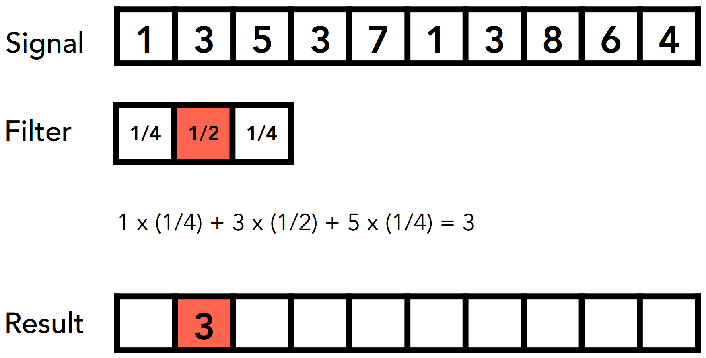

   - 如图, 对于 Signal[1]=3, 用权重(1/4, 1/2, 1/4)进行卷积计算
     - [卷积 Convolution 原理及可视化 - 知乎 (zhihu.com)](https://zhuanlan.zhihu.com/p/76606892)

2. 连续的卷积
   - 定义: $(f_{1}\ast f_{2})(t):=f_{1}(t)\ast f_{2}(t):=\int_{-\infty}^{+\infty}f_{1}(\tau)f_{2}(t-\tau)d\tau:=\int_{-\infty}^{+\infty}f_{1}(t-\tau)f_{2}(\tau)d\tau$
3. 卷积定理(卷积的对偶性)
   - ==空间域中的卷积等于频域中的乘法，反之亦然==
   - 选项 1：
     - 在空间域中通过卷积进行滤波
   - 选项 2：
     - 变换到频域（傅立叶变换）
     - 乘以卷积核的傅立叶变换
     - 转换回空间域（傅立叶逆变换）
   - 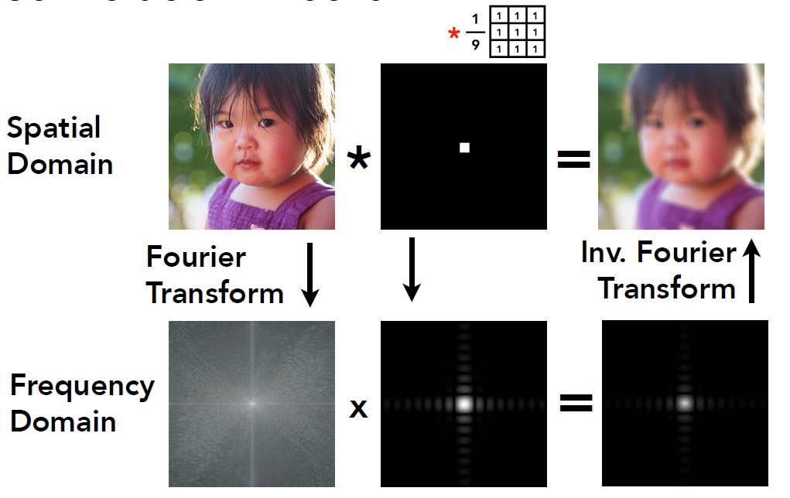

#### 3.2.3 采样与频域

1. 采样的本质: 重复原始信号的频谱
   - 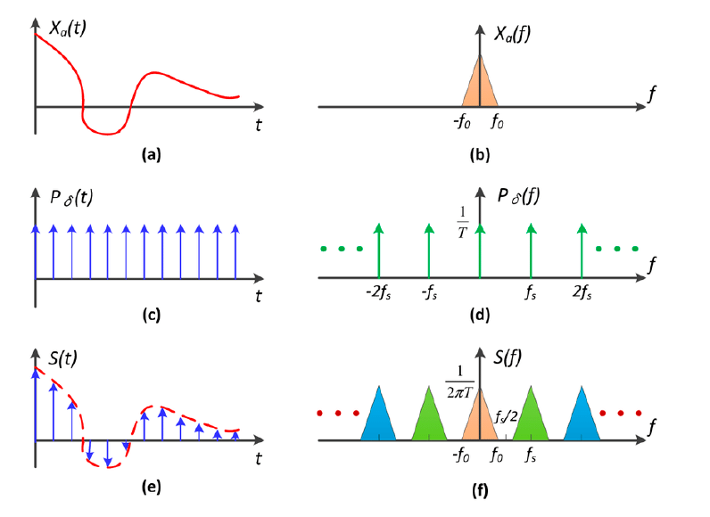
   - 在时域上的采样就相当于在原始信号上乘一个**冲激函数**($\delta(t)=\begin{cases}\infin & t=0\\ 0& t\neq 0\end{cases} $),
     由卷积定理可知, 时域上的乘积结果对应频域上的卷积结果
     - 原始信号(图 a)经过傅立叶变换, 得到结果即为(图 b)
     - 周期为 T(坐标轴为时间 t)的冲激串经过傅立叶变换, 得到的结果仍为冲激串, 周期为 1/T(坐标轴为频率 f)
       - 推导过程看不懂, 这里 cv 的结论: [冲激函数和傅里叶变换\_冲激函数的傅里叶变换-CSDN 博客](http://t.csdnimg.cn/UDhRY)
     - 图 b, 图 d 这两个函数进行卷积, 得到的结果即为图 f ~~我不理解~~
       - [冲激函数与卷积的多次邂逅 - 知乎 (zhihu.com)](https://zhuanlan.zhihu.com/p/574207452)
   - 即采样对应到频域就是在**重复**原始信号的频谱(图 f)。而采样得越慢对应到频谱上得间隔就越小，从而导致了重叠。
2. 下图即为密集采样和稀疏采样在频域中的结果
   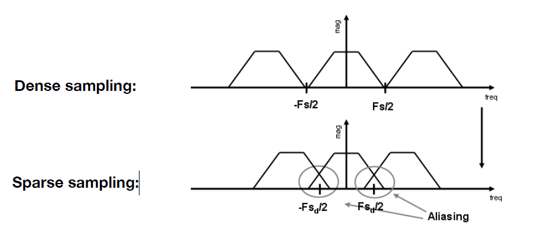
   - 当采样频率不够高时, 原始信号就会出现重叠(即混叠 aliasing)

#### 3.2.4 Pre-Fliter 抗锯齿(Antialiasing)

1. 基本思路: 滤掉高频部分, 留下低频部分, 避免重叠(混叠), 如下图所示
   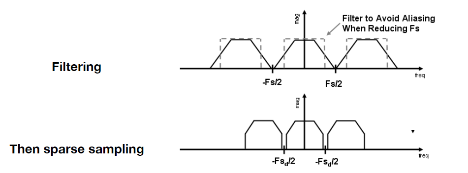

   - 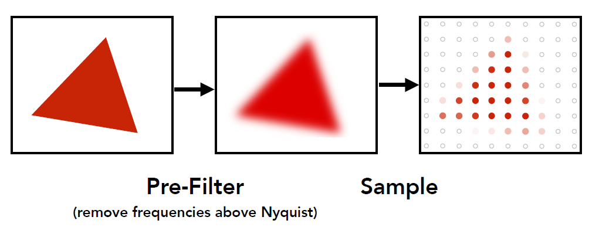

2. 通过在像素点内 average(通常是颜色)实现抗锯齿

   > 首先需要说明, 对于图像上的颜色 f(x, y)
   >
   > 1. 使用一个 3\*3pixel 大小的卷积核, 对一个像素进行卷积操作, 采样结果
   > 2. 直接计算每个像素点内 f(x,y)的平均值, 采样结果
   >
   > 上面两种方式是==等价的==

   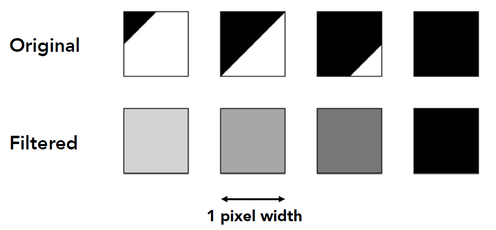

### 3.3 抗锯齿 ② 超采样

#### 锯齿

**我们用有限离散的像素点去逼近连续的三角形**，那么自然会出现这种锯齿走样的现象，即在采样的时候的频率过低无法跟上图像的频率，导致最后结果的失真

#### SSAA

1. SSAA: Super-Sampling Anti-Aliasing 超采样抗锯齿, **全局抗锯齿技术**, 对图像进行高精度渲染, 然后再 average, 缩小到所需分辨率
2. 实现步骤
   1. 将每个像素点细分成了 4 个采样点（X2 抗锯齿）
   2. **得到了每个采样点的颜色**
   3. 将每个像素点内部所细分的采样点的颜色值**求均值**，作为该像素点的抗锯齿之后的颜色值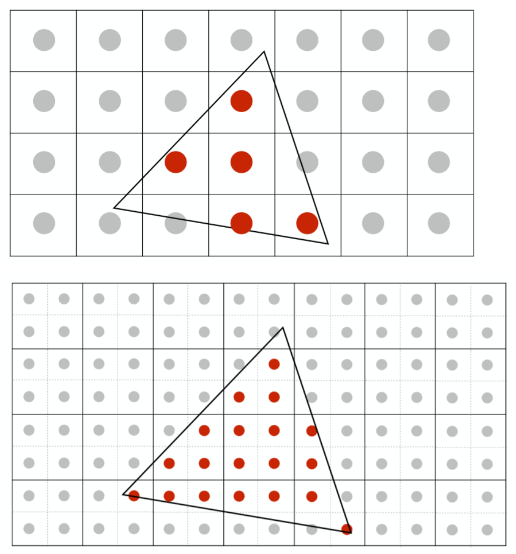

#### MSAA

> 对 SSAA 的一个改进，X2 的 SSAA 的**计算量**是原来的四倍, 开销较大

1. MSAA: Multi-Sampling Anti-Aliasing ==多重采样反走样== , **局部抗锯齿技术**, 只对选定的特定像素进行超采样(采样指的是计算颜色)
2. 实现方式
   1. MSAA 在细分采样点后，先判定**采样点是否被三角形覆盖**(先不计算颜色)
   2. 计算大像素点颜色值时, 只用到在三角形内的小像素点颜色值去计算, 减少计算量

> 此处有作业 1

## Lec04 基础变换（Transformation）

> 为什么需要变换(Transformation)?
>
> - 建模
>   - 在方便的坐标中定义形状
>   - 允许同一对象的多个副本
>   - 高效地表示分层场景
> - Viewing
>   - 场景坐标到相机坐标
>   - 从 3D 到 2D 的平行/透视投影

### 4.1 2D 变换 ※

#### 4.1.1 缩放（Scale）

缩放变换是一种沿着**坐标轴作用**的变换

$\begin{bmatrix}x'\\y'\end{bmatrix}=\begin{bmatrix}s_x & 0\\ 0 & s_y\end{bmatrix}\begin{bmatrix}x\\y \end{bmatrix}$

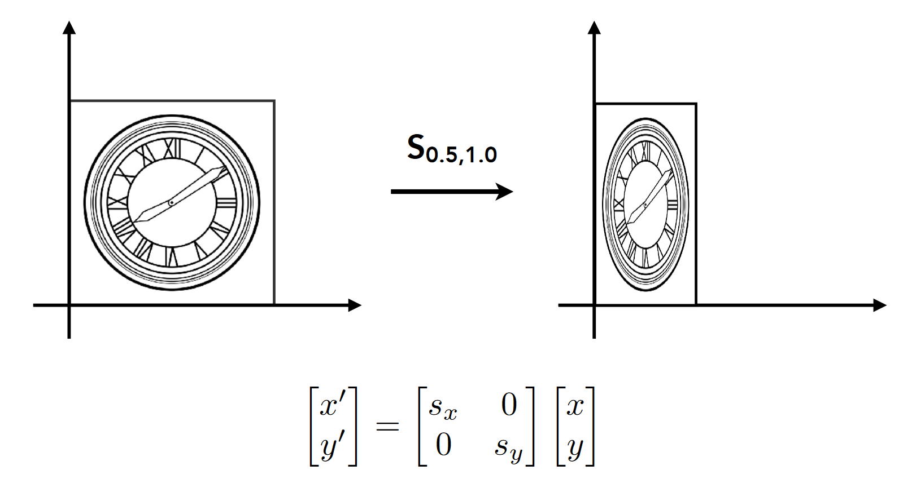

#### 4.1.2 反射（Reflection）

反射变换是缩放的一个特例
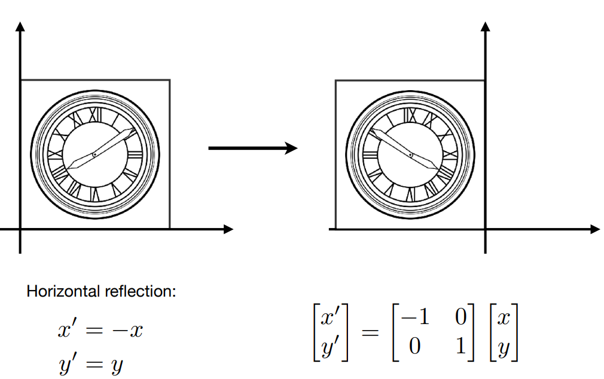

- -x, 沿 y 轴对称

#### 4.1.3 错切（Shear）

直观理解就是把物体一边固定，然后拉另外一边（ps 有这个功能吧，好像其他几个也有）

如果是沿着 x 轴拉伸的就是 shear-x 矩阵，y 轴拉伸就是 shear-y 矩阵

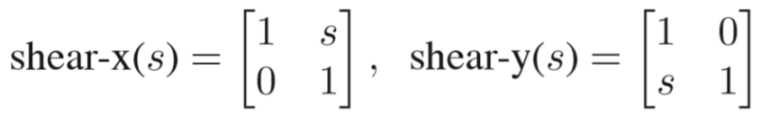
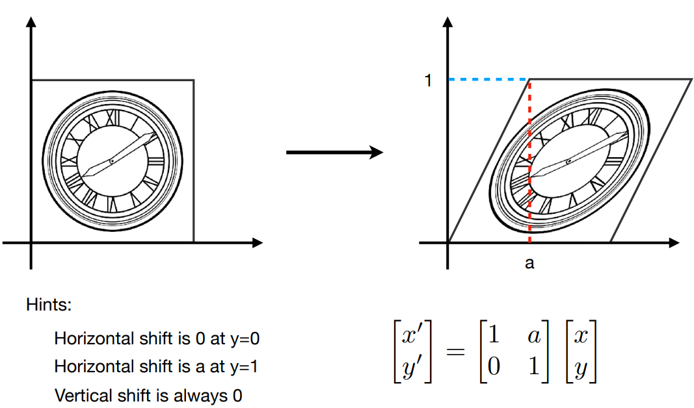

#### 4.1.4 旋转（Rotate）

旋转变换是以**原点为旋转中心**的变换

$R_\theta = \begin{bmatrix}cos\theta&-sin\theta\\sin\theta & cos\theta \end{bmatrix}$

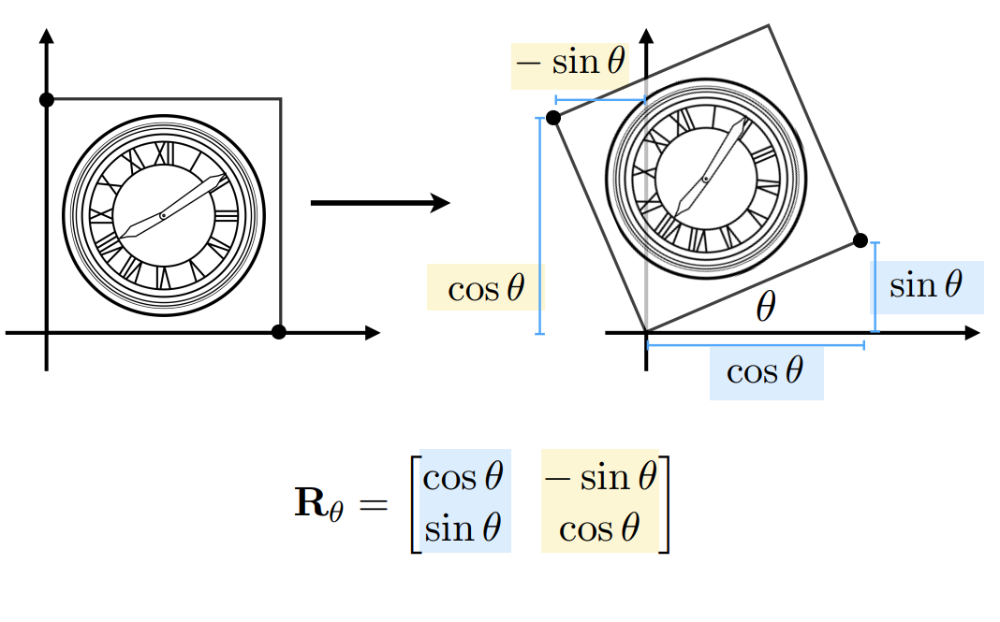

#### 小结

上面的变换都是线性变换, 可以用一个矩阵表示(矩阵乘法的几何意义)

$\begin{array}{c}{{x^{\prime}=a\,x+b\,y}}\\ {{y^{\prime}=c\,x+d\,y}}\end{array}\Rightarrow \begin{bmatrix} x'\\y'\end{bmatrix} =\begin{bmatrix}a&b\\c&d \end{bmatrix}\begin{bmatrix}x\\y \end{bmatrix}\Rightarrow p'=Mp$

#### 4.1.5 位移(translation)

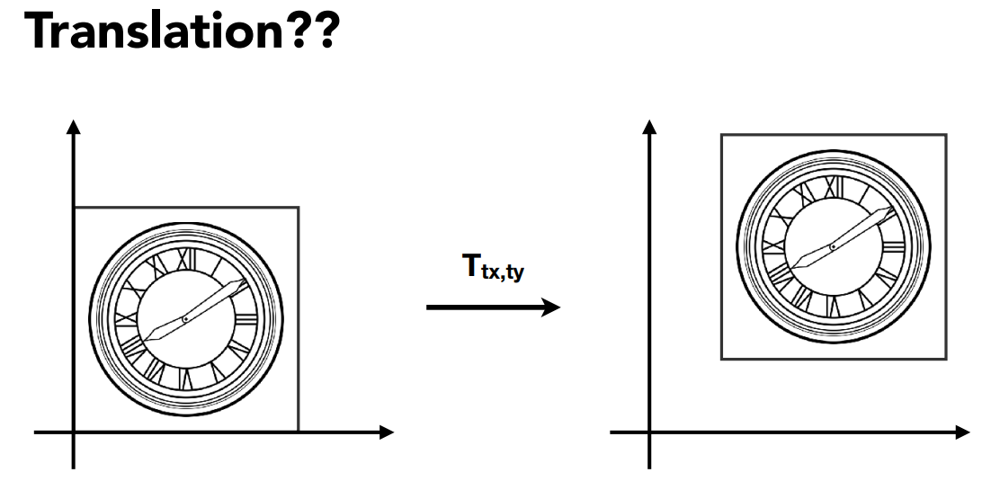

$\begin{bmatrix} x'\\y'\end{bmatrix} =\begin{bmatrix}a&b\\c&d \end{bmatrix}\begin{bmatrix}x\\y \end{bmatrix}+\begin{bmatrix}t_x\\t_y \end{bmatrix}$

这种变换并不是线性变换，与前面几种相比，很特殊

如果我们不希望这种变换十分特殊，有什么办法吗

### 4.2 齐次坐标 (Homogenous Coordinates)

1. 齐次坐标: 为 2D 的点和向量添加一个维度

   - $2D\ point = (x, y, \textcolor{red}{1})^T$

   - $2D\ vector = (x, y, \textcolor{red}{0})^T$

2. 齐次坐标的性质

   - vector + vector = vector (0+0=0)
   - point – point = vector (1-1=0)
   - point + vector = point (1+0=1)
   - point + point = ??
     - 特别规定, 在齐次坐标中, $(x, y, w)^T是一个2D点(x/w,y/w, 1)^T, w\neq0$

3. 现在, 可以用齐次坐标表示所有的 2D 变换和矩阵

   - $\begin{bmatrix} x'\\y'\\1\end{bmatrix} =\begin{bmatrix}a&b&t_x\\c&d&t_y\\0&0&1\end{bmatrix}\cdot\begin{bmatrix}x\\y \\1\end{bmatrix} $

4. 在齐次坐标下，所有的变换矩阵变为
   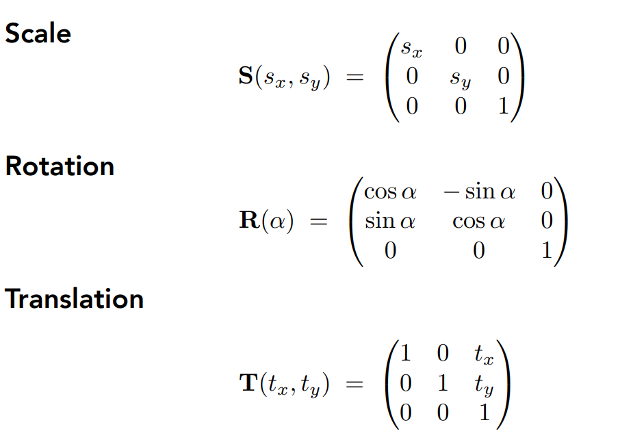
   - 通过这样的方式，一些组合的变换就可以用矩阵相乘的方式表达
5. 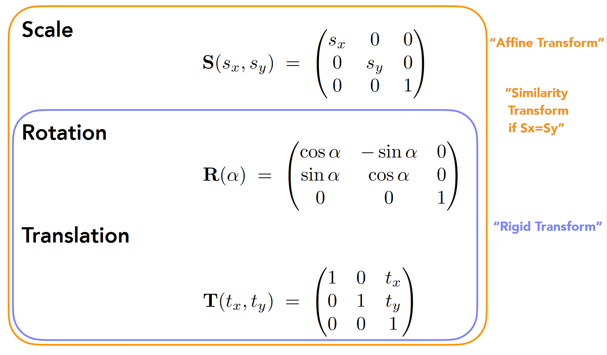 
   - Rigid Transform: 刚体变换
   - Affine Transform: 仿射变换
     - 若Sx = Sy，则进行相似变换(大小缩放)
   - 其他矩阵被称为 Projective Transform 投影变换
6. 逆变换与矩阵的逆 (矩阵逆预算的几何含义)
   - 如下图, 将图像用 M 进行投影变换, 再用 M^-1^进行一次投影变换, 就能获得原图像
     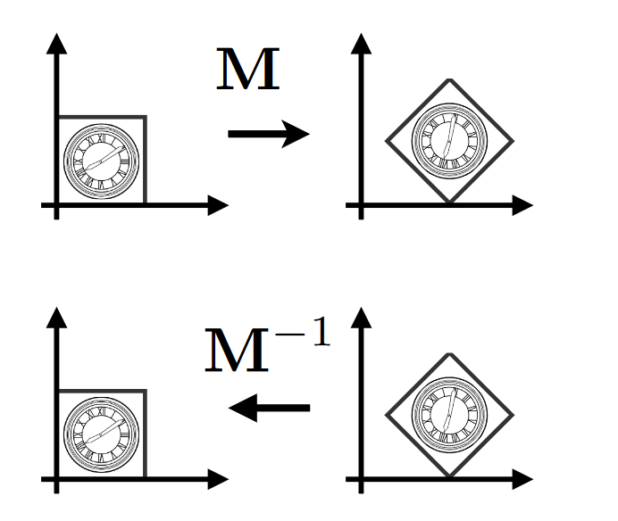
7. 复杂的变换就可以拆分成几个简单的变换, 然后改写为矩阵相乘

   - 但特别需要注意的是，矩阵的乘法是不可交换的（如下图所示）, 顺序是从右到左(离向量近的先乘)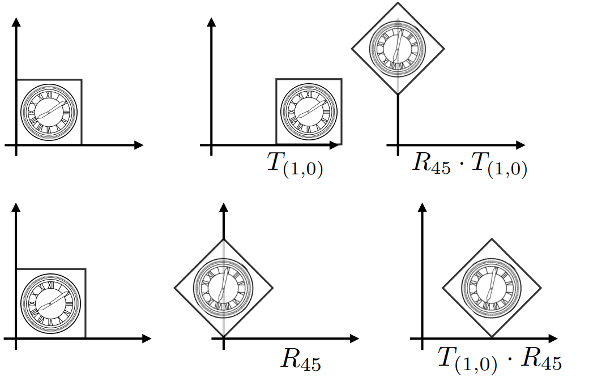

8. 例: 绕点 c 旋转
   - 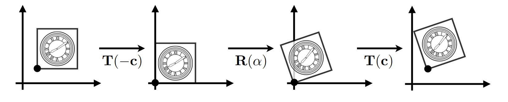
   - ① 根据 c 点, 位移到原点 ② 旋转 α ③ 位移回 c 点处

### 4.3 3D 变换

1. 3D 的表示方法: 同样采用齐次坐标表示

   - $3D\ point = (x, y, z, \textcolor{red}{1})^T$

   - $3D\ vector = (x, y, z, \textcolor{red}{0})^T$
     - 注意: 与 2 维的齐次坐标点不同, $(x, y, z, w)^T是一个3D点(x/w,y/w, z/w)^T, w\neq0$

2. 3D 中的变换
   - 
   - 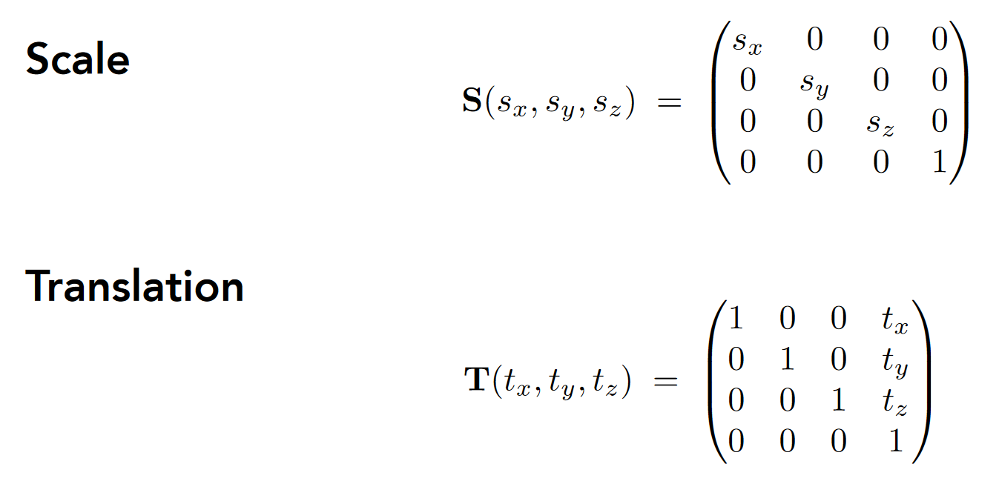
3. 3D 绕轴旋转
   - 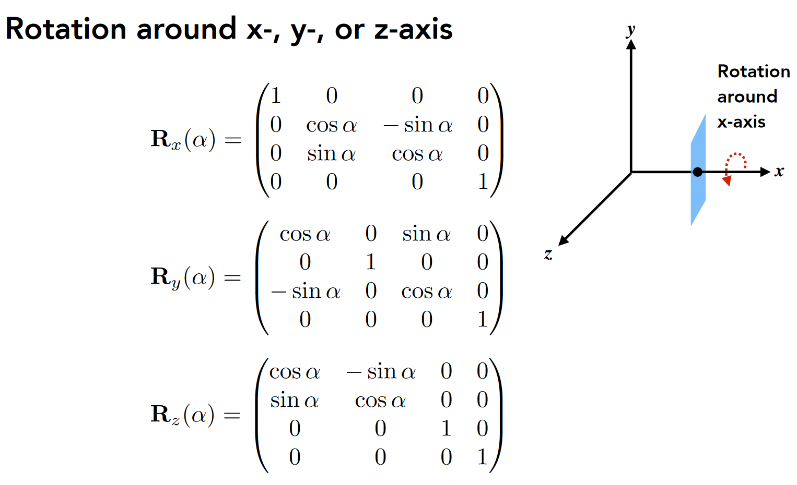
   - 复杂的旋转变换也就是在 x,y,z 轴上进行旋转的复合 $R_{xyz}(α, β, γ)=R_x(α) R_y(β) R_z(γ)$
4. 绕点旋转
   - 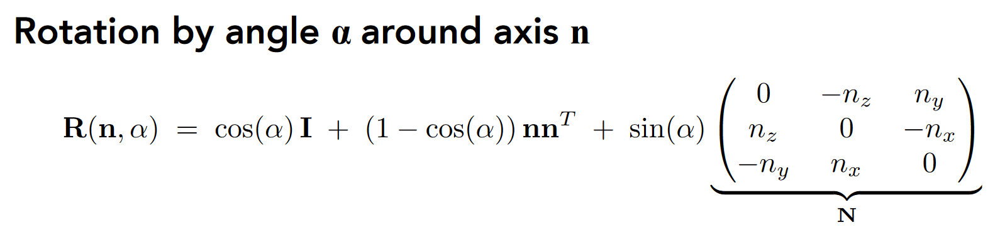
   - 简化计算: Rodrigues’ Rotation Formula
     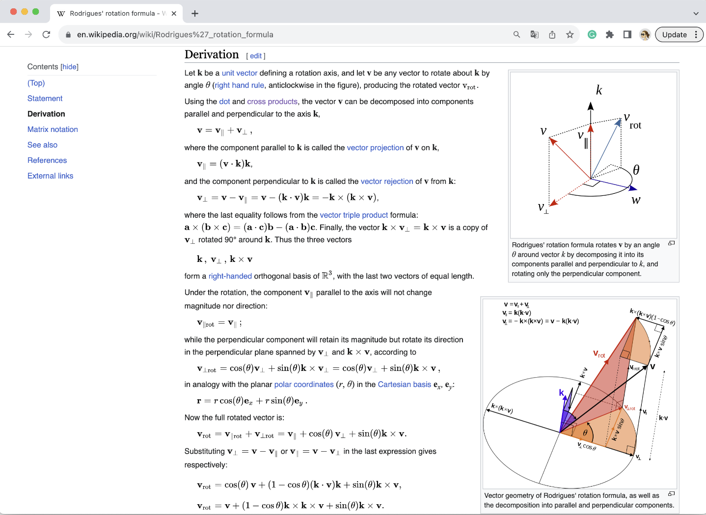

#### 层次变换 (Hierarchical Transforms)

**层次表示法（Hierarchical Representation）**

将组中的模型用树的形式存储

1. 每个组包含子组和/或形状
2. 每个组都与一个相对的父组
3. 叶节点形状上的变换是所有在从根节点到叶节点的路径上进行的变换共同影响的

以一个人的模型为例
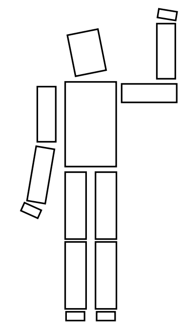

该模型有数个方块组成，如：头身体，上半部分左手臂，下半部分左手臂，左手掌等等

因此我们可以把一个人分为头，左手，右手，身体，左腿，右腿
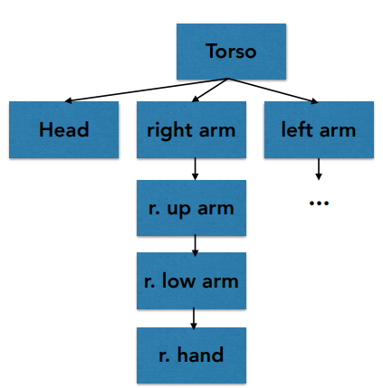

这样在进行变换的时候，可以通过仅仅改变父结点来实现整个手臂的挥动，这种模式经常用于人体建模的骨骼部分，如果我们要模拟一个人的走路动画，可将骨骼用层次表示法来分级，便于更改

### 4.4 视图变换（Viewing Transformation）

#### 4.4.1 模型变换(modeling tranformation)

将世界中的物体调整到其应在位置

用基础的变换矩阵将世界当中的物体调整(旋转，平移，缩放)
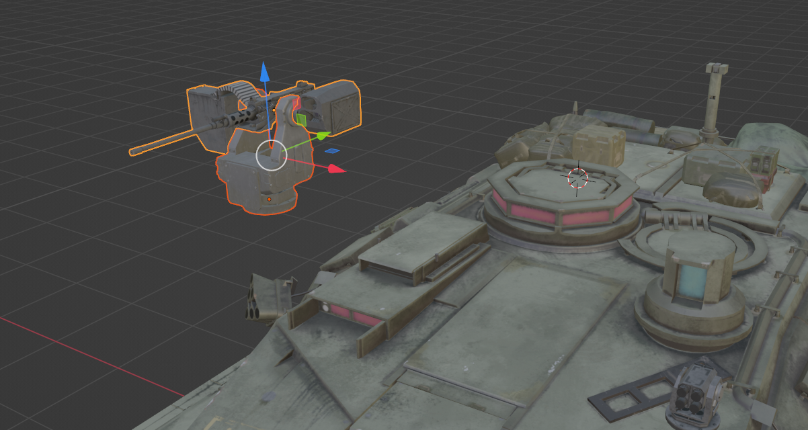 $\Longrightarrow$ 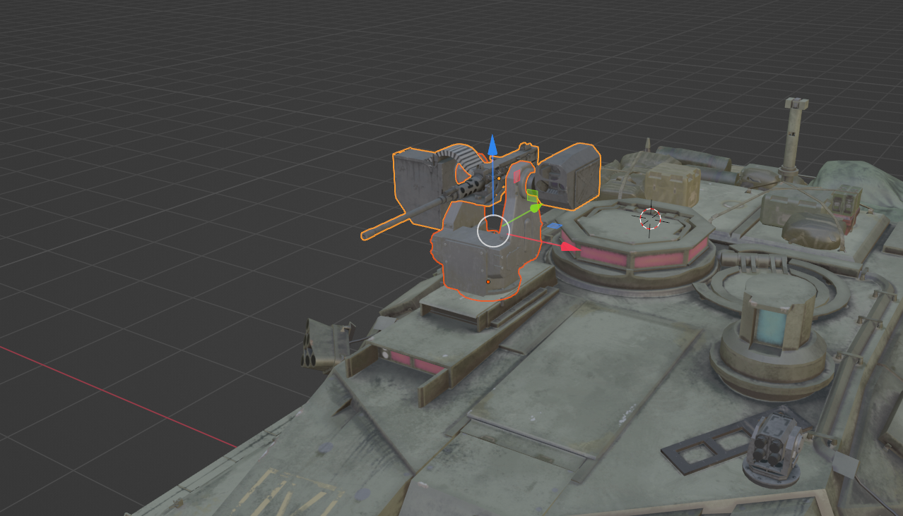

#### 4.4.2 相机变换(camera tranformation)

调整相机的位置以得需要的所有可视物体与摄像机的相对位置

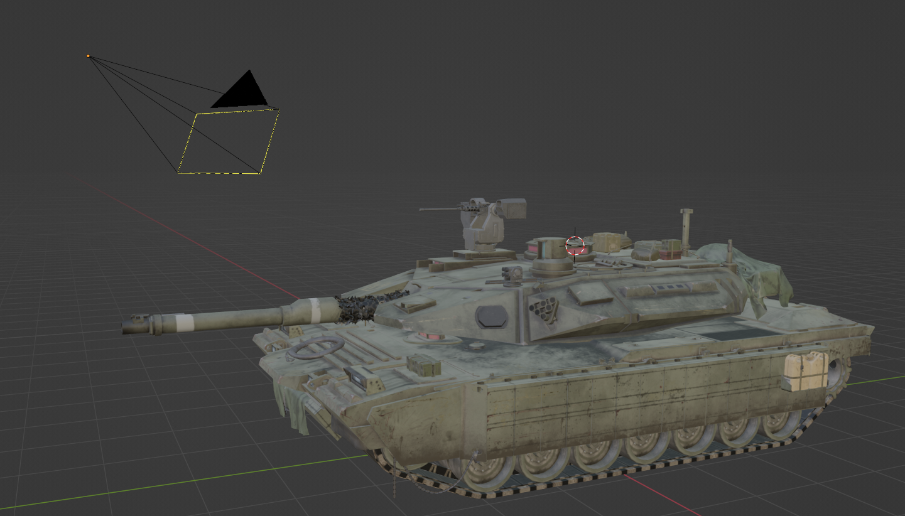 $\Longrightarrow$ 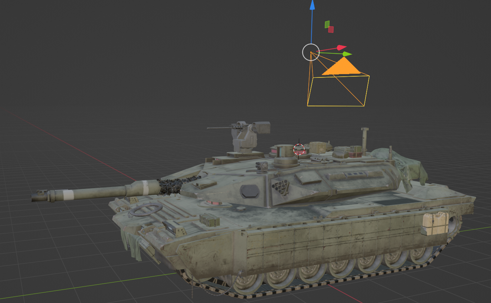

关于摄像机，有以下几个标准

- 位置在原点，e(0,0,0)；
- 朝向坐标轴 -z 轴方向，g = -z；
- 向上的方向是 y 轴方向，t = y；
- 场景中模型的变换都围绕原点的摄像机进行；

> 将摄像机移到原点, 并作为场景中的坐标系

1. 对摄像机进行定义

   - **位置**：用向量 $\vec e$ 表示
   - **朝向**: 用向量 $\vec g$ 表示
   - **与视角方向垂直向上的方向**: 用向量 $\vec t$ 表示
   - 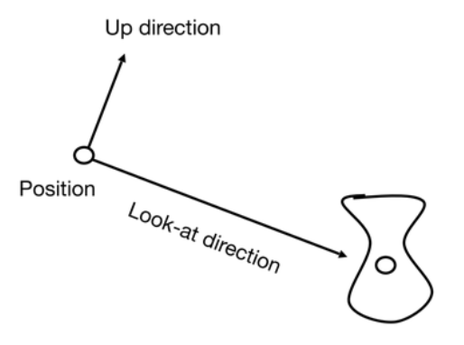

- ==注意== : 三者此时并不是互相垂直的关系，因此需要进一步建立坐标系

   

2. 建立摄像机的坐标系
   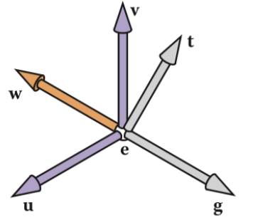 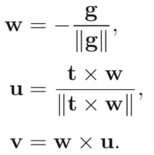

3. 将相机位置移动至原点($T_{view}$)，得出变换矩阵应用到场景中的物体

4. 旋转摄像机, 使其与坐标系重合($R_{view}$)

5. 得出变换矩阵($M_{view}=R_{view}T_{view}$), 应用到场景中的物体

   - 视图变换复合矩阵：$M_{view} = R_{view}T_{view}=\begin{bmatrix}x_{g\times t}&y_{g\times t}&z_{g\times t}&0\\x_t&y_t&z_t&0\\x_{-g}&y_{-g}&z_-g &0\\0&0&0&1\end{bmatrix}\begin{bmatrix}1&0&0&-x_e\\0&1&0&-y_e\\0&0&1&-z_e\\0&0&0&1 \end{bmatrix}$

#### 4.4.3 投影变换(projection tranformation)

1. ==投影变换== : 将 3D 场景中的物体投影到 2D 投影面上
2. 投影的分类:
   - 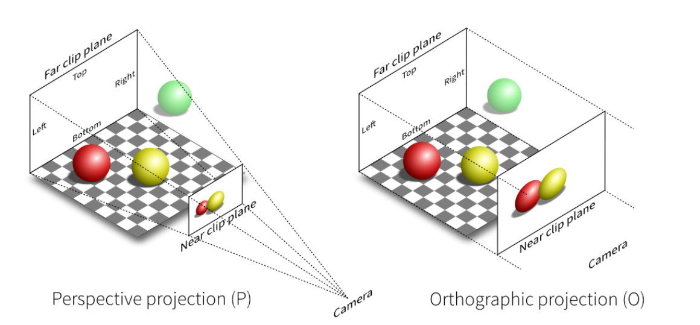
   - 如上图所示, 根据相机和光路进行区分, 分为==正交投影== 和==透视投影==

##### 正交投影（Orthographic Projection）

1. 正交投影:

   - 所有光线都是==平行传播==
   - 相机位于原点，看向-Z 方向，Y 方向为上
   - 重叠 Z 坐标
   - 将得到的矩形平移并缩放到$[ - 1 , 1]^2$
   - 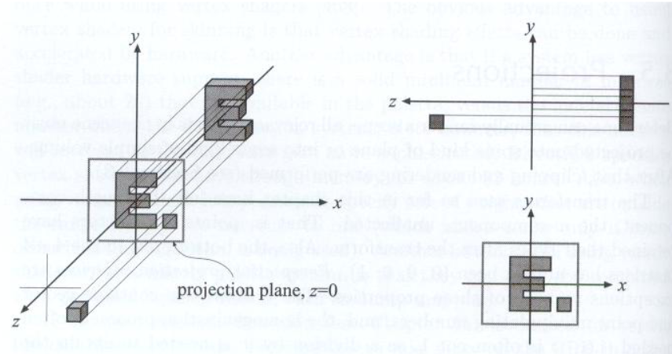

2. 正交变换矩阵

   - 我们只需将物体全部转换到一个标准立方体中就可以(转换为 NDC 坐标, Normalized Device Coordinates)，**所有物体的相对大小位置都不会有任何变化**
     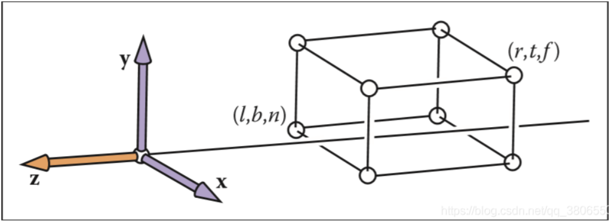

   - 变换步骤
     1. 将物体中心移到(Translate)原点
     2. 缩放(Sacle)
     3. 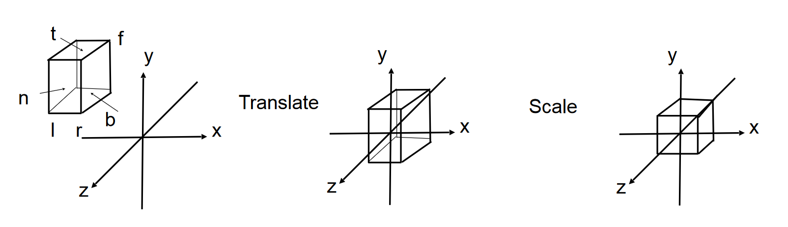
   - 变换矩阵
     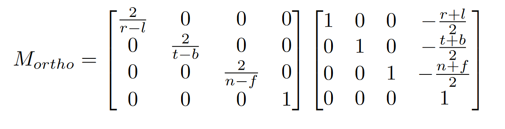
     - 将物体变换为 2\*2\*2, 中心在坐标系原点的立方体

##### 透视投影（Perspective Projection）

1. 透视投影： 类似人眼所看东西的方式，遵循近大远小
   

   标准透视投影

   - 物体中心位于(0, 0, 0)^T^
   - 投影面位于 z=d 处

2. 透视投影中很重要的一点就是，在原场景中的点(x,y,z)，经过压缩后的 x'和 y'都可以很容易通过相似三角形得出，但是 z 却很容易被当成不变的（即认为透视投影不改变物体的深度)，但是这是完全错误的，变化后的 z'在此时其实是一个未知量。**为什么 z'未知？**

   首先，透视投影规则如下：
   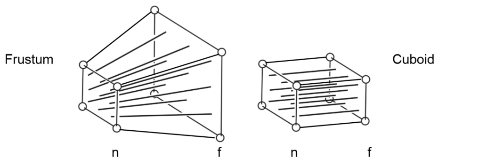

   透视投影只能确定四棱台压缩后的总长度不变（即 n-f），并不知道 n-f 这段距离中的某一点的深度是否有变化，但是根据透视投影的规则，我们至少可以确定，在原场景中的点(x,y,z)，z 在经过透视投影后发生了变化：

   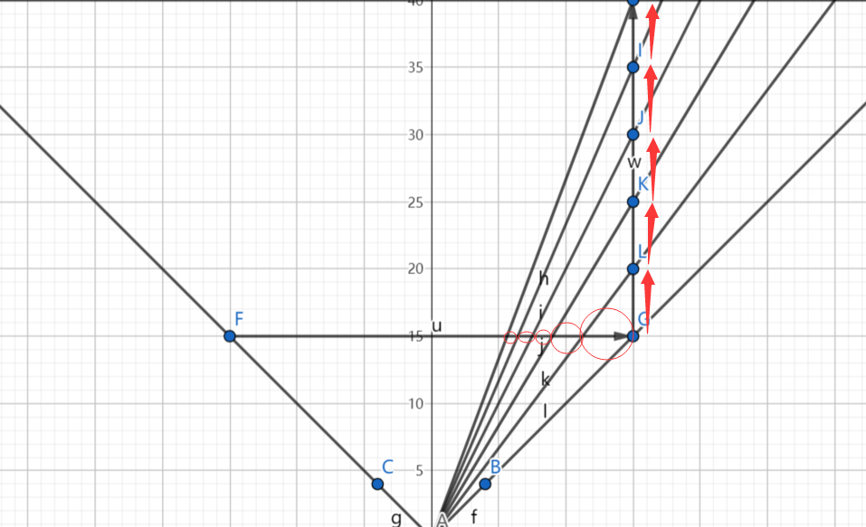
   我们可以看到，对于一个在场景中的恒定长度，经过透视投影后，这段长度（即深度）距离越远，在投影面上的长度就越短，换个人话来说就是，刚刚展示出来的铁轨图，铁轨枕木之间的间隔Δz相等，经过透视投影之后，如果Δz不变，那么枕木之间的Δz也不会变，但是很显然，越远距离的Δz看起来就越小。但是我们并不知道z如何变换，所以在透视投影中z的变化我们暂定为未知。下面这张图就很直观地展现了透视投影对z的影响：
   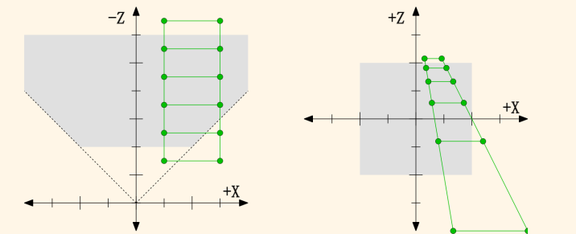

   **因此，在求透视投影矩阵，我们只能暂时将变化后的 z 设为未知量**

3. 透视投影的计算: 将透视投影体(Frustum, 四棱台, 一个截去顶的四棱锥), 映射为立方体(这个立方体的面和棱台顶面相同), 那么我们的目的就是求得这样一个==变换矩阵$M_{persp→ortho}$== 实现映射

   - 在投影时，模型中的一点通过相似三角形的原理进行压缩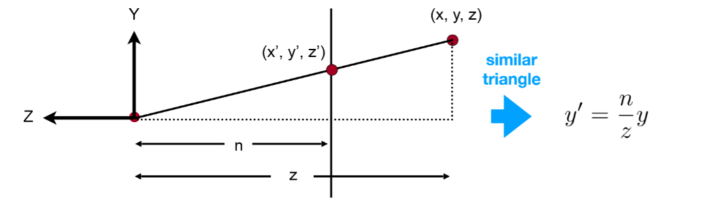

   1. p(x, y, z)为点在场景中的原位置, 图上的竖线即为棱台面, q(x’, y’, z’)为点投影后的位置
   2. 对于齐次坐标$p(x, y, z, 1)^T \stackrel{通过M_{persp}变换}\Longrightarrow (\frac {n}{z}x, \frac {n}{z}y, unknown, 1)^T \stackrel{乘z}{==} (nx, ny, still\ unknown, z)^T$
      - unknown: 因为透视投影的缘故, 深度 z 的映射关系不确定, 这里先定义为未知量 unknown
   3. 那么, 变换矩阵即实现映射 $M^{4\times 4}_{persp→ortho}\begin{bmatrix}x\\y\\z\\1 \end{bmatrix} = \begin{bmatrix}nx\\ny\\unknown\\z \end{bmatrix}, 得M_{persp→ortho}=\begin{bmatrix}n&0&0&0\\0&n&0&0\\?&?&?&?\\0&0&1&0 \end{bmatrix}$
      $又因为x, y的值不会影响z的映射, 设M第三行为(0, 0, A, B), 即M_{persp→ortho}=\begin{bmatrix}n&0&0&0\\0&n&0&0\\0&0&A&B\\0&0&1&0 \end{bmatrix}$
      1. $对于n平面上一点p_n(x_n, y_n,n,1)^T, 映射后的点为q_n(x_n,y_n,n, 1)^T=q(nx_n,ny_n,n^2, n)^T\\
         代入得, M第三行:An+B=n^2$
      2. $对于f平面上一点p_f(x_f, y_f,f,1)^T, 映射后的点为q_f(x_f,y_f,f, 1)^T=q(fx_f,fy_f,f^2, f)^T\\
         代入得, M第三行:Af+B=f^2$
      3. 取$p_n=(0, 0, n, 1)^T$可能更好算? ~~懒得改了~~（反驳：都说了 x，y 的值不影响 z 了前面是啥不都无所谓吗）
   4. $\begin{cases}An+B=n^2\\Af+B=f^2\end{cases}, 解得\begin{cases}A=n+f\\B=-nf\end{cases}$
   5. $\therefore$变换矩阵为$M_{persp→ortho} = \begin{bmatrix} n &0&0&0\\0&n&0&0\\0&0&n+f&-fn\\0&0&1&0\end{bmatrix}$

4. **总结**: 透视投影过程

   1. 将下图所示视锥(frustum 四棱台)使用透视投影($M_{persp→ortho} = \begin{bmatrix} n &0&0&0\\0&n&0&0\\0&0&n+f&-fn\\0&0&1&0\end{bmatrix}$)变换为长方体(Cuboid)
      
   2. 在透视投影后，==再利用一次正交投影== 将空间投影成小立方体

### 4.5 总结

通过本节的学习，我们能模拟出从制作模型到渲染这个过程中的所有变换

1. 应用模型变换，将单个模型对象的坐标转化该模型对象在世界坐标系的坐标
   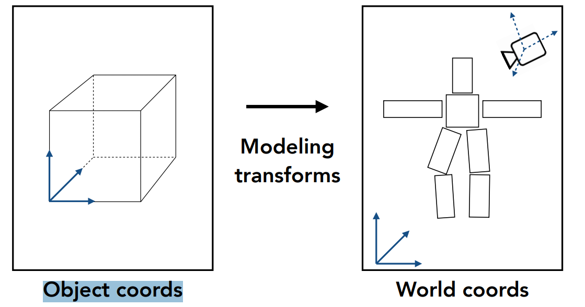
2. 应用视角变换，将世界坐标系转化为摄像机坐标
   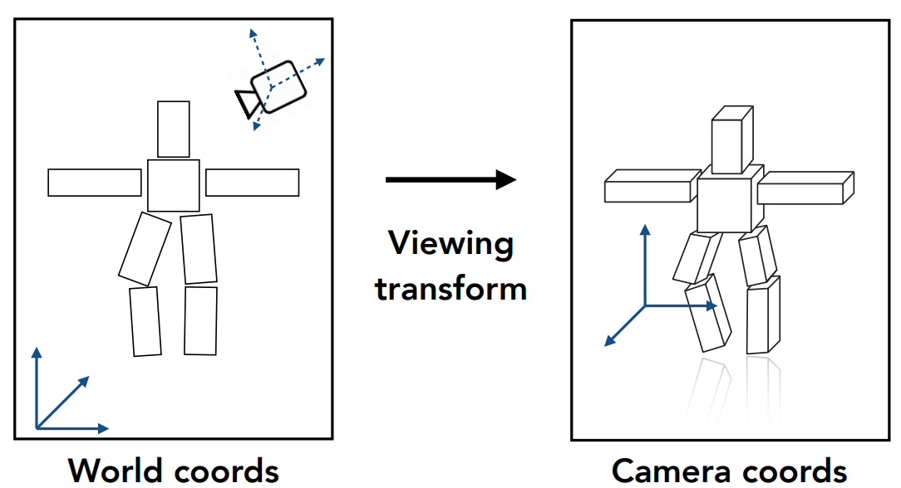
3. 通过透视投影转化为 NDC 坐标
   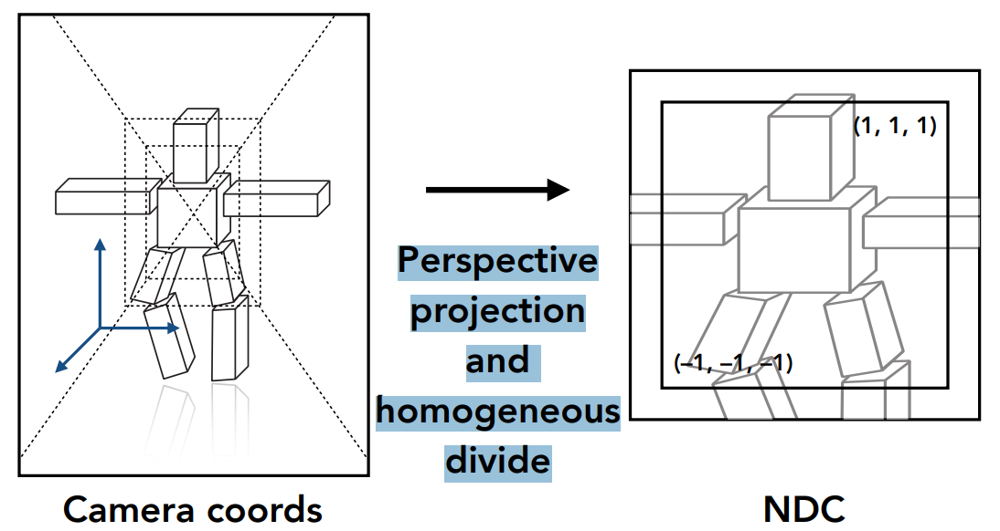
4. 转化为显示屏的坐标
   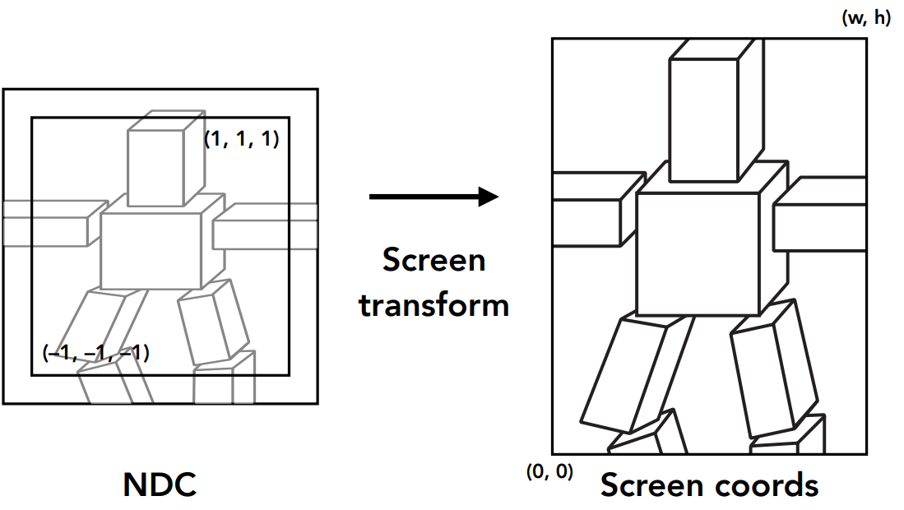
5. 光栅化
   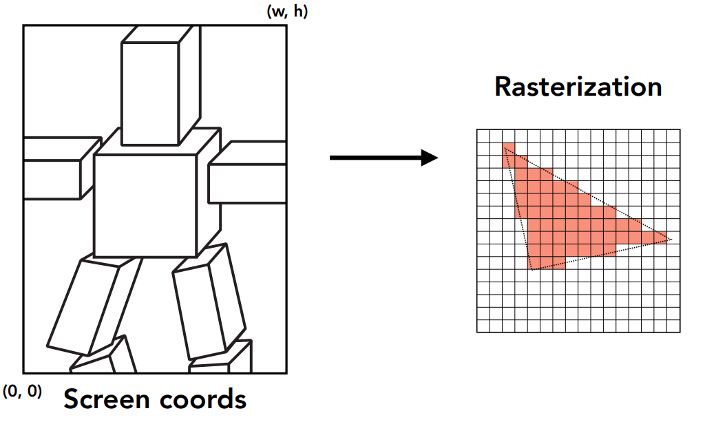

## Lec05 着色（Shading）

### 5.1 可见性 Visibility (Z-Buffering)

> 如何判断场景中某个物体在最后的图像上是否可见(是否被覆盖)

1. 画家算法(水彩画?): 从远到近, 让近的物体的颜色覆盖掉 framebuffer 中的内容
   - 缺陷: 需要对物体的深度进行排序(O(nlogn)), 同时还可能存在无法计算的深度顺序
     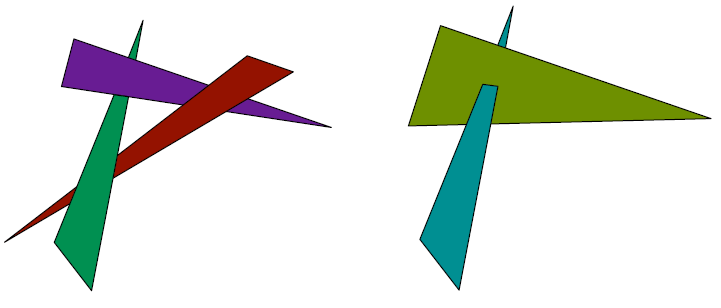
     - 图一, 三个物体并没有明确地深度顺序
     - 图二, 两个物体相交

#### Z-Buffer

- 最常用的表面隐藏去除算法(hidden-surface-removal algorithm), 用于判断物体的先后关系，即每个像素点显示哪个三角形面上的点（靠前的点）

- 算法思想:

  - 存储每个采样位置的当前最小 z 值(深度值)
    - **假设 z 越大越远**
  - 深度值需要一个额外的缓冲区
    - 帧缓冲区存储 RBG 颜色值
    - 深度缓冲区（z-buffer）存储深度（16 至 32 位）

- 实现方式有两步

  1. Z-Buffer 算法需要为每个像素点维持一个深度数组记为 zbuffer，其每个位置初始值置为无穷大（即离摄像机无穷远）。

  2. 随后我们遍历**每个**三角形面上的每一个像素点[x,y]，如果该像素点的深度值 z，小于 zbuffer[x,y]中的值，则更新 zbuffer[x,y]值为该点深度值 z，并同时更新该像素点[x,y]的颜色为该三角形面上的该点的颜色。

  3. ```pseudocode
     for (each triangle T)
         for (each sample (x,y,z) in T)
             if (z < zbuffer[x,y]) // closest sample so far
                 framebuffer[x,y] = rgb; // update color
                 zbuffer[x,y] = z; // update z
             else
             	; // do nothing, this sample is not closest
     ```

### 5.2 Shading

着色 (Shading)

- 词典解释: 用平行线或色块 使插图或图表 变暗或上色。
  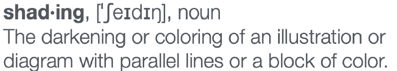
- 本课程中的 shading: **将材质应用于对象的过程**
- shading≠shadow

#### 5.2.1 着色模型

##### 泛光模型(Ambient Shading)

最简单的模型，仅仅考虑环境光的影响，对于所能见到的所有像素均匀着色 I~env~，I~env~ = K~a~I~a~，K~a~为物体表面的反射率，I~a~为光线的亮度，这样的着色只能让物体有基础的轮廓，并不能体现出空间体积感
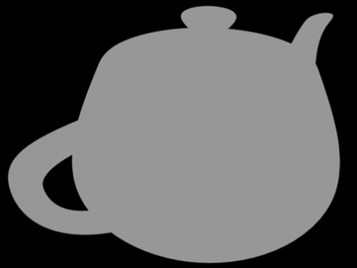

##### Lambert 漫反射模型

1. 漫反射模型: 在泛光模型的基础之上增加了漫反射项。

   - 漫反射便是光从一定角度入射之后从入射点向四面八方反射，且**每个不同方向反射的光的强度相等**
     如下图

     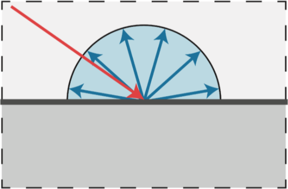

2. 漫反射的计算如下
   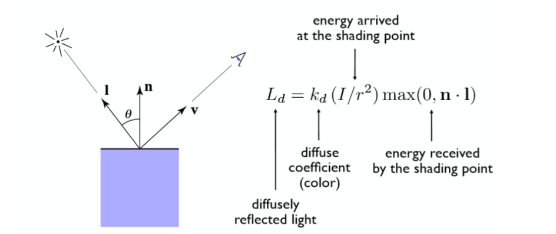

   - K~d~为漫反射系数，I 入射光强

   - n ，l 分别如图中所示为法线向量和入射方向向量

   - $max(0, n\cdot l)$是为了剔除夹角大于 90° 的光。

3. 注意点

   - 为什么 I 要/r<sup>2</sup>?

     - 因为我们采用的光源是点光源，光线均匀的向周围发射，任意两个同心圆上接受到的能量之和一定相等。离圆心越远，圆的面积越大，单位面积所接受能量也就越弱。因此需要将 I/r<sup>2</sup>来表示 r 半径的圆上任意一点的光强

   - 为什么要 n·l？因为当入射光线与平面不垂直入射时，会有能量损失，因此将方向向量 n 和 l 点乘就可以得出 cosθ

4. 更详细的计算可以跳转到 ①I 相关: [辐射强度](#辐射强度 Radiant Intensity ※) ② 反射相关: [双向反射分布函数 BRDF](# 双向反射分布函数 BRDF)

##### Phong 反射

Phong 反射考虑了环境光 Ambient，漫光反射 Diffuse 以及镜面反射 Specular，是三者相加结合的反射模型

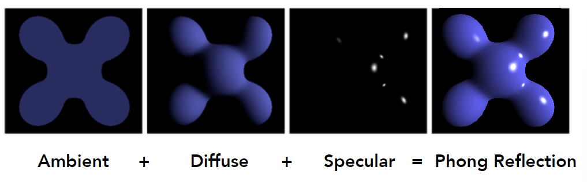

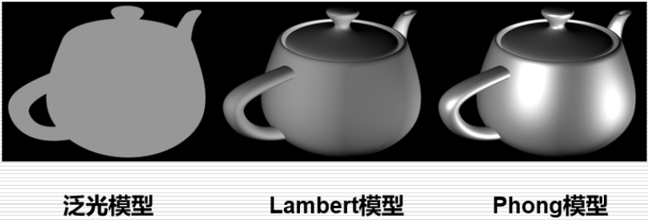

###### 镜面反射 Specular Shading

众所周知，镜面反射的入射角和反射角是相等，且在反射时没有能量损耗，因此不用像漫反射考虑入射光线与平面的角度，而**观察方向**在镜面反射时是很重要的，具体来说，只有当观察方向集中在反射方向周围很近的时候才能看见反射光，因此，在计算中我们需要考反射光线的方向和观察方向的夹角 α，公式如下
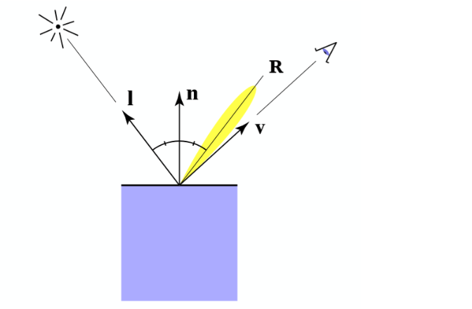
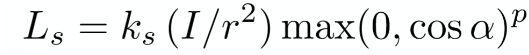

为什么后面加了个指数 p？因为离反射光越远就越不应该看见反射光，需要一个指数 p 来进行**衰减**

##### Blinn-Phong 反射模型 ※

> Blinn-Phong 反射模型的作用: 优化了镜面反射的计算

==优化镜面反射== : 将反射方向与人眼观察方向夹角替换成如下图所示的一个半程向量和法线向量的夹角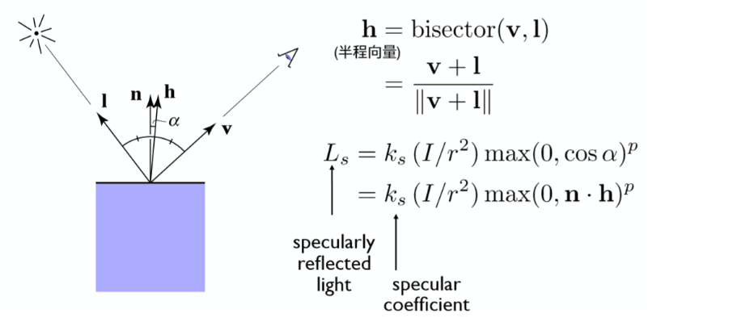

- p 取值带来的影响:
  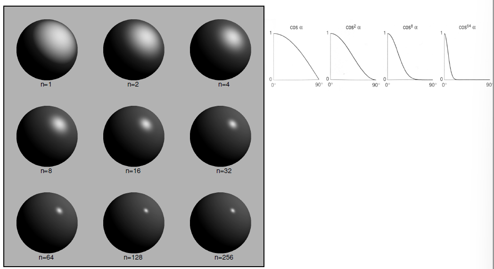

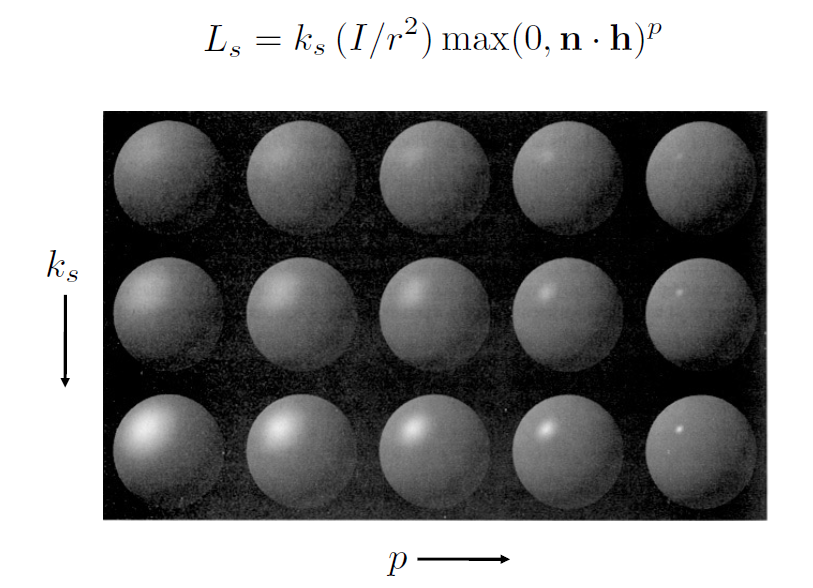

这样的得到的结果其实是与真实计算反射与人眼观察夹角的结果是非常近似的，但好处在于大大加速了角度计算的速度，提升了效率！

##### 小结

Blinn-Phong 反射模型


- $L = L_a(Ambient) + L_d(Diffuse) + L_s(Specular)\\ = k_aI_a+k_d(I/r^2)max(0, \vec n\cdot\vec l) + k_s(I/r^2)max(0, \vec n\cdot \vec h)^p $
- $\vec h = \frac{\vec v+ \vec l}{|\vec v+ \vec l|}$

#### 5.2.2 着色方法

> 区别在于着色的对象(着色频率): Triangle, Vertex or Pixel

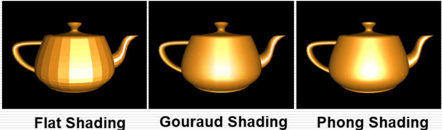

##### Flat Shading

面着色，顾名思义以每一个三角形面作为一个着色单位。

着色应用在面上，用面的法线计算，然后每一个像素都是这个面的信息。


##### Gouraud Shading

着色应用在顶点上，用顶点的法线算出顶点的颜色，然后面内部像素的颜色用顶点的颜色进行插值的方法得出

###### 计算过程

1. 对物体的每个顶点(vertex)进行一次着色

   - 将所有共享这个点的面的法线向量加起来求**均值**, 得到该顶点的法线向量
     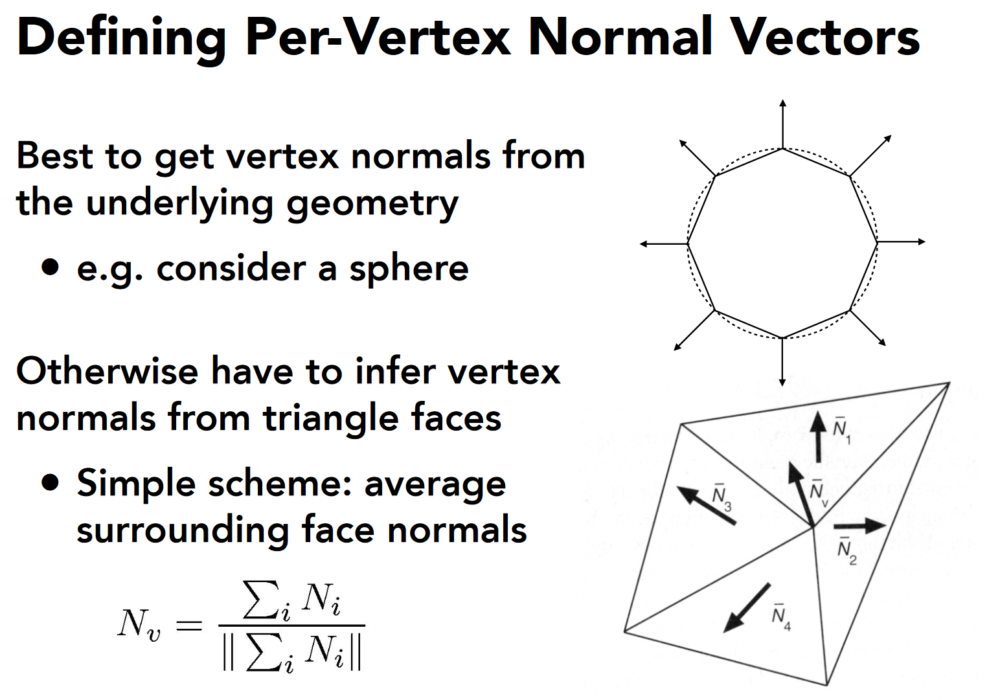
   - 计算出这个顶点的颜色

2. 插值计算三角形中每个像素的颜色

   - 使用==[重心坐标](# 6.2 重心坐标※)插值公式== $c = αc_0 = βc_1+γc_2$

   - C0,C1,C2 为三角形三个顶点的颜色，α,β,γ 为三角形面内该点的重心坐标，c 为该点的插值之后得到的颜色。

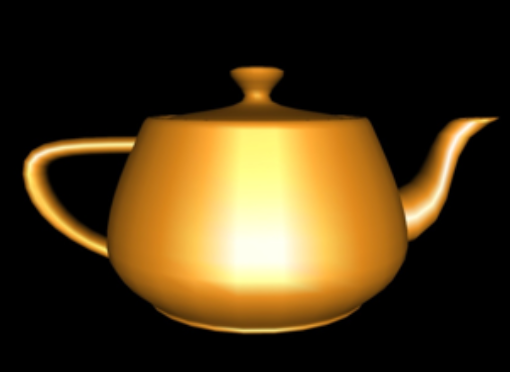

> 这种方法只是对每个三角形顶点进行了着色，再插值得到其他颜色，那么有没有办法再精确一点, 对每个像素点都进行着色呢？

##### Phong Shading

> **注意**: Blinn-Phong 反射模型 和 Phong Shading 不是同一个东西

在得到了三角形的三个顶点的法线向量后，重心插值得到三角形内每个像素点的**法线向量**，再对每个像素点都进行一个着色

##### 对比

可以看到，在顶点数较少时，Phong Shading 的效果明显好于 Flat 和 Gouraud，而 Phong Shading 的计算复杂度明显高于 Flat 和 Gouraud。但是随着顶点数的增加，Flat 和 Gouraud 的结果逐渐接近于 Phong Sharding 的效果。因此在实际应用场景中，需要在顶点数和渲染方式中经过测试得出最优解，在时间复杂度（渲染）和空间复杂度（模型）中得出最优解。

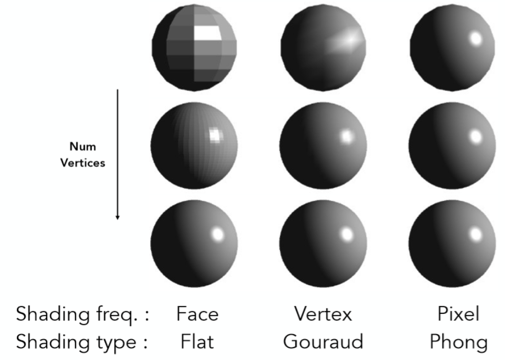

## Lec06 纹理映射（Texture Mapping）

### 6.1 纹理坐标映射概述

> 就像巧克力表面的锡箔纸一样, 展开的方形即为纹理映像 Texture image
>
> 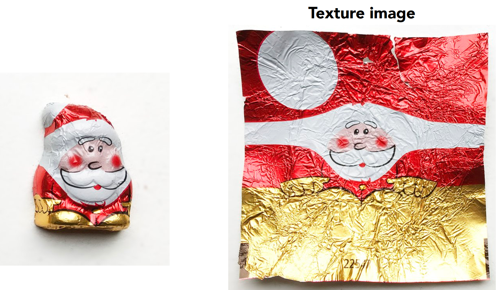

如何将纹理图像应用到物体表面
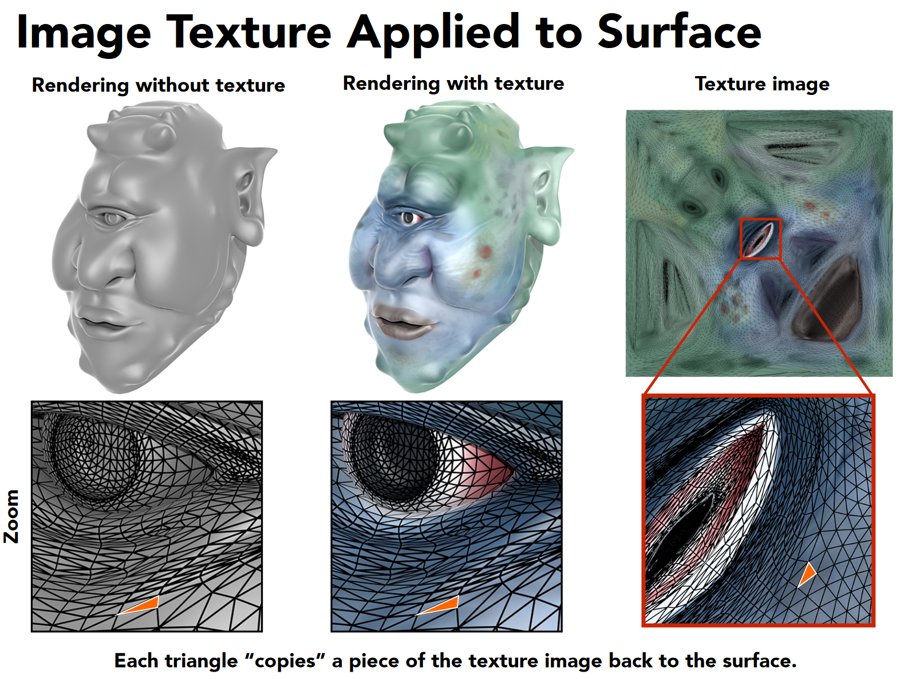

#### 纹理坐标可视化 (UV 图)

将一个贴图(纹理图)进行初始化后，分为 UV 两轴，横轴纵轴的最大值都为 1，（0，v）对应绿色，（u，0）对应红色，其他的点通过重心坐标插值算得，则图上任意一点的都可以用 uv 坐标来表示，再根据**特殊的映射关系**将模型的任意一点都映射到图中，整个 Texture 就被贴在了模型之上。

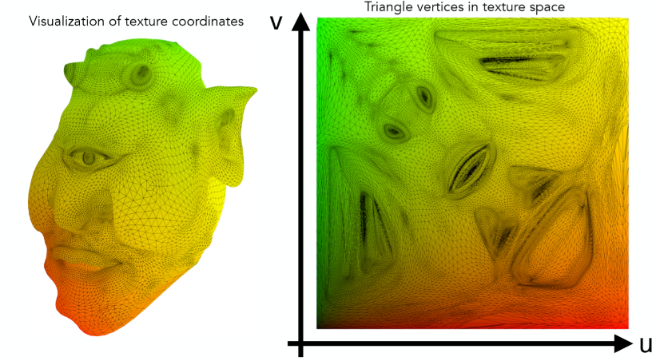

### 6.2 重心坐标※

> 为什么要插值
>
> - 在顶点处指定值(例如纹理坐标)，并在整个曲面上获得平滑变化的值。
>
> 插值用来计算什么
>
> - 纹理坐标，颜色(Gouraud Shading)，法向量(Phong Shading)，..
>
> 如何插值
>
> - 重心坐标

1. 重心坐标系: 对于一个三角形所在平面上一点 P(x, y), 可以将其表示为$ αA+βB+γC, 即(α, β, γ)$, 其中$α+β+γ = 1$
   - 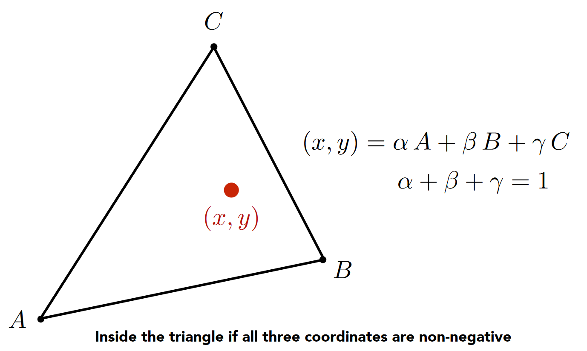
   - 值得注意的是: 当$α+β+γ \geq 0$时, 点在三角形内部(这个可以在下面的面积比例中得到直观的体现)
2. 计算方法 ①: 从重心的定义出发
   - 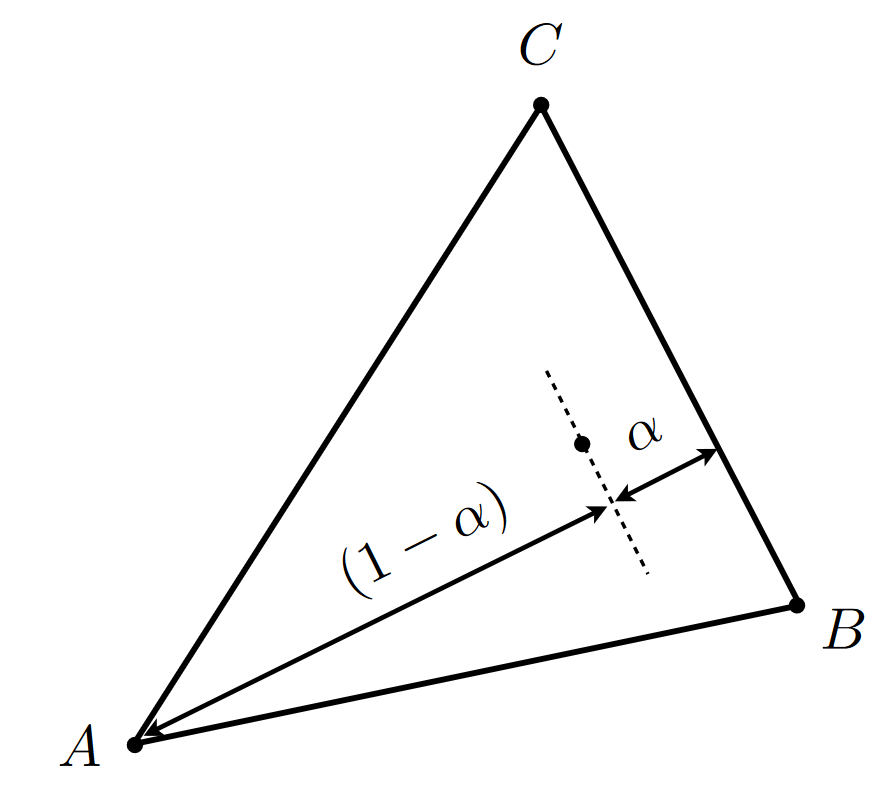 用点到直线的距离计算公式可得$α = \frac{L_{BC}(x,y)}{L_{BC}(x_A,y_A)}, 其中 L_{BC}(x,y) = (\begin{bmatrix}x\\y \end{bmatrix} - B)\times \vec {BC} / |\vec{BC}|$
   - 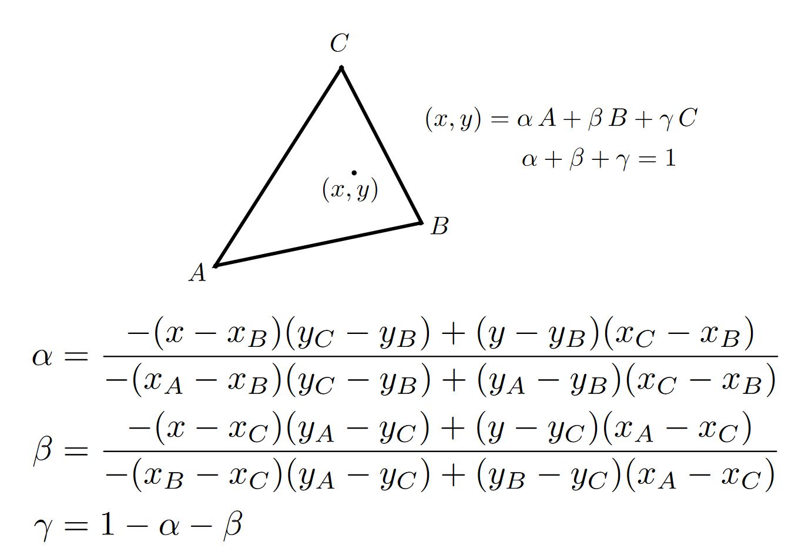
3. 计算方法 ②: 面积比例
   - 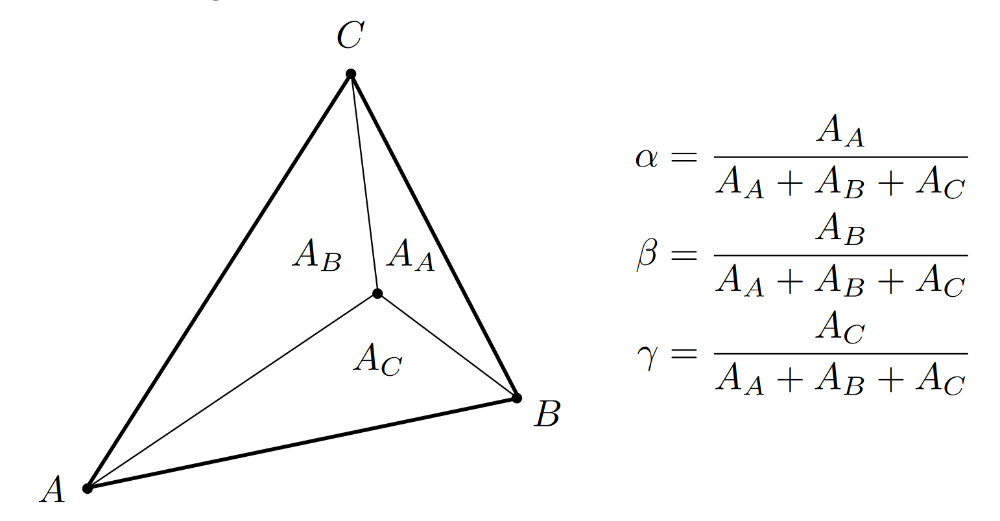
   - $面积可以使用叉乘的几何意义来计算, A_A=\vec {PC}\times \vec{PB}$
   - ~~好算 爱算 正经人谁用长度算啊~~

### 6.3 应用纹理(实现映射)

#### 6.3.1 简单的纹理映射

```pseudocode
for each rasterized screen sample (x,y):
	(u,v) = evaluate texcoord value at (x,y); 	//使用重心坐标插值
    float3 texcolor = texture.sample(u,v);
    set sample’s color to texcolor; 			//使用前面的Blinn-Phong反射模型
```

#### 6.3.2 透视投影与插值

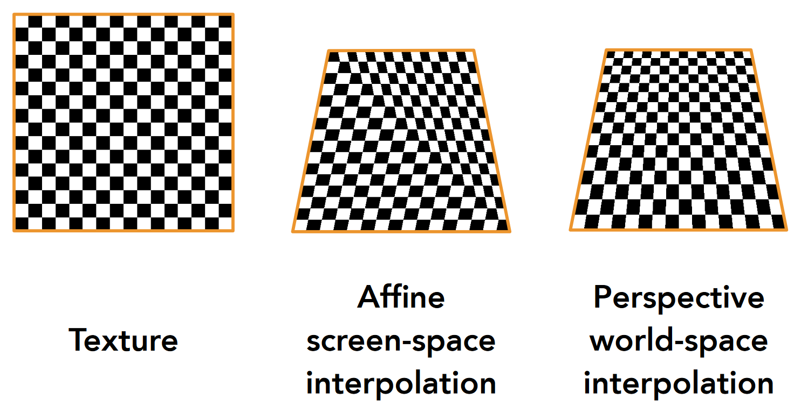

- 仿射变换 Affine screen-space interpolation: 在屏幕空间（即投影后的二维坐标）中对顶点属性进行插值
  - 在这种插值方法中，我们假设在屏幕空间中，直线保持直线，平行线保持平行。
    因此，对于顶点属性（比如颜色、纹理坐标等），我们可以使用简单的线性插值来计算在像素级别上的值。
  - 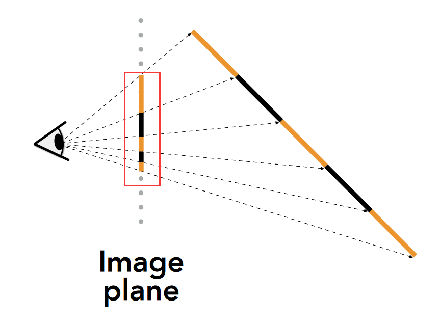
- Perspective world-space interpolation: 在世界空间中对顶点属性进行插值。
  - 这种插值方法考虑了透视变换对于插值的影响。
    在透视投影下，物体在远处会看起来变小，这意味着在屏幕上，离相机越远的点在屏幕空间中占据的像素越少。
  - 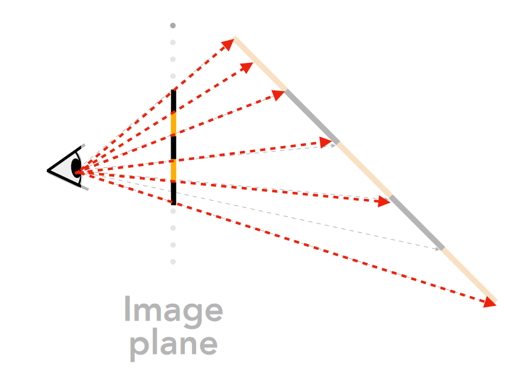

#### 6.3.3 纹理采样

1. 采样频率和实体图像的映射关系
   1. 图像空间:纹理空间=1:1
      - 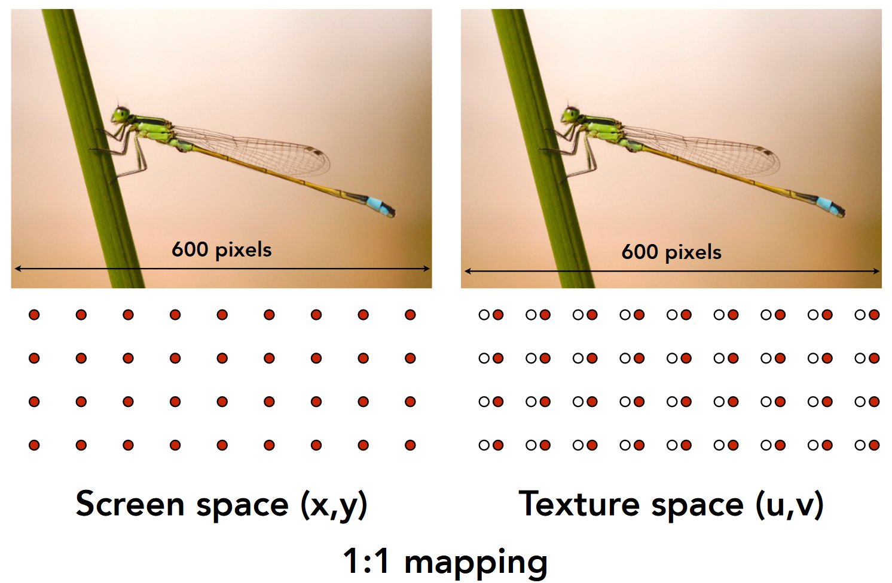
   2. **放大**: 图像空间:纹理空间=4:1 表现为完整的 600pixel 纹理截取了 1/4 部分, 映射到 600pixel 的图像上，此时会出现分辨率<采样频率的问题（即贴图过小）
      - 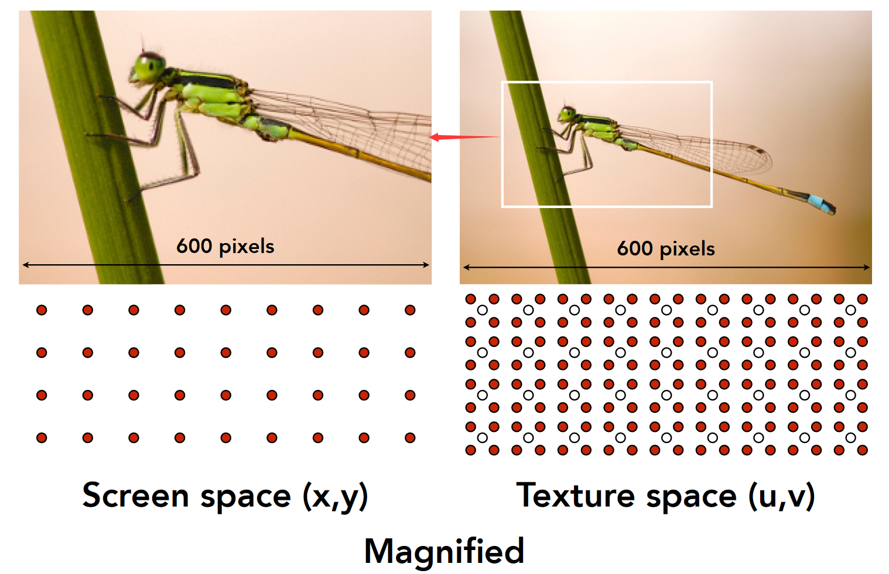
      - 1 个纹理 pixel(texel, texture element, 纹理中的像素)映射为 4 个图片 pixel
   3. **缩小**: 图像空间:纹理空间=1:4
      - 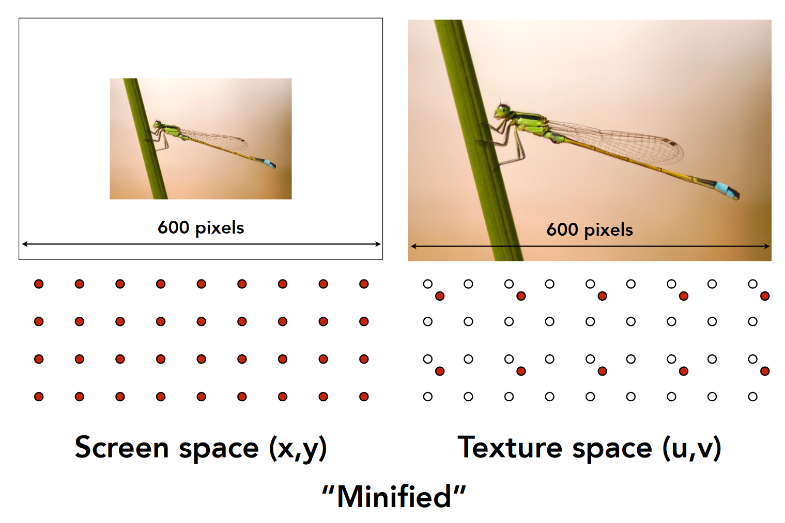
      - 4 个 texel 映射为 1 个 pixel，此时会出现分辨率>采样频率，（即贴图过大）

##### 透视与纹理

1. 纹理中的屏幕像素足迹: 计算纹理映射过程中像素在屏幕空间和纹理空间之间的对应关系

   - 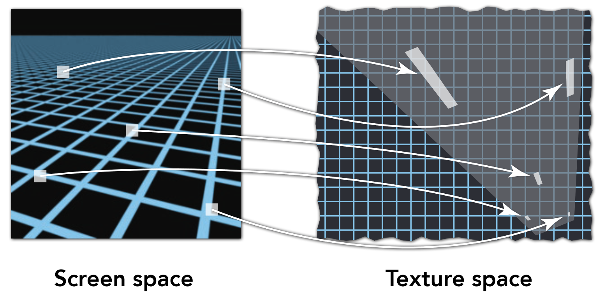

   - NB：纹理采样模式不是直线型或各向同性的

2. 使用雅可比矩阵估计足迹面积

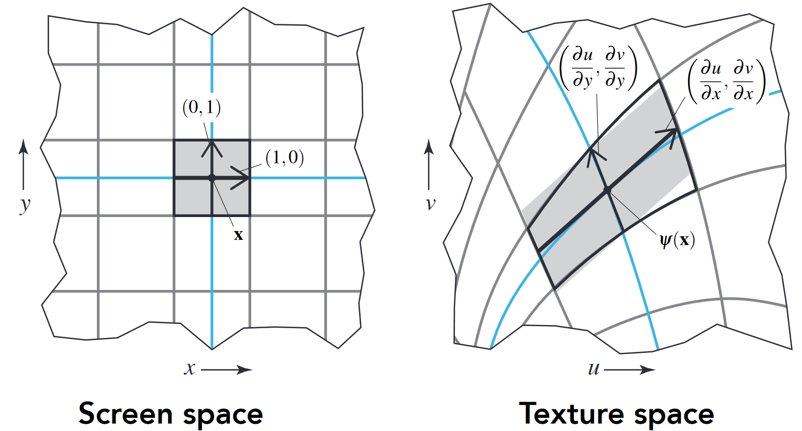

### 6.4 Texture Filtering

超采样是否依然有效?

- 是的，质量高，但成本高
  
- 当高度缩小时，每一个 pixel 将会对应多个 texel

目标：有效的纹理反走样

- 想要每个像素有一个/几个 texels 的反走样
- 如何实现: 使用抗锯齿--采样前滤波

#### 6.4.1 纹理放大(Texture Magnification)(games101：纹理过小)

1. 纹理放大 Texture Magnification: 纹理图案太小, 图片太大, 一个 texel 被迫对应多个 pixcel ~~(复读)~~
   - 屏幕空间的几个像素点对应在纹理贴图的坐标上都是集中在一个像素大小之内，因此会导致走样失真
   - 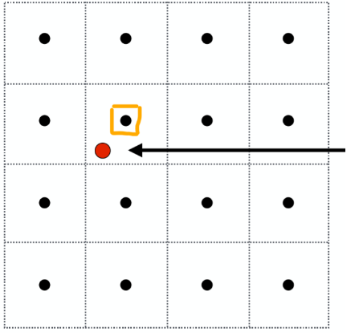
     由于贴图分辨率低，投影在贴图上的红色的点会选择橙色框内的点来进行着色，这样就会导致失真
2. 解决方案
   - 最近 Nearest 双线性 Bilinear 三次 Bicubic
     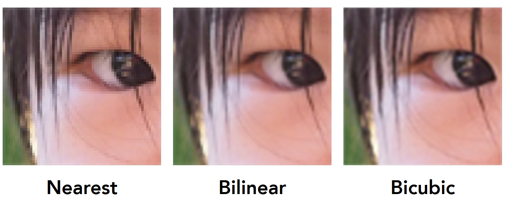

##### 双线性插值

1. 取离 texel 中心(红点)最近的 4 个 pixel 中心(黑点), 记为$u_{00},u_{01},u_{10},u_{11}$
2. 算出该 texel 在水平及竖直方向偏移的比率 s,t
3. 利用 s，可以线性插值(lerp, linear interpolation)出如下图所示的 u0，u1 点的颜色值
4. 利用比例 t，颜色值 u0，u1 插值出红色点的颜色值
5. $f(x,y)=lerp(t,lerp(s,u_{00},u_{01}),lerp(s,u_{10},u_{11}))$


样利用两次线性插值，考虑到了所有 4 个点的颜色值，能够很好的缓解走样失真现象，并且计算速度较高

#### 6.4.2 纹理缩小(Texture Minification)(games101：纹理过大)

> 纹理缩小: 近处锯齿，远处摩尔纹(不连续)
> 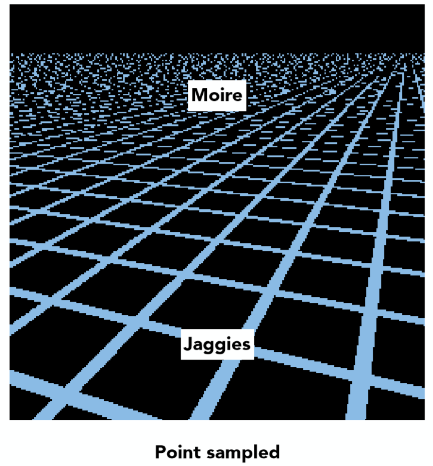

##### 纹理过大

根据近大远小，远处的一张完整的贴图可能在屏幕空间中仅仅是几个像素的大小，那么必然屏幕空间的一个像素对应了纹理贴图上的一片范围的点，这其实就是纹理过大所导致的，直观来说想用一个点采样的结果代替纹理空间一片范围的颜色信息，必然会导致严重失真！
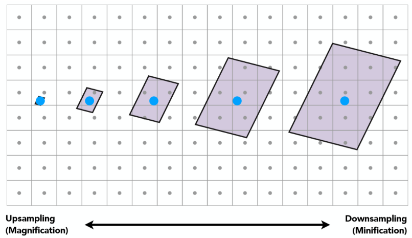

如图，从左到右，分别对应的是从近到远，近处的像素点呈现锯齿状实际上是由于覆盖的像素过小（理同贴图过小)，远处摩尔纹由于覆盖的像素过多，用这个像素点的采样结果覆盖了一整块纹理空间的色彩

- 对于这种问题，使用超采样解决——可以，但是太吃性能

因此引出 Mipmap

##### Mipmap ※

1. 总体思路: 将贴图分为多个等级，每提升一级将 4 个相邻像素点**求均值**合为一个像素点(降采样)，因此越高的 level 也就代表着贴图不断进行自我混合的颜色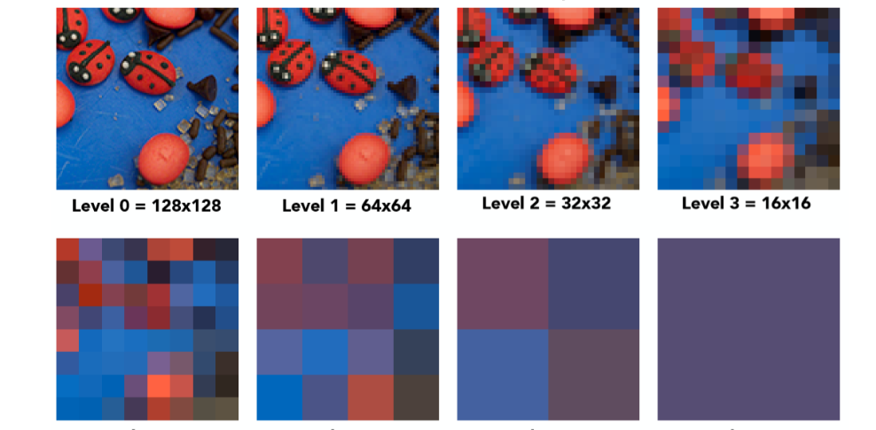

   - 这个分级图也可以比较方便地存储
     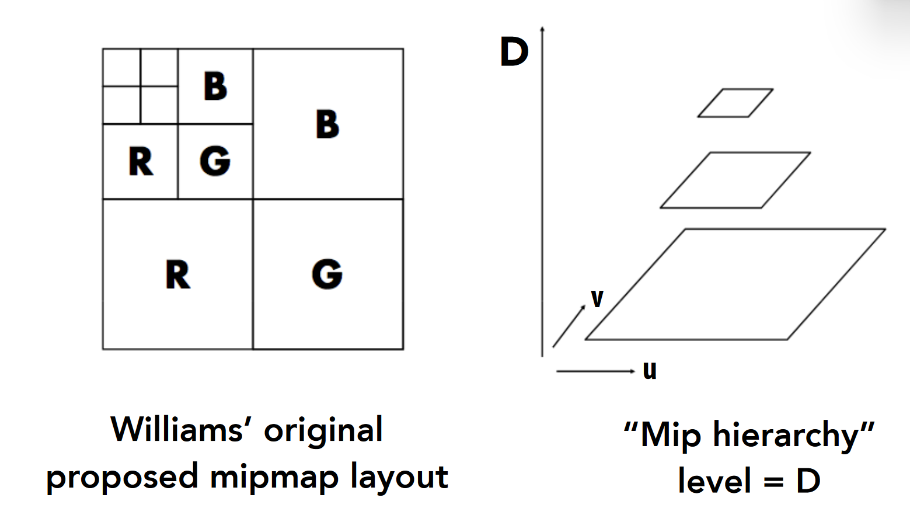

2. 如何确定像素点要使用哪个 level 的贴图

   1. 在屏幕空间中取当前像素点的右方和上方的两个相邻像素点
   2. 分别查询得到这 3 个点**对应**在 Texture space 的坐标，计算出当前像素点与右方像素点和上方像素点在**Texture space 中的距离**，二者取最大值 L
   3. D=log~2~L 就是对应的 level
      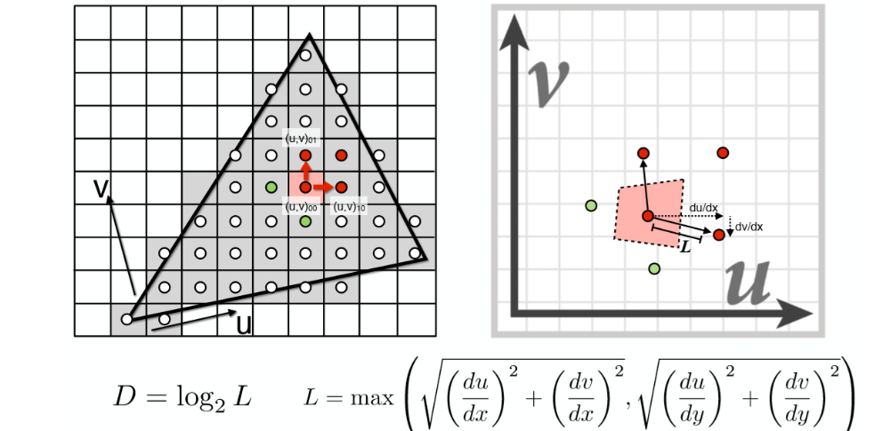

   - 可以理解为：相邻像素点在 level 下投影到 uv 贴图上还是相邻（距离 1）如果距离超过了就会增加 level，又因为每个 level 是相邻两两像素合并（uv 两个方向所以共四个），所以对应的 level 是 D=log~2~L

   - 如果计算出的结果不是整数可以

     - 四舍五入
     - 三线性插值( 利用 D 的数值对向下和向上取整的两个不同 level 进行 3 线性插值)

   - 结果
     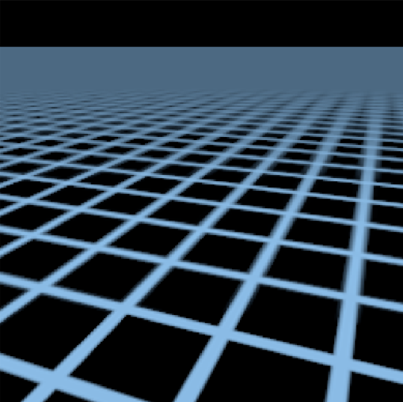 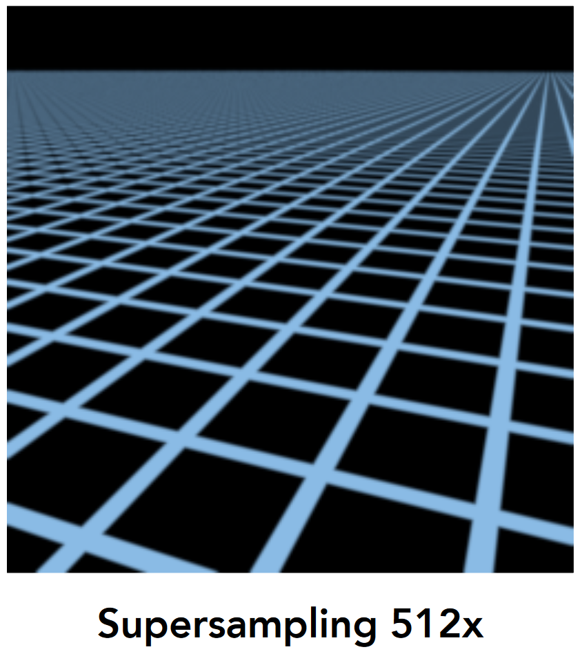(超采样参考)
     远处的地板产生一种过曝(Overblur)的现象，完全糊在了一起，这是为什么？

3. 过曝产生原因:

   - 所采用的不同 level 的 Mipmap 默认的都是正方形区域。而有些采用点的形状却并不类似于正方形
     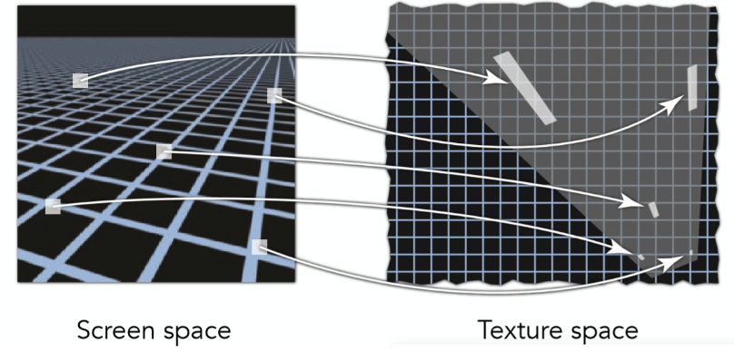

   - 如上图, 不同像素点所对应的贴图映射形状是不同的，有长方形，甚至是不规则图形，那么针对这种情况，有的所需要的是仅仅是**水平方向的高 level**，有的需要的仅仅是**竖直方向上的高的 level**
   - 而 mipmap 并没有相关的 level (即 mipmap 是各项同性的)
   - 所以 minmap 对于只需要某一方向高 level 的像素, 返回的是 uv 方向都压缩过的 level 图，**损失了另个一个不需要压缩的方向的细节**

> 那么，有什么办法能够兼顾这些形状呢？

##### 各向异性 mipmap ※

采用各向异性贴图可以很好地解决长方体映射形状带来的糊感
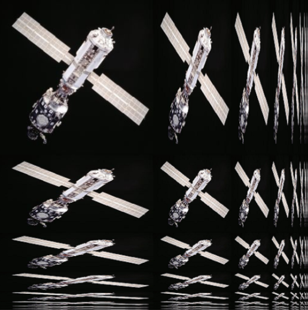

在应用时，方法与 mipmap 类似，分别算出水平方向的$level D_0$&竖直方向的$level D_1$，然后根据这两个 level 去各项异性过滤的 texture 里面找一张最合适的。

要注意的是，各向异性过滤只针对近似长方形的映射有较好的效果，对于平行四边形等形状的过滤效果并不明显

应用了各向异性过滤后，图像的清晰度显著提高，远处的过曝现象大大减少
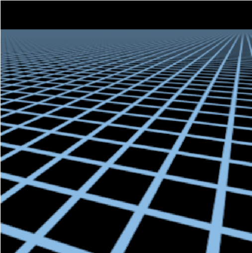

### 6.5 高级纹理应用

- Texture = memory 存储 + filtering 过滤
- 许多应用
  - 环境照明
  - 商店微观几何
  - 过程纹理
  - 实体建模
  - 体绘制

#### 法线贴图（Normal Maps）

存储了物体法线向量的贴图，在应用实例中一般将高精度的模型的法线信息套用在低精度模型上来提高渲染效果
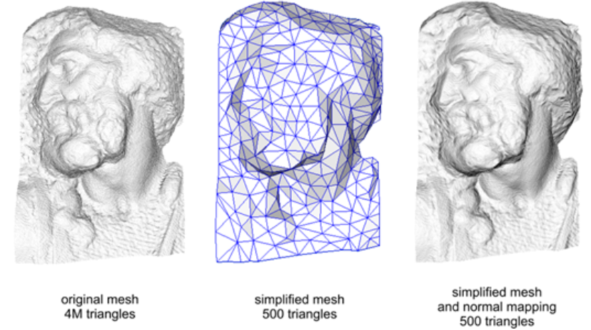

#### 高度贴图（Bump Maps）

1. 思路: Normal Maps 直接存储了法线信息，而 Bump Maps 存储的是该点逻辑上的相对高度，利用该高度信息，再计算出该点法线向量，最后再利用该法线计算光照

2. 法线向量计算:

   - 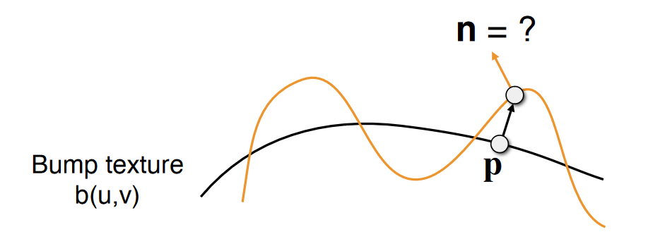
   - 原表面法向量 n(p) = (0, 1)
   - 对 p 点高度进行求导$dp = c * [h(p+1) - h(p)]$
   - 求得法向量$n(p) = (-dp, 1).normalized()$
   - 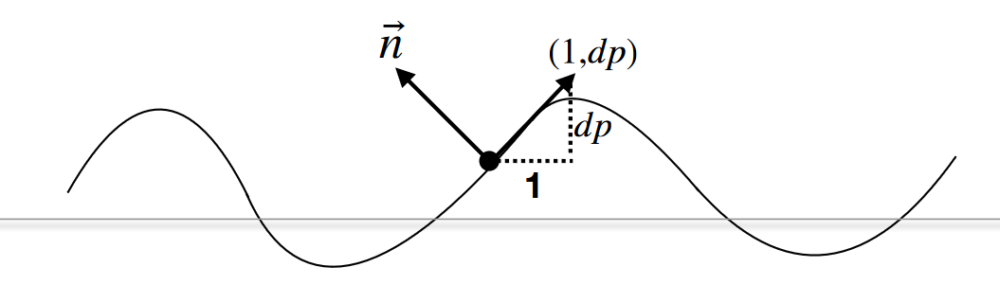

   - 3D 同理
     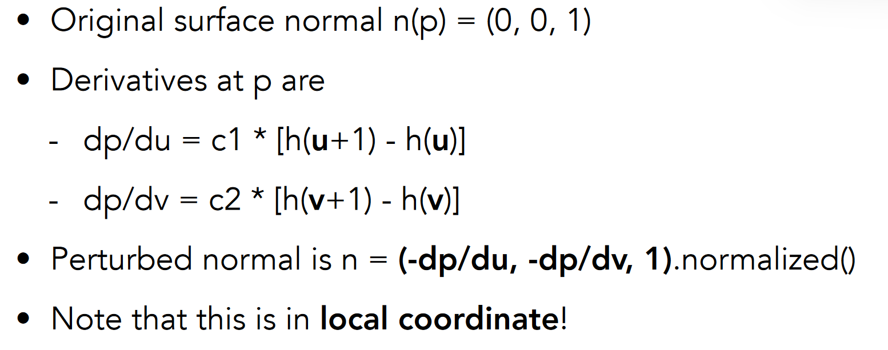

#### 环境贴图（Environment Maps）

模拟的是光照离我们的物体的距离十分遥远，对于物体上的各个点光照方向几乎没有区别

将环境光存储在一个贴图之上，利用观察方向相对于法线的反射方向去查询环境映射的颜色值。
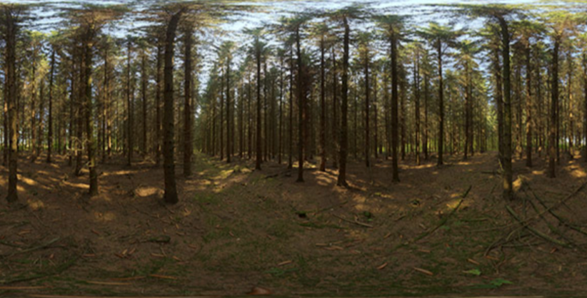

这种方法会导致上下方扭曲，因此使用 cube map（游戏场景常用的 skybox）来改进
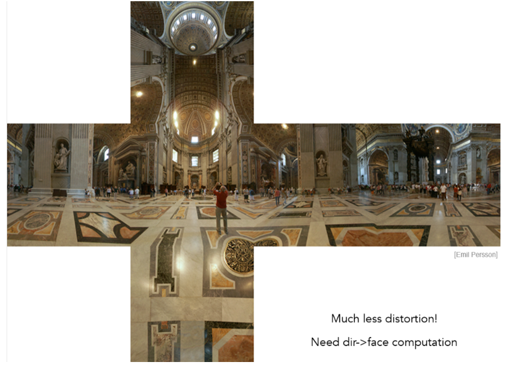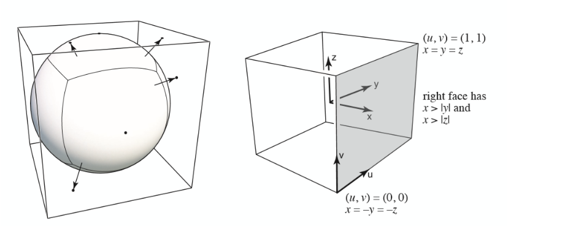

通过将球包在立方体中间进行 uv 投影，可以缓解原来环境光贴图的畸变

#### 阴影贴图（Shadow Maps）

具体实现分为以下几个步骤

1. 把光源当做一个摄像机让它去看，去渲染一遍整个场景, 得到从光源视角的深度 Buffer，记为 d~map~
2. 从设定好的摄像机位置去真正的渲染场景得到摄像机视角的深度 Buffer，记为 d
3. 将所有摄像机视角可见点重新投影回光源
   若 d = d~map~，点可被光源与摄像机共同看见，因此不在阴影中
   否则在阴影中

距离光源越近代表深度越小，所以颜色越黑，反之亦然

# 几何（Geometry）

## Lec07 曲面的表示

### 7.1 隐式曲面（Implicit Surface）

==隐式曲面== : 曲面上所有点满足的关系用**数学表达式**写出

- 优点在于十分容易的判断出一点与**曲面的关系**
  - 比如: 计算某个点是否在球面内 (可以用函数表达式来计算)
- 缺点在于表达十分的抽象，不能直观判断曲线的形状
  - 比如: 从表达式反推出一些在面上的点 比较困难/根本算不了

#### 7.1.1 代数曲面(Algebraic Surfaces)

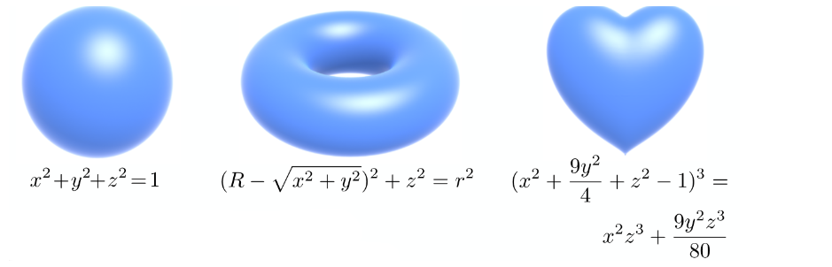

#### 7.1.2 Constructive Solid Geometry(CSG)

对几何进行布尔运算得出的更复杂的几何（建模软件常用）


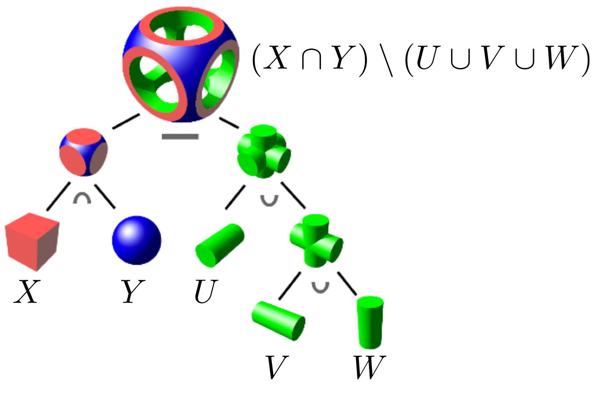

#### 7.1.3 混合距离函数(Blending Distance Functions)

通过距离函数来得到几何形体混合(blend)的效果
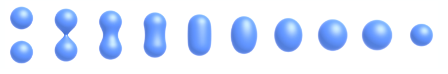

混合函数有许多选择, 取决于我们想如何实现混合

- 如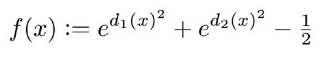

- 实现 d1(x), d2(x)的布尔并集: $f(x) = min(d_1(x), d_2(x))$

#### 7.1.4 水平集(Level Set)

> 复杂的形状可能很难用方程表示

Level Set: 用存储函数值的网格表示形状, 插值函数值等于 0 的点, 形成曲面

找出函数值为 0 的地方, 插值形成曲线，对空间用一个个格子去近似一个函数
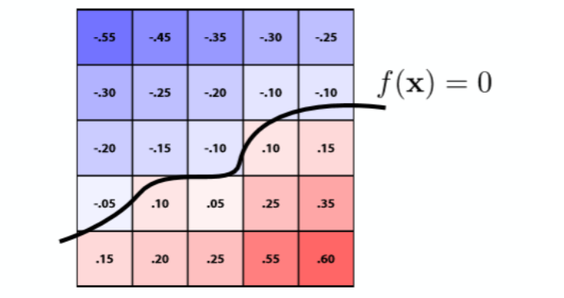
对该面内的每一个点利用已经定义好的格子值进行双线性插值，就可以找出所有=0 的点作为曲面（广泛的运用在医学成像和物理模拟之中)

#### 7.1.5 分型几何(Fractals)

指许许多多**自相似**的形体最终所组成的几何形状

在所有尺度上都有细节(无限细分)

形状难以控制

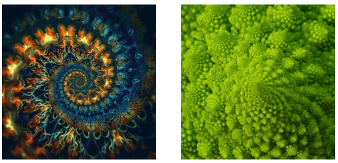

> 隐式曲面小结
>
> 优点：
>
> - 简洁的描述（例如，一个函数）
>
> - 某些查询很容易（对象内部、到表面的距离）
>
> - 适用于光线到曲面的相交（稍后介绍）
>
> - 对于简单形状，精确描述/无采样误差
>
> - 易于处理拓扑结构的变化（例如，流体）
>
> 缺点：
>
> - 难以对复杂形状建模

### 7.2 显示曲面（Explicit Surface）

==显示曲面== : 所有的点被**直接给出**(点集)，或者可以通过映射关系直接得到
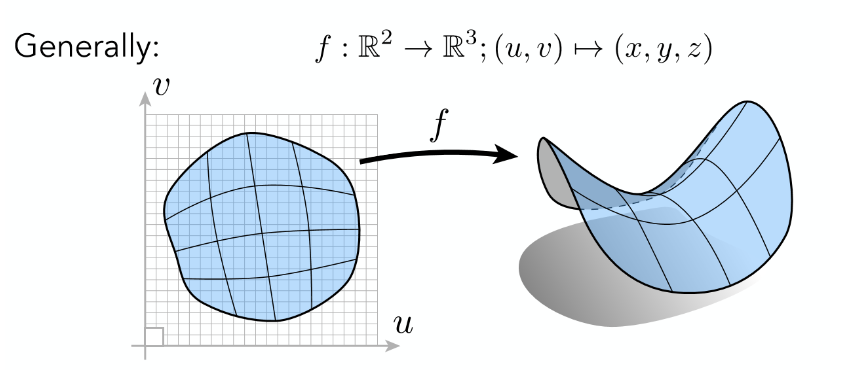

- 优点: 可以很轻易的采样到所有的点
- 缺点: 很难判断点与曲面的关系(没有函数表达式来计算)

#### 7.2.1 点云(Point Cloud)

很多很多的点构成的曲面，点表示曲面的形状，适合远距离观察，近距离细节不行（常用于 3D 扫描建模，车载激光雷达）

- 点云: 最简单的表示, 即点集{（x，y，z）}

- 轻松表示任何类型的几何体
- 适用于大型数据集（>>1 点/像素）
- 经常转换为多边形网格
- 在样本不足的情况下难以绘制
  

#### 7.2.2 多边形网格(Polygon Mesh)

多边形网格: 存储顶点和多边形(三角形/四边形)信息

- 便于进行处理和模拟, 自适应采样
- 数据结构较为复杂(点和边的存储)
- 经典建模模型，广泛用于电脑中的模型文件

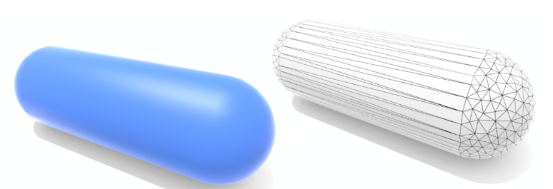

## Lec08 曲线与曲面 (贝塞尔 Bézier)

### 8.0 什么是曲线

> 随手截几张图

- 交通路线
  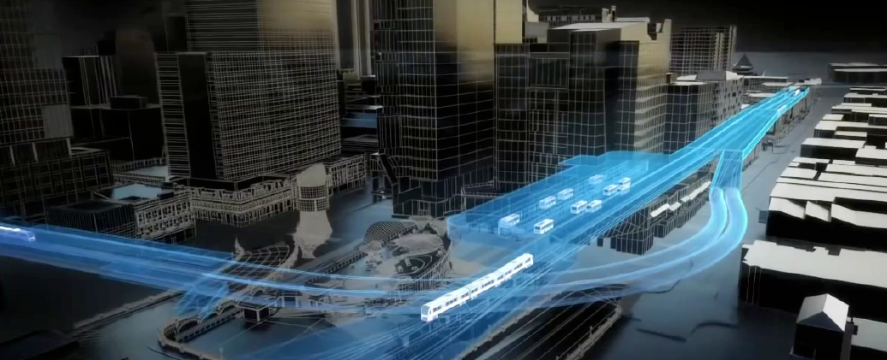
- 动画曲线
  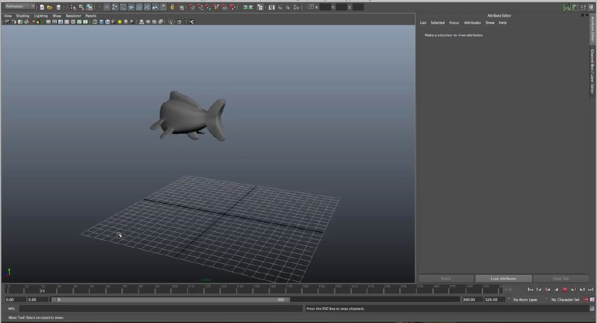
- 字体设计
  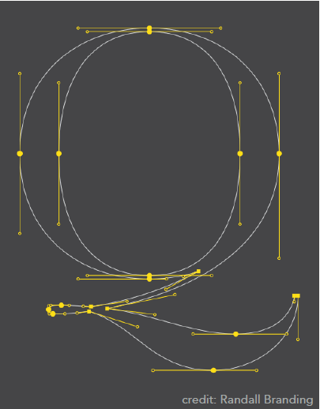

### 8.1 样条 (spline)

1. 样条: 通过已知的离散数据点 or 控制点来构造一个光滑的曲线
2. 样条插值
   - Cubic Hermite 插值：Cubic Hermite 插值是一种三次插值方法，通过控制点的位置和导数来定义曲线的形状，从而实现光滑的插值效果。
   - Catmull-Rom 插值：Catmull-Rom 插值是一种基于样条的插值方法，它通过在每两个相邻数据点之间插入一个 Cubic Hermite 曲线段来生成光滑的插值曲线。
3. Bezier 曲线（Bezier curves）：Bezier 曲线是一种由法国工程师 Pierre Bézier 提出的曲线表示方法。它通过控制点来定义曲线的形状，并且具有局部控制性和平滑性的特点。Bezier 曲线可以是二次或三次的，它们经常用于计算机图形学和 CAD 设计中。
4. Bezier 曲面（Bezier surfaces）：Bezier 曲面是由**多个 Bezier 曲线组合**而成的曲面。通过在二维平面上的两个参数（通常是 u 和 v）上进行插值，可以生成具有复杂形状的曲面。Bezier 曲面也广泛应用于计算机图形学和 CAD 设计领域。

#### 8.1.1 三次 Hermite 插值(Cubic Hermite Interpolation)

##### 一些数学基础

1. 微分几何
   - 曲面切线: 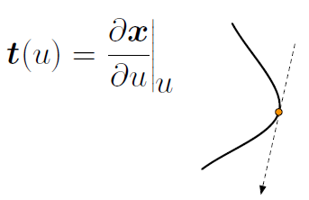
   - 曲面切线: 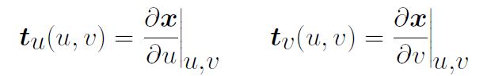
   - 曲面法向量: 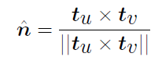
   - 退化(Degeneracies): 曲面 → 曲线/点$\partial x/\partial u = 0$ $t_u \times t_v = 0$
2. 多项式基函数(Polynomial Basis Functions), 一种基函数, 常用于多项式回归和插值
3. Power basis: 一种常见的表示基函数的方法, 使用幂次方来表示多项式的基函数
   - $x(u) = \sum^d_{i=0}c_iu^i$
   - **cubic power basis**即为$x(u) = c_0 + c_1u + c_2u^2 + c_3u^3$
   - 或者用向量点乘的形式: $x(u) = C\cdot P^d, 系数向量C = [c_0, c_1, c_2, ..., c_d], 幂函数向量P^d = [1, u, u^2, ..., u^d]$

##### 如何描述曲线

> 给定控制点(包含点的位置和导数), 如何确定 cubic power basis 中的系数

1. 已知信息即为: $\begin{cases}x(u) = c_0 + c_1u + c_2u^2 + c_3u^3\\
    x'(u) = c_1 + 2c_2u + 3c_3u^2\\
    x(u_0) = x_0\\x(u_1) = x_1\\
    \frac{\partial x(u)}{\partial u}|_{u=u_0}=d_0\\
    \frac{\partial x(u)}{\partial u}|_{u=u_1}=d_1\end{cases}$ 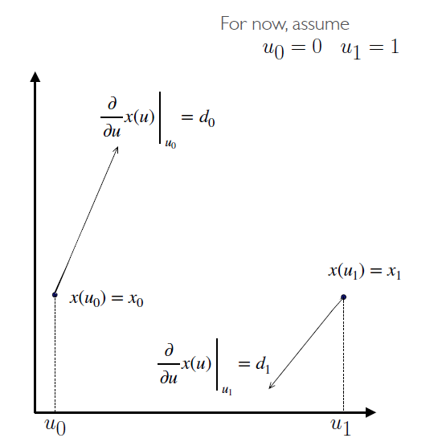
2. 得$c_0 + c_1u_0 + c_2u^2_0 + c_3u^3_0 = x0\\
    c_0 + c_1u^1 + c_2u^2_1 + c_3u^3_1 = x1\\
    c_1 + 2c_2u_0 + 3c_3u^2_0 = d_0\\
    c_1 + 2c_2u_1 + 3c_3u^2_1 = d_1$
3. 代入$u_0=0, u_=1$ 得 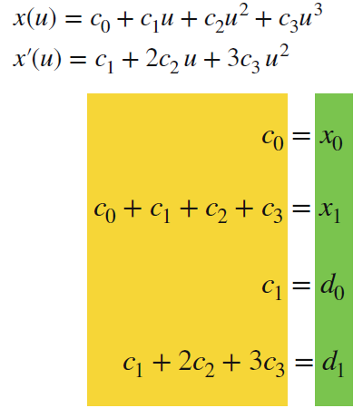
4. 改写为矩阵乘法 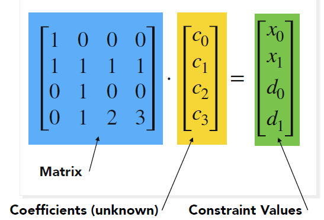 , 记为$B\cdot c = h$

- 其中 B 为固定矩阵, C 为待求的常数向量, h 为控制点信息

5. 因为 C 是待求信息, 改写为以下形式
   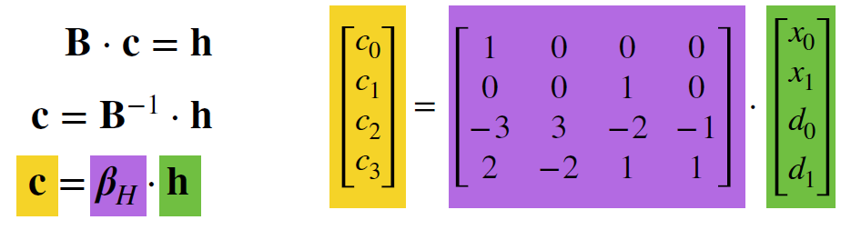

- $记为Hermite\ Basis\ Matrix\ \beta_H = \begin{bmatrix}1&0&0&0\\0&0&1&0\\-3&3&-2&-1\\2&-2&1&1 \end{bmatrix}$

6. 此时, 使用 power basis 向量表示即为$x(u) = P^3(u)\cdot C = P^3(u)\cdot\beta_H\cdot h$

- $P^3(u)=\begin{bmatrix}1*u&u^2&u^3 \end{bmatrix}:1行4列, C=\begin{bmatrix} c_0&c_1&c_2&c_3\end{bmatrix}:4*1$

7. 进一步化简, 得
   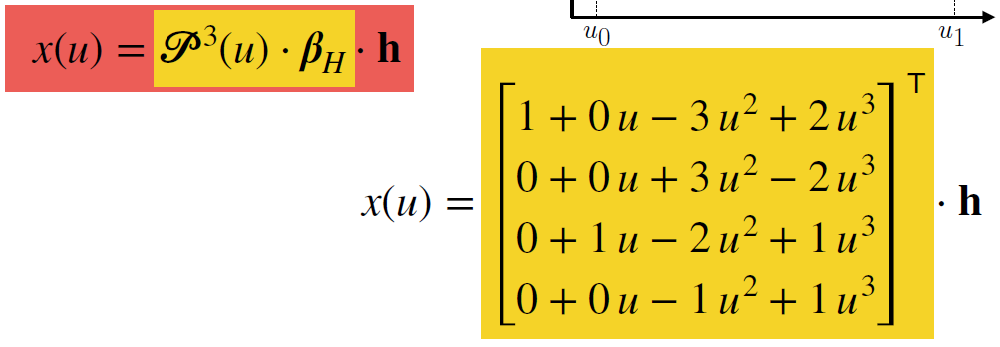
   - 黄框中的向量即为$Hermite\ Basis\ Functions = [H_0&H_1&H_2&H_3] =\begin{bmatrix}1+0u-3u^2+2u^3\\0+0u+3u^2-2u^3\\0+1u-2u^2+1u^3\\0+0u-1u^2+1u^3 \end{bmatrix}^T(为了好看)$

##### 小结

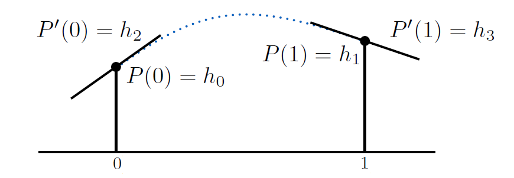

如上图

- 输入：端点处的值和导数
- 输出：插值的三次多项式
- 解：Hermite 基函数的加权和
  - $P(t) = [H_0\ H_1\ H_2\ H_3][h_0\ h_1\ h_2\ h_3]^T = h_0 H_0(t) + h_1 H_1(t) + h_2 H_2(t) + h3 H_3(t)$
- 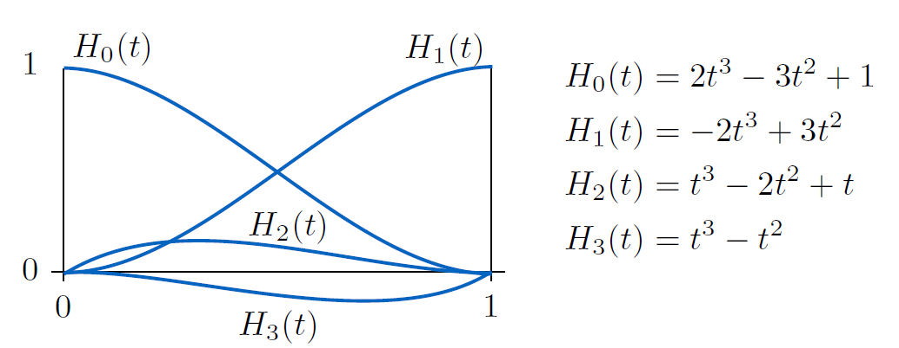

##### Hermite 样条插值

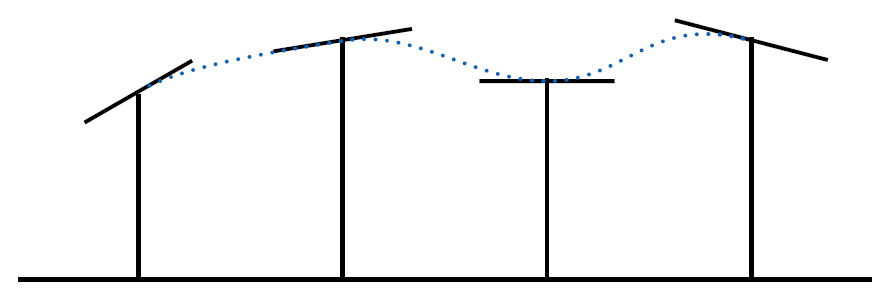

- 输入：值序列和导数
- 为什么是 cubic(三阶), 而不使用高阶多项式
  - 高阶多项式具有更多的自由度, 往往会过度振荡
  - 当我们希望保持编辑效果“局部化”时，这是不理想的
  - 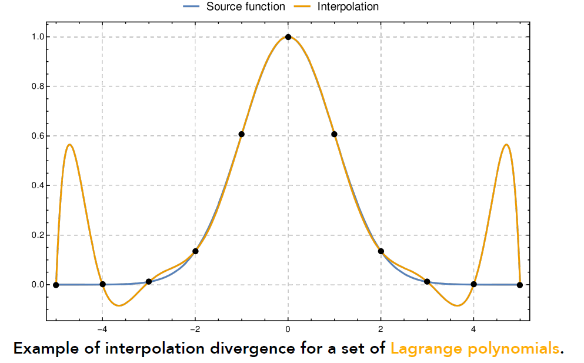

#### 8.1.2 Catmull-Rom 插值

1. Catmull-Rom 插值:

   - Catmull-Rom 插值使用了一个特殊的四点样条曲线，通过对输入的一系列控制点进行插值，生成平滑曲线

   - Cubic Hermite 插值使用两个控制点和相应的切线来定义曲线段

2. Catmull-Rom 插值

   - 输入: 值序列(至少四个)
     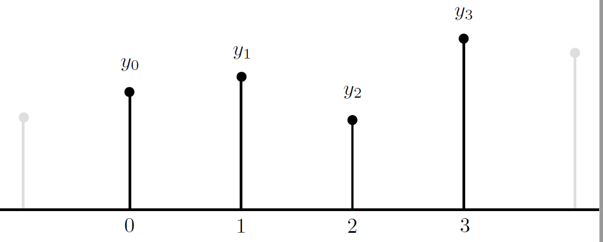
   - 切线斜率计算(依然使用 Hermite interpolation)
     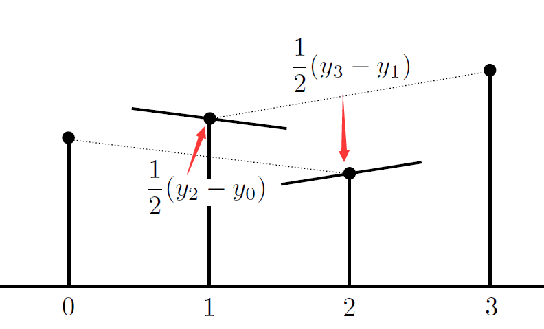

3. Catmull-Rom 样条

   - 输入: 点序列(至少 4 个)
   - 输出: C1 连续性的样条曲线
     - C1 连续性是曲线或曲面上两个相邻部分之间的平滑性质。具体而言，C1 连续性表示在连接处存在连续的切线方向。
   - 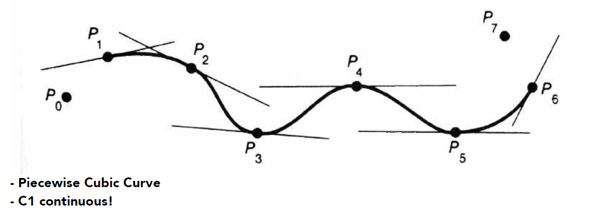

4. Catmull-Rom 的矩阵形式

   - > Catmull-Rom 和 Hermite 的区别只在于点上的导数, 即图中的 h2, h3
     > 

   - 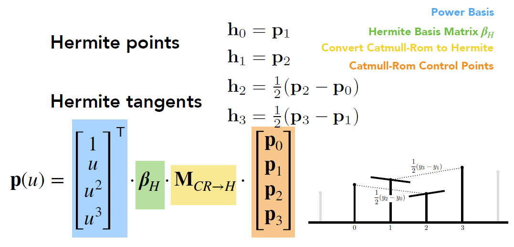

     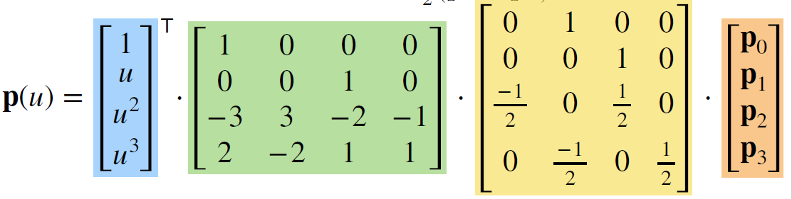

     - 增加一个矩阵(线性变换), 将之前的控制点向量 h 用 p 表示

   - 化简, 合并
     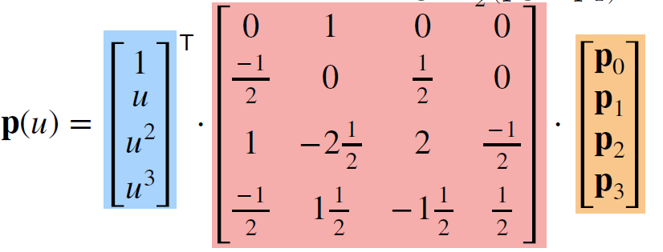 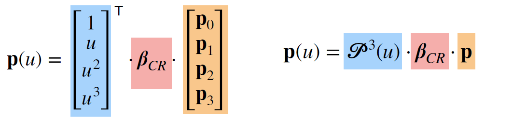

### 8.2 贝塞尔曲线（Bézier Curves）

#### 8.2.1 Hermite 与贝塞尔曲线

1. 同理, 求出样条基矩阵
   1. 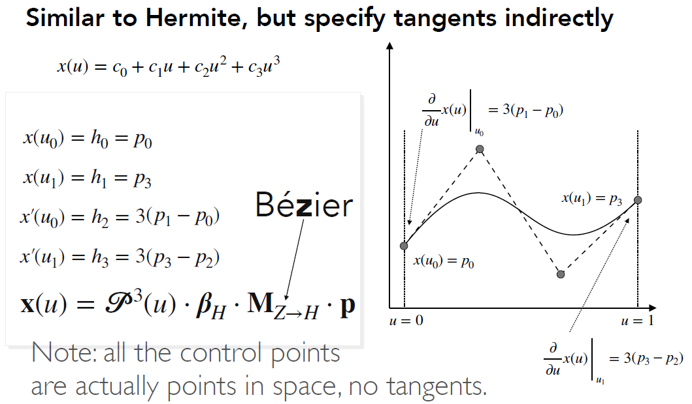 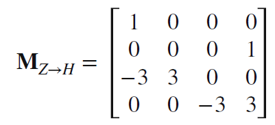
      - 跟之前的介绍的方法不同, 贝塞尔曲线的控制点并非全都会在曲线上
   2. 经典整理环节, 求得贝塞尔基函数
      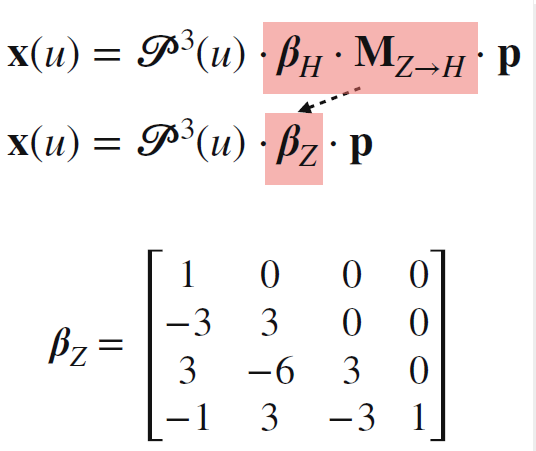 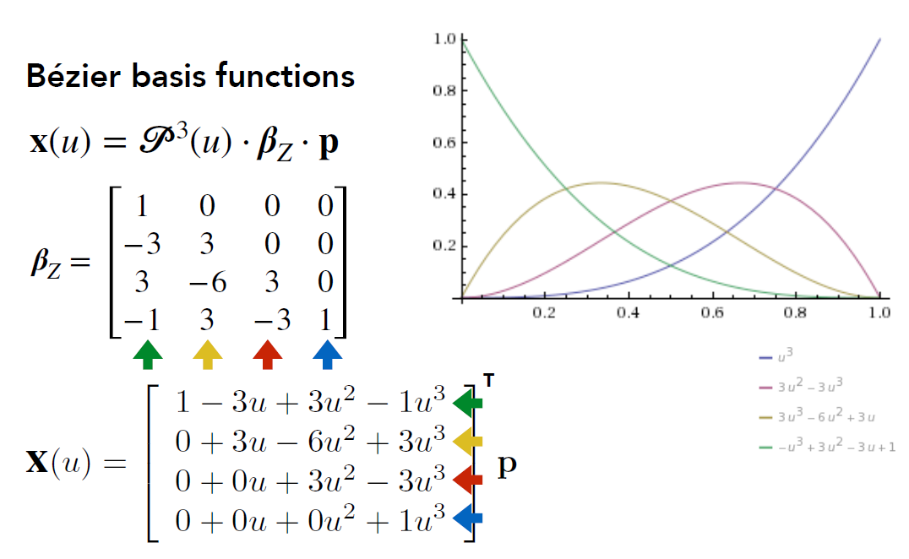

#### 8.2.2 re0 的贝塞尔曲线

> 有人写笔记不看 ppt 啊啊啊啊啊

贝塞尔曲线是通过一系列的控制点去定义某一个曲线的方式

其有以下性质：

1. 必定经过起始与终止控制点
2. 必定经与起始与终止线段相切
3. 具有仿射变换性质，可以通过移动控制点移动整条曲线
4. 凸包性质，曲线一定不会超出所有控制点构成的多边形范围

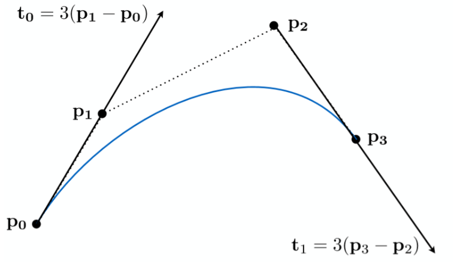

##### De Casteljau 算法

更加简便的, 计算贝塞尔曲线的步骤(以三个点为例)

1. 第一步选定一个参数 $t ∈ [ 0 , 1 ]$，在线段上找出使两端比例为$t:(1-t)$的点

   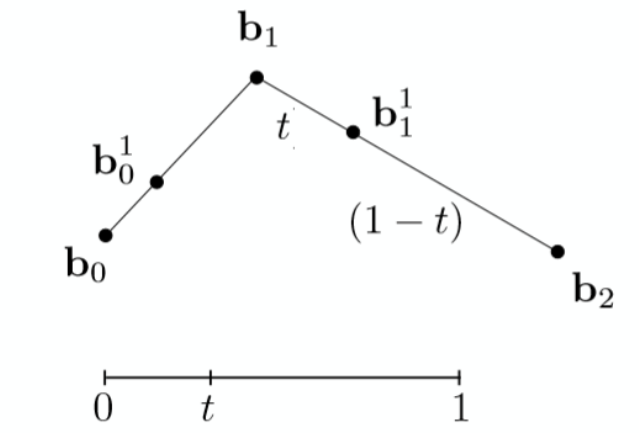

2. 连接两点，在两点上再进行一次线性插值，得贝塞尔曲线上的一点（如果点数大于 3 要递归进行第一步直到点数为 3）
   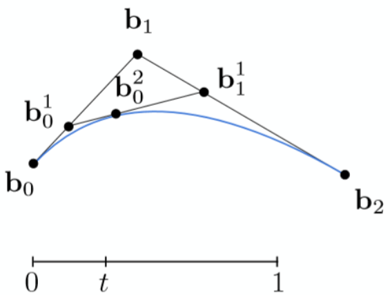

3. 最后我们得出这条贝塞尔曲线的方程为
   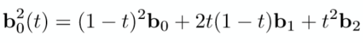

特别的，对于四个顶点的贝塞尔曲线，有这个公式
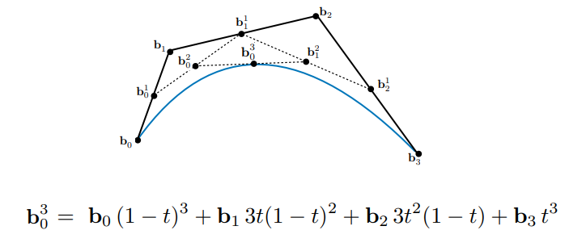

可以看到，最终得到的贝塞尔曲线方程恰好就是一个关于参数 t 的二次方程，通过数学总结，得出一个任意控制点组成的贝塞尔曲线的方程如下
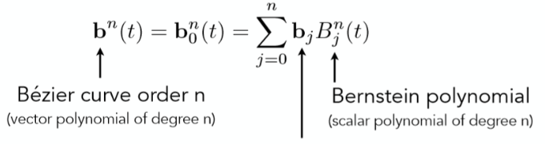
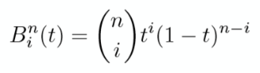

贝塞尔曲线作为曲线的主流表达方式被广泛用于字体，画图软件中，他的好处就在于无论如何进行放大都不会出现像素方块（你可以开个 pdf 放大看看字体会不会出现锯齿方块）

但是一旦点数增多，贝塞尔曲线变成高阶，就会出现一些问题, 见下

##### 分段贝塞尔曲线（Bézier Spline）

由于控制点众多，很难控制局部的贝塞尔曲线形状，越来越多的顶点会让局部的曲线变得难以控制
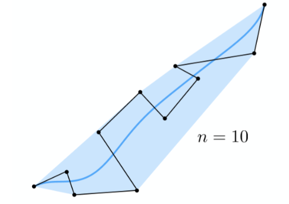

因此为了解决该问题，我们提出了分段贝塞尔曲线，即将一条高次曲线分成多条低次曲线的拼接，这样就解决了局部困难的问题
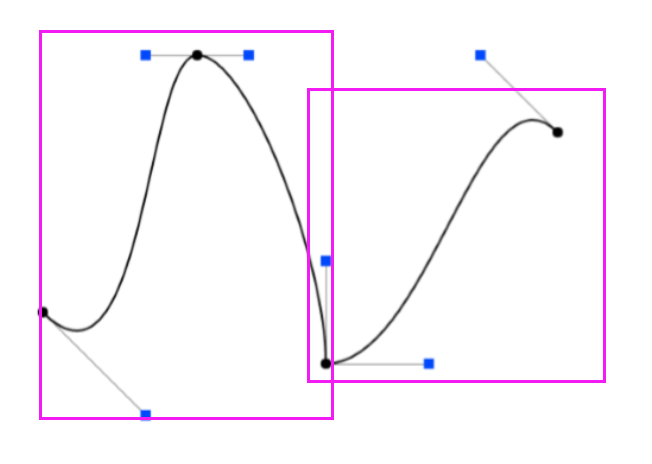

上图的衔接点其实并不光滑，如果想要让它变得光滑的话可以通过二阶导相等 等方法让拼接的点看起来较为光滑

如图, 下面两段贝塞尔曲线在 a3(b0)并不连续

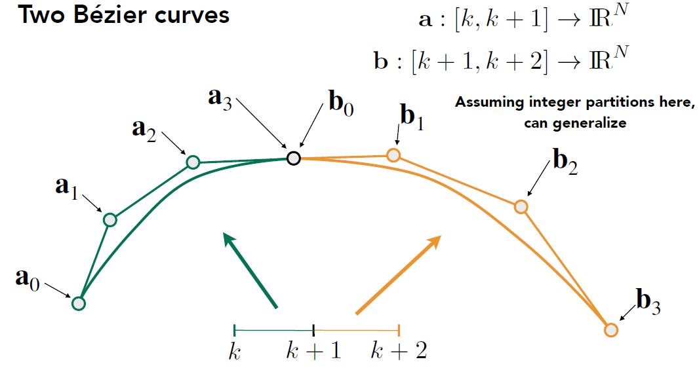

- continuity 级别
  - C0 连续性：当两个相邻的曲线段连接时，它们在连接点上有相同的位置（坐标），但不要求斜率（切线方向）一致。这意味着曲线段在连接点上没有可见的突变或间隙。
    - 即 a3=b0
  - C1 连续性：除了保持 C0 连续性外，还要求连接点处的切线方向相同，即曲线段在连接点上的切线方向是连续的。
    - $a_n = b_0 =\frac12(a_{n-1}+b_1)$

### 8.3 贝塞尔曲面（Bézier Surfaces）

其实很简单，就是贝塞尔曲线 pro
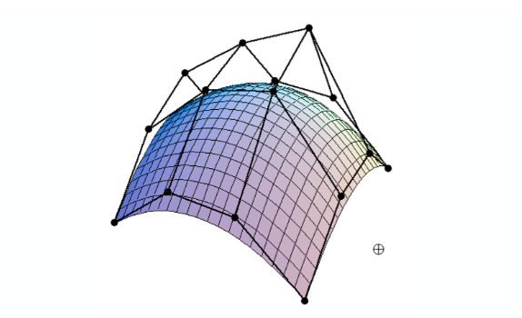

对于一个面来说，有两个参数，分别设 u ∈ [ 0 , 1 ]，v ∈ [ 0 , 1 ]
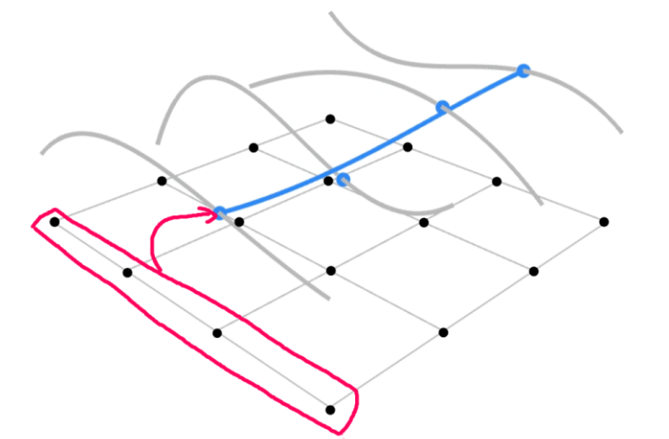

其步骤如下

1. 四条灰色曲线是贝塞尔曲线，用第一个参数 u 得到蓝色点（u 就是贝塞尔曲线的 t）
2. 在得到 4 个蓝色顶点之后，利用第二个参数 v 便可以成功得出贝塞尔曲面上的正确一点
3. 遍历所有的 u，v 值就可以成功得到一个贝塞尔曲面

了解，散！

## Lec09 网格&几何图形

### 9.1 规则网格（regular grids）

> 一种数据结构, 用于保存

由正方形组合而成，具有**简单性/效率**
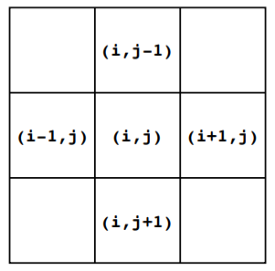

- 优点
  - 每个网格邻居固定四个
  - 易于检索和过滤
  - 存储形式简单
- 缺点
  - 可能受到各向异性影响
  - 对边缘不敏感

### 9.2 流形（Manifold）

> 如何编码表面 – 流形表示, 便于存储

多边形网格是流形网格需要满足三个条件：

- 流形网格首先必须是连通网格；
- 流形网格的每一条边最多只能**被两个面共享**；(如下图 星中心的一条边, 被五个面共享)
  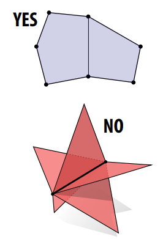
- 关联到一个顶点的多个面和该顶点形成**一个**闭合或者开放扇形 (如下图 中心的一个顶点形成了两个扇形)
  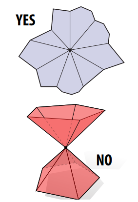

保存流形较为简便, 具体见下

### 9.3 图形的编码方法

#### 9.3.1 基本的方法

对于每个三角形，存储三个坐标点。
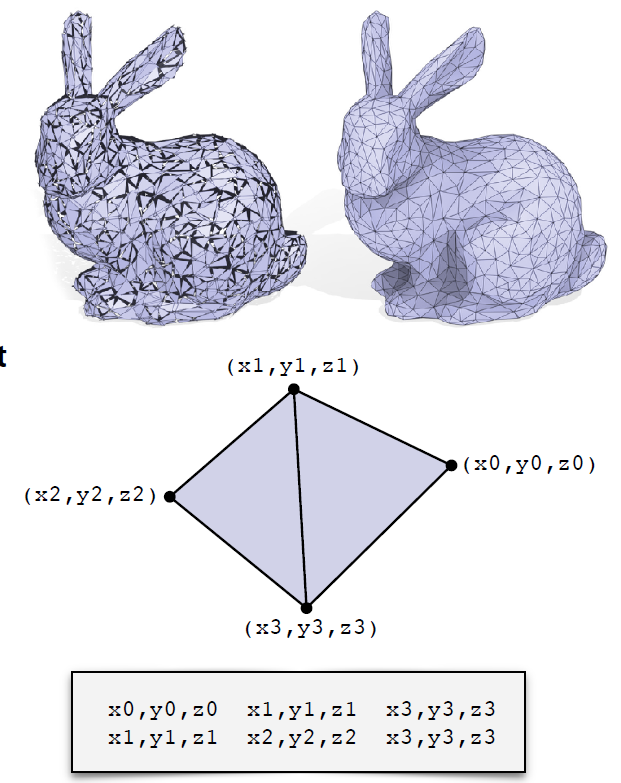

- 变成点云(三角形云?)了啊啊啊啊啊
- 优点：简单好懂(~~stupidly~~)
- 缺点
  - 浪费，三角形会共享边
  - 缺少点的连接信息, 难以确定三角形的相邻关系

#### 9.3.2 半边数据结构（Halfedge Data Structure）

数据结构 半边(Half-Edge): 以边为核心，每条边上有上下两个顶点, 左右两个邻面以及和顶点相连的四条边, 可以从一条已知边出发, 有规律地找到这个几何体的所有面、边和顶点。
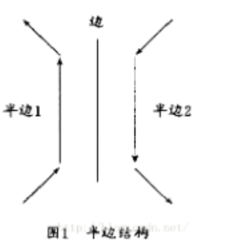
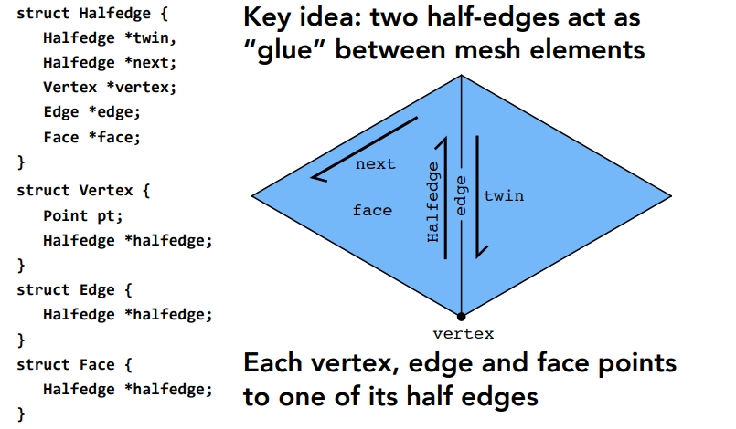

- 如上图

  - HalfEdge 存储: ① 对应的另一条半边 ② 下一条半边(同向包围出一个三角形) ③ 顶点(半边的起点) ④ 它所属的边 ⑤ 它所属的面
  - Vertex 存储: ① 该点坐标 ② 一个半边
  - Edge 存储: 完整的边上的 一个半边
  - Face 存储: 面上的 一个半边

- 优点 ①: 便于网格遍历

  1. 根据面遍历顶点: 一路 next, 得到包围面的几个半边(点)
     同样的操作, 也能从面遍历边, 或是从边出发遍历得到所属的面

     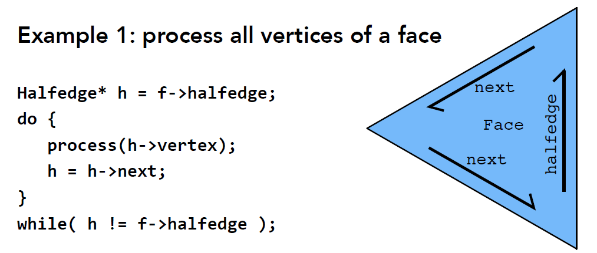

  2. 根据顶点遍历边: next 和 twin->next 不是同一条边
     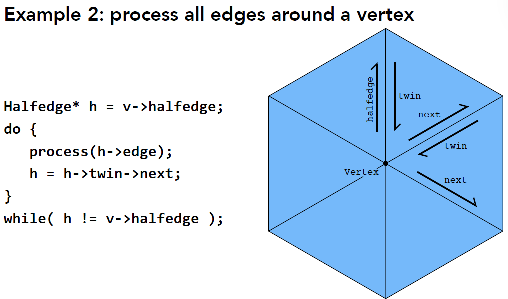

  3. 哪些面和这个面相邻

- 缺点
  - 过于零散
  - 在查询哪些是多边形以及一个多边形的边数时，需要循环找一圈

##### 半边网格的编辑

> 基本操作(原子操作)

1. 边翻转(Edge Flip)
   - 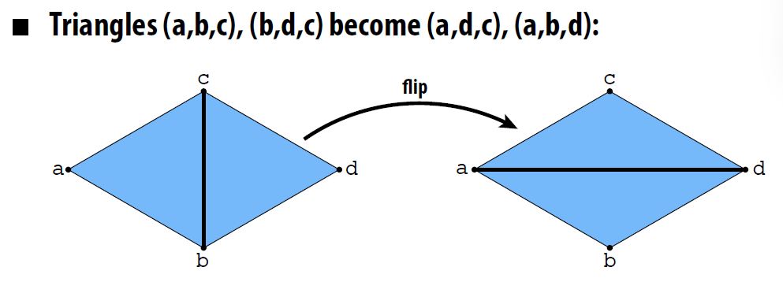
   - 操作需要分配边的指针
   - 并没有元素被创造/销毁
2. 边分割(Edge Split (三角形)): 将一个三角形划分成两个新的三角形
   - 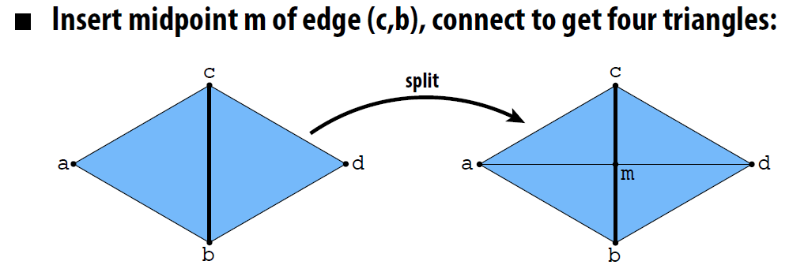
   - 需要添加新元素(一个点)
   - 许多指针需要重新分配
3. 边坍缩(Edge Collapse): 将一个三角形网格中的边缩减为一个顶点
   - 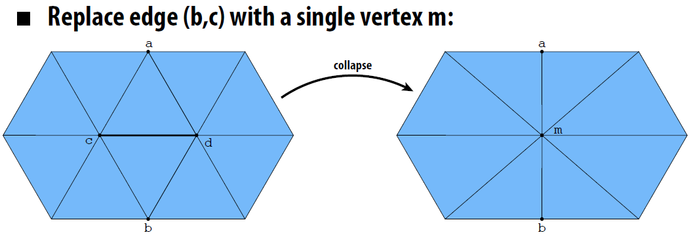
   - 要删除新元素
   - 许多指针需要重新分配

### 9.4 几何处理

> 几何处理流程
>
> 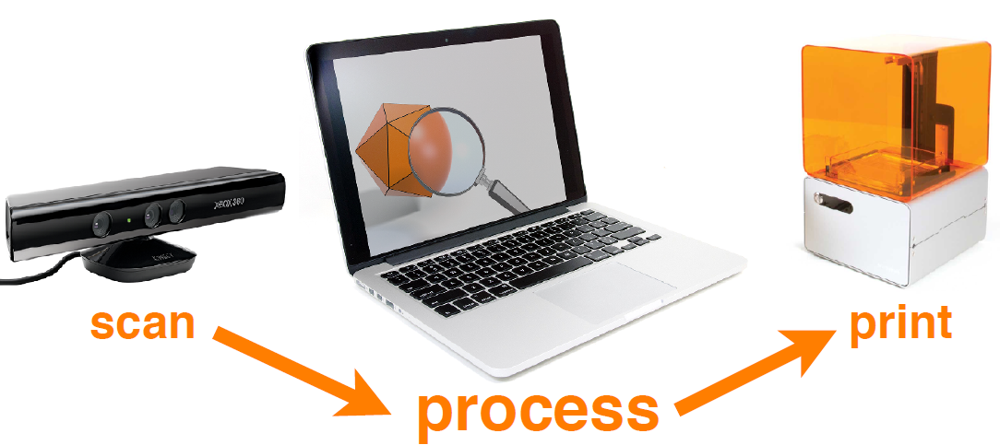
>
> 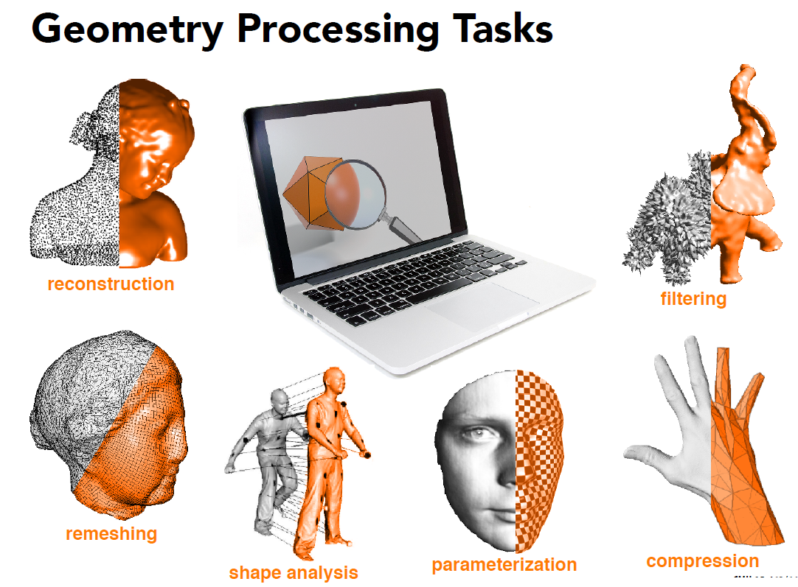

1. 重建 reconstruction
   - 根据给定的集合样本生成一个表面 or 几何体的过程
   - 所谓的“样本”可以采用多种形式，包括点、带有法线信息的点、图像对/集合（多视角立体成像）、线密度积分（MRI/CT 扫描）等等。
   - 获取表面的方法有很多种技术可供选择：
     - 基于轮廓的方法：这些方法利用从多个视角获得的轮廓信息来估计物体的形状。视觉外壳（visual hull）算法是基于轮廓的一种常见方法。
     - 基于 Voronoi 图的方法：这些方法利用 Voronoi 图的概念创建适应给定样本的表面。Power crust 是基于 Voronoi 图的一种重建技术。
     - 基于偏微分方程（PDE）的方法：偏微分方程（PDE）方法通过求解定义在区域上的 PDE 来确定表面。Poisson 重建是一种著名的基于 PDE 的表面重建方法。
     - Radon 变换和等值面提取：这些方法涉及将给定样本转换为不同的表示形式，如 Radon 变换，然后从这个转换后的表示中提取等值面。Marching cubes 是一种广泛使用的等值面提取算法。
   - 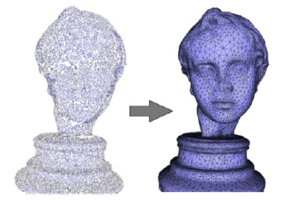
2. upsampling

- 通过插值提高分辨率
- 对于图片: 双线性、双三次插值
- 对于多边形网格（Polygon Meshes），有以下两种常见的上采样技术：
  1.  细分（Subdivision）：细分是一种通过逐步划分和更新网格的拓扑结构来增加网格分辨率的方法。常见的细分算法包括 Catmull-Clark 细分和 Loop 细分，它们可以生成更加平滑的曲面，同时保持原始网格的整体形状。
  2.  双边上采样（Bilateral Upsampling）：双边上采样是一种将低分辨率网格映射到高分辨率网格的方法。该方法不仅考虑了空间位置的相似性，还考虑了法线方向和颜色等信息的相似性，从而在保持细节的同时，有效地增加了网格的分辨率。
  3.  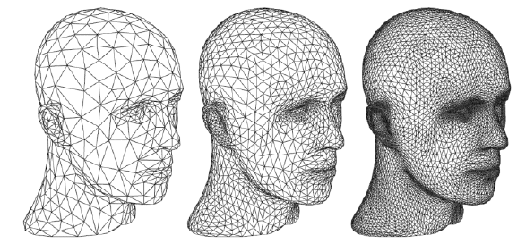

3. 降采样 downsampling
   - 尽量保持外观的同时, 降低分辨率
   - 对于图片: 最近邻 nearest-neighbor、双线性 bilinear、双三次插值 bicubic interpolation
   - 对于点云, 使用 subsampling
   - 对于多边形网格, 使用迭代抽取 iterative decimation，变分形状近似 variational shape approximation
     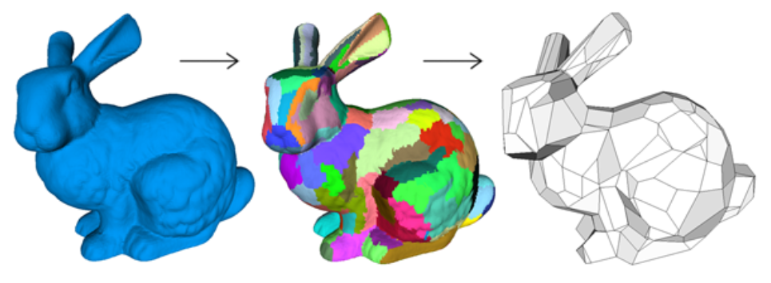
4. 重采样 resampling
   - 修改样本分布以提高质量
   - 对于图片: 不需要担心(pixel 不需要考虑连接关系)
   - 对于网格: 需要修改多边形形状
     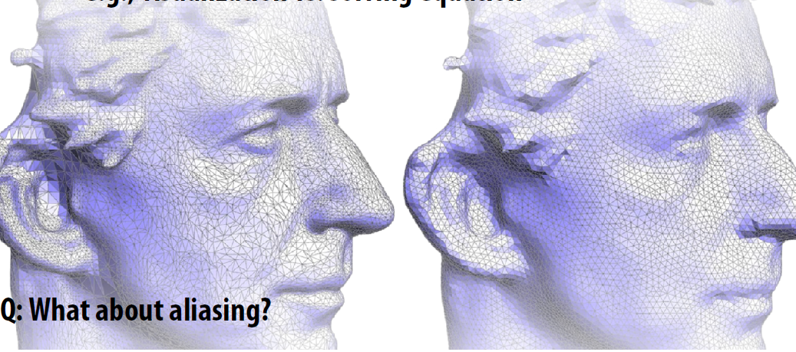
5. 过滤 Filtering
   - 消除噪声 or 强调重要特征(如边缘)
   - 对于图像: 模糊, 双边过滤, 边缘检测
   - 对于多边形网格
     - 曲率流
     - 双边滤波器
     - 光谱滤波器
   - 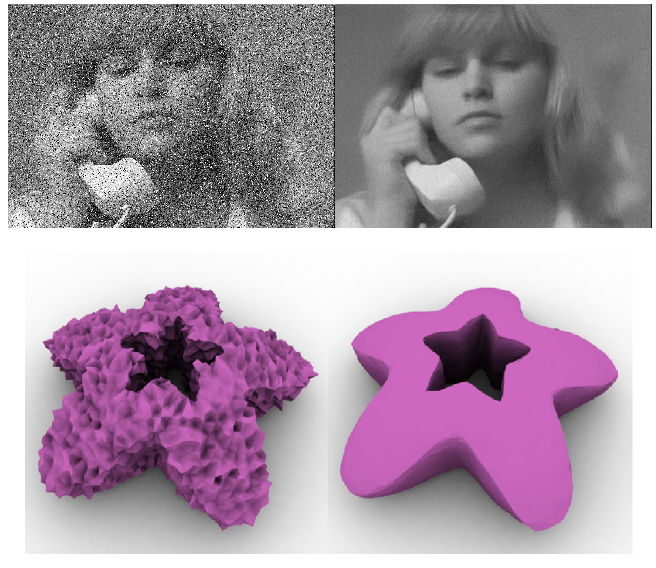
6. 压缩 Compression
   - 通过消除冗余数据 or 近似的不重要数据 减少存储大小
   - 图片：
     - 跑完全程，胡！man 编码-无损
     - 余弦/小波（JPEG/MPEG）-有损
     - 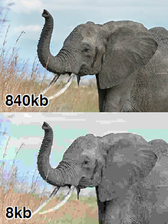
   - 多边形网格：
     - 压缩几何图形和连接
     - 许多技术（有损和无损）
     - 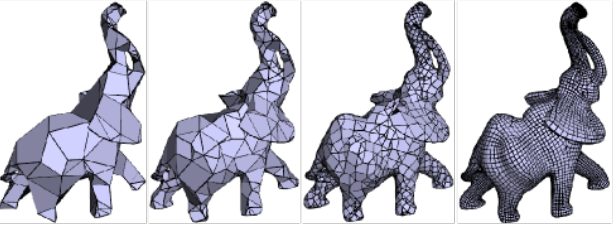
7. 形状分析 Shape Analysis
   - 识别/理解重要的语义特征
   - 图像：计算机视觉、分割、人脸检测…
   - 多边形网格：分割、对应、对称检测…
   - 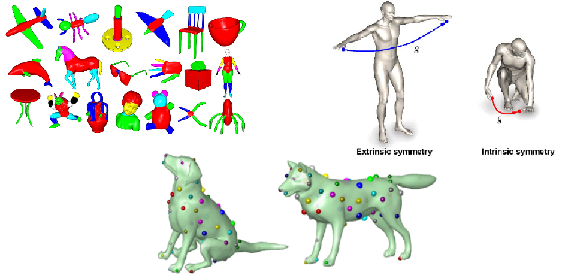

### 9.5 曲面细分（Mesh subdivision）

曲面细分的意义是将一个模型的面合理的**分成更多小的面**，从而提升模型精度，提高渲染效果（blender 的表面细分）

| 细分前                                                                                           | 细分后                                                                                           |
| ------------------------------------------------------------------------------------------------ | ------------------------------------------------------------------------------------------------ |
| 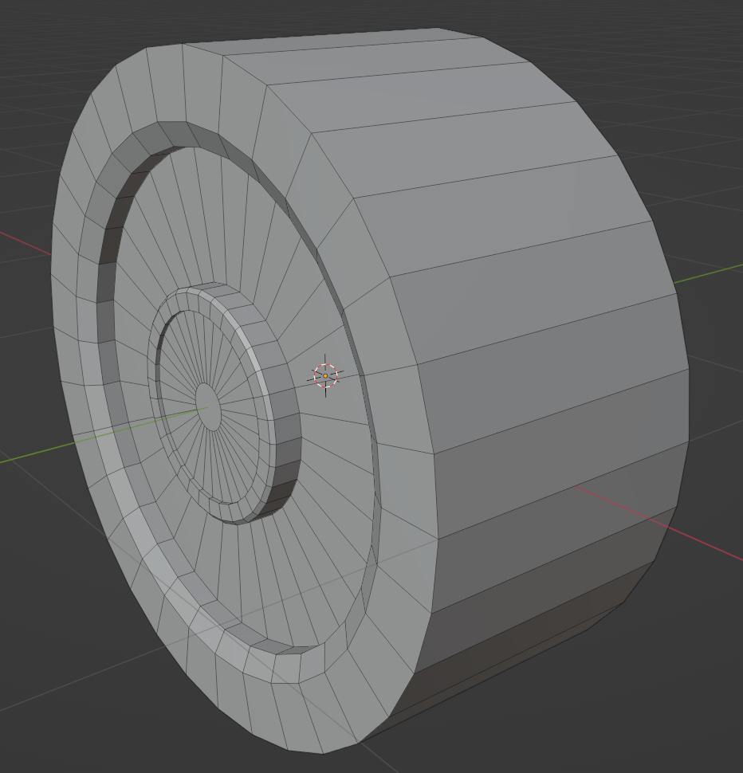 | 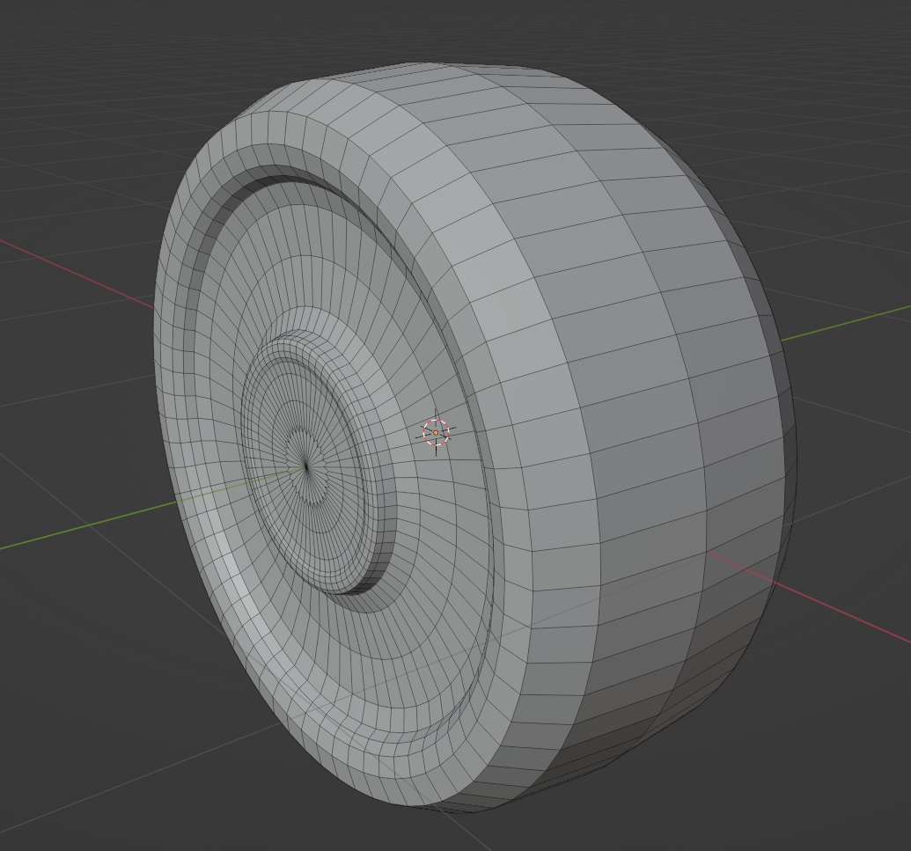 |

可以看到，对比原模型，新模型的面数更多，而且在一些棱角的地方衔接更好，并非仅仅是下图的简单细分
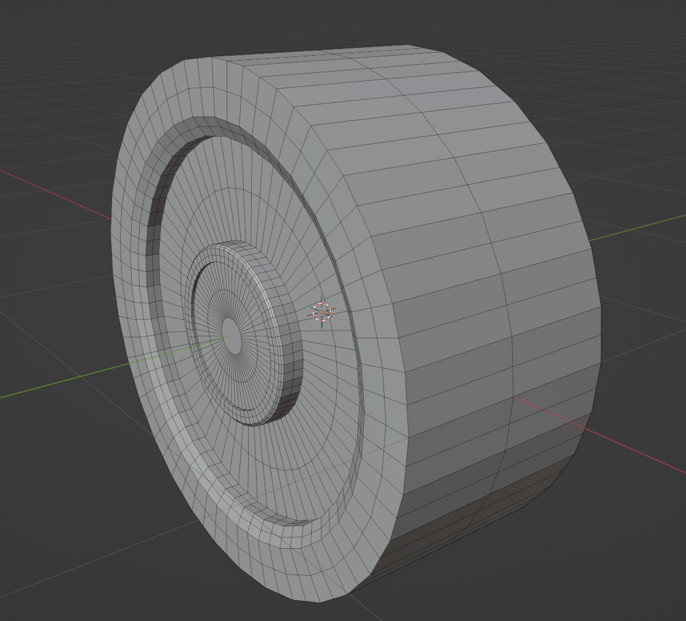

> 那么，这种细分后能够自动实现"衔接"的效果是如何通过算法实现呢？
>
> 在这之前，我们先了解一下几种细分的方式

#### 9.5.1 Loop 细分

loop 细分是**专门针对三角形的细分**，它的核心是把每个三角形分为四个。

##### 细分步骤

1. 生成更多三角形或顶点
   
   如图连接每条边的中点生成一个新的三角形，原来的三角形就会被分割成 4 个三角形
1. 调整这些三角形或顶点的位置
   我们将生成的顶点分为两类

   - 新生成的顶点
     对于新生成的顶点做如下处理：
     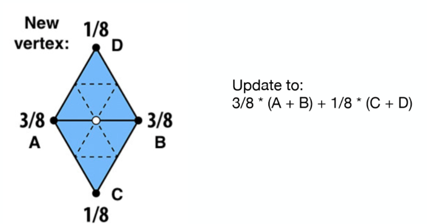

   - 原来就有的顶点
     对于旧的顶点，做如下处理：
     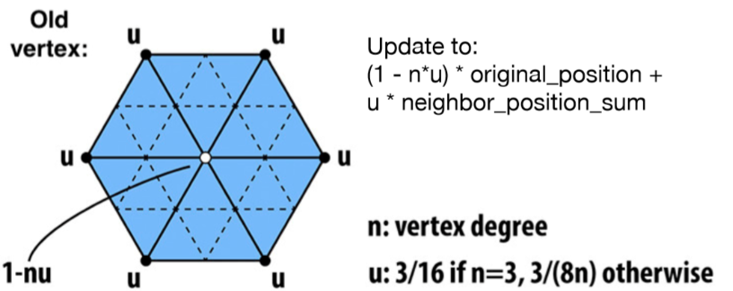
     n 是顶点度数，u 是与 n 有关的数（？？？？？？？我也不知道什么关系，但是反正 games101 是这么说的)

#### 9.5.2 Catmull-Clark 细分

> Loop 细分针对是所有三角形面，那么对于非三角形面该怎么办呢？
>
> 这就出现了 Catmull-Clark 细分来解决这个问题

**对于三角形和四边形的混合面**
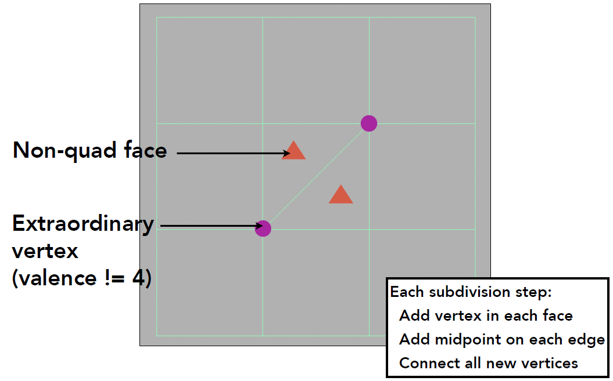

- 对于所有不是四边形的面，称之为**Non-quad face**(非四边形面 ~~复读笑死~~)
- 所有度不为 4 的顶点称之为奇异点
- 每次细分在每个非四边形面中都添加一个点，在非四边形面的每条边的中点也都添加一个点，面上的新顶点连接所有边上的新顶点

结果如图
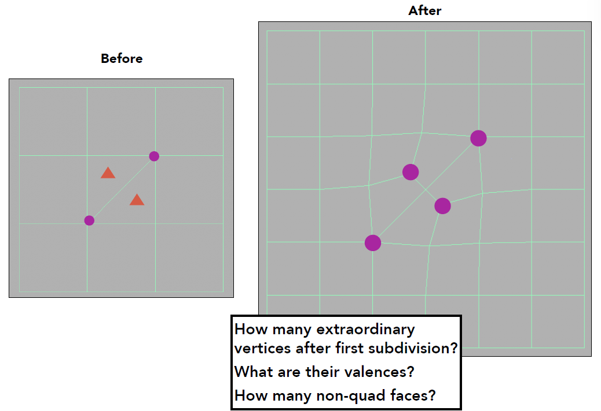

我们可以看到，对于细分后的面

1. 有几个非四边形面，就会多出几个奇异点 (在面中心)
2. 新多出来的奇异点的度数与原来所在面的边数相等 (因为连接了面的边的中心)
3. 所有面都会变成四边形，且往后奇异点数目**不再增加**

再次进行细分
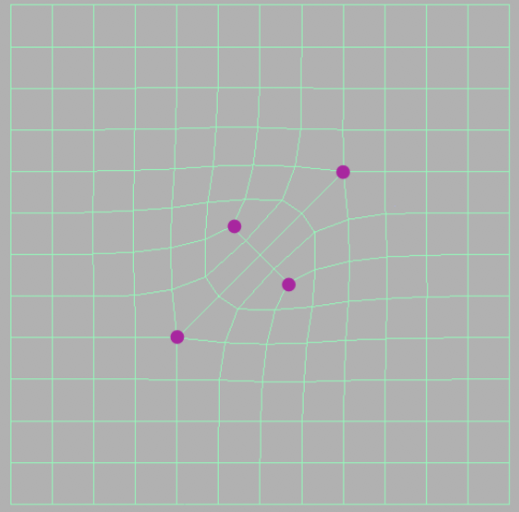

#### 对比

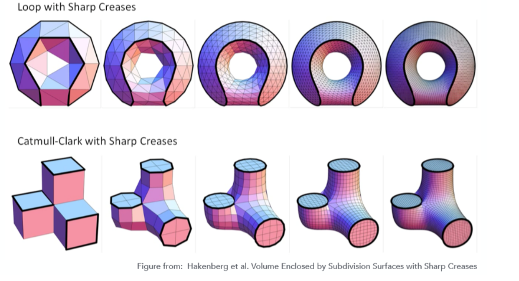

### 9.6 曲面简化（Mesh Smplication）

> 对于一个物体，如果它的面数过多就有可能造成渲染卡顿的问题
>
> 为了解决这个问题，可以使用曲面化简

| 原模型                                                                                           | 简化模型                                                                                         |
| ------------------------------------------------------------------------------------------------ | ------------------------------------------------------------------------------------------------ |
| 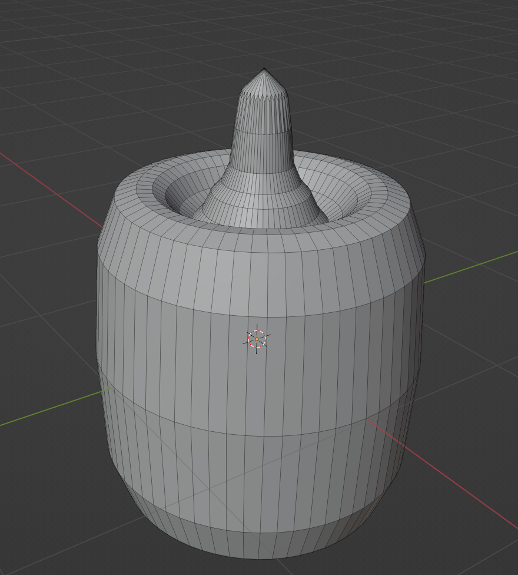 | 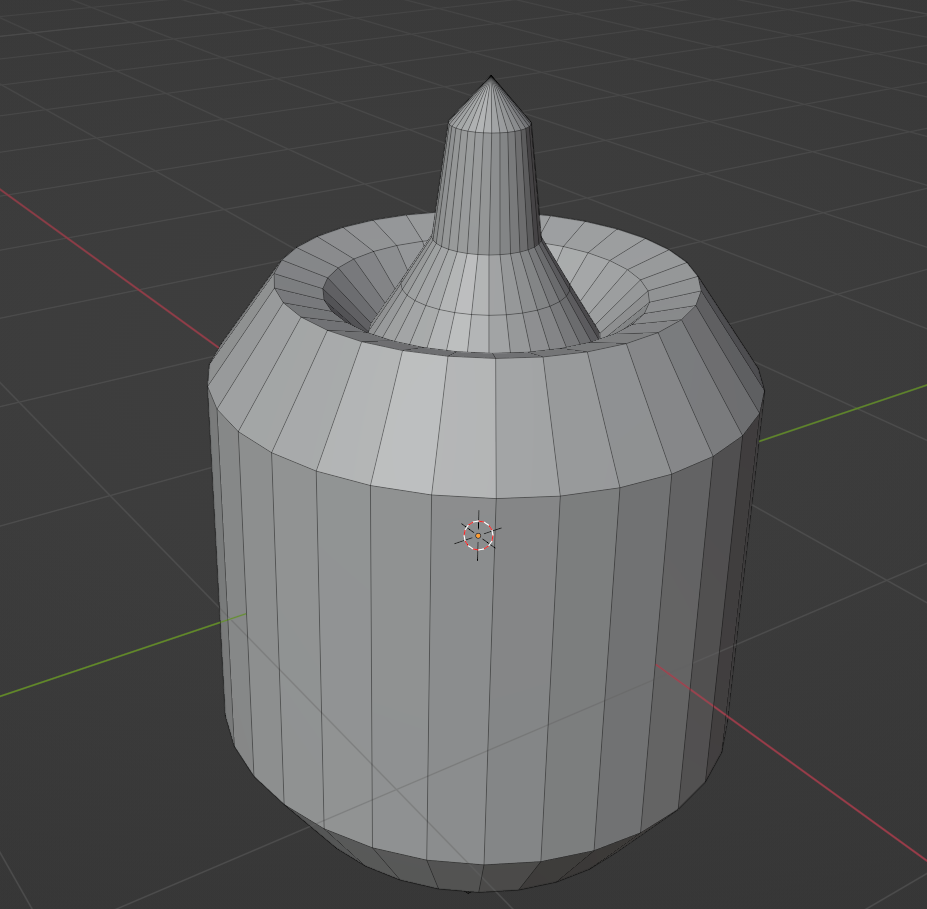 |

可以看到，曲面简化其实类似于曲面细分的逆应用，那么这又是如何实现的呢？

**边坍缩**: 将一条边的两个顶点合成为一个顶点。

- 如何坍缩一条边, 使得原模型样貌被改变的程度最小 ※

- 普遍采用**二次误差度量法**来处理
  - **二次误差度量**: 坍缩之后蓝色新顶点所在的位置 与 原来各个平面的垂直距离之和。
  - 如果能够使得这个误差最小，那么对整个模型样貌修改一定程度上也会较小
    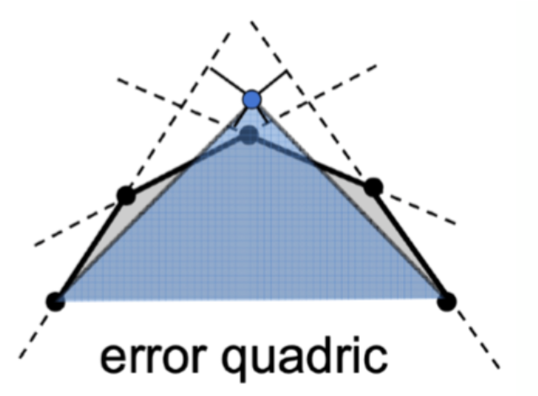

1. 为模型每条边赋值，其值为坍缩这条边之后，代替两个老顶点的新顶点所能得到的**最小二次误差度量**
2. 选取权值最小的边做坍缩，新顶点位置为原来计算得出二次误差的位置
3. 最小的位置坍缩完之后，与之相连其他的边的位置会改动，更新这些边的权值
4. 重复上述步骤，直到到达终止条件

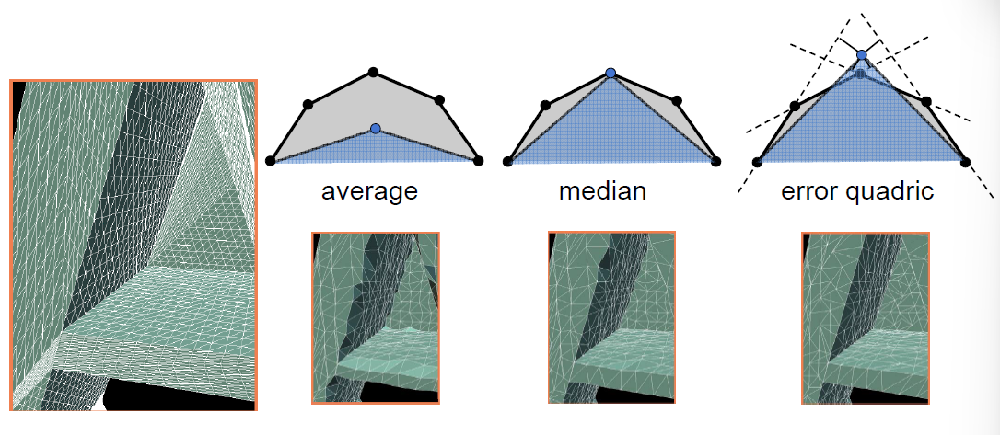

#### lod 技术（Level of Details）

LOD 技术根据模型的节点在显示环境中所处的位置和重要度来进行简化，其核心就是曲面简化技术（这就是为什么如果电脑不好打游戏看远处的场景或着传送的时候场景模型会从很破或者很奇怪的形状逐渐转化成正常）

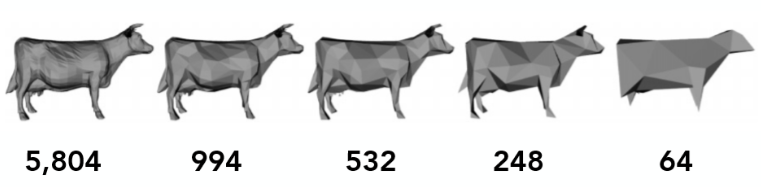

### 9.7 曲面正则化(Mesh Regularization)

> 即三角形的规则化

1. 什么是“好”三角形网格

   - 形状: 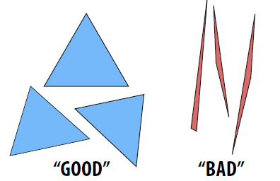
   - 更具体的衡量方法: Delaunay, 三角形构成的圆环内部不包含其他顶点
     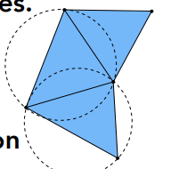
     - 这个方法不一定最好, 但是便于模拟
     - 并非总是最适合形状近似

2. 经验法则: 规则 顶点度数

   - 三角形网格: 理想情况是每个顶点度都=6
   - 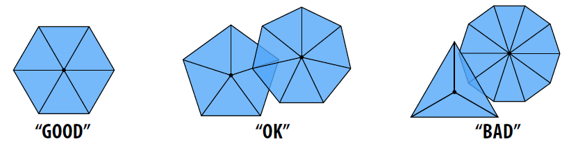
   - 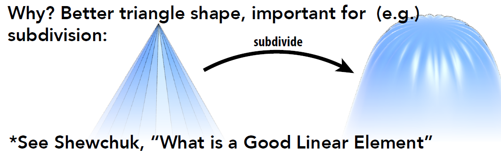

3. 各向同性重熔 Isotropic Remeshing

   - 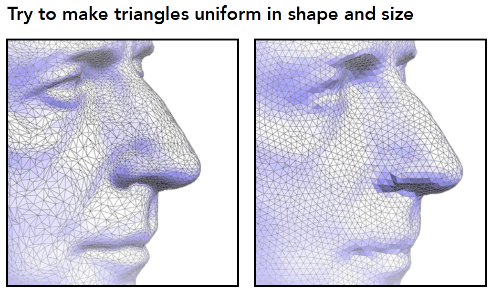

4. 度数改进

   - Edge flips
     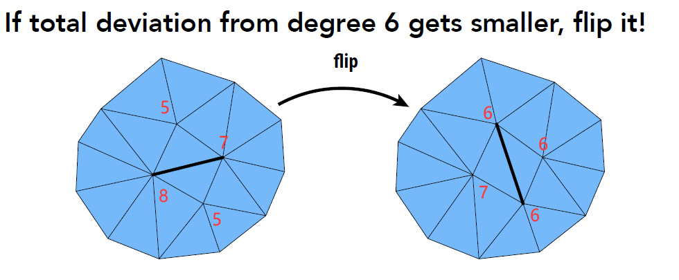

5. 让三角形的形状更圆(接近正三角形)

   - Delaunay 不是指等边三角形
   - 通常可以通过使顶点居中来改善形状：
     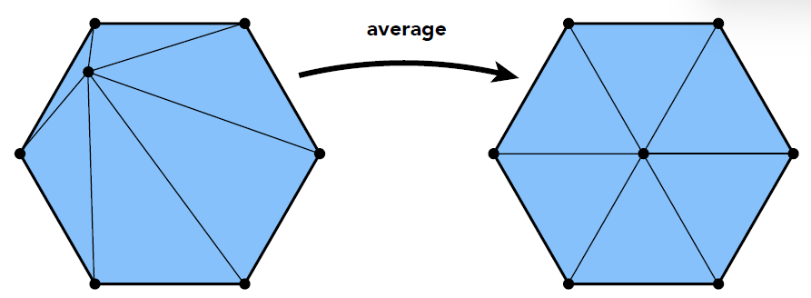
     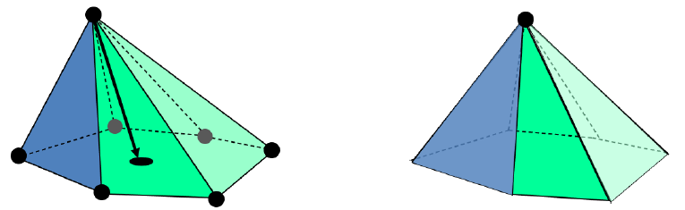

6. 各向同性(网格)重划算法(Isotropic Remeshing Algorithm)

   > 重复四个步骤：

   1. 分割边: 将长度超过平均边长的边进行分割, 每一段的长度为平均边长的 4/3 倍
   2. 合并边: 将长度小于平均边长的 4/5 倍边进行合并
   3. 翻转边(Edge filp): 以提高顶点度
   4. 切线居中: 将顶点沿着与其相邻的边的切线方向进行调整，使其处于切线的中心位置

# 光线追踪 (Ray-Tracing)

## Lec10 辐射度量学（Radiometry）

> 为什么需要辐射度量学？
>
> 1. whited-style 光线追踪并没有对漫反射的光线进行追踪，而是直接返回当前着色点颜色
> 2. 在计算光源直接照射的贡献时，使用了[Blinn-Phong 模型](#5.2.1 简单着色(Blinn-Phong 反射模型))，而 Blinn-Phong 模型本身就是一个不准确的经验模型，使用的这种模型的 whited-style 光线追踪自身自然也是不正确的
> 3. 我们在 whited-style 光线追踪中对光的定义只是简单的用 3 维(R,G,B)向量来描述
>
> 我也不是很清楚为什么上课要先讲这个哈哈

因此，辐射度量学主要解决引言中的这些问题

- 照明测量系统和单位测量
- 测量光的空间特性
  - 新术语：辐射通量、强度、辐照度、辐射亮度
- 以物理正确的方式进行照明计算
  - 假设：光的几何光学模型
  - 光子以直线传播，用射线表示 (不考虑波动性)

> 测量光 → 测量光子的能量

### 辐射能量 Radiant energy

- 辐射能量(Radiant energy): 电磁辐射的能量 Q
- 单位: 能量/做功单位 焦耳`J`。

辐射能量的本质: 某一场景中光子撞击(photons)的次数 (total # of hits)

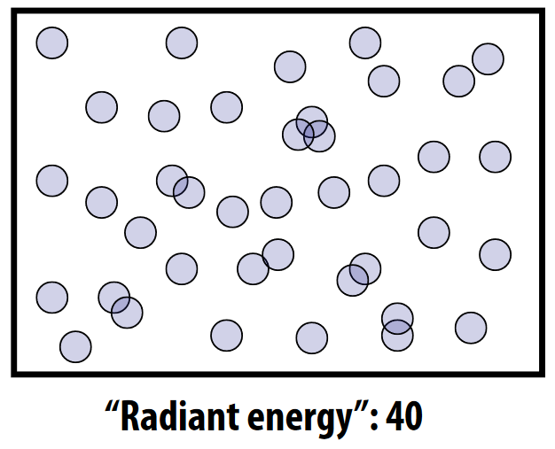

### 辐射通量 Radiant flux (power)

- ==辐射通量(Radiant flux)== : 单位时间的能量 Φ

- 单位: 功率单位 瓦特`W`(J/s)

指单位时间内发射、反射、传输或接收的能量。

### 辐照度 Irradiance ※

- ==辐照度(Irradiance, $E$)== : 在**单位时间**内，每个**单位面积**上接受到的光照的能量 (受照面单位面积上的辐射通量)

  - 单位面积法向量

- 单位：瓦每平方米（W/㎡）

- 辐照度的计算

  - $E = \Phi / A cos(\theta) , \theta=光线与平面法向量夹角$  
    $微分形式: E = \frac{d\Phi(x)}{dA}$

  - 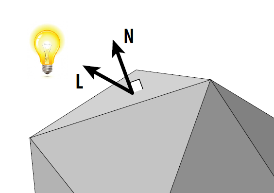 
    $N: 平面单位法向量, L: 光线单位方向向量$

    ```c++
    double surfaceColor(Vec3 N, Vec3 L) {
    	return max(0.f, dot(N, L)); // 当点乘结果为负时, 颜色设置为黑色(0)
    }
    ```

### 辐射强度 Radiant Intensity ※

- 一个单位立体角(Soild Angle)上的辐射通量(flux)

- 如果一个点光源向周围**均匀地**辐射能量，那么任何一个方向上的 $intensity(即I) = \Phi /d\omega =\frac{\Phi \cdot r^2}{dA} = Φ / 4π$
  - $\Phi = \int_{S^2}Id\omega = 4\pi I \Rightarrow I=\Phi/4\pi$
    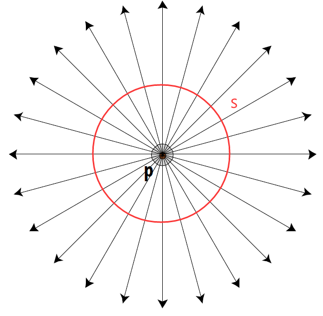
  - $I(\omega)=\frac{d\Phi}{d\omega} (Ws^{-1}r^{-1})$

> 上面是均匀的情况, 如果不均匀(物理世界中也正是不均匀的), 就需要用到立体角来度量 power
>
> 那么 什么是立体角呢

### 立体角 Soild Angle

- **角度**：从圆心出发，张开一个角，会对应一个弧长。角度 = 弧长/半径
- **立体角**：从球心出发对应的球面上的面积/半径的平方

  - 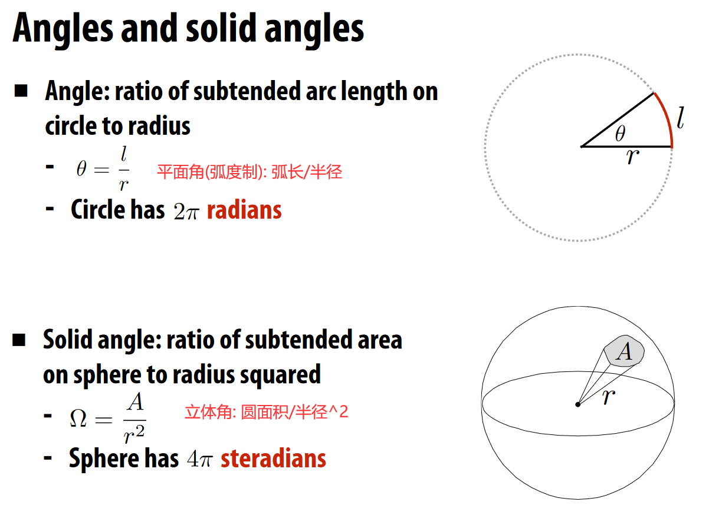

- ==单位立体角== （方向性的强度）：定义球面上的方形单位面积为 dA，再除以半径的平方。
  - 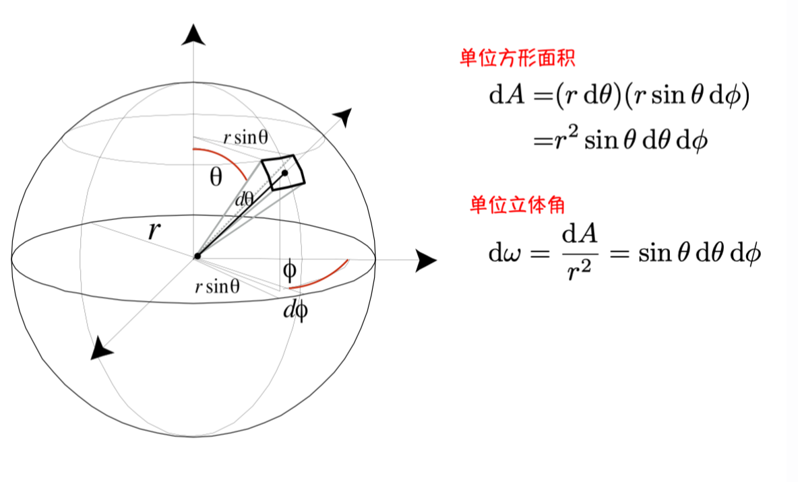
  - $\Omega = \int _{S^2}d\omega = \int_0^{2\pi}\int_0^{\pi}sin\theta\ d\theta \ d\phi = 4\pi$

### 辐射 Radiance ※

1. ==**辐射 Radince L**== : Radiant Flux(Power) 它在每个单位立体角、每个投影的面上有多少

   - 单位时间内, 某个单位面，往某个单位立体角方向上的发出的能量
   - 辐射是辐照度 Irradiance 的单位角密度 (单位时间, 单位面积 + 单位立体角接收到的能量)
   - $辐射L(p, \omega) = \frac {dE\omega(p)}{d\omega} (W\cdot m^{-2}s^{-1}r^{}) \textcolor{orange}{(E为点乘\vec\omega后的结果, 无方向)}= \frac {d\vec {E(p)}}{d\omega \ cos\theta}=\frac {d\Phi(p)}{d\vec A\ d\vec\omega \ cos\theta}$
   - 光线在传播过程中的能量。
   - 但是这还不够精确, 我们还需要知道每个波长的情况
     即要完整描述光, 需要知道: 单位时间内 单位面积 单位立体角 单位波长的辐射能量

2. ==场辐射(File Radiance)== 定义：空间中某一点在给定方向上的场辐射（亮度 luminance）是垂直于该方向的单位面积上每单位立体角的功率。
   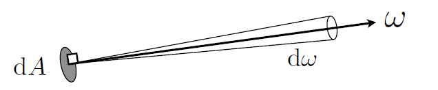

3. ==入射表面辐射(Incident Surface Radiance)== : 到达表面的单位立体角的辐照度 (射线射向表面)
   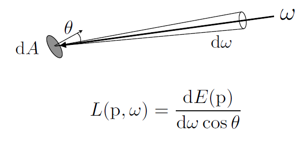
4. ==出射表面辐射度(Exiting Surface Radiance)== : 是离开表面的每单位投影面积的强度 (表面向外射出)
   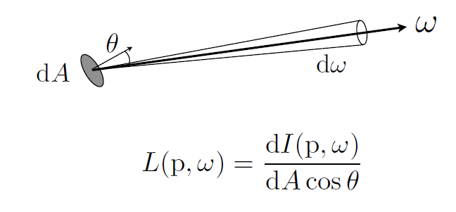

### 辐射的计算

1. 环境辐照度
   - 因为入射光来自各个放线, 需要计算整个表面的通量
   - $dE(p, \omega)=L_i(p,\omega)cos\theta d\omega\\E(p, \omega)=\int _{H^2}L_i(p,\omega)cos\theta d\omega$
     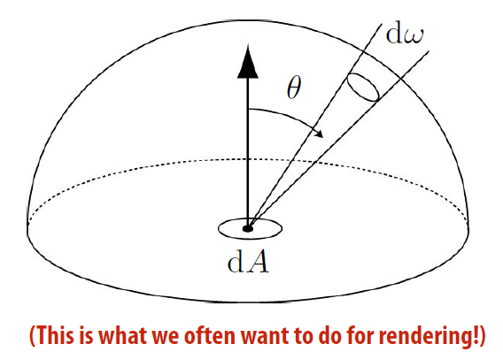
2. 若光源在半球面上是均匀的: $E(p) = \int_{H^2}Ld\omega = L\int_0^{2\pi}\int_0^{\pi/2}sin\theta\ d\theta \ d\phi = L\pi$
3. 若光源是从某个区域发出的: $E(p) = \int_{H^2}Ld\omega = L\int_{\Omega}cos\theta d\omega =L\Omega^{\perp}$
   - 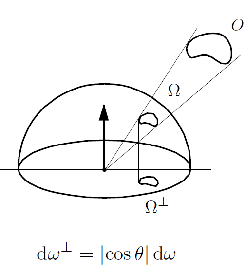
   - 投影立体角: ① 余弦加权立体角 ② 将对象 O 投影到单位球体上, 然后投影到平面上

### 光度学 Photometry

略!

## Lec11 渲染方程 (The Rendering Equation)

> 渲染的本质: 给定某个点 p 和一个方向 ω~0~, 求出该处的辐射(Radiance, L), 即计算$L(p, \omega_o)$

==渲染方程== : $L_o(p, \omega_o) = L_e(p, \omega_o) + \int _{H^2}f_r(p, \omega_i→\omega_o)L_i(p, \omega_i)cos\theta d\omega_i$

- $p: 需要计算的点; \omega_o: 需要计算的方向$
- $L_o(p, \omega_o)$: p 沿着出射方向 ω~o~观察到的辐射亮度
- $L_e(p, \omega_o)$: 表示在点 p 处朝向 ωo 方向的自发辐射亮度(光源)。
  - 如果没有自发辐射，则此项为 0。
- $\int _{H^2}f_r(p, \omega_i→\omega_o)L_i(p, \omega_i)cos\theta d\omega_i$: 间接光照
  - $f_r(p, \omega_i→\omega_o)$: 表面反射率, BRDF
  - $L_i(p, \omega_i)$: 从$\omega_i$方向进入点 p 的处的辐射亮度
  - cosθ: 是入射方向 ω~i~与法向量 n 的夹角余弦值
  - H^2^: 半球体上的所有方向

### 双向反射分布函数 BRDF

#### 反射 Reflection

1. 基本反射函数

   | 理想镜面                                                                                            | 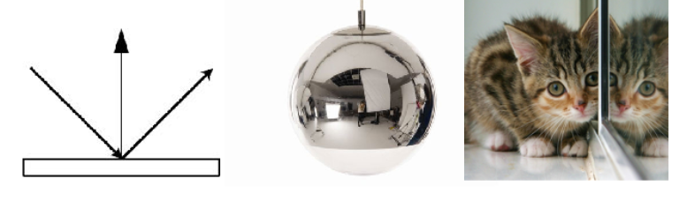 |
   | --------------------------------------------------------------------------------------------------- | ------------------------------------------------------------------------------------------------- |
   | 理想漫反射: 在各个方向均匀反射                                                                      | 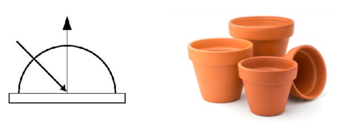 |
   | 光泽反射: 大部分光分布在反射方向上<br />即[Blin-Phong 反射](# 5.2.1 简单着色(Blinn-Phong 反射模型)) | 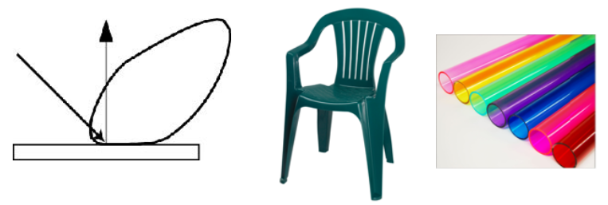  |
   | 可逆反射: 反射光线返回到光源                                                                        | 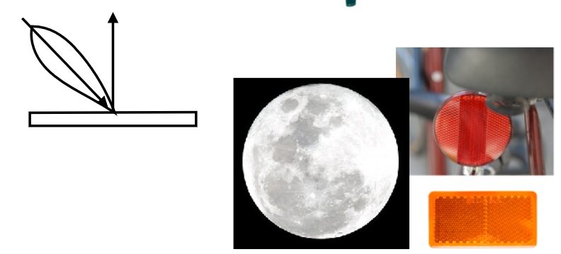  |

#### 散射 Scattering

光子的散射

- 弹离表面
- 透过表面: 折射定理$\eta_i sin\theta_i = \eta_t sin \theta_t$
- 在表面内部弹跳
- 吸收再发射

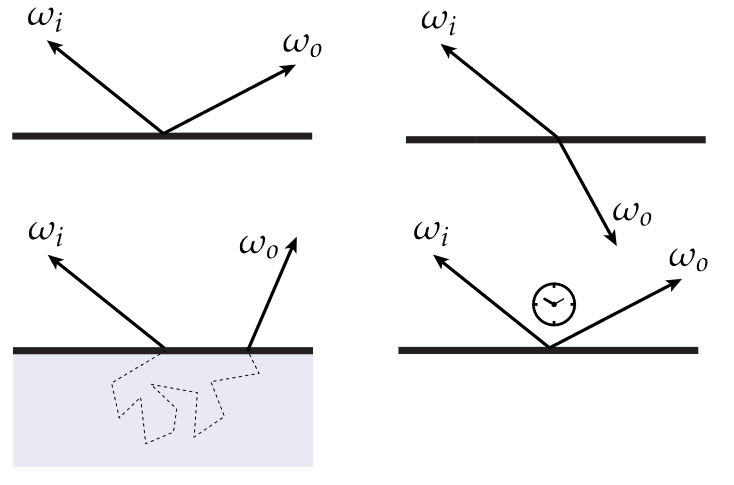

#### BRDF

Bidirectional reflectance distribution function: 双向反射分布函数, 描述入射光线经过某个表面反射后如何在各个出射方向上分布

给定入射方向 ω~i~，在任意给定的出射方向 ω~o~上有多少光被散射?

- 用分布$f_r(\omega_i→\omega_o)$来描述, 即为==表面反射率==
- $f_r(\omega_i→\omega_o)\geq0$: 反射率不可能为负
- $ \int \_{H^2}f_r(p, \omega_i→\omega_o)L_i(p, \omega_i)cos\theta d\omega_i \leq 1$: 能量守恒, 表面反射能量
- $f_r(\omega_i→\omega_o) = f_r(\omega_o→\omega_i)$: 交换入射和反射, 值不变

##### **BRDF 的计算**

- 定义式: $f_r(\omega_i→\omega_o) = \frac{dL_r(\omega_r)}{dE_i(\omega_i)}=\frac{dL_r(\omega_r)}{L_i(\omega_i)cos\theta_id\omega_i} (s^{-1}r^{-1})$
  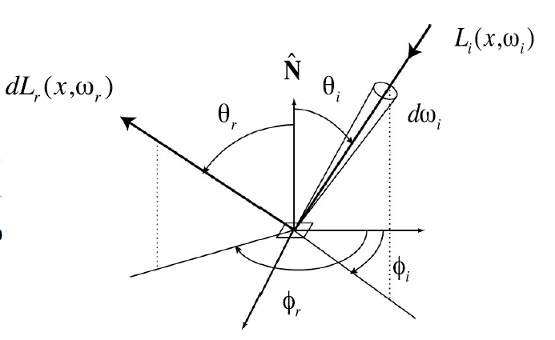

- Lambertian reflection(漫反射): 光线在均匀, 粗糙表面上的反射是均匀分散的

  - 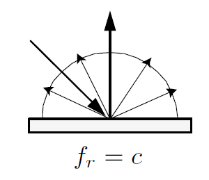 每个方向(ω)的反射率都相等, 为 c
  - $L*o(\omega_o)=\int *{H^2}f*rL_i(\omega_i)cos\theta d\omega_i=f_r\int *{H^2}L_i(\omega_i)cos\theta d\omega_i = f_rE \Rightarrow f_r=\rho/\pi $
  - $\rho: 表面反射率$

- 镜面反射(specular reflection):

  - 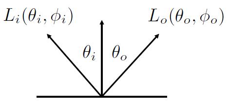 $L_o(\theta_o, \phi_o) = L_i(\theta_i, \phi_i)$
  - $f_r(\theta_i, \phi_i; \theta_o, \phi_o) = \frac{\delta(cos\theta_i-cos\theta_o)}{cos\theta_i}\delta(\phi_i-\phi_o\pm \pi)$
    - $\delta(x): 狄拉克\delta函数, ∫ δ(x) dx = 1, 当x=0时, \delta(x)=∞, 否则\delta(x)=0$ 在这里用于保证反射

## Lec12 路径追踪(path tracing)

> 在学这部分之前我们先提出一个问题，为什么需要光线追踪？我们在着色的 Blinn-phong 中不是已经实现了光的反射效果？
>
> 答案是物体和场景的大小不同，对于之前在光栅化中学的着色，针对的仅仅是一个单一的光源，即考虑的仅仅是光本身，并不考虑全局的效果（如光线的反射，折射等）
>
> 因此，我们可以得出这样一个结论：
>
> 1. 光栅化成像快，是即时性，图像质量一般较低，不够真实
> 2. 光线追踪成像慢，属于非即时性，图像质量高
>
> 路径追踪=光线追踪+蒙特卡洛方法

### 12.1 基础光线追踪算法（Whitted-Style）

> 那么，我们要如何进行光线追踪呢，光线追踪的核心在于光线，因此我们像着色那块一样，对光线先进行一个基本的定义
>
> 1. 光线一定沿着直线传播
> 2. 光线之间无法碰撞
> 3. 光线路径可逆
>
> 由于这几个性质，我们可以使用逆向思维，在光线追踪中不去寻找光线如何打到屏幕，而去模拟光线从摄像机出发，经过屏幕的每一个像素点，再与物体碰撞会有什么样的效果，这就是光线追踪的核心思想，下面我们就此展开，来模拟光线追踪的过程

**Ray Casting**

1. 从光路可逆的性质进行推理，我们可以将光源发出的光改为**从人眼发出，经过投影面的每一个像素**的射线，然后判断这条射线与场景中物体的交点
   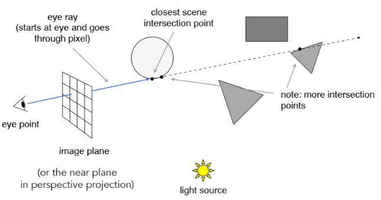
   可以看到，图中的射线与场景中的物体产生了多个交点，在光栅化中，我们需要使用 Z-buffer 来判断深度问题·，但是在光线追踪中，我们可以通过函数来直观地判断交点的远近，效率遥遥领先，这也是光线追踪薄纱光栅化的一点
2. 接着，我们连接最近的交点与光源，如果这条连线中没有与场景的其他物体有交点，我们就可以认为这个交点是被光照亮的，即光线可以通过这点反射到人眼（摄像机）中（光路可逆)。反之，则说明这点不可被照亮。
   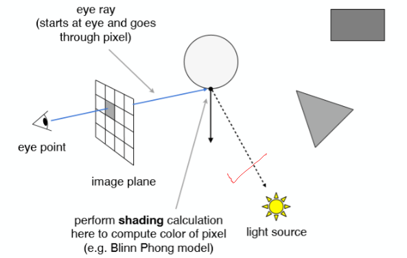
3. 接着，我们就可以使用之前的 Blinn-Phong 模型对这个点进行局部光照模型计算，得到该像素的颜色，那么遍历所有近投影平面上的像素就能得到一张完整的图像。

这一步得到的仍然是一个局部光照处理，它得到的效果与光栅化中的效果无差异，它旨在展示光线追踪的基本思想，因此，我们在下一步真正地进行全局光照的考虑

**递归的光线追踪(Recursive Ray Tracing)**

> 现在，我们假设相交的圆球是一个玻璃，则我们能够得出光线会在玻璃上发生镜面反射和折射，而反射与折射出去的光线会可能与场景中的物体再次碰撞，发生第二次折射与反射。不仅仅是与圆球相交的那一点可以贡献光到达眼睛，折射与反射之后再与物体相交的点也可以贡献光(光路可逆原理)。简而言之，除了直接从光源照射到圆球交点再沿着 eye rays(第一条发射的光线)到眼睛中，也可能存在这样一种情形，有光照射到其他物体，再沿着 eye rays 的反射或折射的光线方向传回人眼！

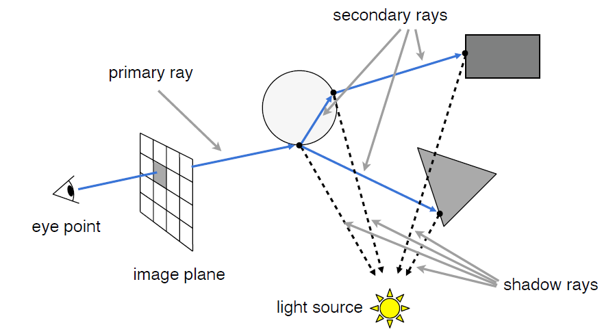

我们将这些所有交点与光源连接，称这些线为 shadow rays（因为可以用来检测阴影）

- 将 ray 视为从摄像机(or eye)射出, 经过需要渲染的 pixel 的射线

- 计算思路:

  - 递归地跟踪二次光线(secondary rays)，直到碰到非镜面反射表面（或最大所需的递归级别）

  - 如果射线没有和场景物体有交点，我们直接给出背景色

  - 每次反射折射后有能量损耗，反射系数=1-每次反射的折损

  - 在每个命中点，追踪阴影光线以测试光线可见性（如果射向光源的路径被遮挡，则没有贡献）
  - 最终像素颜色是光线贡献的加权和(每个点都是直接光照+间接光照)，如图所示，，计算这些所有点的局部光照模型的结果，将其按照光线能量权重累加最终得到我们投影平面上像素点的颜色。
  - 提供更复杂的效果（例如镜面反射、折射、阴影），但我们将进一步推导基于物理的照明模型

### 12.2 光线-曲面交点

> 在了解了光线追踪的实现方式后，我们理所当然得出一个问题，我们要如何表示一个光线，并且求出光线和物体表面的交点，反射光线，折射光线？

1. 光线

   - 每一条光线想象成一条射线，那么每一条光线都会由起点及方向这两个属性所固定，因此得出光线的表达
     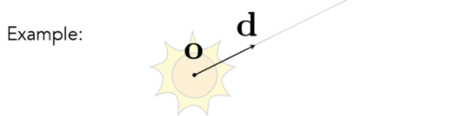
   - ray: 起点 o(origin)+向量 d(direction), 射线上的点 r(用一个变量 t, time 表示，决定光线的长度)
     $r(t) = o+td(0\leq t< \infin)$

2. 与隐式曲面求交

   - 对于隐式曲面，求交点很简单，任意一点，只要它即满足光线方程，又满足物体方程，它就是光线和物体的交点
     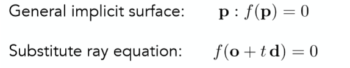

3. 与显示曲面求交

   > 这种情况才是图形学中广泛应用的（第三次作业是不是有 obj 文件？obj 文件的表达方式就是显示曲面中的多边形网格），而在之前我们学过，多边形的基础是许许多多的三角形，因此，光线和显示曲面的求交，就是计算光线和三角形的交点

   - plane: 面上一点 p’+平面法向量 N, 平面上的点 p 满足$(p-p')\cdot N = 0(垂直)$
     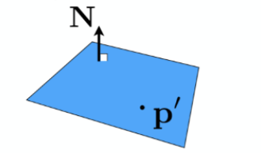
   - ray 和 plane 的交点 p 满足$p=r(t)$, 求解 t, 得$t = \frac{(p'-o)\cdot N}{d\cdot N} (注意: 0\leq t< \infin)$
     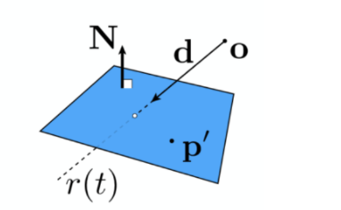
   - 如果点同时满足以上两方程，那么这个点就是光线与平面的交点
   - 在求出交点后，我们再利用光栅化成像中的判断点是否在三角形内部的方法。就可以求出光线与显示曲面的交点！（如果这个点在三角形内部的话）

4. Möller Trumbore Algorithm

   > 这种方式很有效，但是比较麻烦，所以有人用克莱姆法则进行了使得这个方程能同时完成以下两个步骤
   > ① 求出射线与三角形所在平面的交点
   > ② 计算交点是否在三角形内部

   - 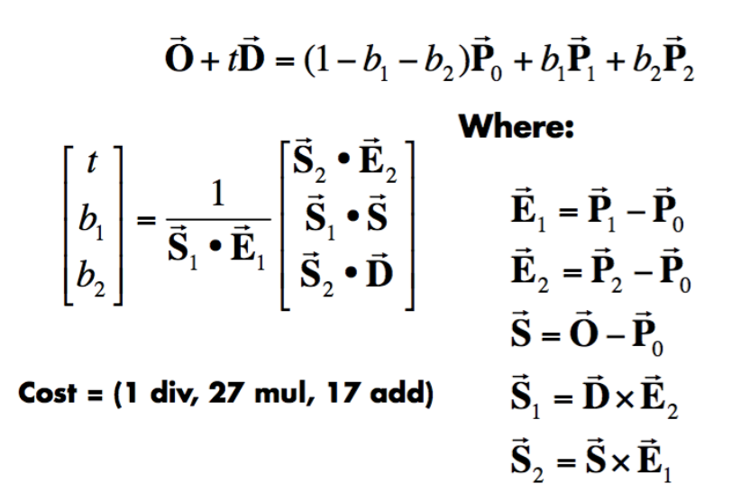 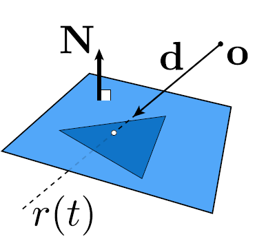

### 12.3 加速求交

> 如果对每一个物体都要进行求交操作, 那么算法复杂度=像素数(pixels)\*物体数(objects), 很慢

#### 12.3.1 包围盒

> 对于一个复杂物体进行求交, 它的面数较多, 因此计算量往往比较大

1. 对于一个复杂的物体, 我们可以用一个简单的几何体(长方体/球体)将其包围, 如果射线与该几何体有交点, 再进一步求交, 这个几何体就叫做==包围盒(Bounding Volumes)==
   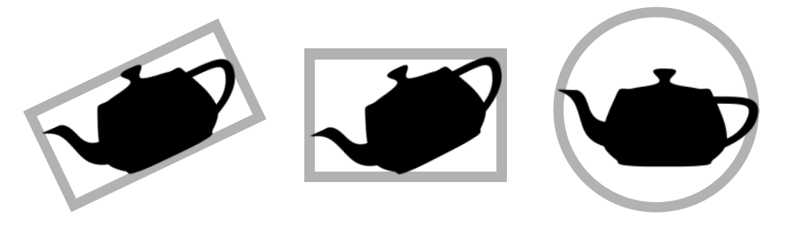
   - 对于三维形状, 我们常用的是长方体(3 对对面形成的形状), 也就是轴对齐包围盒(AABB)
     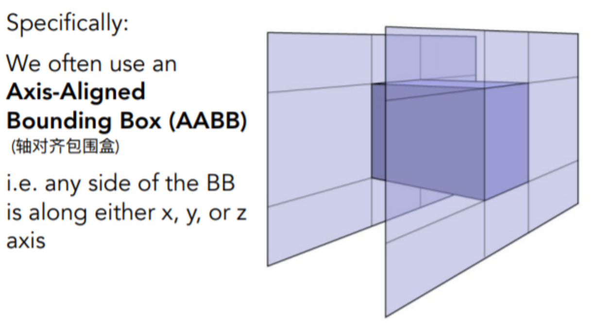
     这里的轴对齐指长方体中每一个轴都与坐标轴平行
   - 只有当光线进入了所有的平面才算是真正进入了盒子中
   - 只要当光线离开了任意平面就算是真正离开了盒子
2. 长方体包围盒求交
   - 以 2D 为例
     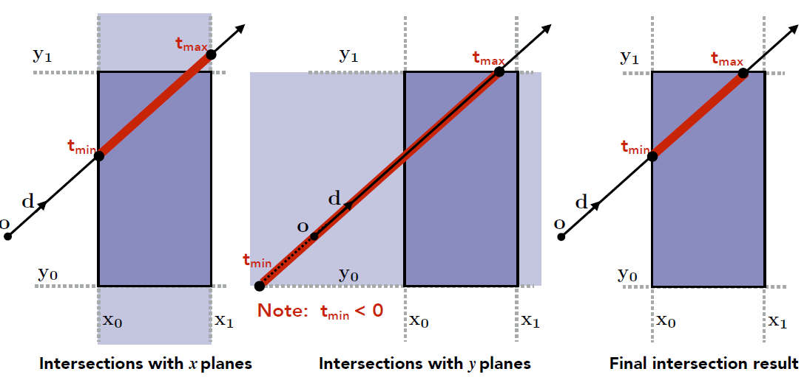
     - 在与 x 轴垂直的厚片(slab)上, 射线有两个交点 t~min~, t~max~
     - 同理, y 轴垂直的厚片上也有两个交点 t~min~, t~max~
     - 取 MAX{t~min~}, MIN{t~max~}, 结果即为射线与这个 2D 的包围盒的交点
   - 2D 包围盒是两个厚片的交, 类似的, 3D 包围盒就是 3 个厚片的交
     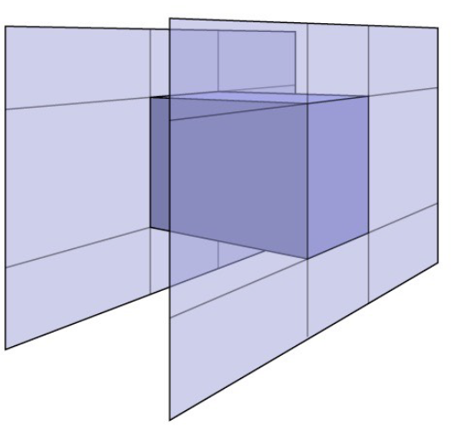
   - 3D 包围盒求交
     1. 对每一个厚片(也就是厚片的两个面)进行求交, 求出 t~min~和 t~max~
     2. 于 2D 类似, 对于 3D 包围盒, t~enter~=MAX{t~min~}, t~exit~=MIN{t~max~}
     3. 如果 t~enter~<t~exit~, 就说明 ray 有在包围盒中待过一段时间, 也就是 ray 和 box 有交点
   - 注意项
     - ray 是射线而非直线, 会存在以下的可能
     - t~exit~<0: box 在射线起点"后面"
     - t~enter~<0, t~exit~>=0: ray 的起点在 box 内部
       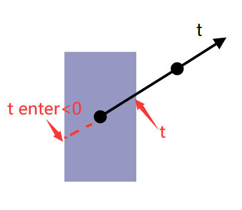
   - 总结: 长方体包围盒判断是否相交: ==t~enter~<t~exit~ && t~exit~>=0==
3. 轴对齐平面求交
   - 对于普通的平面, ray 求交
     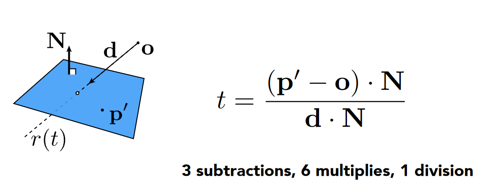
     - 对于普通平面, 需要对 x, y, z 进行 sub, mul, div
   - 对于轴对齐平面, ray 求交的优化
     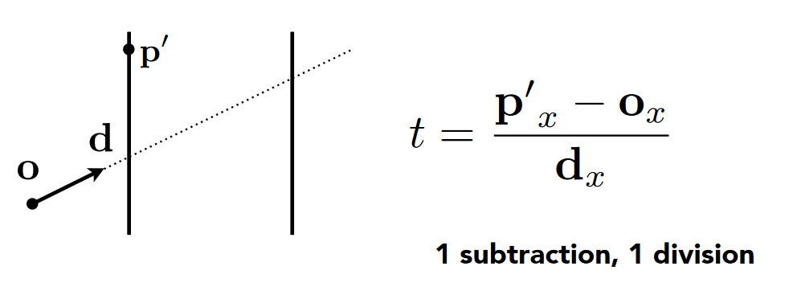
     - 上图平面与 x 轴垂直, 只需要对 x 值进行 1 次 sub, 一次 div

#### 12.3.2 均匀空间划分(Grid, 网格划分)

> 我们知道了使用包围盒能减少对于单个复杂 object 的求交，但是其存在以下两个问题
>
> 1. 那么如果场景非常的极端，如只有一个极其复杂的单一人物模型，那么只对这一个物体做包围盒的话，相当于对效率没有任何提升。
> 2. 如果整个场景充斥着大量的细小模型，如草，花之类的，每个模型可能只有很少的面，如果此时对每个物体求包围盒，得到的包围盒数量会相当之多，对于光线追踪效率来说效率提升有限
>
> 因此，我们的 AABB 并不应只局限于以物体模型为单位，可以更加精细的考虑到以三角面为单位。另外对于场景的许许多多包围盒来说应该要有一种数据结构将其统领起来。

1. 基于网格的空间划分

   1. 找到场景中的一个包围盒
      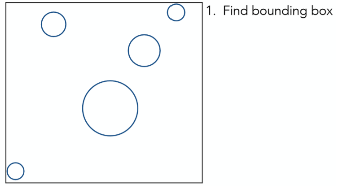
   2. 对包围盒进行均匀划分, 划分出许多网格单元(grid cell, 也是子包围盒)
      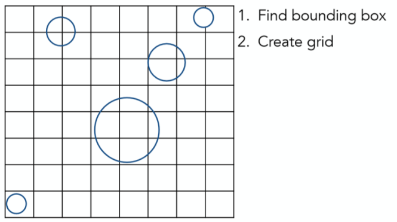
   3. 判定与 object 相交的格子, 将每个 object 存储在与其重叠的网格单元(girl cell)中
      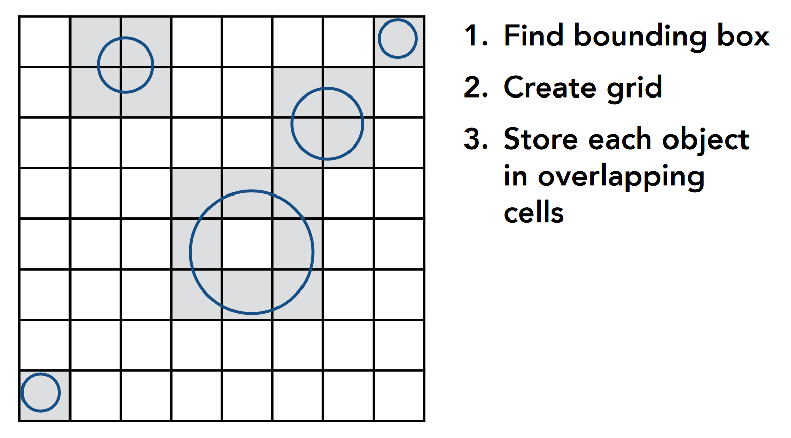
   4. 这样, 我们就得到了可能含有物体的格子

2. 检测相交

   - 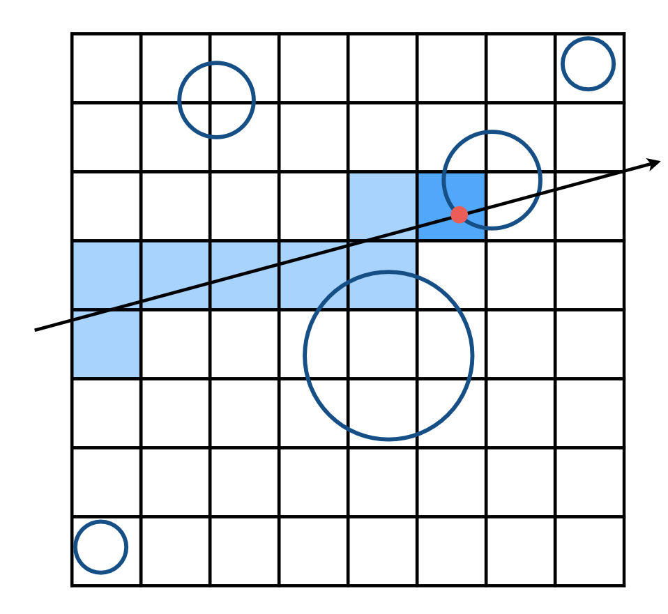
   - 只对 ray 路径上的网格单元(cell)中存储的 object 进行求交判断 <font color="orange">(这里的路径也就是对 ray 进行光栅化)</font>

3. 网格单元的划分

   - 极端情况: 只划分出 1 个 cell, 相当于没有加速
   - 若划分出过多 cell, 对于 ray 和 cell 的遍历的开销过大, 起到反效果
   - 启发式规则: $划分单元数\#cells ≈ C * 物体\#objs,其中在3D环境时C≈27$

4. 注意点

   - 如下图, ray 和圆相交于 cell2 的红点处, 但这个 cell2 在 ray 上不是最近的 cell(最近的是 cell1), 即**ray 和 object 的交点不在最近的 cell**
     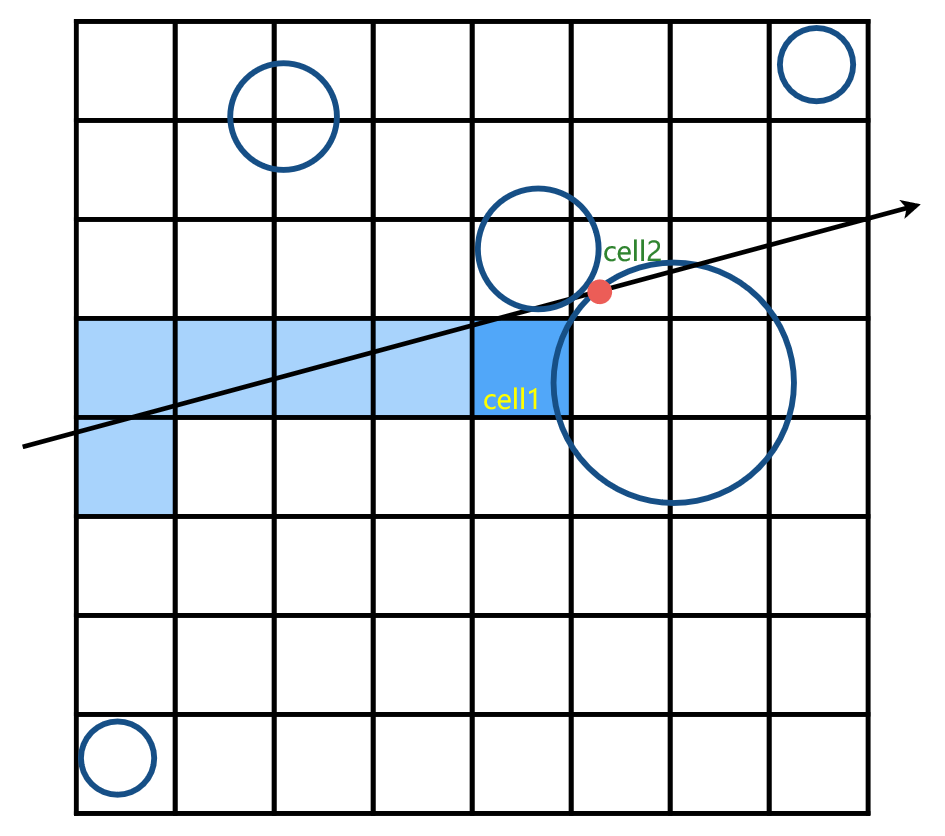
   - 解决办法: 求出交点后, 再判断一下点是否在 cell 内, 如果不是, 继续沿着 ray 路径搜索
   - 额外优化: 可以将上一步求出的交点缓存起来, 防止在后面的遍历 cell 中多次计算(就可以直接用缓存中的交点来判断是否在 cell 内)

#### 12.3.3 非均匀空间划分

> 在网格均匀划分中划分出来的都是大小相同的格子，这解决了对每个物体做包围盒在物体密集的场景(如草地)开销很大的缺点，但是如果是在空旷的地方, 很多 cell 就被浪费掉了，对比与包围盒的方法，如果场景空旷反而开销更大了，因为会有很多无效的方格与光线的求交过程。
>
> 我们希望在没有物体的地方用大盒子, 在物体的地方用密集的盒子

1. 空间层次划分
   - 基本的例子: 如下, 每次对空间进行二分, 得到一颗二叉树, 树的一个叶结点就是一个包围盒
     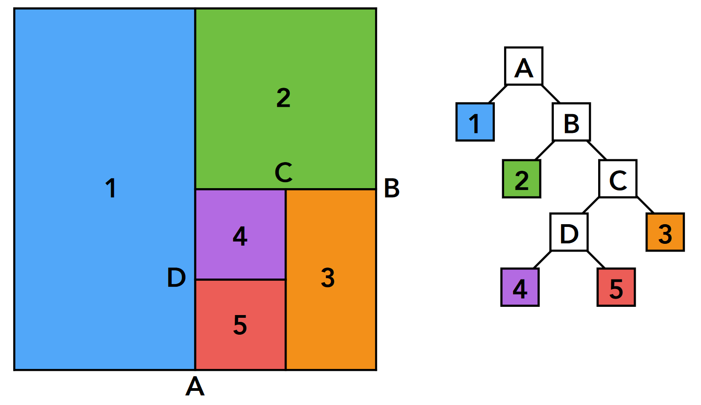
2. 常见的空间划分方式
   - 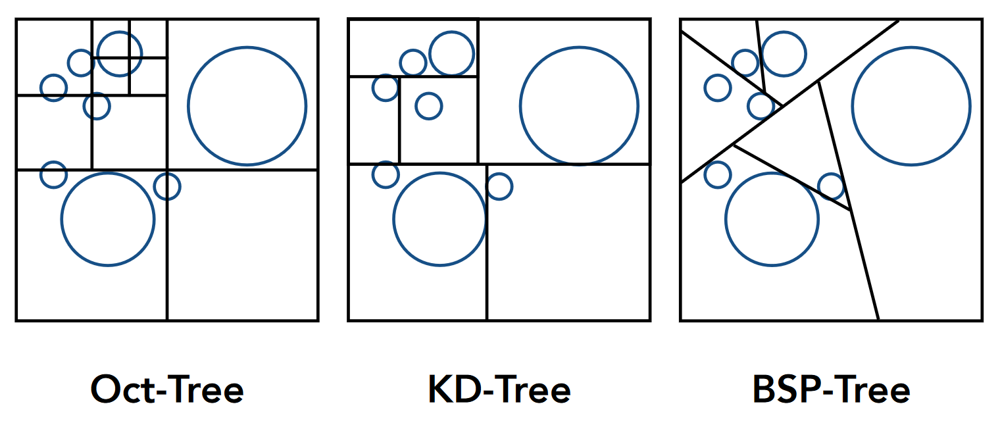
   - ==八叉树== : 每一次把空间划分成八份，再递归的对子空间进行划分，直到满足一定的停止规则（比如某一次划分 8 个子空间中 7 个为空）
     - 缺点: 维数越高越复杂, n 维空间对应 2^n^叉树
   - ==KD 树== : 每次把空间划分为两份，x，y，z 轴轮流切分，直到被切分节点中不存在物体则停止
   - ==BSP 树== : 一种对空间二分的划分方法，每次选一个方向进行划分，与 KD 树的区别在于它不是横平竖直地切，且它会有划分的空间没有规则性，求交困难的缺点。（砍开二维用线，砍开三维用面，维度越高越复杂）

##### KD 树

1. 树的结构

   - 中间节点(Internal Node)
     - 拆分轴: x 轴/y 轴/z 轴
     - 拆分位置: 拆分平面沿沿坐标轴的坐标
     - 子节点
   - 叶结点
     - 包围盒内部的 object list
     - 包围盒信息

2. KD 树的构建

   1. 找到划分范围
   2. **递归**使用轴对齐平面进行分割, 直到达到退出条件(如: 达到最大划分次数 / 区域中的对象数量低于最小值)
      - 如何选择切分平面
        - 简单方法
          - 中点切分: 在当前小区域的切分轴上选择中间值作为切分平面，将小区域划分为两个子区域
          - 中位数切分: 在切分轴上选择使得小区域中的对象**数量大致相等**的值作为切分平面
        - 理想方法：理想情况下，我们希望选择最优的切分平面，即能够最小化射线与对象相交的期望成本。这可能涉及到更复杂的算法和启发式方法，例如使用表面积启发式（SAH）来评估切分平面的成本，并选择最优的切分位置。
      - 终止条件
        - 简单方法: 规定最大树深度，以避免过度划分。经验法则建议使用最大树深度为$8 + 1.3 log N$，其中 N 是对象的数量
        - 理想方法：理想情况下，我们可以在划分不再降低射线与对象相交的期望成本时停止划分。（人话：划分中没三角形的时候和其他关于时间复杂度的计算）这意味着当划分无法进一步提高查询性能时，就可以停止划分。
   3. 将 object 存储到叶结点中

3. KD 树的搜索过程

   - 从根节点开始, 中序遍历, 判断 ray 和节点(包围盒)有没有相交, 有则继续向下搜索, 直到叶节点(最小的包围盒), 然后进行 object 的求交计算
   - 例:
     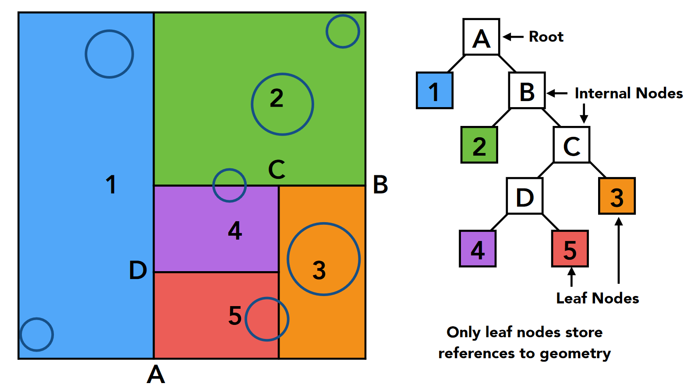 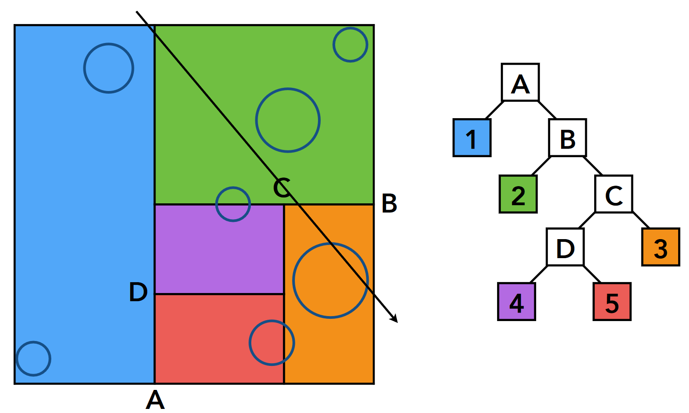

   1. ① 节点(蓝色, 叶结点): tmin<tmax, 进行求交计算, 结果没有交点
      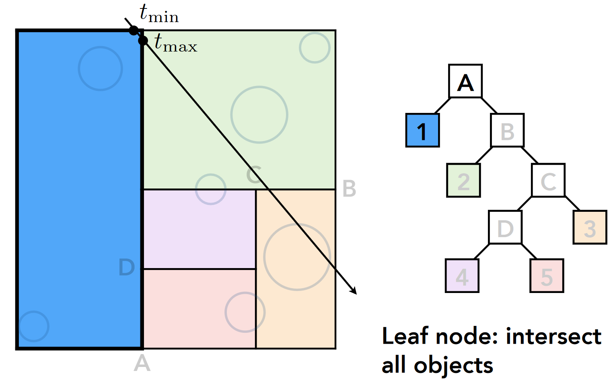
   2. B 节点(中间节点): 得到 tmin, tmax 和分裂点 t~split~
      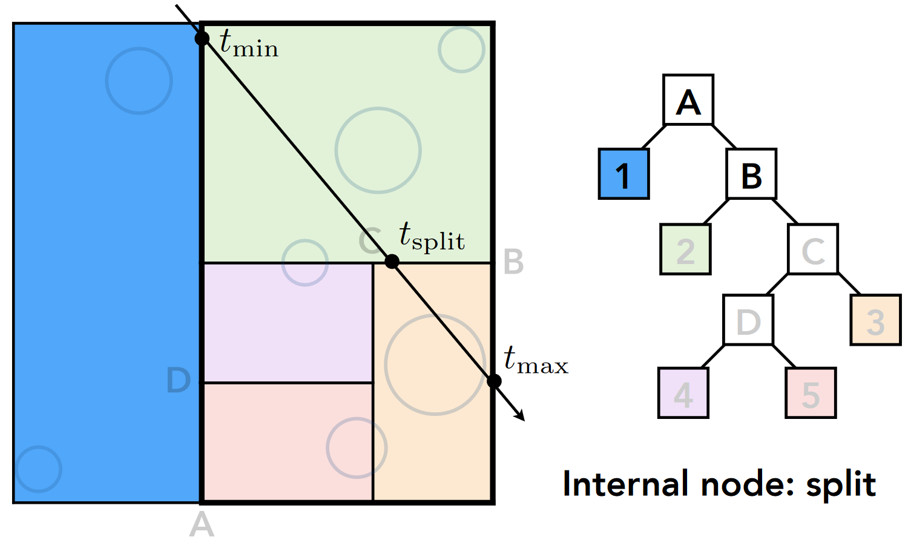
   3. ② 节点(绿色, 叶结点): tmin(步骤 2 中的 t~min~)<tmax(步骤 2 中的 t~split~), 进行求交计算, 结果没有交点
      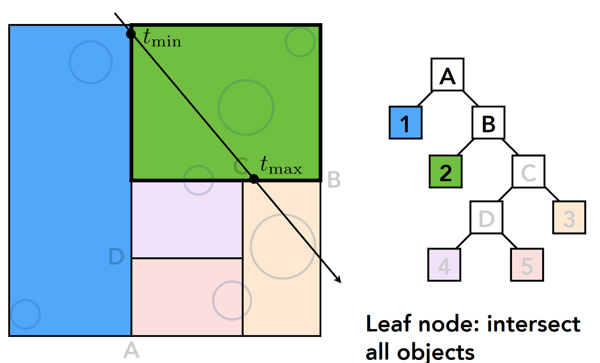
   4. C 节点(中间节点): 得到 tmin, tmax 和分裂点 t~split~
      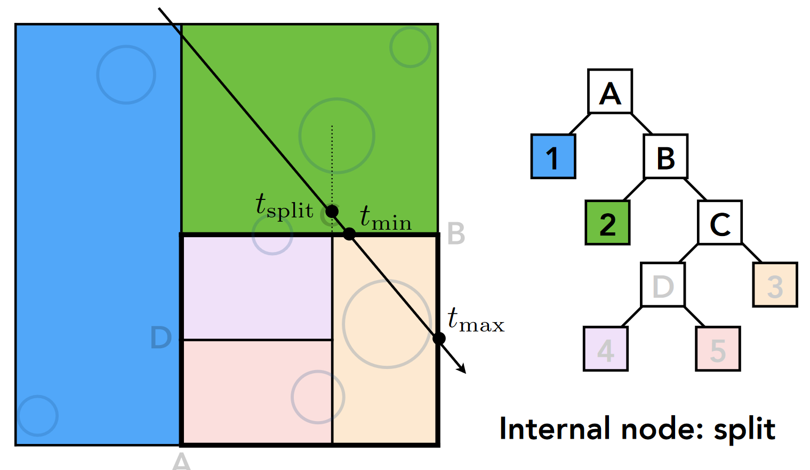
   5. D 节点: tmin(步骤 4 中的 t~min~)>tmax(步骤 4 中的 t~split~), 无交点, 不继续递归
   6. ③ 节点(橙色, 叶结点): tmin<tmax, 求交, 得 t~hit~
      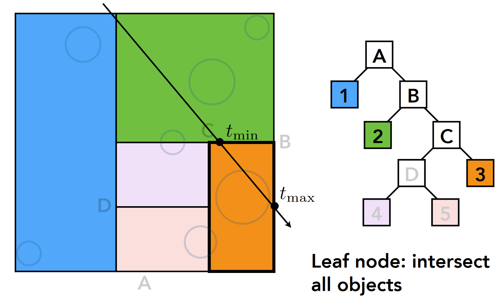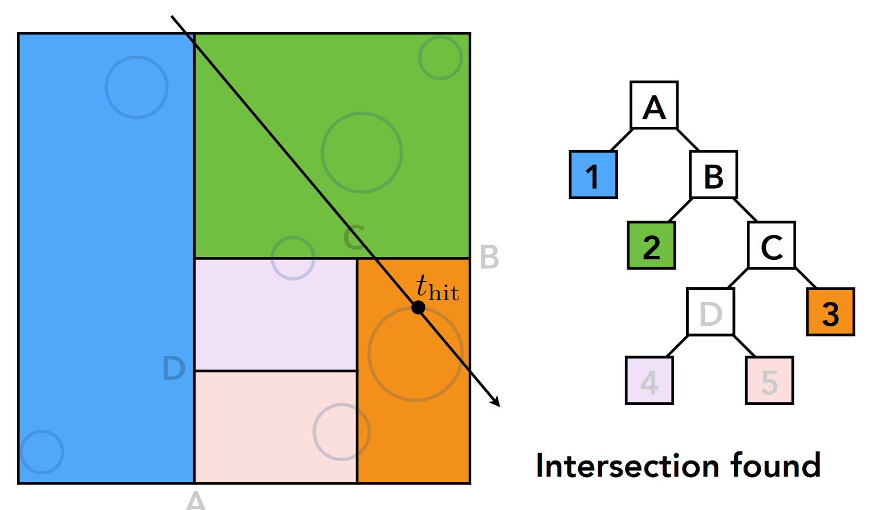

   KD 树的方法很好解决了包围盒盒均匀空间带来的问题，但是它的本身又存在以下问题

   - 优点：利用 KD-Tree 的结构来构建 AABB 的好处是倘若光线与哪一部分空间不相交，那么则可以省略该部分空间所有子空间的判断过程，在原始的纯粹的 AABB 之上更进一步提升了加速效率。
   - 缺点：判断包围盒与三角面的是否相交较难，因此划分的过程不是那么想象的简单，其次同一个三角面可能被不同的包围盒同时占有，这两个不同包围盒内的叶节点会同时存储这一个三角形面

#### 12.3.4 对象划分与包围体层次划分(BVH)※

> 那么，我们可以不用空间作为划分依据，而使用对象（三角形面）作为划分依据吗？

| 空间划分(Spatial partion) 如 KD-Tree                                                              | 对象划分(Object partition) 如 BVH                                                                |
| ------------------------------------------------------------------------------------------------- | ------------------------------------------------------------------------------------------------ |
| - 将空间划分为互不重叠的区域<br />- 对象可以包含在多个区域中                                      | - 将对象集合划分为互不相交的子集<br />- 每个集合的包围盒可能在空间上重叠                         |
| 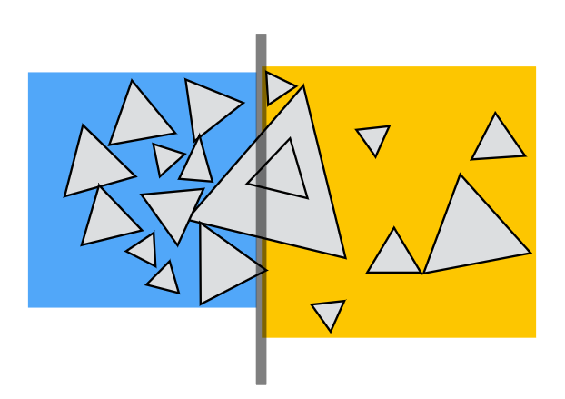 | 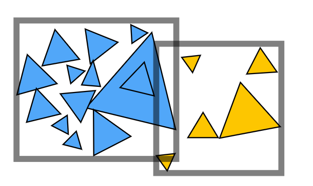 |

BVH 与前几种方法最显著的区别就是，**不再以空间作为划分依据，而是从对象的角度考虑，即三角形面**，过程如下：

1. BVH 划分(Bounding Volume Hierarchy): 包围盒层次划分

2. BVH 树结构

   - 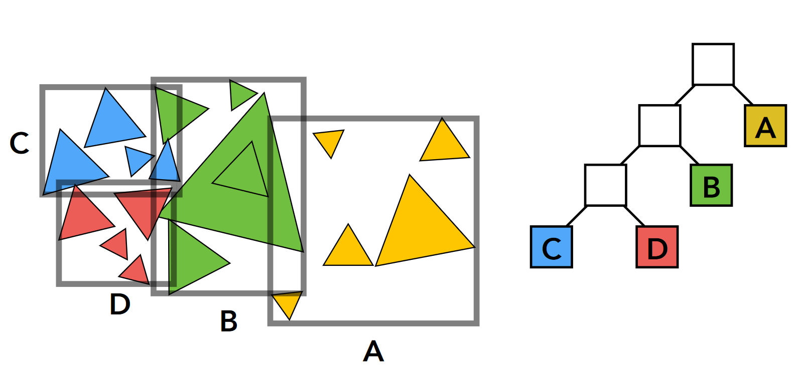
   - 内部节点存储
     - 包围盒
     - 子节点：对子节点的引用
   - 叶子节点存储
     - 包围盒
     - 对象列表
   - 节点表示场景中基元的子集
     - 子树中的所有对象

3. BVH 树构造

   1. 找到场景包围盒
   2. 每次将物体分为两堆
      - ① 选取当前最长的轴的垂直方向作为划分方向
      - ② 取中间的物体（第 n/2 个三角形）（快速选择算法）
      - ①/② 都可以，主要是为了保证二叉树的平衡（平衡二叉树？）
      - 理想方案: 拆分结果使得射线求交的期望成本最小
   3. 对两堆物体重新计算包围盒
   4. 直到一堆中物体少到一定程度, 退出递归

      - 理想方案: 当拆分不能降低射线求交的期望成本

      **包围盒会重叠，但一个三角形面只会被存储在唯一的包围盒内，而这也就解决了 KD-Tree 的缺点！**

4. BVH 遍历

   ```pseudocode
   Intersect (Ray ray, BVH node)
   	if (ray misses node.bbox) return;
   	if (node is a leaf node)
   		test intersection with all objs;
           return closest intersection;
       hit1 = Intersect (ray, node.child1);
       hit2 = Intersect (ray, node.child2);
       return closer of hit1, hit2;
   ```

   - 作业中的实现

     ```c++
     Intersection BVHAccel::getIntersection(BVHBuildNode *node, const Ray &ray) const
     {
         // TODO Traverse the BVH to find intersection
         std::array<int, 3> dirIsNeg;
         dirIsNeg[0] = (ray.direction[0] > 0);
         dirIsNeg[1] = (ray.direction[1] > 0);
         dirIsNeg[2] = (ray.direction[2] > 0);
         Intersection inter;
         // 对于任意结点，如果其boundbox与光线无交点，则不需进一步的判断，
         // 否则依次递归，直到叶子节点，判断叶子节点中存的各个物体(如三角形、球形等)是否与光线有交点
         if (!node->bounds.IntersectP(ray, ray.direction_inv, dirIsNeg))
         {
             return inter;
         }
         if (node->left == nullptr && node->right ==  nullptr)
         {
             return node->object->getIntersection(ray);
         }
     
         Intersection l = getIntersection(node->left, ray);
         Intersection r = getIntersection(node->right, ray);
         // 返回距离光源近的物体的相交信息
         return l.distance < r.distance ? l : r;
     
         return inter;
     }
     ```

## Lec13 蒙特卡洛路径追踪(Monte Carlo path tracing)

> 渲染方程: $L_o(p, \omega_o) = L_e(p, \omega_o) + \int _{H^2}f_r(p, \omega_i→\omega_o)L_i(p, \omega_i)cos\theta d\omega_i$
>
> 如何计算这里的积分

一种容易想到的方法是==梯形法则== , 将 a~b 均匀分为 n 个小梯形, 累加计算面积

- 存在缺陷: 算法复杂度$kD:O(n^k), k为维度$
  同时, 在图形学中, 维度 k 是会比较大的(tens or hundreds or thousands)
  所以这个方法并不适用
- 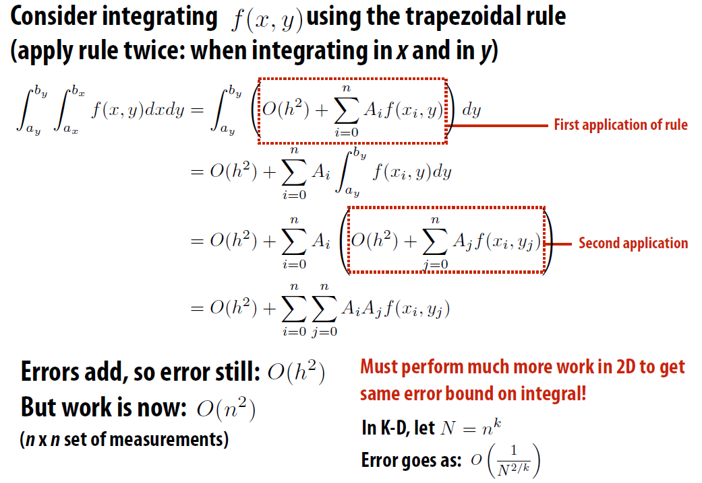

### 13.1 蒙特卡洛积分概述

> 当一个积分很难通过解析的方式得到答案的时候可以通过蒙特卡洛的方式近似得到积分结果，如下图所示：
> 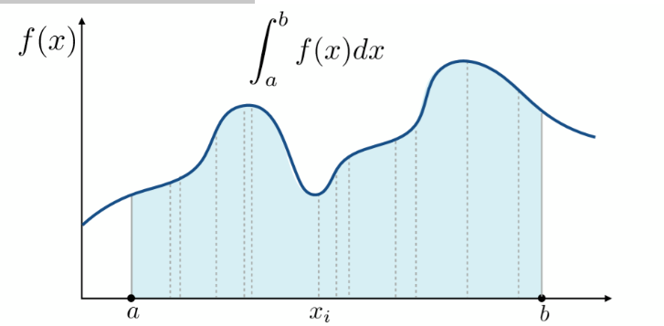

1. **蒙特卡洛积分**(Monte Carlo Integration)：对函数值进行多次**随机抽样**, 求均值作为积分值的近似。

   - 如果对上图这个函数值进行**均匀采样**的话，其实就相当于将整个积分面积切成了许许多多个长方形，然后将这些小长方形的面积全部加起来。(定积分的几何意义)

   - 这种方法计算的近似误差(Error of estimate)只取决于样本数量, $O(n^{1/2})$
     而梯形法则中的误差$O(n^{-1/k})$

2. 概率论复习
   - X: 随机变量。表示潜在值的分布
   - X~p(x): 随机变量 X 服从==概率密度函数 p(x)== （PDF）。描述随机变量在其定义域上取值的分布情况, 概率密度越大, X 落在该点附件的概率越大
   - ==概率分布函数== $F(X) = \int_{-\infin}^{X}f(x)dx$, 表示随机变量落在-∞~X 的概率

### 13.2 均匀采样

> 对方形进行均匀采样很容易懂. 但是其他形状呢
>
> 如: 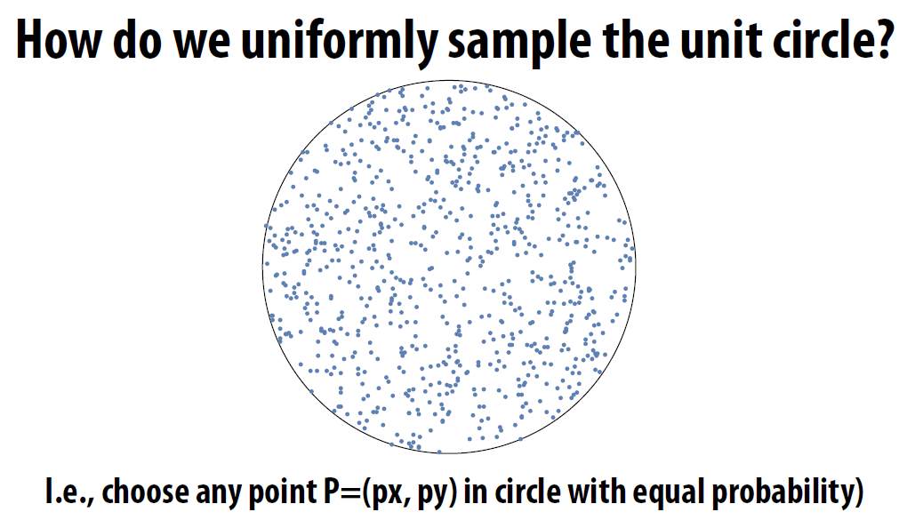

1. 简单尝试
   - θ = 均匀分布的随机角度, $\in [0, 2\pi]$
   - r = 均匀分布的随机半径, $\in [0,1]$
   - 返回的采样结果点: (rcosθ, rsinθ)
   - 显然, 这个是不对的
     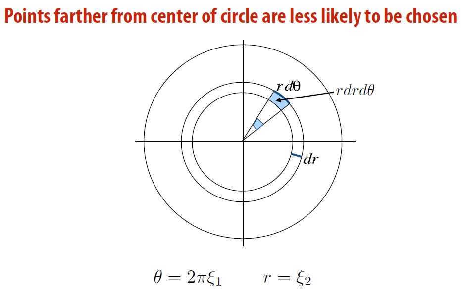
2. 概率论的简单小计算
   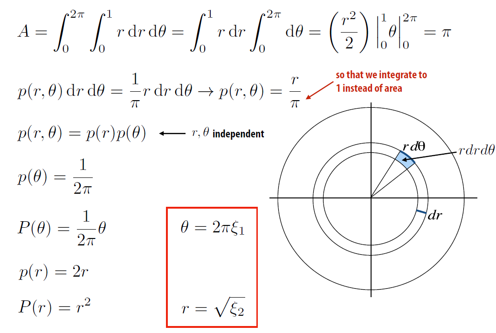
   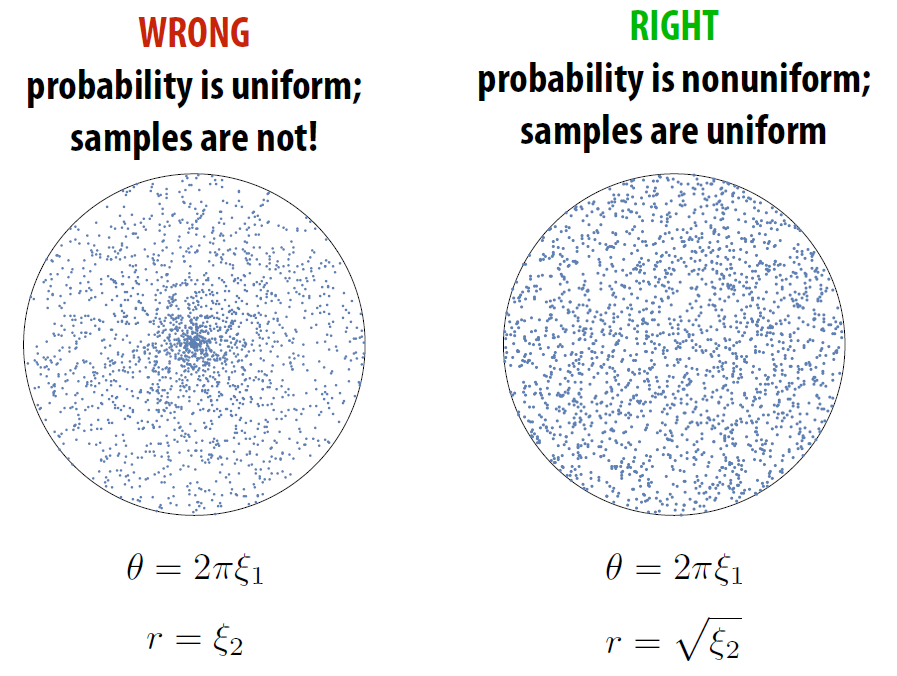
3. 均匀采样 by 拒绝采样
   - 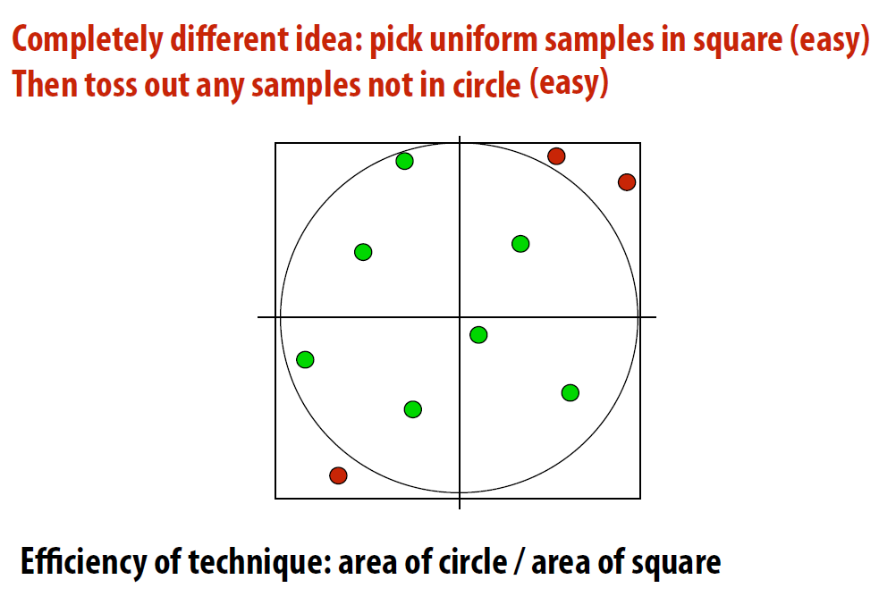 
     - 在方形中采样, 丢弃不在采样区域(圆)中的点
   - 缺点: 若采样区域较小, 丢弃的可能会比较多, 效率降低
     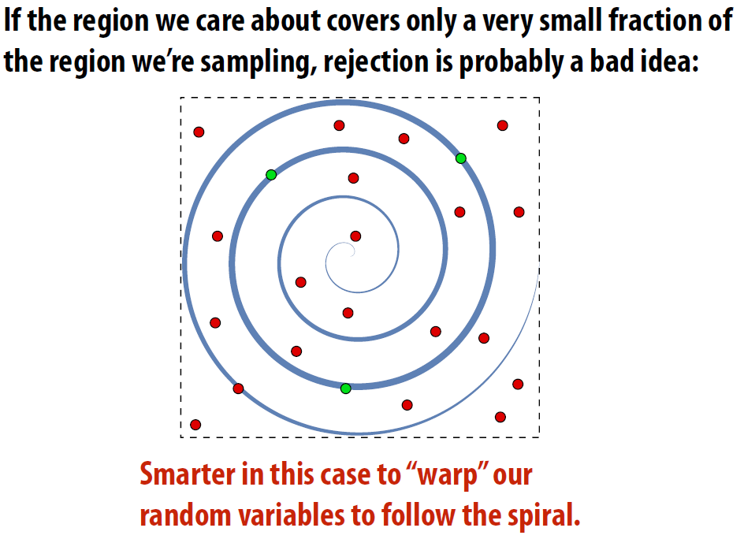

### 13.3 蒙特卡罗积分计算

1. 蒙特卡罗基本思想: 用随机采样的均值代替积分计算
   - 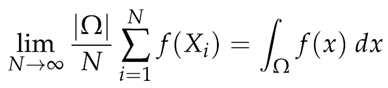
2. 涉及到的概率论概念：

   - 期望——我们平均得到的值是多少？
     - 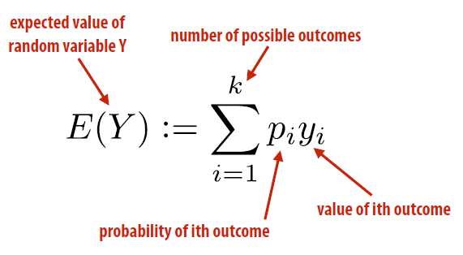
     - 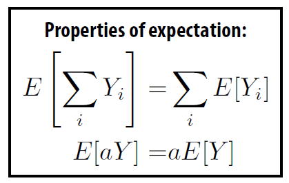
   - 方差——与平均值的预期偏差是多少？
     - 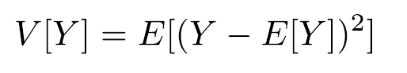
     - 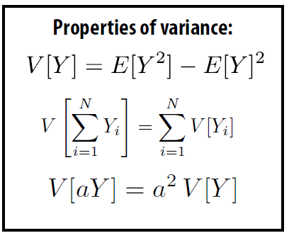
   - 权重——我们如何（正确地）在更重要的地区 采集更多样本？

3. 大数定理: 对于任何随机变量，当我们增加 N 时，N 次试验的平均值都会趋近于预期值 E(X)
   - 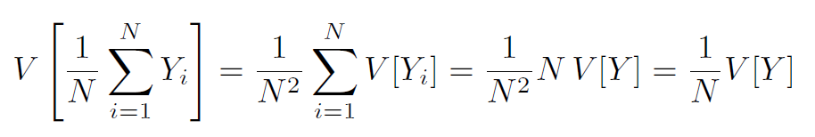
   - 这说明, 无论积分有多难计算（疯狂的照明、几何、材料等），只要提高采样数，总能得到正确的图像。

#### 加权

> - 到目前为止，我们已经从域中实现了均匀采样（每个点的可能性都相等）
> - 假设我们从其他分布中挑选样本（一个地方的样本比另一个地方多）
> - Q： 我们还可以使用样本 f（Xi）来得到我们的积分的（正确的）估计吗？
> - A： 当然！根据我们选择样本的可能性来衡量每个样本的贡献
> - Q： 我们除以 p 正确吗？或者…我们应该乘吗？
> - A： 想想一个简单的例子，我们对红色区域的采样频率是蓝色区域的 8 倍
> - 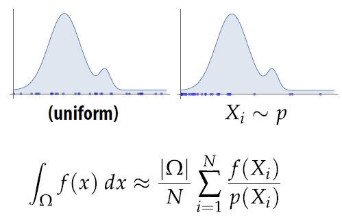 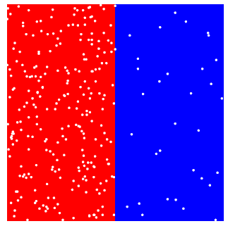
>   - 正方形上的平均颜色应该是紫色
>   - 如果我们相乘，平均值就会太红
>   - 如果我们进行除法运算，平均值将恰好正确

1. 在哪里加权
   - 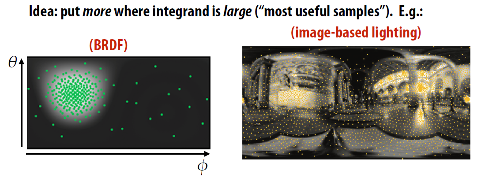

#### 直接光照计算

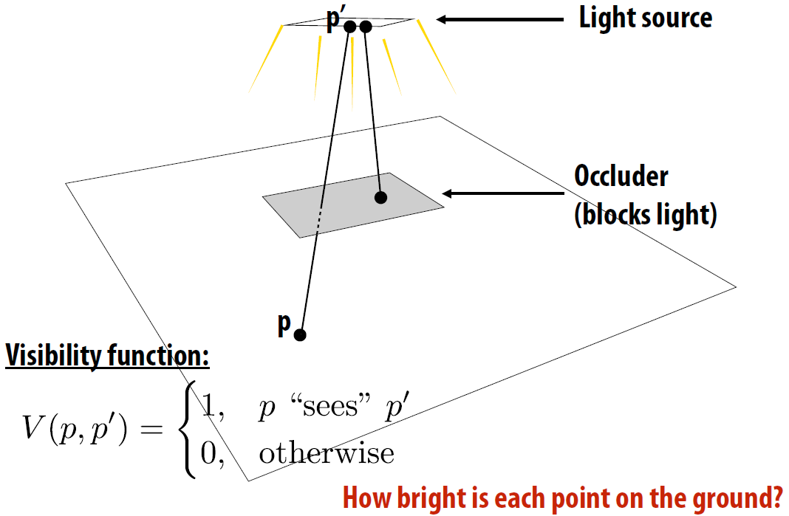

**均匀采样**

- 相对于立体角的方向半球进行均匀采样
  
- 拒绝采样
- 换元, 将范围为[0, 1]的随机变量转换到球面
  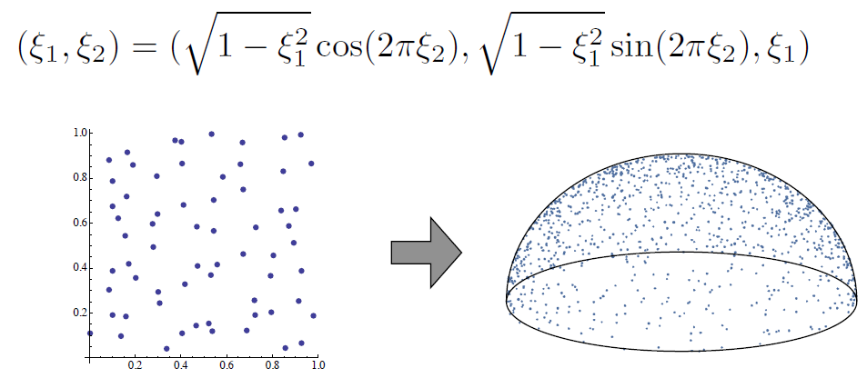

**计算式**

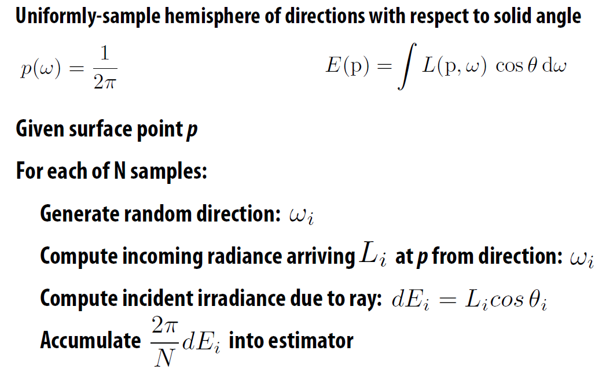

- 给定曲面点 p
- 对于 N 个样本中的每一个：
  - 生成随机方向：$\omega_i$
  - 算从$\omega_i$方向到达点 p 的入射辐射$L_i$
  - 计算光线引起的入射辐照度：$dE_i = L_icos\theta _i$
  - 根据$dE_i$求出均值: $2\pi dE_i/N$

# 动画（ Animation）

## Lec14 动画（ Animation）

### 关键帧

仅指定重要事件，其余部分通过插值/近似实现模拟，补出中间的衔接

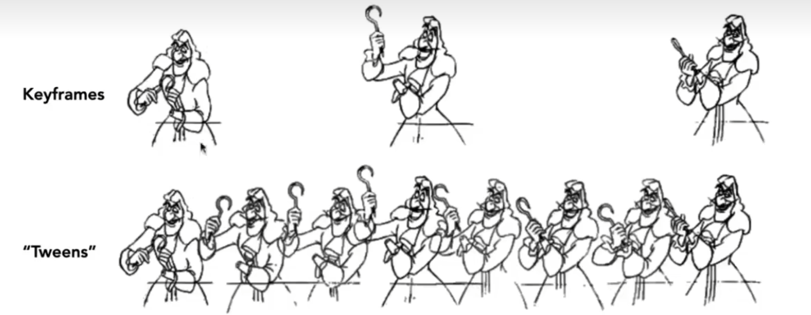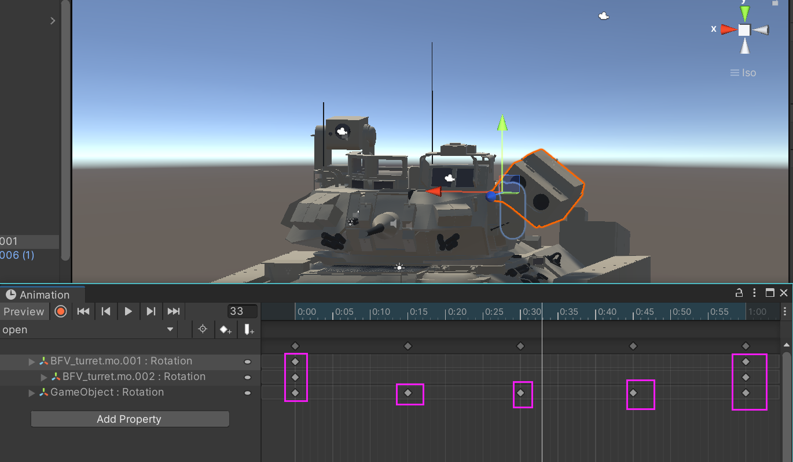

“事件”不一定是位置，可以是颜色、光强度、相机变焦等。

线性插值的效果通常较差，有时，希望能通过其他的方式来控制插值的效果来实现更好的效果，因此使用样条/曲线来实现更好的效果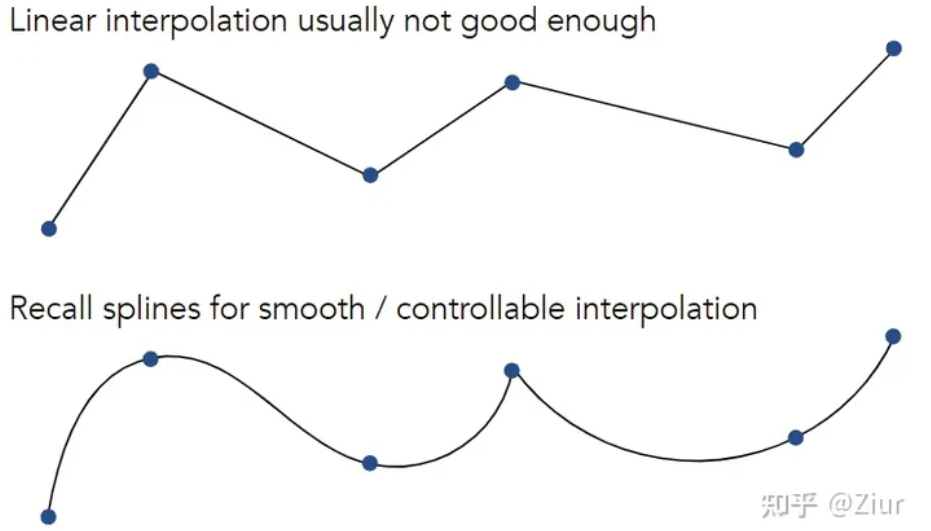

### 物理模拟

已知物体质量，给物体应用一个力，则可以算出它的加速度，再引入时间，就能算当前时刻速度、位置等一系列信息，然后就可以动态的更新下一时刻的信息从而产生动画了。

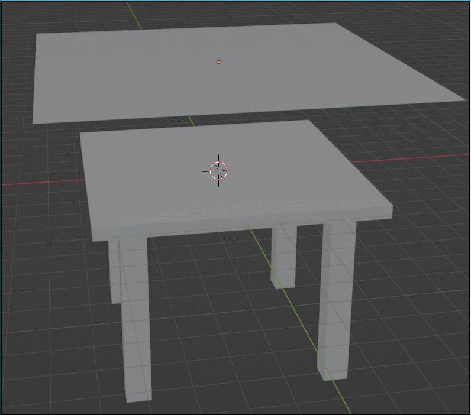

物理仿真/模拟背后的核心思想就是构建物理模型，分析受力，从而算出某时刻的加速度、速度、位置等信息。
只要能够正确建立物理模型，一定可以得出正确的物理模拟结果。

#### 质点弹簧系统（Mass Spring System）

把模型看作一系列相互连接的质点和弹簧，最基础的单元是一个弹簧连接左右两个质点，在弹簧质点模型中，我们默认：

- 弹簧被拉长会产生向内收缩的力，被压短则产生外推力
- 弹簧常态长度为 **l**，受力大小依然形变大小成正比，计算方式如下

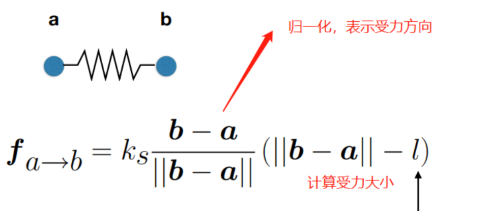

但是，上述存在一个问题：过于理想化会导致模型永远震荡不会停止，动能与势能不停转变，没有损耗。

为了解决这个问题，我们决定引入弹簧内部阻尼来解决这个问题

##### 弹簧内部阻尼

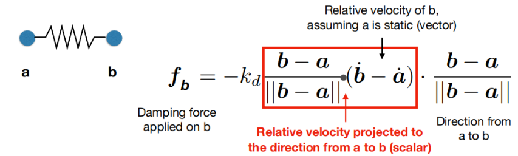
左边是单位向量**ab**，右边是 b 点相对于 a 的速度向量，点乘表示把速度投影到**ab**方向上（标量了)投影目的是：防止两端相对静止，一个球绕另一个球做圆周运动而出现的阻尼。

通过这个模型，我们可以推导出布料模拟的过程

### 布料模拟

布料模拟有以下要求：抵抗切力（对两点用力不能被无限拉长）、抵抗对折力（不能把布料完美的对折）

#### 抗切变

虽然能抵抗图示对角线的切力，但是存在各向异性。依然不能抵抗折叠。
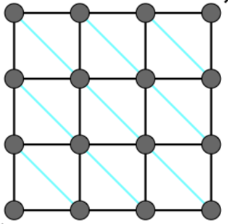

改进

可以抵抗切力，有各向同性，不抗对折
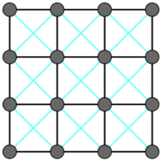

#### 抗对折

给红色的线（任何一个点都和隔一个顶点连线）赋予弹簧质点模型，让它的力比蓝色的较小，这样不管如何形变布料都会引起弹簧的变化，这种模型能抵抗对折，现在可以比较好的模拟布料
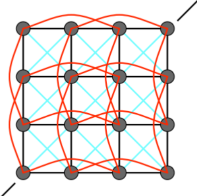

### 粒子系统（Particle Systems）

建模一堆微小粒子，定义每个粒子会受到的力(粒子之间的力、来自外部的力、碰撞等)

在动画每一帧都进行以下步骤

1. 创建新的粒子（如果需要）
2. 计算每个粒子的受力
3. 更新每个粒子的位置和速度
4. 结束某些粒子生命（如果需要）
5. 渲染

### 正向运动学（Forward Kinematics）

骨骼系统：将一些物体通过关节联系，通过定义关节的类型来实现

关节类型

- Pin（滑车关节）：平面内旋转
- Ball（球窝关节）：一部分空间内旋转
- Prismatic joint（导轨关节）：允许平移

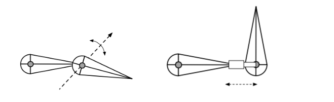

- 优点：控制方便、实现非常直接
- 缺点：艺术家们不喜欢这种方式的动画创作

### 逆运动学（Inverse Kinematics）

通过控制尖端位置，反算出应该旋转多少

- 优点：直观
- 缺点：
  - 解并不唯一，两种不同的角度组合方式都能让 p 处于目标位置
    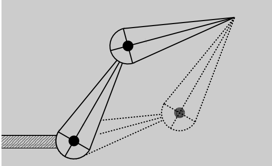
  - 并不是一定有解，即会有无解的情况，如下图尖端活动范围有限
    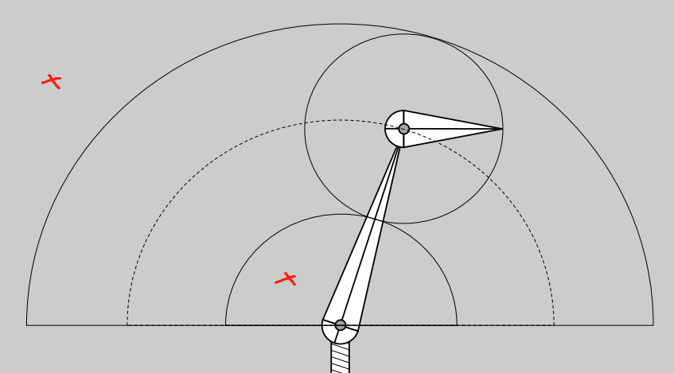

~~你妈不写了好乱~~
