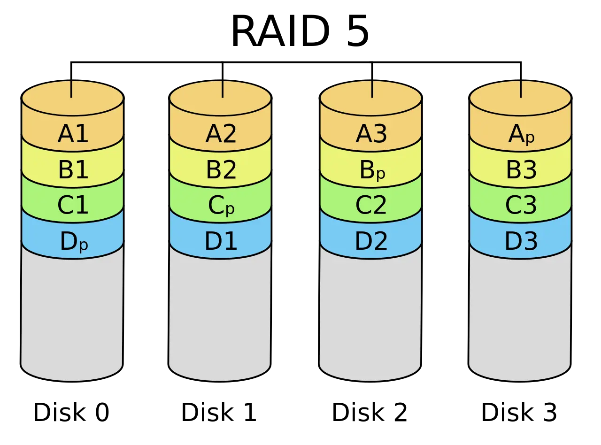

> [操作系统：设计与实现 (2024 春季学期)](https://jyywiki.cn/OS/2024/)
>
> 内容来自课程Slice整理
>
> 备注: lab没空做, 学得过于浅薄, 因此暂时放到该分类下QAQ

# 二. 并发

## 2.1 并发控制: 互斥

并发程序的运行逻辑是不可测的, 为了避免程序在并发时出现问题, 引入了==互斥==这一概念

### 关中断

实现互斥→使得当前程序**独占**计算机, 不被其他程序打断(即中断)

对于x86, 就是 关中断`cli`指令和开中断`slt`指令

但是对于应用程序, 它没有, 也不应该有关中断的权限(会报段错误)

- 当程序出现问题(如死循环while1), 并关中断后, 计算机系统就没有任何办法进行恢复

### Peterson算法

> 使用load/store实现互斥

A process 𝑃 can enter the critical section **if** the other does not want to enter, **or** it has indicated its desire to enter and has given the other process the turn.

允许进程P进入临界区(the critical section)的两个条件

- **其他进程不想进入临界区**：这意味着没有其他进程正在执行它们的临界区代码，或者它们还没有到达需要进入临界区的点。
- **进程 𝑃 已经表明了想要进入临界区的意图，并且其他进程已经让步**：这通常涉及到一些同步机制，比如进程 𝑃 通过某种方式（如获取锁或发送信号）通知其他进程它想要进入临界区，并且其他进程已经响应了这个请求，决定不进入它们的临界区或者等待进程 𝑃完成临界区的执行。

#### 实现方式

**前提条件**

- 任何时候可以执行一条 load/store 指令
- 读写本身是原子的

**实现方式**

> 小A和小B需要竞争临界区(厕所)
>
> - 仅考虑两个线程

1. 如果**希望进入**临界区, 按照顺序执行以下两个原子操作
    1. 举起自己的旗子(like A=1) \[store\]
    2. 把写有对方名字的字条贴在厕所门上(like turn=B) \[store; 覆盖\], 后让前
2. 然后进入持续的**观察模式**：
    1. 观察对方是否举旗(like B=?) \[load\]
    2. 观察厕所门上的名字(like turn=?) \[load\]
      - **①对方不举旗or②名字是自己，进入厕所，否则继续观察**
3. 出厕所后，放下自己的旗子(like A=0) \[store\]
   - **不用管门上的字条**

**一个例子**

A和B都要进入临界区

| A                               | B                                    |
| ------------------------------- | ------------------------------------ |
| flag_A = 1                      |                                      |
|                                 | flag_B=1                             |
| turn = B                        |                                      |
|                                 | turn = A (覆盖了turn = B)            |
| 观察, 发现①B举旗 ②门上是自己(A) | 观察, 发现①A举旗 ②门上不是自己       |
| A进入厕所                       | 继续观察, 无变化                     |
| A出厕所, flag_A = 0             | 继续观察, 无变化                     |
|                                 | 观察, 发现①A**不**举旗 ②门上不是自己 |
|                                 | B进入厕所                            |
|                                 | B处厕所, flag_B = 0                  |

**进入临界区的情况**

- 如果只有一个人举旗，他就可以直接进入 (满足①对方不举旗)
- 如果两个人同时举旗，由厕所门上的标签决定谁进
  - 手快 🈶️ (被另一个人的标签覆盖成自己的flag)、手慢 🈚

**一些具体的细节情况**

- A 看到 B 没有举旗
  - B 一定不在临界区
  - B 可能想进但还没来得及把 “A 正在使用” 贴在门上
- A 看到 B 举旗子
  - A 一定已经把旗子举起来了 (!@^#&!%^(&^!@%#

**Another Question**

> 使用上课的modolchecker, 先校验答案, 再考虑

- 如果结束后把门上的字条撕掉，算法还正确吗？
  - 在放下旗子之前撕 v.s. 放下旗子之后撕
- 先贴标签再举旗，算法还正确吗？
- 观察模式两个查看操作的顺序影响正确性吗？
  - 看对方的旗有没有举起来
  - 看门上的贴纸是不是自己
- 是否存在 “两个人谁都无法进入临界区” (liveness)、“对某一方不公平” (fairness) 等行为？
  - 都转换成图 (状态空间) 上的遍历问题了！

#### 真正实现中的问题

> **前提条件**
>
> - 任何时候可以执行一条 load/store 指令
> - 读写本身是原子的

对于现代处理器, 上面的假设并不一定成立: 内存一致性问题

(**可能的**)解决方式: 内存屏障(Memory Barrier)

- Compiler barrier 能够用吗？
- **哪些地方的 barrier 是不可少的？**(*性能优化?*)
- 测试只能证明 “有问题”，不能证明 “没问题”
  - 在不同的机子上, 找到出问题的概率不尽相同

### 原子指令与自旋锁

对于普通的加锁机制, 进入临界区需要有两个原子操作:

- 看锁情况(load)
- 上锁(store)

如果没有办法实现LR的原子性, 加锁就无法实现互斥

→用硬件实现: 原子指令

- `RISCV-A`:
  - 预订取数`LR`(<u>l</u>oad <u>r</u>eserved): 读一个内存字, 写入目的寄存器, 并记录该内存字的预订信息
  - 条件存数`SC`(<u>s</u>tore <u>c</u>ondition): 向源目的寄存器写一个字, **条件是**该内存字被预订了

#### 第一个自旋锁

```c
int status = ✅;

void lock() {
retry:
    int got = atomic_xchg(&status, ❌); // 原子交换
    if (got != ✅) {
        goto retry;
    }
}

void unlock() {
    atomic_xchg(&status, ✅);
}
```

这只是一个基本的实现, 如果加上中断, 占有锁的线程被interrupt, 其他的线程就只能等待, 资源浪费了QAQ

- 更可怕的情况: 中断程序中需要获取锁, 导致死锁

### 操作系统内核中的互斥

操作系统接管了完整的计算机系统

- 每个处理器都并行 x++
- 每个处理器中断发生时执行 x += 1000000000
- (假想 x 是操作系统中的数据结构，例如进程表)

如何正确实现 x 的原子访问？

- 仅仅自旋是不够的
- **因为还有中断**

#### 正确性准则

##### 正确实现互斥

- 关中断 + 自旋可以保证实现互斥

##### 上锁/解锁前后中断状态不变

- 不得在关中断时随意打开中断 (例如处理中断时)
- 不得随意关闭中断 (否则可能导致中断丢失)
- 因此我们需要保存中断状态
  - 全局？: no, 套锁就会异常unlock
  - Per CPU?
  - Per Thread?
- xv6 自旋锁

> note: 多写测试(断言)

### 真正操作系统内核中的(半)无锁互斥

同一份计算任务，时间 (CPU cycles) 和空间 (内存占用) 会随处理器数量的增长而变化。


#### 读写不对称

> 许多操作系统内核对象具有 “**read-mostly**” 特点

**例子**

- 路由表
  - 每个数据包都要读
  - 网络拓扑改变时才变更
- 用户和组信息
  - 无时不刻在检查 (Permission Denied)
  - 但几乎从不修改用户

##### **Read-copy-update**

```c
Counter *c_current;

int get() {
    // Read
    Counter *c = c_current;
    return c->sum;
}

void increment() {
    SPIN_LOCKED {
        // Copy
        Counter *c = alloc_counter();
        c->sum = c_current->sum + 1;
        smp_wmb(); // Memory barrier

        // Update
        c_current = c;
    }
}
```

- 对于读操作, 读的是指针指向的元素, 完全不上锁(或者说*不存在锁*)
- 对于写操作, 上锁
  - 写操作并非在数据结构上修改, 而是copy一份原数据, 修改出一分新数据, 最后, 修改指向数据的**指针**

##### 改写 = 复制

- 任何对象都可以复制！
  - (甚至可以只复制改变的部分)
  - 例子：链表
- 允许某一时刻，不同 CPU “看到” 不同**版本**
  - 牺牲了一部分读写一致性(写过程中的读, 在指针修改前后发生的读, 可能读到不一样的数据)

##### 何时回收旧版本？

- 旧**版本**对象会存在一个 “graceful period”
- 直到某个时刻，所有 CPU read 都会访问到新版本
  - 怎么准确地找到这个时间点？

### 应用程序与互斥锁

#### v1自旋锁中存在的问题

**性能问题 (1)**

- 除了进入临界区的线程，其他处理器上的线程都在**空转**(在单纯的等临界区, 而不进行任何计算)
  - 争抢锁的处理器越多，利用率越低
  - 如果临界区较长，不如把处理器让给其他线程

**性能问题 (2)**

- **应用程序不能关中断……**
  - 持有自旋锁的线程被切换
  - 导致 100% 的资源浪费
  - (如果应用程序能 “告诉” 操作系统就好了)

#### 解决思路

**思路：“拟人”**

- 作业那么多，与其干等 Online Judge 发布，不如把自己 (CPU) 让给其他作业 (线程) 执行？

**如何 “让”？**

- 只有一种特殊的指令能做到：syscall

- 把锁的实现放到操作系统里就好啦

  - ```
    syscall(SYSCALL_lock, &lk);
    ```

    - 试图获得 `lk`，但如果失败, 标记当前线程正在等待，并切换到其他线程

  - ```
    syscall(SYSCALL_unlock, &lk);
    ```

    - 释放 `lk`，如果有等待锁的线程就唤醒

#### pthread Mutex Lock库

**一个足够高性能的实现**

- 具有相当不错的 scalability
- 更多线程争抢时也没有极为显著的性能下降

**使用方法：与自旋锁完全一致**

```c
pthread_mutex_t lock; 
pthread_mutex_init(&lock, NULL); 
pthread_mutex_lock(&lock); 
pthread_mutex_unlock(&lock);
```

#### Futex: Fast Userspace muTexes

> 小孩子才做选择。操作系统当然是全都要啦！

- 性能优化的最常见技巧：

  考虑平均而不是极端情况

  - RCU 就用了这个思想！

**Fast Path: 自旋一次**

- 一条原子指令，成功直接进入临界区

**Slow Path: 自旋失败**

- 请求系统调用 `futex_wait`
- 请操作系统帮我达到自旋的效果
  - (实际上并不真的自旋)

**比你想象的复杂**

- 如果没有锁的争抢，Fast Path 不能调用 `futex_wake`
- 自旋失败 → 调用`futex_wait`→ 线程睡眠
  - 如果刚开始系统调用，自旋锁被立即释放？
  - 如果任何时候都可能发生中断？

##### 并发：水面下的冰山

- [LWN: A futex overview and update](https://lwn.net/Articles/360699/)
- [Futexes are tricky](https://cis.temple.edu/~giorgio/cis307/readings/futex.pdf) by Ulrich Drepper

## 2.2 并发控制: 同步

> 通过 “不可优化、保证顺序” 的原子指令实现自旋锁，并在操作系统内核中借助关中断机制 可以实现互斥
>
> 但, 互斥并不总是能满足多个并发线程协作完成任务的需求

### 2.2.1 线程同步

#### ==**Synchronization**==

- 控制并发，使得 “两个或两个以上随时间变化的量在变化过程中保持一定的相对关系”
  - 并发事件发生顺序是随机的, 同步让它变得有序(或者说部分有序)
  - **同步**：在某个时刻，线程 (状态机中的多个执行流) 达成某种一致的状态，进而从而从等待到继续，即为同步。这个例子的特别有趣之处在于，我们用多个线程 “模拟” 了多个异步的人，但通过同步协同完成一项任务
- 有点抽象，让我们来看例子

**理解并发的方法**

- 线程 = 我们自己
- 共享内存 = 物理空间

#### **现实世界的同步**

演奏音乐中的同步

- 每个乐手都是一个 “线程”
- 节拍 𝑖 到达 → 演奏 𝑛~𝑖~

```c
void T_player() {    
    while (!end) {        
        wait_next_beat();        
        play_next_note();    
    } 
}
```

**今晚 23:59:59 大活门口，不见不散！**

**在某个瞬间达到 “互相已知” 的==状态==**

- NPY: 等我洗个头就出门
- NPY: 等我打完这局游戏就来
- 舍友：等我修好这个 bug 就吃饭
- 导师：等我出差回来就讨论这个课题
- join(): 等所有线程结束就继续

**“先到先等”，在条件达成的瞬间再次恢复并行**

- 同时开始出去玩/吃饭/讨论

#### 状态机视角下的同步

**系统到达某个 “同步” (互相已知) 的状态**

系统从并发开始(一个简单的状态) → 经过一段不可测的并发状态 → 到达同步状态(一个简单的状态)

- - 世界线收束了!*

**还是演奏的例子**

```c
void T_player() {    
    while (!end) {        
        wait_next_beat();        
        play_next_note();    
    } 
} 
void T_conductor() {    
    while (!end) {        
        wait_next_beat();        
        release();    
    } 
} 
```

- release() 之后，player 都会演奏下一拍

#### 第一个简单的同步的实现

**自旋, 等待同步条件达成**

- 线程有先后，先来先等待

```c
void wait_next_beat() {
retry:
    if (!next_beat_has_come) {
        goto retry;
    }
}
```

### 2.2.2 生产者–消费者问题与条件变量机制

99% 的实际并发问题都可以用生产者-消费者解决

**Producer 和 Consumer 共享一个缓冲区**

- Producer (生产数据)：如果缓冲区有空位，放入；否则等待
- Consumer (消费数据)：如果缓冲区有数据，取走；否则等待

```c++
void produce(Object obj); 
Object consume();
```

#### 生产者-消费者问题的简化

缓冲区太麻烦，我们有一个简化版问题

```c
void produce() { printf("("); } 
void consume() { printf(")"); } 
```

- 生产 = 打印左括号 (push into buffer)

- 消费 = 打印右括号 (pop from buffer)

- 在`printf`前后增加代码，使得打印的括号序列满足

  - 一定是某个合法括号序列的前缀

  - 括号嵌套的深度不超过n

    - 𝑛=3, `((())())(((` 合法
    - 𝑛=3, `(((())))`, `(()))` 不合法
- 这样便于检查

```c
void produce() {
    wait_until(括号深度 < n) {
        printf("(");
    }
}

void consume() {
    wait_until(括号深度 > 0) {
        printf(")");
    }
}
```

`括号深度 > 0` / `括号深度 < n` -> 定义条件变量`CAN_PRODUCE` / `CAN_CONSUME`

```c
#define CAN_PRODUCE (depth < n)
#define CAN_CONSUME (depth > 0)
```

#### no自旋

- 把条件用一个变量来替代
- 条件不满足时等待，条件满足时唤醒
  - 自旋(反复检查条件) –变成–> 满足时再被唤醒

```c
mutex_lock(&lk);
if (!condition) {
    cond_wait(&cv, &lk);
}
// Wait for someone for wake-up.
assert(condition);

mutex_unlock(&lk);
```

```c
cond_signal(&cv);  // Wake up a (random) thread
cond_broadcast(&cv);  // Wake up all threads
```

#### 条件变量的正确打开方式

- 使用 while 循环和 broadcast
  - **总是在唤醒后再次检查同步条件**
  - **总是唤醒所有潜在可能被唤醒的人**

```c
// 通用的同步函数
{
    mutex_lock(&mutex);
    while (!CONDITION) {
      wait(&cv, &mutex);
    }
    assert(CONDITION);

    ...

    mutex_unlock(&mutex);
}
```

### 2.2.3 同步机制的应用

#### 实现任意计算图

**计算任务构成==有向无环图==**

- (𝑢,𝑣)∈𝐸 表示 𝑣 要用到前𝑢的值
- **只要调度器 (生产者) 分配任务效率够高，算法就能并行**
  - 调度问题→PC问题: 生产者–调度器, 消费者–CPU

```c
void T_worker() {
    while (1) {
        consume().run();
    }
}
void T_scheduler() {
    while (!jobs.empty()) {
        for (auto j : jobs.find_ready()) {
            produce(j);
        }
    }
}
```

**为每个节点设置一个条件变量**

- 𝑣能执行的同步条件：𝑢→𝑣 都已完成
- 𝑢完成后，signal 每个𝑢→𝑣

对于一个计算的有向无环图进行拓扑排序, 每一轮入度为0的结点就能进行调度, 只要拓扑排序时这些入度为0的点比较多, 就能实现很好的并行计算

condition进行同步比信号量好思考XD

### 2.2.4 信号量

#### 用互斥锁实现同步

**一个奇妙的想法**

- 创建锁时，立即 “获得” 它 (总是成功)
- 其他人想要获得时就会等待
  - 此时 release 就实现了同步
- 一个线程上锁，在另一个线程解锁

**让我们来试一试吧 (demo)**

- 先把厕所门都锁上
- 线程到达以后等待
- 管理员把所有门都打开

##### Acquire-Release 实现计算图

- 为每一条边 𝑒=(𝑢,𝑣)分配一个互斥锁:lock:
- 初始时，全部处于锁定状态
- 对于一个节点，它需要获得**所有入边的锁**才能继续
  - 可以直接计算的节点立即开始计算
- 计算完成后，释放所有出边对应的锁

**挺好用 (demo)**

- 甚至比条件变量还好用嘞！

-


计算顺序: 1->2->345->67

对于每个节点计算任务较多(这才是实际情况)时, 锁和图结构的开销并不大

#### 本质：“Release as Synchronization”

Release-Acquire 实现了 **happens-before**

- Acquire = 等待 token
- Release = 发出 token

Token 可以理解为现实生活中的 “资源”

- 停车场：停车位
- 游泳馆：**获得手环 (token) 的人可以进入更衣室**
  - mutex 实现 token 似乎有什么问题？只能有一个token!

#### 信号量

> 如果我是游泳馆的老板……

- 一个能 “计数” 的 mutex:发𝑛个手环！
  - 手环 = synchronization token
- mutex 是 𝑛=1 的特殊情况

**Acquire**

- 获得手环的同学进入游泳池 (手环不够，等待)

**Release**

- 归还一个手环 (一个等待的同学就能得到手环了)

**任何东西都可以是Token**

1. **停车场有n个车位**
   - Acquire: 在有车位时进入停车场
   - Release: 出停车场；车位 + 1
2. **袋子里有 𝑛 个球**
   - Acquire: 从袋子里取一个球
     - 如果没有球，需要等待
   - Release: 向袋子里放一个球
     - 如果有人在等待，直接把球交给他

##### 信号量API

```c
void P(sem_t *sem) {
    // P - prolaag
    //     try + decrease/down/wait/acquire
    atomic {
        wait_until(sem->count > 0) {
            sem->count--;
        }
    }
}

void V(sem_t *sem) {
    // V - verhoog
    //     increase/up/post/signal/release
    atomic {
        sem->count++;
    }
}
```

### 2.2.5 使用信号量优雅地实现同步

#### 两种典型应用

1. 实现一次临时的 happens-before: 𝐴→𝐵
   - 𝐴→𝑉(𝑠)→𝑃(𝑠)→𝐵
     - 这就是刚才的 “互斥锁实现同步”

2. 管理**计数型资源**

   - 游泳池里的人不能超过 𝑛 个

   - 停车场里的车不能超过 𝑛 个

   - 但可以有多个 “停车场”、“游泳池”

   - 我们也可以创造出车位

#### 例子：线程 join()

1. 形成 happens-before

   - worker: $𝑉(𝑑𝑜𝑛𝑒_𝑡)$

   - main: $𝑃(𝑑𝑜𝑛𝑒_1)→𝑃(𝑑𝑜𝑛𝑒_2)…→𝑃(𝑑𝑜𝑛𝑒_𝑇)$

   - 描述了一个 “计算图”

2. 使用计数型资源

   - worker: 𝑉(𝑑𝑜𝑛𝑒)

   - main: 𝑃(𝑑𝑜𝑛𝑒)×𝑇
   - 首要条件: 几个worker没有区别

#### 基于信号量实现PC

##### 信号量设计思路

- 考虑 “球”/“手环” (每一单位的 “**资源**”) 是什么
- 生产者/消费者 = 把球从一个袋子里放到另一个袋子里

```c
void produce() {
    P(&empty);
    printf("(");
    V(&fill);
}

void consume() {
    P(&fill);
    printf(")");
    V(&empty);
}
```

##### 信号量实现更复杂的同步

> 信号量更适合实现计数型的问题

**Fish**

- 𝑇𝑎: 死循环打印 `<`
- 𝑇𝑏 死循环打印 `>`
- 𝑇𝑐: 死循环打印 `_`

同步这些线程

- 保证打印出 `<><_` 和 `><>_` 的序列？

### 2.2.6 信号量、条件变量与同步

#### 信号量 v.s. 条件变量

**信号量**

- 互斥锁的自然推广
- 干净、优雅：没有条件变量的 “自旋”
  - 条件变量会唤醒所有sleep线程, 让他们进行一次检查

**条件变量**

- 万能：适用于任何同步条件
- 不太好用：代码总感觉不太干净

#### 哲学家吃饭问题

- 哲学家 (线程) 有时思考，有时吃饭
- 吃饭需要同时得到左手和右手的叉子


- 朴素地基于信号量: 每个人①`p(左手叉子)` ②`p(右手叉子)`
  - 会出现所有人都进行了①`p(左手叉子)` , 然后叉子不足,死锁
  - 反观现实世界: 哲学家不会死拿着叉子不放, 而是先看有没有叉子(condition), 有了再拿起两把叉子
- 使用条件变量: 条件设置为`有左手叉子` && `有右手叉子`
  - 无法满足条件时 -> sleep (相较于信号量机制, 这样就会释放已经占有的叉子)
  - 简单! win!

##### 基于信号量实现

1. 限制哲学家数量
   - 加入一个袋子, 袋子中4张卡, 拿到的人才能上桌
   - 吃完将卡归还到袋子
2. lock ordering: 给叉子(锁)进行编号
   - 必须先拿小号的叉子(锁)

#### 用条件变量实现信号量

P 操作的同步条件

- `sem->count > 0`

```c
void P(sem_t *sem) {
    hold(&sem->mutex) {
        while (!COND)
            cond_wait(&sem->cv, &sem->mutex);
        sem->count--;
    }
}

void V(sem_t *sem) {
    hold(&sem->mutex) {
        sem->count++;
        cond_broadcast(&sem->cv);
    }
}
```

#### 用信号量实现条件变量

> 一个奇怪的问题

```c
void wait(struct condvar *cv, mutex_t *mutex) {
    mutex_lock(&cv->lock);
    cv->nwait++;
    mutex_unlock(&cv->lock);

    mutex_unlock(mutex); // 睡眠前要解锁!
    P(&cv->sleep);

    mutex_lock(mutex);
}

void broadcast(struct condvar *cv) {
    mutex_lock(&cv->lock);

    for (int i = 0; i < cv->nwait; i++) {
        V(&cv->sleep);
    }
    cv->nwait = 0;

    mutex_unlock(&cv->lock);
}
```

- 但是这个不是一个正确的实现: 不是原子操作!
- `cv->nwait++;`后 `P(&cv->sleep);`前时, 如果中间进行了一次broadcast, 就可能导致没有正确的唤醒这个线程

**先释放锁，再执行 P**

- 释放锁的一瞬间可能与 broadcast 并发

**先执行 P，再释放锁**

- `P(&cv->sleep)` 会 “永久睡眠”

**那怎么办**

- [release-wait 必须实现成 “原子操作”](http://birrell.org/andrew/papers/ImplementingCVs.pdf)
- 信号量：**在合适的时候好用；但不总是好用**

## 2.3 并发Bugs

**背景回顾**：当我们在写程序的时候，我们其实是在写 bug。时至今日，我们还没有有效、方便的技术能帮助我们快速构建可靠的软件系统。并发 bugs “若隐若现” 的特性又导致它们经常逃脱开发人员的掌控。

**本讲内容**：常见的并发 bugs：死锁、数据竞争、原子性和顺序违反。

### 2.3.1 死锁

> A deadlock is a state in which each member of a group is waiting for another member, including itself, to take action.

#### AA-Deadlock

```c
lock(&lk);
// xchg(&lk->locked, LOCKED) == ✅
...

    // Possibly in interrupt handler
    lock(&lk);
    // xchg(&lk->locked, LOCKED) == ❌
```

- 已经上锁了 但是在中断程序中等待这把锁, 中断程序就会永远spin

看起来很傻，你觉得自己不会犯这错误？

- 不，你会犯的！
- 真实系统的复杂性等着你
  - 多层函数调用
  - 隐藏的控制流
- xv6: 防御性编程

#### ABBA-Deadlock

最典型的例子: 哲学家吃饭问题

```c
void T_philosopher() {
    P(&avail[lhs]);
    P(&avail[rhs]);
    // ...
    V(&avail[lhs]);
    V(&avail[rhs]);
}
```

- 𝑇1: P(0) - 成功, P(1) - 等待
- 𝑇2: P(1) - 成功, P(2) - 等待
- 𝑇3: P(2) - 成功, P(3) - 等待
- 𝑇4: P(3) - 成功, P(4) - 等待
- 𝑇5: P(4) - 成功, P(0) - 等待

#### 死锁产生的必要条件

**[System deadlocks (1971)](https://dl.acm.org/doi/10.1145/356586.356588): 把锁看成袋子里的球**

1. **Mutual-exclusion 互斥条件** : 一个口袋一个球，得到球才能继续
2. **Wait-for 持有并等待**: 得到球的人想要更多的球
3. **No-preemption 不可剥夺**: 不能抢别人的持有的球
4. **Circular-chain 环路等待** : 形成循环等待球的关系

- 正常代码中使用锁就会有前三个条件的要求

**“必要条件”？**

- 打破任何一个条件，就不会发生死锁了 (死锁预防)

#### **在实际系统中避免死锁**

**Lock ordering**

- 任意时刻系统中的锁都是有限的
- 给所有锁编号 (Lock Ordering)
  - 严格按照从小到大的顺序获得锁

**Proof (sketch)**

- 任意时刻，总有一个线程获得 “编号最大” 的锁
- 这个线程总是可以继续运行

### 2.3.2 数据竞争

==数据竞争==: **不同的线程**同时访问**同一内存**，且**至少有一个是写**。

- 两个内存访问在 “赛跑”，“跑赢” 的操作先执行
- 例子：共享内存上实现的 Peterson 算法

**“跑赢” 并没有想象中那么简单**

- Weak memory model 允许不同观测者看到不同结果
- Since C11: [data race is undefined behavior](https://en.cppreference.com/w/c/language/memory_model) 结果非常严重

#### 数据竞争例子

**以下代码概括了你们遇到数据竞争的大部分情况**

- 不要笑，你们的 bug 几乎都是这两种情况的变种

**Case 1: 上错了锁**

```c
void T_1() { spin_lock(&A); sum++; spin_unlock(&A); } 
void T_2() { spin_lock(&B); sum++; spin_unlock(&B); } 
```

- 用了两个锁保护共享内存, 错啦

**Case 2: 忘记上锁**

```c
void T_1() { spin_lock(&A); sum++; spin_unlock(&A); }
void T_2() { sum++; } 
```

**实际系统面临更复杂的情况**

- “内存” 可以是地址空间中的任何内存
  - 可以是全局变量
  - 可以是堆区分配的变量
  - 可以是栈
- “访问” 可以是任何代码
  - 可能发生在你的代码里
  - 可以发生在框架代码里
  - 可能是一行你没有读到过的汇编代码
  - 可能是一条 ret 指令 (因为会用到栈去return)

#### 牢记

**用锁保护好共享数据**

**消灭所有数据竞争**

### 2.3.3 原子性和顺序违反

#### 并发编程的本质困难

##### **人类是 sequential creature**

- 我们只能用 sequential 的方式来理解并发 → 并发控制的本质就是将并发退化成顺序
  - 程序分成若干 “块”，每一块看起来都没被打断 (原子)
    - 例子：produce → (happens-before) → consume

##### ==并发控制的机制完全是 “后果自负” 的==

> 对于C语言来说, 可以随意实现并发控制, 但是可能出现任何错误
>
> Rust等现代语言会视图通过一些机制(等学了再说)来避免bug

- 互斥锁 (lock/unlock) 实现原子性
  - 忘记上锁——原子性违反 (Atomicity Violation, AV)
- 条件变量/信号量 (wait/signal) 实现先后顺序同步
  - 忘记同步——顺序违反 (Order Violation, OV)
- [Threads cannot be implemented as a library](https://dl.acm.org/doi/10.1145/1065010.1065042)

##### **“Empirical study” 实证研究**

- 收集了 105 个真实系统的并发 bugs
  - MySQL (14/9), Apache (13/4), Mozilla (41/16), OpenOffice (6/2)
  - 观察是否存在有意义的结论

**97% 的非死锁并发 bug 都是原子性或顺序错误**

- “人类的确是 sequential creature”
- [Learning from mistakes - A comprehensive study on real world concurrency bug characteristics](https://dl.acm.org/doi/10.1145/1346281.1346323) (ASPLOS'08, Most Influential Paper Award)

#### 原子性违反 Atomicity Violation

**“ABA”: 代码被别人 “强势插入”**

- 即便分别上锁 (消除数据竞争)，依然是 AV
  - Diablo I 里复制物品的例子
  - Therac-25 中 “移动 Mirror + 设置状态”


**操作系统中还有更多的共享状态**


- 在检查和写入的间隙修改link, 就能以root权限写入一个文件, 如passwd, 对用户进行修改

#### 顺序违反 Order Violation

**“BA”: 事件未按预定的顺序发生**

- 例子：concurrent use-after-free
- [GhostRace](https://www.vusec.net/projects/ghostrace/) (USENIX Sec'24)


- 希望的顺序: S2(set TRUE)→S3循环, 等待S4(set FALSE) → S4(set FALSE) → S3结束循环
- 有可能的顺序: S4(set FALSE)→ S2(set TRUE)覆盖掉S4 → S3无限循环, 因为S4已经执行过了

## 2.4 应对并发Bugs

### 2.4.1 软件危机

**Specification Crisis**

- 软件的规约联系了人类世界
- 我们**无法**用编程语言写出全部规约
- 即便能写出的规约，也很难**证明**

**Search-space Curse**

- 特性的交互组合是指数增长的
- 即便知道 specification，你也很难证明复杂的状态机满足它
- 猜想：“Complex systems are chaotic.”

### 2.4.2 应对死锁

#### 死锁：一类 “简单” 的并发 Bug

**具有明确的 Specification**

- 任何线程在 “基本合理” 的调度下，不能失去进展

**甚至有明确的必要条件**

1. Mutual-exclusion - 一个口袋一个球，得到球才能继续
2. Wait-for - 得到球的人想要更多的球
3. No-preemption - 不能抢别人的持有的球
4. Circular-chain - 形成循环等待球的关系

**Lock ordering: 避免循环等待**

- 严格按照编号顺序获得所有锁

> [Unreliable Guide to Locking](https://www.kernel.org/doc/html/latest/kernel-hacking/locking.html): Textbooks will tell you that if you always lock in the same order, you will never get this kind of deadlock. **Practice will tell you that this approach doesn't scale**: when I create a new lock, I don't understand enough of the kernel to figure out where in the 5000 lock hierarchy it will fit.
>
> The best locks are encapsulated: they **never get exposed in headers**, and are **never held around calls to non-trivial functions outside the same file**. You can read through this code and see that it will never deadlock, because it never tries to grab another lock while it has that one. People using your code don't even need to know you are using a lock.
>
> [锁定的不可靠指南](https://www.kernel.org/doc/html/latest/kernel-hacking/locking.html)：教科书会告诉你，如果你总是以相同的顺序锁定，你将永远不会遇到这种死锁。**实践会告诉你这种方法并不可扩展**：当我创建一个新锁时，我并不足够了解内核，以至于无法弄清楚它在 5000 个锁层次结构中的位置。
>
> 最好的锁是封装的：它们**从不在头文件中暴露**，并且**永远不会在持有该锁的情况下调用同一文件之外的非平凡函数**。你可以阅读这段代码，并看到它永远不会死锁，因为它从不在持有该锁的同时尝试获取另一个锁。使用你的代码的人甚至不需要知道你正在使用锁。

#### 死锁–死局

> 一面是复杂的系统，另一面是不可靠的人

- 希望
  - 标记 “做一件事” 不被打断
- 实际
  - “做一件事” 需要拆解成多个步骤 (为了保证性能)
  - 每个步骤需要上正确 (而且尽可能少) 的锁

**[LockDoc](https://dl.acm.org/doi/10.1145/3302424.3303948) (EuroSys'19)**

- “Only 53 percent of the variables with a documented locking rule are actually consistently accessed with the required locks held.”

### 2.4.3 自动运行时检查

**我们可以在运行时检查一切明确的 Specification！**

- AA/ABBA 型死锁
- 数据竞争
- 带符号整数溢出 (undefined behavior)
- Use after free
- ……

**==动态程序分析==**：**状态机执行历史的一个函数 𝑓(𝜏)**

- 付出程序执行变慢的代价
- 找到更多 bugs

#### 运行时Lock Ordering检查

一个想法

- 为每一个 acquire/release 记录 tid 和 lock name
- Assert:𝐺(𝑉,𝐸)无成环
  - 𝑉: 所有的 lock names
  - 𝐸: 每当观测到持有 𝑢时获取 𝑣 就把 (𝑢,𝑣)加入 𝐸

```
T1 ACQ a
T1 ACQ b
T1 REL b
T2 ACQ b
T2 REL b
...
```

**解决锁的 “命名” 问题**: 锁和进程是不断增加的, 反映到图就是节点和边不断增加, 开销较大

- 可以是锁的地址
- 也可以是锁的初始化位置 (更严格；开销更小)
  - [The kernel lock validator](https://lwn.net/Articles/185666/)
  - Since Linux Kernel 2.6.17, also in [OpenHarmony](https://gitee.com/openharmony) v1

#### ThreadSanitizer: 运行时的数据竞争检查

##### 基本想法

- 同时发生在不同线程、同一变量、至少一个是写操作
- 但 T1: load(x); T1: t = t + 1; T2: store(x); 依然是数据竞争

##### 对于发生在不同线程且至少有一个是写的 𝑥,𝑦 检查

$$
𝑥≺𝑦∨𝑦≺𝑥
$$

- “Happens-before race”
- 实现：Lamport's Vector Clock: [Time, clocks, and the ordering of events in a distributed system](https://dl.acm.org/doi/10.1145/359545.359563)

#### Sanitizers

> 现代复杂软件系统必备的支撑工具

- [AddressSanitizer](https://clang.llvm.org/docs/AddressSanitizer.html) (asan); [(paper)](https://www.usenix.org/conference/atc12/technical-sessions/presentation/serebryany): 非法内存访问
  - Buffer (heap/stack/global) overflow, use-after-free, use-after-return, double-free, ...;
  - 没有 [KASAN](https://www.kernel.org/doc/html/latest/dev-tools/kasan.html), Linux Kernel 的质量/安全性直接崩盘
- [ThreadSanitizer](https://clang.llvm.org/docs/UndefinedBehaviorSanitizer.html) (tsan): 数据竞争
  - KCSAN: [Concurrency bugs should fear the big bad data-race detector](https://lwn.net/Articles/816850/)
- [MemorySanitizer](https://clang.llvm.org/docs/MemorySanitizer.html) (msan), [UBSanitizer](https://clang.llvm.org/docs/UndefinedBehaviorSanitizer.html) (ubsan), ...
- SpecSanitizer: 基于 AI/LLM 的 “specification 检查”
  - 就等你来开发了

### 2.4.4 防御性编程

#### Buffer Overrun 检查

> Canary (金丝雀) 对一氧化碳非常敏感
>
> - 它们用生命预警矿井下的瓦斯泄露 (since 1911)

Canary: “牺牲” 内存单元，预警 memory error

- 分配栈内存时, 在栈顶和栈底的内存设置一段预定义的常量, 每次切换线程时, 检查值, 如果变化, 说明stack overflow/ stack underflow

- 检测缓冲区溢出

  ```c
  int foo() {
      // 一段连续内存；位于局部变量和返回地址之前
      u32 canary = SOME_VALUE;
  
      ... // 实际函数
  
      canary ^= SOME_VALUE; // 如果程序被攻击或出错
                            // canary 就不会归零了
      assert(canary == 0);
      return ret;
  }
  ```

#### 烫烫烫、屯屯屯和葺葺葺

MSVC 中 Debug Mode 的 guard/fence/canary

- 未初始化栈: `0xcccccccc`
- 未初始化堆: `0xcdcdcdcd`
- 对象头尾: `0xfdfdfdfd`
- 已回收内存:`0xdddddddd`
  - 手持两把锟斤拷，口中疾呼烫烫烫
  - 脚踏千朵屯屯屯，笑看万物锘锘锘
  - (它们一直在无形中保护你)

```python
for i in [0xcc, 0xcd, 0xdd, 0xfd]:
    print((bytes([i]) * 80).decode('gbk'))
```

```shell
Python 3.12.2 (tags/v3.12.2:6abddd9, Feb  6 2024, 21:26:36) [MSC v.1937 64 bit (AMD64)] on win32
Type "help", "copyright", "credits" or "license" for more information.
>>> for i in [0xcc, 0xcd, 0xdd, 0xfd]:
...     print((bytes([i]) * 80).decode('gbk'))
...
烫烫烫烫烫烫烫烫烫烫烫烫烫烫烫烫烫烫烫烫烫烫烫烫烫烫烫烫烫烫烫烫烫烫烫烫烫烫烫烫
屯屯屯屯屯屯屯屯屯屯屯屯屯屯屯屯屯屯屯屯屯屯屯屯屯屯屯屯屯屯屯屯屯屯屯屯屯屯屯屯
葺葺葺葺葺葺葺葺葺葺葺葺葺葺葺葺葺葺葺葺葺葺葺葺葺葺葺葺葺葺葺葺葺葺葺葺葺葺葺葺
Traceback (most recent call last):
  File "<stdin>", line 2, in <module>
UnicodeDecodeError: 'gbk' codec can't decode byte 0xfd in position 0: illegal multibyte sequence
decoding with 'gbk' codec failed
```

#### 低配版 Lockdep

- 统计当前的 spin count

- 如果超过某个明显不正常的数值 (100,000,000) 就报告

  - 你感觉到 “hang” 了

  - ```c
    int spin_cnt = 0;
    while (xchg(&lk, ❌) == ❌) {
        if (spin_cnt++ > SPIN_LIMIT) {
            panic("Spin limit exceeded @ %s:%d\n", __FILE__, __LINE__); // 可以在这里打个断点
        }
    }
    ```

    - 配合调试器断点和线程 backtrace 一秒诊断死锁

#### 低配版 AddressSanitizer

L1 内存分配器的 specification

- 已分配内存$𝑆=[ℓ0,𝑟0)∪[ℓ1,𝑟1)∪…$
- kalloc(𝑠) 返回的 [ℓ,𝑟)必须满足$[ℓ,𝑟)∩𝑆=∅$
-

```c
// allocation
for (int i = 0; (i + 1) * sizeof(u32) <= size; i++) {
    panic_on(((u32 *)ptr)[i] == MAGIC, "double-allocation");
    arr[i] = MAGIC;
}

// free
for (int i = 0; (i + 1) * sizeof(u32) <= alloc_size(ptr); i++) {
    panic_on(((u32 *)ptr)[i] == 0, "double-free");
    arr[i] = 0;
}
```

#### 低配版 ThreadSanitizer

> 回顾：数据竞争的表现

- :running: 的结果会影响状态
- 我们**观测**状态影响就可以了！

```c
// Suppose x is lock-protected

...
int observe1 = x;
delay();
int observe2 = x;

assert(observe1 == observe2);
...
```

- [Effective data-race detection for the Kernel](https://www.usenix.org/legacy/events/osdi10/tech/full_papers/Erickson.pdf) (OSDI'10)

#### SemanticSanitizer

> 两个看似平常的检查

- 检查整数是否在某个范围

  ```c
  #define CHECK_INT(x, cond) \
      ({ panic_on(!((x) cond), \
         "int check fail: " \
         #x " " #cond); \
      })
  ```

- 检查指针是否位于堆区

  ```c
  #define CHECK_HEAP(ptr) \    
   ({ panic_on(!IN_RANGE((ptr), heap)); }) 
  ```

**检查内部数据一致性**

- `CHECK_INT(waitlist->count, >= 0);`
- `CHECK_INT(pid, < MAX_PROCS);`
- `CHECK_HEAP(ctx->rip); CHECK_HEAP(ctx->cr3);`

**代入 “变量语义”**

- `CHECK_INT(count, >= 0);`
- `CHECK_INT(count, <= 10000);`
- 预防多种错误，甚至**部分承担了 AddressSanitizer 的功能**
  - Overflow, use-after-free 都可能导致 memory corruption

#### 总结

**短短几行代码，我们实现了**

- Stack guard
- Lockdep (simple)
- AddressSanitizer (simple)
- ThreadSanitizer (simple)
- SemanticSanitizer

**它们是一个种子**

- 指向 “engineering” 里无限的空间
- 也指引我们反思编程语言的机制设计

# 三.虚拟化

## 3.1 操作系统上的进程

### 3.1.1 第一个进程

**Firmware 阶段**

- CPU Reset 后，Firmware 代码开始执行
- 加载操作系统

**操作系统初始化阶段**

- 操作系统扫描系统中的硬件、初始化数据结构……
- 加载第一个进程 (状态机)

**操作系统执行阶段**

- 状态机在 CPU 上执行
- 允许执行 syscall 进入操作系统代码

> 我们能控制这个行为(Load first process)吗？

- 计算机系统没有魔法
- **你能想到的事就能实现**
  - 问GPT吧
  - **最小 Linux**: 我们完全可以构建一个 “只有一个文件” 的 Linux 系统——Linux 系统会首先加载一个 “init RAM Disk” 或 “init RAM FS”，在作系统最小初始化完成后，将控制权移交给 “第一个进程”。借助互联网或人工智能，你能够找到正确的文档，例如 [The kernel’s command-line parameters](https://www.kernel.org/doc/html/latest/admin-guide/kernel-parameters.html) 描述了所有能传递给 Linux Kernel 的命令行选项。

### 3.1.2 创建新进程–fork()

```c
pid_t fork(void); 
```

fork的效果: **立即复制状态机**

- 包括**所有**信息的完整拷贝
  - 每一个字节的内存
  - 打开的文件 (共享): 注意输入输出是一种特殊文件
  - ……
  - 复制失败返回 -1
    - errno 会返回错误原因 (man fork)

**如何区分两个状态机？** (*如何区分父子进程*)

- 新创建进程返回 0
- 执行 fork 的进程返回子进程的进程号

#### 例

```c
for (int i = 0; i < 2; i++) {
    fork();
    printf("Hello\n");
}
```

- 改成顺序! (循环展开XD)

```c
fork();
printf("Hello\n");
fork();
printf("Hello\n");
```


- 对吗?

  - ```shell
    > ./fork1
    Hello
    Hello
    Hello
    Hello
    Hello
    Hello
    
    > ./fork1 | cat
    Hello
    Hello
    Hello
    Hello
    Hello
    Hello
    Hello
    Hello
    ```

- buffer的锅: setbuf

  - > The setvbuf() function may be used on any open stream to change its buffer.  The mode argument must be one of the following three macros:
    >
    > ​          _IONBF unbuffered
    >
    > ​          _IOLBF line buffered
    >
    > ​          _IOFBF fully buffered

  - 命令行下是line buffered, 每次换行write

  - 管道是fully buffered, 在全部写完后write

    - 4个进程在最后才write, 每个写2次Hello

### 3.1.3 运行可执行文件 execve()

```c
#include <unistd.h>
int execve(const char *filename, const char *argv[], const char *envp[]);
// 执行成功, 无返回, 错误, 返回-1
```

- 与fork创建一个新进程不同, execve在当前进程上下文中加载并运行一个新程序

- 将当前进程**重置**成一个可执行文件描述状态机的**初始状态**

**execve的行为**

- 执行名为 `filename` 的程序
- 允许对新状态机设置参数 `argv (v)` 和环境变量 `envp (e)`
  - 刚好对应了 `main()` 的参数！
- execve 是唯一能够 “执行程序” 的系统调用
  - 因此也是一切进程 strace 的第一个系统调用

#### fork() + execve()

UNIX 中实现 “创建新状态机” 的方式

- Spawn = fork + execve

```c
int pid = fork();
if (pid == -1) {
    perror("fork"); goto fail;
} else if (pid == 0) {
    // Child
    execve(...);
    perror("execve"); goto fail;
} else {
    // Parent
    ...
}
```

#### 环境变量envp

> “应用程序执行的环境”

- 使用`env`命令查看
  - `PATH`: 可执行文件搜索路径
  - `PWD`: 当前路径
  - `HOME`: home 目录
  - `DISPLAY`: 图形输出
  - `PS1`: shell 的提示符
- `export`: 告诉 shell 在创建子进程时设置环境变量
  - 小技巧：`export ARCH=x86_64-qemu` 或 `export ARCH=native`

##### PATH

> `PATH`: 可执行文件搜索路径

- 还记得 gcc 的 strace 结果吗？

```shell
[pid 28369] execve("/usr/local/sbin/as", ["as", "--64", ...
[pid 28369] execve("/usr/local/bin/as", ["as", "--64", ...
[pid 28369] execve("/usr/sbin/as", ["as", "--64", ...
[pid 28369] execve("/usr/bin/as", ["as", "--64", ...
```

- 这个搜索顺序恰好是 `PATH` 里指定的顺序

```shell
$ PATH="" /usr/bin/gcc a.c
gcc: error trying to exec 'as': execvp: No such file or directory
$ PATH="/usr/bin/" gcc a.c
```

**计算机系统里没有魔法。机器永远是对的。**

### 3.1.4 退出程序_exit()

```c
void _exit(int status);
```

**fork + exec = 自由执行任何程序**

- 还差一个销毁状态机的函数就完整了
- UNIX 的答案: `_exit`
  - 立即摧毁状态机，允许有一个返回值
- 子进程终止会通知父进程 (后续课程解释)

这个简单……

- 但问题来了：多线程程序怎么办？

#### exit 的几种写法

- `exit(0)`
  - 会调用 `atexit`: register a function to be called at normal process termination
- `_exit(0)`
  - 执行 “exit_group” 系统调用终止整个进程 (所有线程)
    - 细心的同学已经在 strace 中发现了
  - 会调用 atexit 吗？
- `syscall(SYS_exit, 0)`
  - 执行 “exit” 系统调用终止当前线程
  - 会调用 atexit 吗？

## 3.2 进程的地址空间

### 3.2.1 Linux 进程的地址空间

> - 进程状态 = 内存 + 寄存器
> - **到底什么是 “进程的内存”**？

#### 查看Linux进程的地址空间

**RTFM: `/proc/[pid]/maps` (man 5 proc)**

- 进程地址空间中的每一段
  - 地址 (范围) 和权限 (rwxsp)
  - 对应的文件: offset, dev, inode, pathname
    - TFM 里有更详细的解释
  - 和 readelf (`-l`) 里的信息互相验证
- maps不易阅读, 可以使用`pmap [pid]`来查看内容

**更多的提问：我们能 “控制” pmap 的输出吗？**

- 修改堆 (bss) 内存的大小
- 在栈上分配大数组……

**一些小发现**

```shell
$ pmaps 8604
00007ffd29916000    280K rw---   [ stack ]
00007ffd2996b000     16K r----   [ anon ]
00007ffd2996f000      8K r-x--   [ anon ]

$ cat maps
7ffd29916000-7ffd2995c000 rw-p 00000000 00:00 0                          [stack]
7ffd2996b000-7ffd2996f000 r--p 00000000 00:00 0                          [vvar]
7ffd2996f000-7ffd29971000 r-xp 00000000 00:00 0                          [vdso]
```

- 在maps的末尾有内存段`[vvar]` `[vdso]`
- **vvar（Variable Variables）**: 只读
  - 用于存储一些全局变量。这些变量通常是内核需要频繁访问的数据，如系统时间、进程ID等
- **vdso（Virtual Dynamic Shared Object）**: 可读 可执行
  - 提供一些常用的系统调用, 但是这些系统调用可以直接在用户态执行, 减少上下文切换
  - 如`gettimeofday`、`clock_gettime`等

#### 管理进程地址空间

**状态机的视角**

- 地址空间 = 带访问权限的内存段
  - 不存在 (不可访问)
  - 不存在 (可读/写/执行)
- 管理 = **增加/删除/修改一段可访问的内存**

##### Memory Map系统调用

**在状态机状态上增加/删除/修改一段可访问的内存**

- MAP_ANONYMOUS: 匿名 (申请) 内存
- fd: 把文件 “搬到” 进程地址空间中 (例子：加载器)
- 更多的行为请参考手册 (复杂性暴增)

```c
// 映射
void *mmap(void *addr, size_t length, int prot, int flags,
           int fd, off_t offset);
int munmap(void *addr, size_t length);

// 修改映射权限
int mprotect(void *addr, size_t length, int prot);
```

##### 使用mmap

**Example 1: 申请大量内存空间**

- 瞬间完成内存分配
  - mmap/munmap 为 malloc/free 提供了机制
  - libc 的大 malloc 会直接调用一次 mmap 实现
- 不妨 strace/gdb 看一下

**Example 2: Everything is a file**

- 映射大文件、只访问其中的一小部分

```python
with open('/dev/sda', 'rb') as fp:
    mm = mmap.mmap(fp.fileno(),
                   prot=mmap.PROT_READ, length=128 << 30)
    hexdump.hexdump(mm[:512])
```

### 3.2.2 入侵地址空间

**进程 (状态机) 在 “无情执行指令机器” 上执行**

- 状态机是一个封闭世界
- **但如果允许一个进程对其他进程的地址空间有访问权？**
  - 意味着可以任意改变另一个程序的行为
    - 听起来就很 cool

**一些 “入侵” 进程地址空间的例子**

- 调试器 (gdb)
  - gdb 可以任意观测和修改程序的状态
- Profiler (perf)
  - M3 中借助它理解程序的性能瓶颈

### 3.2.3 给进程发送GUI事件

**给进程发送键盘/鼠标事件**

- 做个驱动 (可编程键盘/鼠标)
- 利用操作系统/窗口管理器提供的 API
  - xdotool
    - (我们用这玩意测试 vscode 的插件)
  - [ydotool](https://github.com/ReimuNotMoe/ydotool)
  - [evdev](https://www.kernel.org/doc/html/latest/input/input.html) (按键显示脚本；主播常用)

**2024 年的应用：实现 AI Copilot Agent**

- 文本/截图 → AI 分析 → 执行动作

### 3.2.4 改变进程对时间的感知

#### 变速齿轮

**程序 = 状态机**

- “计算指令” 是不能感知时间的
  - spin count 计时会出现 “机器变快，游戏没法玩” 的情况
  - **syscall 是感知时间的唯一方法**

**“劫持” 和时间相关的 syscall/库函数**

- 改变程序对时间的认知
  - 入侵程序的地址空间, 修改时间函数(定制成自己的)
  - 就像手表调快/慢了一样

#### 定制游戏外挂

**“劫持代码” 的本质是 debugger 行为**

- 游戏也是程序，也是状态机
- 外挂就是 “为这个游戏专门设计的 gdb”

**例子：锁定生命值**

- 创建，线程 spin modify:

```c
while (1) hp = 9999; 
```

- 但还是可能出现 `hp < 0` 的判定 (一刀秒)

可以 patch 掉判定的代码 (软件动态更新)

#### Hack的另一面

**也可以用来做 “好” 的事情**

- “软件动态更新”：在不停止系统的时候打热补丁 [Live kernel patching](https://github.com/dynup/kpatch)

## 3.3 系统调用和 UNIX Shell

### 3.3.1 其他的API

**进程管理**

- fork, execve, exit
  - 例子：pstree

**内存管理**

- mmap, munmap, mprotect
- 进程的内存由内存 “页面” 组成
  - 例子：游戏修改器

#### 文件和设备

**访问操作系统中的对象**

- 文件：有 “名字” 的对象
- 字节流 (终端) 或字节序列 (普通文件；包括 /proc/*)

**文件描述符**

- **指向操作系统对象的 “指针”**
  - Everything is a file
  - 通过指针可以访问 “一切”
- 对象的访问都需要指针
  - open, close, read/write (解引用), lseek (指针内赋值/运算), dup (指针间赋值)

**Windows的文件描述符**

**Handle (把手；握把；把柄)** → 句柄

- 比 file descriptor 更像 “指针”
- 你有一个 “handle” 在我手上，我就可以更好地控制你

#### IPC Endpoints

**管道：一个特殊的 “文件” (流)**

- 由读者/写者共享
  - 读口：支持 read
  - 写口：支持 write

##### **匿名管道**

```c
int pipe(int pipefd[2]); 
```

- 返回两个文件描述符
- 进程同时拥有读口和写口
  - 看起来没用？不，fork 就有用了
  - fork在copy时就会复制读口和写口的文件描述符(指针), 指向同一个管道
  - 一个进程在一端写, 另一个进程在另一端读, 实现通信

##### **一些其他信息**

- pipe read 在没有数据时会等待
- pipe write 在有读者打开时，会写入操作系统的缓冲区并返回

**pipe write() 的原子性**

- write 如果 “不太多”，一对 write-read 是原子的
- write 如果超过 PIPE_BUF，可能会被拆成多份

**如果读者关闭，会收到 SIGPIPE 信号**

- 经常看到的 “Broken Pipe”

**看见 `SIGPIPE`**

- “看不到” 的 SIGPIPE
  - `(yes; echo $? > /dev/stderr) | head -n 1`
- “看得到” 的 SIGPIPE
  - `python3 -c 'while True: print(1)' | head -n 1`

### 3.3.2 操作系统的外壳–交互界面

#### 什么是操作系统


**《操作系统》课上的操作系统**

- Everything is a state machine
- 操作系统 = 对象 + API
- 操作系统 = C 程序

**大家眼中的操作系统**

- 其实**看不到操作系统**XD
- 看到的是**使用系统调用的应用程序**
- 因此有一个应用程序是特殊的
  - 直接和用户交互
  - 配置操作系统、启动/管理其他应用

#### UNIX Shell

**Unix Shell: “把用户指令翻译成系统调用” 的编程语言**

- “搭建一个临时工具组合”
- 原来我们一直在编程
  - 直到有了 Graphical Shell (GUI, Graphical User Interface)

**优点：高效、简介、精确**

- 一种 “自然编程语言”
- 短短一行命令，即可协同多个程序执行
- 我们已经看过很多例子了
  - `make -nB | grep ...`

**缺点：新手不友好**

- 你需要了解很多工具和它们的命令行参数
- “Unix is user-friendly; it's just choosy about who its friends are.”

**基于文本替换的快速工作流搭建**

- 重定向: `cmd > file < file 2> /dev/null`
- 顺序结构: `cmd1; cmd2`, `cmd1 && cmd2`, `cmd1 || cmd2`
- 管道: `cmd1 | cmd2`
- 预处理: `$()`, `<()`
- 变量/环境变量、控制流……

**Job control**

- 类比窗口管理器里的 “叉”、“最小化”
  - jobs, fg, bg, wait
  - (今天的 GUI 并没有比 CLI 多做太多事)

==下一步: RTFM==

## 3.4 libc

### 3.4.1 libc简介

**C 语言：世界上 “最通用” 的高级语言**

- C 是一种 “高级汇编语言”
  - AskGPT: 为什么称 C 语言是高级的汇编语言？
  - 作为对比，C++ 更**好用**，但也更**难移植**
- 系统调用的一层 “浅封装”

#### The C Standard Library

**语言机制上的运行库**

- 大部分可以用 C 语言本身实现
- 少部分需要一些 “底层支持”
  - 例子：体系结构相关的内联汇编

**库也被标准化**

- ISO IEC 标准的一部分
- POSIX C Library 的子集
  - 稳定、可靠 (不用担心升级版本会破坏实现)
  - 极佳的移植性：包括你自己的操作系统！

#### 实现一个libc

> Freestanding shell 里就有一个迷你 “libc”

- 系统调用
  - syscall
  - (通常系统调用封装成 C 函数)
- 库函数
  - strlen, zalloc, ...
- _start
  - “C Runtime Library”
  - -Wl,--verbose 时可以看到链接列表：Scrt1.o, crti.o, crtendS.o

#### 学习现有libc

**调试 glibc？**

- 不，你不想
- glibc 的代码有非常沉重的历史包袱
  - 以及非常多的优化——都是对 “理解原理” 的阻碍
  - 新手阅读体验极差

基本原则：**总有办法的**

- 让 AI Copilot 帮你解释代码 (这个可以有)
- 是否有比 glibc 更适合学习的 libc 实现？
  - [musl](https://musl.libc.org/)

### 3.4.2 基础编程机制的抽象

#### 基础数据的体系结构无关抽象

[Freestanding 环境](https://en.cppreference.com/w/cpp/freestanding)下也可以使用的定义

- stddef.h – `size_t`
  - 还有一个有趣的 “offsetof” (Demo; 遍历手册的乐趣)
- [stdint.h](https://cplusplus.com/reference/cstdint/) - `int32_t`, `uint64_t`
- [stdbool.h](https://cplusplus.com/reference/cstdbool/) - `bool`, `true`, `false`
- [float.h](https://cplusplus.com/reference/cfloat/)
- [limits.h](https://cplusplus.com/reference/climits/)
- [stdarg.h](https://cplusplus.com/reference/cstdarg/)
- [inttypes.h](https://cplusplus.com/reference/cinttypes/)

#### 字符串和数组操作

[string.h](https://cplusplus.com/reference/cstring/): 字符串/数组操作

- memcpy, memmove, strcpy, ...

[stdlib.h](https://cplusplus.com/reference/cstdlib/): 常用功能

- rand, abort, atexit, system, atoi, ...
- 看起来就不像是人用的

```c++
// C 
void qsort(void*, size_t, size_t, int (*)(const void*, const void*)); 
// C++ 
std::ranges::sort(xs, [](const auto& x, const auto& y) { ... }); 
```

#### 更多的例子

> RTFM!

- 更多的`stdlib.h`中的例子
  - atoi, atol, atoll, strtoull, ...
  - rand (注意线程安全), ...
- math.h
  - [FP8: E4M3/E5M2](https://arxiv.org/pdf/2209.05433.pdf); [Quantization](https://spectrum.ieee.org/number-representation)
  - 一个原本就深奥的课题；AI 时代变得更复杂困难
- setjmp.h
  - 曾经 lab 要求使用 setjmp.h
  - 现在简单了 (ucontext.h)
- 实现库函数 = C 语言课程习题

### 3.4.3 系统调用与环境的抽象

#### 输入/输出

**Standard I/O: [stdio.h](https://www.cplusplus.com/reference/cstdio/)**

- `FILE *` 背后其实是一个文件描述符
- 我们可以用 gdb 查看具体的`FILE *`
  - 例如 stdout
- 封装了文件描述符上的系统调用 (fseek, fgetpos, ftell, feof, ...)

**The printf() family**

- 这些代码理应没有 “code clones”

#### popen/pclose

一个设计有历史包袱和缺陷的 API

- Since a pipe is by definition unidirectional, the type argument may specify only reading or writing, *not both*; the resulting stream is correspondingly read-only or write-only.

#### err, error, perror

**所有 API 都可能失败**

```shell
$ gcc nonexist.c 
gcc: error: nonexist.c: No such file or directory 
```

**反复出现的 “No such file or directory”**

- 这不是巧合！
  - 我们也可以 “山寨” 出同样的效果
- Quiz: errno 是进程共享还是线程独享？
  - 线程有一些我们 “看不到” 的开销：ucontext, errno, …

#### environ

```c
int main(argc, char *argv[], char *envp[]);
```

**envp: execve() 传递给进程的 “环境”**

```c
#include <stdio.h>

// A mysteriously defined symbol.
// Someone must defined it elsewhere.
extern char **environ;

// Like this even more mysterious one.
// "end" can be of any type.
extern void ******************************end;

int main() {
    for (char **env = environ; *env; env++) {
        // key=value
        printf("%s\n", *env);
    }

    end = NULL; // ??? 
}
```

- 问题来了：全局变量 environ 是谁赋值的？
  - 是时候请出我们的老朋友 watch point 了
- RTFM: [System V ABI](https://jyywiki.cn/OS/manuals/sysv-abi.pdf)
  - p33
  - Figure 3.9 Initial Process Stack
    - 操作系统有一个 “初始状态”
    - libc 调用 main 前还会继续初始化这个 “初始状态”

### 3.4.4 动态内存管理

#### 操作系统中的内存分配

**大段内存，要多少有多少**

- 用 MAP_ANONYMOUS 申请，想多少就有多少
  - 超过物理内存上限都行 (Demo)

**反而，操作系统不支持分配一小段内存**

- 这是应用程序自己的事
- malloc() 和 free()
  - Specification 很简单：[Lab1](https://jyywiki.cn/OS/2024/Labs/L1)
  - 在大区间 [𝐿,𝑅)[*L*,*R*) 中维护互不相交的区间的集合
- 麻烦：多线程安全和 scalability

#### 实现高效的 malloc/free

##### 理论与实践

> Premature optimization is the root of all evil.
>
> ——D. E. Knuth

**重要的事情说三遍：**

- **脱离 workload 做优化就是耍流氓**
  - 在开始考虑性能之前，理解你需要考虑什么样的性能

**然后，去哪里找 workload?**

- 当然是 paper 了 (顺便白得一个方案)
  - [Mimalloc: free list sharding in action](https://www.microsoft.com/en-us/research/uploads/prod/2019/06/mimalloc-tr-v1.pdf) (APLAS'19)
  - [卷到今天](https://dl.acm.org/doi/10.1145/3620666.3651350)大家做的事情也没变：看 workload 调性能

**在实际系统中，我们通常不考虑 adversarial worst case**

- 现实中的应用是 “正常” 的，不是 “恶意” 的
  - 但这给了很多 Denial of Service 的机会：[Cross container attack](https://dl.acm.org/doi/abs/10.5555/3620237.3620571)

##### **malloc() 的观察**

- 大对象分配后应，读写数量应当远大于它的大小
  - 否则就是 performance bug
  - 申请 16MB 内存，扫了一遍就释放了
    - 这不是 bug，难道还是 feature 吗？
- 推论：**越小的对象创建/分配越频繁**

**我们需要管理的对象**

- 小对象：字符串、临时对象等；生存周期可长可短
- 中对象：容器、复杂的对象；更长的生存周期
- 大对象：巨大的容器、分配器；很长的生存周期

**结论**

- **我们几乎只要管好小对象就好了** (当然，仅针对 oslabs)
- 由于所有分配都会在所有处理器上发生
  - 小对象分配/回收的 **scalability** 是主要瓶颈
  - 使用链表/区间树 (first fit) 可不是个好想法: 访问时需要上锁

##### 如何实现

**人类也是这样的系统**

- *Thinking, Fast and Slow* by Daniel Kahneman

**设置两套系统**

- Fast path (System I) ← AI 已经开始超越 System I 人类
  - 性能极好、并行度极高、覆盖大部分情况
  - 但有小概率会失败 (fall back to slow path)
- Slow path (System II) ← 预计很快就要失守
  - 不在乎那么快
  - 但把困难的事情做好
- 计算机系统里有很多这样的例子 (比如 cache)

##### **Malloc: Fast Path**设计

浪费一点空间，但**使所有 CPU 都能并行地申请内存**

- 线程都事先瓜分一些 “领地” (thread-local allocation buffer)
- 默认从自己的领地里分配
  - 除了在另一个 CPU 释放，acquire lock 几乎总是成功
- 如果自己的领地不足，就从全局的池子里借一点
  - 这时候全局池子只需要用一把锁, 很简单的实现

**System 人的智慧：不要在乎浪费**

- 这就是为什么要对齐到 2^𝑘^字节

##### 小内存: Segregated List

**分配: Segregated List (Slab)**

- 每个 slab 里的每个对象都**一样大**
  - 每个线程拥有每个对象大小的 slab
  - fast path → 立即在线程本地分配完成
  - slow path → pgalloc()

**分配: Slab**

- 问题被简化了
  - 一个内存页被分配成大小是2^𝑘^ 的分配单元
  - 每个分配单元里塞个指针，就是 free list 了
  - `(uintptr_t)p & 0xfff`就可以得到对应的 slab
    - 头部可以存放一些 metadata，例如自旋锁

**回收：直接归还到 slab 中**

- 注意这可能是另一个线程持有的 slab
- 需要 per-slab 锁 (小心数据竞争)

##### 大内存：一把大锁保平安

**Buddy system (1963)**

- 如果你想分配 1, 2, 3, 4, ...n个连续的页面？
  - 例如：64 KB/页面
- 那就 first fit 或者 best fit 吧……

**这是一个数据结构问题**

- 区间树；线段树……

#### 实际的malloc/free


**以上就是所有现代 malloc/free 实现的基础**

- [musl](https://elixir.bootlin.com/musl/latest/source/src/malloc/mallocng/malloc.c): size_classes
- [glibc](https://sourceware.org/glibc/wiki/MallocInternals): arena → heap → tcache (thread-local)
- [mimalloc](https://www.microsoft.com/en-us/research/uploads/prod/2019/06/mimalloc-tr-v1.pdf): free list sharding
- [tcmalloc](https://google.github.io/tcmalloc/design.html): thread-caching malloc

## 3.5 Linux操作系统

### 3.5.1 什么是Linux

Minix1 (1987)

- UNIXv7 兼容
- Linus 实现 Linux 的起点
- 同时兼容 16-bit 和 32-bit

[Minix2](http://download.minix3.org/previous-versions/Intel-2.0.4/) (1997)

- POSIX 兼容
- 随书附有代码

[Minix3](http://minix3.org/) (2006): POSIX/NetBSD 兼容

- 一度是世界上应用最广的操作系统 (Intel ME)

Linux 2.0 引入多处理器 (Big Kernel Lock, 内核不能并行)

Linux 2.4 内核并行

2002 年才引入 Read-Copy-Update (RCU) 无锁同步

2003 年 Linux 2.6 发布，随云计算开始起飞

**Kernel**

- 加载第一个进程
  - 相当于在操作系统中 “放置一个位于初始状态的状态机”
  - “Initramfs” 模式
- 包含一些进程可操纵的操作系统对象
- 除此之外 “什么也没有” (Kernel 就是一个 trap handler)

**Linux Kernel 系统调用上的发行版和应用生态**

- 系统工具 [coreutils](https://www.gnu.org/software/coreutils/coreutils.html), [binutils](https://www.gnu.org/software/binutils/), [systemd](https://systemd.io/), ...
- 桌面系统 Gnome, xfce, Android
- 应用程序 file manager, vscode, ...

### 3.3.2 启动Linux

**Linux 系统更新**

- update-initramfs... (漫长的等待)

**Initial RAM FS – initramfs**

- 初始化内存中的操作系统

- 就是 Linux Kernel 启动后的 “第一个世界”
  - 把控制权交一个拥有高权限的用户程序
  - 这是**一切**的起点

**我们也可以控制它**

- 一个 Makefile 就能办到
- 启动后，还多了一个 /dev/console (但不是 tty)

**逐层抽象**

硬件 (ISA) → 操作系统对象/系统调用 → libc → 系统工具 (coretuils, busybox, ...) → 应用程序 (xfce, vscode)

### 3.3.3 构建应用程序的世界

> 我们可以在 initramfs 中放置任意的数据——包括应用程序、内核模块 (驱动)、数据、脚本……操作系统世界已经开始运转；但直到执行 pivot_root，才真正开始 今天 Linux 应用世界 (systemd) 的启动。

启动的初级阶段

- 加载剩余必要的驱动程序，例如磁盘/网卡
  - `mount`: 挂载磁盘到目录
- 挂载必要的文件系统
- 将根文件系统和控制权移交给另一个程序，例如 `systemd`

启动的第二级阶段

- 看一看系统里的 /sbin/init 是什么？
- 计算机系统没有魔法 (一切都有合适的解释)
- pstree 埋下的伏笔得到解答

#### switch_root

**switch_root 命令背后的系统调用**

```
int pivot_root(const char *new_root, const char *put_old); 
```

- `pivot_root()` changes the root mount in the mount namespace of the calling process. More precisely, it moves the root mount to the directory `put_old` and makes `new_root` the new root mount. The calling process must have the `CAP_SYS_ADMIN` capability in the user namespace that owns the caller's mount namespace.
- syscalls(2)
- 在初始根文件系统被挂载为临时的 initramfs 文件系统后，切换到实际的根文件系统时调用

#### **/etc/fstab**

**systemd 通过 mount 系统调用配置文件系统**

- System Management Daemon（系统管理守护进程）: 为 Linux 系统提供一个统一的初始化系统和一系列服务管理工具

- systemd: “system and service manager”, “provides a dependency system between units”

**File System Table: 每行一个文件系统**

- 设备：`/dev/sda1`, `UUID=XXXX`
- 挂载点 (mount point): `/`, `/home`, ...
- 文件系统类型: ext4, vfat, ...
- 挂载选项: ro, rw, ...
- Dump/pass: 备份/检查标记

#### 创建一个磁盘镜像

- /sbin/init 指向任何一个程序
  - 同样需要加载必要的驱动
  - 例子：pivot_root 之后才加载网卡驱动、配置 IP
  - 例子：tty 字体变化
    - 这些都是 systemd 的工作
- 例子：[NOILinux Lite](https://zhuanlan.zhihu.com/p/619237809)

Initramfs 会被**释放**

- 功成身退

## 3.6 可执行文件和加载

### 3.6.1 可执行文件

**什么是可执行文件**

- 一个操作系统中的对象 (文件)
- 一个字节序列 (我们可以把它当字符串编辑)
- 一个描述了状态机初始状态的**数据结构**

回顾：[System V ABI](https://jyywiki.cn/OS/manuals/sysv-abi.pdf)

- Section 3.4: “Process Initialization”
  - 只规定了部分寄存器和栈
  - 其他状态 (主要是内存) 由**可执行文件**指定

**ELF: Executable and Linkable Format**

- [binutils](https://www.gnu.org/software/binutils/)中的工具可以让我们查看其中的重要信息
  - 《计算机系统基础》常备工具
    - readelf & objdump
  - binutils 里原来还有不少宝藏！

### 3.6.2 Funny Little Executable

#### ELF

> ELF 不是一个**人类友好**的 “状态机数据结构描述”
> 为了性能，彻底违背了可读 (“信息局部性”) 原则

**UNIX [a.out](https://man.freebsd.org/cgi/man.cgi?a.out(5)) “assembler output”**

- 一个相对平坦的数据结构

```c
struct exec {
    uint32_t  a_midmag;  // Machine ID & Magic
    uint32_t  a_text;    // Text segment size
    uint32_t  a_data;    // Data segment size
    uint32_t  a_bss;     // BSS segment size
    uint32_t  a_syms;    // Symbol table size
    uint32_t  a_entry;   // Entry point
    uint32_t  a_trsize;  // Text reloc table size
    uint32_t  a_drsize;  // Data reloc table size
};
```

- 功能太少 (不支持动态链接、调试信息、内存对齐、thread-local……)，自然被淘汰

**支持的特性越多，越不人类友好**

- 听到 “程序头表”、“节头表”，大脑需要额外转译
- 含义隐晦的 `R_X86_64_32`, `R_X86_64_PLT32`
- 大量的 “指针” (人类无法阅读的偏移量)
  - (我竟然已经被训练成基本可以正常阅读了)

**人类友好的方式**

- **越 “平坦”，越容易理解**
- 所有需要的信息都立即可见

#### 设计一个自己的FLE

**那就设计一个 FLE 吧**

- Funny (Fluffy) Linkable Executable
- Friendly Learning Executable ← 机器给我的

**核心设计思路**

- 一切都**对人类直接可读** (所有信息都在局部)

- 回归链接和加载中的核心概念：代码、符号、重定位

  - 凑齐这三要素，我们就可以做可执行文件了！

  - ```
    🔢: ff ff ff ff ff ff ff
    🔢: ff ff ff ff ff ff ff
    📤: _start
    🔢: 48 c7 c0 3c 00 00 00
    🔢: 48 c7 c7 2a 00 00 00
                 ^
                 |
              This byte is return code (42).
    🔢: 0f 05 ff ff ff ff ff
    🔢: ff ff ff ff ff ff ff
    ❓: i32(unresolved_symbol - 0x4 - 📍)
    ```

#### 生成可执行文件① :预编译&编译

**源代码 (.c) → 源代码 (.i)**

- Ctrl-C & Ctrl-V (#include)
- 字符串替换
- 今天：我们有[过程宏](https://doc.rust-lang.org/reference/procedural-macros.html)

**源代码 (.i) → 汇编代码 (.s)**

- “高级状态机” 到 “低级状态机” 的翻译
- 最终生成带标注的指令序列

#### 生成可执行文件②：汇编

**汇编代码 (.s) → 目标文件 (.o)**

- 文件 = sections (.text, .data, .rodata.str.1, ...)
  - 对于 ELF，每个 section 有它的权限、内存对齐等信息
- section 中的三要素
  - **代码** (字节序列)
  - **符号**：标记 “当前” 的位置
  - **重定位**：暂时不能确定的数值 (链接时确定)
    - Quick Quiz: ELF 中全局和局部符号有什么区别？还有其他类型的符号吗？

#### 生成可执行文件③：(静态) 链接

**多个目标文件 (.o) → 可执行文件 (a.out)**

- 合并所有的 sections
  - 分别合并 .text, .data, .bss 中的代码
  - 把 sections “平铺” 成字节序列
  - 确定所有符号的位置
  - 解析全部重定位
- 得到一个**可执行文件**
  - (程序初始内存状态的描述)

#### FLE 程序：加载

**把 “字节序列” 搬到内存**

- 没错，就只做这一件事
- 然后设置正确的 PC，开始运行

```python
mem = mmap.mmap(
    fileno=-1, length=len(bs),
    prot=mmap.PROT_READ | mmap.PROT_WRITE | mmap.PROT_EXEC,
    flags=mmap.MAP_PRIVATE | mmap.MAP_ANONYMOUS,
)
mem.write(bs)
mem.flush()
call_pointer(mem, fle['symbols']['_start'])
```

#### `#!` - Shebang

**小彩蛋**

- 我们的 FLE 文件是可以**直接执行**的

  `#!./exec`

**UNIX 对 `#` 注释的 “妙用”**

- file.bin: 以`#!A B C`作为开头
  - 操作系统会执行 execve(A, ["A", "B C", "file.bin"], envp)

### 3.6.3 加载ELF文件

> ELF 静态链接和加载

# 四. 持久化

## 4.1 1-Bit 的存储

一个Bit的表示--两种状态(0/1)的表示

### 磁存储

#### 磁带

**成本与风险**

| 价格          | 容量 | 可靠性                     |
| ------------- | ---- | -------------------------- |
| 低 - 廉价材料 | 高   | 存在机械部件、存在丢失风险 |

**读写性能**

| 顺序读写            | 随机读写     |
| ------------------- | ------------ |
| 勉强 (需要等待定位) | 几乎完全不行 |

**今天的应用场景**

- 冷数据的存档和备份

#### 磁鼓

> 1D → 1.5D (1D x n)

- 用旋转的二维平面存储数据 (无法内卷，容量变小)
- 读写延迟不会超过旋转周期 (随机读写速度大幅提升)


#### 磁盘

> 1.5D → 2.5D (2D x n)

- 在二维平面上放置许多磁带


**成本与风险**

| 价格              | 容量                | 可靠性       |
| ----------------- | ------------------- | ------------ |
| 低 - 高密度低成本 | 高 - 2.5D，上万磁道 | 存在机械部件 |

**读写性能**

| 顺序读写 | 随机读写            |
| -------- | ------------------- |
| 较高     | 勉强 (需要等待定位) |

**今天的应用场景**

- 计算机系统的主力数据存储

##### **磁盘：性能调优**

**为了读/写一个扇区**

1. 读写头需要到对应的磁道
   - 7200rpm → 120rps → “寻道” 时间 8.3ms
2. 转轴将盘片旋转到读写头的位置
   - 读写头移动时间通常也需要几个 ms

**通过缓存/调度等缓解**

调度: 例如著名的 “电梯” 调度算法

- 成为了历史的尘埃

Advanced Host Controller Interface (AHCI); Native Command Queuing (NCQ)

缓存: 刚开始写入比较快(内置了DRAM缓存), 缓存满了就会变慢

#### 软盘 (Floppy Disk, 1971)

把读写头和盘片分开——实现数据移动

**成本与风险**

| 价格            | 容量                    | 可靠性 |
| --------------- | ----------------------- | ------ |
| 低 - 低成本材料 | 高 - 裸露介质，密度受限 | 低     |

**读写性能**

| 顺序读写 | 随机读写 |
| -------- | -------- |
| 低       | 低       |

**今天的应用场景**

- 存盘(保存)按钮  

### 坑存储

古老的石板刻字--现代的光盘

#### 光盘

**成本与风险**

| 价格                       | 容量 | 可靠性          |
| -------------------------- | ---- | --------------- |
| 极低 - 通过母盘“压盘” 复制 | 高   | 高 - 多种保护层 |

**读写性能**

| 顺序读取 | 随机读取 |
| -------- | -------- |
| 一般     | 低       |

**最大的困难：挖坑容易填坑难**

- CD/R: 用激光器烧出一次性的坑 + append-only 数据结构
- CD/RW: [PCM (Phase-change Material)](https://www.scientificamerican.com/article/how-do-rewriteable-cds-wo/)

**今天的应用场景**

- 作为数字收藏

### 电存储

#### Flash Memory


Flash Memory: 几乎全是优点

| 价格                | 容量 | 可靠性      |
| ------------------- | ---- | ----------- |
| 低 - 大规模集成电路 | 极高 | 高 - 随便摔 |

| 顺序读取 | 随机读取 |
| -------- | -------- |
| 极高     | 极高     |

极为离谱的优点：**电路的大规模并行**

- 容量越大，速度越快，快到 SATA 接口根本无法承受

但有一个意想不到的致命**缺点**

- 和上面的电路有关--放电不能100%干净
- Dead cell / Wear out: 放电**数千/数万次**以后，就好像是 “充电” 状态了, 单元不再可用

#### USB Flash Disk

天才的想法: 将USB口和Flash Disk连起来


容量大、速度快、相当便宜

- 很快就取代了软盘，成为了人手 n 个的存储介质
- Compact Flash (CF, 1994)
- USB Flash Disk (1999, “朗科”)

“可移动” 特性

- 存储个人文档
- 内容 (系统) 分发

#### U盘, SD 卡, SSD 都是 NAND Flash

但软件/硬件系统的复杂程度不同，效率/寿命也不同

- 典型的 SSD
  - CPU, on-chip RAM, 缓存, store buffer, 操作系统 ...
  - 寿命: ~1 PiB 数据写入 (~1,000 年寿命)
- SD 卡
  - SDHC 标准未规定
    - 黑心商家一定会偷工减料
  - 但良心厂家依然有 [ARM 芯片](https://www.bunniestudios.com/blog/?p=898)

> 一定不要用便宜的优盘保存重要数据
>
> - PDD .9 包邮的优盘，芯片一毛钱都能省……

#### 优盘和 SSD 的区别 (cont'd)

软件定义磁盘：SSD 里藏了一个完整的计算机系统


固件==FTL==: Flash Translation Layer

- “Wear Leveling”: 用软件使写入变得 “均匀”
- 像是 managed runtime (with garbage collection)

#### Wear Leveling

**再一次，VR 眼镜**

- 地址映射: Logical block address (LBA) → Physical block address (PBA)

**道理简单，实现困难**

- SSD 的 Page/Block 两层结构
  - Page (读取的最小单位, e.g., 4KB)
  - Block (写入的最小单位, e.g., 4MB)
  - Read/write amplification (读/写不必要多的内容)
- Copy on write: 写入数据时, 会选择一个空的物理地址来写入, 并更新映射表
- “VR 眼镜” 本身也需要更新: [Coding for SSDs](https://codecapsule.com/2014/02/12/coding-for-ssds-part-1-introduction-and-table-of-contents/)

#### FTL 带来的性能、可靠性、安全性问题

**曾经：修电脑引发的血案？** -- 旧数据可以被恢复

- (快速) 格式化是没用的
  - `mmap.mmap(fd, prot=PROT_READ, length=2**40)`
  - 我们有一个 “数据恢复” 实验

**SSD: 似乎不妙？**

- Copy-on-write 意味着旧的数据还在！
  - logic block 被覆盖，physical block 依然存储了数据
- 文件系统加密/Self-Encrypting Drive
  - 安全带来的缺点：数据就真的无法恢复了

## 4.2 输入输出设备(I/O)

### 4.2.1 计算机系统的最后一块拼图

> I/O设备--计算机系统的最后一块拼图

实现计算机系统与现实世界的交互: 感知外部状态 & 对外实施动作

#### GPIO

最简单的实现-GPIO

**==GPIO== (General Purpose Input/Output)**

- 极简的模型：Memory-mapped I/O 直接读取/写入电平信号

#### I/O 设备：“计算” 和 “物理世界” 之间的桥梁

I/O 设备 = **一个能与 CPU 交换数据的接口/控制器**

- 就是 “几组约定好功能的线” (寄存器)
  - 通过握手信号从线上读出/写入数据
- 给寄存器 “赋予” 一个内存地址 (Address Decoder)
  - CPU 可以直接使用指令 (in/out/MMIO) 和设备交换数据
  - 是的，就这么简单


#### 一些例子

##### 磁盘控制器

 **ATA (Advanced Technology Attachment)**

- IDE 接口磁盘 (40pin data 很 “肥” 的数据线 + 4pin 电源)
  - primary: 0x1f0 - 0x1f7; secondary: 0x170 - 0x177

```c
void readsect(void *dst, int sect) {
  waitdisk();
  out_byte(0x1f2, 1);          // sector count (1)
  out_byte(0x1f3, sect);       // sector
  out_byte(0x1f4, sect >> 8);  // cylinder (low)
  out_byte(0x1f5, sect >> 16); // cylinder (high)
  out_byte(0x1f6, (sect >> 24) | 0xe0); // drive
  out_byte(0x1f7, 0x20);       // command (write)
  waitdisk();
  for (int i = 0; i < SECTSIZE / 4; i ++)
    ((uint32_t *)dst)[i] = in_long(0x1f0); // data
}
```

##### 打印机

[](https://jyywiki.cn/OS/manuals/CalComp-Software-Reference.pdf)

- 打印机将字节流描述的文字/图形打印到纸张上

**PostScript 和打印机**

PostScript 一种描述页面布局的 DSL (Page DL)

- 类似于汇编语言 (由 “编译器”，如 latex，生成)
  - PDF 是 PostScript 的 superset

打印机 (没错，实现自己的打印机没有那么困难)

- 将汇编语言翻译成机械部件动作的设备
  - PCL, PostScript, 甚至直接支持 PDF

```
<ESC>*t300R          // Set resolution to 300 DPI
<ESC>*r1A            // Start raster graphics
<ESC>*b100W          // Set width of raster data (100 bytes)
<ESC>*b0M            // Set compression mode (0 = uncompressed)
<ESC>*b100V          // Send 100 bytes of raster data
<binary raster data> // Actual image data
<ESC>*rB             // End raster graphics
```

### 4.2.2 总线、中断控制器和 DMA

> 前面提到的 "给寄存器 “赋予” 一个内存地址 (Address Decoder)" 来实现通信, 会将计算机与现有的I/O设备绑死

#### 总线Bus--一个特殊的I/O设备

提供设备的 “虚拟化”：**注册**和**转发**

- 把收到的地址 (总线地址) 和数据转发到相应的设备上
- 例子: port I/O 的端口就是总线上的地址
  - IBM PC 的 CPU 其实只看到这一个 I/O 设备

这样 **CPU 只需要直连一个总线**就行了！

- 今天 PCI 总线肩负了这个任务
  - 总线可以桥接其他总线 (例如 PCI → USB)
- lspci -tv 和 lsusb -tv: 查看系统中总线上的设备
  - 概念简单，实际非常复杂……
    - 电气特性、burst 传输、中断、Plug and Play

#### 中断控制器(仲裁器)

==中断控制器==: 收集各个设备中断，选择一个发送给 CPU, 并且完成对设备的应答

**例子**

- Intel 8259 PIC
  - programmable interrupt controller
  - 可以设置中断屏蔽、中断触发等……
- APIC (Advanced PIC)
  - local APIC: 中断向量表, IPI, 时钟, ……
  - I/O APIC: 其他 I/O 设备

#### DMA

操作系统的一个任务：写入 1GB 的数据到磁盘

- 即便磁盘已经准备好，依然需要非常浪费时间的循环
- out 指令写入的是设备缓冲区，需要去总线上绕一圈
  - cache disable; store 其实很慢的

```c
for (int i = 0; i < 1 GB / 4; i++) {
  outl(PORT, ((u32 *)buf)[i]); 
} 
```

**如果是多处理器系统？**

- 那就把 write_disk 线程扔到另一个 CPU 吧

**加一个通用处理器太浪费，不如加一个简单的**

- ==DMA== (Direct Memory Access): **只能执行 memcpy(ATA0, buf, length); 的处理器**
- 支持的几种类型的 memcpy
  - memory → memory
  - memory → device (register)
  - device (register) → memory
    - 实际实现：直接把 DMA 控制器连接在总线和内存上
    - [Intel 8237A](https://jyywiki.cn/OS/manuals/i8237a.pdf)

**今天：PCI 总线支持 DMA**

- sudo cat /proc/iomem

### 4.2.3 GPU和加速器

**计算机系统里充满了 “CPU”** -- 专用CPU

- CPU: 大核 + 小核 + 超小核
- DMA: 执行 memcpy() 的 CPU
- 打印机：解析执行 PCL/PostScript 的 CPU
- 网卡：分拣以太网 packet (frame) 的 CPU
  - 它们都受到 CPU 的统一调配

有需求，就会有更多的 “CPU”！

- 人类的探索精神是无止境的
- ~~当然，是为了(省)钱~~

#### NES中的性能需求

> NES: 售出超过 60,000,000 台 (PS2, NDS 都破 1.5 亿了)

在 MOS 6502 @ 1.79Mhz (IPC = 0.43) 上实现 60 FPS

- 每一帧必须在 <10K 条指令内完成
- 但屏幕共有 256 x 240 = 61K 像素 (256 色)……
  

**如何实现需求? 加个 CPU!**

类比：DMA 是个 “降级” 的 CPU

- 只能执行 (半) 固定程序；但是**电路更简单**、**执行速度更快**、**内置并行**

在系统里加一个专门画图的 CPU?

```c
for (int x = 0; x < W; x++)
  for (int y = 0; y <= H; y++)
    for (int i = 0; i < n; i++)
      if (intersects(sprites[i], x, y)) {
        fb[x][y] = sprites[i].pixel(x, y);
      }
```

- 不再需要那么多通用寄存器，循环可以直接用**计数器**实现

**NES Picture Processing Unit (PPU)**

- Sprite Spec: 位置 + 1-bit Priority优先级; 1-bit Fip (H/V)水平/垂直翻转
- 以🍄移动为例, 只需要长短腿贴块进行翻转和移动, 即可实现动画

#### 2D→3D

**GameBoy Advance**

- 4 层背景; 128 个剪贴 objects; 32 个 affine objects
  - CPU 给出描述；GPU 绘制 (执行 “一个程序” 的 CPU)


([V-Rally](https://www.bilibili.com/video/BV1bT4y1g75x); Game Boy Advance, 2002)

构建一个**三角形**的3D世界

- 给每个面涂上颜色 ([基本原理](https://www.bilibili.com/video/BV1sN4y1p7dG/))


Tomb Raider (1996)

**走向 “更真实” 的 3D**


全靠 “PS”

- 虚假的真实感：Screen Space Ambient Occlusion
- 真实的真实感：Ray Tracing 光线路径追踪

#### 走向异构计算

> 让更 “合适” 的 CPU 做他们更擅长的事

- “固定” 的循环：不止是游戏图形

```c
for (int x = 0; x < W; x++)
    for (int y = 0; y <= H; y++)
        for (int i = 0; i < n; i++)
            if (intersects(sprites[i], x, y)) {
                fb[x][y] = sprites[i].pixel(x, y);
            }
```

- mandelbrot.c (科学计算)
- gpt.c (机器学习)
  - 神似，但更 “复杂” (需要更通用的计算)
- ……

#### 现代 GPU: 一个通用计算设备

> 类比：打印机
>
> - 执行 PCL 代码 v.s. 执行 [PTX](https://docs.nvidia.com/cuda/parallel-thread-execution/index.html) 代码

**一个完整的众核多处理器系统**

- 拥有自己的内存 (显存)
- 可以把一段显存作为 FrameBuffer
  - Vulkan: “[Swap Chain](https://vulkan-tutorial.com/Drawing_a_triangle/Drawing/Framebuffers)”
  - 显示控制器可以把一段像素 “直接输出” 到接口 (VGA, DisplayPort, HDMI) 上 (可以理解成显卡上的一个 DMA)
    - 正确的时序输出正确的信号 = 显示器能正确显示

## 4.3 文件和设备驱动

### 4.3.1 文件和文件描述符

#### Everything is a File

**访问操作系统中的对象**

- 文件：有 “名字” 的对象
- 字节流 (终端) 或字节序列 (普通文件；包括 /proc/*)

**文件描述符**

- 是一个指向操作系统对象的 “指针”
  - 通过指针可以访问 “everything”
- 对象的访问都需要指针
  - open, close, read/write (解引用), lseek (指针内赋值/运算), dup (指针间赋值)

#### 应用程序如何访问文件

通过系统调用

- 常用系统调用: open, read, write, mmap, ...
- (当然可以；我们实现过很多这样的程序了)

but 真的是这样吗？

- **求证**：`strace readelf -h /bin/ls`
  - 
  - 使用的是`openat()`, 得到一个文件描述符(`3`), 指向`/bin/ls`
    - *Note*: 0,1,2 = 标准输入, 标准输出, 标准错误输出
  - 后面还有一些神奇的系统调用
    
    - 打开in18相关
- 还有更多有趣的例子
  - `LC_ALL=zh_CN.UTF-8 strace readelf -h a.txt`
  - 
    使用了中文语言包(前提是安装了中文语言包)
  - “不是 ELF 文件 - 它开头的 magic 字节错”？
    - (需要 language-pack-zh-hans)
    - 计算机世界没有魔法！

#### 一些问题

**文件是 “虚拟磁盘”**

- 把磁盘的一部分映射到地址空间，再自然不过了

```
mmap(addr, length, prot, flags, fd, offset); 
```

**一些细节问题**

- 映射的长度超过文件大小会发生什么？
  - ATFAI? GPT-4o 答错了，但给了一个正确的示例代码
    - 启发：langchain (self-validation) 是趋势
  - RTFM 看来还是有用的 (“Errors”): SIGBUS
    - ftruncate 可以改变文件大小

#### 文件访问的 offset

文件的读写自带 “游标”, 省去了进程保存文件读/写的位置(节约开发者时间)

**Offset 管理**

- `read` / `write`: 会自动维护 offset
- `lseek`: 手动修改 offset 位置
  - 对比：mmap file，实现 append 是个噩梦

**mmap, lseek, ftruncate 互相交互的情况**

- 假设初始时文件大小为 2MB
  - lseek to 3 MiB (SEEK_SET) 将游标跳到3MB位置
    - **这时候能写入吗？**
  - ftruncate to 1 MiB 截断文件为1MB
    - **这时候 offset 在哪里？**

> **水面下的冰山**--当多个机制互相作用时，系统就变得复杂

---

**文件描述符在 fork 时会被子进程继承** -- 那么具体如何继承呢?

- 父子进程共用 offset？or 父子进程拥有独立 offset？

  - > 请你做一次操作系统的设计者: 哪一种方案更合理？

- Linux/Unix 使用了**共用offset**的方案:
  - append是很频繁的操作(比如写log)
  - 如果offset独立, 后写的就会cover掉先写的内容; 如果想要避免这个问题, 实现同步, 会更加复杂

**操作系统的每一个 API 都可能和其他 API 有交互**

1. `open`打开文件时，获得一个独立的 offset
2. `dup`复制文件描述符时，两个文件描述符共享 offset
3. `fork`时，父子进程共享 offset
4. `execve` 执行文件时, 文件描述符不变 (但是经常会出现忘记关闭文件的情况, 因此添加了flag`O_CLOEXEC`)
   - 
5. O_APPEND 打开，偏移量永远在最后 (无论是否 fork)
   - modification of the file offset and the write operation are performed as a single atomic step

[A `fork()` in the road](https://dl.acm.org/doi/10.1145/3317550.3321435)

- fork会copy很多东西, 与其他系统调用交互过程会变得很复杂
- (在当时) 好的设计可能成为系统演化过程中的包袱

### 4.3.2 文件的实现

**文件描述符可以访问 “一切”**

- 操作系统内核(`sys_read()`)是如何实现的？如你所料：一个 switch-case

- ```c
  // xv6
  if(f->type == FD_PIPE){ // 管道
    r = piperead(f->pipe, addr, n);
  } else if(f->type == FD_DEVICE){ // 设备
    if(f->major < 0 || f->major >= NDEV || !devsw[f->major].read)
      return -1;
    r = devsw[f->major].read(1, addr, n);
  } else if(f->type == FD_INODE){ // 文件
    ilock(f->ip);
    if((r = readi(f->ip, 1, addr, f->off, n)) > 0)
      f->off += r;
    iunlock(f->ip);
  } else {
    panic("fileread");
  }
  ```

> 如果想实现 /proc/[pid]/maps?
>
> syscall时，我们有 current
>
> - current 指向了 memory areas 的数据结构
>   - << 6.1: rbtree
>   - ≥≥ 6.1: maple tree (B-tree)
> - 要记得上锁 → 上锁就可能出性能问题
>   - [per-vma locks in userfaultfd](https://lwn.net/Articles/962373)

```c
struct file_operations {
  struct module *owner;
  loff_t (*llseek) (struct file *, loff_t, int);
  ssize_t (*read) (struct file *, char __user *, size_t, loff_t *);
  ssize_t (*write) (struct file *, const char __user *, size_t, loff_t *);
  ssize_t (*read_iter) (struct kiocb *, struct iov_iter *);
  ssize_t (*write_iter) (struct kiocb *, struct iov_iter *);
  int (*iopoll)(struct kiocb *kiocb, struct io_comp_batch *, uint flags);
  int (*iterate_shared) (struct file *, struct dir_context *);
  __poll_t (*poll) (struct file *, struct poll_table_struct *);
  long (*unlocked_ioctl) (struct file *, uint, ul);
  long (*compat_ioctl) (struct file *, uint, ul);
  int (*mmap) (struct file *, struct vm_area_struct *);
  ul mmap_supported_flags;
  int (*open) (struct inode *, struct file *);
  int (*flush) (struct file *, fl_owner_t id);
  int (*release) (struct inode *, struct file *);
  int (*fsync) (struct file *, loff_t, loff_t, int datasync);
  int (*fasync) (int, struct file *, int);
  int (*lock) (struct file *, int, struct file_lock *);
  ul (*get_unmapped_area)(struct file *, ul, ul, ul, ul);
  int (*check_flags)(int);
  int (*flock) (struct file *, int, struct file_lock *);
  ssize_t (*splice_write)(struct pipe_inode_info *, struct file *, loff_t *, size_t, uint);
  ssize_t (*splice_read)(struct file *, loff_t *, struct pipe_inode_info *, size_t, uint);
  void (*splice_eof)(struct file *file);
  int (*setlease)(struct file *, int, struct file_lease **, void **);
  long (*fallocate)(struct file *file, int mode, loff_t offset, loff_t len);
  void (*show_fdinfo)(struct seq_file *m, struct file *f);
  ssize_t (*copy_file_range)(struct file *, loff_t, struct file *, loff_t, size_t, uint);
  loff_t (*remap_file_range)(struct file *file_in, loff_t pos_in, struct file *file_out,
  loff_t pos_out, loff_t len, uint remap_flags);
  int (*fadvise)(struct file *, loff_t, loff_t, int);
  int (*uring_cmd)(struct io_uring_cmd *ioucmd, uint issue_flags);
  int (*uring_cmd_iopoll)(struct io_uring_cmd *, struct io_comp_batch *,
  uint poll_flags);
} __randomize_layout;
```

### 4.3.3 设备驱动程序

> 如何实现一个设备驱动程序?
>
> 操作系统：**Everything is a file**
>
> - 只需要一个 struct file_operations 的实现

**回顾：I/O 设备**: 一个能与 CPU 交换数据的接口/控制器

- 寄存器被映射到地址空间


#### 一个 struct file_operations 的实现

- 把系统调用 “翻译” 成与设备能听懂的数据 (就是一段普通的内核代码)

**例子**

- devfs 中的 “虚拟” 文件
  - /dev/pts/[x] - pseudo terminal
  - `/dev/zero`, `/dev/null` ([实现](https://elixir.bootlin.com/linux/v6.9.3/source/drivers/char/mem.c)), `/dev/random`, ...
- procfs 中的 “虚拟文件”
  - 只要实现读/写操作即可
  - 例子：[/proc/stat 的实现](https://elixir.bootlin.com/linux/v6.9.3/source/fs/proc/stat.c)

**我们也可以实现一个驱动 Nuclear Launcher**

- 
- 把对 /dev/nuke0 “路由” 我们的 file_operations
- 向 GPIO 的 memory-mapped address 写入正确的电平

#### 配置设备

> 设备不仅仅是数据，还有**配置**

like:

- 打印机的卡纸、清洁、自动装订……
  - 一台几十万的打印机可不是那么简单
- 键盘的跑马灯、重复速度、宏编程……
- 磁盘的健康状况、缓存控制……

**两种实现方法**

- 控制作为数据流的一部分 (ANSI Escape Code)
- 提供一个新的接口 (request-response) -- `ioctl`

##### ioctl

> The ioctl() system call manipulates the underlying device parameters of special files. In particular, many operating characteristics of character special files (e.g., terminals) may be controlled with ioctl() requests. The argument fd must be an open file descriptor.

“非数据” 的设备功能几乎**全部依赖** ioctl

- “Arguments, returns, and semantics of ioctl() vary according to the device driver in question”

- ```c
  NAME
    ioctl – control device
  
  SYNOPSIS
    #include <sys/ioctl.h>
  
    // 非常可怕的..., 代表后面的参数全是厂商自定义
    int ioctl(int fildes, unsigned long request, ...); 
  ```

堆叠的 💩 山 -- 设备的复杂性是无法降低的

- “就是有那么多功能”
- UNIX 的负担：复杂的 “hidden specifications”
  - 另一个负担：procfs

例子

- 终端：为什么 libc 能 “智能” 实现 buffer mode？
- 网卡，GPU，……
- KVM Device: KVM 设备提供了硬件虚拟化的机制，允许我们在用户空间通过 /dev/kvm 在虚拟化的环境中运行一段代码直到 VM Exit。

## 4.4 文件系统

### 4.4.1 文件系统API

文件 = struct file_operations

- 数据文件：hello.c, a.out, ...
  - 虚拟的磁盘
  - `vector<char>`
- 设备驱动
  - null, nuke0, ...
- 虚拟文件
  - 进程的地址空间, ...

新需求：怎么**管理**系统中众多的文件？

- find_file_by_name?

- ==信息的局部性==: 将文件组织成层次结构(树)

  ```shell
  .
  └── 学习资料
      ├── .学习资料(隐藏)
      ├── 问题求解1
      ├── 问题求解2
      ├── 问题求解3
      ├── 问题求解4
      └── 操作系统
  ```

> 麻烦的是 “非数据” 的文件 (设备驱动文件)

**UNIX/Linux: Everything is a File**

- 一切都在根目录 `“/”` 下 (例子：中文语言包, fstab)

**Windows 的设计**

- 一个驱动器一棵树(森林)：`A:`, `B:`(历史遗留下的两个软盘驱动器), `C:`(现在Win的最开始的盘), ...
- 其他命名空间：[Windows Driver Model](https://learn.microsoft.com/en-us/windows-hardware/drivers/kernel/introduction-to-wdm), [Registry 注册表](https://learn.microsoft.com/en-us/windows/win32/sysinfo/registry)
  - (也可以 “everything is a file”)

```c
HANDLE hDevice = CreateFile(
    "\\\\.\\PhysicalDrive0",
    GENERIC_READ | GENERIC_WRITE,
    FILE_SHARE_READ | FILE_SHARE_WRITE,
    NULL, OPEN_EXISTING, 0, NULL
);
```

#### UNIX 的设计：目录树的拼接

`mount`挂载: **将一个目录解析为另一个文件系统的根**

```
mount(source, target, filesystemtype, mountflags, data); 
```

- 再看 “最小 Linux”
  - 初始时只有 /dev/console 和几个文件
  - /proc, /sys, 甚至 /tmp 都没有
    - 答案：它们都是 mount 系统调用创建出来的
- UNIX 一贯的设计哲学：**灵活**
  - Linux 安装时的 “mount point”
    - `/`, `/home`, `/var` 可以是独立的磁盘设备

#### 挂载一个filesystem.img

一个微妙的循环

- 文件 = 磁盘上的虚拟磁盘
- 挂载文件 = 在虚拟磁盘上虚拟出的虚拟磁盘

**创建一个 loopback (回环) 设备**, 将loop挂载到文件上

- 设备驱动把loop设备的 read/write 翻译成文件的 read/write
- [drivers/block/loop.c](https://elixir.bootlin.com/linux/v6.9.3/source/drivers/block/loop.c)
  - 实现了 loop_mq_ops (不是 file_operations)

**观察挂载文件的 strace**

- lsblk 查看系统中的 block devices (strace)
- strace 观察挂载的流程
  - ioctl(3, LOOP_CTL_GET_FREE)
  - ioctl(4, LOOP_SET_FD, 3)

#### Filesystem Hierarchy Standard

我们看到的目录结构

- [FHS](http://refspecs.linuxfoundation.org/FHS_3.0/fhs/index.html): enables *software and user* to predict the location of installed files and directories.
  - 例子：macOS 是 UNIX 的内核 (BSD), 但不遵循 Linux FHS


#### 文件系统 API: 目录管理

`mkdir`: 创建目录

`rmdir` : 删除一个空目录

- 其实没有 “递归删除” 的系统调用
  - `rm -rf`会遍历目录，逐个删除 (试试 strace)

`getdents` : 返回 count 个目录项 (ls, find, tree 都使用这个)

- 更友好的方式：`globbing`

#### 链接

##### 硬 (hard) 链接

**需求：系统中可能有同一个运行库的多个版本**

- `libc-2.27.so`, `libc-2.26.so`, ...
- 还需要一个 “当前版本的 libc”
  - 程序需要链接 “`libc.so.6`”，能否避免文件的一份拷贝？

==(硬) 链接== `ln`：允许一个文件被多个目录引用

- 文件系统实现的特性 (ls -i 查看)
  - 不能链接目录、不能跨文件系统(是文件系统的一部分)
  - 所以删除文件的系统调用称为 “unlink” (refcount--)

##### 软 (symbolic) 链接

==软链接==`ln -s`：在文件里存储一个 “跳转提示”

- 软链接也是一个文件
  - 当引用这个文件时，去找另一个文件
  - 另一个文件的绝对/相对路径以文本形式存储在文件里
  - 可以跨文件系统、可以链接目录、……

**符号链接几乎没有任何限制**

- 类似 Windows的“快捷方式”
  - 链接指向的位置不存在也没关系
  - (也许下次就存在了)

### 4.4.2 实现文件系统

> 磁盘上的数据结构

**文件的实现**

- 文件 = “虚拟” 磁盘
- API: read, write, ftruncate, ...

**目录的实现**

- 目录 = 文件/目录的集合
- API: mkdir, rmdir, readdir, link, unlink, ...

mount 的实现

- 最好由操作系统统一管理 (而不是由具体的文件系统实现)

#### 文件系统&数据结构

> 如果在《数据结构》课上实现文件系统

借助 RAM 自由布局目录和文件

- 文件系统就是一个 Abstract DataType (ADT)

```c++
class FSObject {
};

class File: FSObject {
  std::vector<char> content;
};

class Directory: FSObject {
  std::map<std::string,FSObject*> children;
};
```

> 回到《操作系统》课程

对不起，没有 Random Access Memory (`mlloc/free`)

- 我们只有 **block device**
- 两个 API
  - `bread(int bid, struct block *b);`
  - `bwrite(int bid, struct block *b);`

实现：

- read, write, ftruncate, ...
- mkdir, rmdir, readdir, link, unlink, ...
  - 用 bread/bwrite 模拟 RAM → 严重的读/写放大
  - 我们需要更适合磁盘的数据结构

#### 实现中的问题

敌人：==读/写放大==

- 读写的最小单位是块(block), 不能单独读写1bit, 被迫读写连续的一块数据

朋友：**局部性 + 缓存**

- 适当地排布数据，使得临近的数据有 “一同访问” 的倾向
- 数据暂时停留在内存，延迟写回

### 4.4.3 FAT 和 UNIX 文件系统

#### 软盘上的文件系统

> 让时间回到 1980 年

5.25" 软盘：单面 180 KiB

- 360 个 512B 扇区 (sectors)
- 在这样的设备上实现文件系统，应该选用怎样的数据结构？


##### 需求分析

相当小的文件系统

- 目录中一般只有几个、十几个文件
- 文件以小文件为主 (几个 block 以内)

文件的实现方式

- `struct block *`的链表
  - 任何复杂的高级数据结构都显得浪费

目录的实现方式

- 目录就是一个普通的文件 (虚拟磁盘；“**目录文件**”)
- 操作系统会对文件的内容作为目录的解读
  - 文件内容就是一个 `struct dentry[];`

##### 用链表存储数据：两种设计

1. 在每个数据块后放置指针

   - **优点**：实现简单、无须单独开辟存储空间

   - **缺点**：数据的大小不是 2k; 单纯的 lseek 需要读整块数据

2. 将指针集中存放在文件系统的某个区域

   - **优点**：局部性好；lseek 更快

   - **缺点**：**集中存放**的数据损坏将导致数据丢失

哪种方式的缺陷是致命、难以解决的？

**集中保存指针--解决方案**

集中存储的指针容易损坏？存 n 份就行！

- FAT-12/16/32 (FAT entry，即 “next 指针” 的大小)

#### “File Allocation Table” 文件系统

[RTFM](https://jyywiki.cn/OS/manuals/MSFAT-spec.pdf) 得到必要的细节

- 诸如 tutorial、博客都不可靠 , 还会丢失很多重要的细节

```c
if (CountofClusters < 4085) {
  // Volume is FAT12 (2 MiB for 512B cluster)
} else if (CountofCluster < 65525) {
  // Volume is FAT16 (32 MiB for 512B cluster)
} else {
  // Volume is FAT32
}
```

“FAT” 的 “next” 数组

- `0`: free; `2...MAX`: allocated;
- `ffffff7`: bad cluster; `ffffff8-ffffffe`, `-1`: end-of-file

##### 快速格式化&文件恢复

> Talk is Cheap, Show Me the Code!

首先，观察 “快速格式化” (`mkfs.fat`) 是如何工作的

- 老朋友：strace

然后，把整个磁盘镜像 mmap 进内存

- 照抄手册，遍历目录树 (fat-tree demo)，试试[镜像](https://box.nju.edu.cn/f/0764665b70a34599813c/?dl=1)

另一个有趣的问题：文件系统恢复

- 快速格式化 = FAT 表丢失
  - 所有的文件内容 (包括目录文件) 都还在
  - 只是在数据结构眼里看起来都是 “free block”
- 猜出文件系统的参数 (SecPerClus, BytsPerSec, ...)，恢复 next 关系

##### FAT: 性能与可靠性

**性能**

- 优点: 适合小文件
- 缺点: 但大文件的随机访问就不行了
  - 4 GB 的文件跳到末尾 (4 KB cluster) 有 2^20^ 次 next 操作
  - 缓存能部分解决这个问题
- 在 FAT 时代，磁盘连续访问性能更佳
  - 使用时间久的磁盘会产生碎片 (fragmentation)
    - malloc 也会产生碎片，不过对性能影响不太大

**可靠性**

- 维护若干个 FAT 的副本防止元数据损坏 (额外的开销)

##### 更好?

不能 “尽善尽美”，但可以在 “实际 workload” 下尽可能好

| Summary                              | Findings                                          |
| ------------------------------------ | ------------------------------------------------- |
| Most files are small                 | Roughly 2K is the most common size                |
| Average file size is growing         | Almost 200K is the average                        |
| Most bytes are stored in large files | A few big files use most of the space             |
| File systems contains lots of files  | Almost 100K on average                            |
| File systems are roughly half full   | Even as disks grow, file systems remain ~50% full |
| Directories are typically small      | Many have few entries; most have 20 or fewer      |

#### ext2/UNIX 文件系统

> note: 回去看手册

ext2(The Second Extended File System): 按对象方式集中存储文件/目录元数据

- 增强局部性 (更易于缓存)
- 支持链接

**为大小文件区分 fast/slow path**

- 小的时候应该用数组
  - 连链表遍历都省了
- 大的时候应该用树 (B-Tree; Radix-Tree; ...)
  - 快速的随机访问

##### ext2: 磁盘镜像格式

对磁盘进行分组


**“superblock”：文件系统元数据**

- 文件 (inode) 数量
- block group 信息
  - [ext2.h](https://elixir.bootlin.com/linux/v6.9.3/source/fs/ext2/ext2.h) 里有你需要知道的一切

inode结构


##### ext2 目录文件

与 FAT 本质相同：在文件上建立目录的数据结构

- 注意到 inode 统一存储
  - 目录文件中存储文件名到 inode 编号的 key-value mapping


##### ext2: 性能与可靠性

**局部性与缓存**

- bitmap, inode 都有 “集中存储” 的局部性
- 通过内存缓存减少读/写放大

**大文件的随机读写性能提升明显 (*O(1)*)**

- 支持链接 (一定程度减少空间浪费)
- inode 在磁盘上连续存储，便于缓存/预取
- 依然有碎片的问题

**但可靠性依然是个很大的问题**

- 存储 inode 的数据块损坏是很严重的

## 4.5 持久数据的可靠性

### 4.5.1 实现可靠的磁盘--RAID

> 没有 “一个” 绝对可靠的存储设备
>
> - 临时失效: Kernel panic (bug); 断电
> - 部分失效: ECC 纠错失败; fail slow
> - 永久失效
>   - 小概率事件：硬盘物理损坏 (大量重复 = 必然发生)
>   - 极小概率事件：战争爆发/三体人进攻地球/世界毁灭 😂

#### RAID: 存储设备的虚拟化

**性能和可靠性，我们能不能全都要呢？**

- Redundant Array of Inexpensive (*Independent*) Disks (RAID)
- 把多个 (不可靠的) 磁盘虚拟成一块**非常可靠且性能极高**的虚拟磁盘
  - [A case for redundant arrays of inexpensive disks (RAID)](https://dl.acm.org/doi/10.1145/971701.50214) (SIGMOD'88)

**一个 “反向” 的虚拟化**

- 类比：进程/虚存/文件把 “一个设备” 虚拟成多份

#### RAID-0&1

RAID (虚拟化) = **虚拟块号到 (磁盘, 块号) 的 “映射”**

- 虚拟磁盘块可以存储在任何物理磁盘上
  - 物理磁盘读写可以**并行**；存储 >1 份即可实现**容错**

**RAID-0：更大的容量、更快的速度**

- 读速度 x 2；写速度 x 2
- Quiz: 交错排列还是一分为二? 显然是交错, 顺序读写时可以x2

**RAID-1：镜像 (容错)**

- 保持两块盘完全一样
- 读速度 x 2；写速度保持一致

#### 容错

**浪费了一块盘的容量……**

- 如果我们有 100 块盘
- 但假设不会有两块盘同时 fail-stop？

**能不能只用 1-bit 的冗余，恢复出一个丢失的 bit？** -- Parity

- x=a⊕b⊕c (偶数个1, 结果为1)
  - a=x⊕b⊕c
  - b=a⊕x⊕c
  - c=a⊕b⊕x
- 100 块盘里，99 块盘都是数据！
  - Caveat: random write 性能
- 一个问题: 每次修改都会导致Parity变动

==Rotating Parity==: 使 Parity 均匀分布在各个磁盘



#### RAID 自身的可靠性

**磁盘 Fail-stop**

- 软件可以感知
- 自动启用备盘并复制数据
  - 期间性能下降

**RAID 物理磁盘不能完美同步**

- 断电 → 数据不一致
- 如何解决？

#### 大数据三架马车 🌶️

> “三驾马车” 开启 “大数据” 时代

- [GFS (Google file system)](https://dl.acm.org/doi/10.1145/1165389.945450) (SOSP'03), [MapReduce](https://dl.acm.org/doi/10.5555/1251254.1251264) (OSDI'04), [BigTable](https://www.usenix.org/legacy/event/osdi06/tech/chang/chang.pdf) (OSDI'06)

GFS可以理解为分布式的RAID, 用来存储整个互联网的数据

MapReduce可以让不了解并发编程的人通过map&reduce函数实现并发

#### 数据中心存储：一个 “分布式的 RAID” 🌶️

**Everything is Virtual**


- 阿里云 Elastic Block Storage (EBS, FAST'24 🏅)
  - 现在理解为什么云厂商能躺着挣 💰 了
  - 算上 3X replica，amplification 还 <1

#### 数据中心存储的挑战 🌶️

**Data corruption**

- 磁盘看起来正常，但[一部分数据坏了](https://www.usenix.org/conference/fast-08/analysis-data-corruption-storage-stack)

**Fail-slow**


- Firmware bug; device error; wear-out; configuration; environment; ... 磁盘上的 “[性能问题](https://www.usenix.org/system/files/login/articles/login_summer18_06_gunawi.pdf)”

### 4.5.2 实现可靠的文件系统

#### 崩溃一致性 (Crash Consistency)

> **Crash Consistency**: Move the file system from one consistent state (e.g., before the file got appended to) to another atomically (e.g., after the inode, bitmap, and new data block have been written to disk).


(你们平时编程时假设不会发生的事，操作系统都要给你兜底)

#### Recap: 文件系统的实现

**磁盘上的数据结构**

<p>
 
  <center>位图(bit map)</center>
</p>

- 复习:
  - i-bmap标识哪些inode被占用; d-bmap标识哪些数据块被占用; inode table包含所有inode
  - 每次写入, 都可能要同时修改i-bmap, d-bmap, inode table三者
- 为吞吐量优化
  - 配合 “按块读写”，而不是 “Random Access”
- 数据结构更关注**局部性**
  - 临近的信息紧凑地排列在一起

**磁盘：提供的接口**

- bwrite

- bread

  - 并不提供多块读写 “all or nothing” 的支持
  - 甚至为了性能，没有顺序保证
    - bwrite 可能被乱序

- **bflush** : **等待**已写入的数据落盘

  - 即便是 vSSD，也没有实现 crash consistency

  - ```python
    # Rewrite (and append) to file:
      # 1. Write inode
    # disk_txbegin() # 能用锁当然最好, 但是代价太大了, disk不支持
        sys_bwrite( 'inode', f'inode: #1 #2')
      # 2. Write bitmap (allocate)
      sys_bwrite( 'used', xb)
      # 3. Write data blocks
      for i in range(2):
      sys_bwrite(f'#{i+1}', f'#{i+1} (new)')
    # disk_txend()
    ```

#### File System Checking (FSCK)

**根据磁盘上已有的信息，恢复出 “最可能” 的数据结构**


- [SQCK: A declarative file system checker](https://dl.acm.org/doi/10.5555/1855741.1855751) (OSDI'08)
- [然而](https://dl.acm.org/doi/10.1145/3281031) (FAST'18): “widely used file systems (EXT4, XFS, BtrFS, and F2FS) may leave the file system in an uncorrectable state if the repair procedure is interrupted unexpectedly” 😂

#### 实现崩溃一致性

我们需要一个更**可靠**的方法: 只要磁盘不坏，断电就不会有数据损坏

##### **难实现的根本原因**

- 存储设备不提供**多次写入的原子性**
  - bwrite(inode)
  - bwrite(d-bitmap)
  - bwrite(data)

##### 重新理解 “数据结构”

视角 1: 存储**实际数据结构** (链表、二叉树、……)

- 文件系统的 “直观” 表示
- crash unsafe

视角 2: Append-only **记录所有历史操作**

- “重做” 所有操作得到数据结构的当前状态
- 容易实现崩溃一致性

Jouraling = 1 + 2

- 先用 append-only 记录日志，等待落盘，再更新数据结构

##### 实现 Atomic Append

**用 bread, bwrite 和 bflush 实现 append()**


1. 定位到 journal 的末尾 (bread)
2. bwrite TXBegin 和所有数据结构操作
3. bflush 等待数据落盘
4. bwrite TXEnd
5. bflush 等待数据落盘
6. 将数据结构操作写入实际数据结构区域
7. 等待数据落盘后，删除 (标记) 日志

##### Journaling: 优化

**现在磁盘需要写入双份的数据**

- 批处理 (xv6; jbd)
  - 多次系统调用的 Tx 合并成一个，减少 log 的大小
  - jbd: 定期 write back
- Checksum (ext4)
  - 不再标记 TxBegin/TxEnd
  - 直接标记 Tx 的长度和 checksum
- Metadata journaling (ext4 default)
  - 数据占磁盘写入的绝大部分
    - 只对 inode 和 bitmap 做 journaling 可以提高性能
  - 保证文件系统的目录结构是一致的；但数据可能丢失
