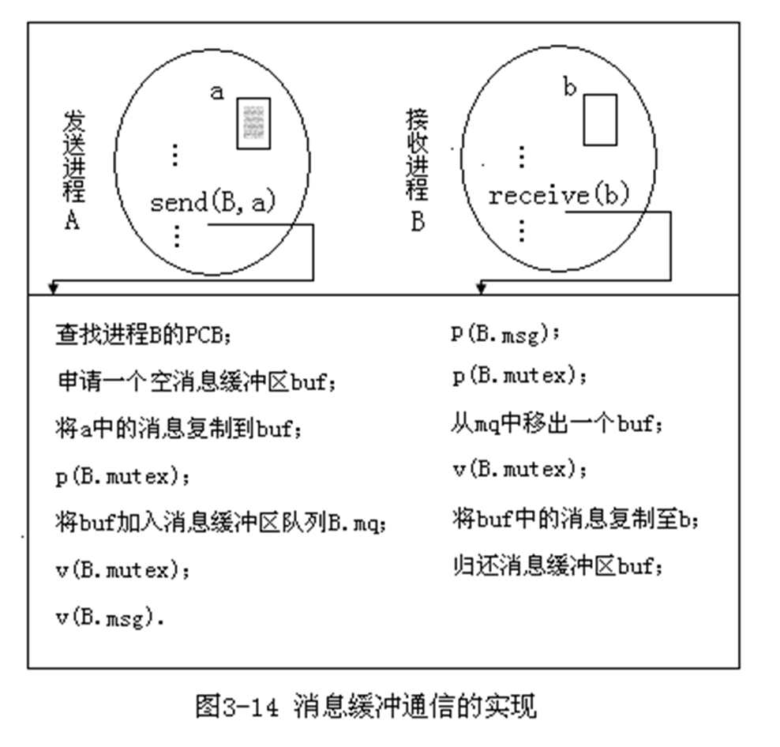

> 基于《计算机操作系统原理分析（第三版）》–丁善镜 整理
>
> 结合了部分王道内容

# 前置

## 冯诺依曼结构


- 组成
  - 运算器**（Processing Unit，PU）**
    - 算术逻辑单元（Arithmetic Logic Unit，ALU）
    - 处理器寄存器（Processor Register）
  - 控制器**（Control Unit，CU）**
    - 程序计数器（Program Counter）
    - 指令寄存器（Instruction Register）
  - 存储器
  - 输入设备
  - 输出设备

# 第一章 引论

## 1.1 操作系统定义

1. 操作系统的定义：操作系统是运行在计算机上的最基本最核心的软件，是负责控制和管理整个计算机硬件和软件资源的应用程序，他将硬件和软件进行分离，为用户和软件提供了方便的接口。

   1. 管理计算机系统的硬件和软件;
   2. 控制计算机系统的工作流程;
   3. 为其他软件和用户提供安全、方便的运行、操作环境;
   4. 提高计算机系统的效率。

2. 计算机系统的组成
   M%7BMFZQHK8%7BOR.png>)
3. 计算机系统的层次结构
   -  
     操作系统是对硬件层的第一次扩充，同时又作为其他软件运行和用户操作的基础。起了“承下启上”的作用。
   - 层次结构的概念
     - 层
     - 接口
     - 单向依赖
     - 隐藏性

## 1.2 操作系统的形成

### 1.2.1 多道程序设计

> 20 世纪 70 年代中期, 在硬件上具有中央处理器与设备、设备与设备并行工作的能力，相应地，在软件上，提出了多道程序设计技术，两者奠定操作系统形成的基础。

1. 计算机系统的工作流程
   - 顺序执行
   - 并发执行
2. **顺序执行**：处理器在开始执行一道程序后，只有在这道程序执行**结束**(程序指令运行完成，或程序执行过程出现错误而无法继续运行)，处理器才能开始执行下一道程序。
   - 这种工作流程的外在表现就是**单任务**，早期的计算机系统是所采用顺序执行的工作流程。
3. **多道程序设计**是指：在内存同时存放多道程序，这些程序可以并发执行。
4. 多道程序的**并发执行**(Concurrence)，是指：在多道程序设计环境下，处理器在开始执行一道程序的第一条指令后，在这道程序完成之前，处理器可以开始执行另一道程序、甚至更多的其他程序。
   - 这种工作流程的外在表现就是**多任务**，现代的计算机操作系统都采取了并发执行的工作流程。

#### 并发调度图

> 用平面坐标系描述系统的具体工作流程

例 1-1：假定某计算机系统需要执行两道程序 A、B，程序 A、B 的任务描述如下：

| 程序 A： | 程序 B： |
| -------- | -------- |
| 2ms CPU  | 12ms CPU |
| 10ms I/O | 5ms I/O  |
| 2ms CPU  | 2ms CPU  |

在同样假定程序 A 先运行的情况，如果分别按顺序执行和并发执行的工作方式，那么，系统的工作过程怎样？


一个资源在指定时间段的==利用率== 定义：$\frac{指定时间段中具体工作时间的总和}{指定时间段时间长度}$

- 如图 1-2 所示的顺序执行方式，CPU 的利用率为：(2+2+12+2)/33≈54.5%

- 如图 1-3 所示的并发执行方式，CPU 的利用率为：(2+12+2+2)/21≈85.7%

#### OS 的形成

1. 脱机批处理系统: 晶体管, IBM1401
2. 连接批处理系统: 集成电路, IBM360
   - 集成了字符设备和块设备的处理接口芯片
   - 集成了磁盘
   - 软件上使用了多道程序设计
   - 将脱机批处理系统中的输入输出集成到计算机中
3. 多用户分时系统: UNIX

**OS 形成的标志**：操作系统的基本类型，即**批处理系统**、**分时系统**和**实时系统**

#### OS 的发展

> （从多计算机观点看）

- 个人微机操作系统
- 网络操作系统
- 分布式操作系统

## 1.3 OS 的基本类型

### 1.3.1 批处理系统

1. 批处理系统基本概念

   - 作业和作业步、作业流
     - 作业： 要求计算机处理的一个问题
     - 作业步：解决作业的几个独立步骤
     - 作业流：若干作业的有序集合
   - 程序员和操作员

   - 作业控制语言(JCL)和作业说明书
     - JCL：操作系统提供的几组命令， 程序员通过 JCL 定义作业，描述对作业的运行控制
     - 作业说明书：定义一个作业、描述对该作业的运行控制的一组 JCL 命令编写的文件

2. 脱机批处理系统

   - 需要 3 台独立的计算机: 输入计算机 主计算机 输出计算机
   - 作业经过提交、后备、执行和完成等四个阶段

3. 联机批处理系统

   - SPOOLing 技术（假脱机批处理系统 ）Simultaneous Peripheral Operation On Line

     - 外围设备同时联机操作

   - 
   - SPOOLing 组成
     - 输入井
     - 输出井
     - 预输入程序
     - 缓输出程序

4. 批处理系统的特征

   - 批量处理，减少手工操作

   - 自动执行，资源利华为哥用率高

   - 缺少人机交互能力, 不利于调试

### 1.3.2 分时系统

1. ==分时操作系统== : 计算机以**时间片**为单位轮流为各个用户/作业提供服务， 各个用户通过**终端**与计算机进行交互
2. 分时系统具备如下四个特征

   - **同时性**/多路性：多个用户使用系统。

   - **独立性**：各请求 or 用户间无互相干扰。

   - **及时性**：请求很快得到主计算机的处理并返回结果。
   - **交互性**：用户根据返回的结果决定下一步操作。

### 1.3.3 实时系统

1. ==实时系统== : 定期或者随时产生事件及时响应并且在严格规定的时间范围内处理完成。
   - 在实时系统中，计算机对一个任务处理的正确性，不仅要求计算结果是正确的，还要求在规定的时间内得到结果
2. 实时系统分为：
   - 实时过程控制系统
   - 实时信息处理系统
3. 实时系统的特征
   - **高及时性**
   - **高可靠性**

## 1.4 OS 的研究内容

1. OS 理论: 研究计算机系统的工作方式、用户使用方式，以便计算机系统更加方便、有效、安全地为人们的学习、生活和工作服务

   1. OS 工作方式研究目标: 提高计算机系统资源利用率
   2. 用户使用方式研究目标: 方便用户操作
   3. 管理, 控制的原理和方法: 提出对计算机工作方法和方式的一些原理和方法

2. OS 软件: 依据操作系统理论，对指定计算机系统实现管理的一组程序和数据的集合
3. 操作系统的主要功能
   - **用户接口及作业管理**: 作业调度和控制
   - **处理器管理**: 进程的控制、同步、通信、调度和死锁等的管理
   - **存储器管理**
     - 目标: 提供虚拟存储器
   - **文件系统**：通过文件来组织数据，实现文件的“按名存取”
   - **设备管理**：实现设备独立性

# 第二章 操作系统接口

## 2.1 操作系统内核

### 2.1.1 处理器指令

1. 从硬件角度，处理器指令分为：**特权指令**和**非特权指令**

2. 处理器工作模式
   - **核心态**和**用户态** (与特权指令和非特权指令对应)
   - 处理器的控制寄存器中有几个位标识当前处理器的工作模式

### 2.1.2 操作系统内核

1. 内核的主要组成

   - 与硬件密切相关的操作

   - 关键数据结构

   - 基本中断处理程序

   - 使用频繁的功能模块

2. 内核基本特点

   - **常驻内存**：和用户程序不同，内核的大部分程序和数据一直保留在内存，知道关机

   - **运行在核心态**：用户不能直接运行内核的程序，也不能直接访问内核的数据

3. 系统空间和用户空间

   - 主存的空间也分为两个部分

   - 内核的程序数据放在==系统空间== (System Space)
   - 应用程序, OS 核外部分的程序, 其他软件运行在==用户空间== (User Space)

## 2.2 操作系统的启动

### 2.2.1 固件

操作系统的启动需要依赖一组特殊的软件，即为系统固件（System Firmware）简称==固件==

- 固件是硬件平台与操作系统之间的接口

### 2.2.2 BIOS 系统

BIOS：基本输入/输出系统（Basic Input/Output System, BIOS）存储在 ROM 芯片的一组程序和数据的统称，也成为 ROM BIOS

#### BIOS 组成

1. **POST 自检程序**：自诊断测试程序

   - 识别系统的硬件配置，并根据这些配置对系统的各个部件进行自建和初始化

2. **基本启动程序**
   - 检查和运行引导程序
3. **基本硬件驱动程序及其中断处理程序**
   - 系统基本 I/O 设备(键鼠, 显卡, 硬盘)的驱动程序
   - 基本的中断服务

#### 磁盘分区

1. 低级格式化
   - 磁盘在使用前需要进行低级格式化
   - 包括扇区的标识和故障检查, 建立磁盘的设备信息(如磁盘类型, 序列号, 柱面数, 磁头数, 扇区数, 每次传输的最大扇区数, 卷标识, 描述符…)
2. 磁盘空间分区

#### 主引导记录

1. BIOS 磁盘分区管理: 主引导记录 (MBR) 结构

2. | 表 2-1 MBR 结构 |        |                                         |
   | --------------- | ------ | --------------------------------------- |
   | 偏移量          | 字节数 | 内容                                    |
   | 0               | 440    | 主引导程序(MBR)                         |
   | 440             | 4      | 磁盘签名(signature)                     |
   | 444             | 2      | [未定义]                                |
   | 446             | 16     | 第 1 个分区表 DPT1                      |
   | 462             | 16     | 第 2 个分区表 DPT2                      |
   | 478             | 16     | 第 3 个分区表 DPT3                      |
   | 494             | 16     | 第 4 个分区表 DPT4                      |
   | 510             | 2      | 结束标志符(BRID)：55H AAH(Magic Number) |

#### 启动流程

1. 进行**POST 自检**
2. BIOS**基本启动程序**逐个检查启动设备, 查找到一个启动磁盘时, 读取主引导扇区的 MBR 数据到内存[0000:7C00]区域, 运行主引导程序
   - 主引导程序: 检查各个分区表中 是否安装了有效的 OS Loader
   - 若在分区的首个扇区发现有效的 OS Loader, 将其读入内存, 启动 OS
   - 若未找到, 提示相关信息

### 2.2.3 可拓展固件接口

> 英特尔(Intel)公司在 1997 年为其新推出的高性能处理器，计划设计一种可扩展的，标准化的固件接口规范 EFI(Extensible Firmware Interface)，用于计算机系统的启动以及提供与操作系统的接口
> 2005 年 UEFI(Unified EFI)论坛, 2011 年 4 月 6 日推出 UEFI 2.3.1.

1. 可扩展固件接口(EFI)的特点：

   - 驱动程序运行环境(DXE，Driver Execution Environment)
   - 磁盘管理采用 GUID 分区方法
   - UEFI 应用程序(没有操作系统 时的系统管理)

2. UEFI 体系结构
   

   - 7 个阶段

3. 磁盘 GUID 分区

   - UEFI 规范对磁盘管理采用 GUID 分区方法

   - 

   - 首个逻辑块 LBA 为保护 MBR(PMBR)

   - 主分区表(GUID Partition Table, GPT)

   - | 表 2-4 GPT 表头(HDR)结构 |        |                          |                                                      |
     | ------------------------ | ------ | ------------------------ | ---------------------------------------------------- |
     | 偏移量                   | 字节数 | 字段                     | 说明                                                 |
     | 0                        | 8      | Signature                | 签名，表示 EFI 兼容分区表表头，值为”EFI PART”        |
     | 8                        | 4      | Revision                 | GPT 头版本号                                         |
     | 12                       | 4      | HeaderSize               | PDT 表头的大小(字节数)，92 ＜ HeaderSize≤ 逻辑块长度 |
     | 16                       | 4      | HeaderCRC32              | GPT 表头信息的 CRC32 校验和                          |
     | 20                       | 4      | Reserved                 | 保留，置 0                                           |
     | 24                       | 8      | MyLBA                    | GDT 表头占用的逻辑块数                               |
     | 32                       | 8      | AlternateLBA             | GDT 表备份的逻辑块号                                 |
     | 40                       | 8      | FirstUsableLBA           | 可用空间的起始块的逻辑块号                           |
     | 48                       | 8      | LastUsableLBA            | 可用空间的结束块的逻辑块号                           |
     | 56                       | 16     | DiskGUID                 | 磁盘的 GUID                                          |
     | 72                       | 8      | PartitionEntryLBA        | GUID 分区入口表(数组)的起始块的逻辑块号              |
     | 80                       | 4      | NumberOfPartitions       | GUID 入口表中分区数                                  |
     | 84                       | 4      | SizeOfPartitionEntry     | GUID 分区入口表项长度(字节数，等于 128\*2 的整数倍)  |
     | 88                       | 4      | PartitionEntryArrayCRC32 | GUID 分区入口表 CRC32 校验和                         |
     | 92                       | 块尾   | Reserved                 | 逻辑块的剩余部分。UEFI 保留，置 0                    |

### 2.2.4 OS 的启动过程

1. 系统配置: 读取系统配置, 硬件检查, 硬件参数设置
2. 内核的装入和初始化
3. 用户登录

## 2.3 操作系统的用户接口

### 2.3.1 命令接口

1. 命令接口的按实现分类,分为：**外部命令**和**内部命令**
   - **外部命令**: 一个命令对应一个独立的应用程序
   - **内部命令**: 内核程序模块实现的命令
2. 命令接口的按使用分类,分为：脱机命令和联机命令
   - 作业控制语言(JCL)属于脱机命令
   - 联机命令分为：字符命令 → 菜单命令 → 图标命令
     - 字符命令是基本的命令接口

### 2.3.2 程序接口

1. **什么是系统调用**

   - 一组操作系统设计人员事先编写的子程序，这些子程序作为内核的一部分;
   - 程序员使用这组子程序的方法。

2. 访管指令及其功能

   - 因为系统调用的子程序组织在内核, 运行在核心态, 用户不能直接访问

     用户程序可以通过 OS 的特殊指令, ==访管指令== 来调用内核子程序

   - 访管指令功能
     1. 产生一个中断, 处理器工作模式: 用户态 → 核心态
     2. 执行对应子程序
     3. 切换回用户态

3. 系统调用实现过程

   - 

   1. 处理器切换为核心态, 保护用户现场
   2. 分析功能号, 在地址入口表查找对应子程序, 有事还需要进行安全控制检查
   3. 执行系统调用子程序, 得到结果
   4. 现场恢复, 切换为用户态并返回结果, 必要时进行安全检查

4. 系统调用与用户子程序的区别

   - | **对比项目**      | **系统调用**       | **用户子程序**   |
     | ----------------- | ------------------ | ---------------- |
     | ①**运行环境**     | 核心态             | 用户态           |
     | ②**中断**         | 访管中断           | 无               |
     | ③**与主程序关系** | 与主程序分开、独立 | 同一进程地址空间 |
     | ④**共享**         | 不同用户可以共享   | 同一进程内部调用 |

### 2.3.3 UNIX 系统概述

> 略

快速跳转: [二. 进程管理](# 二. 进程管理)

# 一. 操作系统简介

## 1.1 基本概念

1. 操作系统的功能：

   - 进程管理：
   - 内存管理：
   - 文件管理：
   - 设备管理：

   - 提供用户接口：
   - 用作扩充机器：

2. 操作系统的目的：

   - 管理计算机的各种资源
   - 为用户提供图形化界面
   - 与其他软件进行交互，为其它软件进行服务

3. 操作系统的特征

   - 并发：

     - 共享：

       - 互斥共享
       - 同时共享

     - 虚拟：
       - 虚拟技术
         - 时分复用技术
         - 空间复用技术

   - 异步：

## 1.2 操作系统的发展与分类

- 操作系统的分类与发展

  

1. 手工操作阶段 (此阶段无操作系统)
   - 工作方式: 用户在计算机上算题的所有工作都要人工干预， 如程序的装入、运行、结果的输出等
   - 缺点用户: 独占计算机， 人机速度矛盾导致资源利用率极低
2. 批处理阶段 (操作系统开始出现)
   1. 单道批处理系统
      - 工作方式: 引入脱机输入技术（用磁带完成） 并监留程序（操作系统的雏形）控制作业的输入和输出
      - 特征
        - **自动性**: 磁带上的作业自动逐个运行
        - **顺序性**: 作业完成的顺序与进入内存的顺序在正常恰况下相同
        - **单道性**: 内存中仅有一道程序运行
      - 优点: 缓解人机矛盾
        缺点: 资源利用率依然很低
   2. 多道批处理系统
      - 工作方式: 在内存中多道程序并发执行， 在 CPU 中交替进行
      - 特征
        - **多道**: 内存中同时放入多道相互独立的程序
        - **宏观上并行**: 进入系统的多道程序都处在运行过程中， 给人的感觉就像同—时刻都在运行
        - **微观上串行**: 内存中的多诮程序轮流占有 CPU ， 交替执行
      - 优点: 多道程序并发执行、资源利用率忌
        缺点: 用户相应时间长， 没有人机交互， 用户不知道自己的程序运行进展如何
3. 分时操作系统
   - 工作方式: 计算机以时间片为单位轮流为各个用户／作业提供服务， 各个用户通过终端与计算机进行交互
   - 特点:
     - 同时性: 也称多路性． 指允许多个终端用户同时使用一台计算机
     - 交互性: 用户能够与系统进行人机交互
     - 独立性: 系统中的多个用户可以彼此独立的进行操作， 互不干扰， 单个用户感受不到其他用户的存在
     - 及时性: 因为有了交互， 采用时间片轮流为多个终端服务， 用户洁求能在很短时间内获得响应
     - 优点: 解决了人机交互， 用户诸求被即时响应
       缺点: 对于一切突发紧急惜况不能优先及时处理
4. 网络操作系统
   - 工作方式: 把计算机网络中的各台计算机有机的结合起来， 提供统一、经济而有效的使用各台计算机的方法实现各台计算机之间的数据互相传送
   - 特点:
     - 有主从关系, 网络中资源共享, 网络中的计算机通过协议进行通信
5. 分布式操作系统
   - 工作方式系统中的各计算机相互协同井行完成同一任务
   - 特点
     - 系统中任意两台计算机通过**通信方式交换信息**
     - 系统中的计算机都具有**同等地位**， 无主从关系
     - 每台计算机上的资源为所有用户共享
     - 系统中的任意台计算机都可以构成—个子系统， 并且还能重构
     - 任何工作都可以分布在几台计笋机上由他们并行工作、协同完成
   - 特点: 分布性和并行性
6. 嵌入式操作系统
   - 固化在硬件里面的系统、比如手机、路由器等
   - 特点: 完成某—项特定的功能, 不具有通用性
7. 个人计算机操作系统
   - 广泛用于文字处理, 电子表格, 游戏中
   - 常见的有 Windows, Linux, MacintOSh

## 1.3 操作系统的运行机制与体系结构

### 1.3.1 操作系统的运行机制与体系结构

- 操作系统的运行机制与体系结构

  


### 1.3.2 中断和异常


**中断(Interrupt) 机制**，即处理器核在顺序执行程序指令流的过程中突然被别的请求打断而中止执行当前的程序，转而去处理别的事情，待其处理完了别的事情，然后重新回到之前程序中断的点继续执行之前的程序指令流。

**异常(Exception)机制**，即处理器核在顺序执行程序指令流的过程中突然遇到了异常的事情而中止执行当前的程序，转而去处理该异常。同步异常：是指令异常，可以定位到具有的指令。异步异常：不能定位到具体的指令。

**中断和异常的区别**：异常一般是由于处理器内部事件或者程序执行中的事件引起的。

### 1.3.3 系统的调用

- 系统调用的定义：系统调用是操作系统提供给应用程序的接口
- 系统调用的作用：应用程序可以通过系统调用请求获得操作系统的服务，系统调用会使处理器从用户态切换到核心态。
- 系统调用的分类

  - 设备管理
  - 文件管理
  - 进程控制
  - 进程通信
  - 内存管理

- 系统调用和库函数的区别

  - 系统调用是操作系统向上提供的接口
  - 库函数是对函数调用的进一步封装

- 系统调用的过程
  1. 用户程序执行相关操作，传递系统调用参数
  2. 用户程序执行陷入指令(trap 指令) -------->用户态 引发内中断,使 CPU 进入核心态
  3. 操作系统对系统的调用进行相应的处理----->核心态

# 二. 进程管理

> 对应课本第三章 处理器管理

## 2.0 系统的工作流程

> 处理器执行程序的方式成为系统工作方式, 也称工作流程
>
> 计算机系统的基本工作流程是顺序执行和并发执行

1. 程序及其特点

   - 程序应具体两个基本特点：
     - **顺序性**
     - **可再现性**

2. 顺序执行的工作方式及特征

   - 顺序执行指：处理器在开始执行一道程序后，只有在这道程序运行结束(程序指令运行完成，或程序运行过程出现错误而无法继续运行)，才能开始执行下一道程序。
   - 这种工作流程的外在表现就是单任务。特征：**封闭性** ，**可再现性**

3. 并发执行的工作方式

   - 并发执行是指：在多道程序设计环境下，处理器在开始执行一道程序的第 1 条指令后，在这道程序完成之前，处理器可以开始执行下一道程序，同样地，更多其他的程序也可以开始运行。
   - 这种工作流程的外在表现就是多任务。

4. 并发执行的理解

   - 宏观：多道程序“同时”在运行，表现为多任务
   - 微观：多道程序又是轮流交替地在处理器上执行

5. 并发执行的特征

   - > 并发执行可以发挥硬件的并行能力，为任务协作提供可能
     >
     > 但并发执行具有如下的复杂性

   - **随机性**/不确定性：为操作系统管理提供可能

   - **不可再现性**：程序丢失了可再现性

   - **相互制约**(间断性)

## 2.1 进程与线程

### 2.1.1 进程的定义、特征、组成、组织

1. 进程的定义

   - 程序段、数据段 、PCB(进程控制块)三部分组成了进程实体。一般情况下我们把进程实体简称为进程。

   - 所谓的创建进程和撤销进程，一般都指的是创建或者撤销进程实体中的 PCB。
   - 进程是进程实体的运行过程，是系统进行资源分配和调度的一个独立单位

2. 进程和程序的区别

   - 组成不同：进程包含程序段、数据段、PCB。程序包含数据和指令代码。

   - 程序本身除了占用磁盘的存储空间外，并不占用系统的 CPU、内存等运行资源。但是进程会占用系统的 CPU、内存等运行资源。

   - 进程更强调动态性，而程序一般则是静态的。

   - 进程不能脱离具体的程序而虚设，程序规定了相应的进程要完成的动作。

3. ==进程的特征== 【3.2.2 进程的定义】
   - **动态性**：进程是程序的一次执行过程，是动态地产生、变化和消亡的
     - 最基本的特征
   - **并发性**：内存中可以有多个进程实体，各进程可以并发执行
   - **独立性**：进程是能独立运行、独立获得资源、独立接受调度的基本单位
   - **异步性**：各进程独立运行，需要操作系统提供”进程同步机制”来解决异步问题
   - **结构性**：每个进程都有一个 PCB（进程控制块），进程由程序段，数据段，PCB 组成
4. 进程的组成

   - 程序段

   - 数据段

   - PCB(Process Control Block)
     - PCB 是进程存在的唯一标识
     - OS 是根据 PCB 来对并发执行的进程进行控制和管理的


5. 进程的组织

   - 链接方式

     - 按照进程状态将 PCB 分为多个队列
     - 操作系统持有指向各个队列的指针

   - 索引方式
     - 根据进程状态的不同，建立几张索引表
     - 操作系统持有指向各个索引表的指针

> 进程的状态有 就绪态 执行态 阻塞态
>
> 单核 CPU 计算机中同一时刻只会有一个进程处于运行态
>
> 通常会把优先级高的进程放到队头

### 2.1.2 进程的状态及转换

1. 三种基本状态

   - **运行态**：占有 CPU，并在 CPU 上运行

   - **就绪态**：具备运行条件（除 CPU 以外的资源），没有空闲 CPU

   - **阻塞态**：等待某一时间而暂时不能运行

2. 另外两种状态

   - 创建态：OS 正在为进程分配资源，初始化 PCB

   - 终止态：正在回收相应的资源，撤销 PCB

3. 状态的转换
   
   

- 创建态------>就绪态
  - 系统创建进程获得除 CPU 以外的其他资源
- 就绪态------>运行态
  - 进程被调度，获取 CPU 时间片
- 运行态------>就绪态
  - 时间片用完或处理机被其他进程抢占
- **运行态------>阻塞态**
  - 进程通过“系统”调用申请某个资源或者请求等待某个事件，是一种主动行为
  - ==可能的原因==
    1. I/O 操作
    2. 系统控制
    3. 硬件故障
- 阻塞态------>就绪态
  - 申请的资源得到，等待的时间发生，是一种被动的行为
- 运行态------>终止态
  - 进程正常结束，或者运行中遇到不可修复的错误

> 注：不能由阻塞态直接转换为运行态，也不能直接由就绪态直接转换为阻塞态
>
> 因为进程进入阻塞态是主动行为，只有在运行时才可以主动发出请求

### 2.1.3 进程的组成

> 进程是一个独立的运行单位, 也是 OS 进行资源分配和调度的基本单位
>
> 由程序段, 数据段, 和进程控制块 PCB 组成

#### 进程控制块 PCB

1. 进程控制块(Process Control Block, PCB): 描述,关系和控制进程的数据结构
   - 分为三个部分
2. **基本描述信息部分**
   - 进程名 pname
   - 进程标识符 pid: 操作系统自动生成, 具有唯一性
   - 用户标识 uid: 创建进程的用户标识 id
   - 进程状态 pstate: 进程当前状态
3. **管理信息部分**
   - **程序和数据的地址**: 如页表起始地址, 长度 or 分区起始地址, 长度, 分区号
   - **I/O 操作相关参数**: 如设备逻辑好, 传送的数据量大小, 缓冲区地址
   - **[进程通信信息](# 三. 消息缓冲通信的设计和实现)**: 如消息缓存队列指针
4. **控制信息部分**
   - [现场信息](# 2.2.6 进程切换 【王道】): 进程从运行态 → 阻塞态时, CPU 主要寄存器内容
   - 调度参数: 进程调度用到的参数, 如到达时间, 优先级, 进程大小, 累积运行时间
   - 同步, 互斥的信号量

#### PCB 队列

> 常用链表实现, 也叫 PCB 链表

1. 就绪队列(请求队列)
   - 就绪态的进程的 PCB 链
2. 等待队列
   - 阻塞状态的进程的 PCB 链
   - 可以按照阻塞原因进行分类

### --- 进程管理的主要内容

- 控制: 进程生命周期及其状态转换的实现
- 同步: 并发执行进程的控制, 抱枕程序的可再现性和任务协作
- 通信: 进程之间的数据交换
- 调度: 并发执行在微观上的轮流交替
- 死锁: 分析解决并发执行的另一种错误现象

### 2.1.4 进程控制

进程控制：实现进程在不同状态间的转换

#### 一. 原语

1. ==原语== (Primitive): 具有原子性的特殊程序段
2. 原语实现对进程的控制

   - 通过开中断指令和关中断指令实现

   - 原语的操作具有原子性，只能一气呵成

3. 原语的操作
   - 更新 PCB 中的信息
   - 将 PCB 插入合适的队列
   - 分配/回收资源

#### 二. 进程控制的五种原语

##### 创建原语

1. 创建进程的时机
   1. 作业调度程序创建
   2. 用户提交请求命令
   3. 系统调用
2. 创建进程的过程
   1. 为新进程分配一个唯一的 pid，申请空白 PCB
      - PCB 是有限的，申请失败则创建失败
   2. 分配资源
   3. 初始化 PCB?初始化标志信息, 处理机状态信息, 处理剂控制信息, 设置进程优先级
   4. 将 PCB 插入相应的队列
3. 进程树
   - 
   - OS 启动后自动创建一个 init 进程(pid=1), 作为根节点

##### 终止原语(撤销原语)

1. 进程撤销(Destroy): 标志进程的生命期结束, 即消亡
   - 主要功能: 回收进程的资源(包括 PCB)
2. 撤销的时机
   1. 进程执行完成
   2. 进程执行过程出错(异常结束)
   3. 父进程异常结束
   4. 人为操作终止(Ctrl C)
3. 撤销流程
   1. 根据 pid, 从 PCB 集合中找到要终止的 PCB
   2. 若进程正在运行，立刻剥夺 CPU，分配给其他进程
   3. 终止所有子线程
   4. 将资源归还给其父线程或者 OS
   5. 删除 PCB

##### 唤醒和阻塞原语（成对存在，成对使用）

1. 阻塞原语

   - 主要功能
     - 保护 PCB 进程状态, 把运行状态设置为阻塞
     - 现场保护, 将处理器现场的内容保存在 PCB 中
     - 进程加入等待序列
   - 流程
     1. 找到 PCB
     2. 保护进程运行现场，将 PCB 状态信息设为“阻塞态”，暂时停止进程运行
     3. 将 PCB 插入相应的队列

2. 唤醒原语
   - 唤醒后转换为就绪状态, 而非直接运行
   - 流程
     1. 在阻塞队列中找到 PCB
     2. 将 PCB 从等待队列中移除，设置进程为就绪态
     3. 将 PCB 插入就绪队列，等待调度

##### 切换原语

- 由硬件实现
- 流程
  1. 将运行环境信息存入 PCB
  2. PCB 移入相应的队列
  3. 选择另一个进程执行，并更新其 PCB
  4. 根据 PCB 恢复新进程所需的运行环境

### 2.1.5 进程通信

> 对应课本【3.7 进程通信】

#### 一. 进程通信概念

1. <font color="66ccff">进程通信</font>: 两个或多个进程之间交换数据的过程

2. 进程通信类型

   - 低级通信: OS 内核程序之间的通信， 交换数据量较小，交换数据用于控制进程执行。（如信号量机制

   - 高级通信: 应用程序之间的通信， 交换数据量较大，交换数据为接受进程的处理对象

#### 二. 进程通信方式

> 以下方法都是高级通信

##### 共享存储

==共享存储区== ：设置一块共享空间，两个进程互斥地访问共享空间

- 基于数据结构的共享：速度慢，限制多，是一种低级通信方式

- 基于存储区的共享：内存中有一块共享存储区，数据的存放及数据的结构有进程控制，是一种高级通信方式

##### 消息传递

1. ==消息缓冲通信== (直接通信): 每个进程含有一个队列，即消息缓冲区(消息缓冲队列)。

   1. 发送信息时，发送进程先写到自己的消息缓冲区， 再将消息缓冲区加入到接收进程的消息缓冲队列中
   2. 接受信息时，接收进程通过接收操作，从自己的消息队列中取出消息缓冲区，接受到发送进程的数据

2. ==信箱通信== : 发送进程将消息发送到中间实体(即信箱), 接收进程从中间实体中取得消息

##### 管道通信

==管道通信== ：在内核内存中开辟一个大小固定的缓冲区，通信数据遵循先进先出

- 特征：

  - 管道只能采用半双工通信，即某段时间内只能实现单项的传输，要实现双向同时通信，要设置两个管道。
  - 各进程互斥的访问管道
  - 数据以流的形式写入管道
  - 没有写满不允许读，没读空不允许写
  - 数据被读出就会从管道中抛弃，因此只能有一个读进程

- 分类
  - 匿名管道
    - 匿名管道会生成两个描述符，一个是管道的读取端描述符，一个是管道的写入端描述符
    - 父进程通过 fork 创建子进程，创建的子进程会复制父进程的文件描述符。
    - 只能实现存在父子关系的进程之间的通信
  - 命名管道
    - 提前创建类一个类型为管道的设备文件
    - 可以在不相关的进程间进行通信

##### 消息缓冲通信的设计和实现

1. 消息队列：存放在内核中的消息链表

   - 进程间的数据交换以格式化的消息为单位，进程通过 OS 提供的“发送消息/接受消息”两个原语进行数据交换

   - 发送信息的进程将消息头写好，接受信息的进程根据消息头读取信息或寻找信封是哪一个

   - 不适合叫大数据的传输

   - 通信过程中会存在用户态和内核态之间的数据拷贝开销

2. 消息缓冲区结构

   - 发送进程标识(pid)

   - 正文大小(size)

   - 正文(data)

   - 向下指针(Next)

3. PCB 的通信参数结构

   - 消息缓冲区队列(mq)

   - 互斥信号量(mutex)

   - 同步信号量(msg)

4. 发送操作和接收操作
   - send(dest，&mptr)
   - receive(&mptr)

#### 三. 消息缓冲通信的设计和实现

1. 消息缓冲通信设计

   - 消息缓冲区结构

     - 发送进程标识(pid): 发送进程的 pid

     - 正文大小(size)： 进程间交换的数据大小

     - 正文(data) ：存储发送进程提交给接收进程的数据

     - 向下指针(Next) ：一个消息缓冲区就是消息缓冲区队列的一个节点，next 指向队列中的下一个节点

   - PCB 的通信参数结构

     - 消息缓冲区队列(mq)：组织到来的消息缓冲去

     - 互斥信号量(mutex)：

     - 同步信号量(msg)

   - 发送操作和接收操作

     - send(dest，&mptr)

     - receive(&mptr)

2. 实现
   - 
   - 消息缓冲是一种**直接通信**: 查找接收进程的 PCB, 直接将信息加入到消息缓冲队列中
   - 只能应用于同一台计算机中: 因为只能操作同一台计算机的内存, 所以只能发给同一台计算机的另一个进程

#### 四. 信箱通信的设计和实现

1. 信箱结构
   - 信箱头基本结构
     - 信箱名(boxname)
     - 信箱标识符(bid)
     - 信箱大小(size)
     - 同步信号量(mailnum)
     - 同步信号量(freenum)
     - 读互信号量(rmutex)
     - 写互信号量(wmutex)
     - 读信件指针(out)
     - 存信件指针(in)
   - 信箱体结构
     - 由若干个信格组成，一个信格存放一个信件，要交换的数据组织成信件
   - 发送操作和接收操作
     - send(dest，&mptr)
     - receive(addr，&mptr)

#### 五. 管道通信

> 在 linux 常用

管道是进程间通信的主要手段之一。一个管道实际上就是个只存在于内存中的文件，
对这个文件的操作要通过两个已经打开文件进行，它们分别代表管道的两端。
管道是一种特殊的文件，它不属于某一种文件系统，而是一种独立的文件系统，有其自己的数据结构。

### 2.1.5 线程概念与多线程模型

#### 一. 什么是线程

1. 线程的定义
   - 线程是“轻量级的进程”，是一个基本的 CPU 执行单元，也是程序执行流的最小单位。
   - 把进程细化成若干个可以独立运行的实体，每一个实体称为一个线程(Thread)
2. 引入线程的目的--引入线程可以减小系统的基本工作单位粒度
   - 实现进程内部的并发执行，提高并行程度
   - 减少处理器切换带来的开销
   - 简化进程通信方式
3. 进程与线程

   - 二者地位
     - 进程 是其他**资源**(除处理器之外)**分配**的基本单位
     - 线程 是处理器**调度**的基本单位
   - 调度
     - 进程之间在处理器切换时现场的保护/恢复的开销比较大
     - 同一进程的线程之间在处理器切换时现场的保护/恢复的开销比较小
     - 同一进程的线程之间共享的该进程地址空间
   - 并发性与独立性

     - 与进程一样，线程具有动态性和并发性

     - 系统开销
       - 创建/撤销进程时, 系统需要分配/回收 PCB 和其他资源(IO 设备, 内存空间)
         而线程不需要

#### 二. 线程类型

- **管理, 控制线程的模块称为线程包**(Thread Package)

1. 用户级线程（User-Lever Thread, **ULT**）

   - 用户可以看到的线程
   - 用户级线程由应用程序通过线程库实现，线程切换在用户态即可完成。

2. 内核级线程（Kernel-Level Thread, **KLT**）

   - 操作系统内核可以看到的线程
   - 内核级线程的管理由操作系统内核完成，内核级线程的切换需要在核心态下完成。
   - 只有内核级线程才是处理机分配的单位

3. 轻量级进程（Light Weight Process）
   - 内核线程的一种高级接口，用来支持用户线程

#### 三. 线程的常用细化方法

> 如何将进程分解(细化)为多个线程

1. 分派/处理模型 (主/从模型)
   - 将一个线程作为分派线程(Dispatcher), 其他线程作为处理线程(Worker)
   - 分派线程根据进程当前状态, 决定处理线程的运行, 处理线程执行具体任务
   - 
2. 队列模型
   - 将进程一个任务分解为几个独立的小任务
   - 线程之间相互独立, 不需要同步控制
   - 
3. 管道模型
   - 子任务需要按顺序运行
   - 

#### 四. 多线程模型 【略】

- 多对一模型：多个用户线程映射到一个内核级线程

  - ULT 的切换在用户态即可完成，线程管理的系统开销小，效率高
  - 一个 ULT 阻塞时，整个进程都会被阻塞，并发度不高，多个线程不能在多喝处理及上并行运行

- 一对一模型：一个 ULT 映射到一个 KLT 上
  - 一个线程被阻塞后，别的线程还可以继续执行，并发性强。多线程可以在多核处理机上并行执行
  - 一个用户进程会占用多个内核级线程，线程切换由 OS 内核完成，需要切换到核心态，线程管理的成本高，开销大。
- 多对多模型：n 个用户级线程映射到 M 个内核级线程上

  - 克服了并发度不高，以及进程占用太多内核级线程，开销太大的缺点

## 2.2 处理机的调度机制

> 对应课本第四章 处理器调度

### 2.2.1 调度的概念

1. 调度的基本概念
   - 调度(Scheduling)是管理的一种方法、是一种决策，资源（如工作、人力、车辆等）经过管理得到合理、有效地利用。调度的目标是找出一种合理的、有效的安排方法，提高资源的利用率。
   - 处理机调度就是从就绪队列中按照一定的算法选择一个进程并将处理机分配给它运行，以实现进程的并发执行。
2. 调度的三个层次【王道】

   - 高级调度（作业调度）
     - 从后备队列中选择合适的作业将其调入内存，并为其创建进程
     - 发生频率最低
     - 外存--------->内存 面向作业
     - ==只有在多道批处理系统中才有作业调度的概念==
   - 中级调度（内存调度）
     - 从挂起队列中选择合适的进程将其数据调回内存
     - 发生频率中等
     - 外存------>内存 面向进程
   - 低级调度（进程调度）
     - 从就绪队列中选择一个进程为其分配处理机
     - 发生频率最高
     - 内存----->CPU

3. 操作系统中的调度【dsj】
   - **作业调度**: 按照一定的策略, 从后备队列中选择一部分作业, 为他们分配运行所需的必要资源, 创建进程的过程
     - 也叫**宏观调度**, 因为还需要经过进程调度才能真正运行
   - **进程调度**: 按照一定策略, 从就绪进程队列中选择一个进程, 让其占用处理器运行
   - **交换调度**: 选择一部分就绪状态/阻塞状态的进程, 将其从内存中调出, 暂存到外存
   - **设备调度**: 对一组 I/O 请求进行设备的分配和调度

### 2.2.2 调度的目标(指标)

1. CPU 利用率
   - 如果运行的程序，发生了 I/O 事件的请求，那 CPU 使用率必然会很低，因为此时进程在阻塞等待硬盘的数据返回。这样的过程，势必会造成 CPU 突然的空闲。所以，为了提高 CPU 利用率，在这种发送 I/O 事件致使 CPU 空闲的情况下，调度程序需要从就绪队列中选择一个进程来运行。
   - $CPU利用率=\frac{CPU有效工作时间}{CPU有效工作时间+CPU等待时间}$
2. 系统吞吐量
   - 单位时间内 CPU 完成作业的数量
   - 有的程序执行某个任务花费的时间会比较长，如果这个程序一直占用着 CPU，会造成系统吞吐量(CPU 在单位时间内完成的进程数量)的降低。所以，要提高系统的吞吐率，调度程序要权衡长任务和短任务进程的运行完成数量。
3. 周转时间
   - 从进程开始到结束的过程中，实际上是包含两个时间，分别是进程运行时间和进程等待时间，这两个时间总和就称为周转时间。
   - 进程的周转时间越小越好，如果进程的等待时间很长而运行时间很短，那周转时间就很长，这不是我们所期望的，调度程序应该避免这种情况发生。
   - $$周转时间T_i=作业J_i完成时间-作业J_i提交时间\\平均周转时间T=(\sum^n_{i=1}T_i)/n\\带权周转时间=\frac{作业周转时间}{作业实际运行时间}$$
4. 等待时间
   - 处于就绪队列的进程，也不能等太久，当然希望这个等待的时间越短越好，这样可以使得进程更快的在 CPU 中执行。所以，就绪队列中进程的等待时间也是调度程序所需要考虑的原则。
5. 响应时间
   - 对于鼠标、键盘这种交互式比较强的应用，我们当然希望它的响应时间越快越好，否则就会影响用户体验了。所以，对于交互式比较强的应用，响应时间也是调度程序需要考虑的原则。
   - $R = 请求处理过程第1次得到结果的时刻 - 请求提交的时刻$

### 2.2.3 调度的实现

#### 作业调度【dsj】

1. 作业状态
   

2. 批处理系统为什么需要作业调度？

   - 我不造啊

3. 作业调度的主要功能

   - 设计数据结构，登记调度所需要的参数
   - 执行指定 的算法，从作业的后备队列中选择一个作业
   - 为选中的作业分配资源，创建进程
   - 作业完成时的资源回收

#### 进程调度

1. 进程调度功能

   - 进程调度方式：运行状态的进程何时以什么方式停止或暂时停止运行

   - 进程调度算法：从就绪队列中按照指定的算法选择一个进程，准备执行

   - 处理器切换

   - 进程结束时资源回收

2. 进程调度的时机【略】

   - 需要调度

     - 当前进程主动放弃处理机
     - 当前进程被动放弃处理机

   - 不能调度与切换的情况

     - 处理中断的过程
     - 进程在操作系统内核程序临界区中
     - 在原子操作过程中(原语)

     > 临界区：访问临界资源的那段代码
     >
     > 临界资源：一段时间内只允许一个进程使用的资源，各进程需要互斥地访问临界资源
     >
     > - 内核程序临界区
     > - 普通临界区 ：可以进行进程的调度与切换

3. 进程调度的方式

   - 抢占式调度(Preemptive Scheduling)

     - 常见的原则有：时间片原则、优先级原则、任务紧迫性、重要性原则等等

   - 非抢占式调度(Nonpreemptive Scheduling)
     - 选中的进程会一直运行，直到进程退出或者进程阻塞

4. 进程的切换

   - 狭义的进程调度：从就绪队列中选一个要运行的程序
   - 进程切换：一个进程让出虚拟机，另一个进程占用处理机
   - 广义的进程调度：选择一个进程以及进程切换

> 注：进程切换是有代价的，如果过于频繁的进行进程调度和切换回事整个系统的效率降低。

5. [进程调度算法](# 进程调度算法)

### 2.2.4 调度算法

#### 作业调度

##### ① 先来先服务（First Come First Severed，FCFS）

1. 每次从就绪队列选择最先进入队列的进程，然后⼀直运行，直到进程退出或被阻塞，才会继续从队列中选择第⼀个进程接着运行

2. 特点

   - 公平合理
   - 算法简单，容易实现。
   - 服务质量欠佳(有于大作业，不利于小作业)

3. 例：假定在某单道批处理系统中，一批作业 A、B、C 和 D 在同一时间先后几乎同时到达。已知它们都是纯计算性的简单任务，运行时需要占用处理器时间分别是 10、3、2 和 5。把到达时间(提交时间)设为 0

   - |  |  |
     | ------------------------------------------------------------------------------------------ | ------------------------------------------------------------------------- |
     | TA=10，TB=13，TC=15，TD=20; <br />T=( TA+ TB+ TC+ TD)/4 =(10+13+15+20)/4 =14.5             | TA=20，TB=3，TC=5，TD=10; <br />T=( TA+ TB+ TC+TD)/4 =(20+3+5+10)/4 =9.5  |

##### ② 短作业优先（Shortest Job First，SJF）

1. SJF 思想:每个作业都给定其运行所需的处理器时间, 调度时选择一个最短处理器时间的作业
   - 一个作业运行时所需的处理器时间总和，简称为作业大小
2. SJF 特点
   - 算法思想简单，但实现困难
   - 拥有**最小平均周转时间**,吞吐量大
   - 存在“饥饿”现象

##### ③ 高响应比优先（Highest Response Ratio Next, HRRN）

1. 算法思想

   - $响应优先级= \frac{等待时间+要求服务时间}{要求服务时间}$【王道】
   - $R=\frac{作业等待时间}{作业大小}, 作业等待时间=系统当前时间-作业提交时刻$【dsj】

   - 当两个进程的等待时间相同时，服务时间越短，响应优先级越高
   - 如果两个进程的要求服务时间相同时，等待时间越高, 响应优先级越高

#### 进程调度算法

##### ④ 时间片轮转调度算法（Round Robin，RR）

1. 抢占式算法，就绪队列中的进程轮流执行一个时间片

2. 算法思想

   - 使用一个定时器, 值为 0 时产生一个中断

   1. 使用一个队列(就绪队列)来缓存进程
   2. 选中队首进程， 分配时间片
   3. 进程在给定时间片内执行
      - 时间片用完时(然后产生中断), 但任务未结束, 将进程添加到队列末尾
      - 时间片未用完时
        - 若任务执行结束, **立即进行下一次调度**, 不考虑剩余的时间
        - 若进程进入阻塞(可能是转去 IO), **立即进行下一次调度**, 不考虑剩余的时间

3. 例: 假定某分时系统有 3 个同时到达的进程 ABC, 任务如下, 在采用简单 RR 算法，时间片为 3ms 时，请画出 RR 算法的调度图。

   - | 进程 A： | 进程 B： | 进程 C： |
     | -------- | -------- | -------- |
     | 2ms CPU  | 9ms CPU  | 8ms CPU  |
     | 10ms I/O | 5ms I/O  |          |
     | 2ms CPU  | 2ms CPU  |          |

   - 

4. 对于简单 RR 算法，假设就绪队列中的进程数为 n，时间片为 T，那么，响应时间 R，则$R= T\times n$

   - 时间片过大, 影响响应时间, 还有可能退化到 FCFS;

   - 时间片过小, 简单的任务也要多次调度, 增加切换开销(上下文切换/内核用户态切换)

##### ⑤ 最高优先级调度算法（Highest Priority First，HPF）

1. 进程的优先级分类

   - 静态优先级

     - 创建进程时就确定了优先级

   - 动态优先级
     - 根据进程的动态变化改变优先级，等待时间变长优先级增加，执行时间变长优先级降低

2. 算法分类

   - 抢占式：出现比当前运行线程优先级高的进程就将当前进程挂起，调度优先级高的进程
   - 非抢占式：运行完当前线程再选择优先级高的进程

3. 优先级(优先数)的确定
4. I/O 繁忙进程: 一个进程运行过程中, I/O 操作时间远大于占用 CPU 的时间
   CPU 繁忙进程: 进程运行过程中只需要处理器, 或有简单几个 I/O 操作
5. I/O 繁忙进程应该具有更高的优先级
   - 当 I/O 繁忙进程运行时, 会经常因为调用 I/O 产生阻塞, 进行并行操作
   - 若 CPU 繁忙进程优先级高时, CPU 先运行 CPU 繁忙进程, 设备空闲; 轮到 I/O 繁忙进程时, 进行 I/O 操作阻塞进程, 但是此时已经没有其他线程等待 CPU 资源, 造成浪费

##### ⑥ 多级反馈队列调度算法（Multilevel Feedback Queue）

- 设置了多个队列，赋予每个队列不同的优先级，每个队列优先级从高到低，同时优先级越高时间片越短
- 新的进程会被放入到第一级队列的末尾，按先来先服务的原则排队等待被调度，如果在第一级队列规定的时间片没运行完成，则将其转入到第二级队列的末尾，以此类推，直至完成
- 当较高优先级的队列为空，才调度较低优先级的队列中的进程运行。如果进程运行时，有新进程进入较高优先级的队列，则停止当前运行的进程并将其移入到原队列末尾，接着让较高优先级的进程运行;

### 2.2.5 实时系统的进程调度算法

1. 实时系统的任务通常分为**周期性任务**和**非周期性任务**

2. 实时系统的时间参数

   1. > 通常一类事件只能有一个或两个时间参数的规定, 并不一定要全部满足

   2. ==任务就绪时限== : 从 **事件发生 → 实时系统响应该事件 → 创建对应的处理进程** 的时长

   - 要求系统能及时响应多个事件

   3. ==开始时限== : **事件发生 → 第一次被调度程序选中** 的时长

   - 创建进程后, 需要进一步等待调度

   4. ==完成时限== : **事件发生 → 运行完成得到结果** 的时长
   5. ==处理时间== : 特殊事件发生后, 要求系统定期为其运行的时间要求

### 2.2.6 进程切换 【王道】

1. 上下文切换
   - 保存当前进程状态, 切换到另一个 CPU
   - 上下文(Context): 某一时刻 CPU 寄存器和程序计数器的内容
2. 上下文切换流程
   1. 挂起当前进程, 保存 CPU 上下文, 包括程序计数器和其他计数器
   2. 更新 PCB 信息
   3. 将当前进程 PCB 移入相应队列(如就绪, 在某事件阻塞)
   4. 选择另一个进程执行, 更新其 PCB
   5. 跳转到新进程的 PCB 中的程序计数器所指向位置, 执行
3. 上下文切换消耗
   - 上下文切换是计算密集型的, 需要纳秒量级时间
   - 部分处理器提供多个寄存器组, 这样切换时只需要修改寄存器组的指针
4. 上下文切换与模式切换
   - 模式切换: 用户态/内核态, 逻辑上还是运行同一个进程
   - 上下文切换: 只能由内核态运行

## 2.3 进程的同步与互斥

### 2.3.1 同步与互斥的基本概念

#### 一. 进程同步

1. <font color='#66ccff'>进程同步</font>也称为<font color='#66ccff'>直接制约关系</font>, 由任务协作引起的

   - 进程同步是为了解决进程异步的问题

   - 进程异步时, 各个进程执行**顺序未知**, 会影响运行结果
   - 异步性：各并发执行的线程以各自独立的、不可预知的速度向前推进

2. 在一组并发进程中，如果每个进程至少与同组中另一个进程存在单向或相互依赖关系，称这组进程具有**同步关系**，简称同步进程

   -  

#### 二. 进程互斥

1. <font color='#66ccff'>进程互斥</font>又称<font color='#66ccff'>间接制约关系</font>，是指当一个进程访问某个临界资源时，另一个想要访问该临界资源的进程必须等待。

   - 互斥关系: 两个或两个以上的一组并发进程, **共享一类临界资源**

2. <font color='#66ccff'>临界资源</font>：一个时间段内只允许一个进程使用的资源称为临界资源

   - 许多物理设备（摄像头，打印机）都属于临界资源。
     此外，一些存储单元(变量，数据)，内存缓冲区, 文件等都属于临界资源。

3. 对临界资源的互斥访问

   - 进入区：判断能否进入（即能否获得锁）
   - <font color='#66ccff'>临界区</font>：进程中访问临界资源的一段程序代码 <font color='orange'>(Q:如何找到临界区)</font>
   - 退出区：释放锁
   - 剩余区：其它动作

4. 对**临界资源进行互斥访问(临界区管理)的准则**

   - **空闲让进**: 临界区没有进程时, 允许访问临界区
   - **忙则等待**: 临界区有进程在访问时, 其他进程必须等待
   - **有限等待**
   - **让权等待**: 进程离开临界区后, 需要将处理器转给下一个进程执行

5. 常用的进程同步机制: [加锁机制](# 2.3.3 加锁机制(互斥锁)), 标志位机制, 信号量机制, 管程机制

### 2.3.2 临界区互斥 实现方法

#### 软件实现方法

- 单标志法：一个进程访问完临界区后，将访问权限转交给另一个进程。
  - 可以实现互斥
  - 违背“空闲让进”原则
- 双标志先检查法：检查有没有别的进程想进入临界区
  - 违反“忙则等待”的原则，检查和上锁不是原子性操作
- 双标志后检查法：先上锁，再检查有没有其他线程想要进入临界区
  - 违背“空闲让进”以及“有限等待”，上锁和检查不是原子性操作
- peterson 算法：主动谦让，检查对方是否想进入，自己是否谦让。

#### 硬件实现方法

- 中断屏蔽法
  - 关中断和开中断指令实现
  - 简单高效但是不适用于多处理机，只适用于操作系统的内核进程
- TestAndSet（ts 或 tsl 指令）
  - 无论之前是否加锁都将锁设置为 true，然后返回设置之前的值
  - 违背让权等待，导致忙等
- Swap 指令
  - 与 ts 指令类似

### 2.3.3 加锁机制(互斥锁)

1. 加锁机制原理：锁变量 key、加锁操作 lock(key)和解锁操作 unlock(key)。

   - | 加锁                                              | 解锁                            |
     | ------------------------------------------------- | ------------------------------- |
     | lock(key) {<br/> while(key==1);<br/> key=1;<br/>} | unlock(key) {<br/> key=0;<br/>} |

   - 规定 key=0 时表示对应的锁是开的，允许进程进入对应的临界区执行;
   - key=1 表示应对的锁是关的，禁止进程进入对应的临界区

2. 加锁机制应用

   - 假定 p1、p2、…、pn 是一组互斥关系的进程，对应的锁变量为 key，那么，加锁机制的应用方法是：

   - 置锁变量初值 key=0，对于进程 pi，i=1,n，其加锁机制的控制方法描述如下

     - ```c
       …
       lock(key);
       临界区;
       unlock(key);
       …
       ```

3. 加锁机制分析

   - 普通的加锁机制不能实现互斥关系

     ```asm
     ; lock汇编结果
     tsl:
      mov ax,1
      xchg ax,key	; key, ax交换, ax=key, key=1
      cmp ax,0
      jne tsl
     ```

     - 不是原子操作, 会被打断

   - 存在“忙等待”现象，浪费了处理器时间

   - 存在“饥饿”(Starvation)现象

   - 多个锁变量的加锁操作可能造成进程死锁

### 2.3.4 信号量(Semaphore)机制 ※

==信号量== ：用于实现进程间的互斥和同步，需要借助共享内存来实现进程间的通信

<font color='#66ccff'>信号量机制</font>(Semaphore, sem)：信号量(信号灯)其实就是一个变量，可以是整数也可以是复杂的记录型变量，可以用信号量来表示系统中某种资源的数量。通过 wait 以及 signal 原语对信号量进行操作，可以方便的实现进程互斥，进程同步。

#### 一. 整型信号量

1. 表示某种资源的数量

2. 对信号量的操作只有初始化

- <font color="orange">P=wait, V=signal</font>

  > P 和 V 是来源于两个荷兰语词汇
  >
  > P—— passeren，中文译为"通过";
  >
  > V—— vrijgeven，中文译为"释放"。

- ```c
  void wait (int s){//wait原语，属于原子操作，不可中断，相当于进入区，检查并上锁
  	while(s<=0);// 一直检查是否有空闲资源
      s=s-1;//有资源，就占用资源
  }

  void signal(int s){//signal原语，相当于退出区
  	s=s+1;//归还使用的资源
  }
  ```

#### 二. 记录型信号量

1. 一个变量 value 维护资源数量，一个维护等待该资源的阻塞队列 L

2. 对信号量的操作

- ```c
  void wait(Semphore s){
      s.value--;
      if(s.value<0){
  		block(s.L);//剩余资源数不够，利用block原语使当前进程进入阻塞态，并加入当前资源的阻塞队列中
      }
  }

  void signal(Semphore s){
      s.value++;
      if(s.value<=0){
  		wakeup(s.L);//释放资源后，还有其它进程在等待资源，使用wakeuo原语唤醒该资源的等待队列中的一个进程，将其从阻塞态变为就绪态
      }
  }
  ```

- 【dsj】

  ```c
  struct semaphore {
      int value;
      PCB *bq;
  }

  p(int s)
  {
      s.value = s.value-1;
      if (s.value<0) blocked(s); //不会停在这里, 而是将进程阻塞
  }

  v(int s)
  {
      s.value = s.value+1;
      if(s.value<=0) wakeup(s); //
  }
  ```

#### 三. 信号量实现同步

1. 实现进程同步

   - 找到需要进行同步的两个操作

   - 设置同步信号量，将资源数初始化为 0，即`s = 0`;

   - 在前操作之后执行 V(s)

   - 在后操作之前执行 P(s)

   - ```c
     semaphore s = 0;

     void P1() {
         xxx;
         V(s); //通知P2, 语句xxx已完成
     }

     void P2() {
         P(s); //等待P1的xxx完成
         yyy;
     }
     ```

2. 实现前驱关系

   - 分析前驱关系(每一个任务的执行顺序)
   - 将每一对前驱关系看作是同步关系即可

3. [例 3-4] 两个进程 P1 和 P2 共享一个缓冲区 buf，进程 P1 反复地计算，并把计算结果存入缓冲区 buf，进程 P2 每次从缓冲区中取出计算结果并送向打印机。

   - 规定：P1 把结果存入缓冲区 buf 后，P2 才能打印，P1 的一次计算的结果只能打印一次，只有在结果被打印后，P1 新的计算结果才能存入缓冲区。试用信号量机制实现 P1 和 P2 的并发执行。

   - L1→L2, L2→L1, 两个同步关系

   - ```c
     semaphore s1 = 1, s2 = 0;

     void P1(){
         计算;
     	p(s1);				// L2→L1
     	结果→buffer;			// L1
     	v(s2);
     }

     void P2(){
         p(s2);				// L1→L2
     	buffer的结果;			// L2
     	v(s1);
     	打印;
     }
     ```

#### 四. 信号量实现互斥

1. 划定临界区
2. 设置对应的信号量 `mutex=1`
3. 在临界区前执行 P(s)
4. 在临界区后执行 V(s)
5. ```c
   semaphore mutex = 1;

   void P1() {
       ...
       P(mutex);	// 访问临界资源, 上锁
       P1临界区;
       V(mutex); 	// 访问结束, 释放锁
       ...
   }

   void P2() {
       ...
       P(mutex);
       P2临界区;
       V(mutex);
       ...
   }
   ```

### 2.3.5 进程同步与互斥的经典问题

实际问题抽象而来

#### 一. 生产者-消费者问题

1. PC 问题

   - 一组生产者进程和消费者进程共享一个初始为空, 大小为 n 的缓冲区
   - 只有当 buffer 未满, 生产者才能将消息放入 buffer, 否则等待
   - 只有当 buffer 不为空, 消费者才能取出消息, 否则等待
   - 缓冲区是临界资源, 同时只能有一个进程读写

2. PC 问题的分类

   - 生产者进程数为 n，消费者进程数为 m，缓冲区容量为 k

   - 简单 PC 问题：n=1,m=1,k=1

   - 一般 PC 问题：n=1,m=1,k>1

   - 复杂 PC 问题：n>1,m>1,k>1

   - 特殊 PC 问题：其他，主要有 n+m=3 或 4，k=1 或者 2;条件消费或重复消费等

3. 思路

   1. 关系分析
      - P 和 C 对 buffer 互斥访问, 为互斥关系
      - 生产者生产后, 消费者才能消费, 为同步关系 p→c, c→p, 两个同步关系
   2. 整理思路
      - 考虑互斥和同步的 PV 位置
   3. 信号量设置
      - mutex 作为互斥信号量, 控制互斥访问缓冲池, 初值为 1
      - empty 表示当前缓冲区的剩余空间, 初值为 n
      - full 表示当前缓冲区的已占用空间, 初值为 0

4. 代码

   - ```c
     semphore1.mutex = 1;  //生产者与消费者线程互斥 (二者不能同时使用同一个缓冲区元素)
     semphore2.empty = n;  //生产同步  没满可以生产
     semphore3.full = 0;   //消费同步  非空可以消费

     void producer(){
         while(true){
             produece();//生产一个产品
             wait(empty);//消耗一个空闲缓冲区
             wait(mutex);//互斥锁定
             put(product);//把产品放入缓冲区
             signal(mutex);//互斥唤醒
             signal(full);//增加一个产品
         }
     }

     void consumer(){
     	while(true){
             wait(full);//消耗一个非空缓冲区
             wait(mutex);//互斥锁定
             take(product);//拿走产品
             signal(mutex);//互斥唤醒
             signal(empty);//增加空闲缓冲区
         }
     }
     ```

   - empty/full: 直接制约(同步)

   - mutex: 间接制约(互斥)

5. ==注意== : 实现互斥的 wait 操作一定要在实现同步的 wait 操作之后，否则有可能造成死锁现象

   - 如在 p 和 c 中, 先`wait(mutex)`再`wait(full/empty)`,

   1. consumer: 若 consumer 先运行, 锁上 mutex, 然后因为初始时`full=0`, `wait(full)`要等待`signal(full)`
   1. producer: 此时在`wait(mutex)`, 等待 consumer 释放锁
   1. 死锁, 抬走

6. 桌子上有一空盘，最多可容纳一个水果。爸爸向盘中放苹果, 妈妈向盘中放橘子，儿子专等吃盘中的苹果，女儿专等吃盘中的橘子。

   只有盘子为空时, 爸爸 or 妈妈才能放水果, 只有盘中有所需水果时, 儿子 or 女儿才能吃

   试用 P、V 操作实现爸爸、妈妈、儿子、女儿三个并发进程的同步

   - 实际上是两个生产者, 两个消费的, buffer 大小=1 的 pc 问题

   - 互斥分析: 爸爸&妈妈只能有一个访问盘子, 互斥

   - 同步分析: 爸爸 → 女儿(消费等待生产), 女儿 → 爸爸(生产等待消费), 妈妈&儿子相同

   - 信号量设置

     - plate 表示盘子是否为空
     - apple, orange 表示是否放入(0 无, 1 有), 初值为 0

   - ```c
     semaphore plate=1, apple=orange=0;

     void father() {
         while(1) {
             取一个苹果;
             p(plate);
             放下一个苹果;
             v(apple);		//通知盘里有苹果
         }
     }

     void mother() {
         while(1) {
             取一个橘子;
             p(plate);
             放下一个橘子;
             v(orange);		//通知盘里有橘子
         }
     }

     void son() {
         while(1) {
             p(apple); 	//等待盘里的苹果
             吃苹果;
             v(plate); 	// 通知盘子已清空
         }
     }

     void daughter() {
         while(1) {
             p(orange); 	//等待盘里的橘子
             吃橘子;
             v(plate); 	// 通知盘子已清空
         }
     }
     ```

#### 二. 读者-写者问题

1. 问题描述
   1. 多个读者可以同时读文件
   2. 同时只有一个写者往文件中写文件
   3. 写者在完成前不能有其他读者 or 写者工作
   4. 写者执行前, 其他读者 or 写者一个全部退出
2. 分析
   1. 互斥分析: 写者&写者互斥, 读者&写者互斥, 读者&读者不互斥
   2. 同步分析
      1. 写者访问互斥, 可以用一个 mutex 实现
      2. n 个读者可以并行, 在最后一个读者

```c++
semaphore rCountMutex = 1;//读者个数 临界区的互斥锁
semaphore wDataMutex = 1;//写者的互斥锁
semaphore flag = 1;//公平竞争
int rCount = 0;//读者个数

void writer(){
    while(TRUE)
    {
        P(flag);//写机会
        P(wDataMutex); //写写互斥
        writeBuffer();
        V(wDataMutex);
        V(flag);
    }
}

void reader(){
    while(TRUE){

        P(flag);//读机会
        P(rCountMutex);
        if(rCount == 0){	// 第一个读者帮忙锁上buffer, 防止写者修改
            P(wDataMutex);
        }
        rCount++;
        V(rCountMutex);
        V(flag);

        readBuffer();

        P(rCountMutex);
        rCount--;
        if(rCount == 0){
            V(wDataMutex);//读写互斥
        }
        V(rCountMutex);
    }
}
```

#### 三. 哲学家进餐问题

```c++
#define N 5 //哲学家个数
semaphore fork[5]; / /每个叉子一个信号量，初值为1
void smart_person(int i) // i 为哲学家编号 0-4
{
    while( TRUE)
    {
        think( ); // 哲学家思考
		if (i%2==0)
        {
            P(fork[i]); //去拿左边的叉子
			P(forkl(i+1)  N 1);// 去拿右边的叉子
        }
        else
        {
            P(forkl(i + 1) % N ]);// 去拿右边的叉子
			P(fork[i]); //去拿左边的叉子
        }
		eat(); // 哲学家进餐

		V(fork[i]); //放下左边的叉子
		V(fork[(i + 1) % N J); //放下右边的叉子
	}
}
```

### 2.3.6 管程与 java 中管程的实现机制

1. 管程是一种并发控制机制，由编程语言来具体实现，负责管理共享资源以及对共享资源的操作，并提供多线程环境下的互斥和同步，以支持安全的并发访问。

2. 管程出现原因：

   - 信号量和互斥量都是低级原语，使用它们需要手动编写 wait 和 signal 逻辑，容易产生死锁。
   - 管程可以对开发者屏蔽掉这些细节，在语言内部实现，更加简单易用

3. 管程的组成

   - 临界区

   - 条件变量，用来维护不满足条件而阻塞的线程

   - monitor 对象，维护管程的入口，临界区互斥量(锁)，临界区和条件变量，以及条件变量上的阻塞和唤醒

## 2.4 死锁※

### 2.4.1 死锁的概念

1. 死锁(Deadlock)定义: 对于一组进程 P = {P1, P2, P3, ..., Pn}(n>1), 他们都处于阻塞状态
   $\forall P_i(\exist P_j, P_i需要P_j的某个操作来唤醒)\ P_i, P_j\in P$ 称这组进程 P 处于死锁状态, 简称死锁

2. 死锁分类

   - 资源死锁 (默认为资源死锁)
     - 一组共享资源, 同时互相等待对方归还资源
     - 根本原因: 系统拥有的资源数量小于各进程对资源的需求总数 →[银行家算法](#银行家算法※)
   - 通信死锁
     - 通信进程间的发送和接受操作相互等待造成的死锁
   - 控制死锁
     - 对几个进程执行的控制导致的死锁

3. 死锁与死循环的区别

   - |          | **死循环**             | **死锁**             |
     | -------- | ---------------------- | -------------------- |
     | **产生** | 必然性                 | 偶然性               |
     | **状态** | 执行状态               | 阻塞状态             |
     | **原因** | 程序设计不当或编写错误 | 操作系统的管理、控制 |

4. 死锁的解决方法: 预防, 避免, 检测与解除(检测与恢复)

   - |              | 资源分配策略                                 | 各种可能模式                                     | 主要优点                                         | 主要缺点                                                                                   |
     | ------------ | -------------------------------------------- | ------------------------------------------------ | ------------------------------------------------ | ------------------------------------------------------------------------------------------ |
     | **死锁预防** | 保守, 宁可资源闲置                           | 一次请求所有资源<br />资源剥夺<br />资源按需分配 | 用于突发式的进程, <br/>不必进行剥夺              | 效率低, 进程初始化时间长<br />(要进行死锁判断)<br />剥夺次数过多<br />不便于灵活申请新资源 |
     | **死锁避免** | 预防和检测的折中<br />(在运行时判断是否死锁) | 寻找安全允许序列                                 | 不用进行剥夺                                     | 必须知道将来的资源需求情况<br />进程不能被长时间阻塞                                       |
     | **死锁检测** | 宽松, 允许就分配资源                         | 定期检查死锁发生情况                             | 不延长进程初始化时间<br />允许对死锁进行现场处理 | 通过剥夺接触死锁, 造成损失                                                                 |

#### 死锁的 4 个必要条件

1. 死锁发生的四个必要条件

   1. **互斥条件**
      - 这组进程中, 每一个进程至少与同组的另一个进程共享一类临界资源
   2. **不可剥夺条件**
      - 一个进程在申请新资源得不到满足时, 不能执行其他进程的资源归还操作 (不能抢其他进程的资源)
   3. 【王道】**持有并等待条件**
      【dsj】**请求并保持条件**
      - 进程在申请新资源得不到满足而阻塞时, 对原来申请已经分配得到的资源仍然保持着
   4. 【王道】**循环等待条件**
      【dsj】**环路等待条件**
      - 一组进程处于死锁, 可以对这一组进程进行适当排列后, 得到一个**循环等待的环路**

   - 根据 4 个必要条件， 进行死锁的预防

### 2.4.2 死锁预防

1. 含义：在资源分配上采取一些限制措施,来破坏死锁产生的 1 个必要条件之一

2. 方法:

   1. 互斥条件
      - 原则上不能被破坏，打印等个别资源可以采取虚拟技术
   2. 不剥夺条件
      - 原则上不能被破坏。
   3. 请求与保持条件
      - **静态分配**：对于一个进程, 运行前先申请所需要的全部资源, 如果其中有任意一个资源不能满足, 则此次的申请资源全部不分配
        - 具有一般性，但事先很难准确地估计进程运行所要全部资源，且降低了资源的利用率
        - 能够破坏请求与保持条件的原因: ① 请求: 申请的资源都能满足, 所以不需要请求 ② 保持: 申请资源得不到时, 阻塞的进程不会占有所需要的资源(因为根本不会开始)
      - **资源暂时释放**：规定进程在申请资源得不到满足而阻塞时，对已经得到的资源全部归还
        - 仅限于个别资源的操作;
   4. 环路等待条件

      - **按序分配**：对于一组需要限制资源的条件,系统将他们进行编号, 编号间满足可比较(如字符串长度)的关系; 规定一个进程只能申请比他获得资源的编号中更大编号的资源
        - 这样资源分配时会按照一定的顺序, 不会形成环路
        - 具有一般性，但存在与静态分配相同的问题，且编号管理困难。

   5. **单请求方式**：规定进程必须将之前已申请的资源全部归还后方可申请新的资源
      - 破坏“请求与保持”条件和“环路等待”条件
      - 不适用于复杂任务的进程

3. **例 4-4** 进程 P 运行过程依次申请资源, 资源编号为：A2、A3、A5、A4。则采用按序分配时，进程 P 的资源应该怎样申请资源？

   - ①A2; ②A3; ③A5&A4
   - 否则在申请 A4 时, 因为已经申请了更大的 A5, 不满足能按需分配

4. **例 4-5** [**经典同步问题**]哲学家用餐问题：有 5 位哲学家围坐在一张桌子周围共同讨论一问题。他们各自独立地或拿起筷子用餐或独自思考问题。假定桌上的每两位相邻的哲学家之间放一支筷子，每位哲学家在用餐时需要得到左右两边的筷子，然后才能用餐，用餐后放下筷子，又开始独立思考问题。如此反复。由于两位哲学家共享他们之间的一支筷子，哲学家们用餐和思考问题又具有随机性，那么，如何用信号量机制实现 5 个哲学家进程的并发执行。
   

   - 

   - 但是如果每个进程 Pi 都先进行第一步 p(s~i~), 此时要进行第二步时, 都在 p(s~i+1~), 死锁

     - 可行的思路:

       1. 至多运行 4 名哲学家同时进餐

       2. 先判断两边的筷子都可用, 再拿筷子

       3. 对哲学家编号, 奇数先拿左边, 偶数先拿右边

- 按需分配中资源编号集合的序要求是**全序关系**

  > [离散数学]( # 7.6.3 偏序的相关概念): 定义(<font color='#66ccff'>全序关系</font>)：R 为非空集合 A 上的偏序关系, $\forall x,y\in A$, x 与 y 都是可比的，则称 R 为<font color='#66ccff'>全序关系（或 线序关系）</font>

### 2.4.4 死锁避免

1. 安全状态和安全序列
   - 系统处于==安全状态== : 系统可以按照某种进程的推进顺序(p~1~, p~2~,..., p~n~)，可以为每个进程 p~i~ 分配其所需的资源，直到满足该进程对资源的最大需求，使得每个进程都可以顺序完成。
   - 这个进程的执行顺序就称为进程的==安全序列==
2. 死锁避免的含义
   - 允许进程**动态地**申请资源, 但是系统在资源分配时进行系统的**安全状态检查**, 如果分配后系统处于安全状态, 就进行分配, 否则拒绝分配
   - 动态地分配, 分配前检查

#### 银行家算法※

**例 4-7** 某系统有 4 类资源 A、B、C、D，数量分别为 8、10、9、12。当前有 5 个进程 P1、P2、P3、P4、P5，已经最大需求矩阵 Max 和当前分配矩阵 Used 如图 4-11 所示。问：

1)当前系统是否为安全状态？

2)在图 4-11 状态下，如果进程 P1 申请 request=(1，0，1，0)，系统能否分配？

3)在图 4-11 状态下，如果进程 P3 申请 request=(1，0，0，1)，系统能否分配？


1. 在 available 中算出开始时, 未 Uesd 的资源
2. 在 need 中检查能否满足某个进程所需资源, 执行
3. 执行后将归还资源(Used)加到 Available, 记录到对应行
4. 跳转 2, 继续执行
5. 若全部进程执行结束, 完成, 存在安全序列, 为安全状态

### 2.4.5 死锁检测与恢复

1. 死锁检测的含义
   - 系统没有采用死锁预防, 避免等算法, 允许系统中存在死锁, 但是系统会**设置一个死锁检查程序定期检查**, 当发现存在死锁时, 采取措施接触死锁
2. 检测方法: 资源分配图
   - 资源分配图 G=(V，E)，其中 V 为结点集，E 为边集。V=P∪R，这里，P 是**进程结点子集**，R 是**资源结点子集**;
   - 边$e_{ij}=(p_i，r_j)$表示**申请边**，即进程 pi 申请一个单位的资源 rj，
     边$e_{ij}=(r_i，p_j)$表示**分配边**，即已经分配一个单位的资源 ri 给进程 pj
   - 在画图时，用圆“○”表示进程结点，用正方形“□”表示资源结点，如果某类资源的数量有多个，则在对应的正方形“□”内用实心圆点表示其数量。
   - 孤立点(孤立结点): 度为 0 的结点
3. 资源分配图的简化
   1. 查找可以被简化的进程结点 P~i~: ① 不是孤立点(没必要) ② 申请边能得到满足
   2. 简化: 删去与 P~i~相连的边
   3. 跳转 1, 直到所有边都被删去

#### 死锁恢复

恢复方式

1. 剥夺资源
2. 撤销进程
   - 相当于剥夺进程的所有资源
3. 重新启动系统

**鸵鸟算法**： 死锁的预防、避免，还是检测与恢复，都还没有找到简单、实用的有效方法。在考虑到死锁产生的可能性很小，与平常的机器硬件故障、系统死机等其他错误相比，死锁还是微不足道，因此，现有的操作系统通常不处理死锁问题，由程序员在设计开发软件过程根据实际应用自行处理，或由其他系统软件、开发平台等进行死锁检测。

**例 4-9** 假设某一道程序运行时需要访问临界资源 R，该程序可供多个用户同时运行，如果系统拥有资源 R 的数量为 k，而程序申请使用资源 R 的数量为 x(假定程序每次只申请 1 个，先后分 x 次申请)，有 n 个用户同时运行该程序。那么，k、x 和 n 满足什么条件下，可以保证用户运行时不会产生进程死锁？

- 该程序被运行 n 次, 将创建 n 个进程, 若每个进程都得到 x-1 个资源 R 后, 资源 R 还剩余 1 个单位
  那么, 这 n 个进程就不会产生死锁, 因此, k,x,n 满足$k-n\times(x-1)\geq 1$

# 三. 内存(主存)管理

## 3.0 存储管理概述

1. 存储管理的目的

   - 系统空间(System Space)和用户空间(User Space)
   - 存储管理目的
     - 提高主存储器的利用率
     - 方便用户对主存储空间的使用

2. 存储管理的主要功能

   - 存储空间的分配和回收

     - 设计合理适的数据结构，登记存储单元的使用情况
     - 设计分配算法
     - 存储空间回收

   - 重定位

   - 存储空间的共享与保护

     - 界限寄存器法

     - 保护键法

     - 界限寄存器和 CPU 工作模式

   - 虚拟存储器

## 3.1 内存及进程运行的基本原理

1. 内存

   - 存储单元，内存从 0 开始，每个地址对应一个存储单元。

   - 按字节编址则每个存储单元的大小为 1 字节，8 个 bit。

   - 按字编址，则每个存储单元的大小为一个字。

2. 从代码到运行

   - 编译

     - 由编译程序将用户源代码编译为若干个目标模块（把高级语言翻译为机器语言）

   - 链接：将编译后形成的一组目标模块，以及所需的库函数链接在一起，形成一个完整的装入模块
     - 静态链接
       - 在程序运行之前，先将各目标模块以及它们所需的库函数连接成一个完整的可执行文件，之后不可拆分。
     - 装入时动态连接
       - 将各目标模块装入内存时，边装入边链接
     - 运行时动态链接
       - 在程序执行中需要该目标模块时才对它进行链接。
   - 装入
     - 绝对装入：编译时就产生绝对地址
       - 只适用于单道程序环境
       - 静态重定位：装入时对逻辑地址进行重定位，将逻辑地址变换为物理地址
         - 将一个作业装入内存时，必须分配其要求的全部内存空间，装入后在运行期间不能移动，也不能申请新的内存
       - 动态重定位：程序真正运行时才会将逻辑地址转化为真实的物理地址，需要重定位寄存器的支持
         - 允许程序在内存中发生移动，可以将程序分配到不连续的存储区中。

## 3.2 内存空间的分配，回收以及扩充

### 3.2.1 内存空间的分配

#### 非连续分配

1. 页分配
2. 段分配
3. 段页式分配

#### 连续分配

##### 单一连续分配

1. 仅支持单道程序，内存分为系统区和用户区，用户程序放在用户区

##### 固定分区分配

1. 基本思想: 内存空间分为若干个固定大小的分区，每个分区装入一道作业
   

2. 实现关键
   - 数据结构设计: 分区说明表(DPT, Descriptive Partition's Table) 由分区号、起始地址、分区长度和状态组成
     
   - 分配和回收:
     
3. 重定位和存储保护: 重定位: 静态重定位 & 存储保护: 限界寄存器
4. 特点
   1. 能够支持多道程序设计
   2. 并发执行的进程数受分区个数的限制
   3. 程序大小受分区长度限制
   4. 无外部碎片，有内部碎片

##### 动态分区分配

1. 基本思想: 根据程序的需求量, 查找合适的空闲区去分配和回收
   

2. 实现关键

   - 数据结构设计

     1. 可用表: 与固定分区 DPT 相似, 但是因为动态分配, 表的长度不好确定

     2. 空闲区链表

        ```c++
        struct FreeNode {
        	long  start;				//分区的起始地址
        	long  length;				//分区的长度
        	struct FreeNode *next;		//向下指针
        } *freePartitionsList;			//空闲区链表头指针
        ```

        

     3. 请求表: 结构包括 ① 程序名 ② 虚拟地址空间大小

   - 分配策略(好的分配算法能够减少外部碎片)

     - 最先适应法(FF，First Fit): 从低地址开始查找, 将第一个满足条件的空闲区分配下去
     - 最佳适应法(BF，Best Fit)
       - 按照空闲分区由小到大的顺序排序，从而形成空闲分区链。每次从链首进行查找合适的空闲分区为作业分配内存，这样每次找到的空闲分区是和作业大小最接近的
       - 但是会形成越来越多的小碎片
     - 最坏适应法(WF，Worst Best Fit)
       - 将空闲分区链的分区按照从大到小的顺序排序形成空闲分区链，每次查找时只要看第一个空闲分区是否满足即可

   - 回收

3. 重定位与存储保护

   - 动态重定位
   - 界限寄存器法

4. 移动技术

5. 主要特点

   - 存在外碎片(External Fragmentation)，降低了存储空间的利用率
   - 分区个数和每个分区的长度都在变化
   - 为进程的动态扩充存储空间提供可能
   - 需要相邻空间区的合并，增加系统的开销
   - 基本分配算法 FF、BF 和 WF，在存储空间利用率上没有很大差别

##### 分区管理总结

- 存储空间连续分配，管理方法容易实现
- 存在碎片，存储空间利用率不高(**内碎片和外碎片的区别**)
- 从存储单元的状态看，内碎片是分配状态，外碎片是空闲状态
- 从长度看，内碎片的长度可能很大，但外碎片的长度往往比较小。
- 程序大小受分区的限制

### 3.2.2 动态分区的分配算法

#### ① 首次适应算法(FF, First Fit)

- 空闲分区以地址递增的次序排列
- 每次从低地址开始查找，根据空闲分区表或者空闲分区链找到第一个能够满足大小的空闲区间。
- 然后更新空闲分区表或者空闲分区链

#### ② 最佳适应算法(BF, Best Fit)

- 空闲分区按照容量递增次序链接

- 分配内存时按顺序查找空闲分区链，找到大小能够满足要求的第一个空闲分区

- 然后更新空闲分区表或者空闲分区链

- 缺点
  - 每次选小的进行分配，会产生很多很小的难以利用的内存块

#### ③ 最坏适应算法(WF, Worst Fit)

- 空闲分区按照容量递减次序链接

- 每次分配时按照顺序，找到满足要求的第一个分区

- 然后更新空闲分区表或者空闲分区链

- 缺点
  - 导致大的空闲分区被迅速用完，难以给后续的大进程分配空间

#### ④ 邻近适应算法

- 空闲分区以地址递增的顺序排列（可排列成一个循环链表）
- 每次分配内存时从上次查找结束的位置开始查找空闲分区链

### 3.2.3 内存的回收

- 内存空间的回收
  - 空闲空间要合并

### 3.2.4 内存的扩充

#### 覆盖技术

1. 一个固定区

- 存放最活跃的程序段
- 固定区中的程序段在运行过程中不会调入调出

2. 若干个覆盖区

- 不可能被同时访问的程序段可以共享一个覆盖区
- 覆盖区中的程序段在运行过程中会根据需要调入调出

3. 缺点

- 必须由程序员声明覆盖结构，由操作系统完成自动覆盖
- 对用户不透明，增加编程负担

#### 对换技术

1. 思路
   1. 在磁盘中声明一份交换区(Swap 分区)
   2. 调出: 当内存紧张时，选择内存中就绪状态/阻塞状态的一个 or 多个进程, 写入 Swap
   3. 调入: 将调出后空出的存储区 装入新进程 or 装入之前调出的进程 or 供当前运行的进程扩充存储空间
2.

## 3.3 分页存储

1. 【内存分块】真实的内存空间被分为大小相等的块，每个块就是一个“页框”（“页帧”，“内存块”，“物理块”），每个块都有一个编号，编号从 0 开始。

   - Linux 中标准页的大小为 4KB
     通过 getconf PAGESIZE 命令可以查看页的大小

2. 【进程分页】进程的地址空间也分为与页框大小相等的页，每个页面也有编号，也是从 0 开始

   - 
   - 进程的页与内存中的页通过**页表**实现一一对应

3. 逻辑地址的页号，页内偏移量 ※

   - 页号 = 逻辑地址/页面长度（除法取整）

   - 页内偏移量 = 逻辑地址%页面长度 （取余）

   - 如果每个页面的大小为$2^k$B，用二进制表示逻辑地址，则末尾的 K 位对应的十进制数就是页内偏移量，前面的二进制数对应的十进制数就是页号

### 3.3.1 静态分页(基本分页)

#### 内存块使用情况的表示

1. 位示图: 用 1 表示已块已分配, 0 表示块未分配, 这样用一个 bit 就能表示一个块的情况

   - 如一共有 256 个内存块, 及其字长为 16bit, 用 256/16=16 个字存储位示图
     

   - 位示图就是: 字数\*字长的矩阵

   - 假定，在位示图中的一个位用 bitmap[i,j]表示，其中 i 称为**字号**，表示第 i 行即第 i 个字;j 称为**位号**，表示在第 i 个字中的第 j 位，这里规定从低位开始计算。如果位示图中的第 i 个字记为 bitmap[i]，那么

     - bitmap[i,j]=(bitmap[i] >>j )&1

   - 位示图的一个位 bitmap[i,j]表示的块号为 b，可以计算得到 $b=字长*i+j$

   - 相反地，如果已知一个块的块号，那么，这个块在位示图中的位 bitmap[i,j]，则有

     $ i=b/字长\\ j=b\%字长$

2. 空闲块链表

#### 页表

1. 页表: 记录进程页 和 内存块的映射关系

   - 每个进程有一个页表
     
     - 进程的每一页对应一个页表项
     - 每个页表项由页号和块号组成
     - 页表项记录进程页面和实际存放的内存块之间的对应关系
   - 每个页表项的长度是相等的，页号是隐藏的
     - 页表项连续存放在内存中
     - 页表项的长度可以确定
     - 知道页表再内存中存放的起始地址

2. 页表的作用

   - 重定向: 页号(逻辑)→ 块号(物理)
   - 存储保护: 在页表项的剩余空间存储页(块)的访问控制和管理信息

3. 重定位&存储保护的过程

   - 
   - 重定位过程，其步骤概括如下：※
     1. 用虚拟地址分出页号 p 和页内地址 w
        - p: 移位 or 除
        - w: 取余
     2. 存储保护
     3. 查找页表, 得到块号 b
     4. 形成物理地址: p+w → b+w

4. 页表的建立和初始化 (即内存的分配过程)

   - 程序装入时, 计算所需页数, 检查空闲内存块是否足够
   - 满足, 分配
   - 不满足, 判断是否超出用户区块的总量, 未超出则加入请求表

#### 静态分页的特点

1. 非连续存储, 提高了存储空间的利用率
2. 页长度=块长度, 便于存储空间的分配
3. 能够实现虚拟存储器(通过映射)

- 与固定分区相似, 存在内部碎片, 没有外部碎片

#### 静态分页的改进

##### 快表

快表（Translation Lookaside Buffer，TLB）:

- 根据局部性原理，引入一种访问速度比内存快很多的高速缓存，将常访问的页表项放到 TLB 中，每次访问时先查询 TLB 未命中再查询内存中的页表。

##### **多级页表**

1. 页表必须连续存放，且根据局部性原理，进程一段时间内只需访问某几个页面就可以正常运行，没有必要让整个页表都常驻内存
2. 可以引入多级页表，对页表再次进行分组

### 3.3.2 动态分页(请求分页)

> 参考了王道:
>
> - 静态分页(基本分页)描述页的**物理结构**
>
> - 动态分页(请求分页)实际上实现了虚拟内存, 主要涉及到页的调度管理
>
> 因此将动态分页另设一节 [虚拟内存管理](# 3.4 虚拟内存管理)

### 3.3.3 分页存储特点

1. 非连续的存储分配, 提高了存储空间的利用率

2. 实现虚拟存储器

3. 页表占用额外的存储开销

   - 因此使用了快表和多级页表减少开销

4. 分页破坏了程序完整性

   - 一个页中可能同时有数据段和代码段信息, 即一个页包含程序的多个模块

     <font color='orange'>使用段页式存储优化</font>

5. 请求分页存在抖动现象, 降低 CPU 利用率

## 3.3 段存储与段页式存储

### 3.3.1 段存储

1. 段存储: 按照程序本身的逻辑，可以将程序划分为若干个段，每个段有不同的属性逻辑
2. 分段机制下的进程地址

   - 段号
   - 段内偏移量: 不能超过段界限

3. 段表

   - 实现段号 → 物理地址
   - 每个段对应段表中的一个段表项
   - 每个段表项记录了
     - **① 段的基地址**
     - **② 段的长度（段界限）**
     - **③ 段在物理内存中的起始地址**

4. 寻址过程

   - 根据进程地址得到段号，判断段号是否越界

   - 查询段表，得到段表项位置检查段内偏移量是否超过段界限

   - 段基址+段内偏移量得到物理地址

### 3.3.2 段页式存储

- 段页式存储

  - 先根据程序逻辑进行分段
  - 在对每一段进行分页

- 段页式地址结构
  - 段号
    - 段表内容
      - 页表长度
      - 页表存放的块号
  - 页号
    - 页对应的块号
  - 页内偏移量

## 3.4 虚拟内存管理

### 3.4.1 虚拟内存

1. 理论基础: 程序的局部性

   - 局部性分为**时间局部性**(这个单元之后又会被访问)和**空间局部性**(相邻单元会被访问)

2. 调入策略
   - **请求调入策略**: 在程序装入时，可以将程序中很快用到的部分装入内存，暂时用不到的部分留到外存，当访问的信息不在内存时，由操作系统负责将所需的信息从外存调入内存
   - **预调入策略**: 处理器运行之前, 事先将所需的指令和数据调入内存
3. 主要特征

   - 多次性：无需在作业运行时一次性全部装入内存，而是允许被分成多次调入内存

   - 交换性：在作业运行时无需一直常驻内存，而是允许在作业运行过程中，将作业换入、换出

   - 虚拟性：从逻辑上扩充了内存的容量，使用户看到的内存容量，远大于实际的容量

### 3.4.2 请求分页管理

1. 主要功能

   - 请求调页

     - 缺页中断
       - 操作系统的缺页中断处理程序处理中断
       - 缺页的进程阻塞，被放入阻塞队列，当调页完成后再将其唤醒放回就绪队列

   - 页面置换

2. 请求页表(扩充页表)

   - > 【dsj】扩充页表: 扩充页表的基本结构主要由页号、块号、外存地址、中断位 P、访问位 A、修改位 M 等组成

   - 页号
   - 内存块号
   - 状态位（【dsj】中断位 P）
     - 用于区分**页存储位置**(内存 or 外存), 进行调用
     - 中断位 P=1, 说明该页在内存中(不会发出缺页中断)
     - 中断位 P=0, 页不在内存中
       - 非法访问内存(指针/数组越界), 非法存取异常
       - 页未读入内存, 发出==缺页中断== , 请求调入
   - 访问字段 (【dsj】访问位 A)
     - 可以记录最近被访问过的次数，或者记录上次访问的时间，供页面置换算法参考
   - 修改位 M
     - 页面调入内存后是否被修改过
   - 外存地址
     - 页面在外存中存放的位置

3. 请求访问流程（缺页中断过程）


1. MMU 发出缺页中断
2. 现场保护: 撤销当前指令, 现场恢复到缺页中断指令执行前的状态, 保护现场
3. 分配内存块 即**[页面调度](# 页面调度)**
   1. 检查是否有内存块
   2. 无内存块: 进行淘汰, 修改淘汰页的中断位 P=0
   3. 判断淘汰页修改位 M, 被修改过进行保存
4. 启动 IO, 读取最新的页信息

#### 页面调度

> 缺页中断发生后, 需要为新读入的页分配空闲块
>
> 若没有空闲块, 则需要选择一个页进行淘汰

1. 确定选择范围: 从当前进程页表中选择 or 从其他进程的页表中选择
   - 局部页面调度: 只能从当前进程的页表中选择淘汰的页
   - 全局页面调度: 可以选择所有进程的页表的页, 进行淘汰
   - 即[页面分配策略](# 3.4.5 页面分配策略)
2. 设计选择策略: 如何从选择范围中选择一个页
   - 置换算法

### 3.4.4 页面置换算法

#### 系统抖动

> 页面置换算法存在的问题(需要减少的问题): "抖动"现象

含义：在请求分页存储管理中，从主存（DRAM）中刚刚换出(淘汰)（Swap Out）某一页面后（换出到 Disk），根据请求马上又换入（Swap In）该页，这种反复换出换入的现象，称为系统颠簸，也叫系统抖动。产生该现象的主要原因是置换算法选择不当。

1. 如果分配给进程的存储块数量小于进程所需要的最小值，进程的运行将很频繁地产生缺页中断，这种频率非常高的页面置换现象称为抖动。解决方案优化置换算法。

2. 在请求分页存储管理中，可能出现这种情况，即对刚被替换出去的页，立即又要被访问。需要将它调入，因无空闲内存又要替换另一页，而后者又是即将被访问的页，于是造成了系统需花费大量的时间忙于进行这种频繁的页面交换，致使系统的实际效率很低，严重导致系统瘫痪，这种现象称为抖动现象。

解决方案: 运用局部性原理优化置换算法。

危害：系统时间消耗在低速的 I/O 上，大大降低系统效率。进程对当前换出页的每一次访问，与对 RAM 中页的访问相比，要慢几个数量级。

#### <font color='#66ccff'>置换算法 ※</font>

> 注意掌握解题时的图的画法

1. 最佳置换算法（OPT）

   - 每次选择淘汰的页面是以后永不使用或者在最长时间内不再被访问的页面
   - **理想的算法**

2. 先进先出置换算法（FIFO）

   - 每次淘汰的页面是最早进入内存的页面
   - 该算法会产生 Belady 异常
     - 当为进程分配的物理块数增大时，缺页次数不减反增的异常现象

3. 最近最久未使用置换算法（least recently used，LRU）

   - 根据请求页表的页表项中的访问字段淘汰最近最久未使用的页面
   - 可以逆向检查此时在内存中的页面号，逆向扫描过程中最后一个出现的页号就是要淘汰的页面
   - 该算法需要专门的硬件支持，实现困难，**开销大**

4. **最近最不常用算法(Least Frequently Used, LFU)**

   - 页表中登记每一个页被 CPU 访问的次数, 淘汰最近一段时间被访问次数最少的页
   - 存在问题: 新装入的页被访问次数=1, 很容易被淘汰, 与局部性原理矛盾

5. **时钟置换算法(二次机会算法)——CLOCK 或者最近未用算法（NRU）**

   - 结合 FIFO 和访问位 A
   - 将内存中的页面通过链接指针链 置换页面，（访问位，修改位）

   - - 第一轮：------->没访问且没修改
       - 先找(0,0)的页进行替换，没有则进行下一轮
     - 第二轮：-------->没访问但修改过
       - 找第一个(0,1)的页进行替换，并将所有扫描过的页的访问位设为 0，没有找到则进行下一轮
     - 第三轮：--------->访问过但没修改
       - 重新扫描，查找第一个(0,0)的页替换，没有则进行下一轮扫描
     - 第四轮：--------->访问过且修改过
       - 重新扫描，查找第一个(0,1)的帧用于替换

### 3.4.5 页面分配策略

1. 驻留集

   - 请求分页存储管理中给进程分配的物理块的集合

   - 采用虚拟存储技术的系统，驻留集大小一般小于进程的总大小

2. 页面分配策略

   - 固定分配

     - 分配一组固定数目的物理块，在进程运行期间不再改变

   - 可变分配
     - 分配的物理块数目在运行期间可变

3. 置换策略

   - **局部置换**

     - 缺页时只能选进程自己的物理块进行置换

   - **全局置换**

     - 可已将操作系统保留的空闲物理块分配给缺页进程，也可以将别的进程持有的物理块置换到外存，再分配给缺页进程

       > 全局置换会改变进程的物理块的个数，因此只适用于可变分配

4. 分配置换规则

   - 固定分配局部置换：系统为每个进程分配一定数量的物理块，在整个运行期间都不改变。若进程在运行中发生缺页，则只能从该进程在内存中的页面中选出一页换出，然后再调入需要的页面。这种策略的缺点是：很难在刚开始就确定应为每个进程分配多少个物理块才算合理。（采用这种策略的系统可以根据进程大小、优先级、或是根据程序员给出的参数来确定为一个进程分配的内存块数)

   - 可变分配全局置换：刚开始会为每个进程分配一定数量的物理块。操作系统会保持一个空闲物理块队列。当某进程发生缺页时，从空闲物理块中取出一块分配给该进程;若已无空闲物理块，则可选择一个未锁定的页面换出外存，再将该物理块分配给缺页的进程。采用这种策略时，只要某进程发生缺页，都将获得新的物理块，仅当空闲物理块用完时，系统才选择一个未锁定的页面调出。被选择调出的页可能是系统中任何一个进程中的页，因此这个被选中的进程拥有的物理块会减少，缺页率会增加。

   - 可变分配局部置换：刚开始会为每个进程分配一定数量的物理块。当某进程发生缺页时，只允许从该进程自己的物理块中选出一个进行换出外存。如果进程在运行中频繁地缺页，系统会为该进程多分配几个物理块，直至该进程缺页率趋势适当程度;反之，如果进程在运行中缺页率特别低，则可适当减少分配给该进程的物理块。

5. 调页策略

   - 预调页策略
     - 进程首次调入时
   - 请求调页策略
     - 缺页请求调入时
     - 磁盘 I/O 开销较大

6. 调页的位置

   - 系统拥有足够的交换区空间：页面的调入、调出都是在内存与交换区之间进行，这样可以保证页面的调入、调出速度很快。在进程运行前需将进程相关的数据从文件区复制到交换区。
   - 系统缺少足够的交换区空间：凡是不会被修改的数据都直接从文件区调入，由于这些页面不会被修改，因此换出时不必写回磁盘，下次需要时再从文件区调入即可。对于可能被修改的部分，换出时需写回磁盘交换区，下次需要时再从交换区调入。
   - UNIX 方式：运行之前进程有关的数据全部放在文件区，故未使用过的页面，都可从文件区调入。若被使用过的页面需要换出，则写回交换区，下次需要时从交换区调入。

7. 抖动现象

   - 刚换出的页面又要换入内存，刚换入的页面又要换出外存，频繁的页面调度行为称为抖动
   - 主要原因
     - 进程频繁访问的页面数目高于可用的物理块

8. 工作区

   - 某段时间间隔内，进程实际访问的页面的集合

   - 驻留集大小不能小于工作集的大小

# 四. 文件系统

## 4.1 文件管理与文件系统概述

### 4.1.0 文件系统概述

#### **为什么需要文件系统**

1. 数据需要长期保存

2. 主存储器容量较小

3. 存储介质种类繁多

4. 发挥数据的信息作用

#### **文件及其分类**

1. 什么是文件(file)

   - 文件是一组相关数据的有序集合

   - 这组数据保存在电子存储介质上

   - 这个集合拥有一个用户可以访问的标识符。

2. 文件命名(File Naming)

   - 文件名=文件主名[.扩展名]

   - “8.3”规则: 主文件名最多 8 个 Byte(Char), 拓展名 1~3 个 Byte

3. 文件分类

   - 按文件的性质分类：系统文件、库文件和用户文件
   - 按文件的存取控制分类：只读文件、可执行文件、读写文件和隐藏文件
   - 按文件的组织分类：目录文件、普通文件和设备文件
     - **设备文件**: 某些操作系统中, I/O 设备视作设备文件
   - 按文件内容的表示分类：文本文件(普通文本文件和超文本文件)和二进制文件

### 4.1.1 文件管理主要内容

1. 文件内容的组织

   - 文件逻辑结构: 面向用户的 文件内容的组织形式
   - 文件物理结构: 面向系统的 存储介质的组织形式

2. 文件和目录管理
   - 文件管理: 使用 FCB(File Control Block)用来描述和管理一个文件
   - 目录文件: 若干文件的文件控制块信息的一种组织方式
   - <font color="66ccff">按名存取</font>: 通过文件的物理结构和目录文件来实现
3. 文件存储空间管理
   - 对外存空间进行分配和回收
4. 文件系统的接口
   - 为用户提供使用文件的命令接口和程序接口, 实现按名存取
5. 文件的共享与安全性

### 4.1.2 文件系统的层次


## 4.2 文件的逻辑结构

### 4.2.1 无结构文件(流式文件)

1. 文件内部的数据就是一系列二进制流或者字符流组成，没有明显的结构特性，又称<font color="66ccff">流式文件</font>。

2. 用户在读写文件时, 使用文件读写指针

3. 现有文件系统的文件逻辑结构大多数都是采用流式文件
   - 因为无结构更加灵活

### 4.2.2 有结构文件(记录式文件)

1. ==记录式文件== : 由一组相似的记录组成，又称“记录式文件”

   - 流式文件可以视为只有一个记录的记录式文件

   - 今后默认文件的逻辑结构是记录式文件

2. **==记录== **：以数据在逻辑上的完整性含义为单位, 划分文件, 每个单位称为一个逻辑记录, 简称记录(Record)
   - 参考数据库表的行记录，一行记录又由若干个数据项(列)组成, 称为==字段(Filed)==
   - 每个记录一般还会有一个数据项作为关键字，标识每条记录（主键）

#### 记录文件分类

1. 按照记录的长度是否相等进行分类

   - 定长记录

   - 可变长记录

2. 根据记录的逻辑组织方式分类

   1. ==顺序文件== ：逻辑上是连续存储的
      - 物理存储方式
        - 顺序存储，类似于顺序表，物理上连续
        - 链式存储，类似于链表，物理上不一定连续
      - 记录的存放顺序
        - 串结构：按照记录存放的时间顺序链接
        - 顺序结构：按照关键字的顺序进行排序
   2. ==索引文件==

      - 通过建立索引表，记录索引与记录之间的关系（参考数据库索引）

   3. ==索引顺序文件==

      - 一个索引对应一组记录
      - 每组记录是一个顺序文件

      - 多级索引顺序文件按
        - 顶级索引
        - 低级索引
        - 顺序表

   4. 直接文件 or 散列文件

      - 键值 → 记录的物理地址

## 4.3 文件的物理结构

### 4.3.1 文件存取方式(File Access)

1. <font color = "66ccff">顺序存取法(Sequential Access)</font>

   - 读取文件时, 只能从文件的第一个记录开始, 依次读取

2. <font color = "66ccff">随机存取法(Random Access)</font>(直接读取法)
   - 可以单独的读取一个记录

### 4.3.2 文件存储介质

1. [磁盘]()-随机存取的存储设备
   

2. 磁带-顺序存取的存储设备
   

#### 介质 ↔ 文件

1. 文件 I/O 操作

   - 文件 I/O 操作: CPU 组织相关的存取参数后, 通过 I/O 中断启动存储设备驱动器, 进行读写操作
   - I/O 的基本单位是**物理块**

2. 记录成组和分解

   - > 一个记录是根据逻辑来确定大小的, 通常情况下不会和物理块大小一致
     >
     > 所以为减少内碎片, 记录成组和记录分解技术

   - 记录成组: 将一个文件的多个记录合并, **写入**一个物理块

   - 记录分解: 读取记录时, 将**读出**的物理块读入内存, 分解, 提取出所需记录

### 4.4.3 物理结构分类 ※

#### 一. 连续结构(连续分配)

1. 连续结构: 对于一个文件的所有记录, 按照记录顺序, 将它们存放在**相邻**的物理块上 <font color="orange">(线性表)</font>
   - 
2. **连续结构的特点：**
   1. 【优点】管理简单
   2. 【优点】存取速度快 (顺序存储, 没有复杂的寻址)
   3. 【缺点】存储空间连续分配，存储空间利用率不高 (容易产生磁盘碎片)
   4. 【缺点】不便于文件内容的增加或删除

#### 二. 链接结构 (链接分配)

1. 连接结构: 参考**数据结构-链表**, 将每个物理块的最后一个存储单元作为链表指针, 指向下一个文件内容存储位置的物理块
   - 
2. **链接结构的特点：**
   1. 【优点】非连续的存储分配，提高了存储空间的利用率
   2. 【优点】方便文件内容的增加或删除
   3. 【缺点】只适合于顺序存取，存取速度慢
      - 磁盘能够实现随机存取, 但是链表结构决定其只能实现顺序
   4. 【缺点】块中的指针信息造成
      - ① 物理块信息不完整(块中不全是文件内容)
      - ② 数据无法控制(安全控制, 指针一改就能访问到其他文件)
3. 改进的链接结构--FAT(File Allocation Table)
   - 改进的连接结构, 将指针信息另外列出一个表, 和文件数据分开存储
   - 可以管理空闲块
   - 

#### 三. 索引结构

1. 索引结构: 为每个文件建立一个索引表, 用于登记每个记录(记录号/主键)和物理块的对应关系
   - 
2. **索引结构的特点：**

   1. 非连续的存储分配，提高了存储空间的利用率
   2. 方便文件内容的增加或删除
   3. 实现随机存取
   4. 索引表占用额外的存储空间
      - 文件未打开时, 占用磁盘空间
      - 文件打开时, 占用内存空间
   5. 增加检索的开销

3. 多级索引 (此处是混合索引)
   - 
   - i-node 定义 13 个表项, 记为 i_addr[0], i_addr[1], ..., i_addr[12]
   - 一个块 4KB, 一个块的块号用 4B 存储
   - i_addr[0]-i_addr[9] 十个表项为直接索引表
     - 若文件长度<=40KB, 则不需要间接索引表
   - 一次间接索引: 扩展一个含有 1024 个表项的索引表, 在 i_addr[10]处存储索引表表头地址
     - 拓展大小: 4KB\*1024 = 4MB
     - 40KB<文件长度<=40KB+4MB

### 王道 ver

- 文件块，物理块

  - 与内存相似，物理磁盘也被分为大小相等的块（物理块），文件的逻辑地址也被分成了大小相等的文件块。
  - 操作系统为文件分配存储空间都是以块为单位的
  - 通过（逻辑块号，块内地址）得到（物理块号，块内地址）

- 分配方式

  - 连续分配

    - 每个文件在磁盘上占有一组连续的块
    - 索引节点记录文件的起始块号和块的个数
    - 优缺点
      - 文件的顺序读写快
      - 不方便扩展，容易产生磁盘碎片

  - 非连续分配：链式分配和索引分配

    - 链式分配：隐式链接和显式链接

      - 隐式链接

        - 索引节点记录文件存放的起始块号和结束块号
        - 除了结束块号，每个块都要存放指向下一个块的指针

        - 优缺点
          - 不支持随机访问，只能顺序访问，指针存储也要消耗空间
          - 可以解决碎片问题，方便文件扩展

      - 显式链接

        - 只需记录文件的起始块号
        - 把用于链接文件各物理块的指针显示的存放在一张表中，即文件分配表（File Allocation Table，FAT）
        - FAT 存放在内存中并且常驻内存
        - 优缺点
          - 解决了碎片问题，而且支持随机访问
          - 不适用于大磁盘，大磁盘的 FAT 会占用太多内存

    - 索引分配：为每个文件都建立索引表，索引表记录文件的逻辑块对应的物理块，索引节点记录索引块（即记录索引表所在的物理块）

      

      - 链式索引块：

        

        - 索引表太大，一个索引块装不下，可以将多个索引块链接起来
        - 只能顺序访问多个索引块，而且指针受损会损坏文件

      - 多级索引：

        

        - 建立多层索引，第一层的索引块指向第二层的索引块
        - 各层的索引表的大小不能超过一个物理块的大小
        - 各级索引表未调入内存的情况下，访问一个数据块需要 k+1 次磁盘 I/O
        - 优缺点
          - 对小文件而言，也要进行 k+1 次磁盘 I/O

      - 混合索引

        

        - 多种索引方式结合，既包含含直接索引，又包含一级间接索引，还包含多级间接索引

## 4.4 文件的目录结构

### 4.4.1 文件控制块 FCB

==文件控制块== (File Control Block, FCB): 每一个文件对应一个数据结构, 称为文件控制块, 用来描述和管理文件

#### 一. FCB 组成

1. 描述信息部分
   - 文件名
   - 文件逻辑结构信息
   - 文件物理结构信息
     - 连续结构: 首块块号+长度
     - 链接结构: 首块块号
     - 索引结构: 索引表起始地址和长度
2. 管理信息部分
   - 存取控制信息: **读, 写, 执行**的存取保护信息
   - 使用信息: 用户访问文件的时间(创建时间日期, 最近修改时间日期)

### 4.4.2 目录的结构

1. 文件目录: 若干个文件的 FCB 的有序集合
2. 目录文件: 将**文件目录**以文件的形式保存在外存上
   1. 目录项（文件控制块/FCB）
      - 用来存放文件的文件名和索引节点的指针
      - 以及其它目录项的层级关联关系
   2. 索引节点（inode）
      - 用来记录文件的元信息, 节约查找开销
        - 文件大小
        - 访问权限
        - 创建，修改时间
        - **数据在磁盘的位置**

#### 目录结构分类

##### **单级目录结构**

- 整个系统建立一张目录表，每个文件占一个目录项
- 存在问题较多: 查找速度慢, 文件不允许重名, 不便于文件共享

##### 两级目录结构

**两级目录结构**: 分为用户文件目录和系统主文件目录

- 

- 系统主文件目录 MFD
  - 记录用户名及响应的用户文件目录的存放位置
- 用户文件目录 UFD
  - 存放用户的文件，由用户的文件 FCB 组成

##### 多级目录结构（树形目录结构）

1. 根目录: 系统自动建立

2. 父目录/子目录

3. 绝对路径: 从根目录`\`开始, 到指定文件/目录, 其中依次经过各节点的目录名组成的字符串

4. 当前目录(工作目录): `.`当前目录, `..`父目录

5. 相对路径: 用当前目录&父目录表示文件`../../A.png`

##### 有向无环图目录结构

- 在树形目录结构的基础上，增加了一些指向同一节点的有向边，使整个目录成为一个有向无环图，可以利用不同的文件名指向同一个文件，方便文件共享

## 4.5 文件存储空间管理

#### 位示图

> 同内存块的位示图

- 利用二进制的一位表示磁盘的使用情况，每个盘块都有一个二进制位与其对应
- 值为 0 表示对应的盘块空闲，值为 1 表示盘块已经分配
  - 更准确来说是保存盘块状态, 因为会保存分配的磁盘块状态, 存在浪费
- 位示图就是一串 01 序列, 通常会转换成 m\*n 矩阵来查看

#### 空闲块表

> 同可变分区的可用表


- 适用于连续分配方式
- 为所有的空闲空间建立一张表，表中包含每个空闲空间的第一个块号和空闲块的个数
- 缺点
  - 最开始时, 磁盘全为空闲, 只有 1 个空闲空间, 随着使用, 空闲块越来越分散, 块表项越来越多
  - 不好预估空闲块表长度, 需要预留块表大小

#### 空闲块链表

> 同可变分区 空闲块链表


- 空闲盘块链：以盘块为单位组成一条空闲链
- 空闲盘区链：以盘区为单位组成一条空闲链 (连续的空闲盘块组成空闲盘区)
- 优点
  - 链结构在空闲块中存储, 较为节省空间
- 缺点
  - 空闲盘块链: 需要逐次读取链结点, IO 操作次数较多

#### 空闲块成组链接法 ※


1. 结构: 在一个空闲块中存储多个空闲块号(成组), 并且每组第一个块存储该组存储的空闲块号个数(N)

   - 倒数第二组在首位用一个标识用的块号(0/-1)标识

2. **分配算法**

   当一个文件需要 1 个空闲块时，分配算法如下：

   - ```c
     i=L[0];			//专用组空闲块数
     free=L[i];		//取专用组空闲块列表末尾的一个空闲块，用于分配
     if(free==0){
         报告：磁盘没有空闲块，不能保存;
         算法结束;
     }
     if(i==1){  		//专用组的第1个块，该块含有链表的指针信息
         启动读I/O操作，读取专用组的第1个块(即块号free)的信息;
         并存入内存L开始的区域中，下一个组作为专用组;
     } else {			//专用组的空闲块数大于1，只须空闲块数减1
         i=i-1;
         L[0]=i;
     }
     块号free，分配给文件;
     ```

3. 回收方式

   - 当专用组空闲数目<规定分组数时, 直接添加到当前专用组中

   - 当专用组空闲数目>=规定分组数时, 新建一个专用组

   - **回收算法**

     当回收一个文件占用的 1 个空闲块时，假定回收的空闲块号为 free，算法描述如下：

     ```c
     i=L[0]; //专用组空闲块数
     if(i<100) //专用组空闲数目小于规定有的分组数
        i=i+1; //空闲块数量加1;
     else{ //专用组空闲块数达到分组的数目，可以构成一个组
       启动写I/O操作，将内存L开始的101个存储单元的数据写入新回收的块free中;
       新回收的块作为专用组，置i=1;
      }

     L[i]=free; //新回收的空闲块加入空闲块号列表的末尾;
     L[0]=i。
     ```

## 4.5 文件的基本操作


1. 创建文件（create 系统调用）

   - 在外存找到空闲空间

   - 在对应路径的目录表中创建目录项

2. 删除文件（delete 系统调用）

   - 找到文件名对应的目录项和索引节点

   - 回收磁盘

   - 删除目录项和索引节点

3. 打开文件（open）

   - 根据文件名找到目录项和索引节点，确定当前用户的权限

   - 在当前文件的相关信息放入当前进程和系统的打开文件表中

   - 根据打开文件表的编号(fd)进行后续的操作

     > 每个进程有一个打开文件表，每条记录都有一个编号，此外还有文件名，读写指针，访问权限，系统打开文件表中对应的索引号
     >
     > 整个系统只有一个打开文件表，记录文件名，外存地址，打开计数器等

4. 关闭文件（close）

   - 删除进程的打开文件表中对应的表项

   - 回收分配给该文件的内存空间等资源

   - 系统的打开文件表的打开计数器 count - 1,若 count =0，则删除对应的表项

   - 如果没有关闭, 则有可能会没有保存写入/ 影响其他程序使用(因为锁)

5. 读文件（read）

   - 根据读指针将数据从外存读到内存

6. 写文件（write）
   - 根据写指针将指定大小的数据写回外存

## 4.6 文件的共享 软链接和硬链接

### 4.6.1 文件共享方法

1. 文件共享(File Sharing)的目的
   - 避免因每个用户或进程各自保存一份，造成的外存储器的开销
   - 用户或进程之间的任务协作
2. 文件共享(File Sharing)的基本方法

   - 绕道法: 用不同的路径访问?

   - 链接法: 两个 FCB 指向同一个物理文件

   - **基本文件目录法(BFD)**: 一种能够加速查找的连接法

### 4.6.2 基本文件目录法(BFD)

1. 目录项分解: 将 FCB 进行分解, 在查找时只需要使用符号文件目录, 节省开销

   - 符号文件目录(SFD，Symblic Files Directory): 只含文件名和文件内部标识 id(OS 设置, 也叫文件的二进制名)
   - 基本文件目录(BFD，Binary Files Directory) : 文件内部标识 id 和 FCB 除文件名的其他数据项

2. 目录项分解作用: 根据文件名查找**符号文件目录**，得到文件内部表示 id, 再在基本文件目录中查找内部标识 id 对应的 FCB 剩余部分

   - 每次 I/O 操作能调入更多的文件数

3. 基本文件目录法
   - 基本文件目录(BFD):登记个文件内部 id 和文件名之外的 FCB 数据
   - 系统主目录(MFD): 登记系统的各用户及其第一级符号文件目录的内部 id
   - 符号文件目录(SFD): 登记文件名及其内部 id
     - 一个 SFD 对应一个 FCB, 在基本文件目录中也占一个表项
   - BFD 前三个表项保留给系统使用, ① 登记基本文件目录本身管理信息 ② 空闲块管理信息 ③ 系统主目录位置
     其余表项登记各个文件的管理信息
4.  
   1. 在图中, u1有一个f.c文件, 对应内部id为13, 同时u2有一个zz5.c文件, 对应内部id也为13, **实现共享**
   2. 基本文件目录法同样支持**树状目录结构**
      - 图中u2的一级符号文件目录中有一项(sub1, 14)的子目录, 跳转内部id14, 可以看到有子目录u2 sub1

### 4.6.3 文件共享语义

1. 文件共享语义: 多个进程同时访问一个文件时, 文件内容的更新方式的规定

2. 分类
   1. **UNIX 语义**(UNIX Semantics): 多个进程进行读写, 按照读写操作顺序依次执行
   2. **会话语义**(Session Semantics): 每个进程只能看到自己的修改和更新, 在关闭后才会更新
   3. **永久文件**(Immutable File): 创建后不可修改(只读?)

---

> 暂时留下的王道内容

- 硬链接

  

  - 多个目录项的索引节点指针指向同一个索引节点（inode）

- 软链接

  

  - 相当于重新建立了一个文件，这个文件有独立的索引节点，但是文件的内容是另一个文件的路径（类似于 windows 中的快捷方式），访问软链接时相当于访问到了另外一个文件。

## 4.7 文件的安全性

### 4.7.1 文件保护机器主要方法

1. 文件保护含义: 防止文件内容的破坏
   - 存储介质的物理损坏 → 文件内容无法读取
   - 用户误操作 → 文件内容丢失
2. 文件保护措施
   - 备份 backup
     - 定期备份: 完全备份&增量备份
     - 活动备份: 多设备存储
   - 恢复 restore

### 4.7.2 文件保密

1. 文件保密: 对文件存取进行控制, 防止文件的非法访问

   - 主要任务: 实现主体对客体的访问控制

2. 存取控制的主体、客体、访问属性

   - 存取控制主体: 用户和进程
   - 存取控制客体: 文件和文件内容
   - 访问属性: 主体对客体的访问行为 (rwx, Read Write eXecute)

3. 访问控制模块
   
   - 访问控制模块本身应该满足 3 个条件
     - 完备性(Complete): 对系统中所有主体对客体的所有访问都进行验证
     - 防护性(Protected): 访问控制模块不能被非授权用户/进程 恶意修改
     - 行为正确性(Proper Behavior): 访问控制模块必须按照安全策略进行验证

#### 基于主体权限的存取控制方式(访问权限)

1. 基于主体权限的存取控制: 根据主体对客体所拥有的访问属性进行存取控制, 属于 DAC~~(数据库大家应该都没忘吧)~~
2. 存取控制矩阵(PM，Protection Matrix) (稀疏矩阵)
   - 
3. 存取控制表(ACL，Access Control List)
   - 
4. 权能表(CL，Capability List)
   - 

- 口令保护
  - 为文件设置一个访问口令，访问文件时必须提供正确的口令
- 加密保护
  - 通过加密算法对文件进行加密
- 访问控制
  - 增加访问控制权限列表，记录每个用户对该文件的执行权限

# 五. 【dsj】设备管理

## 5.1 设备管理概述

I/O 设备就是可以将数据输入到计算机或者可以接收计算机输出数据的外部设备，属于计算机中的硬件设备。

在 UNIX 系统中，外部设备被抽象为特殊的文件，用户可以使用与文件操作相同的方式对外部设备进行操作。

### 5.1.1 设备的分类

1. 按照使用特性分类
   - 人类交互类外部设备(**输入输出设备**)
     - 鼠标，键盘，打印机等
   - **存储设备**
     - 移动硬盘，光盘等
   - 网络通信设备
     - 调制解调器等
2. 按照传输速率分类
   - 低速设备
     - 每秒几个到几百个字节，如键盘，鼠标等
   - 中速设备
     - 每秒传输数千至上万个字节，如激光打印机等
   - 高速设备
     - 每秒传输数千字节至数千兆字节，如硬盘等
3. 按照信息交换的单位分类
   - 块设备
     - 传输速率较高，可以寻址，对它可以随机的读/写任意一块
     - 如磁盘等，数据传输的基本单位时块
   - 字符设备
     - 传输速率较慢，不可寻址，输入输出时常采用中断驱动的方式
     - 鼠标，键盘等，数据传输的基本单位是字符
4. 按设备的管理分类
   - 物理设备: 实际存在的设备
   - 逻辑设备: OS 提供给用户/程序的设备, 用户通过逻辑设备操控物理设备
5. 按设备的固有属性分类
   - 独占设备
   - 共享设备
   - 虚拟设备

### 7.1.2 设备的独立性

用户或程序中使用的设备与具体的物理设备无关，用户或程序使用的是逻辑设备，当进程运行时，由操作系统在逻辑设备与物理设备之间建立连接，即设备的分配，把这种设备使用方法的特点称为设备独立性。

设备独立性是计算机操作系统能够方便用户使用计算机的一种体现。

1. 系统资源
   - 包括内存地址空间， I/O 地址, 中断请求(IRQ), DMA 等
   - 设备接入 OS 后, 需要占用系统资源
2. PnP 技术(Plug-and-Play)
   - 自动配置设备
3. I/O 软件的层次结构
   - 

### 7.1.3 设备管理主要功能

1. 设备的数据传输控制
   - 用户提出 IO 请求时, 系统对 I/O 数据传输过程的控制
2. 缓冲技术
   - OS 负责软件缓冲技术, 以匹配 CPU 和 I/O 设备的速度不匹配的矛盾
3. 设备分配
   - 通过设备分配实现逻辑设备和物理设备的链接, 登记设备的使用状态
   - 此外, 还需要考虑进程的安全性
   - 实现设备的回收
4. 磁盘驱动调度
   - 按照一定策略, 为磁盘 I/O 操作的请求进行服务

## 5.2 I/O 控制方式

### 5.2.1 程序查询方式

- 由设备直接控制数据传输
- 执行 I/O 操作前, CPU 循环测试设备状态, 空闲时提交 I/O 操作
- 完成前循环检查设备标志处理器, 等待 I/O 操作完成

### 5.2.2 中断方式【略？】

1. 中断源
   - 内部中断源
     1. 内部中断源也被称为==异常== , 常见的有计算溢出, /0, 地址越界; 单步执行和断点调试
     2. Trap
     3. 故障(Fault): 可修复的异常
        - 缺页中断就属于故障
     4. 终止: 不可修复的异常, 会造成进程终止
   - 外部中断源: 常见有外部设备的 I/O 中断, 定时器中断, 电源掉电中断
2. 中断过程
   1. 中断请求
      - 外部中断源: 硬件产生中断请求信号, 分为可屏蔽中断 INTR 和不可屏蔽中断 NMI
      - 内部中断源: 全为 NMI
   2. 中断响应
   3. 断点保护
   4. 中断识别: 分析中断号, 确定中断处理程序
   5. 中断处理
   6. 中断返回
3. 中断优先级和中断嵌套
4. 中断描述符表

### 5.2.3 DMA 方式

DMA(Direct Memory Access): 直接存储器读取

### 5.2.4 通道方式

1. 通道: 专门负责 I/O 操作的处理器, 可以与 CPU 并行工作

   - 通道拥有自己的指令系统, 称为**通道命令**
   - 通道命令 ,通道程序
   - 通道地址字(CAW): 通道程序首地址
   - 通道状态字(CSW): 通道运行状态

2. 具有通道的计算机系统结构
   
3. 通道与计算机协作过程
   1. I/O 请求
      - 处理器运行进程的 I/O 操作时, 切换到核心态, 根据 I/O 操作组织通道程序, 写入 CAW, 启动通道
   2. 处理器与设备并行
      - CPU 中原进程阻塞
      - 通道运行 CAW 指定的通道程序
   3. I/O 结束
      - 通过 CSW 保存结果状态, 完成发出 I/O 完成中断, 错误发出 I/O 错误中断
   4. 中断响应
      - 相应通道发出的中断并处理

## 5.3 设备分配

### 5.3.1 设备管理的数据结构

1. 系统设备表 SDT

   - | 设备类型名 | 设备类型编码 | 接口类型 | 驱动程序地址 | ... | DCT 列表指针 |
     | ---------- | ------------ | -------- | ------------ | --- | ------------ |

   - 按照设备类型进行存储(同一类型只存一个)

2. 设备控制表 DCT

   - 对于每一个类型设置一个设备控制表, 管理设备具体状态和信息

   - | 设备物理名 | 设备标识 | 状态 | 设备等待队列指针 | ... | COCT 列表指针 |
     | ---------- | -------- | ---- | ---------------- | --- | ------------- |

     - 设备状态标识:故障/忙/空闲
     - 多个进程同时申请时, 未得到设备的进程加入设备等待队列中

3. 控制器控制表 COCT

   - 一个设备可以连接多个控制器

   - | 控制器标识 | 状态 | 控制器等待队列指针 | ... | CHCT 列表指针 |
     | ---------- | ---- | ------------------ | --- | ------------- |

4. 通道控制表 CHCT

   - 多通路结构中, 一个控制器可以连接多个通道

   - | 通道标识 | 状态 | ... | 通道等待列表指针 |
     | -------- | ---- | --- | ---------------- |

5.  四个表结构如图所示

### 5.3.2 设备分配原则

1. 提高并行性
2. 方便用户使用
   - 基于逻辑设备
3. 系统的安全性
   - 互斥的实现

### 5.3.3 设备分配的方式和过程

1. 设备分配方式
   - 静态分配: 创建进程时, 具分配所需全部设备, 控制器和通道
   - 动态分配: 需要时分配, 使用后立即归还
2. 设备分配过程
   1. 查询 SDT: 根据所需设备类型, 查看 DCT
   2. 查询 DCT, 分配设备: 按照制定策略选择合适设备, 如果设备忙, 将进程加入设备等待队列
   3. 查询 COCT, 分配控制器: 按照制定策略找到合适控制器, 若控制器忙, 加入控制器等待队列
   4. 查询 CHCT, 分配通道: ...

### 5.3.4 设备分配的安全性

1. 单请求方式: 进程在申请新设备时, 必须先归还已分配的所有设备
   - 破坏持有并等待条件, 预防设备使用造成的死锁
   - ~~什么二段锁协议~~
2. 多请求方式
   - 动态请求, 但是可能存在死锁
   - 使用剥夺资源方式解决死锁
     1. 在进程 Pi 申请新资源 R 时, 检查占有资源 R 的进程 Pj, 比较 Pi 和 Pj 的 pid
     2. 若 Pi 的 pid 更小, 允许阻塞
     3. 若 Pi 的 pid 更大, 二选一????
        - Pi 终止 / 归还 Pi 所有占用资源, 阻塞
        - Pi 抢占 Pj 资源
   - 破坏了环路等待条件, 预防死锁

## 5.4 缓冲技术

### 5.4.1 缓冲概念

1. 什么是缓冲技术
   - 利用某一存储部件, 暂存要交换的数据
2. 引入缓冲的目的
   - 缓解设备和处理器之间的速度不匹配的矛盾，提高系统工作的并行程度
   - 减少 I/O 操作的次数
   - 减少中断次数
   - 提高系统的及时性，方便用户操作

### 5.4.2 缓冲类型

- 硬件缓冲和软件缓冲
- 根据内存区域数量, 软件缓冲分为
  - 单缓冲: 一个缓冲区只能实现一个 IO 操作缓冲
    - 可以实现处理器与设备的并行工作, 但是不能发挥设备和设备的并行能力
  - 双缓冲
    - 可以同时实现两个设备的 I/O 操作
  - 缓冲池
    - 预申请多个缓冲区

1. 缓冲池管理
   - 空缓冲队列(em)
   - 输入缓冲队列(in)
   - 输出缓冲队列(out)

### 5.4.3 缓冲池管理

> 摸了

## 5.5 磁盘组织与管理

### 5.5.1 磁盘的结构


1. 磁盘：磁盘的表面由一些磁性物质组成，可以用这些磁性物质来记录二进制数据

2. 磁道：磁盘的盘面被划分为一个个磁道，每一圈都称为磁道

3. 扇区：磁道被分为一个个扇区，每个扇区就是一个磁盘块

   - 最内侧磁道上的扇区面积最小，因此数据密度最大

4. 盘面：一个盘片可能会有正反两个盘面

5. 柱面：所有盘面中 相对位置相同的磁道组成柱面

6. 磁盘的分类

   - 按磁头能够移动

     - 活动头磁盘：磁臂来回伸缩带动磁头定位磁道
     - 固定头磁盘：每个磁盘的每个磁道都有一个磁头

   - 按照盘片能否更换
     - 可换盘磁盘
     - 固定盘磁盘

7. 磁盘的读写

   - 需要把磁头移动到想要读写的扇区所在的磁道，磁盘转起来，让目标扇区从磁头下面划过，才能完成对扇区的读写操纵

8. **一次磁盘读写需要花费的时间** $T_a=T_s+T_r+T_t$
   - 寻道时间 Ts：磁头移动到指定磁道花费的时间
     - 启动磁头臂的时间
     - 移动磁头的时间
   - 旋转延迟时间 Tr：旋转磁盘使磁头定位到目标扇区所需要的时间
   - 传输时间 Tt：磁盘读出或者写入磁盘的时间
9. 减少延迟时间的方法
   - 交替编号：让编号相邻的扇区在物理上不相邻
   - 错位命名：让相邻盘面的扇区编号“错位”
   - 使用`（柱面号，盘面号，扇区号）`的磁盘地址结构
     - 在读取地址连续的磁盘块时，可以减少磁头的移动

### 5.5.2 磁盘驱动调度※

磁盘驱动调度(磁盘调度)分为

1. 移臂调度: 先决定磁头移动到哪个柱面
2. 旋转调度: 确定同一柱面上多个请求服务顺序

#### 移臂调度算法

> 计算 服务顺序 移动距离 磁头改变方向次数

> 图片说明：假定进程的请求顺序为：55，58，39，18，90，160，150，38，184 号磁道，磁头的初始位置为 100 号磁道

1. 先来先服务（FCFS)

   - 根据进程请求访问磁盘的先后顺序进行调度

   - 

2. 最短寻找时间优先算法（SSTF)

   - 优先处理与当前磁头所在磁道最近的磁道，可以保证当前最短，不能保证总的最短（贪心）
     - 可能产生“饥饿”现象：磁头在一个小区域内来回移动
   - 

3. 扫描算法（SCAN）

   - 规定只有磁头移动到最外侧磁道时才能往内移动，移动到最内侧此道的时候才能往外移动，返回时可以响应
   - 优缺点

     - 不会产生饥饿
     - 中间部分的磁道会比较占便宜，中间部分比其他部分响应频率比较多，每个磁道的响应频率存在差异

   - 

4. 循环扫描算法（C-SCAN)

   - 只有磁头朝某个特定方向移动时才处理磁道访问请求，而返回时**直接快速移动到起始端**而不处理任何请求

- 

5. LOOK 算法(**电梯算法**)

   - 磁头仅在每个方向上移动到**最远的请求位置**，然后**立即反向**移动，不需要移动到磁盘的最末端，在反向移动的途中会响应请求

   - 

6. C-LOOK 算法
   - 磁头移动到最大磁道的请求位置就返回，返回的途中不响应请求
   - 

#### 磁臂黏着

1. “磁臂粘着”(Arm stickiness)现象:
   - 为减少磁头的移动, 一般会将柱面的所有请求处理完毕才切换到下一个柱面(磁道)
   - 但是如果不断有该柱面的请求进来, 磁头将长时间停留在该磁道
2. 以扫描算法(SCAN)为例，减少“磁臂粘着” 现象的算法：
   - N-Step-SCAN 算法:
     - 为 I/O 操作建立 N 个请求队列, 只有一个队列的所有请求处理完成后, 才能选择下一个队列
     - 新的请求不能加入到当前处理的队列
   - FSCAN 算法: N=2 的 N-Step-SCAN

### 5.5.3 磁盘的管理

1. 磁盘初始化
   1. 进行低级格式化(物理格式化)，将磁盘的各个磁道划分为扇区。一个扇区通常可分为头、数据区域(如 512B 大小)、尾三个部分组成。管理扇区所需要的各种数据结构一般存放在头、尾两个部分，包括扇区校验码(如奇偶校验、CRC 循环冗余校验码等，校验码用于校验扇区中的数据是否发生错误)
   2. 将磁盘分区，每个分区由若干柱面组成(即分为我们熟悉的 C 盘、D 盘、E 盘)
   3. 进行逻辑格式化，创建文件系统。包括创建文件系统的根目录、初始化存储空间管理所用的数据结构(如位示图、空闲分区表)
2. 引导块
   - 计算机开机时需要进行一系列的初始化工作，这些初始化工作通过执行初始化程序（自举程序）完成
   - 初始化程序可以放到主板继承的只读存储器（ROM）中，但是修改不方便，可以将“自举装入程序”放入 ROM，通过执行该程序找到引导块，引导块中存放完整的自举程序。
3. 坏块的管理
   - 对于简单的磁盘，可以在逻辑格式化时(建立文件系统时)对整个磁盘进行坏块检查，标明哪些扇区是坏扇区，比如：在 FAT 表上标明。(在这种方式中，坏块对操作系统不透明)
   - 对于复杂的磁盘，磁盘控制器(磁盘设备内部的一个硬件部件)会维护一个坏块链表。在磁盘出厂前进行低级格式化(物理格式化)时就将坏块链进行初始化。
     会保留一些“备用扇区”，用于替换坏块。这种方案称为扇区备用。且这种处理方式中，坏块对操作系统透明。

# 五. 【王道】I/O 管理

## 5.1 I/O 管理概述

### 5.1.1 I/O 设备

#### I/O 设备概念

- I/O 设备就是可以将数据输入到计算机或者可以接收计算机输出数据的外部设备，属于计算机中的硬件设备。

  > 在 UNIX 系统中，外部设备被抽象为特殊的文件，用户可以使用与文件操作相同的方式对外部设备进行操作。

#### I/O 设备的分类

1. 按照使用特性分类

- 人类交互类外部设备(**输入输出设备**)
  - 鼠标，键盘，打印机等
- **存储设备**
  - 移动硬盘，光盘等
- 网络通信设备
  - 调制解调器等

2. 按照传输速率分类

- 低速设备
  - 每秒几个到几百个字节，如键盘，鼠标等
- 中速设备
  - 每秒传输数千至上万个字节，如激光打印机等
- 高速设备
  - 每秒传输数千字节至数千兆字节，如硬盘等

3. 按照信息交换的单位分类

- 块设备
  - 传输速率较高，可以寻址，对它可以随机的读/写任意一块
  - 如磁盘等，数据传输的基本单位时块
- 字符设备
  - 传输速率较慢，不可寻址，输入输出时常采用中断驱动的方式
  - 鼠标，键盘等，数据传输的基本单位是字符

4. 【dsj】按设备的管理分类
   - 物理设备: 实际存在的设备
   - 逻辑设备: OS 提供给用户/程序的设备, 用户通过逻辑设备操控物理设备
5. 【dsj】按设备的固有属性分类
   - 独占设备
   - 共享设备
   - 虚拟设备

### 5.1.2 I/O 控制器

- I/O 设备的组成

  - 机械部件
    - 主要用来执行具体的 I/O 操作，如鼠标，键盘的按键，显示器的 LED 屏等
  - 电子部件---I/O 控制器（设备控制器）：通常是一块插入主板扩充槽的印刷电路板
    - 接受和识别 CPU 发出的命令
      - 通过 I/O 控制器中的控制寄存器来存放命令和参数
    - 向 CPU 报告设备的状态
      - 状态寄存器用于记录 I/O 设备的当前状态
    - 数据交换
      - 数据寄存器，输入时数据寄存器暂存设备发来的数据，之后 CPU 从数据寄存器中取走数据。输出时，数据寄存器用于暂存 CPU 发来的数据，之后再由控制器传送设备
    - 地址识别
      - 需要给寄存器设置一个特定的地址，I/O 控制器通过 CPU 提供的地址判断来判断 CPU 要读/写哪个寄存器

- I/O 控制器的组成

  

> 注：
>
> 1：一个 I/O 控制器可能对应多个设备
>
> 2：数据寄存器，控制寄存器，状态寄存器可能有多个，且这些寄存器都要有相应的地址才能方便 CPU 操作。

- I/O 控制器的两种寄存器编址方式
  - 内存映像 I/O---独立编址
    - 控制器中的寄存器与内存地址统一编址
    - 优点：
      - 简化了指令，可以采用对内存进行操作的指令来对控制器进行操作
  - 寄存器独立编址
    - 寄存器独立编址，I/O 控制器中的寄存器使用单独的地址
    - 缺点：
      - 需要专门的指令来实现对控制器的操作，不仅要指明寄存器的地址，还要置命控制器的编号

### 5.1.3 I/O 控制方式

- 程序直接控制方式

  - CPU 轮询等待，CPU 需要一直轮询检查，长期处于“忙等”状态，CPU 利用率很低。

  - 每个字的读写都需要 CPU 的帮助。

    

- 中断驱动方式

  - I/O 控制器通过中断信号主动报告 CPU 相应的 I/O 已经完成，CPU 不用再轮询，CPU 和 I/O 设备可以并行工作，CPU 利用率得到提升。

  - 每个字在 I/O 设备与内存之间的传输都需要经过 CPU，频繁的中断处理会消耗 CPU 时间

    

- DMA（Direct Memory Access）方式（直接内存访问）

  - DMA 方式的主要特点：

    - 它使主存与 CPU 的固定联系脱钩，主存即可被 CPU 访问，又可被外设访问。
    - 在数据块传送时，主存地址的确定、传送数据的计数等都由硬件电路直接实现。
    - 主存中要开辟专用缓冲区，及时供给和接收外设的数据。
    - DMA 传送速度快，CPU 和外设并行工作，提高了系统效率。
    - DMA 在传送开始前要通过程序进行预处理，结束后要通过中断方式进行后处理。

  - DMA 控制区的主要功能

    - 接受外设发生的 DMA 请求，并向 CPU 发出总线请求。
    - CPU 响应此总线请求，发出总线响应信号，接管总线控制权，进入 DMA 操作周期。
    - 确定传送数据的主存单元地址及长度，并能自动修改主存地址计数和传送长度计数。
    - 规定数据在主存和外设间的传送方向，发生读写等控制信号，执行数据传送操作。
    - 向 CPU 报告 DMA 操作的结束。

  - DMA 控制器构成

    

    

    - DR (Data Register，数据寄存器)：暂存从设备到内存，或从内存到设备的数据。
    - MAR(Memory Address Register，内存地址寄存器)：在输入时，MAR 表示数据应放到内存中的什么位置;输出时 MAR 表示要输出的数据放在内存中的什么位置。
    - DC (Data Counter，数据计数器)：表示剩余要读/写的字节数。
    - CR(Command Register，命令/状态寄存器)：用于存放 CPU 发来的 1/0 命令，或设备的状态信息。

- 通道控制方式

  - 可以每次读/写一组数据块，CPU,I/O 设备，通道可以并行工作，资源利用率高。
  - 实现复杂，需要专门的硬件支持

  

### 5.1.4 I/O 软件的层次结构

- 软件层次

  - 用户层软件

    - 实现了与用户交互的接口，用户通过接口中提供的库函数对设备进行操作，库函数封装了系统调用，通过系统调用进一步请求操作系统内核的服务

  - 设备独立性软件

    - 向上层提供统一的调用接口（如 read/write 系统调用）
    - 设备的保护（不同的用户对不同的设备有不同的权限）
    - 差错处理
    - 设备的分配与回收
    - 数据缓冲区管理
    - 建立逻辑设备名到物理设备之间的映射关系，根据设备类型选择调用相应的驱动程序。
      - 通过逻辑设备表（Logical Unit Table，LUT）确定逻辑设备对应的物理设备，并找到对应的设备驱动程序

  - 设备驱动程序

    - 主要负责对硬件设备的具体控制，将上层发出的一系列命令转化成特定设备能够识别的操作，包括设置设备寄存器，检查设备状态等

    - 不同的设备有不同的硬件特性，需要厂商分别实现

      > 注：驱动程序一般会以一个独立进程的方式存在

  - 中断处理程序

    - 当 I/O 任务完成时，I/O 控制器会发送一个中断信号，系统会根据中断信号类型找到相应的中断处理程序并执行

  - 硬件

## 5.2 I/O 核心子系统

## 5.2.1 I/O 核心子系统及其功能

- I/O 核心子系统
  - 设备独立性软件
  - 设备驱动程序
  - 中断处理程序
- I/O 核心子系统的主要功能
  - 假脱机技术
  - I/O 调度
  - 设备保护
  - 设备的分配与回收
  - 缓冲区管理

## 5.2.2 I/O 调度与假脱机技术

- I/O 调度算法

  - 第一种，没有调度算法，是的，你没听错，它不对文件系统和应用程序的/O 做任何处理，这种算法常用在虚拟机/O 中，此时磁盘/O 调度算法交由物理机系统负责。
  - 第二种，先入先出调度算法，这是最简单的 1/O 调度算法，先进入 I/O 调度队列的 I/O 请求先发生。
  - 第三种，完全公平调度算法，大部分系统都把这个算法作为默认的 I/O 调度器，它为每个进程维护了一个 1/O 调度队列，并按照时间片来均匀分布每个进程的 I/O 请求。
  - 第四种，优先级调度算法，顾名思义，优先级高的 I/O 请求先发生， 它适用于运行大量进程的系统，像是桌面环境、多媒体应用等。
  - 第五种，最终期限调度算法，分别为读、写请求创建了不同的 /O 队列，这样可以提高机械磁盘的吞吐量，并确保达到最终期限的请求被优先处理，适用于在/O 压力比较大的场景，比如数据库等。

- 假脱机技术（[SPOOLing 技术](https://blog.csdn.net/qq_45186202/article/details/122507472)）
  - 


## 5.2.3 设备的分配与回收

设备分配时应该考虑的因素

1. 设备的固有属性

- 独占设备
- 共享设备
- 虚拟设备

2. 设备分配算法

- 先来先服务
- 优先级高者优先
- 短任务优先
- ..........

3. 设备分配中的安全性

- 安全分配方式：为进程分配一个设备后就将进程阻塞，本次 I/O 完成后才将进程唤醒
  - 破坏了“请求和条件”，不会出现死锁
  - CPU 和 I/O 设备只能串行
- 不安全分配方式：进程发出 I/O 请求后，系统为其分配 I/O 设备，进程可以继续执行，之后还可以发出新的 I/O 请求，只有某个 I/O 请求得不到满足时才将进程阻塞
  - CPU 和 I/O 设备可以并行处理
  - 有可能发生死锁

4. 静态分配和动态分配

- 静态分配

  - 进程运行前为其分配全部所需的资源，运行结束后归还资源

- 动态分配
  - 进程运行过程中动态申请设备资源

5. 设备管理：一个通道可以控制多个设备控制器，一个控制器可以控制多个设备

- 通道
  - 控制器（多个）
    - 设备（多个）

6. 设备控制表（DCT）：系统为每个设备配置一张 DCT，用于记录设备的情况


7. 控制器控制表（COCT）：每个设备控制器都对应一张 COCT，操作系统根据 COCT 的信息对控制器进行操作和管理


8. 通道控制表（CHCT）：每个通道对应一张 CHCT，操作系统根据 CHCT 的信息对通道进行操作和管理


9. 系统设备表（SDT）：记录了系统中全部设备的情况，每个设备对应一个表目


10. 设备分配的步骤

- 未改进：

  1. 根据进程请求的物理设备名查找 SDT(注：物理设备名是进程请求分配设备时提供的参数)。
  2. 根据 SDT 找到 DCT，若设备忙碌则将进程 PCB 挂到设备等待队列中，不忙碌则将设备分配给进程。
  3. 根据 DCT 找到 COCT，若控制器忙碌则将进程 PCB 挂到控制器等待队列中，不忙碌则将控制器分配给进程。
  4. 根据 COCT 找到 CHCT，若通道忙碌则将进程 PCB 挂到通道等待队列中，不忙碌则将通道分配给进程。

  > 只有设备，控制器，通道三者都分配成功时，设备的分配才算成功，之后便可以启动 I/O 设备进行数据传输

- 改进后

  1. 根据进程请求的逻辑设备名查找 SDT(注：用户编程时提供的逻辑设备名其实就是“设备类型”)
  2. 查找 SDT，找到用户进程指定类型的、并且空闲的设备，将其分配给该进程。操作系统在逻辑设备表(LUT)中新增一个表项。
  3. 根据 DCT 找到 COCT，若控制器忙碌则将进程 PCB 挂到控制器等待队列中，不忙碌则将控制器分配给进程。
  4. 根据 COCT 找到 CHCT，若通道忙碌则将进程 PCB 挂到通道等待队列中，不忙碌则将通道分配给进

  

## 5.2.4 缓冲区管理

- 缓冲区：一个专门的存储区域，可以有专门的硬件寄存器组成，也可以用内存作为缓冲区
- 缓冲区的作用

  - 缓和 CPU 和 I/O 设备之间速度不匹配的矛盾
  - 减少对 CPU 的中断频率，放宽对 CPU 中断相应时间的限制
  - 解决数据粒度不匹配的问题
  - 提高 CPU 与 I/O 设备之间的并行性

- 缓冲区分类
  - 单缓冲：同一时刻只能实现单向通信
    - 缓冲区数据非空时，不能往缓冲区冲入数据，只能从缓冲区把数据传出
    - 缓冲区数据为空时，可以往缓冲区冲入数据，但必须把缓冲区充满以后，才能从缓冲区把数据传出
  - 双缓冲：同一时刻可以实现双向通信
  - 循环缓冲区
    - 将多个大小相等的缓冲区链接成一个循环队列
  - 缓冲池：由系统中共用的缓冲区组成
    - 按照使用状况可以分为：
      - 空缓冲队列
      - 输入队列：装满输入数据的缓冲队列
      - 输出队列：装慢输出数据的缓冲队列
    - 按照实际运算中扮演的功能可以分为：
      - 用于收容输入数据的工作缓冲区（hin）
      - 用于提取输入数据的工作缓冲区（sin）
      - 用于收容输出数据的工作缓冲区（hout）
      - 用于提取输出数据的工作缓冲区（sout）
