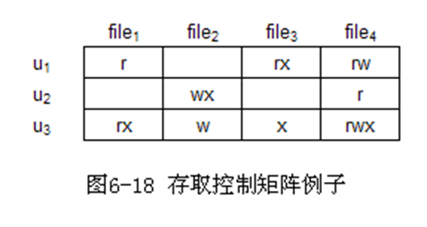
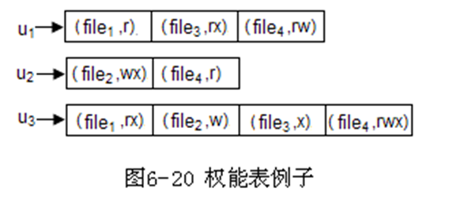

# 一.  引论

1. 简述分时操作系统的特征。

   - 同时性/多路性：多个用户使用系统。

   - 独立性：各请求. 用户间无互相干扰。

   - 及时性：请求很快得到主计算机的处理并返回结果。
   - 交互性：用户根据返回的结果决定下一步操作。

2. 实时操作系统的特征：高及时性和高可靠性

3. 操作系统的主要功能 
   - **用户接口及作业管理**: 作业调度和控制
   - **处理器管理**: 进程的控制、同步、通信、调度和死锁等的管理
   - **存储器管理**：
     - 目标: 提供虚拟存储器
   - **文件系统**：通过文件来组织数据，实现文件的“按名存取”
   - **设备管理**：实现设备独立性

# 二.  操作系统接口

1. 简述BIOS的组成
   - BIOS：存储在ROM的一组程序和数据的统称，组成包括POST自检程序, 基本启动程序, 基本的硬件驱动程序和中断处理程序。

2. 内核的基本特点：常驻内存, 运行在核心态
3. 简述内核的主要组成
   1. 与硬件密切相关的操作
   2. 关键数据结构
   3. 基本中断处理程序
   4. 使用频繁的功能模块

4. 简述系统调用和用户子程序的主要区别

   - |              | 系统调用           | 用户子程序       |
     | ------------ | ------------------ | ---------------- |
     | 运行环境     | 核心态             | 用户态           |
     | 中断         | 访管中断           | 无               |
     | 与主程序关系 | 与主程序分开. 独立 | 同一进程地址空间 |
     | 共享         | 不同用户可以共享   | 同一进程内部调用 |

5. 简述系统调用的实现过程

   1. 处理器切换为核心态，保存用户程序的现场

   2. 分析功能号并在地址入口表中查找对应子程序

   3. 执行系统调用的子程序并得到结果
   4. 现场恢复，处理器切换为用户态并返回结果，必要时进行安全检查。

# 三.  进程管理

1. 简述多道程序设计的概念及其优点
   - 多道程序设计技术是指把多个程序同时存放在内存中，使它们同时处于运行状态。这些作业共享处理器时间和外部设备以及其他资源。
   - 优点(1)提高CPU的利用率。(2)提高设备的利用率。(3)提高系统的吞吐量。

2. 什么是进程控制块？它主要包括哪些内容？
   - 描述,关系和控制进程的数据结构
3. 简述进程与程序的区别与联系
   - 组成不同：进程包含程序段、数据段、PCB。程序包含数据和指令代码。
   - 程序本身除了占用磁盘的存储空间外，并不占用系统的CPU、内存等运行资源。但是进程会占用系统的CPU、内存等运行资源。

   - 进程更强调动态性，而程序一般则是静态的。

   - 进程不能脱离具体的程序而虚设，程序规定了相应的进程要完成的动作。
4. 进程和线程
   - 一个具有独立功能的程序在某个数据集上的执行过程，称为线程（2分）。线程是CPU调度的基本单位（1分），进程是系统进行资源分配的基本单位，进程的资源由属于该进程的所有线程共有。（2分）

3. 简述进程的基本状态和进程主要特征

   - 基本状态：就绪. 阻塞. 运行

   - 主要特征
     - **动态性**：进程是程序的一次执行过程，是动态地产生、变化和消亡的
       - 最基本的特征
     - **并发性**：内存中可以有多个进程实体，各进程可以并发执行
     - **独立性**：进程是能独立运行、独立获得资源、独立接受调度的基本单位
     - **异步性**：各进程独立运行，需要操作系统提供”进程同步机制”来解决异步问题
     - **结构性**：每个进程都有一个PCB（进程控制块），进程由程序段，数据段，PCB组成

4. 画出进程基本状态转换关系图：
   

5. 就绪. 执行和等待三种基本状态。

 引起进程状态转换的具体原因如下：

运行态—→等待态：等待使用资源或某事件发生，如等待外设传输；等待人工干预。

等待态—→就绪态：资源得到满足或某事件己经发生，如外设传输结束；人干预完成。

 运行态—→就绪态：运行时间片到，或出现有更高优先权进程。

就绪态—→运行态：CPU 空闲时被调度选中一个就绪进程执行。

 

6. 简述进程管理的主要功能
   - 控制. 同步. 通信. 调度. 死锁

7. 进程通信的含义？在单机上操作系统为什么需要提供进程通信？
   - 两个或多个进程之间交换数据的过程叫做进程通信。
   - 原因：
     - 任务协作：需交换数据
     - 进程的独立性：一个进程无法访问另一个进程的数据或代码。

8. 简述进程通信方式
   1. 共享存储区通信
   2. 消息缓冲通信
   3. 信箱通信
   4. 管道通信

9. 消息缓冲通信的特点：
   - 消息缓冲通信是一种直接通信
   - 只能应用在同一台计算机

# 四.  进程调度和死锁

1. 简述作业的概念. 作业四个状态
   - 作业：批处理系统中，计算机处理的问题叫做作业
   - 作业4个基本状态：提交. 后备. 执行. 完成。

2. 进程调度两种方式：抢占方式和非抢占方式

3. 进程死锁的产生原因：系统拥有的资源数量小于各进程对资源的需求总数。

4. 简述死锁预防的含义，请列出死锁产生的四个必要条件，试列举四种预防死锁的方式，并解释其含义。

   - 死锁的预防是指在资源分配上采取限制措施，来破坏死锁产生的四个必要条件之一。

   - 死锁产生的四个必要条件：互斥条件；不剥夺条件；请求与保持条件；环路等待条件。

   - 可采取的方式例如: (每个 1分;其他正确方式也可得分)
     1. **静态分配**: 规定进程所需的所有资源必须于进程运行时次性申请，从而破坏“请求与保持”条件。
     2. **资源暂时释放**:规定进程在申请资源得不到满足而阻塞时，对已经得到的资源全部归还，从而破坏“请求与保持”条件。
     3. **按序分配**:系统对一组需要限制的资源统一编号，并规定进程只能申请比它已获得资源具有更大编号的资源，从而破坏“环路等待”条件
     4. **单请求**:规定进程必须将之前己申请的资源全部归还后方可申请新的资源，从而破坏“请求与保持”条件和“环路等待”条件。

5. 操作系统中主要关注哪四种调度？各自含义是什么？

   - **作业调度**: 按照一定的策略, 从后备队列中选择一部分作业, 为他们分配运行所需的必要资源, 创建进程的过程
     - 也叫**宏观调度**, 因为还需要经过进程调度才能真正运行

   - **进程调度**: 按照一定策略, 从就绪进程队列中选择一个进程, 让其占用处理器运行

   - **交换调度**: 选择一部分就绪状态/阻塞状态的进程, 将其从内存中调出, 暂存到外存

   - **设备调度**: 对一组I/O请求进行设备的分配和调度

# 五.  存储器管理

1. 简述存储管理的主要功能。
   - 存储管理主要是对用户区的管理，为用户程序的运行提供服务，主要功能如下：    
     1. 存储空间的分配和回收（最基本功能）
     2. 重定位
     3. 存储空间的共享与保护：在重定位过程中对虚拟地址和物理地址的检查，主要有界限寄存器法. 保护键法. 界限寄存器和CPU工作模式

2. 名词解释：虚拟存储器, 抖动
   - 抖动：请求分页管理中，置换算法设计不当，出现在一段较短的时间内，集中在少数几个页之间，系统频繁的进行调入和调出操作。抖动现象将导致CPU频繁调度, 切换和IO操作，大大增加CPU的开销，影响请求分页的效率。

3. 名词解释：BELADY现象
   - Belady现象：在分页式虚拟储存器中，发生缺页时采用FIFO置换算法，个别进程分配给内存的块数增加，缺页率却没有减小甚至反而增加的反常现象。

4. 简述什么是重定位，有哪些分类？
   1. 重定位：把目标程序的逻辑地址转换成主存空间的物理地址的过程。分为静态重定位和动态重定位。（CPU实现动态重定位的控制逻辑叫做存储管理单元MMU）

5. 简述分段与分页的区别
   1. 存储空间的分配单位粒度：分页存储管理以页为单位分配内存空间，页由硬件虚拟地址结构决定 ，页长度是固定的；分段存储管理中，以段为单位分配内存空间，段的长度往往不相等。
   2. 虚拟地址空间的维数：分页的虚拟地址空间是一维的；分段虚拟地址空间是二维的。
   3. 内存分配：分页把内存空间堪称一组大小相等的块组成；分段采用动态分区。
   4. 碎片：分页可能存在内碎片；分段采用动态分区，随着分配和回收的进行可能存在外碎片。

6. 简述内碎片和外碎片的区别。

   1. 性质不同
      - 外碎片：是还没有被分配出去（不属于任何进程），但由于太小了无法分配给申请内存空间的新进程的内存空闲区域。
      - 内碎片：是已经被分配出去（能明确指出属于哪个进程）却不能被利用的内存空间。

   2. 存储块不同
      - 外碎片：是出于任何已分配区域或页面外部的空闲存储块。
      - 内碎片：是处于区域内部或页面内部的存储块。

   3. 状态不同
      - 外碎片：这些存储块的总和可以满足当前申请的长度要求，但是由于它们的地址不连续或其他原因，使得系统无法满足当前申请。
      - 内碎片：占有这些区域或页面的进程并不使用这个存储块。而在进程占有这块存储块时，系统无法利用它。直到进程释放它，或进程结束时，系统才有可能利用这个存储块。

7. 简述什么是缺页中断？简要分析缺页中断与页面置换算法的关系。
   - 请求分页的重定位过程中，根据页号访问页表，如果该页不在内存，由硬件(MMU)产生一个I/O中断，要求操作系统将该页信息从外存读入内存，这种I/O中断称为缺页中断.
   - 在缺页中断处理过程中，在为读入的页分配内存时，如果没有空闲块，此时，执行置换算法，从内存中选择一个页淘汰，如果存在空闲块，只无需执行置换算法

8. 简述固定分区的基本思想
   - 操作系统启动时，把用户区分成若干个存储区域，各个分区的长度可以不相等；启动成功后，分区的个数和每个分区的长度不再改变，一个分区只能分配一道程序，而一道程序也只能占用一个分区，这种分配方式也叫做连续分配。

9. 简述可变分区的分配, 回收策略
   - 分配：在程序装入时，查找一个合适的空闲区。基本策略有：FF, BF, WF
   - 回收处理：书本158页

10. 简述请求分页重定位过程, 缺页中断, 页面调度的关系
    - 操作系统的缺页中断处理过程，要为新读入的页分配一个空闲块，如果内存中没有空闲块，必须按照页面调度策略，从内存中选择一页将其信息淘汰，空出的块分配给新的页。

11. 简述动态分页的缺页中断过程
    1. MMU发出缺页中断
      2. 现场保护: 撤销当前指令, 现场恢复到缺页中断指令执行前的状态, 保护现场
      3. 分配内存块 即页面调度
         1. 检查是否有内存块
         2. 无内存块: 进行淘汰, 修改淘汰页的中断位P=0
         3. 判断淘汰页修改位M, 被修改过进行保存
      4. 启动IO, 读取最新的页信息

12. 简述动态分页扩充页表中P, A, M的作用
    - 中断位P
      - 用于区分**页存储位置**(内存or外存), 进行调用
      - 中断位P=1, 说明该页在内存中(不会发出缺页中断)
      - 中断位P=0, 页不在内存中
    - 访问位A
      - 可以记录最近被访问过的次数，或者记录上次访问的时间，供页面置换算法参考
    - 修改位M
      - 页面调入内存后是否被修改过(1表示已修改)
      - 作用是在缺页中断处理过程中，减少系统的写IO操作

# 六.  文件管理

1. 简述文件系统的主要功能
   - 文件系统最基本的功能是按名存取，通过文件的物理结构和目录文件实现。
   - 主要功能：
     1. 文件内容的组织
     2. 文件存储空间管理 
     3. 文件系统的接口 
     4. 文件的共享和安全性

2. 文件逻辑结构的分类：流式文件和记录式文件

3. 简述文件物理结构有哪些？各有什么特点？

   1. **连续结构**：
      - 对于一个文件的所有记录, 按照记录顺序, 将它们存放在**相邻**的物理块上 (线性表) 
      - 特点
        1. 【优点】管理简单
        2. 【优点】存取速度快 (顺序存储, 没有复杂的寻址)
        3. 【缺点】存储空间连续分配，存储空间利用率不高 (容易产生磁盘碎片)
        4. 【缺点】不便于文件内容的增加或删除
   2. **链接结构**：
      - 参考**数据结构-链表**, 将每个物理块的最后一个存储单元作为链表指针, 指向下一个文件内容存储位置的物理块, 同时指针为空表示链表结束
      - 特点：
        1. 【优点】非连续的存储分配，提高了存储空间的利用率
        2. 【优点】方便文件内容的增加或删除
        3. 【缺点】只适合于顺序存取，存取速度慢
           - 磁盘能够实现随机存取, 但是链表结构决定其只能实现顺序
        4. 【缺点】块中的指针信息造成
           - ①物理块信息不完整(块中不全是文件内容)
           - ②数据无法控制(安全控制, 指针一改就能访问到其他文件)

   3. **索引结构**：

      - 为每个文件建立一个索引表, 用于登记每个记录(记录号/主键)和物理块的对应关系

      - 特点：

        1. 非连续的存储分配，提高了存储空间的利用率

        2. 方便文件内容的增加或删除

        3. 实现随机存取

        4. 索引表占用额外的存储空间

           - 文件未打开时, 占用磁盘空间
           - 文件打开时, 占用内存空间

        5. 增加检索的开销

           

4. 简述二级目录结构访问文件的过程：
   - 先按照用户名查找系统主目录，得到用户文件目录，然后按文件名查找用户
   - 文件目录，得到文件的FCB，从而得到文件在外存中的存储位置。

5. 二级文件目录名称：用户文件目录和系统主目录

6. 树状目录结构, 根目录, 路径含义：
   - 树状目录结构：在二级目录的基础上继续扩展，允许一个用户根据文件的性质&类型建立目录，并且在一个目录下可以再建立若干个目录形成多级目录结构
   - 根目录：由系统自动建立，用户不能建立和删除
   - 路径：
     - 绝对路径: 从根目录`\`开始, 到指定文件目录, 其中依次经过各节点的目录名组成的字符串
     - 当前目录(工作目录): `.`当前目录, `..`父目录

     - 相对路径: 用当前目录&父目录表示文件`../../A.png`

7. 请简述文件共享方法。
   - 文件共享实际上是一种利用外存储器实现进程通信的方法。
   - 文件共享(File Sharing)的基本方法

     - 绕道法: 用不同的路径访问?

     - 链接法: 两个FCB指向同一个物理文件

     - **基本文件目录法(BFD)**: 一种能够加速查找的连接法

8. 基于主体权限的存取控制方式
   - 基于主体权限的存取控制: 根据主体对客体所拥有的访问属性进行存取控制, 属于DAC~~(数据库大家应该都没忘吧)~~
   - 三种方式
     1. 存取控制矩阵(PM，Protection Matrix) (稀疏矩阵)
        -  
     2. 存取控制表(ACL，Access Control List)
        -  
     3. 权能表(CL，Capability List)
        -  

# 七.  设备管理

1. I/O控制的方式及其特点（优缺点）
   1. **程序查询方式**: 依靠处理器循环检测获取设备状态，当设备末就绪时浪费处理器资源，降低了系统效率。
   2. **中断方式**: 采用中断机制获得设备状态，使得设备与处理器并行运作;但对于块设备的IO操作，处理器还需要参与IO传输过程，使处理器利用率下降。
   3. **DMA方式**: 使用DMA控制器控制IO 传输，使得处理器无需参与传输过程;
      - 但由于DMA与处理器共享总线，当DMA使用总线时处理器无法使用总线，从而影响处理器利用率
   4. **通道方式**: 就是专门负责IO操作的处理器，可以与处理器并行工作。

2. IO缓冲的目的
   - 缓解设备和处理器之间的速度不匹配的矛盾，提高系统工作的并行程度
   - 减少I/O操作的次数
   - 减少中断次数
   - 提高系统的及时性，方便用户操作

3. 磁盘驱动调度的组成：移臂调度和旋转调度

 

# 八.  杂

1. 文件IO操作的基本单位是**物理块**

2. 固定分区采用静态重定位，存储保护使用界限寄存器法，固定分区存储管理存在内碎片
   可变分区采用动态重定位，存储保护使用界限寄存器法，存在外碎片。

3. 静态分页存储管理内存块方法：位示图, 空闲块链表，采用动态重定位，存储保护使用界限寄存器法

4. FIFO算法依据是程序的空间局部性原理，LRU算法依据是程序的时间局部性原理

5. 处理器工作模式：用户态&核心态

6. 临界资源：一次只能让一个进程使用的资源

7. 临界区：进程对应的程序中访问临界资源的一段程序代码

8. 进程调度的含义：在单处理系统中，进程调度就是进程并发执行时各个进程在处理器上轮流交替运行的实现

9. 何谓设备独立性？有何优点？

   - 用户或程序中使用的设备与具体的物理设备无关，用户或程序使用的是逻辑设备，当进程运行时，由操作系统在逻辑设备与物理设备之间建立连接，即设备的分配，把这种设备使用方法的特点称为设备独立性

   - 在实现了设备独立性的功能后， 可带来以下两方面的好处。
     1. 设备分配时的灵活性
     2. 易于实现I/O重定向

10. 请简述现代操作系统的基本特征？
    - 答：基本4个特征：并发行. 共享性. 虚拟性和异步性。
    - 并发性：多进程并发执行；
    - 共享性：各类资源由多个进程各项使用；
    - 虚拟性：采用虚拟性实现了对硬件的方便透明使用；
    - 异步性: 

11. 什么是处理机三级调度？各级调度分别完成什么工作？
    - 高级调度（作业调度）: 从后备队列中选择合适的作业将其调入内存，并为其创建进程
    - 【王道】~~中级调度（内存调度）: 按照一定策略在内外存之间进行数据的交换。~~
    - 【dsj】中级调度（交换调度）： 按一定策略选择一部分就绪或阻塞的进程暂时从内存调出（存到Swap），把资源让给运行的进程，调出的进程将来合适的时候再调入内存
    - 低级调度（进程调度）: 按照一定策略选择就绪进程，占用cpu执行。

 