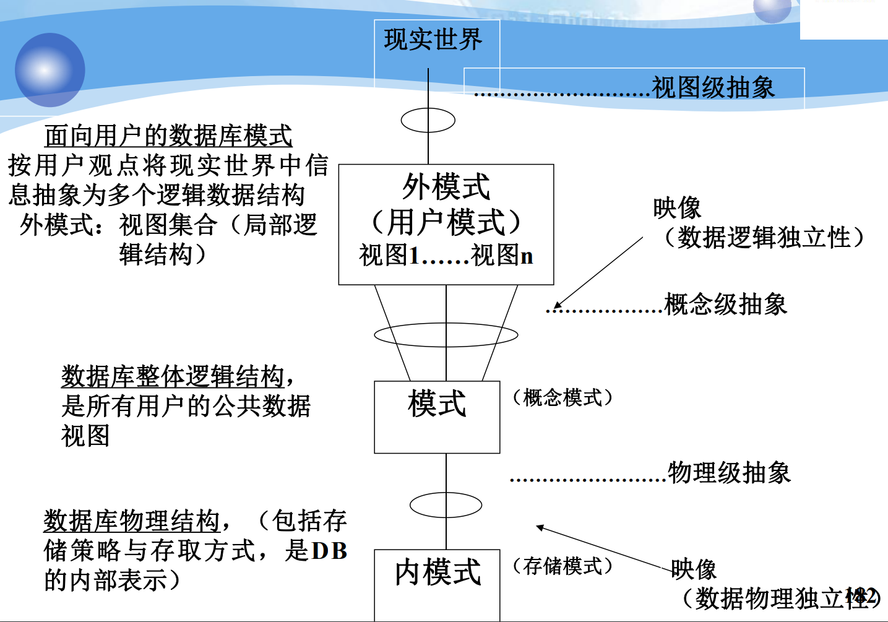

# CH1

### 简述概念：数据，数据库，数据库管理系统，数据库系统；

数据：描述事物的符号记录
数据库：长期存储在计算机内有组织，可共享的大量数据的集合
数据库管理系统：是位于用户和操作系统之间的数据管理软件
数据库系统：由数据库，数据库管理系统，应用系统和 DBA，组成的存储，管理，处理和维护数据的系统

### 简述数据库管理系统 DBMS 的主要功能；

1. 数据库定义(DDL: Data Definition Language) : 对数据库中的数据对象的组成和结构进行定义
2. 数据组织、存储和管理
3. 数据库操纵(DML: Data Manipulation Language): 进行增删改查
4. 数据库的事务管理和运行管理
5. 数据库控制(DCL: Data Control Language): 数据库的建立和维护功能
6. 数据库通信(CM: Communication Management)

### 使用计算机管理数据经历了哪几个阶段？各阶段的主要管理方式是什么？

- 人工管理阶段：**人工**进行数据的收集、存储、处理和应用
- 文件管理阶段：**文件管理系统**来进行数据管理
- 数据库管理阶段：**数据库管理系统**统一管理和控制

### 列出数据库技术的特点（至少 3 个以上）；

1. 数据结构化
2. 数据共享性强，冗余度低，易于扩充
3. 数据独立性强
4. 由数据库系统统一管理和控制

### 数据建模的三个要求是什么？

1. 清晰的目标
2. 合适的数据结构
3. 充分的验证

### 简述数据建模过程中的概念模型、逻辑模型和物理模型；

1. 概念模型（信息模型）
   按照用户的观点进行建模
2. 逻辑模型和物理模型（数据模型）
   1. 逻辑模型：按计算机的观点进行建模，分为网状层次等
   2. 物理模型：对数据进行最底层的抽象

PS：转换的步骤为：

1. 将具体事物转化为信息模型
2. 将信息模型转化为 DBMS 支持的数据模型

### E-R 图中，联系有哪几种？各表示了什么业务往来的含义？

1. **1:1 联系（One-to-One Relationship）：**
   - **含义：** 表示两个实体之间的一对一关系。一个实体的每个实例与另一个实体的一个实例相对应，反之亦然。
   - **示例：** 例如，一个人可能只有一个护照，而护照也只能与一个人相关联。
2. **1:n 联系（One-to-Many Relationship）：**
   - **含义：** 表示两个实体之间的一对多关系。一个实体的每个实例与另一个实体的多个实例相关联。
   - **示例：** 一个学校中，一个班级可以有多个学生，但每个学生只能属于一个班级。
3. **n:m 联系（Many-to-Many Relationship）：**
   - **含义：** 表示两个实体之间的多对多关系。一个实体的多个实例可以与另一个实体的多个实例相关联。
   - **示例：** 一个课程可以由多个学生选修，同时一个学生也可以选修多个课程。这种关系通常需要使用关联表（连接表）来实现，以解决多对多关系。

### 数据逻辑模型三要素是什么？

1.  数据结构：对数据静态特征的描述
2.  数据操作：对数据动态特征的描述
3.  完整性约束：保证数据的有效正确相容

### 人们已经实现了的数据逻辑模型有哪些？（列出三种）

1. 层次：仅一个节点无双亲，其他点仅有一个双亲
2. 网状：允许多个节点无双亲，允许一个节点有多个双亲
3. 关系：用二维表的形式表示数据

### 关系型数据模型的三要素是什么？固有性质是什么？

1. 三要素

   1. 关系数据结构
   2. 关系操作集合
   3. 关系完整性约束

2. 固有性质： 数据项不可再分
   1. 列是同质的
   2. 每行的命名相异，次序各异，列同

### 三个模型的优缺点

1.  层次：
    数据结构简单清晰，查询效率高，提供了较好的完整性约束支持

多对多不适用层次模型，查询子节点必须通过双亲节点，层次命令趋于程序化

2. 网状：
   更为直接描述现实世界，存取效率高
   结构比较复杂，定义语言和操纵语言比较复杂，编写应用程序负担大（联系通过存取路径实现）

3. 关系：
   建立在严格数学基础上，概念单一，存取路径对用户透明
   查询效率低，需要通过优化 dbms 来提升性能

### 关系型数据模型中的完整性约束有哪些？简单加以说明

1. 实体完整性
   主码不可为空
2. 参照完整性
   外码要么和某个表的主码元组相同，要么为空
3. 用户自定义完整性

### 给出数据库的三层模式结构，并加以说明；

1. 模式：
   数据逻辑结构和特征的描述
   地位：中间层
2. 外模式（子模式）（用户模式）：
   用户使用的局部数据的逻辑结构特征的描述
   用途：数据库安全（用户只能看到和访问外模式中的数据）
3. 内模式：
   物理结构及储存方式的描述
   是数据在数据库内部的表达方式

### 三级抽象和二级映像

1. 三级抽象指的是
   1. 视图级抽象
   2. 概念级抽象
   3. 物理级抽象
2. 二级映像指的是
   1. 外模式/模式映像
   2. 模式/内模式映像

### 什么是数据独立性？在数据库系统中是如何实现的？（数据库的两级映像）

1. 物理独立性
   应用程式与磁盘上的数据库中的数据相独立
2. 逻辑独立性
   应用程式与数据库逻辑结构相互独立



# CH2

### 关系代数运算有哪些？哪些是基本的运算？

基本：并、差、投影、交和选择。+笛卡儿积+连接+除

### 列出关系的几条性质（3-4 条即可）

1.  列是同质的，既每一列中的分量为同一类型的数据，来自同一个域。
2.  不同的列可出自同一个域
3.  列，行的次序可以任意交换。
4.  任意两个元组不能完全相同。
5.  每一个分量都必须是不可分的数据库。

### 码的概念，以及主属性、非主属性

1. 关系中能唯一地标识一个元组值的最小属性集，则称该属性集为候选码

2. 包含在任何一个侯选码中的属性称为主属性

3. 不包含在任何一个侯选码中的属性称为非主属性

### 什么是关系模型的实体完整性约束？举例说明。

主码不可为空

### 什么是关系模型的参照完整性约束？举例说明。

外码要么和某个表的主码元组相同，要么为空

### 什么是关系模型的用户自定义完整性约束？举例说明。

针对某一具体关系数据库的约束条件，反映某一具体应用所涉及的数据必须满足的语义要求

### 等值连接与自然连接的区别。

自然连接是去掉相同列的等值连接

# CH3

### 简述 SQL 语言特点

1. 综合统一
2. 高度非过程化
3. 面向集合的操作方式
4. 可独立使用可嵌入使用
5. 语言简洁易学易用

### 列出标记约束或行级约束的几个关键字并解释

1. 列级约束：主键 Primary key、外键 foreign key 、唯一 unique、检查 check 、默认 default 、非
   空/空值 not null/ null
2. 表级约束：主键、外键、唯一、检查

### 简述索引的含义并与 ORDER BY 区别

1. 索引是一种特殊的文件，包含着对数据表中所有记录的引用指针，能加快数据库的查询速度
2. ORDER BY：对查询结果表按指定列值的升序或降序排序

### 写出完整的 SELECT 语句

...

### where 的条件表达式和 having 的组过滤表达式的区别

1. WHERE 是先筛选后连而 HAVING 是先连接后筛选 。在关联查询中，WHERE 比 HAVING 更高效

### 给出聚集函数和单值函数的区别

1. 组函以集合为输入，返回单个值的函数
2. 单函以单个为输入，操作单个变量或数值的函数

### 子查询的注意事项 ALL,ANY,EXISITS

1. ALL：默认
2. ANY：任意一个
3. EXISITS：存在返回 1，不存在返回 0，其内部的 SELECT 一般用\*

### 视图的作用；视图的更新问题

1. 作用：
   1. 视图能够简化用户的操作。
   2. 视图使用户能以多种角度看待同一数据。
   3. 视图对重构数据库提供了一定程度的逻辑独立性。
   4. 视图能够对机密数据提供安全保护。
2. 更新：
   1. 基本表的行列子集视图可更新。
   2. 若视图的属性来自聚集函数、表达式，不可更新。

# CH4

### 达到 C1,C2 安全级别的 DBMS 提供了哪些安全保护措施？

1. C1:非常初级的自主安全保护
   1. 能够实现对用户和数据的分离
   2. 进行自主存取控制（DAC），保护或限制用户权限的传播。
2. C2:安全产品的最低档
   1. 提供受控的存取保护，将 C1 级的 DAC 进一步细化
   2. 以个人身份注册负责，并实施审计和资源隔离

### 两种存取控制方式的描述

1. 自主存取控制（简称 DAC）：
   1. 用户对不同的数据对象有不同的存取权限。
   2. 不同的用户对同一对象也有不同的权限。
   3. 用户还可以将其拥有的存取权限转授给其他用户。
2. 强制存取控制（MAC）:
   1. 每一个数据库对象被标以一定的密级。
   2. 每一个用户被授予某一个级别的许可证。
   3. 对于任意一个对象，只有具备合法许可证的用户才可以存取。

### GRANT 语句中的 WITH GRANT OPTION

1. 有了这个表示用户有权限继续传播权限
2. 没有就没有

### 角色的概念

1. 角色是被命名的一组 与数据库操作相关的权限，是权限的集合
2. 通过设计角色可以简化数据库授权的过程

# CH5

### 完整性违规的处理方式

1. 实体完整：
   检查主码是否有属性为空，主码是否唯一 ，若违反则拒绝插入或修改
2. 参照完整：
   对于参照表的破坏参照完整性操作修改拒绝执行
   对于被参照表破坏参照完整性的操作拒绝执行/级联操作/设置为空值
3. 用户自定义：检查属性上的约束条件是否被满足，若不满足则拒绝执行

### 叙述触发器的作用及使用方法；

1.  拥有更精细和更强大的数据控制能力

2.

```sql
create trigger 名字 [before/after] Insert/elete/update on 表名
    for each row
        when
            (条件)
        begin
            事件
        end;
```

注意：触发器只能定义在表上

### 在 SQL SERVER 中，三类触发器。

1. Insert
2. delete
3. update

# CH6

### 如果表的范式级别低，容易出现什么问题？能举例说明其中一个问题吗？

1. 数据冗余

   ```sql
   STUDENT（Sno , School, Mname, Cno, Grade）
   ```

   中院长名重复出现

2. 更新异常
   如果某学院更换院长，系统必须修改与该学院学生有关的每一个元组。造成更新开销大

3. 插入异常

   如果新增学院，若没有学生就无法将学院加入数据库

4. 删除异常

   删除所有学生会导致学院和院长一起被删

### 给出部分函数依赖和完全函数依赖的说明

1. 在 R(U)中，如果 X→Y，并且对于 X 的任何一个真子集 X’ ，都有 X’→/ Y, 则称 Y 对 X 完全函数依赖，记作 X→（f）Y。
2. 在 R(U)中，如果 X→Y，并且存在 X 的一个真子集 X’ ，有 X’→ Y, 则称 Y 对 X 部分函数依赖，记作 X→（p）Y。

### 给出码的 2 个等价定义；全码 VS. 所有属性均为主属性。

1. 描述性定义：若关系中的某一属性的值能唯一地标识一个元组，而其子集不能，则称该属性组为候选码。
2. 用函数依赖来定义：设 K 为 R<U,F>中的属性或属性组合，若 KF⟶U，则 K 为 R 的候选码。

### 全码 VS. 所有属性均为主属性。

1. 全码：候选码只有一个，主属性只有一个，主码也只有一个，即所有属性
2. 所有属性均为主属性：可能可以选出多个主码
3. 码的定义
   - $X^+_F=U$
   - $ X→U$
4. - 全码是所有元素组合起来是码(ABC), 达到 BCNF
   - 所有属性为主属性是所有元素都被包含在码中(AB, BC), 至少达到 3NF

### 什么是函数依赖的逻辑蕴涵概念？

1. 设 F 是关系模式 R 的函数依赖集，X、Y 是属性集 U 的子集，X→Y 是一个函数依赖，若在 F 中，**能够用其他函数依赖关系**推导出 X→Y，则 X→Y 为 F 的逻辑蕴涵，或 F 逻辑蕴涵 X→Y，记作 F|=X→Y
2. F 逻辑蕴涵的所有函数依赖集合称为 F 的闭包(Closure)，记作 F+

### Armstrong 公理

定理：若 U 为关系模式 R 的属性全集，F 为 U 上的一组函数依赖，设 X、Y、Z、W 均为 R 的子集，对 R(U,F)有：

- F1(自反性)：若 X≥Y(表 X 包含 Y），则 X→Y 为 F 所蕴涵；(F1':X→X)
- F2(增广性): 若 X→Y 为 F 所蕴涵，则 XZ→YZ 为 F 所蕴涵；(F2':XZ→Y)
- F3(传递性): 若 X→Y,Y→Z 为 F 所蕴涵，则 X→Z 为 F 所蕴涵；

以下为推导出的

- F4(伪增性)：若 X→Y，W≥Z(表 W 包含 Z）为 F 所蕴涵，则 XW→YZ 为 F 所蕴涵；
- F5(伪传性): 若 X→Y，YW→Z 为 F 所蕴涵, 则 XW→Z 为 F 所蕴涵；
- F6(合成性): 若 X→Y,X→Z 为 F 所蕴涵，则 X→YZ 为 F 所蕴涵；
- F7(分解性): 若 X→Y,Z≤Y (表 Z 包含于 Y）为 F 所蕴涵，则 X→Z 为 F 所蕴涵。

### 模式分解的 2 个准则；

1. 不产生冗余数据和关系，尽可能保持关系模式最小化
2. 保持原有的函数依赖

PS:关系模式分解的目标：无损连接性和函数依赖保持性。
分解具有无损连接性和分解保持函数依赖是两个互相独立的标准。

### 保持函数依赖的模式分解是什么意思？

1. 若将 R（U，F）分解为 K 个子模式:ρ={R1(U1,F1),R2(U2,F2),…,Rk(Uk,Fk)},则 Fi（0<=i<=K）并集与 F 等价。
2. 如果一个分解保持了函数依赖，则它可以减轻或解决各种异常情况

### 保持无损连接的模式分解是什么意思？

1. 若将 R（U，F）分解为 K 个子模式：ρ={R1（U1, ,F1）,R2（U2,F2）,…,Rk（Uk,Fk）},这 K 个子模式进行连接运算后，还可恢复为模式 R。
2. 如果一个分解具有无损连接性，则它能够保证不丢失信息

# CH7

### 简述数据库设计的几个阶段的工作内容；

1. 需求分析
   了解分析用户需求，构建用户字典

2. 概念结构设计
   形成独立于 DBMS 的模型，构建 ER 图

3. 逻辑结构设计

   转化为概念模型为 DBMS 支持的模型，关系设计与优化

4. 物理结构设计

   选取合适的存储结构和方法

5. 数据库实施
   建立数据库，编制与调试，数据入库，试运行

6. 数据库运行和维护
   调整与修改

### 在逻辑结构设计阶段，如何处理 E-R 图中 1:n 的联系？

1. 拆出来
2. 不拆往 n 的那边合并

### 合并分 E-R 图时，可能会出现哪些冲突？

1. 命名冲突
   在应用中不同名同域，同名不同域
2. 属性冲突
   在应用中单位不同，表示方式不同
3. 结构冲突
   在应用中抽象不同

### 简述数据库的重组织和重构造的区别。

1. 数据库的重组织主要针对数据库的物理结构进行优化，以改进数据的存储方式和访问方法，提高数据存储空间的利用率和数据的存取效率
2. 数据库的重构造则会涉及到部分修改原有的逻辑模式和内模式。

### 子模式含义

子模式也被称为外模式或用户模式，是数据库用户能够看见和使用的局部数据的逻辑结构和特征的描述。子模式是数据库的一个逻辑子集，包含了一组相关的表、视图、索引、存储过程等数据库对象。用户只能看到和访问外模式中的数据，因此保证了数据库的安全

# CH8(lzh 没上这个)

### 存储过程的作用及使用方法？

作用：运行效率更高，降低了客户和服务器之间的通信量，方便实施企业规划

# C11

### 事物的四个特性是什么？举例说明

1. 原子性：事务中包括的所有操作,要么都做，要么都不做要么全做，要么全不做
   从帐号 A 中取出一万元，存入帐号 B。要么全做完，要么不做

2. 一致性：事务执行的结果必须是使数据库从一个一致性状态变到另一个一致性状态。

   从帐号 A 中取出一万元，存入帐号 B。全做或者全不做，数据库都处于一致性状态。如果只做一个操作，数据库就处于不一致性状态。

3. 隔离性：对并发执行而言，正在执行的事务不能被其他事务干扰

4. 永久性：一个事务一旦提交，它对数据库中数据的改变就应该是永久性的。

### 故障类型有哪些？举例说明

1. 事务故障
   1. 运算溢出
   2. 并发事务发生死锁而被选中撤销该事务
2. 系统故障
   1. 断电导致系统停止运转
3. 介质故障
   1. 硬盘爆了
   2. 强磁干扰
4. 计算机病毒

### 故障的解决

1. 事务故障（系统自动解决）
   1. 利用 logUNDO 未完成提交的事物
2. 系统故障（重启时自动解决）
   1. UNDO 未完成提交的事物（无 commit）
   2. REDO 已经完成的（有 commit）
3. 介质故障（需要 DBA 介入）
   1. 重装已经备份的
   2. REDO checkpoint 后已完成的
   3. 撤销未完成的（但是因为重装所以不用 UNDO）

### 基于检查点故障恢复策略；日志文件概念；

1. 基于检查点故障恢复策略通过在日志文件中增加

   1. 检查点记录
   2. 重新开始文件

   恢复子系统在登录日志文件期间动态地维护日志

2. 日志文件(log)是用来记录事务对数据库的更新操作的文件

   1. 各个事务的开始标记(BEGIN TRANSACTION)
   2. 各个事务的结束标记(COMMIT 或 ROLLBACK)
   3. 各个事务的所有更新操作

### 故障恢复策略的工作原理

1. 冗余：利用存储在系统其它地方的冗余数据来重建数据库中已被破坏或不正确的那部分数据

# C12

### 什么是事务的串行调度？并发调度？

1. 串行执行：每个时刻只有一个事务运行，其他事务必须等到这个事务结束以后方能运行
2. 并发执行：这些并发事务的并行操作轮流交叉运行

### 如果不加以控制，事务的并发调度可能会产生什么问题？

1. 会产生多个事务同时存取同一数据的情况，可能会读取和存储不正确的数据，破坏事务隔离性和数据库的一致性

1. 丢失修改
1. 脏读
1. 不可重复读
1. 幻读

### 简述封锁机制的工作原理；

1. 封锁就是事务 T 在对某个数据对象操作之前，先向系统发出请求，对其加锁，在加锁有才拥有控制权，在其释放锁之前其他事务不能更新于读取此事务

### 引入封锁机制，如何解决上述 3 个问题？

1. 一级封锁协议解决丢失修改
   事务 T 在修改数据 R 之前必须先对其加 X 锁，直到事务结束才释放。
2. 二级封锁协议解决脏读
   一级封锁协议基础上，增加事务 T 在读取数据 R 之前必须先对其加 S 锁，读完后即可释放 S 锁。
3. 三级封锁协议解决不可重复度
   一级封锁协议基础上，增加事务 T 在读取数据 R 之前必须先对其加 S 锁，直到事务结束才释放。

### 死锁预防、诊断；死锁的判别；

1. 预防
   1. 一次封锁法：一次将所有要使用的数据全部加锁否则不能执行
   2. 顺序封锁法：对于数据对象规定一个封锁顺序，必须按顺序封锁
2. 诊断
   1. 超时法：如果一个事务的等待时间超过了规定的时限，就认为发生了死锁
   2. 事务等待图法：用事务等待图动态反映所有事务的等待情况（什么限时返场离散数学图论）
3. 解除
   1. 选择一个处理死锁代价最小的事务，放此事务持有的所有的锁，使其他事务能继续运行下去

### 冲突操作对；事务优先图；等价的串行调度；

1. 冲突操作：是指不同的事务对同一数据的读写操作和写写操作
2. 冲突可串行化调度是可串行化调度的充分条件，不是必要条件

### 2PL 协议；

1. 在对任何数据进行读、写操作之前，事务首先要获得对该数据的封锁
2. 在释放一个封锁之后，事务不再申请和获得任何其他封锁

3. 事务遵守两段锁协议是可串行化调度的充分条件，而不是必要条件。
4. 一次封锁和两段锁
   1. 一次封锁法要求每个事务必须一次将所有要使用的数据全部加锁，否则就不能继续执行，因此一次封锁法遵守两段锁协议
   2. 但是两段锁协议并不要求事务必须一次将所有要使用的数据全部加锁，因此遵守两段锁协议的事务**可能发生死锁**

### 多粒度封锁协议。

1. 封锁对象（逻辑单元，物理单元）的大小称为封锁粒度
2. 选择
   1. 需要处理多个关系的大量元组的用户事务：以数据库为封锁单位
   2. 需要处理大量元组的用户事务：以关系为封锁单元
   3. 只处理少量元组的用户事务：以元组为封锁单位
