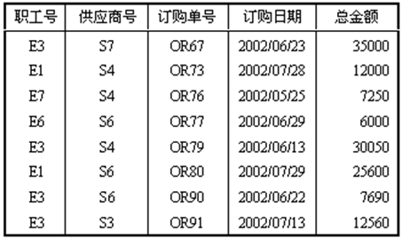
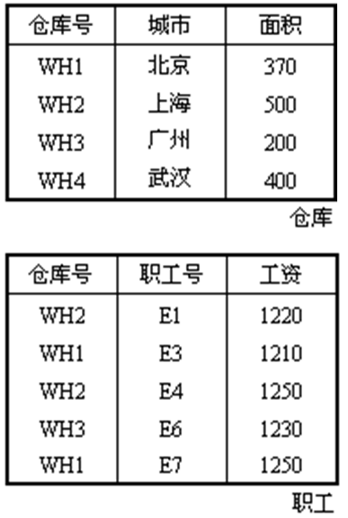
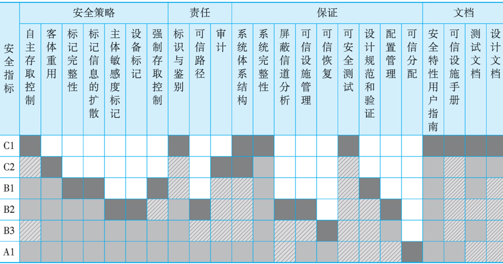
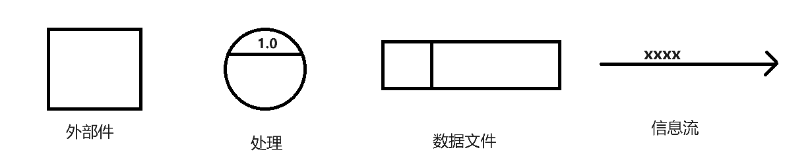
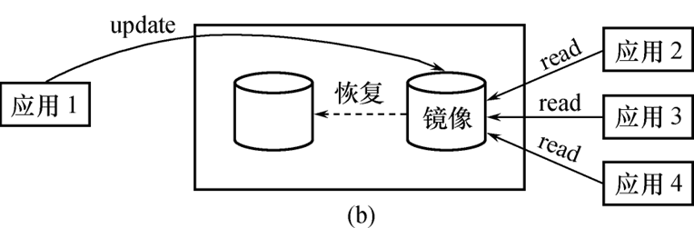
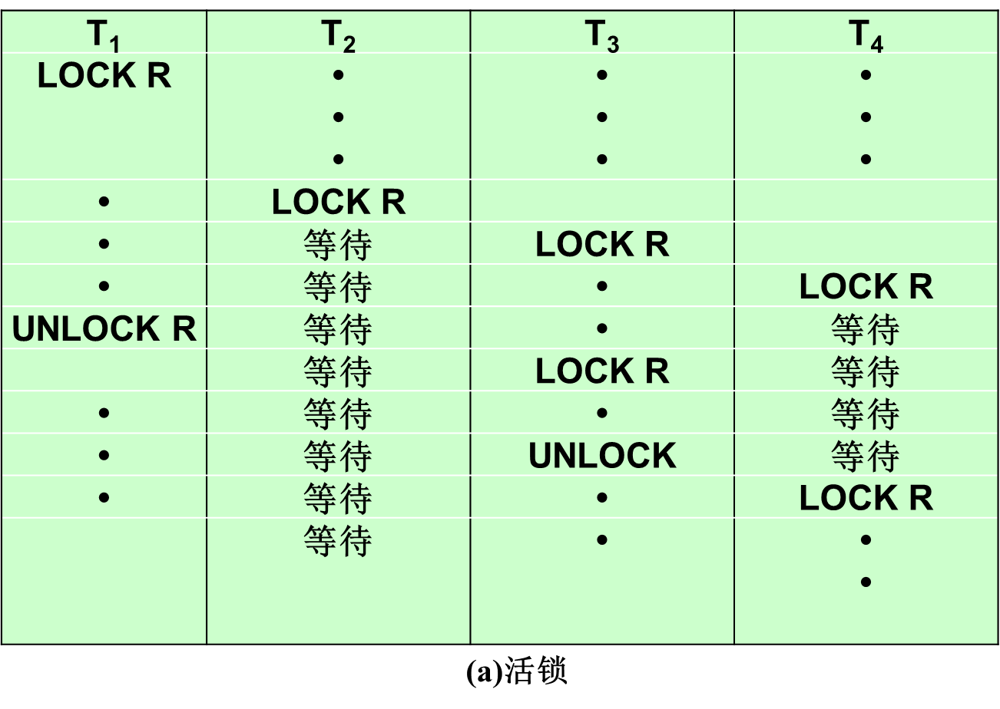
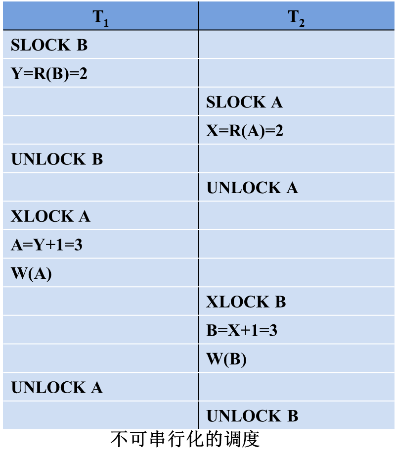
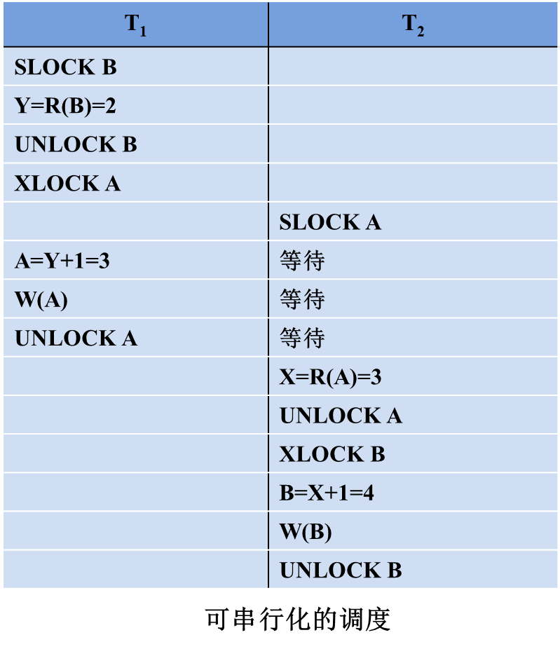
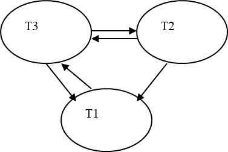
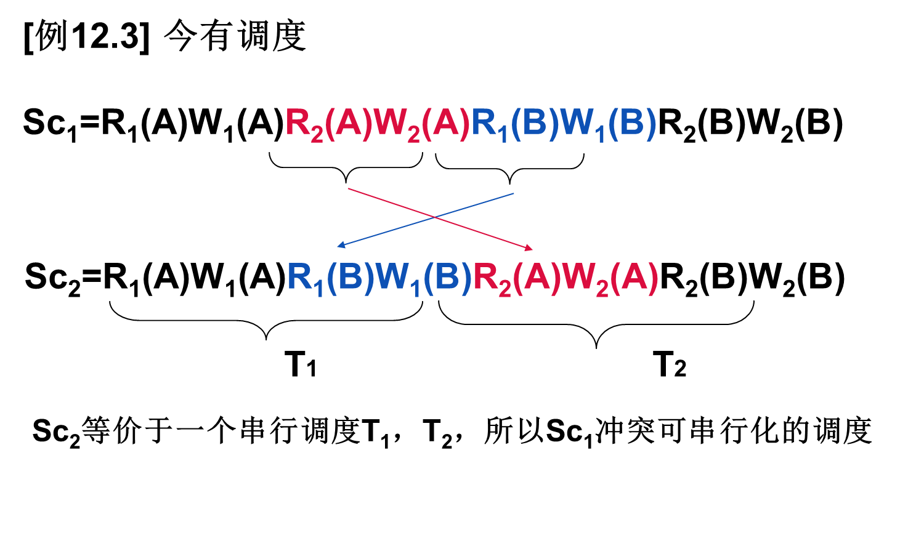

# 第 1 章 绪论

从现实数据到计算机数据库系统

$$现实世界(手工管理)\\数据模型(建模)\begin{cases}信息世界(概念模型)\\计算机世界\begin{cases}数据逻辑模型\\数据物理模型\end{cases}\\计算机世界(DBS):DBMS+开发工具+系统架构\end{cases} $$

## 1.1 数据库系统概述

### 1.1.1 基本概念

> 数据、数据库、DBMS、DBS

<font color=66ccff>数据(Data) </font>: 描述事物的符号记录

<font color=66ccff>数据库(Database, DB)</font> : 长期存储在计算机内有组织, 可共享的大量数据集合

<font color=66ccff>数据库管理系统(Database Mange System, DBMS) </font>: 对数据库进行管理，使之能为多个用户共享，能保证数据的安全性、可靠性、完整性、一致性，并保证数据的高度独立性。

- 数据库定义(DDL: Data Definition Language) : 对数据库中的数据对象的组成和结构进行定义
- 数据组织、存储和管理
- 数据库操纵(DML: Data Manipulation Language): 进行增删改查
- 数据库的事务管理和运行管理
- 数据库控制(DCL: Data Control Language): 数据库的建立和维护功能
- 数据库通信(CM: Communication Management)

<font color=66ccff>数据库系统(Database System, DBS) </font>: 由数据库, DBMS(及其应用开发工具), 应用系统和数据库管理员(database administrator, DBA)组成的存储, 管理, 处理和维护数据的系统

- DBS=DB+DBMS+运行计算机(硬件和 os)+DBA+一些说明文档

### 1.1.2 数据管理技术的产生和发展


| 对比项       | 人工管理阶段                         | 文件系统阶段             | 数据库系统阶段                                                   |
| ------------ | ------------------------------------ | ------------------------ | ---------------------------------------------------------------- |
| 应用领域     | 科学计算                             | 科学计算,数据管理        | 大规模数据管理                                                   |
| 主要硬件     | 无直接存取存储设备                   | 磁盘, 磁鼓               | 大容量磁盘, 磁盘阵列                                             |
| 主要软件     | 没有操作系统, 没有管理数据的专门软件 | 有文件系统               | 有数据库管理系统                                                 |
| 数据处理方式 | 批处理                               | 联机实时处理, 批处理     | 联机实时处理, 分布处理, 批处理                                   |
| 数据管理者   | 人(程序员)                           | 文件系统                 | 数据库管理系统                                                   |
| 数据面向对象 | 某一应用程序                         | 某一应用                 | 现实世界(部门, 企业, 跨国组织等)                                 |
| 数据共享程度 | 不独立, 完全依赖应用                 | 独立性弱                 | 具有较强的物理独立性和一定的逻辑独立性                           |
| 数据结构化   | 无结构                               | 记录内有结构, 整体无结构 | 整体结构化, 用数据模型描述                                       |
| 数据控制能力 | 应用程序自己控制                     | 应用程序自己控制         | 由数据库管理系统提供数据安全性, 完整性, 并发控制和数据库恢复功能 |

### 1.1.3 数据库系统的特点

1. 整体数据的结构化

- 数据之间具有联系, 不仅要考虑某个应用的数据结构, 还要考虑整个组织的数据结构

2. 数据的共享性强, 冗余度低且易于扩充
3. 数据的独立性强: 数据改变时, 代码不用修改, 相互独立

- 物理独立性: 数据的物理结构改变时, 应用程序不用改变
- 逻辑独立性: 数据的逻辑结构改变时, 应用程序不用改变

4. 数据有数据库管理系统统一管理和控制

- 数据库的安全性(security)保护
- 数据库的完整性(integrity)检查
- 数据库的并发性(concurrency)控制
- 数据库的恢复

## 1.2 数据模型

1. 两类：概念模型<font color='orange'><E-R 图></font>、逻辑模型<font color='orange'>(本书中的数据模型指的是逻辑上的数据模型)</font>和物理模型<font color='orange'>(DBMS 实现)</font>

   - 

2. 数据模型三要素

   - 概念模型：实体、联系、E-R 图(Entity-Relationship model)

   - 逻辑模型：层次、网状、关系

### 1.2.1 概念模型-信息结构与 E-R 方法

#### 数据的三种范畴

> 物理世界, 信息世界, 计算机

- 现实世界的术语：事物、特征、事物集、标识特征。

  - **事物**：客观存在并可以相互区分的事、物或抽象事件。

  - **特征**：事物的某个性质/属性/方面。

  - **事物集**：具有相同特征的一类事物的集合。

  - **标识特征**：区分事物的特征**。**

- 信息世界的术语：

  - **实体 Entity**：客观存在并可以相互区分的事物或抽象事件。//个体
  - **属性 Attribute**：实体所具有的某一特性
  - **码 Key**：唯一标识实体的属性或属性集
  - **域 Domain**：属性的取值范围。
  - **实体型**：用实体名及其属性名集合来抽象和刻画同类实体。
  - **实体集**：同一类型实体的集合。//实体
  - **联系 Relationship**：实体内部的联系和实体之间的联系**。**

- 计算机世界的术语：**记录、数据项/字段、文件、关键字**。
  - 型和值：型表示定义/结构，值表示某个术语的具体的表现/值。

#### 两个实体之间的联系

1. 联系的种类
   - 一对一联系：1:1
   - 一对多联系：1:n
   - 多对多联系：m:n
2. 如何表示？实体-联系方法(Entity-Relationship, ER)

   - 实体-联系方法用于描述现实世界中的信息结构，描述结果称为 E-R 模型或概念模型。它是最高级的抽象，与具体的数据模型没有关系。现实世界中的语义在这里（指确定联系类型的种类）起了最关键的作用！
   - 用画图表示, 即为==E-R 图==

3. 图元素

   - 实体：用矩形框表示，并写上实体名。
   - 属性：用椭圆形表示，写上属性名，用边与相应的实体相连。
   - 联系：用菱形框表示，写上联系名，并用连线与有关的实体相连。

4. 联系画法

   - **1:1 联系** 实体 A 中的个体与实体 B 中的个体存在一一对应关系。比如，厂长实体与工厂实体，如下所示。
     

   - **1:n 联系** 对于实体 A 中的一个个体，在实体 B 中可以有多个个体与之对应，但对于实体 B 中的一个个体，实体 A 中最多只有一个个体与之对应。比如，学校实体与学生实体。
     

   - **m:n 联系** 对于实体 A 中的一个个体，在实体 B 中可以有多个个体与之对应，反之亦然。比如，学生实体与课程实体。
     

#### 两个以上的实体型之间的联系

如下, 三个实体之间具有联系

比如，在考虑仓库、器件、供应商三个实体时，我们规定：

- 每个仓库可以向多个供应商订购多种器件
- 每个供应商可以向多个仓库提供多种器件
- 每种器件可以由多个供应商供应，可以由多个仓库购买。

这样，描述仓库、器件、供应商三个实体之间的 E-R 图如下所示。


#### 单个实体型内的联系

实体 A 中的两个个体之间也可以存在着联系。比如，在职工实体中，有领导者与被领导者，用 E-R 图表示为：

当然，也可以考虑两个实体：职工、领导者。这样的设计与上述设计对今后数据库有很大的影响。

#### 实体与属性

标识属性(码)加下划线。

- 注意：_联系也会有属性_。
- 

#### 例: 工厂物资管理的概念模型

实体之间的联系主要取决于现实世界的管理方法，或者说，取决于语义，即同样两个实体，在不同的语义下，将有不同的联系类型。比如，对于仓库和器件两个实体：

- 如果规定一个仓库只能存放一种器件，并且一种器件只能存放在一个仓库，
  这时仓库和器件之间的联系是一对一的

- 如果规定一个仓库可以存放多种器件，但是一种器件只能存放在一个仓库，
  这时仓库和器件之间的联系是一对多的
- 如果规定一个仓库可以存放多种器件，同时一种器件可以存放在多个仓库，
  这时仓库和器件之间的联系是多对多的

**实体：**

- 仓库：属性有仓库号、面积、电话号码
- 零件：属性有零件号、名称、规格、单价、描述
- 供应商：属性有供应商号、姓名、地址、电话号码、帐号
- 项目：属性有项目号、预算、开工日期
- 职工：属性有职工号、姓名、年龄、职称

**实体之间的联系如下：**

- 一个仓库可以存放多种零件，一种零件可以存放在多个仓库，因此仓库和零件之间的联系是**多对多**的；
  用库存量表示某种零件在某个仓库中的数量。

- 一个仓库有多个职工，一个职工只能在一个仓库工作，因此仓库和职工之间的联系是**一对多**的。
- 职工之间具有领导-被领导关系，因此职工实体型中具有一对多的联系。
- 供应商、项目和零件三者之间有多对多的联系。


### 1.2.2 数据模型-数据逻辑模型

1. 数据模型三要素
   - 数据结构: 描述数据库的组成对象以及对象之间的联系。
     - 如 层次结构、网状结构、关系结构和面向对象结构
   - 数据操作： 对数据库中各种对象允许执行的操作集合
     - 如关系模型的增删改查
   - 完整性约束(Integrity Constraints, IC): 规定给定的数据模型中数据及其联系所应满足的制约和依存规则，以保证数据的正确、有效和相容。
     - 对关系模型而言，有三种完整性约束：实体完整性、参照完整性和用户自定义完整性。
2. 传统的三种数据逻辑模型: 层次模型, 网状模型, 关系模型

#### 层次模型

- 用树形结构来表示实体以及实体之间的联系, 在层次模型中，结点表示实体，连线表示一对多的联系。
- 层次模型的特征/限制是：
  1. 有且仅有一个结点无父结点，这个结点即为树的根；
  2. 其他结点有且仅有一个父结点。
- 
- 层次数据库管理系统的典型代表是：IMS(Information Management System)
  - 型和值: IMS 中把构成层次结构的一组实体称作层次型，层次型中的每个实体称作片段，组成片段的最小数据单位是字段。
- 层次模型特点
  - 层次模型像一棵倒立的树。
  - 层次模型的一个基本的特点是：任何一个给定的记录值只有按其路径查看时，才能显出它的全部意义，没有一个子女记录值能够脱离**父结点记录值**而独立存在。
    
  - 层次型数据库不支持多对多联系，可以考虑把有两个父结点的非层次结构转换成两个层次型。
- 层次模型的数据操纵：查询、插入、删除和更新。
- 层次模型的完整性约束条件：维持层次模型, 如插入时没有相应的双亲节点值就不能插入其子女结点值, 删除双亲节点值, 那么子女结点值也要删除
- 层次模型的存储结构：
  - 邻接法：P23
  - 链接法：P24
- 层次模型的优缺点：
  - 优点：数据结构简单、清晰;查询效率高；良好的完整性支持。
  - 缺点：
    - 多对多联系表示困难；
    - 一个结点有多个双亲时，表示比较困难；
    - 查询子女结点必须通过其双亲结点；层次命令趋于结构化。

#### 网状模型

- 用网络结构来表示实体之间联系的数据模型称为<font color='#66ccff'>网络数据模型</font>。
  网络模型的典型代表是 CODASYL ——Conference On Data System Language.
- 在网络模型中，取消了层次模型中的两点限制，即允许一个结点可以有多个父结点。
  - 网络模型和层次模型在本质上是一样的，从逻辑上看它们都是用连线表示实体之间的联系，用结点表示实体；
    从物理上看它们都是用指针来实现两个文件之间的联系，只是在网络模型中连线更加复杂。
- 网状数据模型的存储结构：P27 图 1。25
- 网状模型的优缺点：
  - 优点：
    - ① 结点之间可以有多种联系，因此能够更为直接地描述某些现实世界。
    - ② 存取效率较高。
  - 缺点：
    - ① 结构比较复杂；
    - ② 相应的 DDL、DML 语言复杂；
    - ③ 记录之间联系是通过存取路径而实现，应用程序在访问数据时必须选择适当的存取路径。

#### 关系模型

- 关系模型 Relational Data Model：用关系结构（二维表）来表示实体以及实体之间的联系。
- 关系数据库管理系统的典型代表是：Oracle、Sybase、DB2、SQL Server、InfoMix、Access…。

- Basic Concepts：

  - 一个关系对应一张二维表；

    - 在关系模型中，二维表格中的每一行称作一个<font color='#66ccff'>元组(Tuple)</font>，它相当于一个记录值，

    - 每一列是一个属性，列可以命名，称为属性名。

    - 因此可以说，关系是元组的集合。

    - 如果表格中有 n 列，称该关系是 n 元关系。

  - 一些定义
    - <font color='#66ccff'>码</font>：表中的某个/些属性集，可以唯一地确定一个元组。
    - <font color='#66ccff'>域</font>：属性的取值范围。
    - <font color='#66ccff'>分量</font>：元组中的一个属性值。
    - <font color='#66ccff'>关系模式</font>：对关系的描述。一般表示为：关系名（属性 1，属性 2，……，属性 n）
    - 关系数据模型的<font color='#66ccff'>固有约束</font>：关系的每一个分量必须是一个不可分的数据项目。

- 关系数据模型的存储结构：
- 关系数据模型的优缺点：
  - 优点：
    1. 有严格的数学概念//[集合论](# 正式定义)
    2. 关系模型的概念单一//？
    3. 存取路径对用户透明。//Transparent!
  - 缺点：查询效率比较低。//Query Optimization

## 1.3 数据库系统的结构

> 如何认识数据库系统的体系结构？
>
> - 从企业信息化建设的角度来看：DBS 总体架构可以采用集中式和分布式两类，在集中式 DBS 中根据数据访问模式的不同又分为 C/S 和 B/S 两种体系结构；
> - 从信息管理系统的组成部分来看：DBS=DBMS+DB+DBA+Application+Specifications
> - 从计算机系统的角度来看：DBS 将所有的数据划分为**三层模式**，相邻两层模式之间提供**映射**，见后面论述。

### 1.3.1 数据库三层模式

数据库系统的三级模式结构：外模式、模式和内模式。相应地，有三层数据库。

 

- 定义**存储数据库结构**的模式称作<font color='#66ccff'>存储模式/内模式</font>；

  - 内模式是数据物理结构和存储方式的描述，是数据在数据库内部的表示方式。

- 定义**概念数据库结构**的模式称作<font color='#66ccff'>概念模式</font>，简称<font color='#66ccff'>模式</font>； <font color='orange'>(此处的概念模式指的是数据逻辑模型, 要与概念模型相区别)</font>

  - 模式实际上是数据库在逻辑级上的视图(window)。一个数据库只有一个模式。数据库模式以某一种数据模型为基础，统一综合地考虑了所有用户的需求，并将这些需求有机地结合成一个逻辑整体。

- 定义**外部数据库结构**的模式称作<font color='#66ccff'>外部模式</font>，也称<font color='#66ccff'>子模式</font>；
  - 用户的数据**视图**(View)
- 注意与[数据模型](# 1.2 数据模型)区别

### 1.3.2 两种映象

> 在数据库的三级模式结构中，存在两种映像，外模式/模式映像，模式/内模式映像。

<font color='#66ccff'>外模式/模式映像</font>

- 定义了某个外模式与模式之间的对应关系。当模式改变时，由 DBA 对各个外模式 /模式的映像作相应的改变，可以使外模式保持不变。应用程序是依据外模式编写的，从而应用程序不必修改，保证了数据与程序的逻辑独立性。
- <font color='#66ccff'>概念数据独立性(逻辑独立性)</font>:
  - 外部文件/子文件：概念文件中与某个应用程序相关的部分字段。
  - 指当修改概念文件的结构时<font color='orange'>(数据逻辑结构改变)</font>，应用程序不用改变。

<font color="#66ccff">模式/内模式映像</font>

- 定义了数据全局逻辑结构与存储结构之间的对应关系。当数据库的存储结构改变了，由 DBA 对模式/内模式映像作相应修改，可以使模式保持不变，从而应用程序也不必改变，保证了数据与程序的物理独立性。

- <font color = #66ccff>存储数据独立性(物理独立性)</font>：存储文件的存储方法和存储结构<font color=orange>(物理存储)</font>改变，用户程序不用改变

## 1.4 数据库系统的组成

1. DBS 的组成：数据库 DB, DBMS(及其应用开发工具), 应用系统和数据库管理员(database administrator, DBA)组成

2. 数据库管理系统 DBMS 读取一条记录时所发生的一系列事件：
   1. 用户程序 A 向 DBMS 发出读一条记录的指令，这时用户程序要给出外部文件名和记录的关键字值；
   2. DBCS(数据库控制系统)分析所接到的指令，访问对应的外部模式；
   3. DBCS 完成外部模式到概念模式的转换，决定访问哪个/些概念文件；
   4. 接着由 DBSS(数据库存储系统)完成概念模式到存储模式的转换，并决定访问哪个/些存储文件；
   5. DBSS 调用存取方法，通过操作系统将读取的记录送到系统缓冲区；
   6. 用户程序从系统缓冲区得到所需记录和 DBMS 返回的状态信息；
   7. 用户程序在工作区中使用所得到的记录。

## 第一章小测

一：选择题（3 分）

1．物理数据独立性是指（**C**）。

A．模式改变，外模式和应用程序不变；B．逻辑模式改变，内模式不变

C．内模式改变，逻辑模式不变； D．外模式改变，模式不变

2．数据库在磁盘上的基本组织形式是（ **B**）。

A．DB B．文件 C．二维表 D．系统目录

3．当关系有多个候选码时，则选择一个作为主码，但若主码为全码时应包含( **D** )。

A．单个属性 B．两个属性 C．多个属性 D．全部属性

二：填空题（5 分）

1、数据管理技术的发展，与 <u>计算机硬件 、 系统软件 和 应用</u> 有密切的联系。

2、对现实世界进行第一层抽象（最高级别的抽象）的模型，称为 <u>概念</u> 模型，对现实世界进行第二层抽象的模型，称为 <u>逻辑</u> 模型。

三：E-R 图（6 分）

设要建立一个企业数据库，该企业各部门有许多职员，但一个职员仅属于一个部门；每个职员可参加多项工程，每项工程可有多个职员；有若干供应商同时为各不同工程供应各种零件。试画出 E-R 图，自行适当给出各实体的属性 2-3 个。

- 注意: 零件也是实体 供应商:零件(M:N)

四、简答题（6 分）

1.数据逻辑模型三要素是什么？对于关系模型而言，其三要素是什么？

- **数据结构; 数据操纵; 完整性约束**
  **二维表; 增删改查; 实体完整性, 参照完整性, 用户定义完整性**

# 第 2 章 关系数据库

> History of Relational Database
>
> - CODASYL 于 1962 年发表的“信息代数”一文
>
> - E.F.Codd 从 1970 年起发表了一系列的论文
>
> - 20 世纪 70 年代末的实验系统 System R 和 Ingres(UCB)
>
> - 从 20 世纪 80 年代逐步走向成熟,Oracle, Sybase…

## 2.1 关系数据结构及形式化定义

<font color='#66ccff'>关系</font>数据结构 (什么是关系)

- 关系数据结构非常简单，在关系数据模型中，现实世界中的实体及实体与实体之间的联系均用关系来表示。从逻辑或用户的观点来看，关系就是**二维表**。

### 2.1.1 关系型数据库操作

- 传统的集合运算
  - 并（Union） 、交（Intersection） 、差（Difference）
  - 广义笛卡尔积（Extended Cartesian Product）
- 专门的关系运算
  - 选择（Select） 、投影（Project） 、连接（Join）
  - 除（Divide）
- 有关的数据操作
  - 插入（Insert） 删除（Delete） 修改（Update）
- ==注意== :
  - 关系是以集合的方式操作的，即操作的对象是元组的集合，操作的结果也是元组的集合。
    这和非关系模型的操作结果是一条记录有着重要区别。

### 2.1.2 关系的操作方式

- 关系的操作能力可以用代数方式和逻辑方式来表示:
  - **代数方式**是通过关系代数对关系的运算来表达查询要求的方式。
    - 典型代表是关系代数语言。
  - **逻辑方式**是通过关系演算、用谓词表达对关系的查询要求的方式。
    - 典型代表是元组关系演算语言和域关系演算语言。
    - DataLog 语言：人工智能语言 Prolog 在数据库中的应用。
- <font color='#66ccff'>关系数据库标准语言 SQL（Structured Query Language）</font>，它是一种介于关系代数和关系演算的语言，提供 DDL（数据定义语言）、DML（数据操纵语言）和 DCL（数据控制语言）等功能。
- 可以把关系数据语言分为三类：
  - 关系代数语言(ISBL,由 IBM 研制)
  - 关系演算语言(ALPHA/QUEL/QBE)
  - 具有关系代数和关系演算双重特点的 SQL 语言。
- SQL 特点：具有完备的表达能力，是非过程化的集合操作语言，功能强，可以直接交互使用也可以嵌入高级程序设计语言中使用。

### 2.1.3 关系完整性约束(Integrity Constraint, IC)

- 在数据库中数据完整性是指保证数据正确的特性，是一种语义概念。它包括两方面的内容：
  - 与现实世界中应用需求的数据的相容性和正确性；
  - 数据库内数据之间的相容性和正确性。
- 在关系数据模型中一般将数据完整性分为三类：
  - 实体完整性
  - 参照完整性
  - 用户定义完整性

### 2.1.4 关系模型

- 关系模型的基本数据结构是关系：实体以及实体之间的联系都用关系来表示，并且直观来看关系就是二维表,由行和列组成
  

#### 关系模型的一些概念

1. <font color='#66ccff'>关系(Relation)</font>：二维表，表名就是关系名。

2. <font color='#66ccff'>属性(Attribute)</font>：表中的**列**称为属性，每个属性有一个在该表中唯一的属性名，列的个数称为关系的元数，有 n 个列的表为 n 元关系。

3. <font color='#66ccff'>值域(Domain)</font>：表中属性的取值范围称为值域。

   - 不同的列可以有相同的值域

4. <font color='#66ccff'>元组(Tuple)</font>：表中的行称为元组/记录。

5. <font color='#66ccff'>分量(Component)</font>：元组中的每一个**属性值**称为元组的一个分量，n 元关系的每个元组就有 n 个分量。

6. <font color='#66ccff'>关系模式(Relation Schema)</font>：二维表的结构称为关系模式。设关系名为 REL，属性为 A1,A2,…,An,则关系模式可以表示为：REL(A1,A2,…,An)

7. <font color='#66ccff'>关系模型(Relation Model)</font>：所有的关系模式的总称。

8. <font color='#66ccff'>关系数据库(Relation Database)</font>：对应于一个关系模型的所有关系的集合称为关系数据库。
   关系模型是“型”，或“内涵(Intention)”，关系数据库是“值”，或外延(Extension)。

9. <font color='#66ccff'>候选关键字, 候选键, 候选码(Candidate Key)</font>：如果一个属性集的值能**唯一标识**该关系的元组而又**不含有多余的属性**，则称该属性集为候选关键字/候选键/候选码，一个关系可以有多个候选键。

   - <font color='#66ccff'>主属性(Primary Attribute)</font>：任一候选键中出现的属性称为主属性。
   - <font color='#66ccff'>非主属性(Nonprimary Attribute)</font>：不在任一候选键中出现的属性。

10. <font color='#66ccff'>主关键字, 主键, 主码(Primary Key)</font>：当一个关系有**多个候选键**时，可以**指定其中一个**作为主关键字/主键/主码。

    - 每个关系有且只有一个主键

11. <font color='#66ccff'>全码(All-key)</font>: 关系的所有属性是这个关系模式的候选码

12. <font color='#66ccff'>外部关键字, 外部键, 外码(Foreign Key)</font>：如果一个属性集不是所在关系的关键字，但是是其他关系的关键字，则该属性集称为外部关键字/外部键/外码。

13. 参照关系(Referencing Relation)和被参照关系(Referenced Relation)：在关系数据库中通过外部键使两个关系关联，这种联系通常是一对多(1:n)的，其中主/父关系(1 方)称为被参照关系，从/子关系(n 方)称为参照关系。

#### 正式定义

> CODD 论文的内容

1. <font color='#66ccff'>域</font>: 域是一组具有相同数据类型的值的集合
2. <font color='#66ccff'>笛卡尔积</font>：给定一组域$D_1，D_2，…，D_n$（它们可以相同），定义$D_1，D_2，…，D_n$的笛卡尔积为：
   - $D_1\times D_2\times…\times D_n = \{(d_1, d_2,\ ...\ ,d_n)| d_i\in D_i, i=1,2,..,n\}$
   - 其中每一个元素$(d_1, d_2,\ ...\ ,d_n)$叫作一个<font color='#66ccff'>n 元组</font>，元组中每一个 d_i 叫作<font color='#66ccff'>元组的一个分量</font>。
   - 笛卡尔积就是一种所有可能的组合的运算
3. 关系的形式定义：笛卡尔积$D_1，D_2，…，D_n$ 上的一个 n 元关系。
4. ==注意==
   - **集合中的元素是无序**的，关系是元组的集合，元组可以是无序的；但关系中的**元组的分量是有序**的。
     例如，在关系中(a,b)≠(b,a)，但在集合中{a,b}={b,a}。
   - 若一个关系的元组个数是无限的，则该关系称为无限关系，否则称为有限关系；
     在数据库中只考虑有限关系。

#### 关系的性质

- 每一分量必须是不可分的最小数据项，即每个属性都是不可再分解的，这是关系数据库对关系的最基本的限定。 <font color='orange'>(即 1NF)</font>

- 列的个数和每列的数据类型是固定的，即每一列中的分量是同类型的数据，来自同一个值域。

- 不同的列可以出自同一个值域，每一列称为属性，每个属性要给予不同的属性名。
- 列的顺序是无关紧要的，即列的次序可以任意交换，但一定是整体交换，属性名和属性值必须作为整列同时交换。
- 行的顺序是无关紧要的，即行的次序可以任意交换。
- 元组不可以重复，即在一个关系中任意两个元组不能完全一样。

## 2.2 关系操作

1. ==关系操作== ：**选择**、**投影**、连接、除、**并**、**差**、交、**笛卡儿积**。
   - 其中，选择、投影、并、差、笛卡儿积是 5 种基本操作，其他操作可以用基本操作来定义和导出。
2. 集合操作方式：操作的对象和结果都是集合，即一次一集合方式，Set-at-a-time。
   非关系数据模型的数据操作方式为一次一记录，即 Record-at-a-time。
3. 关系数据语言的分类
   - 关系代数语言：ISBL
   - 关系演算语言：
     1. 元组关系演算 APLHA，QUEL
     2. 域关系演算 QBE
     3. SQL：T-SQL、PL/SQL、…

## 2.3 关系的完整性

> 三种完整性约束:实体完整性、参照完整性和用户自定义完整性

### 2.3.1 实体完整性

1. ==实体完整性== 是要保证关系中的每个元组都是**可识别和唯一的**。

2. 实体完整性规则的具体内容是：若属性 A 是关系 R 的**主属性**，则属性 A**不可以为空值**NULL。

   - **空值**: 就是“不知道”或“还没有确定”，它既不是数值 0，也不是空字符串，是一个未知的量(Null)。

3. 实体完整性是关系模型必须满足的完整性约束条件，也称作是关系的不变性。

   关系数据库管理系统可以用主关键字实现实体完整性，这是由关系系统自动支持的。

### 2.3.2 参照完整性

> 现实世界中的实体间存在着某种联系，而在关系模型中实体是用关系描述的、实体之间的联系也是用关系描述的，这样就自然存在着**关系和关系之间的参照或引用**。

==参照完整性== 也是关系模型必须满足的完整性约束条件，是关系的另一个不变性。

- 通过一个例子来说明什么是参照完整性。
  比如，仓库(仓库号，城市，面积)，职工(职工号，仓库号，工资) ，在仓库关系和职工关系之间存在参照/引用关系，即职工关系的仓库号属性的取值需要来自于仓库关系的关键字“仓库号”，因为，从语义上来讲，一个职工肯定隶属于一个已经存在的仓库，而不会属于一个不存在的仓库。在这里，仓库关系是被参照/被引用关系，职工关系是参照关系。

1. 参照完整性规则的内容是：如果属性（或属性组）F 是关系 R 的**外部关键字**，它与关系 S 的**主关键字 K**相对应，则对于关系 R 中每个元组在属性（或属性组）F 上的值必须为：

   - 或者取空值（F 的每个属性均为空值）
     - 比如说，在前面的例子中，某个新来的职工还未确定在哪个仓库工作，则该职工的仓库号为空值。
   - 或者等于 S 中某个元组的主关键字的值。

   - 在关系系统中通过说明**外部关键字(外键)**来实现参照完整性。

### 2.3.3 用户自定完整性

==用户自定义完整性== : 一种与应用密切相关的数据完整性约束，如

- 某个属性的值必须唯一

- 某个属性的取值必须在某个范围内

- 某些属性值之间应该满足一定的函数关系等

类似以上的约束不是关系数据模型本身所要求的，而是为了满足应用方面的语义要求而提出的，这些完整性需求需要由用户定义，因此称为用户自定义完整性。

在用户定义完整性中最常见的是限定属性的取值范围，即对值域的约束，也称为**域完整性约束**，包括说明属性的数据类型、精度、取值范围、是否允许空值等。

### 2.3.4 完整性约束作用

**执行插入操作时检查完整性**

- 执行插入操作时需要分别检查实体完整性规则、参照完整性规则和用户定义完整性规则。
- 检查实体完整性规则：主属性是否为空？主键取值是否唯一？
- 检查参照完整性规则：外部键取值是否存在？
- 检查用户定义完整性规则：是否满足用户定义的约束？

**执行删除操作时检查完整性**

- 执行删除操作时一般只需要检查参照完整性规则。

**执行更新操作时检查完整性**

- 执行更新操作可以看作是先删除旧的元组，然后再插入新的元组。所以执行更新操作时的完整性检查**综合了上述两种情况**。

## 2.4 关系代数 ※

> 重点+SQL 7~8 题 21~24 分

| Operation          | 中文         | 符号                              | $\LaTeX$                    |
| ------------------ | ------------ | --------------------------------- | --------------------------- |
| Projection         | 投影         | $\Pi$                             | `\Pi`                       |
| Selection          | 选择         | $\sigma$                          | `\sigma`                    |
| Renaming           | 重命名       | $\rho$                            | `\rho`                      |
| Aggregate Function | 聚合函数     | $\mathcal{G}$                     | `\mathcal{G}`               |
| Union              | 交           | $\cap$                            | `\cap`                      |
| Intersection       | 补           | $\cup$                            | `\cup`                      |
| Natural Join       | 自然连接     | $\bowtie$                         | `\bowtie`                   |
| Left Outer Join    | 左外连接     | ⟕                                 | … 这几个直接复制吧          |
| Right Outer Join   | 右外连接     | ⟖                                 |                             |
| Full Outer Join    | 全外连接     | ⟗                                 |                             |
| Cartesian product  | 笛卡尔乘积   | $\times$                          | `\times`                    |
| Divide             | 除           | $\div$                            | `\div`                      |
| Assignment         | 赋值         | $\div$                            | `\leftarrow`                |
| And                | 条件并列     | $land$                            | `\land` or `\vee`           |
| Negation           | 非           | $neg$                             | `\neg`                      |
| Exist              | 存在         | $\exist$                          | `\exists`                   |
| For All            | 对所有       | $\forall$                         | `\forall`                   |
|                    | 下标文字     | $\sigma_{username}$               | `_{\text{}}`                |
|                    | 粗体文字     | $\mathcal{G}_{\textbf{count}}(*)$ | `\textbf{}`                 |
|                    | 长长长长括号 | $\big( \Big( \bigg( \Bigg($       | `\big( \Big( \bigg( \Bigg(` |
|                    | 比较         | >, ≥, <, ≤, ≠                     | `\gt \ge \lt \le \ne`       |

### 2.4.1 基本概念和几个符号

1. 关系代数的运算由如下两大类组成，即：
   - 传统的集合运算：广义笛卡尔积、集合并、集合交、集合差运算等；
   - 专门的关系运算：选择、投影、连接和除运算。

#### 关系代数中的运算符

- 集合运算符：$\cap,\ \cap,\ -, \ \times$；
- 关系运算符：$\sigma,\Pi,\infty , \div$；
- 比较运算符：$﹥、﹤、＝、≠、≤、≥$；
- 逻辑运算符：$﹁、∧、∨$。

#### 几个专门的符号：

- 设有关系模式 R(A1，A2，…，An)

  - $r∈R$表示 r 是 R 的一个**元组**；

  - $r.A_i$或$r[A_i]$表示 r 这个元组中相应于属性$A_i$的一个**分量**；
  - 例如，假设 R 是仓库关系，r=（“WH1”,“北京”,370）是仓库关系的一个元组，则 r∈R ，r.仓库号或 r[仓库号]为“WH1”。

- 设 R 为 m 元关系，S 为 n 元关系，并且 r=(r1,r2,…,rm)∈R，s=(s1,s2,…,sn)∈S，则 rs=(r1,r2,…,rm, s1,s2,…,sn)称为<font color='#66ccff'>元组的连串</font>。这是一个（m+n）元组，前 m 个分量为 R 中的一个 m 元组，后 n 个分量为 S 中的一个 n 元组。

#### 元组中<font color='#66ccff'>属性的映像集</font>(P54)：

- 设有关系模式**R(X**,**Y)，其中 X、Y 可以是单个属性，也可以是属性集，定义当 X 取值为 x 时,即 r[X]=x，x 在 R 中的映象集为：**$Y_x=\{r[Y]| r∈R ∧ r.X=x\}$

- 例子：考虑订购单关系。设 X={职工号}，Y={供应商号,订购单号,订购日期}，则当 X 取值 E3 时，Yx={(S7,OR67,2002/06/23), (S4,OR79,2002/07/29), (S6,OR907,2002/07/13), (S3,OR91,2002/10/27)}.

- 例子：R(X,Z),元组有：{(x1,Z1),(x1,Z2),(x1,Z3),(x2,Z2),(x2,Z3),(x3,Z1),(x3,Z3)}

  - x1 在 R 中的映象集 Zx1={Z1,Z2,Z3}

  - x2 在 R 中的映象集 Zx2={Z2,Z3}

  - x3 在 R 中的映象集 Zx3={Z1,Z3}

### 2.4.2 运算介绍

#### 传统的集合运算

集合运算：∪、∩、－、×；

- $R ∪ S=\{t|t∈R∨t∈S\}$;

- $R ∩ S=\{t|t∈R∧t∈S\}$;

- $R － S=\{t|t∈R ∧ t\notin S\}$;
  //以上要求 R 和 S 是同质的。

- $R × S=\{rs|r∈R,s∈S\}$:假设 R 是 m 元关系，有 k 个元组，S 是 n 元关系，有 l 个元组，则 R × S 是 m+n 元关系，有 k\*l 个元组。<font color='orange'>(笛卡尔积)</font>

#### 专门的关系运算

1. <font color='#66ccff'>选择运算$σ$</font>: 从指定的关系中选择满足某个 or 些逻辑条件的元组形成一个新的关系。

   - 结构不变，元组个数改变。
   - $σ_F(R)=\{r|r ∈ R∧F\}$，这里 F 为结果为“真”的逻辑表达式。
   - 例: T=σ~职工号=“E3”~(订购单); S1=σ~Sdept=“IS”~(Student)。

2. <font color='#66ccff'>投影运算$П$</font>: 从指定的关系中由部分属性及元组的相应分量形成一个新的关系。

   - 结构改变，元组个数可能改变。

   - $П_{Attr(R)}=\{r.Attr|r ∈ R\}$，这里 Attr 为被投影的属性/属性集。

   - 例: T=П~职工号，供应商号~(订购单)；S2=П~Sname，Sdept~(Student) 。

3. <font color='#66ccff'>连接运算$∞_\theta$ </font>: 连接相互之间有联系的两个关系, 形成一个新的关系。

   - 参与运算的两个关系通常是具有一对多联系的引用与被引用关系,并且是通过外部键与主键的匹配而实现的

     - 这两个键也称为**连接属性**

   - 通常我们也称连接运算为$\theta$连接运算,这里$\theta$是比较运算符。当$\theta$为“=”时，称为<font color='#66ccff'>等值连接</font>，其余情况称为非等值连接；

4. <font color='#66ccff'>自然连接$∞$</font> : ① 等值连接，并且 ② 去掉重复的属性。

   - 例：假设 R(A,B,C),S(A,D,E),则 R 与 S 的$\theta$连接运算，其结果关系模式为：T(A1,B,C,A2,D,E);
     R 与 S 的自然连接运算，其结果关系模式为：T(A,B,C,D,E)。(暂时不考虑元组。)

5. <font color='#66ccff'>除运算$\div$</font>: 假设 R(X,Y)和 S(Y),其中 X、Y 是一个 or 组属性集，则
   - $R÷S=\{r.X|r∈R ∧ S\subseteq Y_x \}$
     - R 为被除关系，S 为除关系。
   - 商关系由 R 中一些**X 属性值构成**，其中的任一 X 值所**对应的一组 Y 值**都**包含除关系 S**
   - 
   - 应用: 至少….
     如: 列出至少向仓库 WH1、WH3、WH5 供货的供应商号
     

## 2.5 关系演算

感觉不如 SQL…实用

## 关系代数小结

关系代数运算:

- 8 种关系代数运算:并、差、交、笛卡尔积、投影、选择、连接、除；

- 5 种基本运算:并、差、笛卡尔积、投影、选择；

5 个操作是基本的：

- 积是唯一能使属性数目增加的操作，它不能用别的操作来表达。所以积是基本的；
- 投影是唯一能减少属性数目的操作；
- 并是唯一能不增加属性数目的但能增加元组数目的操作；
- 差不能通过并(因为并永远不能减少元组的数目)或积(同样的原因)或投影(因为投影只能是减少属性)来表达,也不能利用选择来表达,因为第二个关系中的值对差很重要,选择中却不然,因此,差是基本的；
- 选择是唯一允许属性上的值相互比较的操作；

### 补充:半连接运算 T=R∝S

- T 是这样的关系,它是 R 中参加 R 与 S 的自然连接运算后的元组集合,即:
  - $T=R∝S=П_{attr(R)}(R∞S)$

# 第 3 章 关系数据库语言 SQL

## 3.1 SQL 概述

SQL 语言的主要特点:

- SQL 是一种一体化的语言,它包括了数据定义、数据查询、数据操纵和数据控制等方面的功能，它可以完成数据库活动中的全部工作。

- SQL 语言是一种高度非过程化的语言。

- SQL 语言可以直接以命令方式交互使用，也可以嵌入到程序设计语言中以程序方式使用。

- SQL 语言非常简洁，语法也很简单，很接近自然语言，共有 9 个动词如下：
  

### SQL 与数据库三级模式


<font color='#66ccff'>基本表</font>：在数据库中独立存在的表

- 关系数据库管理系统中一个关系就对应一个基本表
- 一个或多个基本表对应一个存储文件
- 一个表可以带若干索引

<font color='#66ccff'>存储文件</font>

- 逻辑结构和物理结构组成了关系数据库的内模式

- 物理文件结构是由数据库管理系统设计确定的

<font color='#66ccff'>视图</font>：从一个或几个基本表导出的表。数据库中只存储视图的定义而不存放视图对应的数据。

- 视图是一个虚表

  用户可以在视图上再定义视图

- 视图的作用：

  - 可以动态地反映数据库的瞬时状态

  - 数据保密

## 3.2 数据定义 (表的定义)

> SQL 的数据定义功能:
>
> - 数据库模式定义
>
> - 表定义
>
> - 视图和索引的定义

| **操作对象**   | **操作方式**    |               |                      |
| -------------- | --------------- | ------------- | -------------------- |
|                | **创建** CREATE | **删除** DROP | **修改** ALTER       |
| **数据库模式** | CREATE SCHEMA   | DROP SCHEMA   | \*SQL 标准无修改语句 |
| **表**         | CREATE TABLE    | DROP TABLE    | ALTER TABLE          |
| **视图**       | CREATE VIEW     | DROP VIEW     |                      |
| **索引**       | \*CREATE INDEX  | \*DROP INDEX  | \*ALTER INDEX        |

### 模式


关系数据库管理系统提供层次化的数据库对象命名机制

- 一个关系数据库管理系统的实例（Instance）中可以建立多个数据库
- 一个数据库中可以建立多个模式
- 一个模式下通常包括多个表、视图和索引等数据库对象

### 3.2.1 模式的定义与删除

#### 定义模式

定义模式实际上定义了一个命名空间。

在这个空间中可以定义该模式包含的数据库对象，例如基本表、视图、索引等。

在 CREATE SCHEMA 中可以接受 CREATE TABLE，CREATE VIEW 和 GRANT 子句。

```sql
CREATE SCHEMA <模式名> AUTHORIZATION <用户名>
[<表定义子句>|<视图定义子句>|<授权定义子句>]
```

- ［例 3.3］ 为用户 ZHANG 创建一个模式 Test，并且在其中定义一个表 Tab1。

  ```sql
  CREATE SCHEMA Test AUTHORIZATION Zhang
  CREATE TABLE Tab1(Col1 SMALLINT,
                    Col2 INT,
                    Col3 CHAR(20),
                    Col4 NUMERIC(10,3),
                    Col5 DECIMAL(5,2)
                   );
  ```

#### 删除模式

`DROP SCHEMA <模式名> <CASCADE|RESTRICT>`

- CASCADE（级联）
  删除模式的同时把该模式中所有的数据库对象全部删除
- RESTRICT（限制）
  如果该模式中定义了数据库对象（如表、视图等），则拒绝该删除语句的执行。
  - 仅当该模式中没有任何下属的对象时才能执行

### 3.2.2 基本表的定义,删除,修改

#### 一. 定义基本表

```sql
CREATE TABLE <表名>
      (<列名> <数据类型>[ <列级完整性约束 ]
       [,<列名> <数据类型>[ <列级完整性约束>] ]
       …
       [,<表级完整性约束> ] );
```

- `<表名>`给出要创建的基本表的名称;
- `<列名>`给出列名或字段名;
- `<数据类型>`为列指定数据类型及其数据宽度;

建表的同时可以定义与该表有关的**完整性约束**条件。如果完整性约束条件涉及到该表的多个属性列，则必须定义在表级上，否则既可以定义在列级也可定义在表级。

- `<列级完整性约束>`用于定义一列上的完整性约束,一般包括**是否允许为空值**、**域约束**、**默认值**、**主关键字**等；

- `<表级完整性约束>`用于定义表一级的完整性约束,一般包括复合属性构成的**主关键字说明**、**外部关键字**及**参照关系说明**、同时涉及到多个属性的**域约束**等；

###### 例

以学生选课数据库为例
定义一个“学生选课”模式 S-C-SC，包括以下三个表：
“学生”表：Student(Sno, Sname, Ssex, Sbirthdate, Smajor)
“课程”表：Course(Cno,Cname,Ccredit,Cpno)
“学生选课”表：SC(Sno,Cno,Grade,Semester,Teachingclass)

```sql
# 建立学生表Student
CREATE TABLE Student
      (Sno   CHAR(8) PRIMARY KEY, 		/* 列级完整性约束条件,Sno是主码*/
       Sname VARCHAR(20) UNIQUE,        /* Sname取唯一值*/
       Ssex    CHAR(6),
       Sbirthdate Date,
       Smajor  VARCHAR(40)
      );

# 建立课程表Course
CREATE TABLE  Course
	(Cno       CHAR(5) PRIMARY KEY,
     Cname  VARCHAR(40) NOT NULL,
     Ccredit  SMALLINT，
     Cpno     CHAR(5),				# 直接先修课
     FOREIGN KEY (Cpno) REFERENCES  Course(Cno)
             /* Cpno是外码 被参照表是Course 被参照列是Cno */
    );
# 建立“学生选课”表SC
CREATE TABLE SC
  (Sno CHAR(8),
   Cno CHAR(5),
   Grade SMALLINT,              /*成绩*/
   Semester CHAR(5),           /*开课学期*/
   Teachingclass CHAR(8),     /*学生选修某一门课所在的教学班*/
   PRIMARY KEY (Sno,Cno),
   /*主码由两个属性构成，必须作为表级完整性进行定义*/
   FOREIGN KEY (Sno) REFERENCES Student(Sno),
   /*表级完整性约束，Sno是外码，被参照表是Student */
   FOREIGN KEY (Cno) REFERENCES Course(Cno)
   /*表级完整性约束，Cno是外码，被参照表是Course*/
  );
```

##### 1. 数据类型

为列指定数据类型及其数据宽度(长度)

关系数据库支持非常丰富的数据类型，不同的数据库管理系统支持的数据类型基本是一样的，以下为常用数据类型

| **数据类型**                    | **含义**                                                             |
| ------------------------------- | -------------------------------------------------------------------- |
| CHAR(n), CHARACTER(n)           | 长度为 n 的定长字符串                                                |
| VARCHAR(n), CHARACTERVARYING(n) | 最大长度为 n 的变长字符串                                            |
| CLOB                            | 字符串大对象                                                         |
| BLOB                            | 二进制大对象                                                         |
| INT，INTEGER                    | 整数（4 字节），取值范围是[-2147483648，2147483647]                  |
| SMALLINT                        | 短整数（2 字节），取值范围是[-32768，32767]                          |
| BIGINT                          | 大整数（8 字节），取值范围是[-2^63，2^63-1]                          |
| NUMERIC(p, d)                   | 定点数，由 p 位数字（不包括符号、小数点）组成，小数点后面有 d 位数字 |
| DECIMAL(p,d), DEC(p, d)         | 同 NUMERIC 类似，但数值精度不受 p 和 d 的限制                        |
| REAL                            | 取决于机器精度的单精度浮点数                                         |
| DOUBLE PRECISION                | 取决于机器精度的双精度浮点数                                         |
| FLOAT(n)                        | 可选精度的浮点数，精度至少为 n 位数字                                |
| BOOLEAN                         | 逻辑布尔量                                                           |
| DATE                            | 日期，包含年、月、日，格式为 YYYY-MM-DD                              |
| TIME                            | 时间，包含一日的时、分、秒，格式为 HH:MM:SS                          |
| TIMESTAMP                       | 时间戳类型                                                           |
| INTERVAL                        | 时间间隔类型                                                         |

##### 2. 列级完整性约束

用于定义列或字段一级的完整性约束，一般包括：

- `NOT NULL`和`NULL`约束
- `PRIMARY KEY`约束
- `UNIQUE`约束
- `FOREIGN KEY`约束
- `DEFAULT`定义
- `CHECK`约束

##### 3. 表级完整性约束

用于定义表一级的完整性约束，一般包括：

- `PRIMARY KEY`约束（复合属性构成的主关键字说明）
- `FOREIGN KEY`约束（外部关键字及参照关系说明）
- `CHECK`约束（同时涉及到多个属性的域完整性约束）

##### 4. 模式与表

每一个基本表都属于某一个模式，一个模式包含多个基本表

**定义基本表所属模式**

- 方法一：在表名中明显地给出模式名

  ```sql
  Create table "S-C-SC".Student(…);  		/*Student所属的模式是S-C-SC*/
  Create table "S-C-SC".Course(…);      	/*Course所属的模式是S-C-SC*/
  Create table "S-C-SC".SC(…);         	/*SC所属的模式是S-C-SC*/
  ```

- 方法二：在创建模式语句中同时创建表

- 方法三：设置所属的模式

创建基本表（其他数据库对象）时，若没有指定模式，系统根据**搜索路径**来确定该对象所属的模式

关系数据库管理系统会使用模式列表中第一个存在的模式作为数据库对象的模式名

若搜索路径中的模式名都不存在，系统将给出错误

- 显示当前的搜索路径： SHOW SEARCH_PATH;

- 搜索路径的当前默认值是：$user， PUBLIC

数据库管理员用户可以设置搜索路径，然后定义基本表

- `SET SEARCH_PATH TO "S-C-SC", PUBLIC;`
- 定义基本表：`Create table Student(......);  `

- 建立 S-C-SC.Student 基本表
- 关系数据库管理系统发现搜索路径中第一个模式名 S-C-SC ，就把该模式作为基本表 Student 所属的模式

#### 二. 修改基本表

```sql
ALTER TABLE <表名>
[ ADD [COLUMN] <新列名> <数据类型> [ 完整性约束 ] ]
[ ADD <表级完整性约束>]
[ DROP [ COLUMN ] <列名> [CASCADE| RESTRICT] ]
[ DROP CONSTRAINT<完整性约束名>[ RESTRICT | CASCADE ] ]
[ RENAME COLUMN <列名> TO <新列名> ]
[ ALTER COLUMN <列名> TYPE <数据类型> ];
```

- <表名>是要修改的基本表
- ADD 子句用于增加新列、新的列级完整性约束和新的表级完整性约束
- `DROP COLUMN`子句用于删除表中的列
  - 如果指定了`CASCADE`短语，则自动删除引用了该列的其他对象
  - 如果指定了`RESTRICT`短语，则如果该列被其他对象引用，关系数据库管理系统将拒绝删除该列
- `DROP CONSTRAINT`子句用于删除指定的完整性约束
- `RENAME COLUMN`子句用于修改列名
- `ALTER COLUMN`子句用于修改列的数据类型

#### 三. 删除基本表

```sql
DROP TABLE <表名>［RESTRICT| CASCADE］;
```

- `RESTRICT`：删除表是有限制的
  - 欲删除的基本表不能被其他表的约束所**引用**(外键)
  - 如果存在依赖该表的对象，则此表不能被删除
- `CASCADE`：删除该表没有限制
  - 在删除基本表的同时，相关的依赖对象一起删除

### 3.2.3 索引的建立与删除

#### 一. 什么是索引

1. 建立索引目的：加快查询速度
2. 数据库常见索引：

   - 顺序文件上的索引
   - B+树索引
   - 哈希（hash）索引
   - 位图索引

3. 特点：

   - B+树索引具有动态平衡的优点

   - 哈希索引具有查找速度快的特点

#### 二. 建立索引

```sql
CREATE [UNIQUE] [CLUSTER] INDEX <索引名>
ON <表名>(<列名>[<次序>][,<列名>[<次序>] ]…);
```

- `<表名>`：要建索引的基本表的名字
- 索引：可以建立在该表的一列或多列上，各列名之间用逗号分隔
- `<次序>`：指定索引值的排列次序，升序：ASC，降序：DESC。默认值：ASC
- `UNIQUE`：此索引的每一个索引值只对应唯一的数据记录
- `CLUSTER`：表示要建立的索引是聚簇索引

#### 三. 修改索引

```sql
ALTER INDEX <旧索引名> RENAME TO <新索引名>;
```

#### 四. 删除索引

```sql
DROP INDEX <索引名>;
```

删除索引时，系统会从数据字典中删去有关该索引的描述

### 3.2.4 数据字典

数据字典是关系数据库管理系统内部的一组系统表，它记录了数据库中所有定义信息：

- 关系模式定义
- 视图定义
- 索引定义
- 完整性约束定义
- 各类用户对数据库的操作权限
- 统计信息等

关系数据库管理系统在执行 SQL 的数据定义语句时，就是在更新数据字典表中的相应信息
查询优化和查询处理时，关系数据库管理系统要根据数据字典中的信息执行处理算法和优化算法

## 3.3 数据查询 SELECT

```sql
SELECT [ALL|DISTINCT] <表达式>[,<表达式>……]
FROM <表名>[,<表名>……]
[WHERE <逻辑表达式>]
[GROUP BY <列名>[,<列名>……][HAVING <谓词, 分组后的结果选择条件>]]
# 按照列名在表中不同的取值进行分组 (也可以多个列名联合分组)
[ORDER BY <列名>[ASC|DESC],[<列名>[ASC|DESC]]……]
LIMIT <行数1>[ OFFSET <行数2>];
```

- 6 个子句,即 SELECT 子句、FROM 子句、WHERE 子句、GROUP BY 子句、HAVING 子句和 ORDER BY 子句。

- `SELECT`子句表示要返回的查询结果,可为列名或涉及列的表达式,可用\*表示表中的所有列

  - ALL 说明不去掉重复元组,DISTINCT 说明要去掉重复元组.

- `FROM`子句说明要查询的数据来自哪个 or 些表.由此,查询也常常分为单表查询和多表查询
- `WHERE`子句说明要查询的数据应该满足哪个/些条件.可以用于查询条件的运算符有:
  - 比较: =,>,>=,<,<=,!=,<>,!>,!<
  - 确定范围: BETWEEN AND, NOT BETWEEN AND
  - 确定集合: IN, NOT IN
  - 字符匹配: LIKE, NOT LIKE
  - ==空值== : `IS NULL`,` IS NOT NULL` (**不能=NULL**)
  - 否定: NOT
  - 多重条件: AND, OR
- `GROUP BY`子句用于对于查询结果进行分组 //分组汇总
  - HAVING 子句必须跟随 GROUP BY 子句使用,它用来限定分组必须满足的条件
    如 `count(*)>=50`, 组内的记录数要>=50
- `ORDER BY`子句用来对查询的结果进行排序

- `LIMIT`子句:限制 SELECT 语句查询结果的数量为<行数 1>行，
  `OFFSET <行数2>`，表示在计算<行数 1>行前忽略<行数 2>行

### 3.3.1 单表查询

#### 一. 选择列

1. 查询指定列: `SELECT [列名1], [列名2] FROM Student`

2. 查询全部列: `SELECT * FROM Student`

3. 查询经过计算的列

   - SELECT 子句的<目标列表达式>可以是算术表达式、字符串常量、函数等

   - ```sql
     SELECT Sname, (extract(year from current_date) - extract(year from Sbirthdate)) AS "年龄"
         FROM Student;
     ```

#### 二. 选择元组

1. 消除重复行: `SELECT DISTINCT ...`

   - 缺省则为`SELECT ALL ...` 不会去重

2. 设置查询条件(`WHERE`)

   - | **查询条件**          | **谓词**                                            |
     | --------------------- | --------------------------------------------------- |
     | 比较                  | =，>，<，>=，<=，!=，<>，!>，!<；NOT+上述比较运算符 |
     | 确定范围              | BETWEEN AND，NOT BETWEEN AND                        |
     | 确定集合              | IN，NOT IN                                          |
     | 字符匹配              | LIKE，NOT LIKE                                      |
     | 空值                  | IS NULL，IS NOT NULL                                |
     | 多重条件 （逻辑运算） | AND，OR，NOT                                        |

3. 确定集合 `IN`

   - `IN <值表>`, `NOT IN <值表>`

4. 字符匹配

   - ```sql
     [NOT] LIKE  ‘<匹配串>’  [ESCAPE ‘ <换码字符>’]
     ```

   - `  <匹配串>`：一个完整的字符串或含有通配符%和 \_
   - `%` （百分号）：任意长度（长度可以为 0）的字符串
     - 例如 a%b 表示以 a 开头，以 b 结尾的**任意长度**的字符串
   - `_` （下横线） ：任意单个字符。
     - 例如 a_b 表示以 a 开头，以 b 结尾的**长度为 3**的任意字符串

5. 空值查询

   - `IS NULL` 或 `IS NOT NULL`

6. 多重条件查询
   - 逻辑运算符：`AND`和 `OR`来连接多个查询条件
   - AND 的优先级高于 OR，可以用括号改变优先级

#### 三. ORDER BY 子句

可以按一个或多个属性列排序升序（`ORDER BY xxx ASC`）降序（`ORDER BY xxx DESC`）排列，默认值为升序
对于空值，排序时显示的次序由具体系统实现决定

#### 四. 聚集函数

1. 统计元组个数: `COUNT(*)`
2. 统计一列中值的个数: `COUNT([DISTINCT|ALL] <列名>)`
3. 计算一列值的总和: `SUM([DISTINCT|ALL] <列名>)`
   - 此列必须为数值型
4. 计算一列值的平均值: `AVG([DISTINCT|ALL] <列名>)`
   - 此列必须为数值型
5. 求一列中的最大值和最小值
   - `MAX([DISTINCT|ALL] <列名>)`
   - `MIN([DISTINCT|ALL] <列名>)`

#### 五. GROUP BY 子句

GROUP BY 子句分组：

- 按指定的一列或多列值分组，值相等的为一组
- 如果未对查询结果分组，聚集函数将作用于整个查询结果
- 分组后，**聚集函数**将作用于每一个组

[例 3.47] 查询 2019 年第 2 学期选修了 10 门以上课程的学生学号

```sql
SELECT Sno
FROM  SC
WHERE Semester='20192'          /*先求出2019年第2学期选课的所有学生*/
GROUP BY Sno                   	/*用GROUP BY子句按Sno进行分组*/
HAVING COUNT(*) >10;            /* 用聚集函数COUNT对每一组计数 */
```

`HAVING`短语与 WHERE 子句的区别：

- WHERE 子句作用于基表或视图，从中选择满足条件的元组
- HAVING 短语**作用于组**，从中选择满足条件的组。

[例 3.48 ]查询平均成绩大于等于 90 分的学生学号和平均成绩

```sql
SELECT Sno,AVG(Grade)
FROM SC
GROUP BY Sno
HAVING AVG(Grade)>=90;

# 下面的语句是错误的：
SELECT Sno,AVG(Grade)
FROM SC
WHERE AVG(Grade)>=90
GROUP BY Sno;
```

#### 六. LIMIT 子句

```sql
LIMIT <行数1>[ OFFSET <行数2>];
```

LIMIT 子句用于限制 SELECT 语句查询结果的（元组）数量

- 语义是忽略前<行数 2>行，然后取<行数 1>作为查询结果数据
- OFFSET 可以省略，代表不忽略任何行
- LIMIT 子句经常和 ORDER BY 子句一起使用

### 3.3.2 连接查询

==连接查询== ：同时涉及两个以上的表的查询

**连接条件或连接谓词**：(在 WHERE 中)用来连接两个表的条件

- 一般格式：

  ```sql
  [<表名1>.]<列名1>  <比较运算符>  [<表名2>.]<列名2>
  [<表名1>.]<列名1> BETWEEN [<表名2>.]<列名2> AND [<表名2>.]<列名3>
  ```

**连接字段**：连接谓词中的列名称

- 连接条件中的各连接字段类型必须是可比的，但**名字不必相同**

#### 一. 等值与非等值连接查询

==等值连接== ：连接运算符为=

- [例 3.51]查询每个学生及其选修课程的情况

  ```sql
  SELECT Student.*, SC.*
  FROM Student,SC
  WHERE Student.Sno=SC.Sno 	/* 将Student与SC中同一学生的元组连接起来 */
  ```

- 执行过程

  ```pseudocode
  for (s1:Student)
  	for (s2:SC)
  		if(s1.sno==s2.sno) answer.add(s1, s2);
  ```

  - 首先在表 Student 中找到第一个元组，然后从头开始扫描 SC 表，逐一查找与 Student 第一个元组的 Sno 相等的 SC 元组，找到后就将 Student 中的第一个元组与该元组拼接起来，形成结果表中一个元组
  - SC 全部查找完后，再找 Student 中第二个元组，然后再从头开始扫描 SC，逐一查找满足连接条件的元组，找到后就将 Student 中的第二个元组与该元组拼接起来，形成结果表中一个元组。
  - 重复上述操作，直到 Student 中的全部元组都处理完毕

#### 二. 自然连接查询

> 在等值链接查询中, Student.sno 和 SC.sno 相同, 但同时在结果中(`Student.*, SC.*`)返回, 造成浪费

==自然连接== : 在等值连接中把目标列中重复的属性列去掉

- [例 3.52]查询每个学生的学号、姓名、性别、出生日期、主修专业及该学生选修课程的课程号与成绩

  ```sql
  SELECT Student.Sno,Sname,Ssex,Sbirthdate,Smajor,Cno,Grade
  FROM  Student,SC
  WHERE Student.Sno=SC.Sno;
  ```

  - Sname，Ssex，Sbirthdate，Smajor，Cno 和 Grade 属性列在 Student 表与 SC 表中唯一，引用时可以去掉表名前缀
  - **Sno 在两个表都出现**，因此 SELECT 子句和 WHERE 子句在引用时必须加上表名前缀
  - 当然 为了便于理解维护, 最好全都加上表名前缀

#### 三. 复合条件连接查询

==复合条件连接== ：WHERE 子句是由连接谓词和选择谓词组成的复合条件

- [例 3.53]查询选修 81002 号课程且成绩在 90 分以上的所有学生的学号和姓名

  ```sql
  SELECT Student.Sno,Sname
  FROM Student,SC
  WHERE Student.Sno=SC.Sno  AND             	/*连接谓词 */
  	   SC.Cno='81002' AND SC.Grade>90;	/*其他选择条件*/
  ```

- 优化（高效）执行过程
  - 先从 SC 中挑选出 Cno='81002'并且 Grade>90 的元组形成一个中间关系
  - 再和 Student 中满足连接条件的元组进行连接得到最终的结果关系
    (减少两次 for 的上下界范围)

#### 四. 自身连接查询(自连接)

==自身连接(自连接)== ：一个表与其自己进行连接

- 需要给表起别名以示区别

- 由于所有属性名都是同名属性，因此必须使用别名前缀

- [例 3.54]查询每一门课的间接先修课（即先修课的先修课）

  ```sql
  SELECT FIRST.Cno,SECOND.Cpno
  FROM Course FIRST, Course SECOND
  WHERE FIRST.Cpno=SECOND.Cno and SECOND.Cpno IS NOT NULL;
  ```

  - 查询每一门课的间接先修课，必须先对一门课找到其直接先修课 Cpno

  - 再按此先修课的课程号查找它的先修课程

    - 相当于将 Course 表与其自身连接后，取第一个副本的课程号与第二个副本的先修课号做为目标列中的属性。

  - 可以为 Course 表取两个别名：FIRST 和 SECOND, 这样让 Course 能够与其自身连接

#### 五. 外连接查询

**外连接与普通连接的区别**

- 普通连接操作只输出满足连接条件的元组
- 外连接操作以指定表为连接主体，将主体表中不满足连接条件的元组一并输出
- 左外连接: 列出左边关系中所有的元组
- 右外连接: 列出右边关系中所有的元组

#### 六. 多表连接查询

==多表连接== ：两个以上的表进行连接
[例 3.56]查询每个学生的学号、姓名、选修的课程名及成绩。

- ```sql
  SELECT Student.Sno,Sname,Cname,Grade
  FROM Student,SC,Course
  WHERE Student.Sno=SC.Sno AND SC.Cno=Course.Cno;
  ```

  可能的执行方式
  先将 Student 表与 SC 表进行连接，得到每个学生的学号、姓名、所选课程号和相应的成绩
  再将其与 Course 表进行连接，得到最终结果

### 3.3.3 嵌套查询（子查询）

#### 〇. 嵌套查询概述

一个`SELECT-FROM-WHERE语句`称为一个查询块
将一个查询块嵌套在另一个查询块的 WHERE 子句或 HAVING 短语的条件中的查询称为==嵌套查询==

```sql
 SELECT Sname	                                   /*外层查询或父查询*/
 FROM Student
 WHERE Sno IN
	( SELECT Sno              /*内层查询或子查询*/
	FROM SC
	WHERE Cno= ‘ 81003 ');
```

- 上层的查询块称为外层查询或父查询
- 下层的查询块称为内层查询或子查询

SQL 语言允许多层嵌套查询, 即一个子查询中还可以嵌套其他子查询
子查询的限制: SELECT 语句不能使用 ORDER BY 子句

##### 嵌套查询求解方法

==不相关子查询== ：子查询的查询条件不依赖于父查询

- 由里向外逐层处理。即每个子查询在上一级查询处理之前求解，子查询的结果用于建立其父查询的查找条件。

==相关子查询== ：子查询的查询条件依赖于父查询

- 首先取外层查询中表的第一个元组，根据它与内层查询相关的属性值处理内层查询，若 WHERE 子句返回值为真，则取此元组放入结果表
- 然后再取外层表的下一个元组
- 重复这一过程，直至外层表全部检查完为止

#### **一. 普通子查询**

当检索关系*X*中的元组时，它的条件依赖于相关的关系*Y*中的元组的属性值，这时使用普通的嵌套查询将非常方便

**例：**

- 哪些城市至少有一个仓库的职工的工资为 1250 元？（仓库表&职工表）

  ```sql
  SELECT  城市
  FROM  仓库
  WHERE  仓库号  IN
  (SELECT  仓库号 FROM  职工
    WHERE  工资 = 1250 );
  ```

- 找出和职工 E4 挣同样工资的所有职工。 （两次职工表）

  ```sql
  SELECT  职工号
  FROM  职工
  WHERE  工资 =
     (SELECT  工资  FROM  职工
       WHERE  职工号 = “E4” );
  ```

- 找出哪些城市的仓库向北京的供应商发出了订购单。 （仓库表&订购单表）

  ```sql
  SELECT 城市 FROM 仓库 WHERE 仓库号 IN
    (SELECT 仓库号  FROM 职工  WHERE 职工号 IN
      (SELECT 职工号 FROM 订购单 WHERE 供应商号 IN
         (SELECT 供应商号 FROM 供应商 WHERE 地址='北京')));
  ```

  

#### **二. 使用量词的嵌套查询**

**在嵌套查询中可以使用`ANY`、`SOME`、`ALL`等量词，它们的形式是：**

```sql
<表达式> <比较运算符> [ANY|ALL|SOME] (子查询)
```

- 其中 ANY 和 SOME 是同义词，在进行比较运算时只要子查询中有一行能使结果为真，则结果就为真；
  而 ALL 则要求子查询中的所有行都使结果为真时，结果才为真。

**例: 检索有职工的工资大于或等于 WH1 仓库中任任意一名职工的工资的仓库号**


- ```sql
  SELECT DISTINCT 仓库号 FROM 职工
  WHERE 工资 >= ANY (SELECT 工资 FROM 职工 WHERE 仓库号= 'WH1');
  # 等价于
  SELECT DISTINCT 仓库号 FROM 职工
  WHERE 工资 >= (SELECT MIN(工资)  FROM 职工 WHERE 仓库号= 'WH1');
  ```

- **结果：WH1，WH2，WH3**

#### **三. 内、外层互相关嵌套查询**

普通的嵌套查询都是外层查询依赖于内层查询的结果，而内层查询与外层查询无关。

事实上，有时也需要内、外层互相关的查询，即内层查询需要外层查询提供数据，而外层查询又依赖内层查询的结果，将这种查询命名为<font color="66ccff">相关子查询</font>(其他子查询就叫普通子查询)

**例：在订购单关系中加入一个新字段总金额，说明完成该订购单所应付出的总金额数**



查询要求：列出每个职工经手的具有最高总金额的订购单信息

- 未确定因素:每个职工有多少单?

- ```sql
  SELECT *
  FROM 订购单 outa
  WHERE 总金额 = (SELECT MAX(总金额)
               	FROM 订购单 innera
               	WHERE outa.职工号 = innera.职工号);
  ```
- **结果是：**

  ```sql
  E7  S4   OR76  2002-05-25   7250.00
  E6  S6   OR77  2002-06-29   6000.00
  E3  S7   OR67  2002-06-23  35000.00
  E1  S6   OR80  2002-07-29  25600.00
  ```

#### **四. 使用 EXISTS 的嵌套查询**

**在嵌套查询中还可以使用[NOT] EXISTS，具体形式是：**

```sql
[NOT] EXISTS (子查询)
```

**`EXISTS`或`NOT EXISTS`是用来检查在子查询中==是否有结果返回== （即存在元组或不存在元组．注意，这里不能用“＝”）。**

**例题：检索那些仓库中还没有职工的仓库的信息。**



- ```sql
  SELECT * FROM 仓库 WHERE NOT EXISTS # 没有在该仓库中的员工
  	(SELECT * FROM 职工 WHERE 仓库号 = 仓库.仓库号); # 在该仓库中的员工
   # 等价于
   SELECT * FROM 仓库 WHERE 仓库号 NOT IN
      (SELECT 仓库号 FROM 职工); # 有职工的仓库
  ```

- **结果是：`WH4 武汉 400`**

**例题：检索那些仓库中至少已经有一个职工的仓库的信息**


- ```SQL
  SELECT * FROM 仓库 WHERE EXISTS
  	(SELECT * FROM 职工 WHERE 仓库号=仓库.仓库号)
  ```

### 3.3.4 分组计算及查询

SQL 语言不仅可以从数据库中查询原始信息，而且还可以直接对查询结果进行计算和汇总。

SQL 语言支持分组的计算和汇总。

用于计算检索的函数主要有：

- COUNT——计数
- SUM——求和
- AVG——计算平均值
- MAX——求最大值
- MIN——求最小值

这些函数称为聚合函数,可以在 SELECT 子句中对查询结果进行计算,或在 HAVING 子句中根据查询结果限定分组.

GROUP BY 子句可以进行分组计算.如果在 SELECT 子句中同时出现单个/多个属性和聚合函数,则必须按所出现的属性进行分组。

```sql
SELECT 仓库号,AVG(工资) FROM 职工 GROUP BY 仓库号;
SELECT 仓库号,职工号,AVG(工资) FROM 职工 GROUP BY 仓库号;
```

- GROUP BY 子句能完成汇总，但是却不能显示细节。
- 利用 COMPUTE 子句，汇总结果是附加在细节之后显示的，这样用户既能看到细节，又能看到汇总行。

##### COMPUTE 略

```sql
COMPUTE <函数名>(<列名>)[,<函数名>(<列名>)…] [BY <列名>[,<列名>…]]
```

- 这里<函数名>只能是用于 SELECT 计算查询的函数 SUM、AVG、MIN、MAX 和 COUNT 等。
- COMPUTE 子句中的 BY 子句是用来说明分组的，如果在 COMPUTE 子句中不使用 BY 子句，则是对整个表进行汇总。
  - 这里使用 BY 子句，也必须使用 ORDER BY 子句，BY 子句指出的列必须和 ORDER BY 子句指出的列顺序相同，但 BY 子句的列数可以少于 ORDER BY 子句的列数。

### 3.3.5 集合查询

1. 集合操作的种类

   - 并操作 UNION

   - 交操作 INTERSECT

   - 差操作 EXCEPT

2. 集合操作条件

   - 各查询结果的列数必须相同;

   - 对应项的数据类型也必须相同

3. [例 3.66]查询计算机科学与技术专业的学生 及 年龄不大于 19 岁（包括等于 19 岁）的学生

   ```sql
   SELECT * FROM Student WHERE Smajor='计算机科学与技术'
   UNION
   SELECT * FROM Student
   WHERE (extract(year from current_date) - extract(year from Sbirthdate)) <=19;
   ```

   - `UNION`：将多个查询结果合并起来时，系统自动去掉重复元组
   - `UNION ALL`：将多个查询结果合并起来时，保留重复元组

### 3.3.6 基于派生表的查询

子查询不仅可以出现在 WHERE 子句中，还可以出现在 FROM 子句中，子查询生成的==临时派生表== （derived table）成为主查询的查询对象

- 派生表: 子查询生成的临时派生表

**[例 3.59]找出每个学生超过他自己选修课程平均成绩的课程号**

```sql
SELECT Sno, Cno
FROM SC, (SELECT Sno, Avg(Grade) FROM SC GROUP BY Sno)
            AS Avg_SC(Avg_sno,Avg_grade)
WHERE SC.Sno = Avg_SC.Avg_sno AND SC.Grade >= Avg_SC.Avg_grade;
```

如果子查询中没有聚集函数，派生表可以**不指定属性列**，子查询 SELECT 子句后面的列名为其缺省属性。

**[例 3.62]查询所有选修了 81001 号课程的学生姓名**

```sql
SELECT Sname
FROM Student,
	(SELECT Sno FROM SC WHERE Cno=‘ 81001 ') AS SC1
WHERE Student.Sno = SC1.Sno;
```

- FROM 子句生成派生表时，AS 关键字可省略，必须为派生关系指定一个别名
- 派生表是一个中间结果表，查询完成后派生表将被系统**自动清除**

## **3.4 数据更新**

#### **3.4.1 INSERT 插入**

```sql
# 插入一个元组
INSERT INTO <表名>[(<列名>[,<列名>…])]
VALUES(<表达式>[,<表达式>……])

# 插入一个查询结果//成批处理
INSERT INTO <表名>[(<列名>[,<列名>…])] <SELECT查询>
```

- **注意属性的完整性约束:`NULL`**

`INTO`子句

- 没有指明任何属性列名，新插入的元组必须在每个属性列上均有指定值
- 没有出现的属性列，新元组在这些列上将取空值(NULL)
- 定义表时指定了相应属性列的缺省值，新元组在这些列上将取缺省值
- 在表定义时说明了 NOT NULL 的属性列不能取空值

`VALUES`子句

- 提供的值(个数 类型)必须与 INTO 子句匹配

**例**

```sql
# 插入一个完整的元组
INSERT INTO 订购单 VALUES('E7','S4','OR76','05-25-2002');
# 插入一个不完整的元组
INSERT INTO 订购单(职工号,订购单号)VALUES('E7','OR76');
# 插入一个查询结果
INSERT INTO 订购单备份 SELECT * FROM 订购单;
```

#### 3.4.2 UPDATE 修改

```sql
UPDATE <表名>
SET <列名> = <表达式> [,<列名> = <表达式>…]
[[FROM <表名>] WHERE <逻辑表达式>]
```

- UPDATE 更新满足`<逻辑表达式>`条件的记录
- 一次可以更新多个属性的值
- 更新的条件可以与其他的表相关（使用 FROM 指定）
- 如果没有指定 WHERE 则更新表中的全部记录（很危险!!!)</font>

**例**

```sql
# 给WH1仓库的职工提高10%的工资
UPDATE 职工 SET 工资 = 工资*1.10 WHERE 仓库号 = 'WH1';

# 给所有职工增加10%的工资
UPDATE 职工 SET 工资 = 工资*1.10;

# 给“武汉”仓库的职工提高10%的工资
UPDATE 职工 SET 工资 = 工资*1.10
WHERE 仓库号 = (SELECT　仓库号　FROM 　仓库　WHERE 城市='武汉') ;

UPDATE 职工 SET 工资 = 工资*1.10
FROM 仓库　WHERE 职工．仓库号＝仓库．仓库号 AND 城市='武汉' ;
```

#### **3.4.3 DELETE 删除**

```sql
DELETE FROM <表名>
[[FROM <表名>] WHERE <逻辑表达式>]
```

- DELETE 命令从指定的表中删除满足`<逻辑表达式>`条件的元组；
- 如果没有指定删除条件则删除表中的全部元组，所以在使用该命令时要格外小心；
- 删除的条件可以与其他的表相关（使用可选的 FROM 指定）；
- DELETE 命令只删除元组，它不删除表或表结构。

WHERE 子句

- 指定要删除的元组
- 缺省表示要删除表中的全部元组，但表的定义仍在字典中

**例**

```sql
# 删除仓库关系中仓库号值是WH2的元组
DELETE FROM 仓库 WHERE 仓库号 = 'WH2';
# 删除所在城市是上海的仓库的所有职工元组

DELETE FROM 职工
WHERE  仓库号=(SELECT 仓库号 FROM 仓库 WHERE  城市='上海');

DELETE FROM 职工
FROM 仓库 WHERE 仓库.仓库号=职工.仓库号 AND 城市='上海';
```

#### **总结**

在执行插入、更新和删除操作时可能会受到关系完整性的约束，这种约束可以保证数据库中的数据是正确的。

虽然视图可以像基本表一样进行各种查询，但是插入、更新和删除操作在视图上却有一定限制。因为视图是由基本表导出的，对视图的任何操作最后都落实在基本表上，这些操作不能违背定义在表上的完整性约束。

可以利用游标（Cursor）对表进行删除和更新操作。

## **3.5 空值的处理**

1. ==空值 NULL== : 就是“不知道”、“不存在”或“无意义”的值。

   - 空值是一个很特殊的值，含有不确定性。对关系运算带来特殊的问题，需要做特殊的处理。

2. 一般有以下几种情况：

   - 该属性应该有一个值，但目前不知道它的具体值

   - 该属性不应该有值

   - 由于某种原因不便于填写

3. 空值判断: 用`IS NULL` or `IS NOT NULL`

4. 空值约束

   - 在创建基本表时，如果属性定义（或者域定义）为 NOT NULL 约束，则该属性不能取空值。
   - 主码的属性不能取空值
     - SC 表的主码是（Sno,Cno），Sno 和 Cno**都不能取空值**。
     - Student 表的主码是 Sno，不能取空值。

5. 空值的算术运算、比较运算和逻辑运算

   - 空值与另一个值（包括另一个空值）的算术运算的结果为空值
   - 空值与另一个值（包括另一个空值）的比较运算的结果为 UNKNOWN。
   - 有 UNKNOWN 后，传统的逻辑运算中二值（TRUE，FALSE）逻辑就扩展成了三值逻辑

   - | **x y** | **x AND y** | **x OR y** | **NOT x** |
     | ------- | ----------- | ---------- | --------- |
     | **T T** | **T**       | **T**      | **F**     |
     | **T U** | **U**       | **T**      | **F**     |
     | **T F** | **F**       | **T**      | **F**     |
     | **U T** | **U**       | **T**      | **U**     |
     | **U U** | **U**       | **U**      | **U**     |
     | **U F** | **F**       | **U**      | **U**     |
     | **F T** | **F**       | **T**      | **T**     |
     | **F U** | **F**       | **U**      | **T**     |
     | **F F** | **F**       | **F**      | **T**     |

     - T 表示 TRUE，F 表示 FALSE，U 表示 UNKNOWN

## **3.6 视图**

> **通过 create table 创建的表，基本表 base table；create view 视图=虚表**
>
> **视图可以动态地反映数据库的状态**
>
> - **注意与快照的区别**

**简答题**

1. **什么是视图?**
   - 视图(VIEW)也被称作虚表，即虚拟的表，是一组数据的逻辑表示,其本质是对应于一条 SELECT 语句，结果集被赋予一个名字，即视图名字。
   - 视图本身并不包含任何数据，它只包含映射到基表的一个查询语句，当基表数据发生变化，视图数据也随之变化。
2. **视图的作用 (四点)**

   1. 视图能够对机密数据提供安全保护

      - 对不同的用户定义不同的视图，使机密数据不出现在不应看到这些数据的用户视图上

   2. 视图对重构数据库提供了一定程度的逻辑独立性

      - 数据的逻辑独立性是指当数据库重构造时，如增加新的关系或对原有关系增加新的字段等，用户的应用程序不会受影响

   3. 视图能简化用户操作 (简化查询语句)

      - 当视图中数据不是直接来自基本表时，定义视图能够简化用户的操作
      - 适当的利用视图可以更清晰的表达查询

   4. 视图使得用户能够以多角度看待同一数据 (通过定义多种视图)

      - 视图机制能使不同用户以不同方式看待同一数据，适应数据库共享的需要

      - 希望了解学生的平均成绩，学生的最高成绩和最低成绩，都可以在基本表 SC 上定义自己感兴趣的视图，直接对这些视图查询

### **3.6.1 视图定义**

**视图是根据对基本表的查询定义的，其命令格式如下：**

```sql
CREATE VIEW <视图名> [(<列名>  [,<列名>]…)]
	AS  <子查询>
    [WITH  CHECK  OPTION];
```

- 子查询可以是任意的 SELECT 语句，是否可以含有 ORDER BY 子句和 DISTINCT 短语，则取决于具体系统的实现。
- `WITH CHECK OPTION`表示对视图进行 UPDATE，INSERT 和 DELETE 操作时要保证更新、插入或删除的行满足视图定义中的谓词条件（即子查询中的条件表达式）。

组成视图的属性列名或者**全部省略**或者**全部指定**

- **全部省略**: 由子查询中 SELECT 子句目标列中的诸字段组成
- 下列情况必须**明确指定**组成视图的所有列名:
  - 某个目标列不是单纯的属性名，而是聚集函数或列表达式
  - 多表连接时选出了几个同名列作为视图的字段
  - 需要在视图中为某个列启用新的更合适的名字

**定义视图的例子**

```sql
CREATE  VIEW  v_bj  AS
SELECT  仓库号，面积
FROM  仓库
WHERE  城市 = '北京' ;
# 基于视图进行查询：
SELECT * FROM  v_bj;

CREATE  VIEW  e_w  AS
SELECT  职工号，仓库号
FROM  职工;
#基于视图进行查询：
SELECT * FROM  e_w;
```

**定义一个虚列**

```sql
CREATE VIEW v_sal(职工号,月工资,年工资) AS
SELECT 职工号,工资,工资*12 FROM 职工;
```

- `职工号`, `月工资`, `年工资`即为定义出来的虚列

##### 一堆例子

```sql
# [例3.86] 建立信息管理与信息系统专业学生的视图
CREATE VIEW IS_Student
	AS
	SELECT Sno,Sname,Ssex,Sbirthdate, Smajor
	FROM Student
	WHERE Smajor='信息管理与信息系统’;
```

- 省略视图 IS_Student 的列名，表示隐含由子查询中 SELECT 子句中的五个列名(`Sno,Sname,Ssex,Sbirthdate, Smajor`)组成。
- 关系数据库管理系统执行 CREATE VIEW 语句的结果只是把视图的定义存入数据字典，并不执行其中的 SELECT 语句。只有在对视图查询时，才按视图的定义从基本表中将数据查出。

```sql
# [例3.87] 建立信息管理与信息系统专业学生的视图，并要求进行插入、修改和删除操作时仍需保证该视图只有信息管理与信息系统专业的学生。
CREATE VIEW IS_Student
	AS
	SELECT Sno,Sname,Ssex,Sbirthdate, Smajor
	FROM Student
	WHERE Smajor='信息管理与信息系统'
	WITH CHECK OPTION;
```

- 定义 IS_Student 视图时加了`WITH CHECK OPTION`子句，对该视图进行插入、修改和删除操作时，关系数据库管理系统会自动检查 Smajor='信息管理与信息系统'的条件。
  - INSERT INTO IS_Student values ('20180010','贾明','男','2001-11-1','信息管理与信息系统');插入成功。
  - INSERT INTO IS_Student values (‘20180011’,‘王伟’,‘男’,‘2003-11-1’,‘计算机科学与技术’);插入失败，不符合 WITH CHECK OPTION 条件
- 若一个视图是从单个基本表导出，并且只是去掉了基本表的某些行和某些列，但保留了主码，则称这类视图为==行列子集视图== 。
  - IS_Student 视图就是一个行列子集视图。

```sql
# 视图也可以建立在多个基本表上
# [例3.88] 建立信息管理与信息系统专业选修了81001号课程的学生的视图（包括学号、姓名、成绩属性）。
CREATE VIEW IS_C1(Sno,Sname,Grade)
	AS
	SELECT Student.Sno,Sname,Grade
	FROM Student,SC					# 使用了Student和SC两张表
	WHERE Smajor='信息管理与信息系统' AND
	Student.Sno=SC.Sno AND SC.Cno='81001';

# 视图也可以建立在一个或多个已定义好的视图上，或建立在基本表与视图上。
# [例3.89] 建立信息管理与信息系统专业选修了81001号课程且成绩在90分以上的学生的视图（包括学号、姓名、成绩属性） 。
CREATE VIEW IS_C2
	AS
	SELECT Sno,Sname,Grade
	FROM  IS_C1						# 使用上面的IS_C1
	WHERE Grade>=90;

# 带表达式的视图
# [例3.90]将学生的学号、姓名、年龄定义为一个视图。
CREATE VIEW S_AGE(Sno,Sname,Sage)
	AS
    SELECT Sno,Sname,(extract(year from current_date)-extract(year from Sbirthdate) )
    FROM Student;

# 分组视图
# [例3.91] 将学生的学号及平均成绩定义为一个视图。
CREATE VIEW S_GradeAVG(Sno,Gavg)
	AS
    SELECT Sno,AVG(Grade)
    FROM SC
    GROUP BY Sno;
```

### **3.6.2 视图的删除**

```sql
# 命令格式是：
DROP  VIEW  <视图名> [CASCADE]
# 例:
Drop View v_emp;
```

- 视图定义从数据字典中删除
- 如果该视图上还导出了其他视图，使用`CASCADE`级联删除语句，把该视图和由它导出的所有视图一起删除
- 删除基表时，由该基表导出的所有视图定义都必须显式地使用 DROP VIEW 语句删除

### 3.6.3 更新视图

1. 更新视图：通过视图来插入（INSERT）、删除（DELETE）和修改（UPDATE）数据。

2. 视图的更新操作通过视图消解，转换为对基本表的更新操作

3. 为防止用户有意无意地对不属于视图范围内的基本表数据进行操作，可在定义视图时加上 WITH CHECK OPTION 子句

   - 在视图上增、删、改数据时，关系数据库管理系统会检查视图定义中的条件，若不满足条件则拒绝执行该操作

4. ```sql
   [例3.97]将信息管理与信息系统专业学生视图IS_Student中学号为“20180005”的学生姓名改为“刘新奇”。
   UPDATE IS_Student
   SET Sname='刘新奇'
   WHERE Sno='20180005';

   # 视图消解后，对视图IS_Student的更新语句就转换为对基本表Student的更新：
   UPDATE Student
   SET Sname='刘新奇'
   WHERE Sno='20180005' AND Smajor='信息管理与信息系统';

   [例3.98]向信息管理与信息系统专业学生视图IS_Student中插入一个新的学生记录(20180207，赵新，男，2001-7-19)
   INSERT INTO IS_Student
   VALUES('20180207','赵新','男','2001-7-19','信息管理与信息系统');

   # 转换为对基本表的更新：
   INSERT INTO Student(Sno,Sname,Ssex,Sbirthdate,Smajor)
   VALUES('20180207','赵新','男','2001-7-19,'信息管理与信息系统’ );
   # 系统自动将'信息管理与信息系统'放入VALUES子句中

   [例3.99]删除信息管理与信息系统专业学生视图IS_Student中学号为“20180207”的记录。
   DELETE FROM IS_Student
   WHERE Sno='20180207';

   转换为对基本表的更新：
   DELETE FROM Student
   WHERE Sno='20180207' AND Smajor='信息管理与信息系统';


   ```

5. 并不是所有的视图都是可更新的

   - ```sql
     例3.91定义的视图S_GradeAVG是由学号和平均成绩两个属性列组成的，平均成绩是由Student表中对元组分组后计算平均值得来
     CREATE VIEW S_GradeAVG(Sno,Gavg)
     AS
     SELECT Sno,AVG(Grade)
     FROM SC
     GROUP BY Sno;
     ```

     - 如果想把视图 S_GradeAVG 中学号为“20180001”学生的平均成绩改成 90 分

       ```sql
       UPDATE S_GradeAVG
       SET Gavg=90
       WHERE Sno='20180001';
       ```

     - 对视图的更新是无法转换成对基本表 SC 的更新，因为系统无法修改各科成绩，以使 20180001 学生平均成绩成为 90

     - 所以 S_GradeAVG 视图是不可更新的

   - 一般地，行列子集视图是可更新的
   - 除行列子集视图外，有些视图理论上是可更新的，还有些视图从理论上就是不可更新的
   - 不可更新的视图与不允许更新的视图不同
     - 前者指理论上已证明是不可更新视图
     - 后者指实际系统中不支持其更新，但它本身有可能是可更新的视图

# 第 4 章 数据库安全性

数据库的安全性问题和计算机系统的安全性紧密联系

计算机系统的安全性问题可分技术安全类、管理安全类和政策法律类三大类安全性问题。

本章讨论**数据库技术安全类问题**，即从技术上如何保证数据库系统的安全性

## 4.1 数据库安全性概述

数据库的安全性是指保护数据库以防止不合法使用所造成的**数据泄露**、**篡改**或**破坏** 。

- 数据成为一个部门、企业、乃至一个国家的重要资源，系统安全保护措施是否有效是数据库系统主要的性能指标之一。

### 4.1.1 数据库的不安全因素

1. **非授权用户对数据库的恶意存取和破坏**
   - 一些黑客（hacker）和犯罪分子在用户存取数据库时猎取用户名和用户口令，然后假冒合法用户偷取、修改甚至破坏用户数据。
   - 有的黑客还故意锁定并修改数据，进行勒索和破坏等犯罪活动
   - 必须阻止有损数据库安全的非法操作
2. 数据库中重要或敏感的数据被泄露
   - 黑客和敌对分子千方百计盗窃数据库中的重要敏感的机密数据，造成数据泄露。
   - SQL 注入导致数据库被破坏的相关例子
     攻击者利用 SQL 注入技术，在入侵检测不严的情况下欺骗数据库服务器执行非授权的查询和操作，使得机密数据被泄露、篡改或锁定
3. 安全环境的脆弱性
   - 数据库的安全性与计算机系统的安全性紧密联系
     - 计算机硬件、操作系统、网络系统等的安全性
   - 建立一套可信（trusted）计算机系统的概念和标准

### 4.1.2 安全标准简介

1. 安全标准历史
   - 1985 年美国国防部（DoD）正式颁布《DoD 可信计算机系统评估准则》（简称 TCSEC 或 DoD85）
   - 1991 年，颁布 TCSEC/TDI，把 TCSEC 扩展到数据库系统
   - 1993 年起多个国家组织专门委员会开发了 IT 安全通用准则（Common Criteria，CC）
   - 1999 年 CC V2.1 版被 ISO 采用为国际标准
   - 2001 年 CC V2.1 版被我国采用为国家标准
2. TCSEC/TDI 安全级别划分
   - 4 组（division）7 个等级
     - D
     - C（C1，C2）
     - B（B1，B2，B3）
     - A（A1）
     - 系统可靠或可信程度逐渐增高
   - 
   - D 级: 该级是最低级别，将一切不符合更高标准的系统都归于 D 组
   - C1 级
     - 非常初级的自主安全保护
     - 能够实现对用户和数据的分离，进行自主存取控制（DAC），保护或限制用户权限的传播。
   - C2 级
     - 安全产品的最低档
     - 提供受控的存取保护，将 C1 级的 DAC 进一步细化，以个人身份注册负责，并实施审计和资源隔离
   - B1 级
     - 标记安全保护
     - 对系统的数据加以标记，对标记的主体和客体实施强制存取控制（MAC）、审计等安全机制
     - 被认为是真正意义上的安全产品，多冠以“安全”（security）或“可信的” （trusted）产品
   - B2 级
     - 结构化保护
     - 建立形式化的安全策略模型，并对系统内的所有主体和客体实施 DAC 和 MAC
   - B3 级
     - 安全域
     - 该级的 TCB 必须满足访问监控器的要求，审计跟踪能力更强，并提供系统恢复过程
   - A1 级
     - 验证设计，即提供 B3 级保护的同时给出系统的形式化设计说明和验证，以确信各安全保护真正实现
3. TDI 从四个方面来描述安全性级别划分的指标
   - 安全策略
   - 责任
   - 保证
   - 文档
   - 
4.

## 4.2 数据库安全性控制

1. 计算机系统中，安全措施是一级一级层层设置
   
2.

### 4.2.1 用户标识与鉴别

1. 用户身份鉴别
   - 系统提供的最外层安全保护措施
   - 用户标识：由用户名和用户标识号组成
     - 用户标识号在系统整个生命周期内唯一
2. 用户身份鉴别的方法
   - 静态口令鉴别
   - 动态口令鉴别(验证码, 动态令牌)
3. 生物特征鉴别
4. 智能卡鉴别
5. 入侵检测
   - 检测前，管理员按实际需求定义检测规则
   - 检测中，实时进行入侵分析
   - 发现入侵情况，实时进行处理
     - 通过邮件报警和断开会话连接、锁定用户进行处罚等

### 4.2.2 存取控制

1. 存取控制机制组成
   1. 定义用户权限，并将用户权限登记到数据字典中
      - 用户对某一数据对象的操作权力称为权限
      - 数据库管理系统提供适当的语言来定义用户权限，存放在数据字典中，称做安全规则或授权规则
   2. 合法权限检查
      - 用户发出存取数据库操作请求
      - 数据库管理系统查找数据字典，进行合法权限检查
   3. **用户权限定义**和**合法权检查机制**一起组成了数据库管理系统的存取控制子系统

#### 常见存取控制方法

1. **自主存取控制**（Discretionary Access Control ，DAC）
   - C2 级
   - 用户对不同的数据对象有不同的存取权限
   - 不同的用户对同一对象也有不同的权限
   - 用户还可将其拥有的存取权限转授给其他用户
2. 强制存取控制（Mandatory Access Control，MAC）
   - B1 级
   - 每一个数据对象被标以一定的密级
   - 每一个用户也被授予某一个级别的许可证
   - 对于任意一个对象，只有具有合法许可证的用户才可以存取

### 4.2.3 自主存取控制方法 DAC

1. 通过 SQL 的`GRANT `语句和`REVOKE `语句实现
2. 用户权限组成
   - 数据库对象
   - 操作类型
3. 定义用户存取权限：定义用户可以在哪些数据库对象上进行哪些类型的操作
4. 定义存取权限称为==授权==
5. 关系数据库系统中存取控制对象
   - 

### 4.2.4 授权与收回对数据的操作权限

#### GRANT

```sql
# GRANT语句的一般格式：
GRANT <权限>[,<权限>]...
ON <对象类型> <对象名>[,<对象类型> <对象名>]…
TO <用户>[,<用户>]...
[WITH GRANT OPTION];
```

- 语义：将对指定操作对象的指定操作权限授予指定的用户
- 发出 GRANT：
  - 数据库管理员
  - 数据库对象创建者（即属主 owner）
  - 拥有该权限的用户
- 按受权限的用户
  - 一个或多个具体用户
  - PUBLIC（即全体用户）
- WITH GRANT OPTION 子句:

  - 指定：可以**再授予**
  - 没有指定：**不能传播**

- 不允许循环授权 

例:

```sql
# [例4.1] 把查询Student表权限授给用户U1
GRANT   SELECT
ON   TABLE   Student
TO   U1;

# [例4.2] 把对Student表和Course表的全部操作权限授予用户U2和U3
GRANT ALL PRIVILIGES
ON TABLE Student,Course
TO U2,U3;

# [例4.3] 把对表SC的查询权限授予所有用户
GRANT SELECT
ON TABLE SC
TO PUBLIC;

# [例4.4] 把查询Student表和修改学生学号的权限授给用户U4
GRANT UPDATE(Sno), SELECT
ON TABLE Student
TO U4;
### 对属性列的授权时必须明确指出相应属性列名

# [例4.5]把对表SC的INSERT权限授予U5用户，并允许将此权限再授予其他用户
GRANT INSERT
ON TABLE SC
TO U5
WITH GRANT OPTION;

# 执行例4.5后，U5不仅拥有了对表SC的INSERT权限，还可以传播此权限
    # [例4.6]
    GRANT INSERT
    ON TABLE SC
    TO U6
WITH GRANT OPTION;
# 同样，U6还可以将此权限授予U7：
    # [例4.7]
    GRANT INSERT
    ON TABLE SC
    TO U7;
# 但U7不能再传播此权限。
```

#### REVOKE

授予的权限可以由数据库管理员或其他授权者用 REVOKE 语句收回
REVOKE 语句的一般格式为：

```sql
REVOKE <权限>[,<权限>]...
ON <对象类型> <对象名>[,<对象类型><对象名>]…
FROM <用户>[,<用户>]...[CASCADE | RESTRICT];
```

- 指定了 CASCADE，则级联收回授予的权限
- 指定了 RESTRICT，如果转授了权限，则**不能收回**
- 默认值为 RESTRICT

### 4.2.5 数据库角色

1. 数据库角色：被命名的一组与数据库操作相关的权限

   - 角色是权限的集合
   - 可以为一组具有相同权限的用户创建一个角色
   - 可以简化授权的过程

2. 角色的创建

   ```sql
   CREATE  ROLE  <角色名>
   ```

3. 给角色授权

   ```sql
   GRANT <权限>[,<权限>]…
   ON <对象类型>对象名
   TO <角色>[,<角色>]…
   ```

4. 将一个角色授予其他的角色或用户

   ```sql
   GRANT  <角色1>[,<角色2>]…
   TO  <角色3>[,<用户1>]…
   [WITH ADMIN OPTION]
   ```

   - 该语句把角色授予某用户，或授予另一个角色
   - 授予者是角色的**创建者**或拥有在这个角色上的**ADMIN OPTION 权限者**
   - 指定了 WITH ADMIN OPTION 可以把权限授予其他角色

   - 一个角色的权限：直接授予这个角色的全部权限 + 其他角色授予这个角色的全部权限

5. 角色权限的收回

   ```sql
   REVOKE <权限>[,<权限>]…
   ON <对象类型> <对象名>
   FROM <角色>[,<角色>]…
   ```

   - 用户可以回收角色的权限，从而修改角色拥有的权限
   - REVOKE 执行者是
     - 角色的创建者
     - 拥有在这个（些）角色上的 WITH ADMIN OPTION 权限者

### 4.2.6 强制存取控制方法 MAC

1. 强制存取控制（MAC）

   - 保证更高程度的安全性
   - 用户不能直接感知或进行控制
   - 适用于对数据有严格而固定密级分类的部门
     - 军事部门
     - 政府部门

2. 在 MAC 中，数据库管理系统所管理的全部实体分为主体和客体两大类

   - 主体是系统中的活动实体

     - 数据库管理系统所管理的实际用户
     - 代表用户的各进程

   - 客体是系统中的被动实体，受主体操纵
     - 文件、基本表、索引、视图等

3. 敏感度标记（label）

   - 对于主体和客体，数据库管理系统为它们每个实例（值）指派一个敏感度标记（label）
   - 敏感度标记分成若干级别
     - 绝密（top secret，TS）
     - 机密（secret，S）
     - 可信（confidential，C）
     - 公开（public，P）
     - TS>=S>=C>=P
   - 主体的敏感度标记称为许可证级别
   - 客体的敏感度标记称为密级

4. 强制存取控制规则
   （1）仅当主体的许可证级别大于或等于客体的密级时，该主体才能读取相应的客体
   （2）仅当主体的许可证级别小于或等于客体的密级时，该主体才能写相应的客体

- 禁止了拥有高许可证级别的主体更新低密级的数据对象，从而防止了敏感数据的泄露

### 小结 MAC 与 DAC

- 强制存取控制（MAC）是对数据本身进行密级标记，无论数据如何复制，标记与数据是一个不可分的整体，只有符合密级标记要求的用户才可以操纵数据。
- 实现 MAC 时要首先实现 DAC
  - 原因：较高安全性级别提供的安全保护要包含较低级别的所有保护
- DAC 与 MAC 共同构成数据库管理系统的安全机制


- 先进行自主存取控制（DAC）检查
- 通过 DAC 检查的允许存取的数据对象，再由系统自动进行 MAC 检查
- 只有通过 MAC 检查的数据对象方可存取

## 4.3 视图机制

## 4.4 审计

## 4.5 数据加密

## 4.6 其他安全性保护

本章小结

# 第 5 章 数据库完整性

## 5.1 数据库完整性概述

> [2.3 关系的完整性](# 2.3 关系的完整性)

1. 数据库的完整性
   - ==数据的正确性== : 数据是符合现实世界语义，反映了当前的实际状况
   - ==数据的相容性== : 数据库同一对象在不同关系表中的数据是相同的
     - 例如：
       - 学生的学号必须唯一
       - 百分制的课程成绩取值范围为 0-100
       - 学生所选的课程必须是学校开设的课程
       - 学生所在的院系必须是学校已成立的院系等
2. 为维护数据库的完整性，关系数据库管理系统必须：
   1. 提供**定义**完整性约束的机制
      - 完整性约束也称为完整性规则，是数据库中的数据必须满足的语义约束
      - SQL 标准使用了一系列概念来描述完整性，包括关系模型的实体完整性、参照完整性和用户定义完整性
      - 这些完整性约束一般由 SQL 的数据定义语言语句(DDL)来实现
   2. 提供**检查**完整性约束的方法
      - 关系数据库管理系统中检查数据是否满足完整性约束的机制称为完整性检查。
      - 一般在 INSERT、UPDATE、DELETE 语句执行后开始检查，也可以在事务提交时检查
   3. 提供完整性的**违约处理**方法
      - 关系数据库管理系统若发现用户的操作违背了完整性约束，就采取一定的动作
        - 拒绝（NO ACTION）执行该操作
        - 级连（CASCADE）执行其他操作

## 5.2 实体完整性

### 5.2.1 定义实体完整性

1. 关系模型的实体完整性

   - `CREATE TABLE`中用`PRIMARY KEY`定义

2. 单属性构成的码有两种说明方法

   - 定义为列级约束条件
   - 定义为表级约束条件

3. 对多个属性构成的码只有一种说明方法

   - 定义为表级约束条件

4. 例

```sql
### [例5.1] 创建学生表Student，将Sno属性定义为主码
CREATE TABLE Student
    (Sno  CHAR(8)  PRIMARY KEY,	     /*在列级定义主码*/
    Sname CHAR(20)  UNIQUE,
    Ssex   CHAR(6),
    Sbirthdate Date,
    Smajor  VARCHAR(40)
    )；
#或者在表级定义主码
CREATE TABLE Student
  (Sno  CHAR(8),
   Sname CHAR(20) UNIQUE,
   Ssex   CHAR(6),
   Sbirthdate Date,
   Smajor  VARCHAR(40),
   PRIMARY KEY (Sno)                /*在表级定义主码*/
    );

### [例5.2]创建SC表，将(Sno,Cno)属性组定义为主码
CREATE TABLE SC
  (Sno   CHAR(8),
   Cno  CHAR(5),
   Grade  SMALLINT,
   Semester      CHAR(5),           /*开课学期*/
   Teachingclass   CHAR(8),     /*学生选修某一门课所在的教学班*/
   PRIMARY KEY (Sno,Cno)      /*主码由两个属性构成，必须在表级定义主码*/
);

```

### 5.2.2 实体完整性检查和违约处理

1. 插入或对主码列进行更新操作时，关系数据库管理系统按照实体完整性规则自动进行检查。
   - 检查主码值是否**唯一**，如果不唯一则拒绝插入或修改
   - 检查主码的各个属性是否为空，只要有一个为空就拒绝插入或修改
2. 检查记录中主码值是否唯一的方法是进行全表扫描
   - 依次判断表中每一条记录的主码值与将插入记录上的主码值（或者修改的新主码值）是否相同
   - 较为耗时, 关系数据库管理系统一般都在主码上自动建立一个**索引**

## 5.3 参照完整性

### 5.3.1 定义参照完整性

1. 关系模型的参照完整性定义

   - 在`CREATE  TABLE`中用`FOREIGN KEY`短语定义哪些列为外码
   - 用`REFERENCES`短语指明这些外码参照哪些表的主码

2. 例: 关系 SC 中（Sno，Cno）是主码，Sno、Cno 分别参照 Student 表的主码和 Course 表的主码

   ```sql

   [例5.3]定义SC中的参照完整性
   CREATE TABLE SC
     (Sno CHAR(8),
      Cno  CHAR(5),
      Grade SMALLINT,
      Semester CHAR(5),
      Teachingclass  CHAR(8),
      PRIMARY KEY (Sno, Cno),	      /*在表级定义实体完整性*/
      FOREIGN KEY (Sno) REFERENCES Student(Sno),
      /*在表级定义参照完整性，Sno是外码，被参照表是Student */
      FOREIGN KEY (Cno) REFERENCES Course(Cno)
      /*在表级定义参照完整性，Cno是外码，被参照表是Course */
     );
   ```

### 5.3.2 参照完整性检查和违约处理

1. 一个参照完整性将两个表中的相应元组联系起来

2. 对被参照表和参照表进行增删改操作时有可能破坏参照完整性，必须进行检查

   - 例如，对表 SC 和 Student 有四种可能破坏参照完整性的情况 :
     1. SC 表中增加一个元组，该元组的 Sno 属性值在表 Student 中找不到一个元组，其 Sno 属性值与之相等
     2. 修改 SC 表中的一个元组，修改后该元组的 Sno 属性值在表 Student 中找不到一个元组，其 Sno 属性值与之相等
     3. 从 Student 表中删除一个元组，造成 SC 表中某些元组的 Sno 属性值在表 Student 中找不到一个元组，其 Sno 属性值与之相等
     4. 修改 Student 表中一个元组的 Sno 属性，造成 SC 表中某些元组的 Sno 属性值在表 Student 中找不到一个元组，其 Sno 属性值与之相等
   - 

3. 参照完整性违约处理

   1. 拒绝执行: 不允许该操作执行。**该策略一般设置为默认策略**
   2. 级联操作: 当删除或修改被参照表（Student）的一个元组导致与参照表（SC）的不一致，则删除或修改参照表中的所有导致不一致的元组
   3. 设置为空值: 当删除或修改被参照表的一个元组时造成了不一致，则将参照表中的所有造成不一致的元组的对应属性设置为空值。

4. [例 5.4] 显式说明参照完整性的违约处理示例

   ```sql
   CREATE TABLE SC
   	(Sno   CHAR(8),
        Cno  CHAR(5),
        Grade  SMALLINT,                   		/*成绩*/
        Semester      CHAR(5),           			/*选课学期*/
        Teachingclass   CHAR(8),           		/*学生选修某一门课所在的教学班*/
        PRIMARY KEY(Sno,Cno),      				/*在表级定义实体完整性，Sno、Cno都不能取空值*/
        FOREIGN KEY (Sno) REFERENCES Student(Sno)  /*在表级定义参照完整性*/
        ON DELETE CASCADE 							/*当删除Student表中的元组时，级联删除SC表中相应的元组*/
        ON UPDATE CASCADE,  						/*当更新Student表中的sno时，级联更新SC表中相应的元组*/
        FOREIGN KEY (Cno) REFERENCES Course(Cno) 	/*在表级定义参照完整性*/
        ON DELETE NO ACTION  						/*当删除Course 表中的元组造成与SC表不一致时，拒绝删除*/
        ON UPDATE CASCADE 	 						/*当更新Course表中的Cno时，级联更新SC表中相应的元组的Cno*/
       );
   ```

## 5.4 用户定义的完整性

用户定义的完整性是：针对某一具体应用的数据必须满足的语义要求
关系数据库管理系统提供了定义和检验这类完整性的机制，不必由应用程序承担

### 5.4.1 属性上的约束

1. 属性上约束的定义

   - CREATE TABLE 中定义属性上的约束
   - 列值非空（`NOT NULL`）
   - 列值唯一（`UNIQUE`）
   - 检查列值是否满足一个条件表达式（`CHECK短语`）

2. 不允许取空值

   ```sql
   [例5.5] 在定义SC表时，说明Sno、Cno、Grade属性不允许取空值
   CREATE TABLE SC
         ( Sno CHAR(8) NOT NULL,		/*Sno属性不允许取空值*/
          Cno CHAR(5) NOT NULL,		/* Cno属性不允许取空值*/
          Grade SMALLINT NOT NULL,  	              /* Grade属性不允许取空值*/
          Semester  CHAR(5),                              /*选课学期*/
          Teachingclass   CHAR(8),                     /*学生选修某一门课所在的教学班*/
          PRIMARY KEY (Sno, Cno),
          /*在表级定义实体完整性,隐含了Sno、Cno不允许取空值,在列级不允许取空值的定义也可不写*/
         );
   ```

3. 列值唯一

   ```sql
   [例 5.6] 建立学校学院表School，要求学院名称SHname列取值唯一，学院编号SHno列为主码。
   CREATE TABLE School
         ( SHno CHAR(8)  PRIMARY KEY,      /*SHno列为主码*/
          SHname VARCHAR(40)  UNIQUE ,    /*要求SHname值唯一*/
          SHfounddate  Date                          /*学院创建日期*/
         );
   ```

4. 用 CHECK 短语指定列值应该满足的条件

   ```sql
   [例5.7] Student表的Ssex只允许取“男”或“女”。

   CREATE TABLE Student
        (Sno CHAR(8)  PRIMARY KEY,     /*在列级定义主码*/
         Sname CHAR(20)  NOT NULL,         /* Sname属性不允许取空值*/
         Ssex  CHAR(6)  CHECK (Ssex IN ('男','女') ),    /*性别属性Ssex只允许取'男'或'女' */
         Sbirthdate Date,
         Smajor  VARCHAR(40)
        );

   [例5.8] SC表的Grade的值应该在0~100之间。
   CREATE TABLE SC
        ( Sno CHAR(8),
         Cno CHAR(5),
         Grade SMALLINT CHECK (Grade>=0 AND Grade <=100),     /*Grade取值范围是0~100*/
         Semester           CHAR(5),
         Teachingclass   CHAR(8),
         PRIMARY KEY (Sno, Cno),
         FOREIGN KEY (Sno) REFERENCES Student(Sno),
         FOREIGN KEY (Cno) REFERENCES Course(Cno)
        );
   ```

5. 属性上约束的检查和违约处理

- **插入元组或修改属性值**时，关系数据库管理系统检查属性上的约束是否被满足
- 如果不满足则操作被拒绝执行

### 5.4.2 元组上的约束

1. 元组上约束的定义

- 在 CREATE TABLE 语句中可以用 CHECK 短语定义元组上的约束，即元组级的限制
- 同属性值限制相比，元组级的限制可以设置**不同属性之间的取值的相互约束**

2. 例

   ```sql
   [例5.9]当学生的性别是男时，其名字不能以Ms.打头
    CREATE TABLE Student
         ( Sno CHAR(8),
          Sname CHAR(20) NOT NULL,
          Ssex CHAR(6),
          Sbirthdate Date,
          Smajor  VARCHAR(40),
          PRIMARY KEY (Sno),
          CHECK (Ssex='女' OR Sname NOT LIKE 'Ms.%') 	/*定义了元组中Sname和 Ssex两个属性值之间的约束条件*/
   );
   ```

   - 性别是女性的元组都能通过该项 CHECK 检查;
     当性别是男性时，要通过检查则名字一定不能以’Ms.’打头
   - 使用 Ssex 和 Sname 属性对元组进行校验

3. 元组上约束的检查和违约处理

   - 插入元组或修改属性的值时，关系数据库管理系统检查元组上的约束是否被满足
   - 如果不满足则操作被拒绝执行

## 5.5 完整性约束命名子句

1. 完整性约束**命名**子句格式

   ```sql
   CONSTRAINT <完整性约束名><完整性约束>
   ```

   - <完整性约束>包括 NOT NULL、UNIQUE、PRIMARY KEY、FOREIGN KEY、CHECK 短语等
   - 便于进行修改

2. 例

   ```sql
   [例5.10] 建立”学生”登记表Student，要求学号在10000000～29999999之间(约束C1)，姓名不能取空值(约束C2)，出生日期在1980年之后(约束C3)，性别只能是“男”或“女”(约束C4)。
   CREATE TABLE Student
   	(Sno CHAR(8)
        CONSTRAINT C1 CHECK (Sno BETWEEN '10000000' AND '29999999'),
        Sname CHAR(20)
        	CONSTRAINT C2 NOT NULL,
        Sbirthdate Date
        	CONSTRAINT C3 CHECK (Sbirthdate >'1980-1-1'),
        Ssex CHAR(6)
        	CONSTRAINT C4 CHECK (Ssex IN ( '男','女')),
        Smajor  VARCHAR(40),
        	CONSTRAINT StudentKey PRIMARY KEY(Sno) # 主键约束
       );

   [例5.11]建立教师表TEACHER，要求每个教师的应发工资（每月）不低于3000元。应发工资是工资列Sal与扣除项Deduct之和。
   CREATE TABLE TEACHER
     ( Eno CHAR(8)  PRIMARY KEY,      /*在列级定义主码*/
       Ename VARCHAR(20),
       Job CHAR(8),
       Sal NUMERIC(7,2),                         /*每月工资*/
       Deduct NUMERIC(7,2),                  /*每月扣除项*/
       Schoolno CHAR(8),                       /*教师所在的学院编号*/
       CONSTRAINT TEACHERFKey FOREIGN KEY (Schoolno) REFERENCES School(Schoolno),
                          				    /*外码约束（命名为TEACHERFKey）*/
       CONSTRAINT C1 CHECK (Sal + Deduct >= 3000)      /*应发工资的约束条件C1*/
     );


   ```

3. 修改表中的完整性限制

   - 使用 ALTER TABLE 语句修改表中的完整性约束

   - ```sql
     [例5.12]去掉例5.10 Student表中对出生日期的限制
     ALTER TABLE Student
         DROP CONSTRAINT C3;

     [例5.13] 修改表Student中的约束条件，要求学号改为在900000到999999之间，出生日期改为1985年之后。
     可以先删除原来的约束条件，再增加新的约束条件。
     ALTER TABLE Student
     	DROP CONSTRAINT C1;
     ALTER TABLE Student
     	ADD CONSTRAINT C1 CHECK (Sno BETWEEN '900000' AND '999999');

     ALTER TABLE Student
         DROP CONSTRAINT C3;
     ALTER TABLE Student
     	ADD CONSTRAINT C3 CHECK (Sbirthdate >’1985-1-1');

     ```

## \*5.6 域的完整性限制

## 5.7 触发器

触发器（trigger）是用户定义在关系表上的一类由**事件驱动**的特殊过程

- 触发器可以实施更为复杂的检查和操作，具有更精细和更强大的数据控制能力
- 触发器保存在数据库服务器中
- 任何用户对表的增、删、改操作均由服务器自动激活相应的触发器，在关系数据库管理系统核心层进行集中的完整性控制

### 5.7.1 定义触发器

1. 触发器：做事件-条件-动作规则（event-condition-action rule, ECA rule）

   - 当特定的系统事件发生时，对规则的条件进行检查
   - 如果条件成立则执行规则中的动作，否则不执行该动作
   - 规则中的动作体可以很复杂，通常是一段 SQL 存储过程

2. CREATE TRIGGER 语法格式

   ```sql
   CREATE TRIGGER <触发器名>
   {BEFORE | AFTER} <触发事件> ON <表名>
   REFERENCING NEW|OLD AS<变量>
   FOR EACH {ROW | STATEMENT}
   [WHEN <触发条件>]

   BEGIN
   	<触发动作体>
   END;
   ```

   1. 创建触发器: 表的拥有者才可以在表上创建触发器

   2. 触发器名

      - 可以包含模式名，也可以不包含模式名
      - 同一模式下，触发器名必须是唯一的
      - 触发器名和表名必须在同一模式下

   3. 表名

      - 触发器只能定义在基本表上，不能定义在视图上
      - 当基本表的数据发生变化时，将激活定义在该表上相应触发事件的触发器

   4. 触发事件

      - 触发事件可以是 INSERT、DELETE 或 UPDATE (也可以是这几个事件的组合
      - 还可以 UPDATE OF<触发列，...>，即进一步指明修改哪些列时激活触发器
      - AFTER/BEFORE 是触发的时机
        - AFTER 表示在触发事件的操作执行之后激活触发器
        - BEFORE 表示在触发事件的操作执行之前激活触发器

   5. 触发器类型

      - 行级触发器（FOR EACH ROW）
      - 语句级触发器（FOR EACH STATEMENT）

      - 如果是语句级触发器，执行完 UPDATE 语句后触发动作体将执行一次
      - 如果是行级触发器，UPDATE 语句影响多少行，就触发多少次

   6. 触发条件

      - 触发器被激活时，只有当触发条件为真时触发动作体才执行;否则触发动作体不执行
      - 如果省略 WHEN 触发条件，则触发动作体在触发器激活后立即执行

   7. 触发动作体

      - 触发动作体可以是一个匿名 PL/SQL 过程块, 也可以是对已创建存储过程的调用
      - 如果是行级触发器，用户可以在过程体中使用 NEW 和 OLD 引用 UPDATE/INSERT 事件之后（前）的新（旧）值
      - 如果是语句级触发器，不能在触发动作体中使用 NEW 或 OLD 进行引用
      - 如果触发动作体执行失败，激活触发器的事件就会终止执行，触发器的目标表或触发器可能影响的其他对象不发生任何变化

3. 例

   ```sql
   [例5.18] 当对表SC的Grade属性进行修改时，若分数增加了10%，则将此次操作记录到另一个表SC_U（Sno CHAR(8)、Cno CHAR(5)、Oldgrade SMALLINT、Newgrade SMALLINT ）中，其中Oldgrade是修改前的分数，Newgrade是修改后的分数
   CREATE TRIGGER SC_T		/*SC_T是触发器的名字*/
   AFTER UPDATE ON SC    	             /*UPDATE ON SC是触发事件*/
   /* AFTER是触发的时机，表示当对SC的Grade属性修改完后再触发下面的规则*/
   REFERENCING
   	OLD AS OldTuple,
       NEW AS NewTuple
   FOR EACH ROW                          /*行级触发器，即每执行一次Grade的更新，下面的规则就执行一次*/
   	WHEN (NewTuple.Grade >= 1.1 * OldTuple.Grade)
   /*触发条件，只有该条件为真时才执行下面的insert操作*/
   BEGIN
   	INSERT INTO SC_U (Sno,Cno,OldGrade,NewGrade)           /*触发动作体*/
       VALUES(OldTuple.Sno,OldTuple.Cno,OldTuple.Grade,NewTuple.Grade)
   END;
   ```

   ```sql
   [例 5.19]将每次对表Student的插入操作所增加的学生个数记录到表Student InsertLog(numbers INT)中,运行触发器之前需要创建此表

   CREATE TRIGGER Student_Count
   AFTER INSERT ON Student         /*指明触发器激活的时间是在执行INSERT后*/
   REFERENCING
               NEWTABLE AS Delta
   FOR EACH STATEMENT   /*语句级触发器，即执行完INSERT语句后下面的触发动作体才执行一次*/
   BEGIN
            INSERT INTO StudentInsertLog (Numbers)
            SELECT COUNT(*) FROM Delta
   END
   ```

   ```sql
   [例5.20] 定义一个BEFORE行级触发器，为教师表Teacher定义完整性规则：教授的工资不得低于4000元，如果低于4000元，自动改为4000元。
   CREATE TRIGGER Update_Sal 	                        /*对教师表插入或更新时激活触发器*/
   BEFORE UPDATE ON Teacher   	                        /*BEFORE触发事件*/
   REFERENCING NEW AS newTuple
   FOR EACH ROW  	 			           /*这是行级触发器*/
   BEGIN                 	                                                 /*定义触发动作体，这是一个PL/SQL过程块*/
        IF (newTuple.job=‘教授’) AND (newTuple.sal < 4000)  /*因为是行级触发器，可在过程体中*/
        THEN newTuple.sal :=4000;                                        /*使用插入或更新操作后的新值*/
        END IF;
   END;                            		                         /*触发动作体结束*/
   ```

### 5.7.2 执行触发器

1. 触发器的执行，是由触发事件激活，并由数据库服务器自动执行
2. 一个数据表上可能定义了多个触发器，遵循执行顺序:
   （1） 执行该表上的 BEFORE 触发器
   （2） 激活触发器的 SQL 语句
   （3） 执行该表上的 AFTER 触发器

### 5.7.3 删除触发器

1. 删除触发器的 SQL 语法：`DROP TRIGGER <触发器名> ON <表名>;`
2. 触发器必须是一个已经创建的触发器，只能由具有相应权限的用户删除。

## 本章小结

# 第 6 章 关系数据理论 ※

## 6.1 问题的提出

### 6.1.1 数据库逻辑设计

1. 关系数据库逻辑设计

   - 针对一个具体问题，如何构造一个适合于它的数据模式，即应该**构造几个关系**，**每个关系由哪些属性组成**等
   - 数据库逻辑设计的工具 ── 关系数据库的规范化理论。

2. 例

   - 某个学校开发应用系统涉及的已知事实：

     1. 一个学院有若干学生， 但一个学生只属于一个学院；
     2. 一个学院只有一名（正职）院长；
     3. 一个学生可以选修多门课程， 每门课程有若干学生选修；
     4. 每个学生学习每一门课程有一个成绩。

     存储并管理这些信息

   - 设计了一个关系模式 STUDENT（Sno, School, Mname, Cno, Grade）

   - | Sno    | School   | Mname  | Cno    | Grade  |
     | ------ | -------- | ------ | ------ | ------ |
     | S1     | 信息学院 | 张明   | C1     | 95     |
     | S2     | 信息学院 | 张明   | C1     | 90     |
     | S3     | 信息学院 | 张明   | C1     | 88     |
     | S4     | 信息学院 | 张明   | C1     | 70     |
     | S5     | 信息学院 | 张明   | C1     | 78     |
     | ...... | ......   | ...... | ...... | ...... |

   - 存在的问题

     1. 数据冗余度太大，浪费存储空间（data redundancy）
        - 如：院长的姓名重复出现，重复次数与该学院所有学生的所有课程成绩出现次数相同。
     2. 更新异常（Update Anomaly）

        - 数据冗余 ，更新数据时，维护数据完整性代价大
        - 如果某学院更换院长，系统必须修改与该学院学生有关的每一个元组。

     3. 插入异常（Insertion Anomaly），该插入的数据插不进去
        - 如果新成立一个学院，尚无学生，我们就无法把这个学院及其院长的信息存入数据库。
     4. 删除异常（Deletion Anomaly），不该删除的数据也删去了
        - 如果某个学院的学生全部毕业了， 我们在删除该学院学生信息的同时，把这个学院及其院长的信息也丢掉了。

   - 结论
     STUDENT（Sno, School, Mname, Cno, Grade）不是一个好的模式。

3. 一个“好”的模式应当不会发生插入异常、删除异常、更新异常、数据冗余应尽可能少。

   - 原因: 由存在于模式中的某些**数据依赖**引起的。
   - 解决方法: 用规范化理论改造关系模式，**消除其中不合适的数据依赖**。

### 6.1.2 数据依赖

1. 什么是数据依赖
   - 属性值间的相互关联, 通过属性间值的相等与否来描述
   - 体现了了数据之间的相互关联, 时现实世界属性间相互关联关系的抽象
   - 是数据内在的性质, 是业务语义的体现
   - 数据库模式设计的关键
2. 数据依赖的类型
   - 函数依赖 Functional Dependency, FD <重要>
   - 多值依赖 Multivalued Dependency, MVD
   - 包含依赖 Inclusion Dependency (涉及到两张表)

### 6.1.3 关系模式的简化表示

1. 关系模式的形式化定义

   关系模式是一个五元组: **R(U, D, DOM, F)** (一张表)

   - R: 关系名，是符号化的元组语义

   - U: 组成该关系的属性名集合

   - D: 属性组 U 中属性所来自的域<font color='orange'>(值域)</font>

   - DOM: 属性向域的映像集合 (定义的属性的数据类型, 取值范围, 约束)

   - F: U 上的一组数据依赖

2. 关系模型 R(U, D, DOM, F)简化为一个三元组 **R(U, F)**

   - F 是 R 上的数据必须要满足的

   - 由于 D、DOM 与模式设计关系不大，因此在本章把关系模式表示为 R(U,F)
     当且仅当 U 上的一个关系 r 满足 F 时，r 称为关系模式 R(U, F)的一个关系

## 6.2 规范化

### 6.2.1 函数依赖

#### 一. 什么是函数依赖

1. <font color="66ccff">定义 6.1</font>: 给定关系模式 R(U, F), X, Y 是 U 的子集. 若对于 R(U, F)的任意一个可能的关系 r, r 中不可能存在两个元组在 X 上的属性值相等, 而在 Y 上的属性值不等, 则称 X 函数确定 Y / Y 函数依赖于 X, 记作$X→Y$

   - X 称为这个函数依赖的决定属性组，也称为==决定因素== (determinant)。
     若$X→Y$, 则 X 称为这个函数依赖的决定属性组, 也称为决定因素

   - 关系 r 中可以根据 X 确定一个 Y, **X→Y, 不能 1X 对多 Y**

   - 若$X→Y, Y→X, 则记为X←→Y$

     若 Y 不函数依赖于 X, 则记为$X\not →Y$。

2. <font color="66ccff">定义 2</font>: $\forall t_1, t_2\in r, 若t_1[X]=t_2[X], 则一定有t_1[Y]=t_2[Y]$

#### 二. 如何确定函数依赖

1. 函数依赖是语义范畴的概念。只能根据数据的语义来确定函数依赖。
   - 例如“姓名 → 年龄”这个函数依赖只有在“学生不允许有重名”的条件下成立
2. 数据库设计者可以对现实世界作强制的规定。
   - 例如设计者可以强行规定不允许学生有重名，因而使函数依赖“姓名 → 年龄”成立
3. 函数依赖是指关系模式 R 在任何时刻的关系实例均要满足的约束条件。
   - 不是指某个或某些关系实例满足的约束条件，而是指 R 的所有关系实例均要满足的约束条件。

#### 三. 平凡与非平凡

1. $X→Y, 但Y\sube X, 则称X→Y为\textcolor{#66ccff}{平凡}的函数依赖$
   - 对于任一关系模式, 平凡的函数依赖一定成立, 但是他并不反映新的语义<font color="orange">(自己依赖自己, 没什么用)</font>
   - 若非特殊声明, 讨论的都是非平凡的函数依赖
2. $X→Y, 但Y\not\sube X, 则称X→Y为\textcolor{#66ccff}{非平凡}的函数依赖$

#### 四. 部分与完全

1. 在 R(U,F)中，如果 X→Y，并且对于 X 的任何一个真子集 X’，都有$X’\not \rightarrow Y$, 则称 Y 对 X==完全函数依赖== ，记作$X\stackrel{F} → Y$。

2. 若 X→Y，但 Y 不完全函数依赖于 X，则称 Y 对 X 部分函数依赖，记作$X\stackrel{P} → Y (也就是\neg  (X\stackrel{F} → Y))$。

#### 五. 传递函数依赖

1. 定义 6.3: 在 R(U,F)中，如果$X→Y，（Y⊈X），Y↛X，Y→Z， Z ⊈ Y$，则称 Z 对 X 传递函数依赖（transitive functional dependency）。记为：$X\stackrel{T} → Z$。
   - 注意: 如果 Y→X, 即 X←→Y，则 Z 直接依赖于 X。

### 6.2.2 码

1. 定义 6.4: 设 K 为关系模式 R(U,F)中的属性或属性组合。若 K → U，则 K 称为 R 的一个<font color='#66ccff'>候选码(码)(candidate key)</font>。

   - U: 组成该关系的属性名**集合**, 也就是说 通过一个 K 能够确定唯一的 U
   - 如果 U 部分函数依赖于 K，即 K → U,则 K 称为<font color='#66ccff'>超码（surpkey）</font>(超码不是码!)
   - 候选码是最小的超码，即 K 的任意一个真子集都不是候选码。
   - 候选码的计算通过闭包计算实现

2. 若关系模式 R 有多个候选码，则选定其中的一个做为<font color='#66ccff'>主码(primary key)</font>

   - ```
     [例] S(Sno, Sname, School, Sage)， 假设学生无重名
            Sno、 Sname是候选码，选择Sno为主码。
           (Sno, School)、 (Sno, Sage)、 (Sno, School, Sage) 是超码
     ```

3. 主属性与非主属性

   - 包含在**任何一个候选码中的属性** ，称为<font color='#66ccff'>主属性</font>（Prime attribute） 只要有出现在候选码中的, 就是主属性
   - 不包含在任何码中的属性称为<font color='#66ccff'>非主属性</font>（Nonprime attribute）或非码属性（Non-key attribute）

4. 全码：整个属性组是码，称为<font color='#66ccff'>全码</font>（All-key）

5. 外码: 关系模式 R 中属性或属性组 X 并非 R 的码，但 X 是另一个关系模式的码，则称 X 是 R 的<font color='#66ccff'>外码</font>。

### 6.2.3 范式

关系数据库中的关系必须满足一定的要求。满足不同程度要求的为不同范式

一个低一级范式的关系模式，通过模式分解（schema decomposition）可以转换为若干个高一级范式的关系模式的集合，这种过程就叫规范化（normalization）

### 6.2.4 1NF&2NF

1. 1NF: 如果一个关系模式 R 的所有属性都是**不可分**的基本数据项，则 R∈1NF

   - 关系模式的基本要求, 不满足第一范式的数据库模式不能称为关系数据模式。

2. <font color='#66ccff'>2NF</font>: 若 R∈1NF，且每一个非主属性**完全函数依赖**于**任意**一个候选码，则 R∈2NF。
   - 缺点: 可能还存在传递依赖, 导致插入, 删除异常和修改较为复杂的问题

### 6.2.5 3NF

1. 3NF: 设关系模式 R(U,F)∈1NF,若 R 中不存在这样的**码 X**、属性组 Y 及非主属性 Z（Y⊇ Z）,使得$X→Y，Y→Z 成立， Y↛X，则称 R(U,F) ∈ 3NF $

   - 既没有**非主属性**对码的**部分**函数依赖(2NF)，也没有**非主属性**对码的**传递**函数依赖(3NF)

2. 若 R∈3NF，则 R 的每一个非主属性既不部分函数依赖于候选码也不传递函数依赖于候选码。
   如果 R∈3NF，则 R∈2NF。
   采用投影分解法将一个 2NF 的关系分解为多个 3NF 的关系，可以在一定程度上解决原 2NF 关系中存在的插入异常、删除异常、数据冗余度大、修改复杂等问题。
   将一个 2NF 关系分解为多个 3NF 的关系后，并不能完全消除关系模式中的各种异常情况和数据冗余。

### 6.2.6 BCNF

1. 例 6.8：关系模式 STJ（S，T，J）中，S 表示学生，T 表示教师，J 表示课程

   - 函数依赖：
     假设每一教师只教一门课， T→J
     每门课由若干教师教，但某一学生选定某门课，就确定了一个固定的
     教师，(S，J)→T
     某个学生选修某个教师的课就确定了所选课的名称，(S，T)→J

   - 
   - 存在的问题：
     1. 插入异常
        如果某个教师开设了某门课程，但尚未有学生选修，则有关信息也无法存入数据
        库中。
     2. 删除异常
        如果选修过某门课程的学生全部毕业了，在删除这些学生元组的同时，相应教师
        开设该门课程的信息也同时丢掉了。
     3. 数据冗余度大
        虽然一个教师只教一门课，但每个选修该教师该门课程的学生元组都要记录这一
        信息。
     4. 修改复杂
        某个教师开设的某门课程改名后，所有选修了该教师该门课程的学生元组都要进
        行相应修改。
   - 因此虽然 STJ∈3NF，但它仍存在增删改等异常，还不是一个理想的关系模式。

   - 原因: 主属性 J 依赖于 T，即主属性 J 部分依赖于码(S, T)。

2. BCNF 的定义: 定义 6.8 关系模式 R(U，F)∈1NF，若 X →Y 且 Y ⊈ X 时 X 必含有码，则 R(U，F) ∈BCNF。

   - 每一个决定因素(依赖左侧)都包含码

3. BCNF 的关系模式所具有的性质

   1. **所有**非主属性都**完全**函数依赖于**每个候选码**(2NF & 3NF)
   2. 所有主属性对每一个**不包含它的码**也是**完全**函数依赖(BCNF)
   3. 没有任何属性完全函数依赖于非码的任何一组属性 (BCNF)

4. 如果一个关系数据库中的所有关系模式都属于 BCNF，那么在函数依赖范畴内，它已实现了模式的彻底分解，达到了最高的规范化程度，消除了插入异常和删除异常。

5. 全码一定是 BCNF

### 6.2.7 多值依赖

1. 多值依赖定义: 定义 6.9 给定关系模式 R(U,F)，X,Y,Z 是 U 的**子集**，并且 Z=U-X-Y。关系模式 R(U)中多值依赖 X→→Y 成立，当且仅当对 R (U,F)的任一关系 r 给定的一对(x,z)值，有一组 Y 的值，这组值仅仅决定于 x 值而与 z 值无关。

   - 

     例 Teaching（C, T, B）: 对于 C 的每一个值，T 有一组值与之对应，而不论 B 取何值。因此 T 多值依赖于 C，即 C→→T。

2. 多值依赖等价定义: 在 R(U,F)的任一关系 r 中，如果存在元组 t, s 使得 t[X]=s[X]，那么就必然存在元组 w，v∈r，（w，v 可以与 s，t 相同）, 使得 w[X]=v[X]=t[X]，而 w[Y]=t[Y]，w[Z]=s[Z]，v[Y]=s[Y]，v[Z]=t[Z]（即交换 s，t 元组的 Y 值所得的两个新元组必在 r 中），则 Y 多值依赖于 X，记为 X→→Y。这里 X，Y 是 U 的子集，Z=U-X-Y。

3. 平凡多值依赖和非平凡的多值依赖

   - 若 X→→Y，而 Z ＝ Ф，即 Z 为空，则称 X→→Y 为平凡的多值依赖。
   - 否则称 X→→Y 为非平凡的多值依赖。

### 6.2.8 4NF

1. <font color='#66ccff'>4NF</font>: 定义 6.10 关系模式 R(U,F)∈1NF，如果对于 R 的每个非平凡多值依赖 X→→Y（Y ⊈ X），X 都含有码，则 R(U,F)∈4NF。
   - 4NF 就是限制关系模式的属性之间不允许有**非平凡且非函数依赖的多值依赖**。
   - 4NF 所允许的非平凡多值依赖实际上是函数依赖。

#### 小结


## **6.3 数据依赖的公理系统 ※**

==数据依赖的公理系统== 是模式分解算法的理论基础。

函数依赖的一个有效而完备的公理系统——Armstrong 公理系统。

- 是一套推理规则，是模式分解算法的理论基础

**用途**

- 求给定关系模式的码
- 从一组函数依赖求得**蕴含的函数依赖**

<font color='#66ccff'>逻辑蕴含</font>: 定义 6.11 给定关系模式 R(U，F)，其任何一个关系 r，若函数依赖 X→Y 都成立（即 r 中任意两元组 t，s，若 t [X]=s [X]，则 t [Y ] = s [Y]），则称 F 逻辑蕴含 X →Y。

- 比如：F 含有依赖关系 A→B，B→C, 则可推出 A→C，所以 F 逻辑蕴含 A→C

### 6.3.1 Armstrong 公理系统

设 U 为属性组全集，F 是 U 上的一组函数依赖， 于是有关系模式 R <U，F >。

对 R (U，F)来说有以下的**推理规则**：

1. <font color=66ccff>A1 自反律(Reflexivity)</font>：若$Y\sube X \sube U$，则 X →Y 为 F 所蕴含。(得到一个平凡函数依赖)
2. <font color=66ccff>A2 增广律(Augmentation)</font>：若 X→Y 为 F 所蕴含，且$Z \sube U$，则 XZ→YZ 为 F 所蕴含。<font color='orange'>(左右添加同一个属性)</font>
3. <font color=66ccff>A3 传递律(Transitivity)</font>：若 X→Y 及 Y→Z 为 F 所蕴含，则 X→Z 为 F 所蕴含。<font color='orange'>(传递依赖被蕴含)</font>

- 注意：由自反律所得到的函数依赖均是平凡的函数依赖，自反律的使用并不依赖于 F

定理 6.1 Armstrong 推理规则是正确的。

（证明略）

### 6.3.2 导出规则 ※

1. 根据 A1，A2，A3 这三条推理规则可以得到下面三条推理规则：

   - <font color=66ccff>合并规则</font>：$由X→Y，X→Z，有X→YZ$。
     - 证明（A2， A3） X→YX(左右+x) ，XY →ZY(左右加 Y)
   - <font color=66ccff>伪传递规则</font>：$由X→Y，WY→Z，有XW→Z$。
     - 证明（A2， A3） XW→YW
   - <font color=66ccff>分解规则</font>：$由X→Y及Z\sube Y，有X→Z$。
     - 证明（A1， A3）$ Z\sube Y，Y→Z$

2. 根据合并规则和分解规则，可得引理 6.1
   - 引理 6.1 $X→A_1 A_2…A_k$成立的充分必要条件是$X→A_i$均成立（i=1，2，…，k）。

### **6.3.3 函数依赖闭包**

1. <font color=66ccff>闭包</font>: 在关系模式 R(U，F)中为 F 所逻辑**蕴含**的函数依赖的**全体**叫作 F 的闭包，记为$F^+$。

2. <font color='#66ccff'>属性关于 F 的闭包</font>: 设 F 为属性集 U 上的一组函数依赖，X 为 U 的子集，$X \sube U， X_F^+ =\{ A|X→A能由F根据Armstrong公理导出\}$，$X_F^+$称为属性集 X 关于函数依赖集 F 的闭包。

3. 例: F={ X→Y,Y→Z },

   $F^+$ = {

   X→φ, Y→φ, Z→φ, XY→φ, XZ →φ, YZ →φ, XYZ →φ,

   X →X, Y→Y, Z→Z, XY → X, XZ→X, YZ→Y, XYZ→X,

   X → Y, Y → Z , XY → Y, XZ→Y, YZ →Z, XYZ → Y,

   X → Z, Y → YZ, XY → Z, XZ→Z, YZ →YZ, XYZ → Z,

   X → XY, XY → XY, XZ → XY, XYZ → XY,

   X → XZ, XY → YZ, XZ → XZ, XYZ → YZ

   X → YZ, XY → XZ, XZ → XY, XYZ → XZ,

   ​ XY → XYZ, XZ → XYZ, XYZ → XYZ

   }

   - 只有 X → Y, Y → Z, X → Z 为非平凡的

#### 关于闭包的引理-判断函数依赖能否导出

<font color='#66ccff'>引理 6.2</font>: 设 F 为属性组 U 上的一组函数依赖，$X，Y \sube U，X→Y$能由 F 根据 Armstrong 公理导出的充分必要条件是$Y \sube X_F^+$。

用途: 将判定 X→Y 是否能由 F 根据 Armstrong 公理导出的问题，就转化为求出$X_F^+$ ，判定 Y 是否为$X_F^+$的子集的问题。

#### **求闭包的算法**

<font color='#66ccff'>**算法 6.1**</font> 求属性集$X（X \sube U）$关于 U 上的函数依赖集 F 的闭包$X_F^+$ 。

- 输入：X，F

- 输出：$X_F^+$

- 步骤：

  1. 令 X^（0）^=X，i =0
  2. 求 B，这里$B = \{ A |(\exist V)( \exist W)(V→W\in F∧V \in X^{（i）}∧A\in W)\}$；(用新加进来的元素去判断能不能继续添加新东西)
  3. X^（i+1）^=B ∪X^（i）^
  4. 判断 X^（i+1）^= X ^（i）^
  5. 若 X^（i+1）^与 X ^（i）^相等或 X^（i）^=U , 则 X^（i）^就是$X_F^+$ , 算法终止。(集合不再增加)
  6. 若否，则 i =i +l，返回第（2）步。

- ==省流: 逐步检查函数依赖, 将函数依赖右边的属性加入 B==

##### 候选码的求解

1. 对于给定的关系 R（A1，A2，…An）和函数依赖集 F，可将其属性分为 4 类：

   - L 类 仅出现在函数依赖左部的属性。

   - R 类 仅出现在函数依赖右部的属性。

   - N 类 在函数依赖左右两边均未出现的属性。

   - LR 类 在函数依赖左右两边均出现的属性。

2. 定理：对于给定的关系模式 R 及其函数依赖集 F，若 X（X∈R）是**L 类属性**，则**X 必为 R 的任一候选码的成员**。
   - 推论：对于给定的关系模式 R 及其函数依赖集 F，若 X（X∈R）是**L 类属性**，且$X^+$包含了 R 的全部属性；则 X 必为 R 的唯一候选码。
3. 定理：对于给定的关系模式 R 及其函数依赖集 F，若 X（X∈R）是**R 类属性**，则 X**不在**任何候选码中。
4. 定理：对于给定的关系模式 R 及其函数依赖集 F，若 X（X∈R）是**N 类属性**，则**X 必包含在 R 的任一候选码**中。
   - 推论：对于给定的关系模式 R 及其函数依赖集 F，若 X（X∈R）是 L 类和 N 类组成的属性集，且 X+包含了 R 的全部属性；则 X 是 R 的唯一候选码。

> 例: 已知关系模式 R(U，F)，其中 U={A，B，C，D，E, H}；F={AB→C，B→D，C→E，EC→B，AC→B}。
>
> 求$（AB）_F^+$ ,判断 AB 是否为候选码

- 可以考虑将属性分为四种:
  - L 型, 只在依赖左边出现的属性: A
  - R 型, 只在依赖右边出现的属性: D
  - LR 型, 左右都有出现: BCE
  - N 型, 没有出现在依赖中: H
- $A^+=A, ABH^+=ABHCDE=U$
- 可以算出: 若没有 H, AB, AC 为候选码; 若有 H, ABH, ACH 为候选码

### **6.3.4 Armstrong 公理的有效性和完备性**

1. 有效性与完备性的含义

   - 有效性：由 F 出发根据 Armstrong 公理推导出来的每一个函数依赖一定在 F +中
   - 完备性：$F^+$中的每一个函数依赖，必定可以由 F 出发根据 Armstrong 公理推导出来

2. 有效性与完备性的证明: 略

3. **Armstrong 公理的完备性及有效性说明:**

   - “蕴含” == “导出” , `逻辑蕴涵`和`能通过Armstrong公理导出`是等价的概念

   - $F^+$ ：为 F 所逻辑蕴含的函数依赖的全体（定义 6.12 ）
     - $F^+$ ：可以说成由 F 出发借助 Armstrong 公理导出的函数依赖的集合

### **6.3.5 函数依赖集等价**

1. ==函数依赖集等价== 定义: 如果$G^+=F^+$，就说函数依赖集 F 覆盖 G（F 是 G 的覆盖，或 G 是 F 的覆盖），或者 F 与 G==等价== 。

   - **$F与G等价 \Longleftrightarrow F^+=G^+ \Longleftrightarrow F^+\sube G^+\and G^+\sube F^+\Longleftrightarrow F\sube G^+\and G\sube F^+$**

2. > 例: R(A,B,C)
   > F = {A→B, B→A, B→C, A→C, C→A}
   > G = {A→B, B→C, C→A} (G 其实是 F 的最小化)
   > 判断 F 与 G 是否等价

   - 判断$F\sube G^+$

     - $B→A\sube F, B\rightarrow A不输入G\Rightarrow 判断B→A是否输入G^+$
       $计算B_{G^+}={BCA}, A\sube B_{G^+}, B→A属于G^+$
     - A→C 同理

     - 判断$G\sube F^+$
       - $G\sube F \sube F^+$

   - F 与 G 等价 成立

### **6.3.6 最小依赖集**

> [最小依赖集 （解法+例题）-CSDN 博客](https://blog.csdn.net/qq_44836410/article/details/110431286)

1. 定义 6.15 如果函数依赖集 F 满足下列条件，则称 F 为一个<font color="66ccff">极小函数依赖集</font>。亦称为最小依赖集或最小覆盖。

   1. F 中任一函数依赖的右部仅含有一个属性。

      - 右边单属性化

   2. F 中不存在这样的函数依赖 X→A， X 有真子集 Z 使得$F-\{X→A\}∪\{Z→A\}$与 F 等价。<font color='orange'>(左边不能有冗余属性)</font>

      - 左边既约化(最小化)
      - ==证明== : $如F=\{ABC→D\}, 尝试去掉A得G=\{BC→D\}, 若BC^+_G=BC^+_F或D\in BC^+_F, 就说明A冗余, 可以被去掉$

   3. F 中不存在这样的函数依赖 X→A，使得$F与F-\{X→A\}$等价。

      - 无冗余, F 中所有函数依赖不能由 F 中的其他函数依赖导出
      - 平凡也要去掉
      - 证明: 考虑$X→A \in F, G=F-\{X→A\}, X→A是否\in G^+ (或 A是否\in X^+_G)$

2. > 例: R(X,Y,Z), 判断 F={X→Y, Y→Z, X→Z}是否最小化

   - 右边单属性
   - 左边既约化
   - 冗余判断
     - $X→Y \in F, G=F-\{X→Y\} = \{Y→Z, X→Z\}$
       $X→Y\notin G, Y\not\sube X_G^+=\{X, Z\}$
     - $Y→Z \in F, G=F-\{Y→Z\} = \{X→Y, X→Z\}$
       $X→Y\notin G, Y\not\sube X_G^+=\{X, Z\}$ //TODO 改一下, 列举三个
     - $X→Y \in F, G=F-\{X→Y\} = \{Y→Z, X→Z\}$
       $X→Y\notin G, Y\not\sube X_G^+=\{X, Z\}$

3. > 设 R(A, B, C) $F = \{C→A, A→D, CD→B, B→A\}$

   1. 右边单属性化 (已完成)
   2. 若先无冗余化
      1. 考虑去掉 C→A, $G = \{A→D, CD→B, B→A\}, C→A\notin G, 判断A是否包含在C^+_G中, $
         $ C^+\_G=\{C\}, A\notin C^+\_G, C→A 不被 G 逻辑蕴含, C→A 不是冗余的$
      2. A→D 同理, $D\notin A^+_G={A}$
   3. 既约化: 考虑 CD→B
      - $C→B, G = \{C→A, A→D, C→B, B→A\}\textcolor{orange}{(将CD→B改为C→B)}$
   4. 添加了新的 C→B, 考虑无冗余化...
   5. 答案 $F = \{A→D, C→B, B→A\}$
   6. ==↑ 错误步骤, 应该先既约化, 再无冗余化==

### 6.3.7 极小化

1. 分解多属性右部项：用分解的法则，使 F 中的任何一个函数依赖的右部仅含有一个属性

2. 去掉多余的函数依赖：

   - 从第一个函数依赖 X→Y 开始将其从 F 中去掉，然后在剩下的函数依赖中求 X 的闭包 X+，**看 X+是否包含 Y**
   - 若是，则去掉 X→Y；
   - 否则不能去掉
   - 依次做下去, 直到找不到冗余的函数依赖

3. 去掉各依赖左部多余的属性：把一个左部多项函数依赖的属性逐个去除，看能否再推出，能则去除，不行则保留。

## 6.4 保持函数依赖的模式分解

> 关系模式的==规范化过程== 是通过对关系模式的**分解**来实现的(分解, 以提高范式等级)
>
> - 把低一级的关系模式分解为若干个高一级的关系模式的方法并不是唯一的
>
> - 在这些分解方法中，只有能够保证分解后的关系模式与原关系模式等价的方法才有意义

1. ==关系模式的分解== : 关系模式 R(U,F)的一个分解是指$ρ = \{ R_1(U_1,F_1)，R_2 (U_2,F_2)，… ，R_n (U_n,F_n)\}$（其中$U= ∪_{i=1}^n U_i$, 并且没有$U_i\sube U_j$，1 ≤ i ≠ j ≤ n, Fi 为是 F 在 Ui 上的投影），即 $F_i = \{ X→Y | X→Y ∈ F^+ ∧ XY ⊆ U_i \}$

   - 随意分解可能会破坏函数依赖, 如$U=\{A, B, C\}, F=\{A→B, B→C\}, 分解为ρ=\{R_1(A, C), R_2(A, B)\}, 此时B→C函数依赖丢失$

2. 保持函数依赖的分解
   - 定义 6.17 $ρ = \{ R_1(U_1,F_1)，R_2 (U_2,F_2)，…  ，R_k (U_k,F_k)\}$ 是关系模式 R(U, F)的一个保持函数依赖的分解，如果$F^+=(∪^k_{i=1}F_i)^+$

### 3NF 的保持函数依赖的分解

假设：关系模式 R<U,F>，其中 U 属性集，F 为属性集上的函数依赖，将其分解成 3NF 并保持函数依赖算法如下：

1. 求 F 最小依赖集$F'$ ([6.3.7 极小化](# 6.3.7 极小化))
2. 将既不在左部，又不在右部的属性<font color='orange'>(N 类属性)</font>，构成一个独立的一个关系模式;
   - 将剩下的属性仍为 U
3. 若有唯一依赖 X->A,且 XA=U，则分解结果只有一个 R，算法终止；
4. 将**左部相同**的所有函数依赖合并为一个新关系。每一个$X_i→A_i$, 构成一个关系子模式$R_i=\{X_iA_i\}$

**【例 1】关系模式 R<U,F>，其中 U={C,T,H,R,S,G}，F={CS→G,C→T,TH→R,HR→C,HS→R}，将其分解成 3NF 并保持函数依赖.**

- 第一步: 求 F 的极小依赖集 F’，F‘=={CS→G,C→T,TH→R,HR→C,HS→R}
- 第二步: 不存在既不在左部，又不在右部的属性；
- 第三步: 函数依赖左部相同的函数依赖合并，将合并后的每个函数依赖形成一个新的关系模式，分解后$\rho= \{R_1(CSG), R_2(CT), R_3(THR),R_4(HRC),R_5(HSR)\}$

## 6.5 无损连接的模式分解

### 6.5.1 无损连接的模式分解定义

1. ==无损连接== : 分解后的关系可以通过自然连接(∞)”恢复”原始的关系
2. 定义 6.18 $ρ = \{ R_1(U_1,F_1)，R_2 (U_2,F_2)，…  ，R_k (U_k,F_k)\}$是 R(U,F)的一个分解，若对 R(U,F)的**任何一个关系 r**均有 $r=m_ρ(r)$ 成立，则称分解 ρ 具有无损连接性。将 ρ 简称为==无损分解== 。
   - $m_ρ(r)=∞_{i=1}^kП_{R_i}(r)$: r 在分解$\rho$中各关系模式(R~i~)上投影(选出在 R~i~上有的属性)的自然连接
   - $r=m_ρ(r)$:即 r 可以通过自然连接恢复
   - 使用这个定义去鉴定无损连接是不可能的

#### 判断无损连接算法

1. **==不说人话的 算法 6.3== ** : 判别一个分解的无损连接性。
   ρ={R1(U1,F1),…,Rk (Uk,Fk )}是 R (U,F)的一个分解, U={A1,…,An}，F={FD1，FD2，…，FDρ}，不妨设 F 是一极小依赖集，记 FDi 为**X~i~→A~li~**

   1. 建立一张 n 列 k 行的表。每一列对应一个属性，每一行对应分解中的一个关系模式。若属性 Aj 属于 Ui，则在 j 列 i 行交叉处填上 aj，否则填上 bij；

      - 根据分解结果, 建立矩阵

   2. 对每一个 FD~i~做下列操作：找到 X~i~所对应的列中具有**相同符号**的那些行，考察这些行中 li 列的元素。
      **① 若其中有 a~li~，则全部改为 a~li~；**
      **② 否则全部改为 b~mli~。(m 是这些行的行号最小值)**

      - 若某个 b~tli~被更改，那么该表的 li 列中凡是 b~tli~的符号（不管它是否开始找到的那些行）均应作相应的更改。
      - 如在某次更改之后，有一行成为 a1，a2，…，an，则算法终止。ρ 具有无损连接性，否则 ρ 不具有无损连接性。
      - 对 F 中 ρ 个 FD 逐一进行一次这样的处置，称为对 F 的一次**扫描**

   3. 比较扫描前后表有无变化。如有变化则返回第（2）步，否则算法终止。
      - 如果发生循环，那么前次扫描至少应使该表减少一个符号，表中符号有限，因此循环必然终止。

2. **==定理 6.4== ** 如果算法 6.2 终止时，表中有一行为 a1, a2,…,an，则 ρ 为无损连接分解。

3. 当关系模式 R 分解为两个关系模式 R1，R2 时有下面的判定准则。
   **==定理 6.5== ** 对于 R(U,F)的一个分解 ρ={R1(U1,F1),R2(U2,F2)}，如果$U1∩U2→U1-U2∈F^+$或$U1∩U2→U2-U1∈F^+$，则 ρ 具有无损连接性。

**看得懂的例子**

> 设 R(ABCDE), $F=\{A→C, B→C, C→D, DE→C, CE→A\}$, R 的某个分解$ρ = \{R_1=AD, R2=AB, R3=BE,R4=CDE, R5=AE\}$ 检验该分解是否具有无损连接性

- 根据分解结果, 画出矩阵

  |     | A      | B      | C      | D      | E      | 说明     |
  | --- | ------ | ------ | ------ | ------ | ------ | -------- |
  | R1  | **a1** | b12    | b13    | **a4** | b14    | R1(A, D) |
  | R2  | **a1** | **a2** | b23    | b24    | b25    | R2(A, B) |
  | R3  | b31    | **a2** | b33    | b34    | **a5** | R3=BE    |
  | R4  | b41    | b42    | **a3** | **a4** | **a5** | R4=CDE   |
  | R5  | **a1** | b52    | b53    | b54    | **a5** | R5=AE    |

- 根据函数依赖 F 进行修改

  1. **A→C**: ① 找**A 列**中有相同符号的, 找到 R1, R2, R5 行均为 a1 ②**C 列**中没有 a, 选择最小行的 b(b13)进行修改

     - |     | A      | B      | C       | D      | E      |
       | --- | ------ | ------ | ------- | ------ | ------ |
       | R1  | **a1** | b12    | b13     | **a4** | b14    |
       | R2  | **a1** | **a2** | ==b13== | b24    | b25    |
       | R3  | b31    | **a2** | b33     | b34    | **a5** |
       | R4  | b41    | b42    | **a3**  | **a4** | **a5** |
       | R5  | **a1** | b52    | ==b13== | b54    | **a5** |

  2. **B→C**: ① 找**B 列**中有相同符号的, 找到 R2, R3 行均为 a2 ②**C 列**中没有 a, 选择最小行的 b(b13)进行修改

     - |     | A      | B      | C       | D      | E      |
       | --- | ------ | ------ | ------- | ------ | ------ |
       | R1  | **a1** | b12    | b13     | **a4** | b14    |
       | R2  | **a1** | **a2** | b13     | b24    | b25    |
       | R3  | b31    | **a2** | ==b13== | b34    | **a5** |
       | R4  | b41    | b42    | **a3**  | **a4** | **a5** |
       | R5  | **a1** | b52    | b13     | b54    | **a5** |

  3. **C→D**: ① 找**C 列**中有相同符号的, 找到 R1235 行均为 b13 ②**D 列**中有 a, 选择最小行的 a(a4)进行修改

     - |     | A      | B      | C      | D          | E      |
       | --- | ------ | ------ | ------ | ---------- | ------ |
       | R1  | **a1** | b12    | b13    | **a4**     | b14    |
       | R2  | **a1** | **a2** | b13    | ==**a4**== | b25    |
       | R3  | b31    | **a2** | b13    | ==**a4**== | **a5** |
       | R4  | b41    | b42    | **a3** | **a4**     | **a5** |
       | R5  | **a1** | b52    | b13    | ==**a4**== | **a5** |

  4. **DE→C**: ① 找**D 列&E 列**中有相同符号的, 找到 R3 R4 R5 行均为 a4 a5 ②**C 列**中有 a, 选择最小行的 a(a3)进行修改

     - |     | A      | B      | C          | D      | E      |
       | --- | ------ | ------ | ---------- | ------ | ------ |
       | R1  | **a1** | b12    | b13        | **a4** | b14    |
       | R2  | **a1** | **a2** | b13        | **a4** | b25    |
       | R3  | b31    | **a2** | ==**a3**== | **a4** | **a5** |
       | R4  | b41    | b42    | **a3**     | **a4** | **a5** |
       | R5  | **a1** | b52    | ==**a3**== | **a4** | **a5** |

  5. **CE→A**: ① 找**C 列&E 列**中有相同符号的, 找到 R3 R4 R5 行均为 a4 a5 ②**A 列**中有 a, 选择最小行的 a(a1)进行修改

     - |     | A          | B      | C      | D      | E      |
       | --- | ---------- | ------ | ------ | ------ | ------ |
       | R1  | **a1**     | b12    | b13    | **a4** | b14    |
       | R2  | **a1**     | **a2** | b13    | **a4** | b25    |
       | R3  | ==**a1**== | **a2** | **a3** | **a4** | **a5** |
       | R4  | ==**a1**== | b42    | **a3** | **a4** | **a5** |
       | R5  | **a1**     | b52    | **a3** | **a4** | **a5** |

- **结束, 在 5 步时出现 R3 行全为 a, 为无损连接**

### 6.5.2 无损与保持函数依赖的关系

分解具有无损连接性和分解保持函数依赖是**两个不同的概念**

- 具有无损连接性的分解不一定能够保持函数依赖。
- 保持函数依赖的分解也不一定具有无损连接性。

### 6.5.3 既无损连接又保持函数依赖的模式分解算法

**==算法 6.4== 转换为 3NF 既有无损连接性又保持函数依赖的分解**

1. **设 X 是 R(U,F)的码**。R(U,F)已由[算法 6.2](# 3NF 的保持函数依赖的分解)分解为$ρ=\{R_1(U_1,F_1), R2(U_2,F_2), …,R_k (U_k,F_k )\} \cup R_0(U_0,F_0)$, 令$τ = ρ \cup \{ R^* (X, F_x) \}$。
2. $有某个Ui，若 X \sube U_i，则将R^*(X, F_x)从τ中去掉;若U_i \sube X，则将R (Ui, Fi )从τ中去掉$

3. 在 3NF 的函数依赖分解基础上, 得到 3NF 既有无损连接性又保持函数依赖的分解$τ$

### 6.5.4 无损连接的模式分解算法

> 如果只关注无损连接，那么可以进一步提高规范化程度。

**==算法 6.5== （分解法）转化为 BCNF 的无损连接分解**

1. 令 ρ ={ R(U,F) }。
2. 检查 ρ 中各关系模式是否均属于 BCNF。若是，则算法终止。
3. 设 ρ 中 Ri(Ui,Fi)不属于 BCNF，那么必有$X→A ∈ F_i^+ (A ∈ X)$，且**X 非 Ri 的码**。因此 XA 是 Ui 的真子集。对 Ri 进行分解: $σ={S_1，S_2}，U_{S1}=XA，U_{S2}=U_i -  {A}$，以 σ 代替 Ri(Ui,Fi) ，返回第 ② 步。

- 由于 U 中属性有限，因而有限次循环后算法 6.5 一定会终止。

- 这是一个自顶向下的算法。它自然地形成一棵对 R(U,F)的二叉分解树。

- R(U,F)的分解树不一定是唯一的，这与步骤 ③ 中具体选定的 X→A 有关

> 设关系模式 R(C, T, H, R, S, G), R 上的函数依赖 F = {C→T, HR→C, HT→R, CS→G, HS→R}
>
> 1\) 将 R 分解成 BCNF, 且分解具有无损连接性
>
> 2\) 将 R 分解成 3NF, 且分解保持函数依赖

- 码: HS

1. 考虑 CS→G, R1(C, S, G), F1={CS→G}; R2(C, T, H, R, S)<font color='orange'>(去掉 G)</font>, F2={C→T, HR→C, HT→R, HS→R} (~~CS→G~~)
   - 挑选右端出现最少的, 减少影响
   - 或考虑 HT→R, 则较为麻烦

> 假设 R(S, A, I , P), R 上的函数依赖集为: F={S→A, SI→P}, R 的一个分解为: R1(S, A), R2(S, I, P), 检查该分解是否为无损分解

$U1\cap U2=S, U1-U2=A, S→A\in F^+$ 无损

> 设有关系模式 R(A,B,C,D,E), 并有函数依赖 F={AB→D, AC→E, BC→D, D→A, E→B}, 现将 R 分解成关系模式 S(A, B, C)和其他一些关系模式, 请给出在关系模式 S 上成立的函数依赖

- S(A, B, C), F~S~={BC→A, AC→B}
- 判断 S 到达第几范式
  - L 型: C, 候选码 BC, AC
  - 左边都是码, $S\in BCNF$

# 第 7 章 数据库设计

## 7.1 数据库设计概述

1. **数据库设计**: 数据库设计是指对于一个给定的应用环境，构造（设计）优化的数据库**逻辑模式和物理结构**，并据此建立数据库及其应用系统，使之能够有效地存储和管理数据，满足各种用户的应用需求，包括信息管理要求和数据操作要求。

   - 信息管理要求：在数据库中应该存储和管理**哪些数据对象**。
   - 数据操作要求：对数据对象需要进行哪些**操作**，如查询、增加、删除、修改、统计和分析等操作。

2. **目标**: 为用户和各种应用系统提供一个信息基础设施和高效率的运行环境

### 7.1.1 数据库设计的特点

1. 三分技术，七分管理，十二分基础数据
   - 管理
     - 数据库设计作为一个大型工程项目本身的项目管理
     - 项目所属企业（即应用部门）的业务管理
   - 基础数据
   - 数据的收集、整理、组织和不断更新
2. 结构设计和行为设计相结合

### 7.1.2 数据库设计的方法

1. 新奥尔良（New Orleans）方法
2. 基于 E-R 模型的数据库设计方法
3. 3NF（第三范式）的设计方法
4. 面向对象的数据库设计方法
5. 统一建模语言（UML）方法

### 7.1.3 数据库设计的基本步骤

1. 需求分析阶段

   - 是否做得充分与准确，决定了构建数据库的速度和质量

2. 概念结构设计阶段

   - 通过对用户需求进行综合、归纳与抽象，形成一个独立于具体数据库管理系统的概念模型

3. 逻辑结构设计阶段

   - 将概念结构转换为某个数据库管理系统支持的数据模型，并对其进行优化

4. 物理结构设计阶段

   - 为逻辑数据结构选取一个最适合应用环境的物理结构
   - 包括存储结构和存取方法

5. 数据库实施阶段
   - 根据逻辑设计和物理设计的结果创建数据库
   - 编写与调试应用程序
   - 组织数据入库并进行试运行
6. 数据库运行和维护阶段
   - 经过试运行后即可投入正式运行
   - 在运行过程中必须不断对其进行评估、调整与修改

**需求分析**和**概念设计**独立于任何数据库管理系统

**逻辑设计**和**物理设计**与选用数据库管理系统密切相关

### 7.1.4 数据库设计过程中的各级模式


1. 需求分析阶段：综合各个用户的应用需求
2. 概念设计阶段：

   - 形成独立于机器特点，独立于各个数据库管理系统产品的概念模式（E-R 图）

3. 逻辑设计阶段：
   1. 将 E-R 图转换成具体的数据库产品支持的数据模型，如关系模型，形成数据库逻辑模式
   2. 然后根据用户处理的要求、安全性的考虑，在基本表基础上再建立必要的视图（View），形成数据的外模式
4. 物理设计阶段：

- 根据数据库管理系统特点和处理的需要，进行物理存储安排，建立索引，形成数据库内模式

## 7.2 需求分析

### 7.2.1 需求分析的任务

1. 详细调查现实世界要处理的对象
2. 充分了解原系统
3. 明确用户的各种需求（重点）
   1. 信息要求: 用户需要获取哪些信息
   2. 处理要求: 对处理功能和性能要求
   3. 完整性和安全性要求
4. 确定新系统的功能
5. 充分考虑今后可能的扩充和改变

**确定用户最终需求的难点**

- 用户缺少计算机知识，不能准确地表达自己的需求，他们所提出的需求往往不断地变化。
- 设计人员缺少用户的专业知识，不易理解用户真正需求，甚至误解用户需求

解决方法

- 设计人员必须不断深入地与用户进行交流，才能逐步确定用户的实际需求

### 7.2.2 需求分析的方法

1. 清楚用户实际要求
2. 和用户达成共识
3. 分析表达诉求（结构化分析方法，SA）


### 7.2.3 数据字典

- 用途：进行详细的数据收集和数据分析所获得的主要结果
- 内容：
  1. 数据项：不可再分的数据单位
     - 数据项是数据的最小组成单位
  2. 数据结构：反映了数据之间的组合关系
     -
  3. 数据流：数据结构在系统内传输的路径
  4. 数据存储：数据结构停留或保存的地方
     - 数据字典通过对数据项和数据结构的定义来描述数据流、数据存储的逻辑内容
  5. 处理过程

#### 数据项

1.  数据项是不可再分的数据单位

2.  对数据项的描述

    ```
    数据项描述={数据项名,数据项含义说明,别名,
        数据类型,长度,取值范围,取值含义,
        与其他数据项的逻辑关系,
        数据项之间的联系}
    ```

    - “取值范围”、“与其他数据项的逻辑关系”定义了数据的完整性约束条件，是设计数据检验功能的依据
    - 可以用关系规范化理论为指导，用数据依赖的概念分析和表示数据项之间的联系

#### 数据结构

1. 数据结构反映了数据项之间的组合关系。

2. 一个数据结构可以由若干个数据项组成，也可以由若干个数据结构组成，或由若干个数据项和数据结构混合组成。

3. 对数据结构的描述

```
数据结构描述={数据结构名，含义说明，组成:{数据项或数据结构}}
```

#### 数据流

1. 数据流是数据结构在系统内传输的路径。

2. 对数据流的描述

```
数据流描述={数据流名,说明,数据流来源,
    数据流去向,组成:{数据结构},
    平均流量,高峰期流量}
```

- 数据流来源：说明该数据流来自哪个过程
- 数据流去向：说明该数据流将到哪个过程去
- 平均流量：在单位时间（每天、每周、每月等）里的传输次数
- 高峰期流量：在高峰时期的数据流量

#### 数据存储

1. 数据存储是数据结构停留或保存的地方，也是数据流的来源和去向之一。

2. 对数据存储的描述

   ```
   数据存储描述={数据存储名,说明,编号,输入的数据流 ,
       输出的数据流,组成:{数据结构},数据量,
       存取频度,存取方式}
   ```

   - 存取频度：每小时、每天或每周存取次数，每次存取的数据量等信息
   - 存取方法：批处理 / 联机处理；检索 / 更新；顺序检索 / 随机检索
   - 输入的数据流：数据流来源
   - 输出的数据流：数据流去向

#### 处理过程

1. 处理过程的具体处理逻辑一般用判定表或判定树来描述。数据字典中只需要描述处理过程的说明性信息

2. 处理过程说明性信息的描述

   ```
   处理过程描述={处理过程名,说明,输入:{数据流},
   	输出:{数据流},处理:{简要说明}}
   ```

   - 简要说明：说明该处理过程的功能及处理要求
   - 功能：该处理过程用来做什么
   - 处理要求：处理频度要求，如单位时间里处理多少事务，多少数据量、响应时间要求等
   - 处理要求是后面物理设计的输入及性能评价的标准

#### 数据流图



-

## 7.3 概念结构设计

### 7.3.1 概念模型

**定义**

将需求分析得到的用户需求抽象为信息结构（即概念模型）的过程就是概念结构设计

**特点**

1. 能真实、充分地反映现实世界，是现实世界的一个真实模型
2. 易于理解，从而可以用它和不熟悉计算机的用户交换意见
3. 易于更改，当应用环境和应用要求改变时，容易对概念模型修改和扩充
4. 易于向关系模型、网状模型、层次模型等各种数据模型转换

描述概念模型的工具：ER 模型

**步骤**

1. 抽象数据并设计局部视图
   1. 选择局部应用
   2. 逐一设计分 E-R 图
2. 集成局部视图，得到全局概念结构
   1. 合并分 E-R 图，生成初步 E-R 图
      1. 消除冲突
   2. 修改与重构
      1. 消除不必要的冗余
3. 验证整体概念结构

### 7.3.2 E-R 模型

**实体之间的联系**

1. 两个实体之间的联系
   1. 1:1
   2. 1:n
   3. n:m
2. 两个以上的实体之间的联系
3. 单个实体内的联系

**E-R 图**

E-R 图提供了表示实体型、属性和联系的方法：

1. 实体型：用矩形表示，矩形框内写明实体名
2. 属性：用椭圆形表示，并用无向边将其与相应的实体型连接起来
3. 联系：用菱形表示，菱形框内写明联系名，并用无向边分别与有关实体型连接起来，同时在无向边旁标上联系的类型 \*联系可以具有属性

### 拓展的 E-R 模型

-

### UML 图

-

### 7.3.5 用 E-R 图进行概念结构设计

**实体与属性的划分原则**

1. 属性不能再具有需要描述的性质。即属性必须是不可分的数据项，不能包含其他属性 (第一范式)
2. 属性不能与其他实体具有联系，即 E-R 图中所表示的联系是实体之间的联系

#### **E-R 图的集成**

> 将子系统的分 E-R 图合并, 得到初步 E-R 图

分为两步

1. 合并 E-R 图，生成初步 E-R 图
2. 重构和修改，消除不必要的冗余，设计基本 E-R 图

合并过程中可能会出现的冲突

1. 属性冲突:
   1. 属性域冲突：属性值的类型、取值范围或取值集合不同。
   2. 属性取值单位冲突(精确度)
2. 命名冲突
   1. 同名异义
   2. 异名同义
3. 结构冲突
   1. 同一对象在不同应用中具有不同的抽象
   2. 同一实体在不同子系统的 E-R 图中所包含的属性个数和属性排列次序不完全相同
   3. 实体间的联系在不同的 E-R 图中为不同的类型

#### 冗余消除

> 

1. 冗余
   - 冗余的数据是指可由基本数据导出的数据
   - 冗余的联系是指可由其他联系导出的联系
   - 冗余数据和冗余联系容易破坏数据库的完整性，给数据库维护增加困难
   - 消除不必要的冗余后的==初步 E-R 图== 称为==基本 E-R 图==
2. 分析方法
   - 以数据字典和数据流图为依据
   - 根据数据字典中关于数据项之间的逻辑关系
3. 消除冗余方法
   - 规范化理论

#### 规范化理论 消除冗余

1. 确定分 E-R 图实体之间的数据依赖 ，并用实体码之间的函数依赖表示
   
   - 上图中，部门和职工之间一对多的联系可表示为：职工号 → 部门号
     职工和产品之间多对多的联系可表示为：（职工号，产品号）→ 工作天数
   - 得到函数依赖集 FL
2. 求 FL 的最小覆盖 GL ，差集为 D = FL-GL。
   逐一考察 D 中的函数依赖，确定是否是冗余的联系，若是，就把它去掉。
   1. 冗余的联系一定在 D 中，而 D 中的联系不一定是冗余的；
   2. 当实体之间存在多种联系时要将实体之间的联系在形式上加以区分。

## 7.4 逻辑结构设计

**任务**

将概念结构转化为具体的数据模型

**步骤**

1. 将概念结构转化为一般的关系、网状、层次模型
2. 将转化来的关系、网状、层次模型向特定 DBMS 支持下的数据模型转换
3. 对数据模型进行优化
4. 设计用户外模式

### E-R 图向关系模型的转换

**原则**

一个实体型转换为一个关系模式

1. 一个一对一联系可以转换为一个独立的关系模式，也可以与任意一端对应的关系模式合并。
2. 一个一对多联系可以转换为一个独立的关系模式，也可以与 n 端对应的关系模式合并。
3. 一个多对多联系转换为一个关系模式
4. 三个或三个以上实体间的一个多元联系转换为一个关系模式。
5. 具有相同码的关系模式可合并

### 数据模型的优化

**定义**

适当地修改、调整数据模型的结构，以进一步提高数据库应用系统的性能，优化通常以规范化理论为指导

**方法**

1. 确定数据依赖
   1. 按需求分析阶段所得到的语义，分别写出每个关系模式内部各属性之间的数据依赖以及不同关系模式属性之间数据依赖
2. 消除冗余的联系
   1. 对于各个关系模式之间的数据依赖进行极小化处理，消除冗余的联系。
3. 确定所属范式
   - 按照数据依赖的理论对关系模式逐一进行分析
   - 考查是否存在部分函数依赖、传递函数依赖、多值依赖等
   - 确定各关系模式分别属于第几范式
4. 按照需求分析阶段得到的各种应用对数据处理的要求
   - 分析对于这样的应用环境这些模式是否合适，确定是否要对它们进行合并或分解。
5. 按照需求分析阶段得到的各种应用对数据处理的要求，对关系模式进行必要的分解，以提高数据操作的效率和存储空间的利用率
   - 常见的分解方法：
     1. 水平分解：把关系的元组分为若干子集合，定义每个子集合为一个子关系，以提高系统的效率
        - 适用并发事务经常存取不相交的数据
     1. 垂直分解：– 把关系模式 R 的属性分解为若干子集合，形成若干子关系模式
        - 要确保分解后的无损连接性和保持函数依赖

### 7.4.3 设计用户子模式

1. 使用更符合用户习惯的别名
2. 针对不同级别的用户定义不同的视图，以保证系统的安全性
3. 简化用户对系统的使用

## 7.5 物理结构设计

### 7.5.1 内容

1. 为关系模式选择存取方法(建立存取路径)
2. 设计关系、索引等数据库文件的物理存储结构

### 关系模式存取方法选择

1. 索引方法
   1. B+树索引方法
   2. 经典存取方法，
2. 聚簇（Cluster）方法
3. HASH 方法

**索引**

- 优点：加快查询速度，
- 缺点：
  1. 定义的索引数过多会带来较多的额外开销，主要为
     1. 维护索引的开销（更新一个关系时，其索引会相应修改）
     2. 查找索引的开销

**聚簇**

为了提高某个属性（或属性组）的查询速度，把这个或这些属性（称为聚簇码）上具有相同值的元组集中存放在连续的物理块

- 优点：
  1. 大大提高按聚簇码进行查询的效率
  2. 节省存储空间
- 缺点：
  1. 聚簇只能提高某些特定应用的性能
  2. 建立与维护聚簇的开销相当大

适用范围：

1. 既适用于单个关系独立聚簇，也适用于多个关系组合聚簇
2. 当通过聚簇码进行访问或连接是该关系的主要应用，与聚簇码无关的其他访问很少或者是次要的时侯，可以使用聚簇。

### 确定存储结构

1. 确定数据的存放位置和存储结构

   1. 存取时间
   2. 存储空间利用率
   3. 维护代价

   原则：

   1. 易变部分与稳定部分分开存放
   2. 存取频率较高部分与存取频率较低部分分开存放

2. 确定系统配置

### 评价物理结构

1. 定量估算各种方案
2. 对估算结果进行权衡、比较，选择出一个较优的合理的物理结构
3. 如果该结构不符合用户需求，则需要修改设计

## 7.6 数据库的实施与维护

### 数据的载入和应用程序的调试

方法：

1. 人工方法
2. 计算机辅助数据入库

- 数据库应用程序的设计应该与数据设计并行进行
- 在组织数据入库的同时还要调试应用程序

### 数据库的试运行

1. 功能测试
2. 性能测试

- 分期分批组织数据入库
- 做好数据库的转储和恢复工作

### 数据库的运行和维护

1. 数据库的转储和恢复
2. 数据库的安全性、完整性控制
3. 数据库性能的监督、分析和改造
4. 数据库的重组与重构

# 第 11 章 数据库恢复技术

## 11.1 事务基本概念

### 11.1.1 事务

事务(Transaction)是用户定义的一个数据库操作序列，这些操作要么全做，要么全不做，是一个不可分割的工作单位。

在关系数据库中，一个事务可以是一条 SQL 语句，一组 SQL 语句或整个程序。

事务和程序是两个概念，一个事务可以是整个程序，而一个程序通常包含多个事务。

事务是数据库恢复和并发控制的基本单位

### 11.1.2 事务 ACID 特性

#### 原子性（atomicity）

- <font color='#66ccff'>事务的原子性</font>是指==事务是一个不可分割的工作单位== ，要么全部提交，要么全部失败回滚。即要么转账成功，要么转账失败，是不存在中间的状态。

- 如果无法保证原子性会怎么样？

  ​ 就会出现数据不一致的情形，A 账户减去 100 元，而 B 账户增加 100 元操作失败，系统将无故丢失 100 元。

#### 一致性（consistency）

> 国内很多网站上对一致性的阐述有误，具体可以参考 Wikipedia 对 Consistency 的阐述

- <font color='#66ccff'>事务的一致性</font>是指事务执行前后，数据从一个 `合法性状态` 变换到另外一个 `合法性状态` 。这种状态是 `语义上` 的而不是语法上的，跟具体的业务有关。

- 合法的数据状态: ==满足预定的约束的状态== 就叫做合法的状态。

  - 通俗一点，这状态是由你自己来定义的（比如满足现实世界中的约束）。
  - 满足这个状态，数据就是一致的，不满足这个状态，数据就是不一致的！如果事务中的某个操作失败了，系统就会自动撤销当前正在执行的事务，返回到事务操作 之前的状态。

- 例:

  - **举例 1：**A 账户有 200 元，转账 300 元出去，此时 A 账户余额为-100 元。你自然就发现此时数据是不一致的，为什么呢？因为你定义了一个**状态**，余额这列必须>=0。

  - **举例 2：**A 账户有 200 元，转账 50 元给 B 账户，A 账户的钱扣了，但是 B 账户因为各种意外，余额并没有增加。你也知道此时的数据是不一致的，为什么呢？因为你定义了一个**状态**，要求 A+B 的总余额必须不变。

  - **举例 3：**在数据表中我们将`姓名`字段设置为**`唯一性约束`**，这时当事务进行提交或者事务发生回滚的时候，如果数据表的姓名不唯一，就破坏了事物的一致性要求。

#### 隔离性（isolation）

- <font color='#66ccff'>事务的隔离性</font>是指一个事务的执行`不能被其他事务干扰`，即一个事务内部的操作及使用的数据对`并发`的其他事务是隔离的<font color='orange'>(加锁)</font>，==并发执行的各个事务之间不能相互干扰== 。

- 如果无法保证隔离性会怎么样？假设 A 账户有 200 元，B 账户 0 元。A 账户往 B 账户转账两次，每次金额为 50 元，分别在两个事务中执行。如果无法保证隔离性，会出现下面的情形：

  ```mysql
  UPDATE accounts SET money = money - 50 WHERE NAME = 'AA';
  UPDATE accounts SET money = money + 50 WHERE NAME = 'BB';
  ```

  

- 隔离性-[隔离级别](# 3. 事务隔离级别)

#### 持久性（durability）

- 持久性是指一个事务一旦被提交，它对数据库中数据的改变就是 ==永久性的== ，接下来的其他操作和数据库故障不应该对其有任何影响。

- 持久性是通过 `事务日志` 来保证的。日志包括了 `重做日志` 和 `回滚日志` 。当我们通过事务对数据进行修改 的时候，首先会将数据库的变化信息记录到重做日志中，然后再对数据库中对应的行进行修改。这样做的好处是，即使数据库系统崩溃，数据库重启后也能找到没有更新到数据库系统中的重做日志，重新执行，从而使事务具有持久性。

#### 总结

- ACID 是事务的四大特征，在这四个特性中，原子性是基础，隔离性是手段，一致性是约束条件， 而持久性是我们的目的。

- 数据库事务，其实就是数据库设计者为了方便起见，把需要保证`原子性`、`隔离性`、`一致性`和`持久性`的一个或多个数据库操作称为一个事务。

## 11.2 数据库恢复概述

1. 故障是不可避免的
   - 计算机硬件故障
   - 软件的错误
   - 操作员的失误
   - 恶意的破坏
2. 故障的影响

   - 运行事务非正常中断，影响数据库中数据的正确性
   - 破坏数据库，全部或部分丢失数据

3. 数据库的恢复

   - 数据库管理系统必须具有把数据库从错误状态恢复到某一已知的正确状态(亦称为一致状态或完整状态)的功能，这就是数据库的恢复管理系统对故障的对策
   - 恢复子系统是数据库管理系统的一个重要组成部分
   - 恢复技术是衡量系统优劣的重要指标

## 11.3 故障种类

### 11.3.1 事务内部的故障

1. 内部故障种类

   - 事务内部的故障, **有的是可以通过事务程序本身发现的**(见下面转账事务的例子)

     - ```sql
       # 例如，银行转账事务，将一笔金额从一个账户甲转给另一个账户乙。
       BEGIN TRANSACTION
       	读账户甲的余额 BALANCE1;
           BALANCE1 = BALANCE1 -AMOUNT;    		/*AMOUNT 为转账金额*/
           IF(BALANCE1 < 0 ) THEN
           {
           	打印‘金额不足，不能转账’； 				/*事务内部可能造成事务被回滚的情况*/
               ROLLBACK;                        	/*撤销刚才的修改，恢复事务*/
           }
            ELSE{
            	读账户乙的余额BALANCE2;
               BALANCE2 = BALANCE2 + AMOUNT;
               写回BALANCE2;
               COMMIT;
           }
       ```

       - 这个例子所包括的两个更新操作要么全部完成要么全部不做。否则就会使数据库处于不一致状态，例如只把账户甲的余额减少了而没有把账户乙的余额增加。
       - 在这段程序中若产生账户甲余额不足的情况，应用程序可以发现并让事务回滚，撤销已作的修改，恢复数据库到正确状态。

   - **有的是非预期的，不能由事务程序处理的** 事务内部更多的故障是非预期的，不能由应用程序处理的。

     - 原因

       - 运算溢出

       - 并发事务发生死锁而被选中撤销该事务

       - 违反了某些完整性限制而被终止等

   - 后续内容中，事务故障仅指这类**非预期的故障**

2. 事务故障意味着
   - 事务没有达到预期的终点(`COMMIT`或者显式的`ROLLBACK`)
   - 数据库可能处于不正确状态。
3. 事务故障的恢复：事务撤销（`UNDO`）
   - 强行回滚（ROLLBACK）该事务
   - 撤销该事务已经作出的任何对数据库的修改，使得该事务象根本没有启动

### 11.3.2 系统故障

1. ==系统故障== 又称为==软故障== ，是指造成系统停止运转的任何事件，使得系统要重新启动。影响正在运行的所有事务，但不破坏数据库

   - 内存中数据库缓冲区的信息全部丢失
   - 所有正在运行的事务都非正常终止
   - 部分尚未完成的事务的结果可能已送入物理数据库，从而造成数据库可能处于不正确的状态

2. 系统故障常见原因

   - 特定类型的硬件错误（如 CPU 故障）
   - 操作系统故障
   - 数据库管理系统代码错误
   - 系统断电
   - 导致系统崩溃的计算机病毒

3. 系统故障的恢复
   - 系统重新启动时，启动恢复程序
   - 所有非正常终止的事务回滚，强行撤销（UNDO）所有未完成事务
   - 重做（REDO）所有已提交的事务，以将数据库真正恢复到一致状态

### 11.3.3 介质故障

1. ==介质故障== 也称为==硬故障== ，指外存故障

2. 造成原因:

   - 磁盘损坏
   - 磁头碰撞
   - 瞬时强磁场干扰
   - 破坏硬盘数据的计算机病毒

3. 介质故障破坏数据库或部分数据库，影响正在存取这部分数据的所有事务

4. 介质故障比前两类故障的可能性小得多，但破坏性大得多

5. 需要借助存储在其他地方的数据备份来恢复数据库

### 11.3.4 故障小结

各类故障，对数据库的影响有两种可能性

一是数据库本身被破坏
二是数据库没有被破坏，但数据可能不正确，这是由于事务的运行被非正常终止造成的

## 11.4 恢复的实现技术

### 11.4.0 恢复

1. 恢复操作的基本原理：冗余

   - 利用存储在系统别处的冗余数据来重建数据库中已被破坏或不正确的那部分数据

   - 恢复实现的技术细节非常复杂

2. 恢复机制涉及的关键问题
   1. 如何建立冗余数据
   - 数据转储（dump）
   - 登记日志文件（logging）
   2. 如何利用这些冗余数据实施数据库恢复

### 11.4.1 数据转储

#### 一. 什么是数据转储

1. ==转储== 是指数据库管理员定期地将**整个数据库**复制到磁带、磁盘或其他存储介质上保存起来的过程

   - 备用的数据文本称为==后备副本(backup)== 或后援副本

2. 如何使用转储来恢复
   - 数据库遭到破坏后可以将后备副本重新装入, 重装后备副本只能将数据库恢复到**转储时的状态**
   - 要想恢复到故障发生时的状态，必须重新**运行**自转储以后的**所有更新事务**

#### 二. 转储方法

##### (1)静态转储与动态转储

1. **静态转储**

   - 在系统中无运行事务时进行的转储操作
   - 转储开始时数据库处于**一致性状态**
   - 转储**期间**不允许对数据库的任何存取、修改活动
   - 得到的一定是一个数据一致性的副本
   - 优点：实现简单
   - 缺点：降低了数据库的可用性
     - 转储必须等待正运行的用户事务结束
     - 新的事务必须等转储结束

2. **动态转储**

   - 转储操作与用户事务并发进行
   - 转储期间允许对数据库进行存取或修改
   - 优点
     - 不用等待正在运行的用户事务结束
     - 不会影响新事务的运行
   - 动态转储的缺点
     - 不能保证副本中的数据正确有效
     - 例在转储期间的某时刻 Tc，系统把数据 A=100 转储到磁带上，而在下一时刻 Td，某一事务将 A 改为 200。
       后备副本上的 A**过时**了

3. 利用动态转储得到的副本进行故障恢复
   - 需要把动态转储期间各事务对数据库的修改活动登记下来，建立日志文件
   - 后备副本加上日志文件就能把数据库恢复到某一时刻的正确状态

##### (2) 海量转储与增量转储

1. 海量转储: 每次转储全部数据库
2. 增量转储: 只转储上次转储后**更新**过的数据
3. 海量转储与增量转储比较
   - 从恢复角度看，使用海量转储得到的后备副本进行**恢复往往更方便**
   - 如果数据库很大，事务处理又十分频繁，则增量转储方式更实用更有效

##### (3)小结


### 11.4.2 登记日志文件

#### 一. 日志文件的格式和内容

1. 什么是日志文件

   - ==日志文件== (log file)是用来记录事务对数据库的更新操作的文件

2. 日志文件的格式

   - 以**记录**为单位的日志文件
   - 以**数据块**为单位的日志文件

3. 以**记录**为单位的日志文件内容

   - 各个事务的开始标记(BEGIN TRANSACTION)
   - 各个事务的结束标记(COMMIT 或 ROLLBACK)
   - 各个事务的所有更新操作

   - 以上均作为日志文件中的一个日志记录 (log record)

4. 以记录为单位的日志文件，每条日志记录的内容

   - 事务标识（标明是哪个事务）
   - 操作类型（插入、删除或修改）
   - 操作对象（记录内部标识）
   - 更新前数据的旧值（对插入操作而言，此项为空值）
   - 更新后数据的新值（对删除操作而言, 此项为空值）

5. 以数据块为单位的日志文件，每条日志记录的内容

   - 事务标识
   - 被更新的数据块

#### 二. 日志文件的作用

1. 用途

   - 进行事务故障恢复
   - 进行系统故障恢复
   - 协助后备副本进行介质故障恢复

2. 具体作用

   - 事务故障恢复和系统故障恢复必须用日志文件
   - 在**动态转储方式**中必须建立日志文件，后备副本(backup)和日志文件结合起来才能有效地恢复数据库

   - 在**静态转储方式**中，也可以建立日志文件。

     - 当数据库毁坏后可重新装入后备副本把数据库恢复到转储结束时刻的正确状态
     - 利用日志文件，把已完成的事务进行重做处理
     - 对故障发生时尚未完成的事务进行撤销处理
     - 不必重新运行那些已完成的事务程序就可把数据库恢复到故障前某一时刻的正确状态

     - 

   -

#### 三. 登记日志文件

为保证数据库是可恢复的，登记日志文件时必须遵循**两条原则**

1. 登记的次序严格按并发事务执行的时间次序
2. 必须先写日志文件，后写数据库
   - 写日志文件操作：把表示这个修改的日志记录写到日志文件中
   - 写数据库操作：把对数据的修改写到数据库中

**为什么要先写日志文件**

- 写数据库和写日志文件是两个不同的操作
- 在这两个操作之间可能发生故障
  - 如果先写了数据库修改，而在日志文件中没有登记下这个修改，则以后就无法恢复这个修改了
  - 如果先写日志，但没有修改数据库，按日志文件恢复时只不过是多执行一次不必要的 UNDO 操作，并不会影响数据库的正确性

## 11.5 恢复策略

### 11.5.1 事务故障的恢复

1. 事务故障：事务在运行至正常终止点前被终止
2. 恢复方法

   - 由恢复子系统利用日志文件撤销（UNDO）此事务已对数据库进行的修改
   - 事务故障的恢复由系统自动完成，对用户是隐蔽

3. 恢复步骤

   1. 反向扫描文件日志（即从最后向前扫描日志文件），查找该事务的更新操作。
   2. 对该事务的更新操作执行逆操作。即将日志记录中“更新前的值” 写入数据库。

      - 插入操作，“更新前的值”为空，则相当于做删除操作
      - 删除操作，“更新后的值”为空，则相当于做插入操作
      - 若是修改操作，则相当于用修改前值代替修改后值

   3. 继续反向扫描日志文件，查找该事务的其他更新操作，并做同样处理。
   4. 如此处理下去，直至读到此事务的开始标记，事务故障恢复就完成了。

### 11.5.2 系统故障的恢复

1. 系统故障造成数据库不一致状态的原因

   - 未完成事务对数据库的更新可能已写入数据库
   - 已提交事务对数据库的更新可能还留在缓冲区没来得及写入数据库

2. 恢复方法

   - Undo 故障发生时未完成的事务

   - Redo 已完成的事务
   - 系统故障的恢复由系统在重新启动时自动完成，不需用户干预

3. 恢复步骤

   1. 正向扫描日志文件（即从头扫描日志文件）, 构建事务队列

      - **重做队列**(REDO-LIST) : 在故障发生前已经提交的事务
        - 这些事务既有 BEGIN TRANSACTION 记录，也有 COMMIT 记录
      - **撤销队列**(UNDO-LIST):故障发生时尚未完成的事务
        - 这些事务只有 BEGIN TRANSACTION 记录，无相应的 COMMIT 记录

   2. 先对撤销队列事务进行撤销(UNDO)处理

      - **反向扫描**日志文件，对每个撤销事务的更新操作执行逆操作
      - 即将日志记录中“更新前的值”写入数据库

   3. 后对重做队列事务进行重做(REDO)处理

      - **正向扫描**日志文件，对每个重做事务重新执行登记的操作
      - 即将日志记录中“更新后的值”写入数据库

### 11.5.3 介质故障的恢复

1. 重装数据库
2. 重做已完成的事务

3. 恢复步骤

   1. 装入最新的后备数据库副本(离故障发生时刻最近的转储副本) ，使数据库恢复到最近一次转储时的一致性状态。

      - 对于静态转储的数据库副本，装入后数据库即处于一致性状态
      - 对于动态转储的数据库副本，还须同时装入转储时刻的日志文件副本，利用恢复系统故障的方法（即 REDO+UNDO），才能将数据库恢复到一致性状态

   2. 装入有关的日志文件副本(转储结束时刻的日志文件副本) ，重做已完成的事务。
      - 首先扫描日志文件，找出故障发生时已提交的事务的标识，将其记入重做队列
      - 然后正向扫描日志文件，对重做队列中的所有事务进行重做处理。即将日志记录中“更新后的值”写入数据库

4. 介质故障的恢复需要数据库管理员介入

   - 数据库管理员的工作
     - 重装最近转储的数据库副本和有关的各日志文件副本
     - 执行系统提供的恢复命令

## 11.6 具有检查点的恢复技术

**两个问题**

1. 搜索整个日志将耗费大量的时间
2. 重做处理：重新执行，浪费了大量时间

**解决方案**: 具有检查点（checkpoint）的恢复技术

- 在日志文件中增加检查点记录（checkpoint）
- 增加重新开始文件
- 恢复子系统在登录日志文件期间动态地维护日志

### 11.6.1 检查点记录

检查点记录的内容

- 建立检查点时刻所有正在执行的事务清单
- 这些事务最近一个日志记录的地址

### 11.6.2 重新开始文件

重新开始文件的内容

- 记录各个检查点记录在日志文件中的地址

- 

### 11.6.3 动态维护日志文件

动态维护日志文件的方法
周期性地执行如下操作：建立检查点，保存数据库状态。
具体步骤是：
（1）将当前日志缓冲区中的**所有日志记录**写入磁盘的日志文件中
（2）在日志文件中写入一个**检查点记录**
（3）将当前数据缓冲区的所有数据记录**写入磁盘**的数据库中
（4）把检查点记录在日志文件中的地址**写入一个重新开始文件**(保存检查点位置)

### 11.6.4 恢复子系统的恢复策略

恢复子系统可以定期或不定期地建立检查点,保存数据库状态

- 定期: 按照预定的一个时间间隔，如每隔一小时建立一个检查点
- 不定期: 按照某种规则，如日志文件已写满一半建立一个检查点

使用检查点方法可以改善恢复效率

- 当事务 T 在一个检查点之前提交，T 对数据库所做的修改已写入数据库
- 写入时间是在这个检查点建立之前或在这个检查点建立之时
- 在进行恢复处理时，没有必要对事务 T 执行重做操作

系统出现故障时，恢复子系统将根据事务的不同状态采取不同的恢复策略


- 检查点前完成: 不需要重做
- 检查点~系统故障之间完成: 重做
- 系统故障发生时未完成: 撤销

#### 恢复策略

1. 从重新开始文件中找到最后一个检查点记录在日志文件中的地址，由该地址在日志文件中找到最后一个检查点记录
2. 由该检查点记录得到检查点建立时刻所有正在执行的事务清单 ACTIVE-LIST

   - 建立两个事务队列: `UNDO-LIST` `REDO-LIST `
   - 把 ACTIVE-LIST 暂时放入 UNDO-LIST 队列，REDO 队列暂为空。

3. 从检查点开始正向扫描日志文件，直到日志文件结束
   - 如有新开始的事务 Ti，把 Ti 暂时放入 UNDO-LIST 队列
   - 如有提交的事务 Tj(完成, COMMIT)，把 Tj 从 UNDO-LIST 队列移到 REDO-LIST 队列;直到日志文件结束
4. 对 UNDO-LIST 中的每个事务执行 UNDO 操作
   对 REDO-LIST 中的每个事务执行 REDO 操作，REDO 操作的起始点可以是 Tc 时刻(检查点时刻)

## 11.7 数据库镜像

1. 介质故障是对系统影响最为严重的一种故障，严重影响数据库的可用性
   - 介质故障恢复比较费时
   - 为预防介质故障，数据库管理员必须周期性地转储数据库
2. 提高数据库可用性的解决方案

   - 数据库镜像（mirror）

3. 数据库镜像

   - 数据库管理系统自动把整个数据库或其中的关键数据复制到另一个磁盘上
   - 数据库管理系统自动保证镜像数据与主数据的一致性

     - 每当主数据库更新时，数据库管理系统自动把更新后的数据复制过去

   - 

4. 出现介质故障时

   - 可由镜像磁盘继续**提供使用**
   - 同时数据库管理系统自动利用镜像磁盘数据进行数据库的恢复
   - 不需要关闭系统和重装数据库副本

   - 

5. 没有出现故障时

   - 可用于并发操作
   - 一个用户对数据加排他锁修改数据，其他用户可以读镜像数据库上的数据，而不必等待该用户释放锁

   - 

6. 频繁地复制数据自然会降低系统运行效率

   - 在实际应用中用户往往只选择对**关键数据和日志文件**镜像, 不是对整个数据库进行镜像

# 第 12 章 并发控制

## 12.1 并发控制概述

1. 事务是并发控制的基本单位
2. 并发控制机制的任务

   - 对并发操作进行正确调度
   - 保证事务的隔离性
   - 保证数据库的一致性

3. 并发操作带来数据的不一致性实例

   - ```
     [例12.1]飞机订票系统中的一个活动序列
     ① 甲售票点(事务T1)读出某航班的机票余额A，设A=16；
     ② 乙售票点(事务T2)读出同一航班的机票余额A，也为16；
     ③ 甲售票点卖出一张机票，修改余额A←A-1，所以A为15，把A写回数据库；
     ④ 乙售票点也卖出一张机票，修改余额A←A-1，所以A为15，把A写回数据库
     结果明明卖出两张机票，数据库中机票余额只减少1
     ```

     - T1 修改被 T2 覆盖了

   - 这种情况称为数据库的**不一致性**，是由并发操作引起的。

   - 在并发操作情况下，对 T1、T2 两个事务的操作序列的调度是**随机**的。

   - 若按上面的调度序列执行，T1 事务的修改就被丢失。

     - 原因：第 ④ 步中 T2 事务修改 A 并写回后覆盖了 T1 事务的修改

4. 并发操作带来的数据不一致性
   1. 丢失修改(脏写)
   2. 脏读（dirty read）
   3. 不可重复读
   4. 幻读（ phantom row ）
5. 记号
   - R(x):读数据 x
   - W(x):写数据 x
6. **数据不一致性**：由于并发操作破坏了事务的隔离性
7. 并发控制就是要用**正确的方式调度并发操作**，使一个用户事务的执行不受其他事务的干扰，从而避免造成数据的不一致性
8. 对数据库的应用有时允许某些不一致性，例如有些统计工作涉及数据量很大，读到一些“脏”数据对统计精度没什么影响，可以降低对一致性的要求以减少系统开销
9. 并发控制的主要技术
   - 封锁(locking)
   - 时间戳(timestamp)
   - 乐观方法（optimistic scheduler）
   - 多版本并发控制(MVCC)

### 并发出现的问题

#### 修改丢失(脏写)

两个事务 T1 和 T2 读入同一数据并修改，T2 的提交结果破坏了 T1 提交的结果，导致 T1 的**修改被丢失**。

- 上面飞机订票例子就属此类

- 

#### 脏读

1. 脏读, 也称读“脏”数据：

   - 事务 T1 修改某一数据，并将其写回磁盘
   - 事务 T2 读取同一数据后，**T1 由于某种原因被撤销**
   - 这时 T1 已修改过的数据恢复原值，T2 读到的数据就与数据库中的数据不一致
   - T2 读到的数据就为“脏”数据，即不正确的数据

2. 例:
   - 
   - T1 将 C 值修改为 200，T2 读到 C 为 200
   - T1 由于某种原因撤销，其修改作废，C 恢复原值 100
   - 这时 T2 读到的 C 为 200，与数据库内容不一致，就是“脏”数据

#### 不可重复读

1. ==不可重复读== 是指事务 T1 读取数据后，事务 T2 执行更新操作，使 T1**无法再现**前一次读取结果。

   - 事务 T1 读取某一数据后，事务 T2 对其做了修改，当事务 T1 再次读该数据时，得到与前一次**不同的值**

2. 例:
   - 
   - T1 读取 B=100 进行运算
   - T2 读取同一数据 B，对其进行修改后将 B=200 写回数据库。
   - T1 为了对读取值校对重读 B，B 已为 200，与第一次读取值不一致

#### 幻读

1. 幻读也称作幻影（phantom row）现象，是指事务 T1 读取数据后，事务 T2 执行插入或删除操作，使 T1 无法再现前一次读取结果。
   - 事务 T1 按一定条件从数据库中读取某些数据记录后，事务 T2 删除了其中部分记录，当 T1 再次按相同条件读取数据时，发现某些记录“神秘地”消失了。
   - 事务 T1 按一定条件从数据库中读取某些数据记录后，事务 T2 插入了一些记录，当 T1 再次按相同条件读取数据时，发现多了一些记录。

## 12.2 事务的隔离级别

> 为防止数据不一致，需要数据库管理系统对并发操作进行控制
>
> 这种控制越严格，事务的隔离性就越强，数据的一致性就越有保障，但系统的效率也会随之下降。

1. 数据并发问题严重性排序：

   ```mysql
   脏写 > 脏读 > 不可重复读 > 幻读
   ```

   - 我们愿意舍弃一部分隔离性来换取一部分性能在这里就体现在：设立一些隔离级别，隔离级别越低，并发问题发生的就越多。

2. `SQL标准` 中设立了 4 个 `隔离级别` ：

   1. `READ UNCOMMITTED` ：<font color='#66ccff'>读未提交</font>，在该隔离级别，所有事务都可以看到其他**未提交事务的执行结果**。

      - `READ UNCOMMITTED` 不能避免脏读、不可重复读、幻读。

   2. `READ COMMITTED` ：<font color='#66ccff'>读已提交</font>，它满足了隔离的简单定义：一个事务只能看见**已经提交事务所做的改变**。

      - 可以避免脏读，但不可重复读、幻读问题仍然存在。
      - 这是大多数数据库系统的默认隔离级别(但不是 MySQL 默认的)。

   3. `REPEATABLE READ` ：<font color='#66ccff'>可重复读</font>，事务 A 在读到一条数据之后，此时事务 B 对该数据进行了**修改并提交**，那么事务 A 再读该数据，**读到的还是原来的内容**。<font color='orange'>(数据在事务 A 视角中停在了开启的那个时刻)</font>

      - 可以避免脏读、不可重复读，但幻读问题仍然存在。
      - 这是 MySQL 的默认隔离级别。

   4. `SERIALIZABLE` ：<font color='#66ccff'>可串行化(序列化)</font>，确保事务可以从一个表中读取相同的行。在这个事务持续期间，==禁止其他事务对该表执行插入、更新和删除操作== 。
      - 能避免脏读、不可重复读和幻读
      - 所有的并发问题都可以避免，但性能十分低下。
      - 当一个事务在对数据进行操作时, 其他事务会暂停, 直到这个事务结束(commit), <font color='orange'>类似 synchronized 线程同步</font>

3. 

## 12.3 封锁

### 12.3.1 什么是封锁

封锁就是事务 T 在对某个数据对象（例如表、记录等）操作之前，先向系统发出请求，对其加锁

加锁后事务 T 就对该数据对象有了一定的控制，在事务 T 释放它的锁之前，**其他的事务不能更新或读取此数据对象**。

封锁是实现并发控制的一个非常重要的技术

### 12.3.2 基本封锁类型

> 一个事务对某个数据对象加锁后究竟拥有什么样的控制由封锁的类型决定。

1. 基本封锁类型
   - 排它型锁（exclusive locks，简记为 X 锁）
   - 共享型锁（share locks，简记为 S 锁）
2. 排他锁
   - 排它型锁又称为写锁，X 锁
   - 若事务 T 对数据对象 A 加上 X 锁，则**只允许 T 读取和修改 A**，其他任何事务都不能再对 A 加任何类型的锁，直到 T 释放 A 上的锁
   - 保证其他事务在 T 释放 A 上的锁之前不能再读取和修改 A
3. 共享锁
   - 共享型锁又称为读锁，S 锁
   - 若事务 T 对数据对象 A 加上 S 锁，则事务 T**可以读 A 但不能修改 A**，其他事务只能再对 A 加 S 锁，**不能加 X 锁**，直到 T 释放 A 上的 S 锁
   - 保证其他事务可以读 A，但在 T 释放 A 上的 S 锁之前不能对 A 做任何修改
4. 相容情况(相容矩阵)
   - 
   - Y=Yes，相容的请求; N=No，不相容的请求
   - 加锁的情况下, 只有 SS 相容

## 12.4 封锁协议

### 12.4.1 什么是封锁协议

- 在运用 X 锁和 S 锁对数据对象加锁时，需要约定一些规则，这些规则为封锁协议（locking protocol）。
  - 何时申请 X 锁或 S 锁
  - 持锁时间
  - 何时释放
- 对封锁方式规定不同的规则，就形成了各种不同的封锁协议。
- 三级封锁协议
  - 对并发操作的不正确调度可能会带来丢失修改、不可重复读和脏读等数据不一致性问题
  - 三级封锁协议分别在不同程度上解决了这些问题，为并发操作的正确调度提供一定的保证。
  - 不同级别的封锁协议达到的数据一致性级别是不同的。

### 12.4.2 一级封锁协议

1. 一级封锁协议

   - 事务 T 在修改数据 R 之前必须先对其加 X 锁，直到事务结束才释放。
     - 正常结束（COMMIT）
     - 非正常结束（ROLLBACK）

2. 一级封锁协议可防止丢失修改，并保证事务 T 是可恢复的。(读未提交级别)

3. 在一级封锁协议中，如果仅仅是读数据不对其进行修改，是**不需要加锁**的，所以它不能保证可重复读和脏读。

4. | T1        | T2                   |
   | --------- | -------------------- |
   | ① XLOCK A |                      |
   | ② R(A)=16 |                      |
   | ③         | XLOCK A (请求资源 A) |
   | ④ A←A-1   | 等待                 |
   | W(A)=15   | 等待                 |
   | COMMIT    | 等待                 |
   | UNLOCK A  | 等待                 |
   | ⑤         | 获得 XLOCK A         |
   |           | R(A)=15              |
   |           | A=A-1                |
   | ⑥         | W(A)=14              |
   |           | COMMIT               |
   |           | UNLOCK A             |

   - 事务 T1 在读 A 进行修改之前先对 A 加 X 锁
   - 当 T2 再请求对 A 加 X 锁时被拒绝
   - T2 只能等待 T1 释放 A 上的锁后获得对 A 的 X 锁
   - 这时 T2 读到的 A 已经是 T1 更新过的值 15
   - T2 按此新的 A 值进行运算，并将结果值 A=14 写回到磁盘。避免了丢失 T1 的更新。

### 12.4.3 二级封锁协议

1. 二级封锁协议

   - 一级封锁协议基础上，增加事务 T 在**读取数据 R 之前必须先对其加 S 锁**，读完后即可释放 S 锁。

2. 二级封锁协议可以防止丢失修改和脏读。

3. 在二级封锁协议中，由于读完数据后即可释放 S 锁，所以它不能保证可重复读。

4. | T1             | T2          |
   | -------------- | ----------- |
   | ① XLOCK C      |             |
   | R(C)=100       |             |
   | C=C\*2         |             |
   | W(C)=200       |             |
   | ②              | SLOCK C     |
   |                | 等待        |
   | ③ROLLBACK      | 等待        |
   | (C 恢复为 100) | 等待        |
   | UNLOCK C       | 等待        |
   | ④              | 获得 SLOCKC |
   |                | R(C)=100    |
   | ⑤              | COMMIT C    |
   |                | UNLOCK C    |

   - 事务 T1 在对 C 进行修改之前，先对 C 加 X 锁，修改其值后写回磁盘
   - T2 请求在 C 上加 S 锁，因 T1 已在 C 上加了 X 锁，T2 只能等待
   - T1 因某种原因被撤销，C 恢复为原值 100
   - T1 释放 C 上的 X 锁后 T2 获得 C 上的 S 锁，读 C=100。**避免了 T2 脏读**

5.

### 12.4.4 三级封锁协议

1. 三级封锁协议

   - 一级封锁协议基础上，增加事务 T 在读取数据 R 之前必须先对其加 S 锁，直到**事务结束才释放**。

2. 三级封锁协议可防止丢失修改、脏读和不可重复读。

3.

4. | T1        | T2           |
   | --------- | ------------ |
   | ① SLOCK A |              |
   | SLOCK B   |              |
   | R(A)=50   |              |
   | R(B)=100  |              |
   | A+B=150   |              |
   | ②         | XLOCK B      |
   |           | 等待         |
   | ③ R(A)=50 | 等待         |
   | R(B)=100  | 等待         |
   | A+B=150   | 等待         |
   | COMMIT    | 等待         |
   | UNLOCK A  | 等待         |
   | UNLOCK B  | 等待         |
   | ④         | 获得 XLOCK B |
   |           | R(B)=100     |
   |           | B=B\*2       |
   | ⑤         | W(B)=200     |
   |           | COMMIT       |
   |           | UNLOCK B     |

   - 事务 T1 在读 A，B 之前，先对 A，B 加 S 锁
   - 其他事务只能再对 A，B 加 S 锁，而不能加 X 锁，即其他事务只能读 A，B，而不能修改
   - 当 T2 为修改 B 而申请对 B 的 X 锁时被拒绝只能等待 T1 释放 B 上的锁
   - T1 为验算再读 A，B，这时读出的 B 仍是 100，求和结果仍为 150，即可重复读 (因为 T2 的修改在等待 T1 的所有读结束)
   - T1 结束才释放 A，B 上的 S 锁。T2 才获得对 B 的 X 锁

## 12.5 活锁和死锁

> 封锁技术可以有效地解决并行操作的一致性问题，但也带来一些新的问题
>
> - 死锁
> - 活锁

### 12.5.1 活锁

1. 活锁的例子
   - 事务 T1 封锁了数据 R
   - 事务 T2 又请求封锁 R，于是 T2 等待。
   - T3 也请求封锁 R，当 T1 释放了 R 上的封锁之后系统**首先批准了 T3 的请求**，T2 仍然等待。
   - T4 又请求封锁 R，当 T3 释放了 R 上的封锁之后系统又**批准了 T4 的请求**……
   - **T2 有可能永远等待**，这就是==活锁== 的情形 <font color='orange'>(饥饿?)</font>
   - 
2. **避免活锁**：采用先来先服务的策略
   - 当多个事务请求封锁同一数据对象时
   - 按请求封锁的先后次序对这些事务排队
   - 该数据对象上的锁一旦释放，首先批准申请队列中第一个事务获得锁

### 12.5.2 死锁

1. 死锁
   - 事务 T1 封锁了数据 R1
   - T2 封锁了数据 R2
   - T1 又请求封锁 R2，因 T2 已封锁了 R2，于是 T1 等待 T2 释放 R2 上的锁
   - 接着 T2 又申请封锁 R1，因 T1 已封锁了 R1，T2 也只能等待 T1 释放 R1 上的锁
   - 这样 T1 在等待 T2，而 T2 又在等待 T1，T1 和 T2 两个事务永远不能结束，形成==死锁==
   - 
2. 解决死锁的两种办法
   1. 死锁的预防
   2. 死锁的诊断与解除

#### 一. 死锁预防

1. 产生死锁的原因是两个或多个事务都已封锁了一些数据对象，然后又都请求对**已为其他事务封锁**的数据对象**加锁**，从而出现死等待。

   - 预防死锁的发生就是要破坏产生死锁的条件

2. 预防死锁的方法
   1. 一次封锁法
   2. 顺序封锁法

##### 一次封锁法

1. 要求每个事务必须一次将所有要使用的数据**全部加锁**，否则就不能继续执行
2. 存在的问题: 降低系统并发度
   - 一次就将以后要用到的全部数据加锁，势必扩大了封锁的范围
   - 很难事先精确地确定每个事务所要封锁的数据对象，为此只能扩大封锁范围

##### 顺序封锁法

1. 顺序封锁法是预先对数据对象**规定一个封锁顺序**，所有事务都按这个顺序实行封锁。
2. 顺序封锁法存在的问题
   - 维护成本
     数据库系统中封锁的数据对象极多，并且随数据的插入、删除等操作而不断地变化，要维护这样的资源的封锁顺序非常困难，成本很高。
   - 难以实现
     事务的封锁请求可以随着事务的执行而动态地决定，很难事先确定每一个事务要封锁哪些对象，因此也就很难按规定的顺序去施加封锁

##### 结论

- 在操作系统中广为采用的预防死锁的策略并不太适合数据库的特点
- 数据库管理系统在解决死锁的问题上更普遍采用的是**诊断并解除死锁的方法**

#### 二. 死锁的诊断与解除

##### 死锁诊断

1. 死锁的诊断
   - 超时法
   - 事务等待图法
2. 超时法
   - 如果一个事务的等待时间**超过了规定的时限**，就认为发生了死锁
   - 优点：实现简单
   - 缺点
     - 有可能误判死锁
     - 时限若设置得太长，死锁发生后不能及时发现
3. 等待图法
   - 用事务等待图动态反映所有事务的等待情况
     - 事务等待图是一个有向图 G=(T，U)
     - T 为结点的集合，每个结点表示正运行的事务
     - U 为边的集合，每条边表示事务等待的情况
     - 若 T1 等待 T2，则 T1，T2 之间划一条有向边，从 T1 指向 T2
   - 例: 
     - 图(a)中，事务 T1 等待 T2，T2 等待 T1，产生了死锁
     - 图(b)中，事务 T1 等待 T2，T2 等待 T3，T3 等待 T4，T4 又等待 T1，产生了死锁
     - 图(b)中，事务 T3 可能还等待 T2，在大回路中又有小的回路
   - 并发控制子系统周期性地（比如每隔数秒）生成事务等待图，检测事务。如果发现图中**存在回路**，则表示系统中出现了死锁。

##### 死锁解除

**解除死锁**

- 选择一个处理死锁代价最小的事务，将其撤销
- 释放此事务持有的所有的锁，使其他事务能继续运行下去

## 12.6 并发调度的可串行性

数据库管理系统对并发事务不同的调度可能会产生不同的结果

**串行调度是正确的**, 执行结果**等价于串行调度**的调度也是正确的，称为==可串行化调度==

可串行 ≠ 不发生死锁

### 12.6.1 可串行化调度

1. <font color='#66ccff'>可串行化(serializable)调度</font>

   - 多个事务的并发执行是正确的，当且仅当其结果与按某一次序**串行地执行**这些事务时的**结果相同** <font color='orange'>(只看结果)</font>

2. <font color='#66ccff'>可串行性</font>(serializability)

   - 是并发事务正确调度的准则
   - 一个给定的并发调度，当且仅当它是可串行化的，才认为是正确调度

3. [例 12.2]现在有两个事务，分别包含下列操作：
   事务 T1：读 B；A=B+1；写回 A
   事务 T2：读 A；B=A+1；写回 B
   现给出对这两个事务不同的调度策略

   | 串行调度 1       |  | 假设 A、B 的初值均为 2。<br/>按 T1→T2 次序执行结果为 A=3，B=4 <br/>串行调度策略,正确的调度 |
   | ---------------- | ----------------------------------------------------------------------------------------------------------------- | ------------------------------------------------------------------------------------------ |
   | 串行调度 2       |  | 假设 A、B 的初值均为 2。<br/>T2→T1 次序执行结果为 B=3，A=4 <br/>串行调度策略,正确的调度    |
   | 不可串行化的调度 |  | 执行结果与(a)、(b)的结果都不同<br/>是错误的调度                                            |
   | 可串行化的调度   |  | 执行结果与串行调度(a)的执行结果相同<br/>是正确的调度                                       |

#### 封锁机制下事务调度可串行化的判定

1. 封锁机制下事务调度可串行化的判定:$调度S是可串行化的\Leftrightarrow S的优先图没有环路$

   - 构造调度 S 的优先图 SG=(N,E),边 E:Ti→Tj 表示事务 Ti 和 Tj 之间关于数据项 X 的如下的冲突操作:

     1. SLOCK 与 XUNLOCK
     2. XLOCK 与 XUNLOCK
     3. XLOCK 与 SUNLOCK
     4. SUNLOCK 与 XUNLOCK
     5. XUNLOCK 与 XUNLOCK

     - 在 S 中 Ti 中的操作在 Tj 中的操作之前

   - S 是可串行化的 **当且仅当** SG 图中无环路

2. 例: 判断以下调度的可串行性
    
3.

### 12.6.2 冲突可串行化调度

1. <font color='#66ccff'>冲突可串行化</font>
   - 一个比可串行化更严格的条件 (冲突可串行是可串行化的**充分不必要条件**)
   - 商用系统中的调度器采用
2. 冲突操作：是指不同的事务对同一数据的读写操作和写写操作：
   - Ri(x)与 Wj(x) /\*事务 Ti 读 x，Tj 写 x，其中 i≠j\*/
   - Wi(x)与 Wj(x) /\*事务 Ti 写 x，Tj 写 x，其中 i≠j\*/
   - 其他操作是不冲突操作
3. 不能交换（swap）的动作:
   - 同一事务的两个操作(事务内部顺序不能打乱)
   - 不同事务的冲突操作
4. 一个调度 Sc 在保证冲突操作的次序不变的情况下，通过交换两个事务**不冲突操作**的次序得到另一个调度 Sc’，如果 Sc’是串行的，称调度 Sc 是==冲突可串行化的调度==
   - 若一个调度是冲突可串行化，则一定是可串行化的调度
   - 可用这种方法判断一个调度是否是冲突可串行化的
   - 例: 
5. 冲突可串行化调度是可串行化调度的==充分条件== ，不是必要条件。还有不满足冲突可串行化条件的可串行化调度。
   - [例 12.4]有 3 个事务: T1=W1(Y)W1(X)，T2=W2(Y)W2(X)，T3=W3(X)
     - 调度 L1=W1(Y)W1(X)**W2(Y)**W2(X)**W3(X)**是一个串行调度。
     - 调度 L2=W1(Y)**W2(Y)**W2(X)W1(X)**W3(X)**不满足冲突可串行化。
       但是调度 L2 是可串行化的，因为 L2 执行的结果与调度 L1 相同，Y 的值都等于 T2 的值，X 的值都等于 T3 的值

## 12.7 两段锁协议

1. 数据库管理系统普遍采用两段锁协议（two-phase lock，2PL）的方法实现并发调度的**可串行性**，从而保证调度的正确性
2. 两段锁协议: 指所有事务必须分两个阶段对数据项加锁和解锁
   - 在对任何数据进行读、写操作之前，事务首先要获得对该数据的封锁
   - 在释放一个封锁之后，事务不再申请和获得任何其他封锁
3. 两段锁的含义: 事务分为两个阶段
   - 第一阶段是获得封锁，也称为扩展阶段
     事务可以申请获得任何数据项上的任何类型的锁，但是不能释放任何锁
   - 第二阶段是释放封锁，也称为收缩阶段
     事务可以释放任何数据项上的任何类型的锁，但是不能再申请任何锁
   - 
4. 两段锁协议性质
   - 事务遵守两段锁协议是可串行化调度的充分条件，而不是必要条件。
     - 若并发事务都遵守两段锁协议，则对这些事务的任何并发调度策略都是可串行化的
     - 若并发事务的一个调度是可串行化的，不一定所有事务都符合两段锁协议（图 12.8（d））
5. 两段锁协议与防止死锁的一次封锁法
   - 一次封锁法要求每个事务必须一次将所有要使用的数据全部加锁，否则就不能继续执行，因此一次封锁法遵守两段锁协议
   - 但是两段锁协议并不要求事务必须一次将所有要使用的数据全部加锁，因此遵守两段锁协议的事务可能发生死锁
     

## 12.8 封锁的粒度

1. 封锁对象的大小称为封锁粒度(lock granularity)
2. 封锁的对象:**逻辑单元**，**物理单元**
   - 例：在关系数据库中：
     逻辑单元: 属性值、属性，封锁对象值的集合、元组、关系、索引项、整个索引、整个数据库等
     物理单元：页（数据页或索引页）、物理记录等
3. 封锁粒度与系统的并发度和并发控制的开销密切相关。
   - 封锁的粒度越大，数据库所能够封锁的数据单元就越少，并发度就越小，系统开销也越小；
   - 封锁的粒度越小，并发度越高，但系统开销也就越大
   - 例
     - 若封锁粒度是数据页，事务 T1 需要修改元组 L1，则 T1 必须对包含 L1 的整个数据页 A 加锁。
       如果 T1 对 A 加锁后事务 T2 要修改 A 中元组 L2，则 T2 被迫等待，直到 T1 释放 A
     - 如果封锁粒度是元组，则 T1 和 T2 可以分别对 L1 和 L2 加锁，不需要互相等待，提高了系统的并行度
     - 又如，事务 T 需要读取整个表，若封锁粒度是元组，T 必须对表中的每一个元组加锁，开销极大

### 12.8.1 多粒度封锁

1. <font color='#66ccff'>多粒度封锁</font>: 在一个系统中同时支持多种封锁粒度供不同的事务选择

2. 选择封锁粒度
   - 同时考虑封锁开销和并发度两个因素, 适当选择封锁粒度
   - 需要处理**多个关系**的大量元组的用户事务：以数据库为封锁单位
   - 需要处理大量元组的用户事务：以关系为封锁单元
   - 只处理少量元组的用户事务：以元组为封锁单位

#### 多粒度树

1. <font color='#66ccff'>多粒度树</font>
   - 以树形结构来表示多级封锁粒度
   - 根结点是整个数据库，表示最大的数据粒度
   - 叶结点表示最小的数据粒度
   - 例：三级粒度树。根结点为数据库，数据库的子结点为关系，关系的子结点为元组。
     
2. 多粒度树性质
   - 允许多粒度树中的每个结点被独立地加锁
   - 对一个结点加锁意味着这个结点的所有**后裔结点**也被加以**同样类型的锁**
   - 在多粒度封锁中一个数据对象可能以两种方式封锁：==显式封锁== 和==隐式封锁==

#### 显式封锁和隐式封锁

1. 显式封锁和隐式封锁
   - 显式封锁: 直接加到数据对象上的封锁
   - 隐式封锁:是该数据对象没有独立加锁，是由于其**上级结点加锁**而使该数据对象加上了锁
   - 显式封锁和隐式封锁的效果是一样的
2. 系统检查封锁冲突时, 要检查显式封锁和隐式封锁
   - 例如事务 T 要对关系 R1 加 X 锁
   - 系统必须搜索其上级结点 (数据库、关系 R1)
   - 还要搜索 R1 的下级结点，即 R1 中的每一个元组
   - 如果**其中某一个**数据对象已经加了不相容锁，则 T 必须等待
3. 对某个数据对象加锁，系统要检查
   - 该数据对象
     有无显式封锁与之冲突
   - 所有上级结点
     检查本事务的显式封锁是否与该数据对象上的隐式封锁冲突：(由上级结点已加的封锁造成的）
   - 所有下级结点
     看上面的显式封锁是否与本事务的隐式封锁（将加到下级结点的封锁）冲突

### 12.8.2 意向锁

1. 引进意向锁（intention lock）目的

   - 提高对某个数据对象加锁时系统的检查效率

2. 如果对一个结点加意向锁，则说明该结点的下层结点正在被加锁

3. 对任一结点加锁，必须先对它的上层结点加意向锁

   - 例如，对任一元组加锁时，必须先对它所在的数据库和关系加意向锁

4. 常用意向锁

   - 意向共享型锁(intent shared lock，简称 IS 锁)
   - 意向排它型锁(intent exclusive lock，简称 IX 锁)
   - 共享意向排它型锁(shared and intention exclusive lock，简称 SIX 锁)

5. IS 锁

   - 如果对一个数据对象加 IS 锁，表示它的**后裔结点**拟（意向）加 S 锁。
   - 例如：事务 T1 要对 R1 中某个元组加 S 锁，则要首先对关系 R1 和数据库加 IS 锁 (向上加 IS 锁)

6. IX 锁

   - 如果对一个数据对象加 IX 锁，表示它的后裔结点拟（意向）加 X 锁。
   - 例如：事务 T1 要对 R1 中某个元组加 X 锁，则要首先对关系 R1 和数据库加 IX 锁

7. SIX 锁

   - 如果对一个数据对象加 SIX 锁，表示对它加 S 锁，再加 IX 锁，即 SIX = S + IX (该对象要读, 子对象要写)

   - 例：对某个表加 SIX 锁，则表示该事务要读整个表（所以要对该表加 S 锁），同时会更新个别元组（所以要对该表加 IX 锁）

8. 意向锁的相容矩阵

   

   - SIX=S+IX 在矩阵中就是 $S\and IS$
   - 其他意向锁之间均相容
   - S 与 X, IX 冲突
   - X 与其他锁都冲突

9. 锁的强度
   - 锁的强度是指它对其他锁的排斥程度
   - 一个事务在申请封锁时以强锁代替弱锁是安全的，反之则不然
     
10. 具有意向锁的多粒度封锁方法
    - 申请封锁时应该按自上而下的次序进行
    - 释放封锁时则应该按自下而上的次序进行
    - 例如：事务 T1 要对关系 R1 加 S 锁
      - 要首先对**数据库**加 IS 锁 (根结点)
      - 检查数据库是否已加了不相容的锁(X 锁)
      - 然后检查**R1**是否已加了不相容的锁(X 或 IX 锁)
      - 不再需要搜索和检查 R1 中的元组是否加了不相容的锁(X 锁)

## \*12.9 其他并发控制机制

1. 时间戳方法
   - 给每个事务盖上一个时标，即事务的开始时间
   - 每个事务具有唯一的时间戳，并按照这个时间戳解决事务的冲突
   - 如果发生冲突操作，就回滚具有较早时间戳的事务
   - 被回滚的事务被赋予新的时间戳并从头开始执行
2. 乐观方法，又称为验证方法（certifier）
   - 认为事务执行时很少发生冲突，因此不对事务进行特殊的管制
   - 而是让它自由地执行，事务提交前再进行正确性检查
   - 如果检查后发现该事务执行中出现过冲突并影响了可串行性，则拒绝提交并回滚该事务。
3. 多版本并发控制
   MVCC（multi-version concurrency control）是指在数据库中通过维护数据对象的多个版本信息，来实现高效并发控制的一种策略

### 12.9.1 多版本并发控制方法

1. 版本

   - 是指数据库中数据对象的一个快照，记录了数据对象，某个时刻的状态
   - 可以为数据库系统的数据对象保留多个版本，以提高系统的并发操作程度

2. [例]有两个事务，都对数据对象 A 进行读写
   其中 T1 是写事务，T2 是读事务，
   假定 T1 事务先启动，T2 事务后启动。

   - 按照传统的封锁协议

     T2 事务必须等待事务 T1 执行结束释放 A 上的封锁后才能获得对 A 的封锁。也就是说，T1 和 T2 实际上是串行执行的

   - 多版本控制机制
     
     - 在 T1 准备写 A 的时候， 为 A 生成一个新的版本（表示为 A’），T2 事务不是等待，而可以继续在 A’上执行
     - T2 准备提交时，看一下事务 T1 是否已经完成
     - 如果 T1 已经完成了，T2 就可以放心地提交
     - 如果 T1 还没有完成，那么 T2 必须等待直到 T1 完成

3. 多版本机制中

   - write(Q)操作：创建 Q 的一个新版本
   - 一个数据对象有一个版本序列 Q1，Q2，…，Qm,与之相关联
   - 每一个版本 Qk 拥有版本的值、创建 Qk 的事务的时间戳 W-timestamp(Qk)，和成功读取 Qk 的事务的最大时间戳 R-timestamp(Qk)
   - W-timestamp(Q)表示在数据项 Q 上成功执行 write(Q)操作的所有事务中的最大时间戳，
     R-timestamp(Q)表示在数据项 Q 上成功执行 read(Q)操作的所有事务中的最大时间戳

4. TS(T)表示事务 T 的时间戳，TS(Ti)<TS(Tj)表示事务 Ti 在事务 Tj 之前开始执行

5. 多版本协议描述：

   - （假设版本 Qk 具有小于或等于 TS(T)的最大时间戳, 即版本 Qk 记录在 TS 前）
   - 若事务 T 发出 read(Q)，则返回版本 Qk 的内容
   - 若事务 T 发出 write(Q)，则：
     - 当 TS(T) < R-timestamp(Qk)时，回滚 T；
     - 当 TS(T) = W-timestamp(Qk)时，覆盖 Qk 的内容
     - 否则，创建 Q 的新版本
     - 若一个数据对象的两个版本 Qk 和 Ql ，其 W-timestamp 都小于系统中最老的事务的时间戳，那么这两个版本中较旧的那个版本将不再被用到，可以从系统中删除

### 12.9.2 改进的多版本并发控制方法

## 本章小结
