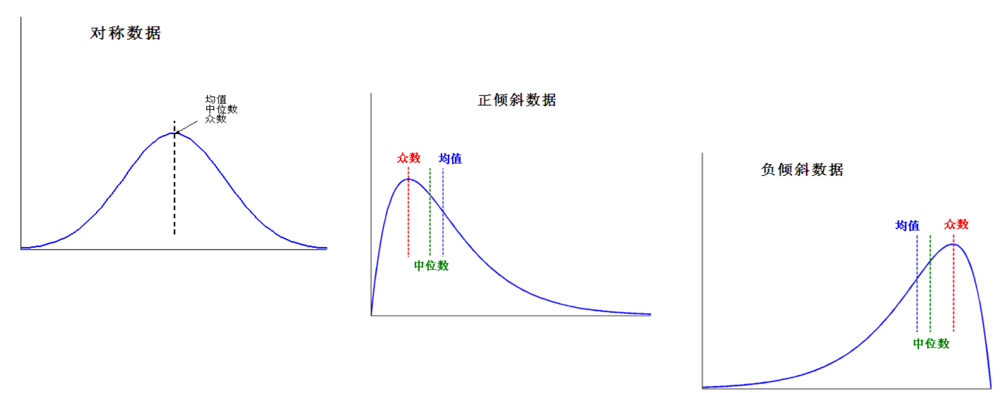
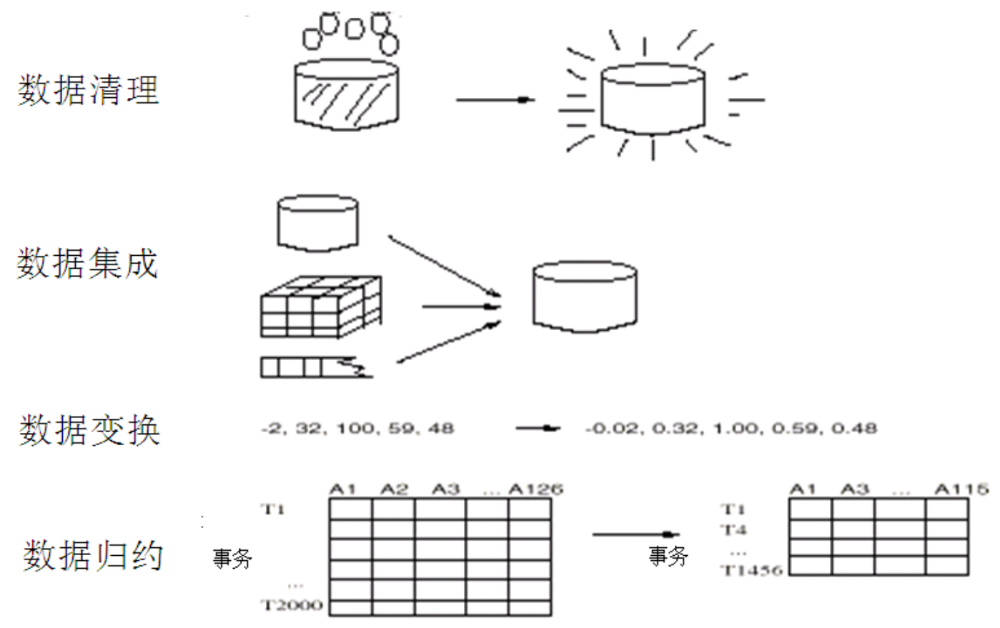
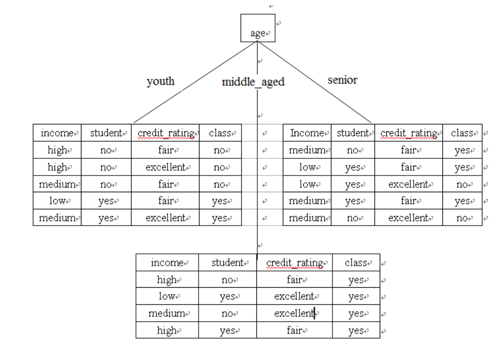
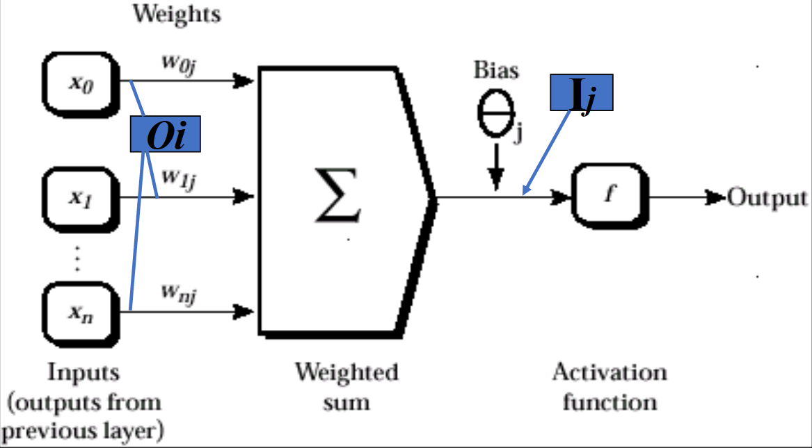
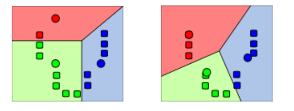
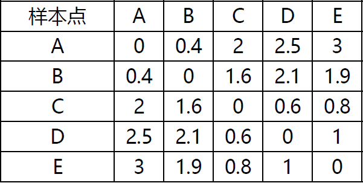
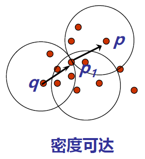

# 考试范围

## ver1

1. 简答: 3~4 题 20 分
   - 规范化
   - 文本分类
   - 熵
   - 算法区别
2. 计算: 80 分 参考作业
   1. A, FP, 关联规则
   2. ID3, KNN, ID3、KNN、BAYES
   3. KMeans 算法， 距离计算
   4. 回归（相关性）
   5. 文本分类--PageRank

## ver2

上课内容: 到 DM7-聚类 && 回归

题型: 选择 简答 计算

1. [**DM1 数据挖掘引论**](#DM1 引论)
   - 无具体计算, 可以看看数据挖掘流程, 开放计算题会用到
   - 数据挖掘&KDD: 数据挖掘是核心
   - 数据挖掘 & 数据仓库
     - 数据仓库是数据挖掘的核心资源，数据挖掘是处理数据仓库的技术手段，数据仓库为数据挖掘提供数据
     - 数据仓库 DM0 不考
   - 什么类型的数据(DM2) && 什么类型的模式(特征表示, 分类, 聚类)
2. [**DM2 认识数据**](#DM2 认识数据)
   1. 属性类型: 二元/**数值**/标称 (结合第四小节的计算)
      - 计算都是数值型
   2. 基本统计形式
      - 不需要计算, 了解概念
      - 均值和方差
      - 什么是中位数, 众数, 应用到什么类型的数据(结合数值属性)
   3. 无数据可视化
   4. 相似性和相异性的<mark>计算</mark>
      - 二元的临近性, 计算跟例题差不多
      - 标准化(规范化): 最大最小计算, 了解一下小数
      - 度量方式: 只有**欧几里得(欧式), 曼哈顿, 夹角余弦距离**
   5. 作业: 做!
3. [**DM3 数据预处理**](# DM3 数据预处理)
   1. **清理**
      - 去噪
   2. 集成
      - 相关性分析(结合回归分析), 看一下题目
        - 相关系数: 正相关, 独立, 负相关
   3. **规约**
      - 什么是主成分分析(PCA), kl 变换, 流形学习 [了解一下]
      - 选择和提取
        - 如何选择: 启发式, 利用方差&标准差
   4. 离散化和概念分成(略)
   5. 变换
4. **[DM4 关联规则](#DM4 关联规则)**
   1. apriori 算法 特点 不足 <mark>计算</mark>
   2. fp 算法 特点 <mark>计算</mark>
   3. apriori 和 fp 比较: 支持度低时, apriori 挖掘出的频繁项集更多, 所以更慢
   4. <mark>作业</mark> 例题 6.3, 6.5
      - fp 注意多路径
5. **[DM5 分类–基本概念](#DM5 分类--基本概念)**
   1. **<mark>计算&特点</mark>**: 决策树, 贝叶斯
   2. <mark>**决策树**</mark>
      1. 三种信息选择度量的特点, 联系和区别
         - 信息增益: <mark>计算</mark>信息熵, 信息增益
         - 增益率:
         - 基尼指数
      2. 决策树的不足: 过拟合
   3. **<mark>朴素贝叶斯</mark>**
      1. 考试形式类似作业
      2. 特点和不足, 如何克服
   4. 模型评估与选择
      - 分类器的**评估度量 **重点
        - 混淆矩阵
        - 准确率, 召回率
      - 模型选择: 了解一下
6. DM6
   - SVM, 贝叶斯, bp, knn: 了解特点和联系, 不用计算
   - 但是 KNN 有作业, 可以多看一眼
7. DM7
   - 划分, 层次 **计算**
   - 密度 了解特点

# DM1 引论

## 1.1 为什么进行数据挖掘？

数据挖掘的意义: 从大量数据中发掘 interesting 的**知识和模式**

## 1.2 什么是数据挖掘？

从数据库中挖掘知识:


- 数据清理(消除噪声和删除不一致的数据。占全过程 60％的工作量)
- 数据集成（多种数据源可以组合在一起）
- 数据选择（从数据库中提取与分析任务相关的数据）
- 数据变换（数据变换或统一成适合挖掘的形式）
- **数据挖掘（核心步骤，使用智能方法提取数据模式）**
- 模式评估（根据某种兴趣度度量，识别提供知识的真正有趣的模式）
- 知识表示（使用可视化和知识表示技术，向用户提供挖掘的知识）

## 1.3 挖掘什么类型的数据？

1. 数据库系统
   - 数据库系统由一组内部相关的数据（数据库）和一组管理和存取数据的软件程序组成
2. 数据仓库
   - 数据仓库是一个从多个数据源收集的信息存储库，存放在一致的模式下，并且通常驻留在单个站点上。
3.

## 1.4 挖掘什么类型的模式及如何挖掘？

## 1.5 数据挖掘流程及应用


1. 数据收集
2. 数据准备
   - 数据预处理
3. 数据挖掘
4. 数据应用

## 1.6 相关研究领域

# DM2 认识数据

## 2.1 数据对象与属性类型

### 2.1.1 数据对象

<mark>数据对象</mark>（又称样本）：它代表一个实体，由一组属性（或特征/变量/维） 描述，描述一个样本的一组属性称为属性向量（或特征向量）

- 样本: $X = (x_1, x_2,...,x_n)$
- 属性: $x_i$, 可为各种类型, 可取各种值

### 2.1.2 属性类型

1. <mark>标称属性</mark>
   - 定性的，属性值是一些符号或事物的名称
     - 如 hair_color: 可能为黑色, 白色, 棕色…
   - 不定量, 不定序
2. <mark>二元属性</mark>
   - 二元属性是一种标称属性，只有两个类别或状态：0 或 1
   - 如果两种状态对应于 true 和 false 的话，二元属性又称**布尔属性**。
3. **序数属性**
   - 定性的，序数属性值之间具有有意义的序或秩评定，但是相继值之间的差是未知的，其中心趋势可以用众数和中位数来表示
     - 只有排序, 具体两级差多少未知
4. <mark>数值属性</mark>
   - 数值属性可以是区间标度 的或比率标度的，其中心趋势度量可以用均值、中位数或众数来表示。
   - 定量的，即它是可度量的量，用**整数或实数值**表示。
5. 离散的或连续的（机器学习领域分类算法的常用分类法）
   - 离散属性具有有限或无限可能个值，可以用或不用整数表示。如：属性 hair_color、smoker 都有有限个值，因此是离散的。
   - 如果属性不是离散的，则它是连续的。

## 2.2 数据的基本统计描述

1. 动机：能够理好地理解数据，它们对于数据清理特别有用

   - 获得数据的总体印象

   - 识别数据的典型特征

   - 凸显噪声或离群点

2. 度量数据的中心趋势

   - **均值、中位数、众数（模）等**

3. 度量数据的离散程度

   - 极差、四分位数、四分位数极差、方差、标准差等

4. 基本统计描述的图形显示

   - 盒图、分位数图、Q-Q 图、直方图、散点图、局部回归曲线

### 2.2.1 数据的中心趋势

#### <mark>均值</mark>

<mark>均值</mark> $\overline{x} = \frac1n\sum_{i=1}^nx_i\\$

<mark>加权平均</mark> $\overline{x} = \frac{\sum_{i=1}^nw_ix_i}{\sum_{i=1}^nw_i}\\$

截尾均值: 去掉高、低极端值得到的均值

- e.g. 计算平均工资时，可以截掉上下各 2％的值后计算均值，以抵消少数极端值的影响 ~~(极端数值疑似是有点多了)~~
- **问题**：对极端值很敏感

#### <mark>中位数</mark>

有序集的中间值或者中间两个值平均

问题：适用于倾斜数据

#### 众数（Mode，也叫模）

集合中出现频率最高的值，对于适度倾斜（非对称的）的单峰频率曲线，可以 使用以下经验公式计算众数：

$$
mean-mode=3×(mean-median)
$$

**问题**：可能最高频率对应多个不同值，导致多个众数；极端情况下，如果每个数据值仅出现一次，则它没有众数；



### 2.2.2 离散程度

1. **极差**: 数据集的最大值和最小值之差
2. **四分位数**
   - Q1 (25th percentile), Q3 (75th percentile)，中位数就是第 2 个四分位数(Q2)
3. **四分位极差（IQR）**
   - IQR = Q3 – Q1
   - 通常我们认为，孤立点是指落在第三个四分位数之上或第一个四分位数之下至 少 1.5×IQR 处的值
4. <mark>方差和标准差</mark>
   - $\sigma^2=\frac1N\sum_{i=1}^n(x_i-\mu)^2=\frac1N\sum_{i=1}^nx_i^2-\mu^2\\$

## 2.3 数据可视化

略

## 2.4 度量数据的相似性和相异性

> 相似性和相异性都称<mark>邻近性</mark>

1. 相似性
   - 量化两组数据的相似性
   - 物体相似性越大时，值越大
   - 取值范围是[0,1]
2. 相异性
   - 量化两组数据的不同的程度
   - 物体相似性越大时，值越小
   - 最小的差异值取 0
   - 上限值根据实际不同而不同

### 2.4.2 数据矩阵和相异性矩阵

1. 数据矩阵

   - 对象-属性结构
   - 二模矩阵，行与列代表不同实体
   - 用 n×p（n 个对象 ×p 个属性）矩阵存放 n 个对象
   - $\begin{bmatrix}x_{11}&...&x_{1f}&...&x_{1p}\\...&...&...&...&...\\x_{i1}&...&x_{if}&...&x_{ip}\\...&...&...&...&...\\x_{n1}&...&x_{nf}&...&x_{np}\end{bmatrix}$

2. 相异性矩阵

   - 对象-对象结构
   - 单模矩阵，行和列代表相同的实体
   - 存储 n 个对象两两之间的相异性

   - $\begin{bmatrix}0&&&&\\d(2,1)&0&&&\\d(3,1)&d(3,2)&\theta&&\\\vdots&\vdots&\vdots&&\\d(n,1)&d(n,2)&...&...&0\end{bmatrix}$

### 2.4.3 <mark>临近性度量计算</mark>

**标称属性**的邻近性度量

- 对象 i, j 有 p 个属性，m 指匹配的数目，即对象 i 和 j 取相同属性值的数目，
  则对象 i 和 j 之间的相异性为$d(i,j) = \frac{p-m}{p}\\$

#### **二元属性**的邻近性度量

- 二元属性只有两种状态：0 或 1，0 表示该属性不出现，1 表示该属性出现
- 二元属性的列联表 $\begin{array}{cc|ccc}&&\mathbf{Object~j}\\&&1&0&sum\\\hline&1&a&b&a+b\\\mathbf{Object~i}&0&c&d&c+d\\&sum&a+c&b+d&p\end{array}$
- **对称的二元属性**，每个状态都同样重要。对象 i 和 j 的相异性为： $d(i, j)=\frac{b+c}{a+b+c+d}\\$
- **非对称的二元属性**，两个状态不是同等重要的。对象 i 与 j 的相异性为：$d(i,j)=\frac{b+c}{a+b+c}\\$

#### 数值属性的邻近性度量

##### 规范化(标准化)

> 将度量值转换为**无单位**的数值

最小－最大规范化 : $\nu^{\prime}=\frac{\nu-\min_A}{\max_A-\min_A}({new\_\max}_A-{new\_\min}_A)+{new\_\min}_A\\$

z-score 规范化

小数定标规范化

##### 距离计算

Euclidean 距离 (<mark>欧几里得距离</mark>)

$$
d(i,j)=\sqrt{(\left|x_{i1}-x_{j1}\right|^2+\left|x_{i2}-x_{j2}\right|^2+...+\left|x_{ip}-x_{jp}\right|^2)}
$$

Manhattan 距离 (<mark>曼哈顿距离</mark>)

$$
d(i,j)=|x_{i1}-x_{j1}|+|x_{i2}-x_{j2}|+...+|x_{ip}-x_{jp}|
$$

Minkowski 距离 (闵科夫斯基距离)

$$
d(i,j)=\sqrt[q]{(|x_{i1}-x_{j1}|^q+|x_{i2}-x_{j2}|^q+...+|x_{ip}-x_{jp}|^q)}
$$

#### 序数属性的邻近性度量

假设 f 是描述 n 个对象的一组序数属性之一，f 的相异性计算步骤如下：

- 设第 i 个对象的 f 值为$x_{if}$，则用它在值中的序$r_{if} = \{1,...,M_f\}$代替
- 由于每个序数属性都可以有不同的状态数，将每个 f 值的序映射到[0,1]，以 便使每个属性都有相同的权重
- 相异性采用数值属性的相异性计算方法，使用$z_{if}$作为第 i 个对象的 f 值

#### 混合属性的相异性

在真实数据集中，对象不是被一种类型的属性描述，而是被多种类型的属性描述。计算混合型属性描述的对象之间的相异性

- 法一：将属性按类型分组，对每种类型的变量进行单独的分析，如果这些分析得到兼容的结果，则这种方法是可行的，然而通常不兼容。

- 法二：所有属性一起处理，进行一次分析，可以将不同类型的属性组合在单 个相异性矩阵中，把所有有意义的属性转换到共同的值域区间[0,1]之内，则

  $d(i,j)=\frac{\sum_1^p\delta_{ij}d_{ij}\left(f\right)}p\\$
  其中，$d_{ij}(f)$ 为单个类型属性定义的距离，$p$为属性的个数。

#### 余弦相似性

余弦相似性是一种度量，它可以用来比较文档，或针对给定的查询词向量对文档排序。令 x 和 y 是两个待比较的向量，使用余弦度量作为相似函数，有

$$
sim(x, y) = \frac{x\cdot y}{||x||\cdot||y||}\\
$$

# DM3 数据预处理

## 3.1 数据预处理概述



- 数据清理: 填写缺失的值; 光滑噪声数据，识别或删除孤立点; 解决不一致性; 解决由于数据集成造成 的数据冗余问题;
- 数据集成: 将多个数据源中的数据整合到一个一致的存储中，减少不一致和冗余;
- 数据归约: 得到数据集的简化表示，它小得多，但可以得到相同或相近的结果，包括维归约和数值归约;
- 数据离散化和概念分层: 是数据归约的一部分，通过数据的离散化和概念分层来归约数据，对数字型数据特别重要;
- 数据变换: 规范化、数据离散化和概念分层都是某种形式的数据变换;

## 3.2 数据清理

### 3.2.1 空缺数据

1. **空缺值**：数据清理任务
   - 例：数据库表中，很多条记录的对应字段没有相应值，比如销售表中的顾客收入
2. 引起空缺值的原因
   - 设备异常
   - 与其他已有数据不一致而被删除
   - 因为误解而没有被输入的数据
   - 输入时，有些数据因为得不到重视而没有被输入
   - 对数据的改变没有进行日志记载
3. 如何处理空缺值
   - 忽略元组：当类标号缺少时通常这么做（假定挖掘任务设计分类或描述），当每个属性缺少值的百分比变化很大时，它的效果非常差。
   - 人工填写空缺值：工作量大，可行性低
   - 使用一个全局变量填充空缺值：将缺失的属性值用同一个**常量**（如 unknown 或-∞）替换
   - 使用属性的**中心度量**（如均值或中位数）填充空缺值
   - 使用与给定元组属**同一类**的所有样本的属性**中心度量**填充空缺值
   - 使用最可能的值填充空缺值：使用像 Bayesian 公式或**判定树**这样的基于**推断**的方法

### 3.2.2 噪声数据

1. 噪声：被测量的变量的随机错误或偏差
2. 引起不正确属性值的原因
   - 数据收集工具的问题
   - 数据输入错误
   - 数据传输错误
   - 技术限制
   - 命名规则的不一致
3. 如何处理噪声
   - 分箱(binning)：首先排序数据，并将他们分到等深的箱中，然后可以按箱的平均值平滑 （箱中每一个值被箱中的平均值替换） 、按箱中值平滑（箱中每一个值被箱中的中位数替换） 、按箱的边界平滑（箱中最大和最小值是边界，箱中每一个值被最近的边界值替 换）
   - **回归(**regression)：通过让数据适应回归函数来平滑数据
   - **离群点分析**(outlier analysis)：检测并去除离群点 (通过聚类)
   - **计算机和人工检查结合**：计算机检测可疑数据，然后对它们进行人工判断

## 3.3 数据集成

### 3.3.1 数据集成中的问题

1. 实体识别问题: 两个数据中, 什么情况下合并
2. 冗余和相关分析
   - 一个属性如果能由另一个或另一组属性“导出”，则这个属性可能是冗余的
   - 属性或维命名的不一致也可能导致结果数据集中的冗余
     例如：年收入属性与工资属性，出生年月属性与年龄属性
   - 有些冗余可以被相关分析检查到
     - 标称数据，使用卡方检验
     - 数值属性，使用相关系数和协方差
3. 元组重复
   - 例如：对于给定的唯一的数据实体，存在两个或多个相同的元组
   - 原因：通常出现在各种不同副本之间，由于不正确输入或更新不完全
     - 如: 一订货人的名字可能以不同的地址出现在订单数据库中
4. 数据值冲突的检测与处理
   - 对于现实世界中的同一实体，来自不同数据源的属性值可能不同
   - 可能原因：表示、尺度或编码
     - 重量属性可能在一个系统中以公制单位存放，而在另一个系统中以英制单位存放

### 3.3.2 相关性检验

#### $\chi^2$相关

$$
\chi^2=\sum_{i=1}^c\sum_{j=1}^r\frac{\left(o_{ij}-e_{ij}\right)^2}{e_{ij}}\\
$$

- 其中，$o_{ij}$是联合事件的观测频度（即实际计数），而$e_{ij}$是期望频度，可用下式计算
  - $e_{ij}=\frac{count(A=a_i)\times count(B=b_j)}n\\$


### 3.3.3 <mark>相关分析</mark>

#### 相关系数

$$
r_{A,B}=\frac{\sum_{i-1}^n(a_i-\overline{A})(b_i-\overline{B})}{n\sigma_A\sigma_B}=\frac{\sum_{i=1}^n(a_ib_i)-n\overline{A}\overline{B}}{n\sigma_A\sigma_B}
$$

其中, n 是样本个数, $\overline A$和$\overline B$分别是属性 A 和 B 的平均值, $σ_A , σ_B$分别是属性 A 和 B 的标准差。

- 如果$r_{A,B}> 0$，则 A 和 B 是**正相关**的，意味着 A 的值随 B 的值增加而增加。该值越大，相关性越强。
- 如果$ r\_{A,B} = 0$，则 A 和 B 是**独立**的，不存在相关。
- 如果$r_{A,B} < 0$，则 A 和 B 是**负相关**的，一个值随另一个值的减少而增加。意味着每一个属性 都阻止另一个出现。
- 注意：相关性并不蕴涵因果关系

#### 协方差$Cov$

$Cov(A,B)=E((A-\overline{A})(B-\overline{B}))=\frac{\sum_{i=1}^n(a_i-\overline{A})(b_i-\overline{B})}n=E(AB)-\overline{A}\ \overline{B}\\$

- $E(AB): A和B对应项相乘, 然后求均值$


## 3.4 数据归约

**数据归约策略**

- [维规约](#3.4.1 维归约)：减少所考虑的随机变量或属性的个数
  - 方法：属性子集选择、主成分分析等 / 特征选择、特征提取
- [数值规约](#3.4.2 数值规约)：用替代的、较小的数据表示形式替换原数据
  - 方法：参数或非参数
- 数据压缩：使用编码机制压缩数据集，维归约和数量归约可以视为某种形式的数据压缩
  - 方法：无损的和有损的

花费在数据归约上的计算时间不应超过或“抵消”在归约后的数据挖掘上挖掘所节省的时间。

### 3.4.1 维归约

- 特征提取(线性/非线性)：用映射（或变换）的方法把原始特征变换为较少的新特征
  $y=W^Tx$ 映射空间
- 分为
  - 离散 K-L 变换 (Karhunen-Loeve)
  - 主成分分析 PCA (Principle Component Analysis)

#### 离散 KL 变换

目标：

- 进行特征提取，新对象不能完全地表示原有的对象，能量总会有损失，我们希望找到一种能量最为集中、能量损失最小的变换方法。
- 是一种**正交变换**，对原向量 x 用标准正交向量系$u_j$进行线性变换，得到新向量 y 用来表示 x，经过 K-L 变换组合，y 是变换后的系数向量，它的各分量之间具有**最小的相关性**，因此关键就是要找到这样的变换矩阵。

- $\mathcal{X}\to\mathcal{Y}\quad\left(\boldsymbol{u}_i^T\boldsymbol{u}_j=\boldsymbol{\delta}_{ij}=\left\{\begin{matrix}1,i=j\\0,i\neq j\end{matrix}\right.\right)$

##### KL 变换-性质

1. 变换产生的新分量正交或不相关
   - 新分量 y1 和 y2 正交（或不相关），两个新分量的坐标轴方向分别由 u1 和 u2 确定
   - 
2. 使新向量更趋确定、能量更趋集中
3. 以部分新分量表示原向量能量损失最小

#### 主成分分析(PCA)

目标：

- 寻找一个线性投影方向，把多个相关变量变换为**少数几个无关变量**（即主成分），这些主成分最能够代表原始数据结构，包含原始变量大部分的信息，通常由原始变量的线性组合来表示。
- PCA 是**基于 K-L 变换的一种最优正交线性变换**(分量相关性最小 → 即为无关变量)。PCA 的变换矩阵是**协方差矩阵**，K-L 变换的变换矩阵可以有很多种（自相关矩阵、协方差矩阵、样本总类内离散度矩阵等等）。
  - 当 K-L 变换矩阵为协方差矩阵时，等同于 PCA。

准则函数： $\begin{aligned}&\max_ww^TCo\nu(X)w\\
&s.t.\quad\begin{vmatrix}w\end{vmatrix}=1\end{aligned}$

求解：对协方差矩阵进行特征值分解，选取最大的 d 个特征值对应的特征向量组成 ，这就是 PCA 寻找的线性投影方向。

##### 主成分分析-性质

1. 性质 1：从几何意义来看，变换后的主分量空间坐标系与变换前的空间坐标系相比旋转了一个角度。而且新坐标系的坐标轴一定指向数据信息量较大的方向。以二维空间为例，假定某样本的分布呈椭圆状，那么经过旋转后，新坐标系的坐标轴一定分别指向椭圆的长半轴和短半轴方向——主分量方向，因为长半轴这一方向的信息量最大。
2. 性质 2：PCA 对于椭球状分布的样本集有很好的效果, 学习所得的主方向就是椭球的主轴方向。


##### 主成分分析–不足

不足：PCA 是一种非监督的算法，能找到很好地代表所有样本的方向，但这个方向对于分类未必是最有利的。

#### 线性判别分析(LDA)

目标：

- 寻找**一个线性投影方向**，使类内散度尽可能小，类间散度尽可能大，即寻找最能把两类样本分开的投影直线。
- 这实际上是两类数据的特征提取，提取的特征数是１。这一思想可以推广到任意类数据， 提取任意多个特征。

##### 线性判别分析–性质

性质 1：满足类间距尽可能大，类内距尽可能小的原则


##### 线性判别分析–不足

不足：LDA 是一种监督的算法，能找到很好的方向对样本进行分类，但这个方向对于表示**所有样本**未必是最有利的。


### 3.4.2 数值规约

#### 回归和对数线性模型(参数)

1. 一元线性回归模型
   - 用一个自变量的线性函数对因变量 Y 建模，如： $Y=WX+B$
   - 两个参数
   - 通常适用最小二乘法来确定这条直线
2. 多元线性回归模型
   - 用两个或多个自变量的线性函数对因变量 Y 建模，如： $Y = B_0 + B_1X_1+B_2X_2+...+B_nX_n$
   - 两个或多个参数
3. 对数线性模型：近似离散的多维概率分布

#### 直方图(无参数)

直方图：使用分箱来近似数据分布

#### 聚类(无参数)

<mark>聚类</mark>：它将对象划分为群或簇，使得在一个簇中的对象相互“相似”，而与其他簇中的对象“相异”

- 相似性基于**距离函数**，用对象在空间中的“接近”程度定义。
- 簇的“质量”可以用**直径**度量，直径是簇中两个对象的最大距离。
- 簇的“质量”也可以用**形心**距离度量，它定义为簇中每个对象到簇形心（表示“平均对象”，或簇空间中的平均点）的平均距离。

#### 抽样(无参数)

抽样：允许用数据的较小随机样本（子集）表示大型数据集。假设大型数据集 D 包含 N 个元组，常用的对 D 的抽样方法有：

- s 个样本的**无放回简单随机抽样**（SRSWOR）：由 D 的 N 个元组中抽取 s 个样本（s<N）
- s 个样本的**有放回简单随机抽样**（SRSWR）：过程同上，只是元组被抽取后，将被回放， 可能再次被抽取
- **聚类抽样**：D 中元组被分入 M 个互不相交的聚类中，可在其中的 s 个聚类上进行简单随机抽样（SRS，m<M）
- **分层抽样**：D 被划分为互不相交的“层”，则可通过对每一层的简单随机抽样（SRS）得到 D 的分层选样

#### 数据立方体聚集

> ???

### 3.4.3 数据压缩

1. 有损压缩 VS. 无损压缩
   - 如果原数据能够从压缩后的数据重构而不损失信息，则该数据归约称为无损的。
   - 如果我们只能近似重构原数据，则该数据归约称为有损的。
2. 字符串压缩
   - 通常是无损压缩，有广泛的理论基础和精妙的算法
   - 在解压缩前对字符串的操作非常有限
3. 音频/视频压缩
   - 通常是有损压缩，压缩精度可以递进选择
   - 有时可以在不解压整体数据的情况下，重构某个片断

## 3.5 数据离散化和概念分层

> 略?

### 3.5.1 数值数据的离散化

**数值数据的离散化**：将连续属性的值域划分区间,便于数据挖掘,影响顶层决策

- 年龄是个连续属性,可以取 0~100 及以上的整数,单独研究特定年龄的样本数据并没有太大意义
- 但年龄可以用区间标签(0~18,19~30,30~50,>50)或者概念标签(童年,青年,中年,老年) **替换元素值**,这样的研究成果才有指导价值

**数值数据的离散化方法**：

- 分箱（binning）：自顶向下分裂，非监督的
- 直方图分析（histogram）：自顶向下分裂，非监督的
- 聚类分析：自顶向下分裂或将由底向上合并，数据划分成簇，每个簇形成同一个概念层上 的一个节点
- 基于熵的离散化（决策树分析）：自顶向下分裂，监督的
- 基于$\chi^2$分析的离散化（相关分析）：由底向上合并，监督的

### 3.5.2 标称数据的概念分层

**标称数据的概念分层产生**：将标称数据变换到多个粒度层，标称数据是无序的离散数据，它有有限个不同值（但可能很多个）

**标称数据的概念分层产生方法**

- 由用户或专家在模式级显式的说明属性的部分序
  - 区<市<省<国家
- 通过显示数据分组说明**分层结构**的一部分
  - {福建，广东，浙江}<中国东南部
- 说明属性集，但不说明它们的偏序，然后系统根据算法自动产生属性的序，构造有意义的 概念分层（示例：根据个数）
- 对只说明**部分属性集**的情况，则可根据数据库模式中的数据语义定义对属性的捆绑信息， 来恢复相关的属性

**启发规则**：较高概念分层的属性，通常包含较少的不同值

## 3.6 数据变换

光滑：去除数据中的噪声（分箱、聚类、回归）

属性构造（特征构造）：由给定属性构造新的属性，并添加到属性集中，以增加对 高维数据的结构的理解和精确度

聚集：对数据进行汇总或聚集（例如，可以聚集日销售数据，计算月和年销售量）

**规范化**：把属性数据按比例绽放，使之落入一个特定的小区间

离散化：数据数值属性（例如，年龄）的原始值用区间标签（例如，0 ～ 10,11 ～ 20 等）或概念标签（例如，youth、adult、senior）替换。

标称数据的概念分层产生：属性，如 street，可以泛化到较高的概念层，如 city 或 country。

### 3.6.1 规范化

<mark>规范化</mark>：将数据按比例缩放，使之落入一个特定的小区间

- 最小–最大规范化 $\nu^{\prime}=\frac{\nu-\min_A}{\max_A-\min_A}({new\_\max}_A-{new\_\min}_A)+{new\_\min}_A\\$

  - 新区间即为$[new\_min_A, new\_max_A]$

- z–score 规范化 $\nu^{\prime}=\frac{\nu-mean_A}{standard\_de\nu_A}\\$
- 小数定标规范化 $\nu^{\prime}=\frac\nu{10^j}\\$ 其中，j 是使 Max(| $\nu^{\prime}|)<1$的最小整数 L

# DM4 <mark>关联规则</mark>

> 整章都重要

## 4.1 关联规则基本概念

1. <mark>关联规则</mark>(Association Rule)可以表示为一个蕴含式： $R：X\Rightarrow Y$

   - 例如：$R：尿布\Rightarrow啤酒$

2. **项集和频繁项集**

   - 项目的集合称为<mark>项集</mark>，项目个数为 K 的项集称为<mark>K 项集</mark>
     例如，{牛奶，面包，黄油}是个 3 项集
   - 支持度大于或等于**最小支持度**的项集称为<mark>频繁项集</mark>，反之则称为非频繁项集。
   - 如果 k 项集满足**最小支持度**，称为<mark>频繁 k 项集</mark>，记作$L_k$。

3. <mark>支持度</mark>

   - 关联规则 R 的支持度(support)是交易集中同时包含 X 和 Y 的交易数与**所有交易数**之比
   - $support(X\Rightarrow Y) = \frac{count(X\cup Y)}{D} = P(X\cup Y)$
   - P: 概率

4. <mark>置信度</mark>

   - 关联规则 R 的置信度(confidence)是指同时包含 X 和 Y 的交易数与**包含 X 的交易数**之比
   - $confidence(X\Rightarrow Y) = \frac{count(X\cup Y)}{count(x)} = \frac{P(X\cup Y)}{P(X)} = P(Y|X)$

5. 关联规则的<mark>最小支持度</mark>和<mark>最小置信度</mark>

   - 关联规则的最小支持度也就是衡量频繁集的最小支持度(Minimum Support)，记为 supmin，它用于衡量规则需要满足的最低重要性。

   - 关联规则的最小置信度(Minimum Confidence)记为 confmin，它用于衡量规则需要满足的最低可靠性。

6. <mark>强关联规则</mark>
   - 如果规则$R:X\Rightarrow Y$满足$\begin{cases}support(X\Rightarrow Y)\geq supmin\  \\ confidence(X\Rightarrow Y)\geq confmin\end{cases}$，称关联规则$X\Rightarrow Y$为强关联规则，否则称关联规则$X\Rightarrow Y$为弱关联规则。
   - 在挖掘关联规则时，产生的关联规则要经过 supmin 和 confmin 衡量，筛选出的强关联规则才能用于指导商家的决策。


## 4.2 Apriori 算法

### 4.3.1 算法描述

Apriori 算法由连接和剪枝两个步骤组成

1. 连接：为了找$L_k$ ，通过$L_{k-1}$与自己连接产生候选 k 项集的集合，该候选 k 项集记为$C_k$ 。
   - $L_{k-1}$中的两个元素$l_1$和$l_2$可以执行连接操作$l_1 l_2$的条件是
     $(l_1[1]=l_2[1])\and (l_1[2]=l_2[2])\and ...\and (l_1[k-2]=l_2[k-2]) \and \textcolor{red}{(l_1[k-1]<l_2[k-1])}$
   - $C_k=L_{k-1}\rhd\lhd L_{k-1}$
2. 剪枝：对候选 k 项集$C_k$，删除其非频繁的选项，得到$L_k$
   1. $C_k$是$L_k$的超集（$L_k$ $C_k$ ），即它的成员可能不是频繁的，但是所有频繁的都在$C_k$中。 因此可以通过扫描数据库，侯选项集的计数值不小于最小支持度计数就是频繁的，属 于$L_k$ ;
   2. 为了减少计算量，可以使用 Apriori 性质，即如果 k 项集的一个(k-1)子集不在$L_k$-1 中， 则该候选不可能是频繁的，可以直接从$C_k$删除。

### 4.3.2 Apriori 算法调优

> [了解]

Apriori 算法的主要挑战

- 可能需要重复扫描数据库： 如果频繁集最多包含 10 个项，那么就需要扫描交易数据表 10 遍，这需要很大的 I/O 负载;
- 可能产生大量的候选项集： 若有 100 个项目，可能产生候选项集数： $C_{100}^1+C_{100}^2+...+C_{100}^{100}=2^{100}-1\approx1.27\times10^{30}$
- 对候选项集的支持度计算非常繁琐;

**解决思路**

- 减少对数据的扫描次数;
- 缩小产生的候选项集;
- 改进对候选项集的支持度计算方法

#### ① 散列

1995 年 Park 等人提出一种散列技术来生成 2 项侯选集。Prak 使用$(10x+y)mod7$函数。

将每个项集通过相应的散列函数映射到散列表的不同的桶中，这样可以通过将桶中的**项集计数**跟**最小支持计数**相比较**先淘汰**一部分项集。

例如：当扫描数据库中每个事务，由 C1 中的候选 1 项集产生频繁 1 项集 L1 时，对每个事务 产生所有的 2 项集，将它们散列到散列表结构的不同桶中，并增加对应的桶计数，在散列表中对应的桶计数低于支持度阈值的 2 项集不可能是频繁 2 项集，可从候选 2 项集中删除， 这样就可大大压缩了要考虑的 2 项集。

#### ② 事务压缩

事务压缩（压缩进一步迭代的事务数）

不包含任何 k 项集的事务不可能包含任何(k+1)项集，这种事务在下一步的计算中可以加上标记或删除。

#### ③ 划分(分块)

先把数据库从逻辑上分成几个互不相交的块，每次单独考虑一个分块并对它生成所有的频繁项集，然后把产生的频繁项集合并，用来生成所有可能的频繁项集，最后计算这些频繁项集的支持度。

分块的大小选择要使得每个分块可以被放入主存。

总共只需要两次数据库扫描。

- 第一次扫描：将数据划分为多个部分并找到局部频繁项集;
- 第二次扫描：评估每个候选频繁项集的实际支持度，以确定全局频繁项集;

算法的正确性是由**每一个可能的频繁项集至少出现在某一个分块中**保证的。

- 缺陷: 分块时将某个全局的频繁项集分开, 导致这个频繁项集在每个块中支持度都不够(<最小支持度), 最后没有挖掘出这个频繁项集, 损失了一些精确度


#### ④ 选样

选样（在给定数据的一个子集挖掘）

选择原始数据的一个样本，在这个样本上用 Apriori 算法挖掘频繁模式。

样本大小应该以可以放在内存中为宜。

总共只需要一到两次数据库扫描。

- 可以通过一次全局扫描来验证从样本中发现的模式;
- 可以通过第二次全局扫描来找到遗漏的模式;

通过**牺牲精确度**来减少算法开销，为了提高效率，可以适当**降低最小支持度**来减少遗漏的频繁模式。

#### ⑤ 动态项集技术

在扫描的不同点添加候选项集，这样，如果一个候选项集已经满足最少支持度，则在可以直接将它添加到频繁项集，而不必在这次扫描的以后对比中继续计算

## 4.3 FP-growth 算法

### 4.3.1 算法步骤


1. 频繁 1 项集的导出（第一次扫描数据库） 导出频繁 1-项集的集合，并得到它们的支持度计数，然后将每个交易中的频繁项按支持度计数递减序排列，如下图：
   

2. 构建 FP 树(第二次扫描数据库)
   - 创建树的根节点，用 null 标记;
   - 每个交易中的频繁项按支持度计数递减序排列后，对每个交易创建一个分枝;
     - 例如：为第一个交易{f, c, a, m, p}构建一个分枝;
   - 当考虑为一个交易增加分枝时，沿共同前缀上的每个节点的计数加 1，为跟随前缀后的项创 建节点并连接;
     - 例如：将第二个事务{f, c, a, b, m}加到树上时，将为 f，c，a 各增计数 1，然后为{b, m}创建分枝
   - 创建一个项头表，每个项通过一个节点链指向它在树中的出现，以方便遍历。如左表：
     - 
3. FP 树挖掘
   - 由长度为 1 的频繁模式（初始后缀模式）开始，构造它的**条件模式基**（一个“子模式基/ 子数据库”，由 FP 树中与该后缀模式一起出现的前缀路径集组成）;
   - 构造长度为 1 的频繁模式（初始后缀模式）的条件 FP 树;
   - 递归地在条件 FP 树上挖掘频繁模式。直到结果 FP-tree 为空, 或只含单个路径 (此路径的每个子路径对应的相集都是频繁集)。模式增长通过初始后缀模式与条件 FP 树产生的频繁模式连接实现。

# DM5 分类–基本概念

## 5.1 基本概念

### 5.1.1 分类与预测

#### 分类

1. 分类
   - 根据训练数据集和类标号构建模型
   - 用于预测新数据的类标号（离散值）
2. 分类示例
   - 银行贷款员需要分析数据，来弄清哪些贷款申请者是安全的，哪些是有风险的。就需要构造一个分类器来预测类属编号，比如预测顾客属类。
   - 垃圾邮件分类。
3. 分类方法
   - <mark>决策树</mark>、<mark>贝叶斯</mark>方法、K-近邻方法、支持向量机、神经网络、关联规则方法等

#### 预测

1. 预测
   - 构建连续函数值模型
   - 用于预测未知值或缺省值（连续值）
2. 预测示例
   - 银行贷款员需要预测贷给某个顾客多少钱是安全的。就需要构造一个预测器，预测一个连续值函数或有序值，比如贷款金额。
   - 红酒品质鉴别。
3. 预测方法
   - 线性回归、 非线性回归、 多元回归

#### 区别

相同点

- 两者都需要构建模型，再用模型来估计未知值
  - 模型看作一个映射或函数 y=f(X)， X 是输入，y 是输出;
  - 模型准确率，要使用单独的测试集进行测试;

不同点

- 分类法用来估计“类标号属性” （离散值）
- 预测法用来估计 “预测属性” （连续值）

## 5.2 <mark>决策树归纳</mark>

### 5.2.1 属性选择度量

#### 信息增益 ID3

1. 定义

   - 信息论中定义事件的平均信息量为单个事件的信息量的统计平均值，称为<mark>期望信息（信息熵）</mark>为$\color{blue}Info(D)=-\sum_{\\i=1}^nP_ilogP_i$ 对所有样本(D)进行分类
     - 简写为$I(n,m)$, 如$I(2, 3) = -\frac25log\frac25 - \frac35log\frac35$
   - $Info_A(D)=\sum_{j=1\\}^{V} \frac{|D_j|}{|D|}Info(D_j)$ 对根据 A 进行分类后的样本(D~j~)进行分类
     - 可以理解为: $\frac{|D_j|}{|D|}为权重, Info(D_j)部分为对小样本D_j根据A进行分类\\$
   - <mark>信息增益</mark>: $Gain(A)=Info(D)-Info_A(D)$

2. 使用 ID3 进行决策树归纳

   - 选择具有**最高信息增益**的属性进行分裂

   - 对于同一组样本, 其$Info(D)$相同, 所以可以只比较$Info_A(D)$

   - **做题时可以不算这个, 但是要写出 Gain 公式**

3. **特点:** 信息增益度量倾向于选择**具有大量值的属性**，不过，考虑充当唯一标识符的属性， 这种划分信息增益最大，但是对分类没用。

##### 例题

| Age         | Income | Student | Credit Rating | Buys Computer |
| ----------- | ------ | ------- | ------------- | ------------- |
| youth       | high   | no      | fair          | no            |
| youth       | high   | no      | excellent     | no            |
| middle_aged | high   | no      | fair          | yes           |
| senior      | medium | no      | fair          | yes           |
| senior      | low    | yes     | fair          | yes           |
| senior      | low    | yes     | excellent     | no            |
| middle_aged | low    | yes     | excellent     | yes           |
| youth       | medium | no      | fair          | no            |
| youth       | low    | yes     | fair          | yes           |
| senior      | medium | yes     | fair          | yes           |
| youth       | medium | yes     | excellent     | yes           |
| middle_aged | medium | no      | excellent     | yes           |
| middle_aged | high   | yes     | fair          | yes           |
| senior      | medium | no      | excellent     | no            |

Class P: buys_computer = “yes”

Class N: buys_computer = “no”

**第一层**

1. 计算信息熵: $Info(D)=I(9,5)=-\frac9{14}\log_2(\frac9{14})-\frac5{14}\log_2(\frac5{14})=0.940 $
2. 根据 age 分类: $Info_{age}(D)=\frac5{14}I(2,3)+\frac4{14}I(4,0)+\frac5{14}I(3,2)=0.694$
3. 信息增益为: $Gain(age) = Info(D)-Info_{age}(D)=0.246$
4. 同理可得 $G\alpha in(income)=0.029\\Gain(student)=0.151\\Gain(credit\_rating)=0.048$

所以, age 信息增益最高, 选择为分裂属性



……

结果(肉眼可得, 懒得算了)


#### 增益率 C4.5

> 克服信息增益倾向于选择大量

<mark>分裂信息</mark>: $\color{blue}SplitInfo_A(D)=-\sum_{j=1\\}^V\frac{|D_j|}{|D|}log_2(\frac{|D_j|}{|D|})$

- 信息熵分类依据是样本结果(如上面例中的 buys_computer), 分裂信息这里选择的是属性 A

<mark>增益率</mark>: $GainRate(A)=\frac{Gain(A)}{SplitInfo_A(D)}\\$

选择具有**最大增益率**的属性作为分裂属性

注意：随着划分信息趋向于 0，增益率变得不稳定，为了避免这种情况，增加一个约束： 选取的测试的**信息增益必须较大**，至少与考察的所有测试的平均增益一样大。

##### 例

属性 income 的测试将表中的数据划分为 3 个分区，即 low、medium 和 high，**分别包含 4、 6 和 4 个元组**。

1. 计算分裂信息: $SplitInfo_A\left(D\right)=-\sum_{j=1}^\nu\frac{\left|D_j\right|}{\left|D\right|}\times\log_2\left(\frac{\left|D_j\right|}{\left|D\right|}\right) \textcolor{red}{= I(4,6,4)}\\
   =-\frac4{14}\times\log_2\frac4{14}-\frac6{14}\times\log_2\frac6{14}-\frac4{14}\times\log_2\frac4{14}=1.557$
2. 计算信息增益(前面的例子算过了): $Gain(income)=0.029$
3. 计算增益率: $ GainRatio\left(income\right)=0.029/1.557=0.019 $

#### 基尼指数

> 对于二元的划分

$\color{blue}Gini(D)=(\sum_{i=1}^m P_i(1-P_i))=1-\sum_{\\i=1}^mP_i^2$

$Gini_A(D)=\frac{|D_1|}{|D|}Gini(D_1)+\frac{|D_2|}{|D|}Gini(D_2)$

不纯度降低=$\Delta Gini(A)=Gini(D)-Gini_A(D)$

选择具有**最大化不纯度降低**的属性作为分裂属性

##### 例

Class P: buys_computer = “yes”（包含 9 个样本） Class N: buys_computer = “no”（包含 5 个样本）

1. 首先使用基尼指数式计算 D 的不纯度：$Gini\left(D\right)=1-\left(\frac9{14}\right)^2-\left(\frac5{14}\right)^2=0.459$
2. 计算每个属性的基尼指数:
   - 从属性 income 开始，并考虑每个可能的分裂子集。考虑子集{ low, medium }，导致 10 个满足条件的样本在分区 D1 中，其它个样本将指派到分区 D2 中。基于该划分计算出基尼指数值为：
     $$
     \begin{aligned}
     &Gini_{income\in\{low,medium\}}\left(D\right)=\frac{10}{14}Gini\left(D_1\right)+\frac4{14}Gini\left(D_2\right) \\
     &=\frac{10}{14}\Bigg(1-\Bigg(\frac{7}{10}\Bigg)^2-\Bigg(\frac{3}{10}\Bigg)^2\Bigg)+\frac{4}{14}\Bigg(1-\Bigg(\frac{2}{4}\Bigg)^2-\Bigg(\frac{2}{4}\Bigg)^2\Bigg)\\
     &=0.443=Gini_{income\in\{high\}}\big(D\big)
     \end{aligned}
     $$
   - 类似地，用其余子集划分的基尼指数值为：
     - 0.458（子集{low, high}和 {medium} ）
     - 0.450（子集{medium, high}和 {low} ）
   - 因此，属性 income 的最好二元划分在{low, medium}和 {high}上，因为它最小化基尼指数，它的基尼指数为：0.443
   - 评估属性 age，得到 {youth, senior}和 {middle_aged}为最好划分，基尼指数为： 0.357
   - 属性 student 和 credit_rating 都是二元的，分别具有基尼指数 0.367 和 0.429。
   - 因此，属性 age 和分裂子集 {youth, senior}产生最小的基尼指数，不纯度降低 0.4590.357=0.102。二元划分“age {youth, senior}”导致 D 中样本的不纯度降低最大，并 返回作为分裂准则。结点 N 用该准则标记，从它生长出两个分析，并相应地划分样本

#### 度量方式比较

| 度量方式 | 特点                                                                             |
| -------- | -------------------------------------------------------------------------------- |
| 信息增益 | 偏向于多值(大量值)属性                                                           |
| 增益率   | 倾向于不平衡的划分，其中一个分区比其他分区小得多                                 |
| 基尼指数 | 偏向于多值属性<br />当类的数量很大时会有困难<br />倾向于导致相等大小的分区和纯度 |


### 5.2.2 过度拟合和树剪枝

产生的决策树会出现过分适应数据的问题

- 因为数据中存在噪声和离群点, 部分分支是因为数据异常
- 对未知样本判断不准确

**防止过分拟合的两种方法---剪枝**

- **先剪枝**: 在树构造过程中, 设定阈值, 提前停止子集划分
- **后剪枝**: 对完全生长的树进行剪枝, 删除结点的分支用最频繁的类标记去替换

## 5.3 贝叶斯分类

### 5.3.1 理论基础

设 X 是样本，用属性值描述，类标号未知;

设 H 为某种假设 ，如样本 X 属于某个特定类 C;

P(H|X)是**后验概率**，或在条件 X 下，H 的后验概率

- 例如，已经顾客的年龄为 35 岁且收入为四万美元，该顾客将购买计算机的概率。

P(H)(prior probability)是**先验概率**，或 H 的先验概率

- 例如，顾客将购买计算机的概率, 无论年龄和收入。

P(X)是 X 的**先验概率**，可观察到样本数据

- 例如，顾客集合中年龄为 35 岁且收入为四万美元的概率。

P(X|H)是**后验概率**，或在条件 H 下，X 的后验概率

- 例如，已知顾客将购买计算机，该顾客年龄为 35 岁且收入为四万美元的概率。

<mark>贝叶斯定理</mark>： $P(H|X)=\frac{P(X|H)P(H)}{P(X)}$

### 5.3.2 朴素贝叶斯分类

**朴素贝叶斯分类器**：预测 X 属于条件 X 下具有最高后验概率的类，规则(略）

- 根据根据贝叶斯定理，最大化右式即可： $P(C_i|X)=\frac{P(X|C_i)P(C_i)}{P(X)}\\$
- 由于 P(X) 对所有类为常数 ，只需最大化：$P(X|C_i)P(C_i)$
- 如果类的先验概率$P(X)$未知，通常假定这些类是等概率的($各个P(C_i)相等$)，只需最大化： $P(X|C_i)$
- 为了降低计算开销，可以做类条件独立的朴素假设（即属性之间不存在依赖关系）。
  - 注意：连续属性问题。
  - $P(X|C_i)=\prod_{k=1}^nP(x_k|C_i)=P(x_1|C_i)P(x_2|C_i)\cdots P(x_n|C_i)$

#### 例

| age     | income | student | credit_rating | buys_computer |
| ------- | ------ | ------- | ------------- | ------------- |
| <=30    | high   | no      | fair          | no            |
| <=30    | high   | no      | excellent     | no            |
| 31...40 | high   | no      | fair          | yes           |
| >40     | medium | no      | fair          | yes           |
| >40     | low    | yes     | fair          | yes           |
| >40     | low    | yes     | excellent     | no            |
| 31...40 | low    | yes     | excellent     | yes           |
| <=30    | medium | no      | fair          | no            |
| <=30    | low    | yes     | fair          | yes           |
| >40     | medium | yes     | fair          | yes           |
| <=30    | medium | yes     | excellent     | yes           |
| 31...40 | medium | no      | excellent     | yes           |
| 31...40 | high   | yes     | fair          | yes           |
| >40     | medium | no      | excellent     | no            |

两类：C1:buys_computer = ‘yes’，C2:buys_computer = ‘no’;

预测以下样本的类标号: X = (`age <=30`,`Income = medium`,`Student = yes`,`Credit_rating = Fair`)


#### 不足

> 需要计算一些概率值，开销大
>
> 零概率值问题
>
> 属性独立性假设问题

##### 零概率值问题

朴素贝叶斯分类需要每一个条件概率都必须非零，否则预测的概率将为零

$P(X\mid C_i)=\prod_{\begin{array}{c}k=1\\\end{array}}^nP(x_k\mid C_i)$

**克服方式: 拉普拉斯校准**


##### 属性独立性假设问题

> 朴素贝叶斯假设属性都是独立的

使得朴素贝叶斯分类成为可能，但是实践中很少满足，因为属性 （变量）通常是相关的

如何克服:

- **贝叶斯信念网络**, 联合属性的贝叶斯推理和因果关系
- **决策树**, 在一个时刻只推理一个属性，首先考虑最重要的属性

## 5.4 基于规则的分类

> 暂 skip

## 5.5 模型评估与选择

### 5.5.1 分类器的评估度量

#### 术语

**正样本（P）**：感兴趣的主要类的样本。

**负样本（N）**：其他样本。

真正例（True Positive，TP）：被分类器正确分类的正样本。

真负例（True Negative，TN）：被分类器正确分类的负样本。

假正例（False Positive，FP）：被错误地标记为正样本的负样本。

假负例（False Negative，FN）：被错误地标记为负样本的正样本。

<mark>混淆矩阵</mark>:

| $ &(分类器)预测的类\\实际的类&$ | TRUE                | FALSE               | 合计 |
| ------------------------------- | ------------------- | ------------------- | ---- |
| TRUE                            | TP 真正例<正确分类> | FN 真负例<错误分类> | $P$  |
| FALSE                           | FP 假正例<错误分类> | TN 假负例<正确分类> | $N$  |
| 合计                            | $P’$                | $N'$                |      |

#### 准确性、错误率、灵敏性和特效性

**类分布相对平衡**

- <mark>准确率</mark> =$(TP+TN)/(P+N) =灵敏性 ×P/(P+N)+特效性 ×N/(P+N) $

- <mark>错误率</mark> =$(FP+FN)/(P+N) $

**类不平衡问题**：感兴趣的类（正类）是稀少的，即数据集的分布反映负类显著地占多数，而 正类占少数，例如“欺诈检测”“医学分析”

- 灵敏性(召回率)： 正确识别的正样本的百分比，$灵敏性 = TP/P $
- 特效性：正确识别的负样本的百分比，$特效性 = TN/N$

#### 精度、召回率、 F 度量

<mark>精度</mark>: $precision=TP/(TP+FP)＝TP/P'$

- 标记为正类的样本**实际**为正类所占的百分比

<mark>召回率</mark>: $recall=TP/(TP+FN) ＝ TP/P$

- 正类的样本标记为正类的百分比

<mark>F 度量</mark> (F1 或 F 分数)：精度和召回率的调和均值，它赋予召回率和精度相等的权重$F=\frac{2* precision*recall} {precision+recall}\\$

<mark>$F_\beta$</mark> ：精度和召回率的加权度量，它赋予召回率权重是赋予精度的 β 倍

$F_{\beta}\quad=\quad\frac{(1+\beta^{2})\times precision\times recall}{\beta^{2}\times precision+recall}\\$

#### 其他性能指标

准确率：模型正确分类或预测的能力

速度：产生和使用模型的计算花销

健壮性：给定噪声数据或有空缺值的数据，模型正确分类或预测的能力

可伸缩性：对大量数据，有效的构建分类器或预测器的能力

可解释性：学习模型提供的理解和洞察的层次

### 5.5.2 评估分类器准确率的方法

1. **保持方法**
   - 给定的数据随机的划分为两个独立的集合
     - 训练集，通常 2/3 的数据被分配到训练集
     - 检验集，通常 1/3 的数据被分配到检验集
2. **随机二次抽样**
   - 保持方法的变形，将保持方法重复 k 次，总准确率估计取每次迭代准确率的平均值
3. **交叉验证(k-折交叉验证)**

   - 初始数据随机地划分成 k 个互不相关的子集，每个子集的大小大致相等；训练和检验进行 k 次；在第 i 次迭代, 分区 Di 用作检验集，其他区用作训练集；对于分类，准确率估计是次迭代正确分类的样本总数除以初始数据中的样本总数。
   - 留一：每次只给检验集“留出”一个样本
   - 分层交叉验证：折被分层，使的每个折中样本的类分布与在初始数据中的大致相同

4. **自助法**
   - 处理较小的数据集合比较有效
   - 从给定训练样本中有放回的均匀抽样
     - 在有放回的抽样中，允许机器多次选择同一个样本
   - 有多种自助方法, 最常用的一种是 .632 自助法
     - 假设给定的数据集包括 d 个样本。该数据集有放回地抽样 d 次，产生 d 个样本的自助样本集或训练集。
     - 结果是，在平均的情况下， 63.2%的原数据样本将出现在自助样本中， 而其余 36.8%的样本将形成检验

### 5.5.3 模型选择

1. 统计显著性检验
2. 基于成本效益和 ROC 曲线

## 5.6 提高分类准确率的技术

> 暂略

# DM6 分类–高级方法

> 了解特点, 无计算题

## 6.0 支持向量机 SVM

> 了解

支持向量机的标准：寻找具有**最大边缘超平面** (MMH)

- 超平面
- 最大边缘：两类中到分离超平面最近的样本与此超平面之间的距离之和
- 支持向量


## 6.1 贝叶斯信念网络

> 了解

<mark>贝叶斯信念网络</mark>: 朴素贝叶斯分类法假定类条件独立，这一假定简化了计算。然而，在实践中，变量之间可能存在依赖关系。贝叶斯信念网络说明**联合条件概率分布**，它允许在变量子集间定义类条件独立性。

它由两个成分定义：

- (有向无环)的因果关系图模型：表示变量间的依赖关系
- 条件概率表的集合：给出联合概率分布


Scenario 1：给定网络结构和所有变量观察：计算 CPT

Scenario 2：网络结构已知, 某些变量隐藏：梯度下降法, i.e., 沿着准则函数的最速下降方向搜索解

- 权重初始化为随机值
- 每次迭代中，似乎是对目前的最佳解决方案前进，没有回溯
- 每次迭代中权重被更新，并且收敛到局部最优解

Scenario 3：网络结构未知, 所有变量可知：搜索模型空间构造网络拓扑

Scenario 4：网络结构未知, 隐藏变量：目前没有好的算法

## 6.2 用后向传播分类

<mark>神经网络领域</mark>最早是由心理学家和神经学家提出，旨在寻求开发和 检验神经的计算模拟。

**神经网络**是一组连接的输入输出单元，其中每个连接都与一个权重相关联。在学习阶段，通过调整神经网络的权，使得能够预测输入样本的正确类标号来学习。由于单元之间的连接，神经网络学习又称连接者学习。

**不足**：神经网络需要很长的训练时间，因而更适合具有足够长训练时间的应用; 它需要大量的参数，如网络拓扑或“结构”，通常靠经验确定; 由于人们很难解释学习中权和隐藏单元的符号含义，神经网络常常因其可解释性差而受到批评(黑盒)。

**优点**：对噪音数据的高承受能力，对未经训练的数据的模式分类能力。可用于缺乏属性与类之间联系的知识时，适合连续值的输入与输出，可以使用并行技术来加快计算过程，利用训练过的神经网络提取规则等。

多层前馈神经网络 / 后向传播算法

### 6.2.1 多层前馈神经网络


- 前馈是指信号向前传播，输入 -> 隐层 -> 输出

#### 隐藏层和输出层结点

$I_j=\sum_iw_{ij}O_i+\theta_j\quad O_j=\frac1{1+e^{-I_j}}\\$

- 隐藏层和输出层每个结点都是非线性变换单元



**输入层**：多个输入单元组成，每个单元为一个结点。输入结点为线性输出，结点为样本的一个属性。

- $X=\begin{pmatrix}x1,x2,......xi\end{pmatrix},Oi=xi$

**隐藏层**：可为多层，一般为一层。

- 结点输入是输入层结点输出加权和与偏值 $I_j=\sum_iw_{ij}O_i+\theta_j$
- 结点输出是激活函数作用于加权和的结果。此外激活函数：

**输出层**：与隐藏层类似，输入输出分别为：
$I_k=\sum w_{jk}O_j+\theta_k$ $O_k=\frac{1}{1+e^{-I_k}}\\$

给定足够多的隐藏单元，多层前馈神经网络可以逼近任何函数

#### 拓扑结构和参数

1. 输入层结构由**输入变量（属性）**来定。 每个属性为一个输入结点
2. 输出层结构由**输出结果**来定。 有几个输出值，就有几个输出结点。
3. 隐藏层: 层数和结点数点的确定，靠经验。
4. 连接情况：是全连接，还是部分连接，这取决于对问题的了解和先验知识。
   - 一般为全连接，等学习完成后可能有的连接太弱而去掉。
5. 初始权值的确定：取决于对问题的了解和先验知识，哪部分作用强，权值就设得大些。
6. 属性值的规范化： 包括离散属性的处理。 定在(0-1)，(-1-1)，[0-1]，{0,1}
7. 确定单元输出阈值函数，多为： $O_j=\frac{1}{1+e^{-I_j}}\\$
8. 学习率（0-1），人为确定

#### BP 算法学习过程

> 了解
>
> 细节略

1. 确定拓扑结构和参数
2. 向前传播输入
3. 向后传播误差
4. 权值偏值调整
5. 终止条件
   - 所有权值调整都很小;
   - 指定迭代次数（10 万次停止）;
   - 分类结果满意（分类精度 90%）;

#### 黑盒内部：后向传播和可解释性

神经网络的主要缺点是其**知识的表示**，用加权链连接单元的网络表示的知识让人很难解释`......激发......`方法

- 方法（提取规则）
  - Step1：网络剪枝：剪去对训练后的网络影响最小的加权链，简化网络
  - Step2：将进行链、单元或活化值聚类，研究输入值和活化值的集合，导出描述输入和隐藏层单元联系的规则。
  - Step3 ：两个规则的集合结合在一起，形成 IF-THEN 规则。
- 灵敏度分析
  - 用于评估一个给定的输入变量对网络输出的影响。改变该变量的输入，而其他输入变量为某固定值。其间，监测网络输出的改变。
    - 由这种形式的分析得到的知识是形如“IF X 减少 5% THEN Y 增加 8%”的规则

## 6.3 使用频繁模式分类

1. 频繁模式
2. 关联规则挖掘

### 关联分类

从分类的角度，**置信度**类似于规则的准确率

**关联规则分类的步骤**

- Step1：挖掘数据，得到频繁项集，即找出数据中经常出现的属性–值对。
- Step2：分析频繁项集，产生每个类的关联规则，它们满足置信度和支持度的标准。
- Step3：组织规则，形成基于规则的分类器。

**关联分类的方法举例**：

- **CBA（基于分类的关联）**：**类似于 Apriori 算法**，使用迭代方法挖掘频繁项集，多遍扫描数据集，导出的频繁项集用来产生和测试更 长的项集。找出满足最小置信度和最小支持阈值的规则的完全集后， 分析并找出包含在分类器中的规则。使用一种启发式方法构造分类器，其中规则按照它们的置信度和支持度递减优先级排列。
- **CMAR（基于多关联规则的分类）**：借助于树结构有效存储和检索规则，使用多种规则剪枝策略。CMAR 采用**FP-growth 算法的变形**来满足最小支持度和最小置信度阈值的规则的完全集。 CMAR 还使用另一种树结构来有效的存储和提取规则，并根据置信度、相关度和数据库的覆盖率对规则剪枝。当规则插入树时就触 发规则剪枝策略。其基本原理是：如果存在更高置信度的更泛化的版本，则可以减去具有低置信度的更特殊化的规则。

## 6.4 惰性学习法

**急切学习法**：在接收待分类的新样本之前就构造分类模型;

- 如：决策树归纳; 贝叶斯分类; 基于规则的分类; 支持向量机; 后向传播分类; 基于关联规则挖掘的分类;

**惰性学习法**：直到对给定待分类样本前一刻才构造分类模型;

- 如：k-最近邻分类(K-nearest-neighbor classifier, KNN);
- 特点：
  - 计算开销可能大;
  - 需要有效的存储技术;
  - 不提供多少解释或对数据结构的洞察;
  - 支持增量学习;
  - 能对具有超多边形形状的复杂决策空间建模;
  - **容易受到 K 取值的影响**;

### <mark>K 最近邻分类(KNN)</mark>

> 有计算, 见作业

1. 概述
   - 所有的训练样本都存放在 n 维模式空间中
   - “邻近性”用**距离**度量，如欧几里得距离，dist(X1, X2)
   - 目标函数值可以是离散的或是实数值
   - 对于 k-最近邻分类，未知样本被指派到它的 k 个最近邻中的多数类
2. 一些问题
   - 最近邻分类用于数值预测：返回未知样本的 k 个最近邻的实数值标号的**平均值**
   - 最近邻分类用于标称属性：同则差为 0，异则差为 1，更为精确的处理，比如黑色与白色的差肯定要大于灰色与白色的差
   - 缺失值的处理：取**最大的可能差**
     - 对于标称属性，如果属性 A 的一个或两个对应值丢失，则取差值为 1;
     - 对于数值属性，若两个比较的样本的 A 属性值均缺失，则取差值为 1，若只有一个缺失，另一个值为 v，则取差值为｜ 1-v ｜和｜ 0-v ｜中的最大 值;
   - 确定近邻数 k 的值：通过实验确定
     - 进行若干次实验，取分类误差率最小的 k 值;
   - 最近邻分类法使用基于距离的比较，本质上赋予每个属性相等的权重。当数据存在**噪声**或不相关属性时，它们的准确率可能会受到影响
   - > 特点省流:
     >
     > - 开销大
     >
     > 2. 容易噪声影响
     > 3. 受 K 数值影响大

## 6.5 分类的其它问题

> PPT 里妹有这部分内容啊

# DM7 聚类分析

## 7.1 聚类分析

### 7.1.1 基本概念

**聚类**

- 是把数据对象划分成子集的过程
- 每个子集是一个簇，簇中的对象彼此相似，不同簇中的对象不相似
- 聚类被称为无监督学习，因为没有提供类标号信息

应用

- 商务智能、图像识别、WEB 搜索、数据分割、离群点检测;
- 作为一个独立的工具观察数据分布的情况，观察每个簇的特点，将进一步的分析集中在特定的簇集合上
- 作为其他算法（如分类等）的一个预处理步骤，这些算法将在生成的簇上进行处理

### 7.1.2 如何评价聚类方法

1. 类内相似性
   - 一种评价标准就是观察聚类的类内差异(within cluster variation)和类间差异 (Between cluster variation)
   - **类内差异**：衡量类内的紧凑性，可以用特定的距离函数来定义，比如： $w(C)=\sum_{i=1}^kw(C_i)=\sum_{i=1}^k\sum_{x\in C_i}d(x,\overline{x_i})^2\\$
   - **类间差异**：衡量不同类之间的差异性，可以定义为聚类中心间的距离，比如： $b(C)=\sum_{1\leq j<i\leq k}d(\overline{x_j},\overline{x_i})^2\\$
   - 类的总体质量可以定义为 w(c)和 b(c)的一个单调组合，比如： w(c) / b(c)
2. 聚类质量也用它**发现某些或全部隐藏的模式的能力**来度量
3. 聚类结果的质量依赖于聚类方法所使用的**相似性度量和它的实现**

### 7.1.3 对聚类分析的要求

1. 数据挖掘对聚类的典型要求
   - 具有高度可伸缩性
   - 具有处理不同属性类型的能力
   - 具有发现任意形状的簇的能力
   - 对于确定输入参数的领域知识的要求
   - 处理噪声数据的能力
   - 增量聚类（新数据）和对输入次序不敏感
   - 聚类高维数据的能力
   - 基于约束的聚类
   - 可解释性和可用性
2. 如何比较不同的聚类方法
   - 划分准则：层次？
   - 簇的分离性：互斥？
   - 相似性度量：任意形状的簇？
   - 聚类空间：高维问题？

### 7.1.4 基本聚类方法概述

| 方法                      | 一般特点                                                                                                                                                                                    | 划分方法                                                                                                               |
| ------------------------- | ------------------------------------------------------------------------------------------------------------------------------------------------------------------------------------------- | ---------------------------------------------------------------------------------------------------------------------- |
| [划分方法](#7.2 划分方法) | 构建数据的分区，大部分是基于距离<br />适合于发现**中小规模**数据库中的**球形互斥**的簇                                                                                                      | 大多采用流行的启发式方法：k-均值或 k-中心点                                                                            |
| [层次方法](#7.3 层次方法) | 对数据对象集的层次分解，可以基于距离或者密度和连通性<br />一个步骤一旦完成便不能被撤消<br /> - 优点：该规定可以避免考虑选择不同的组合, 减少计算代价 <br /> - 缺点：不能纠正错误的合并或划分 | 两种层次方法：凝聚方法和分裂方法                                                                                       |
| 基于密度                  | 可以发现**任意形状**的簇，可以过滤噪声、离群点                                                                                                                                              | 基于密度函数<br /> - 簇是对象空间中被低密度区域分隔的稠密区域<br /> - **簇密度**：每个点的“邻域”内必须具有最少个数的点 |
| 基于网格                  | 处理速度很快，处理时间独立于数据对象的数目                                                                                                                                                  | 把对象空间量化为有限数目的单元，形成了一个网格结构，<br />所有的聚类操作都在这个网格结构(即量化的空间)上进行           |

## 7.2 <mark>划分方法</mark>

1. <mark>划分方法</mark>
   - 给定一个 n 个样本的数据集，划分方法构建数据的 k 个分区（k<=n），其中每个分区表示一个簇，同时满足：
   - 每个簇至少包含一个样本
   - 每个样本必须属于且仅属于一个簇
     
2. 基本步骤
   - 对于给定的 k，算法首先给出一个初始的划分方法，以后通过反复迭代的方法改变划分， 使得每一次改进之后的划分方案都较前一次更好
3. 典型算法
   - k-均值（由簇的平均值来代表整个簇）
   - k-中心点（由处于簇的中心区域的某个值代表整个簇）

### 7.2.1 k–均值(K-Means)

#### 概述

1. K-均值
   - 每个簇的中心都用簇中样本的**均值**来表示
2. 输入
   - k：簇的数目
   - D：包含 n 个样本的样本集
3. 步骤
   1. 从 D 中任意选择 k 个样本作为初始簇中心
   2. Repeat
   3. 根据簇中样本的均值，将每个样本分配到最相似的簇
   4. 更新簇中心，即重新计算每个簇中样本的均值
   5. Until 不再发生变化

#### 例题


解：

- 第一次迭代：K1={T1}，K2={T3}，m1=(1,1), m2=(1,2)
  - T2：d(T2,m1)=1, d(T2,m2)=2 → K1={T1,T2}
  - T4：d(T4,m1)=2, d(T4,m2)=1 → K2={T3,T4}
  - T5：d(T5,m1)=5, d(T5,m2)=4 → K2={T3,T4,T5}
  - T6：d(T6,m1)=6, d(T6,m2)=4 → K2={T3,T4,T5,T6}
  - T7：d(T7,m1)=6, d(T7,m2)=5 → K2={T3,T4,T5,T6,T7}
  - T8：d(T8,m1)=7, d(T8,m2)=6 → K2={T3,T4,T5,T6,T7,T8}
  - 两个组中样本的均值为：m1=(1.5,1), m2=(3.5,3)
- 第二次迭代：
  - T1：d(T1,m1)=0.5, d(T1,m2)=4.5 → K1={T1}
  - T2：d(T2,m1)=0.5, d(T2,m2)=3.5 → K1={T1,T2}
  - T3：d(T3,m1)=1.5, d(T3,m2)=3.5 → K1={T1,T2,T3}
  - T4：d(T4,m1)=1.5, d(T4,m2)=2.5 → K1={T1,T2,T3,T4}
  - T5：d(T5,m1)=4.5, d(T5,m2)=0.5 → K2={T5}
  - T6：d(T6,m1)=5.5, d(T6,m2)=1.5 → K2={T5,T6}
  - T7：d(T7,m1)=5.5, d(T7,m2)=1.5 → K2={T5,T6,T7}
  - T8：d(T8,m1)=6.5, d(T8,m2)=2.5 → K2={T5,T6,T7,T8}
  - 两个组中样本的均值为：m1=(1.5,1.5), m2=(4.5,3.5)
- 第三次迭代：
  - T1：d(T1,m1)=1, d(T1,m2)=6 → K1={T1}
  - T2：d(T2,m1)=1, d(T2,m2)=5 → K1={T1,T2}
  - T3：d(T3,m1)=1, d(T3,m2)=5 → K1={T1,T2,T3}
  - T4：d(T4,m1)=1, d(T4,m2)=4 → K1={T1,T2,T3,T4}
  - T5：d(T5,m1)=4, d(T5,m2)=1 → K2={T5}
  - T6：d(T6,m1)=5, d(T6,m2)=2 → K2={T5,T6}
  - T7：d(T7,m1)=5, d(T7,m2)=1 → K2={T5,T6,T7}
  - T8：d(T8,m1)=6, d(T8,m2)=1 → K2={T5,T6,T7,T8}
  - T1—T8 进行分组，结果与第二次迭代相同，停止计算。

#### 特点

- 不能保证收敛于全局最优解，常常终止于一个局部最优解
- 必须事先给出 k（要生成的簇的数目），而且对初值敏感，对于不同的初始值，可能会导致不同结果
- 不适合发现非凸形状的簇或者大小很不相同的簇
  
  - 因为纯粹按照距离计算
- 算法只有在簇的平均值被定义的情况下才能使用，这不适合某些应用，比如涉及类属性的数据
- 对噪音和孤立点非常敏感，噪音和孤立点的存在，会大幅度扭曲数据的分布

### 7.2.2 K-中心值

> 基于代表对象的技术

1. <mark>K-中心点</mark>
   - 每个簇的中心都用簇的代表样本来表示
2. PAM 算法（围绕中心点划分算法）
   - 是 K-中心点聚类的一种流行实现
   - PAM 在小型数据集上运行良好，但是不能很好地用于大数据集
3. PAM 算法的改善
   - CLARA：大型应用聚类
   - CLARANS：基于随机搜索的聚类大型应用
   - 

#### PAM 算法

1. 输入

   - k：簇的数目
   - D：包含 n 个样本的样本集

2. 步骤

   - 从 D 中任意选择 k 个样本作为初始簇中心
   - Repeat
   - 根据簇的代表样本，将每个样本分配到最相似的簇
   - 更新簇中心，即重新选择簇的代表样本
   - 簇的代表样本是否被替换由**代价函数**决定
   - Until 不再发生变化

3. 代价函数

   - $TC_{ih}=\sum_{j=1}^nC_{jih}$
   - $C_{jih}$: $O_j$在$O_i$被$O_h$替换后产生的代价
   - 如果总代价是负的，那么实际的误差将会减小，Oi 可以被 Oh 替代。
   - 如果总代价是正的，则 Oi 不需被替换。
   - Oi 和 Om 是两个原中心点，为了判定**非代表对象 Oh**是否可以替代**当前代表对象 Oi(中心点)**，对于每一个对象 Oj，我们将介绍以下四种情况中代价函数的计算公式。然后总结代价函数计算：
     - 计算各点到最近的中心点的距离
     - 计算各点到替换后的最近的中心点的距离
     - 比较替换后的距离和与替换前的距离和

4. 四种情况

   - | 情况                                                                                                                 | 图                                                                                                          |
     | -------------------------------------------------------------------------------------------------------------------- | ----------------------------------------------------------------------------------------------------------- |
     | ① Oj 当前隶属于中心点对象 Oi。如果 Oi 被 Oh 所代替作为中心点，且**Oj 离一个 Om 最近**， i≠m，那么 Oj 被重新分配给 Om |  |
     | ② Oj 当前隶属于中心点对象 Oi。如果 Oi 被 Oh 代替作为一个中心点，且**Oj 离 Oh 最近**，那么 Oj 被重新分配给 Oh         |  |
     | ③ Oj 当前隶属于中心点 Om，m≠i。如果 Oi 被 Oh 代替作为一个中心点，而**Oj 依然离 Om 最近**，那么对象的隶属不发生变化   |  |
     | ④ Oj 当前隶属于中心点 Om，m≠i。如果 Oi 被 Oh 代替作为一个中心点， 且**Oj 离 Oh 最近**，那么 Oj 被重新分配给 Oh       |  |

## 7.3 <mark>层次方法</mark>

代表算法(将距离矩阵作为聚类标准)

- 层次凝聚的代表是 AGNES 算法
- 层次分裂的代表是 DIANA 算法

### 7.3.1 AGNES 算法

> 自底向上

1. 算法步骤
   - 输入：包含 n 个样本的样本集
   - 输出：满足终止条件的若干个簇
   - ```pseudocode
     将每个样本当成一个初始簇;
     REPEAT
     	计算任意两个簇的距离，并找到最近的两个簇;
       	合并两个簇，生成新的簇的集合;
     UNTIL 终止条件得到满足;
     ```
2. 层次聚类方法的终止条件：
   - 设定一个最小距离阈值 D，如果最相近的两个簇的距离已经超过 D，则它们不需再合并， 聚类终止。
   - 限定簇的个数 k，当得到的簇的个数已经达到 k，则聚类终止
3. 

### 7.3.2 DINAN 算法

> 自顶向下分裂算法

```pseudocode
将所有样本整个当成一个初始簇
    REPEAT
    在所有簇中挑出具有*最大直径*的簇C
    找出C中与其它点平均相异度最大的一个点p并把p放入splinter group，剩余的放在old party中
        REPEAT
        在old party里选择一个点q，计算q到splinter group中的点的平均距离D1，计算q到old party中的点的平均距离D2，保存D2-D1的值
        选择D2-D1取值最大的点q_max, 如果D2-D1为正，把q_max分配到splinter group中
        UNTIL 没有新的old party的点被分配给splinter group
    splinter group和old party为被选中的簇分裂成的两个簇，与其它簇一起组成新的簇集合
END
```

#### 例



1. Step1
   - 最大簇：{A,B,C,D,E}
     平均相异度最大的点：A
   - $\begin{aligned}&d_{avg}(A,Set)=1.58\quad d_{avg}(B,Set)=1.2\\&d_{avg}(C,Set)=1\quad\quad\  d_{avg}(D,Set)=1.24\\&d_{avg}(E,Set)=1.34\end{aligned}$
   - 因此：splinter group 为 A， old party group 为 B，C，D，E
2. Step2
   - splinter group 为 A, old party group 为 B,C,D,E。
   - 在 old party 里选择一个点 q，计算到 splinter group 中的点的平均距离 D1，计算 q 到 old party 中的点的平均距离 D2，保存 D2-D1 的值。
   - $\begin{aligned}
     &D_{1}(B)=0.4 &D_{2}(B)=1.9\quad & D_{2}(B)-D_{1}(B)=1.5  \\
     &D_{1}(C)=2 &D_{2}(C)=1\quad & D_{2}(C)-D_{1}(C)=-1  \\
     &D_{1}(D)=2.5 &D_{2}(D)=1.2\quad & D_{2}(D)-D_{1}(D)=-1.3  \\
     &D_1(E)=3     &D_2(E)=1.2\quad  & D_{2}(E)-D_{1}(E)=-1.8 
     \end{aligned}$
   - 因此：splinter group 为 A，B， old party group 为 C，D，E。
3. Step3
   - splinter group 为 A,B, old party group 为 C,D,E。在 old party 里选择一个点 q，计算到 splinter group 中的点的平均距离 D，计算 q 到 old party 中的点的平均距离 D2，保存 D2-D1 的值
   - $D_{1}(C)=1.8&D_{2}(C)=0.7 &D_{2}(C)-D_{1}(C)=-1.1\\
     D_{1}(D)=2.3&D_{2}(D)=0.8&D_{2}(D)-D_{1}(D)=-1.5\\
     D_{1}(E)=2.5&D_{2}(E)=0.9&D_{2}(E)-D_{1}(E)=-1.6$
   - 因此：由于 D2-D1 均为负值，因此没有新的 old party 的点被分配给 splinter group，一次分裂结束，如图
     
4. Step4
   - 选择直径最大的簇 CDE
   - 选择最大簇中平均相异度最大的点 E
   - 
5. Step5
   - 选择直径最大的簇 CD
     

### 7.3.3 算法比较


## 7.4 基于密度的方法

> 不考计算

**基本思想**：只要“邻域”中的密度(样本数目)超过某个阈值，就继续增长给定的簇，即对给定簇中的每个数据点，在给定半径的邻域中必须至少包含最少数目的点

- 基于距离的聚类方法的缺点: 只能发现球状的簇，难以发现任意形状的簇

**基于密度的聚类**

- 只要临近区域的密度（对象或数据点的数目）超过某个临界值，就继续聚类
- 优点：可以过滤掉“噪声”和“孤立点”，发现任意形状的簇

### DBSCAN

<mark>DBSCAN</mark>: 一种基于高密度连通区域的基于密度的聚类

- 找出核心对象，即其邻域稠密的对象。它连接核心对象和它们的邻域，形成稠密区域作为簇
- **密度可达**：点 p 关于 Eps, MinPts 是从 q 密度可达的, 如果存在一个节点链 p1, …, pn, p1 = q, pn = p 使得 pi+1 是从 pi 直接密度可达的
  
- **密度相连**：点 p 关于 Eps, MinPts 与点 q 是密度相连的, 如果存在点 o 使得, p 和 q 都是关于 Eps, MinPts 是从 o 密度可达的
  
- DBSCAN 算法描述
  - 输入：包含 n 个对象的数据库，半径 ε，最少数目 MinPts。
    输出：所有生成的簇，达到密度要求。
    1. REPEAT
    2. 判断输入点是否为核心对象;
    3. IF 抽出的点是核心点
       THEN 找出所有从该点密度可达的对象
    4. UNTIL 所有输入点都判断完毕
    5. REPEAT
    6. 针对所有核心对象的 ε-邻域所有直接密度可达点，找到最大密度相连对象集合，中间涉及一些密度可达对象的合并。
    7. UNTIL 所有核心对象的 ε-邻域都被遍历;

## 7.5 基于网格的方法

1. 基本思想：使用多分辨率的网格数据结构，把对象空间量化为有限数目的单元，形成了一个网格结构，所有的聚类操作都在这个网格结构(即量化的空间)上进行
2. 区别：前面介绍的方法是数据驱动的，它们划分对象集并且自动适应嵌入空间中的数据分布。基于网格的聚类采用空间驱动的方法，把嵌入空间划分成独立于输入对象分布的单元
3. 优点：处理速度很快，其处理时间独立于数据对象的数目，只与量化空间中每一维的单元数目
4. 基本步骤：1、 划分网格; 2、 使用网格单元内数据的统计信息对数据进行压缩表达; 3、 基于这些统计信息判断高密度网格单元; 4、 最后将相连的高密度网格单元识别为簇。
5. 典型方法
   - STING (a STatisticalINformationGrid approach) (1997)
   - CLIQUE (SIGMOD’98)

### STING

1. STING( STatisticalINformationGrid)是一个基于网格的多分辨率聚类技术, 由 Wang, Yang 和 Muntz 提出(1997)
2. 网格建立步骤：
   1. 空间区域划分为矩形单元。多个级别的矩形单元, 对应不同级别的分辨率。这些单元形成了一个层次结构: 每个高层单元被划分为多个低一层的单元 。
   2. 计算最底层网格单元属性的统计信息 (如平均值, 最大值, 和最小值)
      - 最底层的单元参数直接由数据计算
   3. 从最底层逐层计算上一层每个父单元格的统计信息，直到最顶层
      - 父单元格统计信息由其对应的子单元格计算
   4. 同时根据密度阈值标记稠密网格
3. 查询步骤：
   1. 从一个层次开始
   2. 对于这一个层次的每个单元格，我们计算查询相关的属性值。
   3. 从计算的属性值以及约束条件下，我们将每一个单元格标记成相关或者不相关。
      (不相关的单元格不再考虑，下一个较低层的处理就只检查剩余的相关单元)
   4. 如果这一层是底层，那么转（6），否则转（5）
   5. 我们由层次结构转到下一层，依照步骤 2 进行
   6. 查询结果得到满足，转到步骤 8，否则（7）
   7. 恢复数据到相关的单元格进一步处理以得到满意的结果，转到步骤（8）
   8. 停止

## 7.6 聚类高维数据

> 传统的距离度量在低维聚类分析中频繁使用，在高维数据上还有效吗

高维数据上什么样的簇才是有意义的？本质上，高维空间的簇通常用一个小属性集，而不是整个数据空间定义。因此，聚类高维数据是搜索簇和它们存在的子空间。主要有两种方法：

- **子空间聚类方法**：搜索存在于给定高维数据空间的子空间中的簇，其中子空间用整个空间中的属性子集定义。
- **维归约方法**：构造更低维的空间，并在这种空间中搜索簇。通常，该方法可能通过组合原数据的一些维，构造新的维。

## 7.7 聚类评估

聚类评估的任务

- 估计聚类趋势：确定给定的数据集是否具有可以导致有意义的聚类的非随机结构。
- 确定簇数：观察，交叉验证法。
- 测定聚类质量
  - 外在方法（监督方法）：精度、召回率等。
  - 内在方法（非监督方法）：一般考虑簇的分离情况和紧凑情况来评估。

# DM8 回归

## 8.1 相关分析和回归分析

> 单相关分析–单相关系数

### 8.1.1 相关分析

#### 主要内容

<mark>相关分析</mark>是研究现象之间是否存在某种依存关系，并对具体有依存关系的现象探讨其相关方向以及相关程度，是研究随机变量之间的相关关系的一种统计方法。

1. 确定现象之间**有无相关关系**。判断现象间是否存在着依存关系，首要任务就是要判断现象之间是否存在必要的联系以及联系的形式。
2. 确定相关关系的**表现形式**。只有判明了现象相关关系的具体表现形式后，才能运用相应的相关分析方法去进—步研究相关的程度，并建立相应的相关关系表达式。
3. 判定相关关系的**密切程度和方向**。现象之间的相关关系是一种不严格数量关系，相关分析就是要从这种不确定的数量关系中，判定其相关关系的密切程度和方向。

#### 种类

1. 按相关程度分类：
   - 完全相关; 如：在价格 P 不变的情况下，销售收入 Y 与销售量 X 的关系。
   - 不完全相关;
   - 不相关（或零相关）; 如：股票价格的高低与气温的高低是不相关的。
2. 按相关方向分类：
   - 正相关：两个变量之间的变化方向一致，都是增长趋势或下降趋势;
     - 如：收入与消费的关系; 工人的工资随劳动生产率的提高而提高。
   - 负相关：两个变量变化趋势相反，一个下降而另一个上升，或一个上升而另一个下降;
     - 如：物价与消费的关系; 商品流转的规模愈大，流通费用水平则越低。
3. 按相关形式分类：
   - **线性相关**(直线相关）：当一个变量每变动一个单位时，另一个变量按一个大致固定的增或减量变动。如：人均消费水平与人均收入水平。
   - 非线性相关(曲线相关)：当一个变量变动时， 另一个变量也相应发生变动，但这种变动是不均等的。如：产品的平均成本与总产量; 农产量与施肥量。
4. 按相关的影响因素多少分类：
   - <mark>单相关(一元相关)</mark>：只有一个自变量。如: 居民的收入与储蓄额; 成本与产量。
   - 复相关(多元相关)：有两个及两个以上的自变量。
     - 如: 某种商品的需求与其价格水平 以及收入之间的相关关系便是一种复相关。
   - 偏相关: 在某一现象与多种现象相关的场合，假定其他变量不变，专门考察其中两个变量的相关关系称为偏相关。
     - 如: 在假定人们的收入水平不变的条件下，某种商品的需求与其价格水平的关系就是一种偏相关。
5. 按相关的性质分：
   - 真实相关：真实相关是现象的内在联系所决定。
   - 虚假相关：如：某人曾观察过某一国家历年的国内生产总值与精神病患者人数的关系呈相当高的正相关。
6. 

### 8.1.3 回归分析

<mark>回归分析</mark>是确定两种或两种以上变量间相互依赖的定量关系的一种统计分析方法，它是根据相关关系的具体形态，选择合适的数学模型，对变量间的平均变化关系进行分析。

#### 类型

- 按照涉及的**自变量**的多少，分为一元回归分析和多元回归分析;
- 按照自变量和因变量之间的关系形态类型，可分为线性回归分析和非线性回归分析;
- 如果在回归分析中，只包括一个自变量和一个因变量，且二者的关系可用一条直线近似表示，这种回归分析称为一元线性回归分析;
- 如果回归分析中包括两个或两个以上的自变量，且因变量和自变量之间是线性关系，则称为多元线性回归分析;

### 回归与相关

<mark>相关分析与回归分析的区别和联系</mark>

- 相关分析所讨论的变量的地位一样，分析侧重于随机变量之间的相关特征。
- 回归分析着重研究一个变量 Y 关于另一个/些变量 X 的依赖关系的计算方法和理论。其 目的在于通过 X 的已知或设定值，去估计和/或预测 Y。所关心的是一个随机变量 Y 对另 一个/些随机变量 X 的依赖关系的函数形式。
- 相关分析和回归分析有着密切的联系，它们不仅具有共同的研究对象，而且在具体应 用时，常常必须互相补充。相关分析需要依靠回归分析来表明变量相关的具体形式， 而回归分析则需要依靠相关分析来表明变量的相关程度。只有当变量之间存在着高度 相关时，进行回归分析寻求其相关的具体形式才有意义。
  1. 相关分析是回归分析的基础和前提;
  2. 回归分析是相关分析的深入和继续。

## 8.2 相关图表和相关系数

1. 相关关系的判断
   - 定性分析：是依据研究者的理论知识和实践经验，对客观现象之间是否存在相关关系， 以及何种关系作出判断。
   - 定量分析：在定性分析的基础上，通过编制相关表、绘制相关图、计算相关系数等方 法，来判断现象之间相关的方向、形态及密切程度。
2. 相关表和相关图
   - 相关表和相关图是研究相关关系的直观工具，在进行详细的定量分析之前， 可以先利 用它们对现象之间存在的相关关系的方向、形式、和密切程度作大致的判断。
   - 简单相关表：将自变量 x 的数值按照从小到大的顺序，并配合因变量 y 的数值一一对应而平行排列的表。
     
   - 相关图：又称**散点图**。将 x 置于横轴上，y 置于纵轴上，将（x,y）绘于坐标图上。用来反映两变 量之间相关关系的图形
     

### 相关系数

<mark>相关系数</mark>: 包括简单相关系数、复相关系数、偏相关系数、曲线相关系数(相关指数)。

1. 简单相关系数的概念
   - 简单相关系数又称皮尔逊(1890 年,英国)相关系数，或积矩相关系数，或动差相关系数， 是度量两个变量之间线性相关密切程度和相关方向的统计指标。
   - 若是根据总体全部数据计算的，称为**总体相关系数**，记为 $\rho = \frac{\sigma_{XY}}{\sigma_X\sigma_Y}\\$。
   - 若是根据样本数据计算的，则称为**样本相关系数**，记为$r$ 。
   - 样本相关系数是总体相关系数的一致估计量。
2. 简单相关系数的计算公式
   - $r=\frac{\sigma_{xy}^2}{\sigma_x\sigma_y}=\frac{\sum(x-\overline{x})(y-\overline{y})}{\sqrt{\sum(x-\overline{x})^2(y-\overline{y})^2}}\\$
     - from [3.3.3 相关分析-相关系数](# 相关系数) $r_{A,B}=\frac{\sum_{i-1}^n(a_i-\overline{A})(b_i-\overline{B})}{n\sigma_A\sigma_B}=\frac{\sum_{i=1}^n(a_ib_i)-n\overline{A}\overline{B}}{n\sigma_A\sigma_B}$
   - 其中
     - $L_{xx}\:=\sum(x-\bar{x})^2\:=\sum x^2\:-\frac1n(\sum x)^2 \\=\sum(x^2-2x\bar x+\bar x^2)=\sum(x^2-2\bar x^2+\bar x^2) = \sum(x^2-\bar x^2)$
     - $L_{yy}=\sum(y-\bar{y})^2=\sum y^2-\frac1n(\sum y)^2$
     - $L_{xy}=\sum(x-\bar{x})(y-\bar{y})=\sum xy-\frac{1}{n}(\sum x)(\sum y)$
   - 得$r=\frac{L_{xy}}{\sqrt{L_{xx}L_{yy}}}\\$
   - 单相关系数的取值范围在-1 和 1 之间，**即-1≦ r ≦1**。
3. 简单相关系数的取值及意义
   1. r 的取值范围是 [-1,1]，|r|越趋于 1 表示关系越密切，|r|越趋于 0 表示关系越不密切。
   2. |r|=1，为完全相关
      - r =1，为完全正相关
      - r =-1，为完全负相关 r = 0，不存在线性相关关系
   3. -1≦r<0，为负相关
   4. 0<r≦1，为正相关
      - r 的范围在 0.1-0.3 是微弱相关
      - r 的范围在 0.3-0.5 是低度相关
      - r 的范围在 0.5-0.8 是显著相关
      - r 的范围在 0.8 以上是高度相关

## 8.3 一元线性回归

1. **回归**:
2. **回归分析**: 回归分析是确定两种或两种以上变量间相互依赖的**定量关系**的一种统计分析方法，它是根据相关关系的具体形态，选择合适的数学模型，对变量间的平均变化关系进行分析。

3. 一元线性回归模型: $y_i = a + bx_i+e_i$, 只有一个自变量 x, 且 x 与 y 的关系是线性的

   - a 为截距, b 为 y 对 x 的回归系数, $e_i$ 是随机误差

   - 在实际问题研究中，我们假定 $e～N(0, \sigma^2)$，以便对参数进行区间估计和假设检验

   - 则由于随机误差项的期望为零，因此 y 的期望值是 x 的线性函数，我们可以因此得到**一元线性回归方程**为:
     - $y=a+bx$
     - 其中， y 为因变量的估计值，x 为自变量的实际值，a、b 为待定的参数

## 8.4 多元线性回归分析

### 多元线性回归的模型和参数估计

- 多元回归就是分析在多个自变量（x）与因变量（y）相互关系的基础上，确定一个**多元回归模型**，然后根据各个自变量的变动来估计或预测因变量的变动程度。
- 根据最小二乘法原理，以二元回归方程为例，说明求其参数的方法。
  - $\begin{aligned}&\hat{y}=a+bx_1+cx_2\\&\begin{cases}\sum y=na+b\sum x_1+c\sum x_2\\\sum x_1y=a\sum x_1+b\sum x_1^2+c\sum x_1x_2\\\sum x_2y=a\sum x_2+b\sum x_1x_2+c\sum x_2^2\end{cases}\end{aligned}$

## 8.5 非线性回归分析

非线性回归分析的意义

- 在许多实际问题中,回归函数往往是较复杂的非线性函数。对具有非线性关系的因变量与自变量的数据进行的回归分析即为非线性回归分析。
  在许多场合，非线性的回归方程比线性回归方程更能够准确地反映客观现象之间的相互关系。
- 非线性回归着重解决以下两个问题：
  - 第一，如何确定非线性方程的具体形式。与线性回归不同，非线性回归方程有多种多样的具体形式，需要根据所要研究的问题的性质并且结合实际的观测值做出恰当的选择。
  - 第二，如何估计方程中的参数。非线性回归分析最常用的方法仍然是最小二乘法。但是需要根据方程的不同类型，作适当的处理。
