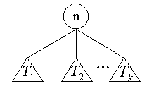

# 第一章 数据结构与算法概论

## 1.1 数据结构研究内容

- 图
- 数据结构研究内容
  - 将所加工的对象进行逻辑组织
  - 把加工对象存储到计算机中
  - 数据运算

## 1.2 基本概念与术语

1. 数据（Data）
   _ 定义：数据是所有能被输入计算机， 且能被计算机程序加工处理的各种符号集合
   _ 数据包含整型、浮点型、布尔型、图像、字符、声音等一切可以输入到计算机的符号集合
2. 数据元素 （Data Element） \* 定义： 数据元素是组成数据的基本单位， 是计算机程序中加工处理的基本单位
3. 数据对象 （Data Object） \* 定义： 数据对象是性质相同的数据元素的集合， 是数据的一个子集
4. 数据结构 （Data Structure）
   1. 定义：是一门研究==非数值计算== 的程序设计问题中计算机的==操作对象== 以及他们之间的==关系和操作== 等等的学科
   2. 数据结构：按照==逻辑关系== 组织起来的一批数据， 按照一定的==存储方法== 把它存储在计算机中， 并在这些数据上定义了相关==运算== 的集合
      1. 数据的逻辑结构
         1. 线性结构：线性表、栈、队列
         2. 非线性结构：树形结构、图形结构、集合结构
      2. 数据的存储结构（物理结构）
         1. 顺序存储
         2. 链式存储
         3. 索引存储
         4. 散列存储
      3. 数据的运算：检索、排序、插入、删除、修改等

## 1.3 数据类型和抽象数据类型

1. 数据类型
   - 具有具有相同数据结构的数据属同一类。同一类数据的全体称为一个数据类型。
   - 在高级程序设计语言中，数据类型用来说明数据在数据分类中的归属。它是数据的一种属性。
   - 简单数据类型对应于简单的数据结构。
   - 复杂的数据结构允许成分数据本身具有复杂的数据结构，因此，构造数据类型允许复合嵌套。
2. 抽象数据类型
   - 数据类型概念的进一步抽象
   - 数据类型和数据类型上的运算的绑定和封装
   - 使用抽象数据类型的好处
     - 算法顶层的设计与底层的实现分离，使得在进行顶层设计时不考虑它所用到的数据和运算将分别如何表示和实现；
   - 算法设计与数据结构设计隔开，允许数据结构自由选择，从中比较，优化算法和程序运行的效率。
   - 编出来的程序自然地呈现模块化，而且抽象的数据类型的表示和实现都可以封装起来，便于移植和重用。

## 1.4 算法(Algorithm)与算法分析

- 算法试试解决问题的一种方法或一个过程
- 算法是若干指令的有穷序列， 满足以下性质
  - 输入：有外部提供的量作为算法的输入
  - 输出：算法产出至少一个量作为输出
  - 确定性：组成算法的每条指令清晰无歧义
  - 有限性：算法中每条指令的执行次数是有限的， 执行每条指令的时间也是有限的

### 1.4.1 算法复杂度分析

1. 算法复杂度分析
   1. 算法复杂性 = 算法所需要的计算机资源的量；
   2. 算法的时间复杂性`T(n)` = 需要的时间资源的量；
   3. 算法的空间复杂性`S(n)` = 存储算法的空间 + 算法的输入、输出数据占用空间 + 程序执行过程占用的临时辅助空间； \* 讨论算法的空间效率主要关心执行算法需要的额外辅助空间的数量， 而非程序执行占用的空间
2. 算法的时间复杂性
   - 最坏情况下的时间复杂性
     - $T_{max}(n) = max\{ T(I) | size(I)=n\}$
   - 最好情况下的时间复杂度
     - $T_{min}(n) = min\{ T(I) | size(I)=n\}$
   - 平均情况下的时间复杂度

     - $T_{avg}(n) = \sum_{size(I)=n}p(I)T(I)$

     > 其中 I 是问题的规模为 n 的实力， p(I)是实例 I 出现的概率
3. 算法的渐进复杂性
   - $T(n) \rightarrow\infty, as\ n\rightarrow\infty;$
   - $(T(n) - t(n) )/ T(n) \rightarrow 0 ，as \ n\rightarrow\infty;$
   - t(n)是 T(n)的渐近性态，为算法的渐近复杂性。
   - 在数学上， t(n)是 T(n)的渐近表达式，是 T(n)略去低阶项留下的主项。它比 T(n) 简单。
   - 运算：t(n)就是 T(n)的最高次项含系数
4. 渐进分析的记号
   1. 渐进上界记号 O <常用>
      - $O(g(n)) = \{ f(n) | 存在正常数c和n0使得对所有n\ge n_0有： 0 \le f(n) \le cg(n) \}$
      - 因为$f(n) \le cg(n)$, 所以复杂度的系数可以省略
   2. 渐近下界记号$\Omega$
      - $(g(n)) = \{ f(n) | 存在正常数c和n0使得对所有n \ge n_0有： 0 \le cg(n) \le f(n) \}$
   3. 非紧上界记号o
      - $O(g(n)) = \{ f(n) | 存在正常数c和n0使得对所有n\ge n_0有： 0 \le f(n) \le cg(n) \}$
      - 因为$f(n) \le cg(n)$, 所以复杂度的系数可以省略
   4. 渐近下界记号$\Omega$
      - $(g(n)) = \{ f(n) | 存在正常数c和n0使得对所有n \ge n_0有： 0 \le cg(n) \le f(n) \}$

# 第六章 树

## 6.1 树的定义

1. 递归定义
   - 单个结点是一棵树，该结点就是树根。
   - 设 T1,T2，…,Tk 都是树，它们的根结点分别为 n~1~,n~2~…n~k~,而 n 是另一个结点且以 n~1~,n~2~…n~k~为儿子，则 T~1~,T~2~，…,T~k~和 n 构成一棵新树。结点 n 就是新树的根。称 n~1~,n~2~, …,n~k~为一组兄弟结点。还称 T~1~,T~2~，…,T~k~为结点 n 的子树。
   - 为了方便起见，空集合也看作是树，称为空树，并用^来表示。空树中没有结点。
   - 
2. 基本术语
   - 结点——表示树中的元素
   - 结点的度——结点的儿子结点个数
   - 树的度——一棵树中最大的结点度数
   - 叶结点——度为 0 的结点
   - 分支结点——度不为 0 的结点
   - 路径——若存在树中的一个节点序列 k~1~，k~2~，…，k~j~，使得结点 k~i~是 k~i+1~的父结点(1<=i<j)，则称该结点序列是树中从结点 k~1~到结点 k~j~的一条路径。
   - 路径长度——路径所经过的==边的数目==
   - 祖先、子孙——任一结点既是它自己的祖先也是它自己的子孙
   - 结点的高度——从该结点到各叶结点的最长路径长度
   - 树的高度——根结点的高度
   - 结点的深度(或层数)——从树根到任一结点 n 有唯一的路径，称该路径的长度为结点 n 的深度(或层数)。从根结点算起，根为第 0 层，它的孩子为第 1 层……
   - 有序树——为树的每一组兄弟结点定义一个从左到右的次序
   - 左儿子、右兄弟
   - 森林——m(m>=0)棵互不相交的树的集合

## 6.2 树的遍历

1. 遍历——按一定规律走遍树的各个顶点，且使每一顶点仅被访问一次，即找一个完整而有规律的走法，以得到树中所有结点的一个线性排列。
2. 树 T 的 3 种遍历方式的递归定义：(T 如图所示)
   - 
   - ①前序遍历——先访问树根 n，然后依次前序遍历 T1,T2,…,Tk。
     ②中序遍历——先中序遍历 T1,然后访问树根 n，接着依次对 T2,T3,…,Tk 进行中序遍历。
     ③后序遍历——先依次对 T1,T2,…,Tk 进行后序遍历,最后访问树根 n。
   - 前中后区别--什么时候访问根节点
   - 例 : 
3.
