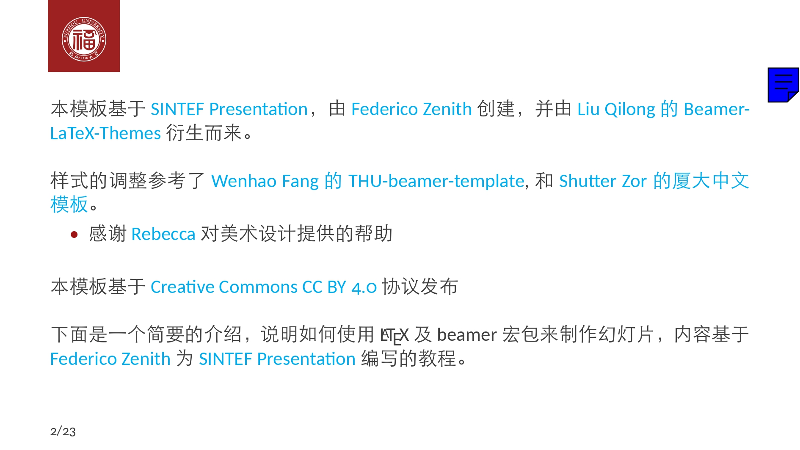

# 基于sintef主题的福州大学LaTeX幻灯片模板 (FZU-SINTEF-Beamer-Template)
>
> copy from [FZU-SINTEF-Beamer-Template](https://github.com/yJader/FZU-SINTEF-Beamer-Template)
>
> ~~其实是想写《基于sintef主题的福州大学LaTeX幻灯片模板设计与实现》的~~

一个基于sintef主题的福州大学LaTeX幻灯片模板，适用于福州大学的学术报告、课程展示、毕业设计答辩等场合。

TODO:

- 上传到overleaf模板

## 模板特点

- 基于 [SINTEF Presentation](https://www.overleaf.com/latex/templates/sintef-presentation/jhbhdffczpnx) 主题，融合福州大学校徽和色系
- 支持添加演讲备注，方便演讲者查看
- 提供多种幻灯片布局：标准布局、章节页、侧边图片布局等
- 美观的表格、图表和代码块样式
- 良好的数学公式支持
- 支持参考文献管理（使用biblatex包）
- 遵循16:9宽屏幻灯片比例，适合现代演示环境

### 页面预览

> [预览文件](./FZU-SINTEF-Beamer-Template-Preview.pdf)

<p align="center">
  
  
</p>
<p align="center">
  
  
</p>

- 注: 右上角蓝色块是演讲者备注，实际演示时不会(不应该)显示。详见[关于演讲者视图](#关于演讲者视图)。

<p align="center">
  
  
</p>
<p align="center">
  
</p>

## 快速开始

### 基本结构

```latex
\documentclass{beamer}
\input{predefined}  % 导入预定义配置

\title[短标题]{完整标题\\可以有多行}
\subtitle{副标题}
\author{作者姓名}
\supervisor{指导教师}  % 可选
\institute{院系名称}
\date{日期}

\begin{document}

\maketitle  % 生成标题页

% 幻灯片内容
\begin{frame}{标题}
  内容
\end{frame}

\backmatter  % 结束页

\end{document}
```

### 特殊页面类型

1. **章节页**：使用`chapter`环境

```latex
\begin{chapter}[背景图片路径]{颜色}{标题}
  内容
\end{chapter}
```

2. **侧边图片页**：使用`sidepic`环境

```latex
\begin{sidepic}{图片路径}{标题}
  内容
\end{sidepic}
```

3. **添加演讲备注**

```latex
\pdfnote{这里是备注内容}
```

## 关于演讲者视图

可以使用以下工具实现演讲者模式（带备注）：

1. **macOS用户**：使用 [osx-presentation](http://iihm.imag.fr/blanch/software/osx-presentation)
   - 提供了演示者视图，可以显示PDF中的注释

2. **所有平台**：使用 [pdf2pptx](https://github.com/yJader/pdf2pptx) 或其他类似工具
   - 将生成的PDF转换为PowerPoint格式，利用PowerPoint的演讲者模式显示备注

## 文件结构

- `main.tex` - 主文件，包含幻灯片内容
- `predefined.tex` - 预定义的包和设置
- `beamerthemesintef.sty` - SINTEF主题样式文件（已修改为福州大学风格）
- `sintefcolor.sty` - 颜色定义文件
- `FZU-assets` - 福州大学相关资源（校徽、背景等）

## 自定义

### 修改颜色

主颜色在`sintefcolor.sty`文件中定义：

```latex
\definecolor{fzucolor}{RGB}{158,21,21}  % 福大红色
\colorlet{maincolor}{fzucolor}  % 设为主色
```

### 修改主题

在导言区使用：

```latex
\themecolor{main}  % 使用主色作为背景（红底白字）
\themecolor{white} % 使用白色作为背景（白底红字，默认）
```

### 页脚颜色

```latex
\footlinecolor{maincolor}  % 设置页脚颜色
\footlinecolor{}  % 移除页脚
```

## 关于vscode的LaTeX编译环境配置

因为overleaf免费版编译过慢且可能超时，建议在本地使用VSCode配置LaTeX环境。
可以参考[在 VSCode 中配置 LaTeX 环境](https://github.com/shinyypig/latex-vscode-config)，该教程非常详细。

### 环境依赖

- 推荐使用 **XeLaTeX** 进行编译，以获得最佳的中文和字体支持。

- 安装TeX发行版：
  - Windows: [MiKTeX](https://miktex.org/) 或 [TeX Live](https://tug.org/texlive/)
  - macOS: [MacTeX](https://tug.org/mactex/)
  - Linux: [TeX Live](https://tug.org/texlive/)

- 如果遇到编译错误，请确保安装了以下LaTeX包：
  - ctex
  - caladea, carlito（字体包）
  - biblatex, biber（参考文献）
  - fontawesome5（图标）

## 常见问题

- **编译错误 "Missing \begin{document}"**：
  - 解决方案：尝试"Recompile from scratch"或清除辅助文件后重新编译

- **无法生成PDF**：
  - 确保安装了所有必要的LaTeX包
  - 检查log文件以获取详细错误信息

- **字体问题**：
  - 确保安装了必要的字体包（caladea, carlito等）

## 致谢

本模板基于[SINTEF Presentation](https://www.overleaf.com/latex/templates/sintef-presentation/jhbhdffczpnx)，由[Federico Zenith](mailto:federico.zenith@sintef.no)创建，并参考了[Liu Qilong的Beamer-LaTeX-Themes](https://github.com/TOB-KNPOB/Beamer-LaTeX-Themes)和[Shutter Zor的厦大中文模板](https://www.overleaf.com/latex/templates/sha-da-zhong-wen-mo-ban-xmu-beamer-template/pgmxmbvxgmqp)。

感谢[Rebecca](https://github.com/Rebeccaxy)对美术设计提供的帮助。~~(0基础的figma教学)~~

本模板延用[Shutter Zor的厦大中文模板](https://www.overleaf.com/latex/templates/sha-da-zhong-wen-mo-ban-xmu-beamer-template/pgmxmbvxgmqp)的许可方式，采用[Creative Commons CC BY 4.0](https://creativecommons.org/licenses/by/4.0/)协议发布。
