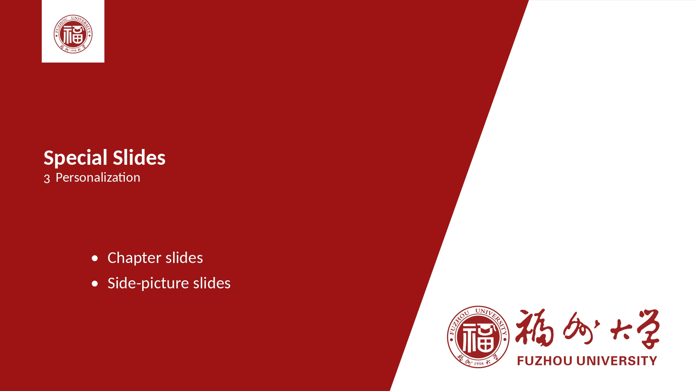

# 福州大学计算机与大数据学院 毕业设计

[TOC]

## 毕业设计提交材料

> [关于做好2025届本科生毕业设计（论文）工作的通知](https://jwch.fzu.edu.cn/content.jsp?urltype=news.NewsContentUrl&wbtreeid=1039&wbnewsid=13791) 附件含材料

毕业设计（论文）按顺序分成两本装订。

- 第一本的内容和装订顺序为：封面、毕业设计（论文）诚信承诺书、中外文摘要（含关键词）、目录、正文、参考文献、附录、谢辞。

- 第二本的内容和装订顺序为：封面、目录、毕业设计（论文）任务书、毕业设计（论文）开题报告、文献综述、外文原文及其译文、毕业设计（论文）中期检查表、指导教师评审表、评阅教师评审表、决议书。

- 封面内容严格按照学校提供的格式和要求填写，封面颜色统一以学院为单位自行选用

### 材料注意事项

教务处系统提交(电子版, pdf)需要加上自己和指导老师的**电子签名**, 同时打印的纸质版要**删除电子签名**, 改为手签

- 我使用了Adobe Acrobat, 打印前统一对pdf进行编辑删除签名, 方便快捷防乱格式!

### 2025.05.26 (答辩后通知)

> [计算机与大数据学院本科生毕业设计纸质版归档说明2025.5.26](./毕设要求整理.assets/计算机与大数据学院本科生毕业设计纸质版归档说明2025.5.26.pdf)

#### 一、学生毕业设计（论文）专用资料袋的材料清单

1. **福州大学本科生毕业设计(论文)**  
2. **福州大学本科生毕业设计(论文)附件**  
3. 指导教师成绩评审表（找指导老师领取）  
4. 评阅教师成绩评审表（找指导老师领取）  
5. 答辩委员会决议书（找指导老师领取）  
6. 毕业设计（论文）简洁版检测报告单  
   - 要求：**答辩后终稿的检测报告**，需导师签字确认并附签字日期  
7. **光盘**  (可用U盘代替)
   - 内容：含毕业设计（论文）、论文附件、查重报告、代码、**毕业实习材料**  
   - 标注：光盘上写清学号和姓名  

---

#### 二、毕业设计（论文）资料的填写及装订说明

1. **填写规范**  
   - 资料填写需工整，封面整洁，手写部分使用黑色或蓝黑墨水  
   - **纸质存档材料中的签名需手写签名**  

2. **装订要求（分两本胶装）**  
   - **第一本内容及顺序**：①封面 ②毕业设计（论文）诚信承诺书 ③中外文摘要（含关键词） ④目录 ⑤正文 ⑥参考文献 ⑦附录 ⑧谢辞
   - **第二本内容及顺序**：①封面 ②目录 ③福州大学本科生毕业设计(论文)任务书 ④毕业设计（论文）开题报告 ⑤文献综述 ⑥外文原文及其译文 ⑦毕业设计（论文）中期检查表
   - **封面(胶封)格式**：  
     - 使用学校提供的统一模板  
     - 封面颜色为白色  

3. **论文题目一致性**  
   - 材料中的论文题目需与学院及教务处系统中的题目完全一致  

4. **二辩或优辩学生材料**  
   - 归档时使用对应的二辩/优辩决议书  

5. **资料袋标注要求**  
   - **资料袋底部**：写明学号、姓名、指导老师姓名、论文题目  
   - **封面标注**：将材料清单粘贴或手写在资料袋封面  
   - **光盘标注**：写明学号和姓名  

---

## 时间点

### 2025届毕业设计时间点参考

0. 毕设开始时间 (2月24日)

1. 任务书 (2月24日 ~ 5月24日)

2. 开题报告 (3月15日之前)

3. 外文翻译 (中期检查之前)

4. 文献综述 (中期检查之前)

5. 中期检查表 (3月25日至4月1日)

6. 论文答辩前定稿审查时间 (5月20日 ~ 5月22日)

7. 指导老师评阅时间 (5月23日)

8. 评阅教师评语时间 (5月24日)

9. 终稿备查时间 (答辩后 ~ 6月2日)

10. 毕业论文封面 (6月1日 ~ 6月2日)

---

因为评估需要，任务书中毕业设计（论文）过程指导记录不要写太少，以下时间点供参考，各位老师可根据自己实际指导时间微调，不必完全相同：

| 时间      | 指导内容                   |
| :-------- | :------------------------- |
| 2025.2.24 | 给定选题方向               |
| 2025.3.1  | 明确选题工作               |
| 2025.3.12 | 开题报告修改、明确重点     |
| 2025.3.19 | 外文翻译修改、审核         |
| 2025.3.22 | 文献阅读指导               |
| 2025.3.24 | 文献综述修改、审核         |
| 2025.3.27 | 毕业论文重难点讨论         |
| 2025.4.1  | 中期检查、明确毕业论文进度 |
| 2025.4.9  | 毕业论文重难点讨论         |
| 2025.4.16 | 毕设重难点讨论             |
| 2025.4.30 | 毕业论文进度、创新点讨论   |
| 2025.5.7  | 毕业论文文档架构修改       |
| 2025.5.13 | 毕业论文文档撰写           |
| 2025.5.17 | 毕业论文文档修改           |
| 2025.5.21 | 毕业论文文档定稿           |

### 2025届毕设各个ddl

| 初步时间安排     | 毕业设计环节                             | 备注                                                         |
| ---------------- | ---------------------------------------- | ------------------------------------------------------------ |
| 2025.3.14        | 各系报送毕设选题、选题来源情况表         | 校外毕业设计指导教师汇总表需严格审查（参照2025毕设工作通知要求） |
| 2025.3.21        | 汇总全院毕设选题，各系交叉互审选题       | 确保学生一人一题                                             |
| 2025.3.25        | 毕业设计中期检查、各系报送自查总结       | 学校要求3月23日前完成                                        |
| 2025.4.30        | 学生论文定稿、确定抽审名单               | 学校4月中下旬发布抽审细则                                    |
| **2025.5.5-5.6** | **抽审学生论文查重**                     | **查重检测和AIGC检测≤20%**                                   |
| 2025.5.7         | 各系开始安排抽审论文送审                 | 预计给专家10天左右评审时间                                   |
| 2025.5.9         | 各系报送答辩安排                         | 学校要求5月9日上报                                           |
| 2025.5.17-5.21   | 整理抽审意见、反馈、复审事宜、上报       | 学校要求6月10日上报抽检情况表；抽审问题论文若在答辩前复审通过可参加一辩，否则进入二辩 |
| **2025.5.21**    | **非抽审学生论文查重**                   | **查重检测和AIGC检测≤20%**                                   |
| 2025.5.22-5.27   | 各系一辩                                 | -                                                            |
| 2025.5.30        | 各系二辩                                 | 6月3日前必须录入毕设成绩                                     |
| 2025.6.6         | 上报校核优材料、抽检情况表、抽检论文     | 学校要求6月10日上报                                          |
| 2025.6.15        | 报送毕业设计情况登记表、汇总表及工作总结 | 学校要求6月27日上报                                          |

### 2025年05月12日 通知

各位老师好，2025届教务处系统本科毕业论文模块填写相关通知如下：

1. 已经通知所有2025年做毕业设计（论文）的学生5月12日起进入毕设模块，按系统要求在毕设模块中填写毕业论文信息，上传**任务书、外文原文及其译文、文献综述、开题报告和中期检查表**。学生最迟**5月18日**完成以上项目的填写和上传。学生填写、上传完后请导师尽快进教务处系统审核。
2. 各校采集后的论文信息将作为学位授予信息的一部分，同步上报教育部学位管理平台，供学生和社会查询、验证。待校学位评定委员会审议通过，教务处即直接以系统数据为准上报，不再组织学院进行复核。为此，请全体指导教师务必认真审核系统所填各项内容，确保相关信息准确无误。
3. 学生填写的毕业论文题目须和导师报送到学院的选题一致，论文题目参见附件1。导师审核学生论文题目时，如果发现学生选题与报送给学院的不一致，请通知学生撤回修改，修改后一致后再审核通过。
4. 本系毕业设计（论文）各阶段时间参见附件2。
5. **毕业论文定稿和终稿、附件材料、过程指导材料暂不上传**。填写上传时间另行通知。

## 论文

> 第一本的内容和装订顺序为：封面、毕业设计（论文）诚信承诺书、中外文摘要（含关键词）、目录、正文、参考文献、附录、谢辞。
>
> 第二本的内容和装订顺序为：封面、目录、毕业设计（论文）任务书、毕业设计（论文）开题报告、文献综述、外文原文及其译文、毕业设计（论文）中期检查表、指导教师评审表、评阅教师评审表、决议书。

**文献综述、外文原文及其译文**

- 封面参考毕设封面, 删除`校内指导老师`, `校外指导老师`两行
- 格式要求可能没有论文正文要求那么严谨

**毕设设计(论文)**

- 记得加上承诺书

### 福州大学本科生毕业设计（论文）$\LaTeX$ 模板

> [福州大学本科生毕业设计（论文）$\LaTeX$ 模板](https://github.com/yJader/FZU-Undergraduate-Thesis)

我使用LaTeX对照学校word版本封面, 复刻了一个封面, 并根据对照论文格式要求修改了模板

优势👍:

- 专注于论文内容撰写, 无须担心格式要求(尤其是引用格式)
- **文献综述、外文原文及其译文、毕设设计(论文)**都可以直接在latex上修改, 导出pdf, 并提交

劣势👎:

- latex语法格式较为奇怪, 如果需要对模板进行diy修改, 门槛较高
  - 但latex是纯文本的标记型语言, 如果对格式和语法有任何不熟悉的, 可以较为方便地使用LLM来解决
  - **请注意遵守福州大学[《本科生毕业设计（论文）规范使用AI工具的规定》](https://jwch.fzu.edu.cn/content.jsp?urltype=news.NewsContentUrl&wbtreeid=1039&wbnewsid=14075)**

## 答辩相关

1. **演讲**
   - 时长控制在7min, 做好老师只给你5min甚至3min的准备
   - background简短概括, 主要介绍自己的工作

2. **提问**
   - 如果做的是ai相关, 做好被拷打的准备
     如: 是否有去了解xx模型, 为什么不使用xx模型, 数据集来源等
   - 基本必问**论文格式**
     - 后注: LaTeX模板制作的论文被老师评价格式比较规范了, 嘻嘻
3. 有**演示**环节, 做好准备

### 基于sintef主题的福州大学LaTeX幻灯片模板

未来可能要接着折腾LaTeX的同学可以试着用beamer+神奇的LLM辅助来制作slides

这里有自制的[福大版sintef主题beamer模板](https://github.com/yJader/FZU-SINTEF-Beamer-Template)

  
  

  
  

  
  

  

- 自制的[pdf转pptx(命令行)工具](https://github.com/yJader/pdf2pptx), 可以将pdf注释保存为pptx的备注, 以支持演讲者模式
  - 答辩后记录: 大概率不能用演讲者视图, 上述的命令行工具大概是只能吃灰了

## 一些工具

引用

- <http://citebay.com/how-to-cite>
- <https://scholar.google.hk/schhp?hl=zh-CN>

AIGC

- speed.ai
- 只要用`(1)概述: 一两行说明` 这样的格式就大概率会被aigc
