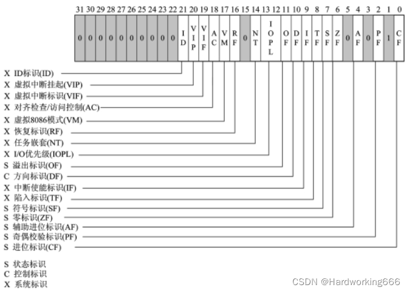

## 一. 基础

### 1.1 基本格式

```assembly
.data


...
;use to set data用来设定数据
;like the early c,data only allow to be signed on the front of file像早期的c语言一样，数据只能在最前面被定义
--------------------------------------------
.code
main PROC
...

main ENDP
end main
;file ignore words after"end main"文件忽略在end main后面的所有语句
;must include "main PROC"代码段必须使用main PROC（就像c语言要有主函数一样）
--------------------------------------------
.stack(可以不标)
;系统自动生成

```

### 1.2 主要寄存器

1. 通用寄存器

| 寄存器名称 | 中英文含义                                | 作用                                                                                                                                                                                      |
| ---------- | ----------------------------------------- | ----------------------------------------------------------------------------------------------------------------------------------------------------------------------------------------- |
| EAX        | 累加器 Accumulator                        | (针对操作数和结果数据的)累加器，一般用于运算，另外还多用于函数返回值中，用于保存返回值                                                                                                    |
| EBX        | 基址寄存器 Base Address Register          | (DS 段中的数据指针)基址寄存器, 常用于存放存储器地址, 便于变量                                                                                                                             |
| ECX        | 计数器 Counter                            | (字符串和循环操作的)计数器，如在循环命令 LOOP 中，ecx 用来循环计数，每执行一次 loop，ecx 减 1                                                                                             |
| EDX        | 源变址寄存器                              | （I/O 指针）计数器, 乘除指令中用作辅助累加器                                                                                                                                              |
| ESI        | 源变址寄存器 Source Index Register        | （字符串操作源指针）源变址寄存器                                                                                                                                                          |
| EDI        | 目的变址寄存器 Destination Index Register | （字符串操作目标指针）目的变址寄存器，EDI 和 ESI 多与特定指令，如 LODS/STOS/REP/MOVS 等一起使用，主要用于内存的复制。                                                                     |
|            |                                           |                                                                                                                                                                                           |
| EBP        | 基址指针寄存器 Base Pointer Register      | （SS 段中栈内数据指针）扩展基址指针寄存器，表示栈区域的基地址<br>在函数被调用时保存 ESP 的值，函数返回时再把值重新返回给 ESP，保证栈不会崩溃，这称为<font color='#66ccff'>栈帧技术</font> |
| ESP        | 堆栈指针寄存器 Stack Pointer Register     | （SS 段中栈指针）栈指针寄存器，指示栈区域的栈顶地址，PUSH/POP/CALL/RET 等指令可以直接用来操作 ESP                                                                                         |

2. 指令指针寄存器 <font color='#66ccff'>EIP</font>
   - 32 位指令指针寄存器(EIP)存放指令指针，即当前代码段中将被执行的下一条指令的线性地址偏移
   - 程序运行时，CPU 根据 CS 段寄存器和 EIP 寄存器中的地址偏移读取下一条指令，将指令传送到指令缓冲区，并将 EIP 寄存器的值自增，增大的大小即被读取指令的字节数。
   - EIP 寄存器的值一般不能直接修改，EIP 寄存器的更改有两种途径：一是通过特殊的跳转和调用/返回指令 JMP、Jcc、CALL、RET 等；二是通过中断或异常进行修改。
3. 标志寄存器 <font color='#66ccff'>EFlAGS</font>
   - IA-32 中标志寄存器的名称为 EFLAGS，其大小为 4 个字节(32 位)，由原来的 16 位 FLAGS 寄存器**扩展**而来。
     EFLAGS 寄存器的每位都有意义，每位的值或为 1 或为 0，代表 On/Off 或 True/False。
     其中有些位由系统直接设定，有些位则根据程序命令的执行结果设置。
   - 32 位的 EFLAGS 寄存器用于存储算数操作符状态或其他执行状态。该寄存器中的各个位表示不同的标识，包括一组状态标识、一个控制标识和一组系统标识。EFLAGS 寄存器中的标识主要用于实现条件分支。
     其中,与程序调试相关的状态标识包括:零标识(ZF),溢出标识(OF),进位标识(CF)和符号标识(SF)。各标识的具体含义如下:
     1. 零标识(ZF)。若算数或逻辑运算结果为 0,则 ZF 值为 1,否则 ZF 值为 0。
     2. 溢出标识(OF)。有符号整数溢出时,OF 置为 1;最高有效位(MSB)改变时,OF 置为 1。
     3. 进位标识(CF)。无符号整数溢出时,CF 置为 1。
     4. 符号标识(SF)。等于运算结果的最高位(即有符号整数的符号位);0 表示正数, 1 表示负数。
     5. 方向标识(DF)。另一个需要注意的标识是控制标识(DF),该标识位为方向标识,用于控制串处理指令处理信息的方向。当 DF 为 1 时,每次操作后使变址寄存器 ESI 和 EDI 减小,这样就使串处理从高地址向低地址方向处理;当 DF 为 0 时,处理方向相反。DF 标识由 STD 指令置位,由 CLD 指令清除。
     6. 陷阱标识(TF)和中断允许标识(IF)。它们是与中断和异常相关的标识位。如果 TF 标识位置为 1,CPU 将在执行完每条指令后产生单步中断,调试器使用该特性在调试程序时进行单步执行,该标识位还可用于检查调试器是否正常运行如果 IF 位置位,则 CPU 在收到中断请求后,应该对中断请求进行响应处理。
   - EFLAGS 寄存器中的标识位及其功能：

### 1.3 函数

1. 和 c 语言的函数类似，但是汇编的函数有以下要求

   1. 不能进行传参

   2. 无返回参数

2. 定义函数的格式

   ```assembly
   functionname PROC
   	.....
   	ret;一定要有
   functionname ENDP
   ```

   - 可以看出在基本格式中的 code 段的 main 也是函数

3. 函数的调用

   ```assembly
   CALL fuctionname
   ```

4. 函数与栈的关系：在用 call 指令的时候，将 call 所在语句的地址压入栈，遇到 ret 语句时候，取回地址跳回原位继续向下执行
   - `CALL fname` ↔ ① `push next` ②`jmp fname`

## 二. 常用指令

### 运算符号

~~没学会下次再写~~

### 注释 `；`

相当于 c 语言的/ 用来表示后面的内容不编译，忽视

```assembly
xxxxx;后面随便写点啥都行
```

### 标号符

标号是程序的目标标志,总是和某地址相联系,供转移或循环指令控制转移使用.

```assembly
L0:xxxxxx

......

L1:xxxxxx
```

可以联想为 c 语言的 goto 语句来使用（虽然 c 的 goto 用的不多 XD）

### 数据定义伪指令

通过数据定义语句可以为数据项分配存储单元，并设置初值。代表数据项的标识符称为变量名。

| 指令 |                                       意义                                        |
| ---- | :-------------------------------------------------------------------------------: |
| DB   | 单字节类型，占用**8 位**或**1 个字节**的数据，可以存储无符号整数、字符或其他数据  |
| DW   | 双字节类型, 占用**16 位**或**2 个字节**的数据，可以存储无符号整数、地址或其他数据 |
| DD   |  双字类型, 占用**32 位**或**4 个字节**的数据，可以存储无符号整数、地址或其他数据  |
| DQ   | 四字类型, 占用**64 位**或**8 个字节**的数据，可以存储无符号整数、地址或其他数据。 |
| DT   |       十字节型, 占用**80 位**或**10 个字节**的数据，可以存储实数或其他数据        |
| DS   |              由多个连续的字节组成的一组数据，可以存储文本或其他数据               |

#### 数值表达式

表达式结果是确定的数值，用于初始化内存单元

```assembly
data dd 2;定义数字林子青
```

#### ?数据项

若定义的变量处置不确定可以用“？”表示，这是分配一个与类型匹配的存储单元，用于保留内存单元

```
data1 dd ?;定义未知变量
```

#### 字符串

以 ASCII 码值得形式存放在存储区中，每个字符占据一个存储单元

```
data2 dd "ac";定义未知变量
```

#### 重复定义

用 n DUP (表达式)与数据定义伪指令搭配使用
dup 可以嵌套使用

```
data3 dd 10 dup (2);定义十个2
data3 dd 10 dup (2，dup (?));分配20个空间给data3
```

### mov

mov A,B。将 B 的值传给 A，B 可以是一个数值，也可以用 offset 来取相对地址

```assembly
mov eax,b;将b的值移动进eax中
move esi,offset arr;将arr的地址移入esi中
```

可执行操作

- **寄存器到寄存器：** 可以将一个寄存器的值移动到另一个寄存器中，例如 `mov ax, bx`。
- **立即数到寄存器：** 可以将一个立即数（常数）移动到寄存器中，例如 `mov ax, 10`。
- **内存到寄存器：** 可以将内存中的数据移动到寄存器中，例如 `mov ax, [bx]`。
- **寄存器到内存：** 可以将寄存器的值移动到内存中，例如 `mov [bx], ax`。
- **立即数到内存：** 可以将一个立即数移动到内存中，例如 `mov byte ptr [bx], 10`。
  - 需要指定大小
- **段寄存器：** 在一些情况下，可以使用`mov`指令将数据移动到段寄存器。

限制

- **不能直接将数据从内存移动到内存：** `mov` 指令通常不能直接从一个内存位置移动数据到另一个内存位置。例如，`mov [dest], [source]` 是不合法的。
- **不能将数据直接从立即数移动到立即数：** `mov` 指令通常不能直接将一个立即数（常数）移动到另一个立即数。例如，`mov 10, 20` 是不合法的。
- **大小不匹配：** `mov` 指令要求源和目标的操作数大小必须匹配。例如，不能直接将一个字（16 位）从一个寄存器移动到一个双字（32 位）的寄存器中，除非使用适当的操作数大小前缀。
- **特殊寄存器的限制：** 一些特殊的寄存器，如标志寄存器（flags），在一些情况下可能有限制。例如，在一些保护模式下，某些标志只能由特权级更高的代码修改。
- **段寄存器的限制：** 在保护模式下，`mov` 指令对于一些段寄存器的使用可能受到一些限制，特别是在用户模式下。

### cmp

```
cmp A,B
```

对 A,B 的值进行比较，相当于是一个隐藏减法，不改变任何的值
底层原理是设定一个 flag=A-B，一般与后续的条件一起使用
只能比较整数，字母值，不能比较小数

### jmp

无跳转跳转，类比于 c 的(while 1)多用于进行循环结构

```
	jmp L0
L0:
	...
```

### 条件转移

对于有符号数，使用有符号数的条件转移判断式，对于无条件数使用无符号数的条件转移判断式，都是 jump+if+xxx 的缩写，很好记

#### 无符号数

> b--below a--above e--equal n--not

- ja 大于跳转
- jae 大等于跳转
- jb 小于跳转
- jbe 小等于跳转
- je 等于跳转
- jna 不大于跳转
- jne 不等于跳转
- jnb 不小于跳转

#### 有符号数

> l--less g--greater e--equal n--not

- jg 大于跳转
- jge 大等于跳转
- jl 小于跳转
- jle 小等于跳转
- je 等于跳转
- jne,jng,jnl......

```assembly
	cmp a,b ; flag=a-b
	jge L0 ; flag>=0时，jump到L0
	...
L0:
	...
```

## 栈

~~没教完~~

# 第四章 指令系统

## 4.1 数据传送指令

1. 实现: 存储器 ↔ 寄存器 ↔I/O

   

2. 四种传送指令

   - 通用数据传送
   - 目标地址传送
   - 标志传送
   - 输入输出

### 4.1.1 通用数据传送指令

#### MOV dest，src

1. 传送的是字节、字或双字

   具体来说可实现：

   ```assembly
   MOV mem/reg1，mem/reg2
   MOV reg，data ;立即数送寄存器
   MOV mem，data ;立即数送存储单元
   MOV segreg，mem/reg ;存储单元/寄存器送段寄存器
   MOV mem/reg，segreg ;段寄存器送存储元/寄存器
   ```

   - 注意 : 指令中两操作数中至少有一个为寄存器

     ```assembly
     MOV CL，DL
     MOV AX，BX
     MOV [ESI]，CX
     MOV CL，[EBX+5]
     MOV EAX,DWORD PTR [ESI]
     ```

     - 存储器 ← 存储器：

       ```assembly
       MOV EAX，MEM1
       MOV MEM2，EAX
       ```

       需要一个寄存器作为中介

   - `MOV EAX, [EBX+ECX*4]`
     把 DS 段中有效地址为：`(EBX)＋(ECX)*4 `存储单元的**内容**送给 EAX 寄存器

2. MOV 指令使用规则：
   1. EIP 不能作目的寄存器
   2. 不允许`mem←mem` (需要用寄存器作为中转)
   3. 不允许`segreg←segreg`
      - 因为`mov segreg, segreg` 只是把一个段寄存器的值复制到另一个段寄存器，而不改变内存中的内容，所以它没有实际的作用
   4. 目的操作数不允许是立即数，也不允许是 CS 寄存器
   5. 不允许`segreg←立即数`
      - mov 指令的规则
   6. 源操作数与目的操作数类型要一致

#### MOVSX 带符号扩展传送指令

1. 格式：MOVSX dest，src；

2. 操作：（dest）← 符号扩展（src）

   - 两种格式：

     ```assembly
     MOVSX reg1, reg2
     MOVSX reg, mem
     ```

3. 注意：源操作数可以是 8 位或 16 位，而目的操作数必须是 16 或 32 位。

### 2.1.4 PUSH 入栈指令

1. 格式：`PUSH SRC`

2. 执行操作：
   (ESP) ←(ESP)-4
   ((ESP)+3, (ESP)+2, (ESP)+1,(ESP)) ←(SRC)

3. 几种用法：

   ```assembly
   PUSH reg ; 寄存器
   PUSH mem ; 内存变量
   PUSH data ; 8086不允许使用立即数寻址方式

   pusha ; push全部寄存器
   ```

### 2.1.5 POP 出栈指令

1. 格式 `POP DST`

2. 执行操作 :

   (DST) ←((ESP)+3, (ESP)+2, (ESP)+1,(ESP))

   (ESP) ←(ESP)+4

3. 几种用法

   ```assembly
   POP reg ; 寄存器
   POP mem ; 内存变量

   popa ; pop全部寄存器
   ```

### 2.1.7 XCHG 交换指令

格式：XCHG reg，mem/reg
操作：交换两操作数的内容。
要求：

- 两操作数中必须有一个在寄存器中；
- 操作数不能为段寄存器和立即数；
- 源和目地操作数类型要一致。
- 该指令允许除立即数以外的任何寻址方式。
  举例： XCHG BX, [EBP+ESI] ; (BX) (EA)
  XCHG AL, BH ; (AL) (BH)

### 地址传送指令

共有六种:

1. 格式：

   ```assembly
   LEA reg, mem ; 有效地址送寄存器指令, 相当于 mov reg, offset mem
   ```

2. 下面五个是指针送寄存器和段寄存器指令

   ```assembly
   LDS reg, mem32; DS: reg←(mem开始的四个内存单元)

   LES reg, mem32; ES: reg←(mem开始的四个内存单元)

   LFS reg, mem32; FS:reg←(mem开始的四个内存单元)

   LGS reg, mem32; GS:reg←(mem开始的四个内存单元)

   LSS reg, mem32; SS:reg←(mem开始的四个内存单元)
   ```

## 4.2 算术运算指令

- 两种类型数据:
  - 无符号数
  - 有符号数
- 加减法指令，无符号和有符号数采用同一套指令。
- 注意：
  - 操作数必须都是无符号数或都是有符号数。
  - 使用不同的标志位来检查无符号数和有符号数的运算结果是否溢出。

### 4.2.1 加法指令

#### 一. 不带进位的加法指令 ADD

1. 格式：

   ```assembly
   ADD mem/reg, data
   ADD mem/reg1 ,mem/reg2 ;不能同时是存储器
   ```

2. 例：

   ```assembly
   ADD AL，30H
   ADD AX，[EBX+20H]
   ADD CX，SI
   ADD [EDI]，200H
   ```

   ADD 指令对标志位（指状态标志）都有影响。

3. 例：`ADD DX, 0F0F0H`

   - 执行前：[DX]=4652H

     

   - 执行后：
     `(DX)＝3742H，ZF=0，SF=0，CF=1，OF=0`
     结果正确。

#### 二. 带进位的加法指令 ADC

- ADC 指令在形式上和功能上都有与 ADD 类似，只是相加时还要包括进位标志 CF 的内容，例如：

  ```assembly
  ADC AL，68H ;AL←(AL)+68H+(CF)
  ADC AX，CX ;AX←(AX)+(CX)+(CF)
  ```

- ADC 指令主要用于多字节加法运算中

##### ADD/ADC 对条件标志位(CF/OF/ZF/SF)的影响

- CF 位表示无符号数相加的溢出。
- OF 位表示带符号数相加的溢出。
  $$
  1 结果为负
  0 否则
  SF= 1 结果为0
  0 否则
  ZF=
  1 和的最高有效位有向高位的进位
  0 否则
  CF=
  1 两个操作数符号相同，而结果符号与之相反
  0 否则
  OF=
  $$

#### 三. 加 1 指令 INC

1. 格式：INC reg/mem

2. 功能：类似于 C 语言中的++操作：对指定的操作数加 1

3. 例：

   ```assembly
   INC AL ；(AL) ← (AL)+1
   INC SI
   ```

4. 注：本指令不影响 CF 标志
   - 不影响循环

### 4.2.2 减法指令

#### 一. 不考虑借位的减法指令 SUB

1. 格式： SUB dest, src

2. 执行操作: (dest)←(dest) - (src)

3. 注意：

   1. 源和目的操作数不能同时为存储器操作数
   2. 立即数不能作为目的操作数

4. 例：

   ```assembly
   SUB AL，60H
   SUB [EBX+20H]，DX
   SUB AX，CX
   ```

#### 二. 考虑借位的减法指令 SBB

SBB 指令主要用于多字节的减法。
格式： SBB dest, src
操作： (dest)←(dest)-(src)-(CF)
例：
SBB AX，CX
SBB [ESI]，DX

#### 三. 减 1 指令 DEC

作用类似于 C 语言中的－－操作符。
格式：DEC opr
操作： (opr)←(opr)-1
指令例子：
DEC CL
DEC SI

### 4.2.3 除法指令

1. 无符号数除法指令： `DIV SRC`
2. 带符号数除法指令： `IDIV SRC`
3. 执行操作：
   - 字节操作
     - (AL) ← (AX) / (SRC) 的商
     - (AH) ← (AX) / (SRC) 的余数
   - 字操作
     - (AX) ← (DX, AX) / (SRC) 的商
     - (DX) ← (DX, AX) / (SRC) 的余数
   - 双字操作
     - (EAX) ← (EDX, EAX) / (SRC) 的商
     - (EDX) ← (EDX, EAX) / (SRC) 的==余数==
     - 进行除法前要对 EDX 赋初值

## 4.3 逻辑运算指令

1. 逻辑非指令：NOT OPR (OPR 不能为立即数)

   执行操作： (OPR) ← ¬ (OPR) (不影响标志位)

   - NOT 不允许使用立即数，其他 4 条指令除非源操作数可以是立即数，至少有一个操作数必须存放在寄存器，另一个操作数可
     以是任何寻址方式。

2. 逻辑与指令：AND DST, SRC

   执行操作： (DST) ← (DST) ∧ (SRC)

3. 逻辑或指令：OR DST, SRC

   执行操作： (DST) ← (DST) ∨ (SRC)

4. 异或指令： XOR DST, SRC

   执行操作： (DST) ← (DST) ⊕ (SRC)

5. 测试指令： TEST OPR1, OPR2

   执行操作： (OPR1)  (OPR2)

## 4.4 移位指令

1. 逻辑左移 `SHL OPR, CNT`

   

2. 逻辑右移 `SHR OPR, CNT`

   

3. 算术左移 `SAL OPR, CNT`

   - 同逻辑左移, 都是在末尾补 0

4. 算术右移 `SAR OPR, CNT`

   

5. 循环左移 `ROL OPR, CNT`

   

6. 循环右移 `ROR OPR, CNT`

   

7. 带进位循环左移 `RCL OPR, CNT`

   

8. 带进位循环右移 `RCR OPR, CNT`

   

## 4.5 串处理指令

- 串处理指令 : MOVS、 STOS、 LODS 、 CMPS、 SCAS
- 设置方向标志指令 : CLD、STD
- 串重复前缀 : REP、 REPE / REPZ、 REPNE / REPNZ

### MOVS 串传送指令

1. 四种格式
   - MOVS
   - MOVSB （字节）
   - MOVSW （字）
   - MOVSD （双字）
2. 例：MOVS ES: BYTE PTR [EDI], DS: [ESI]
3. 执行操作：

4. ((EDI)) ← ((ESI))
5. 字节操作：(ESI)←(ESI)±1, (EDI)←(EDI)±1
6. 字操作： (ESI)←(ESI)±2, (EDI)←(EDI)±2
7. 方向标志 DF=0 时用 + ，DF=1 时用 -

8. 执行 REP MOVS 之前，应先准备：

   1. 源串首地址（末地址）→ ESI

   2. 目的串首地址（末地址）→ EDI

   3. 串长度 → ECX

   4. 建立方向标志

      - CLD 使 DF=0

      - STD 使 DF=1

### STOS 存入串指令

1. 格式：

   - STOS DST
   - STOSB （字节）
   - STOSW （字）
   - STOSD （双字）

2. 执行操作：

   - 字节操作：((EDI))←(AL), (EDI)←(EDI)±1
   - 字操作： ((EDI))←(AX), (EDI)←(EDI)±2
   - 双字操作： ((EDI))←(EAX), (EDI)←(EDI)±4

   - 不影响条件标志位

### LODS 从串取指令

格式：
LODS SRC
LODSB （字节）
LODSW （字）
LODSD （双字）
执行操作：
字节操作：(AL)←((ESI)), (ESI)←(ESI)±1
字操作： (AX)←((ESI)), (ESI)←(ESI)±2
注意:

- LODS 指令一般不与 REP 联用
- 源串一般在数据段中（允许使用段跨越前缀来修改），
  目的串必须在附加段中
- 不影响条件标志位

### CMPS 串比较指令

1. 格式：
   - CMPS SRC, DST
   - CMPSB （字节）
   - CMPSW （字）
   - CMPSD （双字）
2. 执行操作：

1) ((ESI)) - ((EDI))
   - 根据比较结果置条件标志位：相等 ZF=1; 不等 ZF=0
2) 字节操作：(ESI)←(ESI)±1, (EDI)←(EDI)±1
   字操作： (ESI)←(ESI)±2, (EDI)←(EDI)±2

## 4.6 控制转移指令

- 无条件转移指令 JMP
- 条件转移指令
  JZ / JNZ 、 JE / JNE、 JS / JNS、 JO / JNO、
  JP / JNP、 JB / JNB、 JL / JNL、 JBE / JNBE、
  JLE / JNLE、 JCXZ jecxz
- 循环指令
  LOOP、LOOPZ / LOOPE、LOOPNZ / LOOPNE
- 子程序调用和返回指令
  CALL、RET
- 中断与中断返回指令
  INT、INTO、IRET

## 汇编器使用

1. 有时在 cmp 两个内存变量时, 报错会报成 end main

# 一些模板

1. 函数模板

   - void

     ```assembly
     myFun PROC 	;; void myFun(int* arr, int n) input:<----入栈顺序
     			;; return:void
     ; [ebp+4]: 调用函数位置的地址
     ; [ebp+8]: arr
     ; [ebp+12]: n
     	push ebp ; 暂存栈底寄存器
     	mov	ebp, esp ; 修改栈底, 创建一个"栈帧"
     	pushad ; 存放所有寄存器

     	... ; 代码段

     	popad ; 恢复所有寄存器
     	pop	ebp ; 恢复栈底寄存器
     	ret	8 ; 返回原函数, 并pop8字节(去除栈中的arr和n)
     	;; 也就是 传入2个4字节参数, 此时就ret 2*4(8)
     myFun ENDP
     ```

   - 有返回值

     ```assembly
     myFun PROC 	;; myFun(int* arr, int n) input:<----入栈顺序
     			;; return:eax
     ; [ebp+4]: 调用函数位置的地址
     ; [ebp+8]: arr
     ; [ebp+12]: n
     	push ebp ; 暂存栈底寄存器
     	mov	ebp, esp ; 修改栈底, 创建一个"栈帧"
     	sub esp, 4 ; 为返回值预留4个字节
     	pushad ; 存放所有寄存器

     	... ; 代码段

     	mov [ebp-4], eax ; 暂存返回值
     	popad ; 恢复所有寄存器
     	mov eax, [ebp-4] ; 保存返回值到eax
     	add esp, 4 ; 去除预留个4字节
     	pop	ebp ; 恢复栈底寄存器
     	ret	8 ; 返回原函数, 并pop8字节(去除栈中的arr和n)
     	;; 也就是 传入2个4字节参数, 此时就ret 2*4(8)
     myFun ENDP
     ```

### 第二季 接口设计!

写入读出信号

- `IN` : 读数据, $~RD$置为低
- # `OUT`: 写数据,

# 第二季 接口设计!

## 常用芯片

| 芯片型号  | 作用          |
| --------- | ------------- |
| 8086      | 主控          |
| 8255      | I/O           |
| 8253/8254 | 计时计数      |
| 0832      | DAC(数模转换) |
| 0809      | ADC(模数转换) |
| 8259      | 中断          |

写入读出信号

- `IN` : 读数据, $\overline {RD}$置为低
- `OUT`: 写数据, $\overline {WR}$置为低

## 综合应用设计

某养殖场需要监控系统以监控池塘水质量，该系统能监测水体富营养化程度、 以及水位高低，并根据监测结果，做出 增强或减弱除污设备、打开或关闭进出 水管道阀门等相应操作以保障池塘水质量

由养殖场水质量监控系统需求，可知系统包含功能：

- 周期性采样水体中富营养化程度
  - 使用传感器实时感知水体中富营养物质的浓度，将感知所得浓度转化为电压
- 周期性采样水体水位高低
  - 使用传感器实时感知水体水位，将感知所得到水位高低转化为电压
- 周期性输出控制信号
  - 根据采集数据，按照一定策略： a) 输出信号控制去污设备 b) 输出信号控制管道进出水阀门


基于中断的系统软件体系结构

```assembly
START:
	call Init_Interfaces 	; 初始化其他接口
	call SetINTVectors 	 	; 设置中断向量表
	sti 					; 开中断
NEXT:
	hlt ; 处理器进入休眠, 等待中断
    jmp again
    hlt
```

### 输入输出锁存 8282/8286


### 模数转换 ADC 0809


```assembly
;;; sample0809(DX: PORT_0809_INx)
sample0809 proc
    push dx

    out dx, al ; 启动0809对应端口
    ; 检测EOC
readeoc:
    MOV DX, PORT_0809_EOC
    IN  AL, DX          ; 读入EOC的值(高/低)
    test AL, 01H
    JE readeoc          ; EOC还为高

    ; 读出结果, 存入al
    mov dx, PORT_0809_OE
    in al, dx

    pop dx
    ret
sample0809 endp
```

### 数模转换 DAC 0832


```assembly
; 直接输出即可
mov al, xxxx
mov dx, PORT_0832
out dx, al
```

### 计时器 8253


- 模式 2

  ```assembly
  init8253 proc
      mov dx, PORT_8253_CTR
      mov al, 00110110b ; 通道0, 16位计数, 方式2, 二进制计数
      out dx, al ; 写入控制字
      mov dx, PORT_8253_T0
      mov ax, 1000 ; 计数值
      out dx, al ; 写入计数初值低8位到通道0
      mov al, ah ; 计数初值高8位
      out dx, al ; 写入计数初值高8位到通道0
      ret
  init8253 endp
  ```

- 用来定时发出中断, 转到 ADC

### 中断控制 8259


**同一端口如何区分 ICW 和 OCW**

用 A0 奇偶地址位区分

- ICW1 必须写入偶地址端口（A0=0, PA0_8259）
- ICW2 必须写入奇地址端口（A0=1, PA1_8259）

- ICW3 只有在 ICW1 中的 SNGL=0, 即开启级联时写入
- ICW4 只有在 ICW1 中 IC4=1 时才写入

ICW1 写入偶地址端口，2、3 写入奇地址端口
ICW 写完后继续进入 OCW1、2、3（根据奇偶地址来区分）


```assembly
init8259 proc
    push dx
    mov dx, PORT_8259_A_0
    mov al, 00010011b ; icw1
    out dx, al
    mov dx, PORT_8259_A_1
    mov al, 00111000b ; icw2: 中断类型为56~56+8
    out dx, al
    mov dx, PORT_8259_A_1
    mov al, 00000001b ; icw4
    out dx, al
    pop dx
    ret
init8259 endp

setIntVectors proc
    push dx
    push ds

    xor ax, ax
    mov ds, ax

    mov ax, seg code
    mov SI, 224 ;  4 * 56
    mov word ptr[SI + 2], ax
    mov ax, offset timer0Handler
    mov word ptr[SI], ax

    mov ax, seg code
    mov SI, 4*57 ;
    mov word ptr[SI + 2], ax
    mov ax, offset timer1handler
    mov word ptr[SI], ax

    mov ax, seg code
    mov SI, 4*58
    mov word ptr[SI + 2], ax
    mov ax, offset timer2handler
    mov word ptr[SI], ax

    pop ds
    pop dx
    ret
setIntVectors endp

; 中断结束
send8259EOI proc
    push dx
    mov dx, PORT_8259_A_0
    mov al, 00100000b ; OCW2 = 0010 0000
    out dx, al ; 向8259发送中断结束命令
    pop dx
send8259EOI endp
```
