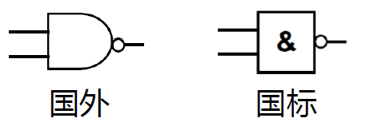

## 测试



## 一些书写习惯

> 仅供参考, 主要是自己好记

### 寄存器

- `ecx `: i
- `edi `: 数组基地址
- `eax` : 尽量不使用, 因为乘除计算时必须使用`eax`, 寄存器冲突不好解决
  - 修改 : `imul 目标操作数, 源操作数` 可以直接对其他寄存器使用乘法,
  - 但是除法的`idiv`没有这么简单
- `ebx`, `edx`, `esi `: 随意

### 比较

- 比较习惯用有符号数的比较 (正如我们高级语言中常使用 int 而非 unsigned int)
  - `l`--less `g`--greater `e`--equal `n`--not
  - 如 `>= → jge`

## 基础模板

### 文件模板

```assembly
include irvine32.inc
.data

.code

    ;主函数
main PROC
  		 ...
         exit
main ENDP
end main

```

### fori

```assembly
   mov ecx, 0 ; ecx:i
again:
       cmp ecx, 8
       jge final
       ... ; 循环体
       inc ecx
       jmp again
final:
```

- 注意不要重复使用寄存器, 如之前使用过 ecx, 可以在循环体前`push ecx`, 循环体后`pop ecx` 来暂存 ecx

```assembly
   mov i, 0
again:
       cmp i, 8
       jge final
       ... ; 循环体
       inc i
       jmp again
final:
```

### fori+forj

```assembly
again_i:
          cmp  i, 8
          jge  final_i

          mov  j, 0
again_j:
          cmp  j, 8
          jge  final_j
          ... ; forj循环体
          inc  j
          jmp  again_j
final_j:

          inc  i
          jmp  again_i
final_i:
```

## 函数模板(空)

### 函数模板–-void

```assembly
myFun PROC 	;; void myFun(int* arr, int n) input:<----函数传参时的的入栈顺序
			;; return:void
; [ebp+4]: 调用函数位置的地址
; [ebp+8]: arr
; [ebp+12]: n
	push ebp ; 暂存栈底寄存器
	mov	ebp, esp ; 修改栈底, 创建一个"栈帧"
	pushad ; 存放所有寄存器

	... ; 代码段

	popad ; 恢复所有寄存器
	pop	ebp ; 恢复栈底寄存器
	ret	8 ; 返回原函数, 并pop8字节(去除栈中的arr和n)
	;; 也就是 传入2个4字节参数, 此时就ret 2*4(8)
myFun ENDP
```

### 函数模板—有返回值

```assembly
myFun PROC 	;; myFun(int* arr, int n) input:<----函数传参时的的入栈顺序
			;; return:eax
; [ebp+4]: 调用函数位置的地址
; [ebp+8]: arr
; [ebp+12]: n
	push ebp ; 暂存栈底寄存器
	mov	ebp, esp ; 修改栈底, 创建一个"栈帧"
	sub esp, 4 ; 为返回值预留4个字节
	pushad ; 存放所有寄存器

	... ; 代码段

	mov [ebp-4], eax ; 暂存返回值
	popad ; 恢复所有寄存器
	mov eax, [ebp-4] ; 保存返回值到eax
	add esp, 4 ; 去除预留个4字节
	pop	ebp ; 恢复栈底寄存器
	ret	8 ; 返回原函数, 并pop8字节(去除栈中的arr和n)
	;; 也就是 传入2个4字节参数, 此时就ret 2*4(8)
myFun ENDP
```

## 常用函数

### 打印数组

```assembly
include irvine32.inc
.data
    arr   dd 1, 2, 3, 4, 5, 6, 7, 8, 9
    n     dd 9
    space db " ", 0
.code

    ;主函数
main PROC
          push   n
          push   offset arr
          call   print
          exit
main ENDP


print PROC                           ;; void print(int* arr, int n) input:<----入栈顺序
    ;; return:void
    ; [ebp+4]: 调用函数位置的地址
    ; [ebp+8]: arr
    ; [ebp+12]: n
          push   ebp                 ; 暂存栈底寄存器
          mov    ebp, esp            ; 修改栈底, 创建一个"栈帧"
          pushad                     ; 存放所有寄存器

          mov    ecx, 0              ; exc:i
          mov    edi, [ebp+8]        ; edi:arr
    again:
          cmp    ecx, [ebp+12]
          jge    final
          mov    eax, [edi+4*ecx]
          call   writeint
          lea    edx, space
          call   writeString
          inc    ecx
          jmp    again
    final:
          call   crlf
          popad                      ; 恢复所有寄存器
          pop    ebp                 ; 恢复栈底寄存器
          ret    8                   ; 返回原函数, 并pop8字节(去除栈中的arr和n)
    ;; 也就是 传入2个4字节参数, 此时就ret 2*4(8)
print ENDP

end main

```
