# 第1章 引论

## 1.1 什么是编译程序

#### 常见的程序

<mark>翻译程序</mark>(Translator)：把某一种语言程序(源语言程序)，翻译成等价的、用另一种语言编写的程序(目标语言程序)的程序，同时报告源程序中的错误。


<mark>编译程序</mark>(compiler)： 把某一种高级语言程序等价地转换成另一种低级语言程序(如**汇编语言或机器语言**程序)的程序。(c, c++)


<mark>解释程序</mark>：把源语言写的源程序作为输入，但不产生目标程序，而是边解释边执行源程序本身。(python)


**反编译器**(decompiler)：进行编译器的反向操作，把一个程序由较低的抽象形式（机器可读）转成较高的抽象形式（人工可读）。

- 源语言为低级语言，目标语言为高级语言。

**源到源的翻译器**：把一种高级语言翻译成为另一种高级语言。

## 1.2 为什么要学习编译原理


## 1.3 编译程序的结构

编译器由两个部分组成
<mark>分析部分（前端）</mark>：将源程序分解成中间表示。若分析过程检查出源程序没有按照正确的语法构成，或语义上不一致，它必须提供有用的信息，使用户可以进行改正。分析部分还会收集有关信息，信息存放在符号表中。

<mark>综合部分/合成部分（后端）</mark>：根据中间表示和符号表信息来构建目标程序。

 

注意: 

- 每个过程都可能出现错误
- 在最开始时就需要实现**符号管理表** 

> 早期编译器中每个流程都比较均衡
>
> 现代编译器中使用了工具, 词法(FLEX), 语法(BISON)分析环节很少, 有较长的语义分析阶段, **非常大的优化阶段**, 一个小代码生成阶段


### 编译流程

#### ①<mark>词法分析</mark>

1. 任务：从左到右扫描源程序的字符流，识别出<mark>词素</mark>（lexeme），并将其抽象成<mark>词法单元</mark>（token）`<种别码，属性值>`

   - **分词**

2. 遵循的原则：构词规则

   | -      | 单词类型                                                                                      | 种别                 | 种别码 |
   | ------ | --------------------------------------------------------------------------------------------- | -------------------- |
   | 关键   | program、if、else、then、…                                                                    | 一词一码             |
   | 标识符 | 变量名、数组名、记录名、过程名、…                                                             | **多词一码**         |
   | 常量   | 整型、浮点型、字符型、布尔型、…                                                               | 一型一码             |
   | 运算符 | 算术（  + - * /   ++ -- ）  <br />关系（ >   <  ==  !=  >=  <= ）  <br />逻辑（  &   \|  ~ ） | 一词一码 或 一型一码 |
   | 界限符 | ;  (   ) =  { } …                                                                             | 一词一码             |
     
     | 类型   | 种别  |
     | ------ | ----- |
     | 关键字 | if    |
     | 标识符 | array |
     | 标识符 | i     |
     | 运算符 | ==    |
     
     

3. 描述工具：有穷自动机

4. 例: 赋值语句

   - 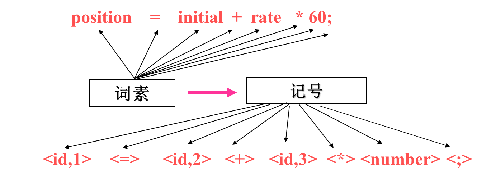 
   - 
   - **空白，换行等将被忽略**

#### ②<mark>语法分析</mark>

1. 任务:根据语言的语法规则，从词法分析器输出的token序列中识别出<mark>各类短语（语法单位）</mark>，并构造<mark>语法分析树(parse tree)</mark>。
2. 语法分析树描述了句子的语法结构,通过语法分析确定整个输入串是否构成一个语法上正确的程序。
3. 遵循的原则：语法规则
4. 描述工具：**上下文无关文法**
5. 例
   - 
   - 树是基于语言的文法来构建的
   - 


#### ③<mark>语义分析</mark>

1. 任务:
   - 语义检查：使用**语法树和符号表**中的信息来检查源程序是否和语言定义的语义一致。
   - 收集标识符的属性信息（种属、类型、长度等），将信息存放在语法树或符号表中。
   - **类型检查**是一个重要组成部分，它检查每个运算符是否具有匹配的运算分量。
   - 发现语义错误，并支持代码生成
2. 输出为<mark>注释树</mark>：分析树被标记上语义动作
   -  
3. 

#### ④<mark>中间代码生成</mark> END

> 常被包括到语义分析中
>
> 本次课只介绍到这里

1. 任务:对各类语法单位按语言的**语义**进行初步翻译。中间代码应易于生成，且容易被翻译成目标机器的语言。

2. 遵循的原则：语义规则

3. 描述工具：属性文法

4. 中间代码：三元式、四元式、树等

5. 例: 三地址指令：由类似于汇编语言的指令序列组成每个指令最多有三个操作数

   - 

6. 常用的三地址指令及其四元式表示

   | -   | 序号             | 指令类型                      | 指令形式                                                                    | 四元式 |
   | --- | ---------------- | ----------------------------- | --------------------------------------------------------------------------- |
   | 1   | 赋值指令         | x = y op z     x = op y       | (  op  , y , z   , x  )  (  op  , y , _ , x )                               |
   | 2   | 复制指令         | x = y                         | (   = , y   , _ , x )                                                       |
   | 3   | 条件跳转         | if x relop y goto n           | (  relop  , x   , y   ,   n )                                               |
   | 4   | 非条件跳转       | goto n                        | (  goto  , _ , _  , n  )                                                    |
   | 5   | 参数传递         | param x                       | (param, _ , _  , x  )                                                       |
   | 6   | 过程调用         | call p, n                     | (call,  p , n , _  )                                                        |
   | 7   | 过程返回         | return   x                    | (  return, _  , _  ,  x  )                                                  |
   | 8   | 数组引用         | x = y[i]                      | (  =[]  ,   y , i  ,   x  )                                                 |
   | 9   | 数组赋值         | x[i] = y                      | (  []=  ,   y , x  ,   i  )                                                 |
   | 10  | 地址及  指针操作 | x =& y     x =\* y     *x = y | (  & , y  , _  ,  x  )  (  =\*  , y  , _  ,  x  )  (  *=  , y  , _  ,  x  ) |

#### ⑤优化

1. 任务：对于前阶段产生的中间代码进行加工变换，以期在最后阶段产生更高效的目标代码。
2. 遵循的原则：程序的等价变换规则，主要包括：公共子表达式的提取、循环优化、删除无用代码等等。

#### ⑥目标代码生成

1. 任务: 把中间代码变换成特定机器上的目标代码。
2. 依赖于硬件系统结构和机器指令的含义。
3. 目标代码三种形式:
   - 绝对指令代码: 可直接运行 
   - 可重新定位指令代码: 需要连接装配
   - 汇编指令代码: 需要进行汇编


### 符号表管理和错误处理

1. 符号表管理
   - 保存记号的信息（存储空间、类型、作用域）
   - 在分析、综合过程中使用/修改
   -  
     符号表是用于存放标识符的属性信息的数据结构
2. 错误处理：
   - 发现源程序中的错误，把错误信息报告给用户
   - 发现哪些错误?
     - 语法错误：非法标识符、括号不匹配……
     - 语义错误：变量未声明、类型不一致……
   - 发现错误后如何处理?

### 遍 pass

- 所谓"遍"，就是对源程序或源程序的中间结果从头到尾扫描一次，进行加工，产生新的中间结果或目标程序。
- 阶段与遍是不同的概念。一遍可以由若干阶段组成，一个阶段也可以分若干遍来完成。
- 有单遍编译器，也有多遍编译器。单遍费内存，多遍耗时间。想获取更高的优化效果一般需要多遍。


# 第2章 一个简单的语法制导翻译器

## 2.1 什么是语法制导翻译

编译器**前端**的工作(即**分析阶段**)就是将源程序划分成多个组成部分, 生成源程序的内部表示形式(<mark>中间代码</mark>); **后端**(即合成阶段)将中间代码翻译为目标程序

1. 编译器前端模型
   -  
2. 编译器的前端的各个阶段围绕待编译语言的“**语法**”展开。
   - 程序设计语言的**语法**描述
     - 描述语言的**正确**构成形式
     - 工具：<mark>上下文无关文法</mark>
   - 程序设计语言的**语义**
     - 描述语言的含义，即**功能**

### 文法描述的几个基本概念

<mark>字母表</mark>: 一个有穷字符集，记为$∑$

∑上的**字符**：字母表∑中每个元素

∑上的**字符串**：指由∑中的字符所**构成**的一个有穷字符序列 (可以重复用)
- 字符串的长度：符号的个数， 如|aab|=3

**空串**：不包含任何字符的序列，记为$ε$

**全体**：用$∑^*$表示∑上的所有字符串的**全体**，包含空字ε

- 例: 设 ∑={a， b}，则 ∑*={ε,a,b,aa,ab,ba,bb,aaa,...}

$∑^*$的子集U和V的**连接（积）**定义为$UV＝\{ αβ | α \in U \& β\in V \}$ (笛卡尔积)
- 例: 设 U＝{ a, aa } ，V＝ { b, bb }, 则UV ={ ab, abb, aab, aabb}

**V自身的n次积**记为：$V^n=V V…V$

- $V^0={ε}$
- $V^*是V的克林闭包：V^*=V^0∪V^1∪V^2∪V^3∪…$
- $V^+是V的正规闭包：V^＋＝V V^*$ 当V中没有ε时, V^+^比V^*^少一个ε
-  

## 2.2 语法定义

<mark>上下文无关文法</mark>: 简称<mark>文法</mark>, 用于描述程序设计语言语法的表示方法, 用于组织编译器前端

### 2.2.1 文法定义

定义**上下文无关文法**(context-free grammer, G)为一个四元组$G(V_T, V_N, P, S)$

- $V_T$: <mark>终结符</mark>(terminal)集（非空） 
  - 文法所定义的语言的基本符号的集合
  - 仅出现在**产生式**右部（体）
  - 例：VT ={ He,a,gave,book,me}
- $V_N$ ：<mark>非终结符</mark>(non-terminal)集（非空）
  - 表示语法成分的符号，有时也称为“ **语法变量**”
  - 在某个产生式的左部出现过的文法符号
  - 例：VN ={ <句子>,<主语>,<谓语>,......}
    程序语言中有 <语句>、<表达式>、<程序>等
  - $V_T \cap V_N = \empty;\quad V_T∪V_N = 文法符号集$

- $S$：<mark>开始符号</mark>(start symbol)
  - 特殊的非终结符，表示该文法中最大的语法成分
  - 例：S = <句子>
  - 两种说明方式：
    - 明确指出
    - 第1条产生式规则左部的文法符号
  - $S\in V_N$ 
- $P$：<mark>产生式</mark>(production)<mark>集</mark>
  - 也称重写规则或规则：描述语言的语法结构的形式规则
  - 一般形式： $α→β$，读作：α**定义**为β
  - α是一个**符号**，称为**左部**或**头**。$α∈V_N$
  - β是**有穷符号串**，称为**右部**或**体**。$β∈(V_T∪V_N)^*$

例2-5: 定义只含`+`,`*`的算术表达式的文法

 

### 2.2.2 推导**Derivation**

- 给定文法$G(V_T, V_N, P, S)$，若$A → γ\in P$且$α,β (V_T \cup V_N)*$ ，则文法符号串$αAβ$**可重写**为$α γ β$，记作$αAβ → αγβ$，称**$αAβ$直接推导**$αγβ$。

- 如果$α_1→ α_2→ ...→ α_n$，则称这个序列是从$α_1到α_n$的一个**推导**。
  若存在一个从$α_1到α_n$的推导，则称$α_1$可以推导出$α_n$ 。


- 推导长度：执行一步推导的次数
  - 一步推导$→$
  - 1步或若干步的推导 $→ ^+$
  - 0步或若干步的推导 $→^*$
    

### 2.2.3 文法和语言

文法定义的**<mark>语言</mark>**：从**开始符号**出发，利用推导能得到的所有**终结符号串**的集合。

- 如果$S →^* α，α∈(V_T∪V_N)*$，则α为文法G的句型

- 如果$S →^+ w$ (**终结符号串**)，则w为文法G的句子

- 文法G的句子集合称为<mark>文法G生成的语言</mark>，记为<font color = 66ccff>$L(G) = \{α|S→ α, α\in V_T^*\}$</font>

- 上下文无关文法生成的语言称为<mark>上下文无关语言</mark>

>  练2-4 请证明$(i*i+i)$是文法$G(E)： E → i | E+E | E*E | (E)$的一个句子。

- 证明：$E → (E) 
  		   → (E+E)
        		   → (E*E+E)
        		   → (i*E+E)
        		   → (i*i+E) 
        		   → (i*i+i)$
  $(i*i+i)是文法G的句子E，(E)，(E*E+E)，…，(i*i+i)是句型。$

**文法和语言的关系**

- 给定一个文法，就从结构上**唯一地确定**其语言

- 给定一种语言，能确定其文法，但文法**不唯一**

**等价文法**

- 设$G_1$和$G_2$是两个文法，若$L(G_1)=L(G_2)$，则称$G_1$与$G_2$为等价文法。

> 例2-7  设文法 $G(A)：A → c | Ab$, G(A)产生的语言是什么？

- 以c开头，后继若干个b即 L(G)={c，cb，cbb，……}
  称为**递归文法**

> 练2-5  设文法$G(S)：S → AB, A → aA|a, B → bB|b$
> 	G(S)产生的语言是什么？

- $L(G)=\{a^mb^n|m，n>0\}$

> 例2-8  请给出产生语言为$\{a^nb^n|n\geq1\}$的文法

- **递推方法**：
  - 满足条件最简单的句子是 ab $G(S): S→ ab$
  - 若S是满足条件的句子，则在S左右分别添加a和b，即$aSb$也满足条件。$S→ aSb$
- **递归方法**：
  - 若S是满足条件的句子，则拿掉S开头a和结尾b也满足条件$S→ aSb$，一直到最简单的句子ab。$S→ ab$

**语法分析的任务**：输入终结符号串，找出从开始符号推导出该串的方法

- > 例2-9 如下文法对串`9-5+2`的推导
  > $	list → list + digit  → list - digit + digit → digit - digit + digit\\  	→ 9 - digit + digit → 9 - 5 + digit   → 9 - 5 + 2$

### 2.2.4 语法分析树

从一个句型到一个句型的推导往往不唯一，可以以**图形方式**描述一个句子的推导过程，称为**语法分析树（简称语法树）**。

某一文法的语法树应具有以下性质：

- 根节点是**开始符号**
- 叶节点是**终结符**（ token）和 **ε**
- 内部节点（非叶结点）是**非终结符**
- 如果应用了规则$A → x_1x_2…x_n$, 则A是内部结点;  $x_1 , x_2 , … ，x_n$是其**从左到右**的子结点（内部节点或叶节点）


### 2.2.5 二义性Ambiguous

> 例2-11 文法 $G(E)：E→i|E+E|E*E|(E)$句子$(i*i+i)$的语法树

 

**该文法是二义性文法**

#### 什么是二义性

<mark>文法的二义性</mark>：如果一个文法存在**某个句子**对应**两棵不同的语法树**，则说这个**文法是二义**的。

- 本门课程只讨论文法二义性, 不涉及语义二义性
  - 语义二义性: Jack said Tom left **his** assignment at home.

> 例2-12 证明：文法$S →  aSbS | bSaS | ε$是二义的

证：对于串abab存在**两棵不同的分析树**：
 

- 二义性问题是不可判定问题，即不存在一个算法，能在有限步内，确切地判定一个文法是否是二义的。
- 但是可以找到一组无二义文法的充分条件（*那么怎么知道具体条件？~~抽奖~~*）

#### 二义性的产生原因

1. >  例2-13 $string →  string + string | string – string | 0 | 1 | …| 9$

   - 解：9-5+2存在两棵不同的分析树，是二义性文法
     

   - 左树: 先9-5=4, 再4+2=6
     右树: 先5+2=7, 再9-7=2 计算顺序错误

   - 造成二义性的原因：文法中没有体现出**结合律**和**优先级**

2. 可以基于**优先级**和**结合性**构建无二义的文法

   - 四则运算存在两个优先级，所以可引入两个非终结符expr和term来对应不同的运算层次
     在这个文法中, term会比expr+term, expr-term先进行计算, 即优先度高

   - 四则运算均为左结合，因此在每条规则中，**更为抽象**的非终结符应位于左边
     

3. 程序设计语言中的上下文无关文法

#### 2.2.6 最左推导&最右推导

1. <mark>最左推导</mark>（Leftmost derivation） : 首先替换最左边的非终结符
   <mark>最右推导</mark>（rightmost derivation） : 首先替换最右边的非终结符
2. 最左（右）推导与**分析树**一一对应

   - 即, **最左(右)推导可以用来判断文法二义性**

   - 可以通过说明对于某一个串存在**两个不同的最左or最右推导**来证明文法二义

> **判断文法二义性**
>
> 1. 先找一个可能出现二义性的句子
> 2. 判断方法1: 画出两个不同的语法分析树
> 3. 判断方法2: 写出两个不同的最左/最右推导


## 2.3 语法制导翻译

- 采用文法来指导对程序的翻译过程。
- 通过向一个文法的产生式附加一些规则或程序片段来实现。
- <mark>语法制导定义</mark>和<mark>翻译方案</mark>分别描述了两种不同的附加规则或程序片段的方法。

### 2.3.1 语法制导定义

1. 让每个**文法符号**与一个**属性集合**相关联
   - 属性：文法符号的一些特征。
     如:表达式的属性可以有类型、值等。
2. 让每个**产生式**与一组**语义规则**相关联
   - 语义规则用于计算与该产生式的文法符号相关联的属性的值

3. <mark>注释分析树</mark>：在结点上**标记相应的属性值**的语法分析树。
   
4. <mark>综合属性</mark>：如果某属性在语法分析树结点N上的值是由N的子结点以及N本身的属性值确定的，这个属性称为综合属性。
   - 注释方法：先构建分析树，然后注释。
   - 如果只存在综合属性，则只需要自底向上对分析树进行一次后续遍历，就可以算出各个结点的属性值。

### 2.3.2 语法制导翻译方案

1. 语法制导翻译方案: 常简称为<mark>翻译方案</mark>。它将语义动作直接**嵌入**到产生式规则中

   - 语义动作：嵌入到产生式内的程序片段（`{...}`）
   - 翻译方案指定了语义动作的执行顺序。

2. 画出一个翻译方案的语法分析树时，要同时描述语义信息：为每个语义动作分别构造一个额外的**子结点**，并用虚线将它和该产生式头部对应的结点相连。(树多了个叉)

   - >  例2-17 把表达式翻译成后缀形式的语义动作

     - expr  →  expr1 + term  { print('+') }
       expr  →  expr1 -  term   { print('-') }
       expr  →  term
       term →  0  { print ('0') }
       term →  1  { print('1') }
            . . .
       term →  9  { print ('9') }
     - 

#### 例

例2-18：分别构建一个**语法制导定义**和**翻译方案**，把算术表达式从中缀表示翻译成前缀表示。并给出输入9-5+2和9-5*2时的注释分析树。

##### 语法制导定义实现


##### 翻译方案实现

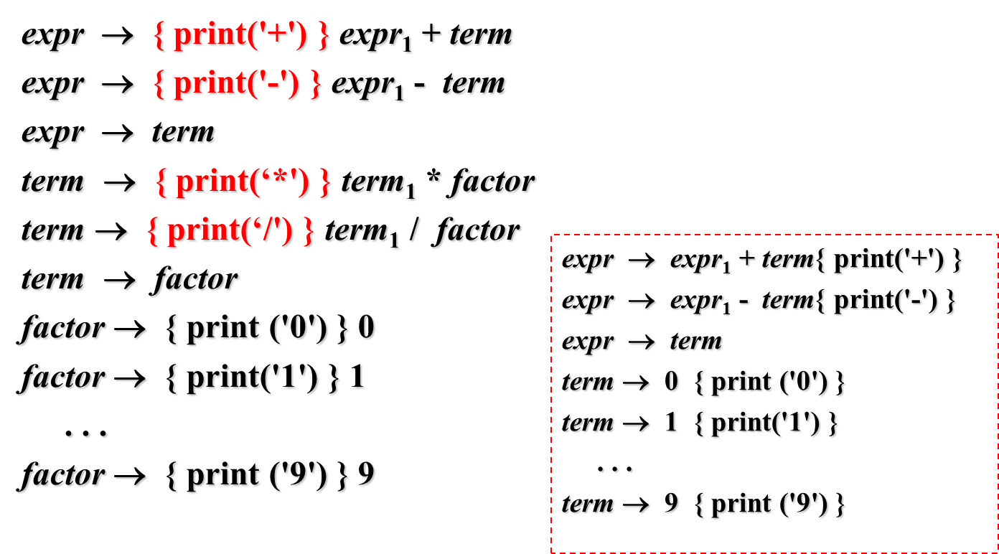


## 2.4 语法分析

1. 功能：确定如何使用文法生成（推导）一个终结符号串（句子）的过程。
   - 目的: 检查词法分析输出的单词序列是否是源语言的语法规则
2. 语法分析方法分类：
   - <mark>自顶向下</mark>：从**根结点**开始，逐步向叶子结点方向进行构造 $\begin{cases}递归下降法\\预测分析法\\LL文法 \end{cases}$
   - <mark>自底向上</mark>：从**叶子结点**开始，逐步构造出根结点。
3. 语法分析器构造方法
   - 手工构造：人工编程实现分析器。支持自顶向下分析
   - 自动构造：形式化地描述文法，分析器构造程序自动将描述转为分析程序。支持自顶向下和自底向上分析

### 2.4.1 自顶向下分析法

1. 从标号为开始符号的根结点开始，反复执行以下两个步骤

   - **扩展结点**：在标号为非终结符号A的结点N上，选择A的一个产生式，并为该产生式体中的各个符号构造出N的子结点

   - **确定待扩展结点**：寻找下一个结点来构造子树，通常选择当前语法分析树中**最左边**的尚未扩展的非终结符。

2. 自顶向下分析实际上是一种**试探性**的过程，可能导致分析效率极低甚至失败。**通常，在自顶向下的分析过程中会遇到二义性问题、左递归引起的无限推导和回溯问题。**

### 2.4.2 递归下降分析法

1. 一般性的自顶向下分析方法。使用一组**递归过程**来处理输入，文法的每一个非终结符都关联一个过程。

   - 非终结符选择产生式是一个“尝试并犯错”的过程。即首先选择一个产生式，不合适时进行回溯，再尝试另一个产生式。

2. > 例2-20 考虑文法$E→T | T+ E\\ T→ int | int * T | ( E )$　　
   > 给出递归下降法分析(int)的过程。


### 2.4.3 预测分析法

1. 是递归下降分析法的一种简单形式
   - 要求：每个非终结符对应的过程中的控制流（选择哪个产生式）都可以通过**向前看一个符号**（输入中当前被扫描的终结符）来确定。
   - 分析输入串时出现的**过程调用序列** 对应 先序遍历该输入串的一棵语法分析树。

2. 例: 一个预测分析机的伪代码

   - ```pseudocode
     S →  +SS  |  -SS | a
     void s( ) {
         switch (lookahead ) {
             case + :  match('+'); s( ); s( ); break;
             case - :   match('-'); s( );  s( ); break;
             case a :  match ('a'); break;
             default: report ("syntax error");
          }
     }
     ```

   - 例: -+a+aaa
     1. lookahead=-, 选择2, 进入递归层1
        1. `lookahea`d=+, 选择1, 进入递归层2
           1. lookahead=a, 选择3 返回
           2. lookahead=+, 选择1, 进入递归层3
              1. lookahead=a, 选择3 返回
              2. lookahead=a, 选择3 返回
     2. lookahead=a, 选择3 返回

   

### 2.4.4 预测分析法的问题: 左递归

当产生式出现“左递归”时，递归下降语法分析器会进入**无限循环**。

<mark>左递归</mark>：产生式体的最左边的符号和产生式头部相同， 如$A  → Aα | β   (α≠ ε, β不以A开头)$	

> 例2-23  算术表达式的文法        $S →E\\E→E+T|T\\T→T*F|F\\F→(E)|id$ 
> 为句子id*id+id构造分析树

-  若E()决定使用E→E+T，因为产生式体的开头为E，E()将被递归调用。

#### 左递归的消除

- $A  → Aα | β   (α≠ ε, β不以A开头)$最后生成的语言形式: $\beta a^* (^*: 正则, 代表任意多个)$

- 上面的产生式进行左递归的消除: $A→ \beta A'\\A'→ αA'|\varepsilon$

 

$E→a|-a|E+a|E-a消除左递归$

- $E→ E(+a|-a)|(+a|-a)$

> 练2-9  消除文法G(P)的左递归
> 	P →（Q）|aP|a
> 	Q →Q ,P|P

- $P →（Q）|\textcolor{red}{aP|a} \\ Q→PQ'\\Q'→,PQ|\varepsilon$
- 对于这题, 当lookahead=a时, 会无法确定选择aP还是a, 需要再往后看一个

### 2.4.5 预测分析法问题:回溯

> 改进设计的语法

非终结符选择产生式是一个“尝试并犯错”的过程。即首先选择一个产生式，不合适时进行回溯，再尝试另一个产生式。
当出现形如 $A→ αβ_1|αβ_2$的产生式，此时无法确认应该选择A的哪个产生式，可以通过改写产生式(**提取左公因子**)来推后这个决定，等获得足够信息后再做出正确的选择。

- $A→ αβ_1|αβ_2\quad 变为\quad \begin{cases}A→αA'\\A'→β_1|β_2\end{cases}$ 

> 例2-26 文法	 $E → E' | E' + E\\E' → -E' | id | (E)$
> 用预测分析法分析id+id 

解：

- 提取左公共因子
  	E → E' | E' + E  变为  	$E → E'A\\A→ ε | + E\\E' → -E' | id | (E)$
- $E → E'A → id A →  id + E → id + E'A → id + idA → id + id$ 


------

往后为实验内容

------

## 2.5 词法分析

从输入中读取字符，并将它们组织成词法单元（记号）。
词法单元是二元组，包括token-name（语法分析时称终结符，也称token-class）和attribute-value(也称lexeme)。
主要工作：预读、剔除空白和注释、常量识别、关键字和标识符的识别。


# 第3章 词法分析

> 词法分析主要任务: 读入源程序输入字符, 将字符组成词素, 生成并输出一个词法分析序列, 每个词法单元对于一个词素

词法分析的任务：从左向右逐行扫描源程序的字符，识别出各个单词，确定**单词的类型**。并将识别出的单词转换成统一的**机内表示**——词法单元(token)形式

编译程序是在单词的级别上来分析和翻译源程序，因此，词法分析是编译的基础


## 3.1 词法分析器的作用

### 3.1.1 词法分析器的作用

1. 读入源程序
2. 去除注释、空格、制表符、换行符等
3. 建立符号表
4. **识别词素，抽象成记号** (`<单词种别，单词的值>`)
5. 将记号插入符号表
6. 发现词法错误，建立错误消息与源程序的**位置**联系
7. 将记号提交给语法分析器
   - 完成功能越多越好


### 3.1.2 词素识别实例

输入： `Line=80；`

 输出: 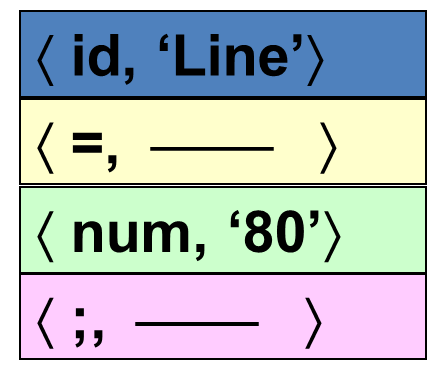

### 3.1.3 词法分析的输出

词法分析器的**输出**：`<单词种别，单词自身的值>`

程序语言单词的**分类**：
- **关键字**(保留字或基本字)：如while, if
- **标识符**：用来表示各种名字，如变量名、数组名
  - 由字母/数字/下划线组成, 字母或下划线开头
- **常数**：各种类型的常数 256，3.14
- **运算符**：如，＋、－、*、/
- **分界符**：如逗号，分号，冒号

单词种别通常用整数编码(枚举)表示
- 界符和运算符: **一符一码**
- 关键字可分成一类，也可以一个关键字分成一类。**一字一码**
- 常数可统归一类，也可按类型（整型、实型、布尔型等），每个类型的常数划分成一类。**一类型一码**
- 所有的标识符分为一类。**一类一码**

**单词的属性值**

> 用来区分单词的细分类别

- 对于关键字、分界符、运算符来说，它们的单词种别就可以表示其完整的信息，故对于这类单词，其单词自身的值通常为空
- 对于标识符，词类编码所反映的信息不够充分，标识符的具体特性还要通过单词自身的值进行互相区分。标识符的单词自身的属性常用其在符号表中的入口指针来表示
- 对于常数，其单词自身的值常用其在常数表中的入口指针来表示

| 单词分类              | 编码方式              | 属性值                       |
| --------------------- | --------------------- | ---------------------------- |
| 关键字(保留字/基本字) | 一字一码 (一种关键字) | null                         |
| 标识符                | 一类一码              | 符号表的入口指针             |
| 常数                  | 一类型一码            | 常数表的入口指针(指向它的值) |
| 运算符                | 一符一码              | null                         |
| 分界符                | 一符一码              | null                         |

### 3.1.4 词法分析术语

<mark>记号（词法单元、单词） Token</mark> 

- 具有独立含义的**最小语法单位**，每个记号代表一类符号串
- 例:  `<identifier>`, `<number>`

<mark>模式Pattern</mark>: 描述某个记号的词素集合的**构造规则**

<mark>词素Lexeme</mark>

- 源程序的符号序列，可匹配某个记号的模式
- 标识符: x, count, name, etc…


### 3.1.5 词法错误

1. 当前输入的前缀无法匹配任何记号时报词法错误，如：
   - 出现了当前语言中不会出现的字符，如 @ 或 # *最常见*
   - 整数越界
   - 标识符名太长(有些语言最大长度为32个字符)
   - 字符串太长(有些语言最大长度为256个字符) 
   - 字符串跨行
2. 局部化 
   - 例: `whil  ( x = 0 ) do  ` 并不产生词法错误, 具体到语法分析实现


### 3.1.6 双缓冲双指针策略

1. 提高源程序读入速度的策略

2. 采用大块存储空间作为缓存，一次性将大批数据读入缓存

3. 采用双缓冲

   - 在一个缓冲I/O, 另一缓冲词法分析, 第一块用完后, 继续读第二块, 保证连续性

   - ```pseudocode
     switch (*forward++ ) {
         case eof:
     	      if (forward is at end of first buffer ) {
     		reload second buffer;
     		forward = beginning of second buffer;
     	     }
     	    else if (forward is at end of second buffer ) {
     		reload first buffer;
     		forward = beginning of first buffer;
     }
     	   else /* eof within a buffer marks the end of input */
     		terminate lexical analysis;
     	   break;
          cases for the other characters: ......
     }
     
     ```

### 3.1.7 词法分析的设计形式

1. 设计成一个独立程序，完成词法分析的任务，结果以文件的形式组织，做为语法分析的输入
    
2. 作为语法分析的子程序
    

### 3.1.8 词法分析器的构造策略

1. 使用传统的程序设计语言手工编写
2. 使用汇编语言手工编写
3. 使用**词法分析器生成器**，从基于**正则表达式**的说明自动产生
   - 例: FLEX


## 3.2 词法分析机的手工实现

### 3.2.1 识别模式

1. 标识符识别
   - 字母开头的字母数字串，后跟界符或算符
2. 常数识别
   - 识别出算术常数并将其转变为二进制内码表示。
   - 5.88, 5.E08
3. 算符和界符的识别
   - 把多个字符符合而成的算符和界符拼合成一个单一单词符号
   - =， ++，--，>=

### 3.2.2 状态转换图

1. 状态转换图是一张有向图，用来描述和识别记号
2. 包括:
   - **结点**：代表状态States，用圆圈表示
   - **有向边**：代表动作Actions，边上的标记（字符）表示射出状态下可能出现的输入字符（字符类别）
   - **初态**Start State：模式的开始，无源箭头的目标
   - **终态**Final State(s)：模式的结束，双圈
     - 可能带有`*`, 表示输入需要回退一个位置, 意思是当前输入不是当前词素的一部分
   - 一张转换图包含有限个状态，其中有一个为初始状态，有若干个终止状态

### 3.2.3 用状态转换图识别字符串

若存在一条从初始状态到某一终止状态的道路，且这条路上所有弧上的标记符连接成的字符串等于α，则称α被该状态转换图所**识别（接受）**

*输入一个字符串, 从初态开始, 根据状态图的边匹配字符, 递归转换状态, 直到终态, 若存在这样从初态到终态的路径, 则说明字符串可以被识别*

## 3.3 词法分析器的自动生成

### 3.3.1 字母表和串

1. 字母表$∑$ ：符号的有穷集合
   1. 例：{0,1},  {a,b,c},  {n,m, … , z}
2. 串（字）：基于给定字母表的有穷符号序列
   - 例：0011，abbca，AABBC …
3. 串的长度：串S中的符号的数，记为|S|
4. 串的运算：连接、幂
5. 用$∑^*$表示$\sum$上所有串的**全体**，包含空串ε

### 3.3.2 串的术语

> 原始串: banana

- **前缀Prefix**:从尾部删除0或多个符号得到的串。ban, banana, ε
- **后缀Suffix**:从首部删除0或多个符号得到的串。ana, banana, ε
- **子串Substring**:删除某个前缀和某个后缀后得到的串。 nan, ban, ana, banana, ε
  - 真前缀：不等于原串，也不为ε的前缀
    真后缀、真子串：与上类似
- **子序列Subsequence**:删除0或多个符号所得的串。bnan, nn, ε

- > 例3-6 试说明字符串abcdefghij，分别有多少个前缀、后缀、真前缀、子串和子序列。

  - 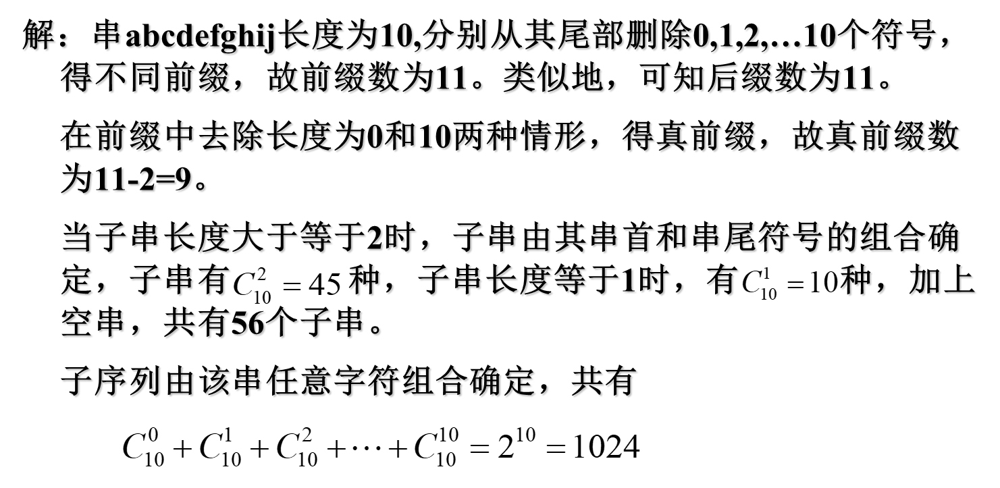

### 3.3.3 语言上的运算


例：令$L=\{A，B，…，Z，a，b，…，z\}$，$D=\{0，1，…，9\}$。则$L(L∪D)^*$表示的语言是标识符(数字/字母组成, 且字母开头)

### 3.3.4 正则表达式&语言(正则集)

##### 正则基本定义

1. <mark>正则表达式</mark>(Regular Expression，RE)，又名正则式、正规表达式、正规式。是一种用来描述词素模式的 更紧凑的表示方法
   - 正则表达式可以由较小的正则表达式按照特定规则递归地构建
   - 例
   - 基于字母表$\Sigma$​构造串的一组规则（模板、模式）
   
2. 如果r是正则式，则`L(r)`是r描述的语言（正规集、正则集）

   - L()被称为Mapping Function, 实现语法(syntax)→语义(semantics)的映射

   - 基于同一个字母表，可以通过不同的正则式来定义不同的语言

3. **正则表达式定义**

   - **空串**: ε是正则式，L(ε)={ε}
   - **单字符**: 若$a∈\Sigma$, 则a是正则式， L(a)={a}
   - 若r和s为正则式，且L(r)和L(s)为对应语言。  则
     - **Union**: `r|s`是正则式，L(r|s)  =  L(r) ∪ L(s)
     - **Concatenation**: `rs`是正则式，L(rs)  =  L(r) L(s)
     - **Interaction**: `r*` 是正则式，L(r\*)  =  (L(r))*
     - `(r)`是正则式，L((r))=L(r)
   - 以上运算均左结合，优先级从高到低为：`*， 连接，|`

4. 仅由有限次使用上述步骤（3个构造运算）定义的表达式才是$\Sigma$上的正则式，仅由这些正则式表示的串的集合称为<mark>正则语言（正则集）</mark>。
   - 所有词法结构一般都可以用正则集描述，它们就是词法分析时的**词素**。

##### 一堆例题

1.  
2. 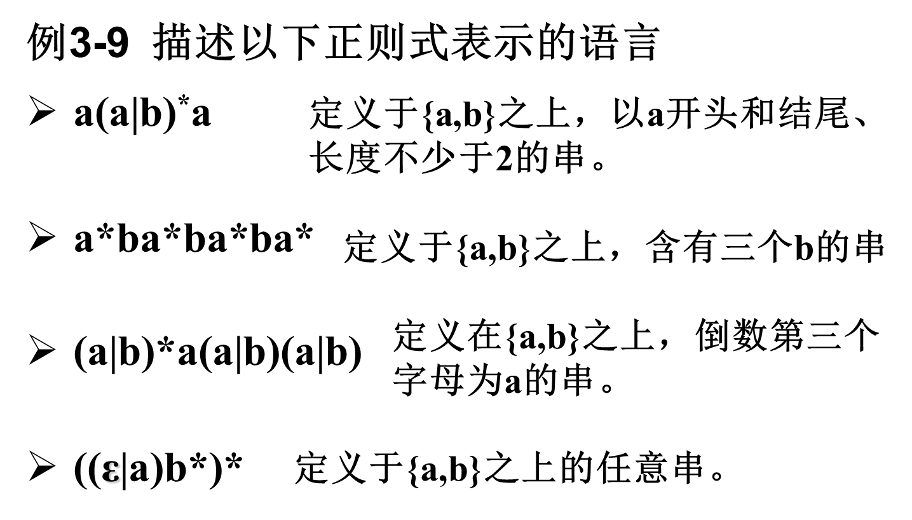 


##### 正则表达式的代数定律

- 

##### 正则表达式的拓展

- `+` : 1个或多个      	
  - $r^* = r^+ | ε且r^+ = rr^*$
- `?` : 0或1个		
  - $r^? = r  | ε$
- `[range] `: 字符的范围
  - $A | B | C | … | Z = [ABC…Z] = [A-Z]$

##### 正则定义

<mark>正则定义</mark>是具有如下形式的定义序列：

​		$d_1→r_1\\d_2→r_2\\…\\d_n→r_n$
 其中：

- 每个$d_i$都是一个新符号，它们都不在字母表 Σ中，而且各不相同
- 每个ri是字母表 Σ∪{d1 ,d2 , … ,di-1}上的正则表达式

**省流**: 给一些RE命名，并在之后的RE中像使用字母表中的符号一样使用这些名字($d_i$)

- 如C语言中标识符的正则定义

  ```pseudocode
  digit → [0-9]		// 匹配一个数字
  letter_ → [A-Za-z_] // 匹配一个大小写字母or下划线
  id → letter_(letter_|digit)*
  ```

  

### 3.3.5 词法分析器生成工具Lex

1. Lex使用

   1. 用Lex语言写一个输入文件，描述要生成的词法分析器
   2. Lex编译器将lex文件转换成C语言程序
   3. 编译C程序,即得词法分析器
   4.  

2. Lex程序结构

   - ```c
     declarations           //声明
     %%
     translation rules      //转换规则
     %%
     auxiliary procedures  //辅助过程
     ```

   - ```c
     // 声明(定义)
     delim		[  \t\n]       // 定义空白字符
     ws	 	{delim}+         // 匹配一个或多个空白字符
     letter 		[A-Za-z]        // 定义字母
     digit 		[0-9]           // 定义数字
     id 		{letter} ({letter} | {digit})*    // 定义标识符
     number 	{digit}+(\.{digit}+)?(E[+-]?{digit}+)?   // 定义数字
     
     %%
     // 规则
     {ws}     	{ }            // 忽略空白字符
     if			{return(IF);}  // 匹配关键字"if"
     then		{return(THEN);}  // 匹配关键字"then"
     else		{return(ELSE);}  // 匹配关键字"else"
     {id}		{yylval=(int) installID( ); return(ID);}  // 匹配标识符
     {number}	{yylval=(int) installNum( ); return(NUMBER);}  // 匹配数字
     “<”			{yylval=LT; return(RELOP);}  // 匹配"<"
     “<=”		{yylval=LE; return(RELOP);}  // 匹配"<="
     “=”			{yylval=EQ; return(RELOP);}  // 匹配"="
     “< >”		{yylval = NE; return(RELOP);}  // 匹配"< >"
     “>”			{yylval = GT; return(RELOP);}  // 匹配">"
     “>=”		{yylval = GE; return(RELOP);}  // 匹配">="
     
     %%
     // 用户子程序
     int installID( ){  }  // 安装标识符
     int installNum( ) {  }  // 安装数字
     int num_lines = 0, num_chars = 0;  // 初始化行数和字符数
     
     %%
     \n    {++num_lines; ++num_chars;}  // 统计换行符
     .      {++num_chars;}  // 统计其他字符
     %%
     main( argc, argv )
     int argc; char **argv;
     {  
     	++argv, --argc;  // 跳过程序名
     	if ( argc > 0 )      
     		yyin = fopen( argv[0], "r" );  // 打开文件
      	else  
      		yyin = stdin;  // 默认输入为标准输入
      	yylex(  );  // 调用词法分析器
      	printf( "# of lines = %d, # of chars = %d\n", num_lines,  num_chars );  // 输出行数和字符数  
     }
     ```

3. Lex冲突解决
   - 当输入的多个前缀与多个模式匹配时，使用如下优先原则选择正确的词素：
     1. 匹配最长串的规则优先
     2. 长度相同时，在前的规则优先 (这样可以实现优先级)


## 3.4 有穷自动机

<mark>有穷自动机</mark> ( Finite Automata，FA )由两位神经物理学家MeCuloch和Pitts于1948年首先提出，是对一类处理系统建立的数学模型

- 这类系统具有一系列离散的输入输出信息和有穷数目的内部状态（状态：概括了对过去输入信息处理的状况）
- 系统只需要根据当前所处的状态和当前的输入信息就可以决定系统的后继行为（下一状态）。
  每当系统处理了当前的输入后，系统的内部状态也将发生改变


### 3.4.1 FA的表示

1. <mark>状态转换图</mark> (Transition Graph)
   - **结点**：FA的状态
   - **初始状态**（开始状态）：只有一个，由start箭头指向
   - **终止状态**（接收状态）：可以有多个，用双圈表示
   - **带标记的有向边**：如果对于**输入a**，存在一个从状态p到状态q的转换，就在p、q之间画一条有向边，并标记上a
2. <mark>状态转换矩阵（表）</mark>：描述各个状态下，对应于各个输入的状态迁移。


### 3.4.2 FA的分类

1. 确定的FA(Deterministic finite automata, **DFA**)
2. 不确定的FA(Nondeterministic finite automata, **NFA**)

#### DFA

**DFA是NFA的一个特例**

1. 对状态转换图的形式化
2. **没有输入ε**之上的转换动作
   - 一个空边会导致输出不确定
3. 对每个状态s和每个输入符号a，有且仅有一条标号为a的边离开


DFA是一个五元组，$M = ( S，Σ ，δ，s_0，F )$

- S：有穷状态集
- Σ：输入字母表，即输入符号集合。(假设ε不是Σ中的元素)
- δ：状态转换函数，将S×Σ映射到S的单值部分映射。$\forall s∈S, a∈Σ, δ(s,a)$表示从状态s出发，沿着标记为a的边所能到达的状态。
- s0：开始状态 (或初始状态)，s0∈ S
- F：接收状态（或终止状态）集合，F⊆ S


#### NFA

NFA是一个五元组，$M = ( S，Σ ，δ，s_0，F )$

- S：有穷状态集
- Σ：输入符号集合，即输入字母表。假设ε 不是Σ中的元素
- δ：将S×Σ映射到$\color{red}2^S$的部分映射。$\forall s∈S, a∈Σ\cup\{\varepsilon\}, δ(s,a)$表示从状态s出发，沿着标记为a的边所能到达的状态集合
  - NFA是多值映射
- s0：开始状态 (或初始状态)，s0∈ S
- F：接收状态（或终止状态）集合，F⊆ S


#### FA对输入字符的接受

**定义**

1. 给定输入串x，如果存在一个对应于串x的从初始状态到某个终止状态的转换序列，则称串x被该FA<mark>接受</mark>
   - 路径中的ε标号将被忽略
2. 由一个有穷自动机M接收的**所有串构成的集合**称为是该FA定义（或接收）的<mark>语言</mark>，记为L(M )

**匹配规则: 最长匹配**

1. 当输入串的多个前缀与一个或多个模式匹配时，总是选择最长的前缀进行匹配
2. 在到达某个终态之后，只要输入带上还有符号，FA就继续前进，以便寻找尽可能长的匹配
   -  
   - 如上图, 如果不使用最长匹配, `<=`会被识别为`<`和`=`


### 3.4.3 DFA&NFA的构建

#### DFA和NFA的等价性

1. <mark>等价FA</mark>：对于任何两个有限自动机M和M'，若L(M)=L(M')，则称M和M'等价
   - 对任何非确定的有穷自动机N，存在定义同一语言的确定的有穷自动机D
   - 对任何确定的有穷自动机D，存在定义同一语言的非确定的有穷自动机N
   - 即: **DFA与NFA描述能力相同**！

2. 例: 
   

#### 正则→FA


正则表达式以符号序列的形式非常直观的描述单词的构成，但是构造分析器时真正实现或模拟的是DFA。

直接由RE构造DFA是非常困难的，经常**通过NFA实现**。

#### 正则→NFA

1. 正则式ε对应 NFA 
2. 正则式$a\in \Sigma$, 对应NFA 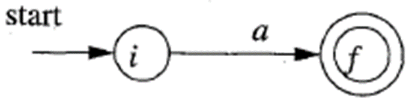 
   - **正则转换为NFA图的边**, 而不是节点(状态)
3. 若s,t是正则式, N(s)和N(t)是对应的NFA，则`s|t`对应之NFA为: 
4. 若s, t为正则式，N(s)和N(t)是对应的NFA，则`st`对应之NFA为:  
   - 将s的结束状态和t的开始状态重合起来
5. 如果s是正则式, N(s)为对应NFA,  则`s*`对应之NFA为:  
   - 下面的空边: 匹配０次
     上面的空边: 匹配多次


#### NFA→DFA 子集构造算法

> 消除二义性?

**计算量:** 

1. ε-closure(s)  : $s \in S$      <mark>状态s的ε闭包</mark>
   - 从状态s出发，仅通过ε边就能达到的状态集合 
2. ε-closure(T) :$T \sube S$   <mark>状态集T的ε闭包</mark>
   - 从状态集I中任一状态出发，仅通过ε边就能达到的状态集
3. move(T,a): $T \sube S,  a\in \Sigma$  <mark>转移函数</mark>
   - 对于状态集T，在输入a时，可以到达的状态集**(不考虑ε边)**


**例**

例3-22 将下面的NFA($(a|b)^*abb$)转换成DFA


| I                          | Ia                   | Ib                     |
| -------------------------- | -------------------- | ---------------------- |
| {**0**,1,7,2,4} (〇)       | {**3,8**, 6,1,7,2,4} | {**5**,6,1,7,2,4}      |
| {**3,8**,6,1,7,2,4} (①)    | {**3,8**, …} (同①)   | {**5, 9**, 6,1,7,2,4}  |
| {**5**,6,1,7,2,4} (②)      | {**3,8**, …} (同①)   | {**5**, …}             |
| {**5, 9**, 6,1,7,2,4} (③)  | {**3,8**, …} (同①)   | {**10, 5**, 6,1,7,2,4} |
| {**10, 5**, 6,1,7,2,4} (④) | {**3,8**, …} (同①)   | {**5**, …}             |

- 技巧 找a边和b边, 看I中有哪些边的前驱节点

简化结果

| I         | a   | b   |
| --------- | --- | --- |
| 0         | 1   | 2   |
| 1         | 1   | 3   |
| 2         | 1   | 2   |
| 3         | 1   | 4   |
| 4 $\cdot$ | 1   | 2   |


### 3.4.4 等价相关概念

自动机的<mark>等价</mark>：可以存在多个识别同一语言的DFA，这些DFA等价。

<mark>同构</mark>：如果仅需变换状态的名字就可以将一个DFA变成另一个，则这两个DFA同构。

两个<mark>状态的等价</mark>：同时是或不是**接受状态**，且对任意的输入，总是转向同一状态或等价状态

最少状态数的DFA：合并等价状态。

串x**可区分**状态s和t：分别从s和t出发，沿串x到达的两个状态中，只有一个是接受状态。

### 3.4.5 最小化DFA

**基本思想**: 把M的状态集划分为一些不相交的子集，使得任何两个不同子集的状态是可区别的而同一子集的任何两个状态是等价的。最后，让每个子集选出一个代表，同时消去其他状态

#### 划分过程

**工作原理**：将状态集分划成多个组，每个组中的各个状态相互不可区分。然后，将每个组中的状态合并成一个状态。

1. 将状态集划分成**两组**：终结状态集 F 和 非终结状态集S - F.

2. **(循环直到不需要继续细分)** 考察当前划分中的每一组G：
      - 根据输入a后到达的结果状态是否属于同一个状态集，将G划分成若干子组，使各子组中的任意两个状态s 和 t 对于给定输入均转向划分中的同一组；并更新划分
        - 注意, 更新划分后可能导致之前属于同一组的可以被再次划分
3. 每组状态用一个状态代表，原DFA中所有由该组中状态发出的边或指向该组中某状态的边，都要与该代表状态关联。	

例: 最小化下列DFA


非终结符: 0,1,2 终结符: 3,4,5,6


# 第4章 语法分析

## 4.1 语法分析器

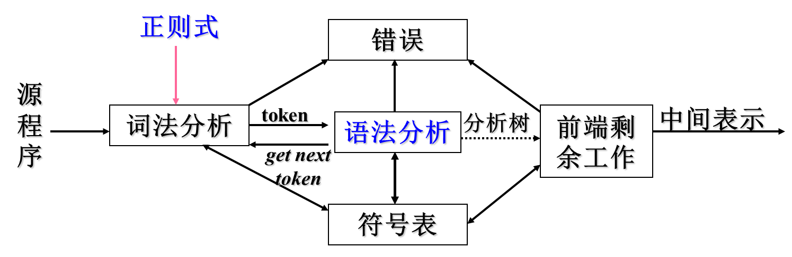

任务：基于文法检查记号流的构成（语法规则）

- 识别正确的输入，生成分析树
- 发现、报告语法错误

**例1**

 

**例2**

 


## 4.2 上下文无关文法

> 为什么要通过文法形式化地描述语言?
>
> - 精确易懂的表示方法
> - 编译器构建工具可以基于文法来自动构建编译器
> - 使语言的演化变得容易

### 4.2.1 上下文无关文法定义

可见[2.2.1 文法定义](#2.2.1 文法定义)

$G=(T, N, P, S)$

- T(Terminal): 终结符集

- N: 非终结符集
- P: 一组产生式规则
  - 每条规则的形式: $X→\beta_1\beta_2...\beta_n$
    其中$X\in N, \beta_i\in(T\cup N)$
- S: **唯一**的开始符号 ($S\in N$)

### 4.2.2 推导

1. <mark>推导</mark>: 

   - 给定文法G, 从G的开始符号S开始, 用产生式的右部替换为左侧的非终结符

   - 此过程不断重复, 直到不出现**非终结符**为止

   - 最终形成的串称为**句子**
   - 每一步推导中，都需要做两个选择
     - 替换当前句型中的哪个非终结符
     - 用该非终结符的哪个候选式进行替换

2. 推导顺序:
   - <mark>最左推导</mark>：每次总是选择最左侧的符号(非终结符)进行替换
   - <mark>最右推导</mark>：每次总是选择最右侧的符号(非终结符)进行替换 (也叫<mark>规范推导</mark>)

### 4.2.3 语法分析树

上面的推导过程可以表达为树状结构

- 与推导顺序无关

特点: 

- 每个非叶子节点 $\Leftrightarrow$ 非终结符
- 叶子结点 $\Leftrightarrow$ 终结符
- 每一步推导 $\Leftrightarrow$ 如何从parent结点生成子节点

例: 

> 例4-4 用下面文法推导句子：3+4*5
>
> - E -> num | id | E+E | E*E

|          |                                   |                                                                           |
| -------- | --------------------------------- | ------------------------------------------------------------------------- |
| 最左推导 | $E→ E+E→3+E→3+E*E→3+4*E→3+4*5$    |  |
| 最右推导 | $E→ E*E→ E+E*E→3+E*E→3+4*E→3+4*5$ |  |


### 4.2.4 文法的二义性

一个文法是**二义**的，如果：

- 能为一个句子生成多棵语法分析树（推荐）
- 能为一个句子生成多个最左推导
- 能为一个句子生成多个最右推导


- note: 似乎没有算法去检查文法是否二义, 只能碰运气去试…

**文法二义性导致的问题**

- 从编译器角度看，二义性文法存在问题：
  - 同一个程序会有不同的含义
  - 程序运行的结果是不唯一的
- 解决方案：**重写文法**
  -  

## 4.3 自顶向下分析

> 语法分析：给定文法G和句子s，回答s是否能从G推导出来？

### 4.3.1 自顶向下分析的基本思想

<mark>自顶向下分析</mark>基本思想：从分析树的顶部（根节点）向底部（叶节点）方向构造分析树。即从文法的开始符号S出发推导出词串s的过程。

- 总是选择每个句型的**最左**非终结符进行替换 (最左推导)

- 根据输入流中的下一个终结符，选择最左非终结符的一个候选式

- > 例: 


### 4.3.2 自顶向下分析面临的问题

#### ①无限循环问题 (左递归)

> 例: 
>
>  
>
> - 对于终结符id, E不断选择E+T

对于我们使用的最左推导, 产生这个无限循环的原因即为左递归

- 如果一个文法中有一个非终结符A使得对某个串α存在一个推导$A→^+Aα$ ，那么这个文法就是<mark>左递归</mark>的
- 含有$A→Aα$形式产生式的文法称为是<mark>直接左递归</mark>的(immediate left recursive)
- 经过两步或两步以上推导产生的左递归称为是<mark>间接左递归</mark>的

##### 直接左递归的消除

处理策略：将直接左递归转化为直接右递归

- 将文法：$A→ A \alpha | \beta  (α≠ ε, β不以A开头)$
  转化为:   $A→ \beta A’\\ A’→ \alpha A’ | ε$ 
- 一般形式: 
  - $$\begin{gathered}
    A→ A\alpha_1|A\alpha_2|\ldots|A\alpha_n|\beta_1|\beta_2|\ldots|\beta_m \\
    (\alpha_i\neq\varepsilon,\beta_j\text{不以}A\text{开头}) \\
     \Downarrow \\
    A→\beta_1A^{\prime}\mid\beta_2A^{\prime}\mid...\mid\beta_mA^{\prime} \\
    A'→\alpha_1A'\mid\alpha_2A'\mid...\mid\alpha_nA'\mid\varepsilon  
    \end{gathered}$$ 
  - **消除的代价**: 产生了非终结符(A’)和$\varepsilon$产生式

##### 间接左递归的消除

<mark>间接左递归</mark>：由多步推导带来的左递归
例如:  

**间接左递归消除算法**

$$
\begin{align}
&按照某个顺序将非终结符号排序为A_1，A_2，… ，A_n\\
&for (i: 从1到n的每个i ) \{\\
&\qquad for (j: 从1到i-1的每个i ) \{\\
&\qquad\qquad 消除由A_j导致的左递归：即向每个形如A_i → A_jγ的产生式\\
&\qquad\qquad代入所有A_j为头的规则。得 A_i → δ1 γ∣δ2 γ∣…∣δk γ ，\\
&\qquad\qquad \quad其中A_j  → δ1∣δ2∣… ∣δk ，是所有的A_j产生式 \\
&\qquad\qquad    \}\\
&\qquad     消除A_i 产生式之间的直接左递归\\
 \}
 \end{align}
$$

【例4-9】消除文法G(S)的左递归: $S→Aa|b\\A→Ac|Sd|ε$

解：设定非终结符顺序为S, A

1. 对S: S不存在左递归。
2. 对A: 
   1. 消除A的间接左递归: 代入$S→Ab|b$，得：A→Ac | Aad | bd | ε
   2. 消除A的直接左递归，得G’(S)：$S→Aa | b\\A→bdA’ | A’\\A’→ cA’ | adA’| ε$

#### ②回溯问题

1. <mark>回溯</mark>

   - 分析过程中，当一个非终结符用某一个候选式匹配成功时，这种匹配可能是暂时的。出错时，需要进行“回溯”
   - 当同一个非终结符的多个候选式存在共同前缀时，将导致回溯。

2. 例: 

   - > $S→xAy\\
     > A→**|*$

   - 

3. 解决方案: 提取左公因子, 消除回溯

   - ```
     对于每个非终结符A，找出它的两个或多个候选式的最长公共前缀α。若α ≠ ε，则将所有A-产生式
         A → α β1 | α β2 | … | α βn | γ1 | γ2 | … | γm
         替换为
         A → α A' | γ1 | γ2 | … | γm
         A' → β1 | β2 | … | βn
         其中， γi 表示所有不以α开头的产生式体； 
     不断应用这个转换，直到每个非终结符的任意两个产生式体都没有公共前缀为止
     ```

   - 通过改写产生式来推迟决定，等读入了足够多的输入，获得足够信息后再做出正确的选择

### 4.3.3 递归下降的语法分析

<mark>自顶向下的语法分析</mark>：从分析树的根结点开始，深度优先地创建该树的各个结点。

一个递归下降分析程序由一组过程组成，每个非终结符号有一个对应的过程。

程序的执行从开始符号对应的过程开始，如果这个过程的过程体扫描了整个输入串，它就停止执行并宣布语法分析成功。

```pseudocode
void A( ) {
    选择一个A的产生式, A → X1 X2 . . . Xk;
    for ( i = 1  to k ) {
           if ( Xi 是一个非终结符 )
                  调用过程 Xi( ) ;
          else if ( Xi 等于当前的输入符号 a )
                      读入下一个输入符号;
          else /* 发生了一个错误 */;
     }
}
```

### 4.3.4 预测分析

<mark>预测分析</mark>是递归下降分析技术的一个**特例**

- 在每一步推导过程中，通过在输入中向前看固定个数（通常是一个）符号来选择正确的A-产生式。为保证分析的确定性，选出的候选式必须是唯一的。
- 预测分析不需要回溯，是一种确定的自顶向下分析方法
- 可以对某些文法构造出向前看k个输入符号的预测分析器，该类文法有时也称为<mark>LL(k) 文法类</mark> 

#### ①串首终结符(集) FIRST

<mark>串首终结符</mark> ：串首第一个终结符，简称首终结符

**串α的首终结符集FIRST(α)**：可以从α推导出的所有首终结符构成的集合。

- 对于$\forall α∈(V_T∪V_N)^+,  FIRST(α)=\{ a | α → ^* aβ，a∈ V_T，β∈(V _T∪ V_N)*\}；$
- 如果 $α → ^* ε，那么 ε∈FIRST(α)$ ; 
  - $α →^* ε$ 表示串 α 可以经过一系列（可能是零个或多个）推导步骤最终被推导出空串ε)


如果非终结符A的所有候选式的首终结符集两两不相交，当要求A匹配输入串时，A就能根据当前输入符号a，选择唯一的正确的候选式。该候选式就是那个串首终结符集中包含a的α

##### 计算文法符号X的FIRST(X)

反复执行以下步骤，直至无法加入新的终结符或ε
1. 若 X 是终结符，则FIRST(X) = X
2. 若X是非终结符，且$X→ Y_1Y_2…Y_k∈P(k≥1)$，则将 $FIRST(Y_1Y_2…Y_k)$加入到 FIRST(X); 
   - *如何计算$FIRST(Y_1Y_2…Y_k)$  往下看*
3. 若$X → ε ∈P$，则将 ε 加入到 FIRST(X)

##### 计算串$X_1X_2…X_n$的$FIRST(X_1X_2…X_n)$

1. 将$FIRST(X_1)$中所有终结符加入 $FIRST(X_1X_2…X_n)$
2. for(i=1;i<n-1;i++)
    - 若$\textcolor{red}{ε}∈FIRST(X_i)$，将$FIRST(X_{i+1})$中所有终结符加入$FIRST(X_1X_2…X_n)$ 
    - 否则break; 
3. 如果对$∀i, ε∈FIRST(X_i)$成立, 则将 ε 加入 $FIRST(X_1X_2…X_n)$
   - 即所有$X_i$都有$\varepsilon$​


#### ②什么时候使用$\varepsilon$产生式

如果当前某**非终结符A**与当前**输入符a**不匹配时，若存在A→ε，可以通过检查**a是否可以出现在A的后面**，来决定是否使用产生式 A→ε

- 若文法中无 A→ε ，则应报错

- 判断a是否可以出现在A的后面: 使用FOLLOW(A)

#### ③非终结符的后继符号集 FOLLOW

非终结符A的<mark>后继符号集FOLLOW(A)</mark>：可能在某些句型中紧跟在A右边的终结符号的集合。

- $FOLLOW(A)=\{a| S →^* αAaβ, a∈V_T，α,β∈(V_T∪V_N)^*\}$

- 如果A是某个句型的的最右符号，则将结束符“`$`”添加到FOLLOW(A)中

##### 计算所有非终结符的FOLLOW集

反复执行以下规则,直到无法加入新的终结符和`$`
1. 如果S是开始符, 将`$`加入FOLLOW(S), 这里`$`是输入结束标记.
2. 对于B: 如果存在一个产生式$A → αBβ$, 则将 FIRST(β) 中的**终结符**加入 FOLLOW(B).
3. 对于B: 如果存在:

   - 产生式 $A→ aB$, 或者
   - 产生式$A→αBβ$, 且 $ε∈FIRST(β)$

   - 则将**FOLLOW (A) 加入 FOLLOW (B)** (别看错了 不是B加入A)
   
   - *可以理解为, 这两种情况下 A的后一个符号会和B相同*

##### 总结

> 记正在计算的符号为X 
>
> **FIRST: 看产生式的左部, 右部(最)左边的FIRST按照条件加入X的FOLLOW**
>
> **FOLLOW: 看产生式右部的(最)右边, 让产生式左部的FOLLOW加入X的FOLLOW**

#### ④LL(1)文法

1. <mark>LL(1)文法</mark>: **Left-to-Right, Leftmost derivation, 1-symbol lookahead**，从左到右扫描输入，最左推导，向前看一个输入符号。
2. 文法G是LL(1)的，当且仅当G的任意两个具有相同左部的产生式A → α | β 满足下面的条件：
   - 不存在终结符a使得α和β都能够推导出以a开头的串
   - α 和β至多有一个能推导出ε 
   - 如果 $β →^* ε，则FIRST (α)∩FOLLOW(A) =Φ$；
     如果 $α →^* ε，则FIRST (β)∩FOLLOW(A) =Φ$；

#### ⑤表驱动的预测分析法

1. 特征：不需要为每个非终结符编写递归下降过程，而是根据预测分析表构造一个不需要回溯的非递归下降语法分析器。
2. 要求: 文法是LL(1)文法
3. 表驱动的预测分析器包含：
   - 一个输入缓冲区
   - 一个栈
   - 一张分析表
   - 一个输出流
   -  
4. 假设要用非终结符A进行匹配, 当前输入符号为a, A的所有产生式为$A→α_1|α_2|...|α_n$
   1. 若$a\in FIRST(\alpha_i)$, 则让$\alpha_i$进行匹配
   2. 若a不属于任何一个候选FIRST集, 则
      1. 若$\varepsilon$属于某个$FIRST(\alpha_i)$且$a\in FOLLOW(A)$, 则则让A与$\varepsilon$自动匹配
      2. 否则, a的出现是一种**语法错误**

##### 预测分析表M

<mark>预测分析表</mark>是一个M[A，a]形式的矩阵

- 其中：行A为非终结符，列a为终结符或＄
- M[A，a]中可能存放一条关于A的产生式，指出当A面临a时所应采取的候选式；
- M[A，a]中也可能存放一条“出错标志”，指出Ａ不应该面临a

##### 构建预测分析表

1. 计算每个非终结符A及其产生式右部α的FIRST(α)和FOLLOW(A)
2. 构造分析表M[A,a]
   1. 表的每一行对应一个非终结符，每一列对应一个输入符号（含终结符和输入结束标志$）
   2. 确定每个产生式$A→α$在分析表M[A,a]中的位置
      1. 为每条规则$A→α$，重复步骤 2、3
      2. 若终结符$a∈FIRST(α)$，将 $A→α$ 直接加入 M[A, a]
      3. 若ε∈FIRST(α)，对于$\forall b∈Follow(A)$，将$A→α$加入M[A,b]
      4. 分析表中**未定义项目**均为错误
      5. 若表中存在**多重定义项目**，则本文法不是LL(1)

##### 预测分析程序


- 分析表M[A,a]矩阵：A是非终结符，a是终结符或’$’
- 分析栈STACK：用于存放文法符号
- 预测分析程序：根据现行栈顶符号和当前输入符号，执行动作


## 4.4 自底向上分析

> 自顶向下分析使用的文法必须是LL(1)文法, 适用性不好

1. 从分析树的**底部**(叶节点)向**顶部**(根节点)方向构造分析树
2. 可以看成是**将输入串w归约为文法开始符号S**的过程
3. 自顶向下的语法分析采用最左推导方式
4. 自底向上的语法分析采用最左归约方式（反向构造最右推导）


<mark>归约</mark>：先将一个子串与某规则的右部匹配，然后将该子串替换为该规则的左部。

**核心问题**：

- 什么时候进行规约
- 选择哪个产生式进行规约

自底向上语法分析的通用框架

- **移入-归约分析(Shift-Reduce Parsing)**

### 4.4.1 移入–规约分析的过程

1. 在对输入串的一次从左到右扫描过程中，语法分析器将零个或多个输入符号**移入**到栈的顶端(push)，直到它可以对栈顶的一个文法符号串β进行归约为止
2. 然后，它将β**归约**为某个产生式的左部
3. 语法分析器不断地重复这个循环，直到它检测到**一个语法错误**，或者栈中包含了开始符号且输入缓冲区为空(当进入这样的格局时，语法分析器停止运行，并宣称**成功完成**了语法分析)为止

#### 例

 

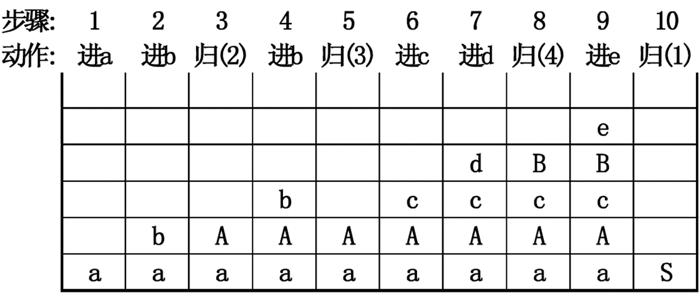 

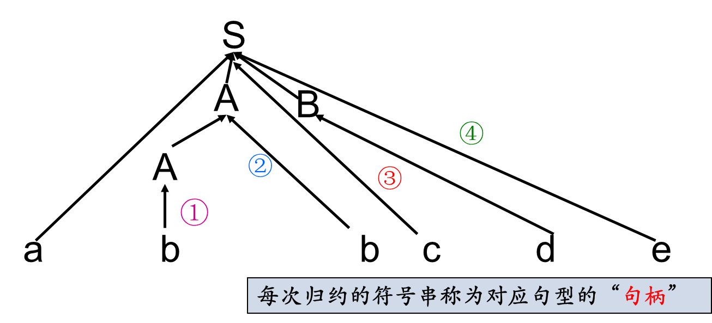

**最左归约：最右推导($→$)的反向过程**
$S→ aAcBe→ aAc\textcolor{#66ccff}{d}e→ a\textcolor{red}{Ab}cde→ a\textcolor{#66ccff}{b}bcde\\$

### 4.4.2 移入-归约分析器可采取的4种动作

- **移入**：将下一个输入符号移到栈的顶端
- **归约**：被归约的符号串的右端必然处于栈顶。语法分析器在栈中确定这个串的左端，并决定用哪个非终结符来替换这个串
- **接受**：宣布语法分析过程成功完成
- **报错**：发现一个语法错误，并调用错误恢复子例程

### 4.4.3 规约过程的问题

 

在步骤5(规约②)时, 栈为aAb, 此时规约方式有两种A→Ab和A→b

如果选择了A→b, 结果如下

 

后续无法继续规约, 出错

**错误原因**: 错误的识别了[句柄](# 短语&句柄)

### 4.4.4 基本概念

#### 短语&句柄

对于文法G[S]，$αβδ$是G的一个句型，如果有$S→^* αAδ$, 且：

- $A →^+ β$，则称β是句型αβδ相对于A的<mark>短语</mark>
- $A→β$ ，则称β是句型αβδ相对于A的<mark>直接短语</mark>（简单短语）
- 一个句型的**最左直接短语**称为该句型的<mark>句柄</mark> 

**例**


一个句型的**语法树**中

- 任一子树的叶节点所组成的符号串都是该句型的短语。
- 任一最小子树（树高为1）的叶节点所组成的符号串都是该句型的直接短语。
- 句柄是最左边的直接短语


#### 规范

- 在自底向上的分析中，总是采用最左归约的方式，因此把**最左归约**称为<mark>规范归约</mark>
- 规范归约是最右推导的逆过程，则**最右推导**相应地称为<mark>规范推导</mark>
- 由规范推导推出的句型称为<mark>规范句型</mark>

#### 前缀

<mark>前缀</mark>：符号串的首部

- 如: abc的前缀: ε,a,ab,abc

<mark>活前缀</mark>：文法G[S]的一个规范句型αβ，其中β 为终结符号串。若α不含句柄后的任何符号，则称α为活前缀（可行前缀）

- 如果α是含有句柄的活前缀，则称α为<mark>可归前缀</mark>。
- <mark>可归前缀</mark>即最长的活前缀


### 4.4.5 LR分析法

LR文法(Knuth, 1963) 是最大的、可以构造出相应移入-归约语法分析器的文法类

- L: 对输入进行从左到右的扫描
- R: 反向构造出一个最右推导序列

<mark>LR(k)分析</mark>

- 规范归约：**句柄**作为可归约串
- 需要向前查看k个输入符号的LR分析
  - k = 0 和 k = 1 这两种情况具有实践意义
  - 当省略(k)时，表示k =1 


LR分析法流程: 

1. 产生分析表:  
2. LR分析器工作: 

#### ①LR分析法的基本原理

自底向上分析的关键问题是**如何正确识别句柄**。句柄是逐步形成的，用“状态”表示句柄识别的进展程度。

- 历史：已经移入符号栈的内容
- 展望：根据产生式推测未来可能遇到的输入符号
- 现实：当前的输入符号

<mark>LR分析法</mark>：把“历史”信息和“展望”信息抽象成状态，由栈顶的状态和现行的输入符号唯一确定每一步的动作（移入或规约）

#### ②LR分析机(自动机)的总体结构

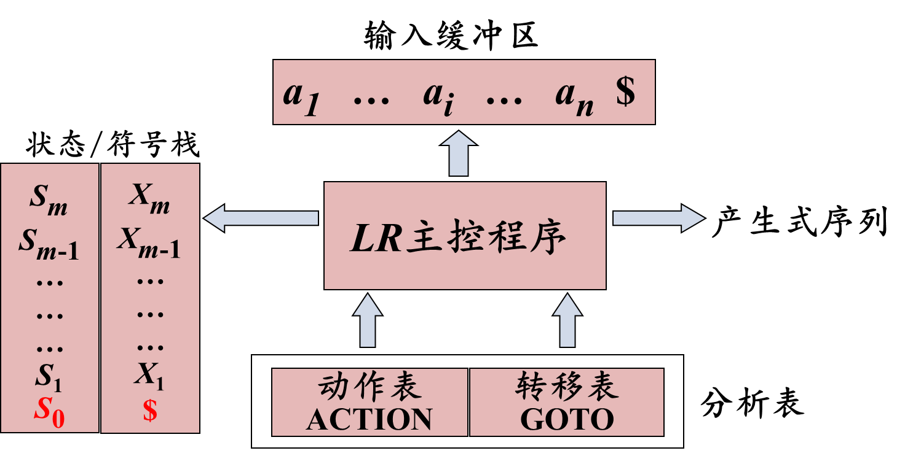

使用一个栈来保存文法符号，使用一个输入缓冲区来存放将要进行语法分析的其余符号

句柄在被识别（归约）时，总是完整地出现在栈顶

|            | 栈  | 输入 |
| ---------- | --- | ---- |
| 分析开始时 | $   | w$   |
| 分析终止时 | $S  | $    |

- S是文法的开始符号，w为待识别的输入串


#### ③LR分析表的结构


- ACTION: 状态s面临符号a时, 采取什么动作<br />GOTO: 状态s面临文法符号X时, 下一状态是什么
- 移进sn：将符号a、状态n压入栈
- 归约rn：用第n个产生式进行归约
- 接受acc: 宣布分析成功, 停止分析器工作
- 也就是状态机, 只不过没有用有向图来表示


### 4.4.6 LR分析表

#### ①LR(0)自动机

规范归约过程中

- 栈内的符号串和扫描剩下的输入符号串构成了一个规范句型
- 栈内如果出现句柄，句柄一定在栈的顶部
  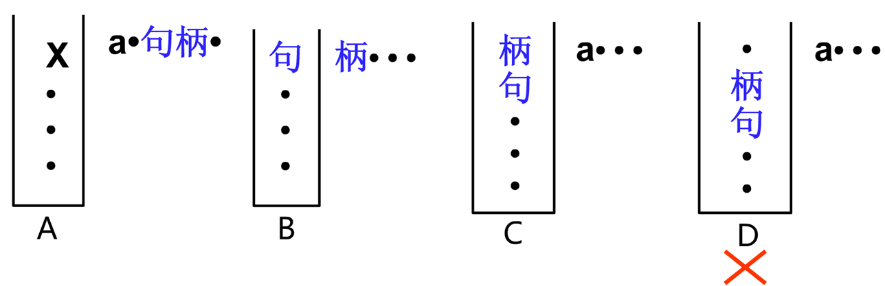

识别了句柄的一部分（规范句型的活前缀）就相当于识别了当前规范句型的左起部分

指导LR分析的目标：保证栈中总是活前缀

- 哪些字符串是活前缀？
- 能否构造一个DFA来识别活前缀？
  答：对于一个文法G，可以构造一个DFA，它能识别G的所有活前缀。


##### 增广文法

文法G[S]的增广文法$G’$ ：在G中引入一个新开始符号$S’$和一个新产生式$S’→S$而得到的文法

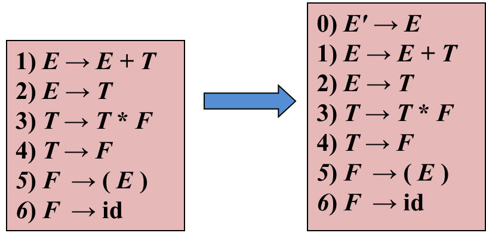

引入这个新的开始产生式的目的是: 使得文法开始符号仅出现在**一个产生式的左边**，从而使得分析器**只有一个接受状态**

- 新加的开始产生式记为0号

##### LR(0)项目

LR(0)项目: 由文法G的每个产生式右部加一个点构成，简称<mark>项</mark>。

例如  S→XYZ有四个项目： 
           S→•XYZ，S→X•YZ，S→XY•Z和S→XYZ•

- $A→\varepsilon$只有一个项目: $A→\bullet$ 

S→•XYZ: <mark>移进项目</mark>, 表示希望接下来在输入中看到一个能从XYZ推导得到的串。
S→X•YZ: <mark>待约项目</mark>, 表示在输入中已经看到了一个可以由X推导得到的串，希望接下来看到一个能从YZ推导得到的串
S→XYZ•: <mark>归约项目</mark>, 表示栈顶看到了XYZ，可以把它归约为S

<mark>后继项目</mark>（Successive Item）: 同属于一个产生式的项目，但圆点的位置只相差一个符号，则称后者是前f者的后继项目

- $A→α\cdot Xβ的后继项目是A→αX·β$ 

<mark>等价项目</mark>: 可以把等价的项目组成一个项目集( $I$ ) ，称为<mark>项目集闭包</mark>(Closure of Item Sets)，每个项目集闭包对应着自动机的一个**状态**


##### 项集的闭包

项集：项的集合

项集I的闭包CLOSURE(I)计算

1. 首先将I中所有元素加入CLOSURE(I).
2. 若A→α•Bβ∈CLOSURE(I)，将所有的B→γ产生式对应的项B→•γ 加入CLOSURE(I) 
    反复使用规则2，直至无新规则可加入

**算法**

```pseudocode
SetOfltems CLOSURE ( I ) {
J = I；
    repeat
        for ( J中的每个项A → α∙Bβ ) 
            for ( G的每个产生式B → γ ) 
                if ( 项B → ∙ γ不在J中 ) 
                    将B → ∙ γ加入J中；
    until 在某一轮中没有新的项被加入到J中;
    return J;
}
```

**例:** 
 

若 I = {E’ → .E}
则 CLOUSURE(I) = {
​	**E’ → .E** (闭包中的初始项)
​	E → .E+T 
​	E → .T 
​	T → .T*F 
​	T → .F
​	F → .(E)
​	F → .id
}

##### GOTO函数(转移函数)

GOTO(I,X)：项目集I对应于文法符号X的**后继项目集闭包**。

$GOTO( I, X )=CLOSURE(\{A→αX·β | A→α·Xβ∈I\})$

```pseudocode
SetOfltems GOTO ( I，X ) {
    将J 初始化为空集；                   
    for ( I 中的每个项A → α∙Xβ ) 
    	将项 A → αX∙β 加入到集合J 中；
    return CLOSURE ( J )；
}
```


##### LR(0)自动机

LR(0)的项目集规范族构成一个DFA ，它可以识别文法G的所有活前缀

文法$G = ( V_N , V_T , P , S )$的LR(0)自动机为$M = ( C, VN∪VT , GOTO, I_0 , F )$
其中 $\begin{align} &C={项目集规范族}\\
&I=GOTO(J,X ) \\
&I_0= CLOSURE({S′ →\cdot S })\\
&F= CLOSURE({S′ →S\cdot}) \end{align}$


- 后继项有多少个, 由当前状态的$\cdot$后面的符号的种类决定

##### LR(0)自动机的使用

文法G: $0:S’→S\$\\1:S→xxT\\2:T →y$分析输入串xxy\$

 

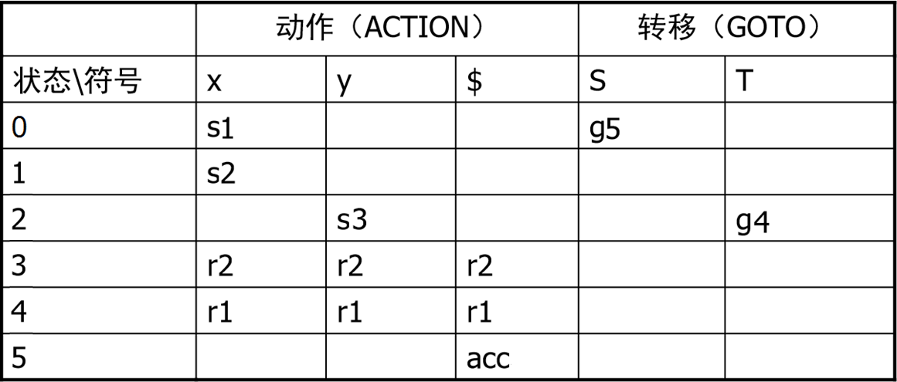 


##### LR分析表的结构

语法分析动作函数ACTION[i,a]：i为状态和a为**当前输入(或终结符$) ** *(输入是Token, 一定是终结符)*，其值有四种形式

- 移入sj。移入状态j，同时移入符号a
- 归约rj。假设第j条规则为$A→β$，则将栈顶的β归约为A。
- 接受。接受输入串，完成语法分析。
- 报错。在输入中发现一个错误并执行纠正动作。

转换函数GOTO[Ii,A]：i为状态和A为**非终结符**。若GOTO[Ii,A]=Ij，则在当前状态为i，归约得到非终结符A时，移入与A对应的状态j。

如果基于某文法构建的所有LR(0)项集，要么只有移入项目，要么只有一个归约项目，则可以构建LR(0)分析表，并且：

- 该文法称为LR(0)文法
- 在分析时，不需要看输入即可确定动作
- 分析表中，归约项目无需考虑后继。


##### LR分析表的构造

构造G'的规范LR(0)项集族C = { I0, I1, … , In}

令Ii对应状态i。ACTION表和GOTO表构造如下：

- if $A→α·aβ∈I_i\and GOTO( I_i , a )=I_j$ then $ACTION[ i, a ]=S_j$
   - *移入* 

- if $A→α.Bβ∈I_i \and GOTO( I_i , B )=I_j$ then $GOTO[ i, B ]=j$ 
   - *状态转换*

- if $A→α·∈Ii \and A ≠ S'$ then for $\forall a∈V_T∪\{\$\}$
   do $ACTION[ i, a ]=r_j （j是产生式A→α的编号）$
   - *归约, 一整行都填上R*

- $if\ S'→S· ∈I_i\quad then\ ACTION [ i, \$ ]=acc$ 
  - acc是唯一的
- 没有定义的所有条目都设置为“error” 

|     | a   | b   | c   | d   | $   |     | E   | A   | B   |
| --- | --- | --- | --- | --- | --- | --- | --- | --- | --- |
| 0   | S2  | S3  |     |     |     |     | 1   |     |     |
| 1   |     |     |     |     | acc |     |     |     |     |
| 2   |     |     | S5  | S6  |     |     |     | 4   |     |
| 3   |     |     | S8  | S9  |     |     |     |     | 7   |
| 4   | r1  | r1  | r1  | r1  | r1  |     |     |     |     |
| 5   |     |     | S5  | S6  |     |     |     | 10  |     |
| 6   | r4  | r4  | r4  | r4  | r4  |     |     |     |     |
| 7   | r2  | r2  | r2  | r2  | r2  |     |     |     |     |
| 8   |     |     | S8  | S9  |     |     |     |     | 11  |
| 9   | r6  | r6  | r6  | r6  | r6  |     |     |     |     |
| 10  | r3  | r3  | r3  | r3  | r3  |     |     |     |     |
| 11  | r5  | r5  | r5  | r5  | r5  |     |     |     |     |


#### ②SLR分析

> LR(0)文法太简单，能分析的文法有限，没有太大的实用价值
>
> - LR(0)分析表可能包含冲突
> - 如果LR(0)分析表中**没有语法分析动作冲突**，那么给定的文法就称为LR(0)文法

##### 引入–LR(0)中的冲突问题

LR(0)中的冲突问题: 

 


状态2中有移入–归约冲突

**LR(0)冲突解决方式**: 向前看一个输入符号**a**

对于$I_2$中冲突的$\begin{aligned}&E→T\cdot +E\\&E→T\cdot\end{aligned}$ 对于下一个输入的symbol a

- 如果$a=+$, 执行s3; 
- 如果$a\in FOLLOW(E) = \{\$\}$, 使用$E→T\cdot$规约

##### SLR分析法

**基本思想**: 

- $$对于项目集I, 有: \ \begin{aligned}&m个移进项目\begin{cases}A_1{→}\alpha_1{\cdot}a_1\beta_1\\A_2{→}\alpha_2{\cdot}a_2\beta_2\\\cdots\\A_m{→}\alpha_m{\cdot}a_m\beta_m \end{cases}
  \qquad n个规约项目\begin{cases}B_1{→}\gamma_1.\\B_2{→}\gamma_2.\\\cdots\\B_n{→}\gamma_n.\end{cases}\end{aligned}$$
-  如果集合$\{a_1, a_2, …, a_m\}$和$FOLLOW(B_1)， FOLLOW(B_2)，…，FOLLOW(B_n)$**两两不相交**，
  则项目集I中的冲突可以按以下原则解决： 
  - 设a是下一个输入符号 (look ahead)
  - 若$a∈\{a_1, a_2, …, a_m\}$，则**移进a** (与LR(0)相同)
  - 若$a∈FOLLOW(B_i)$，则用产生式 $B_i→γ_i$ **归约** (多了FOLLOW的判断)
  - 此外，报错

这种解决方法是比较简单的，因此称作<mark>SLR(1)分析</mark>，由此构造的分析表，称作<mark>SLR分析表</mark>。

##### SLR分析表构建

> 与LR(0)分析表相似

构造G'的规范LR(0)项集族C = { I0, I1, … , In}

令Ii对应状态i。ACTION表和GOTO表构造如下：

- if $A→α·aβ∈I_i\and GOTO( I_i , a )=I_j$ then $ACTION[ i, a ]=s_j$ 
- if $A→α.Bβ∈Ii \and GOTO( I_i , B )=I_j$ then $GOTO[ i, B ]=j$ 
- if $A→α·∈Ii \and A ≠ S'$ then $\textcolor{red}{for\ \forall a∈FOLLOW\{A\}}$
   do $ACTION[ i, a ]=r_j （j是产生式A→α的编号)$ 
  
  - > LR(0)分析表: 
    > if $A→α·∈Ii \and A ≠ S'$ then for $\textcolor{red}{\forall a∈V_T∪\{\$\}}$
    > do $ACTION[ i, a ]=r_j （j是产生式A→α的编号）$
  
  - 对于归约项, 此时**并不是一整行都填r**, 而是判断对于一个终结符 有没有可能跟在A的后面(通过FOLLOW(A)), 较为简单地处理移入-规约冲突
- $if\ S'→S· ∈I_i\quad then\ ACTION [ i, \$ ]=acc$ 
  - acc是唯一的
- 没有定义的所有条目都设置为“error” 

如果给定文法的SLR分析表中**不存在有冲突的动作**，那么该文法称为<mark>SLR文法</mark>

##### 例

例4-32 文法G[S]
	  S→AB  	  A→aBa|ε	  B→bAb|ε

1. 该文法是SLR(1)的吗？
2. 若是，请构造它的分析表。
3. 给出输入串baab$的分析过程。


#### ③LR(1)分析

##### 引入–SLR的缺陷

1. <mark>SLR(1)分析</mark>(Simple LR)：基于LR(0)，通过进一步判断一个向前符号，来决定是否执行归约动作
   - $A→α•$ 归约，当且仅当y∈FOLLOW(A)


2. 优点：

   - 相比LR(0)，有可能减少需要归约的情况

   - 有可能消除移入-归约冲突


3. 缺点

   - **仍然有冲突出现的可能**: SLR只是简单地考察下一个输入符号b是否属于与归约项目A→α相关联的FOLLOW(A)，但b∈FOLLOW(A)只是归约α的一个必要条件，而非充分条件

   - 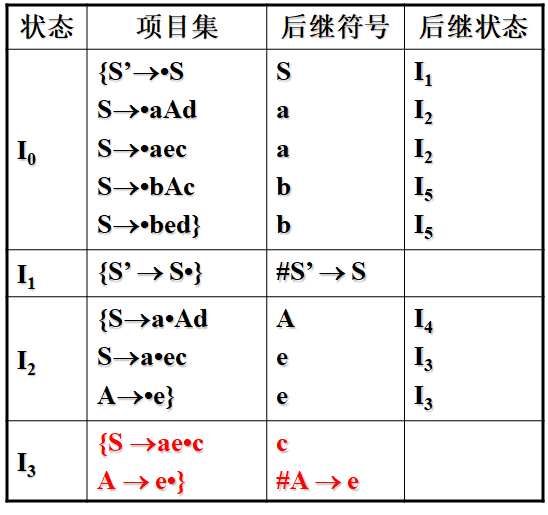  

   - **FOLLOW(A)={c,d}**, 考虑FOLLOW(A)并不足以解决冲突

##### LR(1)

解决方法：

- 通过**分裂状态**，使LR分析器的每个状态$A→\alpha \cdot$能确切知道句柄α后紧跟哪些终结符时才能把α归约成A
  - *FOLLOW(A)的范围是所有深度的产生式, 不够精确*

- 对于产生式 A→α的归约，在**不同的使用位置**，A会要求不同的后继符号 (如下图)
- 

##### 规范LR(k)项目

形式：$[A→α•β,\ a_1a_2…a_k]$

- $a_1a_2…a_k$表示A后面必须紧跟的终结符号串(长度为k)，称为该项的<mark>展望符</mark>（或向前<mark>搜索符号串</mark>）

**展望符的使用**: 

- $β\neq \varepsilon$, $a_1a_2…a_k$**不起作用**(无视)

- 当$\beta = \varepsilon$时, $A→\alpha \cdot$是归约项

- 对归约项目$[A→α•,\ a_1a_2…a_k]$，仅当前输入符号串开始的前k个符号是$a_1a_2…a_k$时，才能用A→α进行归约

当k=1时，此时的项目$[A→α•β,a]$称为LR(1)项目

##### 规范LR(1)项目

<mark>LR(1)项目</mark>：扩充LR(0)项目，使之包含终结符a或结束标记作为第2个成分(**搜索符**)，一般形式为:

- $[A → α•β, a]$

搜索符a实际上是**归约条件**：

- 在β非空(即不是规约项目)时，不考虑a；
- 在β为空时（即当前为归约项目），则**只有当前输入为a**时，方可按$A → α$进行归约
  - 同样是对规约操作的产生添加了条件

- 这样的a的集合总是FOLLOW(A)的**子集**，有可能是真子集。


##### 展望符的计算

> 其他与LR（0）相同，仅**闭包的计算不同**, 需要根据展望符计算闭包
>

考虑展望符的闭包的计算方式: 

- 对项目 $[A→α·Bβ, a]$，添加$[B→·γ, b]$到当前**项目集**，其中展望符$b∈FIRST(βa)$​ 
- 对项目集之间的转换, 展望符不变


先基于LR(0)的分析表


例4-35 对文法   S→L=R | R       L→*R | i      R→L
构造LALR分析表

解：

- 增加产生式S’→ S，得到增广文法G[S’] ：
  		(0)S’→S             	(1)S→L=R
    		(2)S→R 		(3)L→*R
    		(4)L→ i           	(5)R→L

- 写出项目
  1. $\begin{aligned}&S’→\cdot S, \$\\&S→\cdot L=R, \$\\&S→\cdot R,\$
     \\&L→\cdot *R, =\\& L→\cdot i, =\\&R→\cdot L,\$\\&↑得新项目\\&L→.*R, \$\\&L→.*i, \$\\\end{aligned}$ 
     **合并**后生成的L和之前的L: 
     $\begin{aligned}&S’→\cdot S, \$\\&S→\cdot L=R, \$\\&S→\cdot R,\$
     \\&L→\cdot *R, =|\$\\& L→\cdot i, =|\$\\&R→\cdot L,\$\\\end{aligned}$ 
  2. 

#### ④LALR分析

<mark>同心集</mark>：具有相同核心（LR(1)项目集的第一分量集合）的项集，即**除展望符外**，两个LR(1)项目集是相同的

<mark>LALR分析</mark>：寻找同心集，并将它们合并成一个项集。

- 可以压缩LR(1)分析表中的状态数，从而可能得到LALR分析表
- 压缩可能导致归约/归约冲突 (此时文法不是LALR)
- 压缩不会导致移入/归约冲突


#### 小结

| 步骤                   | LR(0) | SLR(1) | LR(1) | LALR(1) |
| ---------------------- | ----- | ------ | ----- | ------- |
| 构建增广文法(S’→S)     | ✓     | ✓      | ✓     | ✓       |
| 对所有规则编号         | ✓     | ✓      | ✓     | ✓       |
| 求非终结符的FOLLOW集   |       | ✓      |       |         |
| 构建LR(0)项目集族      | ✓     | ✓      |       |         |
| 构建LR(1)项目集族      |       |        | ✓     | ✓       |
| 合并同心集             |       |        |       | ✓       |
| 根据项目集族构建分析表 | ✓     | ✓      | ✓     | ✓       |

- 区别在于: 归约项$A → α\cdot$填入的选择方式
  - LR(0)满行
  - SLR(1)看FOLLOW(A)
  - LR(1)和LALR(1)看前向搜索符(展望符, lookahead1) 

### 4.4.7 二义文法

- 二义文法不是LR类文法（也非LL文法）。
- 某些二义文法，很容易理解，因此，在构建LR分析器时可以特殊处理
  - 例如可以通过人为地规定优先级和结合性（解决冲突），来构建LR分析器
  - 应该保守地使用二义性文法，并且必须在严格控制之下使用，因为稍有不慎就会导致语法分析器所识别的语言出现偏差


- 在I7状态，遇+，根据左结合率，应对栈内+归约。
- 在I7状态，遇\*，根据优先级，应将\*移入栈内。
- 在I8状态，遇+，根据优先级，应对栈内*归约。
- 在I8状态，遇\*，根据左结合率，应对栈内\*归约。

# 第5章 语法制导翻译

## 5.1 什么是语法制导翻译

### 5.1.1 语义翻译&&语法制导翻译


语法制导翻译使用上下文无关文法CFG（context free grammar）来引导对语言的翻译，是一种面向文法的翻译技术


### 5.1.2 语义分析的任务

1. 检查语言结构的语义是否正确
2. 执行所规定的语义动作
   - 表达式的求值
   - 在符号表中存放信息
   - 给出错误信息
   - 中间代码的生成
   - 执行任何其他动作

### 5.1.3 语法制导翻译

- 语法分析---建立语法分析树
- 语义分析---遍历语法分析树
- 语法制导翻译---建立与遍历同时完成

语法制导翻译是目前最常用的语义分析技术


### 5.1.4 语法制导翻译的基本思想

1. 当归约（或推导）到某个产生式时，除了按照产生式进行相应的代换之外(语法分析)，还要按照产生式所对应的语义规则**执行相应的语义动作Action**，如计算表达式、产生中间代码(语义分析)

2. 如何表示语义信息？
   - 为CFG中的文法符号设置**语义属性**，用来表示语法成分对应的**语义信息**
3. 如何计算语义属性？
   - 对于给定的输入串x ，构建x的语法分析树，并利用与**产生式（语法规则）**相关联的语义规则来计算分析树中各结点对应的**语义属性值**
   - 文法符号的语义**属性值(value)**是用与文法符号所在**产生式（语法规则）**相关联的语义规则来计算的
4. 语义规则也叫语义子程序或语义动作
5. 将语义规则同语法规则（产生式）联系起来有两种方式：
   - [语法制导定义](# 5.2 语法制导定义(SDD))(Syntax-Directed Definitions, SDD)
   - [语法制导翻译方案](# 5.4 语法制导翻译方案SDT) (Syntax-Directed Translation Scheme , SDT )


## 5.2 语法制导定义(SDD)

<mark>语法制导定义</mark>(Syntax-Directed Definitions, SDD)是对CFG(上下文无关文法 context free grammer)的推广

- 将每个**文法符号**和一个**语义属性**集合相关联
- 将每个产生式和一组**语义规则**相关联，这些规则用于计算该产生式中各文法符号的属性值
- 如果X是一个文法符号，a是X的一个属性，则用X.a表示属性a在某个标号为X的分析树结点上的值

文法符号的属性

- 综合属性 (synthesized attribute)
- 继承属性 (inherited attribute)

### 5.2.1 综合属性和继承属性

1. 在分析树结点N上的**非终结符A**的<mark>综合属性</mark>只能通过N的**子结点**或N**本身的属性值**来定义 (*自底向上*)
   - *赋给产生式左边的, 非终结符A属性的值只有子节点/自身的属性值*
   - 例: 
   - **终结符可以具有综合属性**。
     终结符的综合属性值是由词法分析器提供的词法值，因此在SDD中没有计算终结符属性值的语义规则
   
2. 在分析树结点 N上的**非终结符A**的<mark>继承属性</mark>只能通过 N的**父结点**、N的**兄弟结点**或 N**本身的属性值**来定义 (*自顶向下or左右*)
   - *赋给产生式右边的, 非终结符B的属性的值, 只有兄弟(产生式)/父亲(产生式左部)/自身的属性值* 
   - 例: 
   - **终结符没有继承属性**。终结符从词法分析器处获得的属性值被归为综合属性值(一般命名为lexeme)

|          | 综合属性                                                 | 继承属性                                                                           |
| -------- | -------------------------------------------------------- | ---------------------------------------------------------------------------------- |
|          | 自下而上传递信息                                         | 自上而下传递信息                                                                   |
| 语法规则 | 根据右部候选式中的符号的属性计算左部被定义符号的综合属性 | 根据右部候选式中的符号的属性和左部被定义符号的属性计算右部候选式中的符号的继承属性 |
| 语法树   | 根据子结点的属性和父结点自身的属性计算父节点的综合属性   | 根据父结点和兄弟节点的属性计算子结点的继承属性                                     |

- 判断一个符号的属性类型: 对于产生式A->BCD和给出的语义规则
  - 可以判定左部A的某个属性是综合属性
  - 可以判定右部BCD的某个属性是继承属性

例5-1续   3*5 +4n的分析过程（P195 例5.1）


- 副作用(Side effect): 没有对属性进行修改的属性
- 没有副作用的SDD有时也称为<mark>属性文法</mark>


### 5.2.2 SDD属性的计算–语义规则

对出现在产生式**右边的继承属性**和出现在产生式**左边的综合属性**都必须提供一个**计算规则**。

属性计算规则中只能使用**本产生式中**的文法符号的属性。如：
     	F → digit		
      	F.val = digit.lexval

出现在产生式**右边的综合属性**和出现在产生式**左边的继承属性**不由该产生式所给的属性计算规则进行计算，由其他产生式的属性计算规则或者由属性计算器的参数提供


### 5.2.3 SDD属性求值顺序

SDD为CFG中的文法符号设置语义属性。对于给定的输入串x，应用语义规则计算分析树中各结点对应的属性值

应按照什么顺序计算属性值？

- 语义规则建立了属性之间的依赖关系，在对语法分析树节点的一个属性求值之前，必须首先求出这个属性值所依赖的所有属性值

#### ① 依赖图 Dependency Graph

> 语法树中各结点的综合属性和继承属性之间的相互依赖关系可以用依赖图（有向图）来描述。

1. <mark>依赖图</mark>指出语法树中各结点属性值的计算顺序。
   特点：先有文法，后确定语义计算顺序

2. **构建依赖图:** 
   - 分析树中每个标号为X的结点的每一个属性a都对应依赖图中的一个结点，
   - 如果属性X.a的值依赖于属性Y.b的值，则依赖图中有一条从Y.b的结点指向X.a的结点的有向边

3. 构建算法

   - ```pseudocode
     for 分析树中的每个结点n do      //构建结点
     	for 结点n对应文法符号的每个属性a do
     		在依赖图中为a构建一个结点
     ```

   - ```pseudocode
     for 分析树中的每个结点n do      //标记依赖
     	for 结点n的产生式的每条语义规则b=f(c1,c2,…,ck) do
     		for(i=1 to k) do
     			从结点ci到结点b构造一条有向边
     ```

4. 如果一个SDD中不存在属性之间的循环依赖关系（即依赖图中不存在环），则该文法是良定义的，依赖图存在拓扑排序。
   - 拓扑排序：对于节点m1,m2,…,mk，若mi→mj是从mi到mj的边，则在排序中mi排在mj前面，有向图变成一个线性排序
   - 一个依赖图的任何拓扑排序都给出一棵语法树中结点的语义规则计算的有效顺序


#### ② SDD属性的求值顺序

1. 对于只包含综合属性的SDD，属性值的计算正好和**自底向上分析**建立分析树结点同步进行
2. 对于同时具有继承属性和综合属性的SDD，不能保证一定存在一个顺序来计算所有的属性值
   - 如果图中没有环，那么至少存在一个拓扑排序
3. 从计算的角度看，给定一个SDD，很难确定是否存在某棵语法分析树，使得SDD的属性之间存在循环依赖关系，但可以给出一组充分条件，满足这组充分条件的SDD是无循环依赖的


#### ③ S-属性定义

**仅使用综合属性**的SDD称为<mark>S属性的SDD</mark>，或<mark>S-属性定义</mark>、<mark>S-SDD</mark>

- 如果一个SDD是S属性的，可以按照语法分析树节点的任何自底向上顺序来计算它的各个属性值
- S-属性定义可以在自底向上的语法分析过程中实现


#### ④ L-属性定义

<mark>L-属性定义</mark>(也称为L属性的SDD或L-SDD)的直观含义：在一个产生式所关联的各属性之间，依赖图的边可以**从左到右**，但**不能从右到左**(因此称为L属性，L是Left的首字母)

一个SDD是L-属性定义，当且仅当它的每个属性

- 要么①是一个**综合属性**(***S-属性一定是L-属性***)，

- 要么②是满足如下条件的**继承属性**：假设存在一个产生式$A→X_1X_2…X_n$，其右部符号$X_i (1\leq i \leq n)$的继承属性仅依赖于下列属性：

  - A的**继承属性**

  - 产生式中$X_i$**左边**的符号 $X_1, X_2, … , X_{i-1}$ 的属性(普通的继承属性可以依赖右边)

  - $X_i$本身的属性，但$X_i$的全部属性不能在依赖图中形成环路


- > *这样定义的本质就是为了确定一个顺序, 避免环路(离散数学?任意两个元素均可以比较)*

#### ⑤ 计算属性值过程——依赖图方法

1. 创建分析树 (自顶向下或自底向上)
2. 构建依赖图 (基于分析树和语义规则)
3. 对依赖图，进行拓扑排序
4. 计算属性值


## 5.3 语法制导翻译的应用

### 5.3.1 什么是抽象语法树

在语法分析树中去掉那些对翻译不必要的信息，从而获得更有效的源程序中间表示。这种经变换后的语法树称为抽象语法树（Abstract Syntax Tree）

|                          S→if B then S1 else S2                           |                                   3*5+4                                   |
| :-----------------------------------------------------------------------: | :-----------------------------------------------------------------------: |
|  |  |


### 5.3.3 建立表达式的抽象语法树

两个建立结点的函数（返回值为指向新建立结点的指针）

- $Node(op,c_1,c_2,…,c_k)$：建立内部结点，op为运算符，其余k个字段的值为指向其它结点的指针(指向child/其他运算符)
- $Leaf(op,val)$ ：建立叶结点，op为记号，val为指向符号表相关项目的指针。

#### 例5-6

> 例5-6 构建a-4+c的抽象语法树（P203 例5.11）

| 产生式        | 语义规则                                  |
| ------------- | ----------------------------------------- |
| `E -> E1 + T` | `E.node = new node("+", E1.node, T.node)` |
| `E -> E1 - T` | `E.node = new node("-", E1.node, T.node)` |
| `E -> T`      | `E.node = T.node`                         |
| `T -> (E)`    | `T.node = E.node`                         |
| `T -> id`     | `T.node = new leaf(id, id.lexval)`        |
| `T -> num`    | `T.node = new leaf(num, num.val)`         |


## 5.4 语法制导翻译方案SDT

### 5.4.1 SDT定义

<mark>语法制导翻译方案</mark>(SDT)是SDD的补充，它在产生式右部中**嵌入了程序片段**(称为**语义动作**)的CFG，并在语法分析的同时执行这些语义动作。

- > *这样可以写出属性计算的次序*

例5-7 把带加号和减号的中缀表达式翻译成相应的后缀表达式

E → TR
R → +T`{print(‘+’);}`R | -T`{print(‘-’);}`R | ε
T → num`{print(num.val);}`

- *在中缀的语法产生式中, 在后缀符号位置插动作* 


### 5.4.2 SDT测试原则

SDT类似于SDD，SDT可以看作是SDD的具体实施方案，它的语义规则的计算顺序是显式给出的，这样就可以把具体的实现细节表示出来

SDT的设计原则：保证语义动作**不会引用**还**没有计算的属性值**。

- **L-属性定义**：本身就能确保每个动作不会引用尚未计算出来的属性。
- **S-属性定义**：为每一个语义规则建立一个包含赋值的动作，并**把这个动作放在相应的产生式右边的末尾**。

本节主要关注如何使用SDT来实现两类重要的SDD，因为在这两种情况下，SDT可以在语法分析过程中实现

- 基本文法可以使用LR分析技术，且SDD是S属性的
- 基本文法可以使用LL分析技术，且SDD是L属性的

### 5.4.3 S-属性定义的SDT (后缀SDT)

> 全是综合属性, 使用LR分析法

1. S-属性定义：只包含综合属性
2. 综合属性可以在分析输入符号串的同时由自下而上的分析器来计算
   - 分析器保存与栈中**文法符号**有关的**综合属性**值
   - 每当进行**归约**时，新的属性值就由栈中正在归约的产生式右边符号的属性值来计算
3. 将一个S-SDD转换为SDT的方法：为每一个语义规则建立一个包含赋值的动作，并把这个动作放在相应的产生式**右边的末尾**。当按照该产生式进行**归约**时，**执行**这个动作。
   - 在分析栈中使用一个附加的域来存放综合属性值。
     - 实验用的就是S属性定义的SDT
   - 设语义规则 A .a=f(X.x, Y.y, Z.z)对应于产生式A→XYZ
   - 

  


### 5.4.4 L-属性定义的SDT

1. L-属性定义：包含综合属性和特殊的继承属性

   - 产生式右边的符号的**继承属性**必须在这个符号以前的动作中计算出来。

   - 一个动作不能引用这个动作右边符号的综合属性。

   - 产生式左边非终结符号的综合属性只有在它所引用的所有属性都计算出来以后才能计算。计算这种属性的动作应放在产生式右端的末尾。
2. **将L-SDD转换为SDT的规则**
   - 将计算某个非终结符号A的**继承属性**的动作插入到产生式右部中紧靠在A的本次出现**之前**的位置上
   - 将计算一个产生式左部符号的**综合属性**的动作放置在这个产生式右部的**最右端**
   - 例: 
     - L-SDD: 
     - SDT: 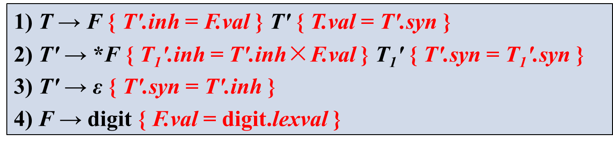

#### L-属性定义的SDT的实现

如果一个L-SDD的基本文法可以使用LL分析技术，那么它的SDT可以在LL或LR语法分析过程中实现
- 在递归的预测分析过程中进行语义翻译
- 在非递归的预测分析过程中进行语义翻译
- 在LR分析过程中进行语义翻译


## 5.5 自顶向下翻译

1. 自顶向下的翻译过程中，语义动作是在处于相同位置的符号**被展开（或匹配成功）**时执行的
2. 为了构造不带回溯的自顶向下语法分析，必须消除文法中的左递归，提取左公因子
3. 当消除一个翻译模式的基本文法的左递归时，同时考虑**S-属性**的翻译模式

### 5.5.1 消除左递归的一般方法

左递归文法不能按照自顶向下方式确定地进行语法分析，当文法是SDT的一部分的时候，在消除文法左递归的同时还需要考虑如何处理其中的语义动作。

- 含有综合属性的翻译方案（文法有左递归）
  $A→ A_1 Y \{A.a = \textcolor{blue}{g(A_1.a , Y.y)} \}$
  $A→ X \{A.a = \textcolor{red}{f(X.x)} \}$  其中，g和f是任意函数
-  

### 5.5.2 递归下降分析器的设计

**扩展分析器（设函数fA()为分析非终结符A的过程）**

- A的每个**继承属性**对应函数A的一个参数
- 函数fA的返回值为A的综合属性值
- 函数fA的函数体 : 根据当前的输入决定使用哪个产生式
  - 对出现在A产生式中的每个文法符号的每个属性都设置一个局部变量
  - 为了计算这些属性值所需的其它变量

与每个产生式有关的代码执行如下动作：从左到右考虑产生式右部的词法单元、非终结符及语义动作   

- 对于**带有综合属性x的词法单元X**: 把x的值保存在局部变量X.x中；然后产生一个匹配X的调用，并继续输入
- 对于**非终结符B**: 产生一个右部带有函数调用的赋值语句c = B(b1 , b2 , …, bk)，
  其中， b1 , b2 , …, bk是代表B的继承属性的变量，c是代表B的综合属性的变量
- 对于每个**动作**: 将其代码复制到语法分析器，并把对属性的引用改为对相应变量的引用


## 5.6 L属性的SDD的自底向上分析

> 自底向上分析显然可以处理S属性定义 
>

L属性定义需要解决的问题: 

- **嵌入语义动作的处理**
  - 引入标记**非终结符号M**（也称为占位符）和规则M→ε 
  - 将原语义动作与规则M→ε结合，去掉原嵌入语义动作
    - 如$A→α\{action1\}β\{action2\}\\$改为 $A→αMβ &\{action2\}\\M→ε&\{action1\}$ 
- **继承属性的处理**
  - action1所需要的A或α中符号的任何属性 作为M的继承属性进行拷贝
  - 按action1计算各属性，并作为M的综合属性

### 普通的嵌入语义动作


$\Longrightarrow$


### 继承属性处理

**规则右部文法符号继承属性的处理**

- 参照嵌入语义动作处理


- `B.i=f(A.i)`：继承属性B.i根据继承属性A.i计算。
- 引入标记M，M有继承属性M.i和综合属性M.s
  - M.i是A.i的一个拷贝
  - M.s将成为B.i，它按B.i的方法计算

**规则左部文法符号继承属性的处理**

- 约定：信息直接**埋入**栈内该文法符号下面一个符号的属性值内


- S.next是S的继承属性, 在这个产生式归约之前就有值了
- 但如果是自底向上分析, 这时S这个符号还不会出现在符号栈中


- 提前将S.next放到栈中, 引用时访问栈

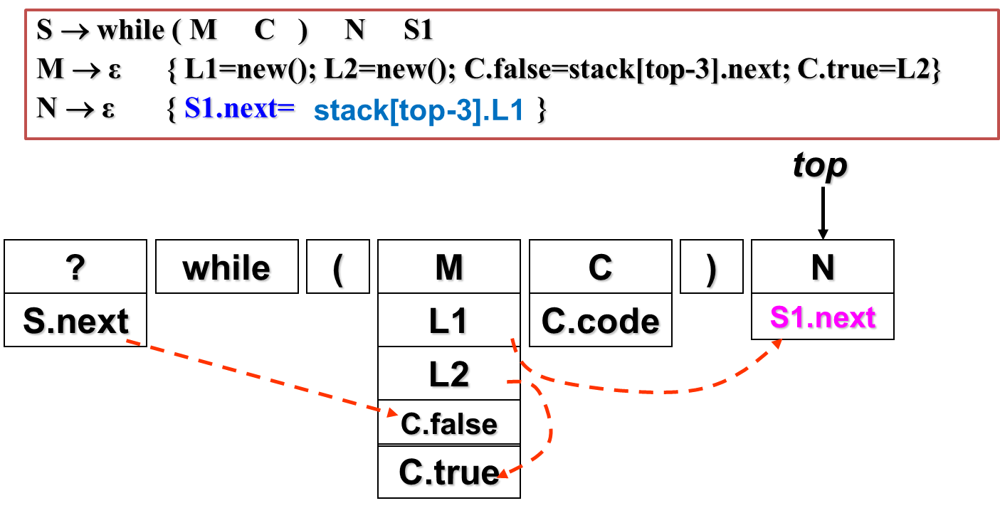


# 第6章 中间代码生成

**中间语言（表示）**

- 独立于机器
- 复杂性介于源语言与目标语言之间

**引入中间语言的优点**

- 便于进行与机器无关的代码优化工作
- 易于移植
- 使编译程序的结构在逻辑上更为简单明确

## 6.1 常用的中间表示

### 6.1.1 后缀式(逆波兰式)

略

### 6.1.2 图形表示

图形表示法: <mark>抽象语法树AST</mark>, <mark>有向无环图DAG</mark>

有向无环图（Directed Acyclic Graph， DAG ）

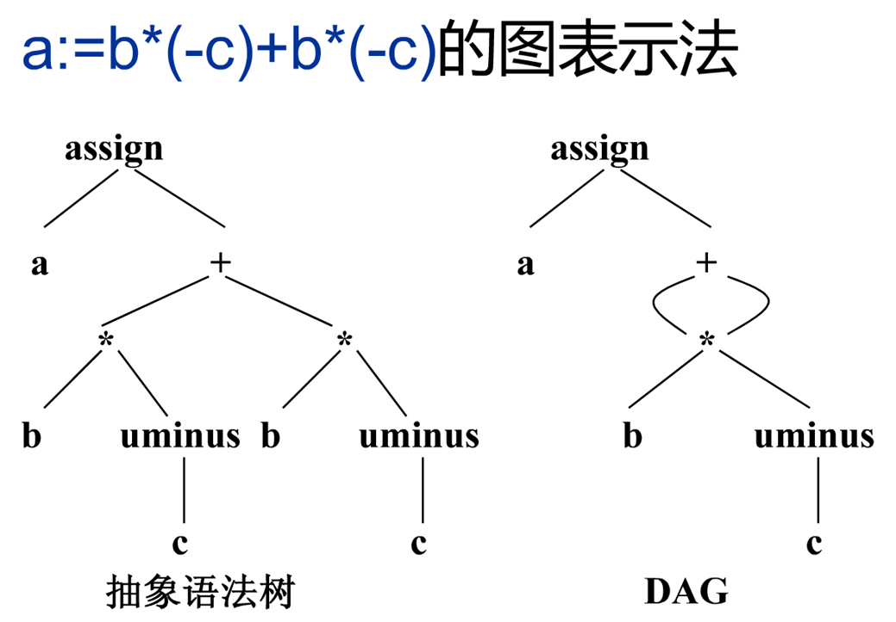

- DAG表示法中, 箭头默认向下, 不用画出来
- 后缀式是语法树的线性表示（后序遍历）
  - `a b c minus * b c minus * + assign`

#### 建立抽象语法树的语义规则

> *其实就是用代码生成抽象语法树*

**例5-6 构建a-4+c的抽象语法树（P203 例5.11）**

| 产生式        | 语义规则                                  |
| ------------- | ----------------------------------------- |
| `E -> E1 + T` | `E.node = new node("+", E1.node, T.node)` |
| `E -> E1 - T` | `E.node = new node("-", E1.node, T.node)` |
| `E -> T`      | `E.node = T.node`                         |
| `T -> (E)`    | `T.node = E.node`                         |
| `T -> id`     | `T.node = new leaf(id, id.lexval)`        |
| `T -> num`    | `T.node = new leaf(num, num.val)`         |


#### 构建DAG的值编码方法

**语法树或DAG图的结点通常存放在一个记录数组中** 

- 数组的每一行是一个记录，表示一个结点
- 数组下标为对应结点的值编码
- **叶结点**包含记号字段和一个附加字段, 存放词法值（标识符时为指向符号表相应项目的指针，数字时是常量）
- **内部结点**包含运算符字段和若干附加字段，指向其儿子结点


### 6.1.3 三地址码

<mark>三地址码</mark>（TAC，三地址代码）用来**描述指令序列**，**指令的右侧最多有一个运算符**。

- $x+y*z \stackrel{三地址码}\Longrightarrow \begin{cases}t_0 = y*z \\ t_1 = z+t_0\end{cases}$ 

三地址码可以看成是抽象语法树或DAG的一种**线性表示**。

表示形式：四元式、三元式、间接三元式

#### 三地址码例

|                                                                                                              | AST转三地址                                                          | DAG转三地址                                 |
| ------------------------------------------------------------------------------------------------------------ | -------------------------------------------------------------------- | ------------------------------------------- |
|  | T1:=-C<br/>T2:=b\*T<br/>T3:=-C<br/>T4:=b\*T3<br/>T5:=T2+T4<br/>a:=T5 | T1:=-C<br/>T2:=b*T1<br/>T5:=T2+T2<br/>a:=T5 |

#### 常用三地址码

##### 赋值指令

- `x = y op z`：x,y,z是地址，op是双目运算符
- `x = op y`：op是单目运算符
- `x = y`：赋值指令
- 带下标的赋值指令
  - `x = y[i]`：将距离y处i个内存单元的位置中存放的值赋给x.
  - `x[i] = y`：将距离x处i个内存单元的位置中的内容置为y的值
- 地址赋值指令
  - `x = &y`：将x的右值设置为y的左值(地址)
- 指针赋值指令
  - `x = *y`：将x的右值置为地址y的值。
  - `*x = y`：把y的右值赋到地址x。

##### 转移指令goto L

- 表示下一步执行带有标号L的三地址指令
- 条件转移指令
  - `if x goto L`: x 为真时转L
  - `if false x goto L`: x为假时转L
  - `if x rel.op y goto L`: x和y之间满足rel.op关系时转L
    - $rel.op  \in\{<,\le,=,\neq,>,\ge\}$

##### 过程调用及返回

- `param x`参数传递 :传递参数x
- `call p,n` 过程调用：调用p过程，实参个数为n
- `y=call p,n`函数调用: 调用p过程，返回值为y


例: 翻译语句：do i = i + 1; while (a[i]<v);


#### 四元式

> 三地址码说明了各类指令的组成部分，但未描述指令在某个数据结构中的表示方法。

三地址码可以用四元式、三元式和间接三元式来描述。

四元式是4个字段的记录结构：`op, arg1, arg2, result`

- arg1, arg2, 和result通常指向符号表项目的入口


##### 一些常用四元式

goto L:  

if a<b goto L: 

#### 三元式

三元式是3个字段的记录结构：`op, arg1, arg2`

- 三元式可以避免引入临时变量
- 使用运算`x op y`的位置来表示它的运算结果。
- 用**带有括号的数字**表示指向三元式结构的指针

**【例6-2】续3 `a=b*(-c)+b*(-c)` 的三元式**


#### 间接三元式

> 在**优化**编译器中，指令实际存储位置常常会发生变化，当移动一个变量的指令时，如果使用三元式表示法，需要修改引用该指令地址的所有指令。

间接三元式包含：`三元式表 + 间接码表`

**间接码表**（指针数组）

- 一张指示器表，按运算的先后次序列出有关三元式在三元式表中的位置

优点: 方便代码的后序优化, 节约空间

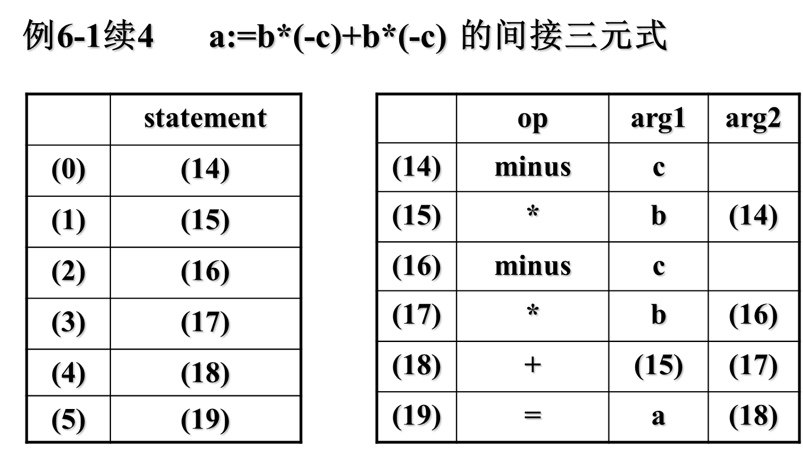


## 6.2 类型和声明

在声明变量或过程时，需要考虑**类型**及**存储空间**的布局问题。

一个过程调用或对象的实际存储空间是在运行时进行分配的。在编译时刻检查局部声明时，可以进行相对地址的布局。

一个名字或某个数据结构分量的**相对地址**是指它相对于数据区域开始位置的偏移量。

**类型检查**

- 利用一组逻辑规则来确定程序在运行时的行为
- 保证运算分量的类型和运算符的预期**类型相匹配**

**翻译时的应用**

- 确定一个名需要的存储空间
- 计算一个数组元素引用的地址
- 插入显式的类型转换
- 选择算术运算符的正确版本

### 6.2.1 类型表达式

<mark>类型表达式</mark>: 用于描述类型的结构

**基本类型是类型表达式**

- integer
- real (浮点数)
- char
- boolean
- type_error (出错类型)
- void (无类型)

可以为类型表达式命名，**类型名**也是类型表达式

将**类型构造符(type constructor)**作用于类型表达式，可以构成新的类型表达式

- 如数组构造符array：若T是类型表达式，I是整数，则array(I,T) 是类型表达式。
- `int a[3][5]`: array(3, array(5, integer))

均有对应的树形表示

#### 常见类型表达式

**数组构造符array**

- 若T是类型表达式，I是整数，则array(I,T) 是类型表达式。

- ```pseudocode
  int x[2][3];  	         
  x:ARRAY[1..2, 1..3] OF integer;    
  其类型表达式为: array(2,array(3,integer))  
  ```

-  


**指针构造符pointer**

- 若T是类型表达式，则 pointer ( T ) 是类型表达式，它表示一个指针类型

- ```pseudocode
  int* aa; 
  var aa:↑integer;
  其类型表达式为: pointer (integer)
  ```

-  


**笛卡尔乘积构造符×**：若T1 和T2是类型表达式，则笛卡尔乘积T1 × T2 是类型表达式

**函数构造符→**：若T1、T2、…、Tn 和R是类型表达式，则T1×T2 ×…×Tn→ R是类型表达式

- ```pseudocode
  int *f(char a, char b);
  FUNCTION f(a,b:char): ↑ integer;
  则 f 的类型表达式为: char × char → pointer(integer) 
  ```

**记录构造符record**：

- 若有标识符N1 、N2 、…、Nn 与类型表达式T1 、T2 、…、Tn ， 则` record ( ( N1  × T1 ) × ( N2 × T2 )× …× ( Nn × Tn )) `是类型表达式

- 例: 

  ```c
  struct person{
      char name[8];
      int  sex;
      int  age;
  }; 
  struct person table[50];
  ```

  - 则 person的类型表达式为：`record((name × array(8,char)) × (sex × integer) × (age × integer))`
    table的类型表达式为：`array (50, person) `
    - 


### 6.2.2 声明语句的翻译

> 对于声明语句，语义分析的主要任务是收集**标识符的类型**、所需存储**单元大小**等属性信息，并为每个名字分配一个**相对地址**，并将它们保存在相应的**符号表**记录中。
>

- 从类型表达式可以知道该**类型(type)**在运行时刻所需的存储单元数量称为类型的**宽度(width)**
- 在编译时刻，可以使用类型的宽度为每一个名字分配一个**相对地址(offset)**


### 6.2.3 变量声明的SDT

**变量声明基础文法：**

$$
\begin{aligned}
&① P →D \\
&② D → T\ id;D  \quad// 声明语句块\\
&③ D → ε\\
&④ T → BC  	\quad// B: int/real, C: 若干的[num], 即数组声明\\
&⑤ B → int\\
&⑥ B → real\\
&⑦ C → ε \\
&⑧ C → [num]C1
\end{aligned}
$$

```pseudocode
① P →	{ offset = 0 } D
② D → 	T id;	{ top.put( id.lexeme, T.type, offset ); 
            	offset = offset + T.width; }
		D 
③ D → 	ε
④ T → 	B   { t = B.type; w = B.width;} 
		C   { T.type = C.type; T.width = C.width; }
⑤ B → 	int { B.type = int; B.width = 4; }
⑥ B → 	real{ B.type = real; B.width = 8; }
⑦ C → 	ε  	{ C.type = t; C.width = w; }
⑧ C → 	[num]C1 { C.type = array(num.val, C1.type);
      				C.width = num.val * C1.width; }
```

- `id.lexeme`: 从词法分析结果中获取的属性
- `put( name, type, offset)`:在符号表中为名字name创建记录, 将name的类型设置为type, 相对地址设置为offset 

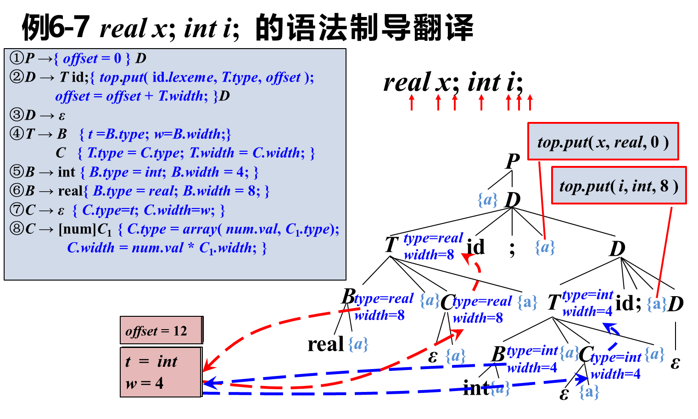


## 6.3 表达式的翻译

### 6.3.1 简单算术表达式及赋值语句

> 赋值语句翻译的**主要任务**：生成对表达式求值的三地址码序列

赋值语句的基本文法
  ① S → id = E；
  ② E → E1 + E2
  ③ E → E1 * E2
  ④ E → -E1 	
  ⑤ E → (E1)
  ⑥ E → id 

| 符号 | 综合属性        | 功能                                               |
| ---- | --------------- | -------------------------------------------------- |
| S    | code            | 赋值语句S的三地址代码                              |
| E    | code <br />addr | 对E求值的三地址语句序列<br />存放E值的名字（地址） |

- 函数`new Temp`：生成新的临时变量t，返回 t 的地址（名字）

### 6.3.2 从表达式生成三地址码的S属性文法

> 可以skip 直接看增量翻译

| 产生式        | 语义规则                                                                                 |
| ------------- | ---------------------------------------------------------------------------------------- |
| S → id  = E ; | `S.code=E.code                                                                           |  | gen(top.get(id.lexeme)  ‘=’ E.addr)` |
| E → E1 +  E2  | `E.addr = new Temp( )`  <br />`E.code=E1.code                                            |  | E2.code                              |  | gen(E.addr  ‘=’ E1.addr ‘+’  E2.addr)` |
| E → E1 *  E2  | `E.addr = new Temp( )`  <br />`E.code=E1.code                                            |  | E2.code                              |  | gen(E.addr  ‘=’ E1.addr ‘*’  E2.addr)` |
| E → - E1      | `E.addr = new Temp( )`  <br />`E.code = E1.code `\|\| `gen(E.addr  ‘=’ ‘minus’ E1.addr)` |
| E → (E1)      | `E.addr =  E1.addr`  <br />`E.code  = E1.code`                                           |
| E → id        | `E.addr = top.get(id.lexeme)`  <br />`E.code  = ' '`                                     |

- gen(code)：生成三地址指令code `||`为字符串连接
- get(name)：查询符号表返回name 对应的记录
- 很多code段在赋值时只是进行了连接, 浪费资源


### 6.3.3 增量翻译

> 

E的三地址码为左儿子的三地址码，连接右儿子的三地址码，再连接 一条三地址码，其儿子的三地址码为其儿子的儿子三地址码序列的连接.......

代码序列可能很长，效率低。可以采用增量的方式来生成三地址码（增量翻译）

在增量翻译中，gen( )不仅要构造出一个新的三 地址指令，还要将它**添加到至今为止已生成的指令序列之后**

| 产生式        | 语义规则                                                         |
| ------------- | ---------------------------------------------------------------- |
| S → id  = E ; | `{ gen(top.get(id.lexeme) '=' E.addr) }`                         |
| E → E1 +  E2  | `{ E.addr = new Temp( );  gen(E.addr ‘=’ E1.addr ‘+’ E2.addr) }` |
| E → E1 *  E2  | `{ E.addr = new Temp( );  gen(E.addr ‘=’ E1.addr ‘*’ E2.addr) }` |
| E →  -  E1    | `{ E.addr = new Temp( );  gen(E.addr ‘=’ ‘minus’ E1.addr)  }`    |
| E → (E1)      | `{ E.addr = E1.addr }`                                           |
| E → id        | `{ E.addr = top.get(id.lexeme) }`                                |

### 6.3.4 带数组引用的赋值语句的翻译

赋值语句的基本文法

- S → id = E; | L = E;
- E → E1 + E2 | - E1  | (E1) | id | L
- L → id [E] | L1 [E]

将数组引用翻译成三地址码时要解决的主要问题是确定数组元素的存放地址（数组元素的寻址）

#### 数组元素的寻址

一维数组元素a[i]的地址的计算公式 $base + (i - low) * w$

- low: 首元素下标, 通常是0 → $base + i*w$
- w: 元素宽度

二维数组元素a\[i\]\[j\] (行优先存储)

k维行优先存储的数组A，元素 A[i1, i2, ..,ik]的地址的计算公式: $base + i1*w1+i2*w2+i3*w3+…+ik*wk$

- wk表示第k维类型的宽度

#### 数组引用的SDT

数组引用翻译方案的设计中，关键的问题是如何将地址计算公式同数组引用的文法关联起来。

设非终结符L生成一个标识符连接一个下标表达式的序列 `L → id [E] | L1 [E]`

**L的综合属性**

- `L.addr` 指示一个临时变量，用于累加$\sum i_j *w_j$(P245公式6.4)
- `L.array `是指向数组名字对应符号表条目的指针，其基地址为`L.array.base`
- `L.type` 是L生成的子数组的类型, 对于任何类型t, 假定`t.width`给出它的宽度，`t.elem`给出其元素的类型。


例6-9  设a 表示 2 × 3 整数数组, c, i, j 都是宽度为4的整数 

- 则 c+ a \[i\]\[j]的注释分析树


三地址码：
t1 = i * 12
t2 = j * 4
t3 = t1 + t2
t4 = a[t3] 
t5 = c + t4

### 6.3.5 类型检查及类型转换

当表达式出现混合运算时，编译器会：

- 拒绝一些混合类型的运算（报错）
- 进行一些自动的类型转换

【例】 一个含有integer和 float两种类型的文法, integer在必要时（如与float相加时），应转为 float 


**拓宽转换和窄化转换**：

- 拓宽：较低层的类型转换为较高层
- 窄化：较高层到较低层

**隐式转换和显式转换**

- 隐式：由编译器自动完成
- 显式（强制类型转换）：程序员写出代码


- 打印三地址码时, 将操作数的宽度和类型转换为结果E的类型


## 6.4 控制流语句的翻译

赋值语句翻译：生成表达式的三地址码

控制流语句的翻译：

- 基础文法


$$
\begin{aligned}
&\text{P → S}\\
&S → S_1  S_2\\
&\text{S → id = E ; | L = E ;}\\
&\text{S → if B then S1}\\
&\quad\quad  \text{| if B then S1 else S2}\\
&\quad\quad  \text{| while B do S}
\end{aligned}
$$

控制流语句的翻译和**对布尔表达式的翻译**是结合在一起的。

- 跳转中用的布尔表达式B→(三地址码的)**跳转指令**构成的代码段

控制流语句的翻译有两种

- 对于L属性定义: 两遍扫描
- 对于S属性定义: [回填](# 6.4.6 回填 Backpatching)

### 6.4.1 Bool表达式

布尔表达式通过**布尔运算符**将布尔变量或关系表达式结合在一起

布尔表达式的作用：

- 用作**计算逻辑值**
- 用作**控制流语句**（如if-then，if-then-else和while-do等）中的条件表达式

布尔表达式的文法:	

$$
\begin{aligned}
B →\ &  \ B\ ||\ B 	\\
		  &|\ B\ \&\& B\ \\
		  &|\ !\ B 		\\
		  &|\ (\ B\ ) 		\\  
		  &|\ E\ rel\  E \quad (rel.op  \in\{<,\le,=,\neq,>,\ge\}) \\
		  &|\ true 		\\
		  &|\ false		\\
\end{aligned}
$$

- `||`, `&&` 左结合，自低至高的优先顺序为: `||`, `&&`, `!`

**布尔表达式的计算方法**

方法一：用数值表示真和假（1表示真，0表示假），对布尔表达式的求值可以象对算术表达式的求值那样一步一步地来计算。


方法二：根据布尔表达式的特点，采用某种优化措施。

- 用`||`, `&&`的特性 省略计算
- 见下面 短路代码

**短路代码**: 

$if(x<100\ ||\ x>200\ \&\&\ x!=y)\ x=0$的三地址码 

```assembly
	if x<100 goto L2
	if False x> 200 goto L1
	if False x!=y goto L1
L2: x=0
L1: 
```


### 6.4.2 控制流语句的翻译

编写控制流语句的翻译，主要在分析控制流语句的代码结构。

| 常见语句                  | 对应代码结构                                                                                                |
| ------------------------- | ----------------------------------------------------------------------------------------------------------- |
| $S → if (B)  \ S_1$       |  |
| $S→if(B)\ S_1\ else\ S_2$ |  |
| $S→while(B) S_1$          |  |

**用到的继承属性**

- S.next：是一个地址，存放紧跟在S代码之后的指令的标号
- B.true：是一个地址，存放当B为真时控制流转向的指令的标号
- B.false：是一个地址，存放当B为假时控制流转向的指令的标号

#### 顺序语句的SDT

```pseudocode
P → { S.next = newlabel(); } S { label(S.next);}
S → { S1.next = newlabel(); } S1 
    { label(S1.next); S2.next = S.next ; } S2	
S → id = E ; | L = E ;	   
S → if (B)  S1
    | if (B) S1 else S2
    | while (B) do S1
```

实现说明: 可以用一个全局变量nextstat来表示下一条指令的地址(行数)

`newlabel()`: 生成一个用于存放标号的新的临时变量L，返回变量地址

`label(L)`: 将下一条三地址指令的标号赋给L

- > Q: 为什么这么复杂, 要用标号(指针)? 
  
  - 因为S的下一条语句可能需要很多层递归的归约才能得到
- > Q: 为什么是继承属性?
  
  - 因为next是来自于兄弟/父亲的地址
    - 对于S1, 他的next是S2的first
    - 对于S2, 他的next是S的next, 也是下条语句的first


#### 分支语句的SDT

S → if (B)  S1 else S2

```pseudocode
S → if (  { B.true = newlabel(); B.false = newlabel(); } B 
	      { label(B.true); S1.next = S.next; }  
        )
        S1
        { gen( ‘goto’  S.next ) }
    else  { label(B.false); S2.next = S.next; }S2 
```

S → if (B)  S1

```pseudocode
S → if ({ B.true = newlabel(); B.false = S.next; } B 
	       { label(B.true); S1.next = S.next; } )S1
```

S → while (B) S1

```pseudocode
S → while ( { begin = newlabel(); label(begin); B.true = newlabel(); B.false = S.next}
	B
	{ label(B.true); S1.next=begin}
	)
	S1  { gen(‘goto’ begin); }
```


### 6.4.3 布尔表达式控制流翻译

**布尔表达式的文法**

$$
\begin{aligned}
B →\ &    \ \ B || B 	\\
		  &|\ B \&\& B 	\\
		  &|\ !B 		\\
		  &|\ (B) 		\\  
		  &|\ E\  rel\  E \quad rel.op  \in\{<,\le,=,\neq,>,\ge\} \\
		  &|\ true 		\\
		  &|\ false		\\
\end{aligned}
$$

- 布尔表达式B被翻译成由**跳转指令构成的跳转代码**，使用**条件或无条件跳转指令**来对B求值。
- 布尔运算符&&、||、!被翻译成**跳转指令**，运算符本身**不出现在代码中**

- `B → E rel E`，被翻译成三地址比较指令，跳转到正确的位置。

  ```pseudocode
  a < b
  // 三地址指令
  if a<b goto B.true
  goto B.false
  ```

  - 作为条件的布尔表达式，把它设计成两个出口,为真时转向B.true，为假时转向B.false 

  - 对于出现在条件语句  if B then S1 else S2中的布尔表达式B，其作用就是控制对S1和S2的选择

  - 对于while语句B.true指向循环的开始，B.false指向while 的下一语句

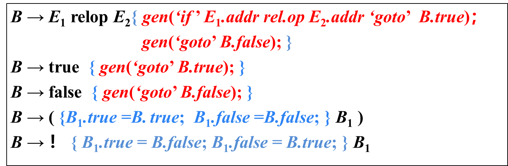

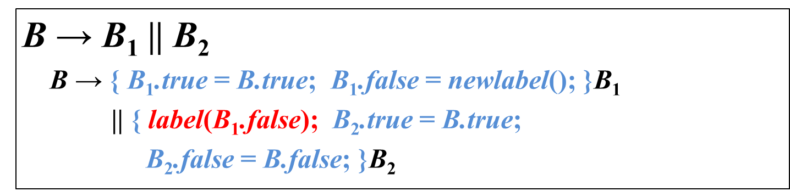 

- `||`运算, B1 false后还需要判断B2

 

- `&&`运算, B1 true后还需要判断B2


#### 例

【例6-11】while (a<b)  if (c<d) x=y+z  else x=y-z的三地址码

 


### 6.4.5 避免生成冗余的goto指令


### 6.4.6 回填 Backpatching

> 另一种翻译方式, 基于S属性定义

#### 基本思想

**控制流语句**翻译的一个关键是确定**跳转指令**的**目标标号**

**存在问题**：生成跳转指令时，目标标号还不能确定，需要以后扫描到特定位置时才能回过头来确定

**解决办法**

- 两遍扫描（**L属性定义**）：生成一些**临时变量**用来存放标号，将临时变量的地址作为继承属性传递到标号可以确定的地方。即当目标标号的值确定下来以后再赋给相应的变量。此时，需要再扫描一次指令序列。
- 一遍扫描（**S属性定义**）：生成一个跳转指令时，**暂时不指定它的目标标号**。这样的指令都被放入由跳转指令组成的**列表**中。同一个列表中的所有跳转指令具有相同的目标标号。等到能够确定正确的目标标号时，才去填充这些指令的目标标号。
  - 采用综合属性 truelist 和 falselist 管理跳转指令中的标记 
  - 采用回填：在目标地址确定时填充这些标记

#### 属性设置

B.truelist：指向一个包含跳转指令的列表，这些指令不完整，其标号字段尚未填写。最终获得的目标标号就是当B为真时控制流应该转向的指令的标号。

B.falselist：指向一个包含跳转指令的列表，这些指令最终获得的目标标号就是当B为假时控制流应该转向的指令的标号。

S.nextlist：指向一个包含跳转指令的列表，这些指令最终获得的目标标号就是按照运行顺序紧跟在S代码之后的指令的标号。

#### 函数及变量设置

将跳转指令放入指令数组，数组下标为指令的标号。为方便处理跳转指令列表，设置三个函数: 

- `makelist(i)` ：创建一个只包含 i 的列表，i 是跳转指令的标号，函数返回指向新创建的列表的指针 
- `merge(p1, p2)` ：合并p1、p2指向的列表，返回合并后的列表p2
-  `backpatch(p, i)  `：将 i 作为目标标号插入（回填）到 p所指列表中的各指令中

`nextinstr`: 指向下一条将要产生但尚未形成的三地址码的地址（标号），初值为1，每执行一次gen之后， nextinstr自动加1 

#### Bool表达式回填的SDT

$B→B_1||B_2$ 

$$
\begin{aligned}&B\to B_1\parallel MB_2\\&\{\\&backpatch(B_1,falselist,\textcolor{red}{M.instr});\\&B.truelist=merge(B_1.truelist,B_2.truelist);\\&B.falselist=B_2.falselist\:;\\
&M\to\varepsilon\\&\{\textcolor{red}{M.instr}=nextinstr\:;\}\end{aligned}
$$

- M这个空产生式用来保存B2的第一条指令标号
- 

$B→B_1\&\&B_2$

$$
\begin{aligned}&B\to B_1\&\&MB_2\\&\{\\&backpatch(\:B_1.truelist,\:M.instr\:);\\&B.truelist=B_2.truelist;\\&B.falselist=merge(\:B_1.falselist,\:B_2.falselist\:);\\&\}\\&M\to\varepsilon\\&\{\:M.instr=nextinstr\:;\:\}\end{aligned}
$$


#### 控制流语句的回填

- 语句S带有一个未填充的跳转链 `nextlist`, 该链同样使用回填策略来填充
- `S.nextlist` 为跳转到S之后指令标号的跳转指令列表 

… 实验完成 略了
