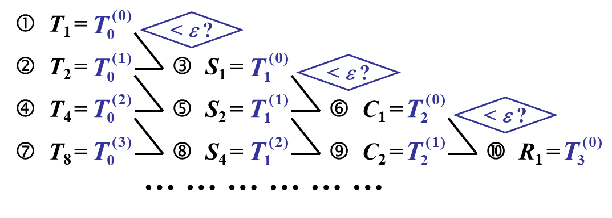

## 第1章 导论

### 误差

**绝对误差**: $e^* = x^* - x, 其中x为精确值, x^*为x的近似值$

**绝对误差限**: $|e^*|的上限\ \varepsilon^*$

**相对误差**: $e_r^* = \frac{e^*}x ≈ \frac{e^*}{x^*}\\$

**相对误差限**: $\varepsilon_r^* (= \frac{\varepsilon^*}{x}) = \frac{\varepsilon^*}{|x^*|}\\$ 

### 有效数字

**有效数字**: 用科学记数法, 记$近似值x^*=a_1.a_2a_3...a_n*10^m(其中a_1\neq 0)$, 若$(|e^*|=)\ |x^*-x|\leq \textcolor{red}{0.5}*10^{m-n+1}$(即$a_n$的截取按照四舍五入规则), 则称$x^*$为n位有效数字, 精确到$10^{m-n+1}$

**有效数字→相对误差限**

- 已知$x^*$有n位有效数字, 其**相对误差限**为
  $\begin{aligned}\varepsilon_r^*&=\left|\frac{\varepsilon^*}{x^*}\right|=\frac{0.5\times10^{-(n-1)}\times10^m}{a_1.a_2\cdots a_n\times10^m}=\frac{10^{-(n-1)}}{2\times a_1.a_2\cdots}\leq\frac1{2a_1}\times10^{-(n-1)}\end{aligned}$ 

**相对误差限→有效数字**

- 已知 x* 的相对误差限可写为$\varepsilon_r*=\frac1{2(a_1+1)}\times10^{-(n-1)}\\$
- 则: $\begin{aligned}\mid x-x^*\mid&\leq\varepsilon_r^*\cdot\mid x^*\mid=\frac{10^{-(n-1)}}{2(a_1+1)}\times a_1.a_2\cdots\times10^m\\&<\frac{10^{-(n-1)}}{2(a_1+1)}\cdot(a_1+1)\times10^m=0.5\times10^{m-n+1}\end{aligned}$

### 误差传递

加法: $y^*=x_1^*+x_2^*$

- $\varepsilon(y^*)\approx\varepsilon(x_1^*)+\varepsilon(x_2^*)$ 误差限直接相加

乘法: $y^*=x_1^*\cdot x_2^*$

- $\varepsilon(y^*)\approx|x_2^*|\varepsilon(x_1^*)+|x_1^*|\varepsilon(x_2^*)$ 
- 会受$|x_1^*|, |x_2^*|$影响

除法: $y^*=\frac{x_1^*}{x_2^*}\\$

- $\varepsilon(y^*)\approx\frac1{\left|x_2^*\right|}\cdot\varepsilon_1^*+\frac{\left|x_1^*\right|}{\left|x_2^*\right|^2}\cdot\varepsilon_2^*\\$

## 第2章 插值法

### 拉格朗日插值

$$
\begin{aligned}
&\textcolor{blue}{L_n(x)}=\sum_{k=0\\}^ny_kl_k(x): Lagrange插值多项式\\
&\textcolor{blue}{l_k(x)}=\frac{\omega_{n+1}(x)}{\omega_{n+1}^{\prime}(x_k)(x-x_k)}: Lagrange插值基函数\\
&\omega_{n+1}(x)=(x-x_0)(x-x_1)...(x-x_n)\\
&\omega_{n+1}^{\prime}(x_k)=(x_k-x_0)(x_k-x_1)\cdot \cdot\cdot (x_k-x_{k-1})(x_k-x_{k+1})\cdot \cdot \cdot (x_k-x_n)
\end{aligned}
$$

**拉格朗日余项**

$$
R_n(x) = K(x)\omega_{n+1}(x) =\frac{f^{(n+1)}(\xi)}{(n+1)!}\omega_{n+1}(x)\quad \xi\in(a,b)
$$

### 牛顿插值

**差商(均差)**

$$
\begin{aligned}
&一阶差商: f[x_0,x_i]=\frac{f(x_1)-f(x_0)}{x_1-x_0}\\ 
&二阶差商: f[x_0, x_1,x_2] =\frac{f[x_1,x_2]-f[x_0,x_1]}{x_2-x_0}\\&...\\
&k+1阶差商: 
f[x_0,...,x_{k+1}]=\frac{f[x_0,x_1,...,x_k]-f[x_1,...,x_k,x_{k+1}]}{x_0-x_{k+1}}  \\
&\qquad\qquad\qquad\qquad\qquad\qquad\ =\frac{f[x_0,...,x_{k-1},x_k]-f[x_0,...,x_{k-1},x_{k+1}]}{x_k-x_{k+1}}
\end{aligned}
$$

**牛顿插值多项式**

基础: $N_n(x)=\alpha_0+\alpha_1(x-x_0)+\alpha_2(x-x_0)(x-x_1)+....+\alpha_n(x-x_0)...(x-x_{n-1})$

代入差商得

$$
\begin{aligned} f(x)=&f(x_0)+f[x_0,x_1](x-x_0)+f[x_0,x_1,x_2](x-x_0)(x-x_1)+...\\&+f[x_0,...,x_n](x-x_0)...(x-x_{n-1})  &&牛顿插值多项式N_n(x)\\
&+f[x,x_0,...,x_n](x-x_0)...(x-x_{n-1})(x-x_n)&&牛顿插值多项式余项R_n(x)
\end{aligned}
$$

  

#### 均差的性质 

**①k阶均差-f(x)的线性表示**

$$
\begin{aligned}
f[x_0,x_1,\cdots,x_{k-1},x_k]&=\sum_{i=0}^k\frac{f(x_i)}{(x_i-x_0)\cdots(x_i-x_{i-1})(x_i-x_{i+1})\cdots(x_i-x_k)} \\
&=\sum_{i=0}^k\frac{f(x_i)}{\omega_{k+1}^{\prime}(x_i)} \\
&\textbf{其中}\quad\omega_{k+1}(x)=\prod_{i=0}^k\left(x-x_i\right),\quad\omega_{k+1}^{\prime}(x_i)=\prod_{j=0}^k\left(x_i-x_j\right)
\end{aligned}
$$

**②差商与x的顺序无关**

- 如 $f[x_0,x_1,x_2]=f[x_0,x_2,x_1]=f[x_2,x_1,x_0]$

**③k阶差商与k阶导**

当$f^(k)(x)$在包含节点$x_0,x_1,\cdots,x_k$的区间存在时，在$x_0,x_1,\cdots,x_k$之间必存在一点$\xi$,使得$f[x_0,x_1,\cdots,x_k]=\frac{f^{(k)}(\xi)}{k!}\\$ 

### Hermite插值

**两点三次Hermite插值**

 $H_3(x)$应满足插值条件

$$
H_3(x_0)=y_0\quad H_3(x_1)=y_1\\
H_3^{\prime}(x_0)=y_0^{\prime}\quad H_3'(x_1)=y_1'
$$

用四个基函数表示$\color{blue}H_3(x) = y_0α_0(x) + y_1\alpha_1(x)+y_0'\beta_0(x)+y'\beta_1(x)$ 

$$
\begin{aligned}\\
\alpha_0(x)&=(1+2l_1(x))\cdot l_0^2(x)~=\left(1+2\frac{x-x_0}{x_1-x_0}\right)\!\left(\frac{x-x_1}{x_0-x_1}\right)^2\\
\alpha_1(x)&=(1+2l_0(x))\cdot l_1^2(x)=\left(1+2\frac{x-x_1}{x_0-x_1}\right)\left(\frac{x-x_0}{x_1-x_0}\right)^2\\\beta_0(x)&=(x-x_0)\cdot l_0^2(x)~=\left(x-x_0\right)\left(\frac{x-x_1}{x_0-x_1}\right)^2\\\beta_1(x)&=(x-x_1)\cdot l_1^2(x)~=\left(x-x_1\right)\left(\frac{x-x_0}{x_1-x_0}\right)^2\end{aligned}
$$

**余项**

$$
R_3(x) = \frac{f^{(4)}(\xi)}{4!}(x-x_0)^2(x-x_1)^2 \quad其中\xi \in[x_0, x_1]
$$

## 第4章 数值积分

 

**简单的积分近似计算方式:** 

$$
梯形公式: T=\frac{b-a}2[f(b)+f(a)]\\
中矩形公式: R=(b-a)f(\frac{b+a}2)\\
机械求积: \textcolor{blue}{\int_a^bf(x)dx\approx \sum_{k=0}^nA_kf(x_k)}, 其中x_k称为求积节点, A_k称为求积系数
$$

- 求积节点一般是给定的, 我们的目标就是确定<mark>求积系数</mark>$A_k$ 

### Newton-Cotes数值求积分

积分区间: $[a,b]$

求积节点: $x_k = a + kh, h = \frac{b-a}{n}$ 

求积系数: $A_k=\int_a^bl_k(x)dx=\cdots=(b-a)C_k^{(n)}\\$

- $C_k^{(n)}$为Cotes系数, 仅取决于n和k, 查表获取

余项: $R(I_n)=\int_a^bR_n(x)dx \quad 其中, R_n(x)=\frac{f^{(n+1)}(\xi)}{(n+1)!}\omega_{n+1}(x)\\$ 

- *实际上就是拉格朗日余项求积*

#### 低阶Newton-Cotes公式

##### 梯形公式(n=1)

求积节点: $a, b$

梯形求积公式(两点公式): $T=I_1(f)=\frac{(b-a)}2[f(a)+f(b)]\\$

梯形公式余项: $R(T)=R(I_1)=\int_a^bR_1(x)dx=-\frac{(b-a)^3}{12}f^{\prime\prime}(\eta)\\$

- 梯形(trapezia)公式具有1次代数精度

##### Simpson公式(n=2)

求积节点: $x_0, x_1, x_2$

Simpson求积公式(三点公式, 抛物线公式): $\begin{aligned}S=I_2(f)&=(b-a)[\frac16f(x_0)+\frac46f(x_1)+\frac16f(x_2)]\\&=\frac{b-a}6[f(a)+4f(\frac{a+b}2)+f(b)]\end{aligned}$

Simpson公式的余项: $R(S)=R(I_2)=\int_a^bR_2(x)dx =-\frac{b-a}{180}\Big(\frac{b-a}{2}\Big)^4f^{(4)}(\eta)\\$

- Simpson公式具有3次代数精度

#### Newton-Cotes公式 代数精度定理

<mark>定理</mark>：当n为偶数时，Newton-Cotes公式至少具有n+1次代数精度

#### Newton-Cotes公式的稳定性

记精确值为$f(x_k)$,近似值为$\tilde{f}(x_k)$, 误差$\varepsilon_k=f(x_k)-\tilde{f}(x_k)$

则积分精确值和近似值误差为: $I_n-\tilde{I}_n=(b-a)\sum_{k=0}^nC_k^{(n)}[f(x_k)-\tilde{f}(x_k)]\\$

$$
\begin{aligned}&I_n-\bar{I}_n&&=(b-a)\sum_{k=0}^nC_k^{(n)}\varepsilon_k\\
&\left|I_n-\bar{I}_n\right|&&\leq(b-a)\sum_{k=0}^n\left|C_k^{(n)}\right| |\varepsilon_k|\\&&&\leq(b-a)\varepsilon\sum_{k=0}^n\left|C_k^{(n)}\right|\end{aligned}
$$

- 性质$:\sum_{k=0}^nC_k^{(n)}=1$ 
- $\varepsilon=\max\{|\varepsilon_k|\}$

$\text{若 }\forall k\leq n\text{,}C_k^{(n)}>0\text{,有}\left|I_n-\bar{I}_n\right|\leq(b-a)\varepsilon$

**结论**

Newton-Cotes公式的舍入误差只是函数值误差的**(b-a)倍**

即$\forall k\leq n\text{ ,C}_k^{(n)}>0$时, Newton-Cotes公式是稳定的

- 稳定: 指误差是否会在计算过程中显著增长
- 实际上, 当n<8时, 公式都是稳定的

若$C_k^{(n)}$有正有负，有$(b-a)\varepsilon\sum_{k=0}^n\left|C_k^{(n)}\right|\geq(b-a)\varepsilon\sum_{k=0}^nC_k^{(n)}=(b-a)\varepsilon$

此时,公式的稳定性将无法保证

- 因此,在实际应用中一般不使用高阶Newton-Cotes公式, 而是采用低阶复合求积法

### 复合求积公式

### **公式与余项**

|       | 求积公式                                                     | 单纯求积公式的余项                               | 复合求积公式的余项                             |
| ----- | ------------------------------------------------------------ | ------------------------------------------------ | ---------------------------------------------- |
| $T_n$ | $\frac h2[f(a)+2\sum_{k=1}^{n-1}f(x_k)+f(b)]\\$              | $-\frac{(b-a)}{12}(b-a)^2f''(\eta)\\$            | $-\frac{(b-a)}{12}(h)^2f''(\eta)\\$            |
| $S_n$ | $\frac h6[f(a)+4\sum_{k=0}^{n-1}f(x_{k+\frac12})+2\sum_{k=1}^{n-1}f(x_k)+f(b)]\\$ | $-\frac{b-a}{180}(\frac{b-a}2)^4f^{(4)}(\eta)\\$ | $-\frac{b-a}{180}(\frac{h}2)^4f^{(4)}(\eta)\\$ |

- 复合求积公式的误差就是将小区间(长度为步长h)的误差逐个累加

### 收敛阶

<mark>定义</mark>: 若一个积分公式的误差满足 $\lim_{h\to0}\frac{R[f]}{h^p}=C<\infty, 且C\neq 0\\$ 则称该公式是$p$ 阶收敛的。

- $T_n\thicksim O\left(h^2\right),S_n\thicksim O\left(h^4\right),C_n\thicksim O\left(h^6\right)$

### 龙贝格算法

第一级$T_0^{(k)}$​计算公式(**梯形递推公式**): 

$$
\begin{aligned}T_0^{(0)}&=\frac{b-a}2[f(a)+f(b)]\\T_0^{(k)}&=\frac12T_0^{(k-1)}+h_k\sum_{j=0}^{2^{k-1}-1}f(a+(2j+1)h_k)\quad k=1,2,\cdots\end{aligned}
$$

- 如[0,1], 对于k=3, 步长为$\frac1{2^3}=\frac18\\$, 右边加的数就是$\frac18[f(\frac18)+f(\frac{3}{8})+f(\frac{5}{8})+f(\frac{7}{8})]\\$

加速公式: $T_m(k-1)=\frac1{4^m-1}[4^mT_{m-1}(k)-T_{m-1}(k-1)]\\$

## 第5章 解线性方程组的直接方法

### 矩阵三角分解法

**杜立特分解法**

$$
A = LU\\
\begin{gathered}L=\begin{pmatrix}1\\m_{21}&1\\m_{31}&m_{32}&1\\\vdots&\vdots&\vdots&\ddots\\m_{n-1,1}&m_{n-1,2}&m_{n-1,2}&\cdots&1\\m_{n,1}&m_{n,2}&m_{n,3}&\cdots&m_{n,n-1}&1\end{pmatrix}\\U=A^{(n)}=\begin{pmatrix}a_{11}^{(1)}&a_{12}^{(1)}&\cdots&a_{1n}^{(1)}\\&a_{22}^{(2)}&\cdots&a_{2n}^{(2)}\\&&\ddots&\vdots\\&&&a_{nn}^{(n)}\end{pmatrix}\end{gathered}
$$

- 其中U的第一行$a_{1i}^{(1)}$​等于矩阵A的第一行
- L的第一列$m_{i1}=\frac{a_{i1}}{a^{(1)}_{11}}\\$ 
- 其他元素通过矩阵乘法 (解方程)计算 出来

### 向量和矩阵范数

在向量空间$R^n(C^n)$中, $x = (x_1, x_2, ..., x_n)^T$, **常用的向量x的范数**

- x的2-范数或欧氏范数: $\left\|x\right\|_2 =(\begin{array}{c}\left|x_1\right|^2+\left|x_2\right|^2+\cdots+\left|x_n\right|^2\end{array})^{1/2}$

- x的1-范数: $\left\|x\right\|_{1}=\left|x_1\right|+\left|x_2\right|+\cdots+\left|x_n\right|$ 
- x的∞范数(最大范数): $\left\|x\right\|_\infty =\max_{1\leq i\leq n}\left|x_i\right|\\$ 
- x的p-范数: $||x||_p = (|x_1|^p+|x_2|^p+...|x_n|^p)^{1/p}$
  - $\begin{gathered}
    \max_{1\leq i\leq n}\left|x_i\right| \leq\left(\left|x_1\right|^p+\left|x_2\right|^p+\cdots+\left|x_n\right|^p\right)^{1/p}\leq\left(n\max_{1\leq i\leq n}\left|x_i\right|^p\right)^{1/p} 
    =n^{1/p}\max_{1\leq i\leq n}\left|x_i\right|\to\max_{1\leq i\leq n}\left|x_i\right|\left(p\to\infty\right) 
    \end{gathered}$

**算子范数**: 

$$
\begin{aligned}
&\textbf{由向量范数}\parallel\cdot\parallel_p\textbf{导出关于矩阵 }A\in R^{n\times n}\text{ 的 }p\text{ 范数:}\\&\parallel A\parallel_p=\max_{{\vec{x}}\neq0}\frac{\parallel A\vec{x}\parallel_p}{\parallel\vec{x}\parallel_p}=\max_{\parallel\tilde{x}\parallel_p=1}\parallel A\vec{x}\parallel_p\quad\text{则}
\begin{cases}
    \parallel AB\parallel_p\leq\parallel A\parallel_p\parallel B\parallel_p\\
    \parallel A\vec{x}\parallel_p\leq\parallel A\parallel_p\parallel\vec{x}\parallel_p
\end{cases}
\end{aligned}
$$

特别有:

- 行和范数: $\parallel A\parallel_\infty=\max_{1\leq i\leq n}\sum_{j=1}^n\mid a_{ij}\mid\\$ *(最大的行之和)*
- 列和范数: $\parallel A\parallel_1=\max_{1\leq j\leq n}\sum_{i=1}^n\mid a_{ij}\mid\\$ *(最大的 列之和)*
- 2-范数: $\parallel A\parallel_2=\sqrt{\lambda_{\max}(A^TA)}$  ($A^TA$矩阵的最大特征值)

**谱半径**

定义 矩阵A的<mark>谱半径</mark>记为$\rho(A)=\max_{1\leq i\leq n}|\lambda_i|$,其中$\lambda_i$ 为A的特征根

### 线性方程组误差分析

$||A||\cdot ||A^{-1}||$是关键的误差放大因子, 称为A的条件数, 即为$cond(A)$

- 越大, A越病态, 难以求得准确解

根据算子范数的不同, 条件数也不同

$$
\begin{aligned}
&cond(A)_1 =\left\|A\right\|_1\cdot\left\|A^{-1}\right\|_1  \\
&cond\left(A\right)_\infty  =\left\|A\right\|_\infty\cdot\left\|A^{-1}\right\|_\infty   \\
&cond\left(A\right)_2 =\left\|A\right\|_2\cdot\left\|A^{-1}\right\|_2=\sqrt{\lambda_{\max}\left(A^TA\right)}\sqrt{\frac{1}{\lambda_{\min}\left(A^TA\right)}}  =\sqrt{\frac{\lambda_{\max}(A^TA)}{\lambda_{\min}(A^TA)}}
\end{aligned}
$$

**条件数的性质**

- A可逆, 则$cond(A)_p \geq 1$
- A可逆, $a\in R$,则$cond(\alpha A)=cond(A)$
- A正交, 则$cond(A)_2=1$
- A可逆, R正交, 则$cond(RA)_2=cond(AR)_2=cond(A)_2$

## 第6章 解线性方程组的迭代法

迭代过程通用表示: $x^{(k+1)}=Bx^{(k)}+f$, 其中$B\in R^n\times n,f\in R^n,x\in R^n$

- B称为迭代矩阵, f为常数项

### 雅可比迭代

迭代过程: 

$$
\vec{x}^{(k+1)}=B_J\vec{x}^{(k)}+D^{-1}\vec{b},\quad B_J = D^{-1}(L+U)
$$

其中: $D = diag(a_{11}, a_{22}, ...,a_{nn})$, 为方程组系数矩阵A的对角线

$$
\begin{aligned}L=&\begin{pmatrix}0&0&\cdots&0\\-a_{21}&0&\cdots&0\\\vdots&\ddots&\ddots&\vdots\\-a_{n1}&-a_{n2}&\cdots&0\end{pmatrix}&A\text{的下三角部分的负矩阵}
\\\\
U=&\begin{pmatrix}0&-a_{12}&\cdots&-a_{14}\\0&0&\cdots&-a_{24}\\\vdots&\ddots&\ddots&\vdots\\0&0&\cdots&0\end{pmatrix}&A\text{的上三角部分的负矩阵}
\\\end{aligned}
$$

### **Gauss-Seidel迭代法**

迭代过程: 

$$
\vec{x}^{(k+1)}=
	\underbrace{{(D-L)^{-1}U}}_{B}\ \vec{x}^{(k)}
	+(\underbrace{D-L)^{-1}}_{\boldsymbol{\vec{f}}}\vec{b}
$$

### 迭代法收敛性

<mark>定理1</mark>: 迭代格式收敛的充要条件为 $\lim_{k\to\infty}B^{k}=0\\$

<mark>定理2</mark>: 迭代格式收敛的充要条件为谱半径$\rho(B)<1$

<mark>定理</mark> (充分条件) 若**存在**一个矩阵范数使得$\parallel B\parallel=q<1$, 则迭代收敛，且有下列误差估计：

$$
①\varepsilon^{(k)} = \parallel\vec{x}^*-\vec{x}^{(k)}\parallel\leq\frac q{1-q}\parallel\vec{x}^{(k)}-\bar{x}^{(k-1)}\parallel\\
②\parallel\bar{x}-\bar{x}^{(k)}\parallel\leq\frac{q^k}{1-q}\parallel\bar{x}^{(1)}-\bar{x}^{(0)}\parallel
$$

## 第7章 非线性方程与方程组的数值解法

### 二分法

设[a,b]为单根区间

取中点$x_0=\frac12(a+b)$

- 若$f(x_0)=0$, $x_0$记为$[a,b]$中的根
- 若$f(a)\cdot f(x_0)<0$, 则$[a, x_0]$为有根区间, 令$a_1=a, b_1=x_0$

- 若$f(x_0)\cdot f(b)<0$, 则$[x_0, b]$为有根区间, 令$a_1=x_0, b_1=b$

一轮操作后, 有根区间$[a,b]$缩小为一半$[a_1, b_1]$

循环, 继续取$[a_1, b_1]$的中点$x_1=\frac12(a_1+b_1)$, 得到新区间$[a_2, b_2]$

以此类推, 有$x_n = \frac12(a_n+b_n)$

对于每个小区间都有$(b_n-a_n)=\frac1{2^{n+1}}(b-a)\\|x_n-x_{n-1}|=\frac{1}{2^{n+1}}(b-a)$

确定适当的n, 可以得到任意要求的精度 ($|x_{k+1}-x_k|<\varepsilon_1$)

**误差分析**

对于第0步的$x_0=\frac12(a+b)$有误差$\varepsilon=|x_0-x^*|\leq\frac{b-a}2\\$

第k步的$x_k$误差:$\varepsilon=|x_k-x^*|\leq \frac{b-a}{2^{k+1}}\\$

 对于给定的精度ε,可估计二分法所需的步数 k ：$\frac{b-a}{2^{k+1}}<\varepsilon\quad\Rightarrow\quad k>\frac{\left[\ln\left(b-a\right)-\ln\varepsilon\right]}{\ln2}-1\\$

### 迭代法

#### **不动点迭代法**

将非线性方程$f(x)=0$化为一个同解方程$x=\varphi(x)$, 且设$\varphi(x)$连续

任取初值$x_0$代入, 得$x_1=\varphi(x_0), x_2=\varphi(x_1)\cdots, x_k=\varphi(x_{k-1})$

称上式为求解非线性方程$x=\varphi(x)$的<mark>不动点迭代法</mark>

- 称$\varphi(x)$为迭代函数, $x_k$为第k步迭代值

#### 迭代法收敛定理

<mark>定理</mark>: 设迭代函数$\varphi(x)$在[a,b]上连续, 且满足

1. 当$x\in[a,b]$时,$\ a\leq\varphi(x)\leq b$
2. 存在一个整数L, 满足$0<L<1$且$\forall x\in [a,b]$, 有$|\varphi'(x)|\leq L$*(上确界为L)*

则有以下**结论**

1. 方程$x=\varphi(x)$在$[a,b]$内有唯一解$x^*$
2. 对于任意初值$x_0\in[a,b]$, 迭代法$x_{k+1}=\varphi(x_k)$均收敛于$x^*$
3. $\left|x_k-x^*\right|\leq\frac L{1-L}\left|x_k-x_{k-1}\right|\\$
4. $\left|x_k-x^*\right|\leq\frac{L^k}{1-L}\left|x_1-x_0\right|\\$  
   - $\left|x_k-x^*\right|\leq\frac L{1-L}\left|x_k-x_{k-1}\right|\leq\frac{L^k}{1-L}\left|x_1-x_0\right|\\$ 

#### 收敛的阶

**定义**: 若存在实数$p\geq1$和$c>0$满足$\lim_{k\to\infty}\frac{e_{k+1}}{e_k^p}=c\\$($e_{k+1}和e_k^p$同阶无穷小), 则称迭代法<mark>p阶收敛</mark>

- 当p=1称为线性收敛, p>1时称为超线性收敛, p=2时称为平方收敛

**定理**: 如果迭代法迭代函数 $\varphi(x)$在根$x^*$附近满足：

- $(1)\varphi(x)$存在$p$​阶导数处连续；
- $(2)\varphi^{\prime}(x^*)=\varphi^{\prime\prime}(x^*)=\cdots=\varphi^{(p-1)}(x^*)=0$,而$\varphi^{(p)}{(x^*)}\neq0$

则迭代法$x_k+1=\varphi(x_k)$的收敛阶是$p$​

### 牛顿法

迭代函数: $x_{k+1}=x_k-\frac{f(x_k)}{f'(x_k)}\quad(k=0,1,2,\cdots)\\$

#### 收敛的充分条件

设$f\in C^2[a, b]$若

- $f(a)f(b)<0$ (*区间端点异号, 有根*)
- 在整个$[a,b]$区间上, $f''$不变号, 且$f'(x)\neq 0$  (*根唯一*)
- 选取$x_0\in[a,b]$使得$f(x_0)f''(x_0)>0$  (*产生的序列单调有界, 保证收敛*)

则牛顿迭代法产生的序列$\{x_k\}$收敛到$f(x)$在$[a,b]$区间内的**唯一根**

#### 局部收敛性

设 $f \in C^2[a, b]$，若 x* 为 f (x) 在[a, b]上的根，且 $f ’(x^*) \neq 0$，则存在 x\* 的邻域$B_\delta (x^*)$使得任取初值$x_0\in B_\delta (x^*)$  ，Newton’s Method产生的序列$\{ x_k \}$收敛到x\*，且满足$\lim_{k\to\infty}\frac{x^*-x_{k+1}}{\left(x^*-x_k\right)^2}=-\frac{f^{\prime\prime}(x^*)}{2f^{\prime}(x^*)}\\$​

## 一些其他公式(失忆)

**二项式定理**

$$
C_{n}^{m}=\frac{P_{n}^{m}}{P_{m}}=\frac{n!}{m!(n-m)!},C_{n}^{0}=1\\
(x+y)^n=\sum_{i=0}^n C_n^ix^i y^{n-i}
$$

