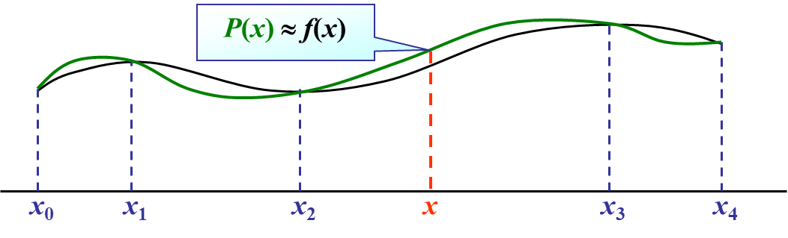
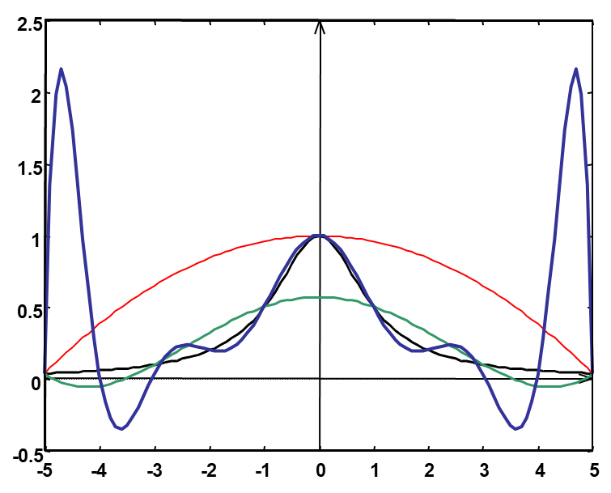
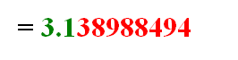
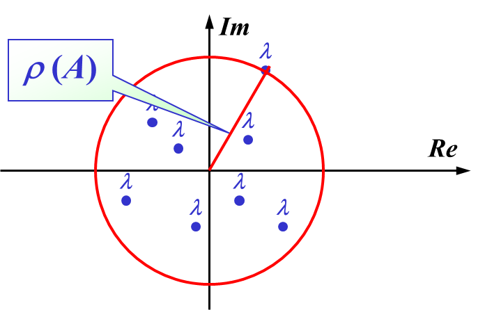
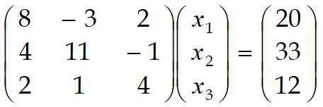

# 第1章 数值分析与科学计算引论

> 误差和有效数字 基本概念
>
> 避免危害

数值分析: 将复杂的计算式转换为指令集中定义过的+、- (×、÷)输入到计算机中, 得到**近似解**

## 1.2  误差的背景介绍

### 1.2.1 来源与分类

| 来源                           | 分类                   |
| ------------------------------ | ---------------------- |
| 从实际问题中抽象出数学模型     | **模型误差**           |
| 通过**测量**得到模型中参数的值 | **观测误差**           |
| 求近似解                       | **方法误差(截断误差)** |
| 机器字长有限                   | **舍入误差**           |

### 1.2.2 误差与有效数字

#### 绝对误差

<mark>绝对误差</mark>: $e^* = x^* - x, 其中x为精确值, x^*为x的近似值$

- 精确值$x^*$通常不可求得, 我们只能求出近似值

<mark>绝对误差限</mark>: $|e^*|的上限即为\varepsilon^*, 称为\textcolor{#66ccff}{绝对误差限}$ 

- 工程上常记为$x = x^* \pm e^*$, 如$\int_0^1e^{-x^2}dx=0.743\pm0.006$

- 注意: 
  - e* 理论上讲是唯一确定的，可能取正，也可能取负。
  - e* > 0 不唯一，当然 e* 越小越具有参考价值。
  

#### 相对误差

<mark>相对误差</mark>: $e_r^* = \frac{e^*}x ≈ \frac{e^*}{x^*}\\$

<mark>相对误差限</mark>: $\varepsilon_r^* (= \frac{\varepsilon^*}{x}) = \frac{\varepsilon^*}{|x^*|}\\$

#### 有效数字

~~看不懂的~~<mark>有效数字</mark>定义: 用科学记数法, 记$近似值x^*=a_1.a_2a_3...a_n*10^m(其中a_1\neq 0)$, 若$(|e^*|=)\ |x^*-x|\leq \textcolor{red}{0.5}*10^{m-n+1}$(即$a_n$的截取按照四舍五入规则), 则称$x^*$为n位有效数字, 精确到$10^{m-n+1}$

- $m+1$: $x^*$小数点前的位数
  $n$: 有效位数
  $m-n+1$: 小数点后位数 (经过四舍五入的结果)
- 有效数字即为绝对误差限

#### 有效数字与相对误差的关系

**有效数字→相对误差限**

- 已知$x^*$有n位有效数字, 其**相对误差限**为
  $\begin{aligned}\varepsilon_r^*&=\left|\frac{\varepsilon^*}{x^*}\right|=\frac{0.5\times10^{-(n-1)}\times10^m}{a_1.a_2\cdots a_n\times10^m}=\frac{10^{-(n-1)}}{2\times a_1.a_2\cdots}\leq\frac1{2a_1}\times10^{-(n-1)}\end{aligned}$ 

**相对误差限→有效数字**

- 已知 x* 的相对误差限可写为$\varepsilon_r*=\frac1{2(a_1+1)}\times10^{-(n-1)}\\$
- 则: $\begin{aligned}\mid x-x^*\mid&\leq\varepsilon_r^*\cdot\mid x^*\mid=\frac{10^{-(n-1)}}{2(a_1+1)}\times a_1.a_2\cdots\times10^m\\&<\frac{10^{-(n-1)}}{2(a_1+1)}\cdot(a_1+1)\times10^m=0.5\times10^{m-n+1}\end{aligned}$

- $(a_1+1)$是为了通过不等式消除$0.a_2a_3...$

**例**: 为使$\pi^*$的相对误差小于0.001%,至少应取几位有效数字？

- > 需求: 从有效数字确定相对误差限

- 设$\pi^*$取n位有效数字, 则其相对误差限为$\varepsilon_r^*\leq\frac1{2a_1}\times10^{-n+1}$

- 要保证相对误差小于0.001%, 只要保证$\varepsilon_r^*\leq\frac1{2a_1}\times10^{-n+1}<0.001\%$

- 已知 $\pi的a_1 = 3$，则从以上不等式可解得 $n > 6 - log6$，即$n \geq 6$，应取$\pi^* = 3.14159$ 

#### 数值运算中的误差限

> 误差传递公式

误差: $\varepsilon = x^*-x$, 相对 误差$\varepsilon_r=\frac \varepsilon{x^*}\\$, 函数值相对误差$\frac{f(x^*)-f(x)}{f(x^*)}\\$ 

相对误差限比值(<mark>条件数</mark>): $C_p=|\frac{f(x^*)-f(x)}{f(x^*)}|/|\varepsilon_r|\approx|\frac{xf'(x^*)}{f(x^*)}| \\$​​ 

**误差限公式**

- 经过$f(x)$计算, 相对误差会被放大

加法: $y^*=x_1^*+x_2^*$

- $\varepsilon(y^*)\leq\varepsilon(x_1^*)+\varepsilon(x_2^*)$ 误差限直接相加

乘法: $y^*=x_1^*\cdot x_2^*$

- $\varepsilon(y^*)\leq|x_2^*|\varepsilon(x_1^*)+|x_1^*|\varepsilon(x_2^*)$ 
- 会受$|x_1^*|, |x_2^*|$影响

除法: $y^*=\frac{x_1^*}{x_2^*}\\$

- $\varepsilon(y^*)\leq\frac{|x_2^*|\varepsilon(x_1^*)+|x_1^*|\varepsilon(x_2^*)}{\left|x_2^*\right|^2}\\$

- $|x_2^*|\downarrow\ \Rightarrow\ \varepsilon(y^*)↑↑$
- 要尽量避免除法的出现, 防止误差暴涨

### 其他注意事项

1. 避免小分母: 分母过小会造成浮点溢出
2. 避免相近二数相减
   - 会导致有效数字减少
   - 几种经验性避免方法：
     - $\sqrt{x+\varepsilon}-\sqrt{x}=\frac\varepsilon{\sqrt{x+\varepsilon}+\sqrt{x}};\quad\ln(x+\varepsilon)-\ln x=\ln(1+\frac\varepsilon x);\\$
     - 当 | x | << 1 时：$\begin{aligned}&1-\cos x=2\sin^2\frac x2;\\&e^x-1=x\left(1+\frac12x+\frac16x^2+...\right)\end{aligned}$
3. 避免大数吃小数
   - 计算机浮点运算, 指数对齐导致的基数部分丢失
4. 尽量减少运算次数
   - 使用秦九昭算法

# 第2章 插值法

> 插值多项式的唯一性
>
> 拉格朗日插值公式, 误差, 余项
>
>  差商, 均差, 均差的性质
>
> 牛顿插值多项式的形式, 误差
>
> - 2.3.4 不用
>
> 埃尔米特插值
>
> - 例题, 三个点值+一个点的导数的计算
> - 均差表绘制方式
>
> 分段低次插值: 知道概念即可
>
> ?
>
> 三次样条插值 不用

**什么是插值法**

当精确函数 y = f(x) 非常复杂或未知时，在一系列节点 $x_0 … x_n$处测得函数值$y_0 = f(x_0), … yn _= f(x_n)$，由此构造一个**简单易算**的近似函数 $P(x) ≈ f(x)$，满足条件$P(x_i) = f(x_i)  (i = 0, … n)$​。这里的 P(x) 称为f(x) 的插值函数。

最常用的插值函数是**多项式**

### 插值多项式

> 为了使插值函数更方便在计算机上运算,一般插值函数都使用**代数多项式和有理函数**

#### 代数插值多项式的存在唯一性

设函数$y=f(x)$在区间[a,b]上的代数插值多项式为$P(x)=a_0+a_1x+a_2x^2+...+a_nx^n, P_n(x_i)=y_i, i=0, 1,2,...,n$  书上的命名是$L(x)$ 

即多项式$P_n(x)$的系数$a_0, a_1, ...,a_n$满足线性方程组

$\begin{cases}a_0+a_1x_0+a_2x_0^2+...+a_nx_0^n=y_0 \\
a_0+a_1x_1+a_2x_1^2+...+a_nx_1^n=y_1\\......\\
a_0+a_1x_n+a_2x_n^2+...+a_nx_n^n=y_n\end{cases}$ 

上述方程组的**系数行列式**为n+1阶的Vandermond行列式 *($x_0, x_1...$是已知量)*

$V=\left | \begin{matrix}
1 & x_0 & ...  & x_0^n \\
1 & x_1 & ...  & x_1^n \\
... & ... & ...  & ... \\
1 & x_n & ...  & x_n^n \\
\end{matrix} \right |  =\prod_{i=0}^{n-1}\prod_{j=i+1}^n(x_j-x_i) \neq 0 (x_i\neq x_j)$ 

<mark>定理</mark>: 满足$P(x_i)=y_i, i=0,1,...,n$  , 次数不超过n的**插值多项式一定唯一存在**

- 若多项式次数≠n, 则插值多项式不唯一
  例如$P(x)=L_n(x)+p(x)\prod_{i=0}^n(x-x_i)$也是一个插值多项式，其中p(x)可以是任意多项式。

## 2.2 拉格朗日插值

### 2.2.1 线性插值&抛物线插值

> 插值的目的是求出n次多项式$P(x)=a_0+a_1x+a_2x^2+...+a_nx^n\ 使得\ P_n(x_i)=y_i, i=0,1,...,n$ 
>

#### 线性插值

即n=1, 已知$y_0=f(x_0), y_1=f(x_1)$ 求$P_1(x)=a_0+a_1x$满足$P_1(x_0)=y_0, P_2(x_1)=y_1$

由几何意义易得

$\begin{aligned}
\boldsymbol{P_{1}}(\boldsymbol{x})& =y_0+\frac{y_1-y_0}{x_1-x_0}(x-x_0)  \\
&={\left[\frac{x-x_1}{x_0-x_1}\right]}y_0+{\left[\frac{x-x_0}{x_1-x_0}\right]}y_1=\sum_{i=0}^{1}\textcolor{red}{l_i(x)}y_i
\end{aligned}$          $\begin{aligned} l_0(x)=\frac{x-x_1}{x_0-x_1}\\l_1(x)=\frac{x-x_0}{x_1-x_0}\end{aligned}$ 

#### 抛物线插值

即n=2, … 略!

### 2.2.2 拉格朗日插值多项式

**<mark>定义—n次插值基函数</mark>**

若**n次**多项式$l_j(x)(j=0,1,...,n)$在$n+1$个节点$x_0<x_1<...<x_n$上

满足条件$l_j(x_k)=\delta_{jk}=\begin{cases}1,&k=j\\0,&k\neq j\end{cases}\quad j,k=0,1,...,n$, 

则称这n+1个n次多项式$l_0(x), l_1(x),...,l_n(x)$为插值节点$x_0,x_1,...,x_n$​上的**n次插值基函数**

与上面的例子类似, 可以推导得出n次插值基函数为$\begin{aligned}
l_k(x)& =\frac{(x-x_0)(x-x_1)\cdots(x-x_{k-1})(x-x_{k+1})\cdots(x-x_n)}{(x_k-x_0)(x_k-x_1)\cdots(x_k-x_{k-1})(x_k-x_{k+1})\cdots(x_k-x_n)}  \\
&=\prod_{i=0}^n\frac{\left(x-x_i\right)}{\left(x_k-x_i\right)}\quad\quad k=0,1,2,\cdots,n \\
\end{aligned}$​ 

- *(分子只少了一项$x-x_k$, 分母对应的少一项$x_k-x_k$)* 

所以$\color{blue}L_n(x)=\sum_{k=0\\}^ny_kl_k(x)$, 由$l_k(x)$的定义可知$L_n(x_j)=\sum_{k=0\\}^n y_kl_k(x_j)=y_j,j=0,1,...,n$ 满足插值多项式的定义

将形如上述$L_n(x)$的插值多项式称为**拉格朗日(Lagrange)插值多项式**

拉格朗日插值多项式基函数的**简化写法**

记$\omega_{n+1}(x)=(x-x_0)(x-x_1)...(x-x_n)$, 可得$\omega_{n+1}^{\prime}(x_k)=(x_k-x_0)(x_k-x_1)\cdot \cdot\cdot (x_k-x_{k-1})(x_k-x_{k+1})\cdot \cdot \cdot (x_k-x_n)$ *(导数乘法公式)*

得$\begin{aligned}
l_k(x)& \begin{aligned}&=\frac{(x-x_0)(x-x_1)\cdots(x-x_{k-1})(x-x_{k+1})\cdots(x-x_n)}{(x_k-x_0)(x_k-x_1)\cdots(x_k-x_{k-1})(x_k-x_{k+1})\cdots(x_k-x_n)}\end{aligned}=\textcolor{blue}{\frac{\omega_{n+1}(x)}{\omega_{n+1}^{\prime}(x_k)(x-x_k)}}\quad\quad\quad k=0,1,2,\cdots,n
\end{aligned}$ 

**公式总结:** 

$$
\textcolor{blue}{L_n(x)}=\sum_{k=0\\}^ny_kl_k(x): Lagrange插值多项式\\
\textcolor{blue}{l_k(x)}=\frac{\omega_{n+1}(x)}{\omega_{n+1}^{\prime}(x_k)(x-x_k)}: Lagrange插值基函数
$$

### 2.2.3 插值余项&误差估计

设区间[a, b]上f(x)的差值多项式为n阶的$L_n(x)$, 令余项$R_n(x) = f(x) - L_n(x)$

显然, 在插值节点$x_i$上有$R_n(x_i) = f(x_i) - L_n(x_i) = 0$ 

因此, $R_n(x)$在[a, b]上有n+1个零点

**设**$R_n(x) = K(x)\omega_{n+1}(x);\quad \omega_{n+1}(x) = (x-x_0)(x-x_1)...(x-x_n)$

此时有$R_n(x) = K(x)\omega_{n+1}(x) = f(x) - L_n(x)$ 

….

得

<mark>拉格朗日型余项定理</mark>: 

$$
R_n(x) = K(x)\omega_{n+1}(x) =\frac{f^{(n+1)}(\xi)}{(n+1)!}\omega_{n+1}(x), 其中\omega_{n+1}(x)=\prod_{i=0}^{n}(x-x_i), \xi\in(a,b)
$$

## 2.3 均差与牛顿插值多项式

### 2.3.1 插值多项式的逐次生成

Lagrange插值多项式的基函数为$l_i(x)=\prod_{j=0\and j\neq i}^{n}\frac{(x-x_j)}{(x_i-x_j)}$

当需要增加节点时, 所有基函数$l_i(x)$都需要重新计算

考虑使用一种逐次生成插值多项式的方法, 记为$P_n(x)$ 

$对0次插值,P_0(x)=f(x_0)$

对1次插值, $\begin{cases}P_1(x_0)=f(x_0)\\P_1(x_1)=f(x_1)\end{cases}$

- $P_1(x)=f(x_0)+\frac{f(x_1)-f(x_0)}{x_1-x_0}(x_1-x_0)(点斜式)=P_0(x)+a_1(x-x_0)$ 

对2次插值, $\begin{cases}P_2(x_0)=f(x_0)\\P_2(x_1)=f(x_1)\\P_2(x_1)=f(x_2)\end{cases}$

- $P_2(x)=P_1(x)+a_2(x-x_0)(x-x_1)$

可得, $P_n(x)=a_0+a_1(x-x_0)+a_2(x-x_0)(x-x_1)+...+a_n(x-x_0)(x-x_1)...(x-x_n)$

其中$a_0, a_1, ...,a_n可由P_n(x_i)=f(x_i)$计算得到

$$
\begin{aligned}
&P(x_0)=f_0=a_0 &a_0=f_0  \\
&P(x_1)=f_1=a_0+a_1(x_1-x_0)&a_1=\frac{f_1-f_0}{x_1-x_0}  \\
&P(x_2)=f_2=a_0+a_1(x_2-x_0)+a_2(x_2-x_0)(x_2-x_1)& a_{2}=\frac{\frac{f_2-f_0}{x_2-x_0}-\frac{f_1-f_0}{x_1-x_0}}{x_{2}-x_{1}}
\end{aligned}
$$

> 这样计算下去会变得很麻烦, 定义均差来表示他们

### 2.3.2 均差及其性质

<mark>差商(均差, devided difference)的定义</mark>:

$$
\begin{aligned}
&一阶差商: f[x_0,x_i]=\frac{f(x_1)-f(x_0)}{x_1-x_0}\\ 
&二阶差商: f[x_0, x_1,x_2] =\frac{f[x_1,x_2]-f[x_0,x_1]}{x_2-x_0}\\&...\\
&k+1阶差商: 
f[x_0,...,x_{k+1}]=\frac{f[x_0,x_1,...,x_k]-f[x_1,...,x_k,x_{k+1}]}{x_0-x_{k+1}}  \\
&\qquad\qquad\qquad\qquad\qquad\qquad\ =\frac{f[x_0,...,x_{k-1},x_k]-f[x_0,...,x_{k-1},x_{k+1}]}{x_k-x_{k+1}}
\end{aligned}
$$

- 是递归定义的

- k+1阶差商只需要任选两个k阶差商相减, 并没有固定选择的要求
  - 所以在上面选择了$f[x_0,...,x_{k-1},x_{k+1}]$作为减数

#### 均差的性质 ※

**①k阶均差-f(x)的线性表示**

$$
\begin{aligned}
f[x_0,x_1,\cdots,x_{k-1},x_k]&=\sum_{i=0}^k\frac{f(x_i)}{(x_i-x_0)\cdots(x_i-x_{i-1})(x_i-x_{i+1})\cdots(x_i-x_k)} \\
&=\sum_{i=0}^k\frac{f(x_i)}{\omega_{k+1}^{\prime}(x_i)} \\
&\textbf{其中}\quad\omega_{k+1}(x)=\prod_{i=0}^k\left(x-x_i\right),\quad\omega_{k+1}^{\prime}(x_i)=\prod_{j=0}^k\left(x_i-x_j\right)
\end{aligned}
$$

**②差商与x的顺序无关**

- 如 $f[x_0,x_1,x_2]=f[x_0,x_2,x_1]=f[x_2,x_1,x_0]$

**③k阶差商与k阶导**

当$f^{(k)}(x)$在包含节点$x_0,x_1,\cdots,x_k$的区间存在时，在$x_0,x_1,\cdots,x_k$之间必存在一点$\xi$,使得$f[x_0,x_1,\cdots,x_k]=\frac{f^{(k)}(\xi)}{k!}\\$ 

### 2.3.3 牛顿插值多项式

$N_n(x)=\alpha_0+\alpha_1(x-x_0)+\alpha_2(x-x_0)(x-x_1)+....+\alpha_n(x-x_0)...(x-x_{n-1})$

$\left.\left\{\begin{array}{cccc|c}f(x)=f(x_0)+f[x,x_0](x-x_0) & \\ f[x,x_0]=f[x_0,x_1]+f[x,x_0,x_1](x-x_1) \\ ....................\\ f[x,x_0,...,x_{n-1}]=f[x_0,...,x_{n}]+f[x,x_0,...,x_{n}](x-x_{n})\quad& \end{array}\right.\right.$

把后一式带入前一式得

$$
\begin{aligned} f(x)=&f(x_0)+f[x_0,x_1](x-x_0)+f[x_0,x_1,x_2](x-x_0)(x-x_1)+...\\&+f[x_0,...,x_n](x-x_0)...(x-x_{n-1})  &牛顿插值多项式N_n(x)\\
&+f[x,x_0,...,x_n](x-x_0)...(x-x_{n-1})(x-x_n)&牛顿插值多项式余项R_n(x)
\end{aligned}
$$

由上面的式子可以得出, n阶插值多项式$P_n(x)=f[x_0,...,x_n]x^n+?x^{n-1}+...+?x+?1$, **最高项系数**一定为n阶差商

↑可以用来证明性质1(结合拉格朗日插值公式)

具体计算方式: 画出差商表

## 2.4 埃尔米特插值

> 埃米特插值: 不仅要求函数值相等, 还要求若干阶导数相等

<mark>埃尔米特插值</mark>: 要求插值函数 P (x) 满足$P(x_i) = f (x_i), P’ (x_i) = f ’ (x_i),…, P^{(m)} (x_i) = f^{ (m)} (x_i)$ 

**注意:** 

- N个条件可以确定N-1阶多项式
- 要求在1个节点$x_0$处直到**m阶导数**都重合的插值多项式即为Taylor多项式
  - $\begin{gathered}
    \begin{aligned}P(x)=f(x_0)+f'(x_0)(x-x_0)+...+\frac{f^{(m)}(x_0)}{m!}(x-x_0)^m\end{aligned} \\
    \textbf{其余项为}\quad R(x)=f(x)-P(x)=\frac{f^{(m+1)}(\xi)}{(m+1)!}(x-x_0)^{(m+1)} 
    \end{gathered}$
- 一般只考虑$f$与$f ’$的值。

Hermite插值计算出的**多项式次数**

> 给定n+1个点前面的插值函数最高只有n阶 (列出n+1个方程, 解得n个待定系数)

### 两点三次Hermite插值

> 考虑只有两个节点的插值问题

设$f(x)$在节点$x_0,x_1$处的函数值为$y_0,y_1$ 在节点 $x_0,x_1$处的的一阶导数值为 $y_0^{\prime},y_1^{\prime}$

两个节点最高可以用$2\times1+1=3$次$Hermite$多项式$H_{3}(x)$

 $H_3(x)$应满足插值条件

$$
H_3(x_0)=y_0\quad H_3(x_1)=y_1\\
H_3^{\prime}(x_0)=y_0^{\prime}\quad H_3'(x_1)=y_1'
$$

用四个基函数表示$\color{blue}H_3(x) = y_0α_0(x) + y_1\alpha_1(x)+y_0'\beta_0(x)+y'\beta_1(x)$ 

可得

$$
\begin{aligned}&\color{red}{{\alpha_0(x_0)=1}}\quad\color{red}{{\alpha_0(x_1)=0}}\quad\color{red}{{\alpha_0^{\prime}(x_0)=0}}\quad\color{red}{{\alpha_0^{\prime}(x_1)=0}}\\
&\alpha_1(x_0)=0\quad\alpha_1(x_1)=1\quad\alpha_1^{\prime}(x_0)=0\quad\alpha_1^{\prime}(x_1)=0\\
&\beta_0(x_0)=0\quad\beta_0(x_1)=0\quad\beta_0^{\prime}(x_0)=1\quad\beta_0^{\prime}(x_1)=0\\
&\beta_0(x_0)=0 \quad\beta_1(x_0)=0\quad\beta_1^{\prime}(x_1)=0\quad\beta_1^{\prime}(x_1)=1 \ \end{aligned}
 \Longrightarrow
\begin{cases}对\alpha(x): 只有\textcolor{blue}{{a_i(x_i)=1}} ,其余为0\\ 对\beta(x): 只有\textcolor{blue}{\beta_i'(x_i)=1},其余为0\end{cases}
$$

因为$H_3(x)$是3次多项式, 所以$\alpha_0(x)$最高也为3次, $\color{orange}\begin{cases}\alpha_0(x_0)=1&\alpha_0'(x_0)=0&①\\\alpha_0(x_1)=0 &\alpha_0'(x_1)=0&②\end{cases}$

- 在$x_1$处, $\color{orange}②\quad \alpha_0(x_1)=\alpha_0'(x_1)=0$, 即$x_1$为$\alpha_0$的**二重零点**, 函数值为0, 导数也为0
  可设$\color{blue}\alpha_0(x)=(x-x_1)^2(\alpha x+b)$ 
- 在$x_0$处, $\color{orange}①\quad \alpha_0(x_0)=1\ \ \alpha_0'(x_0)=0$ , 代入得$a=-\frac2{\left(x_0-x_1\right)^3}\quad b=\frac1{\left(x_0-x_1\right)^2}+\frac{2x_0}{\left(x_0-x_1\right)^3}$

**代入得**

$$
\begin{aligned}
\alpha_0(x)& =\textcolor{blue}{(x-x_1)^2(ax+b)}  \\
&=(x-x_1)^2\left(-\frac{2x}{\left(x_0-x_1\right)^3}+\frac1{\left(x_0-x_1\right)^2}+\frac{2x_0}{\left(x_0-x_1\right)^3}\right) \\
&=\frac{(x-x_1)^2}{\left(x_0-x_1\right)^2}\quad\left(1+\frac{2x_0}{x_0-x_1}-\frac{2x}{x_0-x_1}\right) \\
&=\left(1+2\frac{x-x_0}{x_1-x_0}\right)\left(\frac{x-x_1}{x_0-x_1}\right)^2=\color{blue} (1+2l_1(x))\cdot l_0^2(x)\\
\text{即}&\quad\alpha_0(x)=(1+2l_1(x))\cdot l_0^2(x)~=\left(1+2\frac{x-x_0}{x_1-x_0}\right)\!\left(\frac{x-x_1}{x_0-x_1}\right)^2
\end{aligned}
$$

**类似可得**

$$
\begin{aligned}\\\alpha_1(x)&=(1+2l_0(x))\cdot l_1^2(x)=\left(1+2\frac{x-x_1}{x_0-x_1}\right)\left(\frac{x-x_0}{x_1-x_0}\right)^2\\\beta_0(x)&=(x-x_0)\cdot l_0^2(x)~=\left(x-x_0\right)\left(\frac{x-x_1}{x_0-x_1}\right)^2\\\beta_1(x)&=(x-x_1)\cdot l_1^2(x)~=\left(x-x_1\right)\left(\frac{x-x_0}{x_1-x_0}\right)^2\end{aligned}
$$

代入$\color{blue}H_3(x) = y_0α_0(x) + y_1\alpha_1(x)+y_0'\beta_0(x)+y'\beta_1(x)$ 得

$$
\begin{aligned}
\textcolor{blue}{H_{3}}(& x)=y_{0}\alpha_{0}(x)+y_{1}\alpha_{1}(x)+y_{0}^{\prime}\beta_{0}(x)+y_{1}^{\prime}\beta_{1}(x)  \\
&=y_0(1+2l_1(x))\cdot l_0^2(x)+y_1(1+2l_0(x))\cdot l_1^2(x) \\
&\qquad+y_0^{\prime}(x-x_0)\cdot l_0^2(x)^2+y_1^{\prime}(x-x_1)\cdot l_1^2(x) \\
&=y_0\Bigg(1+2\frac{x-x_0}{x_1-x_0}\Bigg)\Bigg(\frac{x-x_1}{x_0-x_1}\Bigg)^2+y_1\Bigg(1+2\frac{x-x_1}{x_0-x_1}\Bigg)\Bigg(\frac{x-x_0}{x_1-x_0}\Bigg)^2 \\
&\qquad+y_0^{\prime}(x-x_0)\left(\frac{x-x_1}{x_0-x_1}\right)^2+y_1^{\prime}(x-x_1){\left(\frac{x-x_0}{x_1-x_0}\right)}^2
\end{aligned}
$$

### 两点三次Hermite插值的余项

两点三次Hermite插值的误差为$R_3(x) = f(x)-H_3(x)$

有$$\begin{cases}
R_3(X_i) =f(x_i)-H_3(x_i)=0  \\
R_3^{\prime}(X_i) =f^{\prime}(x_i)-H^{\prime}_3(x_i)=0 
\end{cases} \qquad i=0,1$$ 

所以$x_0, x_1$均为$R_3(x)$的二重零点, 可设$R_3(x) = K(x)(x-x_0)^2(x-x_1)^2, K(x)待定$ 

设辅助函数$\varphi(t)=f(t)-H_3(t)-K(x)(t-x_0)^2(t-x_1)^2$ 

则有

$$
\begin{cases}
\varphi(x_i) \begin{aligned}&=f(x_i)-H_3(x_i)-K(x)(x_i-x_0)^2(x_i-x_1)^2=0\end{aligned} &i=0,1\\
\varphi(x) =f(x)-H_3(x)-K(x)(x-x_0)^2(x-x_1)^2=0 
\end{cases}
$$

至少有5个零点 ($\varphi(x_0), \varphi(x_1)四个, \varphi(x)至少一个$)

用4次Rolle定理, 即可得, $至少存在一点\xi \in[x_0, x_1], 使得\varphi^{(4)}(x)=0$, 即 $\varphi^{(4)}(\xi) = f^{(4)}(\xi)-4!K(x) = 0 \quad(H_3(x)三次,导没了)$

所以,两点三次Hermite插值的余项为

$$
R_3(x) = \frac{f^{(4)}(\xi)}{4!}(x-x_0)^2(x-x_1)^2 \quad其中\xi \in[x_0, x_1]
$$

### 高次Hermite插值

作为多项式插值,三次已是较高的次数，次数再高就有可能发生Runge现象

因此，对有n+1节点的插值问题，我们可以使用分段两点三次Hermite插值

### 三点+一导数 插值

将导数的值算作两个点相近的一阶差商, 使用牛顿插值计算

例：求一个次数不高于3的多项式$P_3(x)$，使其满足$P_3(0)=0,P_3(1)=1,P'_3(1)=3,P_3(2)=1$​ 。

.assets/fe00b4848c5388b535cc6a71cfa708f3.png)

$$
P_3(x)=f(0)+f[0,1](x-0)+f[0,1,1](x-0)(x-1)+f[0,1,1,2](x-0)(x-1)(x-1)\\
P_3(x)=0+(x-0)+2(x-0)(x-1)-\frac52(x-0)(x-1)(x-1)=-\frac52x^3+7x^2-\frac72x
$$

这里相当于设置了四个点0, 1, 1, 2, 其中一阶差商f[0,1], f[1,2]正常计算

对f[1, 1]

- 观察差商定义$f[x_0,x_i]=\frac{f(x_1)-f(x_0)}{x_1-x_0}$和导数定义$f'(x_0)=lim_{h→0}\frac {f(x_0+h)−f(x_0)}{h}$ 
- 可以发现$f[x_0, x_0]=f'(x_0)$

## 2.5 分段低次插值

### Runge现象

$\textbf{在}[-5,5]\textbf{上考察}f(x)=\frac1{1+x^2}\textbf{ 的}L_n(x)\text{。 取 }x_i=-5+\frac{10}ni\quad(i=0,...,n)$

- n越大，端点附近抖动越大，称为Runge现象 ($L_n(x) \not\rightarrow f (x)$)

### 分段线性插值

在每个区间$[x_i, x_{i+1}]$​上，用1阶多项式 (直线) 逼近 f (x):

$$
f(x)\approx P_1(x)=\frac{x-x_{i+1}}{x_i-x_{i+1}}y_i+\frac{x-x_i}{x_{i+1}-x_i}y_{i+1} \quad (for\ each x\in [x_i, x_{x+1}])
$$

- 当取区间($max|x_{i+1}-x_i|$​)小时, 逼近f(x)
- 但是失去了光滑性

### 分段Hermite插值

$给定x_0, . . . , x_n; y_0, . . . , y_n; y_0^{\prime }, . . . , y_n^{\prime }$ 在$[ x_i, x_{i+ 1}] { 上 利 用 两 点 的 }y{及 }y$’构造3次Hermite函数

- 导数一般不易得到。

> 第三章 不需要了

# 第4章 数值积分

> 概论
>
> - 求积节点 求积系数概念
> - 待定系数的确定
> - 求积公式余项**证明**p102公式 <mark>梯形公式余项</mark>
>
> Newton-Cotes公式
>
> - 一阶二阶
> - 稳定性 为什么不用这个公式
> - 偶阶xxx
>
> 复合求积公式
>
> - 复合梯形, 辛普森 及其余项
> - p108 例题
>
> 龙贝格求积公式
>
> - 龙贝格算法 (注意什么时候停止计算
>
> - p113 例6
>
> 4.5 
>
> - 自适应skip 
> - 高斯: 知道概念
> - 高斯 lelangde公式

## 4.1 数值积分概论

### 4.1.1 数值积分基本思想

对于积分 $I(f)=\int_a^bf(x)dx$

如果知道$f(x)$的原函数$F(x)$, 则由牛顿-莱布尼茨公式有

$$
\int_a^bf(x)dx = F(x)|_a^b = F(b)-F(a)
$$

但是在工程和科研中, 常出现以下问题

1. $f(x)$的解析式不存在, 只给出了$f(x)$的数值
2. $f(x)$的原函数$F(x)$求不出来, 如$F(x)$不是初等函数
3. $f(x)$表达式复杂, $F(x)$很难求出

**简单的积分近似计算方式:** 

$$
梯形公式: T=\frac{b-a}2[f(b)+f(a)]\\
中矩形公式: R=(b-a)f(\frac{b+a}2)\\
机械求积: \textcolor{blue}{\int_a^bf(x)dx\approx \sum_{k=0}^nA_kf(x_k)}, 其中x_k称为求积节点, A_k称为求积系数
$$

- 求积节点一般是给定的, 我们的目标就是确定<mark>求积系数</mark>$A_k$ 

### 4.1.2 插值多项式计算积分

> 积分的近似计算方法很多,但为方便起见,最常用的一种方法是利用插值多项式来构造数值求积公式,具体步骤如下:

在积分区间$[a, b]$上取n+1个插值节点$a\leq x_0< x_1...< x_n\leq b$

$f(x)$的n次插值多项式: $L_n(x) = \sum_{k=0}^nf(x_k)l_k(x), l_k(x)为插值基函数$

用$L_n(x)$作为$f(x)$的近似, 此时积分的计算为

$$
\begin{gathered}
\int_a^bf(x)dx \approx\int_a^bL_n(x)dx=\int_a^b\sum_{k=0}^nf(x_k)l_k(x)dx \\
=\sum_{k=0}^nf(x_k)\int_a^bl_k(x)dx 
\end{gathered}
$$

设求积系数$A_k=\int_a^bl_k(x)dx$则$f(x)$的积分$I(f)=\int_a^bf(x)dx\approx\sum_{k=0}^nA_kf(x_k)=I_n(f)$

### 4.1.3 代数精度

**定义** 若求积公式$\int_a^bf(x)dx\approx\sum_{k=0}^nA_kf(x_k)$

- 对任意次数不超过$m$次 的代数多项式 $P_i( x) ( i\leq m)$都准确成立，即$\int_a^bP_i(x)dx=\sum_{k=0}^nA_kP_i(x_k)\quad i=0,1,\cdots,m$
- 但对$m+1$次多项式却不能准确成立，即只要$\int_a^bx^{m+1}dx\neq\sum_{k=0}^nA_kx_k^{m+1}$​​
- 则称该求积公式具有m次的<mark>代数精度</mark>

> 例: 求梯形公式的代数精度

例：对于$[a,b]$上1次插值，有 $L_1(x)=\frac{x-b}{a-b}f(a)+\frac{x-a}{b-a}f(b)$
$\Longrightarrow A_1=A_2=\frac{b-a}2\quad\Longrightarrow\int_a^bf(x)dx\approx\frac{b-a}2[f(a)+f(b)]$
考察其代数精度。

解：逐次检查公式是否精确成立

代入0次的代数多项式$P_0=1:\int_a^b1dx=b-a=\frac{b-a}2[1+1]$

代入1次$P_1=x:\int_a^bxdx=\frac{b^2-a^2}2=\frac{b-a}2[a+b]$

代入2次$P_{2}= x^{2}: \int _{a}^{b}x^{2}dx= \frac {b^{3}- a^{3}}3\neq \frac {b- a}2[ a^{2}+ b^{2}]$

## 4.2 Newton-Cotes数值求积分

### 4.2.1 NewTon-Cotes公式

> 牛顿–柯特斯公式

Newton-Cotes公式是指**等距节点**下使用Lagrange插值多项式建立的数值求积公式

设函数$f(x)\in C[a,b]$, ($C[a,b]: 在[a,b]上连续的函数集合$)

将积分区间$[a,b]$分割成n等分, 各个节点为$x_k = a + kh, h = \frac{b-a}{n}$

使用Lagrange插值得: $L_n(x)=\sum_{k=0}^nf(x_k)l_k(x)\quad R_n(x)=\frac{f^{(n+1)}(\xi)}{(n+1)!}\omega_{n+1}(x)\\$

- 其中 $l_k(x)=\prod_{\substack{0\leq j\leq n\\j\neq k}}\frac{x-x_j}{x_k-x_j}\quad\xi\in[a,b]\quad\omega_{n+1}(x)=\prod_{i=0}^n(x-x_i)$ 

此时积分准确值$I = \int_a^bf(x)dx = \int_a^b[L(x)+R(x)]dx = \int_a^bf(x_k)l(x_k)dx + \int_a^bR(x)dx = \sum_{k=0}^n A_kf(x_k)+\int_a^bR(x)dx\\$

- 其中 $A_k=\int_a^bl_k(x)dx=\int_a^b\prod_{0\leq j\leq n \and j\neq k}\frac{x-x_j}{x_k-x_j}dx\\$

令$I_n(f)=\sum_{k=0}^nA_kf(x_k)\\R(I_n)=\int_a^bR_n(x)dx$得, $I(f) = I_n(f)+R(I_n), I(f)\approx I_n(f)$

- <mark>n阶Newton-Cotes求积公式</mark>: $I_n(f)=\sum_{k=0}^nA_kf(x_k)$
- <mark>Newton-Cotes公式的余项</mark>: $R(I_n)=\int_a^bR_n(x)dx \quad 其中, R_n(x)=\frac{f^{(n+1)}(\xi)}{(n+1)!}\omega_{n+1}(x)\\$ 

**A~k~的计算与Cotes系数**

> $A_k=\int_a^bl_k(x)dx=\int_a^b\prod_{0\leq j\leq n \and j\neq k}\frac{x-x_j}{x_k-x_j}dx\\$ 

$$
\begin{aligned}
&设x=a+th, 由x\in[a, b], 得t\in[0, n]\\
A_{k} &=\int_a^b\prod_{\substack{0\leq j\leq n\\j\neq k}}\frac{x-x_j}{x_k-x_j}dx=\int_0^n\Bigg(\prod_{\substack{0\leq j\leq n\\j\neq k}}\frac{(t-j)h}{(k-j)h}\Bigg)\cdot h\cdot dt\\
& =\frac{h\cdot(-1)^{n-k}}{k!\cdot(n-k)!}\int_0^n\prod_{\begin{matrix}0\leq j\leq n\\j\neq k\end{matrix}}(t-j)dt\\
& =(b-a)\cdot\frac{(-1)^{n-k}}{n\cdot k!\cdot(n-k)!}\int_0^n\prod_{0\leq j\leq n}(t-j)dt\\
\end{aligned}
$$

$A_k=\begin{pmatrix}b-a\end{pmatrix}\cdot C_k^{(n)}$

$\therefore I_n(f)=\sum_{k=0}^nA_kf(x_k)=\begin{pmatrix}b-a\end{pmatrix}\cdot \sum_{k=0}^nC_k^{(n)}f(x_k)\\$

- $C_k^{(n)}$<mark>称为Cotes系数</mark>
- Cotes 系数仅取决于 n和k，可查表得到。与 f (x) 及区间[a, b]均无关。

### 4.2.2 低阶Newton-Cotes公式及其余项

> 在Newton-Cotes公式中,n=1,2,4时的公式是最常用也最重要三个公式,称为低阶公式

#### 梯形公式

**梯形求积公式**

$$
\begin{aligned}
&n=1,x_0=a,x_1=b,h=b-a\\
&\text{Cotes系数为} \begin{cases}C_0^{(1)}=-\int_0^1(t-1)dt=\frac12\\
C_1^{(1)}=\int_0^1tdt=\frac12\end{cases}
\\&I_1(f)=(b-a)\sum_{k=0}^1C_k^{(1)}f(x_k)=\frac{b-a}2[f(x_0)+f(x_1)]
\\
&\text{即 }I_1(f)=\frac{b-a}2[f(a)+f(b)]\end{aligned}
$$

<mark>梯形求积公式</mark>(两点公式): $T=I_1(f)=\frac{(b-a)}2[f(a)+f(b)]\\$

**梯形公式余项**

> $R_n(x)=\frac{f^{(n+1)}(\xi)}{(n+1)!}\omega_{n+1}(x)$

$R(T)=R(I_1)=\int_a^bR_1(x)dx$

$\begin{aligned}
R(T)& =\int_a^b\frac{f''(\xi_x)}{2}(x-a)(x-b)dx  \\
&=\frac{f^{\prime\prime}(\eta)}2\int_a^b(x-a)(x-b)dx \\
&=-\frac{f^{\prime\prime}(\eta)}2\frac{(b-a)^3}6 \\
&=-\frac{(b-a)^3}{12}f^{\prime\prime}(\eta)
\end{aligned}$

$\therefore\ \mid R(T)\mid\leq\frac{(b-a)^3}{12}M_2\quad M_2=\max_{x\in[a,b]}\mid f^{\prime\prime}(x)\mid$

- 梯形(trapezia)公式具有1次代数精度

#### Simpson公式

$$
\begin{aligned}
&\text{取}n=2,\text{则}x_0=a,x_1=\frac{b+a}2,x_2=b,h=\frac{b-a}2& \\
&\text{Cotes系数为}\quad \begin{cases}C_0^{(2)}=\frac{1}{4}\int_0^2(t-1)(t-2)dt=\frac{1}{6}\\
C_1^{(2)}=\frac{-1}{2}\int_0^2t(t-2)dt=\frac{4}{6} \\
C_2^{(2)}=\frac{1}{4}\int_0^2(t-1)tdt=\frac{1}{6} \end{cases}\\
&\text{求积公式为} \quad I_2=(b-a)\sum_{k=0}^2C_k^{(2)}f(x_k)\\
\end{aligned}
$$

<mark>Simpson求积公式</mark>(三点公式, 抛物线公式): $\begin{aligned}S=I_2(f)&=(b-a)[\frac16f(x_0)+\frac46f(x_1)+\frac16f(x_2)]\\&=\frac{b-a}6[f(a)+4f(\frac{a+b}2)+f(b)]\end{aligned}$

<mark>Simpson公式的余项</mark>: $R(S)=R(I_2)=\int_a^bR_2(x)dx =-\frac{b-a}{180}\Big(\frac{b-a}{2}\Big)^4f^{(4)}(\eta)\\$

- Simpson公式具有3次代数精度

|                           | 公式                                       | 余项$R[f]$                                          | 步长h           | 余项$R[f]$ (用h表示)                                      | 代数精度 |
| ------------------------- | ------------------------------------------ | --------------------------------------------------- | --------------- | --------------------------------------------------------- | -------- |
| n=1(梯形公式)             | $\frac{(b-a)}2[f(a)+f(b)]\\$               | $-\frac{(b-a)^3}{12}f^{\prime\prime}(\xi)\\$        | $b-a$           | $-\frac{(b-a)^3}{12}f^{\prime\prime}(\xi), \xi\in[a,b]\\$ | 1        |
| n=2(Simpson公式)          | $\frac{b-a}6[f(a)+4f(\frac{a+b}2)+f(b)]\\$ | $-\frac{b-a}{180}(\frac{b-a}2)^4f^{(4)}(\xi)\\$     | $\frac{b-a}2\\$ | $-\frac1{90}h^5f^{(4)}(\xi), \xi\in[a,b]\\$               | 3        |
| n = 3: Simpson’s 3/8-Rule |                                            |                                                     | $\frac{b-a}3\\$ | $-\frac3{80}h^5f^{(5)}(\xi)\\$                            | 3        |
| n = 4: Cotes Rule         |                                            | $-\frac{2(b-a)}{945}(\frac{b-a}4)^6f^{(6)}(\eta)\\$ | $\frac{b-a}4\\$ | $-\frac8{945}h^7f^{(6)}(\xi)\\$                           | 5        |

<mark>定理</mark>：当n为偶数时，Newton-Cotes公式至少具有n+1次代数精度

**证明：当n为偶数时， Newton-Cotes公式对$x^{n+1}$的余项为0**

$$
\begin{aligned}
&\begin{cases}
R_n(x)=f(x)-P_n(x)=\frac{f^{(n+1)}(\xi)}{(n+1)!}(x-x_0)\cdots(x-x_n)=\prod_{j=0}^n(x-x_j) \\\\
R(I_n)=\int_a^bR_n(x)dx=\int_a^b\prod_{j=0}^n(x-x_j)dx\\ 
\end{cases}
\\
&令x=a+th\quad \int_a^bR_n(x)dx=\int_0^nh\prod_{j=0}^n(a+th-a-jh)dt=h^{n+2}\int_0^n\prod_{j=0}^n(t-j)dt \\
&\text{令}t=\mu+\frac n2 \quad\int_0^n\prod_{j=0}^n(t-j)dt=\int_{-\frac n2}^{\frac n2}\prod_{j=0}^n(\mu+\frac n2-j)d\mu=\int_{-\frac n2}^{\frac n2}\prod_{j=-\frac n2}^{\frac n2}(\mu-j)d\mu \\
&被积函数\prod_{j=-\frac n2}^{\frac n2}(\mu-j)是奇函数 \\
&令g(\mu)= \prod_{-\frac n2}^{\frac n2}(\mu-j)=(\mu+\frac n2)(\mu+\frac n2-1)\cdots\mu\cdots(\mu-\frac n2+1)(\mu-\frac n2)  \\
&g(-\mu)= (-\mu+\frac{n}{2})(-\mu+\frac{n}{2}-1)\cdots(-\mu)\cdots(-\mu-\frac{n}{2}+1)(-\mu-\frac{n}{2})  \\
&g(-\mu)= \begin{pmatrix}-1\end{pmatrix}^{n+1}g(\mu)=-g(\mu) \\
&\therefore \int_{-\frac n2}^{\frac n2}\prod_{j=-\frac n2}^{\frac n2}(\mu-j)d\mu = 0\\
&\therefore R(I_n)=\int_a^bR_n(x)dx=\int_0^n\prod_{j=0}^n(t-j)dt = \int_{-\frac n2}^{\frac n2}\prod_{j=-\frac n2}^{\frac n2}(\mu-j)d\mu  = 0
\end{aligned}
$$

### 4.2.3 Newton-Cotes公式的稳定性

对Cotes系数: $C_k^{(n)}=\frac{(-1)^{n-k}}{n\cdot k!\cdot(n-k)!}\int_0^n\prod_{0\leq j\leq n}(t-j)dt\\$

值只和积分区间$[a,b]$的阶段$x_j$划分有关, 与函数无关

因此用Newton-Cotes公式计算积分的舍入误差主要由函数值$f(x_k)$的计算引起

考虑$f(x_k)$的舍入误差对公式的影响

记精确值为$f(x_k)$,近似值为$\tilde{f}(x_k)$, 误差$\varepsilon_k=f(x_k)-\tilde{f}(x_k)$

则积分精确值和近似值误差为: $I_n-\tilde{I}_n=(b-a)\sum_{k=0}^nC_k^{(n)}[f(x_k)-\tilde{f}(x_k)]\\$

$$
\begin{aligned}&I_n-\bar{I}_n&&=(b-a)\sum_{k=0}^nC_k^{(n)}\varepsilon_k\\
&\left|I_n-\bar{I}_n\right|&&\leq(b-a)\sum_{k=0}^n\left|C_k^{(n)}\right| |\varepsilon_k|\\&&&\leq(b-a)\varepsilon\sum_{k=0}^n\left|C_k^{(n)}\right|\end{aligned}
$$

- $\text{性质}:\sum_{k=0}^nC_k^{(n)}=1$ 
- $\varepsilon=\max\{|\varepsilon_k|\}$

$\text{若 }\forall k\leq n\text{,}C_k^{(n)}>0\text{,有}\left|I_n-\vec{I}_n\right|\leq(b-a)\varepsilon$

**结论**

Newton-Cotes公式的舍入误差只是函数值误差的**(b-a)倍**

即$\forall k\leq n\text{ ,C}_k^{(n)}>0$时, Newton-Cotes公式是稳定的

- 稳定: 指误差是否会在计算过程中显著增长
- 实际上, 当n<8时, 公式都是稳定的

若$C_k^{(n)}$有正有负，有$(b-a)\varepsilon\sum_{k=0}^n\left|C_k^{(n)}\right|\geq(b-a)\varepsilon\sum_{k=0}^nC_k^{(n)}=(b-a)\varepsilon$

此时,公式的稳定性将无法保证

- 因此,在实际应用中一般不使用高阶Newton-Cotes公式, 而是采用低阶复合求积法

## 4.3 复合求积公式

当积分区间$[a,b]$长度较大, 节点数n+1固定时, 使用Newton-Cotes的误差较大

- 考虑提高n, 过高次数的插值, 公式的舍入误差很难控制
- Newton-Cotes公式在$n\geq 8$时不稳定

为了提高公式的精度,又使算法简单易行,往往使用**复合方法**

- 将$[a,b]$分为若干小区间, 在小区间内使用低阶Newton-Cotes, 最后累加

高次插值有Runge 现象，故采用分段低次插值 → <mark>分段低次合成的 Newton-Cotes 复合求积公式</mark>。

### 4.3.1 复合梯形公式

分割: $h = \frac{b-a}{n}, x_k=a+hk(k=0,1,\cdots,n)$

在第k个区间($[x_k,x_{k+1}]$)上用梯形公式, 然后累加: 

$$
\int_{x_k}^{x_{k+1}}f(x)dx\approx\frac{x_{k+1}-x_k}2[f(x_k)+f(x_{k+1})],\quad k=0,...,n-1\quad \Longrightarrow \\\int_a^bf(x)dx\approx\sum_{k=0}^{n-1}\frac h2[f(x_k)+f(x_{k+1})]=\frac h2{\left[f(a)+2\sum_{k=1}^{n-1}f(x_k)+f(b)\right]}=\color{blue}{T_n}
$$

$$
\textcolor{blue}{T_n}=\frac h2[f(a)+2\sum_{k=1}^{n-1}f(x_k)+f(b)]
$$

- 头, 末尾($a = x_0, b = x_n$)加1次, 其他节点被加两次
  

### 4.3.2 复合Simpson公式

<mark>复合Simpson公式</mark>:$h=\frac{b-a}n,x_k=a+kh\quad(k=0,...,n) \\
\int_{x_k}^{x_{k+1}}f(x)dx\approx\frac h6[f(x_k)+4f(x_{k+\frac12})+f(x_{k+1})]
$ 

- 因为simpson最少需要三个插值点, 在$x_k和x_{k+1}$之间插入一个点$x_{k+\frac12}$ 
  - *n=2→n=3, 并不会增加过多的误差* 
    *~~神奇的分数下标~~*
-  
  $x_k$被加两次→$2f(x_k)$, $x_{k+\frac{1}{2}}$不会重复加→$4f(x_{k+\frac12})$

得$\int_a^bf(x)dx\approx\frac h6[f(a)+4\sum_{k=0}^{n-1}f(x_{k+\frac12})+2\sum_{k=1}^{n-1}f(x_k)+f(b)]=\color{blue}{S_n}\\$

例: 使用各种复合求积公式计算定积分 $I=\int_0^1\frac{\sin x}xdx\\$

为简单起见,依次使用8阶复合梯形公式、4阶复合Simpson公式和2阶复合Cotes公式

可得各节点的值如表

| Trapz | Simpson             | Cotes               | $x_i$ | $f(x_i)$    |
| ----- | ------------------- | ------------------- | ----- | ----------- |
| $x_0$ | $x_0$               | $x_0$               | 0     | 1           |
| $x_1$ | $x_{0+\frac{1}{2}}$ | $x_{0+\frac{1}{4}}$ | 0.125 | 0.99739787  |
| $x_2$ | $x_1$               | $x_{0+\frac{1}{2}}$ | 0.25  | 0.98961584  |
| $x_3$ | $x_{1+\frac{1}{2}}$ | $x_{0+\frac{3}{4}}$ | 0.375 | 0.97672674  |
| $x_4$ | $x_2$               | $x_1$               | 0.5   | 0.95885108  |
| $x_5$ | $x_{2+\frac{1}{2}}$ | $x_{1+\frac{1}{4}}$ | 0.625 | 0.93615564  |
| $x_6$ | $x_3$               | $x_{1+\frac{1}{2}}$ | 0.75  | 0.90885168  |
| $x_7$ | $x_{3+\frac{1}{2}}$ | $x_{1+\frac{3}{4}}$ | 0.875 | 0.87719257  |
| $x_8$ | $x_4$               | $x_2$               | 1     | 0.841470981 |

$\begin{aligned}
&T_8=\frac{1}{16}[f(0)+2\sum_{k=1}^7f(x_k)+f(1)]=0.94569086 \\
&S_4=\frac{1}{24}[f(0)+4\sum_{k=0}^3f(x_{k+\frac12})+2\sum_{k=1}^3f(x_k)+f(1)]=0.94608331 \\
&C_{2}=\frac1{180}[7f(0)+\sum_{k=0}^1[32f(x_{k+\frac14})+12f(x_{k+\frac24})+32f(x_{k+\frac34})]+14\sum_{k=1}^1f(x_k)+7f(1)]=0.94608307
\end{aligned}$ 

$\begin{aligned}
&T_8 = 0.94569086 \quad 精度最低\\&S_4=0.94608331 \quad 精度次高\\&C_2=0.94608307\quad 精度最高\\
&精确值I  =0.946083070367183\end{aligned}$

- 但是误差和收敛速度还需要考虑

### 4.3.3 复合求积公式的余项和收敛的阶

**余项**

|       | 求积公式                                                                          | 单纯求积公式的余项                                  | 复合求积公式的余项                                |
| ----- | --------------------------------------------------------------------------------- | --------------------------------------------------- | ------------------------------------------------- |
| $T_n$ | $\frac h2[f(a)+2\sum_{k=1}^{n-1}f(x_k)+f(b)]\\$                                   | $-\frac{(b-a)}{12}(b-a)^2f''(\eta)\\$               | $-\frac{(b-a)}{12}(h)^2f''(\eta)\\$               |
| $S_n$ | $\frac h6[f(a)+4\sum_{k=0}^{n-1}f(x_{k+\frac12})+2\sum_{k=1}^{n-1}f(x_k)+f(b)]\\$ | $-\frac{b-a}{180}(\frac{b-a}2)^4f^{(4)}(\eta)\\$    | $-\frac{b-a}{180}(\frac{h}2)^4f^{(4)}(\eta)\\$    |
| $C_2$ |                                                                                   | $-\frac{2(b-a)}{945}(\frac{b-a}4)^6f^{(6)}(\eta)\\$ | $-\frac{2(b-a)}{945}(\frac{h}4)^6f^{(6)}(\eta)\\$ |

- 复合求积公式的误差就是将小区间(长度为步长h)的误差逐个累加

**收敛阶**

<mark>定义</mark>: 若一个积分公式的误差满足 $\lim_{h\to0}\frac{R[f]}{h^p}=C<\infty, 且C\neq 0\\$ 则称该公式是$p$​ 阶收敛的。

- $T_n\thicksim O\left(h^2\right),S_n\thicksim O\left(h^4\right),C_n\thicksim O\left(h^6\right)$

例: 计算$π = \int_0^1\frac{4}{1+x^2}dx\\$ 

-  
-  

例2: **给定精度$\varepsilon$, 如何取n** ( 要求$|I-T_n|< \varepsilon$, 如何判断n=?)

$|R[f]| = |-\frac{h^2}{12}(b-a)f''(\xi)|\leq |-\frac{h^2}{12}(b-a)|M_2$ 

上例中若要求$|I-T_n|<4\times10^{-6},\text{则}|R_n[f]|\leq\left|-\frac{h^2}{12}(b-a)\right|M_2=\frac{2h^2}3<4\times10^{-6}$

$\Longrightarrow h< 0. 00244949$ 即：取 $n=409$
通常采取将区间不断对分的方法，即取$n=2^k$

上例中$2^k\geq 409\Rightarrow k= 9\textbf{ 时 , }T_{512}= 3. 14159202$ 

## 4.4 龙贝格求积公式

> 复合梯形公式: $\textcolor{blue}{T_n}=\frac {b-a}{2n}[f(a)+2\sum_{k=1}^{n-1}f(x_k)+f(b)]\\$

在复合梯形公式的基础上, 将[a, b]分隔成2n等份, 且$h = \frac{(b-a)}{n}$不变

即多出来下标为$k+\frac12, k=0,1,...,n-1$的点

$$
\begin{aligned}
T_{2n} &= \frac{(b-a)}{4n}[f(a)+2\sum_{k=1}^{n-1}f(x_k)+2\sum_{k=0}^{n-1}f(x_{k+\frac12})+f(b)]\\
&= \frac{h}{4}[f(a)+2\sum_{k=1}^{n-1}f(x_k)+f(b)]+\frac{h}{2}\sum_{k=0}^{n-1}f(x_{k+\frac12})\\
&= \textcolor{blue}{\frac{1}{2}T_n + \frac{h}{2}\sum_{k=0}^{n-1}f(x_{k+\frac12})}\\
&= \frac{1}{2}T_n + \frac{b-a}{2n}\sum_{k=0}^{n-1}f(a+(k+\frac12)h)
\end{aligned}
$$

- 在已经计算出$T_n$基础上, 如果精度不够, 就可以加n个点递归计算, 提高精度

**新步长$h_k$**

$$
\begin{aligned}
&记h_k = \frac{(b-a)}{2^k}, n=2^{k-1}\\
& 当节点数n=1时, h_0=b-a, n=2时, h_1=\frac{b-a}2\\
& T_1 = \frac{b-a}2[f(a)+f(b)] \quad(基本的梯形公式)\\
& T_2=\frac{1}{2}T_1+\frac{b-a}{2}f(a+\frac{1}{2}h)=T_0(1)=\frac{1}{2}T_0(0)+h_1f(a+h_1)\\
& 当n=2^k时, 记T_n=T_{2^k}=T_0(k) \quad {k=0,1,2,\dots}
\end{aligned}
$$

**递推公式**

$$
\begin{aligned}T_0(0)&=\frac{b-a}2[f(a)+f(b)]\\T_0(k)&=\frac12T_0(k-1)+h_k\sum_{j=0}^{2^{k-1}-1}f(a+(2j+1)h_k)\quad k=1,2,\cdots\end{aligned}
$$

上式称为**递推的梯形公式**

**外推加速公式**

> 复合梯形公式余项: $R_T=-\frac{(b-a)}{12}(h)^2f''(\eta)\\$

$$
\begin{aligned}
&由余项得\frac{R_{T2n}}{R_{Tn}} =\frac{I-T_{2n}}{I-T_n}\approx \frac14, 展开得I\approx \frac43T_{2n}-\frac13T_n\\\\
I&\approx \frac43T_{2n}-\frac13T_n\\
&=\frac46T_n+\frac23\sum f(x_{k+\frac12})-\frac13T_n\\
&=\frac13T_n + \frac23h\sum f(x_{k+\frac12})\\
&=\frac13 \frac{h}2[f(a)+2\sum f(x_k)+f(b)] + \frac23h\sum f(x_{k+\frac12})\\
&=\textcolor{red}{\frac h6[f(x_k)+4f(x_{k+\frac12})+f(x_{k+1})]=S_n} 即复合Simpson公式\\
\end{aligned}
$$

- 可知, $S_n$的精度>

**龙贝格公式(算法)**

用上前面的新步长: $n=2^{k-1}, T_n=T_0(k-1), T_{2n}=T_0(k), I\approx \frac43T_0(k)-\frac13T_0(k-1)=S_{n}$

- 既然有$T_0(k)$, 那么肯定有$T_1(k)$

$T_1(k-1)=\frac43T_0(k)-\frac13T_0(k-1)=S_n=S_{2^{k-1}}\\$

同理, 对Simpson公式$S_n=S_{2^{k-1}}=T_1(k-1);\\S_{2n}=S_{2^{k}}=T_1(k)$

…

<mark>加速公式</mark>总结为: $T_m(k-1)=\frac1{4^m-1}[4^mT_{m-1}(k)-T_{m-1}(k-1)]\\$

.assets/image-20240509094752220.png)

- Romberg算法的代数精度为m的两倍
- Romberg算法的收敛阶高达m+1的两倍

## 4.5 高斯求积

> 只讲概念: 什么是高斯求积公式, 什么是高斯求积公式的的节点

构造具有2$n+1$次代数精度的求积公式

$$
\int_a^b\rho(x)f(x)dx\approx\sum_{k=0}^nA_kf(x_k)
$$

将节点 $x_0 … x_n$ 以及系数 $A_0 … A_n$ 都作为待定系数。令 $f (x) = 1, x, x^2, …, x^{2n+1}$​ 代入可求解，得到的公式具有2n+1 次代数精度。这样的节点称为**Gauss点**，公式称为**Gauss 型求积公式**。

**高斯-勒让德求积公式**

Legendre 多项式族 : 定 义 在 [ - 1, 1] 上 , $\rho ( x) \equiv 1$
$P_k(x)=\frac1{2^kk!}\frac{d^k}{dx^k}(x^2-1)^k\\$
满足：$(P_k,P_l)=\begin{cases}0&k\neq l\\\frac2{2k+1}&k=l&\end{cases}$

由$P_0= 1, P_1= x$有 递 推$( k+ 1) P_{k+ 1}= ( 2k+ 1) xP_k- kP_{k- 1}$ 

以$P_n+ 1$的根为节点的求积公式称为高斯-勒让德公式 

# 第5章 解线性方程组的直接方法

> 5.1 
>
> - 5.1.2 skip
>
> 5.2 
>
> > note: 5.2是分解法的推导过程, 5.3是公式(但是公式背不了一点)
>
> - 高斯消去法
> - 矩阵三角分解(LU分解) (推导过程)
> - 列主元消去
>
> 5.3 
>
> - 矩阵三角分解的公式
>   - 做题用算法/公式无所谓
>   - p153/3.2 3.3 公式不一定要背 会做就行
>
> - skip: 选主元三角分解法; 平方根分解法; 追赶法; 
>
> 5.4 
>
> - 矩阵范数–各种算子范数计算
> - 定理19 核半径
>
> 5.5 
>
> - 什么是病态良态, 计算
> - 条件数, 计算
>
> end

## 5.2 高斯消去法

### 5.2.1 消元与回代计算

> 对于线性方程组$\begin{cases}a_{11}x_1+a_{12}x_2+...+a_{1m}x_m = b_1\\...\\a_{n1}x_1+a_{n2}x_2+...+a_{nm}x_m = b_n \end{cases}$ 表示为$Ax=b, A=\matrix{a_{11} &a_{12}&...&a_{1m}\\a_{21}&a_{22}&...&a_{2m}\\...\\a_{n1}&a_{n_2}&...&a_{nm}}$

若$detA \neq 0$(行列式)对其增广矩阵施行行初等变换

$$
\overline{A}=(A,b)\stackrel{\text{记}}{=}(A^{(1)},b^{(1)})=\begin{pmatrix}a_{11}^{(1)}&a_{12}^{(1)}&\cdots&a_{1n}^{(1)}&b_1^{(1)}\\a_{21}^{(1)}&a_{22}^{(1)}&\cdots&a_{2n}^{(1)}&b_2^{(1)}\\\vdots&\vdots&&\vdots&\vdots\\a_{n1}^{(1)}&a_{n2}^{(1)}&\cdots&a_{nn}^{(1)}&b_n^{(1)}\end{pmatrix}
$$

经过n-1步消除列元素得

$$
(A^{(1)},b^{(1)})\longrightarrow(A^{(n)},b^{(n)})=\begin{pmatrix}a_{11}^{(1)}&a_{12}^{(1)}&\cdots&a_{1n}^{(1)}&b_{1}^{(1)}\\&a_{22}^{(2)}&\cdots&a_{2n}^{(2)}&b_{2}^{(2)}\\&&\ddots&\vdots&\vdots\\&&&a_{nn}^{(n)}&b_{n}^{(n)}\end{pmatrix}
$$

可知$a_{ii}^{( i) }\neq 0$ $i= 1, 2, \cdots , n$

因此，上三角形方程组$A^{(n)}x=b^{(n)}$有唯一解

因此可得线性方程组$Ax=b$的解：

$$
\begin{cases}x_n=\frac{b_n}{a_{nn}^{(n)}}\\x_i=\frac{b_i^{(i)}-\sum_{j=i+1}^na_{ij}^{(i)}x_j}{a_{ii}^{(i)}},i=n-1,n-2,\cdots,2,1 \end{cases}
$$

定理: 若A的所有**顺序主子式**均不为0，则高斯消元无需换行即可进行到底，得到唯一解。

增广矩阵通常用于判断矩阵的有解的情况，比如说秩（A)<秩（A|B) 方程无解；
秩（A)=秩（A|B) =n方程有唯一解；
秩（A)=秩（A|B) <n方程有无穷多解；
秩（A)>秩（A|B)不可能。

### 5.2.2 矩阵的三角分解

> Doolittle分解法和Crout分解法

**LU分解法** : 用矩阵描述高斯消去法的过程

矩阵A的LU分解法定义: 不带行交换的Gauss 消去法的消元过程,产生一个**单位下三角矩阵L**和一个**上三角矩阵U**,即

$$
A = LU\\
\begin{gathered}L=\begin{pmatrix}1\\m_{21}&1\\m_{31}&m_{32}&1\\\vdots&\vdots&\vdots&\ddots\\m_{n-1,1}&m_{n-1,2}&m_{n-1,2}&\cdots&1\\m_{n,1}&m_{n,2}&m_{n,3}&\cdots&m_{n,n-1}&1\end{pmatrix}\\U=A^{(n)}=\begin{pmatrix}a_{11}^{(1)}&a_{12}^{(1)}&\cdots&a_{1n}^{(1)}\\&a_{22}^{(2)}&\cdots&a_{2n}^{(2)}\\&&\ddots&\vdots\\&&&a_{nn}^{(n)}\end{pmatrix}\end{gathered}
$$

- 其中U的第一行$a_{1i}^{(1)}$​等于矩阵A的第一行
- L的第一列$m_{i1}=\frac{a_{i1}}{a^{(1)}_{11}}\\$ 
- 其他元素通过矩阵乘法 (解方程)计算 出来

<mark>定理</mark>: 若A的所有顺序主子式**均不为0**，则 A 的 LU 分解唯一（其中 L 为单位下三角阵）。

对于杜立特分解: 固定i: $j = i, i+1, ...,n$有$a_{ij}=\sum_{k=1}^{i-1}l_{ik}u_{kj}+u_{ij}, (l_{ij}=1)$  

得 $u_{ij} =a_{ij}- \sum_{k=1}^{i-1}l_{ik}u_{kj}$ 

### 5.2.3 列主元消去法

在使用高斯消去法时, 每次确定行时, 加上交换行的操作

换行: 选择绝对值最大的列元素,换到上面

## 5.3 矩阵三角分解法

### 5.3.1 直接分解法

直接法是将原方程组化为一个或若干个三角形方程组的方法，共有若干种

$$
\begin{aligned} A=&\begin{pmatrix}a_{11}&a_{12}&\cdots&a_{1n}\\a_{21}&a_{22}&\cdots&a_{2n}\\\vdots&\vdots&\vdots&\vdots\\a_{n1}&a_{n2}&\cdots&a_{nn}\end{pmatrix} & x=\begin{pmatrix}x_1\\x_2\\\vdots\\x_n\end{pmatrix}\quad & b=\begin{pmatrix}b_1\\b_2\\\vdots\\b_n\end{pmatrix}\\
&\quad\quad\quad\text{系数矩阵}&\ \ \text{未知量向量}\quad&\text{常数项}
\end{aligned}
$$

**直接三角分解法**

$A=LU \Rightarrow LUx=b \Rightarrow \begin{cases}Ly=b\\Ux=y\end{cases}$

**杜立特分解法**

$$
A = LU\\
\begin{gathered}L=\begin{pmatrix}1\\m_{21}&1\\m_{31}&m_{32}&1\\\vdots&\vdots&\vdots&\ddots\\m_{n-1,1}&m_{n-1,2}&m_{n-1,2}&\cdots&1\\m_{n,1}&m_{n,2}&m_{n,3}&\cdots&m_{n,n-1}&1\end{pmatrix}\\U=A^{(n)}=\begin{pmatrix}a_{11}^{(1)}&a_{12}^{(1)}&\cdots&a_{1n}^{(1)}\\&a_{22}^{(2)}&\cdots&a_{2n}^{(2)}\\&&\ddots&\vdots\\&&&a_{nn}^{(n)}\end{pmatrix}\end{gathered}
$$

- 其中U的第一行$a_{1i}^{(1)}$​等于矩阵A的第一行
- L的第一列$m_{i1}=\frac{a_{i1}}{a^{(1)}_{11}}\\$ 
- 其他元素通过矩阵乘法 (解方程)计算 出来

## 5.4 向量和矩阵范数

### 5.4.1 向量和矩阵的范数

**向量范数**

<mark>定义1</mark> 对于$n$维向量空间 $R^n$中任意一个向量 $x$,
若存在唯一一个实数 $\|x\|\in R$与$x$对应，且满足

- (正定性)$\|x\|\geq0$,且$\forall x\in R^n,\|x\|=0\Leftrightarrow x=0;$ 
- (齐次性)$\|\alpha x\| = | \alpha | \cdot \| x\|$, $\forall x\in R^n, \alpha \in R;$
- (三角不等式)$\|x+y\|\leq\|x\|+\|y\|,\forall x,y\in R^n.$
- 则称 $\|x\|$为向量$x$的<mark>范数</mark>

在向量空间$R^n(C^n)$中, $x = (x_1, x_2, ..., x_n)^T$, **常用的向量x的范数**

- x的2-范数或欧氏范数: $\left\|x\right\|_2 =(\begin{array}{c}\left|x_1\right|^2+\left|x_2\right|^2+\cdots+\left|x_n\right|^2\end{array})^{1/2}$

- x的1-范数: $\left\|x\right\|_{1}=\left|x_1\right|+\left|x_2\right|+\cdots+\left|x_n\right|$ 
-  x的∞范数(最大范数): $\left\|x\right\|_\infty =\max_{1\leq i\leq n}\left|x_i\right|\\$ 
- x的p-范数: $||x||_p = (|x_1|^p+|x_2|^p+...|x_n|^p)^{1/p}$
  - $\begin{gathered}
    \max_{1\leq i\leq n}\left|x_i\right| \leq\left(\left|x_1\right|^p+\left|x_2\right|^p+\cdots+\left|x_n\right|^p\right)^{1/p}\leq\left(n\max_{1\leq i\leq n}\left|x_i\right|^p\right)^{1/p} 
    =n^{1/p}\max_{1\leq i\leq n}\left|x_i\right|\to\max_{1\leq i\leq n}\left|x_i\right|\left(p\to\infty\right) 
    \end{gathered}$

<mark>定义</mark> 向量序列$\{\vec{x}^{(k)}\}$收敛于向量$\vec{x}^*$是指对每一个$1\leq i\leq n$, 都有$\lim_k\to\infty x_i^{(k)}=x_i^*$。

- 可以理解为$\|\vec{x}^{(k)}-\vec{x}^*\|_\infty\to0$ 

**矩阵范数**

<mark>定义</mark>: $R^{m\times m}$空间的矩阵范数$||\cdot||$ 对任意$A, B\in R^{m\times m}$ 满足以下条件

- 正定性: $\|A\|\geq0;\quad\|A\|=0\Leftrightarrow A=0$
- 齐次性:  $||alpha A||=|\alpha|\cdot||A||$
- 三角不等式 : $||A+B||\leq ||A||+||B||$
- 相容 当 m = n 时, $|| AB || < || A || · || B ||$

**算子范数**: 

$$
\begin{aligned}
&\textbf{由向量范数}\parallel\cdot\parallel_p\textbf{导出关于矩阵 }A\in R^{n\times n}\text{ 的 }p\text{ 范数:}\\&\parallel A\parallel_p=\max_{{\vec{x}}\neq0}\frac{\parallel A\vec{x}\parallel_p}{\parallel\vec{x}\parallel_p}=\max_{\parallel\tilde{x}\parallel_p=1}\parallel A\vec{x}\parallel_p\quad\text{则}
\begin{cases}
    \parallel AB\parallel_p\leq\parallel A\parallel_p\parallel B\parallel_p\\
    \parallel A\vec{x}\parallel_p\leq\parallel A\parallel_p\parallel\vec{x}\parallel_p
\end{cases}
\end{aligned}
$$

特别有:

- 行和范数: $\parallel A\parallel_\infty=\max_{1\leq i\leq n}\sum_{j=1}^n\mid a_{ij}\mid\\$ *(最大的 行之和)*
- 列和范数: $\parallel A\parallel_1=\max_{1\leq j\leq n}\sum_{i=1}^n\mid a_{ij}\mid\\$ *(最大的 列之和)*
- 2-范数: $\parallel A\parallel_2=\sqrt{\lambda_{\max}(A^TA)}$  ($A^TA$矩阵的最大特征值)

**谱半径**

定义 矩阵A的<mark>谱半径</mark>记为$\rho(A)=\max_{1\leq i\leq n}|\lambda_i|$,其中$\lambda_i$​ 为A的特征根

## 5.5 线性方程组的误差分析

$||A||\cdot ||A^{-1}||$是关键的误差放大因子, 称为A的条件数, 即为$cond(A)$

- 越大, A越病态, 难以求得准确解

根据算子范数的不同, 条件数也不同

$$
\begin{aligned}
&cond(A)_1 =\left\|A\right\|_1\cdot\left\|A^{-1}\right\|_1  \\
&cond\left(A\right)_\infty  =\left\|A\right\|_\infty\cdot\left\|A^{-1}\right\|_\infty   \\
&cond\left(A\right)_2 =\left\|A\right\|_2\cdot\left\|A^{-1}\right\|_2=\sqrt{\lambda_{\max}\left(A^TA\right)}\sqrt{\frac{1}{\lambda_{\min}\left(A^TA\right)}}  =\sqrt{\frac{\lambda_{\max}(A^TA)}{\lambda_{\min}(A^TA)}}
\end{aligned}
$$

**条件数的性质**

- A可逆, 则$cond(A)_p \geq 1$
- A可逆, $a\in R$,则$cond(\alpha A)=cond(A)$
- A正交, 则$cond(A)_2=1$
- A可逆, R正交, 则$cond(RA)_2=cond(AR)_2=cond(A)_2$

注：一般判断矩阵是否病态，并不计算$A^{-1}$，而由经验得出。

- 行列式很大或很小（如某些行、列近似相关）；
- 元素间相差大数量级，且无规则；
- 主元消去过程中出现小主元；
- 特征值相差大数量级。

# 第6章 解线性方程组的迭代法

> 6.1 
>
> - 什么是迭代 发散
> - 序列极限
> - 一些定理结论 不证明
>
> 6.2 
>
> - 雅可比 高斯-塞德尔迭代
> - 定理9(1) ; (2), 定理10不用
> - 超松弛skip
>
> end

## 6.1 引言

> 在用直接法解线性方程组时要对系数矩阵不断变换
>
> 如果方程组的阶数很高，则运算量将会很大, 并且大量占用计算机资源
>

因此对线性方程组$Ax=b$, 要求找寻更经济、适用的数值解法

设$A\in R^{n\times n},b\in\mathbb{R}^n,x\in\mathbb{R}^n$

可以将线性方程组变换为$x=Bx+f$, 其中$B\in R^n\times n,f\in R^n,x\in R^n$

- B称为迭代矩阵, f为常数项
- 显然上面两式同解，我们称**两个方程组等价**

对第二个线性方程组，采用以下步骤：

取初始向量 $\vec x^{(0)}$,代入，可得$x^{(1)}=B\vec x^{(0)}+f$

依此类推

$$
\begin{gathered}
\vec x^{(2)}=B\vec x^{(1)}+f \\
\begin{array}{c}\bullet\\\bullet\end{array} \\
\vec x^{(k+1)}=B\vec x^{(k)}+f \\
\begin{pmatrix}k=0,1,2,\cdots\end{pmatrix} 
\end{gathered}
$$

这种方式就称为<mark>迭代法</mark> ,以上过程称为迭代过程

迭代法产生一个序列$\{\vec x^{(k)}\}_0^\infty$

如果其极限存在，即$\lim_{k\to\infty}\vec x^{(k)}=\vec x^*$, 则称迭代法<mark>收敛</mark>，否则称为<mark>发散</mark>

**迭代法收敛的充分条件**

设有线性方程组$x=Bx+f$ 以及一阶定常迭代法$x^{(k+1)}=Bx^{(k)}+f$

如果有迭代矩阵B的**某种**算子范数$||B||=q<1$, 则

- 迭代法收敛,即对任取$x^{(0)}$均有$\lim_{k\to\infty}\vec x^{(k)}=\vec x^*$, 且$x^{*}=B\vec x^{*}+f$

- $||x^*-x^{(k)}||\leq q^k||x^*-x^{(0)}||$
- $||x^*-x^{(k)}||\leq \frac{q}{1-q}||x^*-x^{(0)}||$
- $||x^*-x^{(k)}||\leq \frac{q^k}{1-q}||x^{(1)}-x^{(0)}||$

## 6.2 雅可比迭代法与高斯-塞德尔迭代法

### 雅可比迭代法

设线性方程组的一般形式为

$$
\begin{cases}a_{11}x_1+a_{12}x_2+\cdots+a_{1n}x_n=b_1\\a_{21}x_1+a_{22}x_2+\cdots+a_{2n}x_n=b_2\\\cdots\cdots\cdots\cdots\\a_{n1}x_1+a_{n2}x_2+\cdots+a_{nn}x_n=b_n\end{cases}
$$

设$a_{ii}\neq0\quad(i=1,2,\cdots,n),$则可从上式解出 $x_i$

$$
如从第一行得: x_1=\frac1{a_{11}}[b_1-(a_{12}x_2+\cdots+a_{1n}x_n)]\\
x_2 = \frac1{a_{22}}[b_2-(a_{21}x_1+\cdots+a_{2n}x_n)]\\...
\\
此时原线性方程组化为: \\
\begin{cases}&x_1=\frac1{a_{11}}(b_1-\sum_{j=1}^na_{1j}x_j)=x_1+\frac1{a_{11}}(b_1-\sum_{j=1}^na_{1j}x_j)\\&x_2=\frac1{a_{22}}(b_2-\sum_{j=1}^na_{2j}x_j)=x_2+\frac1{a_{22}}(b_2-\sum_{j=1}^na_{2j}x_j)\\&\cdots\cdots\cdots\cdots\\&x_i=\frac1{a_{ii}}(b_i-\sum_{j=1}^na_{ij}x_j)=x_i+\frac1{a_{ii}}(b_i-\sum_{j=1}^na_{ij}x_j)\\&\cdots\cdots\cdots\cdots\\&x_n=\frac1{a_{nn}}(b_n-\sum_{j=1}^na_{nj}x_j)=x_n+\frac1{a_{nn}}(b_n-\sum_{j=1}^na_{nj}x_j)\end{cases}
$$

令$D = diag(a_{11}, a_{22}, ...,a_{nn})$, 为方程组系数矩阵A的对角线

$$
\begin{aligned}L=&\begin{pmatrix}0&0&\cdots&0\\-a_{21}&0&\cdots&0\\\vdots&\ddots&\ddots&\vdots\\-a_{n1}&-a_{n2}&\cdots&0\end{pmatrix}&A\text{的下三角部分的负矩阵}
\\\\
U=&\begin{pmatrix}0&-a_{12}&\cdots&-a_{14}\\0&0&\cdots&-a_{24}\\\vdots&\ddots&\ddots&\vdots\\0&0&\cdots&0\end{pmatrix}&A\text{的上三角部分的负矩阵}
\\\end{aligned}
$$

$$
A=D-L-U\\\begin{aligned} Ax=b&\Leftrightarrow(D-L-U)x = b \\ &\Leftrightarrow Dx=(L+U)x+b\\&\Leftrightarrow{x}=\underbrace{D^{-1}(L+U)}_{\boldsymbol{B_J}}{x}+\underbrace{D^{-1}\vec{b}}_{\vec{\boldsymbol{f}}}\end{aligned}
$$

故迭代过程化为$x^{(k+1)}=D^{-1}(L+U)x^{(k)}+D^{-1}b$, 

令$B_J=D^{-1}(L+U),f=D^{-1}b$,于是$x^{(k+1)}=B_Jx^{(k)}+f\ (k=0,1,2,\cdots)$

等价线性方程组为$x=B_Jx+f\longleftrightarrow Ax=b$, 即

$$
\vec{x}^{(k+1)}=B_J\vec{x}^{(k)}+D^{-1}\vec{b}, B_J = D^{-1}(L+U)
$$

- 称上式为解线性方程组的Jacobi迭代法(J法), 矩阵$B_J$为迭代法的迭代矩阵

### Gauss-Seidel迭代法

雅可比迭代法中描述的$\vec x^{(k)}, \vec x^{(k+1)}$都是向量, 每轮迭代时还要从$\vec x^{(k)}=(x^{(k)}_1, x^{(k)}_2, ..., x^{(k)}_n)^T$的$x^{(k)}_i$中逐个计算$x^{(k+1)}_i$

- 我们知道$x^{(k+1)}_i$的误差会比$x^{(k)}_i$更小
- 在每轮迭代时, 对$x^{(k+1)}_i$, 它前面的$x^{(k+1)}_j(j=1, 2, ...,i-1)$都计算出来了, 可以将它用上

$$
\begin{aligned}
&x_1^{(k+1)} =\frac1{a_{11}}(-a_{12}x_2^{(k)}-a_{13}x_3^{(k)}-a_{14}x_4^{(k)}-\cdots-a_{1n}x_n^{(k)}+b_1)  \\
&x_2^{(k+1)}= \frac1{a_{22}}(\textcolor{red}{-a_{21}x_1^{(k+1)}}-a_{23}x_3^{(k)}-a_{24}x_4^{(k)}-\cdots-a_{2n}x_n^{(k)}+b_2)  \\
&x_3^{(k+1)}=\frac1{a_{33}}(\textcolor{red}{-a_{31}x_1^{(k+1)}-a_{32}x_2^{(k+1)}}-a_{34}x_4^{(k)}-\cdots-a_{3n}x_n^{(k)}+b_3)  \\
&\cdots\\
&x_n^{(k+1)} =\frac1{a_{nn}}(\textcolor{red}{-a_{n1}x_1^{(k+1)}-a_{n2}x_2^{(k+1)}-a_{n3}x_3^{(k+1)}-\cdots-a_{nn-1}x_{n-1}^{(k+1)}}+b_n) 
\end{aligned}
$$

- 红色部分用了$x^{(k+1)}_i$来更精确的进行计算

转换为**矩阵形式**

$$
\begin{aligned}
&\vec{x}^{(k+1)}=D^{-1}(L\vec{x}^{(k+1)}+U\vec{x}^{(k)})+D^{-1}\vec{b} \\
&\Leftrightarrow\quad(D-L)\vec{x}^{(k+1)}=U\vec{x}^{(k)}+\vec{b} \\
&\Leftrightarrow\vec{x}^{(k+1)}=
	\underbrace{{(D-L)^{-1}U}}_{B}\ \vec{x}^{(k)}
	+(\underbrace{D-L)^{-1}}_{\boldsymbol{\overline{f}}}\vec{b}
\end{aligned}
$$

- B: Gauss-Seidel 迭代阵

Jacobi迭代法和Gauss-Seidel迭代法统称为<mark>简单迭代法</mark>

---

**例题:** 

用Jacobi迭代法求解方程组,误差不超过1e-4

取初值$x^{(0)} = [ 0 0 0] ^T$,使用Jacobi迭代法
$x^{(k+1)}=B_Jx^{(k)}+f\quad(k=0,1,2,\cdots n,\cdots)$

.assets/image-20240621202209179.png)

.assets/image-20240621202220736.png)

用Guass-Seidel迭代法, 选择相同初值$x^{(0)} = [ 0 0 0] ^T$

.assets/image-20240621202527060.png)

通过迭代,至第7步得到满足精度的解x7

.assets/image-20240621202653850.png)

- 可以看出,Gauss-Seidel迭代法的收敛速度比Jacobi迭代法要高

### 迭代法的收敛性

设解线性方程组的迭代格式: $\vec{x}^{(k+1)}=B\vec{x}^{(k)}+f$ (第k次迭代)

而方程组精确解$x^*$, 有$x^* = Bx^*+f$

两式相减得: $x^{(k+1)}-x^*=Bx^{(k)}-Bx^*=B\left(x^{(k)}-x^*\right)$

令$\varepsilon = x^{(k)}-x^*, k=0,1,\cdots$, 则$\varepsilon^{(k+1)}=B\varepsilon^{(k)}=B^2\varepsilon^{(k-1)}=\cdots=B^{k+1}\varepsilon^{(0)}$

- $\varepsilon^{(0)}=x^{(0)}-x^*$, 是一个非零常数向量, ($x^{(0)}$是选取的初值)
  - 当然, 如果$\varepsilon^{(0)}=0$, 说明恰好选到了精确值, 是特殊情况

因此迭代法收敛的充要条件为

$$
\lim_{k\to\infty}\varepsilon^{(k+1)}=\lim_{k\to\infty}\left(x^{(k+1)}-x^{\star}\right)=0\\\text{可转变为}\lim_{k\to\infty}B^{k+1}=0
$$

<mark>定理1</mark>: 迭代格式收敛的充要条件为 $\lim_{k\to\infty}B^{k}=0\\$

<mark>定理2</mark>: 迭代格式收敛的充要条件为谱半径$\rho(B)<1$

- 根据矩阵与其Jordan标准形及特征值的关系,可知 $\lim_{k\to\infty}B^{k+1} \Leftrightarrow B的所有特征值的绝对值小于1$

又因为**矩阵的谱半径**不超过其任一种算子范数,即$\rho(B)<||B||_v$ , 可得

<mark>定理</mark> (充分条件) 若**存在**一个矩阵范数使得$\parallel B\parallel=q<1$, 则迭代收敛，且有下列误差估计：

$$
①\varepsilon^{(k)} = \parallel\vec{x}^*-\vec{x}^{(k)}\parallel\leq\frac q{1-q}\parallel\vec{x}^{(k)}-\vec{x}^{(k-1)}\parallel\\
②\parallel\vec{x}-\vec{x}^{(k)}\parallel\leq\frac{q^k}{1-q}\parallel\vec{x}^{(1)}-\vec{x}^{(0)}\parallel
$$

**证明**: 

- $&\begin{aligned}①\vec{x}^*-\vec{x}^{(k)}&=B(\vec{x}^*-\vec{x}^{(k-1)})\\&=B(\vec{x}^*-\overline{x}^{(k)}+\vec{x}^{(k)}-\vec{x}^{(k-1)})\\\Rightarrow\parallel\vec{x}^*-\vec{x}^{(k)}\parallel&\leq q(\parallel\vec{x}^*-\vec{x}^{(k)}\parallel+\parallel\vec{x}^{(k)}-\vec{x}^{(k-1)}\parallel)\quad\checkmark\end{aligned}$

  

-  $\begin{aligned}&
  ②\vec{x}^{(k)}-\vec{x}^{(k-1)}=B(\vec{x}^{(k-1)}-\vec{x}^{(k-2)})=...=B^{k-1}(\vec{x}^{(1)}-\vec{x}^{(0)})\\
  &\Rightarrow\parallel\vec{x}^{(k)}-\vec{x}^{(k-1)}\parallel\leq q^{k-1}\parallel\vec{x}^{(1)}-\vec{x}^{(0)}\parallel\end{aligned}$

例: 

- (1) 求Jacobi法的迭代矩阵
  - $\begin{aligned}B_J=D^{-1}\big(L+U\big)&=\begin{pmatrix}1&0&0\\0&1&0\\0&0&1\end{pmatrix}\cdot\begin{pmatrix}0&-2&2\\-1&0&-1\\-2&-2&0\end{pmatrix}=\begin{pmatrix}0&-2&2\\-1&0&-1\\-2&-2&0\end{pmatrix}\end{aligned}$
  - 显然, $B_J$的常用算子范数$||B_J||>1$, 不能用范数, 只能用特征值来判断
  - $\begin{aligned}\det(\begin{array}{c}\lambda I-B_{J}\end{array})&=\det\begin{pmatrix}\lambda&2&-2\\1&\lambda&1\\2&2&\lambda\end{pmatrix}=\lambda^{3}=0\end{aligned}$
  - 所以$\quad\lambda=0\quad\rho(B_{J})=\max(\mid\lambda\mid)=0<1$, Jacobi迭代法**收敛**

- (2) 求Gauss-Seidel法的迭代矩阵
  - $B_G=(D-L)^{-1}U=\begin{pmatrix}1&0&0\\1&1&0\\2&2&1\end{pmatrix}^{-1}\cdot\begin{pmatrix}0&-2&2\\0&0&-1\\0&0&0\end{pmatrix}=\begin{pmatrix}0&-2&2\\0&2&-3\\0&0&2\end{pmatrix}$
  - $\begin{aligned}&\lambda=0, \lambda=2\\&\rho(B_{G})=\max(|\lambda|)=2>1\end{aligned}$ , 所以Gauss-Seidel迭代法**发散**
- Gauss-Seidel迭代法收敛速度快, 但是有可能发散, 并不一定优于Jacobi迭代法

另外,给出系数矩阵**对角占优线性方程组**的一个结论

<mark>定理</mark>: 若线性方程组$Ax=b$的系数矩阵$A$为严格对角占优矩阵，则Jacobi法和$G-S$法均收敛

- **矩阵严格对角占优**: $\mid a_{ii}\mid>\sum_{j\neq i}\mid a_{ij}\mid\quad i=1,2,3,\cdots,n\\$ 对角线上的值比行上的其他值加起来都大
  
  - 可得 $\frac1{\mid a_{ii}\mid}\sum_{j\neq i}\mid a_{ij}\mid<1\quad i=1,2,3,\cdots,n\\$
  
- 对于Jacobi迭代法,其迭代矩阵为$B_J = D^{-1}(L+U)B_J=-\begin{pmatrix}0&\frac{a_{12}}{a_{11}}&\cdots&\frac{a_{1n}}{a_{11}}\\\frac{a_{21}}{a_{22}}&0&\cdots&\frac{a_{2n}}{a_{22}}\\\vdots&\vdots&\ddots&\vdots\\\frac{a_{n1}}{a_{nn}}&\frac{a_{n2}}{a_{nn}}&\cdots&0\end{pmatrix}$ 

  - $\left\|B_J\right\|_\infty=\max_i\frac1{\mid a_{ii}\mid}\sum_{j\neq i}\mid a_{ij}\mid<1\\$, 所以Jacobi迭代法收敛

- 对于G—S迭代法,其迭代矩阵为$B_G=(D-L)^{-1}U$, $B_G$的形式不像$B_J$那样好确定, 不用范数, 使用特征值判断

  - $$
    \begin{aligned}
    B_G\text{的特征值}\lambda\text{满足 }\det(\lambda I-B_G)&=0  \\
    \text{即}\det[\lambda I-(D-L)^{-1}U]& =0  \\
    \text{从而 }\det(D-L)^{-1}\cdot\det[\lambda(D-L)-U]& =0  \\
    \text{因此 }\det[\lambda(D-L)-U]& =0  \\
    由|a_{ii}|>\sum_{j\neq i}|a_{ij}| 得 |\lambda|\cdot|a_{ii}|>|\lambda|\cdot\sum_{j=1}^{i-1}|a_{ij}|+|\lambda|\cdot\sum_{j=i+1}^n|a_{ij}|  \\
    \qquad=\mid\lambda\mid\cdot\sum_{j=1}^{i-1}\mid a_{ij}\mid+\sum_{j=i+1}^n\mid a_{ij}\mid+(\mid\lambda\mid-1)\cdot\sum_{j=i+1}^n\mid a_{ij}\mid 
    \end{aligned}
    $$

  - 

# 第7章 非线性方程与方程组的数值解法

> 7,1
>
> - 二分法和误差
>
> 7.2 
>
> - 不动点概念和公式
> - 不动点收敛性
> - 局部收敛
> - 收敛的阶
>
> 7.3 skip
>
> 7.4 牛顿
>
> - 简化牛顿 牛顿下山skip
> - 重根情形

## 7.1 方程求根与二分法

### 7.1.1 多项式基础

> 略, 高数

### 7.1.2 二分法

> 零点定理: 若$f \in C[a, b]$，且 f (a) · f (b) < 0，则 f 在 (a, b) 上必有一根。

#### 算法描述

设[a,b]为单根区间

取中点$x_0=\frac12(a+b)$

- 若$f(x_0)=0$, $x_0$记为$[a,b]$中的根
- 若$f(a)\cdot f(x_0)<0$, 则$[a, x_0]$为有根区间, 令$a_1=a, b_1=x_0$

- 若$f(x_0)\cdot f(b)<0$, 则$[x_0, b]$为有根区间, 令$a_1=x_0, b_1=b$

一轮操作后, 有根区间$[a,b]$缩小为一半$[a_1, b_1]$

循环, 继续取$[a_1, b_1]$的中点$x_1=\frac12(a_1+b_1)$, 得到新区间$[a_2, b_2]$

以此类推, 有$x_n = \frac12(a_n+b_n)$

对于每个小区间都有$(b_n-a_n)=\frac1{2^{n+1}}(b-a)\\|x_n-x_{n-1}|=\frac{1}{2^{n+1}}(b-a)$

确定适当的n, 可以得到任意要求的精度 ($|x_{k+1}-x_k|<\varepsilon_1$)

#### 误差分析

对于第0步的$x_0=\frac12(a+b)$有误差$|x_0-x^*|\leq\frac{b-a}2$

第k步的$x_k$误差:$|x_k-x^*|\leq \frac{b-a}{2^{k+1}}$

 对于给定的精度ε,可估计二分法所需的步数 k ：$\frac{b-a}{2^{k+1}}<\varepsilon\quad\Rightarrow\quad k>\frac{\left[\ln\left(b-a\right)-\ln\varepsilon\right]}{\ln2}-1\\$

#### **特点**

优点

- 简单; 
- 对f (x) 要求不高(只要连续即可) 

缺点

- 无法求复根及偶重根 
- 收敛慢  

注：用二分法求根，最好先给出$f(x)$ 草图以确定根的大概位置。或用搜索程序，将[a, b]分为若干小区间，对每一个满足$f (a_k)·f (b_k) < 0$的区间调用二分法程序，可找出区间[a, b]内的多个根，且不必要求$f (a)·f (b) < 0$​。

#### 例

例 证明1-x-sin $x=0$在[0,1]内仅有一个根，使用二分法求误差不大于$\frac12\times10^{-4}$​的根需要对分多少次？

解: 

- 设$f(x)=1-x-\sin x$,则$f(0)=1>0$,f$(1)=-\sin(1)<0$,且$f(x)$在上[0,1]上连续，故方程$f(x)=0$在[0,1]内至少有一根
- 又因为$f^\prime(x)=-1-\cos x<0,x\in[0,1]$,故$f(x)$在[0,1]上单调递减，因此$f(x)$在[0,1]上有且仅有一个根
- 使用二分法，使误差限$\left|x_k-x^*\right|\leq\frac1{2^{k+1}}(b-a)=\frac1{2^{k+1}}\leq\frac12\times10^{-4}$,解得
  $2^{k}\geq10^{4},k\geq\frac{4\ln10}{\ln2}=13.2877$​

所以对分14次即可

## 7.2 迭代法及其收敛性

### 不动点迭代法

将非线性方程$f(x)=0$化为一个同解方程$x=\varphi(x)$, 且设$\varphi(x)$连续

任取初值$x_0$代入, 得$x_1=\varphi(x_0), x_2=\varphi(x_1)\cdots, x_k=\varphi(x_{k-1})$

称上式为求解非线性方程$x=\varphi(x)$的<mark>不动点迭代法</mark>

- 称$\varphi(x)$为迭代函数, $x_k$​为第k步迭代值
- 若存在$x^*,使得lim_{k→∞}x_k=x^*\\$, 则$x^*$为$\varphi$的不动点, 也就是方程f=0的根

**发散与收敛**

若存在一点$x^*$, 使得迭代序列$\{x_k\}_0^\infin$满足$lim_{k→\infin}x_k=x^*\\$则称迭代法**收敛**,否则称为**发散**

如果将原方程表示为$\{\begin{array}{l}y=x\\y=\varphi(x)\end{array}$与原方程同解

**例题**: 用迭代法求解方程$2x^3-x-1=0$

- 将原方程化为等价方程$x=2x^3-1$
  - 取$x_0=0$, 得$\begin{aligned}
    &x_{0}=0 \\
    &x_1=2x_0^3-1=-1 \\
    &x_2=2x_1^3-1=-3 \\
    &x_3=2x_2^3-1=-55
    \end{aligned}$, 显然发散

- 如果将原方程化为等价方程$x=\sqrt[3]{\frac{x+1}2}$

  - $\begin{aligned}&x_0=0\\&x_1=\sqrt[3]{\frac{x_0+1}2}=\sqrt[3]{\frac12}\approx0.7937\\&x_2=\sqrt[3]{\frac{x_1+1}2}=\sqrt[3]{\frac{1.7937}2}\approx0.9644\end{aligned}$
  - 得$x2 = 0.9644; x3 = 0.9940;x4 = 0.9990;x5 = 0.9998;x6 = 1.0000;x7 = 1.0000$

  - 收敛, 原方程的解为$x=1.0000$

  

### 迭代法收敛定理

<mark>定理</mark>: 设迭代函数$\varphi(x)$在[a,b]上连续, 且满足

1. 当$x\in[a,b]$时,$\ a\leq\varphi(x)\leq b$
2. 存在一个整数L, 满足$0<L<1$且$\forall x\in [a,b]$, 有$|\varphi'(x)|\leq L$*(上确界为L)*

则有以下**结论**

1. 方程$x=\varphi(x)$在$[a,b]$内有唯一解$x^*$
2. 对于任意初值$x_0\in[a,b]$, 迭代法$x_{k+1}=\varphi(x_k)$均收敛于$x^*$
3. $\left|x_k-x^*\right|\leq\frac L{1-L}\left|x_k-x_{k-1}\right|\\$
4. $\left|x_k-x^*\right|\leq\frac{L^k}{1-L}\left|x_1-x_0\right|\\$  
   - $\left|x_k-x^*\right|\leq\frac L{1-L}\left|x_k-x_{k-1}\right|\leq\frac{L^k}{1-L}\left|x_1-x_0\right|\\$​

**定理证明**: 

**结论1:** 方程$x=\varphi(x)$在$[a,b]$内有唯一解$x^*$

1. ①构造了一个$(a,a)→(b,b)$的正方形空间, 对角线$y=x$; 
   $f(b)=\varphi(a)-a \geq0; f(b)=\varphi(b)-b\leq0$
2. ②对于两个函数交点:$f(x)=\varphi(x)-x= 0$, $f'(x)=\varphi'(x)-1<0$, 单调递减
3. 零点定理得$\varphi(x)-x$在$(a,b)$有唯一零点$x^*$

**结论2:** 对于任意初值$x_0\in[a,b]$, 迭代法$x_{k+1}=\varphi(x_k)$均收敛于$x^*$

- 对$x_{k+1}=\varphi(x_k)$, 由微分中值定理和$|\varphi'(x)|<L$得
- $\begin{aligned}\left|x_{k}-x^{*}\right|& =\left|\varphi(x_{k-1})-\varphi(x_{k})\right|  \\&\leq L|x_{k-1}-x^*|\leq\cdots\leq L^k|x_0-x^*|  \end{aligned}$

**结论3&4:** $\left|x_k-x^*\right|\leq\frac L{1-L}\left|x_k-x_{k-1}\right|\\$ 和$\left|x_k-x^*\right|\leq\frac{L^k}{1-L}\left|x_1-x_0\right|\\$

- $\begin{aligned}\left|\begin{array}{c}x_{k+p}-x_k\end{array}\right|& \leq\left|\begin{array}{c}x_{k+p}-x_{k+p-1}\end{array}\right|+\left|\begin{array}{c}x_{k+p-1}-x_{k+p-2}\end{array}\right| +\cdots+\left|\begin{array}{c}x_{k+1}-x_k\end{array}\right| \\ &\leq\left(L^p+L^{p-1}+\cdots+L\right)|\left.x_k-x_{k-1}\right| \\&\leq\frac L{1-L}\Big|x_k-x_{k-1}\Big| (等比数列\frac{L-L^{p+1}}{1-L})\end{aligned}$ 

- $\begin{aligned}\left|x_k-x^*\right|&\leq\frac L{1-L}\Big|x_k-x_{k-1}\Big|\\&\leq\frac{L^2}{1-L}\Big|x_{k-1}-x_{k-2}\Big|\\&\cdots\cdots\cdots\\&\leq\frac{L^k}{1-L}\Big|x_1-x_0\Big|\end{aligned}$​  
- 另一种方式证明收敛: 由于L<1,$\lim_{k\to\infty}(|x_k-x^*|)=0$ 

由定理可知, 只要迭代函数满足$|\varphi'(x)|\leq L<1$​, 迭代法收敛

- 注: 虽然收敛, 但不一定是唯一根

对于实际要求中的误差限$\varepsilon$, 只要$\frac L{1-L}|x_k-x_{k-1}|<\varepsilon\\$

- 所以当$\left|x_k-x_{k-1}\right|<\frac{1-L}L\varepsilon\approx\varepsilon\\$时, 即可停止迭代, 将$x_k$作为近似解

### 收敛的阶

由定理1的结论可以看出,L或$|\varphi'(x)|$在[a, b]上越小, 迭代法收敛越快

设$e_k=|x_k-x^*|$

**定义**: 若存在实数$p\geq1$和$c>0$满足$\lim_{k\to\infty}\frac{e_{k+1}}{e_k^p}=c\\$($e_{k+1}和e_k^p$同阶无穷小), 则称迭代法<mark>p阶收敛</mark>

- 当p=1称为线性收敛, p>1时称为超 线性收敛, p=2时称为平方收敛

**收敛阶的计算**

若$\varphi(x)$在精确解$x^*$处处可导, 泰勒展开得: $\varphi(x)=\varphi(x^*)+\varphi'(x^*)(x-x^*)+\frac{\varphi''(x^*)}{2!}(x-x^*)^2+...\\+\frac{\varphi^{(p-1)}(x^*)}{(p-1)!}(x-x^*)^{p-1}+\frac{\varphi^{(p)}(\xi)}{p!}(x-x^*)^p\\$ 

$\text{如果 }\varphi^{\prime}(x^*)=\varphi^{\prime\prime}(x^*)=\cdots=\varphi^{(p-1)}(x^*)=0\quad\text{ 而 }\varphi^{(p)}(x^*)\neq0\\\varphi(x)=\varphi(x^*)+\frac{\varphi^{(p)}(\xi)}{p!}(x-x^*)^p$

- $x_{k+1}=\varphi(x_k)=\varphi(x^*)+\frac{\varphi^{(p)}(\xi)}{p!}(x_k-x^*)^p\\$
- $x_{k+1}-x^*=\frac{\varphi^{(p)}(\xi)}{p!}(x_k-x^*)^p\\$
- $\frac{e_{k+1}}{e_k^p}=\frac{\left|x_{k+1}-x^*\right|}{\left|x_k-x^*\right|^p}\quad\to\left|\frac{\varphi^{(p)}(x^*)}{p!}\right|,(k\to\infty)\\$, 即迭代法$x_{k+1}=\varphi(x_k)$的收敛阶是p

**定理**: 如果迭代法迭代函数 $\varphi(x)$在根$x^*$附近满足：

- $(1)\varphi(x)$存在$p$​阶导数处连续；
- $(2)\varphi^{\prime}(x^*)=\varphi^{\prime\prime}(x^*)=\cdots=\varphi^{(p-1)}(x^*)=0$,而$\varphi^{(p)}{(x^*)}\neq0$

则迭代法$x_k+1=\varphi(x_k)$的收敛阶是$p$

## 7.4 牛顿法

> 原理：将非线性方程线性化  —— Taylor 展开 /* Taylor’s expansion */

取$x_0=x^*$, 将f(x)在x0处做一阶泰勒展开,得

$f(x)=f(x_0)+f^{\prime}(x_0)(x-x_0)+\frac{f^{\prime\prime}(\xi)}{2!}(x-x_0)^2,\xi\text{ 在 }x_0\text{ 和 }x\text{ 之间。}$ 

将将 $(x* - x_0)^2$ 看成高阶小量，则有：

$0=f(x^*)\approx f(x_0)+f^{\prime}(x_0)(x^*-x_0)\quad\Rightarrow\quad x^*\approx(x_0-\frac{f(x_0)}{f^{\prime}(x_0)})\\$ (去掉了f''项, 所以约等于)

$x_{k+1}=x_k-\frac{f(x_k)}{f^{\prime}(x_k)}\\$: 

**推导过程**

如果将非线性方程$f(x)=0$化为等价方程 $x=x-k(x)f(x)$ , 且$k(x)\neq0$​

> 求k(x)

令$\begin{aligned}\varphi(x)&=x-k(x)f(x)\\\varphi'(x)&=1-k'(x)f(x)-k(x)f'(x)\end{aligned}$ 

- 设$x^*$为f(x)=0的**根**, $|\varphi^{\prime}(x)|$在$x^*$​附近越小,则收敛速度越快 (f(x)对x的影响大)

- 如果$f'(x^*)\neq 0$, 令$\varphi'(x^*)=0$(收敛速度最大), 即$1-k'(x^*)f(x^*)-k(x^*)f'(x^*)=0$, $k(x^*)=\frac1{f'(x^*)}$

取$k(x)=\frac1{f'(x)}$, 则$\varphi(x)=x-\frac{f(x)}{f^{\prime}(x)}\quad x=x-\frac{f(x)}{f^{\prime}(x)}$

取初值$x_0$, 由上面k(x)构造迭代函数得

<mark>牛顿迭代法</mark>: $x_{k+1}=x_k-\frac{f(x_k)}{f'(x_k)}\quad(k=0,1,2,\cdots)\\$

- 具有局部收敛性, 只要$f'(x^*)\neq 0$, 牛顿迭代法至少**平方收敛**

例1: 用Newton迭代法求方程的根:

.assets/image-20240618232602887.png)

**例**: $\text{设}x^*\text{是方程}f(x)=0\text{的}m(\geq2)\text{重根},\text{证明牛顿法}x_{k+1}=x_k-\frac{f(x_k)}{f'(x_k)}\\$为**线性收敛**

- 因为$x^*$是方程$f(x)=0$的m重根, $\therefore f(x)=(x-x^*)^mg(x)$且$g(x^*)\neq 0, m\geq2$
- 得$f^{\prime}(x)=m(x-x^*)^{m-1}g(x)+(x-x^*)^mg^{\prime}(x)$
- $\begin{gathered}
  x_{k+1}=x_k-\frac{f(x_k)}{f^{\prime}(x_k)} =x_k-\frac{(x_k-x^*)^mg(x_k)}{m(x_k-x^*)^{m-1}g(x_k)+(x_k-x^*)^mg^{\prime}(x_k)} \\
  =x_k-\frac{(x_k-x^*)g(x_k)}{mg(x_k)+(x_k-x^*)g^{\prime}(x_k)} 
  \end{gathered}$​ 
- $x_{k+1}-x^*=(x_k-x^*)(1-\frac{g(x_k)}{mg(x_k)+(x_k-x^*)g^\prime(x_k)})\\$
- $\lim_{k\to\infty}\frac{x_{k+1}-x^*}{x_k-x^*}=\lim_{k\to\infty}(1-\frac{g(x_k)}{mg(x_k)+(x_k-x^*)g^{\prime}(x_k)})=1-\frac1m\\$
- $m\geq2\text{时,1}-\frac1m>0$ 由定义可知, 该迭代法对m(>=2)重根是线性收敛的

**例**: 设$f(a)=0$, 且$f'(a)\neq0$证明$x_{k+1}=x_k-\frac{f(x_k)}{f^{\prime}(x_k)}\\$, 至少是平方收敛

- 令$\varphi(x)=x-\frac{f(x)}{f'(x)}$
- 则$\varphi'(x)=1-\frac{[f'(x)]^2-f(x)f''(x)}{[f'(x)]^2}=\frac{f(x)f''(x)}{[f'(x)]^2}\\$
- 所以$\varphi^{\prime}(a)=0$,该迭代法至少平方收敛

### 收敛的充分条件

设$f\in C^2[a, b]$若

- $f(a)f(b)<0$ (*区间端点异号, 有根*)
- 在整个$[a,b]$区间上, $f''$不变号, 且$f'(x)\neq 0$  (*根唯一*)
- 选取$x_0\in[a,b]$使得$f(x_0)f''(x_0)>0$  (*产生的序列单调有界, 保证收敛*)

则牛顿迭代法产生的序列$\{x_k\}$收敛到$f(x)$在$[a,b]$区间内的**唯一根**

### 局部收敛性

设 $f \in C^2[a, b]$，若 x* 为 f (x) 在[a, b]上的**单根**，且 $f ’(x^*) \neq 0$，则存在 x\* 的邻域$B_\delta (x^*)$使得任取初值$x_0\in B_\delta (x^*)$  ，Newton’s Method产生的序列$\{ x_k \}$收敛到x\*，且满足$\lim_{k\to\infty}\frac{x^*-x_{k+1}}{\left(x^*-x_k\right)^2}=-\frac{f^{\prime\prime}(x^*)}{2f^{\prime}(x^*)}\\$​

例: 证明牛顿迭代法实际上是一种特殊的不动点迭代 其中$g(x)=x-\frac{f(x)}{f'(x)}$ 则$\left|g^{\prime}(x^*)\right|=\left|\frac{f^{\prime\prime}(x^*)f(x^*)}{f^{\prime2}(x^*)}\right|=0<1\quad\Rightarrow\quad\text{收敛}$

.assets/image-20240619092020369.png)
