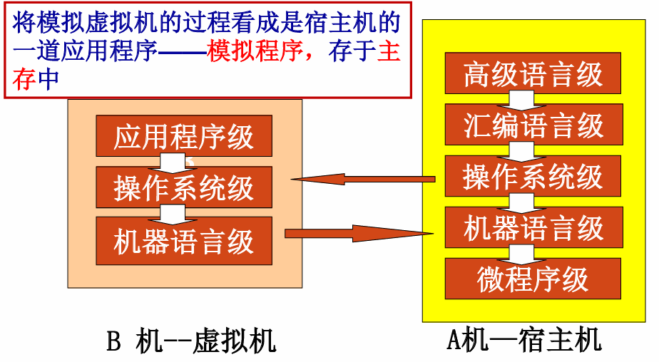
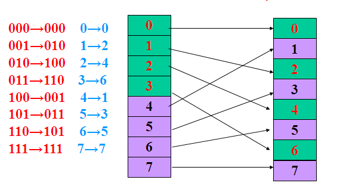
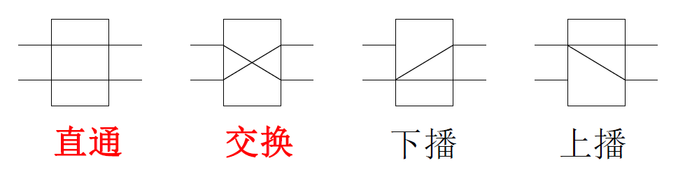
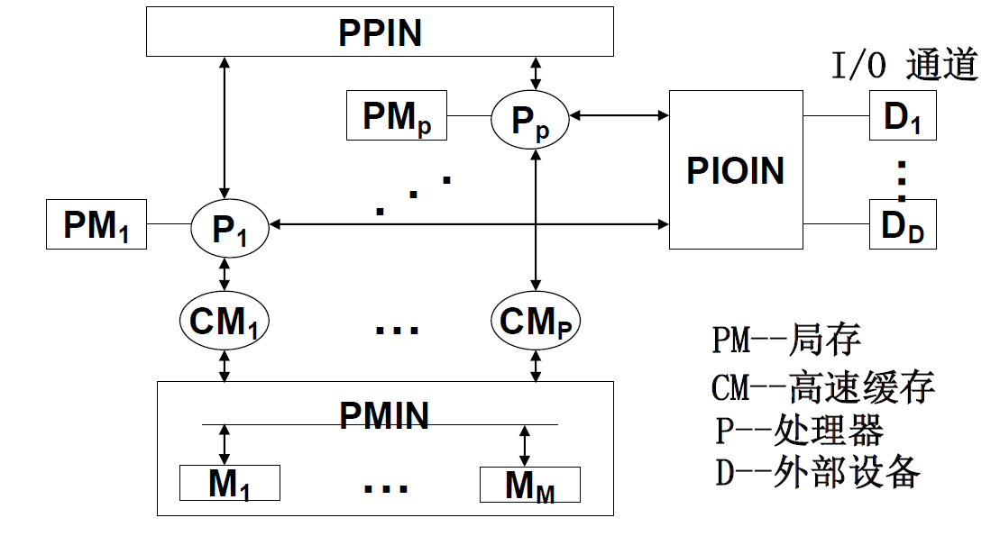

#  第一章 计算机系统结构概论

## 1.1 计算机系统的多级层次结构

> 计算机的层次结构（选择）

>  计算机系统 = 硬件/固件+软件

计算机语言从低级往高级发展电子数字计算机

- 高一级语言功能更强，但均以低级语言为基础。
- 从**计算机语言**的角度，可以将计算机系统看成是按功能划分的**多层次结构**。 
  每一层以一种语言为特征。

## 1.2 计算机系统结构、组成与实现

> 计算机系统结构、计算机组成、计算机实现所包含的**内容** （选择 ）；

### 计算系统结构

> 计算机系统结构的定义 （实质）（选择）
>
> 透明性的定义和判断 (选择) 

计算机系统的**多级层次结构**的划分是相对的，不同级别的程序员所了解到的**计算机属性**是不一样的，低层机器的属性对高层机器的程序员基本上是**透明**的（即**抽象使用**）

#### 透明性概念

<mark>透明性</mark>: 本来存在的事物或属性，从某个角度去看却好像不存在

| CPU类型, 型号, 主存容量          |        |
| -------------------------------- | ------ |
| 对应用程序员                     | 透明   |
| 对系统程序员, 硬件设计人员       | 不透明 |
| **浮点数表示, 乘法指令**         |        |
| 对高级语言程序员, 应用程序员     | 透明   |
| 对汇编语言程序员、机器语言程序员 | 不透明 |
| **数据总线宽度、微程序**         |        |
| 对硬件设计人员                   | 透明   |
| 对计算机维修人员                 | 透明   |
| 对汇编语言程序员                 | 不透明 |

<mark>系统结构</mark>就是要研究对于某级，哪些属性应该透明，哪些属性不应该透明。

- 更本质地说，系统结构就是某一语言程序员在对应的机器级上能够编写正确运行的程序所必须了解的所有计算机属性的集合。 

**计算机系统结构的本质**

- 完成硬件、软件的功能分配, 对计算机的机器级界面的确定。
- 界面之上，是软件实现的功能；界面之下是硬件和固件实现的功能。

**计算机系统结构的属性**

- 数据表示: 硬件能直接识别和处理的数据类型、格式
- 寻址方式: 最小寻址单位，寻址方式的种类，地址的计算
- 寄存器组织: 数据寄存器、变址、控制寄存器、专用寄存器等数量，使用方法
- 指令系统: 指令的格式、类型，使用方法
- 存储系统: 最小编址单位，编址方式，存储容量，最大存储空间
- 中断系统: 中断类型，优先级别，入口地址的形成等
- I /O 接口的结构: I / O的连接方式、访问方式、编址方式
- 信息的保护: 保护方式，硬件对信息的保护和支持
- 机器工作状态、定义和切换

### 计算机组成

**计算机组成的定义**

- 计算机系统结构的逻辑实现: 包括机器级内的数据流、控制流的组成及逻辑设计，完成机器内控制机构、各部件的功能及连接

**内容**

- 数据通路宽度
- 专用部件的设置
- 各种操作对部件的共享程度
- 功能部件的并行度
- 控制机构的组成方式
- 缓冲和排队技术
- 可靠性技术

### 计算机实现

**计算机实现的定义**

- 计算机组成的物理实现, 主要涉及器件技术和组装技术

**计算机实现的内容**

- 处理机、主存、 I/O 接口等部件的物理结构
- 器件的集成度和速度的选择
- 器件、模块、插件、底板的划分与连接
- 专用 器件的设计
- 组装技术
- 信号传输
- 电源、冷却、整机的装配等

### 三者关系

> 计算机系统结构、计算机组成、计算机实现三者之间的区别和联系 (<mark>简答</mark>、选择) 

> **计算机系统结构: 系统设计**
> **计算机组成: 逻辑设计**
> **计算机实现: 物理设计**

例: 计算机指令系统中

- 指令系统的确定–系统结构
- 指令的实现–组成
- 指令实现的电路–实现

相同系统结构的计算机可以采用 不同的组成
相同组成的计算机可以采用 不同的实现技术

## 1.3 计算机系统设计准则

> 软、硬件取舍原则 （<mark>简答</mark>、选择 ）
>
> CPU性能公式（<mark>计算</mark>）

### 软、硬件取舍原则

软硬件取舍原则：软件和硬件在逻辑功能上是**等效**的，只是性能、价格、实现的难易程度不同

1. 硬件实现：速度快、成本高；灵活性差、占用内存少
2. 软件实现：速度慢、复制费用低；灵活性好、占用内存多、易设计、可改性强、适应性强、设计周期短

### 计算机系统的性能评价

一个程序的CPU执行时间 $T_{CPU}=IC\times CPI\times \frac{1}{f_C}(=IC\times CPI\times T_C)\\$ 

- 程序的总指令数$IC$
- 平均每条指令的时钟周期数$CPI$ (Cycles Per Instruct)
- 主时钟频率(主频) $f_C$ 
- 即运行一个程序需要多少个时钟周期: $\frac{时钟周期数}{程序}\\$

性能公式完整写法: 

$$
\begin{aligned}
\frac{时间}{程序}& = \frac{指令数IC}{程序}\times\frac{指令平均时钟周期数CPI}{指令数IC}\times\frac{时间}{时钟周期T_C}\\
&= \frac{指令数IC}{程序}\times\frac{指令平均时钟周期数CPI}{指令数IC}\times时间\times 主时钟频率f_C
\end{aligned}
$$

常用单位: $MIPS, Million\ Instruction\ Per\ Second$

- $MIPS=\frac{IC}{T_{CPU}\times 10^6}\\\Rightarrow T_{CPU}=\frac{IC}{MIPS}\times10^6$ 

常用单位 $MFLOPS$(Million Floating Point Operations Per Second,每秒百万次浮点运算)。

- $I_{FN}为程序运行中浮点运算总次数, MFLOPS=\frac{I_{FN}}{T_{CPU}}\times 10^{-6}\\$ 

### 计算机系统的定量设计原理

> 三大定量分析原理 (填空、 <mark>简答</mark>）
>
> Amdahl定律（<mark>计算</mark>）

#### 哈夫曼压缩原理

在各种事件发生概率不相同的情况下，尽可能采用优化技术

- 对高概率事件用最短位数（时间） 来表示（处理）
- 对低概率事件允许用较长的位数（时间）来表示（处理）

#### 程序局部性原理

- **时间局部性**： 最近的将来 要用到的信息可能就是现在正在使用 的信息。
  - 这与程序不断在循环运行有关。
- **空间局部性**： 最近的将来 要用到的信息很可能与现在正在使用的信息 在程序上的 位置是临近的。
  - 这与指令的顺序存放、数据的簇聚存放有关。

#### Amdahl定律

<mark>系统加速比</mark>$S_P$： 系统中某一部件采取措施提高速度后能得到**系统性能改进的程度**

- $S_P = \frac{S_{old}}{S_{new}} =\frac{T_{old}}{T_{new}} \\$

<mark>可改进比</mark>$f_{new}$: 在改进前的系统中，可改进部分的执行时间占系统**总执行时间**的比值

- $0\leq f_{new}\leq 1$

<mark>部件加速比</mark>$r_{new}$: 可改进部分在**改进后性能提高的倍数**，是改进前执行时间与改进后时间的比

- $r_{new}\geq 1$

$S_p=\frac{T_{\mathrm{old}}}{T_{\mathrm{new}}}=\frac{1}{(1-f_{\mathrm{new}})+f_{\mathrm{new}}/r_{\mathrm{new}}}\\$

### 1.3.4 计算机系统设计的主要方法

> 计算机系统设计思路 （填空、选择 ）；

1. 从上往下
   - 从使用者面向的机器级开始设计
   - 适用于专用机的设计
2. 从下往上
   - 不管要求、应用需要，只根据现有能得到的器件，构成系统。 配合不同的应用需要,加入操作系统、高级语言等
   - 设计脱节，浪费资源
3. 中间开始
   - 首先进行**软硬件功能分工**，确定交界面，再分别向上、下进行设计

## 1.4 软件等对系统结构的影响

> 计算机系统设计步骤 （选择、填空)   

### 1.4.1 软件对系统结构的影响

#### 软件可移植性

> 解决软件可移植性的方法 （选择、填空)  
>
> 系列机和兼容机的概念 （选择、填空）

<mark>软件可移植性</mark>的定义: 软件产品不用修改或只需经过少量加工，就能 由一台机器搬到另一台机器上运行。

解决方法：

##### **统一高级语言**

- 软件的移植种类：**系统软件**和**应用软件**
- 目前有数百种高级语言，用于不同的应用场合， 却没有一种能满足各种需要、通用的高级语言，因为： 

  - 不同的用途，语言的语法结构和语义结构不同
  - 对语言的基本结构没有透彻的统一的认识
  - 惯性作用

##### **系列机**

1. <mark>系列机</mark>应该是多功能的、通用的，按照**统一系统结构**设计的，根据结构生产软件，按现代技术用各种器件实现的，具有不同速度、价格和应用场合的。
   - 软件运行于同系列不同型号的机器上，仅有运行时间不相同
2. 系列机的特性在于： 
   - 机器的属性相一致
   - 软件的兼容性（应做到**向后兼容**，并力争**向上兼容**）
     - 向后: 时间上向后, 支持之后出的系列机
     - 向上: 机器档次向上, 支持更高档的系列机
     - **向后兼容**是软件兼容的根本特征， 也是系列机的根本特征。

##### 模拟和仿真

**模拟**

用机器语言程序解释，实现程序移植的方法。 即B机器的每条机器指令用A机器一段机器语言程序解释

内容：机器语言、存储体系、I / O 系统、操作系统

缺点：

1. 一般要用多条指令才能完成某一功能
2. 有的功能无法完成的，甚至要很复杂

**仿真**

用机器中微程序控制的方法，解释另一台机器指令的系统，即B机器的每条机器指令用A机器一段微程序解释

内容：机器语言、存储体系、I / O 系统、操作系统

优点：

1. 加快运行的速度
2. 可以完成难以实现的操作

## 1.5 并行性发展与计算机系统分类

### 1.5.1 并行性概念

> 并行性的概念和分类 (<mark>简答</mark>、选择、填空)
>
> 系统结构中开发并行性的途径 （填空、选择、<mark>简答</mark>) 和耦合度（填空、选择）

#### 并行性的定义与功能

- 把同时进行运算或操作的特性，称<mark>并行性</mark>。即： 在同一时刻或同一时间间隔内完成两种或两种以上， 性质相同或不同的工作。 
- 开发并行性是为了提高计算机处理的速度。包括**运算速度、执行速度、数据存取的速度**。
- 并行性可分为：同时性、并发性
  - <mark>同时性</mark>:  并发事件在同一时刻发生
  - <mark>并发性</mark>:  并发事件在同一时间间隔里发生

#### 并行性开发的途径

##### **时间重叠**

让多个处理过程在时间上相互错开，轮流重叠地使用同一套硬件设备的各个部件，以加快部件的周转提高速度。

- 采用专用化功能部件完成专一功能，各执行过程在时间上重叠起来。把专门化功能部件从指令内部，扩展到指令之间的执行部件，构成专用功能段。采用一条指令对向量的多个元素（多个数据）进行处理，构成的**流水线处理机**。
- 由多个不同类型、不同功能的处理机，构成**异构型多机系统**

特点: 不增加硬件设备（部件），可以提高性能价格比

##### **资源重复** 

通过重复设置硬件资源，提高性能和可靠性。由同一个控制器，控制多个处理器同时处理同一个数据，进行同个运算。

- 关键部件采用重复设置、冗余技术，提高系统速度。采用多操作部件、多存储体，用同样的资源结构，通过重复设置多个相同的处理单元，在一个控制器指挥下，同时对多个数据操作。并行处理机采用阵列结构形式，构成**阵列机**。
- 由多个相同类型、相同功能的处理机，形成**同构型多机系统**

特点: 硬件价格下降了，有利于提高系统的速度和可靠性

 

##### **资源共享**

用软件的方法，使多个用户按一定时间轮流地**分时使用同一资源**(时间片轮转)，以提高利用率，提高整个系统
的性能。

- 采用多道程序、分时系统在单机上使用形成了虚拟机系统。分时系统适用于多终端、远程终端上
  使用。
- 将若干台具有独立功能的处理机（或计算机）相互连接起来，在操作系统控制下，统一协调地运
  行，最少依赖某一软件、硬件资源，称为**分布式处理系统** 

资源共享可分为

1. 硬件资源共享：CPU、主存、外设资源
2. 软件资源共享:   软件、信息资源

#### 多机系统的耦合度

> [紧耦合与松耦合](# 紧耦合与松耦合)

多机系统的耦合度指各机间紧密的程度和相互作用的能力。

- 最低耦合：仅通过中间存储介质相互通信。
  各机器间并无物理连接，也无共享的联机硬件资源。
- 松散耦合： 通过通道或通信线路实现互连。
  共享某些外围设备，以较低频带在文件或数据集合一级进行相互通信
- 紧密耦合： 通过总线或高速开关实现互连。
  共享主存，有较高的信息传输速率 ，实现数据传输的吞吐量大，高效率

### 1.5.2 计算机系统分类

>  ***冯氏分类法***, Flynn 分类 （选择、填空) 

#### 弗林分类法

<mark>弗林分类法</mark>：按指令流、数据流方式进行分类

$\begin{cases}指令流:指机器执行的指令序列\\数据流:指指令流调用的数据序列\end{cases}$

**单指令流单数据流（SISD）**: 指令部件每次只对一条指令进行译码，并只对一个操作部件分配数据

**单指令流多数据流（SIMD）**: 由单一指令部件控制，按照同一指令流的要求，给它们分配不同的数据。

**多指令流单数据流（ MISD）**: 有多个处理单元，按多条不同指令的要求对同一个数据流及中间结果进行不同的处理。一个处理单元的输出作为另一个处理单元的输入

**多指令流多数据流（MIMD）**: 由多个单指令流单数据流的集合构成

#### 库克分类法

<mark>库克分类法</mark>：按指令流、执行流方式来描述计算机总控制器的结构特征

**单指令流单执行流（ SISE ）**: 典型的单处理机系统
**单指令流多执行流（ SIME ）**: 带多操作部件的处理机
**多指令流单执行流（ MISE ）**: 带指令级多道程序的单处理机
**多指令流多执行流（ MIME）**: 典型的多处理机系统

#### 冯泽云分类法

<mark>冯泽云分类法</mark>：以计算机在**单位时间内处理的最大二进制位数**

**字串位串 (WSBS)** : 位串处理方式，每次只处理一 个字中的一位，如位串行计算机。
**字串位并 (WSBP)** : 字（字片）处理方式，每次处理一个字中的 n 位，如传统的位并行单处理机。
**字并位串 (WPBS)** : 位（位片）处理方式，一次处理 m 个字中的一位，如相联处理机、阵列处理机。
**字并位并 (WPBP)** : 全并行处理方式，一次处理m 个字，每个字为 n 位，如阵列处理机 、多处理机

串行: serial; 并行: parallel

# 第二章 指令系统的发展和改进

> 指令系统的优化设计的两个截然相反的方向

## 两个方向

CISC、RISC

指令系统设计的三个阶段：

- CISC：复杂指令系统
  - 70-80年代，CISC结构的微处理器为市场的主流
- RISC：精简指令系统
  - 80-90年代末期，RICS结构的处理器得到发展，大量出现在高性能的计算机中
- 后RISC时期
  - RISC和CISC互相借鉴继续发展，出现了新型的结构

## RISC

> RISC 的基本原则和快的实质（<mark>简答</mark>、选择）； 
>
> RISC 采用的基本技术（<mark>简答</mark>、选择）；
>
> 重叠寄存器窗口（选择)

精简指令系统计算机RISC（Reduced Instruction Set Computer）: 通过减少指令种数和简化指令功能来降低硬件设计的复杂度，提高指令的执行速度

- 只保留功能简单的指令，对复杂的不常用指令进行精简
- 功能较复杂的指令改由软件实现
- 设置大量寄存器
- 提高流水线效率

### 基本原则

1. 选择使用**频度较高**、最有用，及实现简单的指令
2. 每条指令都在**一个机器周期**内完成的指令
3. **减少指令寻址方式**的种类，简化指令格式，使指令的长度相同
4. **增加通用寄存器**的数量，减少访问存储器操作
5. **大量采用硬联**控制，提高执行速度
6. 通过**优化和精简**指令设计支持的**编译程序**，能有效地为高级语言生成机器语言程序

### 基本技术

1. 遵循按RISC机器一般原则设计的技术
2. 在逻辑上采用**硬联实现**和**微程序固件实现**相结合的技术
   - 大多数简单指令用硬连线方式实现，功能较复杂的指令用微程序解释实现

3. 在CPU中设置数量较大的寄存器组， 并采用**重叠寄存器窗口**的技术
4. 指令的执行采用**流水和延迟转移**技术
5. 指令流调整技术
   - 通过变量**重新命名**消除数据相关，提高流水线效率
6. 采用高速缓冲存储器 Cache
   - 分别设置指令Cache 和数据 Cache ，分别存放指令和数据。保证向指令流水线不间断地输送指令
     和存取数据，提高流水线效率

#### 重叠寄存器窗口

设置一个数量比较大的寄存器堆，并把它分成很多个窗口。在每个程序使用的几个窗口中

- 有一个窗口是与前一个程序共用
- 有一个窗口是与后一个程序共用

每个过程可利用

- 公共窗口存放全局变量
- 私有窗口存放局部变量
- 重叠窗口实现与父进程或子进程间的参数传递

与前一过程共用的窗口可以用来存放前一过程传递给本过程的参数，同时也存放本过程传送给前一过程的计算结果。同样，与下一过程共用窗口可以用来存放本过程传送给下移过程的参数和存放下移过程传送给本过程的计算结果。

大量减少了原先由于程序调用引起的访存的次数

### 快的实质

RISC的速度比CISC要快三倍左右，关键在于CPI

$\frac{时间}{程序}= \frac{指令数IC}{程序}\times\frac{指令平均时钟周期数CPI}{指令数IC}\times\frac{时间}{时钟周期T_C}\\$

# 第三章 标量处理机

## 3.1 重叠方式

### 重叠原理与一次重叠

> 重叠和流水概念及工作原理（选择）
>
> 重叠和顺序解释的异同（<mark>简答</mark>、选择）
>
> 一次重叠、二次重叠的概念（选择）

- <mark>顺序解释</mark>：各条机器指令之间顺序串行地执行，执行完一条指令后采取出下条指令来执行，而且每条指令内部的各个微操作也是顺序串行地执行
  - 控制简单, 速度慢, 部件利用率低
- <mark>重叠解释</mark>：在解释第k条指令的操作完成之前，就可开始解释第k+1条指令
  - 不能加快一条指令的实现, 但能加快相邻两条/一段程序的解释
  - 一次重叠:  
  - 二次重叠:  

**一次重叠的特点**

- 节省硬件，机器内指令分析部件和指令执行部件均**只需一套**，也简化了控制。
- 在一次重叠中，要求分析指令、执行指令的时间要尽可能**等长**，重叠方式才能有较高的效率。但是在一般情况下，分析指令和执行指令的时间不等长
- 采用重叠方式的机器大多采用“一次重叠”，若达不到速度要求，则改用流水线。

### 重叠对计算机组成的要求

> 重叠对计算机组成的要求（<mark>简答</mark>、选择）；详细解释见[系统结构–3.1 重叠方式–时间重叠要解决的问题](./系统结构.md) 
>
> 重叠*（指令）*相关的两种解决方案(推后读/转发)并就其原因用系统设计原理作出解释 （选择、填空、<mark>简答</mark>） 
>
> 几种相关的判断及解决方法（选择、填空）

- 解决可能存在的访存冲突
- 在硬件上保证有独立的指令分析部件和指令执行部件；解决控制的同步
- 转移指令的处理问题
- 指令相关的处理

#### 访存冲突

**原因**: 

- 一般的机器上，操作数和指令混存于同一主存内，取指需要访主存，分析中取操作数也可能访主存。而一次只能访问一个主存单元

**解决方案**: 

- **操作数**和**指令**分别存于两个独立编址且可同时访问的存储器，有利于实现指令保护，增加总线控制和软件设计的复杂性
- 采用**多体交叉主存结构**
  - 让两条指令的存储位置不在同一个存储体中, 这样可以同时访问
- 增设指令缓冲寄存器，主存空闲时可预取下一条或几条指令于Cache中
  - 如果每次都可以从指缓中取得指令，就可把这个微操作合并到分析内
  - **先行控制方式**: 先行控制是指在处理机内部设置一定容量的指令缓冲栈，把指今分折器所需要的指令事先取到指令缓冲栈中，而不必访问主存储器。这样，就能够使取指令、分析指令和执行指令重叠起来执行。如果指令分析器每次都能够在先行指令缓冲栈中得到，则取指令只需要很短的时间就能够完成，因此，可以**把指令与分析指令合并到一起**，从而将二次重叠转换为一次重叠。

#### 解决控制同步

为了实现重叠, 需要保证有独立的**取指部件**、**指令分析部件**和**指令执行部件**

两个阶段执行的时间常常不相同，需要在硬件上解决好控制上的同步

- 保证同一时刻只有**分析K+1和执行k的重叠**
   

#### 转移指令

**存在问题**

- 如果第k条指令是条件转移，执行阶段条件发现条件不成立，之后回继续执行已经执行部分的k+1条
- 如果跳转到m，下一条要执行m，需要撤销k+1，在k执行结束后再执行m，变顺序执行

**解决方案**

- 采用**重叠方式的机器**中，应尽量减少使用条件转移语句
- **延迟转移**: 将与分支指令**不存在数据相关**的、在分支指令**之前**的`指令i`(即原本一定会执行的指令)移动到分支指令`jump`之后, 在`jump`运行到执行阶段时, 如果需要跳转, 此时并不会撤销`指令i`, 从而避免了分支预测失败时的浪费

#### 指令相关的处理

[指令相关的处理](# 指令相关的处理)

### 相关问题及其处理

因为机器语言程序中临近指令之间出现了关联，为防止出错让它们不能同时解释的现象就称为发生了“<mark>相关</mark>”

- 包括指令相关, 操作数相关

<mark>指令相关</mark>：后一指令的内容受前一指令的执行结果影响而产生的关联，造成两条指令不能同时解释。

<mark>操作数相关</mark>： 两条指令的数据有了关联，造成两条指令不能同时解释。

#### 指令相关的处理

> <mark>指令相关</mark>：后一指令的内容受前一指令的执行结果影响而产生的关联，造成两条指令不能同时解释。

处理方法：

-  程序运行过程中不允许修改指令
  - 同时可实现程序的可再入和程序的递归调用
  - 但为满足程序设计的灵活性，希望修改指令
- 设置一条“执行”指令，将指令相关转化成操作数相关来解决

#### 操作数相关

> <mark>操作数相关</mark>： 两条指令的数据有了关联，造成两条指令不能同时解释。

##### 主存空间数相关

相邻两条指令之间出现对主存同一单元要求先写入后读出的关联
如果让“执行k”与“分析k+1”在时间上重叠，就会使 “分析k+1”读出的操作数错误

处理方法：

- 推后第k+1条指令的读操作数
  - 由存控给读数、写数申请安排不同的访存优先级来解决
  - 只要将写数级别安排成高于读数级别，则自动实现了推后读

##### 通用寄存器空间数相关

- 存放于通用寄存器中的基址或变址值一般总是在“分析”周期的前半段就取出来用
- 操作数是在“分析”周期的后半段取出，到“执行”周期的前半段才用得上
- 运算结果是在“执行”周期的末尾才形成，并送入通用寄存器中

处理方法：

- 推后读（牺牲速度来避免相关出错）

  - 把“分析k+1”推后到“执行k”结束时开始
    完全的顺序串行，速度明显下降
  - “分析k+1”只推后到“执行k”把结果送入L3时
    仍有部分重叠，可以减少速度损失

- 增设相关专用通路

  在完成计算后通过专门的通道将结果传输到下一步需要的寄存器中

### 总结

为了实现两条指令在时间上的重叠解释

- 需要付出硬件代价
- 要处理好指令可能存在的相关
- 合理安排好指令顺序及指令微操作的时间关系
  使“分析”和“执行”所需的时间尽可能匹配

## 3.2 流水

> 流水线分类（选择、填空）；解决影响流水线瓶颈的方法（选择、填空）；
>
> 流水线性能分析（<mark>会画时空图及计算</mark>）；
>
> 流水线的相关处理（选择、填空）、异步流动流水线和同步流水线及可能出现的相关（选择、填空）； 
>
> 单功能非线性流水线的调度(<mark>计算</mark>)

> 流水是重叠的延伸
>
> - 一次重叠：只是把一条指令的解释分解为两个子过程；
> - 流水：分解为“取指令”、“指令译码”、“取操作数”和“执行”4个子过程

### 流水线基本概念

> 流水线特点（选择）；

#### 特点

> **<mark>syy PPT</mark>**

1. 只有连续提供**同类任务**才能充分发挥流水线的效率
   - 对于指令流水线：要尽量减少因条件分支造成的“断流”
   - 对于操作部件：主要通过编译技术，尽量提供连续的同类操作
2. 在流水线的每一个流水线段中都要设置一个**流水锁存器**
   - 时间开销：流水线的执行时间加长
   - 是流水线中需要增加的主要硬件之一
3. 各流水段的**时间应尽量相等**
   - 流水线处理机的基本时钟周期等于时间最长的流水段的时间长度
4. 流水线需要有**装入时间**、**充满时间**和**排空时间**
5. 在理想情况下，当流水线充满后，每隔Δt时间将会有一个结果流出流水线

> **<mark>ljw PPT</mark>**

- 一条流水线由多个流水段组成(多段)
- 每个流水段有专门的功能部件对指令进行某种加工(专件)
- 流水线工作阶段可分为建立、满载和排空三个阶段(三阶段)
- 在理想情况下，当流水线充满后，每隔Δt时间将会有一个结果流出流水线。
- 流水技术适用于大量重复程序过程。只有不断提供输入，才能连续流水输出，机器效率才能充分发挥。

### 流水线分类

#### 按向下向上

##### 向下扩展

把子过程进一步细分，让每个子过程经过的时间都同等程度地减少，吞吐率会进一步提高

以增加设备为代价

##### 向上扩展

多个处理机串行地对数据集进行处理，某个处理机专门完成其中的一个任务

因为各个处理机都在同时工作，所以能对同一数据流的不同部分流水地处理

因此，可以分为

- 部件级流水：构成部件内的各个子部件之间的流水，如运算器内浮点加法流水线。
- 处理机级流水：指构成处理机的各个部件的流水，如“取指”、“分析”、“执行”间的流水。
- 系统级流水：构成计算机系统的多个处理机之间的流水，也称为宏流水

#### 按功能多少

- **单功能流水线**：只能完成一种固定功能。
  - 要完成多个功能，可将多个单功能流水线组合

- **多功能流水线**：流水线的各段通过不同的连接实现不同的功能

#### 按工作方式

- 静态流水线：某一时间内各段只能按一种功能连接流水，只有等流水线全部流空后，才能切换成按另一种功能连接流水
  只有连续出现同一种运算时，流水线的效率才能得到充分的发挥
- 动态流水线：允许在同一时间内各段按不同运算或功能连接。

动态流水线必是多功能流水线，而单功能流水线必是静态的。

#### 按所具有的数据

- 标量流水处理机：没有向量数据表示，只能用标量循环方式来对向量、数组进行处理
- 向量流水处理机：具有向量数据表示，设置有向量指令和向量运算硬件，能对向量、数组中的各个元素流水地处理。是向量处理机和流水技术的 结合

#### 按所各段之间是否有反馈回路

- 线性流水线：各段串行连接，各段只流过一次，没有反馈回路。
- 非线性流水线：某些功能段有反馈回路，可能多次经过某个段。

### 性能

> 解决影响流水线瓶颈的方法（选择、填空）；
>
> 流水线性能分析（<mark>会画时空图及计算</mark>）；

#### 吞吐率

**吞吐率**：流水线单位时间里能流出的任务数或结果数。

- $Tp=\frac{n}{T_k}\\$

- **最大吞吐率**：流水线正常满负荷工作时，单位时间内流出的最大结果数。
- **实际吞吐率**：从启动流水线开始到流水线操作结束，单位时间内能流出的任务数或结果数。

**各阶段长度相同时**: 

- $T_k=(k+n-1)\Delta t$ : $k\Delta t$为流水线启动时间
- $Tp = \frac{n}{T_k}=\frac{n}{(k+n-1)\Delta t}\\$ 
- $Tp_{max} = \underset{\mathrm{n\to\infty}}{\operatorname*{Lim}}\frac n{(k+n-1)\Delta t}=\frac1{\Delta t}\\$ 

**各段时间长度不相同时**:

- $Tp=\frac{\mathbf{n}}{\sum_{i=1}^k\Delta t_i+(n-1)\max\left\{\Delta t_1,\Delta t_2,\Delta t_3,\cdots,\Delta t_k\right\}}\\$ 

- $Tp_{max}=\frac{1}{max\{\Delta t_1,\Delta t_2,...,\Delta t_n\}}\\$ 

##### 瓶颈子过程

当各功能段时间不同时，最大吞吐率取决于最慢子过程所需时间

实际吞吐率总是低于最大吞吐率，因为流水线从开始启动到流出第一个结果，需要经过建立阶段和排空阶段

**解决办法**

1. 将瓶颈子过程再细分
  
2. 瓶颈子过程重复设置（并联）
  

#### 加速比

流水线工作相对于顺序串行工作方式，速度提高的比值

设流水线由k段组成，共完成n条指令

- 若各功能段时间相等
  
- 若各功能段时间不相等
  
- 最大
  

可以看出，当n>>k时，流水线的加速比Sp  接近于流水线的段数k。因此，在n>>k的前提下，增大流水线的段数k，可以提高流水线的加速比Sp 。

#### 效率

<mark>效率</mark>: 指流水线的设备利用率。在

- 整个运行时间里，有多少时间流水线设备真正用于工作。
- 是实际使用时间占整个运行时间之比

由于流水线有**建立和排空时间**，在连续完成n个任务的时间里，各段并不是满负荷工作的，因此流水线的效率一定小于1

如果是k段线性流水线，且各段经过时间相同，则在T时间里，流水线各段的效率都相同，均为$η_0$，即

$$
\eta_1=\eta_2=\cdots=\eta_k=\frac{n\cdot\Delta t_0}{T}=\frac{n}{k+n-1}=\eta_0
$$

整个流水线的效率: $\eta=\frac{\eta_1+\eta_2+\cdots+\eta_k}k=\frac{k\cdot\eta_0}k=\frac{k\cdot n\Delta t_0}{k\cdot T}\\$

**几何解释**：从时空图上看，效率就是$\eta=\frac{\text{n个任务的时空区面积}}{k\text{个段的总时空面积}}\\$

- 与吞吐率类似，只有当n>>k时，η才趋近于1。

对于线性流水且**每段经过时间相等**时，流水线的效率正比于吞吐率， 即

$$
\eta=\frac{n\cdot\Delta t_0}T=\frac n{n+(k-1)}=TP\cdot\Delta t_0
$$

如果各段经过的时间不相等，其中“瓶颈”段时间为$Δt_j$，完成n条指令的解释。整个流水线的效率为：

$$
\eta=\frac{n\text{个任务占用的时空区}}{k\text{个段总时空区}}=\frac{n\cdot\sum_{i=1}^k\Delta t_i}{k\cdot\left[\sum_{i=1}^k\Delta t_i+(n-1)\Delta t_j\right]}
$$

##### 效率低的问题

- 多功能流水线，未用到的部件处于空闲
- 建立与排空时，部分设备空闲；静态工作方式中的功能切换，增加了建立与排空的时间
- 送入流水线任务数量太少
- 送入流水线的任务间存在相关问题

综上，流水线适合处理：同一操作类型，且输入输出间不存在相关性的一连串运算

### 相关问题

> 流水线的相关处理（选择、填空）、异步流动流水线和同步流水线及可能出现的相关（选择、填空）； 

指令的相互联系、转移、中断等操作，影响流水线处理机的正常工作，影响了速度，也就是产生 “ 相关 ”。

#### 局部性相关

指令相关、主存数相关和寄存器组数相关由于只影响相关的二条或几条指令，而至多影响流水线某些段的推后工作，并不会改动指令缓冲 器中预取到的指令内容，影响是局部的，所以被称之为局部性相关，也称**数据相关**。

处理办法：

1. **推后对相关单元的读**，直至写入完成；(*插入空泡*)

2. **设置相关专用通路**，使得不必先把运算结果写入相关存储单元，再读出后才能使用，而是经相关专用通路直接使用运算结果 (*旁路转发*) 

3. 调整流水线的流动方式

  - 顺序/同步流动方式
    
    - 任务流出流水线的顺序与流入顺序一致。
      - 一串指令“h,i,j,k,l,m,n,…”，h和j发生数相关，j流到读段时，j及其后的指令必须停下来,直到h到达写段并完成写入
    - 本质: 推后读
    
  - 异步流动方式

    - 任务流出流水线的顺序与流入顺序不同。

    - 要解决新出现的相关问题(因为异步产生的问题)

      - 写写相关: 写完成的顺序

      - 先读后写: 避免异步结果出现先写后读

解决局部性相关，应在控制机构上需解决好：

1. 如何判定流水线的多条指令之间是否相关
2. 如何控制推后读
3. 如何设置相关专用通路并控制其连通和断开
4. 如何协调好异步流动时的三种相关

#### 全局性相关

转移指令可能会造成流水线中很多已被解释的指令作废，需要重新预取指令进入指令缓冲寄存器，它将影响整个程序的执行顺序，所以称之为全局性相关，也称**转移相关**。

##### 分支预测

1. 猜测原则：
   - 猜概率高者
   - 两者概率相近时，宜选不转移分支(下一条指令)，因为它已预取进指缓。(所以什么时候进行预测)
2. 猜测错误, 撤销指令, 恢复分支点的方式
   - 对猜测指令的解释只完成译码和准备好操作数，在转移条件码出现前不执行运算
   - 对猜测指令的解释可完成到运算完毕，但不送回运算结果
     （以上两种不好，猜对的话还会进行余留的操作）
   - 对猜测指令不加区别地全部解释完，但需**把可能被破坏的原始状态都用后援寄存器保存**起来，一旦猜错就取出后援寄存器的内容来恢复分支点的现场。

##### 加快和提前形成条件码

1. 加快单条指令内部条件码的形成
   - 特别适合于**转移条件码**是由上一条运算型指令产生的情形
2. 在一段程序内提前形成条件码
   - 这特别适合于**循环程序在判断循环是否结束时**的转移情况

##### 延迟转移技术

用软件方法将转移指令与其前面不相关的指令交换位置

##### 加快短循环程序的处理

- 将长度小于指缓的循环程序一次性放入指缓，并暂停预取指令
- 或循环出口端的条件转移指令恒猜循环分支。

#### 中断处理

中断会引起流水线断流。但出现概率比条件转移的概率要低得多，且是随机发生的。

因此流水机器处理中断的主要目的是： 如何处理好断点现场的保存和恢复，而不是如何缩短流水线的断流时间。

现场包括：

- 提供给中断服务子程序准确的断点现场；
- 在中断处理完后恢复到断点处指令流水线的指令 现场。

处理方法：

- “不精确中断”法： 断点不精确
  不论指令i在流水线的哪一段发生中断，未进入流水线的后续指令不再进入，已在流水线的指令仍继续流完，然后才转入中断处理程序。这样，断点就不一定是i,可能是i+1、i+2或i+3、…，即断点是不精确的。
- “精确中断”法：断点精确
  不论指令i是在流水线中哪一段响应中断，给中断处理程序的现场全都是对应i的，i之后流入流水线的指令的原有现场都能保存和恢复。 需设置很多后援寄存器，以保证流水线内各条指令的原有现场都能保存和恢复

### 非线性流水线调度

1. 根据预约表写出**延迟禁止表F**
2. 由延迟禁止表形成**冲突向量C**
3. 由所有的向量图画出**状态图**
4. 由状态图形成最佳调度方案

# 第四章 向量处理机

## 4.1 向量的流水处理与向量流水处理机

> 向量流水线的处理方式（选择、填空）

<mark>向量的流水处理</mark>：选择使向量运算最能充分发挥出流水线性能的处理方式。

**向量的几种处理方式**： 以 $D=A* (B+C)$为例 (A, B, C为n维向量)

1. 横向处理方式
   - 逐个求$d_i$, 得到D 
     向量元素 $b_i+c_i \rightarrow k, k* a_i → d_i$
   - 不是流水处理方式，存在相关
2. 纵向处理方式
   - 先求所有的$K= (B+C)$，再求所有的A*K
   - 是流水处理，需要每拍取得成对元素
3. 分组纵横处理方式
   - 把该向量分割成若干个组，使每个组都能装入向量寄存器中， **每组按纵向处理**, **组间**采用软件方
     法编制循环程序的方式**依次循环处理**。
   - 解决主存与流水线速度不匹配问题

> 向量处理机并行操作条件（选择、填空）

> 采用链接技术的条件（选择）

<mark>流水线的链接技术</mark>: 当前一条指令的**结果寄存器**可以作为后继指令的**操作数寄存器**时， 多条有数据相关的向量指令并行执行。

**条件**：无功能部件冲突，无源向量寄存器冲突

一些主要要求 (在上面的条件之外)

- 在进行链接的时候**只有**在前一条向量指令的第一个结果元素送入结果向量寄存器的那一个时钟周期才可以进行链接 若错过该时就不能进行链接。
- 只有当前一条向量指令全部执行完毕 ，释放相应的向量寄存器资源后才能执行后面的向量指令。
- 当一条向量指令的两个源操作数分别是两条先行向量指令的结果寄存器时，要求先行的两条向量指令产生运算结果的时间必须**相等**即 要求有关向量功能部件的延迟时间相等 。
- 只有所有可以链接执行的向量指令的**向量长度相等**时，它们之间才能链接执行，否则它们之间也不能链接执行。

## 4.2 阵列处理器

> 阵列处理机的定义 （选择）

<mark>阵列处理机</mark>: 多个**处理单元**（PU）按照**一定方式互连**，在同一个**控制单元**（CU）控制下，对各自的**不同数据**完成**同一条指令**规定的操作。

- 指令级并行SIMD计算机

> 阵列处理机的构成 （选择） 

一个完整的系统是由三个部分复合而构成的。

- 多个**处理单元**组成阵列，并行地处理向量
- 功能极强的**控制部件**实际是一台标量处理机
- 系统的管理功能由高性能单处理机担负

> ILLIAC IV阵列处理机结构特点（选择、填空）

- 闭合螺线阵列
- 任意单元的最短距离不超过7步
  - 一般来讲：$N=\sqrt{N}*\sqrt{N}$个处理单元组成的阵列中，任意两个处理单元之间的最短距离不会超过$\sqrt N-1$步
- 处理单元为通常的累加型运算器，把累加寄存器RGA中的数据和存储器的数据进行操作               

## 4.3 SIMD计算机互联网络

> 互连网络的设计目标（选择、简答）

1. 基本功能
   - 互连网络（ICN，**I**nter**c**onnection **N**etwork）主要完成结点与结点间的连接，连接和控制方式不同，连接效果不同。
2. 互连网络的设计思路
   - 根据应用需要（互连网络属性），选择合理的特征方式，考虑互连网络的性能因素，综合加以合理组合
   - **目标：低成本、高灵活性、高连接度、低延时、适合VLSI。**

> 互联网络应抉择的几个问题（选择、填空）

四要素: 定时协议、**控制策略、开关方法、拓扑结构**

> 操作方式（选择、填空）

？？？

> 单级互连网络及其函数 （<mark>计算</mark>、选择）

**互联函数**

| 置换方式         | description                                                                    | 函数式                                                                                                    |                                                                                                                 |
| ---------------- | ------------------------------------------------------------------------------ | --------------------------------------------------------------------------------------------------------- | --------------------------------------------------------------------------------------------------------------- |
| **恒等置换**     | 相同编号的输入端与输出端一一对应的互连                                         | $I(p_{n-1}p_{n-2}...p_0) = \\p_{n-1}p_{n-2}...p_0$                                                        |     |
| **交换置换**     | 实现二进制地址编号中**第0位**位置不同的输入端和输出端之间的连接 (相邻奇偶交换) | $EX(p_{n-1} p_{n-2}…p_1 p_0)=\\p_{n-1} p_{n-2}…p_1\textcolor{red}{\overline{p_0}}$                        |     |
| **立方体置换**   | 实现二进制地址编号中的 第 i 位位置不同的输入端和输出端之间的连接               | $Cube_i (p_{n-1}p_{n-2}...p_i... p_1 p_0 )=\\p_{n-1}p_{n-2}...\textcolor{red}{\overline{p_i}}... p_1 p_0$ |                                                                                                                 |
| **全混洗置换**   | 输入端的二进制地址循环左移1位                                                  | $Sh(p_{n-1} p_{n-2}…p_1 p_0)=\\p_{n-2}…p_1p_0\textcolor{red}{p_{n-1}}$                                    |  |
| **加减2^i^置换** | 将输入端数组循环移动2^i^的位置向输出端传送                                     | $PM_{+i}(x) = (x+2^i)mod\ N\\PM_{-i}(x) = (x-2_i)mod\ N$                                                  |                                                                                                                 |

### 4.3.3 **单级互连网络**

> *单级互联网络中, 两个PU想要通讯, 可能要循环通过多次单级网络, 不能随意直连*
>
> *而多级可以实现任意两个结点的连接*

#### 立方体单级网络（交换互连网络）

立方体的每一个顶点，代表一个处理单元，共8个处理单元，用 Z Y X 三位二进制代码来表示。

立方体单级网络有 3 种互联函数: 

- $Cube: (Z(b_2)\ Y(b_1)\ X(b_0))\\\begin{array}{cc}\mathrm{X:}&\mathrm{Cube_{0}=(b_{2}b_{1}\overline{{b_{0}}})~}\\\mathrm{Y:}&\mathrm{Cube_{1}=(b_{2}\overline{b_{1}}{b_{0}})~}\\\mathrm{Z:}&\mathrm{Cube_{2}=(\overline{{b_{2}}}b_{1}b_{0})~}\end{array}$ 
- 连接线的两端上的编码，对应于相应方向的位置（1位）取反，其余不变

#### PM2I单级网络（循环移数网络）

出端编码与连接的入端结点编码相差$2^i$

互连函数: $PM2_{+i} = (j+2^i)mod\ N\\PM2_{-i} = (j-2^i)mod\ N$ , 单向

- 共有**2n种**互连函数(n=logN)

#### 混洗交换单级网络

> 由混洗函数和交换函数组成

1. <mark>全混洗互连函数</mark>（shuffle）：$Shuffle(b_{n-1}b_{n-2}…b_1b_0)=(b_{n-2}…b_1b_0b_{n-1})$；

   - 把$b_{n-1}$移到$b_0$处, 循环左移
   - 以N=8为例
     
   - 存在问题: 全0和全1结点无法和其他节点产生关联

2. **交换互连函数**: 使用最简单的$Cube_0$函数, 即$Exchange(b_{n-1}b_{n-2}…b_1b_0) = (b_{n-1}b_{n-2}…b_1\overline{b_0})$ 

   - *为了让节点0(b000)和节点7(b111)与其他节点连接*

3. **混洗交换互连函数**: $Exchange(Shuffle(b_{n-1}b_{n-2}…b_1b_0)) = (b_{n-2}…b_1b_0\overline{b_{n-1}})$ 

   -  

   - 互连特性：
     - 互连函数不可逆；
     - 对于shuffle 函数， n 次全混洗之后，还原；
     - 最大间距：n 次交换， n 1 次混洗，共 2n 1 次；
     - 全混洗最先改变最高位(左移)，交换取反最低位。
     - 应用：
       - 多次调用混洗交换互连函数，可实现任意结点间的连接。

4. **蝶形单级网络**: $Butterfly(b_{n-1}b_{n-2}…b_1b_0)=(b_{0}b_{n-2}…b_1b_{n-1})$​
   - 交换最高位和最低位

### 4.3.4 基本的多级互连网络

> 多级互连网络的几个关键技术（选择、填空）
>
> 交换开关分类、控制方式（选择、填空）

1. 不同的**多级互连网络**反映在所采用的**交换开关**, **拓扑结构**和**控制方式**上有所不同。
2. <mark>(二元)交换开关</mark>：是具有**两个入端和两个出端**的交换单元。用作各种多级互连网络的基本构件。
   -  
3. <mark>拓扑结构</mark>：
   - 不同级开关间连接方式(单级 ICN 的连接功能)，即**各级之间出端和入端相互连接**的模式。
   - 根据拓扑结果分类: 
     - [多级立方体网络](# 多级立方体网络)
     - 多级混洗交换网络
     - 多级PM2I 网络
4. <mark>控制方式</mark>：
   - 级控制：同级交换开关使用同一个控制信号控制。
   - 部分级控制：第i级使用第i+1个控制信号控制。
   - 单元级控制：每个交换开关分别控制。

#### 多级立方体网络

> **STARAN 交换网络的交换函数和互连函数、控制信号（<mark>计算</mark>、分析）** 
>
> **STARAN 移数网络的控制方式 (填空 、选择)**

根据**控制方式**不同，多级立方体网络有 <mark>STARAN网络</mark>和**间接二进制n立方体网络**两种。

- STARAN网络： 级控制和部分级控制
  - STARAN网络根据控制方式不同可以实现不同的功能： **交换功能** 和 **移数功能**
- 间接二进制n立方体网络：单元控制

##### 交换功能

1. 控制方式： 级控制
   - 控制信号(对某一级的开关)
     - 1 ：开关实现 交换 功能
     - 0 ：开关实现 直通 功能
2. 交换功能： 组间次序不变，组内元素镜像。
   - 所谓交换(Flip函数 )，是将一组元素**首尾对称**地进行交换
   - 
   - 

3. 应用： 对集中式处理机同时数据传输作用很大。

##### 移数功能

1. 控制：部分级控制 （第 i 级有 i+1 种控制信号）
2. 功能：控制信号不同，功能不同。
   - 

3. 应用：
   - 移数功能很适合于累加求和算法实现；
   - 不同的Mod，可用作不同的分组操作。

#### 多级混洗交换网络

> 多级混洗交换网络的交换开关 、控制方式 、拓扑结构(填空 、选择)

**交换开关**：四功能 （允许实现一对多的连接拓扑结构：不同级相同，**均为全混洗**结构；
**控制方式**：级控制、部分级控制、单元控制；
连接图：第 n-1 级靠近入端；

功能：

- **若为级控制且开关为二功能**：是STARAN 交换网络的逆网络；（F 、 G 交换位置）
- **部分级控制且开关为二功能**：是STARAN 移数网络的逆网络；
- **单元控制**：可实现更强大的功能。
  - 利用交换开关的播送功能实现一对多的连接。
- 典型应用：恒等置换、移数置换等各种函数的变形置换； 可完成数组按行、列、对角线、子块等无冲突访问

## 4.4 并行存储器无冲突访问

> 存储器的无冲突访问（<mark>计算</mark>、选择、填空）

**一维向量**：顺序存放，防止步长与 m 成比例；

- **存储体个数m**取质数，且与步长互质。

**多维向量**：错位存放，满足行、列、对角线等方式；

- 当m 大于每次访问向量元素个数(处理单元数)时，
- $m=2^{2P}+1$
  - $\delta_1{=}2^P,$ 同一列不同行错开距离
    $\delta_{2}=1,$ 同一行不同列错开距离
  - P是中间变量, m选为>处理单元数的最小质数
- 对二维元素$A_{ab}$: 
  - 放置的体号$j=(\delta_1a + \delta_2b+ C)mod\ m$ 
    - C = $A_{00}$的体号地址
  - 体内序号$i=a$ 

> **计算**: 在集中式主存的阵列机中，处理单元数为 4,为了使$4\times4$的二维数组 A 的各元素$a_{ij}\left ( i= 0\sim 3, j= 0\sim 3\right )$在行、列、主 / 次对角线上均能实现无冲突访问，请填出数组各元素在存储器分体(分体号从 0 开始) 中的分布情况。假设 a$_{00}$已放在分体号为 3。体内地址(从i+0开始)为i+0的位置。

1. 数组的行列数、处理单元数为4, 分体数为>4的质数, 即5
2. $M = 2^{2P}+1; M=5=2^{2*1}+1$, 求出P=1
3. 数组中同一列上两个相邻行的元素其地址错开的体号距离$\delta_1=2^{\mathbb{P}}=2$
   数组中同一行中两个相邻列的元素其地址错开的体号距离$\delta_{2}=1$​
4. 计算实现无冲突访问后, 每个单元的存储位置
   - 放置的体号(列)$j=(\delta_1a + \delta_2b+ C)mod\ m$ 
   - 体内序号(行)$i=a$ 

# 第五章 多处理机

## 5.1 多处理机概述

### 5.1.1 多处理机的基本概念 & 5.1.2 多处理机的硬件结构

> 多处理机定义以及硬件结构（选择、填空）；

<mark>多处理机系统</mark>是指有两台以上的处理机，**共享I/O子系统**，机间经**共享主存或高速通信网络通信**，在**操作系统的控制**之下，**协同求解大而复杂问题**的计算机系统。

- 多处理机系统采用**资源共享**的技术途径，提高并行处理能力(作业, 任务级并行)，属于**多指令流多数据流（MIMD）** 

#### 紧耦合与松耦合

> 多处理机耦合度（填空）

##### 紧耦合多处理机

- 特点: 通过**共享主存**实现机间通讯 (通信速度就受限于主存)
- 互连网络：实现 PE←→PEM 、 PE←→I/O 通道、PE←→中断信号间的连接。
  - 
- **系统属性**：
  - **同构or异构**: PE类型相同or不同；
  - **对称or非对称**: 每个PE与部分or全部的 I/O 通道连接。
- **常见结构**：**同构对称式** 和 **异构非对称式** 多机系统。
- 限制：PE 数量不能很多。 为什么？
  - 主存带宽、IN 带宽、同步开销限制了 PE 的数量。
- 访存冲突解决方案：
  - 采取多体交叉访问方式，增加PEM 数量；
  - 每个PE 自带小容量局部存储器，存放核心代码、OS 表格等，减少 PE 访存次数；
  - 每个PE 自带一个 Cache，减少 PE 访存次数。

##### 松耦合多处理机

1. <mark>松耦合多处理机</mark>: 每一台处理机都有容量较大的局部存储器，用于存储经常用的数据和指令，减少访存冲突，不同处理机间或者通过**通道互连** / **消息传送系统（MTS）**实现通信。 
2. 松耦合多处理机较适合做粗粒度的并行计算。
   - 作业可被分为若干个相对独立的任务, 任务间信息流量较少, 则可在多个处理机上并行执行, 
     即松耦合度的多处理机系统有效。
3. 特点：
   - 通过消息传送系统实现机间通讯；
     - 
     - 每个模块是一个独立的处理机，整个系统可看成是一个分布系统。
   - 互连网络：MTS 有总线、环形、多级网络等种类；
   - 结构：有**层次**和**非层次**两种结构。

#### 机间互联形式

> 机间互连形式及采用算法（选择、填空）

##### 总线形式(时间分配)

1. PE、 PEM 、 I/O 通道均连在总线上，采用分时或多路转换技术实现数据传递，是最简单的连接方式。
2. **总线仲裁算法**：
   - 静态优先级算法、平等算法、动态优先级算法、先来先服务算法等。
   - 对外设一般采用优先级算法；对PE采用均等算法。
3. **实现方法**：
   - 集中式：由总线控制器控制；
   - 分布式：中机构分散到各PE中。
4. **提高总线效率方法**：
   - 改善传输介质和增加总线数量。
   - 总线互连方式不适宜连接过多的处理机。

##### 环形互连形式

为保持总线式互连的优点，同时又能克服其不足，可以考虑构造一种逻辑总线，让各台处理机之间点点相连成环状，称<mark>环形互连</mark>

##### 交叉开关形式 (空间分配)

<mark>交叉开关方式</mark>是总线形式的一个极端，**总线数=PE 数 +PEM 数 +I/O 通道数**，是一种全相联形式，控制、仲裁、转换机构均在开关中。

- 通常: PEM数 >= PE数+I/O

改进：用一系列较小开关串联或并联，形成多级交叉开关，减少其复杂性。

交叉开关方式不适宜连接过多的处理机。

##### 多端口存储器形式

将控制、仲裁、转换机构移到存储器中。
每个端口与一个PE 或 I/O 通道相连。

多端口存储器形式不适宜连接过多的处理机。

#### 存储器的组织

> 多处理机的存储器组织中两种编址方式及其适应场合（<mark>简答</mark>、选择）；

由m个存储器模块构成的并行存储器，存储单元的地址是按**交叉方式**编址的。这种地址交叉编址的方式主要有<mark>低位交叉</mark>和<mark>高位交叉</mark>两种。

##### 低位交叉编址

块内顺序物理地址不连续，距离为m

- 低位交叉编址方式下，连续物理地址空间的数据被分散到各个分存储体中

- 适用于当前执行**进程是共享同一集中连续物理地址空间中的数据**，如流水线、向量或阵列处理机

##### 高位交叉编址

块内顺序物理地址连续，总体也依次连续分布

- 高位交叉编址方式下，一段程序或数据存放在同一个模块内

- 适用于当前执行的多个进程基本**不共享数据**的情况， 可将存储模块中的一定数量的页面分配给某进程

- 将**放置处理机i执行进程要用到的绝大多数页面**的那个存储器模块i称为是处理机i的**本地存储器**

## 5.2 多处理机的 cache 一致性

> 多处理机的 cache 一致性问题（选择、填空）；

Cache的一致性问题：保证同一数据块在不同Cache以及主存中的多个副本的一致性

**不一致的原因**：

- **进程迁移**引起数据不一致性：多处理机中允许将未完成的进程**挂起**，**调度到另一处理机**上执行。进程的迁移可能造成最近修改过的信息**只保留在原处理机的 Cache** 中，迁移后则不能正确恢复
- **I/O 传输**造成的数据不一致性：系统中发生部分绕过 Cache 的 I/O 操作，可能形成主存内容与 Cache 内容的不一致

如果一个存储器满足以下3 点，则称该**存储器是一致**的。

- ***自写自读***: 处理器 P 对单元 X 进行一次写之后又对单元 X 进行读，读和写之间没有其他处理器对单元 X 进行写，则 P 读到的值总是前面写进去的值。
- ***自写他读***: 处理器 P 对单元 X 进行写之后，另一处理器 Q 对单元 X 进行读，读和写之间没有其他写，则 Q 读到的值应该是 P 写进去的值。
- ***两次写***: 对同一单元的写是顺序化的，即任意两个处理器对同一单元的两次写，从各个处理器的角度看顺序都是相同的。

### 解决方法

1. 解决进程迁移引起的 Cache 不一致性
   - 禁止进程迁移
   - 触发**写回主存**: 进程挂起时，将该进程改写过的块写回主存
2. 以硬件为基础实现多 Cache 一致性
   - 监视/监听法 (Snoopying)
   - 目录表法 (Directory)
   - **关键**：跟踪记录共享数据块的状态

#### 监视法

**适用结构**: 总线型互连的多处理机 (因为要用总线广播)

**基本思想**: 利用**总线播送**更改主存的情况，各个Cache控制器通过**监听总线**来判断它们是否有总线上请求的数据块

**实现方式**: 

- **写作废协议**

  - 当一个处理器对某数据项进行写入时, 通过广播使其他 Cache 中所有对应该数据项的副本**作废**。

  | -                 | 处理器行为     | 总线行为 | CPU A Cache内容 | CPU B Cache内容 | 主存单元X的内容 |
  | ----------------- | -------------- | -------- | --------------- | --------------- |
  |                   |                |          |                 | 0               |
  | CPU A 读X         |                | 0        |                 | 0               |
  | CPU B 读X         |                | 0        | 0               | 0               |
  | CPU A将1写入单元X | CacheB内容作废 | 1        |                 | 1               |
  | CPU B读X          |                | 1        | 1               | 1               |

- **写更新协议**

  - 当一个处理器对某数据项进行写入时, 通过广播使其他 Cache 中所有对应于该数据项的副本进行**更新**。

  | -                 | 处理器行为      | 总线行为 | CPU A Cache内容 | CPU B Cache内容 | 主存单元X的内容 |
  | ----------------- | --------------- | -------- | --------------- | --------------- |
  |                   |                 |          |                 | 0               |
  | CPU A 读X         |                 | 0        |                 | 0               |
  | CPU B 读X         |                 | 0        | 0               | 0               |
  | CPU A将1写入单元X | 对单元X进行广播 | 1        | 1               | 1               |
  | CPU B读X          |                 | 1        | 1               | 1               |

写更新和写作废协议**性能差距**主要来自：

- 在对同一个数据进行多次写操作而中间无读操作的情况下
  - 写更新协议需进行**多次写广播**操作
  - 写作废协议只需**一次作废**操作
- 在对同一Cache 块的**多个字**进行写操作的情况下
  - 写更新协议对于每一个写操作都要进行**一次广播**
  - 写作废协议仅在对该块的**第一次写**时进行作废操作即可
- 写作废是针对 Cache 块进行操作
  写更新则是针对字或字节进行

#### 目录法

<mark>目录</mark>：一种专用的数据结构用于记录可以进入Cache 的每个数据块的状态 、 哪些处理器有该块的副本 以及 是否修改过 等信息

**适用结构**：非总线型互连的多处理机

**基本思想**：根据目录表，一个处理机在写入自身Cache 的同时，只需有选择地通知其他存有此数据块的 Cache 将副本作废或更新。

分类

- 全映像目录表
- 有限目录表法
- 链式目录表法

#### 基于软件实现

**基本思想**：不允许要共享的可写数据进入 Cache

- **任意时刻**均不允许共享的可写数据进入Cache, 只留在主存中
- 通过编译分析后, **只在实际有写入操作会影响一致性的时间内**不允许进入主存

## 5.3 多处理机的并行

### 5.3.1 并行算法

#### 并行算法的定义和分类

并行算法是指可同时执行的多个进程的集合，各进程可以相互作用, 协调和并发处理

按并行进程间的操作顺序不同并行算法又分同步型、异步型和独立型三种。

- **同步型**：各进程间由于相关, 必须顺次等待。
- **异步型**：各进程间执行相互独立, 根据执行情况决定中止或继续。
- **独立型**：各进程间完全独立, 不需要相互通信。

根据各处理机 计算任务的大小 即任务粒度不同并行算法又分 细粒度 、 中粒度 和 粗粒度 三种。

- **细粒度**： 向量或循环级的并行
- **中粒度**：较大的循环级并行 并确保这种并行的好处可以补偿因并行带来的额外开销。
- **粗粒度**：子任务级的并行。

此外, 用同构性来表示并行的各进程间的相似度。

- MIMD系统上运行的进程： **异构性**
- SIMD系统上运行的进程：**同构性**

#### 多处理机并行算法的设计思路

> 表达式的树形流程图（会画图并<mark>计算</mark>）；

将大程序分解为 若干可并行处理的过程。

把**每个过程**看做一个**节点**，将过程间的**关系**用节点组成的树

- $例: E_1=a+b*x+c*Y = (a) + ((b*x)+(c*Y))$

**<mark>并行算法评价指标</mark>**

- $P$: 可并行处理的处理机机数；
- $T_P$: P 台处理机运算的级数, 即树高
- **$S_P$ 加速比**: 表示单处理机顺序运算的级数$T_1$与P 台处理机并行运算的级数$T_P$之比；
  - $S_P=T_1/T_P$
- $E_P$: P 台处理机的设备利用率(效率)
  - $E_P = S_P /P$

树的**设计目标**：又“矮”又“瘦”

- 矮: 算法速度快(步骤少)
- 瘦: 使用资源少(用到的计算单元少)
  - 先利用交换律把相同的运算集中起来，再用结合律把参加运算的操作数配对

- 减少树高小妙招: **移动某个节点的层级**

> **例: $E_1=a+b · x+c · x · x+d · x · x · x$**

- 在单处理机上, 调整为$E_1=a+x(b+x(c+x(d)))$
  -  
  - $P=1 ，T_1=6，Sp=1(T_1/T_1)，Ep=1$
- 用3台处理机，需4级运算
  -  
  - $Tp=4\\
    P=3\\
    Sp=顺序运算级数/高度=6/4=3/2\\
    Ep=Sp/P=1/2$ 

> **例: $E_2=a+b(c+def+ g)+ h$**

P=1: $E_2 = (efd+c+g)*b+a+h$ 

P=2: $E_2=(a+h)+b((c+g)+def)$

$E_2 = (a+h)+(bc+bg)+bdef$

- 将`a+h`移动到最底层, 而非倒数第二层, 可以**减小树宽**

> **例题: $Z = a+bcd(e+gh)+i(k+l)$**

串行算法的树形流程图(P=1), 求运算级数

并行算法的树形流程图, 运算级数$T_P$, 处理机个数$P$

求加速比Sp、效率Ep的值。

### 5.3.2 程序并行性分析

> 程序并行性分析（选择、填空）； 

任务间是否能并行，除了算法之外，很大程度取决于**程序的结构**。 **数据相关**是限制程序并行的重要因素。

若一个程序包含了P1, P2, P3……. 等 n 个**程序段**，则书写顺序体现的是正常执行的顺序

多处理机系统中，程序段并行必然是“**异步流动**”。(发生顺序随机)

#### 数据相关

如果**$P_i$的左部变量在$P_j$的右部变量集**内, 且$P_j$必须取出$P_i$运算的结果来作为操作数, 就称$P_j$ <mark>数据相关</mark>于$P_i$。

- 相当于流水线中发生的**先写后读**相关 

  - *Pi先写, Pj后读, $P_j$的读要等待$P_i$的写完成*

  | -                                   | Pi                                  | Pj |
  | ----------------------------------- | ----------------------------------- |
  | … **A** = B + D (对A写) … | … C=**A** * E (读A的值) … |

  

当$P_i$ 和 $P_j$ 服从**交换律**时, 虽不能并行执行, 但可以<mark>交换串行</mark>

- 例: $P_ i:  A=2*A\\ P_ j: A=3*A$

#### 数据反相关

如果 $P_j$ 的左部变量在 $P_i$ 的右部变量集内，且当 $P_i$ 未取用其变量的值之前，是不允许被 $P_j$ 改变的，就称 $P_i$ “<mark>数据反相关</mark>于 $P_j$”。

- 相当于流水线中发生的**先读后写**相关 

  - *Pi先读, Pj后写, $P_i$的读要在$P_j$的写之前完成*

    | -                               | Pi                                | Pj |
    | ------------------------------- | --------------------------------- |
    | … C=**A** + E (读A) … | … **A** = B + D (写A) … |

当 $P_i$ 与 $P_j$ 并行时，只要**硬件上能保证 $P_i$ 对相关单元 A 先读出**，就能得到正确的结果；<mark>不能交换串行</mark>。

#### 数据输出相关

如果 **$P_i$ 的左部变量也是 $P_j$ 的左部变量**，且 $P_j$ 存储其算得的值必须在 $P_i$ **存储之后**，则称 $P_j$ <mark>数据输出相关</mark>于 $P_i$

- 相当于流水线中发生的<mark>写–写相关</mark>
  - *$P_i$先写$P_j$​后写*
  - $P_i: A=B+D\\P_j: A=C+E$ 

当 $P_i$ 与 $P_j$ 并行时，必须要**同步**保证写入的**先后顺序**，<mark>不可交换串行</mark>。

#### 其他相关

若两个程序段的**输入变量互为输出变量**, 同时具有先写后读 和 先读后写 两种相关, 以**交换数据为目的**, 则两者必须**并行执行**, 既**不能顺序串行**也**不能交换串行**。

- $P_i: A=B\\P_j: B=A$ 
- 并行执行, 且必须保证读 、 写完全同步

如果两个程序段之间不存在任何一种数据相关，即无共同变量，或共同变量都只出现在右边的源操作数，则**两个程序段可以无条件地并行执行**，也可以串行或交换串行

### 5.3.3 并行语言与并行编译

> FORK 、 JOIN 语句（选择）；多处理机上并行执行的程序及时间资源图（<mark>设计程序并画图</mark>）；

见作业

`Fork n`: 从当前任务上派生出一个任务, 其跳转到n处继续执行, 当前任务继续向下执行

`Join n`: 等待n个并行任务完成

## 5.4 多处理机操作系统

5.4.1 多处理机操作系统的功能

5.4.2 多处理机操作系统的特点

### 5.4.3 多处理机操作系统的类型

> 多处理机的操作系统分类（选择、填空）；

#### 主从型操作系统

有一台主处理机上运行操作系统，其他的处理机为从处理机， 由主处理机管理从处理机的进程和分配任务

- 一台从处理机在执行进程的过程中需要得到管理程序提供服务时，必须向主处理机发生申请，等待主处理机响应后对它提供服务。

**优点**：

- 系统的软件和硬件都较简单。
- 只要单处理机的多道操作系统中增添少量功能即可实施。
- 对解决冲突问题比较容易。

**缺点**：

> 问题都在主处理机上

- 主处理机一旦出故障，整个系统将停止工作，需干预后重新启动 。
- 正常工作时，主处理机成为系统的瓶颈，调度速度慢，而使从处理机空闲 。

#### 各自独立型操作系统

每台处理机都有一个独立的管理程序（操作系统的内核）在运行，即**每个处理机都有一个内核的副本**，执行各种管理功能。

**优点**：

- 适应分布处理的模块化结构特点，减少对大型控制专用处理机的需求
- 有较高的可靠性，每个处理机发生故障时，不会引起系统的瘫痪。
- 每台处理机都有其专用控制表格，使访问系统表格冲突减少，由于进程的统一调度，提高了系统的利用率。

**缺点**：

- 每台处理机仍然有一些共享表格，会增加共享表格的访问冲突，导致进程调度的复杂性，加大了开销。
- 每台机都有自己专用的输入输出设备和文件，使整个系统的 I/O 结构变换需要操作员干预。
- 某一台处理机一旦发生故障，要想恢复和重新执行未完成的工作较困难，各处理机负荷平衡比较困难。

#### 浮动管理控制方式

浮动型操作系统是界于主从型和单独型之间的一种折衷方式，其**管理程序可以在处理机之间浮动** 。担任“主控制处理机” 的设备不固定、担任的时间不固定。

**优点**：

- 主控程序可以从一台处理机转移到另一台处理机，也可以同时有多台处理机执行同一个管理服务子程序
- 各类资源做到较好的负荷平衡；
- 通过静态设置或动态控制的优先级，安排服务请求的次序。

**缺点**：

- 由于存在多个管理程序，所以表格的访问冲突，表格封锁延迟是不可避免的。
- 该方式在硬件结构和可靠性上具有分布控制的优点，而在操作系统的复杂性和经济性接近主从型。
- 操作系统设计比较复杂。

# 第六章 数据流机和（x）

## 6.1 数据流计算机

### 数据驱动的概念

> 控制驱动的控制流方式的特点 （选择 ）；
>
> 数据驱动方式及其特点 （<mark>简答</mark>、选择） 
>
> 数据令牌的概念（<mark>简答</mark>）
>
> 数据流是一种什么样的计算模型（<mark>简答</mark>、填空）；

#### **控制驱动特点**

- 通过访问共**享存储单元**让数据在指令之间传递
- 指令执行的**顺序性隐含于控制流**中，但却可以显示使用专门的控制操作符来实现并行处理
- 指令执行的顺序受**程序计数器**控制，即控制令牌所支配

#### 什么是数据驱动

**数据驱动**的数据流方式： 只要一条或一组指令所要求的**操作数**全部准备就绪，就可立即执行相应的指令或指令组 。执行结果的输出将送往等待这一数据的下一条或下一组指令 。

- 如果其中一些指令因此而使所需用到的数据全部准备就绪就可被激发执行 。 指令的执行基本上是**无序的**， 完全受数据流的驱动，与指令在程序中出现的先后顺序无关 。

#### 数据驱动特点

- 它没有通常的共享变量的概念，即没有共享存储数据的概念
- 指令执行顺序只受指令中**数据相关性**的制约
- 数据是以**数据令牌**方式直接在指令之间传递的

#### 数据令牌

实质上是一种**表示某一操作数或参数已准备就绪的标志** 

- 一旦执行某一操作的所有操作数令牌都到齐，则**①**标志着这一操作是什么操作**②**操作结果所得出的数据令牌应发送到哪些等待此数据令牌的操作的第几个操作数部件 等 有关信息 都将作为一个**消息包**，传送到处理单元或操作部件并予以执行 。
- 结果数+目标地址

只要**数据不相关和资源可以利用** 就可以并行, 因而最有利于计算并行性的开发 。

#### 数据流

特性：

- 并行性：可同时并行执行多条指令（并行性通常是隐含的）
- 异步性：一旦一条指令 所需求的数据令牌到达后， 指令就可独立执行 ，而不必关心其他指令及数据情况如何
- 函数性：运算的执行都是局部操作，操作数是作为数据令牌直接传送的， 每一组数据流操作都需要一组输入值，产生一组输出值
- 分散性：不需要控制执行次序，故不需要集中控制

从语义上说，数据流是基于**异步性**和**函数性**的一种计算模型

### 数据流程序图

> 数据流计算模型分类（填空）； 
>
> 数据流计算机的**机器语言**的两种表示方法（填空）；

数据流程序图–数据流机器的机器语言

- 共有两种表示形式：**有向图** 和 **活动片**

#### 表示方法

##### 有向图表示法

有向图由有限个结点集合与连接结点的单向分支线组成

结点执行规则：当一个结点的所有**输入**分支线上都出现数据令牌，且**输出**分支线上没有数据令牌时，该结点的操作即可执行

| 结点           |                                                              |                                                                                                              |
| -------------- | ------------------------------------------------------------ | ------------------------------------------------------------------------------------------------------------ |
| 常数发生器结点 | 用来产生一个常数，无输入端 ，激发后输出常数令牌              |  |
| 复制结点       | 该结点将一个令牌复制成两个相同的令牌，包括数据令牌和控制令牌 |   |
| 条件分支节点   |                                                              |   |
| 运算节点       | 可以进行数据运算和bool运算                                   |   |
| 条件操作结点   |                                                              |   |

##### 活动模片表示法

一个活动模片相当于有向图表示中的**一个或多个操作节点**。 

- 数据流则是一组活动模片的集合体 。
- 一个活动模片１个操作码域 、 2 个操作数域和 1个目的域；其实质**相当于是一条指令** 。
- 

### 数据流语言

**什么是数据流语言** ~~看不懂~~

**数据流语言特点**: 

- **并行性好**
  - 指令的执行顺序仅受程序中**数据相关性的约束**而与指令在存储器中存放位置无关。
- **单赋值规则**
  - 在一个程序中，每个变量只赋值一次，不允许同名变量在不同语句的左边出现一次以上，不存在全局变量和局部变量的概念。
  - 即为任何一个重新赋值的变量选择另一个从前没有使用过的名字
  - 
- **不产生副作用**
  - 不使用全局变量和公共变量，严格控制变量使用范围， 采用赋值调用 ，而不是引用调用。
- **结果的局部性**
  - 数据流语言完全采用模块化结构，不使用全局变量，不允许全局赋值，对形参的赋值也有严格限制。
- **循环程序迭代展开**
  - 动态数据流计算机可以把一个循环程序的不同次循环展开来进行并行计算 ，从而提高了并行度。

## 数据流计算机的结构

> 两种数据流计算机结构的特点（选择、填空）

分类：

- 静态数据流计算机:  任意一个节拍内，任意一条有向分支线上**只允许存在一个数据令牌**的处理方式, 故数据令牌**不加标号**
- 动态数据流计算机:  任意一条有向线上可**同时传送几个数据令牌**,故每个数据令牌都**必须带上标志**(令牌标号及其他特征信息)