> [02325《计算机系统结构》自考大题：第 6、7、8 章_实现16个处理单元互连的pm2i单级网络1写出所有各种单级pm2i互连函数的一般式 23号-CSDN博客](https://blog.csdn.net/weixin_43605641/article/details/124525916)

# 第1章 计算机系统结构概论

## 1.1 计算机系统的多级层次结构

>  计算机系统 = 硬件/固件+软件

计算机语言从低级往高级发展电子数字计算机

- 高一级语言功能更强，但均以低级语言为基础。
- 从**计算机语言**的角度，可以将计算机系统看成是按功能划分的**多层次结构**。 
  每一层以一种语言为特征。

### 翻译&解释

翻译：先用转换程序将高一级机器级上的程序整个地变换成低一级机器级上等效的程序，然后再在低一级机器级上实现的技术

- 编译程序实现将高级语言源程序转换为机器语言目标程序

解释：在低级机器级上用它的一串语句或指令来 仿真高级机器级上的一条语句或指令的功能，是通过对高级的机器级语言程序中的每条语句或指 令逐条解释来实现的技术。

- 微指令程序解释实现机器指令

> from gpt
>
> 1. **编译：**
>    - **定义：** 编译是将高级编程语言代码转换为机器代码或中间代码的过程。
>    - **目的：** 编译的主要目的是生成一个可在特定计算机体系结构上独立运行的可执行文件。
>    - **输出：** 编译的结果通常是一个可执行文件或中间代码，然后由计算机硬件执行。
> 2. **翻译：**
>    - **定义：** 在更广义上，翻译是将代码或文本从一种语言转换为另一种语言的过程。在编程的上下文中，它可以指编译和解释的过程。
>    - **目的：** 翻译的目的是使代码在不同的环境或语言中可理解或可执行。
>    - 类型：
>      - *源到源翻译：* 将代码从一种高级编程语言转换为另一种。
>      - *二进制翻译：* 将机器代码从一种架构转换为另一种。
> 3. **解释：**
>    - **定义：** 解释是直接在没有单独编译步骤的情况下执行程序的过程。代码在运行时逐行翻译和执行。
>    - **目的：** 解释的主要目的是在不生成单独的可执行文件的情况下执行程序。
>    - **执行：** 程序在运行时被解释和执行，这使得调试更容易，提供更灵活的开发环境。

| 翻译                                 | 解释         |
| ------------------------------------ | ------------ |
| 多占存储空间(保存中间代码, 目标代码) | 节省存储空间 |
| 需要翻译程序                         | 需要编译程序 |
| 不占运行时间                         | 运行费时     |

### 多级层次结构优点

1. 理解软件、硬件、固件的地位和作用 
2. 理解各种语言的实质和实现途径
3. 探索虚拟机新的实现方法和新的系统设计 
   - 由硬件固件实现——**高级语言机器** 
   - 多处理机系统——由**真正微处理机**实现
4. 理解计算机体系结构的定义，合理进行软、 硬件系统设计与开发

## 1.2 计算机系统结构、组成与实现

### 1.2.1 计算机系统结构

计算机系统的多级层次结构的划分是相对的，不同级别的程序员所了解到的**计算机属性**是不一样的，低层机器的属性对高层机器的程序员基本上是**透明**的（即**抽象使用**）。 

- 计算机属性：计算机的概念性结构和功能特性。 

- 透明性：本来存在的事物或属性，从某个角度去看却好象不存在，这种概念称为透明性。

  -  透明性例子

    | ISA               | 无需了解底层复杂的硬件               |
    | ----------------- | ------------------------------------ |
    | 应用程序接口(API) | 无需了解内部具体编码                 |
    | 虚拟内存          | 无需了解程序存储器                   |
    | 文件              | 无需了解I/O设备的工作                |
    | 虚拟机            | 无需了解机器的处理器, 操作系统和程序 |

<mark>系统结构</mark>就是要研究对于某级，哪些属性应该透明，哪些属性不应该透明。

- 更本质地说，系统结构就是某一语言程序员在对应的机器级上能够编写正确运行的程序所必须了解的所有计算机属性的集合。 

<mark>计算机系统结构</mark>也称计算机系统的体系结构,它只是系统结构中的一部分，指的是**传统机器级的系统结构**， 即机器级程序员所看到的计算机属性（包括了**概念性结构和功能特性**）

#### 外特性: 概念性结构和功能特性

例如 

- 人需要有消化系统，胃→外特性 
- 人需要有思维系统，大脑→外特性 
- 动物需要运动系统，运动系统相关的器官→外特性

**计算机的外特性有哪些？** 

- 计算机需要运算系统，需要运算器件。 
- 计算机需要存储系统，需要存储器件。 
- 计算机需要I/O系统，需要输入输出设备。

**运算器件是怎么实现的，电路是如何构造的不是外特性**

#### 透明性概念

| CPU类型, 型号, 主存容量          |        |
| -------------------------------- | ------ |
| 对应用程序员                     | 透明   |
| 对系统程序员, 硬件设计人员       | 不透明 |
| **浮点数表示, 乘法指令**         |        |
| 对高级语言程序员, 应用程序员     | 透明   |
| 对汇编语言程序员、机器语言程序员 | 不透明 |
| **数据总线宽度、微程序**         |        |
| 对硬件设计人员                   | 透明   |
| 对计算机维修人员                 | 透明   |
| 对汇编语言程序员                 | 不透明 |

#### 计算机系统结构的本质

- 完成硬件、软件的功能分配, 对计算机的机器级界面的确定。
- 界面之上，是软件实现的功能；界面之下是硬件和固件实现的功能。

#### 计算机系统结构的属性

1. 数据表示: 硬件能直接识别和处理的数据类型、格式
2. 寻址方式: 最小寻址单位，寻址方式的种类，地址的计算
3. 寄存器组织: 数据寄存器、变址、控制寄存器、专用寄存器等数量，使用方法
4. 指令系统: 指令的格式、类型，使用方法
5. 存储系统: 最小编址单位，编址方式，存储容量，最大存储空间
6. 中断系统: 中断类型，优先级别，入口地址的形成等
7. I /O 接口的结构: I / O的连接方式、访问方式、编址方式
8. 信息的保护: 保护方式，硬件对信息的保护和支持
9. 机器工作状态、定义和切换

### 1.2.2 计算机组成

1. 计算机组成的定义
   - 计算机系统结构的逻辑实现: 包括机器级内的数据流、控制流的组成及逻辑设计，完成机器内控制机构、各部件的功能及连接
2. 计算机组成的目的
   - 解决在**性能价格比**的要求下，达到最佳、最合理地把各种部件、设备**组成计算机, 实现系统结构所确定的功能** 。
   - 重点：提高速度、提高并行度、功能分散和专用部件设置
3. 计算机组成设计包含内容
   1. 数据通路宽度
   2. 专用部件的设置
   3. 各种操作对部件的共享程度
   4. 功能部件的并行度
   5. 控制机构的组成方式
   6. 缓冲和排队技术
   7. 可靠性技术

### 1.2.3 计算机实现

1. 计算机实现的定义
   - 计算机组成的物理实现, 主要涉及器件技术和组装技术
2. 计算机实现的内容
   - 处理机、主存、 I/O 接口等部件的物理结构
   - 器件的集成度和速度的选择
   - 器件、模块、插件、底板的划分与连接
   - 专用 器件的设计
   - 组装技术
   - 信号传输
   - 电源、冷却、整机的装配等

### 1.2.4 三者关系

> **计算机系统结构: 系统设计**
> **计算机组成: 逻辑设计**
> **计算机实现: 物理设计**

例: 计算机指令系统中

- 指令系统的确定–系统结构
- 指令的实现–组成
- 指令实现的电路–实现

相同系统结构的计算机可以采用 不同的组成
相同组成的计算机可以采用 不同的实现技术

## 1.3 计算机系统设计的一般原则

### 1.3.1 软硬件取舍原则

软硬件取舍原则：软件和硬件在逻辑功能上是**等效**的，只是性能、价格、实现的难易程度不同

**硬件实现**：速度快、成本高；灵活性差、占用内存少

**软件实现**：速度慢、复制费用低；灵活性好、占用内存多、易设计、可改性强、适应性强、设计周期短

### 1.3.2 计算机系统的性能评价

CPU的程序执行时间$T_{CPU}=IC\times CPI\times \frac{1}{f_c}\\$ 

- 程序的总指令数$IC$
- 平均每条指令的时钟周期数$CPI$ (Cycles Per Instruct)
- 主时钟频率(主频) $f_c$

常用单位: $MIPS, Million\ Instruction\ Per\ Second$

- $MIPS=\frac{IC}{T_{CPU}\times 10^6}\\\Rightarrow T_{CPU}=\frac{IC}{MIPS}\times10^6$ 

常用单位 $MFLOPS$(Million Floating Point Operations Per Second,每秒百万次浮点运算)。

- $I_{FN}为程序运行中浮点运算总次数, MFLOPS=\frac{I_{FN}}{T_{CPU}}\times 10^{-6}\\$ 

### 1.3.3 计算机系统的定量设计原理

#### 哈夫曼压缩原理

在各种事件发生概率不相同的情况下，尽可能采用优化技术

- 对高概率事件用最短位数（时间） 来表示（处理）
- 对低概率事件允许用较长的位数（时间）来表示（处理）

#### 程序局部性原理

- **时间局部性**： 最近的将来 要用到的信息可能就是现在正在使用 的信息。
  - 这与程序不断在循环运行有关。
- **空间局部性**： 最近的将来 要用到的信息很可能与现在正在使用的信息 在程序上的 位置是临近的。
  - 这与指令的顺序存放、数据的簇聚存放有关。

#### Amdahl定律

<mark>系统加速比</mark>$S_P$： 系统中某一部件采取措施提高速度后能得到**系统性能改进的程度**

- $S_P = \frac{S_{old}}{S_{new}} =\frac{T_{old}}{T_{new}} \\$

<mark>可改进比</mark>$f_{new}$: 在改进前的系统中，可改进部分的执行时间占系统**总执行时间**的比值

- $0\leq f_{new}\leq 1$

<mark>部件加速比</mark>$r_{new}$: 可改进部分在**改进后性能提高的倍数**，是改进前执行时间与改进后时间的比

- $r_{new}\geq 1$

$S_p=\frac{T_{\mathrm{old}}}{T_{\mathrm{new}}}=\frac{1}{(1-f_{\mathrm{new}})+f_{\mathrm{new}}/r_{\mathrm{new}}}\\$

### 1.3.4 计算机系统设计的主要方法

1. 从上往下
   - 从使用者面向的机器级开始设计
   - 适用于专用机的设计
   - 
2. 从下往上
   - 不管要求、应用需要，只根据现有能得到的器件，构成系统。 配合不同的应用需要,加入操作系统、高级语言等
   - 设计脱节，浪费资源
   - 
3. 中间开始
   - 首先进行**软硬件功能分工**，确定交界面，再分别向上、下进行设计
   - 

## 1.4 软件等对系统结构的影响

### 1.4.1 软件对系统结构的影响

> 软件相对于硬件的成本越来越贵，产量和可靠性的提高越来越困难，软件的排错比编写难。 为此，在系统结构设计时，提出应在新的系统结构上解决好**软件的可移植性**问题。

<mark>软件可移植性</mark>的定义: 软件产品不用修改或只需经过少量加工，就能 由一台机器搬到另一台机器上运行。

#### 软件可移植性的基本技术

##### 统一高级语言

软件的移植种类：系统软件和应用软件 

目前有数百种高级语言，用于不同的应用场合， 却没有一种能满足各种需要、通用的高级语言，因为： 

- 不同的用途，语言的语法结构和语义结构不同
- 对语言的基本结构没有透彻的统一的认识
- 惯性作用

##### 系列机思想

1. <mark>系列机</mark>应该是多功能的、通用的，按照**统一系统结构**设计的，根据结构生产软件，按现代技术用各种器件实现的，具有不同速度、价格和应用场合的。
   - 软件运行于同系列不同型号的机器上，仅有运行时间不相同
2. 系列机的特性在于： 
   - 机器的属性相一致
   - 软件的兼容性（应做到**向后兼容**，并力争**向上兼容**）
     向后兼容是软件兼容的根本特征， 也是系列机的根本特征。

3. 系列机优点
   - 优点：
     - 采用系列机之间软件兼容，可移植性好
     - 使总线和硬件的插件、接口等相互兼容；
     - 便于实现机间通信；(使用统一数据结构和指令，便于组成多机系统和网络)
     - 便于(机器)维修、(人员)培训；
     - 有利于提高生产率, 降低成本, 增加产量
   - 缺点：
     - 采用新技术困难---如Itanium(32bit64bit)
     - 限制了计算机系统结构的发展

##### 模拟和仿真

> 为实现不同系统结构的机器之间的机器语言软 件移植，就必须做到在一种机器的系统结构上实现另一种机器的系统结构。其中最重要的，就是要在 一种机器上（A）实现另一种机器（B）的指令系统， 即**另一种机器语言**。
>
> $B机的程序\stackrel{移植}\Longrightarrow A机上运行$

**模拟**

- 用**机器语言程序**解释，实现程序移植的方法 。
- 即B机器的每条**机器指**令用 A 机器一段**机器语言程序**解释
- 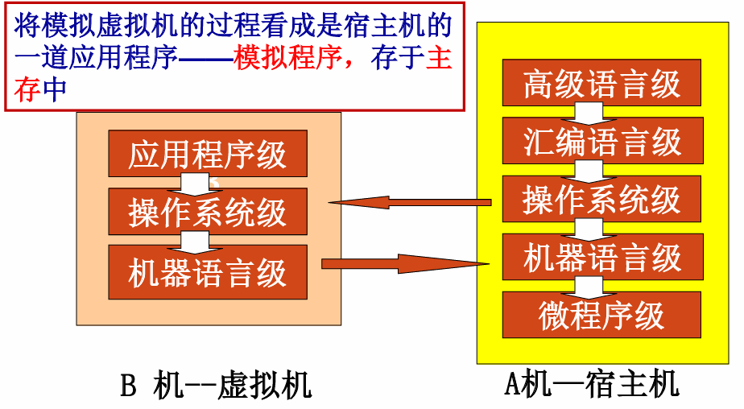

**仿真**

- 用机器中**微程序**控制的方法，解释另一台机器指令的系统，即B机器的每条机器指令用A机器一段微程序解释

## 1.5 并行性发展与计算机系统分类

### 1.5.1 并行性概念

#### 并行性的定义与功能

- 把同时进行运算或操作的特性，称并行性。即： 在同一时刻或同一时间间隔内完成两种或两种以上， 性质相同或不同的工作。 
- 开发并行性是为了提高计算机处理的速度。包括**运算速度、执行速度、数据存取的速度**。
- 并行性可分为：同时性、并发性
  - <mark>同时性</mark>:  并发事件在同一时刻发生
  - <mark>并发性</mark>:  并发事件在同一时间间隔里发生

#### 并行性的等级

- **程序执行**
  - 指令内部: 一条指令内部各个微操作之间的并行
  - 指令之间: 多条指令的并行执行
  - 任务、进程之间: 多个任务或程序段的并行执行
  - 作业、程序之间: 多个作业或多道程序的并行

- **数据处理**
  - 位串字串: 只能对一个字中的一位进行处理 指传统的 “串行”概念
  - 位并字串: 同时对一个字中的全部位进行处理 指传统的 “并行” 概念
  - 位串字并: 同时对多个字中的同一位进行处理
  - 位并字并: 同时对多个字中的多位进行处理 也称 “全并行”

- 信息加工，是从各个加工的步骤和阶段来分

  - 存储器操作并行----采用单体多字 、多体单字、多体多字方式进行存储器访问、读写过程

  - 处理器操作步骤并行----处理器内部操作，取指令、分析、执行操作的并行（**流水线**）

  - 处理器操作并行----采用多个处理器，在同一控制器下同时一条指令的多个数据、多个向量并行处
    理

  - 指令任务、作业并行----采用多个处理器，同时对多条指令的多个数据进行处理

#### 并行性开发的途径

##### **时间重叠**

1. 让多个处理过程在时间上相互错开，轮流重叠地使用同一套硬件设备的各个部件，以加快部件的周转提高速度。
   - 采用专用化功能部件完成专一功能，各执行过程在时间上重叠起来。把专门化功能部件从指令内部，扩展到指令之间的执行部件，构成专用功能段。采用一条指令对向量的多个元素（多个数据）进行处理，构成的**流水线处理机**。
   - 由多个不同类型、不同功能的处理机，构成**异构型多机系统**
2. 特点: 不增加硬件设备（部件），可以提高性能价格比
3. 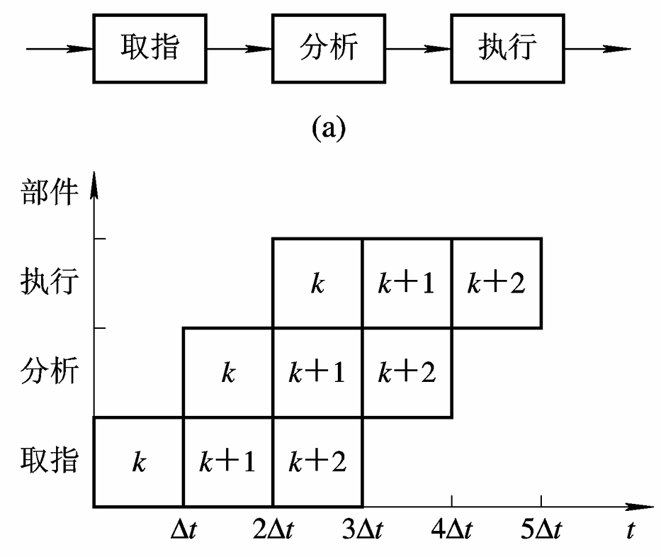

##### **资源重复** 

1. 通过重复设置硬件资源，提高性能和可靠性。由同一个控制器，控制多个处理器同时处理同一个数据，进行同个运算。
   - 关键部件采用重复设置、冗余技术，提高系统速度。采用多操作部件、多存储体，用同样的资源结构，通过重复设置多个相同的处理单元，在一个控制器指挥下，同时对多个数据操作。并行处理机采用阵列结构形式，构成**阵列机**。
   - 由多个相同类型、相同功能的处理机，形成**同构型多机系统**
2. 特点: 硬件价格下降了，有利于提高系统的速度和可靠性
3.  

##### **资源共享**

1. 用软件的方法，使多个用户按一定时间轮流地分时使用同一资源，以提高利用率，提高整个系统
   的性能。
   - 采用多道程序、分时系统在单机上使用形成了虚拟机系统。分时系统适用于多终端、远程终端上
     使用。
   - 将若干台具有独立功能的处理机（或计算机）相互连接起来，在操作系统控制下，统一协调地运
     行，最少依赖某一软件、硬件资源，称为**分布式处理系统** 
2. 资源共享可分为
   1. 硬件资源共享：CPU、主存、外设资源
   2. 软件资源共享:   软件、信息资源

### 1.5.2 计算机系统分类

#### 弗林分类法

> <mark>弗林分类法</mark>：按指令流、数据流方式进行分类

$\begin{cases}指令流:指机器执行的指令序列\\数据流:指指令流调用的数据序列\end{cases}$

**单指令流单数据流（SISD）**: 指令部件每次只对一条指令进行译码，并只对一个操作部件分配数据

**单指令流多数据流（SIMD）**: 由单一指令部件控制，按照同一指令流的要求，给它们分配不同的数据。

**多指令流单数据流（ MISD）**: 有多个处理单元，按多条不同指令的要求对同一个数据流及中间结果进行不同的处理。一个处理单元的输出作为另一个处理单元的输入

**多指令流多数据流（MIMD）**: 由多个单指令流单数据流的集合构成

1.  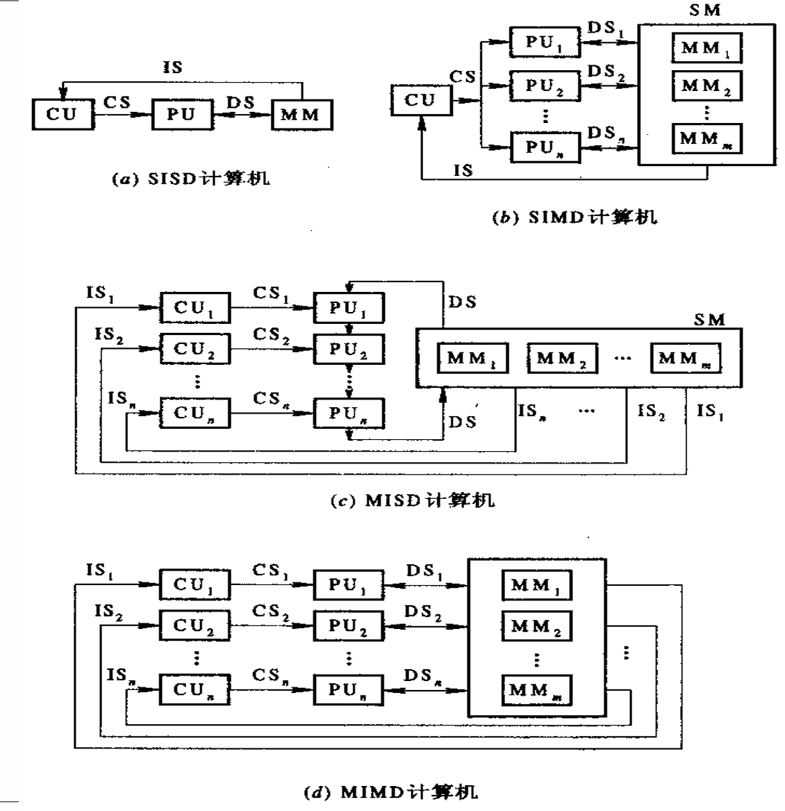

#### 库克分类法

**单指令流单执行流（ SISE ）**: 典型的单处理机系统
**单指令流多执行流（ SIME ）**: 带多操作部件的处理机
**多指令流单执行流（ MISE ）**: 带指令级多道程序的单处理机
**多指令流多执行流（ MIME）**: 典型的多处理机系统

> <mark>库克分类法</mark>：按指令流、执行流方式来描述计算机总控制器的结构特征

#### 冯泽云分类法

> <mark>冯泽云分类法</mark>：以计算机在**单位时间内处理的最大二进制位数**

**字串位串 ( WSBS)** : 位串处理方式，每次只处理一 个字中的一位，如位串行计算机。
**字串位并 ( WSBP)** : 字（字片）处理方式，每次处理一个字中的 n 位，如传统的位并行单处理机。
**字并位串 ( WPBS)** : 位（位片）处理方式，一次处理 m 个字中的一位，如相联处理机、阵列处理机。
**字并位并 ( WPBP)** : 全并行处理方式，一次处理m 个字，每个字为 n 位，如阵列处理机 、多处理机

串行: serial; 并行: parallel

# 第2章 指令系统的发展和改进

指令系统设计的三个阶段：

- CISC：复杂指令系统
  - 70-80年代，CISC结构的微处理器为市场的主流
- RISC：精简指令系统
  - 80-90年代末期，RICS结构的处理器得到发展，大量出现在高性能的计算机中
- 后RISC时期
  - RISC和CISC互相借鉴继续发展，出现了新型的结构

## 2.1 CISC结构

### 2.1.1 CISC设计思想

复杂指令系统计算机CISC（Complex Instruction Set Computer）

1. 试图用数目少、功能强的指令来完成程序的任务
   - 设计方法： 用一条指令代替一串指令
     - 增加新的指令
     - 增强指令的功能，设置功能复杂的指令
     - 增加寻址方式
     - 增加数据的表现形式
2. 特点：
   - 指令条数多
   - 指令功能强
   - 寻址方式多
   - 执行时间长
   - CPU控制电路复杂

### 2.1.2 CISC改进方向

1. 面向目标程序的优化实现改进
    - 通过统计已有机器语言程序及其执行过程中指令和指令串的**使用频度**加以分析改进
      - **遵循哈夫曼压缩原理**
    - 增设强功能符合指令
2. 面向高级语言和编译的优化实现改进

      - 通过统计高级语言语句的使用频度加以改进分析
      - 优化代码生成来改进
      - 缩小语义差距
      - 面向不同高级程序语言自寻优
      - 发展高级语言计算机

3. 面向操作系统的优化实现改进

    - 统计操作系统中指令和指令串的使用频度加以改进分析
    - 增设专用于操作系统的新指令
    - 频繁使用的子程序硬化或固化
    - 发展专门的处理

### 2.1.3 CISC存在的问题

1. 指令系统庞大

     - 指令的条数多，功能复杂
     - 寻址方式多，指令的格式多，字节数长
     - 指令分析器复杂，面积增大，成本提高
     - 芯片设计周期长，成功率低，可靠性降低
2. 指令操作繁杂，速度低
     - 功能复杂，寻址方式多，指令的格式多，字节数长都影响 CPU 指令执行的速度
3. 指令系统庞大，使高级语言编译程序生成目标程序的难度大

     - 编译程序选择的目标范围大
     - 很难生成真正高效 的机器语言程序
     - 编译生成的目标程序长度长
4. 指令使用的频度差别很大,许多指令利用率很低

     - 增加设计人员 负担，降低了系统性能价格比

     - <mark>2-8定律</mark>: 仅20%的指令被反复使用，在总程序数量中占80%

## 2.2 RISC结构

精简指令系统计算机RISC（Reduced Instruction Set Computer）: 通过减少指令种数和简化指令功能来降低硬件设计的复杂度，提高指令的执行速度

- 只保留功能简单的指令，对复杂的不常用指令进行精简
- 功能较复杂的指令改由软件实现
- 设置大量寄存器
- 提高流水线效率

### 2.2.1 RISC设计原则

1. 选择使用频度较高、最有用，及实现简单的指令；
2. 每条指令都在一个机器周期内完成的指令；
3. 减少指令寻址方式的种类，简化指令格式，使指令的长度相同；
4. 增加通用寄存器的数量，减少访问存储器操作；
5. 大量采用硬联控制，提高执行速度
6. 通过优化和精简指令设计支持的编译程序，能有效地为高级语言生成机器语言程序。

# 第3章 标量处理机

如何加快机器语言(指令)的执行

- 加快每条指令的执行
- 提高并行性 → 重叠, 流水

## 3.1 重叠方式

### 重叠原理与一次重叠

1. <mark>顺序解释</mark>：各条机器指令之间顺序串行地执行，执行完一条指令后采取出下条指令来执行，而且每条指令内部的各个微操作也是顺序串行地执行
   - 控制简单, 速度慢, 部件利用率低
2. <mark>重叠解释</mark>：在解释第k条指令的操作完成之前，就可开始解释第k+1条指令
   - 不能加快一条指令的实现, 但能加快相邻两条/一段程序的解释
   - 一次重叠:  
   - 二次重叠: 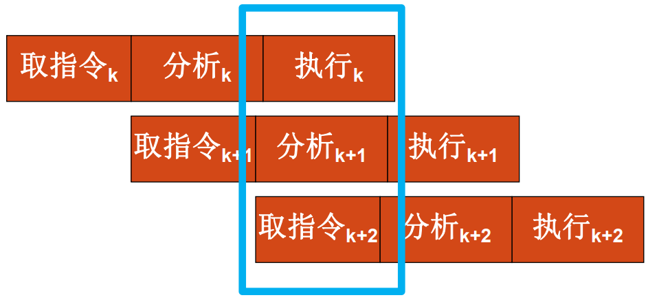 
3. **一次重叠的特点**
   - 节省硬件，机器内指令分析部件和指令执行部件均**只需一套**，也简化了控制。
   - 在一次重叠中，要求分析指令、执行指令的时间要尽可能**等长**，重叠方式才能有较高的效率。但是在一般情况下，分析指令和执行指令的时间不等长
   - 采用重叠方式的机器大多采用“一次重叠”，若达不到速度要求，则改用流水线。

### 重叠对计算机组成的要求

#### ①解决访存冲突

**原因**: 

- 一般的机器上，操作数和指令混存于同一主存内，取指需要访主存，分析中取操作数也可能访主存。而一次只能访问一个主存单元

**解决方案**: 

- **操作数**和**指令**分别存于两个独立编址且可同时访问的存储器，有利于实现指令保护，增加总线控制和软件设计的复杂性
- 采用**多体交叉主存结构**
   - 让两条指令的存储位置不在同一个存储体中, 这样可以同时访问
- 增设指令缓冲寄存器，主存空闲时可预取下一条或几条指令于Cache中
   - 如果每次都可以从指缓中取得指令，就可把这个微操作合并到分析内
   - **先行控制方式**: 先行控制是指在处理机内部设置一定容量的指令缓冲栈，把指今分折器所需要的指令事先取到指令缓冲栈中，而不必访问主存储器。这样，就能够使取指令、分析指令和执行指令重叠起来执行。如果指令分析器每次都能够在先行指令缓冲栈中得到，则取指令只需要很短的时间就能够完成，因此，可以**把指令与分析指令合并到一起**，从而将二次重叠转换为一次重叠。
     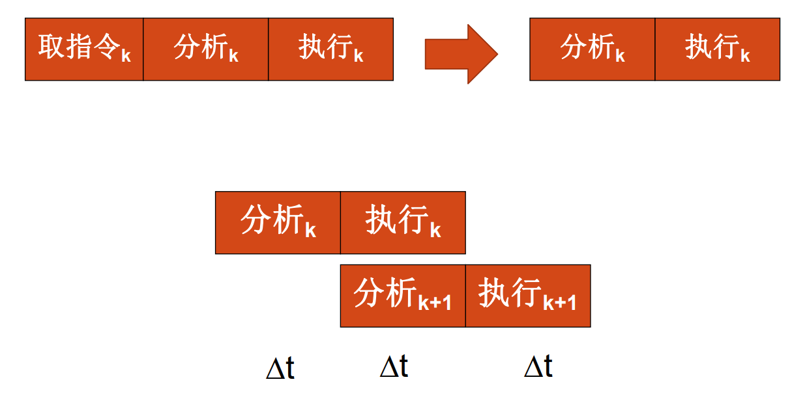

#### ②解决控制同步

> 很怪

为了实现重叠, 需要保证有独立的**取指部件**、**指令分析部件**和**指令执行部件**

两个阶段执行的时间常常不相同，需要在硬件上解决好控制上的同步

- 保证同一时刻只有**分析K+1和执行k的重叠**
  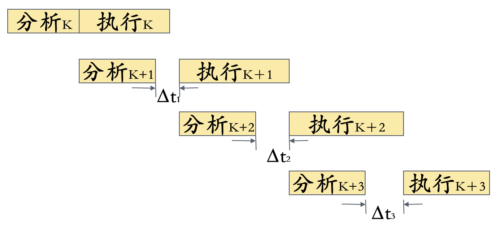 

#### ③转移指令

> 在本门课中 似乎未使用分支预测技术(默认执行连续的下一条分支)

**存在问题**

- 如果第k条指令是条件转移，执行阶段条件发现条件不成立，之后回继续执行已经执行部分的k+1条
- 如果跳转到m，下一条要执行m，需要撤销k+1，在k执行结束后再执行m，变顺序执行

**解决方案**

- 采用**重叠方式的机器**中，应尽量减少使用条件转移语句
- **延迟转移**: 将与分支指令**不存在数据相关**的、在分支指令**之前**的`指令i`(即原本一定会执行的指令)移动到分支指令`jump`之后, 在`jump`运行到执行阶段时, 如果需要跳转, 此时并不会撤销`指令i`, 从而避免了分支预测失败时的浪费

#### ④指令相关的处理

因为机器语言程序中临近指令之间出现了关联，为防止出错让它们不能同时解释的现象就称为发生了“<mark>相关</mark>”

- 包括指令相关, 操作数相关

<mark>指令相关</mark>：后一指令的内容受前一指令的执行结果影响而产生的关联，造成两条指令不能同时解释。

<mark>操作数相关</mark>： 两条指令的数据有了关联，造成两条指令不能同时解释。

### 相关处理

#### **指令相关**

<mark>指令相关</mark>：后一指令的内容受前一指令的执行结果影响而产生的关联，造成两条指令不能同时解释。

**原因**: 采用Von Neumann型机器上**指令可修改**的办法经第k条指令的执行来形成第k+1条指令

**解决方式**: 

1. 在程序执行过程中，不准修改指令 
   - 同时可实现程序的可再入和程序的递归调用
   - 但为满足程序设计的灵活性，希望修改指令 ？？？
2. 改变指令的执行方式，采用“执行”指令将指令相关改成操作数相关。

#### 主存空间**数相关**

> *真有相关吗？为什么会在分析阶段读主存，这设计不对吧*

相邻两条指令之间要求对主存同一单元先写入而后再读出的关联

- 如果让“执行k”与“分析k+1”在时间上重叠，就会使 “分析k+1”读出的操作数错误

**解决方法**：推后读 *（延迟，即插入bubble）*
 

**具体实现**

- 由存控给读数、写数申请安排不同的访存优先级来解决
- 只要将写数级别安排成高于读数级别，则自动实现了推后读

#### 通用寄存器空间**数相关**

1. 通用寄存器存放：操作数、运算结果、变址或基址
   - 存放于通用寄存器中的**基址或变址值**一般总是在“分析”周期的前半段就取出来用；
   - **操作数**是在“分析”周期的后半段取出，到“执行”周期的前半段才用得上；
   - **运算结果**是在“执行”周期的末尾才形成，并送入通用寄存器中
   - 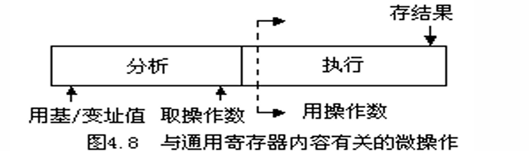 
2. 机器的基本指令格式如下图所示
   - L1、L3：存放第一操作数和运算结果的通用寄存器号
   - B2为形成第二操作数地址的基址值所在通用寄存器号
   - d2为相对位移
   -  
3. 假设某台机器正常情况下，“分析”和“执行”的周期与主存周期一样都是4拍。
   - 有些指令需从通用寄存器组中取两个操作数L1和L2，
     若通用寄存器组做在一个片子上，每次只能读出一个数，
     在“分析k+1”期间，操作数L1和L2就需要在**不同拍**时取得，分别送入运算器的B和C寄存器，以便在“执行k+1”时用
   - 当程序执行过程中出现$L_1（k+1）=L_3（k）$时就发生了**L1相关**；而当$L_2（k+1）=L_3（k）$时就发生了**L2相关**
     -  

##### 解决方案

解决方案1: **推后读**

- 把“分析k+1”推后到“执行k”结束时开始(插入一个bubble)
  - 只要发生数相关就使一次重叠变成了完全的顺序串行，速度明显下降；
- 把“分析k+1”只推后到“执行k”把结果送入L3时，保证“分析k+1”在取（L1）或（L2）时能取到就可。
  - 相邻两条指令的解释仍有部分重叠，可以减少速度损失，但控制要稍微复杂一些。
- 推后读方法靠牺牲速度来避免相关出错

解决方法2：**增设相关专用通路** (**转发forwarding/旁路bypassing**)

- 在运算器的输出到操作数寄存器B或C输入之间增设一条“相关专用通路”
- 在发生L1或L2相关时，让相关专用通路接通，在“执行k”时将运算结果送入通用寄存器，同时直接将运算结果回送到B或C寄存器，
- 可大大缩短传送时间，并能保证当“执行k+1”需要用此操作数时，它已在B或C寄存器中准备好了

推后“分析k+1” VS. 设置“相关专用通路”

1. 解决重叠方式相关处理的两种基本方法。
2. 推后“分析k+1”以降低速度为代价，设备基本不增加；设置“相关专用通路”以增加设备为代价，重叠效率不下降。
3. 设置“相关专用通路”也可用于解决主存空间数相关，但由于主存空间数相关的出现概率低很多，所以只采用推后读来解决

综上所述，为了实现两条指令在时间上的重叠解释

1. 需要付出硬件代价
2. 要处理好指令可能存在的相关。
   - 相关处理的办法无非是“推后读”和设置相关专用通路两种，应当在成本和效率上加以权衡选用。
3. 合理安排好指令顺序及指令微操作的时间关系，使“分析”和“执行”所需的时间尽可能匹配，以提高重叠的效率

## 3.2 流水

### 3.2.1 流水线基本概念

> 流水是重叠的延伸
>
> - 一次重叠：只是把一条指令的解释分解为两个子过程；
> - 流水：分解为更多的子过程。

**流水线定义**

- 流水线的每一个<mark>阶段</mark>称为流水步、流水步骤、流水段、流水线阶段、流水功能段、功能段、流水级、流水节拍等。
- 在每一个流水段的末尾或开头必须设置一个<mark>锁存器</mark>，称为流水寄存器、流水锁存器、流水闸门寄存器等。会增加指令的执行时间。
- 为了简化，在一般流水线中不画出流水锁存器

**流水线性能计算**

- 流水线经过装入、充满、排空三个阶段
- 流水的最大吞吐率：当流水线正常流动时的吞吐率。每隔Δt流出一个结果。
- 流水的最大吞吐率取决于子过程所经过的时间Δt

**流水线特点**

1. 只有连续提供同类任务才能充分发挥流水线的效率
   - 对于指令流水线：要尽量减少因条件分支造成的“断流”
   - 对于操作部件：主要通过编译技术，尽量提供连续的同类操作
2. 在流水线的每一个流水线段中都要设置一个流水锁存器
   - 时间开销：流水线的执行时间加长
   - 是流水线中需要增加的主要硬件之一
3. 各流水段的时间应尽量相等
   - 流水线处理机的基本时钟周期等于时间最长的流水段的时间长度
4. 流水线需要有装入时间、充满时间和排空时间
5. 在理想情况下，当流水线充满后，每隔Δt时间将会有一个结果流出流水线。

### 3.2.2 流水线分类

> 从不同角度，有不同的分类

#### 根据向下扩展和向上扩展分类

依据**向下扩展**和**向上扩展**思路，可分类出在计算机系统不同等级上使用的流水线

- 向下扩展：子过程细分
- 向上扩展：**多个处理机**之间进行流水

**具体分类**：

1. 部件级（操作流水线），如浮点加法器流水线
   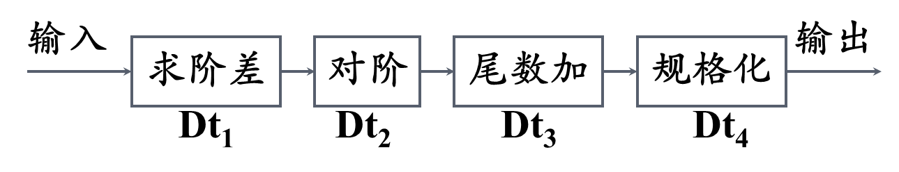 
2. 处理机级，指令流水线 (Instruction Pipelining)
   - 例如：在采用先行控制器的处理机中，各功能部件之间的流水线
     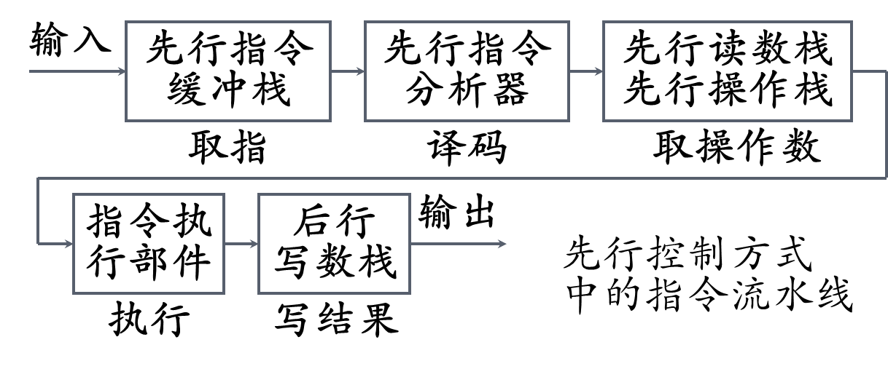 
3. 系统级：宏流水线 (Macro Pipelining)每个处理机对同一个数据流的不同部分分别进行处理
    

#### 按功能多少

**单功能**：只能完成一种固定功能的流水线

- Cray-1计算机中有12条；
- YH-1计算机有18条；
- Pentium有一条5段的定点和一条8段的浮点流水线；
- PentiumⅢ有三条指令流水线，其中两条定点指令流水线，一条浮点指令流水线。

**多功能**：流水线的各段通过不同连接实现不同功能

- Texas公司的ASC计算机中的8段流水线，能够实现：定点加减法、定点乘法、浮点加法、浮点乘法、逻辑运算、移位操作、数据转换、向量运算等。

#### 按工作方式分类

- **静态**：同一段时间内，多功能流水线中的各个功能段只能按照一种固定的方式连接，实现一种固定的功能
  - 只有连续出现同一种运算时，流水线的效率才能得到充分的发挥。
- **动态**：在同一段时间内，多功能流水线中的各段可以按照不同的方式连接，同时执行多种功能。
-  
  所有浮点加法的阶段完成后, 才能装入定点乘法
-  

#### 按数据表示方式进行区分

- **标量流水**：没有向量数据，只能用标量循环方式来对向量、数组进行处理。
  - Amdahl 470V/6、IBM 360/91
- **向量流水**：设置有向量指令和向量运算硬件，能对向量、数组中的各个元素流水地处理。
  - CRAY-1

#### 按是否有反馈回路

- **线性(Linear Pipelining)**：每个流水段都流过一次，且仅流过一次
- **非线性(Nonlinear Pipelining)**：在流水线的某些流水段之间有反馈回路或前馈回路

#### 按照控制方式

- **同步流水线**
- **异步流水线**

顺序流水线与乱序流水线：乱序流水线又称为无序流水线、错序流水线或异步流水线等

### 3.2.3 流水线处理机的主要性能

> 通过时空图分析 
> 吞吐率（TP, Thoughput Rate） 
> 加速比（Speed Ratio）
> 效率（Efficiency）  

| m / k: 流水线阶段数;   n: 流水线任务数;   T_k: 完成n个任务所用的时间;   Δt_i为每个流水段所需时间 |  |
| --------------------------------------------------------------------------------------------------------------- | -------------------------------------------------------------------------------------------------------------------------------------- |

#### 吞吐率（TP, Thoughput Rate）

**吞吐率**：流水线单位时间里能流出的任务数或结果数。

- $TP=\frac{n}{T_k}\\$

- **最大吞吐率**：流水线正常满负荷工作时，单位时间内流出的最大结果数。
- **实际吞吐率**：从启动流水线开始到流水线操作结束，单位时间内能流出的任务数或结果数。

**各阶段长度相同时**: 

- $T_k=(k+n-1)\Delta t$ : $k\Delta t$为流水线启动时间
- $TP = \frac{n}{T_k}=\frac{n}{(k+n-1)\Delta t}\\$ 
- $TP_{max} = \underset{\mathrm{n\to\infty}}{\operatorname*{Lim}}\frac n{(k+n-1)\Delta t}=\frac1{\Delta t}\\$ 

**各段时间长度不相同时**:

- $TP=\frac{\mathbf{n}}{\sum_{i=1}^k\Delta t_i+(n-1)\max\left\{\Delta t_1,\Delta t_2,\Delta t_3,\cdots,\Delta t_k\right\}}\\$ 

- $TP_{max}=\frac{1}{max\{\Delta t_1,\Delta t_2,...,\Delta t_n\}}\\$ 

##### 瓶颈子过程

当各功能段时间不同时，最大吞吐率取决于最慢子过程所需时间

实际吞吐率总是低于最大吞吐率，因为流水线从开始启动到流出第一个结果，需要经过建立阶段和排空阶段

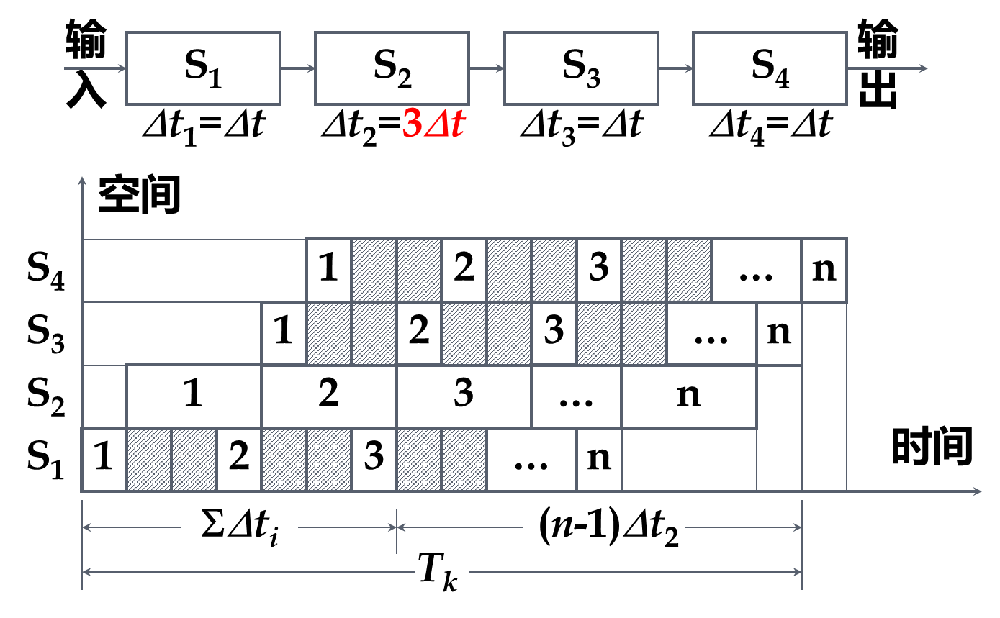 

- 如图, S2阶段较长, 即存在**瓶颈子过程**S2

解决方案1: **瓶颈子过程进行细分**
-   

解决方案2: **瓶颈子过程重复设置**(*并行*)
-   
  - 设置3个**相同的**S2流程使用到的部件
  - 此时的S2-1是S2的一号部件, 而非方案1的子过程
-  

#### 加速比 Speedup ratio

<mark>加速比</mark>: 流水线工作相对于顺序串行工作方式，速度提高的比值

设流水线由k段组成，共完成n个任务(n条指令)

若各功能段时间相等，均为 $\Delta t$, 则流水线的加速比为：

$$
S_p=\frac{n\cdot k\cdot\Delta t}{k\Delta t+(n-1)\Delta t}=\frac{k\cdot n}{k+n-1}\\
S_{p\max}=\lim_{n\to\infty}\frac{k\cdot n}{k+n-1}=\lim_{n\to\infty}\frac{k}{k/n+1-1/n}=k\\
$$

- 当n>>k时, 流水线加速比$S_p$会趋近于流水线段数k
  - *但是这里其实没有考虑段间锁存器, 实际上并不能无限增加* 

若各功能段时间不等长, 第i段时长为$\Delta t_i$ 

$$
S_p=\frac{n\sum_{i=1}^k\Delta t_i}{\sum_{i=1}^k\Delta t_i+(n-1)\Delta t_{\max}}
$$

#### 效率 Efficiency

<mark>效率</mark>: 指流水线的设备利用率。在

- 整个运行时间里，有多少时间流水线设备真正用于工作。
- 是实际使用时间占整个运行时间之比

由于流水线有**建立和排空时间**，在连续完成n个任务的时间里，各段并不是满负荷工作的，因此流水线的效率一定小于1

如果是k段线性流水线，且各段经过时间相同，则在T时间里，流水线各段的效率都相同，均为$η_0$，即

$$
\eta_1=\eta_2=\cdots=\eta_k=\frac{n\cdot\Delta t_0}{T}=\frac{n}{k+n-1}=\eta_0
$$

整个流水线的效率: $\eta=\frac{\eta_1+\eta_2+\cdots+\eta_k}k=\frac{k\cdot\eta_0}k=\frac{k\cdot n\Delta t_0}{k\cdot T}\\$

**几何解释**：从时空图上看，效率就是$\eta=\frac{\text{n个任务的时空区面积}}{k\text{个段的总时空面积}}\\$

- 与吞吐率类似，只有当n>>k时，η才趋近于1。

对于线性流水且**每段经过时间相等**时，流水线的效率正比于吞吐率， 即

$$
\eta=\frac{n\cdot\Delta t_0}T=\frac n{n+(k-1)}=TP\cdot\Delta t_0
$$

如果各段经过的时间不相等，其中“瓶颈”段时间为$Δt_j$，完成n条指令的解释。整个流水线的效率为：

$$
\eta=\frac{n\text{个任务占用的时空区}}{k\text{个段总时空区}}=\frac{n\cdot\sum_{i=1}^k\Delta t_i}{k\cdot\left[\sum_{i=1}^k\Delta t_i+(n-1)\Delta t_j\right]}
$$

### 3.2.4 流水机器的相关(冒险)处理

> 处理可能出现流水线断流的情况

影响流水线的情况: 

- 编译后的目标程序不能发挥流水结构的作用
- 存储系统IO过慢, 满足不了流水线对操作数、指令的读取
- 转移指令(branch)
- 各种相关和中断

> 主要讨论各种相关

**局部性相关(数据相关)**: 指令相关、主存数相关和寄存器组数相关由于只影响相关的二条或几条指令，而至多影响流水线某些段的推后工作，并**不会改动指令缓冲器中预取到的指令内容**，影响是局部的，所以被称之为局部性相关

**全局性相关(转移相关)**: 转移指令可能会造成流水线中很多已被解释的指令作废，**需要重新预取指令进入指令缓冲寄存器**，它将影响整个程序的执行顺序，所以称之为全局性相关

#### 局部性相关(数据冒险)的处理

1. **推后对相关单元的读**，直至写入完成；(*插入空泡*)

2. **设置相关专用通路**，使得不必先把运算结果写入相关存储单元，再读出后才能使用，而是经相关专用通路直接使用运算结果 (*旁路转发*) 

3. 调整流水线流动方式

   1. 顺序/同步流动方式

      - 任务流出流水线的顺序与流入顺序一致。
        - 一串指令“h,i,j,k,l,m,n,…”，h和j发生数相关，j流到读段时，j及其后的指令必须停下来,直到h到达写段并完成写入
      - 本质: 推后读

   2. 异步流动方式

      - 任务流出流水线的顺序与流入顺序不同。

      - 要解决新出现的相关问题(因为异步产生的问题)

        - 写写相关: 写完成的顺序

        - 先读后写: 避免异步结果出现先写后读

#### 全局性相关(控制冒险)的处理

##### 分支预测

1. 猜测原则：
   - 猜概率高者
   - 两者概率相近时，宜选不转移分支(下一条指令)，因为它已预取进指缓。(所以什么时候进行预测)
2. 猜测错误, 撤销指令, 恢复分支点的方式
   - 对猜测指令的解释只完成译码和准备好操作数，在转移条件码出现前不执行运算
   - 对猜测指令的解释可完成到运算完毕，但不送回运算结果
     （以上两种不好，猜对的话还会进行余留的操作）
   - 对猜测指令不加区别地全部解释完，但需**把可能被破坏的原始状态都用后援寄存器保存**起来，一旦猜错就取出后援寄存器的内容来恢复分支点的现场。

##### 加快和提前形成条件码

1. 加快单条指令内部条件码的形成
   - 特别适合于**转移条件码**是由上一条运算型指令产生的情形
2. 在一段程序内提前形成条件码
   - 这特别适合于**循环程序在判断循环是否结束时**的转移情况

##### 延迟转移技术

用软件方法将转移指令与其前面不相关的指令交换位置

##### 加快短循环程序的处理

- 将长度小于指缓的循环程序一次性放入指缓，并暂停预取指令
- 或循环出口端的条件转移指令恒猜循环分支。

#### 中断处理

中断会引起流水线断流。但出现概率比条件转移的概率要低得多，且是随机发生的。

- 因此流水机器处理中断的主要目的是： 如何处理好断点现场的**保存和恢复**，而不是如何缩短流水线的断流时间。

**断点现场包括**：

- 提供给中断服务子程序**准确的断点现场**；
  - 准确的断点现场:若在执行完第i条指令时响应中断请求，送给中断处理程序的就是对应于第i条指令的中断现场，如第i条指令的程序状态字等

- 在中断处理完后恢复到断点处指令流水线的指令现场。

**处理方法**：

- “不精确中断”法： 断点不精确
  不论指令i在流水线的哪一段发生中断，未进入流水线的后续指令不再进入，已在流水线的指令仍继续流完，然后才转入中断处理程序。这样，断点就不一定是i,可能是i+1、i+2或i+3、…，即断点是不精确的。
- “精确中断”法：断点精确
  不论指令i是在流水线中哪一段响应中断，给中断处理程序的现场全都是对应i的，i之后流入流水线的指令的原有现场都能保存和恢复。 需设置很多后援寄存器，以保证流水线内各条指令的原有现场都能保存和恢复

### 3.2.5 非线性流水线的调度

#### ① 概述

**一些概念**

- **启动距离**：向一条流水线的输入端连续输入两个任务之间的时间间隔。
- **冲突**：当以某一个启动距离向一条非线性流水线连续输入任务时，可能在某一个功能段，或某几个功能段中发生有几个任务同时争用同一个功能段的情况

<mark>线性流水线</mark>: 功能段线性地逐级串接在一起，每个任务在各段只通过一次，因此每拍都可将一个新的任务送入流水线，这些任务不会争用同一个流水线

<mark>非线性流水线</mark>: 在流水线的某些流水段之间有反馈回路或前馈回路, 会出现多个任务争用同一个功能段的冲突

- 为了避免流水线发生冲突，—般采用**延迟输入新任务**的方

**调度问题**: 在非线性流水线的输入端，究竟**每间隔多少个时钟周期**（采用何种**启动距离**）向流水线输入一个新任务才能使流水线的各个功能段都**不发生冲突**

- **非线性流水线无冲突调度的主要目标**:找出具有最小平均启动距离的启动循环（即最小的循环周期），按照这样的启动循环向非线性流水线的输入端输入任务，流水线的工作速度最快，而且所有功能段在任何时间都没有冲突。
  -  在一般情况下，这个间隔的时钟周期数应该愈小愈好。在许多非线性流水线中，间隔的周期数往往不是一个常数，而是一串周期变化的数字

#### ② 单功能非线性流水线的调度

##### 非线性流水线的表示–预约表

二维流水线预约表: 反映**一个任务**使用流水线各功能段的时间关系

- 对于线性流水线, 就是一条斜对角线

| Section\T | 1   | 2     | 3   | 4   | 5   | 6   | 7   |
| --------- | --- | ----- | --- | --- | --- | --- | --- |
| S1        | x   |       |     | x   |     |     | x   |
| S2        |     | x     |     |     | x   |     |     |
| S3        |     | x     |     |     |     | x   |     |
| S4        |     |       | x   |     |     |     |     |
| 工作情况  | S1  | S2/S3 | S4  | S1  | S3  | S3  | S1  |

流水线工作流程: S1,S2/S3,S4,S1,S2,S3,S1

- 横坐标T:时钟周期, 即为一个任务流入到流出经过的时钟周期数
- 纵坐标S:功能段, 即为流水线段数
- √或者×:某一功能段在某一周期处工作状态

##### 冲突分析

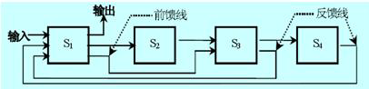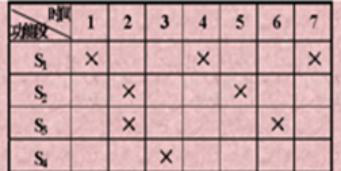

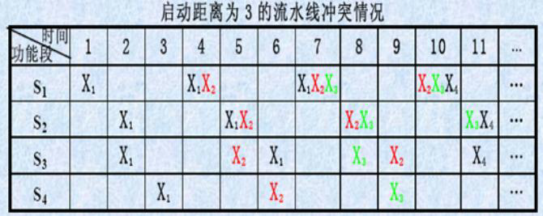

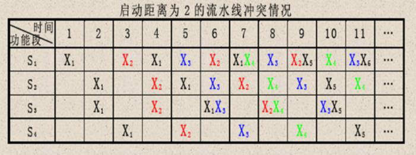

- 上面启动距离为2和3都会发生功能段冲突, 称为**禁止启动距离**

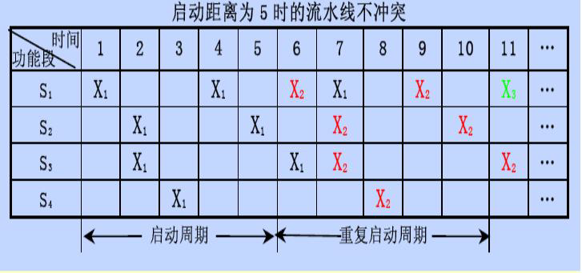

启动距离为5，启动循环记作（5），又称恒定循环。

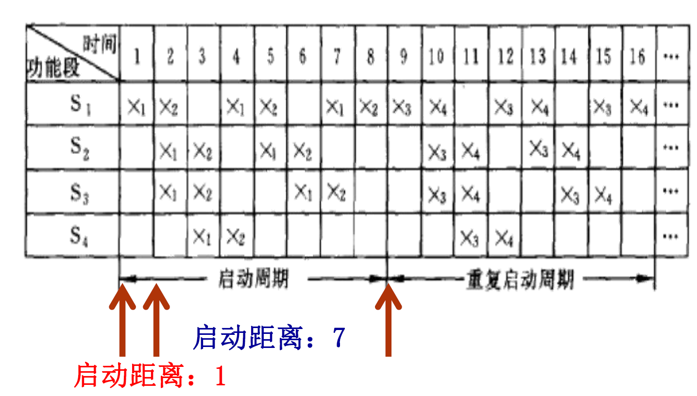

启动距离为（1，7）循环时的流水线预约表。图中的启动循环记作（1，7）

- 第一个等1clock, 第二个等7clock

#### ② 单功能非线性 无冲突调度方法※

1. 根据预约表写出**延迟禁止表F**
2. 由延迟禁止表形成**冲突向量C**
3. 由所有的向量图画出**状态图**
4. 由状态图形成最佳调度方案

##### 延迟禁止表F

$F=\{各段所需间隔的拍数\}$

- 确定方法：把预约表的每一行中**任意两个“X”之间的距离**都计算出来，去掉重复的，由这种数组成的一个数列就是这条非线性流水线的禁止向量

- F={1,5,6,8}
- S1: 9-1=8
- S2: 3-2=1, 8-3=5, 8-2=6
- S3: 无
- S4: 6-5=1
- S5: 8-7=1

##### 冲突向量

冲突向量: 用m位二进制向量表示, 其中 m位F中最大值, 被禁止的拍数记为1, 不禁止的记为0

- 所以最高位一定是1

例: $F=\{1,5,6,8\}\Rightarrow C=(1011\ 0001)$ 

- 说明第二个任务可以在第2,3,4,7拍流入
- 假设第二拍新指令进入, 对于第3条指令, 产生了新的冲突向量
  - 第一个任务此时冲突向量: $(0010\ 1100)$, 与初始相比**右移**2bit
  - 第二个任务的冲突向量: $(1011\ 0001)$, 是初始
  - 第三个任务不能和前两个冲突, 冲突向量为: $(1011\ 1101)$

##### 状态图

> 综合考虑刚刚提到的 多个任务的冲突问题

逻辑右移一位

- 若移出0，则允许后续指令进入流水线，同时将移位器中的值再与初始向量C0按位“或”，形成新的
  冲突向量C；
- 若移出“1”，则说明以此启动距离向流水线输入任务会发生冲突，因此，不做任何处理。
- 重复上述步骤，直到不再生成新的冲突向量。
  - 可先重复m次，得到若干新的初始冲突向量；(广度搜索, 而非深度)
  - 再对新生成的冲突向量依次采用与初始冲突向量相同的处理方式进行处理

- 对初态: 2(①),3,4,7
- 对①: 2, 7
- …

##### 找出最佳调度

状态图中的**任何一个闭合回路**即为一个调度周期策略

- 从各个闭合回路中找出**平均启动距离（间隔拍数）最小**的一个即最佳调度方案。

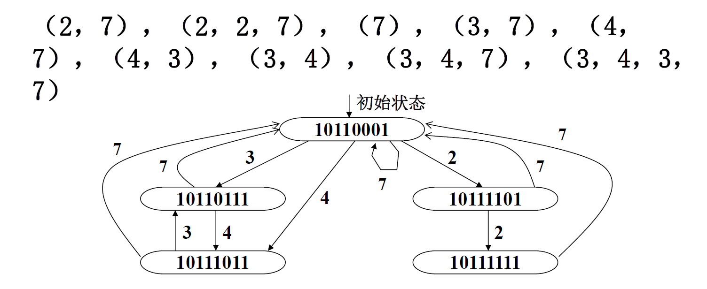

- 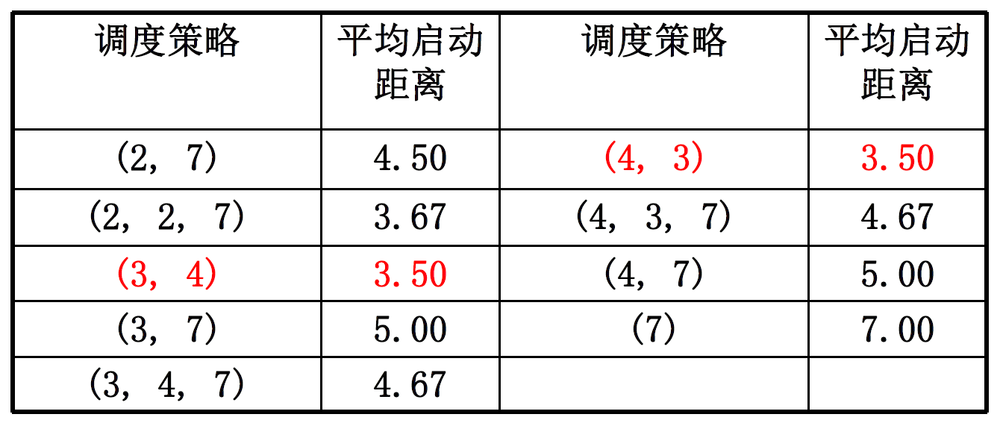

# 第4章 向量处理机

<mark>向量处理机</mark>：具有**向量数据表示**的处理机

- 向量流水处理机: 时间重叠
- 阵列处理机: 资源重复

## 4.1 向量的流水处理与向量流水处理机

### 4.1.1 向量的流水处理

<mark>向量的流水处理</mark>：选择使向量运算最能充分发挥出流水线性能的处理方式。

向量的几种处理方式： 以 $D=A* (B+C)$为例 (A, B, C为n维向量)

1. 横向处理方式
   - 逐个求$d_i$, 得到D 
     向量元素 $b_i+c_i \rightarrow k, k* a_i → d_i$
   - 不是流水处理方式，存在相关
2. 纵向处理方式
   - 先求所有的$K= (B+C)$，再求所有的 A*K
   - 是流水处理，需要每拍取得成对元素
3. 分组纵横处理方式
   - 把该向量分割成若干个组，使每个组都能装入向量寄存器中， **每组按纵向处理**, **组间**采用软件方
     法编制循环程序的方式**依次循环处理**。
   - 解决主存与流水线速度不匹配问题

### 4.1.2 向量流水处理机的结构

向量流水处理机(Vector Processor) 是指将**向量数据表示**与**流水线技术**相结合，**能**进行向量流水处理的处理机。

#### 向量处理机的指令系统

> 一般应包含有向量型和标量型两类指令

向量型运算类指令一般又可以有如下几种：

- 向量 $V_1$ 运算得向量 $V_2$ 如 $V_2 =SIN(V_1)$
- 向量 $V$ 运算得标量 $S$ 如
- 向量 $V_1$ 与向量 $V_2$ 运算得向量 $V_3$ 如 $V_3 =V_1 ∧V_2$
- 向量 $V_1$ 与标量 $S$ 运算得向量 $V_2$ 如 $V_2 =S*V_1$

### 4.1.3 提高向量流水处理性能的技术

当前一条指令的**结果寄存器**可以作为后继指令的**操作数寄存器**时， 多条有数据相关的向量指令并行执行 ，这种技称为<mark>流水线的链接技术</mark>

**条件**：无功能部件冲突，无源向量寄存器冲突

一些主要要求 (在上面的条件之外)

- 在进行链接的时候 只有 在前一条向量指令的第一个结果元素送入结果向量寄存器的那一个时钟周期才可以进行链接 若错过该时就不能进行链接 。
- 只有当前一条向量指令全部执行完毕 ，释放相应的向量寄存器资源后才能执行后面的向量指令。
- 当一条向量指令的两个源操作数分别是两条先行向量指令的结果寄存器时，要求先行的两条向量指令产生运算结果的时间必须相等即 要求有关向量功能部件的延迟时间相等 。
- 只有所有可以链接执行的向量指令的 向量长度相等 时，它们之间才能链接执行，否则它们之间也不能链接执行。

## 4.2  阵列处理机原理

**多机系统**

> 鬼知道为什么突然有这个

指的是多处理机系统和多计算机系统 
<mark>多处理机系统</mark>：是由多台处理机组成的单一计算机系统，各处理机都可有自己的控制部件，可带自己的局部存储器，能执行各自的程序。受逻辑上**统一的操作系统**控制。
<mark>多计算机系统</mark>：是由多台独立的计算机组成的系统，各计算机分别在逻辑上独立的操作系统控制下运行，机间可以互不通信，即使通信也只是经通道或通信线路以文件或数据集形式进行，实现多个作业的并行。 

<mark>阵列处理机</mark>: 多个处理单元（PU）按照一定方式互连，在同一个控制单元（ CU）控制下，对各自的数据完成同一条指令规定的操作。

- 指令级并行的SIMD计算机

### 4.2.1 阵列处理机的构型和特点

一台阵列处理机通常由五个部分组成

- 1个控制器CU
- n个处理单元PE
- m个存储器模块M
- 1个互连网络ICN
- 一台输入输出处理机IOP

阵列处理机结构的差异主要体现在**存储器的组成方式**和**互连网络的作用**不同。

由存储器的组成方式不同, 互连网络的作用不同进行分类: 

- 分布式存储器的阵列处理机构形
- 集中式共享存储器的阵列处理机构形

#### 分布式存储器的阵列机结构

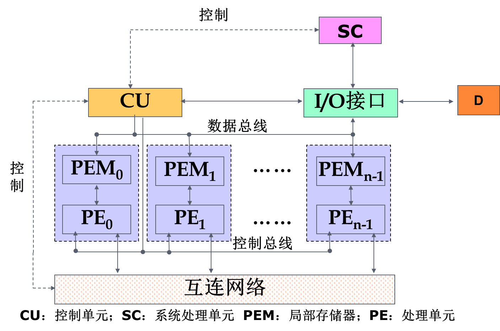

- 存储模块由每个 PE 自带
- 管理处理机 SC 负责系统资源的管理功能
- 数据应预先分配到各个处理单元的局部存储器PEM中
- ICN 实现**PE 到PE的通信**从而实现数据的传送 、交换

#### 具有集中式存储器的并行处理机构型

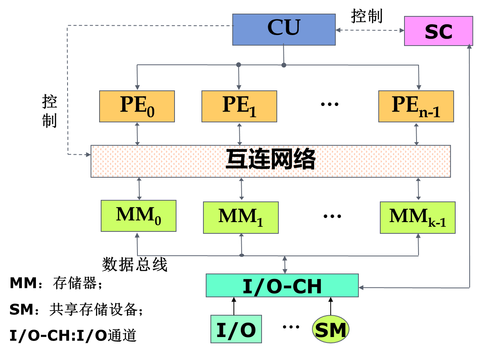

- 存储器由K个存储体集中组成，经互连网络ICN为全部N个处理单元所共享
  - 为了防止访存冲突, K≥N

- ICN 实现了 PE 到 PEM 的通信 使尽可能多的 PE 能无冲突地访问共享的主存模块 。 又称**对准网络**

### 4.2.2 ILLIAC IV的处理单元阵列结构

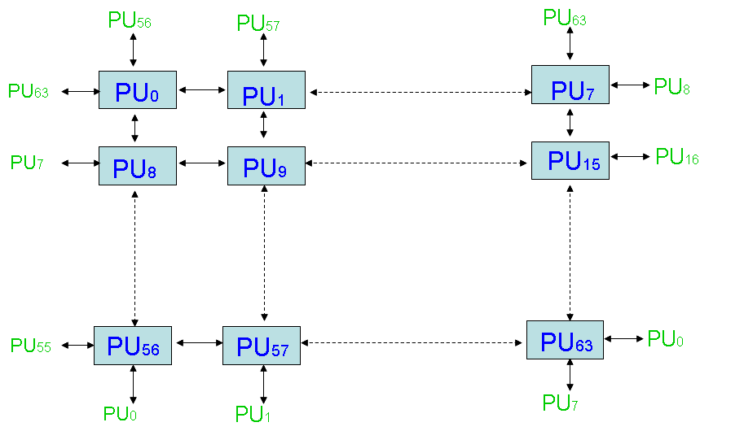

**特点**

- 闭合螺线阵列
- 任意单元的最短距离不超过7步
  - 一般来讲：$N=\sqrt{N}*\sqrt{N}$个处理单元组成的阵列中，任意两个处理单元之间的最短距离不会超过$\sqrt N-1$步
- 处理单元为通常的累加型运算器，把累加寄存器RGA中的数据和存储器的数据进行操作    

## 4.3 SIMD计算机的互连网络

### 4.3.1 互连网络与互连函数

1. 基本功能
   - 互连网络主要完成结点与结点间的连接，连接和控制方式不同，连接效果不同。
2. 互连网络的设计思路
   - 根据应用需要（互连网络属性），选择合理的特征方式，考虑互连网络的性能因素，综合加以合理组合。
   - 目标：低成本、高灵活性、高连接度、低延时、适合VLSI。
3. 互连网络的表示
   - 四要素: 定时协议、**控制策略、开关方法、拓扑结构**

#### 拓扑结构

1. 拓扑结构指网络的入端&出端的连接模式 
   - 即相邻节点(处理单元)之间的通路
   - 可以用一组<mark>互连函数</mark>定义, 来描述**节点地址**的一一对应关系
   - 节点地址用**二进制编码**来表示
     - N个节点的地址长度$n = log_2N$位

2. <mark>互连函数</mark>: 互连网络的连接特征一般用**连接函数**表示。连接函数可以用节点间的连线图表示，也可以用简单的函数式表示。
   1. 编码方式
      - 入端的编码：$x=(b{_n-1}…b_0)\quad n=log_2N$
      - 出端的编码：$f(x)=(b_{n-1}…b_0)$或其他形式
   2. 互连函数为基于$b_{n-1}…b_0$的排列、组合、移位、取反等操作的结果
3. 拓扑结构分类: 根据出入端可以连接的模式
   - **静态拓扑结构**：两个节点间的链路是固定的
     - 
   - **动态拓扑结构**：两个节点间的链路通过置定网络的开关单元状态可以重新配置

4. 动态拓扑结构
   - **动态单级网络**: 只有有限的几种连接，必须经循环多次通过，才能实现**任意**两个处理单元之间的信息传送，故称此动态单级网络为**循环网络**。
   - **动态多级网络**: 是由**多个单级网络串联**组成的，以实现任意两个处理单元之间的连接。将多级互连网络循环使用可实现复杂的互连，称循环多级网络或多级循环网络

### 4.3.2 基本互连函数

| 置换方式         | description                                                                    | 函数式                                                                                                    |                                                                                                              |
| ---------------- | ------------------------------------------------------------------------------ | --------------------------------------------------------------------------------------------------------- | ------------------------------------------------------------------------------------------------------------ |
| **恒等置换**     | 相同编号的输入端与输出端一一对应的互连                                         | $I(p_{n-1}p_{n-2}...p_0) = \\p_{n-1}p_{n-2}...p_0$                                                        |  |
| **交换置换**     | 实现二进制地址编号中**第0位**位置不同的输入端和输出端之间的连接 (相邻奇偶交换) | $EX(p_{n-1} p_{n-2}…p_1 p_0)=\\p_{n-1} p_{n-2}…p_1\textcolor{red}{\overline{p_0}}$                        | 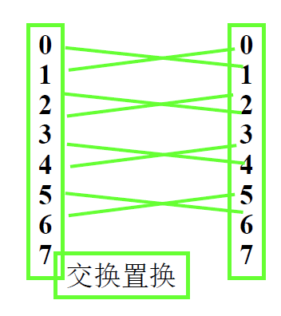 |
| **立方体置换**   | 实现二进制地址编号中的 第 i 位位置不同的输入端和输出端之间的连接               | $Cube_i (p_{n-1}p_{n-2}...p_i... p_1 p_0 )=\\p_{n-1}p_{n-2}...\textcolor{red}{\overline{p_i}}... p_1 p_0$ |                                                                                                              |
| **全混洗置换**   | 输入端的二进制地址循环左移1位                                                  | $Sh(p_{n-1} p_{n-2}…p_1 p_0)=\\p_{n-2}…p_1p_0\textcolor{red}{p_{n-1}}$                                    |                                                                                                              |
| **加减2^i^置换** | 将输入端数组循环移动2^i^的位置向输出端传送                                     | $PM_{+i}(x) = (x+2^i)mod\ N\\PM_{-i}(x) = (x-2_i)mod\ N$                                                  |                                                                                                              |

### 4.3.3 基本的单级互连网络

#### 立方体单级网络（交换互连网络）

立方体的每一个顶点，代表一个处理单元，共8个处理单元，用 Z Y X 三位二进制代码来表示。

立方体单级网络有 3 种互联函数: 

- $Cube: (Z(b_2)\ Y(b_1)\ X(b_0))\\\begin{array}{cc}\mathrm{X:}&\mathrm{Cube_{0}=(b_{2}b_{1}\overline{{b_{0}}})~}\\\mathrm{Y:}&\mathrm{Cube_{1}=(b_{2}\overline{b_{1}}{b_{0}})~}\\\mathrm{Z:}&\mathrm{Cube_{2}=(\overline{{b_{2}}}b_{1}b_{0})~}\end{array}$ 
- 连接线的两端上的编码，对应于相应方向的位置（1位）取反，其余不变

#### PM2I单级网络（循环移数网络）

出端编码与连接的入端结点编码相差$2^i$

互连函数: $PM2_{+i} = (j+2^i)mod\ N\\
PM2_{-i} = (j-2^i)mod\ N$ 

- 共有**2n种**互连函数(n=logN)

#### 混洗交换单级网络

> 由混洗函数和交换函数组成

1. <mark>全混洗互连函数</mark>（shuffle）：$Shuffle(b_{n-1}b_{n-2}…b_1b_0)=(b_{n-2}…b_1b_0b_{n-1})$；
   - 把$b_{n-1}$移到$b_0$处
   - 以N=8为例
     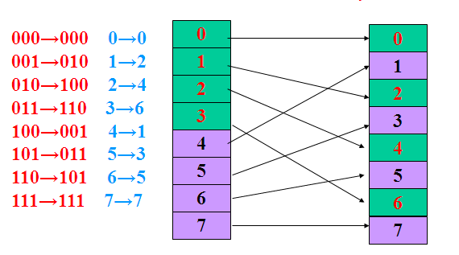
   - 存在问题: 全0和全1结点无法和其他节点产生关联

2. **交换互连函数**: 使用最简单的$Cube_0$函数, 即$Exchange(b_{n-1}b_{n-2}…b_1b_0) = (b_{n-1}b_{n-2}…b_1\overline{b_0})$ 
   - *为了让节点0(b000)和节点7(b111)与其他节点连接*
3. **混洗交换互连函数**: $Exchange(Shuffle(b_{n-1}b_{n-2}…b_1b_0)) = (b_{n-2}…b_1b_0\overline{b_{n-1}})$ 
   - 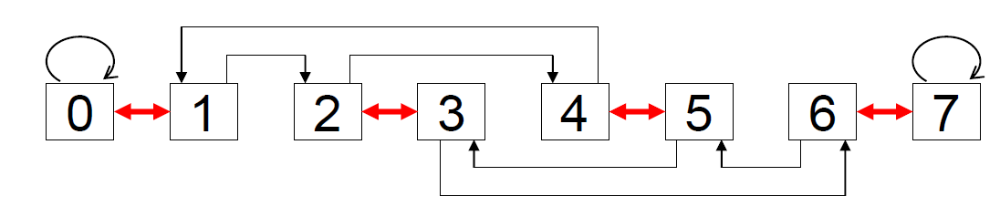 

> 单级互联网络小结: 
> 任一单级互连网络均可表示成N 入 N 出 的过程。
>
> 1. 单级互连网络特性
>    - 任一单级互连网络可实现部分结点一对或几对间的连接，不能实现**任意多对**结点间的同时连接。
>    - **单级互连网络含义**：某些连接方法或拓扑结构。
> 2. 单级互连网络应用
>    - 利用单级互连网络的特性作为实际
>    - ICN 的拓扑结构；通过交换开关作为ICN的可变因素；
>    - 通过交换开关多次控制实现ICN的结点间任意互连。

### 4.3.4 基本的多级互连网络

目标：

- 完成某结点与其它任一结点的连接；
- 同时完成多对结点的连接。

方法：

- 从时间性和空间性方面开发。

#### 循环互连网络（时间性）

组成：$DTR_{in} 、 DTR_{out} 、 MUX 、 IN$。
结构：一个单级ICN+MUX。
特点：节省了设备，增加了时间，每个MUX 可单独控制。

#### 多级互连网络（空间性）

1. 不同的**多级互连网络**反映在所采用的交换开关, 拓扑结构和控制方式上有所不同。
2. <mark>(二元)交换开关</mark>：是具有**两个入端和两个出端**的交换单元。用作各种多级互连网络的基本构件。
   - 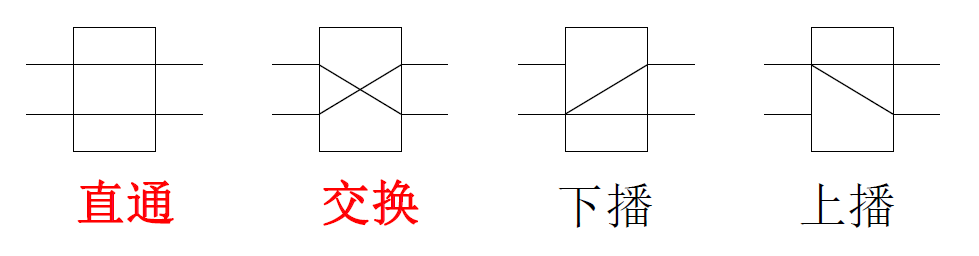 
3. <mark>拓扑结构</mark>：
   - 不同级开关间连接方式(单级 CIN 的连接功能)，即**各级之间出端和入端相互连接**的模式。
4. <mark>控制方式</mark>：
   - 级控制：同级交换开关使用同一个控制信号控制。
   - 单元级控制：每个交换开关分别控制。
   - 部分级控制：第i级使用第i+1个控制信号控制。

#### 多级立方体网络 ※

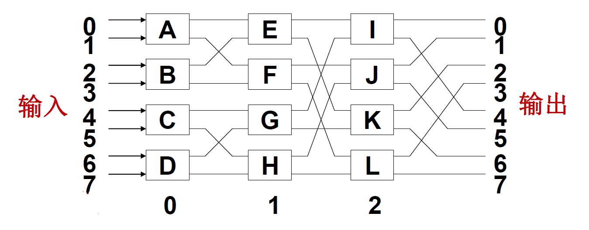

- 交换开关：二功能(直通 和 交换)
- 拓扑结构：
  - 当第i级交换开关处于交换功能时，该多级网络实现的是$Cube_i (第i位取反)$ 互连函数；
  - 对于第i级和第i+1级之间， 把$2^{i+1}$个开关分为**一组**， 组内采用**蝶式变换**。

- 根据**控制方式**不同，多级立方体网络有**STARAN网络**和**间接二进制n立方体网络**两种。
   1. STARAN 网络： 级控制和部分级控制
      - STARAN网络根据控制方式不同可以实现不同的功能： **交换功能** 和 **移数功能**
   2. 间接二进制n立方体网络： 单元控制

##### 交换功能

1. 控制方式： 级控制
   - 控制信号(对某一级的开关)
     - 1 ：开关实现 交换 功能
     - 0 ：开关实现 直通 功能
2. 交换功能： 组间次序不变，组内元素镜像。
   - 所谓交换(函数 )，是将一组元素**首尾对称**地进行交换

3. 应用： 对集中式处理机同时数据传输作用很大。

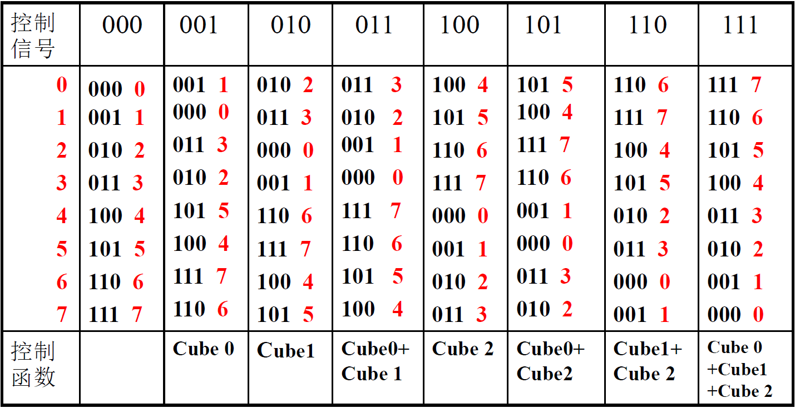

##### 移数功能

1. 控制：部分级控制 （第 i 级有 i+1 种控制信号）
2. 功能：控制信号不同，功能不同。
   - 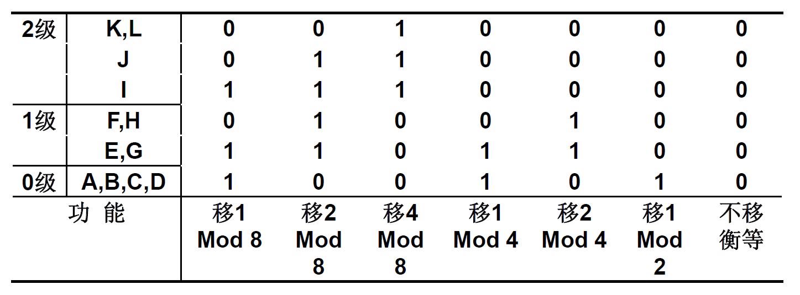

3. 应用：
   - 移数功能很适合于累加求和算法实现；
   - 不同的Mod，可用作不同的分组操作。

#### 多级混洗交换网络(ω网络)

交换开关：四功能 （允许实现一对多的连接拓扑结构：不同级相同， 均为全混洗 结构；
控制方式：级控制、部分级控制、单元控制；
连接图：第 n-1 级靠近入端；

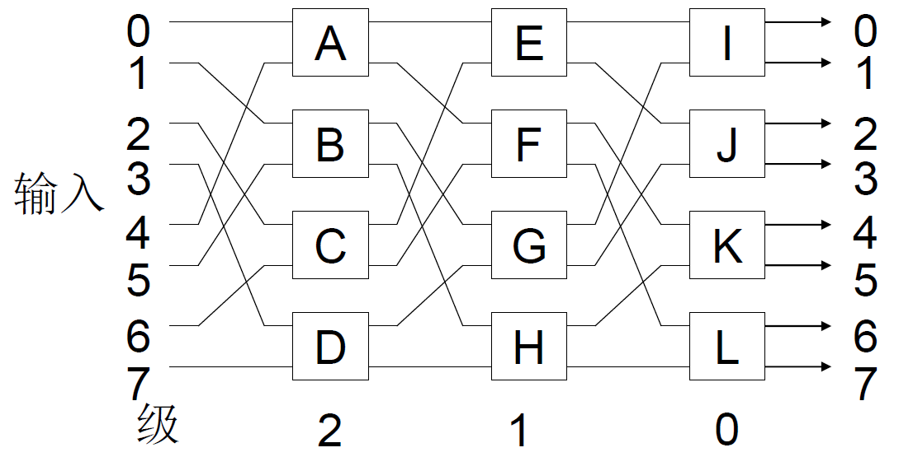

功能：

- 若为级控制且开关为二功能：是STARAN 交换网络的逆网络；（F 、 G 交换位置）
- 部分级控制且开关为二功能：是STARAN 移数网络的逆网络；
- 单元控制：可实现更强大的功能。
  - 利用交换开关的播送功能实现一对多的连接。
- 典型应用：恒等置换、移数置换等各种函数的变形置换； 可完成数组按行、列、对角线、子块等无冲突访问

## 4.4 并行存储器无冲突访问

1. 访问需求
   1. 并行存取向量中各分量信息；
   2. 可按行、列、对角线等方法存取
   3. 步长不一致。
2. 存在问题
   1. 存储器带宽限制: 存储器带宽达不到向量带宽；
   2. 访存方式: 步长不同，产生访存冲突。
3. 解决方法
   1. **采用多体交叉存储器**: 增加 MEM 带宽
   2. **对向量分组操作**: 解决MEM带宽小于向量带宽问题
   3. **选择适当的存储体数m达到无冲突访问**

**一维向量**：顺序存放，防止步长与 m 成比例；

- **存储体个数m**取质数，且与步长互质。

**多维向量**：错位存放，满足行、列、对角线等方式；

- 当m 大于每次访问向量元素个数时，
- $m=2^{2P}+1, \delta_1{=}2^P$, 同一列不同行错开距离
  $\delta_{2}=1$, 同一行不同列错开距离
- 对二维元素$A_{ab}$: 
  - 放置的体号$j=(\delta_1a + \delta_2b+ C)mod\ m$ 
    - C = $A_{00}$的体号地址
  - 体内序号$i=a$ 

# 第5章 多处理机

## 5.1 多处理机概述

### 5.1.1 多处理机的基本概念

1. <mark>多处理机系统</mark>是指有两台以上的处理机，共享I/O子系统，机间经共享主存或高速通信网络通信，在操作系统的控制之下，协同求解大而复杂问题的计算机系统。
   - 多处理机系统采用**资源共享**的技术途径，提高并行处理能力(作业, 任务级并行)，属于**多指令流多数据流（MIMD）**

2. 多处理机相较于 阵列处理机
   - **并行性级别**: 作业、任务级，更高
   - **硬件结构**: 多个处理器要用多个指令部件控制
   - **算法实现**: 进一步挖掘更多隐含的并行性
   - **系统管理**: 更多依靠操作系统等软件手段
3. 多处理机优势: 
   - 性价比高
   - 可靠性高: 多个相同构件, 有冗余
   - 处理速度高: 单处理机CPU频率不能再提高, 运行速度受限, 多处理机通过并行提高运行速度
   - 模块化
4. 多处理机需要解决的问题
   - **处理机–存储器–IO的互连**:  多处理机系统的处理机多，机间通信的模式多样、灵活、不规则，所以硬件结构的实现，是首要的问题
   - **多处理机各级的并行**: 通过指令内部向量、数组的并行，指令之间作业、任务、程序段，以及算法、程序语言、编译、操作系统等的全面并行
   - **任务的合理划分**
   - 任务和进程间的同步
   - 资源调度和任务分配
   - 现场切换

### 5.1.2 多处理机的硬件结构

#### 紧耦合与松耦合

##### 紧耦合多处理机

- 特点: 通过共享主存实现机间通讯 (通信速度就受限于主存)
  - 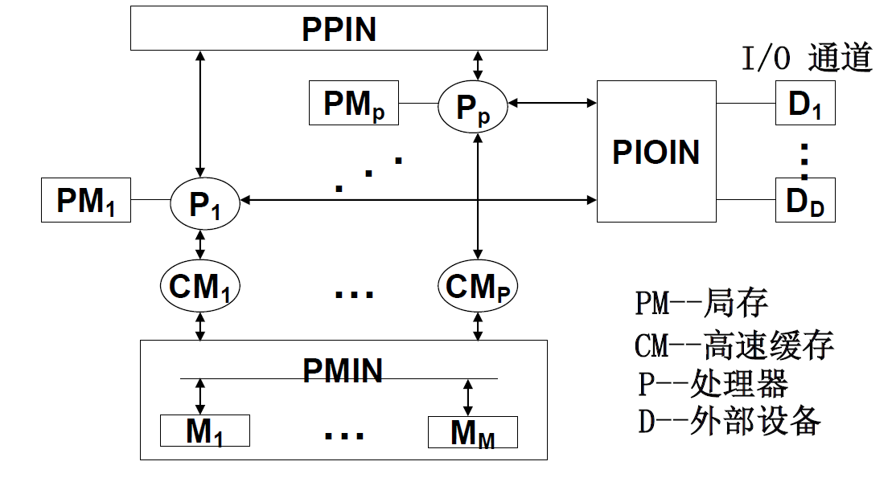
- 系统属性：
  - 同构or异构: PE 类型相同or不同；
  - 对称or非对称 每个 PE 与部分or全部的 I/O 通道连接。
- 常见结构：同构对称式 和 异构非对称式 多机系统。
- 限制：PE 数量不能很多。 为什么？
  - 主存带宽、IN 带宽、同步开销限制了 PE 的数量。
- 访存冲突解决方案：
  - 采取多体交叉访问方式，增加PEM 数量；
  - 每个PE 自带小容量局部存储器，存放核心代码、OS 表格等，减少 PE 访存次数；
  - 每个PE 自带一个 Cache，减少 PE 访存次数。

##### 松耦合多处理机

1. <mark>松耦合多处理机</mark>: 每一台处理机都有容量较大的局部存储器，用于存储经常用的数据和指令，减少访存冲突，不同处理机间或者通过**通道互连** / **消息传送系统（MTS）**实现通信。 
2. 松耦合多处理机较适合做粗粒度的并行计算。
   - 作业可被分为若干个相对独立的任务, 任务间信息流量较少, 则可在多个处理机上并行执行, 
     即松耦合度的多处理机系统有效。
3. 特点：
   - 通过消息传送系统实现机间通讯；
     - 
     - 每个模块是一个独立的处理机，整个系统可看成是一个分布系统。
   - 互连网络：MTS 有总线、环形、多级网络等种类；
   - 结构：有**层次**和**非层次**两种结构。

#### 机间互联方式

> 总线形式 
> 环形互连形式 
> 交叉开关形式 
> 多端口存储器形式
> 蠕虫穿洞寻径网络
> 开关枢纽结构形式 

##### 总线形式

1. PE、 PEM 、 I/O 通道均连在总线上，采用分时或多路转换技术实现数据传递，是最简单的连接方式。
2. 总线仲裁算法：
   - 静态优先级算法、平等算法、动态优先级算法、先来先服务算法等。
   - 对外设一般采用优先级算法；对PE 采用均等算法。
3. 实现方法：
   - 集中式：由总线控制器控制；
   - 分布式：中机构分散到各PE 中。
4. 提高总线效率方法：
   - 改善传输介质和增加总线数量。
   - 总线互连方式不适宜连接过多的处理机。

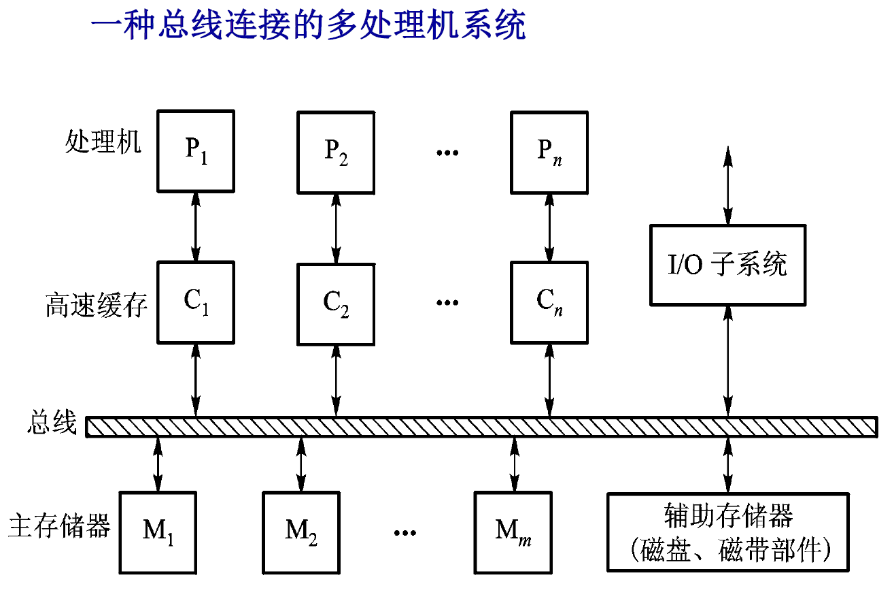

##### 环形互连形式

为保持总线式互连的优点，同时又能克服其不足，可以考虑构造一种逻辑总线，让各台处理机之间点点相连成环状，称<mark>环形互连</mark>

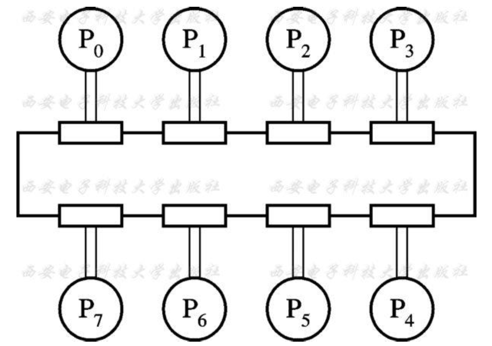

##### 交叉开关形式 (空间分配)

<mark>交叉开关方式</mark>是总线形式的一个极端，**总线数=PE 数 +PEM 数 +I/O 通道数**，是一种全相联形式，控制、仲裁、转换机构均在开关中。

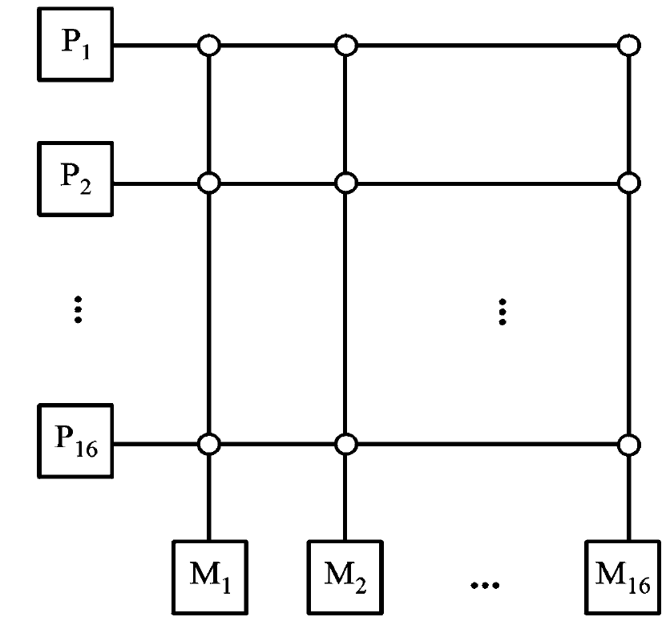

- 通常: PEM数 >= PE数+I/O

改进：用一系列较小开关串联或并联，形成多级交叉开关，减少其复杂性。

交叉开关方式不适宜连接过多的处理机。

##### 多端口存储器形式

将控制、仲裁、转换机构移到存储器中。
每个端口与一个PE 或 I/O 通道相连。

多端口存储器形式不适宜连接过多的处理机。

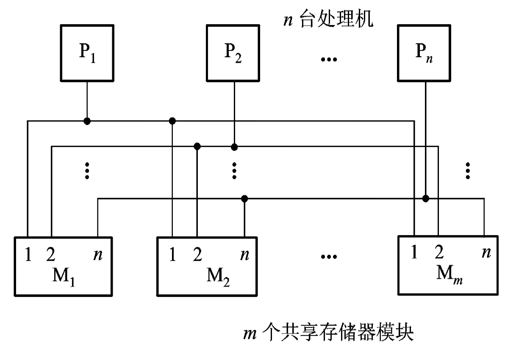

## 5.2 缓存一致性

### 5.2.1 什么是缓存一致性

Cache的一致性问题：保证同一数据块在不同Cache以及主存中的多个副本的一致性

**进程迁移引起数据不一致性**

- 多处理机中允许将未完成的进程挂起，调度到另一处理机上执行。进程的迁移可能造成最近修改过的信息只保留在原处理机的 Cache 中，迁移后则不能正确恢复

**I/O 传输 造成的数据不一致性**

- 系统中发生部分绕过 Cache 的 I/O 操作，可能形成主存内容与 Cache 内容的不一致

如果一个存储器满足以下3 点，则称该**存储器是一致**的。

- 处理器 P 对单元 X 进行一次写之后又对单元 X 进行读，读和写之间没有其他处理器对单元 X 进行写，则 P 读到的值总是前面写进去的值。
- 处理器 P 对单元 X 进行写之后，另一处理器 Q 对单元 X 进行读，读和写之间没有其他写，则 Q 读到的值应该是 P 写进去的值。
- 对同一单元的写是顺序化的，即任意两个处理器对同一单元的两次写，从各个处理器的角度看顺序都是相同的。

### 5.2.2 缓存一致性解决方法

1. 解决进程迁移引起的 Cache 不一致性
   - 禁止进程迁移
   - 触发写回主存: 进程挂起时，将该进程改写过的块写回主存
2. 以硬件为基础实现多 Cache 一致性
   - 监视/监听法 (Snoopying)
   - 目录表法 (Directory)
   - **关键**：跟踪记录共享数据块的状态

#### 监视法

**适用结构**：总线型互连的多处理机

**基本思想**：利用**总线播送**更改主存的情况，各个Cache 控制器通过**监听总线**来判断它们是否有总线上请求的数据块。

**实现方式**: 

- **写作废协议**

  - 当一个处理器对某数据项进行写入时, 通过广播使其他 Cache 中所有对应该数据项的副本**作废**。

  | -                 | 处理器行为     | 总线行为 | CPU A Cache内容 | CPU B Cache内容 | 主存单元X的内容 |
  | ----------------- | -------------- | -------- | --------------- | --------------- |
  |                   |                |          |                 | 0               |
  | CPU A 读X         |                | 0        |                 | 0               |
  | CPU B 读X         |                | 0        | 0               | 0               |
  | CPU A将1写入单元X | CacheB内容作废 | 1        |                 | 1               |
  | CPU B读X          |                | 1        | 1               | 1               |

- **写更新协议**

  - 当一个处理器对某数据项进行写入时, 通过广播使其他 Cache 中所有对应于该数据项的副本进行**更新**。

  | -                 | 处理器行为      | 总线行为 | CPU A Cache内容 | CPU B Cache内容 | 主存单元X的内容 |
  | ----------------- | --------------- | -------- | --------------- | --------------- |
  |                   |                 |          |                 | 0               |
  | CPU A 读X         |                 | 0        |                 | 0               |
  | CPU B 读X         |                 | 0        | 0               | 0               |
  | CPU A将1写入单元X | 对单元X进行广播 | 1        | 1               | 1               |
  | CPU B读X          |                 | 1        | 1               | 1               |

写更新和写作废协议**性能差距**主要来自：

- 在对同一个数据进行多次写操作而中间无读操作的情况下
  - 写更新协议需进行**多次写广播**操作
  - 写作废协议只需**一次作废**操作
- 在对同一Cache 块的**多个字**进行写操作的情况下
  - 写更新协议对于每一个写操作都要进行**一次广播**
  - 写作废协议仅在对该块的**第一次写**时进行作废操作即可
- 写作废是针对 Cache 块进行操作
  写更新则是针对字或字节进行

#### 目录法

<mark>目录</mark>：一种专用的数据结构用于记录可以进入Cache 的每个数据块的状态 、 哪些处理器有该块的副本 以及 是否修改过 等信息

**适用结构**：非总线型互连的多处理机

**基本思想**：根据目录表，一个处理机在写入自身Cache 的同时，只需 有选择地通知其他存有此数据块的 Cache 将副本作废或更新。

分类

- 全映像目录表
- 有限目录表法
- 链式目录表法

#### 基于软件实现

**基本思想**：不允许要共享的可写数据进入 Cache

- 任意时刻均不允许共享的可写数据进入Cache, 只留在主存中
- 通过编译分析后, **只在实际有写入操作会影响一致性的时间内**不允许进入主存

## 5.3 多处理机的并行

### 5.3.1 并行算法

#### 并行算法的定义和分类

并行算法是指可同时执行的多个进程 的集合，各进程可以相互作用, 协调和并发处理

按并行进程间的操作顺序不同并行算法又分同步型、异步型和独立型三种。

- **同步型**：各进程间由于相关, 必须顺次等待。
- **异步型**：各进程间执行相互独立, 根据执行情况决定中止或继续。
- **独立型**：各进程间完全独立, 不需要相互通信。

根据各处理机 计算任务的大小 即任务粒度 不同 并行算法又分 细粒度 、 中粒度 和 粗粒度 三种。

- **细粒度**： 向量或循环级的并行
- **中粒度**：较大的循环级并行 并确保这种并行的好处可以补偿因并行带来的额外开销。
- **粗粒度**：子任务级的并行。

此外, 用同构性来表示并行的各进程间的相似度。

- MIMD系统上运行的进程： **异构性**
- SIMD系统上运行的进程：**同构性**

#### 多处理机并行算法的设计思路

将大程序分解为 若干可并行处理的过程。

把**每个过程**看做一个**节点**，将过程间的**关系**用节点组成的树

- $例: E_1=a+b*x+c*Y = (a) + ((b*x)+(c*Y))$

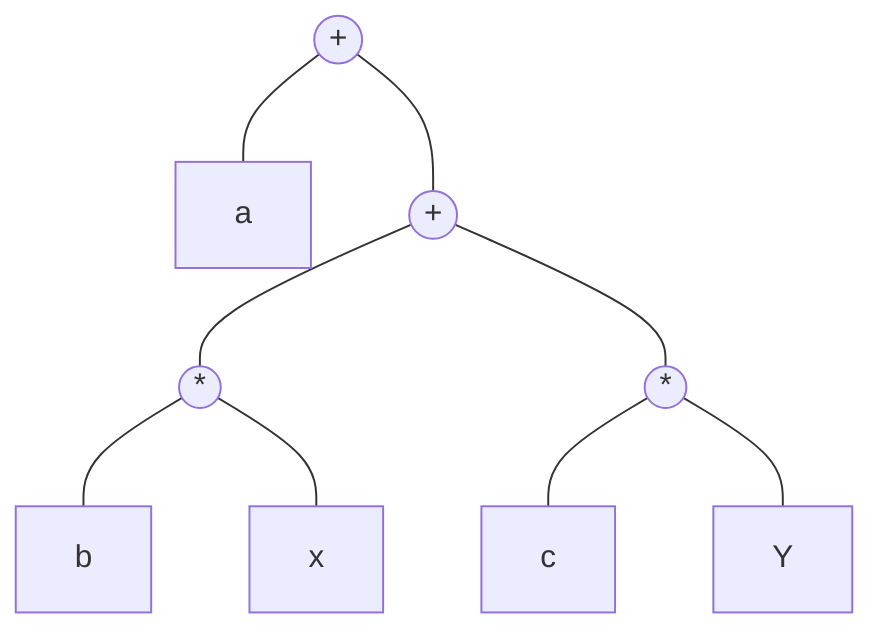
```mermaid
graph TD
+1((+)) --- a
+1((+)) --- +2((+))
+2 --- *1((*))
+2 --- *2((*))
*1 --- b
*1 --- x
*2 --- c
*2 --- Y
```

**并行算法评价指标**

- $P$: 可并行处理的处理机机数；
- $T_P$: P 台处理机运算的级数, 即树高
- **$S_P$ 加速比**: 表示单处理机顺序运算的级数$T_1$与P 台处理机并行运算的级数$T_P$之比；
  - $S_P=T_1/T_P$
- $E_P$: P 台处理机的设备利用率(效率)
  - $E_P = S_P /P$

树的设计目标：又“矮”又“瘦”

- 矮: 算法速度快(步骤少)
- 瘦: 使用资源少(用到的计算单元少)

**例$E_1=a+b · x+c · x · x+d · x · x · x$**

**例: $E_2=a+b(c+def+ g)+ h$**

P=1: $E_2 = (efd+c+g)*b+a+h$ 

P=2: $E_2=(a+h)+b((c+g)+def)$

$E_2 = (a+h)+(bc+bg)+bdef$

- 将`a+h`移动到最底层, 而非倒数第二层, 可以**减小树宽**

$Z = a+bcd(e+gh)+i(k+l)$

串行算法的树形流程图(P=1), 求运算级数

并行算法的树形流程图, 运算级数$T_P$, 处理机个数$P$

### 5.3.2 程序并行性分析

任务间是否能并行，除了算法之外，很大程度取决于**程序的结构**。 **数据相关**是限制程序并行的重要因素。

若一个程序包含了P1, P2, P3……. 等 n 个**程序段**，则书写顺序体现的是正常执行的顺序

多处理机系统中，程序段并行必然是“异步流动”。(发生顺序随机)

#### 数据相关

如果**$P_i$的左部变量在$P_j$的右部变量集**内, 且$P_j$必须取出$P_i$运算的结果来作为操作数, 就称$P_j$ <mark>数据相关</mark>于$P_i$。

- 相当于流水线中发生的**先写后读**相关 

  - *Pi先写, Pj后读, $P_j$的读要等待$P_i$的写完成*

  | -                                   | Pi                                  | Pj |
  | ----------------------------------- | ----------------------------------- |
  | … **A** = B + D (对A写) … | … C=**A** * E (读A的值) … |

  

当$P_i$ 和 $P_j$ 服从**交换律**时, 虽不能并行执行, 但可以<mark>交换串行</mark>

- 例: $P_ i:  A=2*A\\ P_ j: A=3*A$

#### 数据反相关

如果 $P_j$ 的左部变量在 $P_i$ 的右部变量集内，且当 $P_i$ 未取用其变量的值之前，是不允许被 $P_j$ 改变的，就称 $P_i$ “数据反相关于 $P_j$”。

- 相当于流水线中发生的**先读后写**相关 

  - *Pi先读, Pj后写, $P_i$的读要在$P_j$的写之前完成*

    | -                               | Pi                                | Pj |
    | ------------------------------- | --------------------------------- |
    | … C=**A** + E (读A) … | … **A** = B + D (写A) … |

当 $P_i$ 与 $P_j$ 并行时，只要**硬件上能保证 $P_i$ 对相关单元 A 先读出**，就能得到正确的结果；<mark>不能交换串行</mark>。

#### 数据输出相关

如果 **$P_i$ 的左部变量也是 $P_j$ 的左部变量**，且 $P_j$ 存储其算得的值必须在 $P_i$ **存储之后**，则称 $P_j$ <mark>数据输出相关</mark>于 $P_i$。

- 相当于流水线中发生的<mark>写–写相关</mark>
  - *$P_i$先写$P_j$​后写*
  - $P_i: A=B+D\\P_j: A=C+E$ 

当 $P_i$ 与 $P_j$ 并行时，必须要**同步**保证写入的**先后顺序**，<mark>不可交换串行</mark>。

#### 其他相关

若两个程序段的**输入变量互为输出变量**, 同时具有先写后读 和 先读后写 两种相关, 以**交换数据为目的**, 则两者必须**并行执行**, 既**不能顺序串行**也**不能交换串行**。

- $P_i: A=B\\P_j: B=A$ 
- 并行执行, 且必须 保证读 、 写完全同步

如果两个程序段之间不存在任何一种数据相关，即无共同变量，或共同变量都只出现在右边的源操作数，则**两个程序段可以无条件地并行执行**，也可以串行或交换串行

### 5.3.3 并行

## 5.4 多处理机操作系统

并行性的程序在多处理机上运行必须要有相应的控制机构来实现管理功能。 

程序的并行性主要是通过**多处理机的操作系统** (用软件手段实现)

### 5.4.1 多处理机操作系统的功能

1. 处理机的分配与进程的调度
   - 要了解处理机的能力 分配合适的任务
   - 要了解资源的使用状态 达到负荷平衡、均匀
   - 要了解作业和任务之间的关系，处理好相关、并行的关系

2. 进程间的同步
   - 要解决好同一处理机程序的并发执行、同步；
   - 要解决好不同处理机程序的并发执行、同步，要采用新的同步机制和同步算法。

3. 进程间的通信
   - 松散耦合的多处理机系统中，进程间的通信还可能要通过长距离的信道或网络进行，一般采用消息包形式通信。

4. 存储系统的管理
   - 要有访问存储器地址的映象和变换，保证数据的一致性；

   - 要确定访问的存储器是局部存储器，还是共享的公用存储器；

   - 要解决访问存储器冲突的仲裁。

5. 文件系统的管理
   - 集中式：用户的文件集中在某一处理机上，由该机操作系统统一管理。
   - 分散式：各处理机都有自己的文件系统，有各自的独立管理。如果一台处理机要使用另一台处理机的文件，使用起来比较困难。
   - 分布式 : 保存的所有文件分布在不同的多个处理机上，在逻辑上是一个整体。每个处理机都可使用，不要求了解文件的物理位置。

6. 系统重组

### 5.4.3 多处理机操作系统的特点

**程序执行的并行性**

- 并行执行程序，提高资源的利用率和系统处理能力。
- 多处理机操作系统希望能增强程序执行的并行性，以获得更高的系统处理能力和处理速度。

**分布性**

- 任务上分布，表现多个任务在多个处理机上的并行执行。
- 资源上分布，表现在系统资源被配置到多个处理机上。能够充分系统的效率，并达到资源共享。
- 控制上分布，表现在各台处理机均配置自己的操作系统。

**机间通信与同步性**

- 分散在多机间的信息的传输, 需要通信和同步, 其性能直接影响到程序的并行性和系统的性能。

**系统的容错性**

- 系统发生故障, 系统能动态切换, 重新组合。
- 系统的容错性对多处理机是非常重要的。

总之

- 对于多处理机操作系统：多处理机操作系统性能的强弱直接影响多处理机系统的性能的发挥。 多处理机操作系统是多处理机系统软件的核心。
- 对多处理机操作系统有影响的有：通信方式、同步机构、布局和分配策略、互联网络等。

### 5.4.3 多处理机操作系统的类型

> 重要, 可能考

#### 主从型操作系统

有一台主处理机上运行操作系统，其他的处理机为从处理机， 由主处理机管理从处理机的进程和分配任务

- 一台从处理机在执行进程的过程中需要得到管理程序提供服务时，必须向主处理机发生申请，等待主处理机响应后对它提供服务。

**优点**：

- 系统的软件和硬件都较简单。
- 只要单处理机的多道操作系统中增添少量功能即可实施。
- 对解决冲突问题比较容易。

**缺点**：

> 问题都在主处理机上

- 主处理机一旦出故障，整个系统将停止工作，需干预后重新启动 。
- 正常工作时，主处理机成为系统的瓶颈，调度速度慢，而使从处理机空闲 。

#### 各自独立型操作系统

每台处理机都有一个独立的管理程序（操作系统的内核）在运行，即**每个处理机都有一个内核的副本**，执行各种管理功能。

**优点**：

- 适应分布处理的模块化结构特点，减少对大型控制专用处理机的需求
- 有较高的可靠性，每个处理机发生故障时，不会引起系统的瘫痪。
- 每台处理机都有其专用控制表格，使访问系统表格冲突减少，由于进程的统一调度，提高了系统的利用率。

**缺点**：

- 每台处理机仍然有一些共享表格，会增加共享表格的访问冲突，导致进程调度的复杂性，加大了开销。
- 每台机都有自己专用的输入输出设备和文件，使整个系统的 I/O 结构变换需要操作员干预。
- 某一台处理机一旦发生故障，要想恢复和重新执行未完成的工作较困难，各处理机负荷平衡比较困难。

#### 浮动管理控制方式

浮动型操作系统是界于主从型和单独型之间的一种折衷方式，其**管理程序可以在处理机之间浮动** 。担任“主控制处理机” 的设备不固定、担任的时间不固定。

**优点**：

- 主控程序可以从一台处理机转移到另一台处理机，也可以同时有多台处理机执行同一个管理服务子程序
- 各类资源做到较好的负荷平衡；
- 通过静态设置或动态控制的优先级，安排服务请求的次序。

**缺点**：

- 由于存在多个管理程序，所以表格的访问冲突，表格封锁延迟是不可避免的。
- 该方式在硬件结构和可靠性上具有分布控制的优点，而在操作系统的复杂性和经济性接近主从型。
- 操作系统设计比较复杂。

# 第6章 数据流机和归约机

传统的冯诺依曼型计算机总是**顺序地执行指令**，这是开发计算并行性的最大限制 。

- 哈佛架构呢?

非冯诺依曼型计算机：

- 基于数据驱动的**数据流计算机**，使用数据流语言
- 基于驱动需求的**归约计算机**，使用函数式语言
- 基于模式匹配驱动的智能计算机，使用逻辑式语言
- 神经元计算机，仿照人脑组织结构和思维构成

## 6.1 数据流计算机

### 6.1.1 数据驱动的概念

**数据驱动**的数据流方式： 只要一条或一组指令所要求的**操作数**全部准备就绪，就可立即执行相应的指令或指令组 。执行结果的输出将送往等待这一数据的下一条或下一组指令 。

- 如果其中一些指令因此而使所需用到的数据全部准备就绪就可被激发执行 。 指令的执行基本上是**无序的**， 完全受数据流的驱动，与指令在程序中出现的先后顺序无关 。

**数据驱动特点**

- 没有程序计数器: 只要一条指令所需的数据都到齐就可以执行，指令的执行受数据流驱动
- 数据流计算机没有变量的概念，在指令间直接传送数据，不会改变机器的状态，具有纯函数性。

**数据令牌**

实质上是一种**表示某一操作数或参数已准备就绪的标志** 

- 一旦执行某一操作的所有操作数令牌都到齐，则①标志着这一操作是什么操作②操作结果所得出的数据令牌应发送到哪些等待此数据令牌的操作的第几个操作数部件 等 有关信息 都将作为一个消息包，传送到处理单元或操作部件并予以执行 。
- 结果数+目标地址

只要**数据不相关和资源可以利用** 就可以并行, 因而最有利于计算并行性的开发 。

数据流的特性

- 并行性：可同时并行执行多条指令（并行性通常是隐含的）
- 异步性：一旦一条指令 所需求的数据令牌到达后， 指令就可独立执行 ，而不必关心其他指令及数据情况如何
- 函数性：运算的执行都是局部操作，操作数是作为数据令牌直接传送的， 每一组数据流操作都需要一组输入值，产生一组输出值
- 分散性：不需要控制执行次序，故不需要集中控制

从语义上说，数据流是基于异步性和函数性的一种计算模型

### 6.1.2 数据流程序图和语言

#### 数据流程序图

数据流程序图共有两种表示形式：**有向图** 和 **活动片**

**有向图表示法**

- 有向图由有限个结点集合与连接结点的单向分支线组成

- 结点执行规则：当一个结点的所有**输入**分支线上都出现数据令牌 ，且**输出**分支线上没有数据令牌 时，该结点的作即可执行。

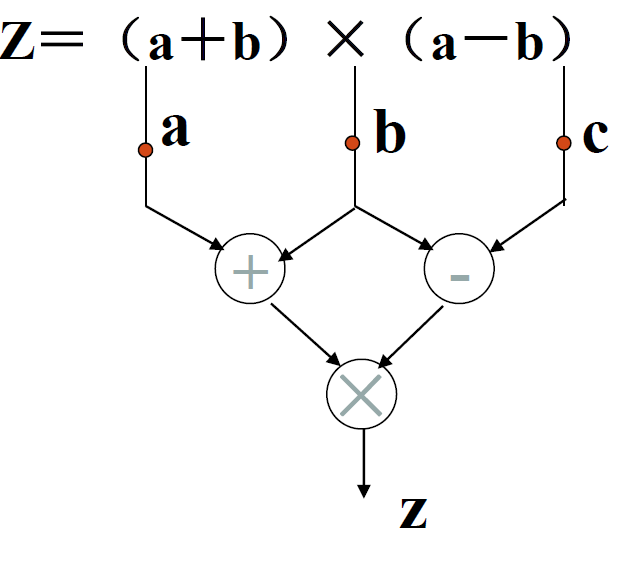

**常数发生器结点**: 用来产生一个常数，无输入端 ，激发后输出常数令牌

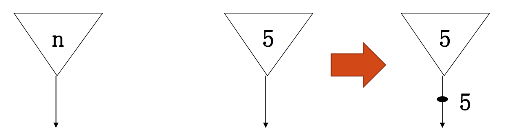

**复制结点**: 该结点将一个令牌复制成两个相同的令牌，包括数据令牌和控制令牌。

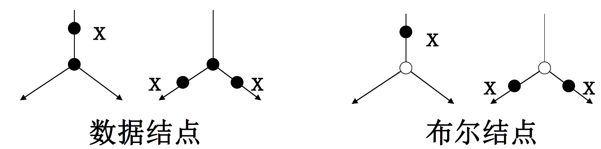

**条件分支节点**: 

**运算节点**: 可以进行数据运算和bool运算

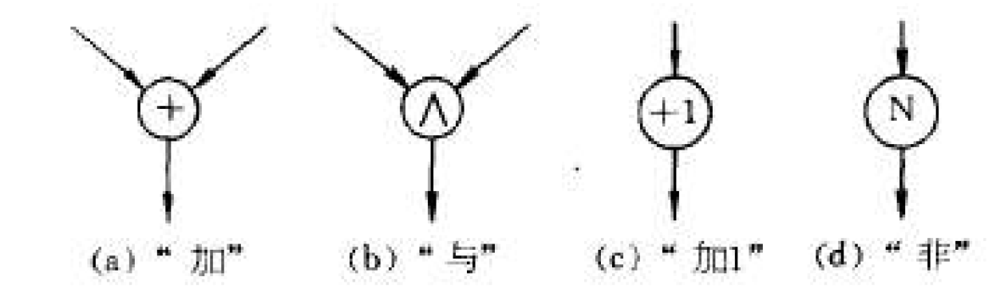

**条件操作结点**: 

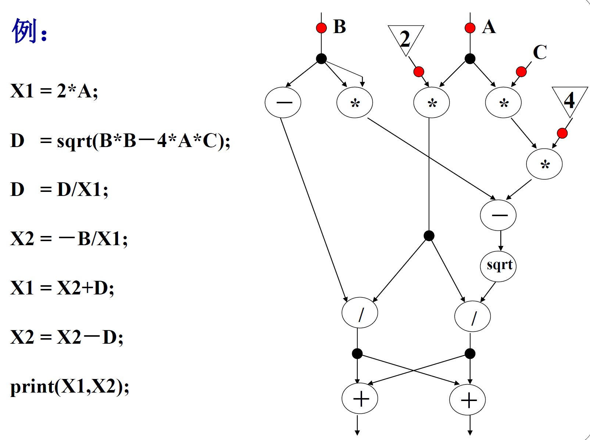

例［分支结构］: 实现当 x＞0 时，让 x 加 y ，否则，就让 x 减 y 的功能

例［循环结构］：实现对 x 循环累加，直到结果超过 1000 为止

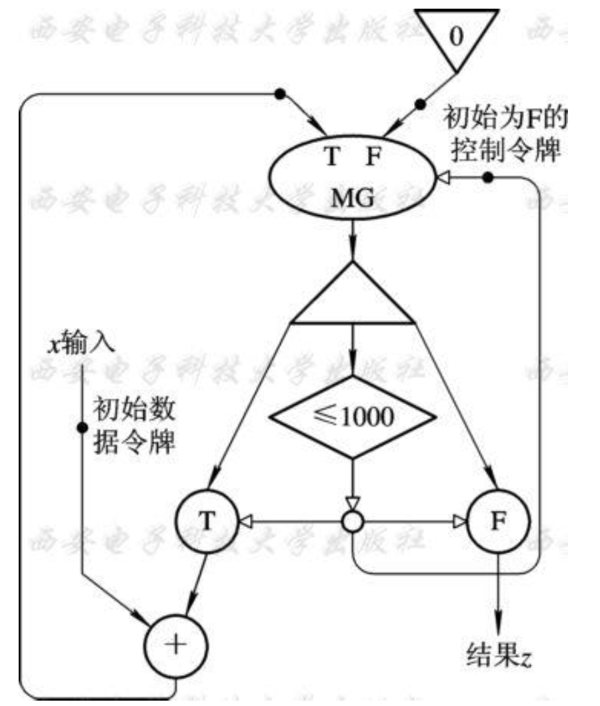

**活动模片表示法**

一个活动模片相当于有向图表示中的**一个或多个操作节点**。 

- 数据流则是一组活动模片的集合体 。
- 一个活动模片１个操作码域 、 2 个操作数域和 1个目的域；其实质**相当于是一条指令** 。
- 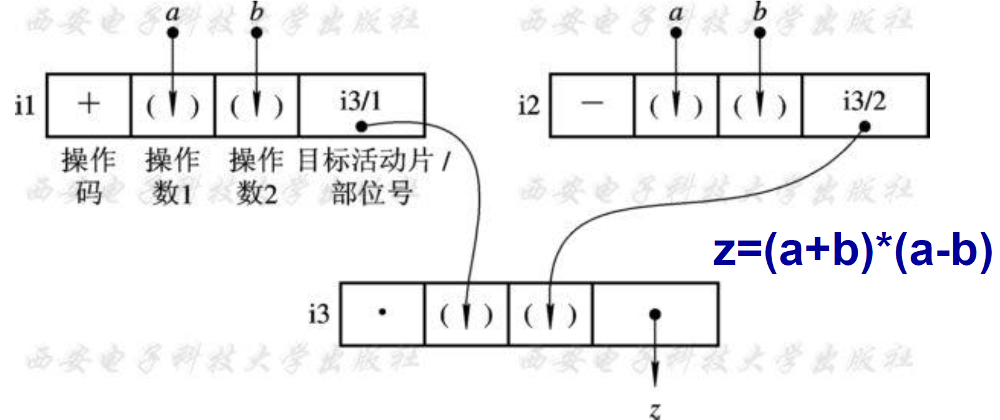

#### 数据流语言

**什么是数据流语言**: 

**数据流语言特点**: 

- 并行性好
  - 指令的执行顺序仅受程序中数据相关性的约束而与指令在存储器中存放位置无关。
- 单赋值规则
  - 在一个程序中，每个变量只赋值一次，不允许同名变量在不同语句的左边出现一次以上，不存在全局变量和局部变量的概念。
  - 即为任何一个重新赋值的变量选择另一个从前没有使用过的名字
  - 
- **不产生副作用**
  - 不使用全局变量和公共变量，严格控制变量使用范围， 采用赋值调用 ，而不是引用调用。
- 结果的局部性
  - 数据流语言完全采用模块化结构，不使用全局变量，不允许全局赋值，对形参的赋值也有严格限制。
- **循环程序迭代展开**
  - 动态数据流计算机可以把一个循环程序的不同次循环展开来进行并行计算 ，从而提高了并行度。

## 6.1.3 数据流计算机的结构

分类：

- 静态数据流计算机:  任意一个节拍内，任意一条有向分支线上**只允许存在一个数据令牌**的处理方式, 故数据令牌**不加标号**
- 动态数据流计算机:  任意一条有向线上可**同时传送几个数据令牌**,故每个数据令牌都**必须带上标志**(令牌标号及其他特征信息)

**静态数据流计算机**

典型结构

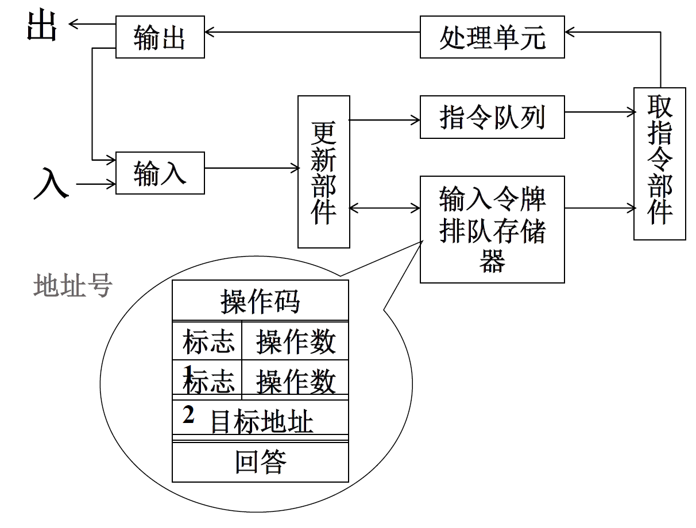
