> 一份简答和综合的简单整理, 不能覆盖所有内容, 仅应急/复习使用
>
> 详细内容请跳转 [软件工程](./软件工程.md)

# 考试范围

1. **软工考试题型**
   选择题 20 分 10 题
   名词解释 12 分 4 题
   简答题 30 分 4 题
   分析设计题 38 分

2. **简答题和分析设计题范围**:

   - [x] [过程模型](# 一. 过程模型)

   - [x] [uml 图](# 二. UML 图)

   - [x] [数据字典](# 2.3 基于流程的需求建模)

   - [x] [判定表](# 三. 判定表)

   ***

   - [x] [软件测试策略](# 四. 软件测试策略)

   - [ ] 软件体系结构

   - [x] [基本路径测试](# 六. 基本路径测试)

   - [ ] 评审技术

   - [x] [挣值分析](# 八. 挣值分析)

   - [ ] 风险管理

3. 课程已讲部分: 1, 2, 3, 4, 5, 7, 8, 9, 10, 11, 12, 13, 17, 18, 19, 22, 23, 24, 25, 26
4. 公式整理: [公式整理](# 公式整理)

# 简答&分析题

## 一. 过程模型

> 一些概念
>
> 1. 过程框架：过程框架是一个广泛的概念，指的是一个通用的、可适应多个领域的过程的结构化框架。它为开发者提供了在不同领域或项目中构建过程的通用框架。
> 2. 过程模型：过程模型是软件工程中用于表示和描述软件开发过程的抽象化的、结构化的框架。过程模型是一个具体的软件开发方法论或流程，如瀑布模型、迭代模型、敏捷模型等。
> 3. 过程模式：通用的、在多个软件项目中可重复应用的软件开发过程的通用化描述

### 1.1 通用过程模型

通用过程框架定义了 5 种框架活动: 沟通, 策划, 建模, 构建, 部署

软件过程示意图: 从外到内: 软件过程, 过程框架, 普适性活动, 框架活动, 动作, 任务集

- 

#### 过程流

==过程流== : 描述了在执行顺序和执行时间上如何组织框架中的活动、动作和任务

分为:

1. **线性**: 字如其名
   - 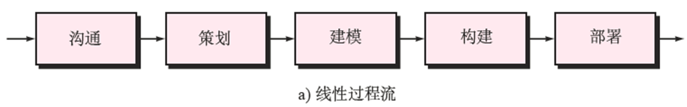
2. **迭代**: 在执行下一个活动前重复执行之前的一个或多个活动
   - 
3. **演化**: 采用循环的方式执行各个活动，每次循环都能产生更为完善的软件版本（增量交付）
   - 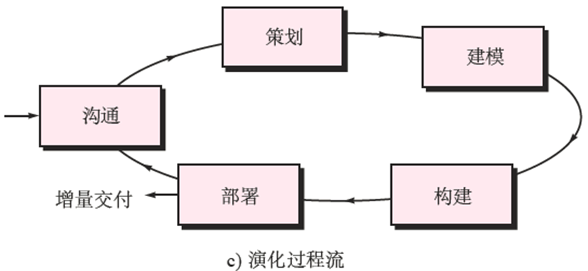
4. **并行**: 将一个或者多个活动与其他活动并行执行
   - 

### 1.2 惯用过程模型

> ==惯用过程模型== (==软件生存周期模型== )
>
> - **目标**: 使软件开发更加有序
> - 所有的软件过程模型都支持通用框架活动，但是每一个**模型都对框架活动有不同的侧重**
> - 瀑布，增量，演化，并发

#### 1.2.1 瀑布模型&V 模型

##### 模型概述

1. ==瀑布模型== 又称==经典生命周期== ，它提出了一个传统的、顺序的软件开发方法，即从用户需求规格说明开始，顺序地通过沟通、策划、建模、构建和部署过程，最终提供完整软件和持续技术支持。

   - 

2. 变体: V 模型

   - 软件团队沿着 V 模型左侧步骤向下推进，编码结束后，团队沿着 V 模型右侧的步骤向上推进，其本质是增加了一系列测试(质量保证动作)
   - 

3. 对比: 两者没有本质区别，V 模型提供了一种将验证确认动作应用于早期软件工程工作中的方法

##### 特点 ※

1. 阶段间具有**顺序性**和**依赖性**

   - 顺序性: 只有等前一阶段的工作完成以后，后一阶段的工作才能开始；前一阶段的输出文档，就是后一阶段的输入文档。
   - 依赖性: 只有前一阶段有正确的输出时，后一阶段才可能有正确的结果

2. **推迟实现**的观点: 前面步骤完成后才考虑实现。
   - 把逻辑设计和物理设计清楚的划分开来，尽可能推迟程序的物理实现，这是瀑布型软件开发的一条重要的指导思想
3. **质量保证**的观点: 每一阶段都需要有文档以及经过评审。
   - 为了保证质量，瀑布型软件开发在各个阶段坚持了两个重要的做法
     - 每一阶段都要完成规定的文档。没有完成文档，就认为没有完成该阶段的任务。
     - 每一阶段都要对完成的文档进行复审，以便尽早发现问题，消除隐患。

##### **问题**

- 不适应需求经常发生变更的环境
- 客户只能到项目开发的晚期才能得到程序的可运行版本，大的错误如果到这时才被发现，会造成灾难性后果
- 工作中会发生阻塞状态

##### 总结

所以，在**需求已确定**的情况下，且工作采用**线性的方式**完成的时候，瀑布模型是一个很有有用的过程模型

#### 1.2.2 增量模型

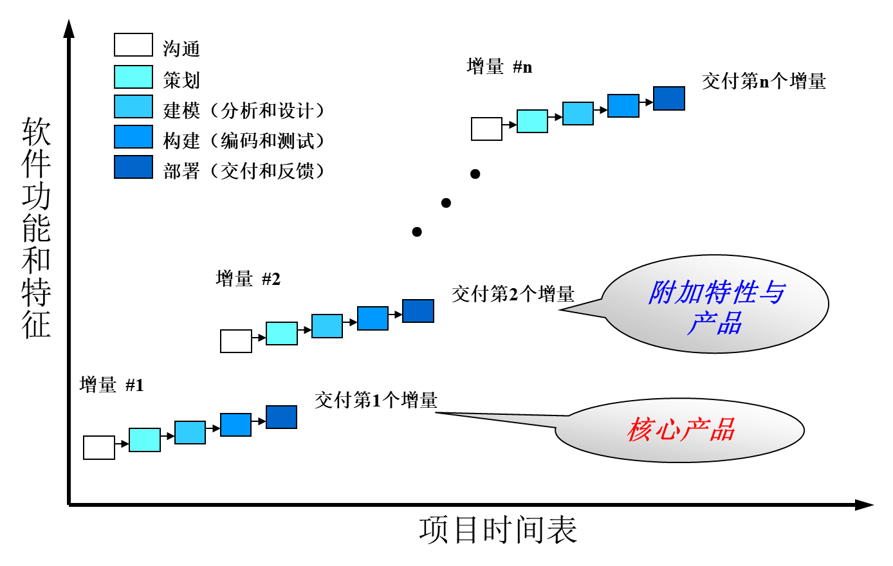

##### **提出背景**

- 需求不明确或迫切需要为用户迅速提供一套功能有限的软件产品，然后再后续版本中再进行细化和扩展功能。
- 随着时间的推移，增量模型在每一个阶段都运用线性序列。
  每个线性序列生产出软件的可交付增量。（即**以迭代方式运用瀑布模式**）

##### 特点

- 增量模型侧重于每个增量都提交一个**可以运行的产品**。早期的增量可以看做是最终产品的片段部分。
  - 第一个增量往往是核心产品
- 如果在项目既定的商业期限之前不可能找到**足够**的开发人员，这种情况下增量模型显得特别有用
  - 早期增量可以先投入少量人员, 观察核心产品效果后再加人
- 它还可以**规避技术风险**
  - 早期增量中可以先不用不成熟的技术

##### **优点**

1. 能在**较短时间**内向用户提交可完成**部分工作**的产品；
2. 用户有较充裕的时间**学习和适应**新产品；
3. 易于**保证核心功能**正确；
4. 可以基于早期版本来**获取需求**；
5. 项目完全失败的**风险小**；
6. 可以为那些**创新**的功能开拓市场；
7. **规避**了**资源缺乏**的风险；

##### **问题**

1. 把用户需求转化为**功能递增**的不同版本可能比较难 (功能联系紧密，难以完全分开)
2. 难以确定所有版本共需的**公用模块**。(通常进行设计时会先考虑设计公用模块，但是每一个增量只考虑局部的设计，因此，全局的公用模块很难确定)

##### **变体**–迭代开发

迭代式开发是增量式开发的一种变体，不同于传统的增量开发（每次提交一个构件），迭代式开发开始提交所有的模块（部分模块有待优化），在其后的阶段逐渐优化

#### 1.2.3 演化模型

##### 原型开发

1. 背景

   - **客户**提出了一些基本功能，但未详细定义输入、处理和输出需求；

   - **开发人员**可能对开发运行环境、算法效率、操作系统的兼容性和人机交互等情况不确定。

2. 
3. 当需求很模糊的时候，原型开发模型都能帮助软件开发人员和利益相关者更好的理解究竟需要做什么
4. **使用前提**

   - 用户必须积极参与原型的建造，建造原型仅仅是为了定义需求，之后就必须被全部抛弃(至少是部分抛弃)
   - 必须有快速开发工具可供使用

5. 问题:
   - 软件质量不够高, 并且客户对该认识不够到位, 可能要求直接在原型基础上修改开发
   - 软件开发人员为使原型快速运行, 技术和算法的选择可能不够合适

【注】原型是为定义需求服务的，然后丢弃原型，实际的软件系统是以质量第一为目标而开发的

##### 螺旋模型

1. ==螺旋模型== : 风险驱动的软件开发模型

   - 采用**循环**的方式，逐步加深系统定义和实现的深度（原型开发的迭代性质）；

   - 确定一系列**里程碑**，确保利益相关者都支持系统解决方案（瀑布模型的系统性和可控性）；

   - 第一圈一般开发出产品的**需求规格说明**，接下来开发产品的**原型系统**，并在每次迭代中逐步完善，开发不同的软件版本；

   - 项目经理还会调整完成软件开发需要迭代的次数；

   - 开发大型系统和软件的理想方法，更好地应对风险

   - 

2. 【注】它可以运用在应用系统开发的整个生命周期，从概念开发到维护

##### 演化模型总结

演化模型的问题:

- 迭代周期**数目不确定**，大多项目管理和估算技术是**基于活动的线性布局**，所以并不完全适用于演化软件过程
- 演化模型没有确定演化的最快速度
- 演化模型侧重**灵活性和可延展性**，而**不是高质量**。（即: 演化模型优先追求开发速度，而不是零缺陷）

### 1.3 专用过程模型

#### 1.3.1 基于构件的开发

1. **基于构件的开发模型**

   - 具有许多螺旋模型的特点，本质上是演化模型，需要以迭代的方式构建软件。
   - 不同之处在于，基于构建的开发模型采用**预先打包的软件**构建来开发应用系统

2. 优点: 能够使**软件复用**，减少项目开发费用，缩短开发周期
3. 建模和构建活动开始于**识别可选构件**。这些构件有些设计成**通用的软件模块**，有些设计成**面向对象的类或软件包**。不考虑构件的开发技术，基于构件开发模型由以下步骤组成（采用演化方法）:
   1. 对于该问题领域研究和评估可用的基于构件的产品。
   2. 考虑构件集成的问题
   3. 设计软件架构以容纳这些构件
   4. 将构件集成到架构中
   5. 进行充分的测试以保证功能正常

#### 1.3.2 形式化方法模型

1. 主要活动: 生成**计算机软件形式化的数学规格说明**，使得软件开发人员可以应用严格的数学符号来说明，开发，验证系统

2. 优点: 应用数学分析的方法，歧义性问题、不完整问题、不一致问题等都能够更容易地发现和改正。在设计阶段，形式化方法是程序验证的基础，使软件开发人员能够发现和改正一些往往被忽略的问题。

3. **缺点**:

   - 开发非常耗时，成本也很高；

   - 只有极少数程序员具有应用形式化的背景，需要大量的培训；

   - 对于技术水平不高的客户，很难用这种模型进行沟通。

4. 应用: 高度关注安全性的软件（飞行器，医疗设施，经济领域）

### 1.4 统一过程

1. ==统一过程== (UP, Unified Process)

   - 注重于客户沟通以及从用户的角度描述系统，强调软件体系结构的重要性
   - **特点**: 用例驱动，以架构为核心，迭代并且增量
   - 统一过程认识到与客户沟通以及从用户的角度描述系统并保持该描述的一致性的重要性

2. 统一过程的**五个阶段**

   - **起始阶段**: 识别基本的业务需求，并用用例初步描述每一类用户所需要的主要特性和功能

   - **细化阶段**: 沟通和通用过程模型的建模活动

   - **构建阶段**: 采用体系结构模型作为输入，开发或是获取软件构建，使得最终用户能够操作用例

   - **转换阶段**: 通用构建活动的后期阶段以及通用部署活动的第一部分

   - **生产阶段**: 对持续使用的软件进行监控，提供运行环境的支持，提交并评估缺陷报告和变更请求

   - 

## 二. UML 图

### 2.0 概述

> [软件工程 UML 10 种图\_uml 图-CSDN 博客](https://blog.csdn.net/mid_Faker/article/details/106086605)
>
> [九种常用的 UML 图总结\_uml 常见的十种图-CSDN 博客](https://blog.csdn.net/qq_43530773/article/details/118250152)

==统一建模语言== （Unified Modeling Language，UML）又称标准建模语言

#### 需求模型的分类

1. **基于场景的元素**: 表述用户如何与系统和使用软件时出现的特定活动序列进行交互
   - [用例图](# 2.1.1 用例图): 从用户（角色）的角度出发，描述角色和用例之间的关系
   - [活动图](# 2.1.2 活动图): 描述用例要求所要进行的活动，以及活动间的约束关系，有利于识别并行活动
   - [泳道图](# 2.1.3 泳道图 ※)
     - 活动图的一种有用的变形
     - 指示了**参与者或分析类负责的活动**
2. **基于类的元素**: 描述了系统操作的对象、对象间关系(某层级)，以及定义的类间发生的协作
   - [类图](#2.2.1 类图)
     - 描述系统中的类，以及各个类之间的关系的静态视图
     - 是面向对象系统建模中最常用和最重要的图，是定义其他图的基础
   - 协作图 没找到细节, 就提了一下
3. **面向流的元素**: 表示信息转换的系统，描述了数据对象在流过各种系统功能时是如何转换的。(输入 - 处理 - 输出)
   - [数据流图 DFD](# 2.3.1 数据流图 DFD)
     - 数据字典
   - [控制流图](# 6.1 流图) ~~测试乱入~~
4. **行为元素**: 描述了外部事件如何改变系统或驻留在系统里的状态
   - [状态图](# 2.4.1 状态图)
   - [顺序图](# 2.4.2 顺序图(时序图))

### 2.1 基于场景的建模

#### 2.1.1 用例图

1. 用例图: 用例图是从用户（角色）的角度出发，描述角色和用例之间的关系。

   - 即：谁，可以用此系统做什么。

2. 参与者: 在系统外部与系统直接交互的人或事物。需要注意以下两点：

   - 参与者是角色而不是具体的人（可以是外部系统），它代表了参与者在与系统打交道的过程中所扮演的角色。所以在系统的实际运作中，一个实际用户可能对应系统的多个参与者。不同的用户也可以只对应于一个参与者，从而代表同一参与者的不同实例。

   - 参与者作为外部用户（而不是内部）与系统发生交互作用，是它的主要特征。

   - 在 UML 中，参与者使用如图所示的一个小人表示：

     

3. 用例（Use Case）用况

   - 系统外部可见的一个系统功能单元。系统的功能由系统单元所提供，并通过一系列系统单元与一个或多个参与者之间交换的消息所表达。
   - 用椭圆表示，椭圆中的文字简述系统的功能：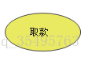

4. 用例之间的联系

   - 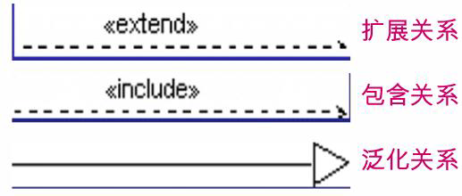
   - 拓展: 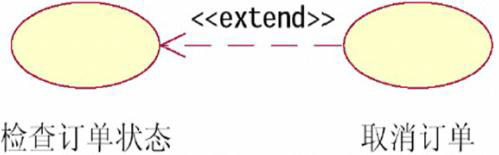
   - 泛化: 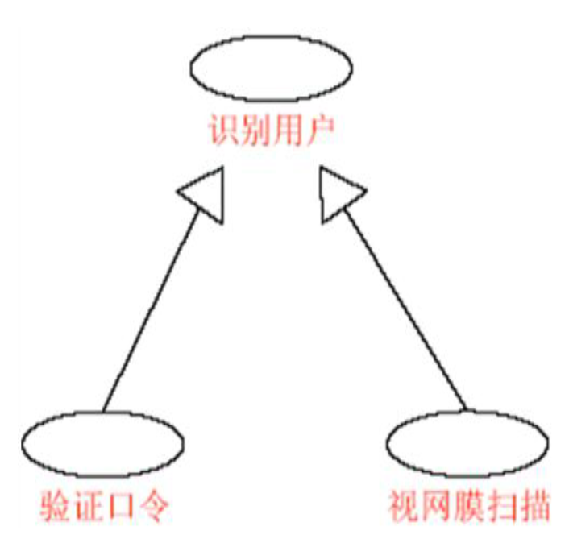

5. 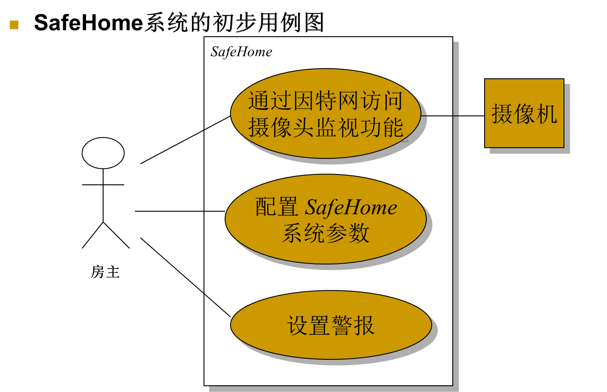

#### 2.1.2 活动图

==活动图== 描述用例要求所要进行的活动，以及活动间的约束关系，有利于识别并行活动。能够演示出系统中哪些地方存在功能，以及这些功能和系统中其他组件的功能如何共同满足前面使用用例图的业务需求。

活动图是状态图的一种特殊情况，这些状态大都处于活动状态。本质是一种**流程图**，它描述了活动到活动的控制流。

UML 活动图在特定场景内通过提供迭代流的图形化表示来补充用例。

- 两端为半圆形的矩形表示一个特定的系统功能
- **箭头**表示通过系统的流
- **判定菱形**表示判定分支
- **实心水平线**意味着并行发生的活动。(见后面的案例)

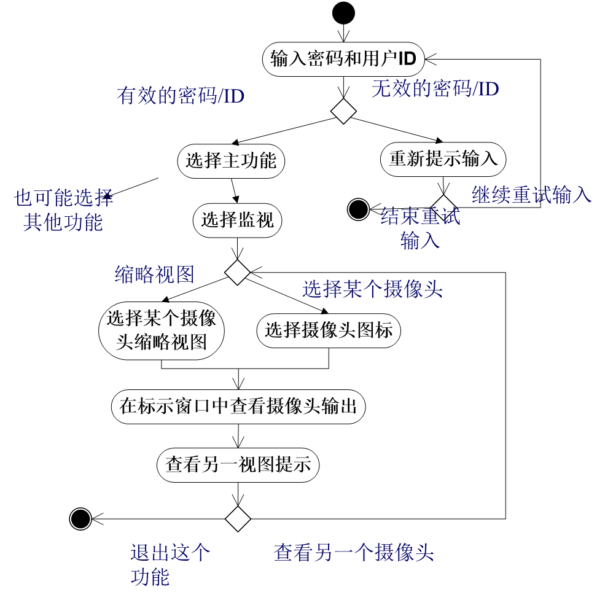

#### 2.1.3 泳道图 ※

==泳道图== ：

- 活动图的一种有用的变形。
- 指示了**参与者或分析类负责的活动**。
- 职责由纵向分割图的并列条形部分表示，就像游泳池中的泳道。
- 确定哪几个分析类 (如下图的中房主、摄像机和接口)对活动图中的情景有直接或间接的责任，并**重新排列活动图**。

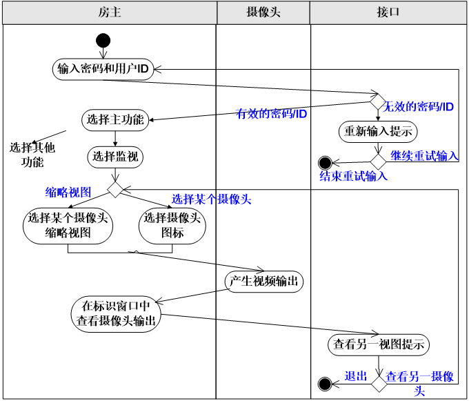

1. 小孩存取钱的案例
   - 
   - 细化: 

### 2.2 基于类的建模

#### 2.2.1 类图

> 似乎只讲了关联和依赖

==类图== 是描述系统中的类，以及各个类之间的关系的静态视图。是面向对象系统建模中最常用和最重要的图，是定义其他图的基础。

在 UML 类图中，常见的有以下几种关系: 泛化（Generalization）, 实现（Realization），关联（Association），聚合（Aggregation），组合（Composition），依赖（Dependency）。

各种关系的强弱顺序： 泛化 = 实现 > 组合 > 聚合 > 关联 > 依赖

##### ① 泛化（Generalization）

泛化是一种**继承(Extend)**关系，表示一般与特殊的关系，它指定了子类如何继承父类的所有特征和行为
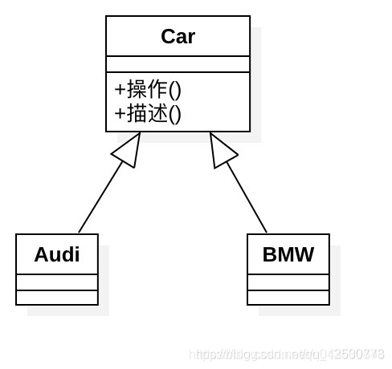

##### ② 实现（Realization)

实现是一种类与**接口**的关系，表示类是接口所有特征和行为的实现(implement)。
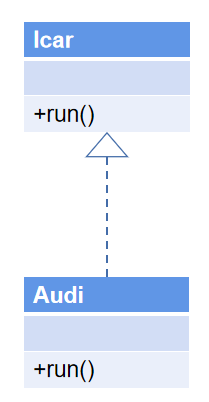

##### ③ 关联（Association)

关联是一种拥有的关系，它使一个类知道另一个类的属性和方法；

关联可以是双向的，也可以是单向的。

双向的关联可以有两个箭头或者没有箭头，单向的关联有一个箭头。

关联上添加描述

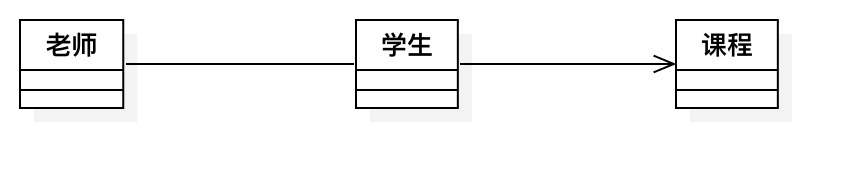

- 两个分析类以某种方式相互联系着，这些联系被称作==关联== (associations)。
- 在某些情况下，关联可以更进一步地指出多样性。多样性限制的表示:
  - `1..* `表示一个或多个
  - `0..*` 表示 0 或多个
    - `*` 表示范围无上界
  - 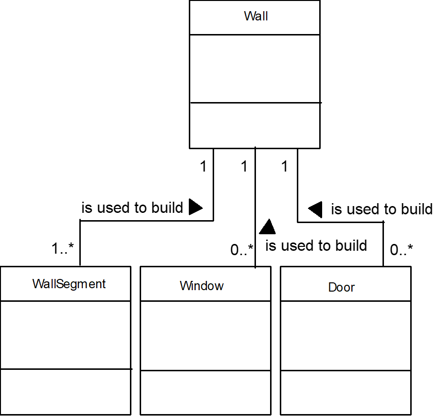

##### ④ 聚合（Aggregation)

聚合是整体与部分的关系，且部分**可以离开整体而单独存在**。如车和轮胎是整体和部分的关系，轮胎离开车仍然可以存在。

聚合关系是关联关系的一种，是强的关联关系；关联和聚合在语法上无法区分，必须考察具体的逻辑关系。
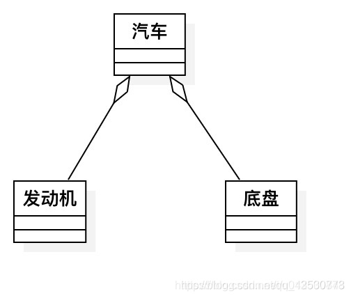

##### ⑤ 组合（Composition）

组合是整体与部分的关系，但**部分不能离开整体而单独存在**。如公司和部门是整体和部分的关系，没有公司就不存在部门。

组合关系是关联关系的一种，是比聚合关系还要强的关系，它要求普通的聚合关系中代表整体的对象负责代表部分的对象的生命周期。
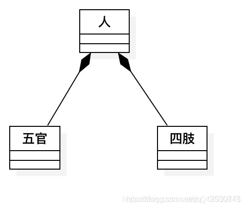

##### ⑥ 依赖（Dependency）

依赖是一种使用的关系，即一个类的实现需要另一个类的协助，所以要尽量不使用双向的互相依赖

~~不要循环依赖~~

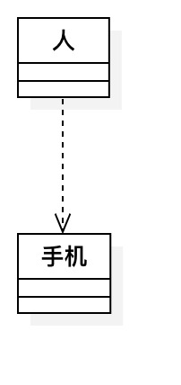

- 建模者必须提供特定的密码才能查看指定摄像机的位置。`《access》`意味着通过特定的密码控制使用摄像机的输出。
- 

#### 2.2.2 协作图

> TODO

### 2.3 基于流程的需求建模

#### 2.3.1 数据流图 DFD

1. 符号:

   - 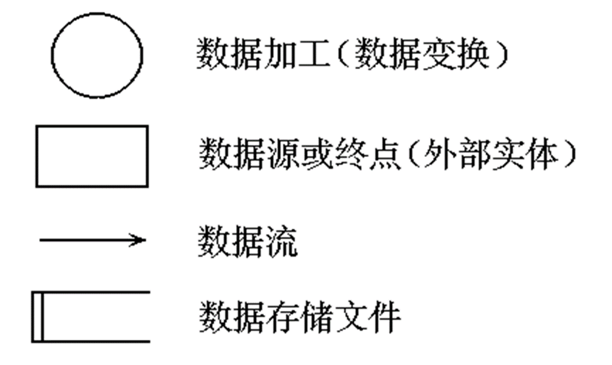

2. 例子:
   - 
   - 外部实体：储户、日历
   - 处理(数据变换)：检验、登录、付款
   - 数据存储：帐卡、存折

#### 2.3.2 数据字典

1. **数据字典**（Data Dictionary，DD）是对数据流图中包含的所有元素的定义的集合。它是数据流条目、数据存储条目、数据项条目和基本加工条目的汇集。用来定义数据流图中各个成分的具体含义。

2. 管理各种关系模型中的信息，具体信息包括:

   - 一般信息: 名字、别名、描述等；

   - 定义信息: 数据类型、长度、结构；

   - 使用特点: 值的范围、使用频率、使用方式；

   - 控制信息: 来源、使用它的程序；

   - 分组信息: 父结构、从属结构、物理位置等；

3. 数据元素组成数据对象的方式:

   - 顺序: 两个或多个分量以确定次序进行连接；

   - 选择: 从两个或多个可能的元素中选取一个；

   - 重复: 把指定的分量重复零次或多次。

4. 符号:

   - `=  `: 等价于

   - `+`: 和

   - `[]`: 或 (选择一个，用|隔开分量)

     - 例: `字母或数字 =  [字母字符 | 数字字符]`

   - `{ }`: 重复，(左右的数字分别为重复次数的上、下界)

     - 例: `字母数字串 = 0{字母或数字}7` (可重复 0-7 次)

   - `( ) `: 可选 (即从括号从中任选一项，也可一项都不选)

5. 例

   - 

   - 

### 2.4 基于行为的需求建模

#### 2.4.1 状态图

状态图描述类的**对象**所有可能的状态，以及事件发生时状态的转移条件。他们可以告知一个对象可以拥有的状态，并且事件会怎么随着时间的推移来影响这些状态。

状态图是对类图的补充。

##### 类的状态

类状态有主动/被动之分

- **被动状态**——某个对象**所有属性**的**当前状态**

- **主动状态**——对象进行**连续变换和处理**时的当前状态
  - 必然存在**前后不同状态**。比如，移动、休息、受伤、疗伤、被捕、失踪等；
  - 必然发生事件（触发器）才能迫使对象做出从一个主动状态到另一个主动状态的迁移

==状态图== ：为每个类呈现了主动状态和导致这些主动状态变化的事件

- 每个箭头表示某个对象从一个主动状态转移到另一个主动状态。
- 每个箭头上的标注都体现了触发状态转移的事件。

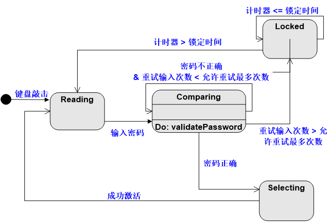

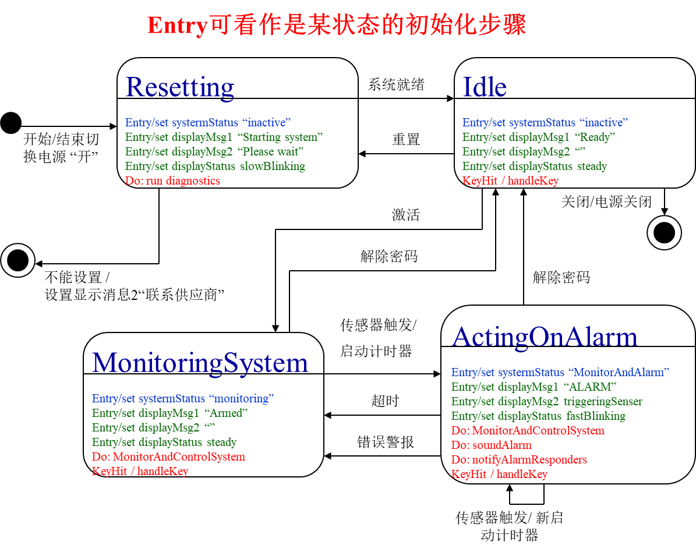

#### 2.4.2 顺序图(时序图)

> 协作图 → 时序图

==顺序图== 是将交互关系表示为一个二维图：

- 用时间函数表明事件如何引发从一个**对象**到另一个**对象**的转移。
- 每个箭头代表了一个事件；
- 时间纵向向下度量；消息的顺序是从左到右排列；
- 窄的纵向矩形表示处理某个活动所用的时间。

### 2.5 设计模型

#### 2.5.1 UML 构件图

- 构件图也称组件图。
  - 描述了软件的各种构件和它们之间的依赖关系。
  - 通常包括三个元素：构件、接口和依赖。
- 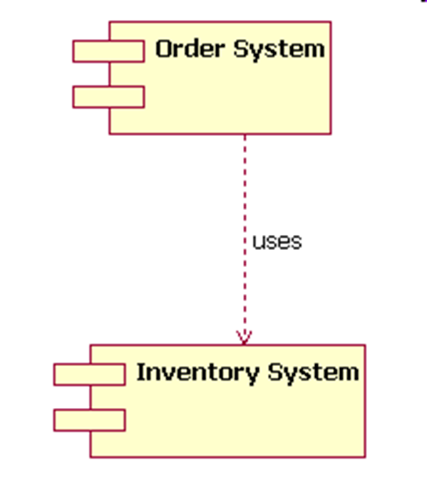
- 
- 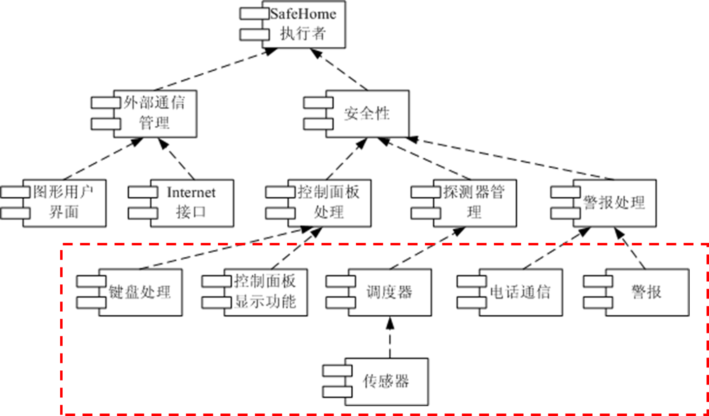

#### 2.5.2 部署图

部署级设计元素指明软件功能和子系统将如何在物理计算环境内分布。

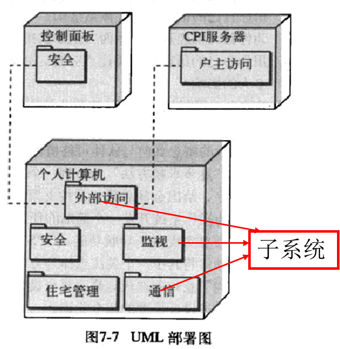

### 2.6 一些例题

#### 出卷系统案例

##### 数据流图

1. 顶层数据流图：

   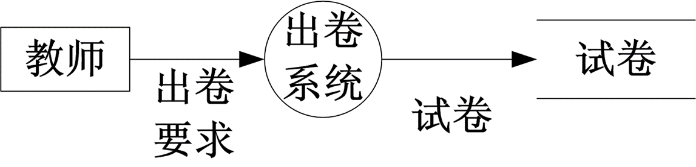

2. 一层数据流图:
   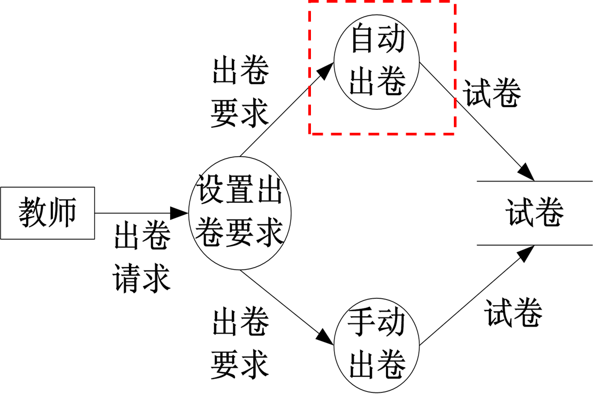
3. 二层数据流图: (自动出卷部分)
   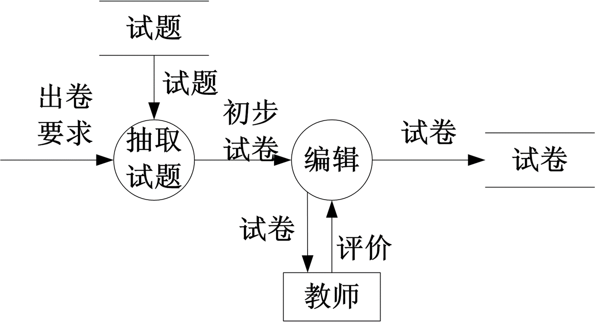

##### ER 图

出卷功能初步 ER 图

##### 数据字典

1. 试卷的数据字典

2. 出卷要求的数据字典

   

#### 短信系统案例

##### 用例场景

1. 发送短信的场景描述：
   - 用户输入短信内容；
   - 用户选择若干个发送人员；
   - 系统将明文短消息编码成格式化的短消息串；
   - 系统以串行方式将短信串传入无线移动终端。
2. 接收短信的场景描述：
   - 用户向串口发送指令从无线移动终端读取一组短消息串；
   - 系统将一组短信串解码成明文的短消息；
   - 系统将短消息写入数据库，并显示给用户。
3. 人员维护的场景描述：
   - 管理员添加一个新成员；
   - 管理员更新一个成员的信息；
   - 管理员删除一个成员。
4. 系统设置的场景描述：
   - 管理员修改基本信息：如短信客服中心号码、发送频率、延时等；
   - 系统保存设置信息。
5. 类包括：
   - ==边界类== ：用于建立系统与其参与者之间交互的模型，经常代表对窗口、屏幕、打印机接口等抽象：
     - **发送短信界面**、**接收短信界面**、**收发接口**；
   - ==控制类== ：用于协调、排序、事务处理以及其它的对象控制：
     - **发送短信**、**接收短信**；
   - ==实体类== ：业务实体：
     - 短信编/解码、发送的短信串、接收的短信串；

##### 协作图

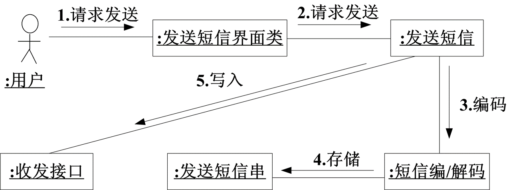

##### 顺序图(时序图)

> 与协作图对应

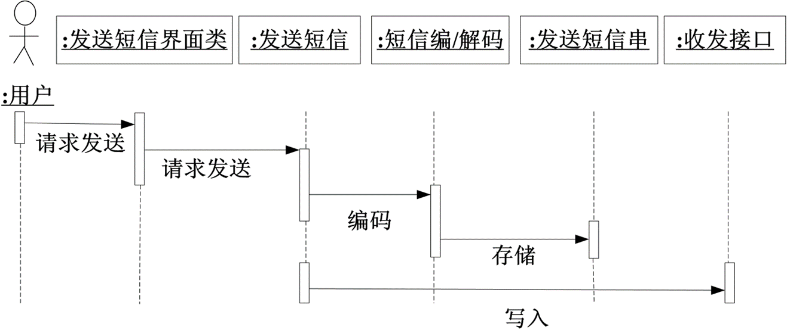

## 三. 判定表

> [软件工程~~判定树和判定表\_判定表例题-CSDN 博客](https://blog.csdn.net/weixin_45626404/article/details/112724244)

> 当算法中包含多重嵌套的条件选择时，使用**判定表**能够清楚地表达。
>
> 所以是在设计阶段使用吧

| 判定表   | 组成                                     |
| -------- | ---------------------------------------- |
| 左上部分 | 所有条件                                 |
| 左下部分 | 所有可能做的动作                         |
| 右上部分 | 各种**条件组合**，每一列表示一种可能组合 |
| 右下部分 | 每一列对应每一种条件组合的动作           |

### 例

eg：假设某航空公司规定，乘客可以 ① 免费托运重量不超过 30kg 的行李。当行李重量超过 30kg 时，对 ② 头等舱的国内乘客超重部分每公斤收费 4 元，对 ③ 其他舱的国内乘客超重部分每公斤收费 6 元，对 ④ 外国乘客超重部分每公斤收费比国内乘客多一倍，对残疾乘客超重部分每公斤收费比正常乘客少一半。用判定表进行表达。

1. 我们先将所有情况进行列出，就是面对行李是否<30kg，是否为国内乘客，是否为头等舱，是否是残疾乘客我们托运行李的价格不一样
2. T 代表满足情况，F 代表不满足，X 代表我们应该付的价格（我个人建议你根据这个模板自己写其实更简单，顺序不同没有关系，其实就是排列组合所有情况）
3. 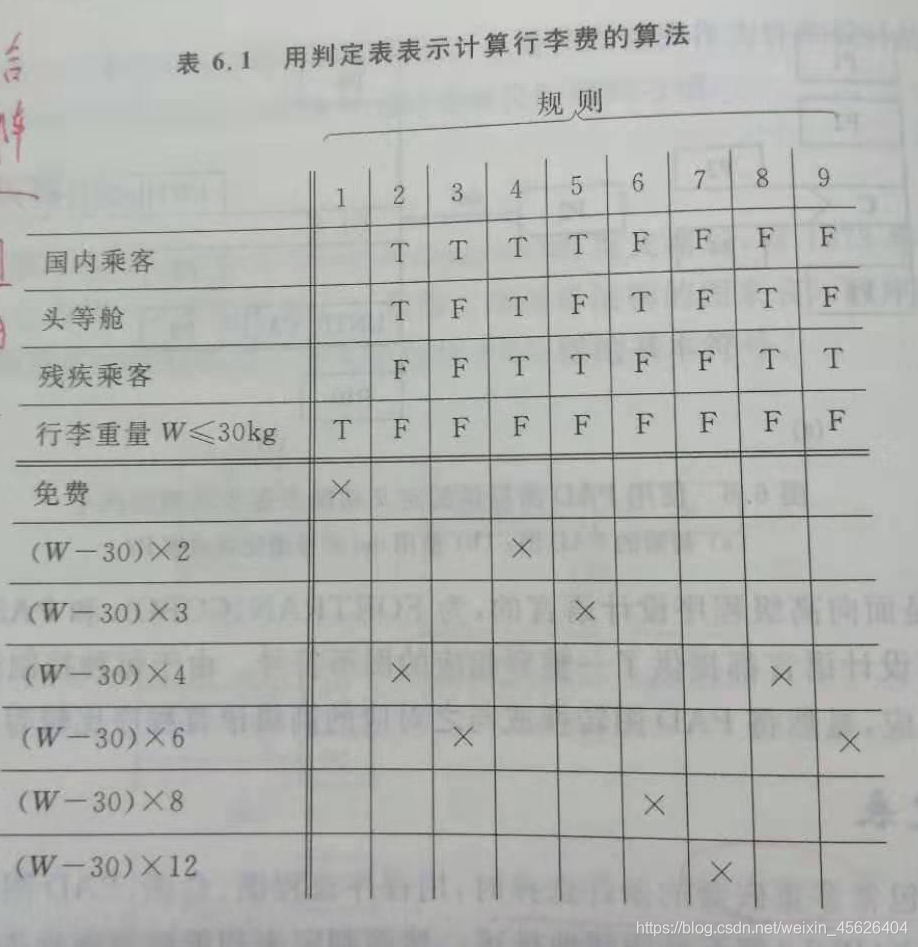

## 四. 软件测试策略

### 4.1 单元测试

1. ==单元测试== : 对软件中的**最小可测试单元**进行检查和验证

   - ==单元== : C 中是函数, Java 中是类, 图形化软件中是一个窗口/菜单

2. 单元测试主要对模块的五个基本特性进行评价:

   - **模块接口**: 保证被测程序单元的信息能够正常的流入和流出

   - **局部数据结构**: 确保临时存储的数据在算法的整个执行过程中能维持其完整性

   - **边界条件**: 达到边界值还能正确执行

   - **独立路径**: 确保模块的所有语句至少执行一次

   - **错误处理路径**: 预见各种出错条件

3. 单元测试特点

   - 侧重于软件设计的最小单元的验证工作

   - 侧重于构件中的**内部处理逻辑**和**数据结构**

   - 进行的越早越好

#### 单元测试环境

==测试用例== : 是为某个特殊目标而编制的一组测试输入、执行条件以及预期结果，以便测试某个程序路径是否满足某个特定需求。

==构件== 并不是独立程序，所以必须为每个测试单元开发驱动程序和桩程序：

- ==驱动程序== ：是“主程序”，接收测试用例数据，将这些数据传递给待测试构件
- ==桩程序== ：替换那些从属于待测试构件的构件
- 驱动程序调用被测模块, 桩程序被被测模块调用

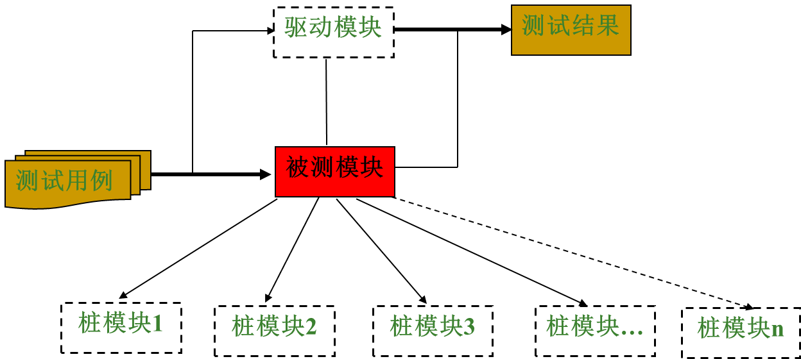

- 驱动模块和桩模块都是额外的开销，虽然在单元测试中必须编写，但并不需要作为最终的产品提供给用户。

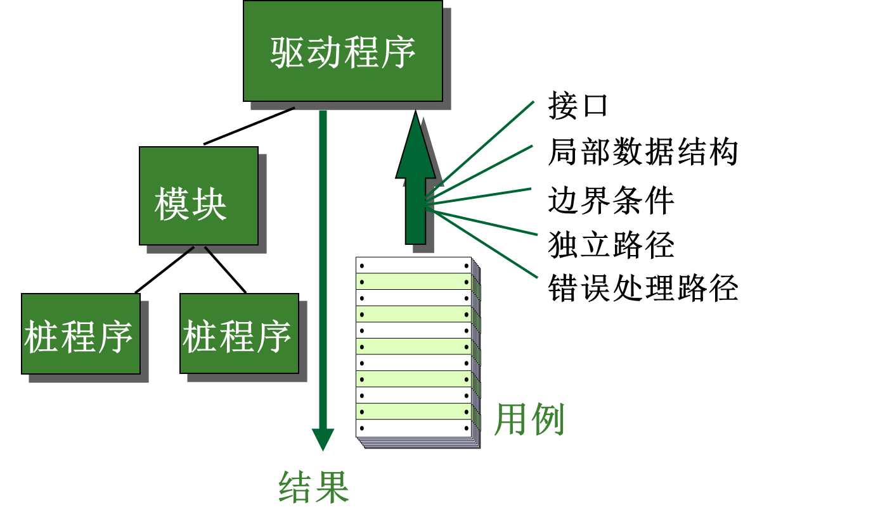

### 4.2 集成测试

分类:

- 一步到位的集成

- 增量集成
  - 自顶向下测试
  - 自底向上测试
  - 组合方法（三明治）

#### ① 一步到位的集成

1. 所有的构件都连接在一起，全部程序作为一个整体进行测试

   - 

2. 缺点:

   - 需要**所有单元就绪**，不利于开发进度

   - 问题**定位较为困难**

3. 适合规模较小的应用

#### ② 自顶向下法

1. ==自顶向下法== : 首先集成**主控模块**，然后依照控制层次向下进行集成
2. 策略有: 广度优先，深度优先

3. 特点:

   - 
   - 可能要**编写很多桩程序**

   - **主控模块错误**可能发现的比较早

4. 主控模块用作测试驱动模块，一次用一个实际模块替换一个桩模块
   - 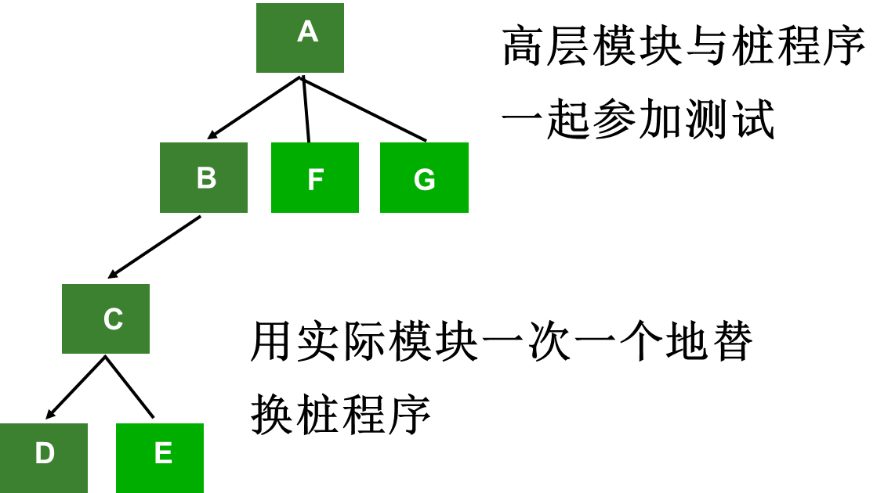

#### ③ 自底向上法

1. ==自顶向下法== : 从程序模块结构的**最底层**的模块开始组装和测试

2. 特点:

   - 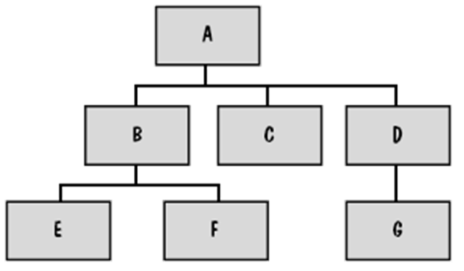 
   - 不需要桩模块

   - **要写驱动模块**

   - 主控模块错误发现得比较迟

3. 如果最上两层是自顶向下集成的，可以减少驱动模块的数量（组合方法）
   - 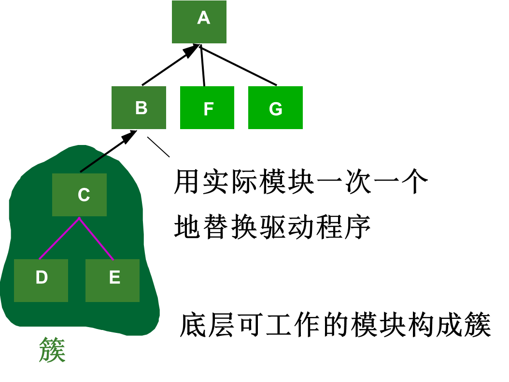

#### ④ 组合方法(三明治)

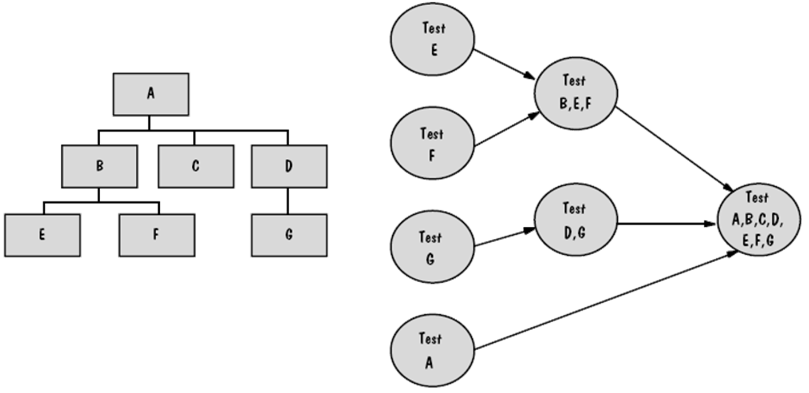

#### 集成测试方法的比较

1. 自顶向下与自底向上增量式测试的比较：
   - 自顶向下增量式测试：
     - 主要优点：可以自然地做到**逐步求精**，一开始就能让测试者看到系统的框架。能较**早发现高层模块的错误**；
     - 主要缺点：需要提供**桩模块**，并且在输入/输出模块接入系统以前，在**桩模块中表示测试数据有一定困难**。
   - 自底向上增量式测试：
     - 主要优点：容易直接使用测试数据，**易于设计测试用例**；
     - 主要缺点：直到最后一个模块被加进去之后才能看到整个程序（系统）的框架。**上层模块错误发现得晚**，影响范围大；

#### ⑤ 回归测试

1. ==回归测试== : 在**程序有修改**的情况下，保证**原有功能**正常的一种测试策略

   - 重新执行已进行测试的某个子集，以确保变更没有传播不期望的副作用
   - 每次对软件做重要变更时(新构件的集成, 删除, 修改), 要进行回归测试

2. 步骤：
   - 先对**修改部分**进行测试；A
   - 然后**隔离修改**部分，测试程序的未修改部分；B
   - 最后再把它们**集成起来**进行测试；A+B
3. 回归测试的三种测试用例
   - 代表测试样本：能够测试软件**所有**功能；
   - 必要测试样本：侧重于**被改变**的软件构件功能；
   - 额外测试样本：侧重于**可能会**受变更影响的功能；

#### ⑥ 冒烟测试

> 常用的集成测试方法

1. ==冒烟测试== 是**时间关键项目**的决定性机制

2. 活动:

   - 将已经转化成代码的**软件构件集成到构建**中

   - **设计一系列测试**以暴露影响构建正确完成其功能的**错误**

   - **每天**将构建与其他构建以及整个软件产品**集成起来**进行冒烟测试

3. 好处

   - 降低了集成风险: 每天测试, 较早的发现不相容和业务阻塞错误

   - 提高最终产品的质量: 冒烟测试面向构建(集成), 可以发现功能性错误, 体系结构和构件级设计错误

   - 简化错误的诊断和修正: 新发现的错误可能与软件增量有关

   - 易于评估进展情况

### 4.3 确认测试

#### 4.3.1 确认测试准则

1. ==软件确认== 是通过一系列表明与软件需求相符合的测试而获得的:
   - **测试计划**列出**将要执行的测试类**；
   - **测试规程**定义了特定的**测试用例**；
   - 设计的**特定测试用例**用于确保满足所有功能需求、所有行为特征，所有内容都准确无误且正确显示，达到所有性能需求；
   - **文档**是正确的、可用的，且满足其他需求 (如: 可移植性、兼容性、错误恢复和可维护性)。

#### 4.3.2 α 测试&β 测试

1. ==验收测试== 是由最终用户而不是软件工程师进行的，让每个用户都进行正式的验收测试是不切实际的:
2. ==α 测试== 是由有代表性的最终用户在**开发者的场所**进行。软件在自然的环境下使用，开发者站在用户的后面观看，并记录错误和使用问题。α 测试在受控的环境下进行。
3. ==β 测试== 在一个或多个**最终用户场所**进行。与 α 测试不同，开发者通常不在场，因此， β 测试是在不为开发者控制的环境下软件的“现场”应用。最终用户记录测试过程中遇见的所有问题，并定期地报告给开发者。
4. β 测试的一种变体称为==客户验收测试== ，软件开发和 QA 人员也应该参加，有时是按照合同交付给客户时进行的。
5. 确认测试
   - 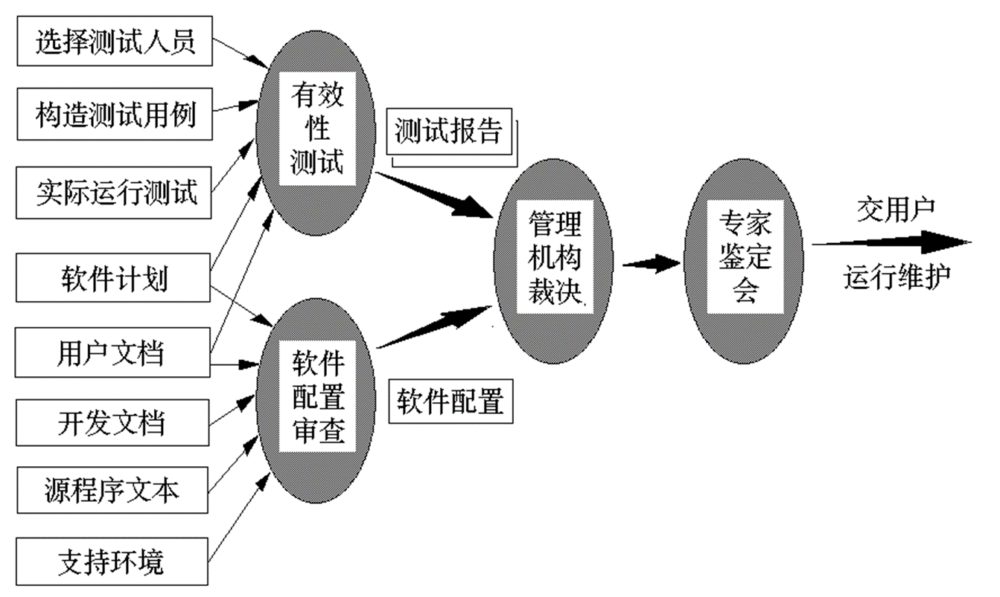

### 4.4 系统测试

> 以下几种

1. **恢复测试**
   - 强制让系统发生故障, 验证其能适当恢复
     - 恢复是自动的, 则对重新初始化、检查点机制、数据恢复和重新启动都要进行正确性评估
     - 恢复是人工的, 计算平均恢复时间 (Mean-Time-To-Repair，MTTR)
2. **安全测试**
   - 验证系统保护机制能否保护系统不受非法入侵
   - 测试扮演供给系统角色, 进行攻击
3. **压力测试**
   - 压力测试目的是在性能可以接受的前提下，测试系统可以支持的**最大负载**。
   - 压力测试要求以非正常的数量、频率或容量的方式执行系统。
4. **性能测试**
   - 性能测试是在不同负载下**(负载一定)**时，通过一些系统参数(如反应时间等)验证系统性能指标。
   - 通过监测系统，测试人员可以发现导致效率降低和系统故障的情形。
5. **部署测试**
   - 也将部署测试称为配置测试，是在软件将要运行的每一种环境中测试软件

## 五. 软件体系结构

> 太多了, 不知道具体考什么, 随便贴点上来

### 12.3 体系结构风格

软件体系结构风格，每种风格描述一种系统类别，包括四个关键元素

- 一组构件，它们完成系统需要的某种功能
- 一组连接件，它们实现构件间的 “通信、合作和协调”
- 约束，定义构件如何集成为一个系统
- 语义模型，使设计者能通过分析系统的组成成分的已知属性，来理解系统的整体性质

> 体系结构风格的简单分类

#### 12.3.1 以数据为中心的体系结构

1. 以==数据为中心== 的体系结构: 数据存储位于这种体系结构的**中心**，其他构建会经常访问该数据存储，并进行增删改查。
   - ==黑板== (变种): 当用户感兴趣的数据发生变化时，他将通知客户软件

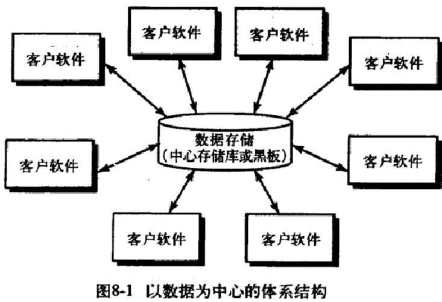

2. 特点:

   - 一些数据(比如一个文件或者数据库)保存在整个结构的中心，并且被其他部件频繁地使用、添加、删除、或者修改

   - 提升可集成性，即现有的构件可以被修改而且新的客户构件可以加入到系统结构中，而无需考虑其他的客户。

   - 数据可以在客户间通过“黑板”机制传送，客户构件独立地执行过程。

3. 优点:

   - 开放: 数据对所有使用者开放

   - 客户构件基本独立

4. 问题:

   - 客户软件**难以协作**

   - 中心数据的格式必须为所有客户软件所接受

#### 12.3.2 数据流体系结构

1. ==数据流体系结构== : 当输入数据经过一系列的计算构件和操作构件的变换形成输出数据时，可应用该体系结构。~~数据流图~~

   - 例如管道—过滤器模式: 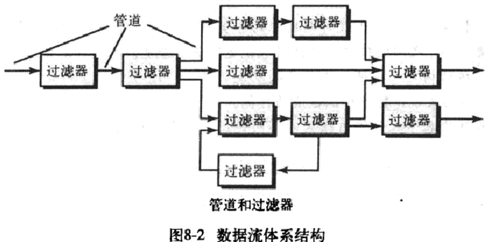

   - 特点:

     - 过滤器没有必要了解与之相邻的其他过滤器的工作

     - 数据需要服从输入 → 变换 → 输出的简单流程

2. 优点:

   - 易于理解

   - 过滤器易于重用

   - 系统易维护

   - 易并行运行

3. 问题:

   - 适用于批处理，不易于交互

   - 流的协作需要考虑

   - 过滤器功能重复

#### 12.3.3 调用和返回体系结构

能够设计出一个相对**易于修改和扩展**的程序结构

存在子风格:

- **主程序/子程序体系结构**

  将功能分解为一个控制层次结构，其中主程序调用一组程序构件，程序构件又去调用别的程序构件

  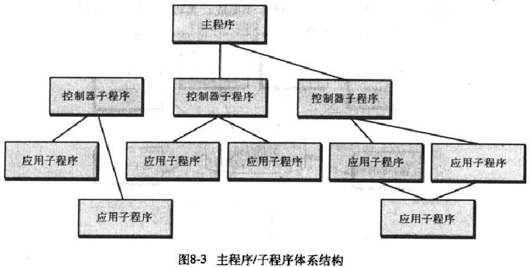

- **远程调用体系结构**

  构件分布在网络的多个计算机上

#### 12.3.3 面向对象体系结构

- 系统的构件封装了**数据**和应用到该**数据上的操作**。
- 构件间通过**消息传递**进行通信与合作。

#### 12.3.4 层次体系结构

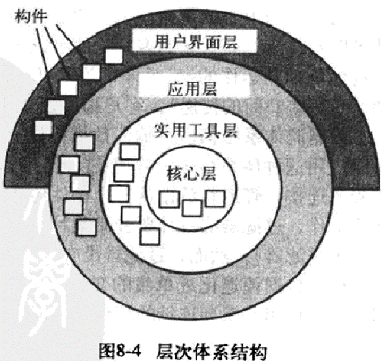

- 定义了不同的层次，各个层次完成各自的操作
- 每一层为上层提供服务，又接受下层的服务

优点:

- 明确的抽象层次，易于增减或修改层次

问题:

- 系统并不是总能分层

### [补充]使用数据流进行体系结构映射

> 唠唠叨叨一大段, 建议直接跳转例子: [出卷系统案例](# 出卷系统案例)

1. 可以定义一些不同的“映射”，利用这些映射可以把**数据流图变换成软件结构**。
2. 两种信息流类型**: 变换型、事务型**。
   - 大型软件系统通常是变换型结构和事务型结构的混合。
   - 通常采用以变换分析为主，事务分析为辅的方式进行软件结构设计。
3. **数据流映射流程**:
   
4. **事务流**
   - 将外部信息转换成一个事务，对事务进行评估，并且根据评估结果，启动其中一条(也可能是若干条)动作路径流。
   - 发出很多动作路径的信息流中心称为事务中心。
   - 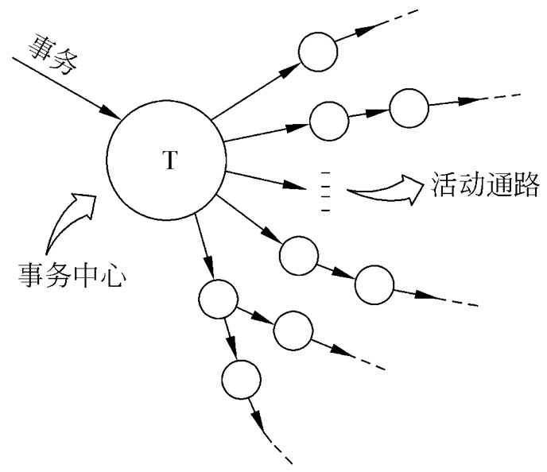
5. 事务映射
   - 步骤:
     (1) 评审基本系统模型；
     (2) 评审和精化软件的数据流图；
     (3) 确定 DFD 含有变换流还是事务流特征；
     (4) 标识事务中心和每条动作路径上的流特征；
     (5) 将 DFD 映射到一个适合事务处理的体系结构上；
     (6) 分解并精化事务结构和每条动作路径的结构；
     (7) 精化第一次迭代得到的体系结构。
   - 

#### 步骤 1: 评审基本系统模型

基本系统模型或者环境图把安全功能描述为一个单一的变换，描述了流入和流出该功能数据的外部生产者和消费者

**求精后的安全功能数据流**

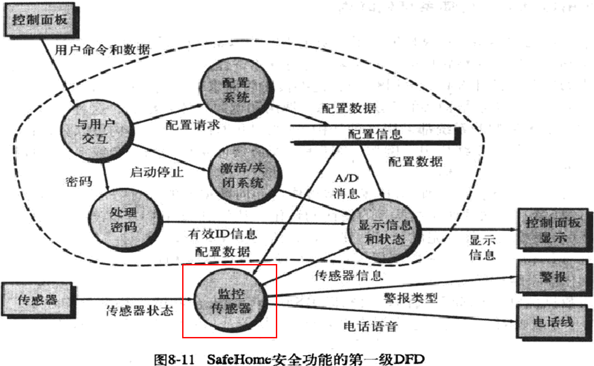

#### 步骤 2: 评审和精化软件的数据流图

对从需求模型获得的信息进行精化，以获得更多的细节。

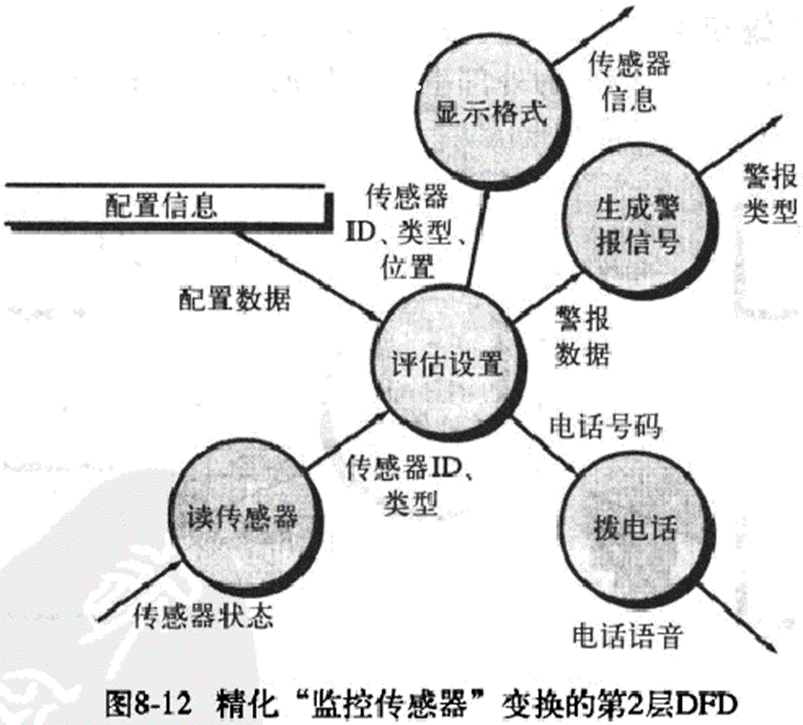

监控传感器的第 3 层 DFD

第 3 层 DFD，数据流图中的每个变换都展示了相对较高的内聚性，即变换所隐含的过程完成单一的、清楚的功能，该功能可以作为构件来实现，所以不需要再进一步精化。

#### 步骤 3: 确定 DFD 是否含有变换流或事物流特征

数据通过一条输入路径进入软件，沿三条输出路径流出。(三条输出路径，而不是选择一条)
因此，信息流将呈现出一个从头到尾的总体变换特征。

#### 步骤 4: 通过确定输入和输出流的边界，分离出变换中心

输入数据流沿着一条路径流动，在该路径上，信息从外部形式转换为内部形式；输出流将内部数据转化为外部形式。
但是输入流和输出流的边界还有待说明，也就是说，不同的设计人员在选择流边界时可能不尽相同。事实上，不同的流边界选择会导致不同的设计方案。尽管在选择流边界时要加以注意，但沿流路径若有一个“泡泡”的差异对最终程序结构的影响并不会太大。本设计步骤的重点在于选择合理的边界，而不是花时间反复考虑边界的位置。
例如，将输入流的边界放置在读传感器和获得响应信息之间也可以

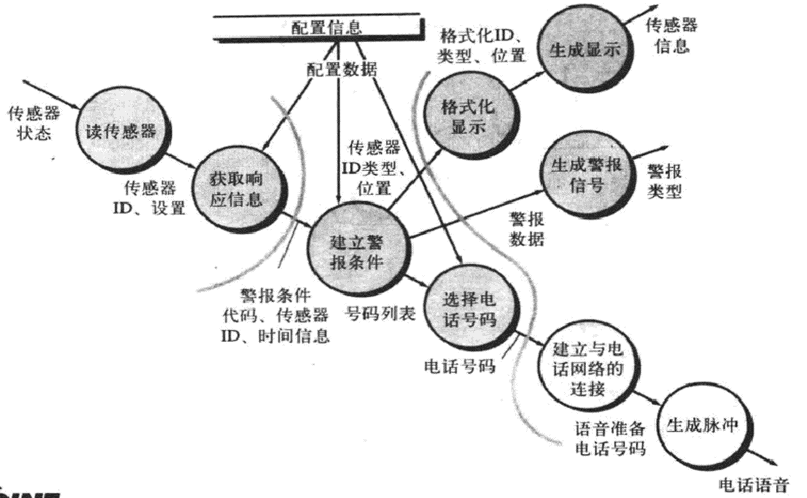

#### 步骤 5: 完成“第一级分解”

使用这个映射导出的程序体系结构导致了自顶向下的控制分布。分解的作用是得到一个程序结构: 其中

- 顶层构件完成决策制定；
- 底层构件完成大多数输入、计算和输出工作；
- 中间层构件完成一部分控制和适度的任务。

当遇到变换流时，DFD 将被映射成一个能为信息的输入、变换和输出处理提供控制的特定结构。

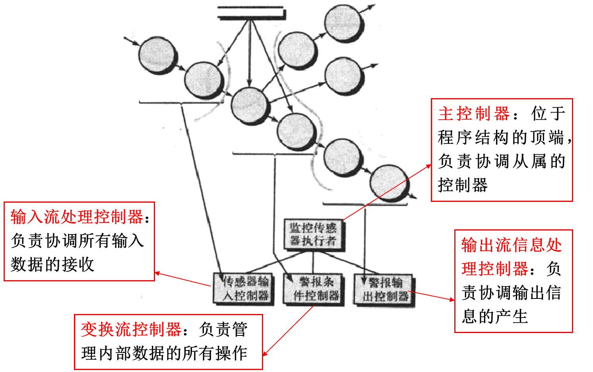

#### 步骤 6: 完成“第二级分解”

第二级分解是将 DFD 中的每个变换(泡泡)映射到体系结构中的相应模块。从变换中心的边界开始，沿输入路径和输出路径向外，将变换依次映射到软件结构的从属层:

- 一对一映射；
- 两个甚至三个泡泡可以合并在一起表示为一个构件；
- 一个单独的泡泡也可以扩展成两个或者多个构件。

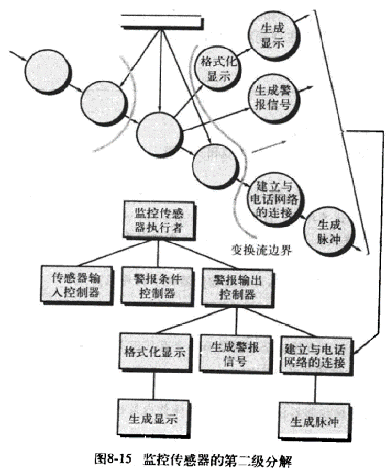

##### 监控传感器第一次迭代结构

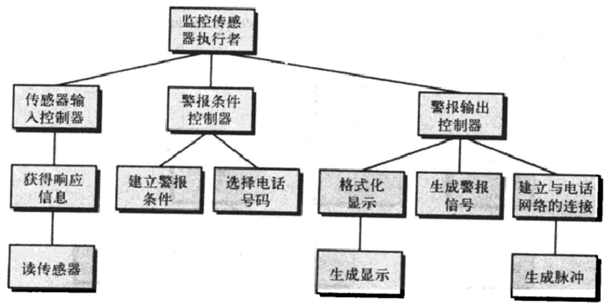

#### 步骤 7

步骤 7: 使用提高软件质量的设计启发式方法，精化第一次迭代得到的体系结构:
应用功能独立性的概念精化第一次迭代得到的体系结构
对构件进行“分解” 或“结合”，可以产生合理的分解、好的内聚性、低的耦合性的构件。最重要的是获得易于实现、测试和维护的程序结构。

##### 精化程序结构

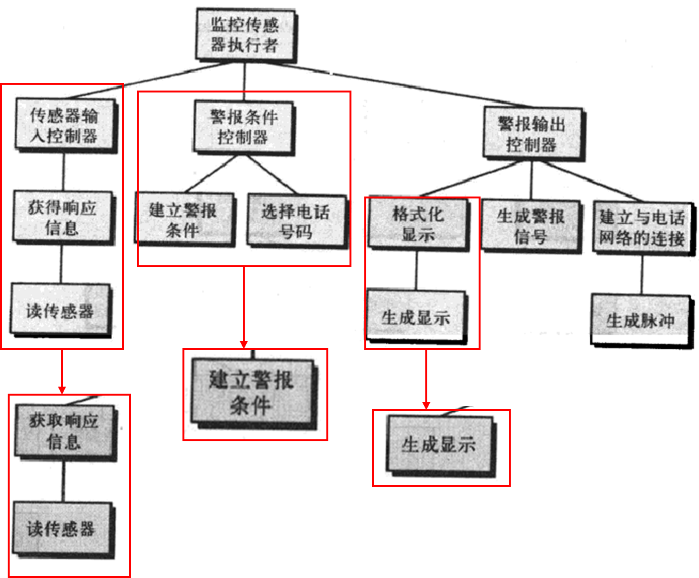

#### 出卷系统案例

回顾:

1. 一层数据流图
   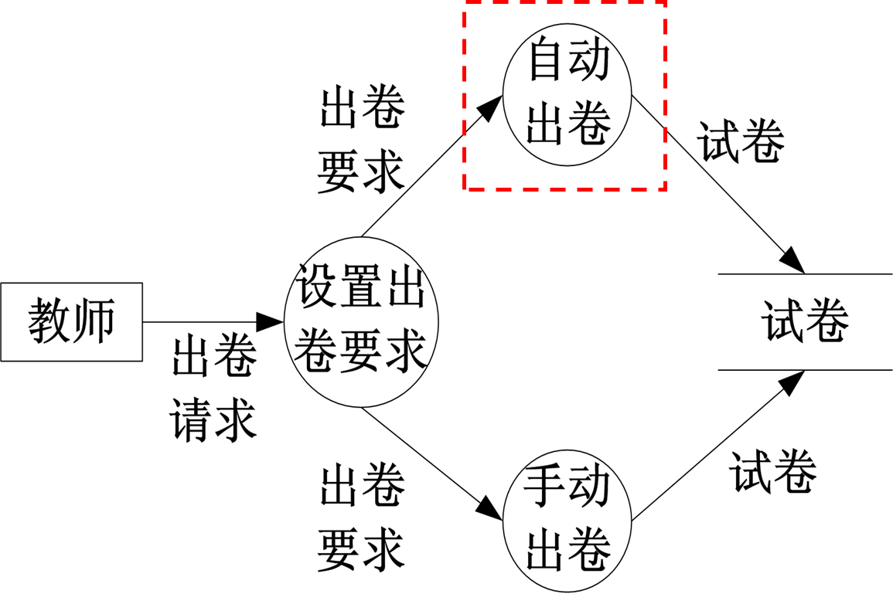

2. 二级数据流图(自动出卷部分)

   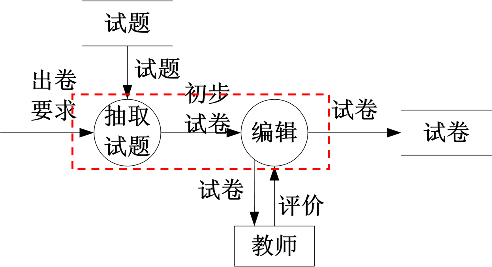

自动出卷系统的体系结构

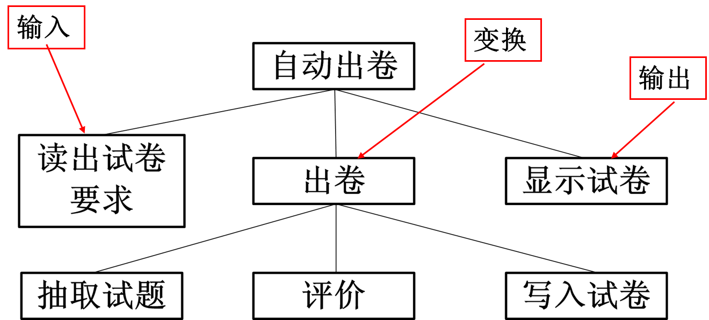

## 六. 基本路径测试

### 6.1 流图

==流图== (或程序图 / 控制流图):

- 一种简单的控制流表示方法；
- **圆**：流图结点，表示一个或多个过程语句。
  - 处理框序列和一个菱形判定框可映射为单个结点(相对于流程图)
- **箭头**：边或连接，表示控制流，一条边必须终于一个节点，即使该结点并不代表任何过程语句。
- 由边和节点限定的区间称为**域**，计算区域时不要忘记区域外的部分，图的外部作为一个域。

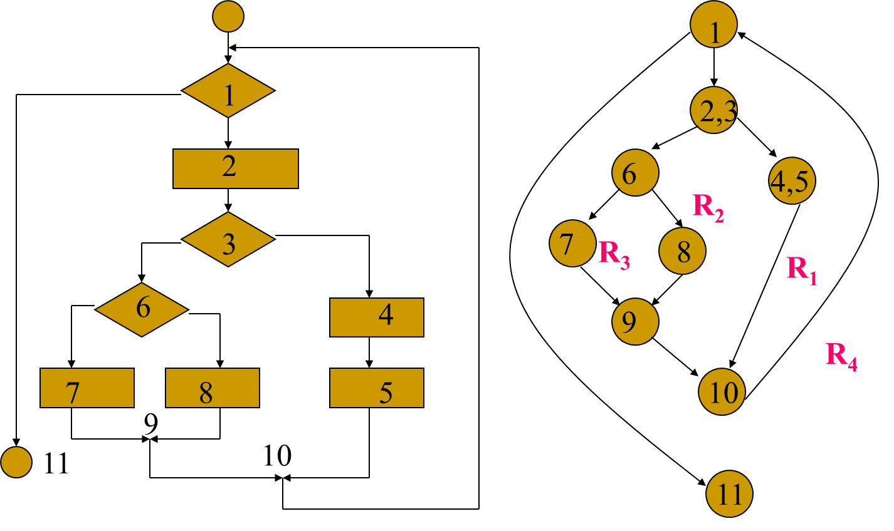

### 6.2 独立程序路径

==独立程序路径== 是任何贯穿程序的，至少引入一组新的处理语句或一个新条件的执行路径。(不能由其它独立路径组合而成)

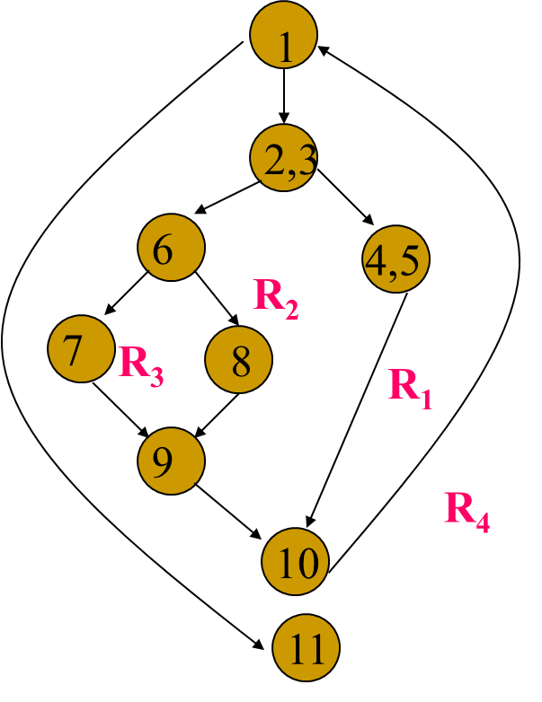

在图示的控制流图中，一组独立的路径是：

- path1：1 - 11
- path2：1 - 2 - 3 - 4 - 5 - 10 - 1 - 11
- path3：1 - 2 - 3 - 6 - 8 - 9 - 10 - 1 - 11
- path4：1 - 2 - 3 - 6 - 7 - 9 - 10 - 1 - 11
- 路径 1 - 2 - 3 - 4 - 5 - 10 - 1 - 2 - 3 - 6 - 8 - 9 - 10 - 1 – 11 不是独立路径。
- 路径 1、2、3 和 4 构成流图的基本集合。若设计测试强迫执行这些路径 (基本集合)，则可以保证程序中的每条语句至少执行一次，且每个条件的取真和取假都被执行。
  基本集合不是唯一的。

### 6.3 环路复杂性

环形复杂度的计算:

1. $流图的区域数=环路复杂度 V(G) = \textcolor{orange}{独立路径数}$

2. $V(G)=E-N+2$

   - E 是流图的边数，N 是流图的节点数

3. $V(G)=P+1$
   - P 为包含在**流图 G**中的判定节点数

### 例题

#### 例 1 ppt

1. 程序结构: 
2. 对应流图: 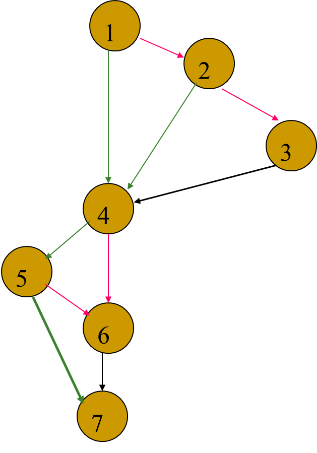 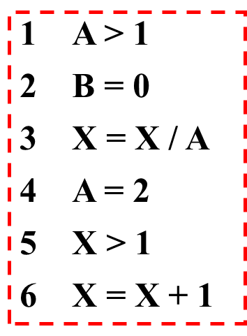

3. 独立路径:
   - 1 - 4 - 5 - 7
   - 1 - 4 - 5 - 6 - 7 (走 5→6)
   - 1 - 4 - 6 - 7 (走 4→6)
   - 1 - 2 - 4 - 6 - 7 (走 1→2)
   - 1 - 2 - 3 - 4 - 6 - 7 (走 2→3)

#### 例 2 csdn

> [软件测试——程序控制流图、McCabe 环形复杂度与独立路径\_mccabe 流图怎么画-CSDN 博客](https://blog.csdn.net/Runner1st/article/details/90514923)

根据程序流程图，完成：
(1) 画出相应的程序控制流图；
~~(2) 给出控制流图的邻接矩阵；~~ 没见过, 就当他不存在吧
(3) 计算 McCabe 环形复杂度；
(4) 找出程序的一个独立路径集合。

1. 画出相应的程序控制流图
   

2. 计算 McCabe 环形复杂度
   一个程序模块的环路复杂度用来衡量模块中判定结构的复杂程度，数量上可以表现为程序控制流图中从开始点到终结点的独立路径条数，相当于合理预防错误所
   需测试的最少路径条数。

   - 计算方法：

   - 单入单出程序控制流图 G 的 McCabe 环路复杂度计算公式：
     V(G) = m - n + 2p
     ◌ m 是 G 的边数目
     ◌ n 是 G 的顶点数目
     ◌ p 是 G 的连通分支数
     简单程序控制流图是连通图，p = 1，此时：
     V(G) = m - n + 2
     G 是平面图时，由欧拉公式，V(G) = R。其中 R 是平面被控制流图划分成的区域数目 (包括外部面)。
     对于简单的单入单出结构化模块，V(G) 值等于程序控制流图中的单条件判断节点的个数 +1。多条件判断条件可以先转化为单条件复合结构再应用本结论。

   - 计算：
     解 1：图中 m = 10，n = 7，故
     V(G) = m - n + 2
     = 10 – 7 + 2
     = 5
     解 2：图是平面的且有 5 个面，故
     V(G) = 5
     解 3：图中有 4 个单条件判定节点 1, 2, 4, 5, 故
     V(G) = 4 + 1 = 5

3. 找出程序的一个独立路径集合
   独立路径：至少沿一条新的边移动的路径。对所有独立路径的遍历使得程序
   中的所有语句至少被执行一次。
   - 5 条独立的基本路径：
     1-2-3-4-5-6-7
     1-3-4-5-6-7 (走 1→3)
     1-2-4-5-6-7 (走 2→4)
     1-2-3-4-7 (走 4→7)
     1-2-3-4-5-7 (走 5→7)

## 七. 评审技术

> Ctrl+F 评审: 只找到体系结构评审 还只有一小段话
>
> 真没活了
>
> 希望大佬补充(PR)

#### 体系结构评审

一种特定的技术性评审，提供了一种评估方法，该方法可以评估软件体系结构满足系统质量需求的能力和识别任何潜在风险的能力。

往往只设计软件工程团队成员

评审技术:

- 基于经验的推理
- 原型评估
- 情境评审
- 检查单的使用

## 八. 挣值分析

> ==挣值分析== 是在软件小组按项目进度表工作时，定量分析项目进展的技术
>
> - 围绕着 BCWP 计算?
> - 可以跳过一堆絮絮叨叨的文字, 看咱写的[表格](# 表格整理)

按如下步骤确定挣值

1. 为进度表中的每一个工作任务确定其**预计工作的预算成本**（BCWS, Budgeted Cost of Work Scheduled）

   - 一个工作任务有一个 BCWS
   - 特定时间点 t 的 BCWS 值是在项目进度表中，该时间点应该完成的所有工作任务的**BCWS 值之和**

2. 将所有 BCWS 值加起来，可计算出**工作总预算**（BAC, Budget At Completion）

3. 计算**已完成工作的预算成本**（BCWP, Budgeted Cost of Work Performed，也称 Earned Value 挣值），即该时间点已经实际完成的所有工作任务的 BCWS 的和

4. **进度情况**评估:

   - BCWP–BCWS

     - **进度执行指标** $SPI=BCWP/BCWS$
       - 效率指标，越接近 1.0 则效率越高
     - **进度偏差** $SV=BCWP-BCWS$
       - 表示与计划进度的偏差

   - BAC 相关
     - **预计完成百分比** $BCWS/BAC$
       - 表示在时间点 t 应该完成工作的百分比值
     - **(实际)完成百分比** = $BCWP / BAC$
       - 表示在特定时间点 t 实际完成工作的百分比值
   - **特定时间实际完成工作的百分比值**: BCWS/BAC(注意这里的 BCWS 和上面的不一样)

5. **预算准确性**评估

   - **已完成工作的实际成本 ACWP**

   - **成本执行指标**$CPI=BCWP/ACWP$
     - CPI 越接近 1.0 表示项目与预算越接近
   - **成本偏差**$CV=BCWP-ACWP$
     - 表示在项目特定阶段的成本节省或短缺

#### 表格整理

|                | 解释                                  | 名称                     | 英文                                                              | 计算式                                                                                |
| -------------- | ------------------------------------- | ------------------------ | ----------------------------------------------------------------- | ------------------------------------------------------------------------------------- |
| 预算相关       | 表格给出 or 简单 sum                  | 预计工作预算成本         | **BCWS** Budgeted Cost of Work Scheduled                     | 两种 任务的 BCWS: 题目给出 特定时间点的 BCWS: $\sum$当前时间点前任务的 BCWS |
|                |                                       | 工作总预算               | **BAC**  Budget At Completion                                | $\sum$所有任务的 BCWS                                                                 |
|                |                                       | 已完成工作预算成本(挣值) | **BCWP / EV **Budgeted Cost of Work Performed / Earned Value | $\sum$已完成任务的 BCWS                                                               |
| 进度评估       | BCWP&BCWS 相关                        | 进度执行指标             | **SPI**  Schedule Performance Index                          | $SPI = \frac{BCWP}{BCWS}$                                                             |
|                |                                       | 进度偏差                 | **SV** Schedule Variance                                     | $SV=BCWP-BCWS$                                                                        |
| 进度评估       | BAC 相关 BAC 都在下              | 预计完成百分比           | -                                                                 | $=\frac{BCWS}{BAC}$                                                                   |
|                |                                       | (实际)完成百分比         | -                                                                 | $=\frac{BCWP}{BAC}$                                                                   |
| 预算准确性评估 | BCWP&ACWP 此处才开始用到实际成本 | 已完成工作的实际成本     | **ACWP** Actual Cost for Work Performed                      | $\sum$当前时间点前完成的任务的实际成本                                                |
|                | ACWP 都在后 or 下                     | 成本执行指标             | **CPI** Cost Performance Index                               | $CPI=\frac{BCWP}{ACWP}$                                                               |
|                |                                       | 成本偏差                 | **CV** Cost Variance                                         | $CV=BCWP-ACWP$                                                                        |

- 前缀: B: Budgeted, 预计; A: Actual, 实际
- 后缀: S: Schedule, 计划(进度); P: Performed, 执行; I: Index, 指标(比例)

#### 例题

假设你是一个软件项目管理者，受命为一个小型软件项目进行挣值统计。这个项目共计划了 56 个工作任务，估计需要 582 人日才能完成，但是，按照项目进度，现在应该完成 15 个任务，下面 (在下一页中) 给出相关进度安排数
据 (单位: 人日)，请你做出挣值分析。计算该项目的进度表执行指标 SPI、进度偏差 SV、预定完成百分比、完成百分
比、成本执行指标 CPI 和成本偏差 CV。

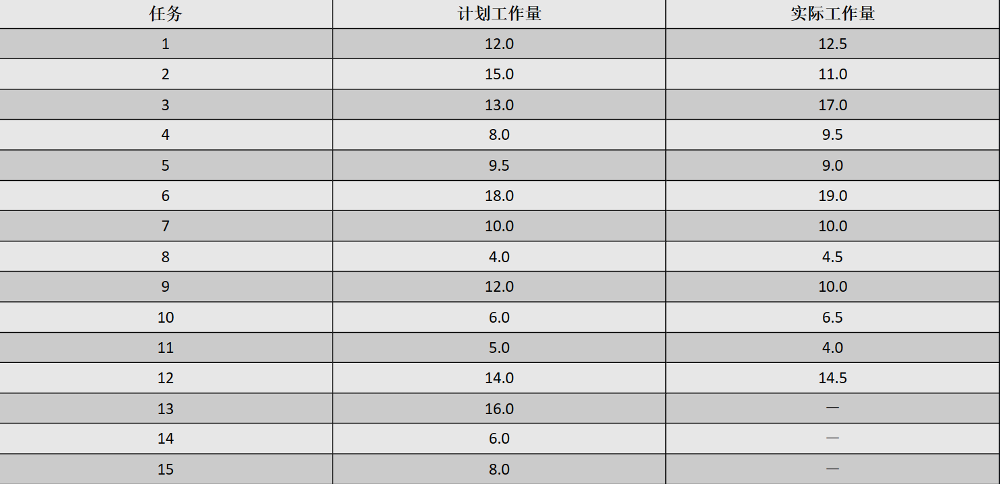

- 计划完成任务 BCWS =12+15+13+8+9.5+18+10+4+12+6+5+14+16+6+8=155.5(人日)
- 实际完成任务 BCWP = 12+15+13+8+9.5+18+10+4+12+6+5+14=125.5(人日)

- 进度执行指标 SPI =BCWP/BCWS= 125.5 /155.5=0.81
- 进度偏差 SV =BCWP-BCWS=125.5-155.5=-30(人日)
- 预定完成百分比 =BCWS/BAC=155.5/582=26.7%
- 完成百分比 =BCWP/BAC=125.5/582=21.6%

- 已经完成任务 ACWP =12.5+11+17+9.5+9+19+10+4.5+10+6.5+4+14.5=127.5(人日）
- 成本执行指标 CPI =BCWP/ACWP=125.5/127.5=0.98
- 成本偏差 CV =BCWP-ACWP=125.5-127.5=-2 (人日)

## 九. 风险管理

> 不知道考什么 等做了题再返工

> 更新 更不知道了 这玩意真能考吗

# 公式整理

> 索引参考[软件工程](# ./软件工程.md)的位置

## 第 18 章 测试传统的应用软件

#### 18.4.3 环路复杂性

环形复杂度的计算:

1. $流图的区域数=环路复杂度 V(G) = \textcolor{orange}{独立路径数}$

2. $V(G)=E-N+2$

   - E 是流图的边数，N 是流图的节点数

3. $V(G)=P+1$
   - P 为包含在流图 G 中的判定节点数

- ↑V(G)的值提供了组成基本集合的独立路径的上界，并由此得出覆盖所有程序语句所需设计和运行的测试数量的上界

#### 18.7.2 分别测试法

> 比~~标记重捕法~~错误播种法难一点, 多看一眼吧

设 1 组发现了 x 个错误，2 组发现了 y 个错误，其中 q 个错误由**两组共同发现**。

则每一组的有效性可以计算如下：

$E_1 = x/N, E_2=y/N$

- N 是程序的总错误数。
- 需要估计 N。

假设： 组 1 发现所有错误的效率不变

设组 1 发现了 25 个错误，组 2 发现了 30 个错误，其中 15 个错误被两组同时发现：
x = 25, y = 30, q = 15

E1 = 15 / 30 = 0.5, E2 = 15 / 25 = 0.6
则 N = 15 / (0.5 \* 0.6) = 50 个错误

## 第 23 章 过程度量和项目度量

#### 23.2.1 面向规模(LOC)的度量

1. ==面向规模的软件度量== 是基于所开发的软件的“规模” 。
   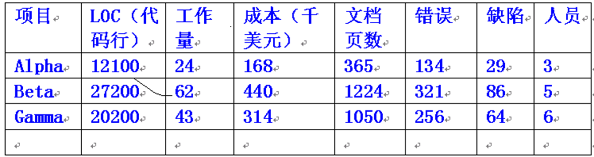

2. 需要注意的是，在表格中记载的工作量和成本是整个软件开发的活动(分析、设计、编码和测试)，而不仅仅是编码活动。
   - 对于每一个项目，可以根据表格中列出的基本数据计算简单的面向规模的生产率和质量的度量：
   - 生成率 ＝ KLOC／PM(人月)
   - 质量 ＝ 错误数／KLOC
   - 成本 ＝ 元／LOC
   - 文档 ＝ 文档页数／KLOC

#### 23.2.2 面向功能(FP)的度量

1. 面向功能的软件度量使用软件所提供的功能的测量作为规范化值。因为“功能”不能直接测量，所以必须通过利用其它直接的测量来间接地导出。面向功能度量是由 Albrecht 首先提出来的，他建议一种称为==功能点== (Function Point, FP)的测量：
   - 功能点是基于软件信息域的特性及软件复杂性的评估而导出的
   - 主要考虑程序的“功能性”和“实用性”，而不是对 LOC 计数
   - 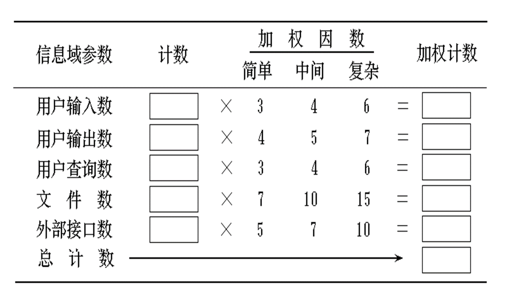
2. 功能点计算：
   - **用户输入数**：面向应用的输入数据,包括对话框、屏幕信息、控件等；
   - **用户输出数**：面向应用的输出信息，包括报告、屏幕信息、错误信息等；
   - **用户查询数**：查询是一种联机的交互操作，每次询问/响应应计数：输入/输出的简单组合；
   - **文件数**：每一个逻辑主文件都应计数；
   - **外部接口数**：与系统中其他设备通过外部接口读写信息的计数
   - 计算功能点，使用如下关系式：$FP ＝ 总计数 × ( 0.65+ 0.01\sum (Fi))$
     - $\sum(Fi)$是求和函数(对 14 个问题进行打分)
     - Fi(i ＝ 1…14)是**复杂性校正值**，取值 0-5：0 没有影响；1 偶然的；2 适中的；3 普通的；4 重要的；5 极重要的

### 23.3 软件质量评估

1. ==缺陷排除效率 DRE==
   - 缺陷排除效率(DRE)是对质量保证及控制活动中滤除缺陷能力的一个测量，这些活动贯穿于所有过程框架活动。
   - 当把项目作为一个整体来考虑时，DRE 按如下方式定义：$DRE = E /(E ＋ D)$
     - E = 软件交付**之前**所发现的错误数
     - D= 软件交付**之后**所发现的缺陷数
   - 最理想的 DRE 值是 1，即，软件中没有发现缺陷。现实中，D 会大于 0，但随着 E 值的增加，DRE 的值仍能接近 1。
     事实上，随着 E 的增加，D 的最终值可能会降低(错误在变成缺陷之前已经被过滤)。
   - 如果将 DRE 作为一个度量，提供关于质量控制和保证活动的过滤能力的指标，则 DRE 鼓励软件项目组采用先进技术，以在交付之前发现尽可能多的错误。
2. 传递的 DRE
   - DRE 也能够用于在项目中评估一个团队在错误传递到下一个框架活动或软件工程任务之前发现这些错误的能力。
     - 例如，在对需求模型的评审中未被发现的错误会传递给设计任务。在这种情况下，我们将 DRE 定义$DRE*i = E_i / ( E_i + E*{i+1} ) $
     - $E_i$ = 软件工程活动 i 中所发现的错误数
       $E_{i+1}$ = 软件工程活动 i+1 中所发现的错误数，这些错误起源于软件工程活动 i 中未能发现的错误。
   - 一个软件项目组（或单个软件工程师）的质量目标是使$DRE_i $接近 1，即，错误应该在传递到下一个活动之前被过滤掉。

## 第 24 章 软件项目估算

==人月== (person month, pm):

- 一个表示**劳动时间**的计量单位
- 指一个人工作一个月的时间
- 是工作量的计量单位, 用于工作量计算

### 24.5 软件项目估算

#### 经验估算模型

==经验估算模型== 可以作为分解技术的补充

一个基于经验 (历史数据)的模型形式如下：

- $d = f ( v_i )$
- d 是很多估算值 (例如，工作量、成本、项目持续时间)中的一种
- v~i~是所选的独立参数 (例如，被估算的 LOC 或 FP)。

每种可行的软件成本估算方法，其效果的好坏取决于估算所使用的**历史数据**。如果没有历史数据，成本估算就建立在了不稳定的基础上。

### 24.6 分解技术

#### 24.6.2 基于问题的估算

**计算三点估算**(综合不同的估计结果)：

- 先确定规模的乐观值 (Sopt)、可能值 (Sm)和悲观值 (Spess)，再将它们结合起来 (加权平均)
- 期望值$S = (S_{opt} + 4S_m + S_{pess}) / 6$
- 假定实际的规模结果落在乐观值与悲观值范围之外的概率很小

#### 24.6.3 基于 LOC 的估算

1. 例: 考察为机械零件计算机辅助设计 (CAD)应用系统开发的软件包。该软件将在工程工作站上运行，且必须与各种计算机外部绘图设备有接口，包括鼠标、数字化仪、高分辨率彩色显示器和激光打印机。可以给出初步的软件范围陈述：
   - 机械 CAD 软件接受工程师输入的二维或三维几何数据。
   - 工程师通过用户界面与 CAD 系统进行交互并控制它，该用户界面应表现出良好的人机界面设计特征。
   - 所有的几何数据和其他支持信息都保存在一个 CAD 数据库中。
   - 开发一些设计分析模块，以产生所需的输出，这些输出要显示在各种不同的图形设备上。
   - 软件必须设计成能够控制外部设备(包括鼠标、数字化仪、激光打印机和绘图机)，并能与外部设备进行交互。
2. 估算: 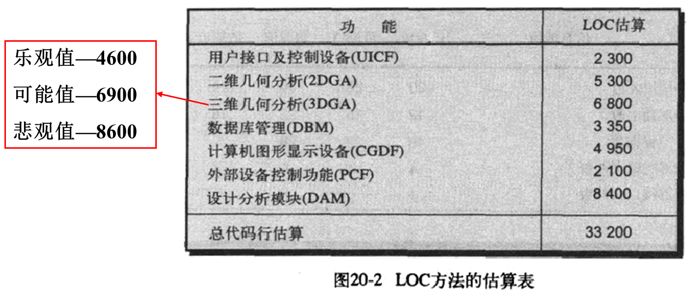
3. 回顾历史数据
   - 此类系统的平均生产率 = 620 LOC/pm
   - 一个劳动力每月成本 = \$8000
   - 则每行代码成本 = \$8000/ 620 = \$13 ；
4. 根据 LOC 估算及历史生产率数据
   - 该项目总成本估算值 = 33 200 \* \$13 = \$431,000
   - 工作量估算值是 = 33 200 / 620 = 54 人月

#### 24.6.4 基于 FP 估算

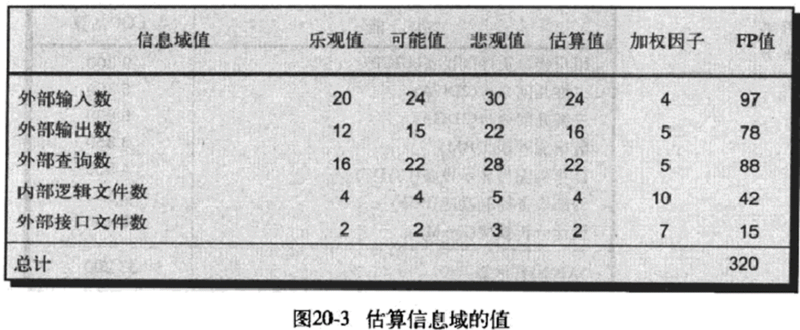 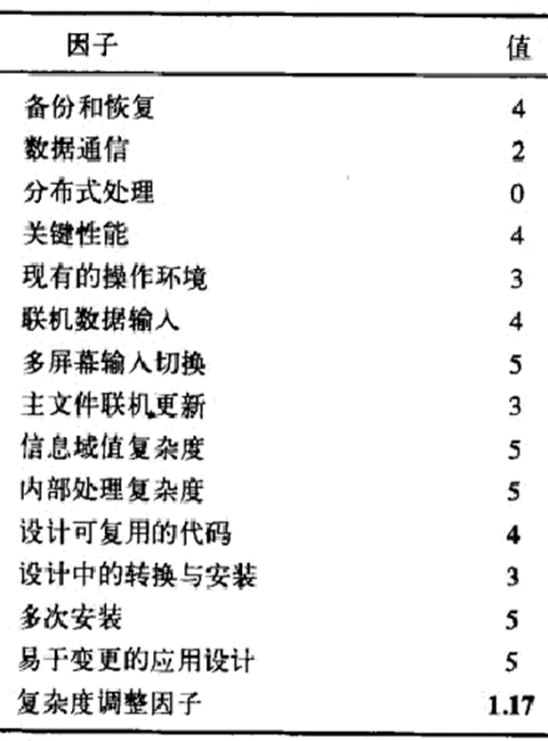

- FP 的估算值：$F_{Pestimated} = 总计数 * [0.65 + 0.01 × Σ(Fi)] = 320 * 1.17 = 375$

  - FP 估算法有一个计算公式，如下
    $FP=UFC*TCF$

    - UFC 即 Unadjusted Function Point Count,意为未调整的功能点数

      - 即$总计数$

    - TCF 即 Technical Complexity Factor，意为技术复杂度因子

    - TCF 的取值范围是 0.65~1.35 之间，换个意思也就是说它是对 UFC 进行调整，范围是正负 35%。

    - > 这个公式网上 CV 的, 可以不用记, 理解一下即可, 主要还是 0.65

- 假设此类系统的平均生产率 = 6.5 FP/pm

- 劳动力价格 = \$8000 per month, 每个 FP 的成本约为 \$8000 / 6.5 = \$ 1230；

- 根据 FP 估算和历史生产率数据，项目总成本估算为\$1230 \*375 = \$461,000 ，项目工作量估算为 58 人月= (375 / 6.5) 或 (461,000 / 8,000)。

#### 24.6.6 基于用例的评估

##### 计算公式

$LOC_{估算} = N*LOC_{avg} + [(s_a/s_h-1)+(p_a/p_h-1)] * LOC_{adjust}\\LOC_{估算}=LOC_{avg}*(N + [(s_a/s_h-1)+(p_a/p_h-1)]*n\% )$

- N：实际用例数
- $LOC_{avg} $: 历史平均LOC值
  $LOC*{adjust}$: 调整值，以$LOC*{avg}$的 n% 来表示, 即$LOC*{adjust}=LOC*{avg}\*n\%$
  - n 的值根据当前项目的情况来确定，表示该项目与“一般”项目的差异
- sa: 每个用例的实际场景数
  sh: 该类型子系统中，每个用例的历史平均场景数
- pa: 每个用例的实际页数
  ph: 该类型子系统中，每个用例的历史平均页数

##### 例

CAD 软件包括 3 个子系统组：用户界面子系统、工程子系统组以及基础设施子系统组。

- $LOC_{估算}=LOC_{avg}*(N + [(s_a/s_h-1)+(p_a/p_h-1)]*n\% )$
- $LOC_{估算}(用户界面子系统) = 560 * (6 + [(10/12-1) + (6/5-1)] * 30\%)$
- $LOC_{估算}(工程子系统组) = 3100 * (10+ [(20/16-1) + (8/8-1)] * 30\%)$
- $LOC_{估算}(基础设施子系统组) = 1650 * (5+ [(6/10-1) + (5/6-1)] * 30\%)$

### 24.7 经验估算模型

#### 24.7.1 估算模型的结构

1. 典型的估算模型是通过对软件项目中收集的数据进行**回归分析**而导出的。
2. 模型的总体结构：$E = A + B \* (e_v)^C $
   - E 为工作量(人月)
   - A、B、C 为经验常数，ev 为估算变量(LOC 或 FP)
   - $E = 5.2 * (K_{LOC})^{0.91}$ Walston-Felix 模型
   - $E = 5.5 + 0.73*(K_{LOC})^{1.16}$ Bailey-Basili 模型
   - $E = -91.4 + 0.355 * FP$ Albrecht 和 Gaffney 模型
   - $E = -12.88 + 0.405 * FP$ 小型项目回归模型

#### 24.7.2 COCOMO Ⅱ 模型

##### 对象点的计算

1. 与功能点一样，**对象点**也是一种**间接的软件测量**。
2. 计算对象点时，使用如下计数值：(1) (用户界面的) **屏幕数**；(2) **报表数**；(3) 构造应用系统可能需要的**构件数**。
3. **复杂度**分为 3 个等级 (即简单、中等或困难)，将每个对象实例 (例如，一个屏幕或一个报表)分别归类到一个等级上。
4. 一旦确定了复杂度，就对屏幕、报表和构件的数量进行加权。
5. 首先将初始的对象实例数与表中的加权因子相乘就确定了对象点数，求和后就得到了总的对象点数。
   - 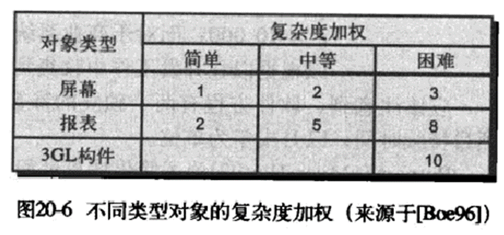

##### COCOMO II 模型工作量计算步骤

1. 当采用基于构件的开发或一般的软件复用时，还要估算复用的百分比，并调整对象点数：
   - $新对象点 = 对象点 * (1-复用率)$
2. 必须先确定“生产率”的值。如下表：
   - 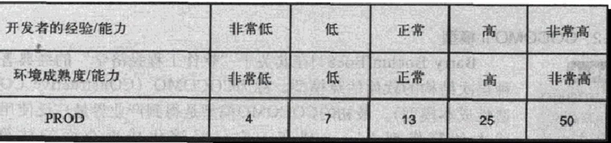
3. 根据计算得到的新对象点值进行工作量估算：$估算工作量 = 新对象点 / 生产率$

##### 例

使用 COCOMO II 模型来估算构造一个困难的 ATM 软件所需的工作量，它产生 12 个屏幕、10 个报表，将需要大约 80 个软件构件。假定该软件具有困难复杂度和平均开发者/环境成熟度。要求使用基于对象点的应用组装模型计算工作量。

- 对象点 = 12 × 3 + 10 × 8 + 80 × 10 = 916
- 工作量 = 对象点 / 生产率 = 916 / 13 = 71 /人月

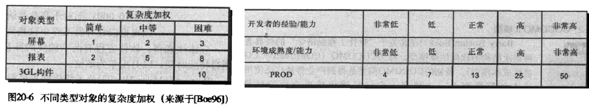

#### 24.7.3 软件方程

> ~~这么复杂一方程 背还不如杀了我~~
>
> 要不然定性分析一下得了

1. 软件方程是一个动态的多变量模型，它假定在软件开发项目的整个生命周期中有特定的工作量分布。
2. $E = [\frac{LOC * B^{0.333}} {P^3}] * \frac1  {t^4}$
   - E 为工作量，以人月或人年为单位
   - t 为项目持续时间，以月或年为单位
   - B 是特殊技能因子，对于较小的程序 (KLOC = 5 ~ 15)，B = 0.16；对于超过 70 KLOC 的较大程序，B = 0.39。
   - P 是生产率参数，反映了：总体的过程成熟度及管理实践；采用良好的软件工程实践的程度；使用的程序设计语言的水平；软件环境的状态；软件团队的技能和经验；应用系统的复杂性。
   - 对于实时嵌入式软件的开发，典型值是 P = 2000；对于电信及系统软件，P = 10000；而对于商业系统应用，P = 28000。
3. 为了简化估算过程，并将估算模型表示成更通用的形式，对软件方程式进行推导，可得到：
   - $t_{min} = 8.14(LOC/P^{0.43})$，以月为单位，用于 tmin >6 个月的情况 (tmin 为最短开发时间)
   - $E = 180 B t^3$ ，以人月为单位，用于 E >=20 人月的情况，这里 t **单位为年**
4. CAD 软件的例子，令 P = 12000 (对科学计算软件的推荐值)：
   tmin = 8.14 _ (33200 / 120000.43) = 12.6 (月)
   E = 180 _ 0.28 \* 1.053 = 58 (人月)

## 第 25 章 项目进度安排

### 工作量

#### PNR 曲线

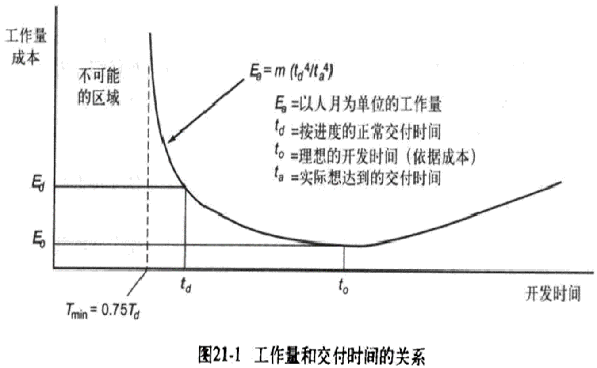

#### 人员与工作量的关系

- 交付的代码 (源程序代码)行数 L 与工作量和开发时间的关系可以用下面的公式表示：
  $L = P * E^{\frac13} * t^{\frac43}$

  - E 是以人月为单位的开发工作量；
    - 人月: "人月"是软件开发项目中用来度量开发工作量的单位，表示一个人工作一个月的时间
  - P 是生产率参数，P 通常取值在 2000 到 12000 之间；
  - t 是以月为单位的项目工期。

- 重新调整软件方程，可以得到开发工作量 E 的计算公式：
  $E = L^3 / (P^3t^4)$

  - E 是在软件开发和维护的整个生命周期内所需的工作量 (按人年计算)；
  - t 是以年为单位的开发时间；

- 通过计算可以得知: 通过在**略为延长的时间**内使用**较少的人员**，可以实现**同样的目标**

  - > 假设有一个复杂的实时软件项目，估计需要 33 000 行源代码和 12 人年的工作量。如果项目团队有 8 个人，那么项目大约需要 1.3 年的时间完成。但是如果将交付日期延长到 1.75 年，则得出以下结论：
    > E = 3.8 人年
    > 这意味着通过将交付日期推迟 6 个月，我们可以将项目团队的人数从 8 人减少到 4 人！

#### 工作量分配

- $工作量的分配: 40\%(前期的分析和设计)+20\%(编码)+40\%(后期测试)$
- 这种工作量分配方法只能作为指导原则。各个项目的特点决定了其工作量如何分配：
  - 用于项目计划的工作量很少超过 2%-3%。
  - 客户交流与需求分析大约占用 10%-25%的项目工作量。
  - 通常有 20%-25%的工作量用于软件设计。
  - 15%-20%就可以完成编码工作。
  - 测试和调试将占用 30%-40%的工作量。

### 挣值分析 ※

见[八. 挣值分析](# 八. 挣值分析)

## 第 26 章 风险管理

#### 26.4.2 评估风险影响

1. ==风险显露度== (risk exposure, RE)
   - $RE = P * C$
   - P 是风险发生的概率
   - C 是风险发生时带来的项目成本；
2. 例如，假设软件团队按如下方式定义了项目风险：
   - ==风险识别== 。计划**可复用**的软件构件中只有**70%**将集成到应用系统中，其他功能必须定制开发。
   - ==风险概率== 。80%
   - ==风险影响== 。计划了 60 个可复用的软件构件，如果只能利用 70%，则 18 个构件必须从头开发。平均每个构件的程序行数是 100 LOC，本地数据表明每个 LOC 的软件工程成本是 14.0，开发构件的总成本将是 $C = 18 * 100 * 14 = 25200$
   - ==风险显露度== 。$RE = 0.8 * 25200 = 20200$
3. 项目团队应该定期复查风险表，重新评估每一个风险，以确定新环境是否引起其概率和影响发生改变。
   这样可能需要在风险表中添加一些新的风险，删除一些不再有影响的风险，或改变一些风险的相对位置。

# 名词解释

> 自己凭感觉的, 完全没有依据, 参考价值不高

## 第 1 章 软件的本质

1. ==软件== 是一组**要素**的集合，教科书给软件的定义:

   - 指令的集合(计算机**程序**)，通过执行这些指令可以满足 预期的特征、功能和性能需求,

   - 数据: 使程序能够适当地**处理信息**的数据结构

   - 软件描述信息(**文档**) ，用来描述程序操作和使用

2. ==遗留软件== : 使用了很长时间，由于使用者不愿更换，仍然在使用的系统

## 第 2 章 软件工程【概述】

1. 软件工程的层次

   - 软件工程是一种层次化的技术，自下而上分为: 质量关注点 → 过程 → 方法 → 工具

   - 
   - 支持软件工程的**根基**在于**质量关注点**
   - 基础是**过程层**，**过程**定义了一个框架，给出了开发步骤
   - **_方法_**为构建软件提供技术上的解决方法，为构建软件提供技术上的解决方法(如何做)，包括沟通，需求分析，设计建模、编程、测试和技术支持
   - **工具**为过程和方法提供自动化或半自动化的支持

2. 软件过程

   - ==过程== 是事情进行或事物发展所经过的顺序。
   - 软件开发中所遵循的路线图就称为**“软件过程”**

3. 过程框架

   - ==过程框架== 定义了若干个**框架活动**，为实现完整的软件工程过程建立了基础，每一个**活动**由一组**软件工程动作**组成，每一个动作都包括一系列相互关联的可考核的**任务**

     - $过程框架\begin{cases}框架活动1\begin{cases}软件工程动作1\begin{cases}任务1\\任务2\\...\end{cases}\\软件工程动作2\\...\end{cases}\\框架活动2\\...\end{cases}$

     - **过程**(框架): 工作产品构建时所进行的一系列活动、动作和任务的集合

     - (框架)**活动**: 主要实现宽泛的目标，与应用领域，项目大小，结果复杂性或者实施软件工程的重要程度没有直接关系

     - (软件工程)**动作**: 包含了主要工作产品生产过程中的一系列任务

     - **任务**: 关注小而明确的目标，能够产生实际产品(e.g 构建一个单元测试)

4. ==通用过程框架== –五个最基本的框架活动:
   - 沟通: 目的是理解甲方项目目标, 收集需求
   - 策划: 也叫**软件项目计划**, 定义&描述软件工程工作
     - 包括**技术任务**, **风险**, **资源**需求, 工作**产品**, 工作**进度**计划
   - 建模: 需求建模&对应的软件设计
   - 构建: 编码+测试
   - 部署

## 第 3 章 软件过程结构

1. ==过程== : 在工作产品构建过程中所需完成的**工作活动、动作和任务的集合**。这些活动、动作、任务中的每一个都隶属于某一框架或者模型，框架或模型定义了他们与过程之间或者相互之间的关系

2. ==过程框架== ≈==过程模型==

   - 定义了**活动, 动作和任务**与**过程**之间的关系

   - 过程中的 活动、动作、任务中的每一个都隶属于某一框架或者模型

   - > 重新定义一遍 我也不知道为什么

3. ==过程流== : 描述了在**执行顺序和执行时间**上如何组织框架中的活动、动作和任务
   - 线性: 字如其名
     - 
   - 迭代: 在执行下一个活动前重复执行之前的一个或多个活动
     - 
   - 演化: 采用循环的方式执行各个活动，每次循环都能产生更为完善的软件版本(增量交付)
     - 
   - 并行: 将一个或者多个活动与其他活动并行执行
     - 

## 第 4 章 过程模型

> 看前面吧: [过程模型](# 一. 过程模型)

1. ==瀑布模型== 又称==经典生命周期== ，它提出了一个传统的、顺序的软件开发方法，即从用户需求规格说明开始，顺序地通过沟通、策划、建模、构建和部署过程，最终提供完整软件和持续技术支持。
2. ==增量过程模型== : 为用户迅速提供一套功能有限的软件产品，在后续版本中再进行细化和扩展功能
3. ==演化模型== : **迭代的过程模型**，每次迭代产生软件的一个更完整的版本

4. ==原型开发== :

5. ==螺旋模型== : 采用循环的方式，逐步加深系统定义和实现的深度(原型开发的迭代性质)

6. ==统一过程== : 用例驱动，以架构为核心，迭代并且增量

## 第 5 章 敏捷开发

1. ==敏捷开发== : 是一种软件开发方法论，可以应对客户快速变更的需求，它强调以人为核心，采用迭代的方式，循序渐进的开发软件

2. 敏捷过程: 基于==敏捷原则== 进行的软件开发过程，视为==敏捷过程==

   - 【注】**基于**: 指充分考虑，而不是全部包含

3. ==极限编程== (E**x**treme **P**rogramming, XP): 敏捷软件开发中使用**最广泛**的敏捷过程

   - 特点:

     - 是一些相互关联的准则和惯例的集合

     - 追求变更曲线的平坦化

     - 适合于小团队，高风险的项目

4. Scrum:
5. 动态系统开发 DSDM:
   - 提供一种框架，使其“通过在可控项目环境中使用增量原型开发模式来满足对时间有约束系统的构建和维护”
   - 特点: 每一个迭代都遵循**80%**原则，即每个增量只完成能够保证顺利进入下一增量的工作，剩余的细节则可以在知道更多业务需求或者提出并同意变更之后完成。

## 第 7 章 理解需求

1. 两种需求过程:

   - **瀑布式需求**
     项目早期完全确定需求
   - **进化式需求**
     结合迭代开发，持续地寻找、记录、组织和跟踪不断变更的需求

2. **两种需求文档**:

   1. **需求定义**: 客户要求的完整列表(对外)

      - 通常是由客户和需求分析师一起编写，是开发人员对系统功能的一个合同，主要给**客户**阅读

   2. **需求规格说明**: 要构建系统的规格化说明(对内)

      - 由需求分析师编写，并由其他**软件开发人员**使用

      - **==软件需求规格说明== SRS**: 详细描述软件各个方面的文档

3. **用户场景**
   - ==场景== : 通常称为==用例== ，它提供了将如何使用系统的描述 (类似于举例)
   - ==用例== : 从最终用户的角度描述了软件或系统
   - ==用例== : 帮助定义系统之外存在什么以及系统应该完成什么，即用例从某个特定参与者的角度出发，采用简明的语言描述一个特定的使用场景(来自 8.2 基于场景建模)

## ? 数据建模

1. ==数据建模== : 定义在系统内处理的所有**数据对象**、数据对象之间的**关系**以及其它与这些关系相关的信息。
2. ==数据对象==
   - 任何必须被软件理解的**复合信息**的表示
   - 复合信息是指具**有一系列不同性质或属性的事物**，仅有单个值的事物 (例如，宽度)不是数据对象。
     - 但“维度”(包括宽度、高度和深度)可以被定义为一个对象。

## 第 9 章 需求建模: 基于类的方法

1. ==CRC (Class-Responsibility-Collaborator，类-职责-协作者)建模== : 提供了一个简单方法，用于识别和组织与系统或产品需求相关的类。
   - CRC 模型是表示类的标准索引卡片的集合，分为三部分
     - 顶部写类名
     - 左侧列出类的职责(与类相关的属性与操作)
     - 右侧列出类的协作者(提供完成某个职责所需要信息的类)

## 第 10 章 需求建模: 行为和模式

1. ==事件==

   - 事件的产生: 只要系统和参与者之间**交换了信息就发生了事件**
   - 事件应该不是被交换的信息，而是已交换信息的\*\*事实

2. 类的状态

   - **被动状态**——某个对象**所有属性**的**当前状态**
   - **主动状态**——对象进行**连续变换和处理**时的当前状态
     - 必然存在**前后不同状态**。比如，移动、休息、受伤、疗伤、被捕、失踪等；
     - 必然发生事件(触发器)才能迫使对象做出从一个主动状态到另一个主动状态的迁移

3. ==状态图== : 描述类的**对象**所有可能的状态，以及事件发生时状态的转移条件。
4. ==活动图== : 描述用例要求所要进行的活动，以及活动间的约束关系，有利于识别并行活动。
5. ==顺序图== : 将交互关系表示为一个二维图, 用时间函数表明事件如何引发从一个**对象**到另一个**对象**的转移

6. ==软件模式== : 获取领域知识的一种机制，从而遇到新问题时可以反复使用。

## 第 11 章 设计概念

1. **四种设计模型**

   1. **数据/类设计**

      - 将**类模型**转化为设计类的实现以及软件实现所要求的**数据结构**

   2. **体系结构设计**

      - 软件的**整体结构**

      - 定义了软件的主要**构造元素之间的关系**，包括软件部件、外部可见的**属性**和它们之间的**关系**；

      - 可以从**系统规约、需求模型**及其定义的**子系统**的交互导出。

   3. **接口设计**

      - 描述了软件和协作系统之间、软件和使用人员之间是如何通信的，使用**场景**和**行为模型**为接口设计提供了大量的信息

      - **外部系统接口**: 银行网上支付接口

      - **设备接口**: 读卡器、扫描枪、传感器接口

      - **信息接口**: 需要导入/导出的数据接口

      - 设计软件内部各个**部件间的接口**

   4. **构件级设计(部件级别设计)**

      - 完整的描述每个软件构件的内部细节

      - 将软件体系结构的结构化元素变换为对软件构建的过程性描述，从**基于类的模型**和**行为模型**中获得的信息是构件设计的基础

      - 构件整体的处理和执行流程

      - 构件内本地数据对象的数据结构

      - 构件内处理过程的算法

2. ==软件质量属性 FURPS== : 体现了所有软件设计的目标

   - 功能性 (Functionality) : 通过评估程序的特征集和能力、所提交功能的通用性以及整个系统的安全性来评估。

   - 易用性 (Usability): 通过考虑人员因素、整体美感 、一致性和文档来评估。

   - 可靠性 (Reliability): 通过测量故障的频率和严重性、输出结果的精确性、平均故障时间(Mean-Time-To-Failure, MTTF) 、故障恢复能力和程序的可预见性来评估。

   - 性能 (Performance): 通过考虑处理速度、响应时间、资源消耗、吞吐量和效率来度量。

   - 可支持性 (Supportability): 包括可维护性(可扩展性、适应性和耐用性)，可测试性、兼容性、可配置性、系统安装的简易性和问题定位的容易性。

   - 【注】并不是每个软件质量属性都具有相同的权重

     重要的是: 设计开始时就应该考虑这些质量属性，而不是设计完成后和构建已经开始时才考虑

3. ==体系结构== 是程序**构件(模块)**的**结构和组织**、这些构件**交互的形式**以及这些构件所用**数据的结构**。

4. ==设计模式== : 描述了解决某个特定设计问题的设计结构，该设计问题处在一个特定环境中，该环境会影响到模式的应用和使用方式

5. ==关注点分离== 将关注点分割为更小的关注点，以便于用更小的工作量和时间解决一个问题

   - **分而治之**

6. ==模块化== : 按照**设计原则**将系统划分为若干个较小的模块

   - 模块间相互独立，又相互关联

   - 实质: 系统分解和抽象的过程

7. ==信息隐蔽== 原则:

   - 每个模块都尽量对其他模块隐藏自己的内部实现细节, 只交流实现软件功能所必须的信息
   - 由于大多数数据和过程对软件的其他部分是隐蔽的，因此，在修改过程中不小心引入的错误就不太可能传播到软件的其他地方
   - **信息隐蔽是实现抽象/模块化机制的基本支撑**

8. ==功能独立== : 通过开发具有“专一”功能和“避免”与其他模块过多交互的模块，实现功能独立

   - ==内聚性== : 一个模块内部各个元素彼此结合的紧密程度
   - ==耦合性== : 显示了模块之间的相互依赖性

9. ==求精== : 对各种抽象的细化

10. ==重构== **: 不改变**代码[设计]的**外部行为**而是**改变其内部结构**。

## 第 12 章 体系结构设计

1. ==软件体系结构== (架构): 指的是系统的一个或者多个架构

   - 包括软件构件、构件的外部可见属性以及他们之间的相互关系

2. 以==数据为中心== 的体系结构: 数据存储位于这种体系结构的中心，其他构建会经常访问该数据存储，并进行增删改查。

   - ==黑板== (变种): 当用户感兴趣的数据发生变化时，他将通知客户软件

3. ==数据流体系结构== : 当输入数据经过一系列的计算构件和操作构件的变换形成输出数据时，可应用该体系结构。

4. ==调用和返回体系结构== : 能够设计出一个相对**易于修改和扩展**的程序结构

   - **主程序/子程序体系结构**

     将功能分解为一个控制层次结构，其中主程序调用一组程序构件，程序构件又去调用别的程序构件

     

   - **远程调用体系结构**

     构件分布在网络的多个计算机上

5. ==面向对象体系结构==

   - 系统的构件封装了**数据**和应用到该**数据上的操作**。

6. 层次体系结构

   

   - 定义了不同的层次，各个层次完成各自的操作
   - 每一层为上层提供服务，又接受下层的服务

7. ==体系结构模式== : 体系结构模式在特定坏境和一系列限制与约束下处理特定的应用问题。

## 第 13 章 构件级设计

1. ==构件==
   - 系统中**模块化**的、**可部署**的和**可替换**的部件，该部件**封装**实现并**暴露一组接口**。
2. 针对不同的系统设计体系，构件所指的对象不一样：

   - 在面向对象的设计中，构件包括**一组协作的类**。
     - 一般来讲，构件的规模比类大，但有时一个构件也可以对应一个类。
   - 在传统软件工程环境中，程序的**一个功能要素**，程序由处理逻辑与实现所需的内部数据结构以及能够保证构件被调用和实现的接口构成。
     - 传统构件也称==模块==

3. **构件级设计的基本设计原则**
   1. 开闭原则 (The Open-Closed Principle, OCP)：模块应该对外延具有开放性，对修改具有封闭性
   2. Liskov 替换原则：子类可以替换它们的基类
   3. 依赖倒置原则：依赖于抽象，而非具体实现
   4. 接口分离原则：多个用户专用接口比一个通用接口要好
4. 模块关联的评价指标

   - ==扇出== ：一个模块直接控制的模块数目：
     - 扇出过大意味着模块过分复杂，需要控制和协调过多的下级模块。
     - 理想的平均扇出为 3-4(上限为 5-9)。
   - ==扇入== ：有多少个上级模块直接调用它。
     - 扇入越大意味着共享该模块的数目越多。
   - 设计得好的软件结构通常顶层扇出高，中层扇出少，底层高扇入。

5. ==基于构件的软件工程== (Component-Based Software Engineering，CBSE)是一种强调使用可复用的软件构件来设计与构造计算机系统的过程
   - 把重点从编码转移到组装软件系统；
   - 考虑的焦点是“集成”，而不再是“实现”。

## 第 17 章 软件测试策略

1. ==测试用例== : 是为某个特殊目标而编制的一组测试输入、执行条件以及预期结果，以便测试某个程序路径是否满足某个特定需求。
2. ==驱动程序== : 是“主程序”，接收测试用例数据，将这些数据传递给待测试构件
3. ==桩程序== : 替换那些从属于待测试构件的构件
   - 
4. ==单元测试== : 对软件中的**最小可测试单元**进行检查和验证
5. ==集成测试== : 单元测试的下一个阶段，指将通过测试的单元模块组装成系统或子系统，再进行测试。
   1. 一步到位的集成: 所有的构件都连接在一起，全部程序作为一个整体进行测试
   2. ==自顶向下法== : 首先集成**主控模块**，然后依照控制层次向下进行集成
   3. ==自底向上法== : 从程序模块结构的**最底层**的模块开始组装和测试
   4. ==回归测试== : 在**程序有修改**的情况下，保证**原有功能**正常的一种测试策略
   5. ==冒烟测试== : 用于确认新版本的软件是否可以进行基本的功能测试或者是否能够正常启动
      - 每天进行测试
6. 确认测试
   - ==α 测试== 是由有代表性的最终用户在**开发者的场所**进行。软件在自然的环境下使用，开发者站在用户的后面观看，并记录错误和使用问题。α 测试在受控的环境下进行。
   - ==β 测试== 在一个或多个**最终用户场所**进行。与 α 测试不同，开发者通常不在场，因此， β 测试是在不为开发者控制的环境下软件的“现场”应用。最终用户记录测试过程中遇见的所有问题，并定期地报告给开发者。
   - β 测试的一种变体称为==客户验收测试== ，软件开发和 QA 人员也应该参加，有时是按照合同交付给客户时进行的。
7. 系统测试
   - **恢复测试**
     - 强制让系统发生故障, 验证其能适当恢复
     - 恢复是自动的, 则对重新初始化、检查点机制、数据恢复和重新启动都要进行正确性评估
     - 恢复是人工的, 计算平均恢复时间 (Mean-Time-To-Repair，MTTR)
   - **安全测试**
     - 验证系统保护机制能否保护系统不受非法入侵
     - 测试扮演供给系统角色, 进行攻击
   - **压力测试**
     - 压力测试目的是在性能可以接受的前提下，测试系统可以支持的**最大负载**。
     - 压力测试要求以非正常的数量、频率或容量的方式执行系统。
   - **性能测试**
     - 性能测试是在不同负载下**(负载一定)**时，通过一些系统参数(如反应时间等)验证系统性能指标。
     - 通过监测系统，测试人员可以发现导致效率降低和系统故障的情形。
   - **部署测试**
     - 也将部署测试称为配置测试，是在软件将要运行的每一种环境中测试软件

## 第 18 章 测试传统的应用软件

1. **黑盒测试**: 在软件接口处执行测试——检查系统的功能方面，而不考虑软件的内部结构(外部观察)
   - 把测试对象看做一个黑盒子: 测试人员完全不考虑程序内部的逻辑结构和内部特性，只依据程序的需求规格说明书，检查程序的功能是否符合它的功能说明。
2. **白盒测试**: 基于过程细节的封闭检查，贯穿软件的**逻辑路径和构件间的协作**(内部观察)
3. ==独立程序路径== 是任何贯穿程序的，至少引入一组新的处理语句或一个新条件的执行路径。(不能由其它独立路径组合而成)
4. ==控制结构测试== 包括:
   - **条件测试**:
     - 基于模块中包含的逻辑条件，设计测试用例
     - 使得程序中每个判断的每个条件的可能取值至少执行一次
   - **数据流测试**:
     - 根据变量的定义和使用位置来选择测试路径
   - **循环测试**:
     - 侧重于循环的有效性
5. ==等价划分== : 将程序输入划分为若干个**数据类**(等价类)， 以生成测试用例
6. ==等价类== : 某个输入域的子集合: 在该子集中，各个输入数据对于揭露程序错误都是**等效**的
7. ==边界值分析== ：多数错误出现在输入域的边界处，而不是在 “中间”；

## 第 22 章 项目管理

1. ==项目== ：是为创造独特的产品、服务或其他成果而进行的一次性工作
2. ==项目管理== ：以项目为对象，通过一个临时性的、柔性的组织，运用相关的知识、技术和工具，对项目进行高效率的计划、组织和控制，以实现项目全过程的动态管理和项目目标的综合协调与优化的过程。
3. ==面向规模的软件度量== 是基于所开发的软件的“规模”, 常用代码行数 LOC。
4. ==功能点== (Function Point, FP)的测量：
   - 功能点是基于软件信息域的特性及软件复杂性的评估而导出的

## 第 24 章 软件项目估算

1. ==软件范围== 描述了：
   - 要交付给最终用户的**功能和特性**；
   - **输入和输出**的数据；
   - 使用时要**呈现**给用户的“内容”；
   - 界定系统的**性能、约束、接口和可靠性**。

## 第 25 章 项目进度安排

1. ==任务网络== ，也称活动网络，是一个项目任务流程的图形表示。必须协调多个并发任务，以保证它们能够在后继任务需要其工作产品之前完成。
2. ==挣值分析== 是在软件小组按项目进度表工作时，定量分析项目进展的技术

## 第 26 章 风险管理

1. 风险管理策略:

   - **主动风险策略**

     - 在技术工作开始之前，就开始识别出潜在的风险，评估它们发生的概率及影响，并按重要性排序。

   - **被动风险策略**
     - 被动风险策略针对可能发生的风险来监测项目，直到风险发生时，才会抽出资源来处理它们。

2. ==风险回避== : 建立一个**风险缓解计划**回避风险

3. ==风险监测== ：监测那些可以表明风险正在变高或变低的因素

4. ==风险管理及应急计划== ：风险发生时的应对措施，是以缓解工作已经失败、而且风险已经发生为先决条件。

5. 风险缓解、监测和管理计划 RMMM (Risk Mitigation, Monitoring and Management Plan)

   - 计划将所有风险分析工作文档化，项目管理者还可将其作为整个项目计划的一部分：
     - 缓解：我们能够规避风险吗？
     - 监测：哪些因素能够显示风险在变化？
     - 管理：风险发生时，如何应对？
