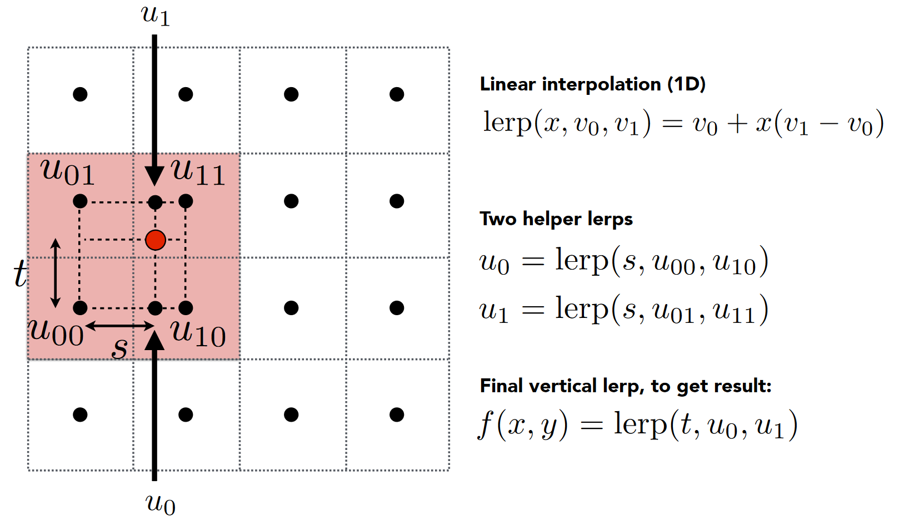

# Welcome to Jin blog

> 写了这么久本地的笔记了, 该分享出来了! ~~(来自半年前的自己)~~

这是亦瑾的个人博客, 持续更新中!

## About Me

- FZU SOSD web 组成员
- Hub 主页:

  - [yJader (亦瑾) (github.com)](https://github.com/yJader)
  - [亦瑾 (yJader) (Gitee.com)](https://gitee.com/yJader)

- 常用语言: `Java`, `Cpp`
- 学习方向:

  - Java 后端开发: `SpringBoot`, `MySQL`, `SpringSecurity`
  - System(广义): `RSICV`, `CS15-213`, `6.S081`(ing), `CS143`

- 臭看动画的 & 中 V 日 V 双厨

## Friend Link

- [茉莉花 molihua](https://molihua.wiki/)
- [RockRockWhite's wonderland](https://www.rockrockwhite.cn/categories/distributed%20system)

## test

$A\cap B$

$$A\cap B$$

$$
\LaTeX
$$

- 

测试: 

1. 与运算（AND） $F=A \cdot B$ 或者 $F=A \land B$
   - 也称为逻辑乘
   - 逻辑符号 : 
