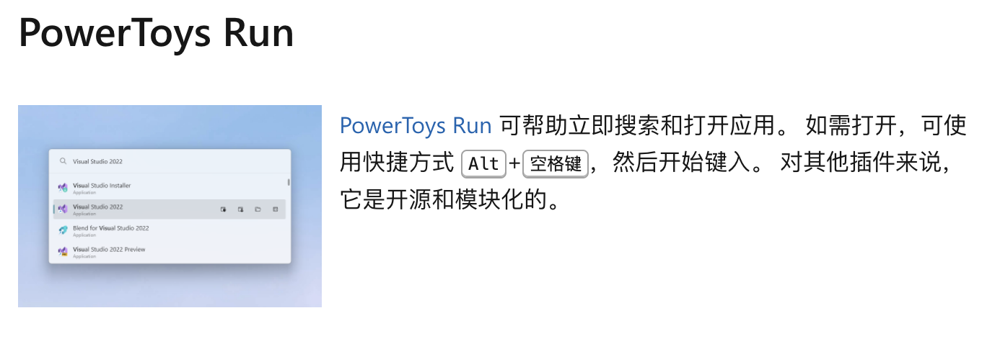

# Windows装机小贴士

## 网络环境

**请自行了解, 这是一切的前提**

虽然可以通过配镜像来解决, 但是过于复杂(每个软件都要试一次), 而且镜像有概率挂掉([Docker镜像事件](https://www.bilibili.com/read/cv35212311/?jump_opus=1))

- 不配镜像, 在碰到bug的时候能少考虑一个因素

## Scoop

> A command-line installer for Windows -- [Scoop](https://scoop.sh/)

在Windows环境下实现通过**命令行**进行常用软件的安装, 自动配置环境变量!

- 能够支持许多的常用软件(java, python, nodejs, QQ, wechat...)
  - 应该还可以下steam*~~(管家)~~*, 可以试试
  - 今后换机可以先下这个, 快速装机! 
- 注: 已经装好的软件就不用卸了再用scoop重装一遍了, 能跑就行XD


### 安装流程

官方教程虽简单， 但是会默认在C盘用户目录下创建scoop文件夹，并在其中保存安装的软件， 显然不合适

```powershell
# 创建scoop文件夹 (今后的scoop以及安装的软件都会在这个文件夹内)
mkdir D:\scoop 

# 设置用户安装路径
$env:SCOOP='D:\scoop' 
[Environment]::SetEnvironmentVariable('USERSCOOP', $env:SCOOP, 'User') 

# 设置全局安装路径（需要管理员权限）
$env:SCOOP_GLOBAL='D:\scoop' 
[Environment]::SetEnvironmentVariable('SCOOP_GLOBAL', $env:SCOOP_GLOBAL, 'Machine') 

# 设置允许 PowerShell 执行本地脚本
Set-ExecutionPolicy RemoteSigned -Scope CurrentUser 

# 安装scoop
irm get.scoop.sh | iex 
```

### 使用例

加点拓展库

```shell
# 加点扩展库
scoop bucket add extras
```

安装

```shell
# 安装github client
scoop install gh

# 安装python (会自动配置环境变量)
scoop install python
```


## Utools

> [uTools官网 - 新一代效率工具平台](https://u.tools/)

Alt+Space 呼出搜索栏, 通过拼音/英文搜索电脑中已安装的软件, 快速启动

- 还可以安装一些实用插件
  - 如**变量翻译**： 输入变量中文名, 翻译为大驼峰/小驼峰/常量/下划线等格式的变量英文名

有一个[PowetToys](# PowerToys)的替代项[PowerToys Run](https://learn.microsoft.com/zh-cn/windows/powertoys/run), 功能相似, 还能搜索系统本地文件



## PowerToys

> [Microsoft PowerToys | Microsoft Learn](https://learn.microsoft.com/zh-cn/windows/powertoys/)

微软官方开发的一些实用小工具合集

- 软件来自Rock学长的推荐, 笔者暂时还没有使用过

### 安装流程

[安装 PowerToys | Microsoft Learn](https://learn.microsoft.com/zh-cn/windows/powertoys/install#installing-with-windows-package-manager)

同样可以用scoop安装

```shell
# 如果已经添加extras bucket可以忽略这条命令(重复输入也没有问题)
scoop bucket add extras
scoop install powertoys
```


## 文本编辑: Markdown

> [Markdown 教程](https://markdown.com.cn/)
>
> **Markdown**是一种轻量级**标记语言**，它以纯文本形式(*易读、易写、易更改*)编写文档，并最终以HTML格式发布。
>
> **Markdown**也可以理解为将以Markdown语法编写的语言转换成HTML内容的工具。

使用Markdown进行文本编辑也能够更好地结合Git进行版本管理

- 当然, 也有一些支持Markdown的富文本编辑工具(Notion), 但笔者没有用过QAQ, 欢迎PR补充

### 编辑器推荐

1. **Typora**：简洁易用，实时预览，支持多格式导出，适合高效写作。
   - 笔者在用的软件(我超爱!)。Typora的渲染引擎对语法限制过于宽泛&快捷键好用, 导致笔者不好转用其他软件.
   - 使用例--**课程实验报告撰写**: 不用再考虑word的字体/行距/段落格式...了!
     - 导出为Word: 安装Pandoc插件后可以导出.doc(Word)文件, 
     - 导出为PDF: [Keldos-Li/typora-latex-theme: 将Typora伪装成LaTeX的中文样式主题，本科生轻量级课程论文撰写的好帮手。](https://github.com/Keldos-Li/typora-latex-theme) 

3. **Obsidian**：强大的知识管理工具，支持双向链接和图谱视图。
   - Rock学长常用
   - 有十分丰富的开源插件生态

4.	**IDE+插件**: 便于写项目的时候简单记录 
   - **VS Code + Markdown插件**
   - **IDEA**: 似乎自带markdown渲染器

